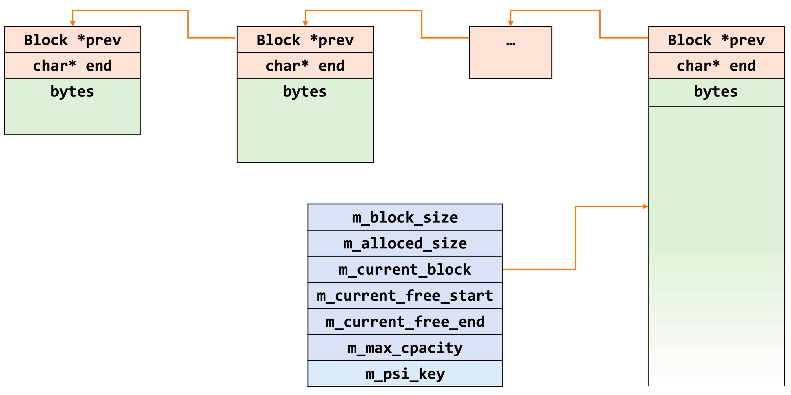

# mysql 内存分析
## 一、线程内存控制
### 1. 控制参数
```
mysql> show variables like "%connection_memory%";
+-----------------------------------+----------------------+
| Variable_name                     | Value                |
+-----------------------------------+----------------------+
| connection_memory_chunk_size      | 8912                 |
| connection_memory_limit           | 18446744073709551615 |
| global_connection_memory_limit    | 18446744073709551615 |
| global_connection_memory_tracking | OFF                  |
+-----------------------------------+----------------------+

```
### 2. 限制原理
1. 函数 `thd_prepare_connection` 初始化线程的时候，会开启一个内存占用的计数器`Thd_mem_cnt`
2. 函数 `do_command` 直线线程的命令前，会先更新全局计数器 `rc = thd->m_mem_cnt.reset()`,在这个函数里面，会把线程的内存使用量更新到全局计数器中，会根据`global_connection_memory_limit`参数进行总容量限制检查，可能会触发线程OOM报错。因此，global数据的更新总是滞后于session。
3. command执行过程中会有相关的内存申请以及释放操作，最后会调用统一的方法`my_malloc`/`allocate_from`以及`my_free`/`deallocate_from`，他们都会通过PFS_thread进行计数统计`pfs_memory_alloc_vc`/`pfs_memory_free_vc`。
4. 因此，小额内存有统一的统计申请入口
5. super用户不受这个限制，普通用户才有。
6. `connection_memory_chunk_size`的引入能够控制全局计数器的更新频率，减少锁的争用，但在该变量值设置的较大的情况下，容易提前报告OOM错误导致connection被kill
7. ToDo 存在单个do_command操作多次的alloc_cnt和free_cnt导致提前报告OOM错误的可能性（只执行free_cnt，但没有其他session做reset操作）
8. TODO OOM仍旧有可能在connnecion操作中产生，my_malloc/allocate_from阶段提前映射很小部分的物理内存，也可能刚好触发OOM

### 3. 线程内存的管理结构 MEM_ROOT


## 二、内存

http://mysql.taobao.org/monthly/2022/11/02/

### 1. os_event_t
大多数锁、互斥量的构建和初始化最终都会相应到os_event_t的构造，但是零散的、临时的mutex等并不会造成很大的内存压力。但是在buf_block_t的初始化中就有mutex和rw_lock的初始化，其生命周期和bp相当，数量和buf_block_t相等，会占据很大一部分内存.
<br>os_event_create的底层实现是调用了malloc的方式
* buf_block_init()
```
mutex_create()
    |->mutex_init()
        |->TTASEventMutex::init()
          |->os_event_create()
```
```
rw_lock_create()
    |->pfs_rw_lock_create_func()
    |->rw_lock_create_func()
        |->os_event_create()
```
