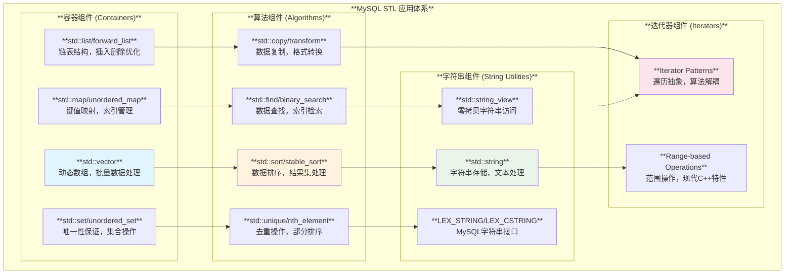
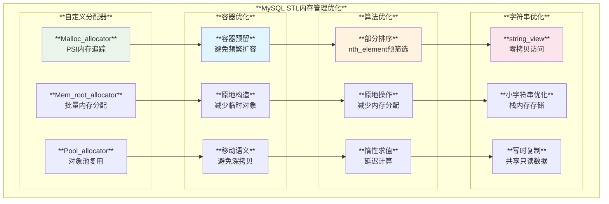
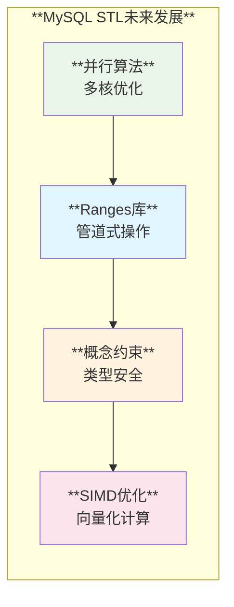

# MySQL STL 使用模式深度分析

## 概述

MySQL服务器大量使用C++标准模板库(STL)来实现高效的数据结构、算法和工具函数。从基础的容器类到复杂的算法应用，STL在MySQL中发挥着核心作用，展现了现代C++在系统软件开发中的强大威力。

**核心特性**：
- **高性能容器**：针对MySQL场景定制的STL容器
- **算法优化**：排序、查找、去重等核心算法
- **字符串处理**：std::string和string_view的广泛应用
- **内存管理集成**：与MySQL内存系统的深度整合
- **类型安全**：STL提供的编译时类型安全保证

## MySQL STL 应用架构

### 1. STL组件分类架构



### 2. MySQL STL应用统计矩阵

| **STL组件** | **使用频率** | **主要场景** | **性能影响** | **内存占用** | **维护复杂度** |
|------------|-------------|-------------|-------------|-------------|--------------|
| **std::vector** | ⭐⭐⭐⭐⭐ | 批量数据、缓冲区管理 | **极高** | **中等** | ⭐⭐ |
| **std::unordered_map** | ⭐⭐⭐⭐⭐ | 缓存、索引、查找表 | **极高** | **较高** | ⭐⭐⭐ |
| **std::string** | ⭐⭐⭐⭐⭐ | 文本处理、SQL解析 | **高** | **中等** | ⭐⭐ |
| **std::sort** | ⭐⭐⭐⭐ | 结果集排序、索引构建 | **极高** | **低** | ⭐⭐ |
| **std::map** | ⭐⭐⭐ | 有序存储、配置管理 | **高** | **较高** | ⭐⭐⭐ |
| **std::set** | ⭐⭐⭐ | 唯一性约束、集合运算 | **高** | **中等** | ⭐⭐ |
| **std::string_view** | ⭐⭐⭐ | 零拷贝字符串处理 | **极高** | **极低** | ⭐⭐ |
| **std::unique** | ⭐⭐ | 去重操作、结果集处理 | **高** | **低** | ⭐⭐ |

## 核心STL应用分析

### 1. 定制化STL容器系统

**源码位置**: `include/map_helpers.h:145-168`

```cpp
/// @brief 使用MySQL自定义分配器的std::map
template <class Key, class Value, class Compare = std::less<Key>>
using Map_myalloc =
    std::map<Key, Value, Compare, Map_allocator_type<Key, Value>>;

/// @brief 使用MySQL内存追踪的std::unordered_map
template <class Key, class Value, class Hash = std::hash<Key>,
          class KeyEqual = std::equal_to<Key>>
class malloc_unordered_map
    : public std::unordered_map<Key, Value, Hash, KeyEqual,
                                Malloc_allocator<std::pair<const Key, Value>>> {
 public:
  malloc_unordered_map(PSI_memory_key psi_key)
      : std::unordered_map<Key, Value, Hash, KeyEqual,
                           Malloc_allocator<std::pair<const Key, Value>>>(
            /*bucket_count=*/10, Hash(), KeyEqual(),
            Malloc_allocator<>(psi_key)) {}
};

/// @brief 支持排序规则的字符串映射
template <class Key, class Value>
class collation_unordered_map
    : public std::unordered_map<Key, Value, Collation_hasher,
                                Collation_key_equal,
                                Malloc_allocator<std::pair<const Key, Value>>> {
 public:
  collation_unordered_map(const CHARSET_INFO *cs, PSI_memory_key psi_key)
      : std::unordered_map<Key, Value, Collation_hasher, Collation_key_equal,
                           Malloc_allocator<std::pair<const Key, Value>>>(
            /*bucket_count=*/10, Collation_hasher(cs), Collation_key_equal(cs),
            Malloc_allocator<>(psi_key)) {}
};
```

**定制化特色**：
- **内存追踪集成**：通过PSI_memory_key实现内存使用监控
- **字符集感知**：支持MySQL字符集排序规则的哈希和比较
- **性能优化**：预设合理的bucket_count提升初始性能

### 2. 通用STL助手函数系统

**源码位置**: `include/map_helpers.h:53-80`

```cpp
/// @brief 容器查找助手 - 支持指针和智能指针
template <class Container, class Key>
static inline auto find_or_nullptr(const Container &container, const Key &key) {
  const auto it = container.find(key);
  if constexpr (std::is_pointer_v<typename Container::mapped_type>) {
    return it == container.end() ? nullptr : it->second;
  } else {
    return it == container.end() ? nullptr : it->second.get();
  }
}

/// @brief 多重映射中特定元素删除
template <class Container, class Value>
typename Container::iterator erase_specific_element(
    Container *container, const typename Container::key_type &key,
    const Value &value) {
  auto it_range = container->equal_range(key);
  for (auto it = it_range.first; it != it_range.second; ++it) {
    if constexpr (std::is_pointer_v<typename Container::mapped_type>) {
      if (it->second == value) return container->erase(it);
    } else {
      // 智能指针元素处理
      if (it->second.get() == value) return container->erase(it);
    }
  }
  return container->end();
}
```

**技术亮点**：
- **constexpr if**：C++17特性实现编译时分支
- **类型萃取**：`std::is_pointer_v`自动识别指针类型
- **模板通用性**：同时支持原始指针和智能指针

### 3. 线程安全的STL容器封装

**源码位置**: `sql/auth/auth_utility.h:36-107`

```cpp
/// @brief 带读写锁保护的Map容器
template <typename K, typename V>
class Map_with_rw_lock {
 public:
  Map_with_rw_lock(PSI_rwlock_key key) { mysql_rwlock_init(key, &m_lock); }
  ~Map_with_rw_lock() {
    m_map.clear();
    mysql_rwlock_destroy(&m_lock);
  }

  /// @brief 线程安全查找
  bool find(const K &key, V &value) {
    rwlock_scoped_lock rdlock(&m_lock, false, __FILE__, __LINE__);
    const auto search_itr = m_map.find(key);
    if (search_itr != m_map.end()) {
      value = search_itr->second;
      return true;
    }
    return false;
  }

  /// @brief 线程安全插入
  bool insert(K key, V value) {
    rwlock_scoped_lock wrlock(&m_lock, true, __FILE__, __LINE__);
    auto returns = m_map.insert(std::make_pair(key, value));
    return returns.second;
  }

  /// @brief 线程安全删除
  void erase(K key) {
    rwlock_scoped_lock wrlock(&m_lock, true, __FILE__, __LINE__);
    m_map.erase(key);
  }

 private:
  std::map<K, V> m_map;
  mysql_rwlock_t m_lock;
};
```

**并发设计**：
- **RAII锁管理**：`rwlock_scoped_lock`自动管理锁生命周期
- **读写分离**：查找操作使用读锁，修改操作使用写锁
- **异常安全**：RAII保证异常情况下锁的正确释放

### 4. 高性能排序算法应用

**源码位置**: `sql/filesort_utils.cc:42-48`和`132-214`

```cpp
// STL算法的using声明
using std::max;
using std::min;
using std::nth_element;
using std::sort;
using std::stable_sort;
using std::unique;
using std::vector;

size_t Filesort_buffer::sort_buffer(size_t num_input_rows, size_t max_output_rows) {
  // 性能优化：对于小结果集使用nth_element预筛选
  const bool prefilter_nth_element =
      max_output_rows < num_input_rows / 2 && !param->m_remove_duplicates;
  
  if (param->using_varlen_keys()) {
    const Mem_compare_varlen_key comp(param->local_sortorder, param->use_hash);
    if (prefilter_nth_element) {
      // O(n)复杂度的部分排序
      nth_element(it_begin, it_begin + max_output_rows - 1, it_end, comp);
      it_end = it_begin + max_output_rows;
    }
    // 完整排序
    sort(it_begin, it_end, comp);
    
    if (param->m_remove_duplicates) {
      // 去重操作
      num_input_rows = unique(it_begin, it_end,
                              Equality_from_less<Mem_compare_varlen_key>(comp)) -
                       it_begin;
    }
  }
  
  // 小数据集优化：避免stable_sort的额外开销
  if (num_input_rows <= 100) {
    sort(it_begin, it_end, Mem_compare(key_len));
  } else {
    stable_sort(it_begin, it_end, Mem_compare(key_len));
  }
  
  return std::min(num_input_rows, max_output_rows);
}
```

**算法优化策略**：
- **分阶段排序**：`nth_element` + `sort` 组合优化LIMIT查询
- **算法选择**：根据数据规模选择`sort`或`stable_sort`
- **复杂度优化**：从O(n log n)优化到O(n + k log k)

### 5. STL容器在数据比较中的应用

**源码位置**: `sql/item_cmpfunc.cc:4535-4578`

```cpp
/// @brief 长整数比较函数对象
class Cmp_longlong {
 public:
  bool operator()(const in_longlong::packed_longlong &a,
                  const in_longlong::packed_longlong &b) {
    return cmp_longlong(&a, &b) < 0;
  }
};

/// @brief 使用STL算法进行数组排序
void in_longlong::sort_array() {
  std::sort(base.begin(), base.begin() + m_used_size, Cmp_longlong());
}

/// @brief 使用STL二分查找
bool in_longlong::find_item(Item *item) {
  if (m_used_size == 0) return false;
  packed_longlong result;
  val_item(item, &result);
  if (item->null_value) return false;
  return std::binary_search(base.begin(), base.begin() + m_used_size, result,
                            Cmp_longlong());
}

/// @brief 行比较的函数对象
class Cmp_row {
 public:
  bool operator()(const cmp_item_row *a, const cmp_item_row *b) {
    return a->compare(b) < 0;
  }
};

void in_row::sort_array() {
  std::sort(base_pointers.begin(), base_pointers.begin() + m_used_size,
            Cmp_row());
}

bool in_row::find_item(Item *item) {
  if (m_used_size == 0) return false;
  tmp->store_value(item);
  if (item->null_value) return false;
  return std::binary_search(base_pointers.begin(),
                            base_pointers.begin() + m_used_size, tmp.get(),
                            Cmp_row());
}
```

**数据处理模式**：
- **函数对象封装**：将复杂比较逻辑封装为STL兼容的函数对象
- **算法组合**：`sort` + `binary_search` 实现高效的IN查询优化
- **类型特化**：针对不同数据类型（长整数、行记录）提供专门实现

### 6. 字符串处理的STL应用

**源码位置**: `include/lex_string.h:50-64`和`include/sql_string.h:665-693`

```cpp
/// @brief LEX_STRING到std::string的转换
static inline std::string to_string(const LEX_STRING &str) {
  return std::string(str.str, str.length);
}

static inline std::string to_string(const LEX_CSTRING &str) {
  return std::string(str.str, str.length);
}

/// @brief 零拷贝的string_view转换
static inline std::string_view to_string_view(LEX_STRING str) {
  return std::string_view{str.str, str.length};
}

static inline std::string_view to_string_view(LEX_CSTRING str) {
  return std::string_view{str.str, str.length};
}

/// @brief String类的std::string转换
static inline std::string to_string(const String &str) {
  return std::string(str.ptr(), str.length());
}

/// @brief 模板化的字符串缓冲区
template <size_t buff_sz>
class StringBuffer : public String {
  char buff[buff_sz];
 public:
  StringBuffer() : String(buff, buff_sz, &my_charset_bin) { length(0); }
  explicit StringBuffer(const CHARSET_INFO *cs) : String(buff, buff_sz, cs) {
    length(0);
  }
};
```

**字符串优化特性**：
- **零拷贝访问**：`std::string_view`避免不必要的内存分配
- **栈缓冲区优化**：`StringBuffer`模板提供栈分配的字符串缓冲
- **字符集感知**：与MySQL字符集系统深度集成

## 高级STL应用模式

### 1. 客户端测试中的STL使用

**源码位置**: `client/mysqltest.cc:11563-11617`

```cpp
void do_sort_result(DYNAMIC_STRING *ds, DYNAMIC_STRING *ds_input,
                    int start_sort_column) {
  std::vector<std::string> sorted;
  
  // 逐行解析并存储到vector
  size_t first_unsorted_row = 0;
  while (start < end) {
    char *line_end = (char *)start;
    while (*line_end != '\n') line_end++;
    *line_end = 0;

    std::string result_row = std::string(start, line_end - start);
    
    // 部分排序支持：按前缀分组排序
    if (!sorted.empty() && start_sort_column > 0) {
      size_t prev_line_prefix_len =
          length_of_n_first_columns(sorted.back(), start_sort_column);
      if (sorted.back().compare(0, prev_line_prefix_len, result_row, 0,
                                prev_line_prefix_len) != 0) {
        std::sort(sorted.begin() + first_unsorted_row, sorted.end());
        first_unsorted_row = sorted.size();
      }
    }

    sorted.push_back(result_row);
    start = line_end + 1;
  }

  // 最终排序
  std::stable_sort(sorted.begin() + first_unsorted_row, sorted.end());

  // 输出结果
  for (auto i : sorted) {
    dynstr_append_mem(ds, i.c_str(), i.length());
    dynstr_append(ds, "\n");
  }
}
```

**测试工具特色**：
- **分组排序**：支持按列前缀进行分组内排序
- **稳定排序**：使用`stable_sort`保持相等元素的相对顺序
- **范围循环**：现代C++的`for (auto i : sorted)`语法

### 2. STL在MySQL字符串服务中的应用

**源码位置**: `sql/server_component/mysql_string_service.cc:460-512`

```cpp
/// @brief 字符串子串操作
DEFINE_BOOL_METHOD(mysql_string_imp::substring,
                   (my_h_string in_string, size_t offset, size_t count,
                    my_h_string *out_string)) {
  String *out_str_obj = nullptr;
  try {
    String *in_str_obj = from_api(in_string);
    out_str_obj = new String[1];
    *out_str_obj = in_str_obj->substr(offset, count);  // STL风格的substr
    *out_string = (my_h_string)out_str_obj;
    return false;
  } catch (...) {
    if (out_str_obj != nullptr) delete[] out_str_obj;
    mysql_components_handle_std_exception(__func__);
  }
  return true;
}

/// @brief 字符串比较操作
DEFINE_BOOL_METHOD(mysql_string_imp::compare,
                   (my_h_string s1, my_h_string s2, int *cmp)) {
  try {
    String *str1 = from_api(s1);
    String *str2 = from_api(s2);
    const CHARSET_INFO *cs = str1->charset();
    *cmp = sortcmp(str1, str2, cs);  // 字符集感知的比较
    return false;
  } catch (...) {
    mysql_components_handle_std_exception(__func__);
  }
  return true;
}
```

**服务组件特色**：
- **异常安全**：完整的异常处理和资源清理
- **API封装**：将内部String类型封装为组件API
- **字符集集成**：保持MySQL字符集语义的一致性

### 3. 路由器中的STL应用

**源码位置**: `router/src/routing/tests/mysql_client.h:124-151`

```cpp
/// @brief 字符串参数绑定类
class StringParam : public MYSQL_BIND {
 public:
  constexpr StringParam(const std::string_view sv)
      : MYSQL_BIND{
            nullptr,                                // length
            nullptr,                                // is_null,
            const_cast<char *>(sv.data()),          // buffer
            nullptr,                                // error
            nullptr,                                // row_ptr
            nullptr,                                // store_param_func
            nullptr,                                // fetch_result
            nullptr,                                // skip_result
            static_cast<unsigned long>(sv.size()),  // buffer_length
            0,                                      // offset
            0,                                      // length_value
            // ... 其他字段初始化
            FIELD_TYPE_STRING,                      // buffer_type
            false,                                  // error_value
            false,                                  // is_unsigned
            false,                                  // long_data_used
            false,                                  // is_null_value
            nullptr,                                // extension
        } {}
};
```

**路由器特色**：
- **constexpr构造**：编译时构造函数优化
- **string_view集成**：零拷贝的字符串参数传递
- **C结构封装**：将STL类型无缝集成到C API

## STL性能优化架构

### 1. 内存管理优化模式



### 2. 算法选择策略矩阵

| **数据规模** | **有序性要求** | **稳定性要求** | **推荐算法** | **复杂度** | **内存开销** |
|-------------|---------------|---------------|-------------|-----------|-------------|
| **< 100** | 无 | 无 | `std::sort` | O(n log n) | **低** |
| **< 100** | 无 | 有 | `std::stable_sort` | O(n log n) | **中** |
| **> 100** | 无 | 无 | `std::sort` | O(n log n) | **低** |
| **> 100** | 无 | 有 | `std::stable_sort` | O(n log n) | **高** |
| **LIMIT小** | 无 | 无 | `nth_element` + `sort` | O(n + k log k) | **低** |
| **查找** | 已排序 | 无 | `std::binary_search` | O(log n) | **极低** |
| **去重** | 已排序 | 无 | `std::unique` | O(n) | **极低** |

### 3. 容器选择指导原则

#### 3.1 性能关键路径选择

```cpp
// ✅ 推荐：频繁随机访问
std::vector<Record> records;
records.reserve(expected_size);  // 预分配空间

// ✅ 推荐：频繁查找操作
malloc_unordered_map<Key, Value> cache(psi_key);

// ✅ 推荐：有序遍历需求
std::map<Key, Value> ordered_data;

// ✅ 推荐：零拷贝字符串处理
std::string_view process_string(const LEX_CSTRING& str) {
  return to_string_view(str);  // 零拷贝转换
}
```

#### 3.2 内存敏感场景优化

```cpp
// ✅ 推荐：小字符串栈存储
StringBuffer<256> temp_buffer;

// ✅ 推荐：内存池分配
Mem_root_allocator<T> pool_alloc(mem_root);
std::vector<T, Mem_root_allocator<T>> pooled_vector(pool_alloc);

// ✅ 推荐：智能指针减少内存泄漏
unique_ptr_my_free<char> buffer(static_cast<char*>(my_malloc(...)));
```

## STL最佳实践总结

### 1. 容器使用指导

#### 性能优先原则
- **预分配容量**：使用`reserve()`避免频繁重新分配
- **原地构造**：优先使用`emplace_back()`而非`push_back()`
- **移动语义**：充分利用C++11的移动构造和移动赋值

#### 内存安全原则
- **RAII管理**：使用智能指针和容器自动管理资源
- **异常安全**：确保异常情况下的资源正确释放
- **边界检查**：使用`at()`而非`[]`进行安全访问

### 2. 算法优化策略

#### 复杂度优化
- **部分排序**：使用`nth_element`优化LIMIT查询
- **算法组合**：`sort` + `binary_search` + `unique`的高效组合
- **惰性求值**：延迟计算和按需处理

#### 并发安全
- **读写锁**：`Map_with_rw_lock`模式保护共享容器
- **无锁设计**：使用`std::atomic`和lock-free数据结构
- **线程局部存储**：避免全局状态的竞争

### 3. 字符串处理优化

#### 零拷贝优化
- **string_view使用**：避免不必要的字符串复制
- **原地操作**：直接在缓冲区中进行字符串操作
- **引用传递**：使用`const std::string&`避免拷贝

#### 字符集集成
- **MySQL字符集**：与`CHARSET_INFO`系统无缝集成
- **排序规则**：支持各种字符集的比较和排序
- **编码转换**：自动处理不同字符编码间的转换

## MySQL STL发展趋势

### 1. 现代C++特性采用

| **C++版本** | **新STL特性** | **MySQL中的应用** | **性能提升** |
|------------|---------------|------------------|-------------|
| **C++11** | move语义、emplace | 容器优化、智能指针 | ⭐⭐⭐⭐ |
| **C++14** | make_unique、泛型lambda | 内存管理、算法封装 | ⭐⭐⭐ |
| **C++17** | string_view、并行算法 | 零拷贝、并发优化 | ⭐⭐⭐⭐⭐ |
| **C++20** | ranges、概念 | 类型约束、算法抽象 | ⭐⭐⭐⭐⭐ |

### 2. 未来优化方向



## 总结

MySQL在STL使用上展现了现代C++的最佳实践：

### 🚀 **核心亮点**

1. **深度定制化**：针对MySQL需求定制的STL容器和算法
2. **性能优化导向**：通过算法选择和内存管理优化实现极致性能
3. **类型安全保证**：充分利用STL的编译时类型检查
4. **现代C++集成**：积极采用C++11/14/17的新特性

### 📈 **应用价值**

- **开发效率**：STL提供的丰富算法和容器大幅提升开发效率
- **代码质量**：标准化的接口和行为提升代码的可读性和维护性
- **性能保证**：经过高度优化的STL实现保证系统性能
- **内存安全**：RAII和智能指针减少内存泄漏风险

MySQL的STL使用模式为大型C++项目提供了优秀的参考范例，展示了如何在保证性能的同时充分利用STL的强大功能。
