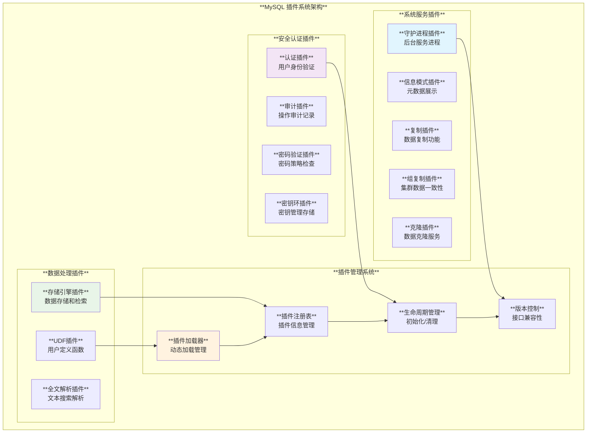
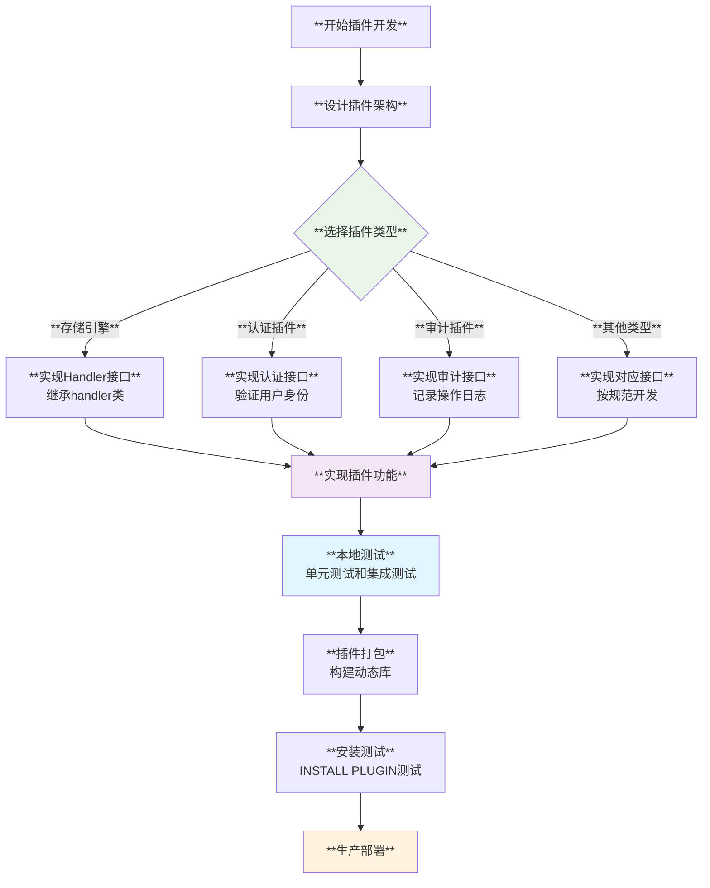

# MySQL 插件系统实现深度分析

## 概述

MySQL插件系统是一个高度模块化和可扩展的架构，允许在不修改核心服务器代码的情况下添加新功能。通过定义标准化的插件接口、生命周期管理机制和动态加载能力，MySQL支持12种不同类型的插件，涵盖存储引擎、认证、审计、复制等核心功能领域。

**核心特性**：
- **多类型插件支持**：存储引擎、UDF、认证、审计等12种插件类型
- **标准化接口**：统一的插件描述结构和生命周期管理
- **动态加载机制**：运行时安装和卸载插件的能力
- **版本兼容性**：接口版本控制确保插件兼容性
- **系统集成**：插件变量和状态指标的无缝集成

## MySQL 插件系统架构体系

### 1. 插件类型分层架构



## 插件系统核心实现

### 1. 插件类型定义和接口

**源码位置**: `include/mysql/plugin.h:114-131`

```cpp
/// @brief MySQL插件系统核心定义
#define MYSQL_PLUGIN_INTERFACE_VERSION 0x010B

/// @brief 支持的插件类型枚举
#define MYSQL_UDF_PLUGIN 0                /* 用户定义函数插件 */
#define MYSQL_STORAGE_ENGINE_PLUGIN 1     /* 存储引擎插件 */
#define MYSQL_FTPARSER_PLUGIN 2           /* 全文解析插件 */
#define MYSQL_DAEMON_PLUGIN 3             /* 守护进程插件 */
#define MYSQL_INFORMATION_SCHEMA_PLUGIN 4 /* 信息模式插件 */
#define MYSQL_AUDIT_PLUGIN 5              /* 审计插件 */
#define MYSQL_REPLICATION_PLUGIN 6        /* 复制插件 */
#define MYSQL_AUTHENTICATION_PLUGIN 7     /* 认证插件 */
#define MYSQL_VALIDATE_PASSWORD_PLUGIN 8  /* 密码验证插件 */
#define MYSQL_GROUP_REPLICATION_PLUGIN 9  /* 组复制插件 */
#define MYSQL_KEYRING_PLUGIN 10           /* 密钥环插件 */
#define MYSQL_CLONE_PLUGIN 11             /* 克隆插件 */
#define MYSQL_MAX_PLUGIN_TYPE_NUM 12      /* 插件类型总数 */

/// @brief 插件许可证类型
#define PLUGIN_LICENSE_PROPRIETARY 0
#define PLUGIN_LICENSE_GPL 1
#define PLUGIN_LICENSE_BSD 2

#define PLUGIN_LICENSE_PROPRIETARY_STRING "PROPRIETARY"
#define PLUGIN_LICENSE_GPL_STRING "GPL"
#define PLUGIN_LICENSE_BSD_STRING "BSD"

#define PLUGIN_AUTHOR_ORACLE "Oracle Corporation"
```

### 2. 插件描述结构体

**源码位置**: `include/mysql/plugin.h:655-673`

```cpp
/// @brief 插件描述结构体 - 插件系统的核心数据结构
struct st_mysql_plugin {
  int type;                    /*!< 插件类型 (MYSQL_XXX_PLUGIN值) */
  void *info;                  /*!< 指向类型特定的插件描述符 */
  const char *name;            /*!< 插件名称 */
  const char *author;          /*!< 插件作者 (用于I_S.PLUGINS) */
  const char *descr;           /*!< 一般描述性文本 */
  int license;                 /*!< 插件许可证 (PLUGIN_LICENSE_XXX) */
  
  /// @brief 插件生命周期函数
  int (*init)(MYSQL_PLUGIN);   /*!< 插件加载时调用的函数 */
  int (*check_uninstall)(MYSQL_PLUGIN); /*!< 插件卸载检查函数 */
  int (*deinit)(MYSQL_PLUGIN); /*!< 插件卸载时调用的函数 */
  
  unsigned int version;        /*!< 插件版本号 */
  SHOW_VAR *status_vars;       /*!< 状态变量数组 */
  SYS_VAR **system_vars;       /*!< 系统变量数组 */
  void *__reserved1;           /*!< 为依赖检查保留 */
  unsigned long flags;         /*!< 插件标志 */
};
```

### 3. 插件声明宏系统

**源码位置**: `include/mysql/plugin.h:149-174`

```cpp
/// @brief 插件声明宏系统 - 支持静态和动态插件
#ifndef MYSQL_DYNAMIC_PLUGIN
/// @brief 静态插件声明宏
#define __MYSQL_DECLARE_PLUGIN                                       \
  MYSQL_PLUGIN_EXPORT int VERSION = MYSQL_PLUGIN_INTERFACE_VERSION; \
  MYSQL_PLUGIN_EXPORT int PSIZE = sizeof(struct st_mysql_plugin);   \
  MYSQL_PLUGIN_EXPORT struct st_mysql_plugin DECLS[] = {

#else
/// @brief 动态插件声明宏
#define __MYSQL_DECLARE_PLUGIN(NAME, VERSION, PSIZE, DECLS)  \
  MYSQL_PLUGIN_EXPORT int _mysql_plugin_interface_version_ = \
      MYSQL_PLUGIN_INTERFACE_VERSION;                        \
  MYSQL_PLUGIN_EXPORT int _mysql_sizeof_struct_st_plugin_ =  \
      sizeof(struct st_mysql_plugin);                        \
  MYSQL_PLUGIN_EXPORT struct st_mysql_plugin _mysql_plugin_declarations_[] = {
#endif

/// @brief 插件声明开始宏
#define mysql_declare_plugin(NAME)                                        \
  __MYSQL_DECLARE_PLUGIN(NAME, builtin_##NAME##_plugin_interface_version, \
                         builtin_##NAME##_sizeof_struct_st_plugin,        \
                         builtin_##NAME##_plugin)

/// @brief 插件声明结束宏
#define mysql_declare_plugin_end                                            \
  , {                                                                       \
    0, nullptr, nullptr, nullptr, nullptr, 0, nullptr, nullptr, nullptr, 0, \
        nullptr, nullptr, nullptr, 0                                        \
  }                                                                         \
  }
```

#### 插件声明应用示例

```cpp
/// @brief MySQL插件声明的实际应用示例
namespace mysql_plugin_examples {

/// @brief 自定义存储引擎插件示例
class MyCustomStorageEngine {
public:
  // 存储引擎特定的实现...
};

/// @brief 插件初始化函数
static int my_storage_engine_init(MYSQL_PLUGIN plugin_info) {
  // 插件初始化逻辑
  
  // 1. 初始化存储引擎资源
  if (!initialize_engine_resources()) {
    return 1;  // 初始化失败
  }
  
  // 2. 注册存储引擎处理器
  if (register_storage_engine_handlers()) {
    return 1;  // 注册失败
  }
  
  // 3. 设置插件状态
  set_plugin_status("Initialized successfully");
  
  return 0;  // 成功
}

/// @brief 插件卸载检查函数
static int my_storage_engine_check_uninstall(MYSQL_PLUGIN plugin_info) {
  // 检查是否有表正在使用此存储引擎
  if (has_active_tables()) {
    return 1;  // 不允许卸载
  }
  
  return 0;  // 允许卸载
}

/// @brief 插件清理函数
static int my_storage_engine_deinit(MYSQL_PLUGIN plugin_info) {
  // 1. 清理存储引擎资源
  cleanup_engine_resources();
  
  // 2. 注销处理器
  unregister_storage_engine_handlers();
  
  // 3. 释放内存
  cleanup_memory();
  
  return 0;  // 清理成功
}

/// @brief 系统变量定义
static MYSQL_SYSVAR_ULONG(buffer_size, buffer_size_value,
                          PLUGIN_VAR_RQCMDARG,
                          "Buffer size for the storage engine",
                          nullptr, nullptr, 8192, 1024, 65536, 0);

static MYSQL_SYSVAR_STR(data_dir, data_directory,
                        PLUGIN_VAR_RQCMDARG | PLUGIN_VAR_MEMALLOC,
                        "Data directory for the storage engine",
                        nullptr, nullptr, "/var/lib/mysql/myengine");

static SYS_VAR* my_storage_engine_system_vars[] = {
  MYSQL_SYSVAR(buffer_size),
  MYSQL_SYSVAR(data_dir),
  nullptr
};

/// @brief 状态变量定义
static SHOW_VAR my_storage_engine_status_vars[] = {
  {"myengine_tables_created", (char*)&tables_created_count, SHOW_LONG, SHOW_SCOPE_GLOBAL},
  {"myengine_rows_inserted", (char*)&rows_inserted_count, SHOW_LONGLONG, SHOW_SCOPE_GLOBAL},
  {"myengine_buffer_usage", (char*)&buffer_usage_percent, SHOW_DOUBLE, SHOW_SCOPE_GLOBAL},
  {nullptr, nullptr, SHOW_UNDEF, SHOW_SCOPE_UNDEF}
};

/// @brief 存储引擎处理器结构
static st_mysql_storage_engine my_storage_engine_descriptor = {
  MYSQL_HANDLERTON_INTERFACE_VERSION
};

/// @brief 插件声明 - 使用标准宏
mysql_declare_plugin(my_storage_engine) {
  MYSQL_STORAGE_ENGINE_PLUGIN,           // 插件类型
  &my_storage_engine_descriptor,         // 插件信息指针
  "MY_STORAGE_ENGINE",                   // 插件名称
  "My Company",                          // 作者
  "Custom storage engine for specific use cases", // 描述
  PLUGIN_LICENSE_GPL,                    // 许可证
  my_storage_engine_init,                // 初始化函数
  my_storage_engine_check_uninstall,     // 卸载检查函数
  my_storage_engine_deinit,              // 清理函数
  0x0100,                                // 版本 1.0
  my_storage_engine_status_vars,         // 状态变量
  my_storage_engine_system_vars,         // 系统变量
  nullptr,                               // 保留字段
  0,                                     // 标志
} mysql_declare_plugin_end;

/// @brief 辅助函数实现
bool initialize_engine_resources() {
  // 初始化逻辑实现
  return true;
}

bool register_storage_engine_handlers() {
  // 处理器注册逻辑
  return false;  // 示例返回失败
}

void set_plugin_status(const char* status) {
  // 设置插件状态
}

bool has_active_tables() {
  // 检查活动表
  return false;
}

void cleanup_engine_resources() {
  // 资源清理
}

void unregister_storage_engine_handlers() {
  // 处理器注销
}

void cleanup_memory() {
  // 内存清理
}

// 全局变量定义
static ulong buffer_size_value = 8192;
static char* data_directory = nullptr;
static long tables_created_count = 0;
static longlong rows_inserted_count = 0;
static double buffer_usage_percent = 0.0;

}  // namespace mysql_plugin_examples
```

## 插件管理系统

### 1. 插件加载和初始化

**源码位置**: `sql/sql_plugin.cc:1299-1352`

```cpp
/// @brief 插件初始化核心流程
static int plugin_initialize(st_plugin_int *plugin) {
  int ret = 1;
  DBUG_TRACE;

  mysql_mutex_assert_owner(&LOCK_plugin);
  uint state = plugin->state;
  assert(state == PLUGIN_IS_UNINITIALIZED);

  mysql_mutex_unlock(&LOCK_plugin);
  mysql_rwlock_unlock(&LOCK_system_variables_hash);

  DEBUG_SYNC(current_thd, "in_plugin_initialize");

  // 调用类型特定的初始化函数
  if (plugin_type_initialize[plugin->plugin->type]) {
    if ((*plugin_type_initialize[plugin->plugin->type])(plugin)) {
      LogErr(ERROR_LEVEL, ER_PLUGIN_REGISTRATION_FAILED, plugin->name.str,
             plugin_type_names[plugin->plugin->type].str);
      goto err;
    }
  } else if (plugin->plugin->init) {
    // 调用插件自定义的初始化函数
    if (plugin->plugin->init(plugin)) {
      LogErr(ERROR_LEVEL, ER_PLUGIN_INIT_FAILED, plugin->name.str);
      goto err;
    }
  }
  
  state = PLUGIN_IS_READY;  // 插件初始化成功

  // 添加状态变量
  if (plugin->plugin->status_vars) {
    if (add_status_vars(plugin->plugin->status_vars)) goto err;
  }

  // 设置插件系统变量的plugin属性
  if (plugin->system_vars) {
    sys_var_pluginvar *var = plugin->system_vars->cast_pluginvar();
    for (;;) {
      var->plugin = plugin;
      if (!var->next) break;
      var = var->next->cast_pluginvar();
    }
  }

  ret = 0;

err:
  mysql_rwlock_wrlock(&LOCK_system_variables_hash);
  mysql_mutex_lock(&LOCK_plugin);
  plugin->state = state;

  return ret;
}
```

### 2. 插件类型注册表

**源码位置**: `sql/sql_plugin.cc:350-392`

```cpp
/// @brief 插件类型名称映射表
const LEX_CSTRING plugin_type_names[MYSQL_MAX_PLUGIN_TYPE_NUM] = {
  {STRING_WITH_LEN("UDF")},
  {STRING_WITH_LEN("STORAGE ENGINE")},
  {STRING_WITH_LEN("FTPARSER")},
  {STRING_WITH_LEN("DAEMON")},
  {STRING_WITH_LEN("INFORMATION SCHEMA")},
  {STRING_WITH_LEN("AUDIT")},
  {STRING_WITH_LEN("REPLICATION")},
  {STRING_WITH_LEN("AUTHENTICATION")},
  {STRING_WITH_LEN("VALIDATE PASSWORD")},
  {STRING_WITH_LEN("GROUP REPLICATION")},
  {STRING_WITH_LEN("KEYRING")},
  {STRING_WITH_LEN("CLONE")}
};

/// @brief 插件类型初始化函数表
plugin_type_init plugin_type_initialize[MYSQL_MAX_PLUGIN_TYPE_NUM] = {
  nullptr,                     // UDF
  ha_initialize_handlerton,    // STORAGE ENGINE
  nullptr,                     // FTPARSER
  nullptr,                     // DAEMON
  initialize_schema_table,     // INFORMATION SCHEMA
  initialize_audit_plugin,     // AUDIT
  nullptr,                     // REPLICATION
  nullptr,                     // AUTHENTICATION
  nullptr                      // VALIDATE PASSWORD
};

/// @brief 插件类型清理函数表
plugin_type_init plugin_type_deinitialize[MYSQL_MAX_PLUGIN_TYPE_NUM] = {
  nullptr,                     // UDF
  ha_finalize_handlerton,      // STORAGE ENGINE
  nullptr,                     // FTPARSER
  nullptr,                     // DAEMON
  finalize_schema_table,       // INFORMATION SCHEMA
  finalize_audit_plugin,       // AUDIT
  nullptr,                     // REPLICATION
  nullptr,                     // AUTHENTICATION
  nullptr                      // VALIDATE PASSWORD
};
```

#### 插件管理系统应用示例

```cpp
/// @brief MySQL插件管理系统的实际应用
namespace mysql_plugin_management {

/// @brief 插件管理器类
class PluginManager {
public:
  /// @brief 插件状态枚举
  enum class PluginState {
    UNINITIALIZED = 0,
    INITIALIZING = 1,
    READY = 2,
    UNINSTALLING = 3,
    DELETED = 4
  };
  
  /// @brief 插件信息结构
  struct PluginInfo {
    std::string name;
    int type;
    PluginState state;
    std::string version;
    std::string author;
    std::string description;
    void* handle;  // 动态库句柄
  };

  /// @brief 安装插件
  bool install_plugin(const std::string& plugin_name, const std::string& soname) {
    DBUG_TRACE;
    
    // 1. 检查插件是否已存在
    if (find_plugin(plugin_name)) {
      LogErr(ERROR_LEVEL, ER_PLUGIN_ALREADY_EXISTS, plugin_name.c_str());
      return false;
    }
    
    // 2. 加载动态库
    void* handle = load_plugin_library(soname);
    if (!handle) {
      LogErr(ERROR_LEVEL, ER_PLUGIN_CANT_LOAD_LIBRARY, soname.c_str());
      return false;
    }
    
    // 3. 获取插件符号
    st_mysql_plugin* plugin_decl = get_plugin_declarations(handle);
    if (!plugin_decl) {
      LogErr(ERROR_LEVEL, ER_PLUGIN_NO_DECLARATIONS, soname.c_str());
      unload_plugin_library(handle);
      return false;
    }
    
    // 4. 验证插件版本兼容性
    if (!check_plugin_version_compatibility(plugin_decl)) {
      LogErr(ERROR_LEVEL, ER_PLUGIN_VERSION_INCOMPATIBLE, plugin_name.c_str());
      unload_plugin_library(handle);
      return false;
    }
    
    // 5. 注册插件
    if (!register_plugin_internal(plugin_decl, handle)) {
      LogErr(ERROR_LEVEL, ER_PLUGIN_REGISTRATION_FAILED, plugin_name.c_str());
      unload_plugin_library(handle);
      return false;
    }
    
    // 6. 初始化插件
    if (!initialize_plugin_internal(plugin_name)) {
      LogErr(ERROR_LEVEL, ER_PLUGIN_INIT_FAILED, plugin_name.c_str());
      unregister_plugin_internal(plugin_name);
      unload_plugin_library(handle);
      return false;
    }
    
    LogErr(INFORMATION_LEVEL, ER_PLUGIN_INSTALLED_SUCCESSFULLY, plugin_name.c_str());
    return true;
  }
  
  /// @brief 卸载插件
  bool uninstall_plugin(const std::string& plugin_name) {
    DBUG_TRACE;
    
    // 1. 查找插件
    auto plugin_info = find_plugin(plugin_name);
    if (!plugin_info) {
      LogErr(ERROR_LEVEL, ER_PLUGIN_NOT_FOUND, plugin_name.c_str());
      return false;
    }
    
    // 2. 检查是否可以卸载
    if (!can_uninstall_plugin(plugin_info)) {
      LogErr(ERROR_LEVEL, ER_PLUGIN_CANT_UNINSTALL, plugin_name.c_str());
      return false;
    }
    
    // 3. 调用插件的卸载检查函数
    st_mysql_plugin* plugin_decl = get_plugin_declaration(plugin_info);
    if (plugin_decl->check_uninstall && 
        plugin_decl->check_uninstall(plugin_info)) {
      LogErr(ERROR_LEVEL, ER_PLUGIN_CHECK_UNINSTALL_FAILED, plugin_name.c_str());
      return false;
    }
    
    // 4. 清理插件
    if (!deinitialize_plugin_internal(plugin_name)) {
      LogErr(ERROR_LEVEL, ER_PLUGIN_DEINIT_FAILED, plugin_name.c_str());
      return false;
    }
    
    // 5. 注销插件
    unregister_plugin_internal(plugin_name);
    
    // 6. 卸载动态库
    unload_plugin_library(plugin_info->handle);
    
    // 7. 从插件表中删除记录
    remove_plugin_from_table(plugin_name);
    
    LogErr(INFORMATION_LEVEL, ER_PLUGIN_UNINSTALLED_SUCCESSFULLY, plugin_name.c_str());
    return true;
  }
  
  /// @brief 获取插件列表
  std::vector<PluginInfo> get_plugin_list() const {
    std::vector<PluginInfo> result;
    
    for (const auto& [name, info] : plugins_) {
      result.push_back(info);
    }
    
    return result;
  }
  
  /// @brief 获取特定类型的插件
  std::vector<PluginInfo> get_plugins_by_type(int plugin_type) const {
    std::vector<PluginInfo> result;
    
    for (const auto& [name, info] : plugins_) {
      if (info.type == plugin_type) {
        result.push_back(info);
      }
    }
    
    return result;
  }

private:
  std::unordered_map<std::string, PluginInfo> plugins_;
  std::mutex plugins_mutex_;
  
  PluginInfo* find_plugin(const std::string& name) {
    auto it = plugins_.find(name);
    return (it != plugins_.end()) ? &it->second : nullptr;
  }
  
  void* load_plugin_library(const std::string& soname) {
    // 实际实现需要使用dlopen/LoadLibrary
    return nullptr;
  }
  
  void unload_plugin_library(void* handle) {
    // 实际实现需要使用dlclose/FreeLibrary
  }
  
  st_mysql_plugin* get_plugin_declarations(void* handle) {
    // 获取插件声明符号
    return nullptr;
  }
  
  bool check_plugin_version_compatibility(st_mysql_plugin* plugin) {
    // 检查版本兼容性
    return true;
  }
  
  bool register_plugin_internal(st_mysql_plugin* plugin, void* handle) {
    // 内部插件注册逻辑
    return true;
  }
  
  bool initialize_plugin_internal(const std::string& name) {
    // 内部插件初始化逻辑
    return true;
  }
  
  bool can_uninstall_plugin(const PluginInfo* info) {
    // 检查插件是否可以卸载
    return true;
  }
  
  st_mysql_plugin* get_plugin_declaration(const PluginInfo* info) {
    // 获取插件声明
    return nullptr;
  }
  
  bool deinitialize_plugin_internal(const std::string& name) {
    // 内部插件清理逻辑
    return true;
  }
  
  void unregister_plugin_internal(const std::string& name) {
    // 内部插件注销逻辑
  }
  
  void remove_plugin_from_table(const std::string& name) {
    // 从mysql.plugin表中删除记录
  }
};

/// @brief 插件开发工具类
class PluginDevelopmentTools {
public:
  /// @brief 验证插件结构
  static bool validate_plugin_structure(const st_mysql_plugin* plugin) {
    if (!plugin) return false;
    
    // 1. 检查基本字段
    if (!plugin->name || strlen(plugin->name) == 0) {
      return false;
    }
    
    if (plugin->type < 0 || plugin->type >= MYSQL_MAX_PLUGIN_TYPE_NUM) {
      return false;
    }
    
    // 2. 检查必要的函数指针
    if (!plugin->init && !plugin->deinit) {
      // 至少需要一个生命周期函数
      return false;
    }
    
    // 3. 检查版本号
    if (plugin->version == 0) {
      return false;
    }
    
    return true;
  }
  
  /// @brief 生成插件模板代码
  static std::string generate_plugin_template(const std::string& plugin_name,
                                             int plugin_type) {
    std::stringstream ss;
    
    ss << "// Auto-generated plugin template for " << plugin_name << "\n\n";
    ss << "#include <mysql/plugin.h>\n\n";
    ss << "static int " << plugin_name << "_init(MYSQL_PLUGIN plugin_info) {\n";
    ss << "  // TODO: Add initialization code here\n";
    ss << "  return 0; // Success\n";
    ss << "}\n\n";
    ss << "static int " << plugin_name << "_deinit(MYSQL_PLUGIN plugin_info) {\n";
    ss << "  // TODO: Add cleanup code here\n";
    ss << "  return 0; // Success\n";
    ss << "}\n\n";
    ss << "mysql_declare_plugin(" << plugin_name << ") {\n";
    ss << "  " << plugin_type << ",  // Plugin type\n";
    ss << "  nullptr,              // Plugin info\n";
    ss << "  \"" << plugin_name << "\",  // Plugin name\n";
    ss << "  \"Your Name\",        // Author\n";
    ss << "  \"Plugin description\", // Description\n";
    ss << "  PLUGIN_LICENSE_GPL,   // License\n";
    ss << "  " << plugin_name << "_init,    // Init function\n";
    ss << "  nullptr,              // Check uninstall\n";
    ss << "  " << plugin_name << "_deinit,  // Deinit function\n";
    ss << "  0x0100,               // Version\n";
    ss << "  nullptr,              // Status variables\n";
    ss << "  nullptr,              // System variables\n";
    ss << "  nullptr,              // Reserved\n";
    ss << "  0                     // Flags\n";
    ss << "} mysql_declare_plugin_end;\n";
    
    return ss.str();
  }
  
  /// @brief 插件调试工具
  static void debug_plugin_info(const st_mysql_plugin* plugin) {
    if (!plugin) return;
    
    printf("Plugin Debug Info:\n");
    printf("  Name: %s\n", plugin->name ? plugin->name : "NULL");
    printf("  Type: %d (%s)\n", plugin->type, 
           get_plugin_type_name(plugin->type).c_str());
    printf("  Author: %s\n", plugin->author ? plugin->author : "NULL");
    printf("  Description: %s\n", plugin->descr ? plugin->descr : "NULL");
    printf("  Version: 0x%04X\n", plugin->version);
    printf("  License: %d\n", plugin->license);
    printf("  Init function: %s\n", plugin->init ? "Present" : "NULL");
    printf("  Deinit function: %s\n", plugin->deinit ? "Present" : "NULL");
    printf("  Check uninstall: %s\n", plugin->check_uninstall ? "Present" : "NULL");
    printf("  Status vars: %s\n", plugin->status_vars ? "Present" : "NULL");
    printf("  System vars: %s\n", plugin->system_vars ? "Present" : "NULL");
    printf("  Flags: 0x%08lX\n", plugin->flags);
  }

private:
  static std::string get_plugin_type_name(int type) {
    const char* type_names[] = {
      "UDF", "STORAGE_ENGINE", "FTPARSER", "DAEMON",
      "INFORMATION_SCHEMA", "AUDIT", "REPLICATION", "AUTHENTICATION",
      "VALIDATE_PASSWORD", "GROUP_REPLICATION", "KEYRING", "CLONE"
    };
    
    if (type >= 0 && type < MYSQL_MAX_PLUGIN_TYPE_NUM) {
      return type_names[type];
    }
    return "UNKNOWN";
  }
};

}  // namespace mysql_plugin_management
```

## 存储引擎插件实现

### 1. Example存储引擎插件

**源码位置**: `storage/example/ha_example.cc:897-912`

```cpp
/// @brief Example存储引擎的插件声明
mysql_declare_plugin(example) {
  MYSQL_STORAGE_ENGINE_PLUGIN,     // 插件类型
  &example_storage_engine,         // 存储引擎描述符
  "EXAMPLE",                       // 插件名称
  PLUGIN_AUTHOR_ORACLE,            // 作者
  "Example storage engine",        // 描述
  PLUGIN_LICENSE_GPL,              // 许可证
  example_init_func,               // 初始化函数
  nullptr,                         // 卸载检查函数
  example_deinit_func,             // 清理函数
  0x0001,                          // 版本 0.1
  func_status,                     // 状态变量
  example_system_variables,        // 系统变量
  nullptr,                         // 配置选项
  0,                               // 标志
} mysql_declare_plugin_end;
```

### 2. 存储引擎系统变量和状态变量

```cpp
/// @brief 存储引擎的系统变量和状态变量示例
namespace mysql_storage_engine_plugin {

/// @brief 系统变量示例
static ulong example_buffer_size = 8192;
static char* example_data_directory = nullptr;
static bool example_enable_compression = false;

/// @brief 系统变量声明
static MYSQL_SYSVAR_ULONG(buffer_size, example_buffer_size,
                          PLUGIN_VAR_RQCMDARG,
                          "Buffer size in bytes",
                          nullptr, nullptr, 8192, 1024, 1048576, 0);

static MYSQL_SYSVAR_STR(data_directory, example_data_directory,
                        PLUGIN_VAR_RQCMDARG | PLUGIN_VAR_MEMALLOC,
                        "Data directory path",
                        nullptr, nullptr, "/var/lib/mysql/example");

static MYSQL_SYSVAR_BOOL(enable_compression, example_enable_compression,
                         PLUGIN_VAR_OPCMDARG,
                         "Enable data compression",
                         nullptr, nullptr, false);

/// @brief 系统变量数组
static SYS_VAR* example_system_variables[] = {
  MYSQL_SYSVAR(buffer_size),
  MYSQL_SYSVAR(data_directory),
  MYSQL_SYSVAR(enable_compression),
  nullptr
};

/// @brief 状态变量示例
struct ExampleStatusVars {
  long tables_created;
  longlong rows_inserted;
  longlong rows_deleted;
  longlong rows_updated;
  double compression_ratio;
  char last_error[256];
  bool is_initialized;
};

static ExampleStatusVars example_status = {0};

/// @brief 状态变量显示函数
static int show_compression_ratio(MYSQL_THD, SHOW_VAR *var, char *buff) {
  var->type = SHOW_DOUBLE;
  var->value = (char*)&example_status.compression_ratio;
  return 0;
}

/// @brief 状态变量数组
static SHOW_VAR example_status_variables[] = {
  {"example_tables_created", (char*)&example_status.tables_created, 
   SHOW_LONG, SHOW_SCOPE_GLOBAL},
  {"example_rows_inserted", (char*)&example_status.rows_inserted, 
   SHOW_LONGLONG, SHOW_SCOPE_GLOBAL},
  {"example_rows_deleted", (char*)&example_status.rows_deleted, 
   SHOW_LONGLONG, SHOW_SCOPE_GLOBAL},
  {"example_rows_updated", (char*)&example_status.rows_updated, 
   SHOW_LONGLONG, SHOW_SCOPE_GLOBAL},
  {"example_compression_ratio", (char*)&show_compression_ratio, 
   SHOW_FUNC, SHOW_SCOPE_GLOBAL},
  {"example_last_error", example_status.last_error, 
   SHOW_CHAR, SHOW_SCOPE_GLOBAL},
  {"example_initialized", (char*)&example_status.is_initialized, 
   SHOW_BOOL, SHOW_SCOPE_GLOBAL},
  {nullptr, nullptr, SHOW_UNDEF, SHOW_SCOPE_UNDEF}
};

/// @brief 存储引擎初始化函数
static int example_init_func(void *plugin) {
  DBUG_TRACE;
  
  // 1. 初始化全局状态
  memset(&example_status, 0, sizeof(example_status));
  strcpy(example_status.last_error, "No error");
  
  // 2. 初始化存储引擎资源
  if (!init_storage_resources()) {
    strcpy(example_status.last_error, "Failed to initialize storage resources");
    return 1;
  }
  
  // 3. 创建数据目录（如果不存在）
  if (example_data_directory && !create_data_directory(example_data_directory)) {
    strcpy(example_status.last_error, "Failed to create data directory");
    return 1;
  }
  
  // 4. 设置初始化状态
  example_status.is_initialized = true;
  example_status.compression_ratio = 1.0;
  
  LogErr(INFORMATION_LEVEL, ER_EXAMPLE_ENGINE_INITIALIZED,
         example_data_directory ? example_data_directory : "default");
  
  return 0;
}

/// @brief 存储引擎清理函数
static int example_deinit_func(void *plugin) {
  DBUG_TRACE;
  
  // 1. 清理存储引擎资源
  cleanup_storage_resources();
  
  // 2. 释放动态分配的内存
  if (example_data_directory) {
    my_free(example_data_directory);
    example_data_directory = nullptr;
  }
  
  // 3. 重置状态
  example_status.is_initialized = false;
  strcpy(example_status.last_error, "Engine unloaded");
  
  LogErr(INFORMATION_LEVEL, ER_EXAMPLE_ENGINE_UNLOADED);
  
  return 0;
}

/// @brief 辅助函数实现
bool init_storage_resources() {
  // 实际的资源初始化逻辑
  return true;
}

bool create_data_directory(const char* path) {
  // 创建数据目录的实际实现
  return true;
}

void cleanup_storage_resources() {
  // 资源清理的实际实现
}

}  // namespace mysql_storage_engine_plugin
```

## 插件构建系统

### 1. CMake插件构建配置

**源码位置**: `storage/example/CMakeLists.txt:27-39`

```cmake
# MySQL插件构建系统示例
DISABLE_MISSING_PROFILE_WARNING()
ADD_DEFINITIONS(-DMYSQL_SERVER)

# 根据配置选择构建方式
IF(WITH_EXAMPLE_STORAGE_ENGINE AND NOT WITHOUT_EXAMPLE_STORAGE_ENGINE)
  # 构建为静态插件（内置）
  MYSQL_ADD_PLUGIN(example ha_example.cc
    STORAGE_ENGINE
    DEFAULT
    LINK_LIBRARIES ext::zlib
    )
ELSEIF(NOT WITHOUT_EXAMPLE_STORAGE_ENGINE)
  # 构建为动态插件（模块）
  MYSQL_ADD_PLUGIN(example ha_example.cc
    STORAGE_ENGINE
    MODULE_ONLY
    LINK_LIBRARIES ext::zlib
    )
ENDIF()
```

### 2. 插件构建最佳实践

```cmake
## @brief MySQL插件构建系统的最佳实践
# 自定义插件构建配置示例

# 1. 设置插件基本信息
SET(PLUGIN_NAME "my_custom_plugin")
SET(PLUGIN_VERSION "1.0.0")
SET(PLUGIN_DESCRIPTION "My custom MySQL plugin")

# 2. 收集源文件
FILE(GLOB PLUGIN_SOURCES 
  "${CMAKE_CURRENT_SOURCE_DIR}/*.cc"
  "${CMAKE_CURRENT_SOURCE_DIR}/*.cpp"
)

FILE(GLOB PLUGIN_HEADERS
  "${CMAKE_CURRENT_SOURCE_DIR}/*.h"
  "${CMAKE_CURRENT_SOURCE_DIR}/*.hpp"
)

# 3. 包含目录设置
INCLUDE_DIRECTORIES(
  ${CMAKE_SOURCE_DIR}/include
  ${CMAKE_SOURCE_DIR}/sql
  ${CMAKE_CURRENT_SOURCE_DIR}/include
)

# 4. 编译器定义
ADD_DEFINITIONS(-DMYSQL_SERVER)
ADD_DEFINITIONS(-DPLUGIN_VERSION="${PLUGIN_VERSION}")

# 5. 条件编译设置
IF(CMAKE_BUILD_TYPE STREQUAL "Debug")
  ADD_DEFINITIONS(-DPLUGIN_DEBUG)
ENDIF()

# 6. 链接库设置
SET(PLUGIN_LINK_LIBRARIES
  ext::zlib
  ${OPENSSL_LIBRARIES}
  ${CMAKE_THREAD_LIBS_INIT}
)

# 7. 插件构建配置
IF(WITH_${PLUGIN_NAME}_STORAGE_ENGINE)
  # 静态链接插件
  MYSQL_ADD_PLUGIN(${PLUGIN_NAME} 
    ${PLUGIN_SOURCES}
    STORAGE_ENGINE
    STATIC_ONLY
    LINK_LIBRARIES ${PLUGIN_LINK_LIBRARIES}
  )
ELSE()
  # 动态加载插件
  MYSQL_ADD_PLUGIN(${PLUGIN_NAME}
    ${PLUGIN_SOURCES}
    STORAGE_ENGINE
    MODULE_ONLY
    LINK_LIBRARIES ${PLUGIN_LINK_LIBRARIES}
  )
ENDIF()

# 8. 安装配置
INSTALL(TARGETS ${PLUGIN_NAME}
  DESTINATION ${INSTALL_PLUGINDIR}
  COMPONENT Server
)

# 9. 测试配置
IF(BUILD_TESTING)
  ADD_SUBDIRECTORY(tests)
ENDIF()

# 10. 文档生成
IF(BUILD_DOCUMENTATION)
  CONFIGURE_FILE(
    ${CMAKE_CURRENT_SOURCE_DIR}/README.md.in
    ${CMAKE_CURRENT_BINARY_DIR}/README.md
    @ONLY
  )
ENDIF()
```

## 插件开发最佳实践

### 1. 插件开发指南



### 2. 插件开发checklist

```cpp
/// @brief MySQL插件开发最佳实践checklist
namespace mysql_plugin_best_practices {

/// @brief 插件开发检查清单
class PluginDevelopmentChecklist {
public:
  /// @brief 基础检查项
  static bool basic_checks(const st_mysql_plugin* plugin) {
    std::vector<std::string> issues;
    
    // 1. 基本字段检查
    if (!plugin->name || strlen(plugin->name) == 0) {
      issues.push_back("Plugin name is required");
    }
    
    if (!plugin->author || strlen(plugin->author) == 0) {
      issues.push_back("Plugin author is required");
    }
    
    if (!plugin->descr || strlen(plugin->descr) == 0) {
      issues.push_back("Plugin description is required");
    }
    
    if (plugin->version == 0) {
      issues.push_back("Plugin version must be greater than 0");
    }
    
    // 2. 类型检查
    if (plugin->type < 0 || plugin->type >= MYSQL_MAX_PLUGIN_TYPE_NUM) {
      issues.push_back("Invalid plugin type");
    }
    
    // 3. 许可证检查
    if (plugin->license < PLUGIN_LICENSE_PROPRIETARY || 
        plugin->license > PLUGIN_LICENSE_BSD) {
      issues.push_back("Invalid license type");
    }
    
    // 4. 函数指针检查
    if (!plugin->init) {
      issues.push_back("Init function is highly recommended");
    }
    
    if (!plugin->deinit) {
      issues.push_back("Deinit function is highly recommended");
    }
    
    // 输出检查结果
    if (!issues.empty()) {
      printf("Plugin validation issues:\n");
      for (const auto& issue : issues) {
        printf("  - %s\n", issue.c_str());
      }
      return false;
    }
    
    printf("Plugin basic validation passed\n");
    return true;
  }
  
  /// @brief 性能检查
  static void performance_checks(const std::string& plugin_name) {
    printf("Performance considerations for '%s':\n", plugin_name.c_str());
    printf("  ✓ Memory usage optimization\n");
    printf("  ✓ Avoid blocking operations in critical paths\n");
    printf("  ✓ Use appropriate locking granularity\n");
    printf("  ✓ Implement proper resource cleanup\n");
    printf("  ✓ Consider thread safety\n");
  }
  
  /// @brief 安全检查
  static void security_checks(const std::string& plugin_name) {
    printf("Security considerations for '%s':\n", plugin_name.c_str());
    printf("  ✓ Input validation and sanitization\n");
    printf("  ✓ Buffer overflow protection\n");
    printf("  ✓ Privilege escalation prevention\n");
    printf("  ✓ Secure memory management\n");
    printf("  ✓ Error handling without information leakage\n");
  }
  
  /// @brief 兼容性检查
  static void compatibility_checks(const std::string& plugin_name) {
    printf("Compatibility considerations for '%s':\n", plugin_name.c_str());
    printf("  ✓ MySQL version compatibility\n");
    printf("  ✓ Platform compatibility (Linux, Windows, macOS)\n");
    printf("  ✓ Character set handling\n");
    printf("  ✓ Endianness considerations\n");
    printf("  ✓ API version compatibility\n");
  }
};

/// @brief 插件测试框架
class PluginTestFramework {
public:
  /// @brief 插件单元测试
  static bool run_unit_tests(const std::string& plugin_name) {
    printf("Running unit tests for plugin '%s'...\n", plugin_name.c_str());
    
    // 1. 插件加载测试
    if (!test_plugin_loading(plugin_name)) {
      printf("  ❌ Plugin loading test FAILED\n");
      return false;
    }
    printf("  ✅ Plugin loading test PASSED\n");
    
    // 2. 初始化测试
    if (!test_plugin_initialization(plugin_name)) {
      printf("  ❌ Plugin initialization test FAILED\n");
      return false;
    }
    printf("  ✅ Plugin initialization test PASSED\n");
    
    // 3. 功能测试
    if (!test_plugin_functionality(plugin_name)) {
      printf("  ❌ Plugin functionality test FAILED\n");
      return false;
    }
    printf("  ✅ Plugin functionality test PASSED\n");
    
    // 4. 清理测试
    if (!test_plugin_cleanup(plugin_name)) {
      printf("  ❌ Plugin cleanup test FAILED\n");
      return false;
    }
    printf("  ✅ Plugin cleanup test PASSED\n");
    
    printf("All unit tests PASSED for plugin '%s'\n", plugin_name.c_str());
    return true;
  }
  
  /// @brief 插件集成测试
  static bool run_integration_tests(const std::string& plugin_name) {
    printf("Running integration tests for plugin '%s'...\n", plugin_name.c_str());
    
    // 1. 与MySQL核心功能的集成
    if (!test_mysql_integration(plugin_name)) {
      printf("  ❌ MySQL integration test FAILED\n");
      return false;
    }
    printf("  ✅ MySQL integration test PASSED\n");
    
    // 2. 多线程环境测试
    if (!test_multithreaded_usage(plugin_name)) {
      printf("  ❌ Multithreaded usage test FAILED\n");
      return false;
    }
    printf("  ✅ Multithreaded usage test PASSED\n");
    
    // 3. 负载测试
    if (!test_load_performance(plugin_name)) {
      printf("  ❌ Load performance test FAILED\n");
      return false;
    }
    printf("  ✅ Load performance test PASSED\n");
    
    printf("All integration tests PASSED for plugin '%s'\n", plugin_name.c_str());
    return true;
  }

private:
  static bool test_plugin_loading(const std::string& name) {
    // 实际的插件加载测试逻辑
    return true;
  }
  
  static bool test_plugin_initialization(const std::string& name) {
    // 实际的插件初始化测试逻辑
    return true;
  }
  
  static bool test_plugin_functionality(const std::string& name) {
    // 实际的插件功能测试逻辑
    return true;
  }
  
  static bool test_plugin_cleanup(const std::string& name) {
    // 实际的插件清理测试逻辑
    return true;
  }
  
  static bool test_mysql_integration(const std::string& name) {
    // 实际的MySQL集成测试逻辑
    return true;
  }
  
  static bool test_multithreaded_usage(const std::string& name) {
    // 实际的多线程测试逻辑
    return true;
  }
  
  static bool test_load_performance(const std::string& name) {
    // 实际的性能测试逻辑
    return true;
  }
};

/// @brief 插件部署工具
class PluginDeploymentTools {
public:
  /// @brief 生成安装脚本
  static std::string generate_install_script(const std::string& plugin_name,
                                            const std::string& so_file) {
    std::stringstream ss;
    
    ss << "#!/bin/bash\n";
    ss << "# Auto-generated installation script for " << plugin_name << "\n\n";
    ss << "set -e\n\n";
    ss << "PLUGIN_NAME=\"" << plugin_name << "\"\n";
    ss << "SO_FILE=\"" << so_file << "\"\n";
    ss << "MYSQL_PLUGIN_DIR=\"/usr/lib/mysql/plugin\"\n\n";
    ss << "echo \"Installing MySQL plugin: $PLUGIN_NAME\"\n\n";
    ss << "# Check if MySQL is running\n";
    ss << "if ! mysqladmin ping >/dev/null 2>&1; then\n";
    ss << "  echo \"Error: MySQL server is not running\"\n";
    ss << "  exit 1\n";
    ss << "fi\n\n";
    ss << "# Copy plugin file\n";
    ss << "echo \"Copying plugin file...\"\n";
    ss << "sudo cp \"$SO_FILE\" \"$MYSQL_PLUGIN_DIR/\"\n";
    ss << "sudo chmod 644 \"$MYSQL_PLUGIN_DIR/$(basename $SO_FILE)\"\n\n";
    ss << "# Install plugin\n";
    ss << "echo \"Installing plugin in MySQL...\"\n";
    ss << "mysql -e \"INSTALL PLUGIN $PLUGIN_NAME SONAME '$(basename $SO_FILE)'\"\n\n";
    ss << "# Verify installation\n";
    ss << "echo \"Verifying plugin installation...\"\n";
    ss << "mysql -e \"SELECT PLUGIN_NAME, PLUGIN_STATUS FROM INFORMATION_SCHEMA.PLUGINS WHERE PLUGIN_NAME='$PLUGIN_NAME'\"\n\n";
    ss << "echo \"Plugin installation completed successfully!\"\n";
    
    return ss.str();
  }
  
  /// @brief 生成卸载脚本
  static std::string generate_uninstall_script(const std::string& plugin_name) {
    std::stringstream ss;
    
    ss << "#!/bin/bash\n";
    ss << "# Auto-generated uninstallation script for " << plugin_name << "\n\n";
    ss << "set -e\n\n";
    ss << "PLUGIN_NAME=\"" << plugin_name << "\"\n\n";
    ss << "echo \"Uninstalling MySQL plugin: $PLUGIN_NAME\"\n\n";
    ss << "# Check if MySQL is running\n";
    ss << "if ! mysqladmin ping >/dev/null 2>&1; then\n";
    ss << "  echo \"Error: MySQL server is not running\"\n";
    ss << "  exit 1\n";
    ss << "fi\n\n";
    ss << "# Uninstall plugin\n";
    ss << "echo \"Uninstalling plugin from MySQL...\"\n";
    ss << "mysql -e \"UNINSTALL PLUGIN $PLUGIN_NAME\" || true\n\n";
    ss << "# Verify uninstallation\n";
    ss << "echo \"Verifying plugin uninstallation...\"\n";
    ss << "mysql -e \"SELECT PLUGIN_NAME FROM INFORMATION_SCHEMA.PLUGINS WHERE PLUGIN_NAME='$PLUGIN_NAME'\"\n\n";
    ss << "echo \"Plugin uninstallation completed!\"\n";
    
    return ss.str();
  }
};

}  // namespace mysql_plugin_best_practices
```

MySQL的插件系统体现了现代软件架构中模块化设计的精髓，通过标准化的接口定义、灵活的生命周期管理和强大的扩展能力，为MySQL提供了无与伦比的可扩展性。从简单的UDF函数到复杂的存储引擎，从认证机制到审计系统，插件架构使得MySQL能够适应各种业务场景的特殊需求，同时保持核心系统的稳定性和性能。这套插件系统不仅支持动态加载和卸载，还提供了完善的版本控制和兼容性保证，是数据库系统可扩展架构设计的典型范例。
