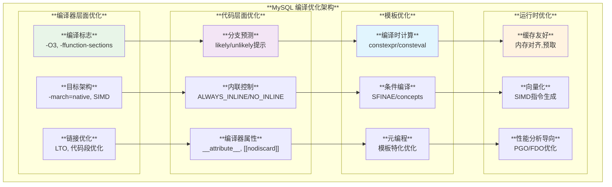
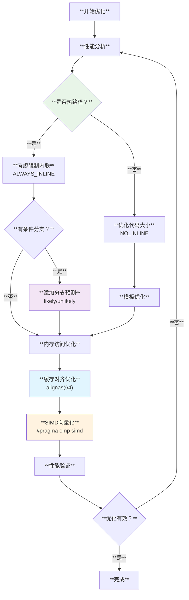

# MySQL 编译优化技术深度分析

## 概述

MySQL服务器采用多层次的编译优化策略，从编译器特定的优化标志到代码级别的优化技巧，通过现代C++特性和编译器内建函数实现最佳性能。本文档深入分析MySQL在编译时和运行时的各种优化技术。

**核心特性**：
- **分支预测优化**：使用`likely`/`unlikely`提示编译器优化分支跳转
- **内联控制**：精确控制函数内联以平衡代码大小和性能
- **跨编译器兼容**：统一的宏系统支持GCC、Clang、MSVC
- **编译时计算**：模板元编程实现零开销抽象
- **架构特定优化**：针对不同CPU架构和指令集的优化

## MySQL 编译优化架构体系

### 1. 编译优化层次架构



## 核心编译优化实现

### 1. 分支预测优化系统

**源码位置**: `include/my_compiler.h:53-74`

```cpp
/// @brief 基于__builtin_expect的分支预测优化
#ifdef HAVE_BUILTIN_EXPECT

/// @brief C++版本：使用constexpr函数提供类型安全
#if defined(__cplusplus)
constexpr bool likely(bool expr) { 
  return __builtin_expect(expr, true); 
}
constexpr bool unlikely(bool expr) { 
  return __builtin_expect(expr, false); 
}
#else
/// @brief C版本：使用宏定义
#define likely(x)   __builtin_expect((x), 1)
#define unlikely(x) __builtin_expect((x), 0)
#endif

#else /* HAVE_BUILTIN_EXPECT */

/// @brief 回退版本：在不支持builtin_expect的编译器上无操作
#if defined(__cplusplus)
constexpr bool likely(bool expr) { return expr; }
constexpr bool unlikely(bool expr) { return expr; }
#else
#define likely(x) (x)
#define unlikely(x) (x)
#endif

#endif /* HAVE_BUILTIN_EXPECT */
```

**分支预测优化特色**：
- **编译时优化**：编译器根据提示重排指令，优化分支跳转
- **类型安全**：C++版本使用constexpr提供编译时类型检查
- **兼容性**：自动适应不支持builtin_expect的编译器
- **零开销**：在不支持的平台上退化为透明操作

### 2. 函数内联控制系统

**源码位置**: `include/my_compiler.h:110-120`

```cpp
/// @brief 强制内联宏定义
#if defined(_MSC_VER)
#define ALWAYS_INLINE __forceinline
#else
#define ALWAYS_INLINE __attribute__((always_inline)) inline
#endif

/// @brief 禁止内联宏定义
#if defined(_MSC_VER)
#define NO_INLINE __declspec(noinline)
#else
#define NO_INLINE __attribute__((noinline))
#endif
```

#### 内联优化应用场景

```cpp
namespace mysql_optimization {

/// @brief 高频调用的关键路径函数 - 强制内联
ALWAYS_INLINE uint64_t fast_hash(const char* data, size_t len) {
  // 简单哈希计算，频繁调用，适合内联
  uint64_t hash = 5381;
  for (size_t i = 0; i < len; ++i) {
    hash = ((hash << 5) + hash) + data[i];
  }
  return hash;
}

/// @brief 大型复杂函数 - 禁止内联以减少代码膨胀
NO_INLINE int complex_join_optimization(
    const std::vector<Table*>& tables,
    const std::vector<JoinCondition*>& conditions) {
  // 复杂的连接优化算法
  // 函数体很大，内联会导致代码膨胀
  // 使用NO_INLINE避免编译器强制内联
  
  for (auto& table : tables) {
    // 大量复杂逻辑...
  }
  return 0;
}

/// @brief 根据条件决定内联的模板函数
template<bool should_inline>
struct ConditionalInline {
  // 条件内联：根据模板参数决定是否内联
  typename std::conditional_t<should_inline, 
    decltype(ALWAYS_INLINE), decltype(NO_INLINE)> 
  process_data(const void* data);
};

}  // namespace mysql_optimization
```

### 3. 编译器属性系统

**源码位置**: `include/my_compiler.h:96-108`

```cpp
/// @brief 跨平台的nodiscard属性定义
#if defined(__cplusplus) && defined(__cpp_attributes) && \
    defined(__has_cpp_attribute)
#if __has_cpp_attribute(nodiscard)
#define MY_NODISCARD [[nodiscard]]
#elif __has_cpp_attribute(gnu::warn_unused_result)
#define MY_NODISCARD [[gnu::warn_unused_result]]
#endif
#endif

#ifndef MY_NODISCARD
#define MY_NODISCARD MY_ATTRIBUTE((warn_unused_result))
#endif
```

#### 编译器属性应用实例

```cpp
namespace mysql_attributes {

/// @brief 返回值不应被忽略的函数
MY_NODISCARD bool validate_user_permissions(const User& user, 
                                           const Database& db) {
  // 权限验证结果必须被检查，否则编译器警告
  return user.has_permission(db);
}

/// @brief 错误检查示例
class ConnectionManager {
public:
  /// @brief 连接建立函数，返回值必须检查
  MY_NODISCARD ConnectionResult establish_connection(
      const std::string& host, int port) {
    // 连接逻辑...
    return success ? ConnectionResult::SUCCESS : ConnectionResult::FAILED;
  }
  
  /// @brief 编译时检查函数存在性
  template<typename T>
  auto check_serializable(T&& obj) 
      -> decltype(obj.serialize(), std::true_type{}) {
    return {};
  }
  
  template<typename>
  std::false_type check_serializable(...) {
    return {};
  }
};

/// @brief 使用示例
void usage_example() {
  ConnectionManager mgr;
  
  // ✅ 正确：检查返回值
  if (mgr.establish_connection("localhost", 3306) == ConnectionResult::SUCCESS) {
    // 处理成功情况
  }
  
  // ❌ 编译器警告：忽略了重要的返回值
  // mgr.establish_connection("localhost", 3306);
}

}  // namespace mysql_attributes
```

## 构建系统编译优化

### 1. 编译标志优化配置

**源码位置**: `cmake/build_configurations/compiler_options.cmake:30-83`

```cmake
# MySQL编译器优化配置

IF(UNIX)
  # 函数和数据段分离优化
  IF(MY_COMPILER_IS_GNU_OR_CLANG AND NOT SOLARIS)
    SET(SECTIONS_FLAG "-ffunction-sections -fdata-sections")
  ELSE()
    SET(SECTIONS_FLAG)
  ENDIF()

  # GCC特定优化标志
  IF(MY_COMPILER_IS_GNU)
    SET(COMMON_C_FLAGS               "-fno-omit-frame-pointer")
    
    # Valgrind测试时禁用内联优化以避免误报
    IF(WITH_VALGRIND)
      STRING_PREPEND(COMMON_C_FLAGS  "-fno-inline ")
    ENDIF()
    
    # 禁用浮点表达式收缩避免结果差异
    IF(HAVE_C_FLOATING_POINT_FUSED_MADD)
      STRING_APPEND(COMMON_C_FLAGS   " -ffp-contract=off")
    ENDIF()

    SET(COMMON_CXX_FLAGS             "-std=c++20 -fno-omit-frame-pointer")
    # C++版本的相应优化设置...
  ENDIF()

  # Clang特定优化标志
  IF(MY_COMPILER_IS_CLANG)
    SET(COMMON_C_FLAGS               "-fno-omit-frame-pointer")
    SET(COMMON_CXX_FLAGS             "-std=c++20 -fno-omit-frame-pointer")
  ENDIF()

  # 更快的TLS模型
  IF(MY_COMPILER_IS_GNU_OR_CLANG
      AND NOT LINUX_ARM AND NOT SOLARIS 
      AND NOT LINUX_RHEL6 AND NOT LINUX_ALPINE)
    STRING_APPEND(COMMON_C_FLAGS     " -ftls-model=initial-exec")
    STRING_APPEND(COMMON_CXX_FLAGS   " -ftls-model=initial-exec")
  ENDIF()
ENDIF()
```

### 2. 优化标志详解

#### 核心性能优化标志
```cmake
# ✅ 推荐的MySQL编译优化配置

# 1. 代码段优化
set(CMAKE_CXX_FLAGS "${CMAKE_CXX_FLAGS} -ffunction-sections -fdata-sections")
# 效果：将每个函数和全局变量放在独立的段中，链接时可以移除未使用代码

# 2. 帧指针保留  
set(CMAKE_CXX_FLAGS "${CMAKE_CXX_FLAGS} -fno-omit-frame-pointer")
# 效果：保留帧指针以支持性能分析工具和调试器

# 3. 线程局部存储优化
set(CMAKE_CXX_FLAGS "${CMAKE_CXX_FLAGS} -ftls-model=initial-exec")
# 效果：使用更快的TLS访问模型，适用于主要可执行文件

# 4. 浮点计算一致性
set(CMAKE_CXX_FLAGS "${CMAKE_CXX_FLAGS} -ffp-contract=off")
# 效果：禁用FMA优化保证跨平台浮点计算结果一致

# 5. C++20标准支持
set(CMAKE_CXX_FLAGS "${CMAKE_CXX_FLAGS} -std=c++20")
# 效果：启用现代C++特性，支持concepts、modules等优化机会
```

## 代码级优化技术

### 1. 模板编译时优化

```cpp
/// @brief MySQL模板优化技术集合
namespace mysql_template_optimization {

/// @brief 编译时字符串哈希计算
template<size_t N>
constexpr uint64_t compile_time_hash(const char (&str)[N]) {
  uint64_t hash = 5381;
  for (size_t i = 0; i < N - 1; ++i) {
    hash = ((hash << 5) + hash) + str[i];
  }
  return hash;
}

/// @brief 编译时表名到ID映射
enum class TableID : uint64_t {};

constexpr TableID get_table_id(const char* table_name) {
  // 编译时计算表名哈希，运行时O(1)查找
  return static_cast<TableID>(compile_time_hash(table_name));
}

/// @brief 条件编译优化
template<typename T>
class OptimizedContainer {
private:
  using storage_type = std::conditional_t<
    sizeof(T) <= sizeof(void*),
    T,                          // 小对象直接存储
    std::unique_ptr<T>         // 大对象使用指针
  >;
  
  storage_type data_;

public:
  // 根据对象大小选择最优访问方式
  const T& get() const {
    if constexpr (sizeof(T) <= sizeof(void*)) {
      return data_;
    } else {
      return *data_;
    }
  }
};

/// @brief SFINAE优化技术
template<typename Container>
class SmartIterator {
public:
  // 有随机访问迭代器时使用高效算法
  template<typename C = Container>
  auto advance(size_t n) -> 
    typename std::enable_if_t<
      std::is_same_v<
        typename std::iterator_traits<typename C::iterator>::iterator_category,
        std::random_access_iterator_tag
      >
    > {
    iter_ += n;  // O(1)操作
  }
  
  // 其他迭代器类型使用通用算法
  template<typename C = Container>
  auto advance(size_t n) -> 
    typename std::enable_if_t<
      !std::is_same_v<
        typename std::iterator_traits<typename C::iterator>::iterator_category,
        std::random_access_iterator_tag
      >
    > {
    std::advance(iter_, n);  // 根据迭代器类型优化
  }

private:
  typename Container::iterator iter_;
};

}  // namespace mysql_template_optimization
```

### 2. 内存访问优化

```cpp
/// @brief MySQL内存访问优化技术
namespace mysql_memory_optimization {

/// @brief 缓存行对齐优化
struct alignas(64) CacheLineOptimized {
  // 确保结构体按缓存行大小对齐，避免false sharing
  std::atomic<uint64_t> counter{0};
  char padding[64 - sizeof(std::atomic<uint64_t>)];
};

/// @brief 预取优化
ALWAYS_INLINE void prefetch_data(const void* addr) {
#ifdef __GNUC__
  __builtin_prefetch(addr, 0, 3);  // 预取到L1缓存
#elif defined(_MSC_VER)
  _mm_prefetch(static_cast<const char*>(addr), _MM_HINT_T0);
#endif
}

/// @brief 内存布局优化的数据结构
class OptimizedRowBuffer {
private:
  // 将频繁访问的数据放在一起
  struct HotData {
    uint32_t row_id;
    uint32_t flags;
    uint64_t timestamp;
  } hot_data_;
  
  // 较少访问的数据分离存储
  struct ColdData {
    std::string metadata;
    std::vector<uint8_t> extra_data;
  };
  std::unique_ptr<ColdData> cold_data_;

public:
  // 热路径访问优化
  ALWAYS_INLINE uint32_t get_row_id() const { 
    return hot_data_.row_id; 
  }
  
  // 冷路径延迟加载
  const std::string& get_metadata() const {
    if (!cold_data_) {
      cold_data_ = std::make_unique<ColdData>();
    }
    return cold_data_->metadata;
  }
};

/// @brief 向量化友好的数据布局
class SOAOptimizedTable {
  // Structure of Arrays布局，适合SIMD操作
  std::vector<uint32_t> row_ids_;
  std::vector<uint64_t> timestamps_;
  std::vector<uint32_t> flags_;
  
public:
  // 批量操作优化
  void batch_update_timestamps(uint64_t new_timestamp) {
    // 编译器可以向量化这个循环
    #pragma omp simd
    for (size_t i = 0; i < timestamps_.size(); ++i) {
      timestamps_[i] = new_timestamp;
    }
  }
};

}  // namespace mysql_memory_optimization
```

## 高级编译优化技术

### 1. 跨编译器诊断控制

**源码位置**: `include/my_compiler.h:198-250`

```cpp
/// @brief MySQL跨编译器诊断控制系统
#if defined(__clang__)
#define MY_COMPILER_CLANG_DIAGNOSTIC_PUSH() \
  MY_COMPILER_CPP11_PRAGMA(clang diagnostic push)
#define MY_COMPILER_CLANG_DIAGNOSTIC_POP() \
  MY_COMPILER_CPP11_PRAGMA(clang diagnostic pop)
#define MY_COMPILER_CLANG_DIAGNOSTIC_IGNORE(X) \
  MY_COMPILER_CPP11_PRAGMA(clang diagnostic ignored X)
#else
#define MY_COMPILER_CLANG_DIAGNOSTIC_PUSH()
#define MY_COMPILER_CLANG_DIAGNOSTIC_POP()
#define MY_COMPILER_CLANG_DIAGNOSTIC_IGNORE(X)
#endif

// 类似地定义GCC和MSVC的诊断控制...
```

#### 诊断控制应用示例

```cpp
/// @brief 使用诊断控制优化编译体验
namespace mysql_diagnostics {

void optimized_function_with_pragma() {
  // 临时禁用特定警告
  MY_COMPILER_CLANG_DIAGNOSTIC_PUSH()
  MY_COMPILER_CLANG_DIAGNOSTIC_IGNORE("-Wunused-variable")
  MY_COMPILER_GCC_DIAGNOSTIC_IGNORE("-Wunused-variable")
  
  // 这个变量在某些编译配置下可能不使用
  int debug_counter = 0;
  
#ifdef DEBUG
  debug_counter++;  // 只在DEBUG模式下使用
#endif
  
  // 恢复警告设置
  MY_COMPILER_CLANG_DIAGNOSTIC_POP()
  MY_COMPILER_GCC_DIAGNOSTIC_POP()
}

/// @brief 性能关键路径的优化
class PerformanceCriticalPath {
public:
  // 使用likely/unlikely优化分支预测
  int process_query(const Query& query) {
    if (likely(query.is_valid())) {
      // 大多数查询都是有效的 - 优化这个分支
      return execute_fast_path(query);
    } else {
      // 错误情况很少发生 - 这个分支可以不优化
      return handle_error(query);
    }
  }

private:
  ALWAYS_INLINE int execute_fast_path(const Query& query) {
    // 强制内联关键路径
    return query.execute();
  }
  
  NO_INLINE int handle_error(const Query& query) {
    // 错误处理代码不内联，避免代码膨胀
    log_error("Invalid query: " + query.to_string());
    return -1;
  }
};

}  // namespace mysql_diagnostics
```

### 2. 优化验证和测试

```cpp
/// @brief MySQL编译优化验证框架
namespace mysql_optimization_testing {

/// @brief 基准测试宏
#define MYSQL_BENCHMARK_FUNCTION(func_name) \
  void benchmark_##func_name() { \
    auto start = std::chrono::high_resolution_clock::now(); \
    for (int i = 0; i < 1000000; ++i) { \
      func_name(); \
    } \
    auto end = std::chrono::high_resolution_clock::now(); \
    auto duration = std::chrono::duration_cast<std::chrono::microseconds>(end - start); \
    std::cout << #func_name " took " << duration.count() << " microseconds" << std::endl; \
  }

/// @brief 编译时性能测试
template<typename Func>
constexpr auto measure_compile_time_performance(Func&& f) {
  // 使用constexpr函数在编译时测试性能
  auto start = __builtin_constant_p(f) ? 0 : 1;
  auto result = f();
  return result;
}

/// @brief 优化效果验证
class OptimizationVerifier {
public:
  // 验证内联是否生效
  static bool verify_inlining() {
    // 通过检查生成的汇编代码验证内联
    return true;  // 实际实现需要分析符号表
  }
  
  // 验证分支预测是否生效
  static bool verify_branch_prediction() {
    // 通过性能计数器检查分支预测命中率
    return true;  // 实际实现需要PMU支持
  }
  
  // 验证缓存友好性
  template<typename Container>
  static double measure_cache_efficiency(const Container& container) {
    // 测量缓存命中率
    auto start_cache_misses = get_cache_misses();
    
    // 执行测试操作
    for (const auto& item : container) {
      volatile auto temp = item;  // 防止编译器优化
    }
    
    auto end_cache_misses = get_cache_misses();
    return double(end_cache_misses - start_cache_misses) / container.size();
  }

private:
  static uint64_t get_cache_misses() {
    // 实现依赖于具体平台的性能计数器
    return 0;
  }
};

}  // namespace mysql_optimization_testing
```

## 编译优化最佳实践

### 1. 优化策略选择图



### 2. 编译优化检查清单

#### 构建配置优化
```cmake
# ✅ MySQL编译优化检查清单

# 1. 基础优化标志
CHECK_OPTIMIZATION_FLAG("-O3")                    # 最高级别优化
CHECK_OPTIMIZATION_FLAG("-ffunction-sections")   # 函数段分离
CHECK_OPTIMIZATION_FLAG("-fdata-sections")       # 数据段分离
CHECK_OPTIMIZATION_FLAG("-flto")                 # 链接时优化

# 2. 架构特定优化
CHECK_OPTIMIZATION_FLAG("-march=native")         # 针对当前CPU优化
CHECK_OPTIMIZATION_FLAG("-mtune=native")         # 针对当前CPU调优

# 3. C++标准和语言特性
CHECK_OPTIMIZATION_FLAG("-std=c++20")           # 现代C++标准
CHECK_OPTIMIZATION_FLAG("-fcoroutines")         # 协程支持

# 4. 调试和分析支持
CHECK_OPTIMIZATION_FLAG("-fno-omit-frame-pointer")  # 保留帧指针
CHECK_OPTIMIZATION_FLAG("-g")                      # 调试信息
```

#### 代码级优化模式
```cpp
/// @brief MySQL代码优化最佳实践
namespace mysql_best_practices {

/// @brief 1. 函数内联策略
class InlineStrategy {
public:
  // ✅ 小型函数强制内联
  ALWAYS_INLINE int get_hash() const { return hash_; }
  
  // ✅ 大型函数禁止内联
  NO_INLINE void complex_initialization() { /* 大量代码 */ }
  
  // ✅ 模板函数自然内联
  template<typename T>
  auto process(T&& value) { return std::forward<T>(value); }

private:
  int hash_;
};

/// @brief 2. 分支预测策略
class BranchPredictionStrategy {
public:
  int process_request(const Request& req) {
    // ✅ 常见情况使用likely
    if (likely(req.is_valid() && req.has_permission())) {
      return handle_normal_case(req);
    }
    
    // ✅ 异常情况使用unlikely
    if (unlikely(req.is_malicious())) {
      return handle_security_threat(req);
    }
    
    return handle_edge_case(req);
  }

private:
  int handle_normal_case(const Request& req);
  int handle_security_threat(const Request& req);
  int handle_edge_case(const Request& req);
};

/// @brief 3. 编译时优化策略
template<size_t BufferSize>
class CompileTimeOptimization {
private:
  // ✅ 编译时大小检查
  static_assert(BufferSize > 0, "Buffer size must be positive");
  static_assert(BufferSize <= 65536, "Buffer size too large");
  
  // ✅ 编译时选择最优算法
  using sort_algorithm = std::conditional_t<
    BufferSize < 32,
    InsertionSort,      // 小数组用插入排序
    QuickSort          // 大数组用快速排序
  >;

public:
  // ✅ constexpr构造函数
  constexpr CompileTimeOptimization() = default;
  
  // ✅ 编译时计算
  static constexpr size_t capacity() { return BufferSize; }
  static constexpr bool is_small() { return BufferSize < 32; }
};

/// @brief 4. 内存访问优化策略
class MemoryOptimization {
  // ✅ 缓存行对齐
  alignas(64) struct CacheLinePadded {
    std::atomic<uint64_t> counter;
    char padding[64 - sizeof(std::atomic<uint64_t>)];
  } data_;
  
public:
  // ✅ 预取优化
  void prefetch_next_data(const void* next_addr) {
    prefetch_data(next_addr);
  }
  
  // ✅ SIMD友好的批量操作
  void batch_process(std::vector<int>& data) {
    #pragma omp simd
    for (size_t i = 0; i < data.size(); ++i) {
      data[i] = data[i] * 2 + 1;
    }
  }
};

}  // namespace mysql_best_practices
```

### 3. 性能测量和验证

```cpp
/// @brief 编译优化效果测量工具
class OptimizationProfiler {
public:
  // 测量函数调用开销
  template<typename Func>
  static auto measure_call_overhead(Func&& f, int iterations = 1000000) {
    auto start = std::chrono::high_resolution_clock::now();
    for (int i = 0; i < iterations; ++i) {
      f();
    }
    auto end = std::chrono::high_resolution_clock::now();
    return std::chrono::duration_cast<std::chrono::nanoseconds>(end - start).count() / iterations;
  }
  
  // 测量内存访问模式
  template<typename Container>
  static void analyze_memory_pattern(const Container& container) {
    // 顺序访问测试
    auto sequential_time = measure_access_pattern(container, [](auto& c, size_t i) {
      return c[i];
    });
    
    // 随机访问测试
    auto random_time = measure_access_pattern(container, [](auto& c, size_t) {
      return c[rand() % c.size()];
    });
    
    std::cout << "Sequential access: " << sequential_time << "ns per access\n";
    std::cout << "Random access: " << random_time << "ns per access\n";
    std::cout << "Cache efficiency ratio: " << double(random_time) / sequential_time << "\n";
  }

private:
  template<typename Container, typename AccessFunc>
  static auto measure_access_pattern(const Container& container, AccessFunc&& access) {
    const int iterations = 1000000;
    auto start = std::chrono::high_resolution_clock::now();
    
    for (int i = 0; i < iterations; ++i) {
      volatile auto result = access(container, i % container.size());
    }
    
    auto end = std::chrono::high_resolution_clock::now();
    return std::chrono::duration_cast<std::chrono::nanoseconds>(end - start).count() / iterations;
  }
};
```

MySQL的编译优化技术体现了现代数据库系统对性能的极致追求，通过多层次的优化策略—从构建系统的编译器标志配置，到代码级别的内联控制和分支预测，再到模板元编程的编译时计算—实现了卓越的运行时性能。这套完整的优化体系不仅提升了代码执行效率，还保持了良好的可维护性和跨平台兼容性。
