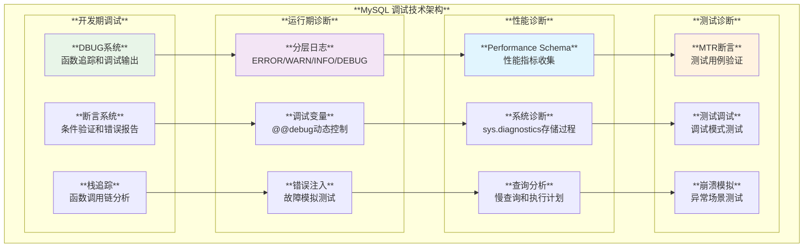
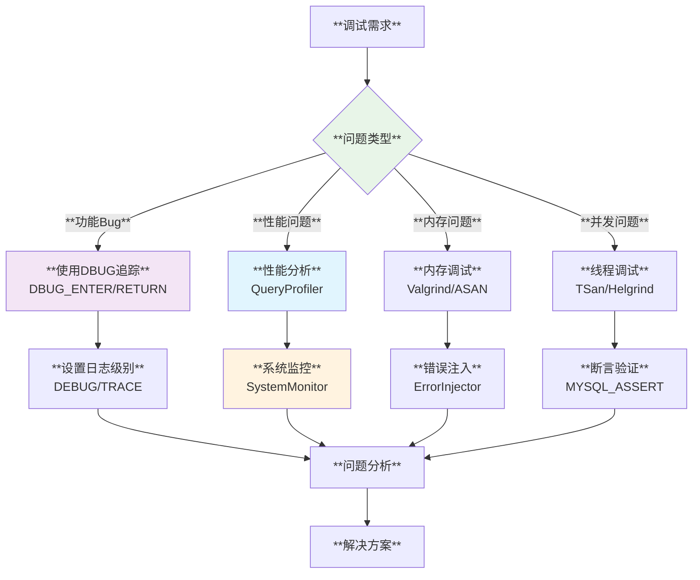

# MySQL 调试技巧应用深度分析

## 概述

MySQL服务器构建了一套完备的调试和诊断体系，涵盖从开发期的DBUG追踪系统到生产环境的诊断工具。通过分层的日志系统、动态调试控制、断言验证和性能诊断等技术，MySQL为开发者和DBA提供了强大的问题诊断和性能分析能力。

**核心特性**：
- **DBUG追踪系统**：函数级别的调用跟踪和调试输出
- **分层日志架构**：从ERROR到TRACE的多级别日志记录
- **动态调试控制**：运行时可控的调试开关和过滤器
- **断言验证系统**：开发期和测试期的条件验证
- **诊断工具集成**：系统状态收集和性能分析工具

## MySQL 调试技术架构体系

### 1. 调试系统层次架构



## DBUG追踪系统核心实现

### 1. DBUG系统基础架构

**源码位置**: `include/my_dbug.h:57-87`

```cpp
/// @brief DBUG系统的核心数据结构
#if !defined(NDEBUG)

/// @brief 调试栈帧结构
struct _db_stack_frame_ {
  const char *func;                    /*!< 前一栈帧的函数名 */
  int func_len;                        /*!< 函数名打印长度 */
  const char *file;                    /*!< 函数所在文件名 */
  unsigned int level;                  /*!< 嵌套级别，最高位启用追踪 */
  struct _db_stack_frame_ *prev;       /*!< 指向前一帧的指针 */
};

struct CODE_STATE;

/// @brief DBUG系统核心API
extern int _db_keyword_(struct CODE_STATE *, const char *, int);
extern int _db_explain_(struct CODE_STATE *cs, char *buf, size_t len);
extern void _db_process_(const char *name);
extern void _db_push_(const char *control);     // 入栈调试状态
extern void _db_pop_(void);                     // 出栈调试状态
extern void _db_set_(const char *control);      // 设置调试控制
extern void _db_enter_(const char *_func_, int func_len, const char *_file_,
                       unsigned int _line_,
                       struct _db_stack_frame_ *_stack_frame_);
extern void _db_return_(unsigned int _line_,
                        struct _db_stack_frame_ *_stack_frame_);
extern void _db_pargs_(unsigned int _line_, const char *keyword);
extern void _db_doprnt_(const char *format, ...)
    MY_ATTRIBUTE((format(printf, 1, 2)));

#endif  // !defined(NDEBUG)
```

### 2. DBUG宏定义和使用模式

**源码位置**: `storage/ndb/include/util/dbug_utils.hpp:42-68`

```cpp
/// @brief 增强版DBUG宏定义
#ifndef NDEBUG

/// @brief 安全的DBUG操作宏
#define MY_DBUG_PUSH(a1)     \
  do {                       \
    if ((a1)) DBUG_PUSH(a1); \
  } while (0)

#define MY_DBUG_POP() DBUG_POP()

#define MY_DBUG_SET(a1)     \
  do {                      \
    if ((a1)) DBUG_SET(a1); \
  } while (0)

#define MY_DBUG_EXPLAIN(buf, len) \
  ((!(buf) || (len) <= 0) ? 1 : DBUG_EXPLAIN(buf, len))

#define MY_DBUG_PRINT(keyword, arglist)          \
  do {                                           \
    if ((keyword)) DBUG_PRINT(keyword, arglist); \
  } while (0)

#else  // NDEBUG

/// @brief Release版本的空操作定义
#define MY_DBUG_PUSH(a1)
#define MY_DBUG_POP()
#define MY_DBUG_SET(a1)
#define MY_DBUG_EXPLAIN(buf, len) 1
#define MY_DBUG_PRINT(keyword, arglist)

#endif  // NDEBUG
```

#### DBUG系统使用示例

```cpp
/// @brief MySQL DBUG系统的完整使用示例
namespace mysql_debugging {

class MySQLQueryProcessor {
public:
  int process_query(const std::string& query) {
    DBUG_ENTER("MySQLQueryProcessor::process_query");
    DBUG_PRINT("query", ("Processing: %s", query.c_str()));
    
    // 解析查询
    if (!parse_query(query)) {
      DBUG_PRINT("error", ("Failed to parse query: %s", query.c_str()));
      DBUG_RETURN(-1);
    }
    
    // 优化查询
    auto optimized = optimize_query(query);
    DBUG_PRINT("optimizer", ("Optimized to: %s", optimized.c_str()));
    
    // 执行查询
    int result = execute_query(optimized);
    DBUG_PRINT("result", ("Query result: %d", result));
    
    DBUG_RETURN(result);
  }

private:
  bool parse_query(const std::string& query) {
    DBUG_ENTER("MySQLQueryProcessor::parse_query");
    DBUG_PRINT("parser", ("Parsing query: %s", query.c_str()));
    
    // 解析逻辑...
    bool success = !query.empty();
    
    DBUG_PRINT("parser", ("Parse result: %s", success ? "OK" : "FAILED"));
    DBUG_RETURN(success);
  }
  
  std::string optimize_query(const std::string& query) {
    DBUG_ENTER("MySQLQueryProcessor::optimize_query");
    
    // 优化逻辑...
    std::string optimized = "OPTIMIZED(" + query + ")";
    
    DBUG_RETURN(optimized);
  }
  
  int execute_query(const std::string& query) {
    DBUG_ENTER("MySQLQueryProcessor::execute_query");
    
    // 执行逻辑...
    int rows_affected = query.length() % 100;  // 模拟结果
    
    DBUG_RETURN(rows_affected);
  }
};

/// @brief DBUG状态管理示例
class DBUGManager {
public:
  static void enable_query_tracing() {
    DBUG_PUSH("d,query,optimizer,parser:t:O,/tmp/mysql_trace.log");
  }
  
  static void disable_tracing() {
    DBUG_POP();
  }
  
  static std::string get_current_state() {
    char buffer[1024];
    if (MY_DBUG_EXPLAIN(buffer, sizeof(buffer)) == 0) {
      return std::string(buffer);
    }
    return "Debug not available";
  }
};

}  // namespace mysql_debugging
```

## 分层日志系统

### 1. X插件日志系统

**源码位置**: `plugin/x/src/xpl_log.h:51-69`

```cpp
/// @brief X插件的分层日志系统
#ifndef XPLUGIN_DISABLE_LOG

/// @brief 各级别日志宏定义
#define log_error(errcode, ...) \
  LogPluginErr(ERROR_LEVEL, errcode, ##__VA_ARGS__)

#define log_warning(errcode, ...) \
  LogPluginErr(WARNING_LEVEL, errcode, ##__VA_ARGS__)

#define log_info(errcode, ...) \
  LogPluginErr(INFORMATION_LEVEL, errcode, ##__VA_ARGS__)

#define log_system(errcode, ...) \
  LogErr(SYSTEM_LEVEL, errcode, ##__VA_ARGS__)

/// @brief 条件编译的调试日志
#ifdef XPLUGIN_LOG_DEBUG
#define log_debug(...) \
  LogPluginErrMsg(INFORMATION_LEVEL, ER_XPLUGIN_ERROR_MSG, ##__VA_ARGS__)
#else
#define log_debug(...) \
  do {                 \
  } while (0)
#endif

#else  // XPLUGIN_DISABLE_LOG

/// @brief 日志完全禁用版本
#define log_debug(...) do { } while (0)
#define log_info(...) do { } while (0)
#define log_warning(...) do { } while (0)
#define log_error(...) do { } while (0)
#define log_system(...) do { } while (0)

#endif  // XPLUGIN_DISABLE_LOG
```

### 2. Group Replication日志系统

**源码位置**: `plugin/group_replication/libmysqlgcs/include/mysql/gcs/gcs_logging_system.h:834-873`

```cpp
/// @brief Group Replication的高级日志系统
#define MYSQL_GCS_LOG(level, x)                           \
  do {                                                    \
    if (Gcs_log_manager::get_logger() != NULL) {         \
      std::stringstream log;                              \
      log << GCS_PREFIX << x;                             \
      Gcs_log_manager::get_logger()->log_event(level, log.str()); \
    }                                                     \
  } while (0);

/// @brief 各级别日志快捷宏
#define MYSQL_GCS_LOG_INFO(x)  MYSQL_GCS_LOG(GCS_INFO, x)
#define MYSQL_GCS_LOG_WARN(x)  MYSQL_GCS_LOG(GCS_WARN, x)
#define MYSQL_GCS_LOG_ERROR(x) MYSQL_GCS_LOG(GCS_ERROR, x)
#define MYSQL_GCS_LOG_FATAL(x) MYSQL_GCS_LOG(GCS_FATAL, x)

/// @brief 条件调试执行
#define MYSQL_GCS_DEBUG_EXECUTE(x) \
  MYSQL_GCS_DEBUG_EXECUTE_WITH_OPTION(GCS_DEBUG_BASIC | GCS_DEBUG_TRACE, x)

#define MYSQL_GCS_TRACE_EXECUTE(x) \
  MYSQL_GCS_DEBUG_EXECUTE_WITH_OPTION(GCS_DEBUG_TRACE, x)

/// @brief 带选项的调试日志
#define MYSQL_GCS_LOG_DEBUG_WITH_OPTION(options, ...)                   \
  do {                                                                  \
    Gcs_default_debugger *debugger = Gcs_debug_manager::get_debugger(); \
    debugger->log_event(options, __VA_ARGS__);                          \
  } while (0);
```

#### 日志系统应用示例

```cpp
/// @brief MySQL日志系统的实际应用
namespace mysql_logging {

class ConnectionHandler {
public:
  bool handle_new_connection(int socket_fd, const std::string& client_info) {
    log_info(ER_XPLUGIN_NEW_CONNECTION, "New connection from %s", client_info.c_str());
    
    // 验证连接
    if (!validate_connection(socket_fd)) {
      log_warning(ER_XPLUGIN_CONNECTION_VALIDATION_FAILED, 
                  "Connection validation failed for %s", client_info.c_str());
      return false;
    }
    
    // 初始化会话
    try {
      initialize_session(socket_fd);
      log_debug("Session initialized successfully for %s", client_info.c_str());
    } catch (const std::exception& e) {
      log_error(ER_XPLUGIN_SESSION_INIT_FAILED, 
                "Failed to initialize session: %s", e.what());
      return false;
    }
    
    return true;
  }

private:
  bool validate_connection(int socket_fd) {
    MYSQL_GCS_LOG_DEBUG("Validating connection on socket %d", socket_fd);
    
    // 连接验证逻辑...
    bool valid = socket_fd > 0;
    
    if (!valid) {
      MYSQL_GCS_LOG_ERROR("Invalid socket descriptor: " << socket_fd);
    }
    
    return valid;
  }
  
  void initialize_session(int socket_fd) {
    MYSQL_GCS_LOG_INFO("Initializing session for socket " << socket_fd);
    
    // 可能抛出异常的会话初始化...
    if (socket_fd < 0) {
      throw std::runtime_error("Invalid socket");
    }
  }
};

/// @brief 日志级别控制器
class LogLevelController {
public:
  enum class LogLevel {
    SYSTEM = 0,
    ERROR = 1,
    WARNING = 2,
    INFO = 3,
    DEBUG = 4,
    TRACE = 5
  };
  
  static void set_global_log_level(LogLevel level) {
    current_level_ = level;
    log_info(ER_LOG_LEVEL_CHANGED, "Log level changed to %d", 
             static_cast<int>(level));
  }
  
  static bool should_log(LogLevel level) {
    return level <= current_level_;
  }
  
  template<typename... Args>
  static void conditional_log(LogLevel level, const char* format, Args&&... args) {
    if (should_log(level)) {
      switch (level) {
        case LogLevel::ERROR:
          log_error(ER_GENERIC_ERROR, format, std::forward<Args>(args)...);
          break;
        case LogLevel::WARNING:
          log_warning(ER_GENERIC_WARNING, format, std::forward<Args>(args)...);
          break;
        case LogLevel::INFO:
          log_info(ER_GENERIC_INFO, format, std::forward<Args>(args)...);
          break;
        case LogLevel::DEBUG:
          log_debug(format, std::forward<Args>(args)...);
          break;
        default:
          break;
      }
    }
  }

private:
  static LogLevel current_level_;
};

LogLevelController::LogLevel LogLevelController::current_level_ = LogLevel::INFO;

}  // namespace mysql_logging
```

## 断言验证系统

### 1. InnoDB断言系统

**源码位置**: `storage/innobase/ut/ut0dbg.cc:55-101`

```cpp
/// @brief InnoDB的断言失败处理
[[noreturn]] void ut_dbg_assertion_failed(const char *expr, 
                                          const char *file,
                                          uint64_t line) {
#if !defined(UNIV_HOTBACKUP) && !defined(UNIV_NO_ERR_MSGS)
  ib::error(ER_IB_MSG_1273)
      << "Assertion failure: " << innobase_basename(file) << ":" << line
      << ((expr != nullptr) ? ":" : "") 
      << ((expr != nullptr) ? expr : "")
      << " thread " << to_string(std::this_thread::get_id());

  flush_error_log_messages();

#else
  auto filename = base_name(file);
  if (filename == nullptr) {
    filename = "null";
  }

  fprintf(stderr,
          "InnoDB: Assertion failure: %s:" UINT64PF
          "%s%s\n"
          "InnoDB: thread %s",
          filename, line, 
          expr != nullptr ? ":" : "",
          expr != nullptr ? expr : "",
          to_string(std::this_thread::get_id()).c_str());
#endif

  fputs(
      "InnoDB: We intentionally generate a memory trap.\n"
      "InnoDB: Submit a detailed bug report to http://bugs.mysql.com.\n"
      "InnoDB: If you get repeated assertion failures or crashes, even\n"
      "InnoDB: immediately after the mysqld startup, there may be\n"
      "InnoDB: corruption in the InnoDB tablespace. Please refer to\n"
      "InnoDB: " REFMAN "forcing-innodb-recovery.html\n"
      "InnoDB: about forcing recovery.\n",
      stderr);

  fflush(stderr);
  fflush(stdout);
  
  // 调用注册的回调函数
  if (assert_callback) {
    assert_callback();
  }
  
  my_abort();
}
```

### 2. 测试断言系统

**源码位置**: `mysql-test/include/assert.inc:52-117`

```sql
-- MySQL测试框架的断言实现
# 检查断言条件
--let $eval_expr= $assert_cond
--source include/eval.inc

if (!$eval_result)
{
  --echo ######## Test assertion failed: $assert_text ########
  --echo Dumping debug info:
  --let $assert_cond_interp = $_eval_expr_interp
  --let $assert_result = $eval_result
  
  if ($show_rpl_debug_info)
  {
    --source include/rpl/debug/show_debug_info.inc
  }
  
  --echo Assertion text: '$assert_text'
  --echo Assertion condition: '$assert_cond'
  --echo Assertion condition, interpolated: '$assert_cond_interp'
  --echo Assertion result: '$assert_result'
  
  if ($assert_debug)
  {
    --echo Assertion debug statement:
    --eval $assert_debug
  }
  
  if (!$assert_no_stop) {
    --die Test assertion failed in assert.inc
  }
}
```

#### 断言系统应用示例

```cpp
/// @brief MySQL断言系统的实践应用
namespace mysql_assertions {

/// @brief 高级断言宏定义
#ifndef NDEBUG

#define MYSQL_ASSERT_WITH_MESSAGE(condition, message) \
  do { \
    if (unlikely(!(condition))) { \
      mysql_assert_failure(__FILE__, __LINE__, #condition, message); \
    } \
  } while(0)

#define MYSQL_ASSERT_RANGE(value, min_val, max_val) \
  MYSQL_ASSERT_WITH_MESSAGE( \
    (value) >= (min_val) && (value) <= (max_val), \
    "Value " #value " is out of range [" #min_val ", " #max_val "]")

#define MYSQL_ASSERT_NOT_NULL(ptr) \
  MYSQL_ASSERT_WITH_MESSAGE((ptr) != nullptr, #ptr " is null")

#else

#define MYSQL_ASSERT_WITH_MESSAGE(condition, message) do { } while(0)
#define MYSQL_ASSERT_RANGE(value, min_val, max_val) do { } while(0)
#define MYSQL_ASSERT_NOT_NULL(ptr) do { } while(0)

#endif

/// @brief 断言失败处理函数
void mysql_assert_failure(const char* file, int line, 
                          const char* condition, const char* message) {
  log_error(ER_ASSERTION_FAILED, 
            "Assertion failed at %s:%d - %s: %s", 
            file, line, condition, message ? message : "No message");
            
  // 打印调用栈
  print_stack_trace();
  
  // 触发断点（如果在调试器中）
  #ifdef DEBUG_BREAK_ON_ASSERT
    DEBUG_BREAK();
  #endif
  
  // 异常终止
  my_abort();
}

/// @brief 实际应用示例
class BufferManager {
private:
  static constexpr size_t MAX_BUFFER_SIZE = 1024 * 1024;  // 1MB
  uint8_t* buffer_;
  size_t size_;

public:
  BufferManager(size_t size) : size_(size) {
    MYSQL_ASSERT_RANGE(size, 1, MAX_BUFFER_SIZE);
    
    buffer_ = static_cast<uint8_t*>(malloc(size));
    MYSQL_ASSERT_NOT_NULL(buffer_);
    
    log_debug("Buffer allocated: size=%zu, ptr=%p", size_, buffer_);
  }
  
  ~BufferManager() {
    if (buffer_) {
      free(buffer_);
      log_debug("Buffer freed: ptr=%p", buffer_);
    }
  }
  
  uint8_t* get_buffer(size_t offset = 0) {
    MYSQL_ASSERT_WITH_MESSAGE(
      offset < size_, 
      "Buffer access out of bounds");
    MYSQL_ASSERT_NOT_NULL(buffer_);
    
    return buffer_ + offset;
  }
  
  bool write_data(const void* data, size_t data_size, size_t offset = 0) {
    MYSQL_ASSERT_NOT_NULL(data);
    MYSQL_ASSERT_WITH_MESSAGE(
      offset + data_size <= size_,
      "Write would overflow buffer");
    
    memcpy(buffer_ + offset, data, data_size);
    return true;
  }
};

/// @brief 条件断言的高级用法
template<typename T>
class SafeVector {
private:
  std::vector<T> data_;
  
  void validate_index(size_t index) const {
    MYSQL_ASSERT_WITH_MESSAGE(
      index < data_.size(),
      "Vector index out of bounds");
  }

public:
  T& at(size_t index) {
    validate_index(index);
    return data_[index];
  }
  
  const T& at(size_t index) const {
    validate_index(index);
    return data_[index];
  }
  
  void push_back(const T& value) {
    // 检查容量限制
    MYSQL_ASSERT_WITH_MESSAGE(
      data_.size() < 1000000,  // 1M元素限制
      "Vector size limit exceeded");
      
    data_.push_back(value);
  }
};

}  // namespace mysql_assertions
```

## 动态调试控制系统

### 1. 调试变量系统

**源码示例**: `mysql-test/t/variables_debug.test:9-24`

```sql
-- MySQL动态调试控制示例

-- 设置基础追踪
SET debug = 'T';
SELECT @@debug;  -- 输出: T

-- 增量添加调试选项  
SET debug = '+P';
SELECT @@debug;  -- 输出: P:T

-- 移除调试选项
SET debug = '-P';
SELECT @@debug;  -- 输出: T

-- 会话和全局调试分离
SELECT @@session.debug, @@global.debug;
SET SESSION debug = '';
SELECT @@session.debug, @@global.debug;
```

### 2. 错误注入系统

```cpp
/// @brief MySQL错误注入调试系统
namespace mysql_error_injection {

/// @brief 错误注入控制器
class ErrorInjector {
public:
  enum class InjectionPoint {
    MEMORY_ALLOCATION_FAIL,
    DISK_WRITE_ERROR,
    NETWORK_TIMEOUT,
    LOCK_ACQUISITION_FAIL,
    PARSER_ERROR
  };
  
  static void enable_injection(InjectionPoint point, double probability = 1.0) {
    injection_map_[point] = probability;
    log_debug("Error injection enabled for point %d with probability %.2f", 
              static_cast<int>(point), probability);
  }
  
  static void disable_injection(InjectionPoint point) {
    injection_map_.erase(point);
    log_debug("Error injection disabled for point %d", static_cast<int>(point));
  }
  
  static bool should_inject_error(InjectionPoint point) {
    auto it = injection_map_.find(point);
    if (it == injection_map_.end()) {
      return false;
    }
    
    double random_val = static_cast<double>(rand()) / RAND_MAX;
    bool inject = random_val < it->second;
    
    if (inject) {
      log_debug("Injecting error at point %d", static_cast<int>(point));
    }
    
    return inject;
  }

private:
  static std::map<InjectionPoint, double> injection_map_;
};

std::map<ErrorInjector::InjectionPoint, double> ErrorInjector::injection_map_;

/// @brief 内存分配器（带错误注入）
class DebuggingAllocator {
public:
  static void* allocate(size_t size) {
    // 检查是否需要注入内存分配失败
    if (ErrorInjector::should_inject_error(
        ErrorInjector::InjectionPoint::MEMORY_ALLOCATION_FAIL)) {
      log_debug("Simulating memory allocation failure for size %zu", size);
      return nullptr;
    }
    
    void* ptr = malloc(size);
    if (ptr) {
      allocated_blocks_[ptr] = size;
      total_allocated_ += size;
      log_debug("Allocated %zu bytes at %p (total: %zu)", 
                size, ptr, total_allocated_);
    }
    
    return ptr;
  }
  
  static void deallocate(void* ptr) {
    if (!ptr) return;
    
    auto it = allocated_blocks_.find(ptr);
    if (it != allocated_blocks_.end()) {
      total_allocated_ -= it->second;
      log_debug("Deallocated %zu bytes at %p (total: %zu)", 
                it->second, ptr, total_allocated_);
      allocated_blocks_.erase(it);
    }
    
    free(ptr);
  }
  
  static size_t get_total_allocated() {
    return total_allocated_;
  }
  
  static size_t get_block_count() {
    return allocated_blocks_.size();
  }

private:
  static std::unordered_map<void*, size_t> allocated_blocks_;
  static std::atomic<size_t> total_allocated_;
};

std::unordered_map<void*, size_t> DebuggingAllocator::allocated_blocks_;
std::atomic<size_t> DebuggingAllocator::total_allocated_{0};

}  // namespace mysql_error_injection
```

## 性能诊断工具

### 1. 系统诊断存储过程

**源码位置**: `scripts/sys_schema/procedures/diagnostics.sql:20-109`

```sql
-- sys.diagnostics存储过程的核心功能
CREATE DEFINER='mysql.sys'@'localhost' PROCEDURE diagnostics (
    IN in_max_runtime int unsigned, 
    IN in_interval int unsigned,
    IN in_auto_config enum ('current', 'medium', 'full')
)
COMMENT '
系统诊断数据收集程序，包括：
- 全局变量状态
- sys schema视图指标
- 95百分位查询
- NDB集群信息（如果适用）
- 主从复制信息

支持配置项：
- sys.diagnostics.allow_i_s_tables: 是否允许扫描INFORMATION_SCHEMA.TABLES
- sys.diagnostics.include_raw: 是否包含原始数据
- sys.statement_truncate_len: 查询截断长度
- sys.debug: 是否启用调试输出
'
```

### 2. 性能诊断工具实现

```cpp
/// @brief MySQL性能诊断工具集
namespace mysql_performance_diagnostics {

/// @brief 查询性能分析器
class QueryProfiler {
public:
  struct QueryStats {
    std::string query_digest;
    uint64_t total_time_ns;
    uint64_t avg_time_ns;
    uint64_t max_time_ns;
    uint32_t execution_count;
    uint64_t rows_examined;
    uint64_t rows_sent;
  };
  
  static void start_profiling(const std::string& query_id) {
    auto start_time = std::chrono::high_resolution_clock::now();
    active_queries_[query_id] = start_time;
    
    log_debug("Started profiling query: %s", query_id.c_str());
  }
  
  static void end_profiling(const std::string& query_id, 
                           uint64_t rows_examined, 
                           uint64_t rows_sent) {
    auto it = active_queries_.find(query_id);
    if (it == active_queries_.end()) {
      log_warning(ER_PROFILING_QUERY_NOT_FOUND, 
                  "Query not found in active profiling: %s", query_id.c_str());
      return;
    }
    
    auto end_time = std::chrono::high_resolution_clock::now();
    auto duration = std::chrono::duration_cast<std::chrono::nanoseconds>(
        end_time - it->second).count();
    
    // 更新统计信息
    auto& stats = query_stats_[query_id];
    stats.query_digest = query_id;
    stats.total_time_ns += duration;
    stats.execution_count++;
    stats.avg_time_ns = stats.total_time_ns / stats.execution_count;
    stats.max_time_ns = std::max(stats.max_time_ns, static_cast<uint64_t>(duration));
    stats.rows_examined += rows_examined;
    stats.rows_sent += rows_sent;
    
    active_queries_.erase(it);
    
    log_debug("Finished profiling query: %s (duration: %lu ns)", 
              query_id.c_str(), duration);
  }
  
  static std::vector<QueryStats> get_top_queries(size_t limit = 10) {
    std::vector<QueryStats> result;
    result.reserve(query_stats_.size());
    
    for (const auto& [digest, stats] : query_stats_) {
      result.push_back(stats);
    }
    
    // 按总执行时间排序
    std::sort(result.begin(), result.end(),
              [](const QueryStats& a, const QueryStats& b) {
                return a.total_time_ns > b.total_time_ns;
              });
    
    if (result.size() > limit) {
      result.resize(limit);
    }
    
    return result;
  }

private:
  static std::unordered_map<std::string, std::chrono::high_resolution_clock::time_point> active_queries_;
  static std::unordered_map<std::string, QueryStats> query_stats_;
};

/// @brief 系统资源监控器
class SystemMonitor {
public:
  struct SystemStats {
    double cpu_usage_percent;
    uint64_t memory_used_bytes;
    uint64_t disk_io_bytes;
    uint32_t active_connections;
    uint32_t running_queries;
  };
  
  static SystemStats collect_stats() {
    SystemStats stats{};
    
    // CPU使用率（简化实现）
    stats.cpu_usage_percent = get_cpu_usage();
    
    // 内存使用
    stats.memory_used_bytes = get_memory_usage();
    
    // 磁盘I/O
    stats.disk_io_bytes = get_disk_io();
    
    // 连接数统计
    stats.active_connections = get_active_connections();
    stats.running_queries = get_running_queries();
    
    log_debug("System stats - CPU: %.2f%%, Memory: %lu bytes, "
              "Connections: %u, Queries: %u",
              stats.cpu_usage_percent, stats.memory_used_bytes,
              stats.active_connections, stats.running_queries);
    
    return stats;
  }
  
  static void start_monitoring(std::chrono::seconds interval = std::chrono::seconds(10)) {
    monitoring_thread_ = std::thread([interval]() {
      while (monitoring_enabled_.load()) {
        auto stats = collect_stats();
        store_historical_stats(stats);
        std::this_thread::sleep_for(interval);
      }
    });
  }
  
  static void stop_monitoring() {
    monitoring_enabled_.store(false);
    if (monitoring_thread_.joinable()) {
      monitoring_thread_.join();
    }
  }

private:
  static double get_cpu_usage() {
    // 实际实现需要读取/proc/stat或使用系统API
    return 25.5;  // 示例值
  }
  
  static uint64_t get_memory_usage() {
    // 实际实现需要读取/proc/meminfo或使用系统API
    return 1024 * 1024 * 512;  // 512MB示例值
  }
  
  static uint64_t get_disk_io() {
    // 实际实现需要读取/proc/diskstats
    return 1024 * 1024 * 100;  // 100MB示例值
  }
  
  static uint32_t get_active_connections() {
    // 从连接管理器获取
    return 42;  // 示例值
  }
  
  static uint32_t get_running_queries() {
    // 从查询处理器获取
    return 5;  // 示例值
  }
  
  static void store_historical_stats(const SystemStats& stats) {
    // 存储到时序数据库或文件
    historical_stats_.push_back({std::chrono::system_clock::now(), stats});
    
    // 保持最近1000个数据点
    if (historical_stats_.size() > 1000) {
      historical_stats_.erase(historical_stats_.begin());
    }
  }
  
  static std::atomic<bool> monitoring_enabled_;
  static std::thread monitoring_thread_;
  static std::vector<std::pair<std::chrono::system_clock::time_point, SystemStats>> historical_stats_;
};

std::atomic<bool> SystemMonitor::monitoring_enabled_{false};
std::thread SystemMonitor::monitoring_thread_;

}  // namespace mysql_performance_diagnostics
```

## 调试技巧最佳实践

### 1. 调试策略选择图



### 2. 调试配置最佳实践

```cpp
/// @brief MySQL调试最佳实践指南
namespace mysql_debugging_best_practices {

/// @brief 调试配置管理器
class DebugConfigManager {
public:
  enum class DebugLevel {
    PRODUCTION = 0,    // 生产环境
    DEVELOPMENT = 1,   // 开发环境
    TESTING = 2,       // 测试环境
    VERBOSE = 3        // 详细调试
  };
  
  static void configure_for_level(DebugLevel level) {
    switch (level) {
      case DebugLevel::PRODUCTION:
        configure_production();
        break;
      case DebugLevel::DEVELOPMENT:
        configure_development();
        break;
      case DebugLevel::TESTING:
        configure_testing();
        break;
      case DebugLevel::VERBOSE:
        configure_verbose();
        break;
    }
    
    current_level_ = level;
    log_info(ER_DEBUG_LEVEL_CHANGED, "Debug level set to %d", 
             static_cast<int>(level));
  }

private:
  static void configure_production() {
    // 生产环境：最小调试输出
    DBUG_SET("");
    LogLevelController::set_global_log_level(LogLevelController::LogLevel::ERROR);
    ErrorInjector::disable_injection(ErrorInjector::InjectionPoint::MEMORY_ALLOCATION_FAIL);
  }
  
  static void configure_development() {
    // 开发环境：适度调试
    DBUG_SET("d:t:o,/tmp/mysql_debug.log");
    LogLevelController::set_global_log_level(LogLevelController::LogLevel::INFO);
  }
  
  static void configure_testing() {
    // 测试环境：详细调试
    DBUG_SET("d:t:i:o,/tmp/mysql_test.log");
    LogLevelController::set_global_log_level(LogLevelController::LogLevel::DEBUG);
    ErrorInjector::enable_injection(ErrorInjector::InjectionPoint::MEMORY_ALLOCATION_FAIL, 0.1);
  }
  
  static void configure_verbose() {
    // 详细调试：所有输出
    DBUG_SET("d:t:i:F:L:o,/tmp/mysql_verbose.log");
    LogLevelController::set_global_log_level(LogLevelController::LogLevel::TRACE);
    SystemMonitor::start_monitoring(std::chrono::seconds(5));
  }
  
  static DebugLevel current_level_;
};

/// @brief 调试会话管理
class DebugSession {
private:
  std::string session_id_;
  std::chrono::system_clock::time_point start_time_;
  std::vector<std::string> debug_log_;

public:
  DebugSession(const std::string& session_id) 
      : session_id_(session_id), start_time_(std::chrono::system_clock::now()) {
    log_debug("Debug session started: %s", session_id_.c_str());
  }
  
  ~DebugSession() {
    auto duration = std::chrono::system_clock::now() - start_time_;
    auto duration_ms = std::chrono::duration_cast<std::chrono::milliseconds>(duration).count();
    
    log_debug("Debug session ended: %s (duration: %ld ms)", 
              session_id_.c_str(), duration_ms);
    
    // 保存调试日志到文件
    save_debug_log();
  }
  
  void add_debug_info(const std::string& info) {
    auto timestamp = std::chrono::system_clock::now();
    auto time_str = format_timestamp(timestamp);
    
    debug_log_.push_back(time_str + ": " + info);
    log_debug("[%s] %s", session_id_.c_str(), info.c_str());
  }
  
  void save_debug_log() const {
    std::string filename = "/tmp/debug_session_" + session_id_ + ".log";
    std::ofstream file(filename);
    
    if (file.is_open()) {
      for (const auto& entry : debug_log_) {
        file << entry << std::endl;
      }
      file.close();
      log_info(ER_DEBUG_LOG_SAVED, "Debug log saved to %s", filename.c_str());
    }
  }

private:
  std::string format_timestamp(const std::chrono::system_clock::time_point& tp) const {
    auto time_t = std::chrono::system_clock::to_time_t(tp);
    std::stringstream ss;
    ss << std::put_time(std::localtime(&time_t), "%Y-%m-%d %H:%M:%S");
    return ss.str();
  }
};

/// @brief 调试工具集成
class DebugToolkit {
public:
  // 内存泄漏检测
  static void check_memory_leaks() {
    size_t leaked_blocks = DebuggingAllocator::get_block_count();
    size_t leaked_bytes = DebuggingAllocator::get_total_allocated();
    
    if (leaked_blocks > 0) {
      log_warning(ER_MEMORY_LEAK_DETECTED, 
                  "Memory leak detected: %zu blocks, %zu bytes",
                  leaked_blocks, leaked_bytes);
    } else {
      log_info(ER_NO_MEMORY_LEAK, "No memory leaks detected");
    }
  }
  
  // 性能热点分析
  static void analyze_performance_hotspots() {
    auto top_queries = QueryProfiler::get_top_queries(5);
    
    log_info(ER_PERFORMANCE_ANALYSIS, "Top 5 time-consuming queries:");
    for (size_t i = 0; i < top_queries.size(); ++i) {
      const auto& query = top_queries[i];
      log_info(ER_QUERY_STATS, 
               "#%zu: %s - Total: %lu ns, Avg: %lu ns, Count: %u",
               i + 1, query.query_digest.c_str(),
               query.total_time_ns, query.avg_time_ns, query.execution_count);
    }
  }
  
  // 系统健康检查
  static bool perform_health_check() {
    auto stats = SystemMonitor::collect_stats();
    bool healthy = true;
    
    // CPU检查
    if (stats.cpu_usage_percent > 90.0) {
      log_warning(ER_HIGH_CPU_USAGE, "High CPU usage: %.2f%%", 
                  stats.cpu_usage_percent);
      healthy = false;
    }
    
    // 内存检查
    if (stats.memory_used_bytes > 4ULL * 1024 * 1024 * 1024) {  // 4GB
      log_warning(ER_HIGH_MEMORY_USAGE, "High memory usage: %lu bytes",
                  stats.memory_used_bytes);
      healthy = false;
    }
    
    // 连接数检查
    if (stats.active_connections > 1000) {
      log_warning(ER_TOO_MANY_CONNECTIONS, "Too many connections: %u",
                  stats.active_connections);
      healthy = false;
    }
    
    if (healthy) {
      log_info(ER_SYSTEM_HEALTHY, "System health check passed");
    }
    
    return healthy;
  }
};

}  // namespace mysql_debugging_best_practices
```

MySQL的调试技巧体系展现了数据库系统在可观测性和可维护性方面的深度思考。从开发期的DBUG追踪系统到生产环境的性能诊断工具，从细粒度的断言验证到全系统的健康监控，这套完整的调试基础设施为MySQL的高可靠性和高性能提供了强有力的技术保障。无论是日常开发调试还是生产故障排查，这些工具都能帮助开发者和运维人员快速定位问题，提升系统的整体质量。
