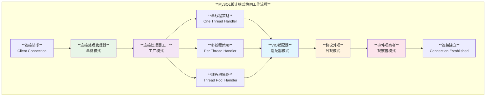

# MySQL 设计模式使用深度分析

## 概述

MySQL服务器在其复杂的架构中广泛应用了经典的设计模式，通过这些模式实现了代码的可扩展性、可维护性和模块化。从工厂模式的对象创建到观察者模式的事件处理，从单例模式的资源管理到策略模式的算法选择，MySQL展现了设计模式在大型系统架构中的实际应用。

**核心特性**：
- **创建型模式**：工厂模式、单例模式实现对象生命周期管理
- **结构型模式**：适配器、装饰器、外观模式提供接口抽象
- **行为型模式**：观察者、策略、迭代器模式实现灵活的业务逻辑
- **企业级实践**：线程安全、异常安全、RAII资源管理
- **扩展性设计**：插件化架构、组件化模块

## MySQL 设计模式架构全景

```mermaid
graph TB
    subgraph "**创建型设计模式**"
        A1["**工厂模式**<br/>Factory Pattern"]
        A2["**单例模式**<br/>Singleton Pattern"]
        A3["**建造者模式**<br/>Builder Pattern"]
        A4["**原型模式**<br/>Prototype Pattern"]
    end
    
    subgraph "**结构型设计模式**"
        B1["**适配器模式**<br/>Adapter Pattern"]
        B2["**装饰器模式**<br/>Decorator Pattern"]
        B3["**外观模式**<br/>Facade Pattern"]
        B4["**桥接模式**<br/>Bridge Pattern"]
    end
    
    subgraph "**行为型设计模式**"
        C1["**观察者模式**<br/>Observer Pattern"]
        C2["**策略模式**<br/>Strategy Pattern"]
        C3["**迭代器模式**<br/>Iterator Pattern"]
        C4["**命令模式**<br/>Command Pattern"]
    end
    
    subgraph "**MySQL核心应用场景**"
        D1["**对象创建管理**<br/>Connection/Handler Factory"]
        D2["**系统资源管理**<br/>Global Managers"]
        D3["**事件处理机制**<br/>Event Notification"]
        D4["**算法策略选择**<br/>Routing/Logging Strategy"]
    end
    
    A1 --> D1
    A2 --> D2
    B1 --> D3
    B2 --> D3
    B3 --> D4
    C1 --> D3
    C2 --> D4
    C3 --> D4
    
    style A1 fill:#e8f5e8
    style A2 fill:#e8f5e8
    style B1 fill:#f3e5f5
    style B2 fill:#f3e5f5
    style B3 fill:#f3e5f5
    style C1 fill:#e1f5fe
    style C2 fill:#e1f5fe
    style C3 fill:#e1f5fe
```



## 1. 工厂模式 (Factory Pattern)

### 1.1 元数据工厂模式

**源码位置**: `router/src/metadata_cache/src/metadata_factory.cc:48-64`

```cpp
/// @brief 集群元数据工厂 - 根据集群类型创建不同的元数据实现
std::shared_ptr<MetaData> metadata_factory_get_instance(
    const mysqlrouter::ClusterType cluster_type,
    const metadata_cache::MetadataCacheMySQLSessionConfig &session_config,
    const mysqlrouter::SSLOptions &ssl_options,
    const bool use_cluster_notifications, 
    const unsigned view_id) {
    
  // 工厂方法 - 根据集群类型选择具体实现
  switch (cluster_type) {
    case mysqlrouter::ClusterType::RS_V2:
      // 创建 Async Replication 集群元数据实现
      meta_data = std::make_unique<ARClusterMetadata>(
          session_config, ssl_options, view_id);
      break;
      
    default:
      // 创建 Group Replication 集群元数据实现
      meta_data = std::make_unique<GRClusterMetadata>(
          session_config, ssl_options, use_cluster_notifications);
  }

  return meta_data;
}
```

### 1.2 复制信息工厂

**源码位置**: `sql/rpl_info_factory.cc:85-110`

```cpp
/// @brief MySQL复制信息工厂 - 创建Master_info对象
Master_info *Rpl_info_factory::create_mi(uint mi_option, const char *channel) {
  Master_info *mi = nullptr;
  Rpl_info_handler *handler = nullptr;
  
  bool is_error = false;
  
  // RAII错误处理 - Scope Guard模式
  Scope_guard cleanup_on_error([&] {
    if (is_error) {
      if (handler) delete handler;
      if (mi) {
        mi->set_rpl_info_handler(nullptr);
        mi->channel_wrlock();
        delete mi;
        mi = nullptr;
      }
      LogErr(ERROR_LEVEL, ER_RPL_ERROR_CREATING_CONNECTION_METADATA, msg);
    }
  });

  // 创建Master_info实例
  if (!(mi = new Master_info(
#ifdef HAVE_PSI_INTERFACE
            &key_source_info_run_lock, &key_source_info_data_lock,
#endif
            channel))) {
    is_error = true;
    msg = "Failed to allocate memory for Master_info";
  }
  
  return mi;
}
```

### 1.3 连接处理器工厂

**源码位置**: `sql/conn_handler/connection_handler_manager.cc:168-181`

```cpp
/// @brief 连接处理器工厂 - 根据调度策略创建不同的连接处理器
bool Connection_handler_manager::init() {
  Connection_handler *connection_handler = nullptr;
  
  // 工厂方法 - 根据thread_handling策略选择实现
  switch (Connection_handler_manager::thread_handling) {
    case SCHEDULER_ONE_THREAD_PER_CONNECTION:
      connection_handler = new (std::nothrow) Per_thread_connection_handler();
      break;
      
    case SCHEDULER_NO_THREADS:
      connection_handler = new (std::nothrow) One_thread_connection_handler();
      break;
      
    case SCHEDULER_THREAD_POOL:
      connection_handler = new (std::nothrow) Thread_pool_connection_handler();
      break;
      
    default:
      assert(false);
  }

  if (connection_handler == nullptr) {
    return true; // 失败
  }

  m_instance = new (std::nothrow) Connection_handler_manager(connection_handler);
  return m_instance == nullptr;
}
```

## 2. 单例模式 (Singleton Pattern)

### 2.1 依赖注入管理器单例

**源码位置**: `router/src/harness/include/dim.h:48-58`

```cpp
/// @brief 依赖注入管理器 - 经典的线程安全单例实现
class HARNESS_EXPORT DIM {  // DIM = Dependency Injection Manager
  
  // 单例模式 - 私有构造函数
protected:
  DIM();
  ~DIM();

public:
  // 禁用拷贝构造和赋值运算符
  DIM(const DIM &) = delete;
  DIM &operator=(const DIM &) = delete;
  
  // 线程安全的单例获取方法
  static DIM &instance();

  // 日志注册器管理
  void set_static_LoggingRegistry(mysql_harness::logging::Registry *instance) {
    logging_registry_.set_static(instance);
  }
  
  void set_LoggingRegistry(
      mysql_harness::logging::Registry *instance,
      const std::function<void(mysql_harness::logging::Registry *)> &deleter) {
    logging_registry_.set(instance, deleter);
  }

  mysql_harness::logging::Registry &get_LoggingRegistry() const {
    return logging_registry_.get();
  }
};
```

### 2.2 路由组件单例

**源码位置**: `router/src/routing/src/routing_component.cc:182-186`

```cpp
/// @brief MySQL路由组件单例 - 管理所有路由实例
MySQLRoutingComponent &MySQLRoutingComponent::get_instance() {
  // C++11 静态局部变量 - 线程安全的单例实现
  static MySQLRoutingComponent instance;
  return instance;
}

/// @brief 路由组件的核心管理功能
class MySQLRoutingComponent {
public:
  void emplace(const std::string &name, 
               std::weak_ptr<MySQLRoutingBase> srv) {
    std::lock_guard<std::mutex> lock(routes_mu_);
    routes_.emplace(name, std::move(srv));
  }
  
  void erase(const std::string &name) {
    std::lock_guard<std::mutex> lock(routes_mu_);
    routes_.erase(name);
  }

private:
  mutable std::mutex routes_mu_;
  std::map<std::string, std::weak_ptr<MySQLRoutingBase>> routes_;
};
```

### 2.3 原始单例模板

**源码位置**: `components/masking_functions/include/masking_functions/primitive_singleton.hpp:25-33`

```cpp
/// @brief 通用单例模板 - 可以将任意类型转换为单例
template <typename T>
struct primitive_singleton {
  using instance_type = T;
  
  // noexcept规范 - 确保异常安全
  static instance_type &instance() noexcept(
      std::is_nothrow_default_constructible_v<instance_type>) {
    // 线程安全的静态局部变量
    static instance_type object;
    return object;
  }
};

// 使用示例
using MyManager = primitive_singleton<SomeManagerClass>;
auto& manager = MyManager::instance();
```

## 3. 观察者模式 (Observer Pattern)

### 3.1 服务器状态观察者

**源码位置**: `sql/replication.h:409-420`

```cpp
/// @brief 服务器状态观察者结构 - 监控服务器生命周期事件
typedef struct Server_state_observer {
  uint32 len;

  // 连接处理前回调
  before_handle_connection_t before_handle_connection;
  
  // 恢复前回调
  before_recovery_t before_recovery;
  
  // 引擎恢复后回调
  after_engine_recovery_t after_engine_recovery;
  
  // 恢复后回调
  after_recovery_t after_recovery;
  
  // 服务器关闭前回调
  before_server_shutdown_t before_server_shutdown;
  
  // 服务器关闭后回调
  after_server_shutdown_t after_server_shutdown;
  
  // 数据字典升级后回调
  after_dd_upgrade_t after_dd_upgrade_from_57;
} Server_state_observer;
```

### 3.2 连接事件观察者

**源码位置**: `plugin/connection_control/connection_control_interfaces.h:64-76`

```cpp
/// @brief 连接事件观察者接口 - 处理连接相关事件
class Connection_event_observer {
public:
  /// @brief 事件通知方法 - 处理连接事件
  virtual bool notify_event(MYSQL_THD thd,
                            Connection_event_coordinator_services *coordinator,
                            const mysql_event_connection *connection_event,
                            Error_handler *error_handler) = 0;
  
  /// @brief 系统变量通知方法 - 处理变量变更事件
  virtual bool notify_sys_var(
      Connection_event_coordinator_services *coordinator,
      opt_connection_control variable, 
      void *new_value,
      Error_handler *error_handler) = 0;
  
  virtual ~Connection_event_observer() = default;
};
```

### 3.3 审计事件消费者

**源码位置**: `components/audit_log_filter/audit_log_filter.cc:75-122`

```cpp
/// @brief 审计事件消费者 - 观察者模式的具体实现
class EventsConsumer {
public:
  // 认证事件通知
  static mysql_service_status_t notify(
      const mysql_event_tracking_authentication_data *event_data) {
    return audit_log_filter->notify_event(
        audit_event_class_t::AUDIT_AUTHENTICATION_CLASS,
        static_cast<const void *>(event_data));
  }
  
  // 命令事件通知
  static mysql_service_status_t notify(
      const mysql_event_tracking_command_data *event_data) {
    return audit_log_filter->notify_event(
        audit_event_class_t::AUDIT_COMMAND_CLASS,
        static_cast<const void *>(event_data));
  }
  
  // 连接事件通知
  static mysql_service_status_t notify(
      const mysql_event_tracking_connection_data *event_data) {
    return audit_log_filter->notify_event(
        audit_event_class_t::AUDIT_CONNECTION_CLASS,
        static_cast<const void *>(event_data));
  }
  
  // 全局变量事件通知
  static mysql_service_status_t notify(
      const mysql_event_tracking_global_variable_data *event_data) {
    return audit_log_filter->notify_event(
        audit_event_class_t::AUDIT_GLOBAL_VARIABLE_CLASS,
        static_cast<const void *>(event_data));
  }
};
```

## 4. 策略模式 (Strategy Pattern)

### 4.1 日志策略接口

**源码位置**: `router/src/router/include/mysqlrouter/mysql_session.h:298-321`

```cpp
/// @brief 日志策略基类 - 策略模式的抽象接口
struct ROUTER_MYSQL_EXPORT LoggingStrategy {
  LoggingStrategy() = default;
  
  LoggingStrategy(const LoggingStrategy &) = default;
  LoggingStrategy(LoggingStrategy &&) = default;
  
  LoggingStrategy &operator=(const LoggingStrategy &) = default;
  LoggingStrategy &operator=(LoggingStrategy &&) = default;

  virtual ~LoggingStrategy() = default;

  // 策略接口方法
  virtual bool log_will_be_ignored() const = 0;
  virtual void log(const std::string &msg) = 0;
};

/// @brief 无日志策略实现
struct ROUTER_MYSQL_EXPORT LoggingStrategyNone : public LoggingStrategy {
  // 总是忽略日志
  bool log_will_be_ignored() const override { return true; }
  
  // 空实现 - 不记录任何日志
  void log(const std::string & /*msg*/) override {}
};
```

### 4.2 路由策略应用

**源码位置**: `router/src/router/src/common/mysql_session.cc:476-506`

```cpp
/// @brief MySQL会话中的策略模式应用
stdx::expected<MySQLSession::mysql_result_type, MysqlError>
MySQLSession::logged_real_query(const std::string &q) {
  using clock_type = std::chrono::steady_clock;

  // 策略模式应用 - 根据日志策略决定是否记录
  if (logging_strategy_->log_will_be_ignored()) {
    return real_query(q);
  }

  auto start = clock_type::now();
  auto query_res = real_query(q);
  auto dur = clock_type::now() - start;
  
  // 构建日志消息
  auto msg = get_address() + " (" +
      std::to_string(
          std::chrono::duration_cast<std::chrono::microseconds>(dur).count()) +
      " us)> " + log_filter_.filter(q);
      
  if (query_res) {
    auto const *res = query_res.value().get();
    msg += " // OK";
    if (res) {
      msg += " " + std::to_string(res->row_count) + " row" +
             (res->row_count != 1 ? "s" : "");
    }
  } else {
    auto err = query_res.error();
    msg += " // ERROR: " + std::to_string(err.value()) + " " + err.message();
  }
  
  // 使用策略记录日志
  logging_strategy_->log(msg);
  return query_res;
}
```

### 4.3 路由目标策略

**源码位置**: `router/src/routing/src/destination.h:189-233`

```cpp
/// @brief 路由目标基类 - 策略模式的应用
class RouteDestination : public DestinationNodesStateNotifier {
public:
  using AddrVector = std::vector<mysql_harness::TCPAddress>;

  /// @brief 构造函数
  RouteDestination(net::io_context &io_ctx,
                   Protocol::Type protocol = Protocol::get_default())
      : io_ctx_(io_ctx), protocol_(protocol) {}

  virtual ~RouteDestination() = default;

  // 策略接口 - 返回路由策略
  virtual routing::RoutingStrategy get_strategy() = 0;

  // 通用接口方法
  virtual void add(const mysql_harness::TCPAddress dest);
  virtual void add(const std::string &address, uint16_t port);
  virtual void remove(const std::string &address, uint16_t port);

protected:
  net::io_context &io_ctx_;
  Protocol::Type protocol_;
};
```

## 5. 适配器模式 (Adapter Pattern)

### 5.1 VIO包装器适配器

**源码位置**: `plugin/x/src/ngs/vio_wrapper.h:38-64`

```cpp
/// @brief VIO包装器 - 适配器模式的经典实现
class Vio_wrapper : public xpl::iface::Vio {
public:
  explicit Vio_wrapper(::Vio *vio);

  // 适配器方法 - 将底层VIO接口适配为统一接口
  ssize_t read(uchar *buffer, ssize_t bytes_to_send) override;
  ssize_t write(const uchar *buffer, ssize_t bytes_to_send) override;

  void set_timeout_in_ms(const Direction direction,
                         const uint64_t timeout) override;
  void set_state(const PSI_socket_state state) override;
  void set_thread_owner() override;

  my_socket get_fd() override;
  xpl::Connection_type get_type() const override;
  sockaddr_storage *peer_addr(std::string *address, uint16_t *port) override;

  int shutdown() override;

  // 直接访问底层对象
  ::Vio *get_vio() override { return m_vio; }
  MYSQL_SOCKET &get_mysql_socket() override { return m_vio->mysql_socket; }

  ~Vio_wrapper() override;

private:
  ::Vio *m_vio;                    // 被适配的对象
  xpl::Mutex m_shutdown_mutex;     // 线程安全保护
};
```

### 5.2 存储适配器

**源码位置**: `sql/dd/impl/cache/storage_adapter.h:60-134`

```cpp
/// @brief 数据字典存储适配器 - 适配持久化存储访问
class Storage_adapter {
  friend class dd_cache_unittest::CacheStorageTest;

private:
  static const Object_id FIRST_OID = 10001;

  /// @brief 生成新的对象ID
  template <typename T>
  Object_id next_oid();

  /// @brief 从核心存储获取字典对象
  template <typename K, typename T>
  void core_get(const K &key, const T **object);

  Object_registry m_core_registry;  // 对象注册表
  mysql_mutex_t m_lock;            // 线程同步锁
  static bool s_use_fake_storage;  // 是否使用模拟存储

  // 私有构造函数 - 单例模式
  Storage_adapter() {
    mysql_mutex_init(PSI_NOT_INSTRUMENTED, &m_lock, MY_MUTEX_INIT_FAST);
  }

  ~Storage_adapter() {
    mysql_mutex_lock(&m_lock);
    m_core_registry.erase_all();
    mysql_mutex_unlock(&m_lock);
    mysql_mutex_destroy(&m_lock);
  }

public:
  // 单例访问
  static Storage_adapter *instance();

  /// @brief 获取核心对象数量
  template <typename T>
  size_t core_size();
};
```

## 6. 装饰器模式 (Decorator Pattern)

### 6.1 集群感知装饰器

**源码位置**: `router/src/router/src/config_generator.cc:1108-1145`

```cpp
/// @brief 集群感知装饰器 - 为MySQL会话添加集群感知能力
class ClusterAwareDecorator {
public:
  ClusterAwareDecorator(
      ClusterMetadata &metadata, 
      const std::string &cluster_initial_username,
      const std::string &cluster_initial_password,
      const std::string &cluster_initial_hostname,
      unsigned long cluster_initial_port,
      const std::string &cluster_initial_socket,
      unsigned long connection_timeout,
      std::set<MySQLErrorc> failure_codes = {
          MySQLErrorc::kSuperReadOnly,
          MySQLErrorc::kLostConnection
      })
      : metadata_(metadata),
        cluster_initial_username_(cluster_initial_username),
        cluster_initial_password_(cluster_initial_password),
        cluster_initial_hostname_(cluster_initial_hostname),
        cluster_initial_port_(cluster_initial_port),
        cluster_initial_socket_(cluster_initial_socket),
        connection_timeout_(connection_timeout),
        failure_codes_(std::move(failure_codes)) {}

  // 装饰器方法 - 为原始功能添加故障转移能力
  template <class R>
  R failover_on_failure(std::function<R()> wrapped_func);

  virtual ~ClusterAwareDecorator() = default;

protected:
  void connect(MySQLSession &session, const std::string &host,
               const unsigned port);

  ClusterMetadata &metadata_;
  // 配置参数...
  std::set<MySQLErrorc> failure_codes_;
};
```

### 6.2 文件写入装饰器

**源码位置**: `components/audit_log_filter/log_writer/file_writer_decorator_base.h:25-60`

```cpp
/// @brief 文件写入装饰器基类 - 为文件写入添加额外功能
class FileWriterDecoratorBase : public FileWriterBase {
public:
  explicit FileWriterDecoratorBase(std::unique_ptr<FileWriterBase> file_writer)
      : m_file_writer{std::move(file_writer)} {}

  /// @brief 初始化文件写入器 - 装饰模式的方法转发
  bool init() noexcept override;

  /// @brief 准备新文件 - 装饰模式的方法转发
  bool open() noexcept override;

  /// @brief 关闭文件 - 装饰模式的方法转发
  void close() noexcept override;

  /// @brief 写入文件 - 装饰模式的核心方法
  void write(const char *record, size_t size) noexcept override;

private:
  std::unique_ptr<FileWriterBase> m_file_writer;  // 被装饰的对象
};
```

## 7. 外观模式 (Facade Pattern)

### 7.1 MySQL路由外观

**源码位置**: `router/src/routing/src/mysql_routing_base.h:33-67`

```cpp
/// @brief MySQL路由外观 - 简化路由组件的复杂接口
class ROUTING_EXPORT MySQLRoutingBase {
public:
  MySQLRoutingBase() = default;
  virtual ~MySQLRoutingBase() = default;

  // 外观接口 - 提供简化的统一接口
  virtual MySQLRoutingContext &get_context() = 0;
  virtual int get_max_connections() const noexcept = 0;
  virtual std::vector<mysql_harness::TCPAddress> get_destinations() const = 0;
  virtual std::vector<MySQLRoutingAPI::ConnData> get_connections() = 0;
  virtual MySQLRoutingConnectionBase *get_connection(const std::string &) = 0;
  virtual bool is_accepting_connections() const = 0;
  virtual routing::RoutingStrategy get_routing_strategy() const = 0;
  virtual stdx::expected<void, std::string> restart_accepting_connections() = 0;
  virtual stdx::expected<void, std::string> start_accepting_connections() = 0;
  virtual void stop_socket_acceptors() = 0;

  virtual bool is_running() const = 0;
  virtual mysqlrouter::ServerMode purpose() const = 0;
};
```

### 7.2 命令委托外观

**源码位置**: `sql/server_component/mysql_command_delegates.h:37-78`

```cpp
/// @brief 命令委托 - 为MySQL命令服务提供统一外观
class Command_delegate {
public:
  Command_delegate(void *srv, SRV_CTX_H srv_ctx_h);
  virtual ~Command_delegate();

  // 外观方法 - 提供统一的回调接口
  const st_command_service_cbs *callbacks() const {
    static const st_command_service_cbs cbs = {
        &Command_delegate::call_start_result_metadata,
        &Command_delegate::call_field_metadata,
        &Command_delegate::call_end_result_metadata,
        &Command_delegate::call_start_row,
        &Command_delegate::call_end_row,
        &Command_delegate::call_abort_row,
        &Command_delegate::call_get_client_capabilities,
        &Command_delegate::call_get_null,
        &Command_delegate::call_get_integer,
        &Command_delegate::call_get_longlong,
        &Command_delegate::call_get_decimal,
        &Command_delegate::call_get_double,
        &Command_delegate::call_get_date,
        &Command_delegate::call_get_time,
        &Command_delegate::call_get_datetime,
        &Command_delegate::call_get_string,
        &Command_delegate::call_handle_ok,
        &Command_delegate::call_handle_error,
        &Command_delegate::call_shutdown,
        nullptr
    };
    return &cbs;
  }

protected:
  void *m_srv;
  SRV_CTX_H m_srv_ctx_h;
  st_command_service_cbs m_callbacks;
};
```

## 8. 设计模式组合应用

### 8.1 工厂 + 策略 + 单例组合



### 8.2 完整的企业级模式应用

```cpp
/// @brief MySQL连接管理的设计模式综合应用示例
class ConnectionManagementSystem {
private:
  // 单例模式 - 全局唯一的连接管理器
  static ConnectionManagementSystem* instance_;
  static std::mutex instance_mutex_;
  
  // 工厂模式 - 连接处理器工厂
  std::unique_ptr<ConnectionHandlerFactory> handler_factory_;
  
  // 观察者模式 - 事件监听器集合
  std::vector<std::unique_ptr<ConnectionObserver>> observers_;
  
  // 策略模式 - 当前路由策略
  std::unique_ptr<RoutingStrategy> routing_strategy_;

public:
  // 单例获取方法
  static ConnectionManagementSystem& getInstance() {
    std::lock_guard<std::mutex> lock(instance_mutex_);
    if (!instance_) {
      instance_ = new ConnectionManagementSystem();
    }
    return *instance_;
  }
  
  // 工厂方法 - 创建连接处理器
  std::unique_ptr<ConnectionHandler> createHandler(HandlerType type) {
    return handler_factory_->createHandler(type);
  }
  
  // 观察者模式 - 注册事件监听器
  void registerObserver(std::unique_ptr<ConnectionObserver> observer) {
    observers_.push_back(std::move(observer));
  }
  
  // 策略模式 - 设置路由策略
  void setRoutingStrategy(std::unique_ptr<RoutingStrategy> strategy) {
    routing_strategy_ = std::move(strategy);
  }
  
  // 外观模式 - 统一的连接处理接口
  bool handleConnection(const ConnectionRequest& request) {
    // 使用工厂创建处理器
    auto handler = createHandler(request.getHandlerType());
    
    // 使用策略选择目标
    auto target = routing_strategy_->selectTarget(request);
    
    // 通知所有观察者
    for (auto& observer : observers_) {
      observer->onConnectionEstablish(request);
    }
    
    // 处理连接
    return handler->process(request, target);
  }
};
```

## 9. 设计模式最佳实践

### 9.1 模式选择原则

```cpp
/// @brief 设计模式选择决策树
namespace DesignPatternGuidelines {

/// @brief 对象创建场景 - 选择创建型模式
class ObjectCreationGuideline {
public:
  // 需要根据条件创建不同类型对象 → 工厂模式
  template<typename T>
  static std::unique_ptr<T> chooseFactory() {
    return FactoryRegistry<T>::createInstance();
  }
  
  // 需要全局唯一实例 → 单例模式
  template<typename T>
  static T& chooseSingleton() {
    return SingletonRegistry<T>::getInstance();
  }
  
  // 需要复杂对象构建 → 建造者模式
  template<typename T>
  static T chooseBuilder() {
    return BuilderRegistry<T>::build();
  }
};

/// @brief 接口适配场景 - 选择结构型模式
class InterfaceAdaptationGuideline {
public:
  // 接口不兼容需要适配 → 适配器模式
  template<typename Target, typename Source>
  static std::unique_ptr<Target> chooseAdapter(Source* source) {
    return std::make_unique<AdapterWrapper<Target, Source>>(source);
  }
  
  // 需要动态添加功能 → 装饰器模式
  template<typename T>
  static std::unique_ptr<T> chooseDecorator(std::unique_ptr<T> base) {
    return std::make_unique<EnhancedWrapper<T>>(std::move(base));
  }
  
  // 简化复杂子系统 → 外观模式
  template<typename T>
  static std::unique_ptr<T> chooseFacade() {
    return std::make_unique<SimplifiedInterface<T>>();
  }
};

}  // namespace DesignPatternGuidelines
```

### 9.2 线程安全考虑

```cpp
/// @brief 线程安全的设计模式实现
class ThreadSafePatternImplementation {
public:
  /// @brief 线程安全单例
  class ThreadSafeSingleton {
  private:
    static std::mutex mutex_;
    static std::unique_ptr<ThreadSafeSingleton> instance_;
    
    ThreadSafeSingleton() = default;
    
  public:
    static ThreadSafeSingleton& getInstance() {
      std::lock_guard<std::mutex> lock(mutex_);
      if (!instance_) {
        instance_ = std::unique_ptr<ThreadSafeSingleton>(new ThreadSafeSingleton());
      }
      return *instance_;
    }
  };
  
  /// @brief 线程安全观察者
  class ThreadSafeObserver {
  private:
    mutable std::shared_mutex observers_mutex_;
    std::vector<std::weak_ptr<Observer>> observers_;
    
  public:
    void registerObserver(std::shared_ptr<Observer> observer) {
      std::unique_lock<std::shared_mutex> lock(observers_mutex_);
      observers_.push_back(observer);
    }
    
    void notifyObservers(const Event& event) {
      std::shared_lock<std::shared_mutex> lock(observers_mutex_);
      for (auto it = observers_.begin(); it != observers_.end();) {
        if (auto observer = it->lock()) {
          observer->notify(event);
          ++it;
        } else {
          it = observers_.erase(it);
        }
      }
    }
  };
};
```

### 9.3 RAII与异常安全

```cpp
/// @brief RAII原则在设计模式中的应用
class RAIIPatternApplication {
public:
  /// @brief RAII守卫工厂
  class RAIIGuardFactory {
  public:
    template<typename Resource, typename Deleter>
    static auto createGuard(Resource* resource, Deleter deleter) {
      return std::unique_ptr<Resource, Deleter>(resource, deleter);
    }
    
    template<typename Mutex>
    static auto createLockGuard(Mutex& mutex) {
      return std::lock_guard<Mutex>(mutex);
    }
  };
  
  /// @brief 异常安全的观察者通知
  class ExceptionSafeNotifier {
  public:
    void safeNotify(const std::vector<Observer*>& observers, 
                   const Event& event) noexcept {
      for (auto* observer : observers) {
        try {
          if (observer) {
            observer->notify(event);
          }
        } catch (const std::exception& e) {
          // 记录错误但不中断其他观察者
          LogErr(WARNING_LEVEL, ER_OBSERVER_NOTIFICATION_FAILED, 
                 e.what());
        } catch (...) {
          // 捕获所有异常
          LogErr(ERROR_LEVEL, ER_OBSERVER_UNKNOWN_ERROR);
        }
      }
    }
  };
};
```

## 总结

MySQL的设计模式应用展现了企业级软件架构的复杂性和精巧设计。通过工厂模式的灵活对象创建、单例模式的资源统一管理、观察者模式的事件驱动机制、策略模式的算法切换、适配器模式的接口兼容、装饰器模式的功能增强以及外观模式的接口简化，MySQL构建了一个既强大又可维护的数据库系统。

**核心设计原则**：
- **单一职责**：每个模式专注解决特定问题
- **开闭原则**：对扩展开放，对修改封闭
- **里氏替换**：子类可以替换父类
- **接口隔离**：客户端不应依赖不需要的接口
- **依赖倒置**：高层模块不依赖低层模块

这些设计模式的综合应用不仅提升了代码的可读性和可维护性，也为MySQL的持续发展和功能扩展提供了坚实的架构基础。对于数据库系统的设计和实现，这些模式提供了宝贵的参考价值。
