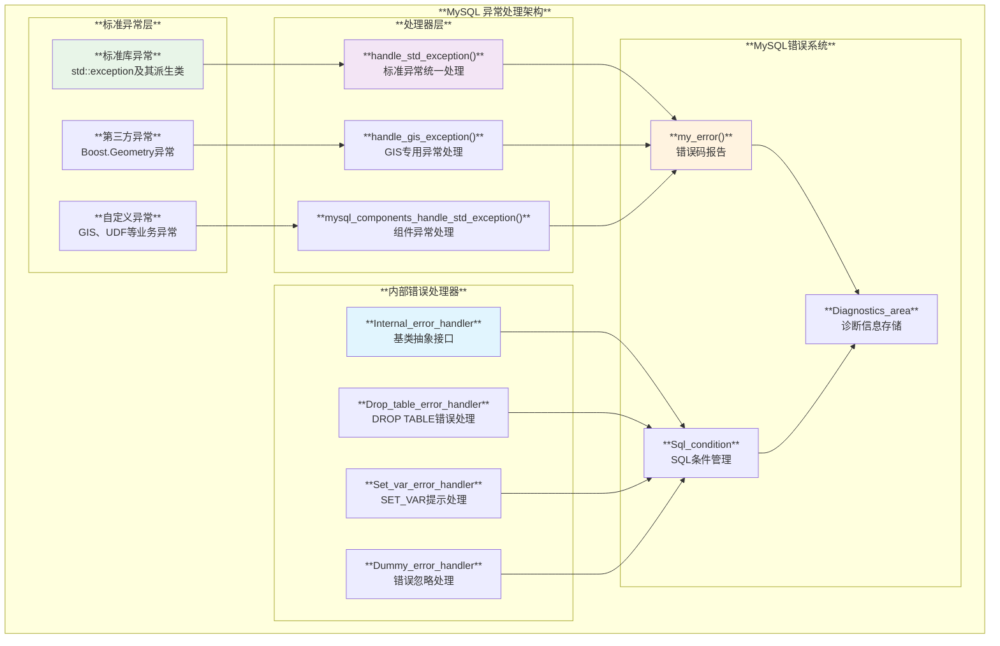
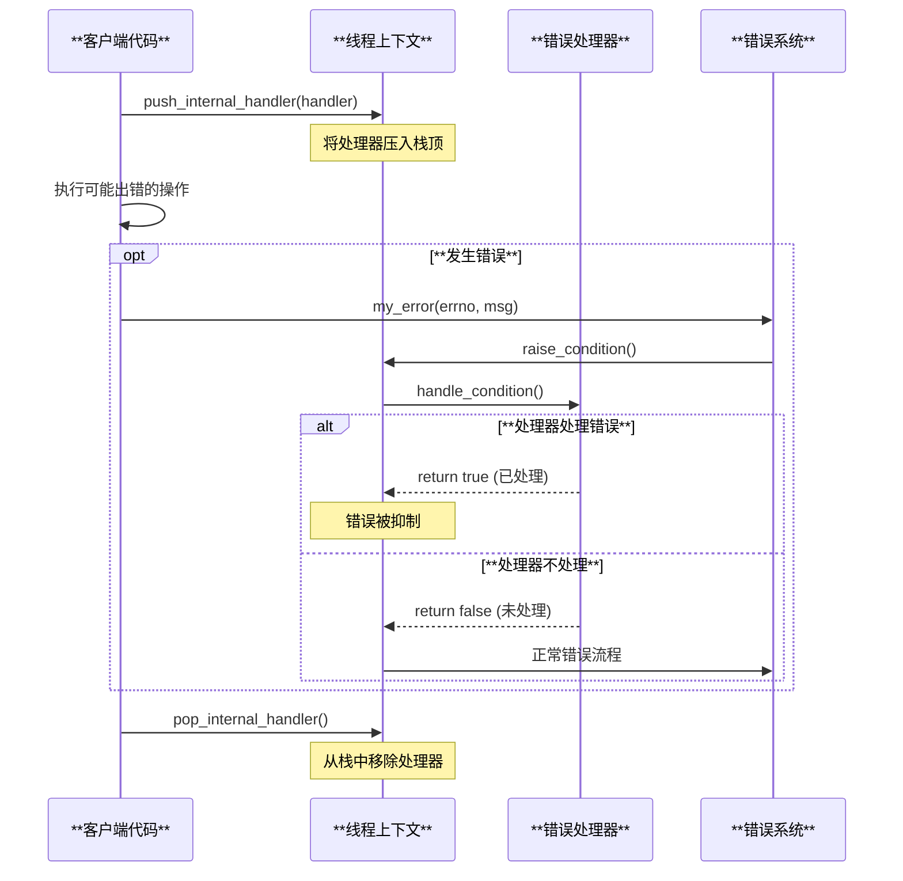
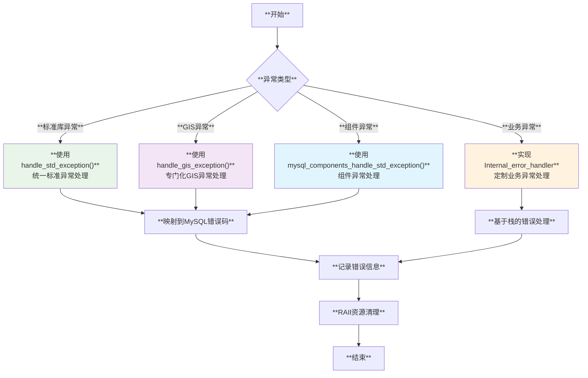

# MySQL 异常处理机制深度分析

## 概述

MySQL服务器采用多层次、结构化的异常处理机制，将C++标准异常、自定义异常与MySQL错误系统无缝集成。通过内部错误处理器、标准异常映射、RAII资源管理等技术，MySQL确保了系统的健壮性和一致性的错误处理体验。

**核心特性**：
- **分层异常处理**：标准库异常、自定义异常、MySQL错误码的统一处理
- **内部错误处理器**：基于堆栈的错误拦截和处理机制
- **异常安全保证**：RAII和`noexcept`规范确保资源正确释放
- **客户端错误映射**：MySQL客户端API错误的标准化处理
- **组件化异常**：针对不同组件（GIS、UDF、存储引擎）的专门化异常处理

## MySQL 异常处理架构体系

### 1. 异常处理层次架构



## 核心异常处理实现

### 1. 标准异常统一处理器

**源码位置**: `sql/sql_exception_handler.cc:60-90`

```cpp
/// @brief 标准库异常的统一处理入口
void handle_std_exception(const char *funcname) {
  try {
    // 重新抛出当前异常以获取类型信息
    throw;
  } catch (const std::bad_alloc &e) {
    my_error(ER_STD_BAD_ALLOC_ERROR, MYF(0), e.what(), funcname);
  } catch (const std::domain_error &e) {
    my_error(ER_STD_DOMAIN_ERROR, MYF(0), e.what(), funcname);
  } catch (const std::length_error &e) {
    my_error(ER_STD_LENGTH_ERROR, MYF(0), e.what(), funcname);
  } catch (const std::invalid_argument &e) {
    my_error(ER_STD_INVALID_ARGUMENT, MYF(0), e.what(), funcname);
  } catch (const std::out_of_range &e) {
    my_error(ER_STD_OUT_OF_RANGE_ERROR, MYF(0), e.what(), funcname);
  } catch (const std::overflow_error &e) {
    my_error(ER_STD_OVERFLOW_ERROR, MYF(0), e.what(), funcname);
  } catch (const std::range_error &e) {
    my_error(ER_STD_RANGE_ERROR, MYF(0), e.what(), funcname);
  } catch (const std::underflow_error &e) {
    my_error(ER_STD_UNDERFLOW_ERROR, MYF(0), e.what(), funcname);
  } catch (const std::logic_error &e) {
    my_error(ER_STD_LOGIC_ERROR, MYF(0), e.what(), funcname);
  } catch (const std::regex_error &e) {
    my_error(ER_STD_REGEX_ERROR, MYF(0), e.what(), funcname);
  } catch (const std::runtime_error &e) {
    my_error(ER_STD_RUNTIME_ERROR, MYF(0), e.what(), funcname);
  } catch (const std::exception &e) {
    my_error(ER_STD_UNKNOWN_EXCEPTION, MYF(0), e.what(), funcname);
  } catch (...) {
    // 处理非std::exception类型的异常
    my_error(ER_UNKNOWN_ERROR, MYF(0));
  }
}
```

**标准异常处理特色**：
- **完整覆盖**：涵盖所有标准库异常类型的详细分类处理
- **错误码映射**：每种异常类型对应专门的MySQL错误码
- **函数名追踪**：在错误信息中包含发生异常的函数名
- **兜底处理**：`catch(...)`确保所有异常都被捕获

### 2. GIS异常专用处理器

**源码位置**: `sql/sql_exception_handler.cc:92-143`

```cpp
/// @brief GIS相关异常的专门处理器
void handle_gis_exception(const char *funcname) {
  try {
    throw;
  } catch (const gis::longitude_out_of_range_exception &e) {
    my_error(ER_LONGITUDE_OUT_OF_RANGE, MYF(0), e.value, funcname, 
             e.range_min, e.range_max);
  } catch (const gis::latitude_out_of_range_exception &e) {
    my_error(ER_LATITUDE_OUT_OF_RANGE, MYF(0), e.value, funcname, 
             e.range_min, e.range_max);
  } catch (const gis::not_implemented_exception &e) {
    int er_variant;
    switch (e.srs_type()) {
      case gis::not_implemented_exception::kCartesian:
        er_variant = ER_NOT_IMPLEMENTED_FOR_CARTESIAN_SRS;
        break;
      case gis::not_implemented_exception::Srs_type::kGeographic:
        er_variant = ER_NOT_IMPLEMENTED_FOR_GEOGRAPHIC_SRS;
        break;
      case gis::not_implemented_exception::Srs_type::kProjected:
        er_variant = ER_NOT_IMPLEMENTED_FOR_PROJECTED_SRS;
        break;
    }
    my_error(er_variant, MYF(0), funcname, e.typenames());
  } catch (const gis::invalid_geometry_exception &) {
    my_error(ER_GIS_INVALID_DATA, MYF(0), funcname);
  } catch (const boost::geometry::centroid_exception &) {
    my_error(ER_BOOST_GEOMETRY_CENTROID_EXCEPTION, MYF(0), funcname);
  } catch (const boost::geometry::overlay_invalid_input_exception &) {
    my_error(ER_BOOST_GEOMETRY_OVERLAY_INVALID_INPUT_EXCEPTION, MYF(0), funcname);
  } catch (const std::exception &) {
    // 委托给标准异常处理器
    handle_std_exception(funcname);
  } catch (...) {
    my_error(ER_GIS_UNKNOWN_EXCEPTION, MYF(0), funcname);
  }
}
```

**GIS异常处理特色**：
- **业务专门化**：针对GIS计算中的坐标范围、几何有效性等问题
- **Boost集成**：处理Boost.Geometry库抛出的异常
- **详细参数**：错误信息包含具体的坐标值、范围等业务数据
- **层次化处理**：委托标准异常处理器处理通用异常

## 内部错误处理器系统

### 1. 内部错误处理器基类

**源码位置**: `sql/error_handler.h:47-92`

```cpp
/// @brief 内部错误处理器抽象基类
class Internal_error_handler {
 protected:
  Internal_error_handler() : m_prev_internal_handler(nullptr) {}
  
  Internal_error_handler *prev_internal_handler() const {
    return m_prev_internal_handler;
  }
  
  virtual ~Internal_error_handler() = default;

 public:
  /**
   * 处理SQL条件的虚函数接口
   * 
   * 类似于C++的try/throw/catch机制：
   * - 'try' 对应 THD::push_internal_handler()
   * - 'throw' 对应 my_error() -> my_message_sql()
   * - 'catch' 对应检查处理器是否被调用，然后THD::pop_internal_handler()
   * 
   * @param thd 当前线程上下文
   * @param sql_errno 错误码
   * @param sqlstate SQL状态码
   * @param level 错误级别
   * @param msg 错误消息
   * @return true表示错误已被处理，不会继续向上传播
   */
  virtual bool handle_condition(THD *thd, uint sql_errno, const char *sqlstate,
                                Sql_condition::enum_severity_level *level,
                                const char *msg) = 0;

 private:
  Internal_error_handler *m_prev_internal_handler;
  friend class THD;
};
```

### 2. 特化错误处理器实现

**源码位置**: `sql/error_handler.h:117-140`

```cpp
/// @brief SET_VAR提示的错误处理器
class Set_var_error_handler : public Internal_error_handler {
 public:
  Set_var_error_handler(bool ignore_warn_arg)
      : Internal_error_handler(),
        ignore_warn(ignore_warn_arg),
        ignore_subsequent_messages(false) {}

  bool handle_condition(THD *, uint, const char *,
                        Sql_condition::enum_severity_level *level,
                        const char *) override {
    // 将错误降级为警告
    if (*level == Sql_condition::SL_ERROR) 
      (*level) = Sql_condition::SL_WARNING;

    if (ignore_subsequent_messages) return true;
    ignore_subsequent_messages = true;

    return ignore_warn;
  }

  void reset_state() { ignore_subsequent_messages = false; }

 private:
  bool ignore_warn;
  bool ignore_subsequent_messages;
};
```

### 3. 错误处理器使用模式



## 异常安全和RAII模式

### 1. noexcept异常规范

**源码位置**: `include/mysqlpp/udf_wrappers.hpp:69-115`

```cpp
namespace udf_impl {

/// @brief UDF包装器的异常处理，使用noexcept保证
class exception_guard {
public:
  /// @brief 异常处理入口，保证不抛出异常
  static void handle_exception(const char *meta_name,
                               item_result_type item_result) noexcept {
    auto error_reporter = udf_error_reporter::instance();
    assert(error_reporter != nullptr);
    std::string buffer;
    
    try {
      // 重新抛出在catch(...)中捕获的异常
      // 这样可以在一个地方统一处理所有catch子句
      throw;
    } catch (const udf_exception &e) {
      if (e.has_error_code()) {
        auto error_code = e.get_error_code();
        if (error_code == ER_QUERY_INTERRUPTED)
          (*error_reporter)(error_code, MYF(0));
        else
          (*error_reporter)(error_code, MYF(0),
                            get_function_label(buffer, meta_name, item_result),
                            e.what());
      }
    } catch (const std::exception &e) {
      (*error_reporter)(ER_UDF_ERROR, MYF(0),
                        get_function_label(buffer, meta_name, item_result),
                        e.what());
    } catch (...) {
      (*error_reporter)(ER_UDF_ERROR, MYF(0),
                        get_function_label(buffer, meta_name, item_result),
                        "unexpected exception");
    }
  }

protected:
  template <typename ImplType>
  static void handle_exception() noexcept {
    using meta_info = udf_impl_meta_info<ImplType>;
    handle_exception(meta_info::name, meta_info::item_result);
  }
};

}  // namespace udf_impl
```

### 2. 异常安全的资源管理

**源码位置**: `components/masking_functions/src/masking_functions/sql_context.cpp:36-80`

```cpp
namespace masking_functions {

/// @brief SQL上下文的异常安全初始化
class sql_context {
private:
  /// @brief 定制删除器，保证资源正确释放
  struct deleter {
    const command_service_tuple *services;
    
    void operator()(void *ptr) const noexcept {
      if (ptr != nullptr) 
        (*services->factory->close)(to_mysql_h(ptr));
    }
  };
  
  std::unique_ptr<void, deleter> impl_;

public:
  sql_context(const command_service_tuple &services)
      : impl_{nullptr, deleter{&services}} {
    MYSQL_H local_mysql_h = nullptr;
    
    // 异常安全的初始化序列
    if ((*get_services().factory->init)(&local_mysql_h) != 0) {
      throw std::runtime_error{"Couldn't initialize server handle"};
    }
    assert(local_mysql_h != nullptr);
    
    // 安全地转移所有权给智能指针
    impl_.reset(local_mysql_h);

    // 后续配置步骤...
    if ((*get_services().options->set)(local_mysql_h, MYSQL_COMMAND_PROTOCOL,
                                       nullptr) != 0) {
      throw std::runtime_error{"Couldn't set protocol"};
    }
    
    if ((*get_services().factory->connect)(local_mysql_h) != 0) {
      throw std::runtime_error{"Couldn't establish server connection"};
    }
  }
};

}  // namespace masking_functions
```

## 客户端API异常处理

### 1. 连接重试机制

**源码位置**: `client/mysqltest.cc:6543-6692`

```cpp
/// @brief 带异常处理的安全连接函数
static void safe_connect(MYSQL *mysql, const char *name, const char *host,
                         const char *user, const char *pass, const char *db,
                         int port, const char *sock) {
  int failed_attempts = 0;
  
  verbose_msg("Connecting to server %s:%d (socket %s) as '%s', "
              "connection '%s', attempt %d ...",
              host, port, sock, user, name, failed_attempts);

  while (!mysql_real_connect_wrapper(mysql, host, user, pass, db, port, sock,
                                     CLIENT_MULTI_STATEMENTS | CLIENT_REMEMBER_OPTIONS)) {
    /*
     * 连接失败 - 只在服务器无法联系的错误时才重试
     * 错误码因协议/连接类型而异
     */
    if ((mysql_errno(mysql) == CR_CONN_HOST_ERROR ||
         mysql_errno(mysql) == CR_CONNECTION_ERROR ||
         mysql_errno(mysql) == CR_NAMEDPIPEOPEN_ERROR) &&
        failed_attempts < opt_max_connect_retries) {
      
      verbose_msg("Connect attempt %d/%d failed: %d: %s", 
                  failed_attempts, opt_max_connect_retries, 
                  mysql_errno(mysql), mysql_error(mysql));
      my_sleep(connection_retry_sleep);
    } else {
      if (failed_attempts > 0)
        die("Could not open connection '%s' after %d attempts: %d %s", 
            name, failed_attempts, mysql_errno(mysql), mysql_error(mysql));
      else
        die("Could not open connection '%s': %d %s", 
            name, mysql_errno(mysql), mysql_error(mysql));
    }
    failed_attempts++;
  }
  verbose_msg("... Connected.");
}
```

### 2. 错误状态管理

**源码位置**: `router/src/router/src/common/mysql_session.cc:452-525`

```cpp
/// @brief MySQL会话的异常安全查询执行
class MySQLSession {
public:
  /// @brief 执行查询并处理错误
  void execute(const std::string &q) {
    auto query_res = logged_real_query(q);

    if (!query_res) {
      auto ec = query_res.error();

      std::stringstream ss;
      ss << "Error executing MySQL query \"" << log_filter_.filter(q);
      ss << "\": " << ec.message() << " (" << ec.value() << ")";
      
      // 抛出包含详细信息的异常
      throw Error(ss.str(), ec.value(), ec.message());
    }
    // 成功情况下，结果会自动释放
  }

private:
  /// @brief 带日志的查询执行
  stdx::expected<mysql_result_type, MysqlError>
  logged_real_query(const std::string &q) {
    using clock_type = std::chrono::steady_clock;

    if (logging_strategy_->log_will_be_ignored()) {
      return real_query(q);
    }

    auto start = clock_type::now();
    auto query_res = real_query(q);
    auto dur = clock_type::now() - start;
    
    // 构建日志消息
    auto msg = get_address() + " (" +
        std::to_string(
            std::chrono::duration_cast<std::chrono::microseconds>(dur).count()) +
        " us)> " + log_filter_.filter(q);
        
    if (query_res) {
      auto const *res = query_res.value().get();
      msg += " // OK";
      if (res) {
        msg += " " + std::to_string(res->row_count) + " row" +
               (res->row_count != 1 ? "s" : "");
      }
    } else {
      auto err = query_res.error();
      msg += " // ERROR: " + std::to_string(err.value()) + " " + err.message();
    }
    logging_strategy_->log(msg);

    return query_res;
  }
};
```

## 异常处理最佳实践总结

### 1. 异常处理策略决策图



### 2. 关键设计原则

#### 异常安全级别
```cpp
/// @brief MySQL异常安全等级示例
namespace exception_safety {

/// @brief 基本保证 - 不泄漏资源，对象状态有效
class BasicSafety {
public:
  void operation() {
    auto guard = create_resource_guard();  // RAII保证
    // 可能抛出异常的操作
    risky_operation();
    // guard析构时自动清理
  }
};

/// @brief 强保证 - 操作成功或状态不变
class StrongSafety {
public:
  void operation() {
    auto backup = create_backup();  // 备份当前状态
    try {
      risky_operation();
      commit_changes();
    } catch (...) {
      restore_from_backup(backup);  // 恢复原始状态
      throw;
    }
  }
};

/// @brief 不抛出保证 - 操作绝不抛出异常
class NoThrowSafety {
public:
  void operation() noexcept {
    try {
      risky_operation();
    } catch (...) {
      // 错误处理，但不重新抛出
      log_error_and_continue();
    }
  }
};

}  // namespace exception_safety
```

#### 错误处理模式选择
```cpp
/// @brief MySQL错误处理模式选择指南
namespace error_handling_patterns {

/// @brief 1. 标准库代码 - 使用统一异常处理器
void standard_library_code() {
  try {
    std::vector<int> vec(SIZE_MAX);  // 可能抛出std::bad_alloc
  } catch (...) {
    handle_std_exception(__func__);
    return;
  }
}

/// @brief 2. 业务逻辑代码 - 使用内部错误处理器
void business_logic_with_handler() {
  Custom_error_handler handler;
  current_thd->push_internal_handler(&handler);
  
  // 执行可能出错的业务逻辑
  perform_complex_operation();
  
  current_thd->pop_internal_handler();
  
  if (handler.has_errors()) {
    // 根据捕获的错误进行处理
    handle_business_errors();
  }
}

/// @brief 3. 客户端API代码 - 使用错误码检查
bool client_api_code() {
  if (!mysql_real_connect(conn, host, user, pass, db, port, sock, flags)) {
    // 检查具体错误类型
    switch (mysql_errno(conn)) {
      case CR_CONN_HOST_ERROR:
      case CR_CONNECTION_ERROR:
        return retry_connection();  // 可重试错误
      default:
        log_fatal_error(mysql_error(conn));
        return false;  // 致命错误
    }
  }
  return true;
}

}  // namespace error_handling_patterns
```

### 3. 性能优化要点

```cpp
/// @brief 异常处理性能优化技巧
namespace performance_optimization {

/// @brief 1. 避免频繁异常 - 使用错误码预检查
class OptimizedErrorHandling {
public:
  bool safe_operation(const std::string& input) {
    // 预检查避免异常路径
    if (input.empty() || input.size() > MAX_SIZE) {
      set_error_code(ER_INVALID_INPUT);
      return false;
    }
    
    try {
      return perform_operation(input);
    } catch (...) {
      handle_std_exception(__func__);
      return false;
    }
  }
};

/// @brief 2. noexcept优化 - 编译器优化机会
class NoExceptOptimization {
public:
  // 移动操作标记为noexcept，提供优化机会
  NoExceptOptimization(NoExceptOptimization&& other) noexcept
      : data_(std::move(other.data_)) {}
      
  // 清理操作必须是noexcept的
  ~NoExceptOptimization() noexcept {
    cleanup_resources();
  }
  
  // 简单操作可以标记noexcept
  size_t size() const noexcept { return data_.size(); }
  
private:
  std::vector<int> data_;
};

}  // namespace performance_optimization
```

MySQL的异常处理机制体现了现代C++异常安全编程的最佳实践，通过分层处理、RAII管理和性能优化，确保了系统的健壮性和高效性。这套机制不仅处理了标准库异常，还完美集成了第三方库异常和自定义业务异常，为MySQL服务器提供了统一、可靠的错误处理基础设施。
