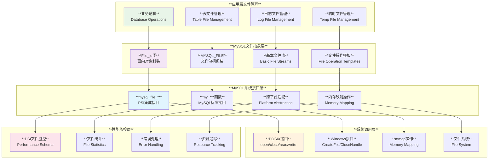
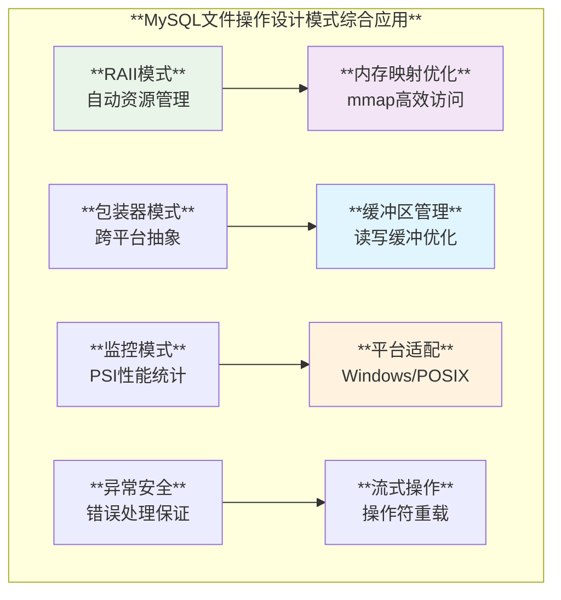

# MySQL 文件操作实现深度分析

## 概述

MySQL实现了一套完整而高效的文件操作系统，从底层的系统调用封装到高层的文件管理类，展现了现代C++在文件IO方面的最佳实践。通过POSIX标准兼容、Windows平台适配、内存映射优化、PSI性能监控以及RAII资源管理，MySQL构建了一个既跨平台又高性能的文件操作框架。

**核心特性**：
- **跨平台抽象**：统一的文件操作接口支持POSIX和Windows
- **性能监控集成**：PSI系统完整的文件IO监控和统计
- **内存映射优化**：mmap技术实现高效的文件访问
- **RAII资源管理**：自动的文件句柄和资源生命周期管理
- **异常安全保证**：完整的错误处理和资源清理机制

## MySQL 文件操作架构层次



## 1. 基础文件操作封装

### 1.1 MySQL标准文件接口

**源码位置**: `include/my_sys.h:586-617`

```cpp
/// @brief MySQL基础文件操作函数声明
namespace MySQLFileOperations {

/// @brief 文件描述符类型定义
typedef int File;

/// @brief 基础文件操作函数
extern File my_open(const char *FileName, int Flags, myf MyFlags);
extern File my_create(const char *FileName, int CreateFlags, int AccessFlags, myf MyFlags);
extern int my_close(File fd, myf MyFlags);

/// @brief 文件读写操作
extern size_t my_read(File Filedes, uchar *Buffer, size_t Count, myf MyFlags);
extern size_t my_write(File Filedes, const uchar *Buffer, size_t Count, myf MyFlags);
extern size_t my_pread(File Filedes, uchar *Buffer, size_t Count, 
                      my_off_t offset, myf MyFlags);
extern size_t my_pwrite(File Filedes, const uchar *Buffer, size_t Count, 
                       my_off_t offset, myf MyFlags);

/// @brief 文件定位操作
extern my_off_t my_seek(File fd, my_off_t pos, int whence, myf MyFlags);
extern my_off_t my_tell(File fd, myf MyFlags);

/// @brief 文件系统操作
extern int my_rename(const char *from, const char *to, myf MyFlags);
extern int my_mkdir(const char *dir, int Flags, myf MyFlags);
extern int my_delete_with_symlink(const char *name, myf MyFlags);
extern int my_rename_with_symlink(const char *from, const char *to, myf MyFlags);

/// @brief Unix Socket连接 (非Windows平台)
#ifndef __WIN__
extern File my_unix_socket_connect(const char *FileName, myf MyFlags) noexcept;
#endif

/// @brief 符号链接操作
extern int my_readlink(char *to, const char *filename, myf MyFlags);
extern int my_realpath(char *to, const char *filename, myf MyFlags);
extern int my_is_symlink(const char *filename, ST_FILE_ID *file_id);

#ifndef _WIN32
extern int my_symlink(const char *content, const char *linkname, myf MyFlags);
#endif

}  // namespace MySQLFileOperations
```

### 1.2 keyring插件文件操作封装

**源码位置**: `plugin/keyring/file_io.h:33-55`, `plugin/keyring/file_io.cc:60-107`

```cpp
/// @brief keyring插件的面向对象文件操作封装
namespace keyring {

class File_io {
private:
  ILogger *logger;  // 日志记录器

protected:
  void my_warning(int nr, ...);  // 警告信息输出

public:
  explicit File_io(ILogger *logger) : logger(logger) {}

  /// @brief 文件打开 - 带完整错误处理
  File open(PSI_file_key file_data_key, const char *filename, int flags, myf myFlags) {
    const File file = mysql_file_open(file_data_key, filename, flags, MYF(0));
    
    if (file < 0 && (myFlags & MY_WME)) {
      char error_buffer[MYSYS_STRERROR_SIZE];
      uint error_message_number = EE_FILENOTFOUND;
      
      // 特殊错误码处理
      if (my_errno() == EMFILE) 
        error_message_number = EE_OUT_OF_FILERESOURCES;
        
      my_warning(error_message_number, filename, my_errno(),
                 my_strerror(error_buffer, sizeof(error_buffer), my_errno()));
    }
    return file;
  }

  /// @brief 文件关闭 - 带错误检查
  int close(File file, myf myFlags) {
    const int result = mysql_file_close(file, MYF(0));
    
    if (result && (myFlags & MY_WME)) {
      char error_buffer[MYSYS_STRERROR_SIZE];
      my_warning(EE_BADCLOSE, my_filename(file), my_errno(),
                 my_strerror(error_buffer, sizeof(error_buffer), my_errno()));
    }
    return result;
  }

  /// @brief 文件读取 - 带完整性检查
  size_t read(File file, uchar *buffer, size_t count, myf myFlags) {
    const size_t bytes_read = mysql_file_read(file, buffer, count, MYF(0));

    if (bytes_read != count && (myFlags & MY_WME)) {
      char error_buffer[MYSYS_STRERROR_SIZE];
      my_warning(EE_READ, my_filename(file), my_errno(),
                 my_strerror(error_buffer, sizeof(error_buffer), my_errno()));
    }
    return bytes_read;
  }

  /// @brief 文件写入 - 带完整性检查
  size_t write(File file, const uchar *buffer, size_t count, myf myFlags) {
    const size_t bytes_written = mysql_file_write(file, buffer, count, MYF(0));

    if (bytes_written != count && (myFlags & (MY_WME))) {
      char error_buffer[MYSYS_STRERROR_SIZE];
      my_warning(EE_WRITE, my_filename(file), my_errno(),
                 my_strerror(error_buffer, sizeof(error_buffer), my_errno()));
    }
    return bytes_written;
  }

  // 其他文件操作
  my_off_t seek(File file, my_off_t pos, int whence, myf flags);
  my_off_t tell(File file, myf flags);
  int fstat(File file, MY_STAT *stat_area, myf myFlags);
  int sync(File file, myf myFlags);
  bool truncate(File file, myf myFlags);
  bool remove(const char *filename, myf myFlags);
};

}  // namespace keyring
```

## 2. PSI文件操作监控

### 2.1 PSI集成的文件操作

**源码位置**: `include/mysql/psi/mysql_file.h:1041-1097`

```cpp
/// @brief PSI集成的文件操作 - 性能监控和统计
namespace MySQLPSIFileOperations {

/// @brief PSI增强的文件关闭操作
static inline int inline_mysql_file_close(
#ifdef HAVE_PSI_FILE_INTERFACE
    const char *src_file, uint src_line,  // 源码位置跟踪
#endif
    File file, myf flags) {
  int result;
  
#ifdef HAVE_PSI_FILE_INTERFACE
  struct PSI_file_locker *locker;
  PSI_file_locker_state state;
  
  // 获取文件描述符监控器
  locker = PSI_FILE_CALL(get_thread_file_descriptor_locker)(&state, file,
                                                            PSI_FILE_CLOSE);
  if (likely(locker != nullptr)) {
    // 开始文件关闭等待监控
    PSI_FILE_CALL(start_file_close_wait)(locker, src_file, src_line);
    result = my_close(file, flags);
    // 结束文件关闭等待监控
    PSI_FILE_CALL(end_file_close_wait)(locker, result);
    return result;
  }
#endif

  result = my_close(file, flags);
  return result;
}

/// @brief PSI增强的文件读取操作
static inline size_t inline_mysql_file_read(
#ifdef HAVE_PSI_FILE_INTERFACE
    const char *src_file, uint src_line,
#endif
    File file, uchar *buffer, size_t count, myf flags) {
  size_t result;
  
#ifdef HAVE_PSI_FILE_INTERFACE
  struct PSI_file_locker *locker;
  PSI_file_locker_state state;
  size_t bytes_read;
  
  // 获取文件描述符监控器
  locker = PSI_FILE_CALL(get_thread_file_descriptor_locker)(&state, file,
                                                            PSI_FILE_READ);
  if (likely(locker != nullptr)) {
    // 开始文件等待监控 - 记录请求的字节数
    PSI_FILE_CALL(start_file_wait)(locker, count, src_file, src_line);
    result = my_read(file, buffer, count, flags);
    
    // 计算实际读取的字节数
    if (flags & (MY_NABP | MY_FNABP)) {
      bytes_read = (result == 0) ? count : 0;  // 全部读取或失败
    } else {
      bytes_read = (result != MY_FILE_ERROR) ? result : 0;
    }
    
    // 结束文件等待监控 - 记录实际读取字节数
    PSI_FILE_CALL(end_file_wait)(locker, bytes_read);
    return result;
  }
#endif

  result = my_read(file, buffer, count, flags);
  return result;
}

}  // namespace MySQLPSIFileOperations
```

### 2.2 MYSQL_FILE句柄封装

**源码位置**: `include/mysql/psi/mysql_file.h:778-816`

```cpp
/// @brief MYSQL_FILE - 带PSI监控的文件句柄封装
typedef struct MYSQL_FILE {
  FILE *m_file;        // 标准C文件指针
  struct PSI_file *m_psi;  // PSI文件监控对象
} MYSQL_FILE;

/// @brief PSI增强的文件打开操作
static inline MYSQL_FILE *inline_mysql_file_fopen(
#ifdef HAVE_PSI_FILE_INTERFACE
    PSI_file_key key, const char *src_file, uint src_line,
#endif
    const char *filename, int flags, myf myFlags) {
    
  MYSQL_FILE *that;
  that = (MYSQL_FILE *)my_malloc(PSI_NOT_INSTRUMENTED, sizeof(MYSQL_FILE), MYF(MY_WME));
  
  if (likely(that != nullptr)) {
#ifdef HAVE_PSI_FILE_INTERFACE
    struct PSI_file_locker *locker;
    PSI_file_locker_state state;
    
    // 获取文件名监控器
    locker = PSI_FILE_CALL(get_thread_file_name_locker)(
        &state, key, PSI_FILE_STREAM_OPEN, filename, that);
        
    if (likely(locker != nullptr)) {
      // 开始文件打开等待监控
      PSI_FILE_CALL(start_file_open_wait)(locker, src_file, src_line);
      that->m_file = my_fopen(filename, flags, myFlags);
      that->m_psi = PSI_FILE_CALL(end_file_open_wait)(locker, that->m_file);
      
      if (unlikely(that->m_file == nullptr)) {
        my_free(that);
        return nullptr;
      }
      return that;
    }
#endif

    // 无PSI监控的常规打开
    that->m_psi = nullptr;
    that->m_file = my_fopen(filename, flags, myFlags);
    if (unlikely(that->m_file == nullptr)) {
      my_free(that);
      return nullptr;
    }
  }
  return that;
}
```

## 3. RAII文件管理

### 3.1 认证系统的文件IO类

**源码位置**: `sql/auth/sql_authentication.cc:4990-5059`

```cpp
/// @brief 认证系统的RAII文件IO封装
class File_IO {
public:
  using Sql_string_t = std::string;

protected:
  Sql_string_t m_file_name;  // 文件名
  bool m_read;               // 读模式标志
  bool m_error_state;        // 错误状态
  File m_file;               // 文件句柄

  /// @brief 默认构造函数 - 保护访问
  File_IO() = default;
  
  /// @brief 读写构造函数
  File_IO(const Sql_string_t filename, bool read)
      : m_file_name(filename), m_read(read), m_error_state(false), m_file(-1) {
    file_open();
  }

  /// @brief 创建模式构造函数
  File_IO(const Sql_string_t filename, MY_MODE mode)
      : m_file_name(filename), m_read(false), m_error_state(false), m_file(-1) {
    m_file = my_create(m_file_name.c_str(), mode, O_WRONLY, MYF(MY_WME));
  }

  /// @brief 文件打开实现
  void file_open() {
    m_file = my_open(m_file_name.c_str(),
                    m_read ? O_RDONLY : O_WRONLY | O_TRUNC | O_CREAT, 
                    MYF(MY_WME));
  }

  /// @brief 检查文件是否打开
  bool file_is_open() { return m_file >= 0; }

public:
  /// @brief 流式读取操作符重载
  File_IO &operator>>(Sql_string_t &s) {
    assert(read_mode() && file_is_open());

    // 获取文件大小
    const my_off_t off = my_seek(m_file, 0, SEEK_END, MYF(MY_WME));
    if (off == MY_FILEPOS_ERROR || resize_no_exception(s, off) == false)
      set_error();
    else {
      // 回到文件开始并读取全部内容
      if (MY_FILEPOS_ERROR == my_seek(m_file, 0, SEEK_SET, MYF(MY_WME)) ||
          (size_t)-1 == my_read(m_file, reinterpret_cast<uchar *>(&s[0]), 
                               s.size(), MYF(0)))
        set_error();
      close();
    }
    return *this;
  }

  /// @brief 流式写入操作符重载
  File_IO &operator<<(const Sql_string_t &output_string) {
    assert(!read_mode() && file_is_open());
    assert(!output_string.empty());

    if ((size_t)-1 == my_write(m_file, 
                              reinterpret_cast<const uchar *>(output_string.c_str()),
                              output_string.length(), MYF(0))) {
      set_error();
    }
    close();
    return *this;
  }

private:
  bool read_mode() const { return m_read; }
  void set_error() { m_error_state = true; }
  void close() { 
    if (file_is_open()) {
      my_close(m_file, MYF(MY_WME));
      m_file = -1;
    }
  }
};
```

### 3.2 NDB文件类的RAII实现

**源码位置**: `storage/ndb/src/common/util/File.cpp:62-118`

```cpp
/// @brief NDB集群的File_class - 完整的RAII文件管理
class File_class {
private:
  FILE *m_file;                // C文件指针
  char m_fileName[PATH_MAX];   // 文件名缓冲区
  const char *m_fileMode;      // 文件模式

public:
  /// @brief 默认构造函数
  File_class() : m_file(nullptr), m_fileMode("r") {}

  /// @brief 带参数构造函数
  File_class(const char *aFileName, const char *mode)
      : m_file(nullptr), m_fileMode(mode) {
    BaseString::snprintf(m_fileName, PATH_MAX, "%s", aFileName);
  }

  /// @brief RAII析构函数 - 自动关闭文件
  ~File_class() { close(); }

  /// @brief 文件打开
  bool open(const char *aFileName, const char *mode) {
    assert(m_file == nullptr);  // 防止重复打开
    
    if (m_fileName != aFileName) {
      BaseString::snprintf(m_fileName, PATH_MAX, "%s", aFileName);
    }
    m_fileMode = mode;
    
    bool rc = true;
    if ((m_file = ::fopen(m_fileName, m_fileMode)) == nullptr) {
      rc = false;
    }
    return rc;
  }

  /// @brief 检查文件是否打开
  bool is_open() { return (m_file != nullptr); }

  /// @brief 安全的文件关闭 - 处理EINTR
  bool close() {
    bool rc = true;
    int retval = 0;

    if (m_file != nullptr) {
      ::fflush(m_file);
      retval = ::fclose(m_file);
      
      // 处理被信号中断的情况
      while ((retval != 0) && (errno == EINTR)) {
        retval = ::fclose(m_file);
      }
      
      if (retval == 0) {
        rc = true;
      } else {
        rc = false;
        g_eventLogger->info("ERROR: Close file error in File.cpp for %s",
                            strerror(errno));
      }
    }
    m_file = nullptr;
    return rc;
  }

  /// @brief 文件读取操作
  int read(void *buf, size_t itemSize, size_t nitems) const {
    return (int)::fread(buf, itemSize, nitems, m_file);
  }

  /// @brief 字符缓冲区读取
  int readChar(char *buf, long start, long length) const {
    return (int)::fread((void *)&buf[start], 1, length, m_file);
  }

  /// @brief 文件写入操作
  int write(const void *buf, size_t size_arg, size_t nitems) {
    return (int)::fwrite(buf, size_arg, nitems, m_file);
  }

  /// @brief 静态文件删除方法
  static bool remove(const char *aFileName) {
    return ::remove(aFileName) == 0 ? true : false;
  }

  /// @brief 实例文件删除方法
  bool remove() {
    close();  // 先关闭文件
    return File_class::remove(m_fileName);
  }
};
```

## 4. 内存映射文件操作

### 4.1 跨平台mmap抽象

**源码位置**: `mysys/my_mmap.cc:56-108`

```cpp
/// @brief 跨平台内存映射实现
namespace MySQLMemoryMapping {

#ifdef _WIN32
/// @brief Windows内存映射实现
static SECURITY_ATTRIBUTES mmap_security_attributes = {
    sizeof(SECURITY_ATTRIBUTES), nullptr, TRUE};

void *my_mmap(void *addr, size_t len, int prot, int flags, File fd, my_off_t offset) {
  HANDLE hFileMap;
  LPVOID ptr;
  HANDLE hFile = my_get_osfhandle(fd);
  DBUG_TRACE;
  DBUG_PRINT("mysys", ("map fd: %d", fd));

  if (hFile == INVALID_HANDLE_VALUE) return MAP_FAILED;

  // 创建文件映射对象
  hFileMap = CreateFileMapping(hFile, &mmap_security_attributes, PAGE_READWRITE,
                               0, (DWORD)len, nullptr);
  if (hFileMap == nullptr) return MAP_FAILED;

  // 映射文件视图
  ptr = MapViewOfFile(hFileMap,
                      prot & PROT_WRITE ? FILE_MAP_WRITE : FILE_MAP_READ,
                      (DWORD)(offset >> 32), (DWORD)offset, len);

  /*
   * MSDN明确说明可以在视图未取消映射时关闭文件映射对象
   * 每个视图内部存储对应文件映射对象的句柄，对象会保持打开状态直到取消映射
   */
  CloseHandle(hFileMap);

  if (ptr) {
    DBUG_PRINT("mysys", ("mapped addr: %p", ptr));
    return ptr;
  }

  return MAP_FAILED;
}

/// @brief Windows内存取消映射
int my_munmap(void *addr, size_t len) {
  DBUG_TRACE;
  DBUG_PRINT("mysys", ("unmap addr: %p", addr));
  return UnmapViewOfFile(addr) ? 0 : -1;
}

/// @brief Windows内存同步
int my_msync(int fd, void *addr, size_t len, int flags) {
  return FlushViewOfFile(addr, len) ? 0 : -1;
}

#else
/// @brief POSIX内存映射实现 (Linux/Unix)
void *my_mmap(void *addr, size_t len, int prot, int flags, File fd, my_off_t offset) {
#ifdef HAVE_SYS_MMAN_H
  void *ptr = mmap(addr, len, prot, flags, fd, offset);
  if (ptr == MAP_FAILED) {
    return MAP_FAILED;
  }
  return ptr;
#else
  return MAP_FAILED;
#endif
}

int my_munmap(void *addr, size_t len) {
#ifdef HAVE_SYS_MMAN_H
  return munmap(addr, len);
#else
  return -1;
#endif
}
#endif

}  // namespace MySQLMemoryMapping
```

### 4.2 MyISAM存储引擎的mmap应用

**源码位置**: `storage/myisam/mi_dynrec.cc:79-111`

```cpp
/// @brief MyISAM动态记录的内存映射实现
bool mi_dynmap_file(MI_INFO *info, my_off_t size) {
  DBUG_TRACE;
  
  // 检查文件大小的有效性
  if (size == 0 || size > (my_off_t)(~((size_t)0))) {
    if (size)
      DBUG_PRINT("warning", ("File is too large for mmap"));
    else
      DBUG_PRINT("warning", ("Do not mmap zero-length"));
    return true;
  }
  
  /*
   * MAP_NORESERVE的考虑：
   * 不为此映射保留交换空间。当保留交换空间时，可以保证能够修改映射。
   * 当不保留交换空间时，如果没有可用的物理内存，写入时可能会收到SIGSEGV。
   */
  info->s->file_map = (uchar *)my_mmap(
      nullptr, (size_t)size,
      info->s->mode == O_RDONLY ? PROT_READ : PROT_READ | PROT_WRITE,
      MAP_SHARED | MAP_NORESERVE, info->dfile, 0L);
      
  if (info->s->file_map == (uchar *)MAP_FAILED) {
    info->s->file_map = nullptr;
    return true;
  }
  
#if defined(HAVE_MADVISE)
  // 建议系统这是随机访问模式
  madvise((char *)info->s->file_map, size, MADV_RANDOM);
#endif

  info->s->mmaped_length = size;
  info->s->file_read = mi_mmap_pread;    // 设置映射读函数
  info->s->file_write = mi_mmap_pwrite;  // 设置映射写函数
  return false;
}
```

### 4.3 TempTable引擎的mmap临时文件

**源码位置**: `storage/temptable/include/temptable/memutils.h:189-238`

```cpp
/// @brief TempTable引擎的内存映射临时文件实现
template<>
inline void *Memory<Source::MMAP_FILE>::fetch(size_t bytes) {
  DBUG_EXECUTE_IF("temptable_fetch_from_disk_return_null", return nullptr;);

#ifdef _WIN32
  const int mode = _O_RDWR;
#else
  const int mode = O_RDWR;
#endif

  char file_path[FN_REFLEN];
  // 创建临时文件
  File f = create_temp_file(file_path, mysql_tmpdir, "mysql_temptable.", 
                           mode, UNLINK_FILE, MYF(MY_WME));
  if (f < 0) {
    return nullptr;
  }

  // 预分配文件空间并写入0xa字节
  if (my_fallocator(f, bytes, 0xa, MYF(MY_WME)) != 0 ||
      my_seek(f, 0, MY_SEEK_SET, MYF(MY_WME)) == MY_FILEPOS_ERROR) {
    my_close(f, MYF(MY_WME));
    return nullptr;
  }

  // 内存映射文件
  void *ptr = my_mmap(nullptr, bytes, PROT_READ | PROT_WRITE, MAP_SHARED, f, 0);

  /*
   * 重要说明：在MMAP后立即关闭文件描述符不会影响MMAP功能。
   * POSIX和Microsoft实现都在其内部结构中保留对文件描述符的引用，
   * 因此我们可以安全地释放它。
   *
   * 好处：我们不需要在内存中保留文件描述符，这使得fetch/drop的实现更简单。
   *
   * 参考：
   * POSIX (http://pubs.opengroup.org/onlinepubs/7908799/xsh/mmap.html)
   *   mmap()函数为与文件描述符fildes关联的文件添加额外引用，
   *   该引用不会通过对该文件描述符的后续close()调用而删除。
   *   当不再有文件映射时，此引用被删除。
   *
   * Microsoft MSDN文档说明创建文件映射对象后可以关闭文件句柄，
   * 系统会保持相应文件打开，直到文件的最后一个视图被取消映射。
   */
  my_close(f, MYF(MY_WME));

  return (ptr == MAP_FAILED) ? nullptr : ptr;
}

/// @brief 内存映射文件的释放
template<>
inline void Memory<Source::MMAP_FILE>::drop(void *ptr, size_t bytes) {
  if (ptr != nullptr) {
    my_munmap(ptr, bytes);
  }
}
```

## 5. 高级文件操作技术

### 5.1 Windows平台特殊处理

**源码位置**: `mysys/my_winfile.cc:428-452`

```cpp
/// @brief Windows平台的POSIX兼容层
namespace WindowsFileOperations {

/// @brief Windows文件打开 - POSIX兼容
File my_win_open(const char *path, int mode) {
  DBUG_TRACE;
  return my_win_sopen(path, mode | _O_BINARY, _SH_DENYNO, _S_IREAD | S_IWRITE);
}

/// @brief Windows文件关闭 - 错误处理优化
int my_win_close(File fd) {
  DBUG_TRACE;

  const WindowsErrorGuard weg;  // RAII错误状态保护
  const HandleInfo unreg = UnregisterHandle(fd);
  if (unreg.handle == INVALID_HANDLE_VALUE) return -1;

  if (!CloseHandle(unreg.handle)) return -1;

  return 0;
}

/// @brief Windows句柄获取
HANDLE my_get_osfhandle(File fd) {
  DBUG_TRACE;
  return GetHandleInfo(fd).handle;
}

/// @brief Windows错误状态保护类 - RAII模式
class WindowsErrorGuard {
private:
  DWORD saved_last_error_;
  
public:
  WindowsErrorGuard() : saved_last_error_(GetLastError()) {}
  
  ~WindowsErrorGuard() {
    // 恢复之前的错误状态，避免误判
    SetLastError(saved_last_error_);
  }
};

}  // namespace WindowsFileOperations
```

### 5.2 现代C++文件流操作

```cpp
/// @brief 现代C++风格的文件操作封装
namespace ModernFileOperations {

/// @brief RAII文件句柄包装器
class FileHandle {
private:
  File fd_;
  std::string filename_;

public:
  /// @brief 构造函数 - 自动打开文件
  explicit FileHandle(const std::string& filename, int flags = O_RDONLY, myf myflags = MYF(0))
      : filename_(filename) {
    fd_ = my_open(filename_.c_str(), flags, myflags);
    if (fd_ < 0) {
      throw std::runtime_error("Failed to open file: " + filename_);
    }
  }

  /// @brief 禁用拷贝构造和赋值
  FileHandle(const FileHandle&) = delete;
  FileHandle& operator=(const FileHandle&) = delete;

  /// @brief 移动构造函数
  FileHandle(FileHandle&& other) noexcept
      : fd_(std::exchange(other.fd_, -1)), filename_(std::move(other.filename_)) {}

  /// @brief 移动赋值操作符
  FileHandle& operator=(FileHandle&& other) noexcept {
    if (this != &other) {
      close();
      fd_ = std::exchange(other.fd_, -1);
      filename_ = std::move(other.filename_);
    }
    return *this;
  }

  /// @brief RAII析构函数
  ~FileHandle() {
    close();
  }

  /// @brief 获取文件描述符
  File get() const noexcept { return fd_; }

  /// @brief 检查文件是否有效
  bool is_valid() const noexcept { return fd_ >= 0; }

  /// @brief 显式关闭文件
  void close() {
    if (fd_ >= 0) {
      my_close(fd_, MYF(0));
      fd_ = -1;
    }
  }

  /// @brief 文件大小获取
  size_t size() const {
    if (!is_valid()) return 0;
    
    my_off_t current = my_tell(fd_, MYF(0));
    my_off_t end = my_seek(fd_, 0, SEEK_END, MYF(0));
    my_seek(fd_, current, SEEK_SET, MYF(0));  // 恢复位置
    
    return static_cast<size_t>(end);
  }

  /// @brief 读取全部内容到字符串
  std::string read_all() const {
    if (!is_valid()) return {};
    
    size_t file_size = size();
    std::string content(file_size, '\0');
    
    my_off_t current = my_tell(fd_, MYF(0));
    my_seek(fd_, 0, SEEK_SET, MYF(0));
    
    size_t bytes_read = my_read(fd_, reinterpret_cast<uchar*>(content.data()), 
                               file_size, MYF(0));
    
    my_seek(fd_, current, SEEK_SET, MYF(0));  // 恢复位置
    
    if (bytes_read != file_size) {
      content.resize(bytes_read);
    }
    
    return content;
  }

  /// @brief 写入字符串内容
  bool write_all(const std::string& content) {
    if (!is_valid()) return false;
    
    size_t bytes_written = my_write(fd_, 
                                   reinterpret_cast<const uchar*>(content.data()),
                                   content.size(), MYF(0));
    
    return bytes_written == content.size();
  }
};

/// @brief 智能文件指针类型别名
using FilePtr = std::unique_ptr<FileHandle>;

/// @brief 文件工厂函数
inline FilePtr make_file(const std::string& filename, int flags = O_RDONLY) {
  try {
    return std::make_unique<FileHandle>(filename, flags);
  } catch (const std::exception&) {
    return nullptr;
  }
}

/// @brief 文件内容读取函数
inline std::optional<std::string> read_file_content(const std::string& filename) {
  auto file = make_file(filename, O_RDONLY);
  if (!file || !file->is_valid()) {
    return std::nullopt;
  }
  
  return file->read_all();
}

/// @brief 文件内容写入函数
inline bool write_file_content(const std::string& filename, const std::string& content) {
  auto file = make_file(filename, O_WRONLY | O_CREAT | O_TRUNC);
  if (!file || !file->is_valid()) {
    return false;
  }
  
  return file->write_all(content);
}

}  // namespace ModernFileOperations
```

## 6. 文件操作最佳实践总结

### 6.1 设计原则和模式应用



### 6.2 核心技术要点

```cpp
/// @brief MySQL文件操作最佳实践总结
namespace FileOperationBestPractices {

/// @brief 1. 异常安全的文件操作
class SafeFileOperations {
public:
  // 使用RAII确保资源释放
  template<typename Func>
  static auto safe_file_operation(const std::string& filename, Func&& func) 
      -> decltype(func(std::declval<File>())) {
    File fd = my_open(filename.c_str(), O_RDONLY, MYF(MY_WME));
    if (fd < 0) {
      throw std::runtime_error("Cannot open file: " + filename);
    }
    
    // 使用RAII确保文件关闭
    auto closer = create_scope_guard([fd]() {
      my_close(fd, MYF(0));
    });
    
    return func(fd);
  }
};

/// @brief 2. 错误处理策略
enum class FileErrorPolicy {
  THROW_EXCEPTION,    // 抛出异常
  RETURN_ERROR_CODE,  // 返回错误码
  LOG_AND_CONTINUE   // 记录日志并继续
};

template<FileErrorPolicy Policy>
class FileErrorHandler {
public:
  template<typename T>
  static auto handle_error(const std::string& operation, const std::string& filename, T default_value) {
    if constexpr (Policy == FileErrorPolicy::THROW_EXCEPTION) {
      throw std::runtime_error(operation + " failed for file: " + filename);
    } else if constexpr (Policy == FileErrorPolicy::RETURN_ERROR_CODE) {
      return std::make_pair(default_value, my_errno());
    } else {
      LogErr(WARNING_LEVEL, ER_FILE_OPERATION_FAILED, operation.c_str(), filename.c_str());
      return default_value;
    }
  }
};

/// @brief 3. 性能优化策略
class FilePerformanceOptimizer {
public:
  // 预读优化
  static void prefetch_file(File fd, size_t size) {
#ifdef HAVE_POSIX_FADVISE
    posix_fadvise(fd, 0, size, POSIX_FADV_WILLNEED);
#endif
  }
  
  // 顺序访问优化
  static void sequential_access_hint(File fd) {
#ifdef HAVE_POSIX_FADVISE
    posix_fadvise(fd, 0, 0, POSIX_FADV_SEQUENTIAL);
#endif
  }
  
  // 随机访问优化
  static void random_access_hint(File fd) {
#ifdef HAVE_POSIX_FADVISE
    posix_fadvise(fd, 0, 0, POSIX_FADV_RANDOM);
#endif
  }
  
  // 直接IO优化 (绕过系统缓存)
  static File open_direct_io(const char* filename) {
#ifdef O_DIRECT
    return my_open(filename, O_RDONLY | O_DIRECT, MYF(MY_WME));
#else
    return my_open(filename, O_RDONLY, MYF(MY_WME));
#endif
  }
};

/// @brief 4. 内存映射最佳实践
class MemoryMappingBestPractices {
public:
  // 大文件分块映射
  static std::vector<void*> map_large_file(File fd, size_t total_size, 
                                          size_t chunk_size = 1024*1024*128) {
    std::vector<void*> mappings;
    size_t offset = 0;
    
    while (offset < total_size) {
      size_t map_size = std::min(chunk_size, total_size - offset);
      void* ptr = my_mmap(nullptr, map_size, PROT_READ, MAP_SHARED, fd, offset);
      
      if (ptr != MAP_FAILED) {
        mappings.push_back(ptr);
        offset += map_size;
      } else {
        // 清理已映射的区域
        for (auto* p : mappings) {
          my_munmap(p, chunk_size);
        }
        mappings.clear();
        break;
      }
    }
    
    return mappings;
  }
  
  // 映射区域预热
  static void warmup_mapping(void* ptr, size_t size) {
    // 触发页面加载
    volatile char* p = static_cast<volatile char*>(ptr);
    for (size_t i = 0; i < size; i += 4096) {
      (void)*p;  // 读取每个页面
      p += 4096;
    }
  }
};

}  // namespace FileOperationBestPractices
```

## 总结

MySQL的文件操作实现展现了系统级软件在文件IO方面的复杂性和精细化设计。通过跨平台的统一抽象、PSI系统的性能监控、RAII模式的资源管理、内存映射的性能优化以及完整的错误处理机制，MySQL构建了一个既高效又可靠的文件操作框架。

**核心设计特色**：
- **跨平台兼容**：统一的接口支持POSIX和Windows平台
- **性能监控集成**：完整的PSI文件操作统计和分析
- **RAII资源管理**：自动化的文件句柄生命周期管理
- **内存映射优化**：高效的大文件访问和临时文件处理
- **异常安全保证**：完整的错误处理和资源清理机制

这套文件操作系统不仅保证了MySQL在各种操作系统下的稳定运行，也为高性能文件处理应用的设计和实现提供了宝贵的参考价值。通过学习MySQL的文件操作实现，可以深入理解现代C++在系统编程中的应用技巧和最佳实践。
