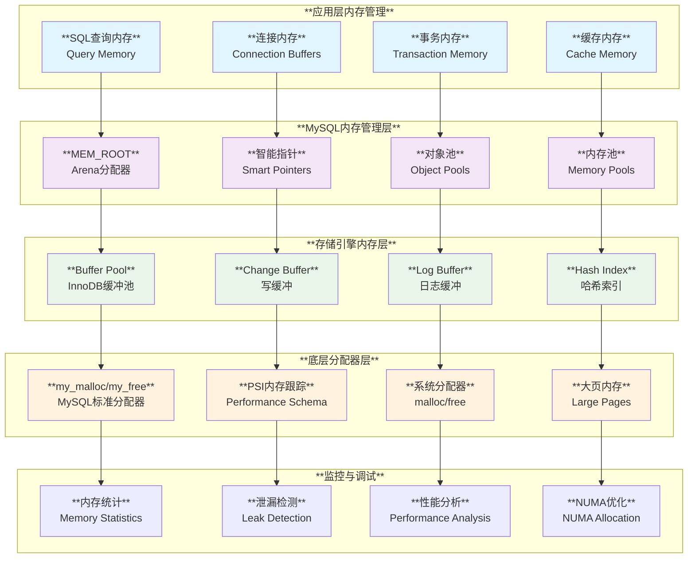
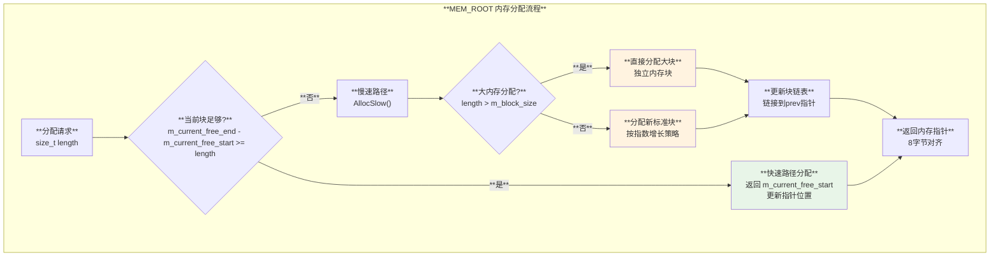
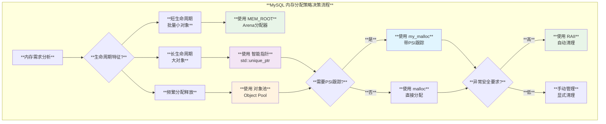

# MySQL 内存管理机制深度分析

## 概述

MySQL实现了一套复杂而高效的内存管理体系，涵盖从底层的系统内存分配到高层的对象生命周期管理。通过RAII原则、智能指针、内存池、PSI监控等技术的综合运用，MySQL实现了高性能、内存安全且可观测的内存管理架构。

**核心特性**：
- **分层内存管理**：从系统级到应用级的多层内存抽象
- **自动化管理**：基于RAII的自动资源释放
- **性能监控**：PSI集成的内存使用跟踪
- **异常安全**：确保异常情况下的资源正确释放
- **高性能优化**：内存池、对象池等性能优化技术

## MySQL 内存管理架构层次图



## 1. MEM_ROOT 内存分配器

### 1.1 MEM_ROOT 核心设计

**源码位置**: `include/my_alloc.h:84-429`

MEM_ROOT是MySQL的arena分配器，专为批量小内存分配设计：

```cpp
/// @brief MEM_ROOT - MySQL的高效内存池分配器
struct MEM_ROOT {
private:
  struct Block {
    Block *prev{nullptr};     ///< 前一个块链表指针
    char *end{nullptr};       ///< 块结束位置标记
  };

public:
  // 构造函数 - 支持PSI内存跟踪
  MEM_ROOT(PSI_memory_key key, size_t block_size)
      : m_block_size(block_size),
        m_orig_block_size(block_size),
        m_psi_key(key) {
#if defined(MYSQL_SERVER)
    m_error_handler = sql_alloc_error_handler;
#endif
  }
  
  // 移动构造 - 高效的资源转移
  MEM_ROOT(MEM_ROOT &&other) noexcept
      : m_current_block(other.m_current_block),
        m_current_free_start(other.m_current_free_start),
        m_current_free_end(other.m_current_free_end),
        m_block_size(other.m_block_size),
        m_allocated_size(other.m_allocated_size),
        m_psi_key(other.m_psi_key) {
    // 清理源对象状态
    other.m_current_block = nullptr;
    other.m_allocated_size = 0;
    other.m_current_free_start = &s_dummy_target;
    other.m_current_free_end = &s_dummy_target;
  }

private:
  Block *m_current_block = nullptr;           ///< 当前分配块
  char *m_current_free_start = &s_dummy_target; ///< 空闲区域起始
  char *m_current_free_end = &s_dummy_target;   ///< 空闲区域结束
  size_t m_block_size;                        ///< 下次分配的块大小
  size_t m_orig_block_size;                   ///< 初始块大小
  size_t m_max_capacity = 0;                  ///< 最大容量限制
  size_t m_allocated_size = 0;                ///< 已分配总大小
  PSI_memory_key m_psi_key = 0;              ///< PSI内存跟踪键
};
```

### 1.2 MEM_ROOT 分配流程



**关键特性**：
- **O(1)分配性能**：快速路径仅需几个CPU周期
- **指数增长策略**：块大小按50%递增，减少malloc调用
- **8字节对齐**：确保内存访问效率
- **异常安全**：析构时自动释放所有分配的内存

## 2. PSI 内存跟踪系统

### 2.1 PSI 内存监控架构

**源码位置**: `include/mysql/psi/psi_memory.h:78-103`, `components/library_mysys/my_memory.cc:49-93`

```cpp
/// @brief PSI内存头部结构 - 跟踪每次内存分配
struct my_memory_header {
  PSI_memory_key m_key;        ///< 内存分类标识
  unsigned int m_magic;        ///< 魔数防止损坏检测
  size_t m_size;              ///< 分配的内存大小
  PSI_thread *m_owner;        ///< 分配线程的PSI句柄
};

/// @brief 带PSI跟踪的内存分配函数
extern "C" void *my_malloc(PSI_memory_key key, size_t size, int flags) {
  my_memory_header *mh;
  size_t raw_size;
  
  // 为header预留空间
  raw_size = HEADER_SIZE + size;
  
  // 根据标志位选择分配方式
  if (flags & MY_ZEROFILL)
    mh = (my_memory_header *)calloc(raw_size, 1);
  else
    mh = (my_memory_header *)malloc(raw_size);

  if (mh != nullptr) {
    void *user_ptr;
    mh->m_magic = MAGIC;
    mh->m_size = size;
    
    // 向Performance Schema注册内存分配
    mh->m_key = PSI_MEMORY_CALL(memory_alloc)(key, size, &mh->m_owner);
    
    user_ptr = HEADER_TO_USER(mh);
    MEM_MALLOCLIKE_BLOCK(user_ptr, size, 0, (flags & MY_ZEROFILL));
    return user_ptr;
  }
  return nullptr;
}

/// @brief 带PSI跟踪的内存释放函数
extern "C" void my_free(void *ptr) {
  my_memory_header *mh;

  if (ptr == nullptr) return;

  mh = USER_TO_HEADER(ptr);
  assert(mh->m_magic == MAGIC);
  
  // 向Performance Schema报告内存释放
  PSI_MEMORY_CALL(memory_free)(mh->m_key, mh->m_size, mh->m_owner);
  
  // 防双重释放检测
  mh->m_magic = 0xDEAD;
  MEM_FREELIKE_BLOCK(ptr, 0);
  free(mh);
}
```

### 2.2 PSI 内存分类注册

**源码位置**: `storage/temptable/src/block.cc:60-79`

```cpp
/// @brief TempTable引擎的PSI内存分类
PSI_memory_info pfs_info[] = {
    {&mem_key_physical_disk, "physical_disk", PSI_FLAG_MEM_COLLECT, 0,
     PSI_DOCUMENT_ME},
    {&mem_key_physical_ram, "physical_ram", PSI_FLAG_MEM_COLLECT, 0,
     PSI_DOCUMENT_ME},
};

/// @brief PSI内存分类初始化
void Block_PSI_init() {
#ifdef TEMPTABLE_PFS_MEMORY
  // 注册内存分类到Performance Schema
  PSI_MEMORY_CALL(register_memory)("temptable", pfs_info, pfs_info_num_elements);
#endif
}

/// @brief 逻辑内存分配跟踪
void Block_PSI_track_logical_allocation(size_t size) {
#ifdef TEMPTABLE_PFS_MEMORY_COUNT_LOGICAL
  PSI_thread *owner_thread;
  PSI_memory_key key = PSI_MEMORY_CALL(memory_alloc)(mem_key_logical, size, &owner_thread);
  assert(key == mem_key_logical || key == PSI_NOT_INSTRUMENTED);
#endif
}
```

## 3. InnoDB Buffer Pool 内存管理

### 3.1 Buffer Pool 分配架构

**源码位置**: `storage/innobase/buf/buf0buf.cc:908-951`

```cpp
/// @brief InnoDB缓冲池内存块分配
bool buf_pool_t::allocate_chunk(buf_chunk_t *chunk, ulint mem_size, bool populate) {
  ut_ad(mutex_own(&chunks_mutex));
  
  // 使用大页内存分配器
  chunk->mem = static_cast<uint8_t *>(ut::malloc_large_page_withkey(
      ut::make_psi_memory_key(mem_key_buf_buf_pool), mem_size,
      ut::fallback_to_normal_page_t{}, os_use_large_pages, populate));
      
  if (chunk->mem == nullptr) {
    return false;
  }
  
  // 配置MADV_DONTDUMP避免核心转储包含大内存
  if (buf_pool_should_madvise) {
    if (!chunk->madvise_dont_dump()) {
      innobase_disable_core_dump();
    }
  }
  
#ifdef HAVE_LIBNUMA
  // NUMA内存绑定优化
  if (srv_numa_interleave) {
    const auto low_level_info = ut::large_page_low_level_info(
        chunk->mem, ut::fallback_to_normal_page_t{});
    struct bitmask *numa_nodes = numa_get_mems_allowed();
    
    // 使用mbind系统调用实现NUMA内存交错分布
    int st = mbind(low_level_info.base_ptr, low_level_info.allocation_size,
                   MPOL_INTERLEAVE, numa_nodes->maskp, numa_nodes->size,
                   MPOL_MF_MOVE);
    if (st != 0) {
      ib::warn(ER_IB_MSG_54, low_level_info.base_ptr,
               low_level_info.allocation_size, "MPOL_INTERLEAVE",
               "MPOL_MF_MOVE", strerror(errno));
    }
    numa_bitmask_free(numa_nodes);
  }
#endif /* HAVE_LIBNUMA */

  return true;
}
```

### 3.2 InnoDB 智能指针工厂

**源码位置**: `storage/innobase/include/ut0new.h:2357-2417`

```cpp
/// @brief InnoDB的智能指针工厂函数 - 带PSI跟踪
template <typename T, typename Deleter = detail::Deleter<T>, typename... Args>
std::enable_if_t<!std::is_array<T>::value, std::unique_ptr<T, Deleter>>
make_unique(PSI_memory_key_t key, Args &&...args) {
  return std::unique_ptr<T, Deleter>(
      ut::new_withkey<T>(key, std::forward<Args>(args)...));
}

/// @brief 数组类型的智能指针工厂
template <typename T, typename Deleter = detail::Array_deleter<std::remove_extent_t<T>>>
std::enable_if_t<detail::is_unbounded_array_v<T>, std::unique_ptr<T, Deleter>>
make_unique(PSI_memory_key_t key, size_t size) {
  return std::unique_ptr<T, Deleter>(
      ut::new_arr_withkey<std::remove_extent_t<T>>(key, ut::Count{size}));
}

/// @brief 对齐内存的智能指针工厂
template <typename T, typename Deleter = detail::Aligned_deleter<std::remove_extent_t<T>>>
std::unique_ptr<T, Deleter> make_unique_aligned(PSI_memory_key_t key, 
                                               size_t alignment, size_t size) {
  return std::unique_ptr<T, Deleter>(
      ut::aligned_new_arr_withkey<std::remove_extent_t<T>>(key, size, alignment));
}
```

## 4. 自定义内存分配器

### 4.1 Keyring 安全分配器

**源码位置**: `plugin/keyring/common/keyring_memory.h:56-89`

```cpp
/// @brief Keyring插件的安全内存分配器
template <class T>
class Secure_allocator {
public:
  using size_type = size_t;
  using pointer = T *;
  using value_type = T;

  Secure_allocator() noexcept {}

  template <class U>
  Secure_allocator(const Secure_allocator<U> &) noexcept {}

  /// @brief 安全内存分配
  T *allocate(size_t n) {
    if (n == 0)
      return nullptr;
    else if (n > INT_MAX)
      throw std::bad_alloc();
    return keyring_malloc<T *>(n * sizeof(T));
  }

  /// @brief 安全内存释放 - 自动清零敏感数据
  void deallocate(T *p, size_t n) noexcept {
    memset_s(p, n, 0, n);  // 清零敏感数据
    my_free(p);
  }

  template <class U>
  struct rebind {
    typedef Secure_allocator<U> other;
  };
};
```

### 4.2 STL容器的MySQL集成

**源码位置**: `include/map_helpers.h:90-120`

```cpp
/// @brief MySQL优化的STL分配器类型别名
template <class Key, class Value, class Compare = std::less<Key>>
using Map_myalloc = std::map<Key, Value, Compare, Map_allocator_type<Key, Value>>;

template <class T>
using Vector_myalloc = std::vector<T, Map_allocator_type<T>>;

/// @brief 带自定义删除器的智能指针类型
template <class T>
using unique_ptr_with_deleter = std::unique_ptr<T, void (*)(T *)>;

template <class T>
using unique_ptr_my_free = std::unique_ptr<T, My_free_deleter>;

/// @brief STL容器查找助手函数
template <class Container, class Key>
static inline auto find_or_nullptr(const Container &container, const Key &key) {
  const auto it = container.find(key);
  if (it == container.end()) return static_cast<decltype(&*it->second)>(nullptr);
  return &it->second;
}
```

## 5. RAII 资源管理模式

### 5.1 THD 资源自动管理

**源码位置**: `sql/sql_class.cc:1383-1529`

```cpp
/// @brief THD对象的RAII资源释放
void THD::release_resources() {
  // 释放线程ID资源
  Global_THD_manager::get_instance()->release_thread_id(m_thread_id);

  // 线程安全的状态管理
  mysql_mutex_lock(&LOCK_query_plan);
  mysql_mutex_lock(&LOCK_thd_data);
  start_disposal();  // 标记为正在销毁

  // 关闭网络连接
  if (is_classic_protocol() && get_protocol_classic()->get_vio()) {
    vio_delete(get_protocol_classic()->get_vio());
    get_protocol_classic()->end_net();
  }

  mysql_mutex_unlock(&LOCK_thd_data);
  mysql_mutex_unlock(&LOCK_query_plan);

  // 预处理语句自动清理
  stmt_map.reset(); /* close all prepared statements */
  
  if (!is_cleanup_done()) cleanup();

  // MDL上下文清理
  mdl_context.destroy();
  ha_close_connection(this);

#if defined(ENABLED_DEBUG_SYNC)
  debug_sync_end_thread(this);
#endif

  plugin_thdvar_cleanup(this, m_enable_plugins);
}

/// @brief THD析构函数 - 完整的资源清理
THD::~THD() {
  if (!release_resources_done()) release_resources();

  // 清理数据库名
  my_free(const_cast<char *>(m_db.str));
  m_db = NULL_CSTR;
  
  // 事务内存清理
  get_transaction()->free_memory();
  
  // 互斥锁销毁
  mysql_mutex_destroy(&LOCK_query_plan);
  mysql_mutex_destroy(&LOCK_thd_data);
  mysql_mutex_destroy(&LOCK_thd_query);
  mysql_mutex_destroy(&LOCK_temporary_tables);
  // ... 更多mutex销毁
  
  // 条件变量销毁
  mysql_cond_destroy(&COND_thr_lock);
  mysql_cond_destroy(&COND_group_replication_connection_cond_var);

  // 主内存根清理
  main_mem_root.Clear();

  if (m_token_array != nullptr) {
    my_free(m_token_array);
  }

  m_thd_life_cycle_stage = enum_thd_life_cycle_stages::DISPOSED;
}
```

### 5.2 客户端资源RAII管理

**源码位置**: `client/mysqltest.cc:1508-1560`

```cpp
/// @brief 客户端资源的线程安全清理
static void free_used_memory() {
  static std::atomic<bool> already_freed{false};
  
  // 线程安全的单次执行保证
  if (already_freed.exchange(true)) {
    return;
  }

  // 智能指针管理的资源自动清理
  delete expected_errors;      // std::unique_ptr<ErrorList>
  delete disabled_warnings;    // std::unique_ptr<WarningList> 
  delete enabled_warnings;     // std::unique_ptr<WarningList>
  delete var_hash;            // std::unique_ptr<VarHash>
  delete q_lines;             // std::unique_ptr<CommandQueue>
  delete global_attrs;        // std::unique_ptr<GlobalAttributes>

  // 手动管理的C风格资源
  if (connections) close_connections();
  close_files();

  // 动态字符串数组清理
  for (size_t i = 0; i < 10; i++) {
    if (var_reg[i].alloced_len) my_free(var_reg[i].str_val);
  }

  // MySQL服务器清理
  if (server_initialized) mysql_server_end();
}
```

## 6. 内存管理最佳实践

### 6.1 内存分配策略选择



### 6.2 内存管理配置建议

**系统级配置**：
```ini
[mysqld]
# Buffer Pool 配置 (系统内存的70-80%)
innodb_buffer_pool_size = 8G
innodb_buffer_pool_instances = 8
innodb_buffer_pool_chunk_size = 128M

# 大页内存启用 (减少TLB miss)
large_pages = ON
innodb_use_large_pages = ON

# NUMA 内存交错分布
innodb_numa_interleave = ON

# 表和定义缓存
table_open_cache = 4000
table_definition_cache = 2000

# 连接和线程内存
thread_cache_size = 50
max_connections = 1000

# 排序和临时表内存
sort_buffer_size = 2M
tmp_table_size = 64M
max_heap_table_size = 64M
```

**编程级最佳实践**：
```cpp
/// @brief 内存管理最佳实践示例

// 1. 优先使用智能指针进行RAII管理
auto buffer = std::make_unique<char[]>(buffer_size);
auto connection = ut::make_unique<Connection>(ut::make_psi_memory_key(mem_key));

// 2. 批量小对象使用MEM_ROOT
MEM_ROOT mem_root(key_memory_thd, 512);
char *temp_buf = (char*)mem_root.Alloc(temp_size);

// 3. 长生命周期对象使用PSI跟踪分配
void *global_data = my_malloc(key_memory_global, size, MYF(0));

// 4. 敏感数据使用安全分配器
std::vector<char, Secure_allocator<char>> password_buffer;

// 5. 异常安全的资源管理
class Resource_guard {
  void *ptr_;
public:
  explicit Resource_guard(size_t size) 
    : ptr_(my_malloc(key_memory_temp, size, MYF(0))) {
    if (!ptr_) throw std::bad_alloc();
  }
  ~Resource_guard() { my_free(ptr_); }
  void *get() const { return ptr_; }
};
```

## 7. 内存监控与调试

### 7.1 Performance Schema 内存监控

**查询内存使用统计**：
```sql
-- 查看各组件内存使用情况
SELECT event_name, 
       CURRENT_NUMBER_OF_BYTES_USED/1024/1024 AS current_mb,
       HIGH_NUMBER_OF_BYTES_USED/1024/1024 AS high_mb,
       CURRENT_COUNT_USED as current_count,
       HIGH_COUNT_USED as high_count
FROM performance_schema.memory_summary_global_by_event_name
WHERE CURRENT_NUMBER_OF_BYTES_USED > 0
ORDER BY current_mb DESC
LIMIT 20;

-- 查看线程级内存使用
SELECT t.processlist_id, t.processlist_user, t.processlist_host,
       m.event_name,
       m.CURRENT_NUMBER_OF_BYTES_USED/1024/1024 AS current_mb
FROM performance_schema.memory_summary_by_thread_by_event_name m
JOIN performance_schema.threads t ON m.thread_id = t.thread_id
WHERE m.CURRENT_NUMBER_OF_BYTES_USED > 0
ORDER BY current_mb DESC
LIMIT 50;
```

### 7.2 内存泄漏检测机制

```cpp
/// @brief 内存泄漏检测器实现示例
class Memory_leak_detector {
private:
  struct Allocation_info {
    size_t size;
    const char *file;
    int line;
    std::chrono::steady_clock::time_point timestamp;
  };
  
  mysql_mutex_t m_mutex;
  std::unordered_map<void*, Allocation_info> m_allocations;
  
public:
  /// @brief 记录内存分配
  void record_allocation(void *ptr, size_t size, 
                        const char *file, int line) {
    if (!ptr) return;
    
    mysql_mutex_lock(&m_mutex);
    m_allocations[ptr] = {
      size, file, line, std::chrono::steady_clock::now()
    };
    mysql_mutex_unlock(&m_mutex);
  }
  
  /// @brief 记录内存释放
  void record_deallocation(void *ptr) {
    if (!ptr) return;
    
    mysql_mutex_lock(&m_mutex);
    m_allocations.erase(ptr);
    mysql_mutex_unlock(&m_mutex);
  }
  
  /// @brief 检查内存泄漏
  void check_for_leaks() {
    mysql_mutex_lock(&m_mutex);
    
    auto now = std::chrono::steady_clock::now();
    size_t total_leaked = 0;
    
    for (const auto &alloc : m_allocations) {
      auto duration = std::chrono::duration_cast<std::chrono::minutes>(
          now - alloc.second.timestamp);
      
      // 超过10分钟的分配视为潜在泄漏
      if (duration.count() > 10) {
        LogErr(WARNING_LEVEL, ER_POTENTIAL_MEMORY_LEAK,
               alloc.first, alloc.second.size,
               alloc.second.file, alloc.second.line,
               duration.count());
        total_leaked += alloc.second.size;
      }
    }
    
    if (total_leaked > 100 * 1024 * 1024) {  // 100MB
      LogErr(ERROR_LEVEL, ER_SIGNIFICANT_MEMORY_LEAK, total_leaked);
    }
    
    mysql_mutex_unlock(&m_mutex);
  }
};

// 内存分配跟踪宏
#ifdef DEBUG
#define TRACKED_MALLOC(size) \
  memory_leak_detector.record_allocation( \
    malloc(size), size, __FILE__, __LINE__)

#define TRACKED_FREE(ptr) do { \
  memory_leak_detector.record_deallocation(ptr); \
  free(ptr); \
} while(0)
#else
#define TRACKED_MALLOC(size) malloc(size)
#define TRACKED_FREE(ptr) free(ptr)
#endif
```

## 总结

MySQL的内存管理机制展现了系统级软件在资源管理方面的复杂性和精细化程度。通过MEM_ROOT的高效批量分配、PSI系统的全面监控、智能指针的RAII管理、以及各种专用分配器的协同工作，MySQL实现了一个既高性能又安全可靠的内存管理体系。

**核心设计原则**：
- **性能优先**：针对不同使用模式的优化策略
- **安全第一**：异常安全和资源泄漏防护
- **可观测性**：全面的内存使用监控和分析
- **可扩展性**：支持NUMA、大页等现代硬件特性

这套内存管理机制不仅保证了MySQL在各种工作负载下的稳定运行，也为数据库系统的内存管理实现提供了宝贵的设计参考。
