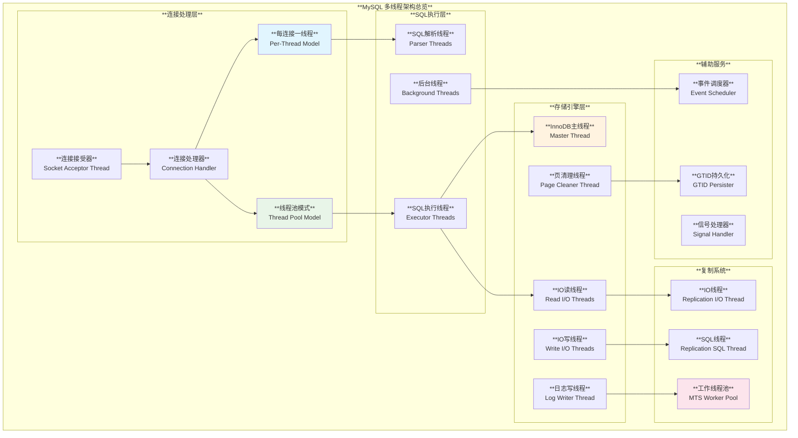
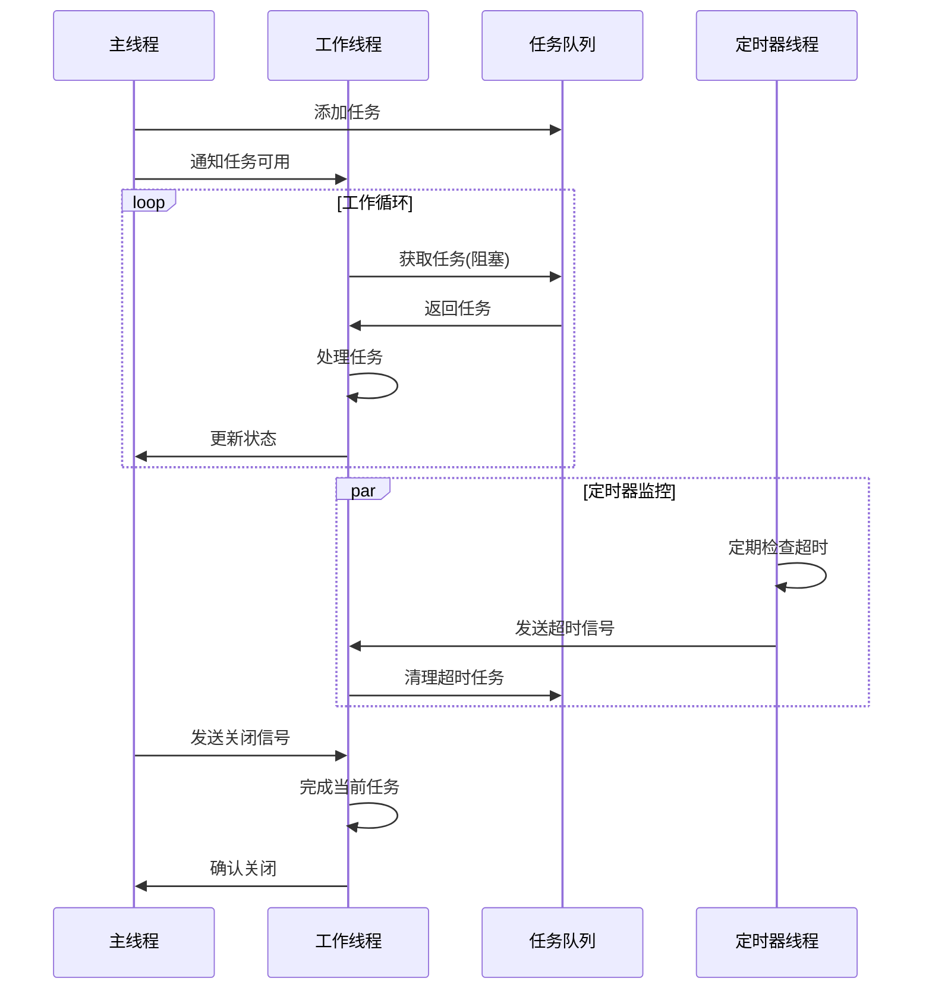
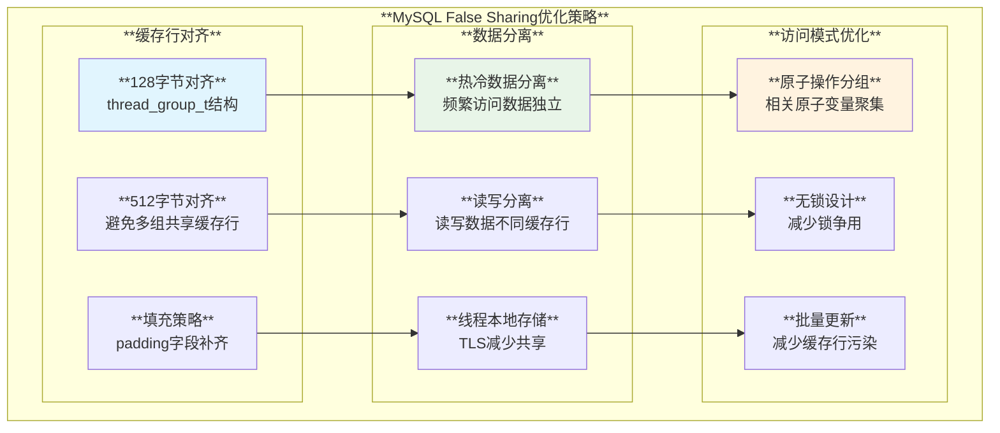

# MySQL 多线程编程模式深度分析

## 概述

MySQL作为一个高并发的数据库系统，内部大量使用多线程技术来处理客户端连接、SQL执行、存储引擎操作、复制等各种任务。MySQL的多线程编程模式既包括对POSIX线程的封装，也包括现代C++标准库多线程特性的应用，形成了一套完善的并发编程框架。

**核心特性**：
- **封装的同步原语**：mysql_mutex_t、mysql_cond_t等高性能同步机制
- **线程池技术**：高效的工作线程池和连接管理
- **线程安全数据结构**：支持高并发的安全数据结构
- **异步任务处理**：事件驱动的异步任务管理
- **死锁检测**：智能的死锁检测和预防机制

## MySQL 多线程架构体系

### 1. 线程模型总体架构



### 2. 同步原语使用矩阵

| **同步原语** | **MySQL封装** | **主要用途** | **性能特点** | **使用频率** | **典型场景** |
|-------------|--------------|-------------|-------------|-------------|-------------|
| **互斥锁** | `mysql_mutex_t` | 临界区保护 | **高性能** | ⭐⭐⭐⭐⭐ | **全局变量保护** |
| **条件变量** | `mysql_cond_t` | 线程同步等待 | **高效阻塞** | ⭐⭐⭐⭐ | **事件等待** |
| **读写锁** | `mysql_rwlock_t` | 读写分离 | **读并发优化** | ⭐⭐⭐ | **配置变量访问** |
| **原子操作** | `std::atomic` | 无锁编程 | **极高性能** | ⭐⭐⭐⭐ | **计数器、标志位** |
| **自旋锁** | `ib_mutex_t` | 短时间等待 | **低延迟** | ⭐⭐ | **InnoDB内部** |

## 核心多线程技术分析

### 1. MySQL同步原语封装

**源码位置**: `sql/mysqld.cc:1604-1643`

```cpp
// MySQL全局互斥锁声明
mysql_mutex_t LOCK_status, LOCK_uuid_generator, LOCK_crypt,
    LOCK_global_system_variables, LOCK_user_conn, LOCK_error_messages;
mysql_mutex_t LOCK_sql_rand;

mysql_mutex_t LOCK_global_user_client_stats, LOCK_global_table_stats,
    LOCK_global_index_stats;

/// @brief 保护prepared statement计数的专用锁
mysql_mutex_t LOCK_prepared_stmt_count;

/// @brief 保护复制从库列表的锁
mysql_mutex_t LOCK_replica_list;

/// @brief 复制相关的专用锁
mysql_mutex_t LOCK_sql_replica_skip_counter;
mysql_mutex_t LOCK_replica_net_timeout;
mysql_mutex_t LOCK_replica_trans_dep_tracker;

// 读写锁声明
mysql_rwlock_t LOCK_sys_init_connect, LOCK_sys_init_replica;
mysql_rwlock_t LOCK_system_variables_hash;

// 条件变量
mysql_cond_t COND_server_started;
mysql_mutex_t LOCK_server_started;
```

**初始化过程**: `sql/mysqld.cc:7196-7228`

```cpp
static int init_thread_environment() {
  // 互斥锁初始化
  mysql_mutex_init(key_LOCK_status, &LOCK_status, MY_MUTEX_INIT_FAST);
  mysql_mutex_init(key_LOCK_manager, &LOCK_manager, MY_MUTEX_INIT_FAST);
  mysql_mutex_init(key_LOCK_crypt, &LOCK_crypt, MY_MUTEX_INIT_FAST);
  mysql_mutex_init(key_LOCK_user_conn, &LOCK_user_conn, MY_MUTEX_INIT_FAST);
  mysql_mutex_init(key_LOCK_global_system_variables,
                   &LOCK_global_system_variables, MY_MUTEX_INIT_FAST);

  // 读写锁初始化
  mysql_rwlock_init(key_rwlock_LOCK_system_variables_hash,
                    &LOCK_system_variables_hash);

  // 复制相关锁初始化
  mysql_mutex_init(key_LOCK_replica_list, &LOCK_replica_list,
                   MY_MUTEX_INIT_FAST);
  mysql_mutex_init(key_LOCK_sql_replica_skip_counter,
                   &LOCK_sql_replica_skip_counter, MY_MUTEX_INIT_FAST);
  
  return 0;
}
```

**封装特色**：
- **PSI性能监控**：每个锁都关联PSI_key用于性能监控
- **快速初始化**：使用`MY_MUTEX_INIT_FAST`优化初始化性能
- **类型安全**：强类型封装避免锁类型混用

### 2. 线程池实现机制

**源码位置**: `sql/threadpool_unix.cc:127-147`

```cpp
/// @brief 线程组结构 - 512字节对齐避免false sharing
struct alignas(128) thread_group_t {
  mysql_mutex_t mutex;                  // 组内互斥锁
  connection_queue_t queue;             // 普通连接队列
  connection_queue_t high_prio_queue;   // 高优先级连接队列
  worker_list_t waiting_threads;        // 等待线程列表
  worker_thread_t *listener;            // 监听线程
  pthread_attr_t *pthread_attr;         // 线程属性
  int pollfd;                           // epoll文件描述符
  int thread_count;                     // 线程总数
  int active_thread_count;              // 活跃线程数
  int connection_count;                 // 连接数
  int waiting_thread_count;             // 等待线程数
  int io_event_count;                   // IO事件计数
  int queue_event_count;                // 队列事件计数
  ulonglong last_thread_creation_time;  // 最后创建线程时间
  int shutdown_pipe[2];                 // 关闭管道
  bool shutdown;                        // 关闭标志
  bool stalled;                         // 停滞标志
  char padding[328];                    // 填充到512字节
};

static_assert(sizeof(thread_group_t) == 512,
              "sizeof(thread_group_t) must be 512 to avoid false sharing");
```

**全局线程池定时器**: `sql/threadpool_unix.cc:162-171`

```cpp
/// @brief 全局定时器结构
struct pool_timer_t {
  mysql_mutex_t mutex;                          // 定时器互斥锁
  mysql_cond_t cond;                           // 定时器条件变量
  std::atomic<uint64> current_microtime;       // 当前微秒时间
  std::atomic<uint64> next_timeout_check;      // 下次超时检查时间
  int tick_interval;                           // 时钟间隔
  bool shutdown;                               // 关闭标志
};

static pool_timer_t pool_timer;
```

### 3. 工作线程主循环实现

**源码位置**: `sql/threadpool_unix.cc:1432-1446`

```cpp
/// @brief 工作线程主函数
static void *worker_main(void *param) {
  my_thread_init();
  DBUG_ENTER("worker_main");

  thread_group_t *thread_group = (thread_group_t *)param;

  // 初始化线程本地结构
  worker_thread_t this_thread;
  mysql_cond_init(key_worker_cond, &this_thread.cond);
  this_thread.thread_group = thread_group;
  this_thread.event_count = 0;

#ifdef HAVE_PSI_THREAD_INTERFACE
  // 设置PSI线程账户信息
  PSI_THREAD_CALL(set_thread_account)(nullptr, 0, nullptr, 0);
#endif

  // 主事件循环
  for (;;) {
    connection_t *connection;
    struct timespec ts;
    set_timespec(&ts, threadpool_idle_timeout);

    // 获取待处理连接（可能阻塞）
    connection = get_event(&this_thread, thread_group, &ts);
    if (!connection) break;  // 超时或关闭信号，退出循环

    this_thread.event_count++;
    
    // 处理连接事件
    handle_event(connection);
  }

  // 线程清理
  mysql_cond_destroy(&this_thread.cond);

  mysql_mutex_lock(&thread_group->mutex);
  add_thread_count(thread_group, -1);
  mysql_mutex_unlock(&thread_group->mutex);

  my_thread_end();
  DBUG_RETURN(nullptr);
}
```

### 4. 连接处理多线程模型

**源码位置**: `sql/conn_handler/connection_handler_manager.cc:169-181`

```cpp
bool Connection_handler_manager::init() {
  Connection_handler *connection_handler = nullptr;
  
  // 根据配置选择连接处理模式
  switch (Connection_handler_manager::thread_handling) {
    case SCHEDULER_ONE_THREAD_PER_CONNECTION:
      // 每连接一线程模式
      connection_handler = new (std::nothrow) Per_thread_connection_handler();
      break;
    case SCHEDULER_NO_THREADS:
      // 单线程模式（调试用）
      connection_handler = new (std::nothrow) One_thread_connection_handler();
      break;
    case SCHEDULER_THREAD_POOL:
      // 线程池模式
      connection_handler = new (std::nothrow) Thread_pool_connection_handler();
      break;
    default:
      assert(false);
  }

  if (connection_handler == nullptr) return true;

  m_instance = new (std::nothrow) Connection_handler_manager(connection_handler);
  
  // 注册PSI监控
#ifdef HAVE_PSI_INTERFACE
  int count = static_cast<int>(array_elements(all_conn_manager_mutexes));
  mysql_mutex_register("sql", all_conn_manager_mutexes, count);
  
  count = static_cast<int>(array_elements(all_conn_manager_conds));
  mysql_cond_register("sql", all_conn_manager_conds, count);
#endif

  return false;
}
```

### 5. THD线程上下文管理

**源码位置**: `sql/sql_class.h:1729-1746`

```cpp
class THD {
private:
  /**
    保护current_mutex和current_cond访问的互斥锁
  */
  mysql_mutex_t LOCK_current_cond;
  
  /**
    与current_cond一起使用的互斥锁
    @see current_cond
  */
  std::atomic<mysql_mutex_t *> current_mutex;
  
  /**
    当前拥有此THD的线程正在等待的条件变量的指针。
    如果线程不在等待，值为NULL。由THD::enter_cond()设置。
    
    如果此线程被终止(shutdown或KILL语句)，另一个线程
    将在此条件变量上广播，以便线程可以解除阻塞。
  */
  std::atomic<mysql_cond_t *> current_cond;
  
  /**
    THR_LOCK.c子系统用于等待的条件变量
  */
  mysql_cond_t COND_thr_lock;

public:
  /// @brief 启用ha_commit_low中的排序。用于binlog::commit
  void enable_low_level_commit_ordering();
  
  /// @brief 禁用ha_commit_low中的排序
  void disable_low_level_commit_ordering();
};
```

## 高级多线程应用模式

### 1. Group Replication中的线程封装

**源码位置**: `plugin/group_replication/src/thread/mysql_thread.cc:42-80`

```cpp
class Mysql_thread {
private:
  PSI_thread_key m_thread_key;
  PSI_mutex_key m_mutex_key;
  PSI_cond_key m_cond_key;
  PSI_mutex_key m_dispatcher_mutex_key;
  PSI_cond_key m_dispatcher_cond_key;
  
  Thread_state m_state;
  bool m_aborted;
  
  // 运行控制锁和条件变量
  mysql_mutex_t m_run_lock;
  mysql_cond_t m_run_cond;
  
  // 分发器锁和条件变量
  mysql_mutex_t m_dispatcher_lock;
  mysql_cond_t m_dispatcher_cond;
  
  // 任务队列
  Abortable_synchronized_queue<Mysql_thread_task *> *m_trigger_queue;

public:
  Mysql_thread(PSI_thread_key thread_key,
               PSI_mutex_key run_mutex_key,
               PSI_cond_key run_cond_key,
               PSI_mutex_key dispatcher_mutex_key,
               PSI_cond_key dispatcher_cond_key)
    : m_thread_key(thread_key),
      m_mutex_key(run_mutex_key),
      m_cond_key(run_cond_key),
      m_dispatcher_mutex_key(dispatcher_mutex_key),
      m_dispatcher_cond_key(dispatcher_cond_key),
      m_state(),
      m_aborted(false) {
    
    // 初始化所有同步原语
    mysql_mutex_init(m_mutex_key, &m_run_lock, MY_MUTEX_INIT_FAST);
    mysql_cond_init(m_cond_key, &m_run_cond);
    mysql_mutex_init(m_dispatcher_mutex_key, &m_dispatcher_lock,
                     MY_MUTEX_INIT_FAST);
    mysql_cond_init(m_dispatcher_cond_key, &m_dispatcher_cond);
    
    // 创建可中止的同步队列
    m_trigger_queue = new Abortable_synchronized_queue<Mysql_thread_task *>(
        key_mysql_thread_queued_task);
  }

  ~Mysql_thread() {
    // 清理所有同步原语
    mysql_mutex_destroy(&m_run_lock);
    mysql_cond_destroy(&m_run_cond);
    mysql_mutex_destroy(&m_dispatcher_lock);
    mysql_cond_destroy(&m_dispatcher_cond);
    
    // 清理任务队列
    if (nullptr != m_trigger_queue) {
      while (m_trigger_queue->size() > 0) {
        Mysql_thread_task *task = nullptr;
        m_trigger_queue->pop(&task);
      }
    }
    delete m_trigger_queue;
  }
};
```

### 2. 线程初始化和启动流程

**源码位置**: `plugin/group_replication/src/thread/mysql_thread.cc:82-107`

```cpp
bool Mysql_thread::initialize() {
  DBUG_TRACE;

  mysql_mutex_lock(&m_run_lock);
  if (m_state.is_thread_alive()) {
    mysql_mutex_unlock(&m_run_lock);
    return false;
  }

  m_aborted = false;

  // 确保线程是joinable的，以便在terminate()方法中等待终止
  my_thread_attr_t thread_attr;
  my_thread_attr_init(&thread_attr);
  my_thread_attr_setdetachstate(&thread_attr, MY_THREAD_CREATE_JOINABLE);
#ifndef _WIN32
  pthread_attr_setscope(&thread_attr, PTHREAD_SCOPE_SYSTEM);
#endif

  bool error = mysql_thread_create(m_thread_key, &m_pthd, &thread_attr,
                                   launch_handler, this);
  my_thread_attr_destroy(&thread_attr);

  if (error) {
    mysql_mutex_unlock(&m_run_lock);
    return true;
  }

  // 等待线程真正启动
  while (!m_state.is_thread_alive() && !m_aborted) {
    mysql_cond_wait(&m_run_cond, &m_run_lock);
  }

  mysql_mutex_unlock(&m_run_lock);
  return false;
}
```

### 3. 解析器服务的多线程模式

**源码位置**: `sql/parser_service.cc:167-216`

```cpp
/// @brief 解析器服务线程参数结构
struct thread_args {
  THD *m_thd;
  callback_function m_fun;
  void *m_arg;
  
  thread_args(THD *thd, callback_function fun, void *arg)
    : m_thd(thd), m_fun(fun), m_arg(arg) {}
};

/// @brief 解析器服务线程启动例程
void *parser_service_start_routine(void *arg) {
  thread_args *tt = pointer_cast<thread_args *>(arg);
  THD *thd = tt->m_thd;
  my_thread_init();

  {
    DBUG_TRACE;

    Global_THD_manager *thd_manager = Global_THD_manager::get_instance();
    thd->thread_stack = reinterpret_cast<char *>(&thd);
    thd->set_new_thread_id();
    mysql_thread_set_psi_id(thd->thread_id());
    thd->store_globals();
    thd->set_time();

    // 将线程添加到全局管理器
    thd_manager->add_thd(thd);
    
    // 执行回调函数
    (tt->m_fun)(tt->m_arg);

    // 清理工作
    trans_commit_stmt(thd);
    close_thread_tables(thd);
    thd->mdl_context.release_transactional_locks();
    close_mysql_tables(thd);

    thd->release_resources();
    thd->restore_globals();
    thd_manager->remove_thd(thd);

    // 清理词法分析器
    LEX *lex = thd->lex;
    delete thd;
    delete lex;
    delete tt;
  }
  
  my_thread_end();
  my_thread_exit(nullptr);
  return nullptr;
}

/// @brief 启动解析器服务线程
void mysql_parser_start_thread(THD *thd, callback_function fun, void *arg,
                               my_thread_handle *thread_handle) {
  my_thread_handle handle;
  my_thread_attr_t attr;
  my_thread_attr_init(&attr);

  thread_args *args = new thread_args(thd, fun, arg);
  mysql_thread_create(key_thread_parser_service, &handle, &attr,
                      parser_service_start_routine, args);
  *thread_handle = handle;
}
```

## 线程同步模式深度解析

### 1. 线程间通信机制



### 2. 死锁预防机制

#### 锁顺序规范

```cpp
// ✅ 推荐：严格按照锁层次顺序获取
void safe_operation(THD *thd) {
    // 1. 首先获取全局锁
    mysql_mutex_lock(&LOCK_global_system_variables);
    
    // 2. 然后获取THD级别的锁
    mysql_mutex_lock(&thd->LOCK_thd_data);
    
    // 3. 最后获取对象级别的锁
    mysql_mutex_lock(&some_object->mutex);
    
    // ... 执行操作
    
    // 反向顺序释放锁
    mysql_mutex_unlock(&some_object->mutex);
    mysql_mutex_unlock(&thd->LOCK_thd_data);
    mysql_mutex_unlock(&LOCK_global_system_variables);
}
```

#### 超时机制

```cpp
// ✅ 推荐：使用超时避免死锁
bool try_lock_with_timeout(mysql_mutex_t *mutex, uint timeout_ms) {
    struct timespec abs_timeout;
    set_timespec(&abs_timeout, timeout_ms);
    
    int result = mysql_mutex_timedlock(mutex, &abs_timeout);
    return (result == 0);
}
```

### 3. 原子操作应用

#### 线程安全计数器

```cpp
// 线程池定时器中的原子操作使用
struct pool_timer_t {
    std::atomic<uint64> current_microtime;       // 原子时间戳
    std::atomic<uint64> next_timeout_check;      // 原子超时检查时间
    
    // 原子更新时间
    void update_time() {
        uint64 now = my_micro_time();
        current_microtime.store(now, std::memory_order_relaxed);
    }
    
    // 原子检查超时
    bool should_check_timeout() {
        uint64 now = current_microtime.load(std::memory_order_relaxed);
        uint64 next = next_timeout_check.load(std::memory_order_acquire);
        return now >= next;
    }
};
```

## 性能优化架构

### 1. False Sharing避免策略



### 2. 线程池优化配置

```sql
-- 线程池关键参数优化
-- 线程池大小：通常设置为CPU核心数
SET GLOBAL thread_pool_size = 16;

-- 线程池过载阈值：防止过多线程创建
SET GLOBAL thread_pool_oversubscribe = 3;

-- 线程池最大线程数：系统整体线程上限
SET GLOBAL thread_pool_max_threads = 1000;

-- 线程池停滞检测：检测和处理停滞线程组
SET GLOBAL thread_pool_stall_limit = 500;

-- 线程优先级：高优先级连接票证数
SET GLOBAL thread_pool_high_priority_connection = 1;
```

### 3. 监控与诊断

#### 线程状态监控

```sql
-- 查看线程池状态
SELECT * FROM performance_schema.tp_thread_group_state;

-- 查看线程池统计信息
SELECT * FROM performance_schema.tp_thread_group_stats;

-- 查看活跃线程信息
SELECT 
    THREAD_ID,
    THREAD_OS_ID,
    PROCESSLIST_ID,
    PROCESSLIST_USER,
    PROCESSLIST_HOST,
    PROCESSLIST_COMMAND,
    PROCESSLIST_STATE,
    EXECUTION_ENGINE
FROM performance_schema.threads 
WHERE THREAD_OS_ID IS NOT NULL;
```

#### 锁等待分析

```sql
-- 分析锁等待情况
SELECT 
    r.trx_id waiting_trx_id,
    r.trx_mysql_thread_id waiting_thread,
    r.trx_query waiting_query,
    b.trx_id blocking_trx_id,
    b.trx_mysql_thread_id blocking_thread,
    b.trx_query blocking_query
FROM information_schema.innodb_lock_waits w
INNER JOIN information_schema.innodb_trx b 
    ON b.trx_id = w.blocking_trx_id
INNER JOIN information_schema.innodb_trx r 
    ON r.trx_id = w.requesting_trx_id;

-- 查看互斥锁等待
SELECT 
    EVENT_NAME,
    COUNT_STAR,
    SUM_TIMER_WAIT/1000000000 as SUM_TIMER_WAIT_SEC,
    AVG_TIMER_WAIT/1000000000 as AVG_TIMER_WAIT_SEC
FROM performance_schema.events_waits_summary_global_by_event_name 
WHERE EVENT_NAME LIKE '%wait/synch/mutex%'
ORDER BY SUM_TIMER_WAIT DESC;
```

## 最佳实践与设计指导

### 1. 线程设计原则

#### RAII线程管理

```cpp
class SafeThread {
private:
    std::unique_ptr<my_thread_handle> thread_handle_;
    std::atomic<bool> should_stop_{false};
    mysql_mutex_t control_mutex_;
    mysql_cond_t control_cond_;

public:
    SafeThread() {
        mysql_mutex_init(key_thread_control, &control_mutex_, MY_MUTEX_INIT_FAST);
        mysql_cond_init(key_thread_control, &control_cond_);
    }
    
    ~SafeThread() {
        stop_and_join();
        mysql_mutex_destroy(&control_mutex_);
        mysql_cond_destroy(&control_cond_);
    }
    
    bool start(std::function<void()> task) {
        should_stop_ = false;
        
        my_thread_attr_t attr;
        my_thread_attr_init(&attr);
        
        thread_handle_ = std::make_unique<my_thread_handle>();
        int result = mysql_thread_create(key_thread_safe, 
                                       thread_handle_.get(), 
                                       &attr, 
                                       thread_wrapper, 
                                       this);
        my_thread_attr_destroy(&attr);
        return result == 0;
    }
    
    void stop_and_join() {
        if (thread_handle_) {
            should_stop_ = true;
            mysql_cond_broadcast(&control_cond_);  // 唤醒等待线程
            my_thread_join(thread_handle_.get(), nullptr);
            thread_handle_.reset();
        }
    }
};
```

### 2. 同步原语使用规范

#### 锁的RAII封装

```cpp
class ScopedMutexLock {
private:
    mysql_mutex_t *mutex_;
    
public:
    explicit ScopedMutexLock(mysql_mutex_t *mutex) : mutex_(mutex) {
        mysql_mutex_lock(mutex_);
    }
    
    ~ScopedMutexLock() {
        mysql_mutex_unlock(mutex_);
    }
    
    // 禁用拷贝
    ScopedMutexLock(const ScopedMutexLock&) = delete;
    ScopedMutexLock& operator=(const ScopedMutexLock&) = delete;
};

// 使用示例
void thread_safe_operation() {
    ScopedMutexLock lock(&global_mutex);
    // 临界区代码
    // 析构函数自动释放锁
}
```

#### 条件变量正确使用

```cpp
void wait_for_condition() {
    mysql_mutex_lock(&condition_mutex);
    
    // 必须在循环中检查条件
    while (!condition_met) {
        mysql_cond_wait(&condition_cond, &condition_mutex);
    }
    
    // 执行需要条件满足的操作
    perform_operation();
    
    mysql_mutex_unlock(&condition_mutex);
}

void signal_condition() {
    mysql_mutex_lock(&condition_mutex);
    
    // 改变条件
    condition_met = true;
    
    // 通知等待线程
    mysql_cond_broadcast(&condition_cond);
    
    mysql_mutex_unlock(&condition_mutex);
}
```

### 3. 性能优化检查清单

```cpp
// ✅ 性能优化检查项

// 1. 锁粒度最小化
void optimized_function() {
    // 在锁外准备数据
    prepare_data();
    
    {
        ScopedMutexLock lock(&fine_grained_mutex);
        // 最小临界区
        update_shared_data();
    }  // 锁自动释放
    
    // 在锁外处理结果
    process_results();
}

// 2. 读写锁优化读操作
class ReadWriteOptimized {
    mysql_rwlock_t rw_lock_;
    SharedData data_;
    
public:
    // 读操作使用读锁
    SharedData read_data() const {
        mysql_rwlock_rdlock(&rw_lock_);
        SharedData result = data_;
        mysql_rwlock_unlock(&rw_lock_);
        return result;
    }
    
    // 写操作使用写锁
    void write_data(const SharedData& new_data) {
        mysql_rwlock_wrlock(&rw_lock_);
        data_ = new_data;
        mysql_rwlock_unlock(&rw_lock_);
    }
};

// 3. 原子操作避免锁开销
class LockFreeCounter {
    std::atomic<uint64_t> counter_{0};
    
public:
    uint64_t increment() {
        return counter_.fetch_add(1, std::memory_order_relaxed);
    }
    
    uint64_t get() const {
        return counter_.load(std::memory_order_acquire);
    }
};
```

## 总结

MySQL的多线程编程模式展现了企业级数据库系统在并发处理方面的深度优化：

### 🚀 **核心亮点**

1. **分层次的线程模型**：从连接处理到存储引擎的完整线程架构
2. **高性能同步原语**：经过优化的mutex、condition、rwlock封装
3. **智能线程池管理**：自适应的工作线程池和负载均衡
4. **False Sharing优化**：通过内存对齐避免缓存行竞争

### 📈 **技术价值**

- **高并发处理能力**：支持数万并发连接的处理能力
- **低延迟响应**：优化的线程调度减少上下文切换开销
- **资源利用优化**：智能的线程创建和回收机制
- **死锁预防**：完善的锁顺序和超时机制

### 🎯 **设计理念**

- **性能优先**：零开销抽象和硬件友好的设计
- **可扩展性**：支持从单核到多核的弹性扩展
- **可观测性**：完整的PSI性能监控集成
- **稳定性**：经过大规模生产环境验证的可靠性

MySQL的多线程编程模式为构建高性能并发系统提供了优秀的参考范例，展示了如何在保证数据一致性的同时实现极致的并发性能。
