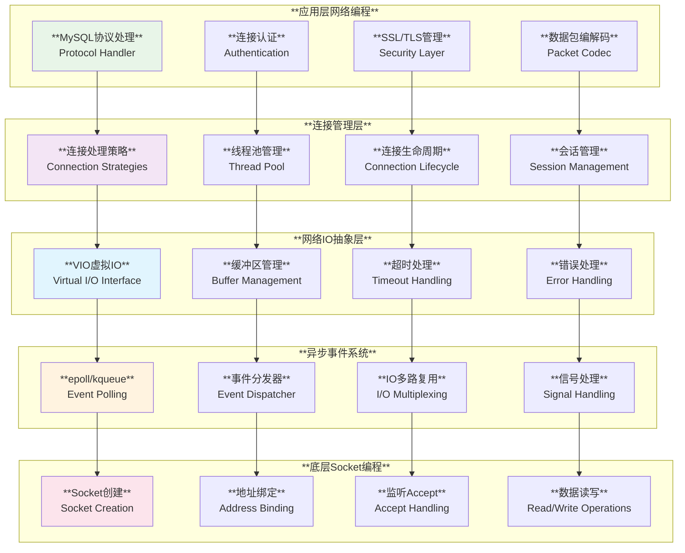
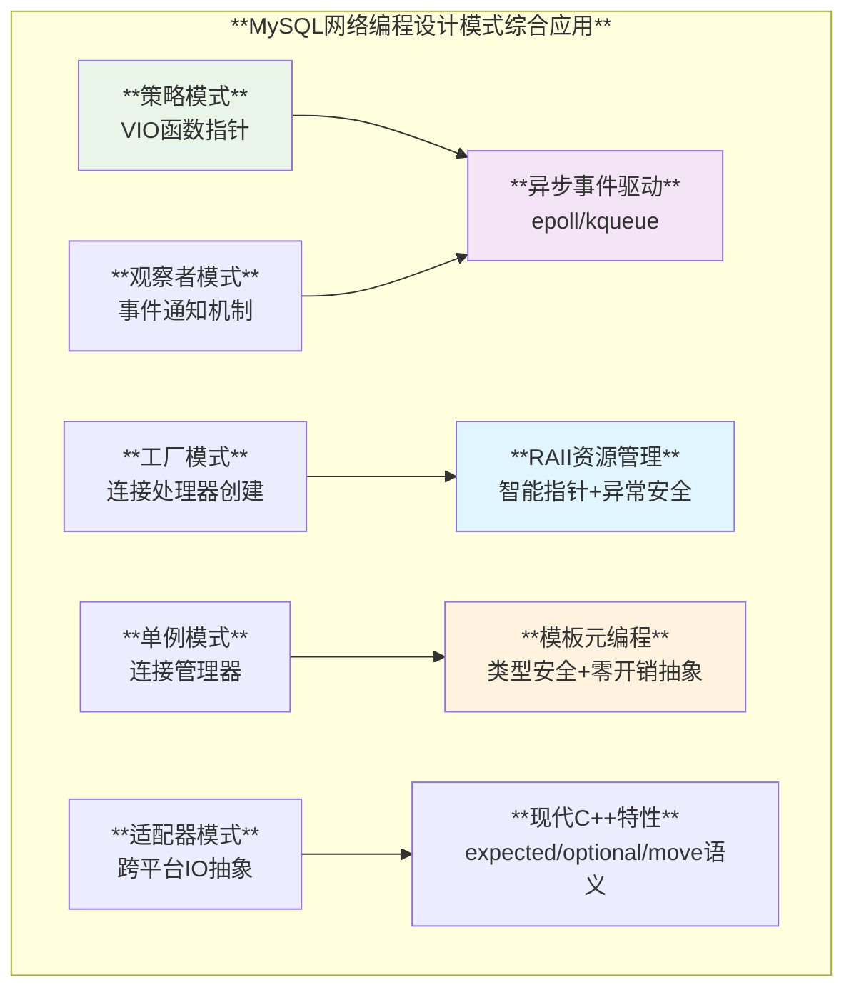

# MySQL 网络编程实现深度分析

## 概述

MySQL实现了一套复杂而高效的网络编程架构，从底层的套接字操作到高层的连接管理，展现了现代C++在网络编程领域的最佳实践。通过VIO抽象层、异步IO事件模型、多种连接处理策略以及完整的SSL/TLS实现，MySQL构建了一个既高性能又可扩展的网络通信框架。

**核心特性**：
- **异步事件驱动**：基于epoll/kqueue的高效事件轮询机制
- **多协议支持**：TCP/IP、Unix Socket、Named Pipe、Shared Memory
- **连接处理策略**：每连接一线程、单线程、线程池等多种模式
- **SSL/TLS安全**：完整的网络加密和会话管理
- **VIO抽象层**：统一的虚拟IO接口，支持多种传输协议

## MySQL 网络编程架构层次



## 1. 异步事件驱动编程

### 1.1 跨平台事件轮询抽象

**源码位置**: `sql/threadpool_unix.cc:180-301`

```cpp
/// @brief 跨平台异步网络IO抽象 - 支持epoll、kqueue等
namespace AsyncNetworkIO {

/**
 * @brief 异步网络IO接口
 * 
 * MySQL使用原生的边缘触发网络IO多路复用机制
 * - Linux: epoll 
 * - Solaris: event ports
 * - OSX/BSD: kevent
 * 
 * 所有API都使用一次性标志 (one-shot flags)
 */

#if defined(__linux__)
/// @brief Linux epoll实现
static int io_poll_create() noexcept { 
  return epoll_create(1); 
}

static int io_poll_associate_fd(int pollfd, int fd, void *data) noexcept {
  struct epoll_event ev;
  ev.data.u64 = 0;  // 保持valgrind兼容
  ev.data.ptr = data;
  // 边缘触发 + 一次性 + 错误检测 + 挂起检测
  ev.events = EPOLLIN | EPOLLET | EPOLLERR | EPOLLRDHUP | EPOLLONESHOT;
  return epoll_ctl(pollfd, EPOLL_CTL_ADD, fd, &ev);
}

static int io_poll_start_read(int pollfd, int fd, void *data) noexcept {
  struct epoll_event ev;
  ev.data.u64 = 0;
  ev.data.ptr = data;
  ev.events = EPOLLIN | EPOLLET | EPOLLERR | EPOLLRDHUP | EPOLLONESHOT;
  return epoll_ctl(pollfd, EPOLL_CTL_MOD, fd, &ev);
}

/// @brief epoll_wait的中断安全包装
static int io_poll_wait(int pollfd, native_event *native_events, 
                       int maxevents, int timeout_ms) noexcept {
  int ret;
  do {
    ret = epoll_wait(pollfd, native_events, maxevents, timeout_ms);
  } while (ret == -1 && errno == EINTR);  // 重启被EINTR中断的调用
  return ret;
}

#elif defined(__FreeBSD__) || defined(__APPLE__)
/// @brief BSD kqueue实现  
static int io_poll_create() noexcept { 
  return kqueue(); 
}

static int io_poll_start_read(int pollfd, int fd, void *data) noexcept {
  struct kevent ke;
  EV_SET(&ke, fd, EVFILT_READ, EV_ADD | EV_ONESHOT, 0, 0, data);
  return kevent(pollfd, &ke, 1, 0, 0, 0);
}

static int io_poll_wait(int pollfd, struct kevent *events, int maxevents,
                       int timeout_ms) noexcept {
  struct timespec ts = {
    timeout_ms / 1000,
    (timeout_ms % 1000) * 1000000
  };
  return kevent(pollfd, nullptr, 0, events, maxevents, 
               timeout_ms < 0 ? nullptr : &ts);
}
#endif

}  // namespace AsyncNetworkIO
```

### 1.2 VIO异步IO实现

**源码位置**: `vio/viosocket.cc:1305-1361`

```cpp
/// @brief VIO层的kqueue异步IO实现
int vio_io_wait(Vio *vio, enum enum_vio_io_event event, int timeout) {
  int nev;
  static const int MAX_EVENT = 2;
  struct kevent kev_set[MAX_EVENT];
  struct kevent kev_event[MAX_EVENT];

  my_socket fd = mysql_socket_getfd(vio->mysql_socket);
  MYSQL_SOCKET_WAIT_VARIABLES(locker, state) /* no ';' */
  
  if (vio->kq_fd == -1) return -1;

  // 设置唤醒事件 - 用于优雅关闭
  EV_SET(&kev_set[1], WAKEUP_EVENT_ID, EVFILT_USER,
         EV_ADD | EV_ENABLE | EV_DISPATCH | EV_CLEAR, 0, 0, nullptr);
         
  // 根据事件类型设置监听
  switch (event) {
    case VIO_IO_EVENT_READ:
      EV_SET(&kev_set[0], fd, EVFILT_READ,
             EV_ADD | EV_ENABLE | EV_DISPATCH | EV_CLEAR, 0, 0, nullptr);
      break;
    case VIO_IO_EVENT_WRITE:
    case VIO_IO_EVENT_CONNECT:
      EV_SET(&kev_set[0], fd, EVFILT_WRITE,
             EV_ADD | EV_ENABLE | EV_DISPATCH | EV_CLEAR, 0, 0, nullptr);
      break;
  }
  
  MYSQL_START_SOCKET_WAIT(locker, &state, vio->mysql_socket, PSI_SOCKET_SELECT, 0);

  timespec ts = {static_cast<long>(timeout / 1000),
                (static_cast<long>(timeout) % 1000) * 1000000};

  // 检查是否正在关闭，使用原子标志避免竞争条件
  if (vio->kevent_wakeup_flag.test_and_set()) {
    MYSQL_END_SOCKET_WAIT(locker, 0);
    return -1;
  }

  int retry_count = 0;
  do {
    nev = kevent(vio->kq_fd, kev_set, MAX_EVENT, kev_event, MAX_EVENT,
                 timeout >= 0 ? &ts : nullptr);
  } while (nev < 0 && vio_should_retry(vio) &&
           (retry_count++ < vio->retry_count));

  vio->kevent_wakeup_flag.clear();

  if (nev == -1) {
    DBUG_PRINT("error", ("kevent returned error %d\n", errno));
  } else if (nev == 0) {
    errno = SOCKET_ETIMEDOUT;  // 超时
  }
  
  MYSQL_END_SOCKET_WAIT(locker, nev);
  return nev;
}
```

## 2. VIO虚拟IO抽象层

### 2.1 VIO核心结构设计

**源码位置**: `include/violite.h:360-389`

```cpp
/// @brief VIO虚拟IO结构 - 网络编程的核心抽象
struct Vio {
  MYSQL_SOCKET mysql_socket;          // 仪表化的Socket
  bool localhost = {false};           // 是否本地连接
  enum_vio_type type = {NO_VIO_TYPE}; // VIO连接类型

  int read_timeout = {-1};   // 读操作超时 (毫秒)
  int write_timeout = {-1};  // 写操作超时 (毫秒)
  int retry_count = {1};     // 重试次数
  bool inactive = {false};   // 连接已关闭标志
  bool force_skip_proxy = {false};  // 跳过代理标志

  struct sockaddr_storage local;   // 本地网络地址
  struct sockaddr_storage remote;  // 远程网络地址
  size_t addrLen = {0};           // 远程地址长度
  
  // 读缓冲区管理
  char *read_buffer = {nullptr};   // vio_read_buff使用的缓冲区
  char *read_pos = {nullptr};      // 未读取数据的起始位置
  char *read_end = {nullptr};      // 未读取数据的结束位置

#ifdef USE_PPOLL_IN_VIO
  /// @brief 线程PID，用于发送SIGALRM终止ppoll等待
  /// 在关闭vio时使用。设为optional以便服务器代码能够
  /// 将其设置为非法值，确保在关闭vio前已正确设置
  std::optional<pid_t> thread_pid = {0};
#endif

  // 函数指针 - 策略模式的体现
  size_t (*read)(Vio *, uchar *, size_t) = {nullptr};         // 读取数据
  size_t (*write)(Vio *, const uchar *, size_t) = {nullptr};  // 写入数据
  int (*vioshutdown)(Vio *, int) = {nullptr};                 // 关闭连接
  bool (*is_connected)(Vio *) = {nullptr};                    // 检查连接状态
  int (*timeout)(Vio *, uint, bool) = {nullptr};              // 设置超时
  
  void *ssl_arg = {nullptr};  // SSL上下文指针

  // 移动语义支持
  Vio &operator=(Vio &&other) noexcept {
    if (this != &other) {
      // 移动所有成员...
      mysql_socket = std::exchange(other.mysql_socket, MYSQL_INVALID_SOCKET);
      type = std::exchange(other.type, NO_VIO_TYPE);
      // ... 其他成员的移动
    }
    return *this;
  }
};
```

### 2.2 VIO类型特化实现

```cpp
/// @brief VIO类型枚举和初始化策略
enum enum_vio_type {
  VIO_TYPE_TCPIP,         // TCP/IP连接
  VIO_TYPE_SOCKET,        // Unix域套接字
  VIO_TYPE_NAMEDPIPE,     // 命名管道(Windows)
  VIO_TYPE_SSL,           // SSL加密连接
  VIO_TYPE_SHARED_MEMORY, // 共享内存(Windows)
  VIO_CLOSED              // 关闭的连接
};

/// @brief VIO初始化 - 策略模式的应用
bool vio_init(Vio *vio, enum enum_vio_type type, MYSQL_SOCKET sd, uint flags) {
  vio->type = type;
  vio->mysql_socket = sd;
  
  // 根据VIO类型设置不同的操作函数策略
  switch (type) {
    case VIO_TYPE_TCPIP:
    case VIO_TYPE_SOCKET:
      vio->read = vio->read_buffer ? vio_read_buff : vio_read;
      vio->write = vio_write;
      vio->vioshutdown = vio_shutdown;
      vio->is_connected = vio_is_connected;
      vio->timeout = vio_socket_timeout;
      break;
      
    case VIO_TYPE_SSL:
      vio->read = vio_ssl_read;
      vio->write = vio_ssl_write;
      vio->vioshutdown = vio_ssl_shutdown;
      vio->is_connected = vio_is_connected;
      break;
      
    case VIO_TYPE_NAMEDPIPE:
#ifdef _WIN32
      vio->read = vio_read_pipe;
      vio->write = vio_write_pipe;
      vio->vioshutdown = vio_shutdown_pipe;
      vio->is_connected = vio_is_connected_pipe;
#endif
      break;
      
    case VIO_TYPE_SHARED_MEMORY:
#ifdef _WIN32
      vio->read = vio_read_shared_memory;
      vio->write = vio_write_shared_memory;
      vio->vioshutdown = vio_shutdown_shared_memory;
      vio->is_connected = vio_is_connected_shared_memory;
#endif
      break;
  }
  
  return false;
}
```

## 3. 连接处理策略模式

### 3.1 连接处理管理器

**源码位置**: `sql/conn_handler/connection_handler_manager.cc:157-308`

```cpp
/// @brief 连接处理管理器 - 单例模式 + 策略模式
class Connection_handler_manager {
private:
  static Connection_handler_manager *m_instance;  // 单例实例
  static mysql_mutex_t LOCK_connection_count;     // 连接计数锁
  static mysql_cond_t COND_connection_count;      // 连接计数条件变量

  Connection_handler *m_connection_handler;       // 当前连接处理策略
  Connection_handler *m_saved_connection_handler; // 保存的连接处理策略
  ulong m_saved_thread_handling;                  // 保存的调度类型

  ulong m_aborted_connects;                       // 中断连接统计
  ulong m_connection_errors_max_connection;       // 最大连接错误

public:
  /// @brief 调度策略枚举
  enum scheduler_types {
    SCHEDULER_ONE_THREAD_PER_CONNECTION = 0,  // 每连接一线程
    SCHEDULER_NO_THREADS,                     // 单线程处理
    SCHEDULER_THREAD_POOL,                    // 线程池
    SCHEDULER_TYPES_COUNT                     // 动态处理器标记
  };

  /// @brief 初始化连接处理器 - 工厂模式应用
  static bool init() {
    Connection_handler *connection_handler = nullptr;
    
    // 根据调度策略创建对应的连接处理器
    switch (Connection_handler_manager::thread_handling) {
      case SCHEDULER_ONE_THREAD_PER_CONNECTION:
        connection_handler = new (std::nothrow) Per_thread_connection_handler();
        break;
        
      case SCHEDULER_NO_THREADS:
        connection_handler = new (std::nothrow) One_thread_connection_handler();
        break;
        
      case SCHEDULER_THREAD_POOL:
        connection_handler = new (std::nothrow) Thread_pool_connection_handler();
        break;
        
      default:
        assert(false);
    }

    if (connection_handler == nullptr) {
      Per_thread_connection_handler::destroy();
      return true;
    }

    m_instance = new (std::nothrow) Connection_handler_manager(connection_handler);

    if (m_instance == nullptr) {
      delete connection_handler;
      Per_thread_connection_handler::destroy();
      return true;
    }

    // 注册PSI监控
#ifdef HAVE_PSI_INTERFACE
    int count = static_cast<int>(array_elements(all_conn_manager_mutexes));
    mysql_mutex_register("sql", all_conn_manager_mutexes, count);
    
    count = static_cast<int>(array_elements(all_conn_manager_conds));
    mysql_cond_register("sql", all_conn_manager_conds, count);
#endif

    mysql_mutex_init(key_LOCK_connection_count, &LOCK_connection_count,
                     MY_MUTEX_INIT_FAST);
    mysql_cond_init(key_COND_connection_count, &COND_connection_count);

    return false;
  }

  /// @brief 处理新连接 - 策略委托
  void process_new_connection(Channel_info *channel_info) {
    if (connection_events_loop_aborted() ||
        !check_and_incr_conn_count(channel_info->is_admin_connection())) {
      channel_info->send_error_and_close_channel(ER_CON_COUNT_ERROR, 0, true);
      sql_print_warning("%s", ER_DEFAULT(ER_CON_COUNT_ERROR));
      delete channel_info;
      return;
    }

    // 委托给具体的连接处理策略
    if (m_connection_handler->add_connection(channel_info)) {
      inc_aborted_connects();
      delete channel_info;
    }
  }
};
```

### 3.2 线程池连接处理器

**源码位置**: `sql/conn_handler/connection_handler_impl.h:128-144`

```cpp
/// @brief 线程池连接处理器实现
class Thread_pool_connection_handler : public Connection_handler {
  Thread_pool_connection_handler(const Thread_pool_connection_handler &) = delete;
  Thread_pool_connection_handler &operator=(
      const Thread_pool_connection_handler &) = delete;

public:
  Thread_pool_connection_handler() { 
    tp_init(); // 初始化线程池
  }

  ~Thread_pool_connection_handler() override { 
    tp_end(); // 清理线程池
  }

protected:
  /// @brief 添加连接到线程池
  bool add_connection(Channel_info *channel_info) override {
    // 将连接分配给线程池处理
    return tp_add_connection(channel_info);
  }

  uint get_max_threads() const override { 
    return threadpool_max_threads; 
  }
};
```

## 4. SSL/TLS网络安全编程

### 4.1 SSL连接配置

**源码位置**: `client/include/sslopt-vars.h:68-102`

```cpp
/// @brief SSL客户端选项配置
static inline int set_client_ssl_options(MYSQL *mysql) {
  // SSL模式验证警告
  if (ssl_mode_set_explicitly && opt_ssl_mode < SSL_MODE_VERIFY_CA &&
      (opt_ssl_ca || opt_ssl_capath)) {
    fprintf(stderr,
            "WARNING: no verification of server certificate will be done. "
            "Use --ssl-mode=VERIFY_CA or VERIFY_IDENTITY.\n");
  }

  // 设置SSL参数：密钥、证书、CA、密码套件等
  mysql_options(mysql, MYSQL_OPT_SSL_KEY, opt_ssl_key);
  mysql_options(mysql, MYSQL_OPT_SSL_CERT, opt_ssl_cert);
  mysql_options(mysql, MYSQL_OPT_SSL_CIPHER, opt_ssl_cipher);
  
  // 根据SSL模式设置CA验证
  if (opt_ssl_mode >= SSL_MODE_VERIFY_CA) {
    mysql_options(mysql, MYSQL_OPT_SSL_CA, opt_ssl_ca);
    mysql_options(mysql, MYSQL_OPT_SSL_CAPATH, opt_ssl_capath);
  } else {
    mysql_options(mysql, MYSQL_OPT_SSL_CA, nullptr);
    mysql_options(mysql, MYSQL_OPT_SSL_CAPATH, nullptr);
  }
  
  mysql_options(mysql, MYSQL_OPT_SSL_CRL, opt_ssl_crl);
  mysql_options(mysql, MYSQL_OPT_SSL_CRLPATH, opt_ssl_crlpath);
  mysql_options(mysql, MYSQL_OPT_TLS_VERSION, opt_tls_version);
  mysql_options(mysql, MYSQL_OPT_SSL_MODE, &opt_ssl_mode);
  
  // FIPS模式设置
  if (opt_ssl_fips_mode > 0) {
    mysql_options(mysql, MYSQL_OPT_SSL_FIPS_MODE, &opt_ssl_fips_mode);
    if (mysql_errno(mysql) == CR_SSL_FIPS_MODE_ERR) return 1;
  }
  
  mysql_options(mysql, MYSQL_OPT_TLS_CIPHERSUITES, opt_tls_ciphersuites);
  mysql_options(mysql, MYSQL_OPT_TLS_SNI_SERVERNAME, opt_tls_sni_servername);
  
  // SSL会话数据恢复
  if (opt_ssl_session_data) {
    FILE *fi = fopen(opt_ssl_session_data, "rb");
    // ... 会话恢复逻辑
  }
  
  return 0;
}
```

### 4.2 SSL会话管理

**源码位置**: `router/src/router/src/common/mysql_session.cc:187-235`

```cpp
/// @brief SSL会话配置管理
class SSLSessionManager {
public:
  /// @brief 配置SSL连接参数
  void configure_ssl(const std::string &ssl_cipher, 
                    const std::string &tls_version,
                    const std::string &ca, 
                    const std::string &capath,
                    const std::string &crl, 
                    const std::string &crlpath,
                    mysql_ssl_mode ssl_mode) {
    
    // 设置SSL密码套件
    if (!ssl_cipher.empty() && !set_option(SslCipher(ssl_cipher.c_str()))) {
      throw Error(("Error setting SSL_CIPHER option for MySQL connection: " +
                   std::string(mysql_error(connection_))),
                  mysql_errno(connection_));
    }

    // 设置TLS版本
    if (!tls_version.empty() && !set_option(TlsVersion(tls_version.c_str()))) {
      throw Error("Error setting TLS_VERSION option for MySQL connection",
                  mysql_errno(connection_));
    }

    // 设置CA证书
    if (!ca.empty() && !set_option(SslCa(ca.c_str()))) {
      throw Error(("Error setting SSL_CA option for MySQL connection: " +
                   std::string(mysql_error(connection_))),
                  mysql_errno(connection_));
    }

    // 设置CA路径
    if (!capath.empty() && !set_option(SslCaPath(capath.c_str()))) {
      throw Error(("Error setting SSL_CAPATH option for MySQL connection: " +
                   std::string(mysql_error(connection_))),
                  mysql_errno(connection_));
    }

    // 设置证书吊销列表
    if (!crl.empty() && !set_option(SslCrl(crl.c_str()))) {
      throw Error(("Error setting SSL_CRL option for MySQL connection: " +
                   std::string(mysql_error(connection_))),
                  mysql_errno(connection_));
    }

    if (!crlpath.empty() && !set_option(SslCrlPath(crlpath.c_str()))) {
      throw Error(("Error setting SSL_CRLPATH option for MySQL connection: " +
                   std::string(mysql_error(connection_))),
                  mysql_errno(connection_));
    }

    // SSL模式必须最后设置，避免libmysql的bug
    if (!set_option(SslMode(ssl_mode))) {
      const char *text = ssl_mode_to_string(ssl_mode);
      std::string msg = std::string("Setting SSL mode to '") + text +
                        "' on connection failed: " + mysql_error(connection_);
      throw Error(msg, mysql_errno(connection_));
    }
  }
};
```

## 5. Socket连接建立和管理

### 5.1 TCP Socket监听器

**源码位置**: `sql/conn_handler/socket_connection.cc:353-391`

```cpp
/// @brief TCP Socket连接处理类
class TCP_socket {
private:
  std::string m_bind_addr_str;        // 绑定地址字符串
  std::string m_network_namespace;    // 网络命名空间
  uint m_tcp_port;                    // TCP端口
  uint m_backlog;                     // 监听队列长度
  uint m_port_timeout;                // 端口超时

public:
  /// @brief TCP Socket构造函数
  TCP_socket(std::string bind_addr_str, std::string network_namespace_str,
             uint tcp_port, uint backlog, uint port_timeout)
      : m_bind_addr_str(bind_addr_str),
        m_network_namespace(network_namespace_str),
        m_tcp_port(tcp_port),
        m_backlog(backlog),
        m_port_timeout(port_timeout) {}

  /// @brief 创建监听Socket
  MYSQL_SOCKET get_listener_socket() {
    const char *bind_address_str = nullptr;

    LogErr(INFORMATION_LEVEL, ER_CONN_TCP_ADDRESS, 
           m_bind_addr_str.c_str(), m_tcp_port);

    // 获取与绑定地址关联的IP地址列表
    struct addrinfo hints;
    memset(&hints, 0, sizeof(hints));
    hints.ai_flags = AI_PASSIVE;        // 用于服务器监听
    hints.ai_socktype = SOCK_STREAM;    // TCP流式套接字
    hints.ai_family = AF_UNSPEC;        // IPv4/IPv6都支持

    char port_buf[NI_MAXSERV];
    snprintf(port_buf, NI_MAXSERV, "%d", m_tcp_port);

    // 网络命名空间设置
    if (!m_network_namespace.empty()) {
#ifdef HAVE_SETNS
      if (set_network_namespace(m_network_namespace))
        return MYSQL_INVALID_SOCKET;
#else
      LogErr(ERROR_LEVEL, ER_NETWORK_NAMESPACES_NOT_SUPPORTED);
      return MYSQL_INVALID_SOCKET;
#endif
    }

    // 地址解析和Socket创建
    struct addrinfo *ai, *next;
    int error = getaddrinfo(m_bind_addr_str.empty() ? nullptr : m_bind_addr_str.c_str(),
                           port_buf, &hints, &ai);
    
    if (error != 0) {
      LogErr(ERROR_LEVEL, ER_IPSOCK_ERROR, "getaddrinfo", gai_strerror(error));
      return MYSQL_INVALID_SOCKET;
    }

    MYSQL_SOCKET listener_socket = MYSQL_INVALID_SOCKET;
    
    // 遍历所有可能的地址进行绑定
    for (next = ai; next != nullptr; next = next->ai_next) {
      listener_socket = create_socket(next->ai_family, next->ai_socktype, 
                                     next->ai_protocol);
      
      if (mysql_socket_getfd(listener_socket) == INVALID_SOCKET)
        continue;

      // 设置Socket选项
      set_socket_options(listener_socket);
      
      // 绑定地址
      if (bind(mysql_socket_getfd(listener_socket), 
               next->ai_addr, next->ai_addrlen) < 0) {
        mysql_socket_close(listener_socket);
        listener_socket = MYSQL_INVALID_SOCKET;
        continue;
      }

      // 开始监听
      if (listen(mysql_socket_getfd(listener_socket), m_backlog) < 0) {
        mysql_socket_close(listener_socket);
        listener_socket = MYSQL_INVALID_SOCKET;
        continue;
      }
      
      break;  // 成功创建监听Socket
    }

    freeaddrinfo(ai);
    return listener_socket;
  }
};
```

### 5.2 连接事件处理循环

**源码位置**: `sql/mysqld.cc:3665-3713`

```cpp
/// @brief 连接事件处理线程设置
void setup_conn_event_handler_threads() {
  my_thread_handle hThread;

  DBUG_TRACE;

  // 检查网络配置
  if ((!have_tcpip || opt_disable_networking) && !opt_enable_shared_memory &&
      !opt_enable_named_pipe) {
    LogErr(ERROR_LEVEL, ER_WIN_LISTEN_BUT_HOW);
    unireg_abort(MYSQLD_ABORT_EXIT);
  }

  mysql_mutex_lock(&LOCK_handler_count);
  handler_count = 0;

  // 创建命名管道连接处理线程
  if (opt_enable_named_pipe) {
    const int error = mysql_thread_create(
        key_thread_handle_con_namedpipes, &hThread, &connection_attrib,
        named_pipe_conn_event_handler, named_pipe_acceptor);
    if (!error)
      handler_count++;
    else
      LogErr(WARNING_LEVEL, ER_CANT_CREATE_NAMED_PIPES_THREAD, error);
  }

  // 创建TCP/IP连接处理线程
  if (have_tcpip && !opt_disable_networking) {
    const int error = mysql_thread_create(
        key_thread_handle_con_sockets, &hThread, &connection_attrib,
        socket_conn_event_handler, mysqld_socket_acceptor);
    if (!error)
      handler_count++;
    else
      LogErr(WARNING_LEVEL, ER_CANT_CREATE_TCPIP_THREAD, error);
  }

  // 创建共享内存连接处理线程
  if (opt_enable_shared_memory) {
    const int error = mysql_thread_create(
        key_thread_handle_con_sharedmem, &hThread, &connection_attrib,
        shared_mem_conn_event_handler, shared_mem_acceptor);
    if (!error)
      handler_count++;
    else
      LogErr(WARNING_LEVEL, ER_CANT_CREATE_SHM_THREAD, error);
  }

  // 等待所有连接监听线程退出
  while (handler_count > 0)
    mysql_cond_wait(&COND_handler_count, &LOCK_handler_count);
  mysql_mutex_unlock(&LOCK_handler_count);
}
```

## 6. 高级网络编程技术

### 6.1 现代C++网络抽象 

**源码位置**: `router/src/harness/include/mysql/harness/net_ts/impl/linux_epoll.h:60-95`

```cpp
/// @brief 现代C++风格的epoll封装
namespace net::impl::epoll {

enum class Cmd {
  add = EPOLL_CTL_ADD,
  del = EPOLL_CTL_DEL,
  mod = EPOLL_CTL_MOD,
};

/// @brief 不可中断的系统调用包装器 - RAII + 异常安全
template <class Func>
inline auto uninterruptable(Func &&f) {
  do {
    auto res = f();
    if (res || (res.error() != std::errc::interrupted)) return res;
  } while (true);
}

/// @brief epoll创建 - 现代C++ expected<T, E>错误处理
inline stdx::expected<int, std::error_code> create() {
  return uninterruptable([&]() -> stdx::expected<int, std::error_code> {
    int epfd = ::epoll_create1(EPOLL_CLOEXEC);

    if (-1 == epfd) {
      return stdx::unexpected(std::error_code{errno, std::generic_category()});
    }

    return epfd;
  });
}

/// @brief epoll控制操作
inline stdx::expected<void, std::error_code> ctl(int epfd, Cmd cmd, int fd,
                                                 epoll_event *ev) {
  return uninterruptable([&]() -> stdx::expected<void, std::error_code> {
    if (-1 == ::epoll_ctl(epfd, static_cast<int>(cmd), fd, ev)) {
      return stdx::unexpected(std::error_code{errno, std::generic_category()});
    }
    return {};
  });
}

/// @brief epoll等待事件 - chrono时间支持
inline stdx::expected<size_t, std::error_code> wait(
    int epfd, epoll_event *fd_events, size_t num_fd_events,
    std::chrono::milliseconds timeout) {
    
  int res = ::epoll_wait(epfd, fd_events, num_fd_events, timeout.count());

  if (res < 0) {
    return stdx::unexpected(impl::socket::last_error_code());
  } else if (res == 0) {
    // 超时
    return stdx::unexpected(make_error_code(std::errc::timed_out));
  }

  return res;
}

}  // namespace net::impl::epoll
```

### 6.2 NDB集群网络传输优化

**源码位置**: `storage/ndb/src/common/transporter/TransporterRegistry.cpp:1205-1251`

```cpp
/// @brief NDB集群TCP传输检查 - 高性能网络编程示例
Uint32 TransporterRegistry::check_TCP(TransporterReceiveHandle &recvdata,
                                     Uint32 timeOutMillis) {
  Uint32 retVal = 0;
  
#if defined(HAVE_EPOLL_CREATE)
  if (likely(recvdata.m_epoll_fd != -1)) {
    int tcpReadSelectReply = 0;
    Uint32 num_trps = nTCPTransporters + nSHMTransporters +
                      (m_has_extra_wakeup_socket ? 1 : 0);

    if (num_trps) {
      // epoll_wait等待网络事件
      tcpReadSelectReply =
          epoll_wait(recvdata.m_epoll_fd, recvdata.m_epoll_events, num_trps,
                     timeOutMillis);
      if (unlikely(tcpReadSelectReply < 0)) {
        assert(errno == EINTR);
        return 0;  // 忽略中断错误
      }
    }

    // 处理接收到的epoll事件
    for (int i = 0; i < tcpReadSelectReply; i++) {
      const TrpId trpid = recvdata.m_epoll_events[i].data.u32;
      
      // 检查传输器是否分配给"我们"
      assert(recvdata.m_transporters.get(trpid));

      // 处理连接挂起事件 (即使未监听也会传递EPOLLHUP)
      if (recvdata.m_epoll_events[i].events & EPOLLHUP) {
        ndb_socket_t sock_fd = allTransporters[trpid]->getSocket();
        epoll_ctl(recvdata.m_epoll_fd, EPOLL_CTL_DEL,
                  ndb_socket_get_native(sock_fd), nullptr);
        start_disconnecting(trpid);
      } 
      // 处理数据可读事件
      else if (recvdata.m_epoll_events[i].events & EPOLLIN) {
        recvdata.m_recv_transporters.set(trpid);
        retVal++;
      }
    }
  } else
#endif
  {
    // 回退到传统的poll方式
    retVal = poll_TCP(timeOutMillis, recvdata);
  }
  
  return retVal;
}
```

## 7. 网络编程最佳实践总结

### 7.1 架构设计模式应用



### 7.2 关键技术要点

```cpp
/// @brief MySQL网络编程核心技术总结
namespace NetworkProgrammingBestPractices {

/// @brief 1. 异步IO + 事件驱动
class AsyncIOManager {
public:
  // 使用平台特定的高性能IO多路复用
  #ifdef __linux__
    using IOMultiplexer = EpollMultiplexer;
  #elif defined(__APPLE__) || defined(__FreeBSD__)
    using IOMultiplexer = KqueueMultiplexer;
  #endif
  
  // 边缘触发 + 一次性事件处理
  void setup_events(int fd, void* context) {
    multiplexer_.add_fd(fd, EPOLLIN | EPOLLET | EPOLLONESHOT, context);
  }
};

/// @brief 2. RAII + 异常安全
class NetworkResourceRAII {
public:
  // 自动资源管理
  template<typename Resource, typename Deleter>
  using unique_resource = std::unique_ptr<Resource, Deleter>;
  
  // VIO智能包装器
  using VioPtr = unique_resource<Vio, decltype(&vio_delete)>;
  
  VioPtr create_vio(enum_vio_type type, MYSQL_SOCKET socket) {
    Vio* vio = vio_new(socket, type, 0);
    return VioPtr(vio, &vio_delete);
  }
};

/// @brief 3. 现代C++错误处理
template<typename T>
using Result = stdx::expected<T, std::error_code>;

class ModernNetworking {
public:
  // 不会抛出异常的网络操作
  Result<size_t> async_read(int fd, char* buffer, size_t size) noexcept {
    ssize_t result = ::recv(fd, buffer, size, MSG_DONTWAIT);
    
    if (result < 0) {
      return stdx::unexpected(std::error_code{errno, std::system_category()});
    }
    
    return static_cast<size_t>(result);
  }
  
  // 链式错误处理
  Result<void> process_connection(int fd) {
    char buffer[4096];
    
    return async_read(fd, buffer, sizeof(buffer))
      .and_then([&](size_t bytes_read) -> Result<void> {
        return process_data(buffer, bytes_read);
      })
      .or_else([](std::error_code ec) -> Result<void> {
        LogErr(ERROR_LEVEL, ER_NETWORK_READ_ERROR, ec.message().c_str());
        return stdx::unexpected(ec);
      });
  }
};

/// @brief 4. 线程安全的连接池
class ThreadSafeConnectionPool {
private:
  mutable std::shared_mutex pool_mutex_;
  std::queue<std::unique_ptr<Connection>> available_connections_;
  std::atomic<size_t> active_connections_{0};
  
public:
  // 获取连接 - 读锁优化
  std::unique_ptr<Connection> acquire() {
    std::unique_lock<std::shared_mutex> lock(pool_mutex_);
    
    if (!available_connections_.empty()) {
      auto conn = std::move(available_connections_.front());
      available_connections_.pop();
      active_connections_.fetch_add(1, std::memory_order_relaxed);
      return conn;
    }
    
    // 创建新连接
    return create_new_connection();
  }
  
  // 归还连接 - 写锁
  void release(std::unique_ptr<Connection> conn) {
    if (conn && conn->is_healthy()) {
      std::lock_guard<std::shared_mutex> lock(pool_mutex_);
      available_connections_.push(std::move(conn));
      active_connections_.fetch_sub(1, std::memory_order_relaxed);
    }
  }
};

}  // namespace NetworkProgrammingBestPractices
```

## 总结

MySQL的网络编程实现展现了现代C++在系统级编程中的强大能力和最佳实践。通过VIO抽象层的统一接口设计、异步事件驱动的高性能IO模型、灵活的连接处理策略以及完整的SSL/TLS安全传输，MySQL构建了一个既高效又可扩展的网络通信架构。

**核心技术亮点**：
- **跨平台抽象**：统一的VIO接口支持多种传输协议
- **异步IO**：基于epoll/kqueue的高效事件轮询机制
- **策略模式**：灵活的连接处理策略切换
- **RAII管理**：现代C++的资源自动管理
- **异常安全**：完整的错误处理和资源清理机制

这套网络编程架构不仅保证了MySQL在各种网络环境下的稳定运行，也为高性能网络应用的设计和实现提供了宝贵的参考价值。通过学习MySQL的网络编程实现，可以深入理解现代C++在系统编程中的应用技巧和设计哲学。
