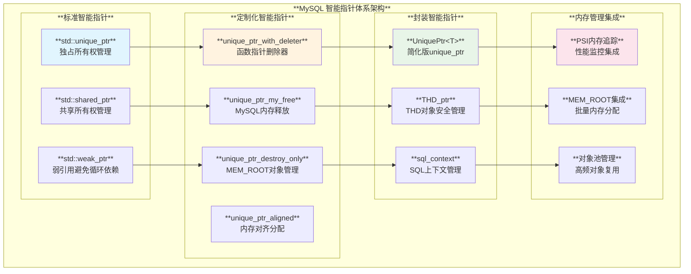
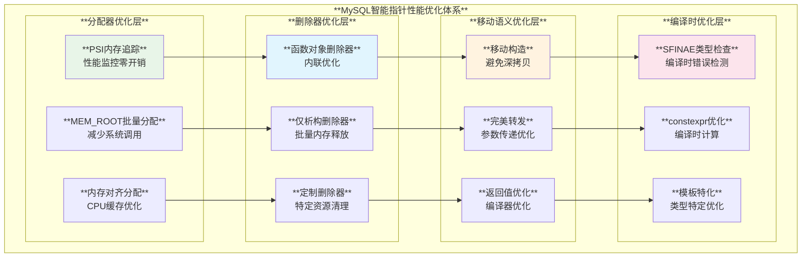
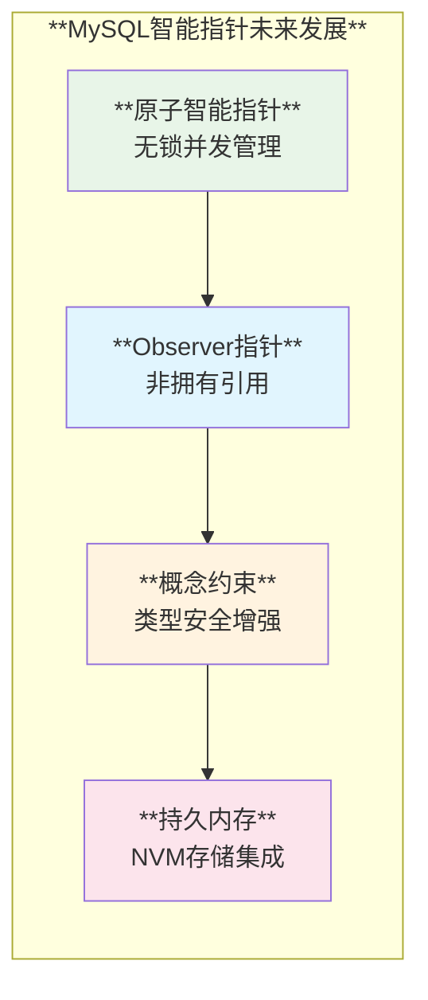

# MySQL 智能指针使用模式深度分析

## 概述

MySQL服务器在内存管理方面大量使用C++智能指针技术，通过RAII（资源获取即初始化）原则实现自动化的内存管理。从基础的`std::unique_ptr`到定制化的智能指针封装，MySQL展现了现代C++在资源管理方面的最佳实践。

**核心特性**：
- **自动内存管理**：RAII原则确保资源的正确释放
- **异常安全**：智能指针保证异常情况下的资源清理
- **定制删除器**：针对MySQL特殊内存分配需求的定制化删除
- **跨DLL安全**：支持动态库边界的安全内存管理
- **性能优化**：零开销抽象和移动语义优化

## MySQL 智能指针架构体系

### 1. 智能指针类型分类架构



### 2. 智能指针应用场景矩阵

| **智能指针类型** | **主要用途** | **内存分配器** | **删除策略** | **性能开销** | **使用复杂度** |
|-----------------|-------------|--------------|-------------|-------------|--------------|
| **std::unique_ptr** | 独占资源管理 | 标准new/delete | **默认删除器** | **极低** | ⭐⭐ |
| **unique_ptr_my_free** | MySQL内存管理 | my_malloc | **my_free删除** | **极低** | ⭐⭐ |
| **unique_ptr_destroy_only** | MEM_ROOT对象 | MEM_ROOT分配 | **仅析构，不释放** | **极低** | ⭐⭐ |
| **std::shared_ptr** | 共享资源管理 | 可定制分配器 | **引用计数删除** | **低-中等** | ⭐⭐⭐ |
| **UniquePtr&lt;T&gt;** | 跨DLL安全 | 用户指定 | **function删除器** | **低** | ⭐⭐ |
| **THD_ptr** | 线程对象管理 | THD分配器 | **特殊THD清理** | **低** | ⭐⭐⭐ |
| **unique_ptr_aligned** | 对齐内存分配 | 对齐分配器 | **对齐内存释放** | **极低** | ⭐⭐⭐ |

## 核心智能指针技术分析

### 1. 定制删除器系统

**源码位置**: `include/map_helpers.h:88-105`

```cpp
/// @brief 函数指针删除器 - 支持前向声明
template <class T>
using unique_ptr_with_deleter = std::unique_ptr<T, void (*)(T *)>;

/// @brief MySQL内存释放删除器
struct My_free_deleter {
  void operator()(void *ptr) const { my_free(ptr); }
};

/// @brief 使用my_free的unique_ptr
template <class T>
using unique_ptr_my_free = std::unique_ptr<T, My_free_deleter>;

/// @brief 标准free删除器
struct Free_deleter {
  void operator()(void *ptr) const { free(ptr); }
};

/// @brief 使用free的unique_ptr
template <class T>
using unique_ptr_free = std::unique_ptr<T, Free_deleter>;
```

**删除器设计原则**：
- **函数对象优化**：使用函数对象而非函数指针减少间接调用开销
- **内存分配器匹配**：删除器与分配器严格对应，避免内存管理错误
- **类型安全**：编译时确保删除器类型正确

### 2. MEM_ROOT集成的智能指针

**源码位置**: `include/my_alloc.h:479-493`

```cpp
/// @brief MEM_ROOT对象的析构器 - 仅调用析构函数
template <class T>
class Destroy_only {
 public:
  void operator()(T *ptr) const { ::destroy_at(ptr); }
};

/// @brief 仅析构的unique_ptr - 用于MEM_ROOT分配的对象
template <class T>
using unique_ptr_destroy_only = std::unique_ptr<T, Destroy_only<T>>;

/// @brief MEM_ROOT智能指针工厂函数
template <typename T, typename... Args>
unique_ptr_destroy_only<T> make_unique_destroy_only(MEM_ROOT *mem_root,
                                                    Args &&...args) {
  return unique_ptr_destroy_only<T>(new (mem_root)
                                        T(std::forward<Args>(args)...));
}

/// @brief 安全析构函数 - 包含调试支持
template <class T>
inline void destroy_at(T *ptr) {
  assert(ptr != nullptr);
  std::destroy_at(ptr);
  TRASH(const_cast<std::remove_const_t<T> *>(ptr), sizeof(T));  // 调试模式下清零内存
}
```

**MEM_ROOT集成特色**：
- **批量内存管理**：MEM_ROOT负责内存分配和批量释放
- **仅析构策略**：智能指针只调用析构函数，不释放内存
- **完美转发**：工厂函数支持完美转发构造参数
- **调试支持**：调试模式下自动清零已释放的内存

### 3. 跨DLL安全的智能指针封装

**源码位置**: `router/src/harness/include/unique_ptr.h:74-84`

```cpp
/// @brief 改进的unique_ptr超类 - 解决跨DLL问题
template <typename T>
class UniquePtr : public std::unique_ptr<T, std::function<void(T *)>> {
 public:
  UniquePtr() = default;

  /// @brief 构造函数 - 自动解析删除器类型
  UniquePtr(T *ptr, std::function<void(T *)> deleter = std::default_delete<T>())
      : std::unique_ptr<T, std::function<void(T *)>>(ptr, deleter) {}

  // 禁用拷贝，支持移动
  UniquePtr(const UniquePtr<T> &) = delete;
  UniquePtr(UniquePtr<T> &&other) noexcept;
  
  // 重载赋值运算符
  UniquePtr<T> &operator=(const UniquePtr<T> &) = delete;
  UniquePtr<T> &operator=(UniquePtr<T> &&other) noexcept;
};
```

**跨DLL安全特性**：
- **std::function删除器**：避免函数指针类型在DLL边界的不匹配
- **默认删除器支持**：自动提供默认删除器
- **类型推导简化**：避免复杂的模板参数声明
- **调试安全检查**：调试模式下检查删除器是否被遗忘

### 4. 线程对象安全管理

**源码位置**: `sql/mysqld_thd_manager.h:100-157`

```cpp
/// @brief THD对象安全管理包装器
class THD_ptr {
 public:
  THD_ptr() = default;
  
  /// @brief 构造时获取THD锁
  explicit THD_ptr(THD *thd);
  
  // 禁用拷贝，支持移动
  THD_ptr(THD_ptr const &) = delete;
  THD_ptr(THD_ptr &&thd_ptr);
  
  /// @brief 析构时自动释放锁和资源
  ~THD_ptr() { release(); }
  
  /// @brief 释放控制权并返回原始指针
  THD *release();
  
  // 移动赋值
  THD_ptr &operator=(THD_ptr const &) = delete;
  THD_ptr &operator=(THD_ptr &&thd_ptr);
  
  // 智能指针风格的访问接口
  THD *get() { return m_underlying; }
  THD *operator->() { return m_underlying; }
  THD &operator*() { return *m_underlying; }
  
 private:
  THD *m_underlying = nullptr;
};
```

**线程安全特性**：
- **自动锁管理**：构造时获取`THD::LOCK_thd_data`，析构时释放
- **RAII保证**：即使发生异常也能正确释放锁
- **移动语义**：支持高效的所有权转移
- **标准接口**：提供智能指针标准的访问方法

### 5. InnoDB内存管理的智能指针

**源码位置**: `storage/innobase/include/ut0new.h:2357-2375`和`2611-2630`

```cpp
namespace ut {

/// @brief InnoDB定制的unique_ptr工厂 - 不支持PFS追踪
template <typename T, typename Deleter = detail::Deleter<T>, typename... Args>
std::enable_if_t<!std::is_array<T>::value, std::unique_ptr<T, Deleter>>
make_unique(Args &&...args) {
  return std::unique_ptr<T, Deleter>(ut::new_<T>(std::forward<Args>(args)...));
}

/// @brief InnoDB定制的shared_ptr工厂 - 不支持PFS追踪
template <typename T, typename Deleter = detail::Deleter<T>, typename... Args>
std::enable_if_t<!std::is_array<T>::value, std::shared_ptr<T>> make_shared(
    Args &&...args) {
  return std::shared_ptr<T>(ut::new_<T>(std::forward<Args>(args)...),
                            Deleter{});
}

/// @brief 内存对齐的unique_ptr类型别名
template <typename T>
using unique_ptr_aligned = std::conditional_t<
    !std::is_array<T>::value, std::unique_ptr<T, detail::Aligned_deleter<T>>,
    std::conditional_t<detail::is_unbounded_array_v<T>,
                       std::unique_ptr<T, detail::Aligned_array_deleter<
                                              std::remove_extent_t<T>>>,
                       void>>;

}  // namespace ut
```

**InnoDB存储引擎特色**：
- **性能优先**：明确不支持PFS追踪以获得最佳性能
- **内存对齐**：支持cache-line对齐的内存分配
- **类型安全**：使用SFINAE确保只对非数组类型生效
- **模板元编程**：通过`std::conditional_t`实现复杂的类型选择

### 6. X插件的内存管理系统

**源码位置**: `plugin/x/src/ngs/memory.h:67-86`

```cpp
namespace ngs {

/// @brief PSF追踪的对象释放
template <class T>
void free_object(T *ptr) {
  if (ptr != nullptr) {
    ptr->~T();
    my_free(ptr);
  }
}

/// @brief PSF追踪的对象分配
template <typename T, typename... Args>
T *allocate_object(Args &&...args) {
  return new (my_malloc(IS_PSI_AVAILABLE(KEY_memory_x_objects, 0), sizeof(T),
                        MYF(MY_WME))) T(std::forward<Args>(args)...);
}

/// @brief PSF追踪的shared_ptr工厂
template <typename T, typename... Args>
std::shared_ptr<T> allocate_shared(Args &&...args) {
  return std::allocate_shared<T>(detail::PFS_allocator<T>(),
                                 std::forward<Args>(args)...);
}

}  // namespace ngs
```

**X插件内存管理特色**：
- **PSF集成**：完全集成Performance Schema的内存追踪
- **异常安全**：使用placement new和异常安全的内存管理
- **标准兼容**：与标准库的`std::allocate_shared`接口兼容
- **可变参数**：支持任意数量的构造参数

## 高级智能指针应用模式

### 1. SQL上下文的智能指针管理

**源码位置**: `components/masking_functions/src/masking_functions/sql_context.cpp:36-47`

```cpp
namespace masking_functions {

/// @brief SQL上下文的定制删除器
void sql_context::deleter::operator()(void *ptr) const noexcept {
  if (ptr != nullptr) (*services->factory->close)(to_mysql_h(ptr));
}

sql_context::sql_context(const command_service_tuple &services)
    : impl_{nullptr, deleter{&services}} {
  MYSQL_H local_mysql_h = nullptr;
  
  // 初始化MySQL句柄
  if ((*get_services().factory->init)(&local_mysql_h) != 0) {
    throw std::runtime_error{"Couldn't initialize server handle"};
  }
  assert(local_mysql_h != nullptr);
  
  // 安全地转移所有权给智能指针
  impl_.reset(local_mysql_h);
  
  // ... 其他初始化代码
}

}  // namespace masking_functions
```

**服务组件特色**：
- **服务依赖管理**：删除器持有服务引用，确保正确的清理顺序
- **异常安全初始化**：初始化失败时自动清理已分配资源
- **noexcept删除器**：删除器保证不抛出异常
- **句柄封装**：将C风格句柄安全地封装为C++智能指针

### 2. 客户端连接的RAII管理

**源码位置**: `client/mysqltest.cc:1508-1560`

```cpp
/// @brief 客户端资源的RAII管理示例
static void free_used_memory() {
  static std::atomic<bool> already_freed{false};
  
  // 线程安全的单次执行保证
  if (already_freed.exchange(true)) {
    return;
  }
  
  // 智能指针自动管理的资源
  delete expected_errors;      // std::unique_ptr<ErrorList>
  delete disabled_warnings;    // std::unique_ptr<WarningList>
  delete enabled_warnings;     // std::unique_ptr<WarningList>
  delete var_hash;            // std::unique_ptr<VarHash>
  delete q_lines;             // std::unique_ptr<CommandQueue>
  delete global_attrs;        // std::unique_ptr<GlobalAttributes>
  
  // 手动管理的C风格资源
  if (connections) close_connections();
  close_files();
  
  // 数组和动态字符串清理
  for (size_t i = 0; i < 10; i++) {
    if (var_reg[i].alloced_len) my_free(var_reg[i].str_val);
  }
  
  // MySQL服务器清理
  if (server_initialized) mysql_server_end();
}
```

**客户端资源管理特色**：
- **混合管理模式**：智能指针和手动管理的结合
- **线程安全清理**：使用原子操作确保单次执行
- **分层清理**：按依赖关系的正确清理顺序
- **异常安全**：即使部分清理失败也能继续执行

## 智能指针性能优化架构

### 1. 内存分配器集成优化



### 2. 零开销抽象实现

```cpp
// ✅ 推荐：零开销的智能指针使用
template<typename T>
class OptimizedPtr {
private:
    T* ptr_;
    
public:
    // 移动构造 - 零开销转移
    OptimizedPtr(OptimizedPtr&& other) noexcept 
        : ptr_(std::exchange(other.ptr_, nullptr)) {}
    
    // 移动赋值 - 零开销转移
    OptimizedPtr& operator=(OptimizedPtr&& other) noexcept {
        if (this != &other) {
            delete ptr_;
            ptr_ = std::exchange(other.ptr_, nullptr);
        }
        return *this;
    }
    
    // 内联访问 - 编译器优化
    T* get() const noexcept { return ptr_; }
    T& operator*() const noexcept { return *ptr_; }
    T* operator->() const noexcept { return ptr_; }
};
```

## MySQL智能指针最佳实践

### 1. 选择指导原则

#### 独占所有权场景
```cpp
// ✅ 推荐：标准对象使用std::unique_ptr
std::unique_ptr<Connection> conn = std::make_unique<Connection>(config);

// ✅ 推荐：MySQL内存使用unique_ptr_my_free
unique_ptr_my_free<char> buffer(static_cast<char*>(my_malloc(key, size, flags)));

// ✅ 推荐：MEM_ROOT对象使用unique_ptr_destroy_only
auto obj = make_unique_destroy_only<MyClass>(&mem_root, args...);
```

#### 共享所有权场景
```cpp
// ✅ 推荐：共享资源使用std::shared_ptr
std::shared_ptr<CacheEntry> cache_entry = std::make_shared<CacheEntry>(data);

// ✅ 推荐：X插件使用PSI追踪的shared_ptr
auto tracked_obj = ngs::allocate_shared<MyObject>(args...);
```

#### 跨DLL边界场景
```cpp
// ✅ 推荐：跨DLL使用UniquePtr
UniquePtr<ExternalResource> resource(create_resource(), custom_deleter);
```

### 2. 性能优化实践

#### 避免不必要的拷贝
```cpp
// ❌ 避免：不必要的shared_ptr拷贝
void bad_function(std::shared_ptr<Object> obj) {
    // 增加了引用计数开销
}

// ✅ 推荐：使用引用避免拷贝
void good_function(const std::shared_ptr<Object>& obj) {
    // 避免引用计数操作
}

// ✅ 更好：根据使用模式选择参数类型
void best_function(Object* obj) {
    // 最小开销，适合不需要所有权的情况
}
```

#### 工厂函数优化
```cpp
// ✅ 推荐：使用make_函数避免二次分配
auto ptr = std::make_unique<MyClass>(args...);
auto shared = std::make_shared<MyClass>(args...);

// ✅ 推荐：定制工厂函数
auto mem_root_obj = make_unique_destroy_only<MyClass>(&mem_root, args...);
```

### 3. 异常安全实践

#### RAII保证
```cpp
class SafeResource {
private:
    unique_ptr_my_free<Buffer> buffer_;
    std::unique_ptr<Connection> conn_;
    
public:
    SafeResource(size_t buffer_size, const ConnectionConfig& config) {
        // 异常安全的资源获取
        buffer_.reset(static_cast<Buffer*>(my_malloc(key, buffer_size, flags)));
        if (!buffer_) throw std::bad_alloc{};
        
        conn_ = std::make_unique<Connection>(config);
        // 如果Connection构造失败，buffer_会自动清理
    }
    
    // 析构函数自动清理所有资源
    ~SafeResource() = default;
};
```

#### 异常安全的资源转移
```cpp
// ✅ 推荐：异常安全的所有权转移
std::unique_ptr<Resource> transfer_resource() {
    auto resource = acquire_resource();  // 可能抛异常
    return std::unique_ptr<Resource>(resource);  // 安全转移
}
```

### 4. 调试和维护实践

#### 调试友好的智能指针
```cpp
#ifndef NDEBUG
template<typename T>
class DebugPtr : public std::unique_ptr<T> {
public:
    T* get() const {
        assert(std::unique_ptr<T>::get() != nullptr && "Accessing null pointer");
        return std::unique_ptr<T>::get();
    }
    
    T& operator*() const {
        assert(std::unique_ptr<T>::get() != nullptr && "Dereferencing null pointer");
        return *std::unique_ptr<T>::get();
    }
};
#else
template<typename T>
using DebugPtr = std::unique_ptr<T>;
#endif
```

#### 内存泄漏检测集成
```cpp
// ✅ 推荐：PSI内存追踪集成
class TrackedResource {
public:
    static std::unique_ptr<TrackedResource> create(PSI_memory_key key) {
        void* ptr = my_malloc(key, sizeof(TrackedResource), MYF(0));
        return std::unique_ptr<TrackedResource>(
            new(ptr) TrackedResource(), 
            [](TrackedResource* p) { 
                p->~TrackedResource(); 
                my_free(p); 
            }
        );
    }
};
```

## 智能指针发展趋势

### 1. 现代C++特性集成

| **C++版本** | **智能指针新特性** | **MySQL中的应用** | **性能提升** |
|------------|-------------------|------------------|-------------|
| **C++11** | unique_ptr、shared_ptr、weak_ptr | 基础RAII、资源管理 | ⭐⭐⭐⭐ |
| **C++14** | make_unique、shared_ptr数组支持 | 工厂函数、数组管理 | ⭐⭐⭐ |
| **C++17** | weak_from_this改进 | 循环引用避免 | ⭐⭐⭐ |
| **C++20** | atomic_shared_ptr、智能指针概念 | 并发优化、类型约束 | ⭐⭐⭐⭐ |

### 2. 未来优化方向



## 总结

MySQL在智能指针技术的应用上展现了现代C++内存管理的最佳实践：

### 🚀 **核心亮点**

1. **全面的RAII应用**：从基础对象到复杂资源的全面智能指针覆盖
2. **定制化删除器系统**：针对不同内存分配器的专门删除策略
3. **跨组件一致性**：统一的智能指针使用模式贯穿整个代码库
4. **性能与安全并重**：零开销抽象与异常安全的完美结合

### 📈 **应用价值**

- **内存安全**：智能指针消除了绝大部分内存泄漏和野指针问题
- **异常安全**：RAII保证即使在异常情况下也能正确清理资源
- **代码简洁性**：自动化的资源管理大幅简化了代码复杂度
- **维护性提升**：统一的资源管理模式降低了维护成本

### 🎯 **最佳实践总结**

- **选择合适的智能指针类型**：根据所有权语义选择unique_ptr、shared_ptr或定制指针
- **使用工厂函数**：优先使用make_函数避免内存分配的额外开销
- **定制删除器**：针对特殊资源(如MySQL内存、MEM_ROOT对象)使用专门删除器
- **异常安全设计**：利用RAII确保资源的正确管理
- **性能优化**：充分利用移动语义和编译器优化

MySQL的智能指针使用模式为大型C++项目的内存管理提供了优秀的参考范例，展示了如何在保证性能的同时实现安全可靠的资源管理。
