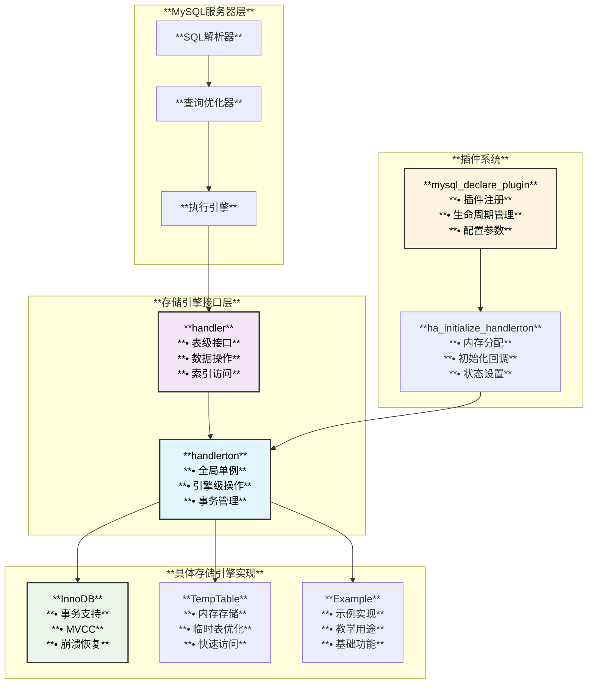
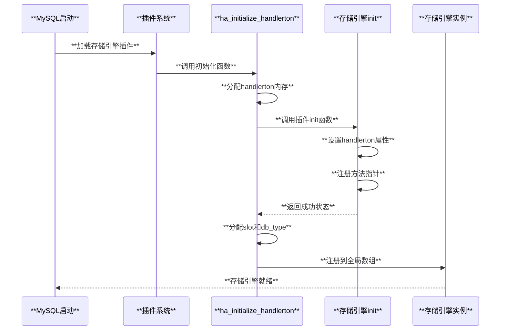
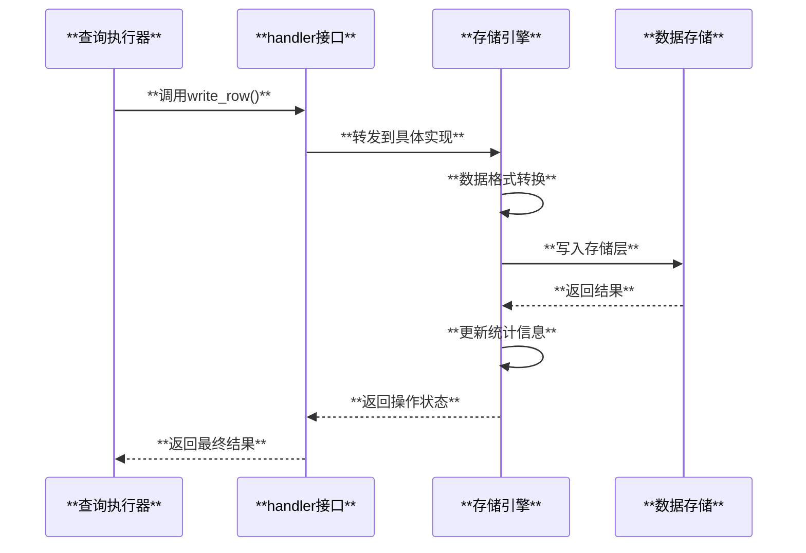

# MySQL存储引擎实现架构

## 概述

MySQL存储引擎是MySQL架构中的核心组件，负责数据的存储和检索。每个存储引擎都通过标准化的接口与MySQL服务器层进行交互，实现了插件式的可扩展架构。

## 核心架构组件

### 1. handlerton结构：全局存储引擎单例

`handlerton`是每个存储引擎的全局单例结构，提供存储引擎级别的功能接口：

```cpp
// sql/handler.h
struct handlerton {
  SHOW_COMP_OPTION state;                // 引擎可用状态
  enum legacy_db_type db_type;           // 引擎类型标识
  uint slot;                             // THD中的数据槽位号
  uint savepoint_offset;                 // 保存点偏移量

  /* 核心方法指针 */
  close_connection_t close_connection;   // 关闭连接
  kill_connection_t kill_connection;     // 终止连接
  commit_t commit;                       // 事务提交
  rollback_t rollback;                   // 事务回滚
  create_t create;                       // 创建处理器
  drop_database_t drop_database;         // 删除数据库
  panic_t panic;                         // 紧急关闭
  // ... 更多方法指针
};
```

**InnoDB存储引擎的handlerton初始化示例**：

```cpp
// storage/innobase/handler/ha_innodb.cc
static int innodb_init(void *p) {
  handlerton *innobase_hton = (handlerton *)p;
  
  // 设置基本属性
  innobase_hton->state = SHOW_OPTION_YES;
  innobase_hton->db_type = DB_TYPE_INNODB;
  innobase_hton->savepoint_offset = sizeof(trx_named_savept_t);
  
  // 设置方法指针
  innobase_hton->close_connection = innobase_close_connection;
  innobase_hton->kill_connection = innobase_kill_connection;
  innobase_hton->commit = innobase_commit;
  innobase_hton->rollback = innobase_rollback;
  innobase_hton->create = innobase_create_handler;
  innobase_hton->panic = innodb_shutdown;
  
  return 0;
}
```

### 2. handler类：表级别操作接口

`handler`类是存储引擎的表级别接口，每个打开的表都有一个对应的handler实例：

```cpp
// sql/handler.h
class handler {
public:
  handlerton *ht;                        // 指向handlerton
  TABLE_SHARE *table_share;              // 表定义
  TABLE *table;                          // 当前打开的表
  
  /* 核心虚方法 */
  virtual int open(const char *name, int mode, uint test_if_locked,
                   const dd::Table *table_def) = 0;
  virtual int close(void) = 0;
  virtual int write_row(uchar *buf);
  virtual int update_row(const uchar *old_data, uchar *new_data);
  virtual int delete_row(const uchar *buf);
  virtual int rnd_init(bool scan) = 0;
  virtual int rnd_next(uchar *buf);
  virtual int index_init(uint idx, bool sorted);
  virtual int index_read_map(uchar *buf, const uchar *key,
                            key_part_map keypart_map,
                            enum ha_rkey_function find_flag);
};
```

**handler类模块划分**：

```cpp
/* 主要功能模块 */

/* MODULE 1: 对象生命周期管理 */
virtual int open(const char *name, int mode, uint test_if_locked,
                 const dd::Table *table_def) = 0;
virtual int close(void) = 0;

/* MODULE 2: 记录变更操作 */
virtual int write_row(uchar *buf);
virtual int update_row(const uchar *old_data, uchar *new_data);
virtual int delete_row(const uchar *buf);
virtual int delete_all_rows();

/* MODULE 3: 全表扫描 */
virtual int rnd_init(bool scan) = 0;
virtual int rnd_next(uchar *buf);
virtual int rnd_end();
virtual void position(const uchar *record);

/* MODULE 4: 索引扫描 */
virtual int index_init(uint idx, bool sorted);
virtual int index_read_map(uchar *buf, const uchar *key,
                          key_part_map keypart_map,
                          enum ha_rkey_function find_flag);
virtual int index_next(uchar *buf);
virtual int index_end();

/* MODULE 5: 事务和锁控制 */
virtual int external_lock(THD *thd, int lock_type);
virtual int start_stmt(THD *thd, thr_lock_type lock_type);

/* MODULE 6: 优化器支持 */
virtual ha_rows records();
virtual double scan_time();
virtual double read_time(uint index, uint ranges, ha_rows rows);
```

### 3. 插件系统集成

存储引擎通过MySQL插件系统进行注册和管理：

```cpp
// storage/temptable/src/plugin.cc
static handler *create_handler(handlerton *hton, TABLE_SHARE *table_share, 
                               bool partitioned, MEM_ROOT *mem_root) {
  return new (mem_root) temptable::Handler(hton, table_share);
}

static int init(void *p) {
  handlerton *h = static_cast<handlerton *>(p);
  
  h->state = SHOW_OPTION_YES;
  h->db_type = DB_TYPE_TEMPTABLE;
  h->create = create_handler;
  h->flags = HTON_ALTER_NOT_SUPPORTED | HTON_CAN_RECREATE | HTON_HIDDEN;
  
  return 0;
}

mysql_declare_plugin(temptable) {
  MYSQL_STORAGE_ENGINE_PLUGIN,
  &temptable_storage_engine,
  "TempTable",
  PLUGIN_AUTHOR_ORACLE,
  "InnoDB temporary storage engine",
  PLUGIN_LICENSE_GPL,
  init,                                  // 初始化函数
  nullptr,                               // 检查卸载
  nullptr,                               // 销毁函数
  0x0100,                               // 版本1.0
  nullptr,                               // 状态变量
  nullptr,                               // 系统变量
  nullptr,                               // 配置选项
  0,                                     // 标志
} mysql_declare_plugin_end;
```

### 4. handlerton初始化过程

MySQL服务器在加载存储引擎插件时调用`ha_initialize_handlerton`：

```cpp
// sql/handler.cc
int ha_initialize_handlerton(st_plugin_int *plugin) {
  handlerton *hton;
  
  // 分配handlerton结构
  hton = static_cast<handlerton *>(my_malloc(key_memory_handlerton_objects,
                                             sizeof(handlerton),
                                             MYF(MY_WME | MY_ZEROFILL)));
  
  hton->slot = HA_SLOT_UNDEF;
  plugin->data = hton;                   // 建立插件与handlerton关联
  
  // 调用存储引擎的初始化函数
  if (plugin->plugin->init && plugin->plugin->init(hton)) {
    LogErr(ERROR_LEVEL, ER_PLUGIN_INIT_FAILED, plugin->name.str);
    goto err;
  }
  
  // 根据状态进行后续处理
  switch (hton->state) {
    case SHOW_OPTION_YES:
      // 分配db_type和slot
      // 注册到installed_htons数组
      break;
    case SHOW_OPTION_NO:
      // 引擎不可用
      break;
  }
  
  return 0;
}
```

## 存储引擎实现示例

### 1. InnoDB存储引擎

**特点**：事务性存储引擎，支持ACID特性

**核心类结构**：
```cpp
// storage/innobase/handler/ha_innodb.h
class ha_innobase : public handler {
public:
  ha_innobase(handlerton *hton, TABLE_SHARE *table_arg);
  
  // 实现核心方法
  int open(const char *name, int, uint open_flags,
           const dd::Table *table_def) override;
  int close(void) override;
  int write_row(uchar *buf) override;
  int update_row(const uchar *old_data, uchar *new_data) override;
  int delete_row(const uchar *buf) override;
  
  // InnoDB特有方法
  void init_table_handle_for_HANDLER(void);
  longlong get_memory_buffer_size() const override;
};
```

**创建handler实例**：
```cpp
// storage/innobase/handler/ha_innodb.cc
static handler *innobase_create_handler(handlerton *hton, TABLE_SHARE *table,
                                        bool partitioned, MEM_ROOT *mem_root) {
  if (partitioned) {
    ha_innopart *file = new (mem_root) ha_innopart(hton, table);
    if (file && file->init_partitioning(mem_root)) {
      ::destroy_at(file);
      return nullptr;
    }
    return file;
  }
  
  return new (mem_root) ha_innobase(hton, table);
}
```

### 2. TempTable存储引擎

**特点**：内存临时表存储引擎

**handler实现**：
```cpp
// storage/temptable/include/temptable/handler.h
class Handler : public ::handler {
public:
  Handler(handlerton *hton, TABLE_SHARE *table_share);
  
  int create(const char *table_name, TABLE *mysql_table,
             HA_CREATE_INFO *, dd::Table *) override;
  int delete_table(const char *table_name, const dd::Table *) override;
  int open(const char *table_name, int, uint, const dd::Table *) override;
  int close() override;
  int write_row(uchar *mysql_row) override;
  int update_row(const uchar *mysql_row_old, uchar *mysql_row_new) override;
  int delete_row(const uchar *mysql_row) override;
};
```

**操作实现示例**：
```cpp
// storage/temptable/src/handler.cc
int Handler::write_row(uchar *mysql_row) {
  opened_table_validate();
  
  handler::ha_statistic_increment(&System_status_var::ha_write_count);
  
  const Result ret = m_opened_table->insert(mysql_row);
  
  info(HA_STATUS_VARIABLE);
  
  return ret;
}

int Handler::delete_row(const uchar *mysql_row) {
  opened_table_validate();
  
  ha_statistic_increment(&System_status_var::ha_delete_count);
  
  const Storage::Iterator victim_position = m_rnd_iterator;
  
  if (m_rnd_iterator == m_opened_table->rows().begin()) {
    m_rnd_iterator_is_positioned = false;
  } else {
    --m_rnd_iterator;
  }
  
  const Result ret = m_opened_table->remove(mysql_row, victim_position);
  
  if (ret == Result::OK) {
    ++m_deleted_rows;
  }
  
  return ret;
}
```

## 存储引擎架构图



## 核心数据流

### 1. 存储引擎注册流程



### 2. 表操作数据流



## 实现要点

### 1. **内存管理**
- handlerton结构通过`my_malloc`分配
- handler实例使用MEM_ROOT内存池
- 支持内存泄漏检测和调试

### 2. **错误处理**
- 标准化的错误码返回机制
- 通过`my_error`报告错误信息
- 支持错误状态传播

### 3. **事务集成**
- handlerton提供事务方法指针
- 支持两阶段提交协议
- 与MySQL事务管理器协作

### 4. **性能优化**
- 批量操作支持
- 索引优化提示
- 统计信息收集和更新

### 5. **可扩展性**
- 插件式架构支持动态加载
- 标准化接口便于新引擎开发
- 配置参数和状态变量支持

## 开发最佳实践

### 1. **接口实现**
```cpp
// 必须实现的核心方法
class my_handler : public handler {
  int open(const char *name, int mode, uint test_if_locked,
           const dd::Table *table_def) override;
  int close(void) override;
  int rnd_init(bool scan) override;
  // ... 其他必需方法
};
```

### 2. **错误处理**
```cpp
int my_handler::write_row(uchar *buf) {
  try {
    // 存储引擎特定逻辑
    return 0;
  } catch (const my_exception &e) {
    return HA_ERR_GENERIC;
  }
}
```

### 3. **内存安全**
```cpp
static handler *create_handler(handlerton *hton, TABLE_SHARE *table,
                               bool partitioned, MEM_ROOT *mem_root) {
  // 使用MEM_ROOT分配，自动管理生命周期
  return new (mem_root) my_handler(hton, table);
}
```

## 总结

MySQL存储引擎架构通过**handlerton**和**handler**两级接口，实现了存储层的完全可插拔性。**handlerton**负责引擎级别的全局操作，**handler**提供表级别的数据访问接口。通过标准化的插件系统，新的存储引擎可以无缝集成到MySQL中，为不同的应用场景提供优化的存储解决方案。

这种设计的优势在于：
- **模块化**：清晰的接口分离
- **可扩展**：支持第三方存储引擎
- **灵活性**：不同表可使用不同引擎
- **性能**：针对特定场景优化
- **兼容性**：统一的SQL接口

