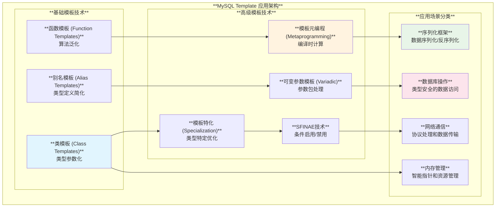
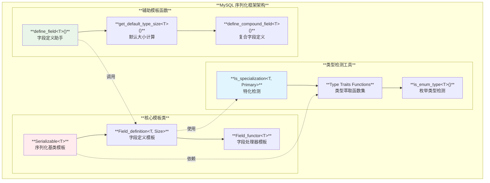
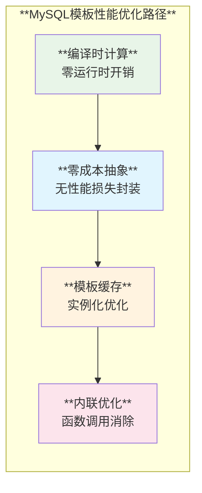

# MySQL Template 使用模式深度分析

## 概述

MySQL服务器在其C++代码库中广泛使用现代C++模板技术，从基础的类模板到高级的模板元编程，展现了丰富的模板应用场景。本文结合源码实例深入分析MySQL中模板的使用模式。

**核心特性**：
- **类型安全**：编译时类型检查和推导
- **代码复用**：通用化组件设计
- **性能优化**：零开销抽象
- **元编程**：编译时计算和特化
- **现代C++特性**：SFINAE、可变参数模板、完美转发

## MySQL Template 使用架构

### 1. 模板使用分类架构



### 2. MySQL模板技术应用矩阵

| **技术分类** | **主要用途** | **典型应用场景** | **性能收益** | **复杂度** |
|-------------|-------------|----------------|-------------|-----------|
| **类模板** | 类型参数化 | 容器、智能指针 | ⭐⭐⭐⭐ | ⭐⭐ |
| **函数模板** | 算法泛化 | 工具函数、转换器 | ⭐⭐⭐⭐⭐ | ⭐⭐ |
| **特化** | 类型优化 | 性能关键路径 | ⭐⭐⭐⭐⭐ | ⭐⭐⭐ |
| **元编程** | 编译时计算 | 类型萃取、条件编译 | ⭐⭐⭐⭐⭐ | ⭐⭐⭐⭐⭐ |
| **SFINAE** | 条件启用 | 接口适配、类型约束 | ⭐⭐⭐⭐ | ⭐⭐⭐⭐ |
| **可变参数** | 参数包处理 | 通用接口、完美转发 | ⭐⭐⭐⭐ | ⭐⭐⭐ |

## 核心模板技术分析

### 1. 模板特化与类型萃取

**源码位置**: `libs/mysql/utils/is_specialization.h:35-45`

```cpp
namespace mysql::utils {

/// @brief 编译时判断类型是否为模板特化
template <typename Test, template <typename...> class Primary>
struct Is_specialization : std::false_type {};

/// @brief 特化版本 - 匹配模板特化类型
template <template <typename...> class Primary, typename... Args>
struct Is_specialization<Primary<Args...>, Primary> : std::true_type {};

}  // namespace mysql::utils
```

**技术特点**：
- **模板模板参数**：使用 `template <typename...> class Primary` 接受模板作为参数
- **偏特化机制**：通过偏特化实现类型匹配检测
- **零开销抽象**：编译时完全解析，运行时零开销

### 2. 类型萃取与SFINAE应用

**源码位置**: `libs/mysql/serialization/serializable_type_traits.h:44-88`

```cpp
namespace mysql::serialization {

/// @brief 检测枚举类型
template <class T>
static constexpr bool is_enum_type() {
  return std::is_enum<std::decay_t<T>>::value;
}

/// @brief 检测序列化类型 - 基于继承关系判断
template <class T>
static constexpr bool is_serializable_type() {
  return std::is_base_of<Serializable<std::decay_t<T>>, std::decay_t<T>>::value;
}

/// @brief 检测STL容器类型 - 使用特化检测
template <class T>
static constexpr bool is_vector_list_type() {
  return utils::Is_specialization<std::decay_t<T>, std::vector>::value ||
         utils::Is_specialization<std::decay_t<T>, std::list>::value;
}

/// @brief 检测映射容器类型
template <class T>
static constexpr bool is_map_type() {
  return utils::Is_specialization<std::decay_t<T>, std::map>::value ||
         utils::Is_specialization<std::decay_t<T>, std::unordered_map>::value;
}

}  // namespace mysql::serialization
```

**设计亮点**：
- **std::decay_t**：自动移除cv限定符和引用
- **constexpr函数**：编译时计算，支持常量表达式
- **组合判断**：多种类型检测的逻辑组合
- **标准库集成**：充分利用C++标准库的类型萃取工具

### 3. 可变参数模板与完美转发

**源码位置**: `libs/mysql/serialization/field_definition_helpers.h:48-64`

```cpp
namespace mysql::serialization {

/// @brief 带大小的字段定义 - 完美转发
template <Field_size size, typename Field_type, typename... Args>
auto define_field_with_size(Field_type &arg, Args &&...args) {
  return Field_definition<Field_type, size>(arg, std::forward<Args>(args)...);
}

/// @brief 通用字段定义 - 可变参数处理
template <typename Field_type, typename... Args>
auto define_field(Field_type &arg, Args &&...args) {
  return Field_definition<Field_type, get_default_type_size<Field_type>()>(
      arg, std::forward<Args>(args)...);
}

/// @brief const版本重载
template <typename Field_type, typename... Args>
auto define_field(const Field_type &arg, Args &&...args) {
  return Field_definition<const Field_type,
                          get_default_type_size<Field_type>()>(
      arg, std::forward<Args>(args)...);
}

}  // namespace mysql::serialization
```

**关键技术**：
- **可变参数模板**：`typename... Args` 和 `Args &&...args`
- **完美转发**：`std::forward<Args>(args)...` 保持参数的值类别
- **auto返回类型**：自动类型推导
- **函数重载**：基于const性的重载

### 4. 模板元编程与编译时计算

**源码位置**: `libs/mysql/serialization/serializable_impl.hpp:173-179`

```cpp
template <class Derived_serializable_type>
bool Serializable<Derived_serializable_type>::is_any_field_provided() const {
  // Lambda表达式捕获外部变量
  bool is_provided = false;
  auto func_is_provided_s = [&is_provided](const auto &serializable,
                                           const auto &) -> void {
    is_provided = serializable.is_any_field_provided();
  };
  auto func_is_provided_f = [&is_provided](const auto &field,
                                           const auto &) -> void {
    if (field.run_encode_predicate()) {
      is_provided = true;
    }
  };
  
  // 编译时类型计算
  using Tuple_type =
      decltype(std::declval<Derived_serializable_type>().define_fields());
  do_for_each_field(
      func_is_provided_s, func_is_provided_f,
      static_cast<const Derived_serializable_type *>(this)->define_fields(),
      std::make_index_sequence<std::tuple_size_v<Tuple_type>>{});
  return is_provided;
}
```

**元编程特性**：
- **decltype推导**：`decltype(std::declval<T>().define_fields())` 获取返回类型
- **std::index_sequence**：编译时整数序列生成
- **std::tuple_size_v**：编译时获取tuple大小
- **CRTP模式**：奇异递归模板模式实现静态多态

### 5. 系统变量模板化设计

**源码位置**: `sql/sys_vars.h:2350-2376`

```cpp
/// @brief 结构化系统变量的通用模板
template <typename Struct_type, typename Name_getter>
class Sys_var_struct : public sys_var {
 public:
  Sys_var_struct(
      const char *name_arg, const char *comment, int flag_args, ptrdiff_t off,
      size_t size [[maybe_unused]], CMD_LINE getopt, void *def_val,
      PolyLock *lock = nullptr,
      enum binlog_status_enum binlog_status_arg = VARIABLE_NOT_IN_BINLOG,
      on_check_function on_check_func = nullptr,
      on_update_function on_update_func = nullptr,
      const char *substitute = nullptr, int parse_flag = PARSE_NORMAL)
      : sys_var(&all_sys_vars, name_arg, comment, flag_args, off, getopt.id,
                getopt.arg_type, SHOW_CHAR, (intptr)def_val, lock,
                binlog_status_arg, on_check_func, on_update_func, substitute,
                parse_flag) {
    option.var_type = GET_STR;
    assert(getopt.id == -1);
    assert(size == sizeof(void *));
  }
  
  bool do_check(THD *, set_var *) override { return false; }
  bool session_update(THD *thd, set_var *var) override;
  // ...
};
```

**设计模式**：
- **策略模式**：通过 `Name_getter` 模板参数实现不同的名称获取策略
- **类型安全**：编译时确保结构体类型的正确性
- **继承与多态**：结合模板和虚函数实现灵活的继承体系

### 6. 网络协议模板化处理

**源码位置**: `plugin/x/src/ngs/mysqlx/getter_any.h:41-84`

```cpp
namespace ngs {

class Getter_any {
 public:
  /// @brief 通用数值类型获取模板
  template <typename Value_type>
  static Value_type get_numeric_value(const ::Mysqlx::Datatypes::Any &any) {
    using ::Mysqlx::Datatypes::Any;
    using ::Mysqlx::Datatypes::Scalar;

    if (Any::SCALAR != any.type())
      throw Error_code(ER_X_INVALID_PROTOCOL_DATA,
                       "Invalid data, expecting scalar");

    const Scalar &scalar = any.scalar();

    switch (scalar.type()) {
      case Scalar::V_BOOL:
        return static_cast<Value_type>(scalar.v_bool());
      case Scalar::V_DOUBLE:
        return static_cast<Value_type>(scalar.v_double());
      case Scalar::V_FLOAT:
        return static_cast<Value_type>(scalar.v_float());
      case Scalar::V_SINT:
        return static_cast<Value_type>(scalar.v_signed_int());
      case Scalar::V_UINT:
        return static_cast<Value_type>(scalar.v_unsigned_int());
      default:
        throw Error_code(ER_X_INVALID_PROTOCOL_DATA,
                         "Invalid data, expected numeric type");
    }
  }

  /// @brief 异常安全版本
  template <typename Value_type>
  static Value_type get_numeric_value(const ::Mysqlx::Datatypes::Any &any,
                                      ngs::Error_code *out_error) {
    try {
      return get_numeric_value<Value_type>(any);
    } catch (const Error_code &e) {
      if (out_error) *out_error = e;
    }
    return {};
  }
};

}  // namespace ngs
```

**应用特色**：
- **类型转换模板**：支持任意数值类型的安全转换
- **异常安全**：提供异常和错误码两种处理方式
- **协议解析**：MySQL X协议的通用数据提取器

## 高级模板应用场景

### 1. 序列化框架的模板设计



### 2. 模板在数据库行处理中的应用

**源码位置**: `storage/innobase/include/row0mysql.h:605-658`

```cpp
/// @brief MySQL行模板结构体
struct mysql_row_templ_t {
  unsigned template_type : 2;       /*!< ROW_MYSQL_WHOLE_ROW,
                                    ROW_MYSQL_REC_FIELDS,
                                    ROW_MYSQL_DUMMY_TEMPLATE, or
                                    ROW_MYSQL_NO_TEMPLATE */
  unsigned n_template : 10;         /*!< 模板中元素的数量 */
  unsigned null_bitmap_len : 10;    /*!< SQL NULL位图的字节数 */
  unsigned need_to_access_clustered : 1; /*!< 是否需要访问聚集索引 */
  unsigned templ_contains_blob : 1;      /*!< 模板是否包含BLOB列 */
  unsigned templ_contains_fixed_point : 1; /*!< 是否包含POINT数据类型 */
  
  /** @brief 在MySQL和InnoDB格式之间快速转换行的模板；
      此模板的内存不从'heap'分配 */
  mysql_row_templ_t *mysql_template;
};
```

**设计理念**：
- **位域优化**：使用位域减少内存占用
- **模板缓存**：预构建的转换模板提升性能
- **类型标记**：通过类型字段支持不同的处理策略

### 3. 函数模板的类型推导

**源码位置**: `plugin/x/src/mysql_function_names.cc:421-431`

```cpp
namespace {

/// @brief 容器查找模板函数
template <typename Container, typename Value>
bool contains(const Container &container, const Value &value) {
  return std::binary_search(std::begin(container), std::end(container),
                            value.c_str(), Is_less());
}

/// @brief 容器复制模板函数  
template <typename Container>
void copy(const Container &container, std::vector<const char *> *result) {
  std::copy(std::begin(container), std::end(container),
            std::back_inserter(*result));
}

}  // namespace
```

**通用化设计**：
- **迭代器抽象**：使用 `std::begin/end` 支持各种容器
- **算法模板化**：标准算法的模板化应用
- **类型推导**：编译器自动推导容器和值类型

## MySQL模板最佳实践

### 1. 性能优化实践

#### 编译时计算优先

```cpp
// ✅ 推荐：编译时大小计算
template <class Type>
constexpr std::size_t get_default_type_size() {
  return 0;  // 默认值，可针对特定类型特化
}

// ✅ 推荐：constexpr函数模板
template <class T>
static constexpr bool is_enum_type() {
  return std::is_enum<std::decay_t<T>>::value;
}
```

#### SFINAE条件启用

```cpp
// ✅ 推荐：基于类型特性的条件启用
template <class T>
static constexpr bool is_vector_list_type() {
  return utils::Is_specialization<std::decay_t<T>, std::vector>::value ||
         utils::Is_specialization<std::decay_t<T>, std::list>::value;
}
```

### 2. 代码组织实践

#### 清晰的模板命名

```cpp
// ✅ 推荐：语义化的模板参数名称
template <typename Struct_type, typename Name_getter>
class Sys_var_struct : public sys_var { /* ... */ };

// ✅ 推荐：描述性的模板类名
template <typename Test, template <typename...> class Primary>
struct Is_specialization : std::false_type {};
```

#### 合理的特化层次

```cpp
// ✅ 推荐：基础模板
template <class T>
struct is_std_array : std::false_type {};

// ✅ 推荐：针对性特化
template <class T, std::size_t N>
struct is_std_array<std::array<T, N>> : std::true_type {};
```

### 3. 错误处理实践

#### 模板友好的异常处理

```cpp
// ✅ 推荐：提供异常和错误码两种方式
template <typename Value_type>
static Value_type get_numeric_value(const ::Mysqlx::Datatypes::Any &any,
                                    ngs::Error_code *out_error = nullptr) {
  try {
    return get_numeric_value<Value_type>(any);
  } catch (const Error_code &e) {
    if (out_error) *out_error = e;
  }
  return {};
}
```

## 模板技术发展趋势

### 1. 现代C++特性集成

| **C++版本** | **新特性** | **MySQL中的应用** | **性能提升** |
|------------|-----------|------------------|-------------|
| **C++11** | 可变参数模板、auto | 序列化框架、类型推导 | ⭐⭐⭐⭐ |
| **C++14** | 变量模板、通用lambda | 类型萃取、函数对象 | ⭐⭐⭐⭐ |
| **C++17** | constexpr if、fold表达式 | 条件编译、参数包处理 | ⭐⭐⭐⭐⭐ |
| **C++20** | 概念(Concepts)、模块 | 类型约束、编译优化 | ⭐⭐⭐⭐⭐ |

### 2. 性能优化方向



### 3. 未来发展方向

- **概念约束**：更严格的类型约束和更好的错误信息
- **模块系统**：更好的编译时间和符号管理
- **反射支持**：运行时类型信息和动态调用能力
- **协程集成**：异步操作的模板化支持

## 总结

MySQL在模板技术的应用上展现了现代C++的强大表现力：

### 🚀 **技术亮点**

1. **系统化设计**：从基础类模板到复杂的元编程，形成完整的模板技术栈
2. **性能导向**：大量使用编译时计算，实现零开销抽象
3. **类型安全**：通过模板特化和SFINAE实现编译时类型检查
4. **代码复用**：通用化的模板设计减少代码重复

### 📈 **应用价值**

- **编译时优化**：通过模板元编程实现编译时计算，运行时零开销
- **类型安全性**：编译时类型检查避免运行时错误
- **代码维护性**：模板化设计提高代码的可维护性和扩展性
- **性能优化**：特化机制针对特定类型优化性能

MySQL的模板使用模式为大型C++项目的模板设计提供了优秀的参考范例，展现了现代C++在系统软件开发中的强大能力。
