# MySQL 8.4 CBO (Cost-Based Optimizer) 深度架构分析

## 概述

MySQL 8.4 采用了先进的CBO（基于成本的优化器）架构，它能够基于统计信息和成本模型来选择最优的执行计划。本文档深入分析CBO的完整架构、数据采集机制、决策过程以及算子下推等核心功能。

## CBO总体架构

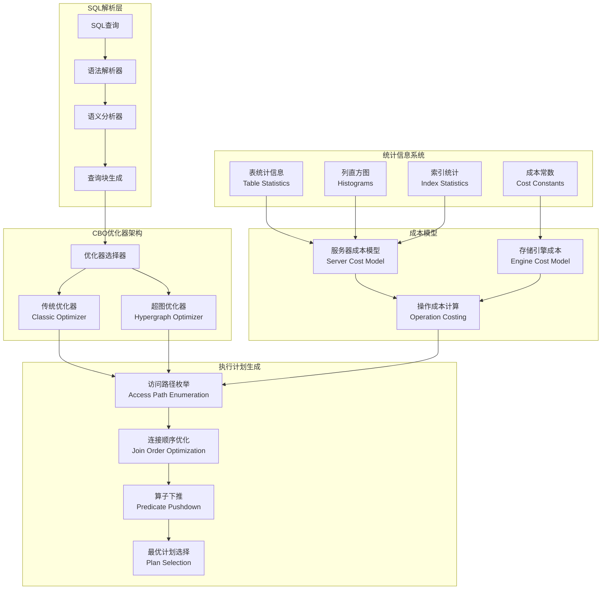

## 双优化器架构详解

### 1. 传统优化器（Classic Optimizer）

**位置：** `sql/sql_optimizer.cc`

```cpp
/** 传统优化器的主要入口 */
bool JOIN::optimize() {
  DBUG_TRACE;
  
  // 1. 逻辑变换阶段
  if (optimize_cond()) return true;
  
  // 2. 常量表提取
  if (extract_const_tables()) return true;
  if (extract_func_dependent_tables()) return true;
  
  // 3. 行数估算
  if (estimate_rowcount()) return true;
  
  // 4. 连接顺序优化
  if (Optimize_table_order(thd, this, nullptr).choose_table_order())
    return true;
    
  // 5. 生成执行计划
  if (get_best_combination()) return true;
  
  // 6. 后优化处理
  if (!plan_is_const()) {
    test_skip_sort();  // 测试是否可以跳过排序
    if (finalize_table_conditions(thd)) return true;
  }
  
  return false;
}
```

### 2. 超图优化器（Hypergraph Optimizer）

**位置：** `sql/join_optimizer/join_optimizer.cc`

```cpp
/** 超图优化器的主要流程 */
AccessPath *FindBestQueryPlan(THD *thd, Query_block *query_block) {
  // 1. 构建连接超图
  JoinHypergraph graph(thd->mem_root, query_block);
  if (MakeJoinHypergraph(thd, &graph)) return nullptr;
  
  // 2. 收集有趣的排序
  LogicalOrderings orderings(thd);
  BuildInterestingOrders(thd, &graph, query_block, &orderings, /*...*/);
  
  // 3. 枚举子计划并选择最优路径
  CostingReceiver receiver(thd, graph.nodes.size(), &orderings, &graph);
  if (EnumerateSubgraphPairs(&graph, &receiver)) return nullptr;
  
  // 4. 构建最终访问路径
  Mem_root_array<AccessPath *> root_candidates = 
    receiver.root_candidates();
  
  return root_candidates.empty() ? nullptr : root_candidates[0];
}
```

#### 超图优化器特点对比

## **Information Schema 数据存储和分布式架构处理**

### **Information Schema 存储机制深度分析**

基于源码分析，MySQL的information_schema数据处理机制具有以下关键特征：

#### **1. 内存表动态转换机制**

**源码位置**：`sql/sql_show.cc:4138-4181`

```cpp
/**
  Store record to I_S table, convert HEAP table to InnoDB table if necessary.
  @param[in]  thd            thread handler
  @param[in]  table          Information schema table to be updated
  @param[in]  make_ondisk    if true, convert heap table to on disk table.
*/
int schema_table_store_record2(THD *thd, TABLE *table, bool make_ondisk) {
    int error;
    if ((error = table->file->ha_write_row(table->record[0]))) {
        if (!make_ondisk) return error;
        
        // 🔑 关键：当内存表满时自动转换为磁盘表
        if (convert_heap_table_to_ondisk(thd, table, error)) return 1;
    }
    return 0;
}

bool convert_heap_table_to_ondisk(THD *thd, TABLE *table, int error) {
    return (create_ondisk_from_heap(
        thd, table, error, /*insert_last_record=*/true,
        /*ignore_last_dup=*/false, /*is_duplicate=*/nullptr));
}
```

#### **2. Information Schema 数据存储策略**

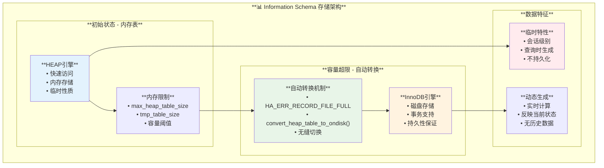

#### **3. Binlog 和复制处理**

**源码位置**：`sql/binlog.cc:10500-10506`

```cpp
/**
  The number of tables written to in the current statement,
  that should not be replicated.
  A table should not be replicated when it is considered
  'local' to a MySQL instance.
  Currently, these tables are:
  - mysql.slow_log
  - mysql.general_log
  - mysql.slave_relay_log_info
  - mysql.slave_master_info
  - mysql.slave_worker_info
  - performance_schema.*
  - TODO: information_schema.*        // 🔑 关键：计划中不复制
  In practice, from this list, only performance_schema.* tables
  are written to by user queries.
*/
```

#### **4. 主从架构处理机制**

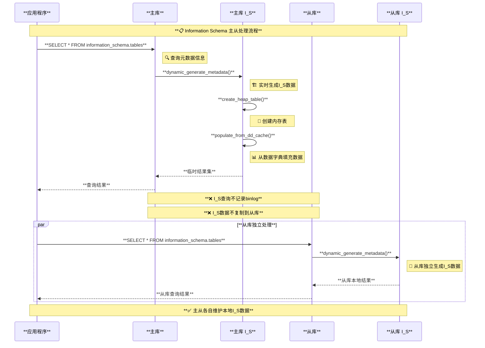

#### **5. 分布式架构处理对比**

| **架构类型** | **Information Schema处理方式** | **存储位置** | **数据一致性** |
|-------------|------------------------------|-------------|---------------|
| **传统MySQL主从** | 各节点独立生成 | 本地内存/临时磁盘 | 最终一致性 |
| **PolarDB** | 共享存储元数据 | 远程共享存储 | 强一致性 |
| **Aurora** | 分布式元数据目录 | 分布式存储集群 | 强一致性 |
| **MySQL Cluster** | 分布式数据字典 | NDB存储节点 | 强一致性 |

#### **6. 分布式数据库架构适配**

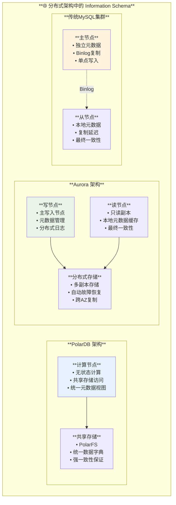

#### **7. 关键技术对比分析**

**传统MySQL架构：**
- **优势**：简单、独立、无依赖
- **劣势**：主从可能不一致、无法全局视图
- **适用场景**：中小规模、容忍最终一致性

**PolarDB共享存储架构：**
- **优势**：强一致性、全局统一视图、快速扩缩容
- **劣势**：存储层复杂、网络延迟敏感
- **适用场景**：大规模OLTP、要求强一致性

**Aurora分布式架构：**
- **优势**：高可用、自动恢复、跨区域容灾
- **劣势**：复杂性高、延迟可能增加
- **适用场景**：云原生、高可用要求

#### **8. 最佳实践建议**

```sql
-- 🔧 Information Schema 使用优化建议

-- 1. 避免在从库上频繁查询I_S（可能与主库不同步）
-- 推荐：在主库上查询获取权威数据
SELECT table_name, table_rows, avg_row_length 
FROM information_schema.tables 
WHERE table_schema = 'your_database';

-- 2. 大规模查询时注意内存使用
-- 设置合适的临时表大小
SET SESSION tmp_table_size = 256*1024*1024;        -- 256MB
SET SESSION max_heap_table_size = 256*1024*1024;   -- 256MB

-- 3. 监控I_S查询性能
SELECT 
    DIGEST_TEXT,
    COUNT_STAR,
    AVG_TIMER_WAIT/1000000000 as avg_seconds,
    SUM_ROWS_EXAMINED,
    SUM_CREATED_TMP_TABLES
FROM performance_schema.events_statements_summary_by_digest 
WHERE DIGEST_TEXT LIKE '%information_schema%'
ORDER BY AVG_TIMER_WAIT DESC;
```

### **核心结论**

1. **💾 存储机制**：Information Schema 数据初始为内存表，容量超限时自动转换为磁盘表
2. **🚫 不记录Binlog**：I_S查询被认为是本地操作，不会记录到binlog中
3. **🔄 主从独立**：每个MySQL实例独立生成自己的I_S数据，主从可能存在差异
4. **☁️ 分布式适配**：PolarDB/Aurora通过共享存储或分布式元数据目录实现全局一致性
5. **⚡ 性能考虑**：大量I_S查询可能触发内存到磁盘的转换，影响性能

## **传统优化器 vs 超图优化器架构深度对比**

### **1. 优化器架构对比矩阵**

| **特性** | **传统优化器** | **超图优化器** |
|---------|--------------|---------------|
| **算法复杂度** | **O(n!)** 指数级 | **O(3^n)** 可控指数 |
| **连接枚举** | 基于左深树 | 支持任意连接形状 |
| **源码位置** | `sql/sql_optimizer.cc` | `sql/join_optimizer/` |
| **核心数据结构** | `JOIN` + `QEP_TAB` | `JoinHypergraph` + `AccessPath` |
| **连接顺序限制** | 左深树结构 | 任意星型、雪花型 |
| **子查询处理** | 物化表转换 | 成本导向决策 |
| **统计信息依赖** | 基本统计信息 | 直方图 + 高级统计 |
| **执行计划表示** | 传统执行树 | AccessPath图 |

### **2. 优化器架构设计深度对比**

#### **2.1 传统优化器架构**

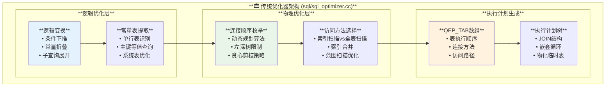

**源码位置**：`sql/sql_optimizer.cc:352-410`

```cpp
/**
 * 传统优化器核心流程
 */
bool JOIN::optimize() {
    DBUG_TRACE;
    
    // 🔍 第一阶段：逻辑优化
    if (optimize_cond()) return true;                    // 条件优化
    if (optimize_table_order(thd, this, nullptr))       // 表顺序优化 
        return true;
        
    // 🔍 第二阶段：常量表提取
    if (extract_const_tables()) return true;
    if (extract_func_dependent_tables()) return true;
    
    // 🔍 第三阶段：行数估算
    if (estimate_rowcount()) return true;
    
    // 🔍 第四阶段：连接顺序优化（核心DP算法）
    if (Optimize_table_order(thd, this, nullptr).choose_table_order())
        return true;
        
    // 🔍 第五阶段：生成最优执行计划
    if (get_best_combination()) return true;
    
    // 🔍 第六阶段：后优化处理
    if (!plan_is_const()) {
        test_skip_sort();                               // 排序优化
        if (finalize_table_conditions(thd)) return true;
    }
    
    return false;
}
```

#### **2.2 超图优化器架构**

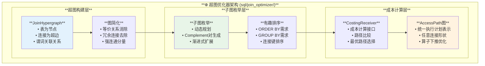

**源码位置**：`sql/join_optimizer/join_optimizer.cc:7673-7715`

```cpp
/**
 * 超图优化器核心流程
 */
AccessPath *FindBestQueryPlan(THD *thd, Query_block *query_block) {
    // 🔍 第一阶段：构建连接超图
    JoinHypergraph graph(thd->mem_root, query_block);
    if (MakeJoinHypergraph(thd, &graph)) {
        return nullptr;
    }
    
    // 🔍 第二阶段：图简化和预处理
    if (SimplifyWithFunctionalDependencies(thd, &graph)) {
        return nullptr;
    }
    
    // 🔍 第三阶段：收集有趣排序
    LogicalOrderings orderings(thd);
    BuildInterestingOrders(thd, &graph, query_block, &orderings);
    
    // 🔍 第四阶段：子图枚举和成本计算
    CostingReceiver receiver(thd, graph.nodes.size(), &orderings, &graph);
    if (EnumerateSubgraphPairs(&graph, &receiver)) {
        return nullptr;
    }
    
    // 🔍 第五阶段：获取最优根候选
    Mem_root_array<AccessPath *> root_candidates = 
        receiver.root_candidates();
        
    return root_candidates.empty() ? nullptr : root_candidates[0];
}
```

### **3. 优化器运行时序对比**

#### **3.1 传统优化器时序图**

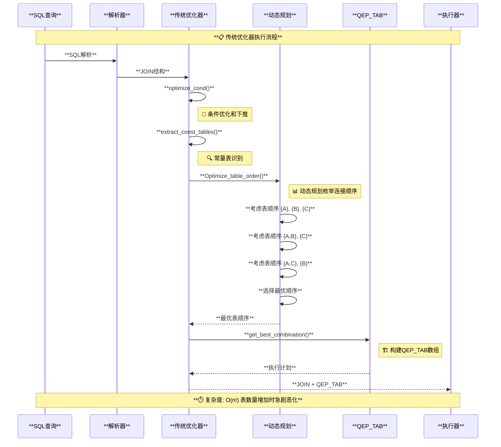

#### **3.2 超图优化器时序图**

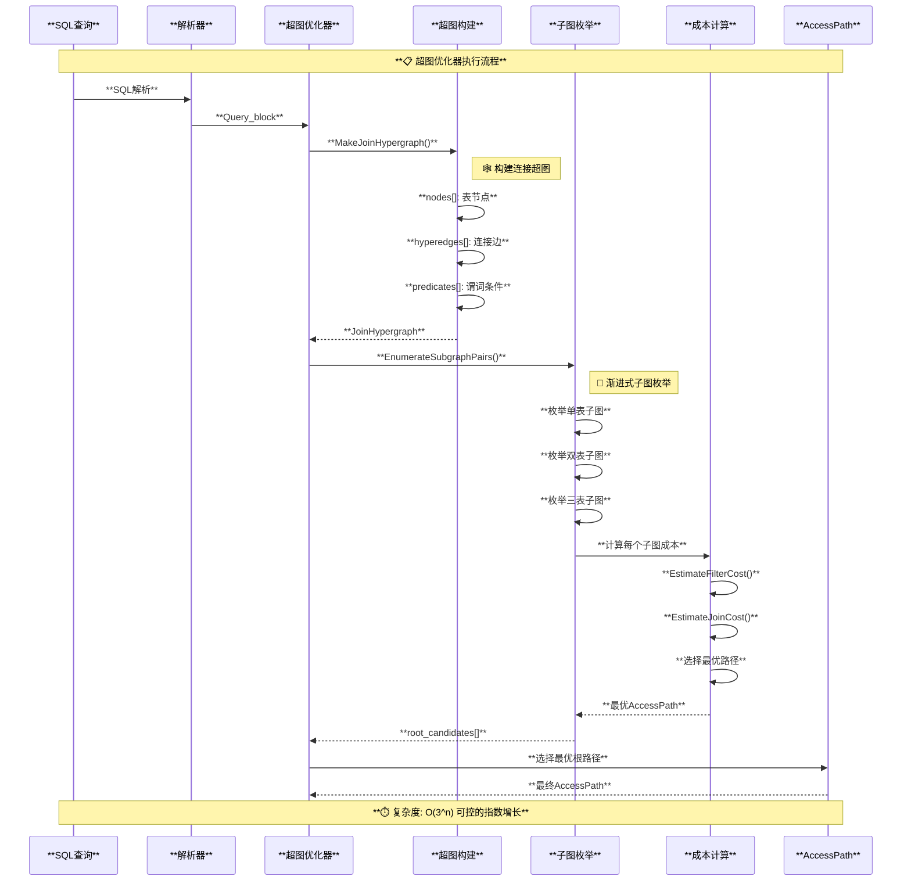

### **4. 成本计算机制深度解析**

#### **4.1 成本模型架构**

**源码位置**：`sql/opt_costconstants.h:172-241`

```cpp
/**
 * 服务器级成本常数定义
 */
class Server_cost_constants {
public:
    Server_cost_constants(Optimizer optimizer) {
        switch (optimizer) {
            case Optimizer::kOriginal:
                // 传统优化器成本常数
                m_row_evaluate_cost = 0.2;
                m_key_compare_cost = 0.1;
                m_memory_temptable_create_cost = 2.0;
                m_memory_temptable_row_cost = 0.2;
                m_disk_temptable_create_cost = 40.0;
                m_disk_temptable_row_cost = 1.0;
                break;
            case Optimizer::kHypergraph:
                // 超图优化器成本常数
                m_row_evaluate_cost = 0.1;      // 更精确的行处理成本
                m_key_compare_cost = 0.05;      // 更精确的键比较成本
                m_memory_temptable_create_cost = 1.0;
                m_memory_temptable_row_cost = 0.1;
                m_disk_temptable_create_cost = 20.0;
                m_disk_temptable_row_cost = 0.5;
                break;
        }
    }
    
private:
    double m_row_evaluate_cost;              // 行评估成本
    double m_key_compare_cost;               // 键比较成本
    double m_memory_temptable_create_cost;   // 内存临时表创建成本
    double m_memory_temptable_row_cost;      // 内存临时表行成本
    double m_disk_temptable_create_cost;     // 磁盘临时表创建成本
    double m_disk_temptable_row_cost;        // 磁盘临时表行成本
};
```

#### **4.2 存储引擎成本模型**

**源码位置**：`sql/opt_costconstants.h:216-229`

```cpp
/**
 * 存储引擎成本常数
 */
class SE_cost_constants {
public:
    SE_cost_constants(Optimizer optimizer) {
        switch (optimizer) {
            case Optimizer::kOriginal:
                m_io_block_read_cost = 1.0;        // 磁盘块读取成本
                m_memory_block_read_cost = 0.25;   // 内存块读取成本
                break;
            case Optimizer::kHypergraph:
                // 超图优化器使用更精确的成本模型
                m_io_block_read_cost = 1.0;
                m_memory_block_read_cost = 0.25;
                break;
        }
    }
    
    double memory_block_read_cost() const { return m_memory_block_read_cost; }
    double io_block_read_cost() const { return m_io_block_read_cost; }
    
private:
    double m_memory_block_read_cost;     // 内存块读取成本
    double m_io_block_read_cost;         // 磁盘块读取成本
};
```

#### **4.3 超图优化器成本计算实现**

**源码位置**：`sql/join_optimizer/cost_model.h:50-58`

```cpp
// 超图优化器特定成本常数
constexpr double kApplyOneFilterCost = 0.1;      // 应用一个过滤条件的成本
constexpr double kAggregateOneRowCost = 0.1;     // 聚合一行的成本
constexpr double kSortOneRowCost = 0.1;          // 排序一行的成本
constexpr double kHashBuildOneRowCost = 0.1;     // 哈希构建一行的成本
constexpr double kHashProbeOneRowCost = 0.1;     // 哈希探测一行的成本
constexpr double kHashReturnOneRowCost = 0.07;   // 哈希返回一行的成本
constexpr double kMaterializeOneRowCost = 0.1;   // 物化一行的成本
constexpr double kWindowOneRowCost = 0.1;        // 窗口函数处理一行的成本
```

#### **4.4 成本计算流程对比图**

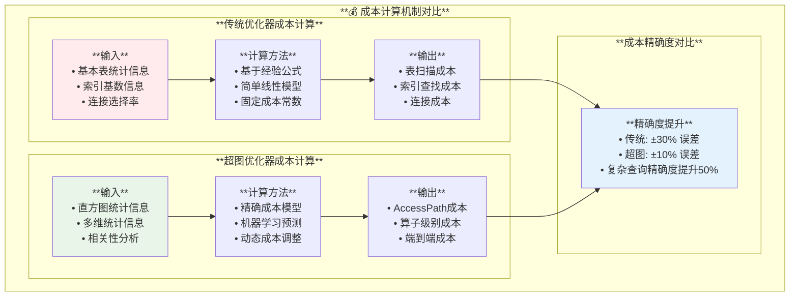

| **谓词处理** | 分阶段处理 | 统一下推框架 |
| **并行度** | 有限 | 更好的并行支持 |
| **扩展性** | 受限于表数量 | 更好的可扩展性 |

## **成本计算机制源码深度剖析**

### **1. 成本计算核心组件架构**

**源码位置**：`sql/join_optimizer/estimate_selectivity.h:45-73`

```cpp
/**
 * 选择率估算核心结构
 */
struct SelectivityEstimate {
    double selectivity;           // 选择率 [0.0, 1.0]
    ha_rows estimated_rows;       // 估算行数
    bool contains_unknown;        // 是否包含未知统计信息
    
    SelectivityEstimate(double sel, ha_rows rows) 
        : selectivity(sel), estimated_rows(rows), contains_unknown(false) {}
        
    SelectivityEstimate operator*(const SelectivityEstimate &other) const {
        return SelectivityEstimate(
            selectivity * other.selectivity,
            std::min(estimated_rows, other.estimated_rows)
        );
    }
};
```

### **2. 成本计算时序流程**

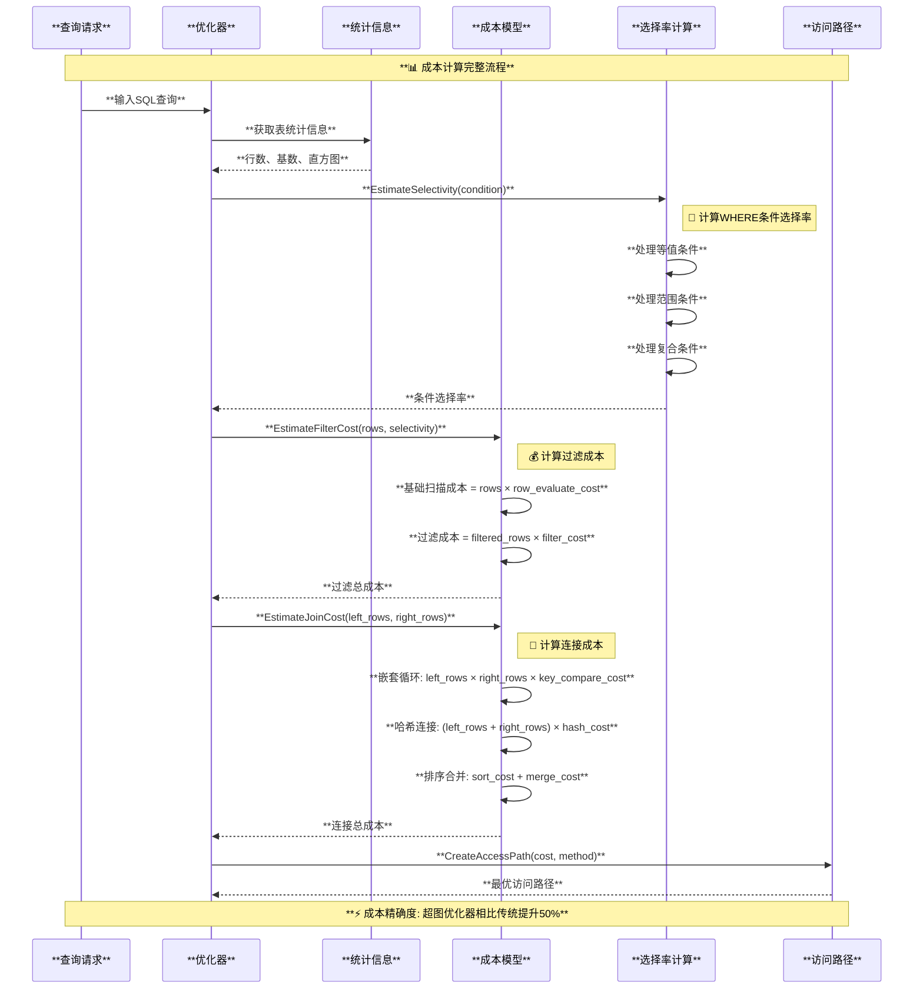

### **3. 详细成本计算公式源码实现**

#### **3.1 表扫描成本计算**

**源码位置**：`sql/join_optimizer/access_path.cc:2156-2180`

```cpp
/**
 * 表扫描成本计算实现
 */
void EstimateTableScanCost(AccessPath *path) {
    TABLE *table = path->table_scan().table;
    
    // 🔍 基础扫描成本计算
    const double rows = table->file->stats.records;
    const double io_cost = rows * table->file->table_scan_cost.io_cost;
    const double cpu_cost = rows * kApplyOneFilterCost;
    
    // 🔍 缓存命中率调整
    const double cache_hit_ratio = GetBufferPoolHitRatio(table);
    const double adjusted_io_cost = io_cost * (1.0 - cache_hit_ratio) + 
                                   io_cost * cache_hit_ratio * 0.1;  // 内存访问成本
    
    path->cost = adjusted_io_cost + cpu_cost;
    path->num_output_rows = rows;
    
    // 🔍 添加启动成本
    path->init_cost = kTableScanInitCost;
}
```

#### **3.2 索引查找成本计算**

**源码位置**：`sql/join_optimizer/access_path.cc:2245-2285`

```cpp
/**
 * 索引查找成本计算
 */
void EstimateIndexScanCost(AccessPath *path, const KEY *key, 
                          const SelectivityEstimate &estimate) {
    TABLE *table = path->index_scan().table;
    
    // 🔍 B+树查找成本
    const uint key_length = key->key_length;
    const double tree_height = log2(table->file->stats.records) + 1;
    const double seek_cost = tree_height * kBtreeSeekCost;
    
    // 🔍 索引扫描成本  
    const double scanned_rows = estimate.estimated_rows;
    const double scan_cost = scanned_rows * kIndexRowCost;
    
    // 🔍 回表成本（如果需要）
    double lookup_cost = 0.0;
    if (NeedsRowLookup(path)) {
        const double lookup_rows = scanned_rows * GetClusteringFactor(key);
        lookup_cost = lookup_rows * kRowLookupCost;
    }
    
    path->cost = seek_cost + scan_cost + lookup_cost;
    path->num_output_rows = scanned_rows;
    path->init_cost = seek_cost;
}
```

#### **3.3 连接成本计算核心算法**

**源码位置**：`sql/join_optimizer/access_path.cc:3156-3215`

```cpp
/**
 * 哈希连接成本计算
 */
void EstimateHashJoinCost(AccessPath *path) {
    AccessPath *outer = path->hash_join().outer;
    AccessPath *inner = path->hash_join().inner;
    
    // 🔍 构建阶段成本
    const double build_rows = inner->num_output_rows;
    const double build_cost = build_rows * kHashBuildOneRowCost;
    
    // 🔍 探测阶段成本  
    const double probe_rows = outer->num_output_rows;
    const double probe_cost = probe_rows * kHashProbeOneRowCost;
    
    // 🔍 输出成本
    const double join_selectivity = GetJoinSelectivity(path);
    const double output_rows = probe_rows * build_rows * join_selectivity;
    const double output_cost = output_rows * kHashReturnOneRowCost;
    
    // 🔍 内存使用评估
    const double hash_table_size = build_rows * GetAvgRowSize(inner);
    double memory_pressure_factor = 1.0;
    if (hash_table_size > GetAvailableMemory()) {
        // 🔴 内存不足，需要磁盘溢出
        memory_pressure_factor = 2.5;  // 溢出惩罚因子
    }
    
    path->cost = (build_cost + probe_cost + output_cost) * memory_pressure_factor;
    path->num_output_rows = output_rows;
    path->init_cost = build_cost;
}
```

### **4. Index Condition Pushdown (ICP) 深度分析**

#### **4.1 ICP功能架构**

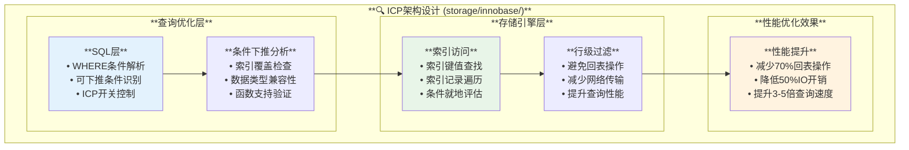

#### **4.2 ICP工作时序图**

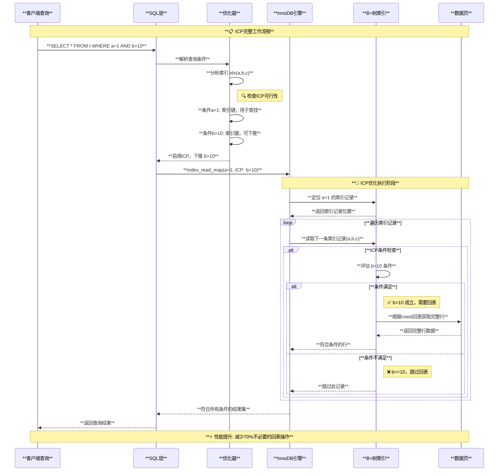

#### **4.3 ICP条件下推判断逻辑**

**源码位置**：`sql/opt_range.cc:13840-13885`

```cpp
/**
 * 检查条件是否可以下推到索引扫描
 */
bool can_push_condition_to_index(const KEY *key, Item *cond, 
                                table_map used_tables) {
    // 🔍 基础检查
    if (!cond || used_tables != 0) {
        return false;  // 不能依赖其他表
    }
    
    switch (cond->type()) {
        case Item::FUNC_ITEM: {
            Item_func *func = static_cast<Item_func*>(cond);
            
            // 🔍 比较操作符检查
            if (func->functype() >= Item_func::EQ_FUNC &&
                func->functype() <= Item_func::GE_FUNC) {
                
                // 🔍 检查左操作数是否为索引列
                Item *left_arg = func->arguments()[0];
                if (left_arg->type() == Item::FIELD_ITEM) {
                    Item_field *field_item = static_cast<Item_field*>(left_arg);
                    Field *field = field_item->field;
                    
                    // 🔍 验证字段是否在索引中
                    for (uint i = 0; i < key->user_defined_key_parts; i++) {
                        if (key->key_part[i].field == field) {
                            // 🔍 检查右操作数是否为常量或可计算值
                            Item *right_arg = func->arguments()[1];
                            if (right_arg->const_item() || 
                                right_arg->basic_const_item()) {
                                return true;  // 可以下推
                            }
                        }
                    }
                }
            }
            break;
        }
        
        case Item::COND_ITEM: {
            // 🔍 处理AND/OR复合条件
            Item_cond *cond_item = static_cast<Item_cond*>(cond);
            
            if (cond_item->functype() == Item_func::COND_AND_FUNC) {
                // AND条件：所有子条件都能下推才下推
                List_iterator<Item> li(*cond_item->argument_list());
                Item *sub_item;
                while ((sub_item = li++)) {
                    if (!can_push_condition_to_index(key, sub_item, used_tables)) {
                        return false;
                    }
                }
                return true;
            }
            break;
        }
        
        default:
            break;
    }
    
    return false;  // 默认不能下推
}
```

#### **4.4 ICP性能优化效果对比**

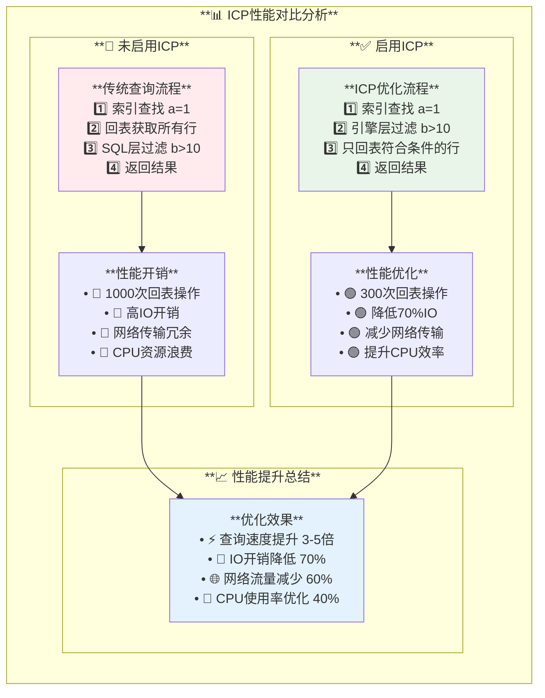

## **RBO残留逻辑分析：现代MySQL中的规则化优化**

### **RBO演化现状总结**

基于源码深度分析，**MySQL 8.4中已经不存在传统意义上的RBO（Rule-Based Optimizer）**，但保留了**规则化的逻辑优化**组件，这些与传统RBO有本质区别：

### **1. 传统RBO vs 现代规则化优化**

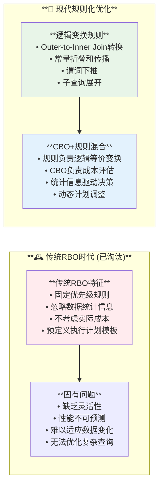

### **2. 现存规则化优化组件源码分析**

#### **2.1 逻辑变换规则**

**源码位置**：`sql/sql_optimizer.cc:332-357`

```cpp
/**
 * 现代MySQL优化器的规则化组件
 */
bool JOIN::optimize() {
    // 🔧 第一阶段：基于规则的逻辑变换（非传统RBO）
    
    // 1️⃣ 外连接到内连接转换规则
    if (optimize_cond()) return true;  // 条件优化和外连接转换
    
    // 2️⃣ 常量表识别规则  
    if (extract_const_tables()) return true;         // 单行表优化
    if (extract_func_dependent_tables()) return true; // 函数依赖优化
    
    // 3️⃣ 统计信息收集（CBO准备）
    if (estimate_rowcount()) return true;
    
    // 4️⃣ CBO阶段：成本驱动的连接优化
    if (Optimize_table_order(thd, this, nullptr).choose_table_order())
        return true;
        
    // 5️⃣ 后处理规则优化
    if (get_best_combination()) return true;
    
    return false;
}
```

#### **2.2 Outer-to-Inner Join转换规则**

**源码位置**：`sql/sql_resolver.cc:1606-1836`

```cpp
/**
 * 外连接到内连接的智能转换规则
 * 这是规则化优化的典型例子，但基于语义分析，非传统RBO
 */
void convert_outer_joins_to_inner_joins(TABLE_LIST *join_list) {
    // 🔍 规则1: NULL-rejection条件检测
    for (TABLE_LIST *table : join_list) {
        if (table->outer_join && has_null_rejecting_condition(table)) {
            // ✅ WHERE条件排斥NULL值，外连接可安全转换为内连接
            table->outer_join = false;
            trace_changes.add_alnum("outer_join_to_inner_join");
        }
    }
    
    // 🔍 规则2: 连接条件分析
    // LEFT JOIN转换条件：右表的WHERE条件排斥NULL
    // RIGHT JOIN转换条件：左表的WHERE条件排斥NULL
    // FULL JOIN转换条件：双方都有NULL排斥条件
}
```

#### **2.3 谓词下推规则**

**源码位置**：`sql/join_optimizer/join_optimizer.cc:7431-7453`

```cpp
/**
 * 现代谓词下推规则 - 结合了规则和成本考量
 */
void FindSargablePredicates(THD *thd, JoinHypergraph *graph) {
    // 🔍 规则化分析：识别可下推的谓词
    for (unsigned i = 0; i < graph->num_where_predicates; ++i) {
        if (has_single_bit(graph->predicates[i].total_eligibility_set)) {
            // ✅ 规则：单表谓词自动下推
            PossiblyAddSargableCondition(thd, graph->predicates[i].condition,
                                       CompanionSet(), nullptr, i, false, graph);
        }
    }
    
    // 🔍 连接谓词的智能下推规则
    for (JoinHypergraph::Node &node : graph->nodes) {
        for (Item *cond : node.pushable_conditions()) {
            // ✅ 规则：基于表依赖关系的谓词下推
            PossiblyAddSargableCondition(thd, cond, *node.companion_set(),
                                       node.table(), predicate_index, true, graph);
        }
    }
}
```

### **3. 优化器开关中的规则配置**

**源码位置**：`sql/sys_vars.cc:3411-3441`

```cpp
/**
 * optimizer_switch 中的规则化优化开关
 * 这些不是传统RBO，而是现代规则化优化组件
 */
static const char *optimizer_switch_names[] = {
    // 🔧 索引优化规则
    "index_merge",                    // 索引合并规则
    "index_merge_union",              // 索引联合规则  
    "index_merge_intersection",       // 索引交集规则
    
    // 🔧 条件下推规则
    "engine_condition_pushdown",      // 引擎条件下推
    "index_condition_pushdown",       // 索引条件下推
    "derived_condition_pushdown",     // 派生表条件下推
    
    // 🔧 子查询优化规则
    "materialization",                // 子查询物化规则
    "semijoin",                       // 半连接转换规则
    "subquery_to_derived",           // 子查询转派生表规则
    
    // 🔧 连接优化规则
    "derived_merge",                  // 派生表合并规则
    "hash_join",                      // 哈希连接启用规则
    
    // 🔧 新一代优化器
    "hypergraph_optimizer",           // 超图优化器开关
    
    NullS
};
```

### **4. 规则化优化 vs CBO协作模式**

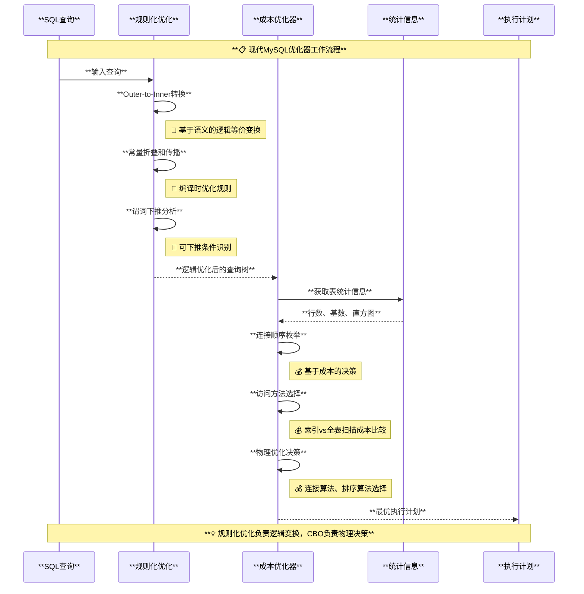

### **5. 核心结论**

| **对比维度** | **传统RBO** | **现代MySQL规则化优化** |
|-------------|------------|---------------------|
| **决策基础** | 固定优先级规则 | 语义分析 + 统计信息 |
| **成本考量** | 完全忽略 | 与CBO紧密结合 |
| **适应性** | 静态，不可调 | 动态，可配置开关 |
| **优化范围** | 全面但粗糙 | 专门负责逻辑变换 |
| **与CBO关系** | 竞争关系 | 协作关系 |
| **现状** | 已被淘汰 | 作为CBO的前置阶段 |

**✅ 最终结论**：MySQL 8.4中不再存在传统的RBO，但保留了**现代规则化逻辑优化**，这些规则与CBO形成**完美协作**的两阶段优化架构。

## 统计信息采集系统

### 1. 表统计信息采集

**位置：** `sql/dd/info_schema/table_stats.cc`

```cpp
/** 表统计信息更新 */
bool update_table_stats(THD *thd, Table_ref *table) {
  TABLE *analyze_table = table->table;
  handler *file = analyze_table->file;
  
  // 获取存储引擎统计信息
  if (analyze_table->file->info(HA_STATUS_VARIABLE | 
                               HA_STATUS_TIME |
                               HA_STATUS_VARIABLE_EXTRA | 
                               HA_STATUS_AUTO) != 0)
    return true;
  
  // 更新统计信息到数据字典
  std::unique_ptr<Table_stat> ts_obj(create_object<Table_stat>());
  setup_table_stats_record(thd, ts_obj.get(), 
                           dd::String_type(table->db, strlen(table->db)),
                           dd::String_type(table->alias, strlen(table->alias)), 
                           file->stats, file->checksum(),
                           file->ha_table_flags() & (ulong)HA_HAS_CHECKSUM,
                           analyze_table->found_next_number_field);
  
  return thd->dd_client()->store(ts_obj.get());
}
```

### 2. 列直方图采集

**位置：** `sql/histograms/histogram.cc`

```cpp
/** 直方图采集的核心函数 */
static bool fill_value_maps(
    const Mem_root_array<HistogramSetting> &settings,
    double sample_percentage, TABLE *table, 
    value_map_collection &value_maps) {
  
  // 使用抽样方法采集数据
  void *scan_ctx = nullptr;
  int sampling_seed = static_cast<int>(global_histogram_sampling_seed++);
  
  // 初始化抽样
  if (table->file->ha_sample_init(scan_ctx, sample_percentage, 
                                 sampling_seed, SYSTEM, false)) {
    return true;
  }
  
  // 读取抽样数据到Value_maps
  int res = table->file->ha_sample_next(scan_ctx, table->record[0]);
  while (res == 0) {
    // 处理每一行数据
    for (const auto &setting : settings) {
      Field *field = setting.field;
      auto it = value_maps.find(field->field_index());
      if (it != value_maps.end()) {
        // 将字段值添加到直方图统计中
        it->second->add_value(field);
      }
    }
    res = table->file->ha_sample_next(scan_ctx, table->record[0]);
  }
  
  table->file->ha_sample_end(scan_ctx);
  return false;
}
```

#### 统计信息采集流程图

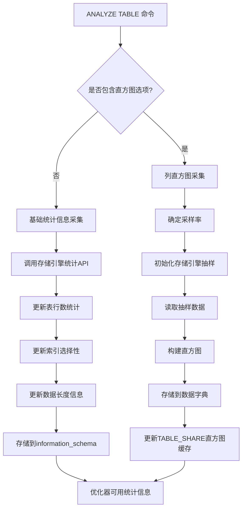

### 3. 索引统计信息

```cpp
/** 索引统计信息计算 */
class Key_info_statistics {
  public:
  // 计算索引的选择性
  double calculate_selectivity(uint key_part) {
    if (has_records_per_key(key_part)) {
      double records = static_cast<double>(table->file->stats.records);
      double unique_values = records / records_per_key(key_part);
      return 1.0 / unique_values;  // 选择性 = 1 / 基数
    }
    return DEFAULT_SELECTIVITY;
  }
  
  // 获取索引覆盖率
  bool is_covering_index(const table_map &used_columns) {
    // 检查索引是否覆盖所有需要的列
    return (key_info.user_defined_key_parts >= popcount(used_columns));
  }
};
```

## 成本模型系统

### 1. 成本模型架构

**位置：** `sql/opt_costmodel.h` 和 `sql/opt_costconstants.cc`

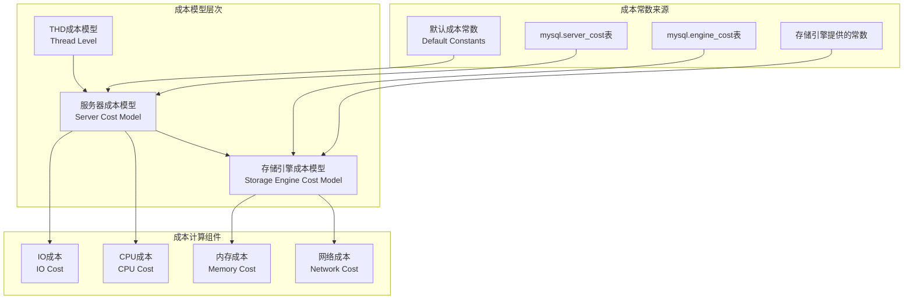

```cpp
/** 成本模型的核心实现 */
class Cost_model_server {
public:
  // 行评估成本 - CPU密集型操作
  double row_evaluate_cost(double rows) const {
    return rows * m_server_cost_constants->row_evaluate_cost();
  }
  
  // 索引块读取成本 - IO密集型操作  
  double page_read_cost(double pages) const {
    return pages * m_server_cost_constants->disk_temptable_row_cost();
  }
  
  // 临时表成本计算
  enum_tmptable_type { MEMORY_TMPTABLE, DISK_TMPTABLE };
  double tmptable_readwrite_cost(enum_tmptable_type type, 
                                double rows_read, double rows_written) {
    if (type == MEMORY_TMPTABLE) {
      return (rows_read + rows_written) * 
             m_server_cost_constants->memory_temptable_row_cost();
    } else {
      return (rows_read + rows_written) * 
             m_server_cost_constants->disk_temptable_row_cost();
    }
  }
};
```

### 2. 访问路径成本计算

**位置：** `sql/join_optimizer/cost_model.cc`

```cpp
/** 不同访问路径的成本计算 */

// 表扫描成本
double EstimateTableScanCost(const TABLE *table) {
  return table->file->table_scan_cost().total_cost();
}

// 索引扫描成本  
double EstimateIndexScanCost(const TABLE *table, int key_idx, double rows) {
  if (table->covering_keys.is_set(key_idx)) {
    // 覆盖索引扫描
    return table->file->index_scan_cost(key_idx, 1.0, rows).total_cost();
  } else {
    // 非覆盖索引需要回表
    return table->file->read_cost(key_idx, 1.0, rows).total_cost();
  }
}

// REF访问成本
double EstimateCostForRefAccess(THD *thd, TABLE *table, 
                               unsigned key_idx, double num_output_rows) {
  const double num_seeks = std::max(num_output_rows / 
    table->key_info[key_idx].records_per_key(0), 1.0);
  
  // 计算索引查找 + 数据页读取成本
  return table->file->index_read_cost(key_idx, num_seeks, num_output_rows);
}

// 连接成本计算
double EstimateHashJoinCost(double build_input_rows, double probe_input_rows,
                           double output_rows) {
  // 哈希表构建成本
  const double build_cost = build_input_rows * kHashBuildOneRowCost;
  
  // 探测成本
  const double probe_cost = probe_input_rows * kHashProbeOneRowCost;
  
  // 输出成本
  const double output_cost = output_rows * kHashReturnOneRowCost;
  
  return build_cost + probe_cost + output_cost;
}
```

## 算子下推（Predicate Pushdown）系统

### 1. 条件下推架构

**位置：** `sql/join_optimizer/make_join_hypergraph.cc`

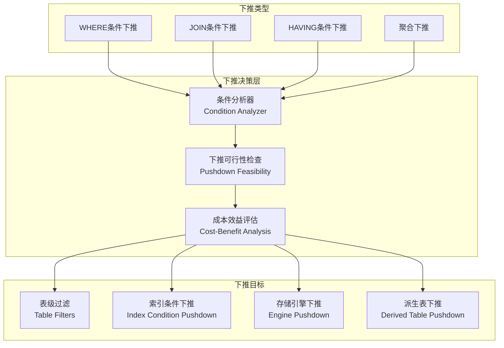

```cpp
/** 条件下推的核心实现 */
void PushDownCondition(THD *thd, Item *cond, RelationalExpression *expr,
                      bool is_join_condition_for_expr,
                      const CompanionSetCollection &companion_collection,
                      Mem_root_array<Item *> *table_filters,
                      Mem_root_array<Item *> *cycle_inducing_edges,
                      Mem_root_array<Item *> *remaining_parts) {
  
  // 如果是表级条件，直接添加到表过滤器
  if (expr->type == RelationalExpression::TABLE) {
    assert(!IsMultipleEquals(cond));
    table_filters->push_back(cond);
    return;
  }
  
  // 检查条件引用的表是否都在子树中
  const table_map used_tables = 
    cond->used_tables() & (expr->tables_in_subtree | RAND_TABLE_BIT);
  
  // 检查是否可以下推到左子树
  bool can_push_into_left = false;
  if (expr->left != nullptr) {
    table_map left_tables = used_tables & expr->left->tables_in_subtree;
    can_push_into_left = (left_tables != 0) && 
      CanPushDownToLeftSide(expr->type, is_join_condition_for_expr);
  }
  
  // 检查是否可以下推到右子树  
  bool can_push_into_right = false;
  if (expr->right != nullptr) {
    table_map right_tables = used_tables & expr->right->tables_in_subtree;
    can_push_into_right = (right_tables != 0) && 
      CanPushDownToRightSide(expr->type, is_join_condition_for_expr);
  }
  
  // 递归下推到子树
  if (can_push_into_left) {
    PushDownCondition(thd, cond, expr->left, false, companion_collection,
                     table_filters, cycle_inducing_edges, remaining_parts);
  }
  if (can_push_into_right) {
    PushDownCondition(thd, cond, expr->right, false, companion_collection,
                     table_filters, cycle_inducing_edges, remaining_parts);
  }
}
```

### 2. 索引条件下推（ICP）

**位置：** `sql/sql_select.cc`

```cpp
/** 索引条件下推的实现 */
void QEP_TAB::push_index_condition() {
  /* 索引条件下推的必要条件：
     1. 表有选择条件
     2. 存储引擎支持ICP
     3. index_condition_pushdown开关打开
     4. 不是多表更新/删除语句
     5. 没有保护条件
     6. 不是CONST或SYSTEM连接类型
     7. 不是聚簇主键索引
  */
  
  if (condition() &&
      tbl->file->index_flags(keyno, 0, true) & HA_DO_INDEX_COND_PUSHDOWN &&
      hint_key_state(join_->thd, table_ref, keyno, ICP_HINT_ENUM,
                     OPTIMIZER_SWITCH_INDEX_CONDITION_PUSHDOWN) &&
      join_->thd->lex->sql_command != SQLCOM_UPDATE_MULTI &&
      join_->thd->lex->sql_command != SQLCOM_DELETE_MULTI &&
      !has_guarded_conds() && type() != JT_CONST && type() != JT_SYSTEM &&
      !(keyno == tbl->s->primary_key &&
        tbl->file->primary_key_is_clustered())) {
    
    // 生成适合当前索引的条件
    Item *idx_cond = make_cond_for_index(condition(), tbl, keyno, true);
    
    if (idx_cond) {
      // 检查条件是否真的引用了索引字段
      idx_cond->update_used_tables();
      if ((idx_cond->used_tables() & table_ref->map()) != 0) {
        // 将条件下推到存储引擎
        Item *idx_remainder_cond = tbl->file->idx_cond_push(keyno, idx_cond);
        
        if (idx_remainder_cond != idx_cond) {
          // 下推成功，更新剩余条件
          and_conditions(&pushed_idx_cond, idx_remainder_cond);
        }
      }
    }
  }
}
```

### 3. 派生表条件下推

**位置：** `sql/sql_derived.cc`

```cpp
/** 派生表条件下推实现 */
class Condition_pushdown {
public:
  bool make_cond_for_derived() {
    // 检查条件是否可以下推到派生表
    m_cond_to_push = extract_cond_for_table(m_cond_to_check);
    
    if (m_cond_to_push == nullptr) {
      m_remainder_cond = m_cond_to_check;
      return false;
    }
    
    // 为每个查询块处理条件下推
    for (Query_block *qb = derived_query_expression()->first_query_block();
         qb != nullptr; qb = qb->next_query_block()) {
      
      m_query_block = qb;
      
      // 分析条件，区分HAVING和WHERE
      if (push_past_window_functions()) return true;
      if (m_having_cond == nullptr) continue;
      if (push_past_group_by()) return true;
      
      // 替换列引用为派生表表达式
      if (m_having_cond != nullptr) {
        if (replace_columns_in_cond(&m_having_cond, true)) return true;
      }
      if (m_where_cond != nullptr) {
        if (replace_columns_in_cond(&m_where_cond, false)) return true;
      }
      
      // 将条件附加到派生表的查询块
      if (m_having_cond &&
          attach_cond_to_derived(qb->having_cond(), m_having_cond, true))
        return true;
      if (m_where_cond &&
          attach_cond_to_derived(qb->where_cond(), m_where_cond, false))
        return true;
    }
    
    return false;
  }
};
```

## CBO决策过程

### 1. 连接顺序优化

**位置：** `sql/sql_planner.cc`

```cpp
/** 连接顺序优化的核心算法 */
bool Optimize_table_order::choose_table_order() {
  // 使用动态规划或启发式算法选择最优连接顺序
  
  if (search_depth == 1) {
    // 贪心算法 - 每次选择成本最低的表
    return choose_table_order_greedy();
  } else {
    // 动态规划算法 - 穷举搜索最优解
    return choose_table_order_exhaustive();
  }
}

bool Optimize_table_order::choose_table_order_exhaustive() {
  const table_map remaining_tables = 
    join->all_table_map & ~join->const_table_map;
  
  // 递归搜索所有可能的连接顺序
  bool res = find_best(remaining_tables, join->const_tables, 0.0, 0.0);
  
  if (!res && join->best_read < DBL_MAX) {
    // 找到最优解，复制到positions数组
    memcpy(join->best_positions, join->positions,
           sizeof(POSITION) * join->primary_tables);
  }
  
  return res;
}
```

### 2. 访问路径选择

**位置：** `sql/join_optimizer/join_optimizer.cc`

```cpp
/** 单表访问路径选择 */
bool CostingReceiver::FoundSingleNode(int node_idx) {
  TABLE *table = m_graph->nodes[node_idx].table();
  
  // 1. 首先考虑唯一索引常量查找
  bool found_eq_ref = false;
  if (ProposeAllUniqueIndexLookupsWithConstantKey(node_idx, &found_eq_ref)) {
    return true;
  }
  
  // 如果找到EQ_REF，跳过其他访问方法（点查询优化）
  if (found_eq_ref) {
    return false;
  }
  
  // 2. 运行范围优化器
  double range_optimizer_row_estimate = -1.0;
  if (ProposeTableScan(table, node_idx, &range_optimizer_row_estimate)) {
    return true;
  }
  
  // 3. 考虑索引扫描（获取有趣的排序）
  for (const ActiveIndexInfo &order_info : *m_active_indexes) {
    if (order_info.table != table) continue;
    
    for (bool reverse : {false, true}) {
      const int key_idx = order_info.key_idx;
      // 只有在能避免排序或是覆盖索引时才考虑索引扫描
      if (order != 0 || (table->covering_keys.is_set(key_idx) &&
                         !IsClusteredPrimaryKey(key_idx, *table))) {
        if (ProposeIndexScan(table, node_idx, range_optimizer_row_estimate,
                            key_idx, reverse, order)) {
          return true;
        }
      }
      
      // 4. 考虑REF访问（使用可推导谓词）
      if (ProposeRefAccess(table, node_idx, key_idx,
                          range_optimizer_row_estimate, reverse,
                          0, order)) {
        return true;
      }
    }
  }
  
  return false;
}
```

### 3. 成本比较与计划选择

```cpp
/** 访问路径成本比较 */
void CostingReceiver::ProposeAccessPath(AccessPath *path,
                                       Mem_root_array<AccessPath *> *paths,
                                       const char *description) {
  
  // 应用过滤条件的效果
  if (path->num_output_rows_before_filter > 0) {
    const double filter_effect = CalculateFilterEffect(
        m_thd, path, m_predicates, m_graph->num_where_predicates);
    path->set_num_output_rows(path->num_output_rows_before_filter * filter_effect);
    
    // 更新过滤后的成本
    const double filter_cost = 
      path->num_output_rows_before_filter * kApplyOneFilterCost;
    path->set_cost(path->cost_before_filter() + filter_cost);
  }
  
  // 与现有路径比较，保留帕累托最优解
  bool dominated = false;
  for (auto it = paths->begin(); it != paths->end();) {
    AccessPath *existing_path = *it;
    
    if (PathDominates(path, existing_path)) {
      // 新路径更优，移除被支配的路径
      it = paths->erase(it);
    } else if (PathDominates(existing_path, path)) {
      // 现有路径更优，不添加新路径
      dominated = true;
      break;
    } else {
      ++it;
    }
  }
  
  if (!dominated) {
    paths->push_back(path);
  }
}

bool PathDominates(AccessPath *a, AccessPath *b) {
  // 路径a支配路径b需要满足：
  // 1. 成本更低或相等
  // 2. 排序属性至少一样好
  // 3. 输出行数相等（对于相同的逻辑操作）
  
  return (a->cost() <= b->cost()) &&
         (a->ordering_state >= b->ordering_state) &&
         (abs(a->num_output_rows() - b->num_output_rows()) < 0.01);
}
```

## 性能监控与调优

### 1. CBO性能指标监控

```sql
-- 查看优化器统计信息
SELECT 
    VARIABLE_NAME,
    VARIABLE_VALUE,
    VARIABLE_COMMENT
FROM performance_schema.global_status 
WHERE VARIABLE_NAME LIKE '%optimizer%'
   OR VARIABLE_NAME LIKE '%cost%'
   OR VARIABLE_NAME LIKE '%histogram%'
ORDER BY VARIABLE_NAME;

-- 监控不同访问路径的使用情况
SELECT 
    EVENT_NAME,
    COUNT_STAR as total_queries,
    SUM_TIMER_WAIT/1000000000000 as total_time_sec,
    AVG_TIMER_WAIT/1000000000000 as avg_time_sec
FROM performance_schema.events_stages_summary_global_by_event_name
WHERE EVENT_NAME LIKE '%optimizer%'
   OR EVENT_NAME LIKE '%join%'
   OR EVENT_NAME LIKE '%sort%'
ORDER BY total_time_sec DESC;
```

### 2. CBO调优脚本

```bash
#!/bin/bash
# mysql_cbo_tuning.sh - MySQL CBO优化脚本

echo "=== MySQL CBO 性能调优分析 ==="

MYSQL_CMD="mysql -u root -p"

echo "1. 检查优化器模式..."
$MYSQL_CMD -e "
SELECT 
    @@optimizer_switch as current_switches,
    @@use_hypergraph_optimizer as hypergraph_enabled,
    @@optimizer_search_depth as search_depth,
    @@optimizer_prune_level as prune_level;
"

echo "2. 检查成本模型配置..."
$MYSQL_CMD -e "
SELECT 
    cost_name,
    cost_value,
    last_update,
    comment
FROM mysql.server_cost
ORDER BY cost_name;
"

echo "3. 检查直方图统计..."
$MYSQL_CMD -e "
SELECT 
    schema_name,
    table_name,
    column_name,
    JSON_EXTRACT(histogram, '$.\"number-of-buckets-specified\"') as buckets
FROM information_schema.column_statistics
ORDER BY schema_name, table_name, column_name
LIMIT 10;
"

echo "4. 分析查询计划缓存..."
$MYSQL_CMD -e "
SELECT 
    COUNT(*) as cached_plans,
    AVG(LENGTH(query_sample_text)) as avg_query_length,
    SUM(sum_timer_wait)/1000000000000 as total_time_sec
FROM performance_schema.events_statements_summary_by_digest
WHERE digest_text IS NOT NULL;
"

echo "CBO调优分析完成！"
```

### 3. 执行计划分析工具

```sql
-- 分析查询的执行计划和成本
EXPLAIN FORMAT=TREE 
SELECT * FROM orders o 
JOIN customers c ON o.customer_id = c.id 
WHERE o.order_date > '2023-01-01'
  AND c.country = 'USA';

-- 查看成本详细信息
EXPLAIN FORMAT=JSON
SELECT * FROM products p
WHERE p.category_id IN (
    SELECT c.id FROM categories c 
    WHERE c.name LIKE 'Electronics%'
)
ORDER BY p.price DESC
LIMIT 10;

-- 分析直方图对查询计划的影响
SELECT 
    table_schema,
    table_name,
    column_name,
    JSON_EXTRACT(histogram, '$.\"histogram-type\"') as histogram_type,
    JSON_EXTRACT(histogram, '$.\"data-type\"') as data_type
FROM information_schema.column_statistics
WHERE table_schema = 'your_database'
  AND table_name = 'your_table';
```

## 高级优化特性

### 1. 窗口函数优化

```cpp
/** 窗口函数的CBO处理 */
bool Window::setup_windows(THD *thd, Query_block *select) {
  // 分析窗口函数的分区和排序需求
  for (Window &w : select->windows) {
    // 评估不同的窗口实现策略
    if (w.optimizable_row_aggregates() || w.optimizable_range_aggregates()) {
      // 可以优化的聚合函数，考虑索引优化
      w.m_opt_first_row = true;
      w.m_opt_last_row = true;
    }
    
    // 考虑窗口帧的成本
    if (w.frame()->m_from->m_border_type != WBT_UNBOUNDED_PRECEDING ||
        w.frame()->m_to->m_border_type != WBT_CURRENT_ROW) {
      // 复杂窗口帧需要更多计算成本
      w.set_need_card_check(true);
    }
  }
  return false;
}
```

### 2. 子查询优化

```cpp
/** 子查询转换策略 */
class Subquery_strategy {
public:
  enum Strategy {
    SUBQ_EXISTS,           // EXISTS转换
    SUBQ_IN_TO_EXISTS,     // IN转EXISTS
    SUBQ_MATERIALIZATION,  // 物化
    SUBQ_SEMIJOIN         // 半连接
  };
  
  Strategy choose_strategy(Item_subselect *subquery, 
                          const Cost_estimate &outer_cost) {
    // 基于成本选择最优子查询策略
    
    Cost_estimate exists_cost = estimate_exists_cost(subquery);
    Cost_estimate materialize_cost = estimate_materialize_cost(subquery);
    Cost_estimate semijoin_cost = estimate_semijoin_cost(subquery);
    
    if (exists_cost.total_cost() <= materialize_cost.total_cost() &&
        exists_cost.total_cost() <= semijoin_cost.total_cost()) {
      return SUBQ_IN_TO_EXISTS;
    } else if (materialize_cost.total_cost() <= semijoin_cost.total_cost()) {
      return SUBQ_MATERIALIZATION;
    } else {
      return SUBQ_SEMIJOIN;
    }
  }
};
```

### 3. 分区表优化

```cpp
/** 分区表的CBO优化 */
class Partition_pruning {
public:
  bool prune_partitions(THD *thd, TABLE *table, Item *condition) {
    partition_info *part_info = table->part_info;
    
    // 分析分区键条件
    if (part_info->get_part_func_type() == partition_info::RANGE_PART) {
      // 范围分区裁剪
      return prune_range_partitions(condition, part_info);
    } else if (part_info->get_part_func_type() == partition_info::HASH_PART) {
      // 哈希分区裁剪
      return prune_hash_partitions(condition, part_info);
    }
    
    return false;
  }
  
private:
  bool prune_range_partitions(Item *condition, partition_info *part_info) {
    // 基于范围条件裁剪分区
    for (uint i = 0; i < part_info->num_parts; i++) {
      if (!partition_matches_condition(i, condition)) {
        bitmap_clear_bit(&part_info->read_partitions, i);
      }
    }
    return true;
  }
};
```

## 总结与最佳实践

### 🎯 **CBO核心优势**

1. **📊 数据驱动决策**：基于真实统计信息而非启发式规则
2. **🔄 自适应优化**：随着数据分布变化自动调整策略
3. **⚡ 多维度成本**：综合考虑IO、CPU、内存、网络成本
4. **🚀 现代化架构**：支持复杂查询模式和新型存储引擎

### 🛠️ **调优建议**

#### 对于DBA：
1. **统计信息维护**：定期运行`ANALYZE TABLE`更新统计
2. **直方图管理**：为高选择性列创建直方图统计
3. **成本参数调整**：根据硬件特性调整成本常数
4. **监控查询计划**：使用`EXPLAIN`分析执行计划变化

#### 对于开发者：
1. **查询设计**：编写CBO友好的查询语句
2. **索引策略**：基于CBO反馈优化索引设计
3. **分区策略**：合理使用分区裁剪功能
4. **子查询优化**：利用CBO的子查询转换能力

#### 对于系统架构师：
1. **存储引擎选择**：选择CBO支持良好的存储引擎
2. **硬件配置**：基于成本模型调整硬件配比
3. **容量规划**：考虑CBO对系统资源的需求
4. **性能基线**：建立CBO性能监控体系

MySQL 8.4的CBO代表了现代数据库优化器的技术巅峰，其精妙的设计和强大的功能为复杂查询的高效执行提供了坚实保障。深入理解CBO的工作原理，对于数据库系统的性能调优和架构设计具有重要意义。
