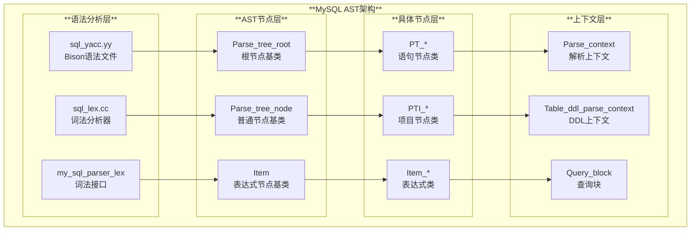
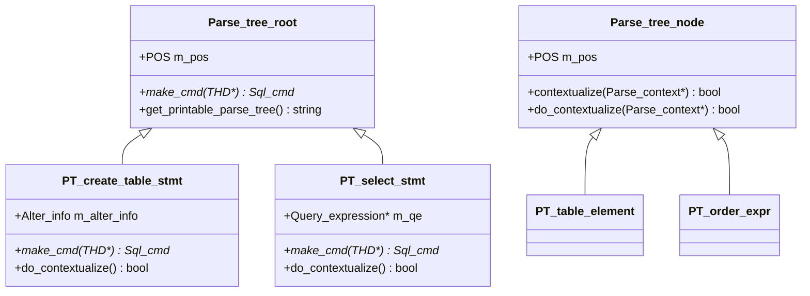
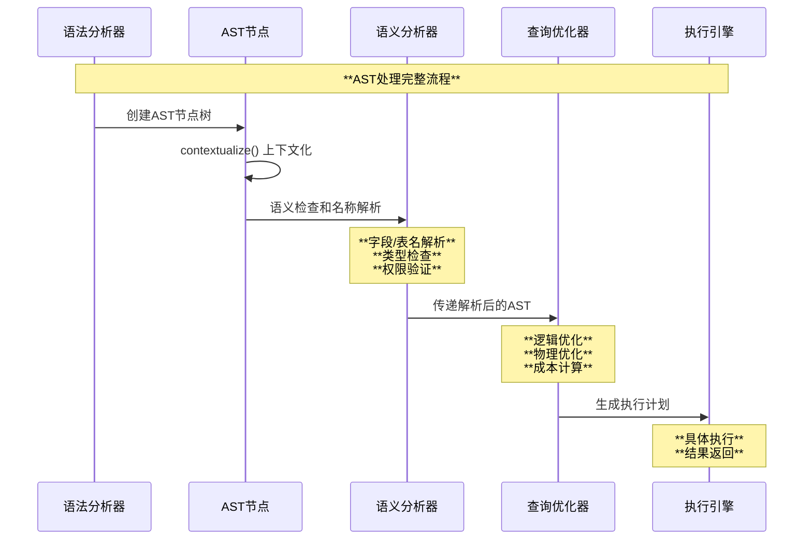
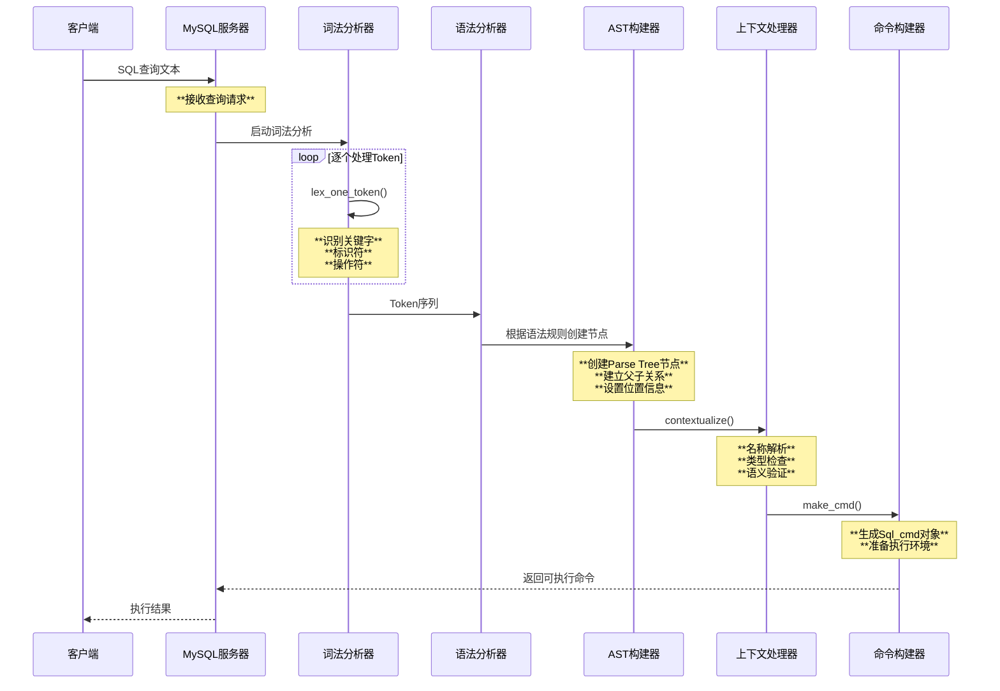

# MySQL Abstract Syntax Tree (AST) 深度架构解析

## 目录

1. [AST概述](#1-ast概述)
2. [AST系统架构](#2-ast系统架构)
3. [AST核心模块](#3-ast核心模块)
4. [AST分类构成](#4-ast分类构成)
5. [AST运行原理](#5-ast运行原理)
6. [AST构建时序](#6-ast构建时序)
7. [AST扩展机制](#7-ast扩展机制)
8. [新语法添加示例](#8-新语法添加示例)
9. [性能优化与最佳实践](#9-性能优化与最佳实践)

## 1. AST概述

### 1.1 什么是AST？

MySQL的抽象语法树（AST）是将SQL查询文本转换为内部数据结构的核心机制。它将复杂的SQL语句分解为有层次的树状结构，每个节点代表一种语法结构或操作。

### 1.2 AST在MySQL中的作用

```mermaid
graph TD
    A[SQL文本] --> B[词法分析 Lexer]
    B --> C[语法分析 Parser]  
    C --> D[AST构建]
    D --> E[语义分析 Resolver]
    E --> F[优化器 Optimizer]
    F --> G[执行器 Executor]
    
    style A fill:#**e3f2fd**
    style D fill:#**fff3e0**
    style F fill:#**f3e5f5**
```

### 1.3 AST的核心价值

1. **结构化表示**：将线性SQL文本转换为树状结构
2. **类型安全**：每个节点都有明确的类型定义
3. **可扩展性**：支持新语法元素的动态添加
4. **优化友好**：为查询优化器提供统一的操作接口

## 2. AST系统架构

### 2.1 AST整体架构设计



### 2.2 核心组件关系

| **组件** | **作用** | **主要类** |
|----------|----------|------------|
| **语法文件** | 定义SQL语法规则 | `sql_yacc.yy` |
| **词法分析器** | 将文本转换为Token | `Lex_input_stream` |
| **节点基类** | 提供统一接口 | `Parse_tree_node` |
| **具体节点** | 实现特定语法 | `PT_select_stmt` |
| **上下文** | 提供构建环境 | `Parse_context` |

## 3. AST核心模块

### 3.1 Parse Tree Node模块

#### 3.1.1 基类层次结构

```cpp
// sql/parse_tree_node_base.h:442
typedef Parse_tree_node_tmpl<Parse_context> Parse_tree_node;

// sql/parse_tree_nodes.h:161
class Parse_tree_root {
protected:
  Parse_tree_root() = default;
  explicit Parse_tree_root(const POS &pos) : m_pos(pos) {}
  virtual ~Parse_tree_root() = default;

public:
  POS m_pos;  // 词法位置信息
  virtual Sql_cmd *make_cmd(THD *thd) = 0;  // 构建SQL命令
};
```

#### 3.1.2 节点分类架构



### 3.2 Item表达式模块

#### 3.2.1 Item类层次结构

```cpp
// sql/item.h:936
class Item : public Parse_tree_node {
  typedef Parse_tree_node super;
  
public:
  enum Type {
    INVALID_ITEM,
    FIELD_ITEM,          // 字段引用
    FUNC_ITEM,           // 函数调用
    SUM_FUNC_ITEM,       // 聚合函数
    STRING_ITEM,         // 字符串字面值
    INT_ITEM,            // 整数字面值
    DECIMAL_ITEM,        // 十进制字面值
    SUBQUERY_ITEM,       // 子查询
    ROW_ITEM,            // 行表达式
    COND_ITEM            // 条件表达式
  };
};
```

#### 3.2.2 表达式树架构

```mermaid
graph TD
    subgraph "**Item表达式树**"
        A[Item<br/>基类] --> B1[Item_field<br/>字段引用]
        A --> B2[Item_func<br/>函数表达式]
        A --> B3[Item_cond<br/>条件表达式]
        A --> B4[Item_subselect<br/>子查询]
        
        B2 --> C1[Item_func_plus<br/>加法运算]
        B2 --> C2[Item_func_like<br/>LIKE运算]
        B2 --> C3[Item_func_count<br/>COUNT函数]
        
        B3 --> D1[Item_cond_and<br/>AND条件]
        B3 --> D2[Item_cond_or<br/>OR条件]
        
        B4 --> E1[Item_exists_subselect<br/>EXISTS子查询]
        B4 --> E2[Item_in_subselect<br/>IN子查询]
    end
    
    style A fill:#**e3f2fd**
    style B2 fill:#**fff3e0**
    style B3 fill:#**f3e5f5**
```

### 3.3 Query Term模块

#### 3.3.1 查询项树结构

```cpp
// sql/query_term.h:109-207
/**
  Query term tree structure. There are five node types, cf. Query_term_type.
  Leaf nodes are Query_block objects. We have three kinds of n-ary set operation
  nodes corresponding to INTERSECT, UNION and EXCEPT. Finally, we have a "unary"
  node which essentially adds a ORDER BY/LIMIT over another node.
*/

class Query_term {
public:
  enum Query_term_type {
    QT_UNARY,
    QT_QUERY_BLOCK,
    QT_UNION,
    QT_INTERSECT,
    QT_EXCEPT
  };
};
```

#### 3.3.2 查询树示例结构

```mermaid
graph TD
    subgraph "**复杂查询的Query Term树**"
        A[Query_expression<br/>查询表达式] --> B[Query_term_unary<br/>ORDER BY -a LIMIT 3]
        
        B --> C[Query_term_intersect<br/>INTERSECT操作]
        
        C --> D1[Query_term_union<br/>UNION操作]
        C --> D2[Query_term_except<br/>EXCEPT操作]
        
        D1 --> E1[Query_block<br/>SELECT * FROM t1]
        D1 --> E2[Query_block<br/>SELECT * FROM t2] 
        D1 --> E3[Query_block<br/>SELECT * FROM t3]
        
        D2 --> F1[Query_block<br/>SELECT * FROM t3]
        D2 --> F2[Query_block<br/>SELECT * FROM t4]
    end
    
    style A fill:#**e3f2fd**
    style C fill:#**fff3e0**
    style D1 fill:#**f3e5f5**
```

## 4. AST分类构成

### 4.1 按语法类型分类

#### 4.1.1 DDL语句节点

```cpp
// 数据定义语言节点
PT_create_table_stmt     // CREATE TABLE
PT_alter_table_stmt      // ALTER TABLE  
PT_drop_table_stmt       // DROP TABLE
PT_create_index_stmt     // CREATE INDEX
PT_create_view_stmt      // CREATE VIEW
```

#### 4.1.2 DML语句节点

```cpp
// 数据操作语言节点
PT_select_stmt           // SELECT
PT_insert_stmt           // INSERT
PT_update_stmt           // UPDATE
PT_delete_stmt           // DELETE
```

#### 4.1.3 表达式节点

```cpp
// 表达式相关节点
Item_field               // 字段引用: table.column
Item_func_plus          // 算术表达式: a + b
Item_func_like          // 比较表达式: name LIKE 'pattern'
Item_cond_and           // 逻辑表达式: condition1 AND condition2
Item_subselect          // 子查询表达式: (SELECT ...)
```

### 4.2 节点分类架构图

```mermaid
graph TB
    subgraph "**AST节点分类体系**"
        A[AST节点总览] --> B1[**语句节点**<br/>Parse_tree_root派生]
        A --> B2[**表达式节点**<br/>Item派生]
        A --> B3[**子句节点**<br/>Parse_tree_node派生]
        
        B1 --> C1[DDL节点<br/>PT_*_stmt]
        B1 --> C2[DML节点<br/>PT_*_stmt] 
        B1 --> C3[DCL节点<br/>PT_*_stmt]
        
        B2 --> D1[字面值<br/>Item_*_item]
        B2 --> D2[函数调用<br/>Item_func_*]
        B2 --> D3[条件表达式<br/>Item_cond_*]
        
        B3 --> E1[表元素<br/>PT_table_*]
        B3 --> E2[列定义<br/>PT_column_*]
        B3 --> E3[索引定义<br/>PT_key_*]
    end
    
    style A fill:#**e3f2fd**
    style B1 fill:#**fff3e0**
    style B2 fill:#**f3e5f5**
```

## 5. AST运行原理

### 5.1 AST构建流程

#### 5.1.1 词法分析阶段

```cpp
// sql/sql_lex.cc:1367
int my_sql_parser_lex(MY_SQL_PARSER_STYPE *yacc_yylval, POS *yylloc, THD *thd) {
  auto *yylval = reinterpret_cast<Lexer_yystype *>(yacc_yylval);
  Lex_input_stream *lip = &thd->m_parser_state->m_lip;
  int token;

  // 获取下一个token
  token = lex_one_token(yylval, thd);
  yylloc->cpp.start = lip->get_cpp_tok_start();
  yylloc->raw.start = lip->get_tok_start();
  
  // 处理特殊token组合
  switch (token) {
    case WITH:
      // 处理 WITH ROLLUP 的特殊情况
      token = lex_one_token(yylval, thd);
      if (token == ROLLUP_SYM) {
        return WITH_ROLLUP_SYM;
      }
      // ...
  }
  
  return token;
}
```

#### 5.1.2 语法分析阶段

```cpp
// sql/sql_yacc.yy - Bison语法规则示例
create_table_stmt:
    CREATE opt_temporary TABLE_SYM opt_if_not_exists table_ident
    '(' table_element_list ')' opt_create_table_options_etc
    {
      auto pc = NEW_PTN Parse_context(YYTHD, Select);
      
      // 创建CREATE TABLE的AST节点
      $$= NEW_PTN PT_create_table_stmt(
        @$, // 位置信息
        $2, // temporary标志
        $4, // if_not_exists标志  
        $5, // 表名
        $7, // 表元素列表
        $9  // 表选项
      );
      
      if ($$ == nullptr || $$->contextualize(pc))
        MYSQL_YYABORT;
    }
;
```

### 5.2 上下文化（Contextualization）机制

#### 5.2.1 上下文化过程

```cpp
// sql/parse_tree_node_base.h:283
virtual bool do_contextualize(Context *pc) {
  return false; // 默认实现
}

// sql/parse_tree_nodes.cc - 具体实现示例
bool PT_create_table_stmt::do_contextualize(Parse_context *pc) {
  if (super::do_contextualize(pc)) return true;
  
  // 解析表名
  if (m_table_name->do_contextualize(pc)) return true;
  
  // 处理表元素
  for (auto *element : *m_table_element_list) {
    if (element->do_contextualize(pc)) return true;
  }
  
  // 处理表选项
  if (m_opt_create_table_options && 
      m_opt_create_table_options->do_contextualize(pc)) 
    return true;
    
  return false;
}
```

### 5.3 AST转换为执行计划



## 6. AST构建时序

### 6.1 完整解析时序图



### 6.2 AST节点创建细节

```cpp
// 节点创建的内存管理机制
class Parse_tree_node_tmpl {
  static void *operator new(size_t size, MEM_ROOT *mem_root,
                            const std::nothrow_t &arg = std::nothrow) noexcept {
    return mem_root->Alloc(size);  // 使用MEM_ROOT分配内存
  }
  
  static void operator delete(void *ptr, size_t size) {
    TRASH(ptr, size);  // 标记为已删除，实际由MEM_ROOT统一管理
  }
};
```

### 6.3 错误处理机制

```cpp
// 解析错误的处理流程
bool parse_sql(THD *thd, Parser_state *parser_state,
               Object_creation_ctx *creation_ctx) {
  bool ret_value;
  
  // 设置解析状态
  thd->m_parser_state = parser_state;
  
  // 调用Bison生成的解析器
  ret_value = MYSQLparse(thd, parse_tree) != 0;
  
  if (ret_value || thd->is_error()) {
    // 清理已分配的AST节点
    thd->free_root(thd->mem_root, MYF(MY_KEEP_PREALLOC));
    return true;
  }
  
  return false;
}
```

## 7. AST扩展机制

### 7.1 扩展点架构

```mermaid
graph TD
    subgraph "**AST扩展架构**"
        A[语法扩展点] --> B1[**词法层扩展**<br/>新关键字]
        A --> B2[**语法层扩展**<br/>新语法规则]
        A --> B3[**节点层扩展**<br/>新节点类型]
        A --> B4[**语义层扩展**<br/>新上下文处理]
        
        B1 --> C1[关键字定义<br/>sql_yacc.yy]
        B1 --> C2[词法识别<br/>sql_lex.cc]
        
        B2 --> D1[语法规则<br/>Bison规则]
        B2 --> D2[优先级定义<br/>%left, %right]
        
        B3 --> E1[新PT_类<br/>继承Parse_tree_root]
        B3 --> E2[新Item_类<br/>继承Item基类]
        
        B4 --> F1[上下文化<br/>do_contextualize()]
        B4 --> F2[命令构建<br/>make_cmd()]
    end
    
    style A fill:#**e3f2fd**
    style B1 fill:#**fff3e0**
    style B2 fill:#**f3e5f5**
```

### 7.2 扩展接口设计

#### 7.2.1 新节点类型接口

```cpp
// 扩展新语句节点的基本模式
class PT_new_statement : public Parse_tree_root {
public:
  explicit PT_new_statement(const POS &pos, /* 其他参数 */)
    : Parse_tree_root(pos), /* 初始化成员 */ {}
    
  // 必须实现的接口
  Sql_cmd *make_cmd(THD *thd) override {
    return new (thd->mem_root) Sql_cmd_new_statement(/* 参数 */);
  }
  
  // 可选的上下文化处理
  bool do_contextualize(Parse_context *pc) override {
    // 自定义的语义检查逻辑
    return false;
  }
};
```

#### 7.2.2 新表达式类型接口

```cpp
// 扩展新表达式的基本模式
class Item_func_new_function : public Item_func {
public:
  Item_func_new_function(const POS &pos, Item *arg1, Item *arg2)
    : Item_func(pos, arg1, arg2) {}
    
  // 必须实现的接口
  const char *func_name() const override { return "new_function"; }
  
  longlong val_int() override {
    // 实现函数的计算逻辑
    return 0;
  }
  
  void fix_length_and_dec() override {
    // 设置返回值类型和长度
    max_length = 21; // 例如：BIGINT的最大长度
    maybe_null = args[0]->maybe_null || args[1]->maybe_null;
  }
};
```

### 7.3 扩展步骤详解

#### 7.3.1 词法扩展步骤

1. **在`sql_yacc.yy`中添加新Token**：

```yacc
%token NEW_KEYWORD_SYM  // 新关键字token
```

1. **在词法分析器中注册关键字**：

```cpp
// sql/lex.h - 在symbols数组中添加
{"NEW_KEYWORD", SYM(NEW_KEYWORD_SYM)},
```

#### 7.3.2 语法扩展步骤

1. **定义语法规则**：

```yacc
new_statement:
    NEW_KEYWORD_SYM opt_parameters
    {
      $$= NEW_PTN PT_new_statement(@$, $2);
      if ($$ == nullptr) MYSQL_YYABORT;
    }
;
```

1. **集成到主语法**：

```yacc
statement:
    select_statement
  | insert_statement  
  | new_statement      /* 添加新语句类型 */
;
```

## 8. 新语法添加示例

### 8.1 实例：添加ANALYZE HISTOGRAM语法

假设我们要为MySQL添加一个新的`ANALYZE HISTOGRAM`语法来分析表的数据分布。

#### 8.1.1 第一步：定义语法目标

```sql
-- 目标语法
ANALYZE HISTOGRAM ON table_name (column_list) [WITH n BUCKETS];
```

#### 8.1.2 第二步：词法扩展

**在`sql_yacc.yy`中添加Token定义**：

```yacc
%token HISTOGRAM_SYM
%token BUCKETS_SYM
```

**在`sql/lex.h`中注册关键字**：

```cpp
static SYMBOL symbols[] = {
  // ... 其他关键字
  {"HISTOGRAM", SYM(HISTOGRAM_SYM)},
  {"BUCKETS", SYM(BUCKETS_SYM)},
  // ...
};
```

#### 8.1.3 第三步：创建AST节点类

**创建新的AST节点类**：

```cpp
// sql/parse_tree_nodes.h
class PT_analyze_histogram : public Parse_tree_root {
private:
  Table_ident *m_table;
  List<Item> *m_columns;
  uint m_bucket_count;
  
public:
  PT_analyze_histogram(const POS &pos, Table_ident *table, 
                       List<Item> *columns, uint buckets)
    : Parse_tree_root(pos), m_table(table), 
      m_columns(columns), m_bucket_count(buckets) {}
      
  Sql_cmd *make_cmd(THD *thd) override;
  
protected:
  bool do_contextualize(Parse_context *pc) override;
};
```

**实现节点类方法**：

```cpp  
// sql/parse_tree_nodes.cc
bool PT_analyze_histogram::do_contextualize(Parse_context *pc) {
  if (super::do_contextualize(pc)) return true;
  
  // 上下文化表名
  if (m_table->do_contextualize(pc)) return true;
  
  // 验证列名列表
  for (Item &item : *m_columns) {
    if (item.itemize(pc, &item)) return true;
  }
  
  // 验证bucket数量的合理性
  if (m_bucket_count == 0 || m_bucket_count > 1024) {
    my_error(ER_INVALID_HISTOGRAM_BUCKET_COUNT, MYF(0), m_bucket_count);
    return true;
  }
  
  return false;
}

Sql_cmd *PT_analyze_histogram::make_cmd(THD *thd) {
  return new (thd->mem_root) Sql_cmd_analyze_histogram(
    m_table, m_columns, m_bucket_count);
}
```

#### 8.1.4 第四步：语法规则定义

**在`sql_yacc.yy`中添加语法规则**：

```yacc
analyze_histogram_stmt:
    ANALYZE_SYM HISTOGRAM_SYM ON_SYM table_ident 
    '(' column_list ')' opt_histogram_buckets
    {
      $$= NEW_PTN PT_analyze_histogram(@$, $4, $6, $8);
      if ($$ == nullptr) MYSQL_YYABORT;
    }
;

opt_histogram_buckets:
    /* empty */ { $$= 100; }  /* 默认100个桶 */
  | WITH NUM BUCKETS_SYM
    {
      int err;
      $$= static_cast<uint>(my_strtoll10($2.str, nullptr, &err));
      if (err != 0) {
        my_error(ER_INVALID_BUCKET_COUNT, MYF(0), $2.str);
        MYSQL_YYABORT;
      }
    }
;

column_list:
    column_list ',' ident
    {
      if ($1 == nullptr || $1->push_back(NEW_PTN Item_field(@3, NullS, NullS, $3.str)))
        MYSQL_YYABORT;
      $$= $1;
    }
  | ident
    {
      $$= NEW_PTN (YYTHD->mem_root) List<Item>;
      if ($$ == nullptr || $$->push_back(NEW_PTN Item_field(@1, NullS, NullS, $1.str)))
        MYSQL_YYABORT;
    }
;
```

**集成到主语句规则**：

```yacc
statement:
    select_statement
  | insert_statement
  | analyze_histogram_stmt  /* 添加新语句 */
  | /* 其他语句类型 */
;
```

#### 8.1.5 第五步：创建执行命令

**定义命令执行类**：

```cpp
// sql/sql_admin.h
class Sql_cmd_analyze_histogram : public Sql_cmd {
private:
  Table_ident *m_table;
  List<Item> *m_columns; 
  uint m_bucket_count;
  
public:
  Sql_cmd_analyze_histogram(Table_ident *table, List<Item> *columns, uint buckets)
    : m_table(table), m_columns(columns), m_bucket_count(buckets) {}
    
  enum_sql_command sql_command_code() const override {
    return SQLCOM_ANALYZE_HISTOGRAM;
  }
  
  bool execute(THD *thd) override;
};
```

**实现执行逻辑**：

```cpp
// sql/sql_admin.cc
bool Sql_cmd_analyze_histogram::execute(THD *thd) {
  // 1. 获取表句柄
  TABLE_LIST table_list;
  init_one_table(&table_list, m_table->db.str, m_table->db.length,
                 m_table->table.str, m_table->table.length, 
                 m_table->table.str, TL_READ);
                 
  // 2. 打开表
  if (open_and_lock_tables(thd, &table_list, 0))
    return true;
    
  TABLE *table = table_list.table;
  
  // 3. 构建直方图统计信息
  Histogram_builder builder(table, m_columns, m_bucket_count);
  
  // 4. 执行分析并更新统计信息
  if (builder.analyze_and_update_statistics()) {
    my_error(ER_HISTOGRAM_ANALYSIS_FAILED, MYF(0), table->s->table_name.str);
    return true;
  }
  
  // 5. 返回成功信息
  my_ok(thd, 0, 0, "Histogram analysis completed successfully");
  return false;
}
```

### 8.2 新语法测试用例

#### 8.2.1 功能测试

```sql
-- 测试基本语法
ANALYZE HISTOGRAM ON test.employees (salary);

-- 测试多列语法  
ANALYZE HISTOGRAM ON test.employees (salary, age, department_id);

-- 测试自定义桶数
ANALYZE HISTOGRAM ON test.employees (salary) WITH 50 BUCKETS;

-- 测试错误情况
ANALYZE HISTOGRAM ON test.nonexistent_table (col1);  -- 表不存在
ANALYZE HISTOGRAM ON test.employees (nonexistent_col);  -- 列不存在  
ANALYZE HISTOGRAM ON test.employees (salary) WITH 0 BUCKETS;  -- 无效桶数
```

#### 8.2.2 性能测试

```cpp
// 性能基准测试示例
void benchmark_histogram_analysis() {
  THD *thd = current_thd;
  
  // 测试不同表大小的性能
  std::vector<std::string> test_tables = {
    "small_table",   // 1K rows
    "medium_table",  // 100K rows  
    "large_table"    // 10M rows
  };
  
  for (const auto &table_name : test_tables) {
    auto start_time = std::chrono::high_resolution_clock::now();
    
    // 执行直方图分析
    std::string sql = "ANALYZE HISTOGRAM ON test." + table_name + " (id, value)";
    execute_sql_statement(thd, sql);
    
    auto end_time = std::chrono::high_resolution_clock::now();
    auto duration = std::chrono::duration_cast<std::chrono::milliseconds>(
      end_time - start_time);
      
    std::cout << "Table " << table_name << " analysis took: " 
              << duration.count() << "ms" << std::endl;
  }
}
```

### 8.3 语法扩展最佳实践

#### 8.3.1 设计原则

1. **向后兼容**：新语法不应破坏现有功能
2. **一致性**：遵循MySQL现有的语法风格和约定
3. **可扩展性**：为将来的功能增强预留空间
4. **性能友好**：不影响现有查询的性能

#### 8.3.2 代码组织

```mermaid
graph TD
    subgraph "**新语法代码组织**"
        A[语法定义] --> B1[sql_yacc.yy<br/>语法规则]
        A --> B2[sql/lex.h<br/>关键字定义]
        
        C[AST节点] --> D1[parse_tree_nodes.h<br/>类声明]
        C --> D2[parse_tree_nodes.cc<br/>类实现]
        
        E[命令执行] --> F1[sql_admin.h<br/>命令类声明]
        E --> F2[sql_admin.cc<br/>命令类实现]
        
        G[测试用例] --> H1[t/*.test<br/>功能测试]
        G --> H2[r/*.result<br/>预期结果]
    end
    
    style A fill:#**e3f2fd**
    style C fill:#**fff3e0**
    style E fill:#**f3e5f5**
```

## 9. 性能优化与最佳实践

### 9.1 AST构建性能优化

#### 9.1.1 内存管理优化

```cpp
// 使用MEM_ROOT进行高效内存分配
class Efficient_ast_builder {
private:
  MEM_ROOT m_mem_root;
  
public:
  Efficient_ast_builder() {
    init_alloc_root(PSI_NOT_INSTRUMENTED, &m_mem_root, 
                    8192,   // 8KB块大小
                    0);     // 预分配大小
  }
  
  ~Efficient_ast_builder() {
    free_root(&m_mem_root, MYF(0));
  }
  
  template<typename T, typename... Args>
  T* create_node(Args&&... args) {
    // 直接在MEM_ROOT上分配，无需单独释放
    return new (&m_mem_root) T(std::forward<Args>(args)...);
  }
};
```

#### 9.1.2 解析器性能监控

```cpp
// 解析性能统计
struct Parse_performance_stats {
  std::chrono::milliseconds lex_time;      // 词法分析时间
  std::chrono::milliseconds parse_time;    // 语法分析时间  
  std::chrono::milliseconds context_time;  // 上下文化时间
  size_t ast_node_count;                   // AST节点总数
  size_t memory_usage;                     // 内存使用量
  
  void print_stats() const {
    std::cout << "Parse Performance Stats:\n"
              << "  Lexer time: " << lex_time.count() << "ms\n"
              << "  Parser time: " << parse_time.count() << "ms\n" 
              << "  Context time: " << context_time.count() << "ms\n"
              << "  AST nodes: " << ast_node_count << "\n"
              << "  Memory: " << memory_usage << " bytes\n";
  }
};
```

### 9.2 AST最佳实践总结

#### 9.2.1 开发最佳实践

| **方面** | **最佳实践** | **说明** |
|----------|------------|----------|
| **节点设计** | 保持简单性 | 每个节点只负责一种语法结构 |
| **内存管理** | 使用MEM_ROOT | 避免内存泄漏和碎片化 |
| **错误处理** | 详细错误信息 | 提供准确的语法错误位置 |
| **测试覆盖** | 全面测试用例 | 包括正常和异常情况 |
| **文档记录** | 清晰的注释 | 解释复杂的语法规则 |

#### 9.2.2 性能优化要点

```mermaid
graph LR
    A[**AST性能优化**] --> B1[**内存优化**<br/>MEM_ROOT批量分配]
    A --> B2[**解析优化**<br/>减少回溯]
    A --> B3[**缓存优化**<br/>重用解析结果]
    A --> B4[**并行优化**<br/>多阶段处理]
    
    B1 --> C1[预分配内存块]
    B1 --> C2[避免小内存分配]
    
    B2 --> D1[优化语法规则]
    B2 --> D2[减少冲突]
    
    B3 --> E1[解析结果缓存]
    B3 --> E2[语法树重用]
    
    B4 --> F1[并行词法分析]
    B4 --> F2[流水线处理]
    
    style A fill:#**e3f2fd**
    style B1 fill:#**fff3e0**
```

### 9.3 总结：MySQL AST的核心价值

MySQL的抽象语法树系统展现了现代数据库解析器设计的精妙之处：

#### 9.3.1 架构优势

1. **层次化设计**：清晰的分层架构便于维护和扩展
2. **类型安全**：强类型系统减少运行时错误
3. **内存效率**：MEM_ROOT管理避免内存泄漏
4. **扩展友好**：插件化的节点系统支持新语法

#### 9.3.2 实现亮点

1. **Bison集成**：与成熟的解析器生成器深度集成
2. **上下文化机制**：两阶段处理保证语义正确性
3. **错误恢复**：智能的错误处理和恢复机制
4. **性能优化**：针对大规模查询优化的内存和CPU使用

#### 9.3.3 发展方向

```mermaid
graph TD
    A[**MySQL AST未来发展**] --> B1[**性能提升**<br/>并行解析]
    A --> B2[**功能增强**<br/>新SQL标准]
    A --> B3[**工具支持**<br/>可视化调试]
    A --> B4[**生态集成**<br/>外部工具接口]
    
    style A fill:#**e3f2fd**
    style B1 fill:#**fff3e0**
    style B2 fill:#**f3e5f5**
    style B3 fill:#**e8f5e8**
```

通过深入理解MySQL AST的设计原理和实现机制，开发者可以更好地扩展MySQL功能、优化查询性能，并构建更强大的数据库应用系统。
