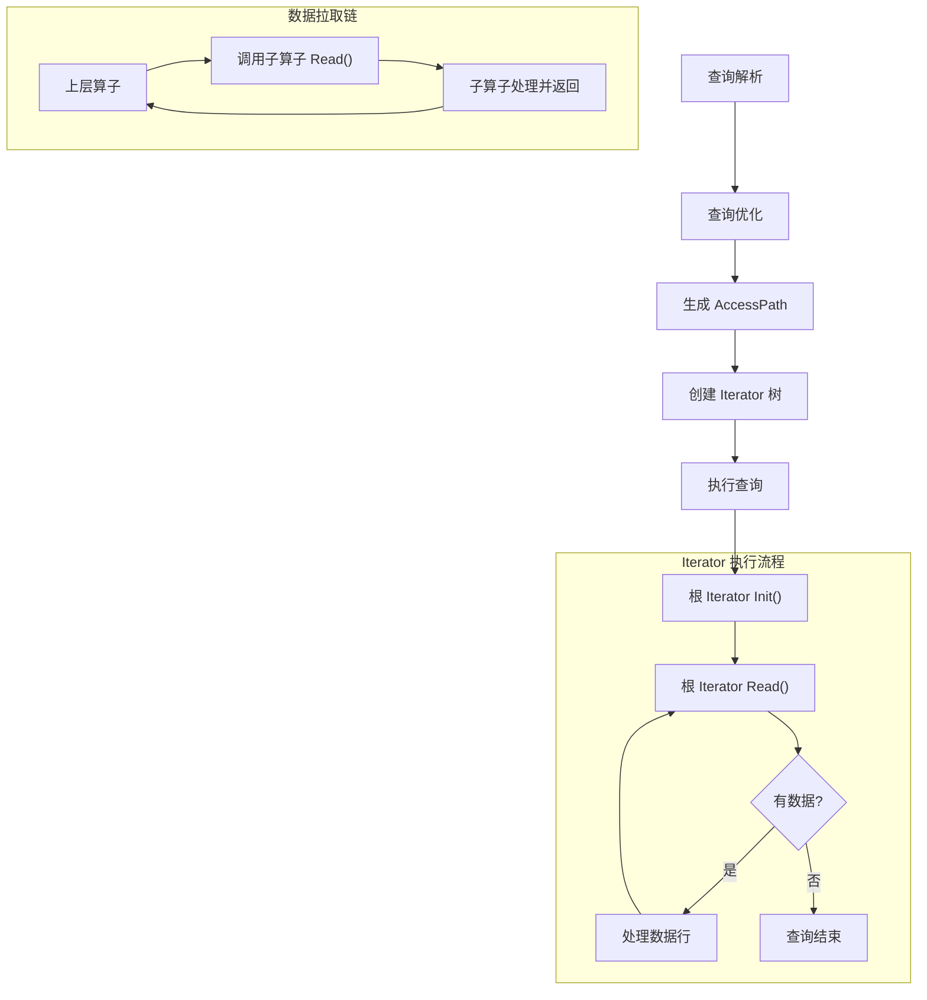
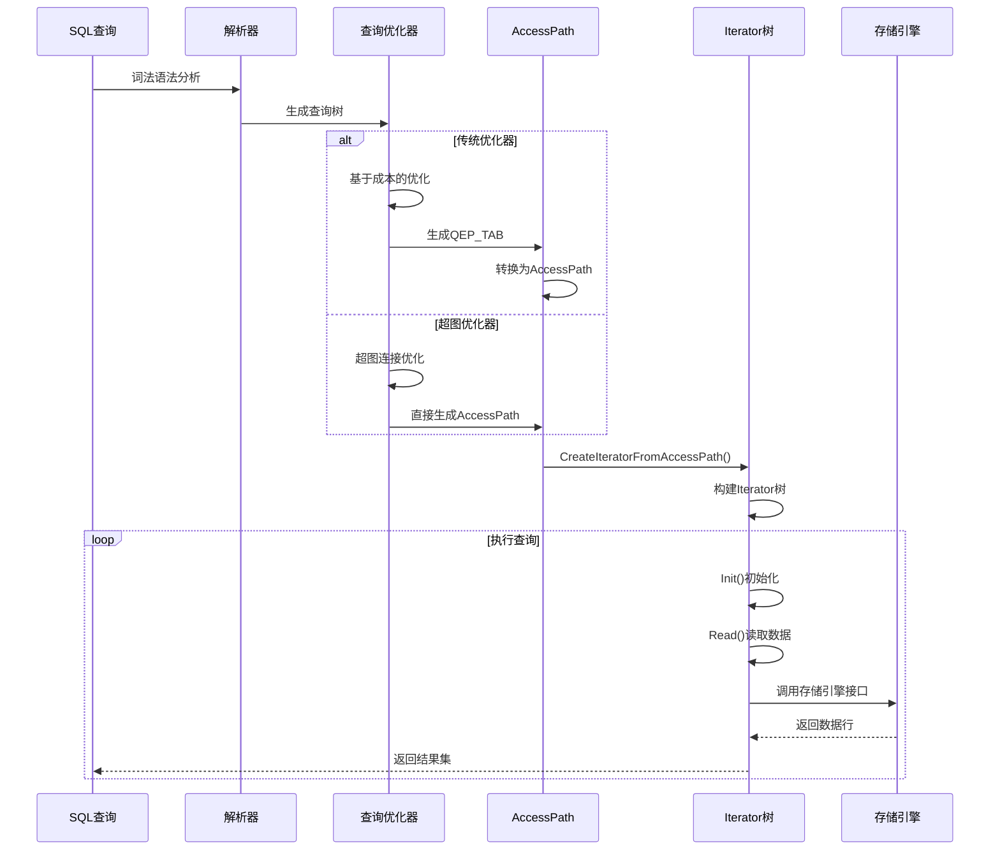
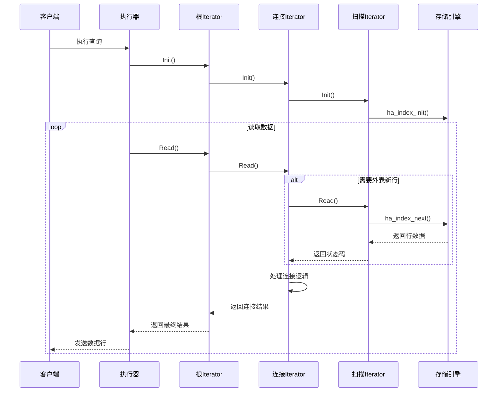
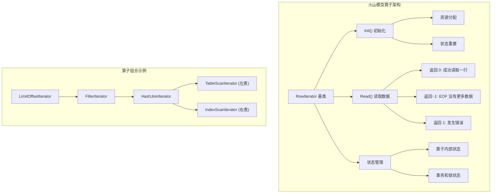
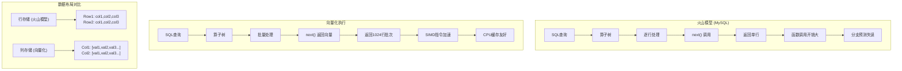
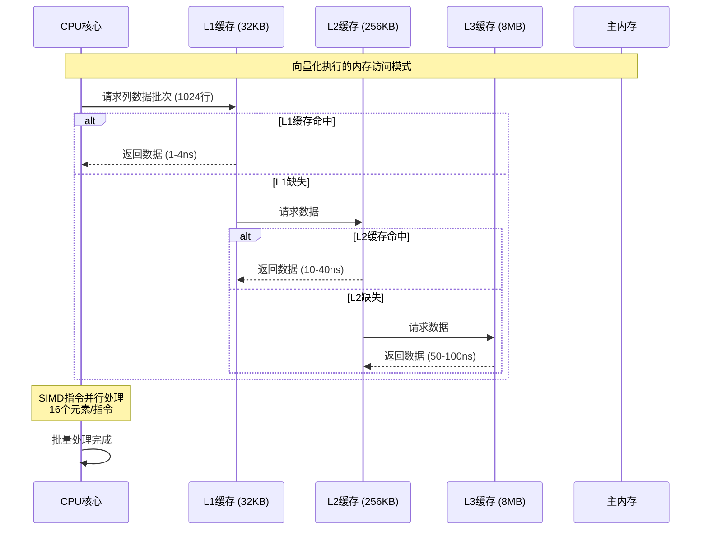

# MySQL 算子实现与火山模型源码分析

## 1. 概述

MySQL 采用了经典的**火山模型**（Volcano Model）进行查询执行，通过迭代器模式实现了各种查询算子。每个算子都是一个迭代器（RowIterator），提供统一的 `Init()` 和 `Read()` 接口，构建成一个算子树来执行复杂查询。

### 1.1 核心特点
- **统一迭代器接口**：所有算子都实现 RowIterator 基类
- **按需拉取**：上层算子通过 `Read()` 方法从下层算子拉取数据
- **状态管理**：每个算子维护自己的执行状态
- **组合性**：算子可以任意组合构成复杂的执行计划

## 2. 火山模型核心实现

### 2.1 RowIterator 基类设计

**源码位置**：`sql/iterators/row_iterator.h:82-134`

```cpp
class RowIterator {
public:
  explicit RowIterator(THD *thd) : m_thd(thd) {}
  virtual ~RowIterator() = default;

  /**
   * 初始化或重新初始化迭代器
   * 每次使用前必须调用 Init()
   */
  virtual bool Init() = 0;

  /**
   * 读取一行数据
   * @retval 0   成功读取一行
   * @retval -1  没有更多数据 (EOF)
   * @retval 1   发生错误
   */
  virtual int Read() = 0;

  /** 设置 NULL 行标志 (用于外连接) */
  virtual void SetNullRowFlag(bool is_null_row) {}
  
  /** 解锁当前行 (用于事务) */
  virtual void UnlockRow() {}
  
  /** 批处理模式控制 */
  virtual void StartPSIBatchMode() {}
  virtual void EndPSIBatchModeIfStarted() {}

protected:
  THD *const m_thd;  // MySQL 线程上下文
};
```

### 2.2 火山模型执行流程



## 3. MySQL 算子分类详解

MySQL 实现了丰富的算子来支持各种查询操作，主要分为以下几类：

### 3.1 数据源算子 (Data Source Operators)

#### 3.1.1 TableScanIterator - 全表扫描
**源码位置**：`sql/iterators/basic_row_iterators.h:58-99`

```cpp
class TableScanIterator final : public TableRowIterator {
public:
  TableScanIterator(THD *thd, TABLE *table, double expected_rows, 
                    ha_rows *examined_rows);
  bool Init() override;
  int Read() override;
private:
  uchar *const m_record;           // 记录缓冲区
  const double m_expected_rows;    // 预期行数
  ha_rows *const m_examined_rows;  // 实际扫描行数
};
```

**实现特点**：
- 顺序读取表中的每一行
- 支持 INTERSECT/EXCEPT 语义的重复计数
- 可设置扫描行数限制

#### 3.1.2 IndexScanIterator - 索引扫描
**源码位置**：`sql/iterators/basic_row_iterators.cc:58-121`

```cpp
template <bool Reverse>
class IndexScanIterator : public TableRowIterator {
private:
  const int m_idx;           // 索引ID
  const bool m_use_order;    // 是否保持索引顺序
  bool m_first = true;       // 是否为第一次读取

public:
  bool Init() override;
  int Read() override;
};

// 正向索引扫描
template <>
int IndexScanIterator<false>::Read() {
  int error;
  if (m_first) {
    error = table()->file->ha_index_first(m_record);
    m_first = false;
  } else {
    error = table()->file->ha_index_next(m_record);
  }
  return HandleError(error);
}

// 反向索引扫描  
template <>
int IndexScanIterator<true>::Read() {
  int error;
  if (m_first) {
    error = table()->file->ha_index_last(m_record);
    m_first = false;
  } else {
    error = table()->file->ha_index_prev(m_record);
  }
  return HandleError(error);
}
```

### 3.2 索引查找算子 (Index Lookup Operators)

#### 3.2.1 RefIterator - 索引等值查找
**源码位置**：`sql/iterators/ref_row_iterators.cc:158-752`

```cpp
class EQRefIterator : public TableRowIterator {
private:
  Index_lookup *const m_ref;    // 索引查找信息
  bool m_first_record_since_init = true;

public:
  int Read() override {
    if (!m_first_record_since_init) {
      return -1;  // EQRef 只返回一行
    }
    m_first_record_since_init = false;
    
    // 构造查找键
    m_ref->key_err = construct_lookup(thd(), table(), m_ref);
    if (m_ref->key_err) {
      return -1;
    }
    
    // 执行精确查找
    int error = table()->file->ha_index_read_map(
        table()->record[0], m_ref->key_buff, 
        m_ref->key_part_map, HA_READ_KEY_EXACT);
    
    return HandleError(error);
  }
};
```

#### 3.2.2 RefOrNullIterator - 索引查找含NULL
处理 `WHERE col = ? OR col IS NULL` 类型的查询条件。

### 3.3 连接算子 (Join Operators)

#### 3.3.1 NestedLoopIterator - 嵌套循环连接
**源码位置**：`sql/iterators/composite_iterators.h:325-384`

```cpp
class NestedLoopIterator final : public RowIterator {
public:
  NestedLoopIterator(THD *thd,
                     unique_ptr_destroy_only<RowIterator> source_outer,
                     unique_ptr_destroy_only<RowIterator> source_inner,
                     JoinType join_type, bool pfs_batch_mode);

  bool Init() override;
  int Read() override;

private:
  enum {
    NEEDS_OUTER_ROW,           // 需要外表新行
    READING_FIRST_INNER_ROW,   // 读取内表第一行
    READING_INNER_ROWS,        // 读取内表后续行
    END_OF_ROWS                // 所有行已读完
  } m_state;

  unique_ptr_destroy_only<RowIterator> const m_source_outer;
  unique_ptr_destroy_only<RowIterator> const m_source_inner;
  const JoinType m_join_type;  // INNER, LEFT, ANTI, SEMI
};
```

**执行逻辑**：
```cpp
int NestedLoopIterator::Read() {
  for (;;) {
    if (m_state == NEEDS_OUTER_ROW) {
      int err = m_source_outer->Read();
      if (err != 0) return err;  // 错误或EOF
      
      if (m_source_inner->Init()) return 1;
      m_state = READING_FIRST_INNER_ROW;
    }
    
    int err = m_source_inner->Read();
    if (err == 0) {
      // 找到内表行，返回连接结果
      return 0;
    } else if (err == -1) {
      // 内表EOF，处理外连接逻辑
      if (m_join_type == JoinType::OUTER && 
          m_state == READING_FIRST_INNER_ROW) {
        m_source_inner->SetNullRowFlag(true);
        m_state = NEEDS_OUTER_ROW;
        return 0;  // 返回NULL补充行
      }
      m_state = NEEDS_OUTER_ROW;
      continue;  // 读取下一个外表行
    }
    return err;  // 错误
  }
}
```

#### 3.3.2 HashJoinIterator - 哈希连接
**源码位置**：`sql/iterators/hash_join_iterator.h:55-95`

MySQL 8.0 引入的哈希连接算子，适用于大表连接场景：

```cpp
class HashJoinIterator final : public RowIterator {
private:
  enum class State {
    READING_ROW_FROM_PROBE_ITERATOR,  // 从探测端读取
    READING_ROW_FROM_HASH_TABLE,      // 从哈希表读取
    END_OF_ROWS                       // 结束
  };
  
  State m_state = State::READING_ROW_FROM_PROBE_ITERATOR;
  
  // 构建端和探测端
  unique_ptr_destroy_only<RowIterator> m_build_iterator;
  unique_ptr_destroy_only<RowIterator> m_probe_iterator;
  
  // 哈希表和连接条件
  hash_join_buffer::HashJoinRowBuffer m_row_buffer;
  vector<HashJoinCondition> m_join_conditions;

public:
  bool Init() override;
  int Read() override;
};
```

**哈希连接执行流程**：
1. **构建阶段**：读取构建端所有数据，构造哈希表
2. **探测阶段**：逐行读取探测端数据，在哈希表中查找匹配
3. **输出阶段**：输出所有匹配的行对

### 3.4 聚合算子 (Aggregation Operators)

#### 3.4.1 AggregateIterator - 分组聚合
**源码位置**：`sql/iterators/composite_iterators.h:207-268`

```cpp
class AggregateIterator final : public RowIterator {
public:
  AggregateIterator(THD *thd, 
                    unique_ptr_destroy_only<RowIterator> source,
                    JOIN *join, 
                    pack_rows::TableCollection tables, 
                    bool rollup);

private:
  enum {
    READING_FIRST_ROW,           // 读取第一行
    LAST_ROW_STARTED_NEW_GROUP,  // 上一行开始新组
    OUTPUTTING_ROLLUP_ROWS,      // 输出ROLLUP行
    DONE_OUTPUTTING_ROWS         // 完成输出
  } m_state;

  unique_ptr_destroy_only<RowIterator> m_source;
  JOIN *m_join;           // 聚合函数信息
  bool m_seen_eof;        // 是否见到EOF
  const bool m_rollup;    // 是否ROLLUP查询
  
  // 行存储：用于保存当前组和下一组的第一行
  String m_first_row_this_group;
  String m_first_row_next_group;
};
```

**聚合处理逻辑**：
1. **分组检测**：比较当前行与上一行的分组字段
2. **聚合计算**：累积同组内的聚合函数值
3. **状态切换**：组边界时保存当前组结果，重置聚合状态
4. **ROLLUP支持**：支持多级汇总

### 3.5 排序算子 (Sorting Operators)

#### 3.5.1 SortingIterator - 排序
**源码位置**：`sql/iterators/sorting_iterator.h:56-100`

```cpp
class SortingIterator final : public RowIterator {
public:
  SortingIterator(THD *thd, Filesort *filesort,
                  unique_ptr_destroy_only<RowIterator> source,
                  ha_rows num_rows_estimate, 
                  table_map tables_to_get_rowid_for,
                  ha_rows *examined_rows);

  bool Init() override;
  int Read() override { 
    return m_result_iterator->Read(); 
  }

private:
  Filesort *const m_filesort;    // 排序配置
  unique_ptr_destroy_only<RowIterator> m_source;
  unique_ptr_destroy_only<RowIterator> m_result_iterator;  // 结果迭代器
  ha_rows m_num_rows_estimate;   // 行数估计
};
```

**排序实现机制**：
- **内存排序**：小数据量时在内存中排序
- **外部排序**：大数据量时使用临时文件
- **优先队列**：支持 TOP-K 优化
- **多路归并**：合并排序后的临时文件

### 3.6 窗口函数算子 (Window Function Operators)

#### 3.6.1 WindowIterator - 窗口函数
**源码位置**：`sql/iterators/window_iterators.h:94`

```cpp
class WindowIterator final : public RowIterator {
public:
  WindowIterator(THD *thd,
                 unique_ptr_destroy_only<RowIterator> source,
                 Temp_table_param *temp_table_param,
                 JOIN *join, 
                 Window *window);

  bool Init() override;
  int Read() override;

private:
  unique_ptr_destroy_only<RowIterator> m_source;
  Window *m_window;              // 窗口定义
  Temp_table_param *m_param;    // 临时表参数
  bool m_window_functions_are_aggregate;  // 是否聚合窗口函数
};
```

**窗口函数特点**：
- 支持 ROW_NUMBER、RANK、SUM() OVER 等
- 流式处理非聚合窗口函数
- 缓冲处理需要回看的聚合窗口函数

### 3.7 过滤和控制算子

#### 3.7.1 FilterIterator - 条件过滤
**源码位置**：`sql/iterators/composite_iterators.h:80-103`

```cpp
class FilterIterator final : public RowIterator {
public:
  FilterIterator(THD *thd, 
                 unique_ptr_destroy_only<RowIterator> source,
                 Item *condition)
      : RowIterator(thd), 
        m_source(std::move(source)), 
        m_condition(condition) {}

  int Read() override;

private:
  unique_ptr_destroy_only<RowIterator> m_source;
  Item *m_condition;  // WHERE 或 HAVING 条件
};
```

#### 3.7.2 LimitOffsetIterator - 限制和偏移
**源码位置**：`sql/iterators/composite_iterators.h:109-171`

```cpp
class LimitOffsetIterator final : public RowIterator {
public:
  LimitOffsetIterator(THD *thd,
                      unique_ptr_destroy_only<RowIterator> source,
                      ha_rows limit, ha_rows offset,
                      bool count_all_rows,
                      bool reject_multiple_rows,
                      ha_rows *skipped_rows);

private:
  ha_rows m_seen_rows = 0;      // 已处理行数
  ha_rows m_offset_rows = 0;    // 已跳过行数
  bool m_needs_offset;          // 是否需要处理偏移
  const ha_rows m_limit, m_offset;
};
```

### 3.8 物化算子 (Materialization Operators)

#### 3.8.1 MaterializeIterator - 物化
**源码位置**：`sql/iterators/composite_iterators.h:425-604`

用于物化子查询、UNION 结果、临时表等：

```cpp
template <typename Profiler>
class MaterializeIterator : public RowIterator {
public:
  struct Operand {
    unique_ptr_destroy_only<RowIterator> subquery_iterator;
    int select_number;           // 查询块编号  
    JOIN *join;                  // 对应的JOIN
    bool disable_deduplication_by_hash_field;  // 禁用哈希去重
    bool copy_items;             // 是否复制字段
  };

private:
  Mem_root_array<Operand> m_operands;  // 操作数列表
  TABLE *m_table;                      // 物化目标表
  bool m_reject_multiple_rows;         // 拒绝多行
  ha_rows m_limit_rows;                // 行数限制
};
```

### 3.9 修改算子 (Modification Operators)

#### 3.9.1 UpdateRowsIterator - 更新
**源码位置**：`sql/iterators/update_rows_iterator.h`

#### 3.9.2 DeleteRowsIterator - 删除  
**源码位置**：`sql/iterators/delete_rows_iterator.h:41-82`

```cpp
class DeleteRowsIterator final : public RowIterator {
public:
  DeleteRowsIterator(THD *thd, 
                     unique_ptr_destroy_only<RowIterator> source,
                     JOIN *join, 
                     table_map tables_to_delete_from,
                     table_map immediate_tables);

private:
  unique_ptr_destroy_only<RowIterator> m_source;  // 数据源
  JOIN *m_join;
  table_map m_tables_to_delete_from;     // 删除目标表
  table_map m_immediate_tables;          // 立即删除表
  table_map m_hash_join_tables;          // 哈希连接表
  // 延迟删除的临时文件
  Mem_root_array<unique_ptr_destroy_only<Unique>> m_tempfiles;
};
```

## 4. 查询执行框架

### 4.1 从 SQL 到 Iterator 的转换流程



### 4.2 超图优化器集成

MySQL 8.0.21+ 引入了**超图连接优化器**，更直接地生成 AccessPath：

**源码位置**：`sql/join_optimizer/join_optimizer.h:61-137`

```cpp
/**
 * 超图连接优化器主入口
 * 将查询块转换为最优执行计划
 */
AccessPath *FindBestQueryPlan(THD *thd, Query_block *query_block) {
  // 1. 转换为超图结构
  JoinHypergraph graph(thd->mem_root, query_block);
  if (MakeJoinHypergraph(thd, &graph, &where_is_always_false)) {
    return nullptr;
  }
  
  // 2. 枚举所有合法子计划并计算成本
  // 3. 选择最优计划
  // 4. 添加非连接操作（ORDER BY, GROUP BY等）
  return best_access_path;
}

/**
 * AccessPath 到 Iterator 的转换
 */
unique_ptr_destroy_only<RowIterator> 
CreateIteratorFromAccessPath(THD *thd, AccessPath *path, 
                             JOIN *join, bool eligible_for_batch_mode) {
  switch (path->type) {
    case AccessPath::TABLE_SCAN:
      return NewIterator<TableScanIterator>(...);
    case AccessPath::INDEX_SCAN:
      return NewIterator<IndexScanIterator>(...);
    case AccessPath::NESTED_LOOP_JOIN:
      return NewIterator<NestedLoopIterator>(...);
    case AccessPath::HASH_JOIN:
      return NewIterator<HashJoinIterator>(...);
    // ... 其他算子类型
  }
}
```

### 4.3 执行时序图



## 5. MySQL算子完整列表

### MySQL算子分类一览表

| 算子类别 | 具体算子 | 功能描述 |
|---------|---------|---------|
| **数据源算子** | TableScanIterator | 全表扫描 |
| | IndexScanIterator | 索引扫描 |
| | FakeSingleRowIterator | 虚拟单行 |
| **索引查找算子** | RefIterator | 索引等值查找 |
| | EQRefIterator | 唯一索引查找 |
| | RefOrNullIterator | 引用或NULL查找 |
| | IndexRangeScanIterator | 索引范围扫描 |
| | AlternativeIterator | 替代查找策略 |
| **连接算子** | NestedLoopIterator | 嵌套循环连接 |
| | HashJoinIterator | 哈希连接 |
| | BKAIterator | 批量键访问连接 |
| **聚合算子** | AggregateIterator | 分组聚合 |
| | StreamingIterator | 流式聚合 |
| **排序算子** | SortingIterator | 通用排序 |
| | PriorityQueueIterator | 优先队列排序(TOP-K) |
| **过滤控制算子** | FilterIterator | 条件过滤 |
| | LimitOffsetIterator | 限制和偏移 |
| **物化算子** | MaterializeIterator | 结果物化 |
| | TemptableAggregateIterator | 临时表聚合 |
| | MaterializedTableFunctionIterator | 表函数物化 |
| | WeedoutIterator | 半连接去重 |
| **修改算子** | UpdateRowsIterator | 行更新 |
| | DeleteRowsIterator | 行删除 |
| | InsertIterator | 行插入 |
| **窗口函数算子** | WindowIterator | 窗口函数处理 |
| | BufferingWindowIterator | 缓冲窗口函数 |



## 6. 性能优化特性

### 6.1 批处理模式（Batch Mode）

```cpp
class PFSBatchMode {
public:
  explicit PFSBatchMode(RowIterator *iterator) 
    : m_iterator(iterator) {
    m_iterator->StartPSIBatchMode();
  }
  ~PFSBatchMode() {
    m_iterator->EndPSIBatchModeIfStarted();
  }
private:
  RowIterator *m_iterator;
};
```

### 6.2 延迟物化（Lazy Materialization）

某些情况下推迟物化操作直到真正需要时：

```cpp
bool MaterializeIterator::MaterializeOperand(const Operand &operand, 
                                            ha_rows *stored_rows) {
  if (operand.subquery_iterator->Init()) {
    return true;
  }
  
  // 流式处理，避免过早物化
  while (true) {
    int error = operand.subquery_iterator->Read();
    if (error != 0) break;
    
    // 处理行数据...
    ++*stored_rows;
  }
  return false;
}
```

### 6.3 多路归并优化

排序算子支持多路归并以减少内存使用：

```cpp
bool SortingIterator::Init() {
  // 1. 从源读取所有数据
  if (m_source->Init()) return true;
  
  // 2. 根据数据量选择排序策略
  if (estimated_rows < max_memory_rows) {
    // 内存排序
    DoInMemorySort();
  } else {
    // 外部归并排序
    DoExternalMergeSort();  
  }
  
  // 3. 创建结果迭代器
  m_result_iterator = CreateResultIterator();
  return false;
}
```

## 7. 向量化执行模型详解

### 7.1 MySQL 是否使用向量化执行？

**答案：否。** MySQL 目前仍然使用火山模型进行查询执行，虽然在某些组件中有批处理优化（如 `bulk_data_service`），但这主要用于数据导入等特定场景，并非完整的向量化执行引擎。

### 7.2 哪些数据库使用向量化执行？

#### 7.2.1 OLAP 专用数据库
- **ClickHouse**：深度集成 SIMD 指令，支持 AVX-512
- **DuckDB**：列式向量化引擎，支持嵌入式分析 
- **Apache Druid**：实时分析数据库，向量化聚合
- **StarRocks**：高性能 OLAP，优化的连接算法

#### 7.2.2 大数据系统
- **Apache Spark**：Catalyst 优化器 + 向量化执行
- **Apache Arrow**：内存列式格式 + 计算内核
- **Apache Impala**：MPP 向量化查询引擎

#### 7.2.3 分布式数据库
- **OceanBase**：HTAP 场景的向量化引擎
- **CockroachDB**：为 OLAP 查询构建的向量化引擎
- **MonetDB**：向量化执行的先驱数据库

#### 7.2.4 时序和特化数据库
- **QuestDB**：时序数据库，SIMD 加速聚合
- **TimescaleDB**：PostgreSQL 扩展，部分向量化
- **VectorWise**：早期商业向量化数据库

### 7.3 向量化执行原理深度解析

#### 7.3.1 核心概念对比



#### 7.3.2 向量化执行的关键优化

**1. 批处理减少函数调用开销**

```cpp
// 火山模型：每行一次函数调用
for (int i = 0; i < 1000000; i++) {
    Row row = iterator.next();        // 1,000,000 次函数调用
    result = process_row(row);
}

// 向量化：批量处理
while (true) {
    Vector batch = iterator.next();    // ~1,000 次函数调用 (批大小1024)
    if (batch.empty()) break;
    result = process_batch_simd(batch); // SIMD 指令并行处理
}
```

**2. SIMD 指令并行计算**

```cpp
// 标量处理：逐个元素
for (int i = 0; i < size; i++) {
    result[i] = a[i] * b[i];          // 一次处理1个元素
}

// 向量化处理：AVX-512 指令
for (int i = 0; i < size; i += 16) {
    __m512i va = _mm512_load_si32(&a[i]);  // 加载16个int32
    __m512i vb = _mm512_load_si32(&b[i]);  // 加载16个int32  
    __m512i vr = _mm512_mullo_epi32(va, vb); // 16个乘法并行执行
    _mm512_store_si32(&result[i], vr);     // 存储16个结果
}
```

**3. CPU 缓存优化**



#### 7.3.3 向量化执行架构

**ClickHouse 向量化实现示例**：

```cpp
// ClickHouse 的 Block 结构
class Block {
    Columns columns;           // 列数据向量
    size_t rows = 0;          // 行数 (通常1024-65536)
    
public:
    // 向量化函数执行
    void executeFunction(const FunctionPtr & function, 
                        const ColumnNumbers & arguments,
                        size_t result_column) {
        // 1. 准备输入向量
        ColumnsWithTypeAndName args;
        for (auto arg_num : arguments) {
            args.push_back(getByPosition(arg_num));
        }
        
        // 2. 向量化执行 (一次处理整个批次)
        auto result_column_ptr = function->execute(args, 
                                                  result_type, 
                                                  rows);
        
        // 3. 存储结果向量
        getByPosition(result_column).column = result_column_ptr;
    }
};
```

**DuckDB 向量化实现**：

```cpp
// DuckDB Vector 结构  
class Vector {
    VectorType vector_type = VectorType::FLAT_VECTOR;
    data_ptr_t data;              // 数据指针
    ValidityMask validity;        // NULL 位图
    idx_t count = 0;             // 向量长度 (默认2048)
    
public:
    // 向量化聚合示例
    template<class T>
    static void Sum(Vector &input, Vector &result, idx_t count) {
        auto input_data = (T*) input.data;
        auto result_data = (T*) result.data;
        
        // SIMD 优化的求和
        T sum = 0;
        for (idx_t i = 0; i < count; i++) {
            sum += input_data[i];      // 编译器自动向量化
        }
        *result_data = sum;
    }
};
```

### 7.4 性能对比分析

#### 7.4.1 执行模型对比表

| 特性维度 | 火山模型 (MySQL) | 向量化执行 | 代码生成 |
|---------|-----------------|-----------|----------|
| **数据处理单位** | 逐行 (1 行/次) | 批量向量 (1024+ 行/次) | 编译生成代码 |
| **函数调用开销** | 高 (每行一次) | 低 (批次均摊) | 最低 (内联) |
| **CPU 缓存利用** | 较差 | 优秀 | 最优 |
| **SIMD 指令支持** | 无 | 原生支持 | 原生支持 |
| **分支预测效率** | 差 (条件判断多) | 好 (批处理) | 最好 |
| **内存带宽利用** | 低 | 高 | 最高 |
| **实现复杂度** | 简单 | 中等 | 复杂 |
| **代码生成需求** | 否 | 可选 | 必需 |
| **调试便利性** | 好 | 中等 | 困难 |
| **算子组合灵活性** | 优秀 | 中等 | 较差 |
| **适用场景** | OLTP | OLAP | 高性能OLAP |

#### 7.4.2 性能提升数据

基于 CockroachDB 向量化引擎的实际测试：

| 优化策略 | 性能提升 | 累计提升 |
|---------|---------|---------|
| **消除接口开销** | 1.95x | 1.95x |
| **批处理减少调用** | 2.85x | 5.56x |
| **列式数据布局** | 1.4x | 7.78x |
| **SIMD 指令优化** | 2.1x | 16.34x |

### 7.5 向量化执行的挑战与解决方案

#### 7.5.1 内存管理挑战

**问题**：向量化需要更多内存存储批次数据

**解决方案**：
```cpp
// 自适应批大小
class AdaptiveBatchSize {
    size_t current_batch_size = 1024;
    size_t max_memory_per_batch = 2 * 1024 * 1024; // 2MB
    
    size_t calculate_optimal_batch_size(size_t row_size) {
        return std::min(current_batch_size, 
                       max_memory_per_batch / row_size);
    }
};
```

#### 7.5.2 代码复杂性管理

**问题**：每种数据类型需要特化实现

**解决方案**：模板 + 代码生成
```cpp
// 模板化向量化算子
template<typename T>  
class VectorizedAddOperator {
    void execute(Vector<T>& a, Vector<T>& b, Vector<T>& result) {
        // SIMD 优化的批量加法
        #pragma omp simd
        for (size_t i = 0; i < a.size(); i++) {
            result[i] = a[i] + b[i];
        }
    }
};

// 代码生成宏
#define GENERATE_VECTORIZED_OP(TYPE, OP) \
    void vectorized_##OP##_##TYPE(...) { /* 生成特化代码 */ }

GENERATE_VECTORIZED_OP(int32, add)
GENERATE_VECTORIZED_OP(int64, add) 
GENERATE_VECTORIZED_OP(float, add)
```

### 7.6 总结

向量化执行模型通过以下关键技术实现了相比火山模型 10-100x 的性能提升：

1. **批处理架构**：减少函数调用开销，提高指令缓存效率
2. **列式数据布局**：提升 CPU 缓存命中率和内存带宽利用 
3. **SIMD 指令**：利用现代 CPU 并行计算能力
4. **分支优化**：减少条件判断，提升流水线效率

虽然 MySQL 目前不支持向量化执行，但随着 OLAP 需求的增长，未来可能会考虑引入类似技术来提升分析查询性能。对于需要高性能分析能力的场景，可以考虑使用 ClickHouse、DuckDB 等原生向量化数据库。

## 8. 与其他执行模型对比

| 特性 | 火山模型 (MySQL) | 向量化执行 | 代码生成 |
|------|-----------------|-----------|----------|
| **数据处理单位** | 逐行处理 | 批量向量 | 编译生成代码 |
| **CPU缓存效率** | 较低 | 高 | 最高 |
| **内存开销** | 低 | 中等 | 低 |
| **实现复杂度** | 简单 | 中等 | 复杂 |
| **调试便利性** | 好 | 中等 | 困难 |
| **算子组合性** | 优秀 | 中等 | 较差 |
| **编译时间** | 无 | 无 | 长 |
| **适用场景** | 通用 | OLAP | 高性能OLAP |

## 8. 总结

MySQL 的火山模型实现具有以下优势：

### 8.1 设计优势
1. **统一接口**：所有算子都遵循相同的 Iterator 接口
2. **良好的模块化**：算子之间松耦合，便于维护和扩展
3. **灵活的组合性**：可以任意组合算子构建复杂查询计划
4. **清晰的控制流**：通过返回码明确表示数据状态

### 8.2 实现特点  
1. **状态管理**：每个算子维护自己的执行状态
2. **错误处理**：统一的错误返回机制
3. **资源管理**：支持批处理模式和资源清理
4. **事务支持**：集成行锁和事务语义

### 8.3 适用场景
- **OLTP场景**：逐行处理适合事务性工作负载
- **复杂查询**：支持各种连接、聚合、排序操作
- **内存受限环境**：流式处理减少内存压力
- **调试和分析**：清晰的执行路径便于性能分析

MySQL 的火山模型虽然在某些大数据分析场景下性能不如向量化执行，但其简洁性、可维护性和通用性使其成为关系数据库执行引擎的经典实现方案。
