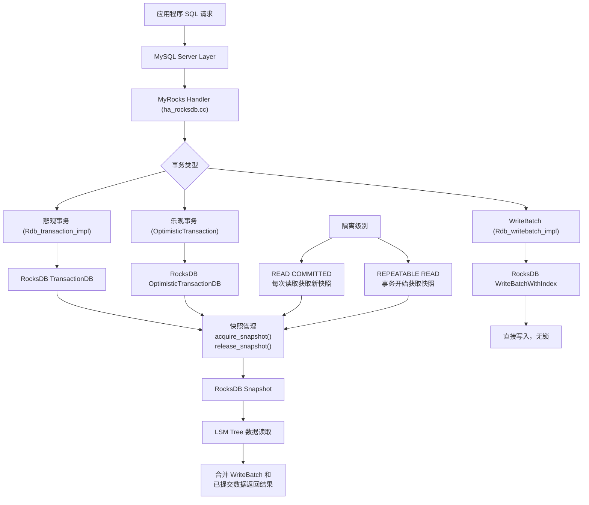
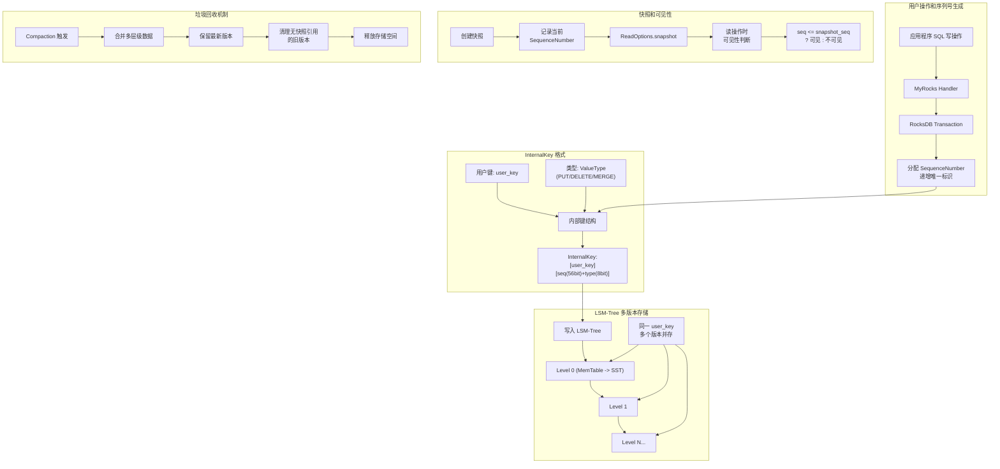
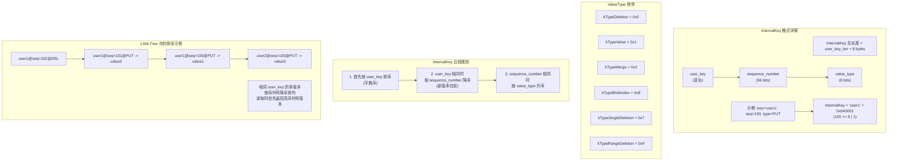
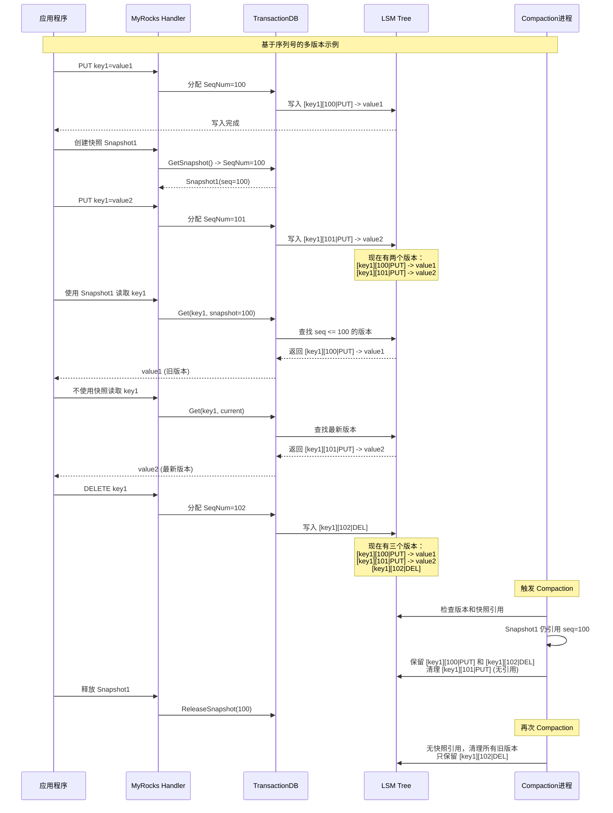
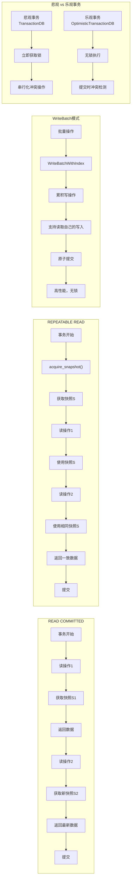
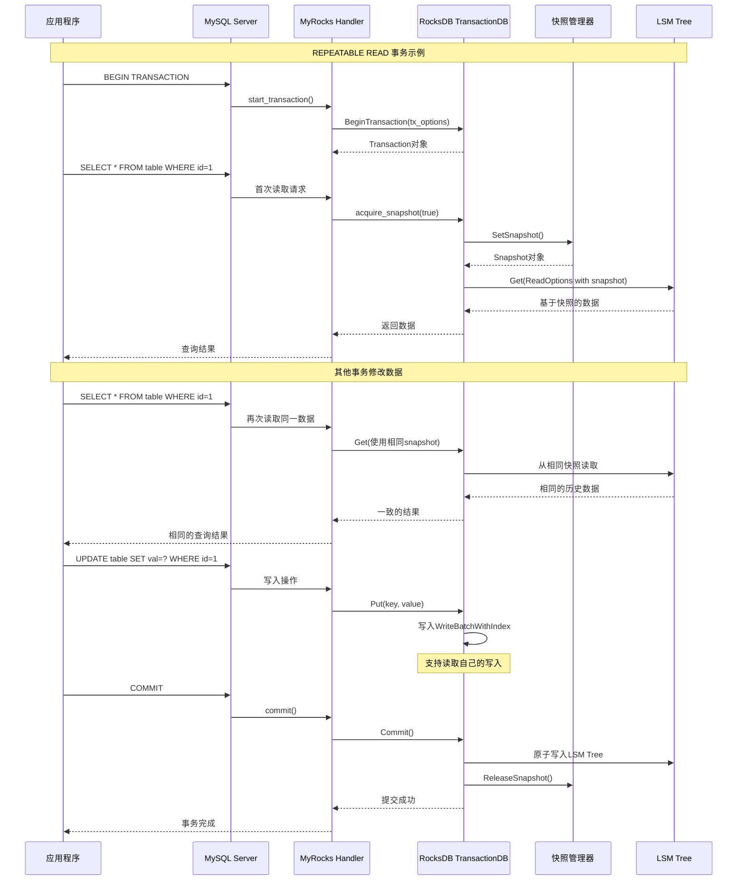

# MyRocks 引擎 MVCC 实现机制源码分析

## 1. 概述

MyRocks 是 RocksDB 作为 MySQL 存储引擎的实现，它基于 LSM-Tree（Log-Structured Merge Tree）数据结构，通过**基于序列号的快照隔离**（Sequence Number-based Snapshot Isolation）实现 MVCC（多版本并发控制）。与 InnoDB 基于 Undo Log 回滚段的机制不同，MyRocks 利用 LSM-Tree 的天然多版本存储特性、递增序列号和快照功能来实现高效的并发控制，**避免了传统的回滚段开销**。

### 核心特点
- **序列号版本控制**：每个写操作分配全局递增的 SequenceNumber
- **LSM-Tree 多版本存储**：同一键的不同版本并存于不同层级
- **快照时点一致性**：基于序列号实现精确的时点读取
- **Compaction 垃圾回收**：自动清理无快照引用的旧版本数据

## 2. 架构概览



## 2.1. 基于序列号的多版本实现机制 ⭐

MyRocks 的多版本控制**不依赖 Undo Log**，而是基于 LSM-Tree 的天然多版本存储能力和全局递增的序列号（SequenceNumber）系统。



### 2.1.1 InternalKey 格式和序列号编码

**源码位置**: `storage/rocksdb/rocksdb/db/dbformat.h:109-140`

```cpp
// 解析后的内部键结构
struct ParsedInternalKey {
  Slice user_key;                    // 用户键
  SequenceNumber sequence;           // 序列号 (56 bits)
  ValueType type;                    // 操作类型 (8 bits)
  
  ParsedInternalKey(const Slice& u, const SequenceNumber& seq, ValueType t)
      : user_key(u), sequence(seq), type(t) {}
};

// 序列号和类型打包为 64 位
inline uint64_t PackSequenceAndType(uint64_t seq, ValueType t) {
  assert(seq <= kMaxSequenceNumber);  // 最大序列号: (1ull << 56) - 1
  return (seq << 8) | t;              // 序列号占高 56 位，类型占低 8 位
}
```



### 2.1.2 快照可见性判断机制

**源码位置**: `storage/rocksdb/rocksdb/db/read_callback.h:26-39`

```cpp
class ReadCallback {
protected:
  SequenceNumber max_visible_seq_ = kMaxSequenceNumber;  // 快照序列号
  const SequenceNumber min_uncommitted_ = kMinUnCommittedSeq;

public:
  // 核心可见性判断逻辑
  inline bool IsVisible(SequenceNumber seq) {
    if (seq < min_uncommitted_) {
      // 已提交数据，检查是否在快照范围内
      return seq <= max_visible_seq_;
    } else if (max_visible_seq_ < seq) {
      // 序列号大于快照，不可见
      return false;
    } else {
      // 需要进一步检查（事务相关）
      return IsVisibleFullCheck(seq);
    }
  }
};
```

### 2.1.3 多版本数据存储和读取流程



## 3. 核心组件分析

### 3.1 事务类层次结构

MyRocks 实现了三种事务类型，都继承自 `Rdb_transaction` 基类：

#### 3.1.1 Rdb_transaction 基类
**源码位置**: `storage/rocksdb/ha_rocksdb.cc:3092-4305`

```cpp
class Rdb_transaction {
protected:
  ulonglong m_write_count = 0;           // 写操作计数
  ulonglong m_row_lock_count = 0;        // 行锁计数
  bool m_is_delayed_snapshot = false;    // 延迟快照标志
  THD *m_thd = nullptr;                  // MySQL 线程句柄
  bool m_tx_read_only = false;           // 只读事务标志
  int m_timeout_sec = 0;                 // 锁等待超时
  
public:
  rocksdb::ReadOptions m_read_opts;      // RocksDB 读选项
  virtual void acquire_snapshot(bool acquire_now) = 0;
  virtual void release_snapshot() = 0;
};
```

#### 3.1.2 Rdb_transaction_impl（悲观事务）
**源码位置**: `storage/rocksdb/ha_rocksdb.cc:4355-4773`

```cpp
class Rdb_transaction_impl : public Rdb_transaction {
private:
  rocksdb::Transaction *m_rocksdb_tx = nullptr;    // RocksDB 事务对象
  rocksdb::Transaction *m_rocksdb_reuse_tx = nullptr;  // 事务复用对象
  
public:
  // 快照获取实现
  void acquire_snapshot(bool acquire_now) override {
    if (m_read_opts.snapshot == nullptr) {
      if (is_tx_read_only()) {
        // 只读事务直接从 DB 获取快照
        snapshot_created(rdb->GetSnapshot());
      } else if (acquire_now) {
        // 立即获取事务快照
        m_rocksdb_tx->SetSnapshot();
        snapshot_created(m_rocksdb_tx->GetSnapshot());
      } else if (!m_is_delayed_snapshot) {
        // 延迟快照：在下次操作时获取
        m_rocksdb_tx->SetSnapshotOnNextOperation(m_notifier);
        m_is_delayed_snapshot = true;
      }
    }
  }
};
```

#### 3.1.3 Rdb_writebatch_impl（批写事务）
**源码位置**: `storage/rocksdb/ha_rocksdb.cc:4783-4940`

```cpp
class Rdb_writebatch_impl : public Rdb_transaction {
private:
  rocksdb::WriteBatchWithIndex *m_batch;  // 带索引的写批次
  
public:
  // 简化的快照获取，直接从 DB 获取
  void acquire_snapshot(bool acquire_now) override {
    if (m_read_opts.snapshot == nullptr) 
      snapshot_created(rdb->GetSnapshot());
  }
};
```

### 3.2 隔离级别实现

#### 3.2.1 START TRANSACTION WITH CONSISTENT SNAPSHOT
**源码位置**: `storage/rocksdb/ha_rocksdb.cc:6075-6100`

```cpp
static int rocksdb_start_tx_and_assign_read_view(
    handlerton *const hton, THD *const thd) {
  ulong const tx_isolation = my_core::thd_tx_isolation(thd);
  
  Rdb_transaction *tx = get_or_create_tx(thd);
  assert(!tx->has_snapshot());
  tx->set_tx_read_only(true);
  rocksdb_register_tx(hton, thd, tx);

  if (tx_isolation == ISO_REPEATABLE_READ) {
    tx->acquire_snapshot(true);  // 立即获取一致性快照
  } else {
    push_warning_printf(thd, Sql_condition::SL_WARNING, HA_ERR_UNSUPPORTED,
                        "RocksDB: Only REPEATABLE READ isolation level is "
                        "supported for START TRANSACTION WITH CONSISTENT "
                        "SNAPSHOT in RocksDB Storage Engine.");
  }
  return HA_EXIT_SUCCESS;
}
```

#### 3.2.2 隔离级别对比



## 4. MVCC 事务执行流程

### 4.1 REPEATABLE READ 事务完整流程



### 4.2 快照生命周期管理

**快照获取机制**:
- **立即获取**: `acquire_snapshot(true)` - 用于 REPEATABLE READ
- **延迟获取**: `SetSnapshotOnNextOperation()` - 用于 READ COMMITTED  
- **只读事务**: 直接从 DB 获取全局快照

**快照释放机制**:
```cpp
void release_snapshot() override {
  bool need_clear = m_is_delayed_snapshot;
  
  if (m_read_opts.snapshot != nullptr) {
    m_snapshot_timestamp = 0;
    if (is_tx_read_only()) {
      rdb->ReleaseSnapshot(m_read_opts.snapshot);  // 释放 DB 快照
      need_clear = false;
    } else {
      need_clear = true;  // 标记需要清理事务快照
    }
    m_read_opts.snapshot = nullptr;
  }
  
  if (need_clear && m_rocksdb_tx != nullptr) 
    m_rocksdb_tx->ClearSnapshot();  // 清理事务快照
  m_is_delayed_snapshot = false;
}
```

## 5. WriteBatchWithIndex 实现 Read-Your-Own-Writes

### 5.1 核心原理

**源码位置**: `storage/rocksdb/rocksdb/utilities/write_batch_with_index/write_batch_with_index.cc`

WriteBatchWithIndex 是 RocksDB 的核心组件，用于解决事务内 "读取自己写入的数据" 问题：

```cpp
struct WriteBatchWithIndex::Rep {
  ReadableWriteBatch write_batch;           // 实际的写批次
  WriteBatchEntryComparator comparator;     // 条目比较器
  Arena arena;                              // 内存分配器
  WriteBatchEntrySkipList skip_list;        // 跳跃表索引
  bool overwrite_key;                       // 是否覆盖键
  size_t last_entry_offset;                // 最后条目偏移
  size_t sub_batch_cnt;                     // 子批次数量
};
```

### 5.2 查询合并逻辑

当事务内进行读操作时，MyRocks 会：

1. **首先查询 WriteBatchWithIndex**: 检查当前事务的未提交写入
2. **然后查询 RocksDB**: 获取已提交的数据
3. **合并结果**: 优先返回事务内的修改，否则返回 DB 中的数据

```cpp
// 伪代码示例
auto result = wbwii.GetFromBatch(this, keys[i], &merge_context, &batch_value, s);

if (result == WBWIIteratorImpl::kFound) {
  // 在写批次中找到了数据，直接返回
  *pinnable_val->GetSelf() = std::move(batch_value);
  pinnable_val->PinSelf();
  continue;
}
if (result == WBWIIteratorImpl::kDeleted) {
  // 在写批次中被删除
  *s = Status::NotFound();
  continue;
}
// 否则从 DB 中查询
```

## 6. 悲观事务 vs 乐观事务

### 6.1 悲观事务（TransactionDB）

**特点**:
- 读写时立即获取锁
- 避免冲突，但可能导致死锁
- 适用于冲突较多的场景

**源码示例**:
```cpp
// storage/rocksdb/rocksdb/examples/transaction_example.cc
Transaction* txn = txn_db->BeginTransaction(write_options);
s = txn->GetForUpdate(read_options, "abc", &value);  // 获取排他锁
s = txn->Put("abc", "def");
s = txn->Commit();
```

### 6.2 乐观事务（OptimisticTransactionDB）

**特点**:
- 执行过程中不加锁
- 提交时检测冲突
- 适用于冲突较少的场景

**源码示例**:
```cpp
// storage/rocksdb/rocksdb/examples/optimistic_transaction_example.cc
Transaction* txn = txn_db->BeginTransaction(write_options);
s = txn->Get(read_options, "abc", &value);
s = txn->Put("abc", "xyz");
s = txn->Commit();  // 如果有冲突会返回 Busy 状态
```

## 7. 与 InnoDB MVCC 的对比

| 特性 | MyRocks (基于序列号) | InnoDB (基于回滚段) |
|------|---------|--------|
| **多版本实现** | **序列号 + LSM-Tree 天然多版本** | **Undo Log 回滚段重构历史** |
| **版本标识** | **全局递增 SequenceNumber (56bit)** | **事务ID + 回滚指针** |
| **版本存储** | **InternalKey 包含序列号直接存储** | **最新版本 + Undo Log 链** |
| **读取机制** | **按序列号过滤，直接读取对应版本** | **从最新版本回溯 Undo Log** |
| **版本清理** | **Compaction 时检查快照引用** | **Purge 线程清理无引用 Undo** |
| **存储开销** | **每版本完整存储，压缩补偿** | **增量存储，回滚开销** |
| **并发性能** | **无锁读取，Compaction 异步** | **Undo Log 竞争，Purge 延迟** |
| **快照成本** | **O(1) 记录序列号** | **O(N) 活跃事务列表** |
| **垃圾回收** | **后台 Compaction 自动** | **专门 Purge 线程** |
| **空间放大** | **写放大，读优化** | **相对紧凑** |

### 7.1 多版本实现机制的根本差异

#### MyRocks: 基于时间戳的正向版本链
```cpp
// MyRocks 中同一个键的多个版本
LSM-Tree 存储：
key1@seq=102@DEL              // 最新：删除操作
key1@seq=101@PUT -> value2    // 中间版本
key1@seq=100@PUT -> value1    // 历史版本

// 快照读取 (snapshot_seq=100)
读取逻辑：找到 seq <= 100 且类型不为 DEL 的最新版本
结果：直接返回 key1@seq=100 -> value1
```

#### InnoDB: 基于回滚段的逆向重构
```cpp
// InnoDB 中同一行的版本链
聚集索引：key1 -> value2 (最新版本，trx_id=101)
Undo Log： value2 -> value1 (回滚指针指向历史)

// 快照读取 (ReadView 看不到 trx_id=101)
读取逻辑：从最新版本开始，沿 Undo Log 回溯
步骤：value2 -> 检查 ReadView -> 不可见 -> 沿 Undo 回溯 -> value1
结果：重构后返回 value1
```

### 7.2 性能特征对比

| 场景 | MyRocks 优势 | InnoDB 优势 |
|------|-------------|------------|
| **历史版本读取** | 直接定位，无需重构 | 只存储增量，空间省 |
| **大量并发读** | 无锁读取，线性扩展 | ReadView 复制开销 |
| **长时间快照** | Compaction 推迟清理 | Undo Log 积累过多 |
| **频繁更新** | 版本累积，空间膨胀 | 增量存储，相对紧凑 |
| **批量写入** | LSM-Tree 顺序写优秀 | B+树随机写，页分裂 |

### 7.3 适用场景建议

**MyRocks 更适合**：
- 写多读少的 OLTP 场景
- 需要长时间一致性快照（如备份）
- 批量数据导入和 ETL
- 存储成本敏感（高压缩比）

**InnoDB 更适合**：
- 读多写少的传统 OLTP
- 需要复杂事务和外键约束
- 随机读取密集的场景
- 存储空间相对充裕

## 8. 性能优化策略

### 8.1 快照延迟获取

READ COMMITTED 隔离级别下使用 `SetSnapshotOnNextOperation()`，避免不必要的快照创建：

```cpp
if (!m_is_delayed_snapshot) {
  m_rocksdb_tx->SetSnapshotOnNextOperation(m_notifier);
  m_is_delayed_snapshot = true;
}
```

### 8.2 事务对象重用

MyRocks 通过 `m_rocksdb_reuse_tx` 重用事务对象，避免频繁的对象创建销毁：

```cpp
void release_tx(void) {
  assert(m_rocksdb_reuse_tx == nullptr);
  m_rocksdb_reuse_tx = m_rocksdb_tx;  // 保存以供重用
  m_rocksdb_tx = nullptr;
}
```

### 8.3 批量操作优化

对于复制线程等无冲突场景，使用 WriteBatch 模式避免事务锁开销：

```cpp
class Rdb_writebatch_impl : public Rdb_transaction {
  rocksdb::WriteBatchWithIndex *m_batch;
  // 跳过事务 API，直接批量写入
  rocksdb::Status s = rdb->Write(write_opts, optimize, m_batch->GetWriteBatch());
};
```

## 9. 总结

MyRocks 的 MVCC 实现**摒弃了传统的 Undo Log 回滚段机制**，转而采用**基于全局序列号和 LSM-Tree 天然多版本存储**的创新设计，通过以下关键技术实现高效的并发控制：

### 9.1 核心技术特点

1. **序列号版本控制**: 
   - 每个写操作分配全局递增的 SequenceNumber (56-bit)
   - InternalKey 包含 `user_key + sequence + type` 实现版本标识
   - 避免了回滚段的复杂管理和竞争问题

2. **LSM-Tree 多版本存储**: 
   - 同一键的多个版本自然并存于不同层级
   - 新版本不覆盖旧版本，而是追加写入
   - 支持高效的范围查询和批量操作

3. **快照隔离机制**: 
   - 基于 RocksDB Snapshot 的 O(1) 快照创建
   - ReadCallback 通过序列号比较实现可见性判断
   - 无需维护复杂的活跃事务列表

4. **WriteBatchWithIndex**: 
   - 解决事务内读写一致性问题
   - 支持 read-your-own-writes 语义
   - 高效的索引结构加速事务内查询

5. **异步垃圾回收**: 
   - Compaction 过程自动清理无快照引用的旧版本
   - 避免了专门的 Purge 线程开销
   - 与正常的 LSM-Tree 压缩过程集成

### 9.2 适用场景优势

**MyRocks 的序列号 MVCC 特别适合**：
- **写密集型工作负载**: LSM-Tree 的顺序写特性
- **长时间一致性读**: 基于序列号的快照成本低
- **批量数据处理**: 无锁读取支持高并发
- **存储成本敏感**: 高压缩比补偿多版本开销
- **时序数据场景**: 天然支持按时间版本查询

### 9.3 与传统 MVCC 的根本区别

MyRocks 的创新在于**将版本信息编码到键本身**，使得多版本控制从"事后重构"转变为"事前存储"，这种设计哲学的转变带来了：

- **读取性能**: 直接访问目标版本，无需回溯重构
- **并发扩展**: 无锁读取，线性扩展能力
- **存储效率**: 利用 LSM-Tree 的压缩能力
- **实现简洁**: 避免了复杂的回滚段管理

这使得 MyRocks 在现代云原生、高并发的数据库应用场景中具有独特的优势，特别是在需要处理大量写入和长时间一致性读取的场景下。

## 10. 参考源码文件

- `storage/rocksdb/ha_rocksdb.cc` - MyRocks 存储引擎主实现
- `storage/rocksdb/rocksdb/utilities/write_batch_with_index/` - WriteBatchWithIndex 实现
- `storage/rocksdb/rocksdb/utilities/transactions/` - 事务实现
- `storage/rocksdb/rocksdb/examples/transaction_example.cc` - 事务示例
- `storage/rocksdb/rocksdb/examples/optimistic_transaction_example.cc` - 乐观事务示例
