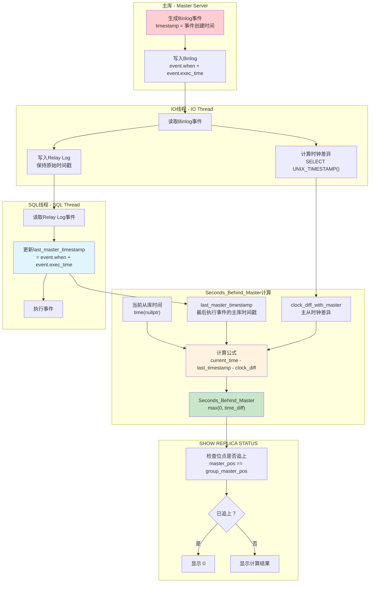

# QA
1. mysql 的variables 参数值都可能是什么类型？这个类型对应golang是什么？给我映射列表。

## MySQL Variables 类型分析与 Golang 映射

通过分析MySQL源码（主要在 `include/mysql/components/services/bits/system_variables_bits.h`、`sql/sys_vars.h`、`include/mysql/plugin.h` 等文件），MySQL系统变量支持以下类型：

### 1. 基础变量类型定义

**源码位置**: `include/mysql/components/services/bits/system_variables_bits.h:14-49`

```cpp
#define PLUGIN_VAR_BOOL 0x0001        /** bool variable */
#define PLUGIN_VAR_INT 0x0002         /** int variable */
#define PLUGIN_VAR_LONG 0x0003        /** long variable */
#define PLUGIN_VAR_LONGLONG 0x0004    /** longlong variable */
#define PLUGIN_VAR_STR 0x0005         /** char * variable */
#define PLUGIN_VAR_ENUM 0x0006        /** Enum variable */
#define PLUGIN_VAR_SET 0x0007         /** A set variable */
#define PLUGIN_VAR_DOUBLE 0x0008      /** double variable */
```

### 2. 具体系统变量类型

**源码位置**: `sql/sys_vars.h:339-346`

```cpp
typedef Sys_var_integer<int32, GET_UINT, SHOW_INT, false> Sys_var_int32;
typedef Sys_var_integer<uint, GET_UINT, SHOW_INT, false> Sys_var_uint;
typedef Sys_var_integer<ulong, GET_ULONG, SHOW_LONG, false> Sys_var_ulong;
typedef Sys_var_integer<ha_rows, GET_HA_ROWS, SHOW_HA_ROWS, false> Sys_var_harows;
typedef Sys_var_integer<ulonglong, GET_ULL, SHOW_LONGLONG, false> Sys_var_ulonglong;
typedef Sys_var_integer<long, GET_LONG, SHOW_SIGNED_LONG, true> Sys_var_long;
```

### 3. MySQL 变量类型与 Golang 类型映射表

| MySQL变量类型 | MySQL C/C++ 类型 | 描述 | Golang 类型 | 全局变量样例 | 说明 |
|---------------|-----------------|------|-------------|-------------|------|
| **PLUGIN_VAR_BOOL** | `bool` | 布尔值 (OFF/ON) | `bool` | `autocommit`<br/>`foreign_key_checks` | 直接映射 `SET GLOBAL autocommit = ON` |
| **PLUGIN_VAR_INT** | `int` | 32位有符号整数 | `int32` | `thread_pool_stall_limit` | MySQL中实际为32位 |
| **PLUGIN_VAR_INT** (unsigned) | `uint` | 32位无符号整数 | `uint32` | `table_open_cache_instances`<br/>`eq_range_index_dive_limit` | 带 PLUGIN_VAR_UNSIGNED 标志 |
| **PLUGIN_VAR_LONG** | `long` | 平台相关的长整数 | `int64` | `max_digest_length` | 在64位系统上为64位 |
| **PLUGIN_VAR_LONG** (unsigned) | `ulong` | 无符号长整数 | `uint64` | `max_connections`<br/>`table_open_cache`<br/>`max_allowed_packet` | 带 PLUGIN_VAR_UNSIGNED 标志<br/>`SET GLOBAL max_connections = 1000` |
| **PLUGIN_VAR_LONGLONG** | `longlong` | 64位有符号整数 | `int64` | `long_query_time` (微秒存储) | MySQL的longlong就是long long |
| **PLUGIN_VAR_LONGLONG** (unsigned) | `ulonglong` | 64位无符号整数 | `uint64` | `innodb_buffer_pool_size`<br/>`max_heap_table_size`<br/>`global_connection_memory_limit` | 最常用的数值类型<br/>`SET GLOBAL innodb_buffer_pool_size = 8589934592` |
| **PLUGIN_VAR_STR** | `char*` | 字符串指针 | `string` | `datadir`<br/>`character_set_server`<br/>`lc_messages_dir` | 需要处理NULL指针情况<br/>`SET GLOBAL character_set_server = 'utf8mb4'` |
| **PLUGIN_VAR_ENUM** | `ulong` (存储) | 枚举值（存储为索引） | `string` 或 `int` | `binlog_format`<br/>`transaction_isolation`<br/>`concurrent_insert` | 可按索引或名称处理<br/>`SET GLOBAL binlog_format = 'ROW'` |
| **PLUGIN_VAR_SET** | `ulonglong` (存储) | 集合类型（位掩码） | `[]string` 或 `uint64` | `sql_mode`<br/>`optimizer_switch` | 位掩码或字符串数组<br/>`SET GLOBAL sql_mode = 'STRICT_TRANS_TABLES,NO_ZERO_DATE'` |
| **PLUGIN_VAR_DOUBLE** | `double` | 64位浮点数 | `float64` | `long_query_time`<br/>`innodb_segment_reserve_factor` | 直接映射<br/>`SET GLOBAL long_query_time = 10.5` |

### 4. 特殊类型说明

#### 4.1 ha_rows 类型

**源码位置**: `sql/sys_vars.h:160`
```cpp
#define GET_HA_ROWS GET_ULL  // ha_rows 实际上是 ulonglong
```

| 类型 | MySQL C/C++ 类型 | Golang 类型 | 全局变量样例 |
|------|-----------------|-------------|-------------|
| **ha_rows** | `ulonglong` | `uint64` | `select_limit`<br/>`max_join_size` |

#### 4.2 特殊结构体类型

**源码位置**: `sql/sys_vars.h:2334-2377`

| 类型 | 描述 | Golang 类型 | 全局变量样例 | 示例值 |
|------|------|-------------|-------------|--------|
| **字符集 (CHARSET_INFO)** | 字符集结构体 | `string` | `character_set_server`<br/>`character_set_database`<br/>`character_set_client` | `"utf8mb4"`<br/>`"latin1"` |
| **时区 (Time_zone)** | 时区结构体 | `string` | `time_zone`<br/>`system_time_zone` | `"+08:00"`<br/>`"Asia/Shanghai"`<br/>`"SYSTEM"` |
| **本地化 (MY_LOCALE)** | 区域设置结构体 | `string` | `lc_messages`<br/>`lc_time_names` | `"en_US"`<br/>`"zh_CN"`<br/>`"ja_JP"` |

### 5. 实际应用中的类型判断

**源码位置**: `sql/item_func.cc:7248-7473`

在MySQL源码中，系统变量的实际类型通过 `show_type()` 方法确定：

```cpp
switch (var->show_type()) {
    case SHOW_INT:          // uint
    case SHOW_LONG:         // ulong  
    case SHOW_LONGLONG:     // ulonglong
    case SHOW_SIGNED_INT:   // int
    case SHOW_SIGNED_LONG:  // long
    case SHOW_SIGNED_LONGLONG: // longlong
    case SHOW_HA_ROWS:      // ha_rows (ulonglong)
    case SHOW_BOOL:         // bool
    case SHOW_MY_BOOL:      // bool
    case SHOW_DOUBLE:       // double
    case SHOW_CHAR:         // char[]
    case SHOW_CHAR_PTR:     // char*
    case SHOW_LEX_STRING:   // LEX_STRING
}
```

### 6. Golang 处理建议

#### 6.1 推荐的 Golang 类型映射

```go
// MySQL系统变量值的统一接口
type MySQLVariableValue interface {
    String() string
    Int64() (int64, error)
    Uint64() (uint64, error) 
    Float64() (float64, error)
    Bool() (bool, error)
}

// 具体类型映射
type MySQLVariableType int

const (
    VarTypeBool MySQLVariableType = iota
    VarTypeInt32
    VarTypeUint32
    VarTypeInt64
    VarTypeUint64
    VarTypeFloat64
    VarTypeString
    VarTypeEnum
    VarTypeSet
)

// 类型映射函数
func MapMySQLType(mysqlType string) MySQLVariableType {
    switch mysqlType {
    case "SHOW_BOOL", "SHOW_MY_BOOL":
        return VarTypeBool
    case "SHOW_SIGNED_INT":
        return VarTypeInt32
    case "SHOW_INT":
        return VarTypeUint32
    case "SHOW_SIGNED_LONG", "SHOW_SIGNED_LONGLONG":
        return VarTypeInt64
    case "SHOW_LONG", "SHOW_LONGLONG", "SHOW_HA_ROWS":
        return VarTypeUint64
    case "SHOW_DOUBLE":
        return VarTypeFloat64
    case "SHOW_CHAR", "SHOW_CHAR_PTR", "SHOW_LEX_STRING":
        return VarTypeString
    default:
        return VarTypeString // 默认按字符串处理
    }
}
```

#### 6.2 处理注意事项

1. **NULL值处理**: MySQL变量可能为NULL，需要使用指针类型或 `sql.NullXxx` 类型
2. **枚举和集合**: 建议同时支持字符串表示和数值表示
3. **字符串编码**: 注意处理不同字符集的字符串
4. **数值范围**: 特别注意有符号和无符号整数的范围差异
5. **类型转换**: 提供灵活的类型转换机制，避免数据丢失

#### 6.3 变量类型测试 SQL

```sql
-- 测试各种变量类型的 SQL 示例

-- BOOL 类型测试
SELECT @@GLOBAL.autocommit;                    -- 返回: 1 或 0
SET GLOBAL autocommit = ON;

-- UINT 类型测试  
SELECT @@GLOBAL.table_open_cache_instances;     -- 返回: 数字 (如 16)
SET GLOBAL table_open_cache_instances = 32;

-- ULONG 类型测试
SELECT @@GLOBAL.max_connections;                -- 返回: 数字 (如 151)
SET GLOBAL max_connections = 1000;

-- ULONGLONG 类型测试
SELECT @@GLOBAL.innodb_buffer_pool_size;        -- 返回: 大数字 (如 134217728)
SET GLOBAL innodb_buffer_pool_size = 8589934592; -- 8GB

-- DOUBLE 类型测试
SELECT @@GLOBAL.long_query_time;                -- 返回: 浮点数 (如 10.000000)
SET GLOBAL long_query_time = 5.5;

-- STRING 类型测试
SELECT @@GLOBAL.character_set_server;           -- 返回: 字符串 (如 'utf8mb4')
SET GLOBAL character_set_server = 'latin1';

-- ENUM 类型测试
SELECT @@GLOBAL.binlog_format;                  -- 返回: 'ROW', 'STATEMENT', 或 'MIXED'
SET GLOBAL binlog_format = 'ROW';

-- SET 类型测试
SELECT @@GLOBAL.sql_mode;                       -- 返回: 逗号分隔的字符串
SET GLOBAL sql_mode = 'STRICT_TRANS_TABLES,NO_ZERO_DATE,NO_ZERO_IN_DATE';

-- 结构体类型测试
SELECT @@GLOBAL.time_zone;                      -- 返回: 'SYSTEM' 或 时区字符串
SET GLOBAL time_zone = '+08:00';

-- 查看变量的详细信息
SELECT 
    VARIABLE_NAME,
    VARIABLE_VALUE,
    'GLOBAL' as VARIABLE_SCOPE
FROM performance_schema.global_variables 
WHERE VARIABLE_NAME IN (
    'autocommit', 'max_connections', 'innodb_buffer_pool_size',
    'long_query_time', 'character_set_server', 'binlog_format', 'sql_mode'
)
ORDER BY VARIABLE_NAME;
```

2. innodb_adaptive_hash_index_parts 这个参数是动态修改，马上生效的不？

## innodb_adaptive_hash_index_parts 动态修改分析

通过分析源码，该参数**不能**动态修改，必须在MySQL服务器启动时配置。

### 源码分析结论

**参数定义位置**: `storage/innobase/handler/ha_innodb.cc:23347-23363`

```cpp
static MYSQL_SYSVAR_ULONG(
    adaptive_hash_index_parts, btr_ahi_parts,
    PLUGIN_VAR_OPCMDARG | PLUGIN_VAR_READONLY,    // ← 注意 PLUGIN_VAR_READONLY 标志
    "Number of InnoDB Adaptive Hash Index Partitions. (default = 8). ", 
    nullptr, nullptr, 8, 1, 512, 0);
```

**关键标志含义**: `include/mysql/components/services/bits/system_variables_bits.h:46`
```cpp
#define PLUGIN_VAR_READONLY 0x0200  /**< Server variable is read only */
```

**运行时检查**: `sql/set_var.cc:1650-1660`
```cpp
if (var->is_readonly()) {
  if (type != OPT_PERSIST_ONLY) {
    my_error(ER_INCORRECT_GLOBAL_LOCAL_VAR, MYF(0), var->name.str,
             "read only");
    return -1;
  }
}
```

### 测试验证

**测试文件**: `mysql-test/suite/sys_vars/r/innodb_adaptive_hash_index_parts_basic.result`

```sql
-- 尝试动态修改会报错
SET @@GLOBAL.innodb_adaptive_hash_index_parts=1;
ERROR HY000: Variable 'innodb_adaptive_hash_index_parts' is a read only variable

-- 只能查看，不能修改
SELECT @@GLOBAL.innodb_adaptive_hash_index_parts;
-- 返回当前值（默认为8）
```

### 配置方法

由于该参数为只读变量，只能通过以下方式设置：

#### 1. 配置文件设置
```ini
# my.cnf 或 my.ini 文件中
[mysqld]
innodb_adaptive_hash_index_parts = 16
```

#### 2. 命令行启动参数
```bash
mysqld --innodb-adaptive-hash-index-parts=16
```

#### 3. 系统变量查看
```sql
-- 查看当前值
SELECT @@GLOBAL.innodb_adaptive_hash_index_parts;

-- 查看变量详情
SHOW GLOBAL VARIABLES LIKE 'innodb_adaptive_hash_index_parts';

-- 查看是否为只读
SELECT 
  VARIABLE_NAME,
  VARIABLE_VALUE,
  'READ_ONLY' as VARIABLE_SCOPE
FROM performance_schema.global_variables 
WHERE VARIABLE_NAME = 'innodb_adaptive_hash_index_parts';
```

### 参数作用说明

**功能**: 控制InnoDB自适应哈希索引(AHI)的分区数量
- **默认值**: 8个分区
- **取值范围**: 1-512
- **作用**: 将AHI分成多个分区，每个分区有独立的锁，减少并发访问时的锁争用

**性能影响**:
- **分区过少**: 高并发时锁竞争严重，AHI性能下降
- **分区过多**: 内存开销增加，管理复杂度提升  
- **推荐设置**: CPU核心数的1-2倍

### 总结

❌ **不能动态修改**: `innodb_adaptive_hash_index_parts` 是只读参数  
🔄 **需要重启**: 修改该参数需要重启MySQL服务器才能生效  
⚙️ **启动配置**: 只能通过配置文件或启动参数设置  
🎯 **用途明确**: 用于优化高并发场景下的AHI性能

3. mysql.gtid_executed 这个表的落盘保存时机是什么？

## mysql.gtid_executed 表落盘保存时机分析

通过分析MySQL源码，`mysql.gtid_executed` 表的落盘保存时机主要有以下几种情况：

### 1. 二进制日志轮换时（主要时机）

**源码位置**: `sql/binlog.cc:6983-7031`

```cpp
if (!is_relay_log) {
  /* Save set of GTIDs of the last binlog into table on binlog rotation */
  if ((error = gtid_state->save_gtids_of_last_binlog_into_table())) {
    // 错误处理逻辑
  }
}
```

**触发条件**:
- 二进制日志文件达到 `max_binlog_size` 限制
- 执行 `FLUSH BINARY LOGS` 命令  
- 执行 `FLUSH LOGS` 命令
- 服务器正常关闭时的日志轮换

**实现逻辑**: `sql/rpl_gtid_state.cc:709-767`
```cpp
int Gtid_state::save_gtids_of_last_binlog_into_table() {
  // 计算需要保存的GTID集合
  // logged_gtids_last_binlog = executed_gtids - previous_gtids_logged - gtids_only_in_table
  
  if (!logged_gtids_last_binlog.is_empty()) {
    /* Save set of GTIDs of the last binlog into gtid_executed table */
    if (save(&logged_gtids_last_binlog))
      ret = ER_RPL_GTID_TABLE_CANNOT_OPEN;
  }
}
```

### 2. 服务器启动时（恢复场景）

**源码位置**: `sql/mysqld.cc:9926-10001`

```cpp
if (opt_bin_log) {
  // 从binlog文件和gtid_executed表中恢复GTID信息
  if (!gtids_in_binlog.is_empty() && !gtids_in_binlog.is_subset(executed_gtids)) {
    /*
      Save unsaved GTIDs into gtid_executed table, in the following four cases:
        1. the upgrade case.
        2. the case that a slave is provisioned from a backup
        3. the case that no binlog rotation happened from the last RESET BINARY LOGS AND GTIDS
        4. The set of GTIDs of the last binlog is not saved into the gtid_executed table if server crashes
    */
    if (gtid_state->save(&gtids_in_binlog_not_in_table) == -1) {
      // 错误处理
    }
  }
}
```

**场景说明**:
- **升级场景**: 从旧版本升级时补充缺失的GTID
- **从备份恢复**: 从主库备份恢复的从库需要补充GTID
- **异常重启恢复**: 服务器崩溃重启时保存未持久化的GTID
- **无轮换场景**: `RESET BINARY LOGS AND GTIDS` 后未发生日志轮换的情况

### 3. 事务提交时（特定条件）

**源码位置**: `sql/handler.cc:1570-1621`

```cpp
std::pair<int, bool> commit_owned_gtids(THD *thd, bool all) {
  /*
    If the binary log is disabled for this thread (either by
    log_bin=0 or sql_log_bin=0 or by log_replica_updates=0 for a
    slave thread), then the statement will not be written to
    the binary log. In this case, we should save its GTID into
    mysql.gtid_executed table and @@GLOBAL.GTID_EXECUTED as it
    did when binlog is enabled.
  */
}
```

**触发条件**:
- 二进制日志被禁用 (`log_bin=0` 或 `sql_log_bin=0`)
- 从库禁用日志更新 (`log_replica_updates=0`)
- 非XA事务的DDL语句

**源码位置**: `sql/binlog.cc:1884-1906`
```cpp
int MYSQL_BIN_LOG::gtid_end_transaction(THD *thd) {
  if (!opt_bin_log || (thd->slave_thread && !opt_log_replica_updates)) {
    /*
      If the binary log is disabled for this thread, then the statement 
      must not be written to the binary log. In this case, we just save 
      the GTID into the table directly.
    */
    if (gtid_state->save(thd) != 0) {
      gtid_state->update_on_rollback(thd);
      return 1;
    }
  }
}
```

### 4. InnoDB 存储引擎持久化（异步）

**源码位置**: `storage/innobase/clone/clone0repl.cc:423-536`

```cpp
int Clone_persist_gtid::write_to_table(uint32_t flush_list_number, ...) {
  /* Write GTIDs to table. */
  if (!write_gtid_set.is_empty()) {
    ++m_compression_counter;
    err = gtid_table_persistor->save(&write_gtid_set, false);
  }
}
```

**触发机制**:
- InnoDB后台线程定期刷新
- GTID数量达到阈值 (`s_gtid_threshold`)
- 显式调用 `wait_flush()` 方法
- 恢复过程中的批量写入

**源码位置**: `storage/innobase/handler/ha_innodb.cc:6259-6303`
```cpp
static bool innobase_flush_logs(handlerton *hton, bool binlog_group_flush) {
  /* Signal and wait for all GTIDs to persist on disk. */
  if (!binlog_group_flush) {
    auto &gtid_persistor = clone_sys->get_gtid_persistor();
    gtid_persistor.wait_flush(true, true, nullptr);
  }
}
```

### 5. 从库复制场景

**源码位置**: `sql/rpl_replica_commit_order_manager.cc:206-260`

```cpp
void Commit_order_manager::flush_engine_and_signal_threads(Slave_worker *worker) {
  /* flush transactions to the storage engine in a group */
  ha_flush_logs(true);
  
  /* add to @@global.gtid_executed */
  gtid_state->update_commit_group(first);
}
```

**应用场景**:
- 从库应用binlog事件时
- 多线程复制 (MTS) 的提交顺序管理
- 组提交优化场景

### 6. 保存失败的容错机制

**源码位置**: `sql/binlog.cc:6983-7031`

```cpp
if ((error = gtid_state->save_gtids_of_last_binlog_into_table())) {
  if (error == ER_RPL_GTID_TABLE_CANNOT_OPEN) {
    close_on_error = m_binlog_file->get_real_file_size() >= static_cast<my_off_t>(max_size);
    
    if (!close_on_error) {
      LogErr(ERROR_LEVEL, ER_BINLOG_UNABLE_TO_ROTATE_GTID_TABLE_READONLY,
             "Current binlog file was flushed to disk and will be kept in use.");
    } else {
      if (binlog_error_action != ABORT_SERVER)
        LogErr(WARNING_LEVEL, ER_BINLOG_UNABLE_TO_ROTATE_GTID_TABLE_READONLY,
               "Binary logging going to be disabled.");
    }
  }
}
```

**容错策略**:
- **表只读时**: 继续使用当前日志文件，记录警告日志
- **达到最大大小且表只读**: 根据 `binlog_error_action` 决定是否停止日志记录或关闭服务器
- **保存失败**: 在下次服务器启动时重试保存

### 总结

| 时机 | 频率 | 触发条件 | 源码位置 | 说明 |
|------|------|----------|----------|------|
| **二进制日志轮换** | 高频 | 日志文件达到大小限制、手动FLUSH | `sql/binlog.cc:6983` | 🔥 **最主要的持久化时机** |
| **服务器启动** | 低频 | 崩溃恢复、升级、备份恢复 | `sql/mysqld.cc:9926` | 🔄 **恢复场景的补偿机制** |
| **事务提交** | 中频 | binlog禁用、从库不记录更新 | `sql/handler.cc:1570` | ⚙️ **特定配置下的即时保存** |
| **InnoDB后台刷新** | 中频 | 达到阈值、定期刷新 | `storage/innobase/clone/clone0repl.cc:423` | 🚀 **存储引擎层异步持久化** |
| **从库复制提交** | 高频 | MTS组提交、复制应用 | `sql/rpl_replica_commit_order_manager.cc:206` | 🔗 **复制架构中的同步机制** |

**关键设计思想**:
- **批量保存**: 通过日志轮换批量保存GTID，提高效率
- **异步持久化**: InnoDB层提供异步的GTID持久化能力
- **容错恢复**: 服务器启动时检查并补充缺失的GTID
- **分层设计**: 服务器层和存储引擎层协同保证GTID的持久化

这种设计确保了GTID信息的可靠持久化，同时在性能和一致性之间取得了良好的平衡。

3. mysql Seconds_Behind_Master 是怎么计算的？是跟IO线程读取到的位点比较还是跟MySQL master的当前位点比较？

## MySQL Seconds_Behind_Master 计算机制深度分析

通过分析MySQL源码，`Seconds_Behind_Master`（现在称为`Seconds_Behind_Source`）的计算机制如下：

### 核心计算公式

**源码位置**: `sql/rpl_replica.cc:3619-3642`

```cpp
long time_diff = ((long)(time(nullptr) - mi->rli->last_master_timestamp) - 
                  mi->clock_diff_with_master);

protocol->store((longlong)(mi->rli->last_master_timestamp ? max(0L, time_diff) : 0));
```

**计算公式**:
```
Seconds_Behind_Master = 当前从库时间 - last_master_timestamp - clock_diff_with_master
```

### 关键组件详解

#### 1. last_master_timestamp 的更新机制

**源码位置**: `sql/rpl_replica.cc:4979-4987`

```cpp
if ((!rli->is_parallel_exec() || rli->last_master_timestamp == 0) &&
    !(ev->is_artificial_event() || ev->is_relay_log_event() ||
      ev->get_type_code() == mysql::binlog::event::FORMAT_DESCRIPTION_EVENT ||
      ev->server_id == 0)) {
  rli->last_master_timestamp = ev->common_header->when.tv_sec + (time_t)ev->exec_time;
  assert(rli->last_master_timestamp >= 0);
}
```

**更新时机**:
- SQL线程执行每个binlog事件时
- 使用事件的**创建时间** + **执行时间**
- 排除人工事件、中继日志事件、格式描述事件、心跳事件

#### 2. clock_diff_with_master 的计算

**源码位置**: `sql/rpl_replica.cc:2767-2785`

```cpp
if (!mysql_real_query(mysql, STRING_WITH_LEN("SELECT UNIX_TIMESTAMP()")) &&
    (master_res = mysql_store_result(mysql)) &&
    (master_row = mysql_fetch_row(master_res))) {
  mysql_mutex_lock(&mi->data_lock);
  mi->clock_diff_with_master = 
      (long)(time((time_t *)nullptr) - strtoul(master_row[0], nullptr, 10));
  mysql_mutex_unlock(&mi->data_lock);
}
```

**计算逻辑**:
```
clock_diff_with_master = 从库当前时间 - 主库当前时间
```

### 计算流程图



### 特殊情况处理

#### 1. 已追上的判断条件

**源码位置**: `sql/rpl_replica.cc:3611-3617`

```cpp
if ((mi->get_master_log_pos() == mi->rli->get_group_master_log_pos()) &&
    (!strcmp(mi->get_master_log_name(), mi->rli->get_group_master_log_name()))) {
  if (mi->slave_running == MYSQL_SLAVE_RUN_CONNECT)
    protocol->store(0LL);    // 显示 0
  else
    protocol->store_null();  // 显示 NULL
}
```

**判断逻辑**:
- **位点比较**: IO线程读取位点 == SQL线程执行位点  
- **文件名比较**: 当前binlog文件名相同
- **状态判断**: IO线程连接状态

#### 2. 并行复制(MTS)的处理

**源码位置**: `sql/rpl_applier_reader.cc:561-563`

```cpp
if (!m_rli->is_parallel_exec() || m_rli->gaq->empty())
  m_rli->last_master_timestamp = 0;
```

**MTS特殊逻辑**:
- 使用GAQ (Group Assign Queue) 管理并行任务
- 只有当GAQ为空时才重置`last_master_timestamp`
- 更新频率受`replica_checkpoint_group`和`replica_checkpoint_period`控制

#### 3. 时钟同步问题处理

**源码注释说明**: `sql/rpl_replica.cc:3622-3640`

可能导致负值的情况:
- 主库本身是其他主库的从库，时间超前
- 主库使用了`SET TIMESTAMP`显式设置时间戳
- 时间函数的秒级精度导致的舍入误差

**处理策略**: 使用`max(0L, time_diff)`确保结果不为负数

### 关键设计要点

| 方面 | 说明 | 源码位置 |
|------|------|----------|
| **时间基准** | 基于**事件创建时间**，不是主库当前时间 | `sql/rpl_replica.cc:4985` |
| **位点比较** | IO线程读取位点 vs SQL线程执行位点 | `sql/rpl_replica.cc:3611` |
| **时钟补偿** | 自动计算并补偿主从时钟差异 | `sql/rpl_replica.cc:2771` |
| **并发处理** | MTS模式下使用GAQ管理时间戳更新 | `sql/rpl_applier_reader.cc:561` |
| **边界处理** | 防止负值，处理特殊事件类型 | `sql/rpl_replica.cc:3641` |

### 总结

**回答原问题**: `Seconds_Behind_Master` **不是**跟主库当前位点比较，而是：

1. **基于事件时间戳**: 使用SQL线程**正在执行的事件**的主库时间戳
2. **位点判断追赶**: 通过比较IO线程读取位点和SQL线程执行位点判断是否已追上
3. **时钟差异补偿**: 自动计算并补偿主从服务器的时钟差异
4. **实时延迟反映**: 反映的是SQL线程执行延迟，而不是IO线程读取延迟

这种设计更准确地反映了从库**实际的数据延迟**，而不仅仅是网络传输延迟。