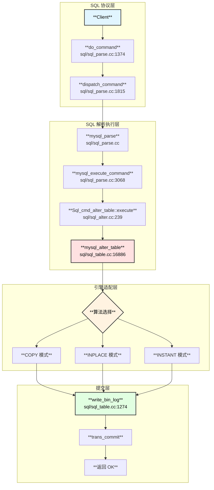
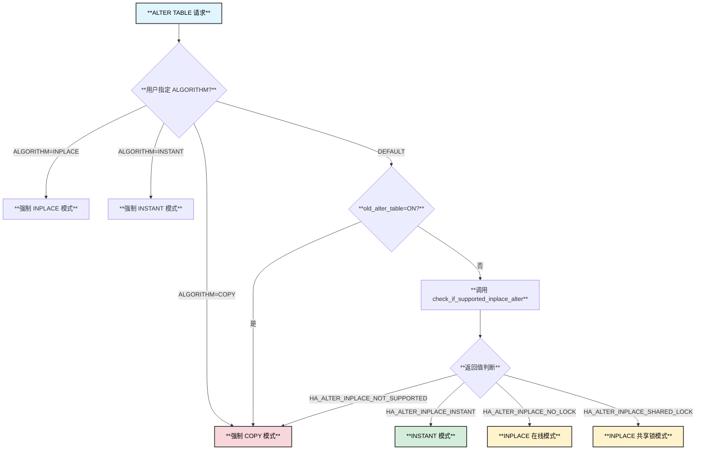

# ALTER TABLE 深度分析：从协议层到提交返回

## 一、ALTER TABLE 执行流程总览

### 1.1 整体架构



### 1.2 完整函数调用链

```
do_command() - sql/sql_parse.cc:1374
├── 读取网络包，获取 COM_QUERY 命令
└── dispatch_command() - sql/sql_parse.cc:1815
    ├── case COM_QUERY:
    │   └── alloc_query() - 分配查询内存
    └── dispatch_sql_command() - sql/sql_parse.cc
        └── mysql_parse() - sql/sql_parse.cc
            ├── parse_sql() - 词法/语法解析，生成 LEX
            └── mysql_execute_command() - sql/sql_parse.cc:3068
                ├── case SQLCOM_ALTER_TABLE:
                │   └── lex->m_sql_cmd->execute() 
                │       └── Sql_cmd_alter_table::execute() - sql/sql_alter.cc:239
                │           ├── 权限检查 check_access/check_grant
                │           ├── 参数验证
                │           └── mysql_alter_table() - sql/sql_table.cc:16886
                │               ├── 打开原表 open_tables()
                │               ├── 填充 Alter_info 结构
                │               ├── 算法选择（见下文详细分析）
                │               ├── ┌────────────────┬─────────────────────────────────┐
                │               │   │  算法           │  处理函数                        │
                │               │   ├────────────────┼─────────────────────────────────┤
                │               │   │  COPY          │  copy_data_between_tables       │
                │               │   ├────────────────┼─────────────────────────────────┤
                │               │   │  INPLACE       │  mysql_inplace_alter_table      │
                │               │   ├────────────────┼─────────────────────────────────┤
                │               │   │  INSTANT       │  commit_inplace_alter_table     │
                │               │   └────────────────┴─────────────────────────────────┘
                │               ├── write_bin_log() - sql/sql_table.cc:1274
                │               │   └── 写入 DDL 语句到 binlog
                │               └── trans_commit_stmt/trans_commit_implicit
                └── 返回执行结果
```

---

## 二、三种 DDL 算法详解

### 2.1 算法选择流程



### 2.2 COPY 模式

#### 原理

COPY 模式是最传统的 DDL 方式，通过创建新表、复制数据、交换表名来完成。

```
┌─────────────────────────────────────────────────────────────────────────────┐
│                         COPY 模式执行流程                                    │
├─────────────────────────────────────────────────────────────────────────────┤
│                                                                             │
│  1. 创建临时表（新表结构）                                                   │
│     CREATE TABLE #sql-xxx LIKE old_table + 新修改                           │
│                                                                             │
│  2. 复制数据（逐行扫描 + INSERT）                                            │
│     copy_data_between_tables()                                              │
│     ┌──────────┐    ┌──────────┐                                           │
│     │ old_table │ ──▶│ new_table │                                           │
│     └──────────┘    └──────────┘                                           │
│     • 产生大量 Redo Log（INSERT 记录）                                       │
│     • 产生大量 Undo Log（用于回滚）                                          │
│                                                                             │
│  3. 交换表名                                                                 │
│     old_table → #sql-backup                                                │
│     #sql-xxx  → old_table                                                  │
│                                                                             │
│  4. 删除旧表                                                                 │
│     DROP TABLE #sql-backup                                                 │
│                                                                             │
│  特点：                                                                     │
│  • 全程持有 MDL 写锁，阻塞所有 DML                                          │
│  • 需要额外磁盘空间（原表大小）                                              │
│  • 产生完整的 Redo/Undo 日志                                                │
│                                                                             │
└─────────────────────────────────────────────────────────────────────────────┘
```

#### 函数调用链

```
mysql_alter_table() - sql/sql_table.cc:16886
├── create_table_impl() - 创建新表
│   └── ha_create_table()
│       └── ha_innobase::create() - storage/innobase/handler/ha_innodb.cc
│           └── create_table_info_t::create_table()
│               └── 写入 MLOG_FILE_CREATE redo
├── mysql_trans_prepare_alter_copy_data() - sql/sql_table.cc:19131
│   └── ha_enable_transaction(thd, false)
│       └── 关闭事务自动提交（对于非原子 DDL 引擎）
├── copy_data_between_tables() - sql/sql_table.cc:19175
│   ├── 逐行读取原表
│   │   └── iterator->Read()
│   └── 写入新表
│       └── to->file->ha_write_row()
│           └── ha_innobase::write_row()
│               └── row_insert_for_mysql()
│                   ├── 写入 Undo Log
│                   │   └── trx_undo_report_row_operation()
│                   └── 写入 Redo Log
│                       └── btr_cur_optimistic_insert()
├── mysql_trans_commit_alter_copy_data() - sql/sql_table.cc:19151
│   └── trans_commit_stmt/trans_commit_implicit
└── mysql_rename_table() - 交换表名
    └── ha_rename_table()
        └── ha_innobase::rename_table()
            └── row_rename_table_for_mysql()
                └── 写入 DDL Log（RENAME_SPACE_LOG）
```

### 2.3 INPLACE 模式

#### 原理

INPLACE 模式在原表上直接修改，支持在线 DDL（Online DDL），允许并发 DML。

```
┌─────────────────────────────────────────────────────────────────────────────┐
│                         INPLACE 模式执行流程                                 │
├─────────────────────────────────────────────────────────────────────────────┤
│                                                                             │
│  Phase 1: Prepare（准备阶段）                                               │
│  ┌─────────────────────────────────────────────────────────────────────────┐│
│  │  • 获取 MDL 排他锁（短暂）                                               ││
│  │  • 创建新索引结构（空）                                                  ││
│  │  • 分配 row_log 用于记录并发 DML                                         ││
│  │  • 降级为 MDL 共享锁                                                     ││
│  └─────────────────────────────────────────────────────────────────────────┘│
│                                                                             │
│  Phase 2: Build（构建阶段）                                                 │
│  ┌─────────────────────────────────────────────────────────────────────────┐│
│  │  • 扫描原表，构建新索引                                                  ││
│  │  • 并发 DML 记录到 row_log                                               ││
│  │  • 产生 Redo Log（索引页修改）                                           ││
│  └─────────────────────────────────────────────────────────────────────────┘│
│                                                                             │
│  Phase 3: Commit（提交阶段）                                                │
│  ┌─────────────────────────────────────────────────────────────────────────┐│
│  │  • 升级为 MDL 排他锁                                                     ││
│  │  • 应用 row_log 中的增量 DML                                             ││
│  │  • 交换新旧索引元数据                                                    ││
│  │  • 写入 DDL Log                                                          ││
│  │  • 释放锁                                                                ││
│  └─────────────────────────────────────────────────────────────────────────┘│
│                                                                             │
│  特点：                                                                     │
│  • 支持并发读写（大部分时间）                                               │
│  • 不需要额外磁盘空间（仅索引构建空间）                                     │
│  • 产生 Redo Log，但比 COPY 少                                              │
│                                                                             │
└─────────────────────────────────────────────────────────────────────────────┘
```

#### 函数调用链

```
mysql_inplace_alter_table() - sql/sql_table.cc:13772
├── ha_prepare_inplace_alter_table() - sql/handler.cc
│   └── ha_innobase::prepare_inplace_alter_table() - handler0alter.cc
│       └── prepare_inplace_alter_table_dict()
│           ├── 创建新索引结构
│           │   └── dict_create_index_step()
│           └── 分配 row_log
│               └── row_log_allocate()
├── ha_inplace_alter_table() - sql/handler.cc
│   └── ha_innobase::inplace_alter_table() - handler0alter.cc
│       └── ddl::Context::build() - storage/innobase/ddl/ddl0ddl.cc
│           ├── 扫描聚集索引
│           │   └── Parallel_reader::run()
│           └── 构建新索引
│               └── Builder::batch_insert()
│                   └── btr_bulk_insert()
│                       └── 写入 Redo Log
└── ha_commit_inplace_alter_table() - sql/handler.cc
    └── ha_innobase::commit_inplace_alter_table() - handler0alter.cc
        └── commit_inplace_alter_table_impl()
            ├── 应用 row_log
            │   └── row_log_apply()
            ├── 更新数据字典
            │   └── dd_commit_inplace_alter_table()
            └── 写入 DDL Log
                └── log_ddl->write_drop_log()
```

### 2.4 INSTANT 模式

#### 原理

INSTANT 模式是 MySQL 8.0 引入的最快 DDL 方式，仅修改元数据，不涉及数据页修改。

```
┌─────────────────────────────────────────────────────────────────────────────┐
│                         INSTANT 模式执行流程                                 │
├─────────────────────────────────────────────────────────────────────────────┤
│                                                                             │
│  支持的操作：                                                               │
│  ┌─────────────────────────────────────────────────────────────────────────┐│
│  │  • ADD COLUMN（末尾添加列）                                              ││
│  │  • DROP COLUMN（8.0.29+）                                                ││
│  │  • RENAME COLUMN                                                         ││
│  │  • ADD/DROP VIRTUAL COLUMN                                               ││
│  │  • SET DEFAULT / DROP DEFAULT                                            ││
│  └─────────────────────────────────────────────────────────────────────────┘│
│                                                                             │
│  执行过程（毫秒级）：                                                        │
│  ┌─────────────────────────────────────────────────────────────────────────┐│
│  │  1. 获取 MDL 排他锁（短暂）                                              ││
│  │  2. 修改 Data Dictionary 元数据                                          ││
│  │     • 更新 mysql.columns 表                                              ││
│  │     • 更新 InnoDB 内部字典 dict_table_t                                  ││
│  │     • 记录 instant_cols 信息                                             ││
│  │  3. 更新表的 current_row_version                                         ││
│  │  4. 释放锁                                                               ││
│  └─────────────────────────────────────────────────────────────────────────┘│
│                                                                             │
│  数据页处理（延迟到读取时）：                                                │
│  ┌─────────────────────────────────────────────────────────────────────────┐│
│  │  • 旧数据页不修改                                                        ││
│  │  • 读取时根据 row_version 判断是否需要填充默认值                         ││
│  │  • UPDATE 时会将行升级到新版本                                           ││
│  └─────────────────────────────────────────────────────────────────────────┘│
│                                                                             │
│  特点：                                                                     │
│  • 仅修改元数据，不修改数据页                                               │
│  • 不产生数据页 Redo Log                                                    │
│  • 毫秒级完成                                                               │
│  • 有行版本限制（最多 64 个版本）                                           │
│                                                                             │
└─────────────────────────────────────────────────────────────────────────────┘
```

#### 函数调用链

```
mysql_inplace_alter_table() - sql/sql_table.cc:13772
├── check_if_supported_inplace_alter() 返回 HA_ALTER_INPLACE_INSTANT
├── ha_prepare_inplace_alter_table()
│   └── ha_innobase::prepare_inplace_alter_table()
│       └── 验证 INSTANT 可行性，无实际操作
├── ha_inplace_alter_table()
│   └── 无操作（INSTANT 模式跳过）
└── ha_commit_inplace_alter_table()
    └── ha_innobase::commit_inplace_alter_table() - handler0alter.cc:1592
        └── is_instant(ha_alter_info) == true
            └── Instant_ddl_impl::commit_instant_ddl() - dict/dict0inst.cc
                ├── case INSTANT_ADD_DROP_COLUMN:
                │   ├── commit_instant_add_col()
                │   │   └── 更新 dict_table_t 元数据
                │   └── commit_instant_drop_col()
                │       └── 标记列为已删除
                ├── 更新 current_row_version
                │   └── m_dict_table->current_row_version++
                └── 更新 DD 元数据
                    └── dd_set_autoinc() 等
```

### 2.5 三种模式对比

| 特性 | COPY | INPLACE | INSTANT |
|------|------|---------|---------|
| **锁类型** | MDL 排他锁（全程） | MDL 共享锁（大部分） | MDL 排他锁（毫秒） |
| **并发 DML** | ❌ 阻塞 | ✅ 支持 | ✅ 支持 |
| **磁盘空间** | 需要原表大小 | 需要索引空间 | 几乎不需要 |
| **执行时间** | 与数据量成正比 | 与数据量成正比 | 毫秒级 |
| **Redo Log** | 大量（全量数据） | 中等（索引页） | 极少（仅元数据） |
| **Undo Log** | 大量 | 中等 | 无 |
| **适用场景** | 所有修改 | 大部分修改 | 添加/删除列等 |

---

## 三、日志生成分析

### 3.1 Redo Log 生成

```mermaid
sequenceDiagram
    participant DDL as "DDL 执行"
    participant MTR as "Mini Transaction"
    participant REDO as "Redo Log Buffer"
    participant FILE as "Redo Log File"
    
    DDL->>MTR: **1. mtr_start**
    
    rect rgb(40, 40, 40)
    Note over DDL,MTR: **COPY 模式**
    end
    
    DDL->>MTR: **2. 插入数据页**
    MTR->>REDO: **3. MLOG_REC_INSERT**
    DDL->>MTR: **4. 更新索引页**
    MTR->>REDO: **5. MLOG_COMP_PAGE_REORGANIZE**
    
    rect rgb(40, 40, 40)
    Note over DDL,MTR: **INPLACE 模式**
    end
    
    DDL->>MTR: **6. 创建索引页**
    MTR->>REDO: **7. MLOG_COMP_PAGE_CREATE**
    DDL->>MTR: **8. 批量插入**
    MTR->>REDO: **9. MLOG_INDEX_LOAD**
    
    rect rgb(40, 40, 40)
    Note over DDL,MTR: **INSTANT 模式**
    end
    
    DDL->>MTR: **10. 仅更新系统表**
    MTR->>REDO: **11. MLOG_UNDO_INSERT 等**
    
    MTR->>REDO: **12. mtr_commit**
    REDO->>FILE: **13. 刷盘**
```



#### Redo Log 类型与 DDL 操作对应

```
┌────────────────────┬─────────────────────────────────────────┬──────────────┐
│  Redo 类型          │  描述                                   │  DDL 场景    │
├────────────────────┼─────────────────────────────────────────┼──────────────┤
│  MLOG_FILE_CREATE  │  创建表空间文件                          │  COPY/新建表 │
├────────────────────┼─────────────────────────────────────────┼──────────────┤
│  MLOG_FILE_DELETE  │  删除表空间文件                          │  DROP TABLE  │
├────────────────────┼─────────────────────────────────────────┼──────────────┤
│  MLOG_FILE_RENAME  │  重命名表空间文件                        │  RENAME      │
├────────────────────┼─────────────────────────────────────────┼──────────────┤
│  MLOG_PAGE_CREATE  │  创建新页                                │  索引构建    │
├────────────────────┼─────────────────────────────────────────┼──────────────┤
│  MLOG_REC_INSERT   │  插入记录                                │  COPY 数据   │
├────────────────────┼─────────────────────────────────────────┼──────────────┤
│  MLOG_INDEX_LOAD   │  批量加载索引                            │  INPLACE     │
├────────────────────┼─────────────────────────────────────────┼──────────────┤
│  MLOG_UNDO_INSERT  │  插入 Undo 记录                          │  所有 DML    │
├────────────────────┼─────────────────────────────────────────┼──────────────┤
│  MLOG_WRITE_STRING │  写入字符串                              │  元数据更新  │
└────────────────────┴─────────────────────────────────────────┴──────────────┘
```

### 3.2 Undo Log 生成

```
┌─────────────────────────────────────────────────────────────────────────────┐
│                         Undo Log 与 DDL                                     │
├─────────────────────────────────────────────────────────────────────────────┤
│                                                                             │
│  COPY 模式：                                                                │
│  ┌─────────────────────────────────────────────────────────────────────────┐│
│  │  每个 INSERT 操作都会产生 Undo Log                                      ││
│  │  • TRX_UNDO_INSERT_REC：记录插入的主键值                                ││
│  │  • 用于事务回滚时删除已插入的行                                         ││
│  │  • 大表 ALTER 会产生大量 Undo，可能导致 Undo 表空间膨胀                  ││
│  └─────────────────────────────────────────────────────────────────────────┘│
│                                                                             │
│  INPLACE 模式：                                                             │
│  ┌─────────────────────────────────────────────────────────────────────────┐│
│  │  索引构建阶段：不产生 Undo（使用 row_log 机制）                          ││
│  │  row_log 应用阶段：可能产生少量 Undo                                     ││
│  └─────────────────────────────────────────────────────────────────────────┘│
│                                                                             │
│  INSTANT 模式：                                                             │
│  ┌─────────────────────────────────────────────────────────────────────────┐│
│  │  不产生数据 Undo                                                        ││
│  │  仅系统表（mysql.columns 等）更新产生少量 Undo                          ││
│  └─────────────────────────────────────────────────────────────────────────┘│
│                                                                             │
└─────────────────────────────────────────────────────────────────────────────┘
```

### 3.3 Binlog 生成

DDL 语句记录到 Binlog 的时机：**在所有引擎操作完成后，提交前**。

```
mysql_alter_table() - sql/sql_table.cc:16886
├── ... DDL 操作 ...
├── write_bin_log() - sql/sql_table.cc:1274
│   └── mysql_bin_log.write_event()
│       └── ┌────────────────────────────────────────────────┐
│           │  Binlog Event 内容：                           │
│           ├────────────────────────────────────────────────┤
│           │  • Event Type: QUERY_EVENT                     │
│           │  • Query: "ALTER TABLE t1 ADD COLUMN c1 INT"   │
│           │  • Database: "test"                            │
│           │  • 原子 DDL: is_trans = true                    │
│           └────────────────────────────────────────────────┘
└── trans_commit_stmt() - 提交事务
```

**关键点**：
- DDL 使用 **Statement-Based Replication**，记录原始 SQL 语句
- 对于原子 DDL（InnoDB），Binlog 写入在 InnoDB 事务提交时
- 非原子 DDL（MyISAM），Binlog 写入后立即可见

---

## 四、DDL Log 机制

### 4.1 DDL Log 概述

InnoDB 的 DDL Log 用于保证 **DDL 的原子性和崩溃恢复**。

```
┌─────────────────────────────────────────────────────────────────────────────┐
│                         InnoDB DDL Log 机制                                 │
├─────────────────────────────────────────────────────────────────────────────┤
│                                                                             │
│  存储位置：mysql.innodb_ddl_log 系统表                                      │
│                                                                             │
│  日志类型（Log_Type 枚举）：                                                │
│  ┌────────────────────────────┬────────────────────────────────────────────┐│
│  │  FREE_TREE_LOG = 1        │  释放 B+树（删除索引）                      ││
│  ├────────────────────────────┼────────────────────────────────────────────┤│
│  │  DELETE_SPACE_LOG = 2     │  删除表空间文件                             ││
│  ├────────────────────────────┼────────────────────────────────────────────┤│
│  │  RENAME_SPACE_LOG = 3     │  重命名表空间文件                           ││
│  ├────────────────────────────┼────────────────────────────────────────────┤│
│  │  DROP_LOG = 4             │  删除表元数据                               ││
│  ├────────────────────────────┼────────────────────────────────────────────┤│
│  │  RENAME_TABLE_LOG = 5     │  重命名表                                   ││
│  ├────────────────────────────┼────────────────────────────────────────────┤│
│  │  REMOVE_CACHE_LOG = 6     │  从缓存移除表                               ││
│  ├────────────────────────────┼────────────────────────────────────────────┤│
│  │  ALTER_ENCRYPT_TABLESPACE │  加密表空间                                 ││
│  └────────────────────────────┴────────────────────────────────────────────┘│
│                                                                             │
│  生命周期：                                                                 │
│  1. DDL 开始：写入 DDL Log 记录                                             │
│  2. DDL 完成：删除对应 DDL Log 记录                                         │
│  3. 崩溃恢复：重放未删除的 DDL Log 记录                                     │
│                                                                             │
└─────────────────────────────────────────────────────────────────────────────┘
```

### 4.2 DDL Log 函数调用链

```
Log_DDL::write_xxx_log() - storage/innobase/log/log0ddl.cc
├── write_free_tree_log()     - 删除索引树
├── write_delete_space_log()  - 删除表空间
├── write_rename_space_log()  - 重命名表空间
├── write_drop_log()          - 删除表
├── write_rename_table_log()  - 重命名表
└── write_remove_cache_log()  - 移除缓存

Log_DDL::replay() - storage/innobase/log/log0ddl.cc:1612
├── replay_free_tree_log()
│   └── btr_free_if_exists() - 释放 B+树
├── replay_delete_space_log()
│   └── fil_delete_tablespace() - 删除文件
├── replay_rename_space_log()
│   └── fil_rename_tablespace() - 重命名文件
├── replay_drop_log()
│   └── row_drop_table_for_mysql() - 删除表
└── replay_rename_table_log()
    └── row_rename_table_for_mysql() - 重命名表

Log_DDL::post_ddl() - storage/innobase/log/log0ddl.cc:1943
└── replay_by_thread_id()
    └── 在 DDL 提交后清理 DDL Log

Log_DDL::recover() - storage/innobase/log/log0ddl.cc:1980
└── replay_all()
    └── 崩溃恢复时重放所有 DDL Log
```

### 4.3 INSTANT DDL 版本管理

```
┌─────────────────────────────────────────────────────────────────────────────┐
│                         INSTANT DDL 版本管理                                │
├─────────────────────────────────────────────────────────────────────────────┤
│                                                                             │
│  版本字段（dict_table_t）：                                                 │
│  • current_row_version：当前表版本号                                        │
│  • n_instant_cols：第一次 INSTANT ADD 时的列数                              │
│  • initial_col_count：初始列数                                              │
│  • total_col_count：总列数（含已删除）                                      │
│                                                                             │
│  行记录版本：                                                               │
│  ┌─────────────────────────────────────────────────────────────────────────┐│
│  │  每行记录头部存储 row_version（1 字节）                                  ││
│  │  • row_version = 0：初始版本，无 INSTANT 列                              ││
│  │  • row_version > 0：包含 INSTANT 列的版本                                ││
│  └─────────────────────────────────────────────────────────────────────────┘│
│                                                                             │
│  版本限制：                                                                 │
│  • 最多 64 个 row_version（6 位存储）                                       │
│  • 超过后需要 OPTIMIZE TABLE 重建表                                         │
│                                                                             │
│  读取逻辑：                                                                 │
│  1. 读取 row_version                                                        │
│  2. 对比 current_row_version                                                │
│  3. 缺失的 INSTANT 列填充默认值                                             │
│                                                                             │
└─────────────────────────────────────────────────────────────────────────────┘
```

---

## 五、不产生 Redo 的物理修改

### 5.1 临时表操作

```cpp
// storage/innobase/trx/trx0rec.cc:1199
undo_ptr = index->table->is_temporary() 
           ? &trx->rsegs.m_noredo   // 不记录 Redo
           : &trx->rsegs.m_redo;    // 记录 Redo

// storage/innobase/trx/trx0rec.cc:2288
if (index->table->is_temporary()) {
  mtr.set_log_mode(MTR_LOG_NO_REDO);  // 设置不记录 Redo
}
```

**临时表（CREATE TEMPORARY TABLE）的所有操作都不记录 Redo Log**，因为：
- 临时表仅对当前 session 可见
- 服务器重启后临时表自动消失
- 无需崩溃恢复

### 5.2 批量加载优化

```
┌─────────────────────────────────────────────────────────────────────────────┐
│                    不产生 Redo 的场景总结                                   │
├─────────────────────────────────────────────────────────────────────────────┤
│                                                                             │
│  1. 临时表操作（TEMPORARY TABLE）                                           │
│     • 所有 DML 不记录 Redo                                                  │
│     • 使用 m_noredo 回滚段                                                  │
│                                                                             │
│  2. ALTER TABLE ... ALGORITHM=COPY 的临时表                                 │
│     • 非原子 DDL 引擎创建的临时表                                           │
│     • mysql_trans_prepare_alter_copy_data() 中关闭事务                      │
│                                                                             │
│  3. LOAD DATA INFILE 的某些优化路径                                         │
│     • 空表批量加载时可能跳过 Redo                                           │
│                                                                             │
│  4. DDL 过程中的某些中间状态                                                │
│     • 新建表空间但未完成                                                    │
│     • 被 DDL Log 保护的操作                                                 │
│                                                                             │
│  5. 全局 Redo 禁用（innodb_redo_log_capacity=0 或特殊模式）                 │
│     • 仅用于特殊场景如导入数据                                              │
│                                                                             │
│  注意：上述场景虽然不产生 Redo，但通过其他机制保证一致性：                   │
│  • 临时表：session 结束自动清理                                             │
│  • DDL：DDL Log + 崩溃恢复重放                                              │
│                                                                             │
└─────────────────────────────────────────────────────────────────────────────┘
```

### 5.3 问题解答

**Q: 是否所有修改都有记录 Redo？**

**A: 不是。** 以下修改不记录 Redo：

| 场景 | 原因 | 一致性保证 |
|------|------|-----------|
| 临时表 | 无需持久化 | session 结束清理 |
| INSTANT DDL | 仅修改元数据 | 系统表 Redo |
| 批量加载优化 | 性能优化 | 空表，失败重建 |
| 全局 Redo 禁用 | 特殊导入场景 | 人工保证 |

**Q: 是否有不产生 Redo 的物理修改？**

**A: 有。** 主要包括：

1. **临时表数据页修改**：通过 MTR_LOG_NO_REDO 跳过
2. **表空间文件操作**：由 DDL Log 保护而非 Redo
3. **某些元数据缓存更新**：仅内存操作，持久化由系统表 Redo 保证

---

## 六、总结

### 6.1 ALTER TABLE 日志产生对比

| 操作类型 | Redo Log | Undo Log | Binlog | DDL Log |
|----------|----------|----------|--------|---------|
| **COPY** | 大量（全数据） | 大量 | 1条语句 | 有 |
| **INPLACE** | 中等（索引） | 少量 | 1条语句 | 有 |
| **INSTANT** | 极少（系统表） | 极少 | 1条语句 | 无 |

### 6.2 选择建议

```
┌─────────────────────────────────────────────────────────────────────────────┐
│                         DDL 算法选择建议                                    │
├─────────────────────────────────────────────────────────────────────────────┤
│                                                                             │
│  优先级：INSTANT > INPLACE > COPY                                           │
│                                                                             │
│  INSTANT 适用：                                                             │
│  • 添加列（末尾）                                                           │
│  • 删除列（8.0.29+）                                                        │
│  • 重命名列                                                                 │
│  • 修改默认值                                                               │
│                                                                             │
│  INPLACE 适用：                                                             │
│  • 添加/删除索引                                                            │
│  • 添加/删除外键                                                            │
│  • 修改列类型（部分）                                                       │
│  • 优化表                                                                   │
│                                                                             │
│  COPY 必须：                                                                │
│  • 修改主键                                                                 │
│  • 修改列顺序                                                               │
│  • 修改 ROW_FORMAT                                                          │
│  • 跨引擎转换                                                               │
│                                                                             │
└─────────────────────────────────────────────────────────────────────────────┘
```

### 6.3 关键源码文件

| 文件 | 作用 |
|------|------|
| sql/sql_parse.cc | SQL 解析和命令分发 |
| sql/sql_alter.cc | ALTER TABLE 命令入口 |
| sql/sql_table.cc | DDL 核心逻辑 |
| storage/innobase/handler/handler0alter.cc | InnoDB INPLACE/INSTANT 实现 |
| storage/innobase/dict/dict0inst.cc | INSTANT DDL 实现 |
| storage/innobase/log/log0ddl.cc | DDL Log 机制 |
| storage/innobase/include/mtr0types.h | Redo Log 类型定义 |
