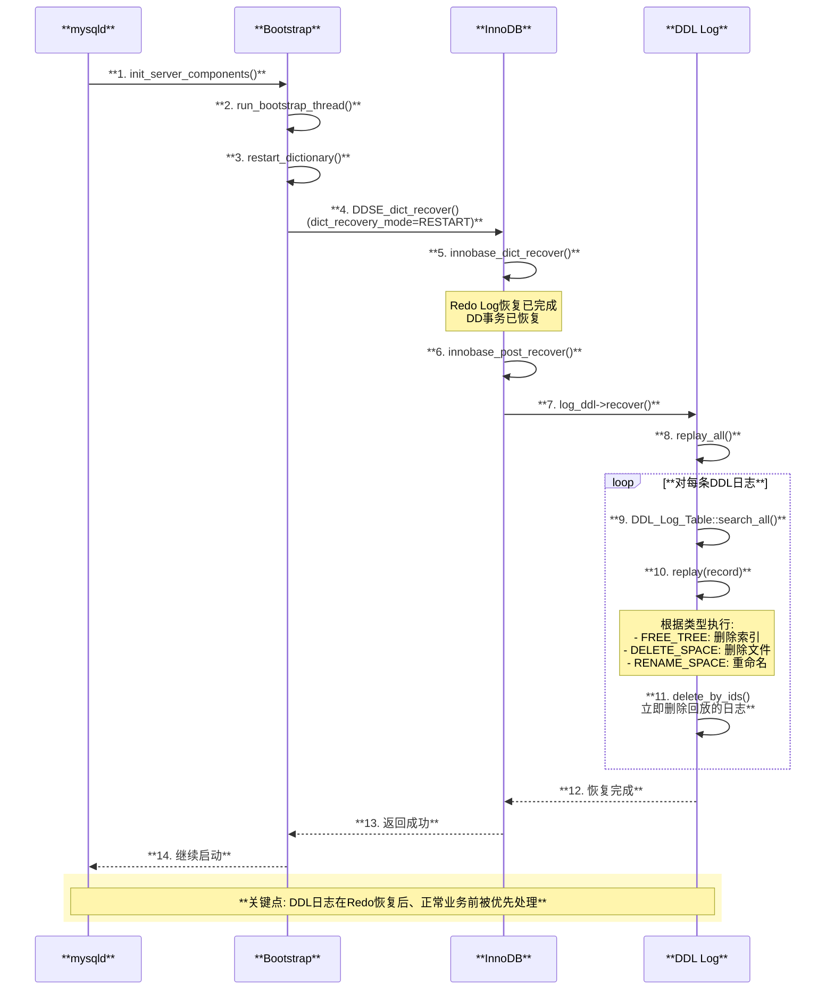

## ALTER TABLE语句 的生命周期

总结：


```text


┏━━━━━━━━━━━━━━━━━━━━━━━━━━━━━━━━━━━━━━━━━━━━━━━━━━━━━━━━━━━━━━━━━━━━━━━━━━━━━━━━━━━━━━━━━━━━━━━━━━━━━━━━━━━━━━━━━━━━━━━━━━━━━━━━━━━━━━━━━━━━━━━━━━┓
┃                              ALTER TABLE 语句完整函数调用链整合图 (Percona Server 8.4.3-3)                                                        ┃
┃                                                                                                                                                  ┃
┃  【DDL类型】 ━━━━━━━━━━━━━━━━━━━━━━━━━━━━━━━━━━━━━━━━━━━━━━━━━━━━━━━━━━━━━━━━━━━━━━━━━━━━━━━━━━━━━━━━━━━━━━━━━━━━━━━━━━━━━━━━━━━━━━━━━━━━━▶ 复杂度  ┃
┃                                                                                                                                                  ┃
┃  ┌────────────────────────┐     ┌────────────────────────┐     ┌────────────────────────┐                                                       ┃
┃  │ INSTANT Algorithm      │ ──▶ │ INPLACE Algorithm      │ ──▶ │ COPY Algorithm         │                                                       ┃
┃  │ (即时DDL)               │     │ (在线DDL)               │     │ (拷贝重建)              │                                                       ┃
┃  │ 最快，只改元数据        │     │ 较快，原地修改          │     │ 最慢，需重建表          │                                                       ┃
┃  └────────────────────────┘     └────────────────────────┘     └────────────────────────┘                                                       ┃
┃                                                                                                                                                  ┃
┗━━━━━━━━━━━━━━━━━━━━━━━━━━━━━━━━━━━━━━━━━━━━━━━━━━━━━━━━━━━━━━━━━━━━━━━━━━━━━━━━━━━━━━━━━━━━━━━━━━━━━━━━━━━━━━━━━━━━━━━━━━━━━━━━━━━━━━━━━━━━━━━━━━┛


╔══════════════════════════════════════════════════════════════════════════════════════════════════════════════════════════════════════════════════╗
║  阶段1: 网络协议解析 (MySQL Protocol Layer)                                                                                                      ║
╠══════════════════════════════════════════════════════════════════════════════════════════════════════════════════════════════════════════════════╣
║                                                                                                                                                  ║
║  客户端发送: [COM_QUERY] + "ALTER TABLE t ADD COLUMN new_col INT"                                                                               ║
║       │                                                                                                                                          ║
║       ▼                                                                                                                                          ║
║  Protocol_classic::read_packet()                              sql/protocol_classic.cc:1408                                                      ║
║       │  【从socket读取数据包到net->read_pos】                                                                                                   ║
║       │                                                                                                                                          ║
║       └──▶ Protocol_classic::get_command()                    sql/protocol_classic.cc:2887                                                      ║
║               │  【解析命令类型: command = net->read_pos[0] = COM_QUERY(0x03)】                                                                  ║
║               │                                                                                                                                  ║
║               └──▶ parse_packet()                             sql/protocol_classic.cc:2834                                                      ║
║                       │  【提取SQL文本】                                                                                                         ║
║                       └── com_data->com_query.query = "ALTER TABLE t ADD COLUMN new_col INT"                                                    ║
║                                                                                                                                                  ║
╚══════════════════════════════════════════════════════════════════════════════════════════════════════════════════════════════════════════════════╝
       │
       ▼
╔══════════════════════════════════════════════════════════════════════════════════════════════════════════════════════════════════════════════════╗
║  阶段2: 命令分发与SQL解析 (Server Layer)                                                                                                         ║
╠══════════════════════════════════════════════════════════════════════════════════════════════════════════════════════════════════════════════════╣
║                                                                                                                                                  ║
║  do_command()                                                 sql/sql_parse.cc:1374                                                             ║
║       │  【THD命令处理入口】                                                                                                                     ║
║       │                                                                                                                                          ║
║       └──▶ dispatch_command()                                 sql/sql_parse.cc:1815                                                             ║
║               │                                                                                                                                  ║
║               └──▶ case COM_QUERY:                            sql/sql_parse.cc:2172                                                             ║
║                       │                                                                                                                          ║
║                       └──▶ dispatch_sql_command()             sql/sql_parse.cc:5521                                                             ║
║                               │  【设置 thd->m_query_string】                                                                                    ║
║                               │                                                                                                                  ║
║                               └──▶ parse_sql()                sql/sql_parse.cc:5555                                                             ║
║                                       │  【Bison语法解析，生成AST】                                                                               ║
║                                       │  【生成 lex->sql_command = SQLCOM_ALTER_TABLE】                                                          ║
║                                       │                                                                                                          ║
║                                       └──▶ mysql_execute_command()           sql/sql_parse.cc:3068                                              ║
║                                               │                                                                                                  ║
║                                               └──▶ case SQLCOM_ALTER_TABLE:  sql/sql_parse.cc:3693                                              ║
║                                                       │                                                                                          ║
║                                                       └──▶ lex->m_sql_cmd->execute()                                                            ║
║                                                               │  【多态调用 Sql_cmd_alter_table::execute()】                                     ║
║                                                               │                                                                                  ║
║                                                               └──▶ Sql_cmd_alter_table::execute()    sql/sql_alter.cc:239                      ║
║                                                                                                                                                  ║
╚══════════════════════════════════════════════════════════════════════════════════════════════════════════════════════════════════════════════════╝
       │
       ▼
╔══════════════════════════════════════════════════════════════════════════════════════════════════════════════════════════════════════════════════╗
║  阶段3: ALTER TABLE执行入口                                                                                                                      ║
╠══════════════════════════════════════════════════════════════════════════════════════════════════════════════════════════════════════════════════╣
║                                                                                                                                                  ║
║  Sql_cmd_alter_table::execute()                               sql/sql_alter.cc:239                                                              ║
║       │  【ALTER TABLE执行入口，权限检查】                                                                                                        ║
║       │                                                                                                                                          ║
║       ├──▶ check_access()                                     【检查ALTER_ACL权限】                                                              ║
║       │                                                                                                                                          ║
║       └──▶ mysql_alter_table()                                sql/sql_table.cc:16886                                                            ║
║               │  【ALTER TABLE主函数】                                                                                                           ║
║               │                                                                                                                                  ║
║               ├──▶ open_tables()                               sql/sql_base.cc:4567                                                             ║
║               │       │  【打开表，获取MDL锁】                                                                                                   ║
║               │       │  【初始MDL锁: MDL_SHARED_UPGRADABLE】                                                                                    ║
║               │                                                                                                                                  ║
║               ├──▶ mysql_prepare_alter_table()                 sql/sql_table.cc:12650                                                           ║
║               │       │  【准备新表结构定义】                                                                                                    ║
║               │       │  【构建Alter_inplace_info结构】                                                                                          ║
║               │                                                                                                                                  ║
║               ├──▶ fill_alter_inplace_info()                   sql/sql_table.cc:13085                                                           ║
║               │       │  【填充HA_ALTER_FLAGS，描述需要执行的变更】                                                                               ║
║               │       │  【设置handler_flags指示需要哪些操作】                                                                                   ║
║               │                                                                                                                                  ║
║               ├──▶ create_table_impl()                         sql/sql_table.cc:7500                                                            ║
║               │       │  【创建临时表(altered_table)用于验证新表结构】                                                                            ║
║               │                                                                                                                                  ║
║               └──▶ 【算法选择分支】                                                                                                              ║
║                       │                                                                                                                          ║
║                       ├──▶ table->file->check_if_supported_inplace_alter()   sql/sql_table.cc:18112                                             ║
║                       │       │  【询问存储引擎是否支持Inplace/Instant】                                                                          ║
║                       │       │  【询问存储引擎是否支持Inplace/Instant】                                                                          ║
║                       │       │                                                                                                                  ║
║                       │       │  返回值决定算法:                                                                                                  ║
║                       │       │  ┌─────────────────────────────────────────────────────────────────────────────────────────────┐                 ║
║                       │       │  │ HA_ALTER_ERROR                    → 错误，无法执行                                          │                 ║
║                       │       │  │ HA_ALTER_INPLACE_NOT_SUPPORTED    → 使用COPY算法                                           │                 ║
║                       │       │  │ HA_ALTER_INPLACE_INSTANT          → 使用INSTANT算法 【最优】                                │                 ║
║                       │       │  │ HA_ALTER_INPLACE_NO_LOCK          → INPLACE，无锁                                          │                 ║
║                       │       │  │ HA_ALTER_INPLACE_SHARED_LOCK      → INPLACE，共享锁                                        │                 ║
║                       │       │  │ HA_ALTER_INPLACE_EXCLUSIVE_LOCK   → INPLACE，排他锁                                        │                 ║
║                       │       │  └─────────────────────────────────────────────────────────────────────────────────────────────┘                 ║
║                       │                                                                                                                          ║
║                       ├──▶ 【INSTANT算法路径】 ─────────────▶ 见阶段4.1                                                                          ║
║                       ├──▶ 【INPLACE算法路径】 ─────────────▶ 见阶段4.2                                                                          ║
║                       └──▶ 【COPY算法路径】   ──────────────▶ 见阶段4.3                                                                          ║
║                                                                                                                                                  ║
╚══════════════════════════════════════════════════════════════════════════════════════════════════════════════════════════════════════════════════╝


┌──────────────────────────────────────────────────────────────────────────────────────────────────────────────────────────────────────────────────┐
│  阶段4.1: INSTANT算法 (即时DDL) - 最快，只修改元数据                                                                                             │
├──────────────────────────────────────────────────────────────────────────────────────────────────────────────────────────────────────────────────┤
│                                                                                                                                                  │
│  【适用场景】: 添加列(末尾)、修改列默认值、修改ENUM/SET、重命名表等                                                                                │
│                                                                                                                                                  │
│  ┏━━━━━━━━━━━━━━━━━━━━━━━━━━━━━━━━━━━━━━━━━━━━━━━━━━━━━━━━━━━━━━━━━━━━━━━━━━━━━━━━━━━━━━━━━━━━━━━━━━━━━━━━━━━━━━━━━━━━━━━━━━━━━━━━━━━━━━━━━━━━┓│
│  ┃ 【INSTANT算法执行流程】                                                                                                                    ┃│
│  ┃                                                                                                                                           ┃│
│  ┃  mysql_inplace_alter_table()                               sql/sql_table.cc:13772                                                        ┃│
│  ┃       │                                                                                                                                   ┃│
│  ┃       ├──▶ 【Phase 1: Prepare - 无操作】                                                                                                  ┃│
│  ┃       │       │  handler::ha_prepare_inplace_alter_table()  【INSTANT时为空操作】                                                         ┃│
│  ┃       │                                                                                                                                   ┃│
│  ┃       ├──▶ 【Phase 2: Alter - 无操作】                                                                                                    ┃│
│  ┃       │       │  handler::ha_inplace_alter_table()          【INSTANT时为空操作】                                                         ┃│
│  ┃       │                                                                                                                                   ┃│
│  ┃       └──▶ 【Phase 3: Commit - 核心操作】                                                                                                 ┃│
│  ┃               │  handler::ha_commit_inplace_alter_table()   sql/handler.cc:5300                                                          ┃│
│  ┃               │                                                                                                                           ┃│
│  ┃               └──▶ ha_innobase::commit_inplace_alter_table()                                                                              ┃│
│  ┃                       │  storage/innobase/handler/handler0alter.cc:9890                                                                  ┃│
│  ┃                       │                                                                                                                   ┃│
│  ┃                       └──▶ commit_instant_ddl()             storage/innobase/handler/handler0alter.cc:5135                               ┃│
│  ┃                               │  【仅修改数据字典元数据】                                                                                  ┃│
│  ┃                               │                                                                                                           ┃│
│  ┃                               ├──▶ dict_table_t修改         【更新内存表定义】                                                            ┃│
│  ┃                               │       │  n_def (列数)                                                                                     ┃│
│  ┃                               │       │  instant_cols (即时添加的列)                                                                       ┃│
│  ┃                               │       │  default values (新列默认值)                                                                      ┃│
│  ┃                               │                                                                                                           ┃│
│  ┃                               └──▶ dd::Table更新            【更新数据字典】                                                              ┃│
│  ┃                                       │  thd->dd_client()->update()                                                                       ┃│
│  ┃                                                                                                                                           ┃│
│  ┃  【特点】: 不需要重建表，不需要复制数据，几乎瞬间完成                                                                                        ┃│
│  ┃  【锁】: 仅在Commit阶段短暂升级到MDL_EXCLUSIVE                                                                                              ┃│
│  ┃                                                                                                                                           ┃│
│  ┗━━━━━━━━━━━━━━━━━━━━━━━━━━━━━━━━━━━━━━━━━━━━━━━━━━━━━━━━━━━━━━━━━━━━━━━━━━━━━━━━━━━━━━━━━━━━━━━━━━━━━━━━━━━━━━━━━━━━━━━━━━━━━━━━━━━━━━━━━━━━┛│
│                                                                                                                                                  │
└──────────────────────────────────────────────────────────────────────────────────────────────────────────────────────────────────────────────────┘


┌──────────────────────────────────────────────────────────────────────────────────────────────────────────────────────────────────────────────────┐
│  阶段4.2: INPLACE算法 (在线DDL) - 原地修改，允许并发DML                                                                                          │
├──────────────────────────────────────────────────────────────────────────────────────────────────────────────────────────────────────────────────┤
│                                                                                                                                                  │
│  【适用场景】: 添加/删除索引、修改列类型(兼容)、添加列(非末尾)等                                                                                   │
│                                                                                                                                                  │
│  ┏━━━━━━━━━━━━━━━━━━━━━━━━━━━━━━━━━━━━━━━━━━━━━━━━━━━━━━━━━━━━━━━━━━━━━━━━━━━━━━━━━━━━━━━━━━━━━━━━━━━━━━━━━━━━━━━━━━━━━━━━━━━━━━━━━━━━━━━━━━━━┓│
│  ┃ 【INPLACE算法三阶段执行流程】                                                                                                               ┃│
│  ┃                                                                                                                                           ┃│
│  ┃  mysql_inplace_alter_table()                               sql/sql_table.cc:13772                                                        ┃│
│  ┃       │                                                                                                                                   ┃│
│  ┃       ├──▶ 【Phase 1: Prepare 准备阶段】                    【需要排他MDL锁】                                                              ┃│
│  ┃       │       │                                                                                                                           ┃│
│  ┃       │       ├──▶ wait_while_table_is_used()               【等待表空闲】                                                                ┃│
│  ┃       │       │                                                                                                                           ┃│
│  ┃       │       └──▶ handler::ha_prepare_inplace_alter_table()                                                                              ┃│
│  ┃       │               │  sql/handler.cc:5172                                                                                              ┃│
│  ┃       │               │                                                                                                                   ┃│
│  ┃       │               └──▶ ha_innobase::prepare_inplace_alter_table()                                                                    ┃│
│  ┃       │                       │  storage/innobase/handler/handler0alter.cc:6060                                                          ┃│
│  ┃       │                       │                                                                                                           ┃│
│  ┃       │                       ├──▶ prepare_inplace_alter_table_dict()                                                                    ┃│
│  ┃       │                       │       │  【创建新索引的数据字典项】                                                                        ┃│
│  ┃       │                       │       │  【设置Online DDL状态】                                                                           ┃│
│  ┃       │                       │                                                                                                           ┃│
│  ┃       │                       └──▶ row_log_allocate()       【分配Online DDL日志缓冲】                                                    ┃│
│  ┃       │                               │  storage/innobase/row/row0log.cc:322                                                             ┃│
│  ┃       │                               │  【用于记录Prepare到Commit期间的DML变更】                                                          ┃│
│  ┃       │                                                                                                                                   ┃│
│  ┃       │       【Prepare完成后，降级MDL锁，允许并发读写】                                                                                    ┃│
│  ┃       │                                                                                                                                   ┃│
│  ┃       ├──▶ 【Phase 2: Alter 执行阶段】                      【允许并发DML】                                                                ┃│
│  ┃       │       │                                                                                                                           ┃│
│  ┃       │       └──▶ handler::ha_inplace_alter_table()        sql/handler.cc:5248                                                          ┃│
│  ┃       │               │                                                                                                                   ┃│
│  ┃       │               └──▶ ha_innobase::inplace_alter_table()                                                                            ┃│
│  ┃       │                       │  storage/innobase/handler/handler0alter.cc:7835                                                          ┃│
│  ┃       │                       │                                                                                                           ┃│
│  ┃       │                       ├──▶ row_merge_build_indexes()    【构建新索引 - 核心操作】                                                 ┃│
│  ┃       │                       │       │  storage/innobase/row/row0merge.cc:4450                                                          ┃│
│  ┃       │                       │       │                                                                                                   ┃│
│  ┃       │                       │       ├──▶ row_merge_read_clustered_index()    【读取聚簇索引全表】                                       ┃│
│  ┃       │                       │       │       │  storage/innobase/row/row0merge.cc:1910                                                  ┃│
│  ┃       │                       │       │       │  【批量读取数据，构建排序缓冲】                                                            ┃│
│  ┃       │                       │       │                                                                                                   ┃│
│  ┃       │                       │       ├──▶ row_merge_sort()                    【外部排序】                                               ┃│
│  ┃       │                       │       │       │  storage/innobase/row/row0merge.cc:2685                                                  ┃│
│  ┃       │                       │       │                                                                                                   ┃│
│  ┃       │                       │       └──▶ row_merge_insert_index_tuples()     【插入索引项】                                             ┃│
│  ┃       │                       │               │  storage/innobase/row/row0merge.cc:3118                                                  ┃│
│  ┃       │                       │                                                                                                           ┃│
│  ┃       │                       └──▶ 【同时: 并发DML被记录到row_log】                                                                       ┃│
│  ┃       │                               │  row_log_online_op()   storage/innobase/row/row0log.cc:905                                       ┃│
│  ┃       │                               │  【INSERT/UPDATE/DELETE都会被记录】                                                               ┃│
│  ┃       │                                                                                                                                   ┃│
│  ┃       └──▶ 【Phase 3: Commit 提交阶段】                     【需要排他MDL锁】                                                              ┃│
│  ┃               │                                                                                                                           ┃│
│  ┃               ├──▶ wait_while_table_is_used()               【等待所有事务结束】                                                          ┃│
│  ┃               │                                                                                                                           ┃│
│  ┃               └──▶ handler::ha_commit_inplace_alter_table()                                                                               ┃│
│  ┃                       │  sql/handler.cc:5300                                                                                              ┃│
│  ┃                       │                                                                                                                   ┃│
│  ┃                       └──▶ ha_innobase::commit_inplace_alter_table()                                                                      ┃│
│  ┃                               │  storage/innobase/handler/handler0alter.cc:9890                                                          ┃│
│  ┃                               │                                                                                                           ┃│
│  ┃                               ├──▶ row_log_apply()          【应用Online DDL日志】                                                        ┃│
│  ┃                               │       │  storage/innobase/row/row0log.cc:3485                                                            ┃│
│  ┃                               │       │  【将Alter期间的DML变更应用到新索引】                                                              ┃│
│  ┃                               │                                                                                                           ┃│
│  ┃                               ├──▶ commit_try_rebuild()     【重命名新表/索引为正式名称】                                                 ┃│
│  ┃                               │       │  storage/innobase/handler/handler0alter.cc:9230                                                  ┃│
│  ┃                               │                                                                                                           ┃│
│  ┃                               └──▶ dd::Table更新            【更新数据字典】                                                              ┃│
│  ┃                                                                                                                                           ┃│
│  ┗━━━━━━━━━━━━━━━━━━━━━━━━━━━━━━━━━━━━━━━━━━━━━━━━━━━━━━━━━━━━━━━━━━━━━━━━━━━━━━━━━━━━━━━━━━━━━━━━━━━━━━━━━━━━━━━━━━━━━━━━━━━━━━━━━━━━━━━━━━━━┛│
│                                                                                                                                                  │
└──────────────────────────────────────────────────────────────────────────────────────────────────────────────────────────────────────────────────┘


┌──────────────────────────────────────────────────────────────────────────────────────────────────────────────────────────────────────────────────┐
│  阶段4.3: COPY算法 (拷贝重建) - 最慢，需要完全重建表                                                                                             │
├──────────────────────────────────────────────────────────────────────────────────────────────────────────────────────────────────────────────────┤
│                                                                                                                                                  │
│  【适用场景】: 修改列类型(不兼容)、修改字符集、改变存储引擎等                                                                                       │
│                                                                                                                                                  │
│  ┏━━━━━━━━━━━━━━━━━━━━━━━━━━━━━━━━━━━━━━━━━━━━━━━━━━━━━━━━━━━━━━━━━━━━━━━━━━━━━━━━━━━━━━━━━━━━━━━━━━━━━━━━━━━━━━━━━━━━━━━━━━━━━━━━━━━━━━━━━━━━┓│
│  ┃ 【COPY算法执行流程】                                                                                                                       ┃│
│  ┃                                                                                                                                           ┃│
│  ┃  mysql_alter_table()                                       sql/sql_table.cc:16886                                                        ┃│
│  ┃       │  【当INPLACE不支持时，进入COPY路径】                                                                                               ┃│
│  ┃       │                                                                                                                                   ┃│
│  ┃       └──▶ copy_data_between_tables()                      sql/sql_table.cc:18980                                                        ┃│
│  ┃               │  【表数据拷贝主函数】                                                                                                      ┃│
│  ┃               │                                                                                                                           ┃│
│  ┃               ├──▶ 【创建临时表】                                                                                                         ┃│
│  ┃               │       │  create_table_impl()                sql/sql_table.cc:7500                                                        ┃│
│  ┃               │       │  【使用新表结构创建 #sql-xxx 临时表】                                                                              ┃│
│  ┃               │                                                                                                                           ┃│
│  ┃               ├──▶ 【数据复制循环】                                                                                                       ┃│
│  ┃               │       │                                                                                                                   ┃│
│  ┃               │       │  while (iterator->Read() == 0) {                                                                                 ┃│
│  ┃               │       │      │                                                                                                            ┃│
│  ┃               │       │      ├──▶ 【从旧表读取一行】                                                                                      ┃│
│  ┃               │       │      │       from->file->ha_rnd_next()                                                                           ┃│
│  ┃               │       │      │                                                                                                            ┃│
│  ┃               │       │      ├──▶ 【转换行数据】                                                                                          ┃│
│  ┃               │       │      │       copy_data() / evaluate functions                                                                    ┃│
│  ┃               │       │      │                                                                                                            ┃│
│  ┃               │       │      └──▶ 【写入新表】                                                                                            ┃│
│  ┃               │       │              to->file->ha_write_row()                                                                            ┃│
│  ┃               │       │  }                                                                                                                ┃│
│  ┃               │       │                                                                                                                   ┃│
│  ┃               │       │  【此过程持有排他锁，阻塞所有DML】                                                                                  ┃│
│  ┃               │                                                                                                                           ┃│
│  ┃               ├──▶ 【交换表】                                                                                                             ┃│
│  ┃               │       │  mysql_rename_table()               sql/sql_table.cc:8165                                                        ┃│
│  ┃               │       │  【原表 → #sql-backup, 新表 → 原表名】                                                                            ┃│
│  ┃               │                                                                                                                           ┃│
│  ┃               └──▶ 【删除旧表】                                                                                                           ┃│
│  ┃                       │  mysql_rm_table_no_locks()          sql/sql_table.cc:2380                                                        ┃│
│  ┃                       │  【删除备份的旧表】                                                                                                ┃│
│  ┃                                                                                                                                           ┃│
│  ┃  【缺点】: 执行期间表不可写，大表耗时很长，消耗大量磁盘空间                                                                                  ┃│
│  ┃                                                                                                                                           ┃│
│  ┗━━━━━━━━━━━━━━━━━━━━━━━━━━━━━━━━━━━━━━━━━━━━━━━━━━━━━━━━━━━━━━━━━━━━━━━━━━━━━━━━━━━━━━━━━━━━━━━━━━━━━━━━━━━━━━━━━━━━━━━━━━━━━━━━━━━━━━━━━━━━┛│
│                                                                                                                                                  │
└──────────────────────────────────────────────────────────────────────────────────────────────────────────────────────────────────────────────────┘
       │
       ▼
╔══════════════════════════════════════════════════════════════════════════════════════════════════════════════════════════════════════════════════╗
║  阶段5: DDL日志与原子性保证                                                                                                                      ║
╠══════════════════════════════════════════════════════════════════════════════════════════════════════════════════════════════════════════════════╣
║                                                                                                                                                  ║
║  【MySQL 8.0 Atomic DDL】: DDL操作是原子的，要么完全成功，要么完全回滚                                                                            ║
║                                                                                                                                                  ║
║  ┏━━━━━━━━━━━━━━━━━━━━━━━━━━━━━━━━━━━━━━━━━━━━━━━━━━━━━━━━━━━━━━━━━━━━━━━━━━━━━━━━━━━━━━━━━━━━━━━━━━━━━━━━━━━━━━━━━━━━━━━━━━━━━━━━━━━━━━━━━━━━┓║
║  ┃ 【DDL Log机制】                                                                                                                            ┃║
║  ┃                                                                                                                                           ┃║
║  ┃  mysql.innodb_ddl_log表                                    【持久化DDL操作步骤】                                                          ┃║
║  ┃       │                                                                                                                                   ┃║
║  ┃       ├──▶ 记录删除文件操作                                                                                                               ┃║
║  ┃       ├──▶ 记录重命名文件操作                                                                                                             ┃║
║  ┃       └──▶ 记录删除索引操作                                                                                                               ┃║
║  ┃                                                                                                                                           ┃║
║  ┃  【崩溃恢复】                                                                                                                              ┃║
║  ┃  ha_recover() → innodb_post_recover() → replay_ddl_log()                                                                                  ┃║
║  ┃       │  【重放未完成的DDL操作，保证原子性】                                                                                                ┃║
║  ┃                                                                                                                                           ┃║
║  ┗━━━━━━━━━━━━━━━━━━━━━━━━━━━━━━━━━━━━━━━━━━━━━━━━━━━━━━━━━━━━━━━━━━━━━━━━━━━━━━━━━━━━━━━━━━━━━━━━━━━━━━━━━━━━━━━━━━━━━━━━━━━━━━━━━━━━━━━━━━━━┛║
║                                                                                                                                                  ║
╚══════════════════════════════════════════════════════════════════════════════════════════════════════════════════════════════════════════════════╝
       │
       ▼
╔══════════════════════════════════════════════════════════════════════════════════════════════════════════════════════════════════════════════════╗
║  阶段6: Binlog记录 (DDL语句记录)                                                                                                                 ║
╠══════════════════════════════════════════════════════════════════════════════════════════════════════════════════════════════════════════════════╣
║                                                                                                                                                  ║
║  【DDL的Binlog与DML不同，使用Statement格式】                                                                                                     ║
║                                                                                                                                                  ║
║  write_bin_log()                                              sql/sql_table.cc:17850                                                            ║
║       │                                                                                                                                          ║
║       └──▶ Query_log_event                                    sql/binlog.cc                                                                     ║
║               │                                                                                                                                  ║
║               │  ┏━━━━━━━━━━━━━━━━━━━━━━━━━━━━━━━━━━━━━━━━━━━━━━━━━━━━━━━━━━━━━━━━━━━━━━━━━━━━━━━━━━━━━━━━━━━━━━━━━━━━━━━━━━━━━━━━━━━━━━━━━━━┓  ║
║               │  ┃ 【DDL Binlog Event】                                                                                                       ┃  ║
║               │  ┃                                                                                                                            ┃  ║
║               │  ┃  ┌────────────────┬────────────────┬─────────────────────────────────────────────────┐                                    ┃  ║
║               │  ┃  │ 字段            │ 大小            │ 内容                                            │                                    ┃  ║
║               │  ┃  ├────────────────┼────────────────┼─────────────────────────────────────────────────┤                                    ┃  ║
║               │  ┃  │ event_type     │ 1字节           │ QUERY_EVENT (2)                                 │                                    ┃  ║
║               │  ┃  ├────────────────┼────────────────┼─────────────────────────────────────────────────┤                                    ┃  ║
║               │  ┃  │ query          │ 可变            │ "ALTER TABLE t ADD COLUMN new_col INT"          │                                    ┃  ║
║               │  ┃  └────────────────┴────────────────┴─────────────────────────────────────────────────┘                                    ┃  ║
║               │  ┃                                                                                                                            ┃  ║
║               │  ┃  【注意】: DDL使用Statement格式，不使用Row格式                                                                               ┃  ║
║               │  ┃                                                                                                                            ┃  ║
║               │  ┗━━━━━━━━━━━━━━━━━━━━━━━━━━━━━━━━━━━━━━━━━━━━━━━━━━━━━━━━━━━━━━━━━━━━━━━━━━━━━━━━━━━━━━━━━━━━━━━━━━━━━━━━━━━━━━━━━━━━━━━━━━━┛  ║
║                                                                                                                                                  ║
╚══════════════════════════════════════════════════════════════════════════════════════════════════════════════════════════════════════════════════╝
       │
       ▼
┏━━━━━━━━━━━━━━━━━━━━━━━━━━━━━━━━━━━━━━━━━━━━━━━━━━━━━━━━━━━━━━━━━━━━━━━━━━━━━━━━━━━━━━━━━━━━━━━━━━━━━━━━━━━━━━━━━━━━━━━━━━━━━━━━━━━━━━━━━━━━━━━━━━┓
┃                                         ALTER TABLE执行完成 - 返回客户端OK                                                                        ┃
┗━━━━━━━━━━━━━━━━━━━━━━━━━━━━━━━━━━━━━━━━━━━━━━━━━━━━━━━━━━━━━━━━━━━━━━━━━━━━━━━━━━━━━━━━━━━━━━━━━━━━━━━━━━━━━━━━━━━━━━━━━━━━━━━━━━━━━━━━━━━━━━━━━━┛


┌──────────────────────────────────────────────────────────────────────────────────────────────────────────────────────────────────────────────────┐
│                                        【三种ALTER TABLE算法对比】                                                                                │
├──────────────────────────────────────────────────────────────────────────────────────────────────────────────────────────────────────────────────┤
│                                                                                                                                                  │
│  ┌──────────────────────┬─────────────────────────────┬──────────────────────────────┬──────────────────────────────────────┐                  │
│  │ 特性                  │ INSTANT                      │ INPLACE                       │ COPY                                │                  │
│  ├──────────────────────┼─────────────────────────────┼──────────────────────────────┼──────────────────────────────────────┤                  │
│  │ **执行速度**          │ ⚡ 极快(毫秒级)               │ 🔵 较快(取决于数据量)          │ 🔴 慢(需复制全表)                    │                  │
│  ├──────────────────────┼─────────────────────────────┼──────────────────────────────┼──────────────────────────────────────┤                  │
│  │ **重建表**            │ ❌ 否                        │ ⚠️ 部分需要                    │ ✅ 是(完全重建)                      │                  │
│  ├──────────────────────┼─────────────────────────────┼──────────────────────────────┼──────────────────────────────────────┤                  │
│  │ **并发DML**           │ ✅ 完全允许                   │ ✅ 大部分时间允许              │ ❌ 完全阻塞                          │                  │
│  ├──────────────────────┼─────────────────────────────┼──────────────────────────────┼──────────────────────────────────────┤                  │
│  │ **磁盘空间**          │ ✅ 几乎不需要                 │ ⚠️ 需要部分额外空间            │ ❌ 需要近2倍表空间                   │                  │
│  ├──────────────────────┼─────────────────────────────┼──────────────────────────────┼──────────────────────────────────────┤                  │
│  │ **MDL锁**             │ SU → 短暂X                   │ SU → 短暂X(首尾阶段)          │ 长时间X锁                            │                  │
│  ├──────────────────────┼─────────────────────────────┼──────────────────────────────┼──────────────────────────────────────┤                  │
│  │ **适用操作**          │ 添加列(末尾)、改默认值、      │ 添加/删除索引、添加列(非末尾)、│ 修改列类型(不兼容)、改字符集、        │                  │
│  │                      │ 改ENUM/SET、重命名表          │ 修改列类型(兼容)等             │ 改存储引擎等                         │                  │
│  └──────────────────────┴─────────────────────────────┴──────────────────────────────┴──────────────────────────────────────┘                  │
│                                                                                                                                                  │
└──────────────────────────────────────────────────────────────────────────────────────────────────────────────────────────────────────────────────┘


┌──────────────────────────────────────────────────────────────────────────────────────────────────────────────────────────────────────────────────┐
│                                        【ALTER TABLE与DML的关键差异】                                                                             │
├──────────────────────────────────────────────────────────────────────────────────────────────────────────────────────────────────────────────────┤
│                                                                                                                                                  │
│  ┌──────────────────────┬─────────────────────────────────────────────────────┬──────────────────────────────────────────────────────────────┐  │
│  │ 对比项                │ DML (INSERT/UPDATE/DELETE)                          │ DDL (ALTER TABLE)                                            │  │
│  ├──────────────────────┼─────────────────────────────────────────────────────┼──────────────────────────────────────────────────────────────┤  │
│  │ **事务模型**          │ 支持用户事务控制(BEGIN/COMMIT/ROLLBACK)             │ 隐式提交(implicit commit)，独立事务                         │  │
│  ├──────────────────────┼─────────────────────────────────────────────────────┼──────────────────────────────────────────────────────────────┤  │
│  │ **锁机制**            │ 行锁为主                                            │ MDL元数据锁为主                                              │  │
│  ├──────────────────────┼─────────────────────────────────────────────────────┼──────────────────────────────────────────────────────────────┤  │
│  │ **Binlog格式**        │ ROW格式(记录行变化)                                 │ Statement格式(记录原始SQL)                                   │  │
│  ├──────────────────────┼─────────────────────────────────────────────────────┼──────────────────────────────────────────────────────────────┤  │
│  │ **Undo Log**          │ 需要Undo支持MVCC和回滚                              │ 通过DDL Log实现原子性                                        │  │
│  ├──────────────────────┼─────────────────────────────────────────────────────┼──────────────────────────────────────────────────────────────┤  │
│  │ **操作对象**          │ 表数据(行)                                          │ 表结构(元数据)                                               │  │
│  └──────────────────────┴─────────────────────────────────────────────────────┴──────────────────────────────────────────────────────────────┘  │
│                                                                                                                                                  │
└──────────────────────────────────────────────────────────────────────────────────────────────────────────────────────────────────────────────────┘


### 关键函数速查表

| 阶段 | 函数名 | 文件路径 | 行号 | 功能说明 |
|:-----|:-------|:---------|:-----|:---------|
| **命令分发** | `mysql_execute_command()` | sql/sql_parse.cc | 3068 | SQL执行入口 |
| **ALTER入口** | `Sql_cmd_alter_table::execute()` | sql/sql_alter.cc | 239 | ALTER TABLE执行入口 |
| | `mysql_alter_table()` | sql/sql_table.cc | 16886 | ALTER TABLE主函数 |
| | `mysql_prepare_alter_table()` | sql/sql_table.cc | 12650 | 准备新表结构 |
| | `fill_alter_inplace_info()` | sql/sql_table.cc | 13085 | 填充变更信息 |
| **算法选择** | `handler::check_if_supported_inplace_alter()` | sql/handler.h | 6520 | 检查是否支持INPLACE |
| | `ha_innobase::check_if_supported_inplace_alter()` | storage/innobase/handler/handler0alter.cc | 1030 | InnoDB检查 |
| **INSTANT** | `mysql_inplace_alter_table()` | sql/sql_table.cc | 13772 | INSTANT/INPLACE入口 |
| | `commit_instant_ddl()` | storage/innobase/handler/handler0alter.cc | 5135 | INSTANT提交 |
| **INPLACE** | `ha_prepare_inplace_alter_table()` | sql/handler.cc | 5172 | 准备阶段 |
| | `ha_inplace_alter_table()` | sql/handler.cc | 5248 | 执行阶段 |
| | `ha_commit_inplace_alter_table()` | sql/handler.cc | 5300 | 提交阶段 |
| | `row_merge_build_indexes()` | storage/innobase/row/row0merge.cc | 4450 | 构建索引 |
| | `row_log_allocate()` | storage/innobase/row/row0log.cc | 322 | 分配DDL日志 |
| | `row_log_apply()` | storage/innobase/row/row0log.cc | 3485 | 应用DDL日志 |
| **COPY** | `copy_data_between_tables()` | sql/sql_table.cc | 18980 | 复制表数据 |
| **Binlog** | `write_bin_log()` | sql/sql_table.cc | 17850 | 写入DDL到Binlog |

---

```

---

## DDL事务故障恢复详解

### 概述

MySQL 8.0 引入了 **Atomic DDL** 机制，通过 `mysql.innodb_ddl_log` 表记录DDL操作的步骤，确保DDL要么完全成功，要么完全回滚。在服务器崩溃恢复时，**DDL日志会被优先回放**，保证数据一致性。

### DDL故障恢复调用链

```text
╔════════════════════════════════════════════════════════════════════════════════════════════════════════════════════════════════════════════════╗
║  DDL 故障恢复完整调用链 (MySQL Server Startup → DDL Log Recovery)                                                                               ║
╠════════════════════════════════════════════════════════════════════════════════════════════════════════════════════════════════════════════════╣
║                                                                                                                                                ║
║  mysqld::main()                                                        sql/main.cc                                                            ║
║       │  【MySQL Server 启动入口】                                                                                                              ║
║       │                                                                                                                                        ║
║       └──▶ mysqld_main()                                               sql/mysqld.cc                                                          ║
║               │  【MySQL主函数】                                                                                                                ║
║               │                                                                                                                                ║
║               └──▶ init_server_components()                            sql/mysqld.cc:5825                                                     ║
║                       │  【初始化服务器组件】                                                                                                    ║
║                       │                                                                                                                        ║
║                       └──▶ dd::bootstrap::run_bootstrap_thread()       sql/dd/impl/bootstrap/bootstrapper.cc                                  ║
║                               │  【数据字典初始化线程】                                                                                          ║
║                               │                                                                                                                ║
║                               └──▶ restart_dictionary()                sql/dd/impl/bootstrap/bootstrapper.cc:976                              ║
║                                       │  【重启时的数据字典恢复】                                                                                ║
║                                       │                                                                                                        ║
║                                       ├──▶ DDSE_dict_init()            【数据字典存储引擎初始化】                                               ║
║                                       │       │  sql/dd/impl/bootstrap/bootstrapper.cc:982                                                    ║
║                                       │                                                                                                        ║
║                                       └──▶ DDSE_dict_recover()         sql/dd/impl/bootstrap/bootstrapper.cc:1018                             ║
║                                               │  【调用存储引擎的恢复函数】                                                                      ║
║                                               │                                                                                                ║
║                                               └──▶ ddse->dict_recover()                                                                        ║
║                                                       │  【多态调用，InnoDB: innobase_dict_recover】                                            ║
║                                                       │  storage/innobase/handler/ha_innodb.cc:4280                                            ║
║                                                       │                                                                                        ║
║                                                       └──▶ innobase_post_recover()     ★ DDL恢复入口                                          ║
║                                                               │  storage/innobase/handler/ha_innodb.cc:4343                                   ║
║                                                               │  【DDL崩溃恢复的关键入口点】                                                    ║
║                                                               │                                                                                ║
║                                                               └──▶ log_ddl->recover()                                                          ║
║                                                                       │  storage/innobase/log/log0ddl.cc:1980                                 ║
║                                                                       │                                                                        ║
║                                                                       └──▶ 【DDL日志恢复详细流程】见下图                                        ║
║                                                                                                                                                ║
╚════════════════════════════════════════════════════════════════════════════════════════════════════════════════════════════════════════════════╝
```

### DDL Log 恢复详细调用链

```text
Log_DDL::recover() - storage/innobase/log/log0ddl.cc:1980
│  【DDL日志恢复主入口】
│  【重要：在Redo Log恢复完成后，DD事务恢复后才执行】
│
├── 设置恢复标志
│   └── s_in_recovery = true
│   └── thread_local_ddl_log_replay = true
│
├── 扫描DDL日志表
│   └── replay_all() - storage/innobase/log/log0ddl.cc:1474
│       │
│       ├── DDL_Log_Table::search_all() - storage/innobase/log/log0ddl.cc:727
│       │   │  【从mysql.innodb_ddl_log表读取所有记录】
│       │   │
│       │   ├── 打开innodb_ddl_log表
│       │   │   └── dd_table_open_on_name() 
│       │   │
│       │   ├── 创建索引游标
│       │   │   └── btr_pcur_open_at_index_side()
│       │   │
│       │   └── 遍历所有记录
│       │       └── btr_pcur_move_to_next_user_rec()
│       │           └── convert_to_ddl_record()  【转换为DDL_Record对象】
│       │
│       └── 对每条记录执行replay
│           └── for (auto record : records) { replay(*record); }
│
├── 回放每条DDL日志
│   └── replay(DDL_Record &record) - storage/innobase/log/log0ddl.cc:1612
│       │
│       │  ┌───────────────────────────────────────────────────────────────────────────────────────────────┐
│       │  │ DDL Log 类型及回放操作                                                                         │
│       │  ├───────────────────────────┬───────────────────────────────────────────────────────────────────┤
│       │  │ Log_Type                   │ 回放函数                                                          │
│       │  ├───────────────────────────┼───────────────────────────────────────────────────────────────────┤
│       │  │ FREE_TREE_LOG             │ replay_free_tree_log() - 释放B+树索引                              │
│       │  │                           │   └── btr_free_if_exists() 删除索引树                             │
│       │  ├───────────────────────────┼───────────────────────────────────────────────────────────────────┤
│       │  │ DELETE_SPACE_LOG          │ replay_delete_space_log() - 删除表空间文件                        │
│       │  │                           │   └── fil_delete_tablespace() 删除.ibd文件                        │
│       │  ├───────────────────────────┼───────────────────────────────────────────────────────────────────┤
│       │  │ RENAME_SPACE_LOG          │ replay_rename_space_log() - 重命名表空间文件                      │
│       │  │                           │   └── fil_rename_tablespace() 重命名.ibd文件                      │
│       │  ├───────────────────────────┼───────────────────────────────────────────────────────────────────┤
│       │  │ DROP_LOG                  │ replay_drop_log() - 删除表元数据                                  │
│       │  │                           │   └── dict_persist->table_buffer->remove()                        │
│       │  ├───────────────────────────┼───────────────────────────────────────────────────────────────────┤
│       │  │ RENAME_TABLE_LOG          │ replay_rename_table_log() - 重命名表                              │
│       │  │                           │   └── row_rename_table_for_mysql()                                 │
│       │  ├───────────────────────────┼───────────────────────────────────────────────────────────────────┤
│       │  │ REMOVE_CACHE_LOG          │ replay_remove_cache_log() - 从缓存移除表                          │
│       │  │                           │   └── dict_table_remove_from_cache()                               │
│       │  ├───────────────────────────┼───────────────────────────────────────────────────────────────────┤
│       │  │ ALTER_ENCRYPT_TABLESPACE  │ replay_alter_encrypt_space_log() - 恢复加密操作                   │
│       │  │ ALTER_UNENCRYPT_TABLESPACE│   └── 记录到ts_encrypt_ddl_records供后续处理                       │
│       │  └───────────────────────────┴───────────────────────────────────────────────────────────────────┘
│       │
│       └── switch (record.get_type()) {
│               case Log_Type::FREE_TREE_LOG:
│                   replay_free_tree_log(record.get_space_id(), 
│                                        record.get_page_no(),
│                                        record.get_index_id());
│                   break;
│               case Log_Type::DELETE_SPACE_LOG:
│                   replay_delete_space_log(record.get_space_id(),
│                                          record.get_old_file_path());
│                   break;
│               ... // 其他类型
│           }
│
├── 立即删除已回放的日志
│   └── delete_by_ids(current_records) - storage/innobase/log/log0ddl.cc:1553
│       │  【重要：每回放一条立即删除，保证幂等性】
│       │  【如果回放完但删除前崩溃，重启后会再次回放，但单条回放是幂等的】
│       │
│       └── DDL_Log_Table::remove(id)
│           └── row_delete_for_mysql()  【从innodb_ddl_log表删除】
│
└── 清理恢复标志
    └── s_in_recovery = false
    └── thread_local_ddl_log_replay = false
```

### DDL_Record 数据结构

```text
DDL_Record 类结构 - storage/innobase/include/log0ddl.h:77
│
├── 核心字段
│   │
│   │  ┌─────────────────┬─────────────────┬──────────────────────────────────────────────────────────┐
│   │  │ 字段             │ 类型             │ 说明                                                      │
│   │  ├─────────────────┼─────────────────┼──────────────────────────────────────────────────────────┤
│   │  │ m_id            │ ulint           │ DDL日志记录ID(自增)                                        │
│   │  ├─────────────────┼─────────────────┼──────────────────────────────────────────────────────────┤
│   │  │ m_type          │ Log_Type        │ DDL日志类型(枚举)                                          │
│   │  ├─────────────────┼─────────────────┼──────────────────────────────────────────────────────────┤
│   │  │ m_thread_id     │ ulint           │ 执行DDL的线程ID                                            │
│   │  ├─────────────────┼─────────────────┼──────────────────────────────────────────────────────────┤
│   │  │ m_space_id      │ space_id_t      │ 表空间ID                                                   │
│   │  ├─────────────────┼─────────────────┼──────────────────────────────────────────────────────────┤
│   │  │ m_page_no       │ page_no_t       │ 索引根页号(FREE_TREE_LOG使用)                              │
│   │  ├─────────────────┼─────────────────┼──────────────────────────────────────────────────────────┤
│   │  │ m_index_id      │ ulint           │ 索引ID(FREE_TREE_LOG使用)                                  │
│   │  ├─────────────────┼─────────────────┼──────────────────────────────────────────────────────────┤
│   │  │ m_table_id      │ table_id_t      │ 表ID(DROP_LOG使用)                                         │
│   │  ├─────────────────┼─────────────────┼──────────────────────────────────────────────────────────┤
│   │  │ m_old_file_path │ char*           │ 旧文件路径(RENAME/DELETE使用)                              │
│   │  ├─────────────────┼─────────────────┼──────────────────────────────────────────────────────────┤
│   │  │ m_new_file_path │ char*           │ 新文件路径(RENAME使用)                                     │
│   │  ├─────────────────┼─────────────────┼──────────────────────────────────────────────────────────┤
│   │  │ m_deletable     │ bool            │ 是否可以删除(加密操作需等待完成)                           │
│   │  └─────────────────┴─────────────────┴──────────────────────────────────────────────────────────┘
│
└── mysql.innodb_ddl_log 表结构
    │
    │  CREATE TABLE mysql.innodb_ddl_log (
    │      id           BIGINT UNSIGNED NOT NULL,     -- 自增ID
    │      thread_id    BIGINT UNSIGNED NOT NULL,     -- 线程ID  
    │      type         INT UNSIGNED NOT NULL,        -- DDL Log类型
    │      space_id     INT UNSIGNED,                 -- 表空间ID
    │      page_no      INT UNSIGNED,                 -- 页号
    │      index_id     BIGINT UNSIGNED,              -- 索引ID
    │      table_id     BIGINT UNSIGNED,              -- 表ID
    │      old_file_path VARCHAR(512),                -- 旧文件路径
    │      new_file_path VARCHAR(512),                -- 新文件路径
    │      PRIMARY KEY (id),
    │      KEY (thread_id)
    │  ) ENGINE=InnoDB;
```

### DDL Log 写入时机

```text
DDL Log 在 DDL 执行过程中的写入时机 - storage/innobase/log/log0ddl.cc
│
├── 场景1: DROP TABLE
│   │
│   │  mysql_rm_table_no_locks() → drop_table_impl() → ha_innobase::delete_table()
│   │                                                       │
│   │                                                       ├── Log_DDL::write_free_tree_log()     【记录删除索引】
│   │                                                       │   └── insert_free_tree_log()
│   │                                                       │       └── DDL_Log_Table::insert(FREE_TREE_LOG)
│   │                                                       │
│   │                                                       ├── Log_DDL::write_delete_space_log()  【记录删除表空间】
│   │                                                       │   └── insert_delete_space_log()
│   │                                                       │       └── DDL_Log_Table::insert(DELETE_SPACE_LOG)
│   │                                                       │
│   │                                                       └── Log_DDL::write_drop_log()          【记录删除元数据】
│   │                                                           └── insert_drop_log()
│   │                                                               └── DDL_Log_Table::insert(DROP_LOG)
│   │
│   │  【DDL提交后的处理】
│   │  trans_commit() → ha_innobase::external_lock() → log_ddl->post_ddl()
│   │       │
│   │       └── replay_by_thread_id()  【回放当前线程的DDL日志，执行实际的文件删除】
│   │           └── replay(record)
│   │           └── delete_by_ids()    【删除已回放的日志记录】
│
├── 场景2: RENAME TABLE  
│   │
│   │  mysql_rename_table() → ha_innobase::rename_table()
│   │       │
│   │       └── Log_DDL::write_rename_space_log()          【先记录逆向操作】
│   │           │  【记录的是从new_name到old_name的重命名】
│   │           │  【这样崩溃时回放可以撤销重命名】
│   │           │
│   │           └── insert_rename_space_log()
│   │               └── DDL_Log_Table::insert(RENAME_SPACE_LOG)
│   │
│   │  【提交后回放并删除日志】
│   │  log_ddl->post_ddl()
│
└── 场景3: CREATE INDEX (INPLACE DDL)
    │
    │  ha_innobase::commit_inplace_alter_table()
    │       │
    │       ├── commit_try_rebuild() / commit_try_norebuild()
    │       │       │
    │       │       └── Log_DDL::write_free_tree_log()   【记录删除旧索引(如果是rebuild)】
    │       │
    │       └── 【成功提交后】
    │           └── log_ddl->post_ddl()  【清理DDL日志】
```

### 故障恢复时序图



### 原子性保证机制

```text
┌──────────────────────────────────────────────────────────────────────────────────────────────────────────────┐
│                                  DDL 原子性保证的核心设计                                                      │
├──────────────────────────────────────────────────────────────────────────────────────────────────────────────┤
│                                                                                                              │
│  【设计原则】                                                                                                 │
│  1. DDL操作分解为多个步骤,每个步骤的逆操作被预先记录到innodb_ddl_log                                            │
│  2. DDL日志与数据字典(DD)更新在同一个事务中                                                                     │
│  3. 崩溃恢复时,如果DD事务未提交,回放DDL日志撤销已执行的物理操作                                                   │
│  4. 如果DD事务已提交,post_ddl()清理DDL日志                                                                     │
│                                                                                                              │
│  【执行时序】                                                                                                 │
│                                                                                                              │
│   DDL开始                                                                                                    │
│       │                                                                                                      │
│       ├─── 1. 记录DDL Log (逆操作) ─────────────────────────────────────────────────────────────────────────▶│
│       │         write_free_tree_log()      【记录: 如果崩溃,删除新建的索引】                                  │
│       │         write_delete_space_log()   【记录: 如果崩溃,删除新建的表空间】                                │
│       │         write_rename_space_log()   【记录: 如果崩溃,重命名回原名】                                    │
│       │                                                                                                      │
│       ├─── 2. 执行DDL物理操作 ──────────────────────────────────────────────────────────────────────────────▶│
│       │         创建索引、表空间、重命名文件等                                                                  │
│       │                                                                                                      │
│       ├─── 3. 更新数据字典(DD) ─────────────────────────────────────────────────────────────────────────────▶│
│       │         dd::Table更新                                                                                │
│       │                                                                                                      │
│       ├─── 4. 提交事务 ─────────────────────────────────────────────────────────────────────────────────────▶│
│       │         trx_commit() + DD commit                                                                     │
│       │                 │                                                                                    │
│       │                 └──▶ 【崩溃点分析】                                                                   │
│       │                      ┌─────────────────────────────────────────────────────────────────────────────┐│
│       │                      │ 提交前崩溃:                                                                   ││
│       │                      │   - DD事务回滚                                                                ││
│       │                      │   - DDL日志仍在                                                               ││
│       │                      │   - 恢复时回放DDL日志,撤销物理操作                                             ││
│       │                      ├─────────────────────────────────────────────────────────────────────────────┤│
│       │                      │ 提交后崩溃:                                                                   ││
│       │                      │   - DD事务已持久化                                                            ││
│       │                      │   - DDL日志也已持久化                                                         ││
│       │                      │   - 恢复时post_ddl清理DDL日志(正常流程)                                        ││
│       │                      └─────────────────────────────────────────────────────────────────────────────┘│
│       │                                                                                                      │
│       └─── 5. post_ddl() 清理DDL日志 ───────────────────────────────────────────────────────────────────────▶│
│                 replay_by_thread_id() + delete_by_ids()                                                      │
│                                                                                                              │
└──────────────────────────────────────────────────────────────────────────────────────────────────────────────┘
```

### 关键函数速查表（DDL恢复相关）

| 阶段 | 函数名 | 文件路径 | 行号 | 功能说明 |
|:-----|:-------|:---------|:-----|:---------|
| **启动入口** | `innobase_post_recover()` | storage/innobase/handler/ha_innodb.cc | 4343 | DDL恢复入口 |
| **恢复主函数** | `Log_DDL::recover()` | storage/innobase/log/log0ddl.cc | 1980 | DDL日志恢复主函数 |
| | `Log_DDL::replay_all()` | storage/innobase/log/log0ddl.cc | 1474 | 回放所有DDL日志 |
| | `Log_DDL::replay()` | storage/innobase/log/log0ddl.cc | 1612 | 回放单条DDL日志 |
| **日志类型回放** | `replay_free_tree_log()` | storage/innobase/log/log0ddl.cc | 1661 | 释放B+树 |
| | `replay_delete_space_log()` | storage/innobase/log/log0ddl.cc | 1700 | 删除表空间 |
| | `replay_rename_space_log()` | storage/innobase/log/log0ddl.cc | 1750 | 重命名表空间 |
| | `replay_drop_log()` | storage/innobase/log/log0ddl.cc | 1842 | 删除元数据 |
| **日志写入** | `Log_DDL::write_free_tree_log()` | storage/innobase/log/log0ddl.cc | 885 | 写入FREE_TREE日志 |
| | `Log_DDL::write_delete_space_log()` | storage/innobase/log/log0ddl.cc | 967 | 写入DELETE_SPACE日志 |
| | `Log_DDL::write_rename_space_log()` | storage/innobase/log/log0ddl.cc | 1065 | 写入RENAME_SPACE日志 |
| **事后处理** | `Log_DDL::post_ddl()` | storage/innobase/log/log0ddl.cc | 1943 | DDL提交后清理 |
| **日志表操作** | `DDL_Log_Table::insert()` | storage/innobase/log/log0ddl.cc | 540 | 插入DDL日志 |
| | `DDL_Log_Table::search_all()` | storage/innobase/log/log0ddl.cc | 727 | 扫描所有日志 |
| | `DDL_Log_Table::remove()` | storage/innobase/log/log0ddl.cc | 585 | 删除日志 |

