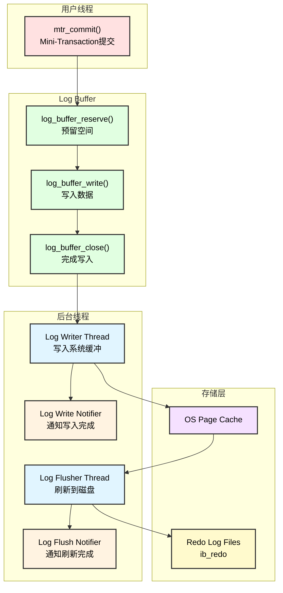
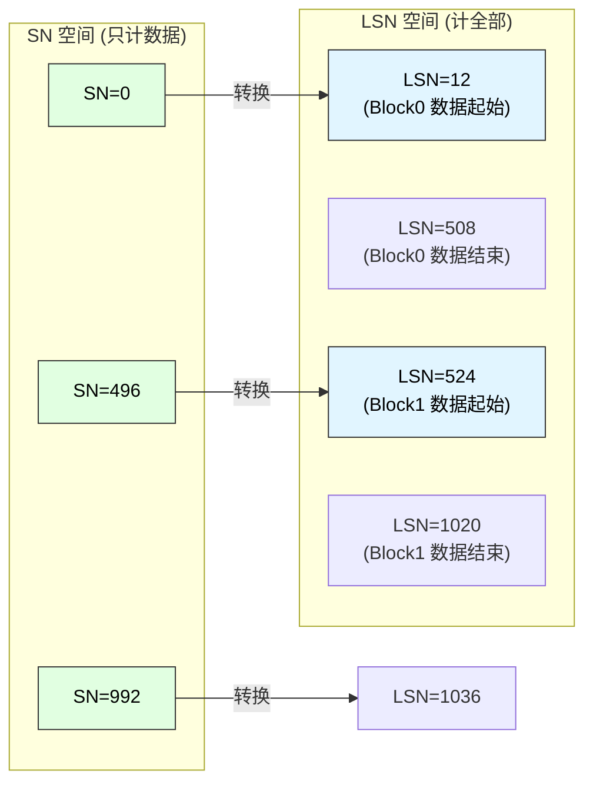
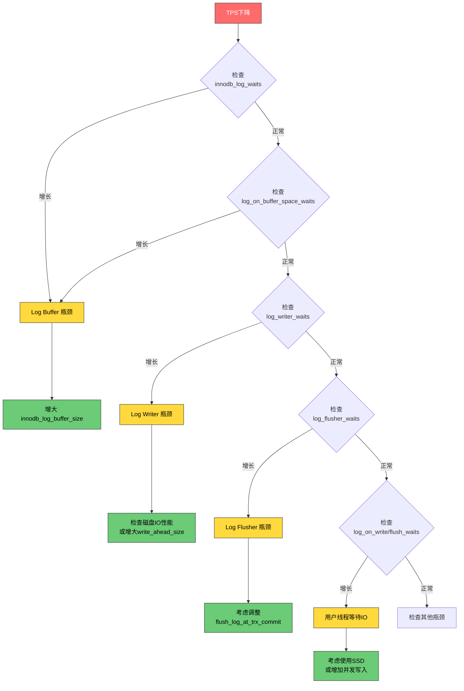

# Redo Log 写入、刷新与落盘逻辑深度分析

## 概述

InnoDB 的 Redo Log（重做日志）是实现事务持久性（Durability）和崩溃恢复的核心机制。本文深入分析 Redo Log 的写入、刷新、落盘流程及其并发性能优化设计。

## Redo Log 整体架构



## SN 与 LSN 转换关系详解

### 概念定义

| 概念 | 全称 | 说明 |
|:-----|:-----|:-----|
| **SN** | Sequence Number | 只计算实际数据字节的序列号，不包含块头和块尾 |
| **LSN** | Log Sequence Number | 计算所有字节的序列号，包括块头(12B)和块尾(4B) |

### Log Block 结构

```text
┌─────────────────────────────────────────────────────────────────────────────┐
│                        OS_FILE_LOG_BLOCK_SIZE = 512 Bytes                    │
├─────────────────────────────────────────────────────────────────────────────┤
│                                                                             │
│  ┌─────────────────────────────┐                                            │
│  │   LOG_BLOCK_HDR_SIZE = 12B  │  ← 块头 (Header)                           │
│  │   ├─ hdr_no      (4B)       │     日志块编号                              │
│  │   ├─ data_len    (2B)       │     有效数据长度                            │
│  │   ├─ first_rec   (2B)       │     第一个mtr记录组偏移                      │
│  │   └─ epoch_no    (4B)       │     纪元编号                                │
│  └─────────────────────────────┘                                            │
│                                                                             │
│  ┌─────────────────────────────┐                                            │
│  │  LOG_BLOCK_DATA_SIZE = 496B │  ← 数据区域 (SN只计算这部分)               │
│  │                             │                                            │
│  │    实际的 Redo 日志数据      │                                            │
│  │                             │                                            │
│  └─────────────────────────────┘                                            │
│                                                                             │
│  ┌─────────────────────────────┐                                            │
│  │   LOG_BLOCK_TRL_SIZE = 4B   │  ← 块尾 (Trailer)                          │
│  │   └─ checksum    (4B)       │     校验和                                  │
│  └─────────────────────────────┘                                            │
│                                                                             │
└─────────────────────────────────────────────────────────────────────────────┘

常量关系:
  OS_FILE_LOG_BLOCK_SIZE = LOG_BLOCK_HDR_SIZE + LOG_BLOCK_DATA_SIZE + LOG_BLOCK_TRL_SIZE
                 512     =        12          +         496         +          4
```

### SN 到 LSN 转换公式

```text
┌─────────────────────────────────────────────────────────────────────────────┐
│                        SN → LSN 转换                                         │
├─────────────────────────────────────────────────────────────────────────────┤
│                                                                             │
│  lsn = sn / LOG_BLOCK_DATA_SIZE * OS_FILE_LOG_BLOCK_SIZE                   │
│      + sn % LOG_BLOCK_DATA_SIZE                                             │
│      + LOG_BLOCK_HDR_SIZE                                                   │
│                                                                             │
│  代入常量:                                                                   │
│  lsn = (sn / 496) * 512 + (sn % 496) + 12                                  │
│                                                                             │
├─────────────────────────────────────────────────────────────────────────────┤
│  代码位置: storage/innobase/include/log0log.h:85                            │
│                                                                             │
│  constexpr inline lsn_t log_translate_sn_to_lsn(sn_t sn) {                 │
│    return sn / LOG_BLOCK_DATA_SIZE * OS_FILE_LOG_BLOCK_SIZE +              │
│           sn % LOG_BLOCK_DATA_SIZE + LOG_BLOCK_HDR_SIZE;                   │
│  }                                                                          │
└─────────────────────────────────────────────────────────────────────────────┘
```

### LSN 到 SN 转换公式

```text
┌─────────────────────────────────────────────────────────────────────────────┐
│                        LSN → SN 转换                                         │
├─────────────────────────────────────────────────────────────────────────────┤
│                                                                             │
│  // 计算lsn所在块的起始sn                                                    │
│  sn = (lsn / OS_FILE_LOG_BLOCK_SIZE) * LOG_BLOCK_DATA_SIZE                 │
│                                                                             │
│  // 计算lsn在块内的偏移                                                      │
│  diff = lsn % OS_FILE_LOG_BLOCK_SIZE                                       │
│                                                                             │
│  // 根据偏移位置决定返回值                                                    │
│  if (diff < LOG_BLOCK_HDR_SIZE) {                                          │
│      return sn;  // 在块头内，返回块起始sn                                   │
│  }                                                                          │
│  if (diff > OS_FILE_LOG_BLOCK_SIZE - LOG_BLOCK_TRL_SIZE) {                 │
│      return sn + LOG_BLOCK_DATA_SIZE;  // 在块尾内，返回下一块起始sn         │
│  }                                                                          │
│  return sn + diff - LOG_BLOCK_HDR_SIZE;  // 在数据区，返回对应sn            │
│                                                                             │
├─────────────────────────────────────────────────────────────────────────────┤
│  代码位置: storage/innobase/include/log0log.h:94                            │
└─────────────────────────────────────────────────────────────────────────────┘
```

### 转换示例图解



```text
转换示例详解:

【示例1】SN = 0
  lsn = (0 / 496) * 512 + (0 % 496) + 12
      = 0 * 512 + 0 + 12
      = 12
  → LSN 12 是第一个块数据区的起始位置

【示例2】SN = 496 (第一个块写满)
  lsn = (496 / 496) * 512 + (496 % 496) + 12
      = 1 * 512 + 0 + 12
      = 524
  → LSN 524 是第二个块数据区的起始位置

【示例3】SN = 248 (第一个块写一半)
  lsn = (248 / 496) * 512 + (248 % 496) + 12
      = 0 * 512 + 248 + 12
      = 260
  → LSN 260 在第一个块数据区中间

【示例4】SN = 1000
  lsn = (1000 / 496) * 512 + (1000 % 496) + 12
      = 2 * 512 + 8 + 12
      = 1044
  → LSN 1044 在第三个块数据区起始附近
```

## Redo Log 半页写问题与解决方案

### 问题对比

```text
┌─────────────────────────────────────────────────────────────────────────────┐
│                    Data Page vs Redo Log 的半页写问题                        │
├─────────────────────────────────────────────────────────────────────────────┤
│                                                                             │
│  【Data Page 问题】                                                          │
│  ┌─────────────────────────────────────────────────────────────────────┐    │
│  │ 问题：                                                               │    │
│  │   - 数据页大小 16KB，磁盘原子写入通常 512B                            │    │
│  │   - 写入16KB需要32次原子操作                                         │    │
│  │   - 崩溃时可能只写入部分扇区，导致页面损坏                            │    │
│  │                                                                      │    │
│  │ 解决方案：Double Write Buffer                                        │    │
│  │   1. 先将脏页写入 doublewrite buffer (顺序写)                        │    │
│  │   2. 再写入实际数据文件位置 (随机写)                                  │    │
│  │   3. 崩溃恢复时，从 doublewrite 恢复损坏的页                          │    │
│  └─────────────────────────────────────────────────────────────────────┘    │
│                                                                             │
│  【Redo Log 问题及解决】                                                     │
│  ┌─────────────────────────────────────────────────────────────────────┐    │
│  │ 特点：                                                               │    │
│  │   - Redo块大小 512B = 磁盘扇区大小                                    │    │
│  │   - 每个块的写入是原子的（硬件保证）                                   │    │
│  │   - 不需要额外的 Double Write 机制                                    │    │
│  │                                                                      │    │
│  │ 但仍需处理的问题：                                                    │    │
│  │   - 块是否完整写入？                                                  │    │
│  │   - 块内容是否损坏？                                                  │    │
│  │                                                                      │    │
│  │ 解决方案：Checksum + Block Header 验证                               │    │
│  └─────────────────────────────────────────────────────────────────────┘    │
│                                                                             │
└─────────────────────────────────────────────────────────────────────────────┘
```

### Redo Log 完整性保护机制

```text
┌─────────────────────────────────────────────────────────────────────────────┐
│                    Redo Log Block 完整性验证                                 │
├─────────────────────────────────────────────────────────────────────────────┤
│                                                                             │
│  【1. Block Header 验证】                                                    │
│  ┌─────────────────────────────────────────────────────────────────────┐    │
│  │ hdr_no (块编号)：                                                    │    │
│  │   - 每个块有唯一的递增编号                                           │    │
│  │   - 恢复时检查编号是否连续                                           │    │
│  │   - 编号不匹配 → 日志结束或损坏                                       │    │
│  │                                                                      │    │
│  │ epoch_no (纪元编号)：                                                │    │
│  │   - 帮助检测旧的日志块（日志文件循环使用时）                          │    │
│  │   - 防止读取到上一轮的旧数据                                         │    │
│  │                                                                      │    │
│  │ 代码：log0recv.cc:3415                                               │    │
│  │   if (block_header.m_hdr_no != expected_hdr_no) {                   │    │
│  │       // 垃圾数据或未完成写入的块                                     │    │
│  │       finished = true;                                              │    │
│  │   }                                                                 │    │
│  └─────────────────────────────────────────────────────────────────────┘    │
│                                                                             │
│  【2. Checksum 校验】                                                        │
│  ┌─────────────────────────────────────────────────────────────────────┐    │
│  │ 写入时：                                                             │    │
│  │   - Log Writer 在写入前计算 CRC32 校验和                             │    │
│  │   - 存储在块尾的 4 字节 checksum 字段                                │    │
│  │                                                                      │    │
│  │ 恢复时：                                                             │    │
│  │   - 重新计算块内容的 CRC32                                           │    │
│  │   - 与存储的 checksum 比较                                           │    │
│  │   - 不匹配 → 块损坏或未完成写入                                       │    │
│  │                                                                      │    │
│  │ 代码：log0recv.cc:3428                                               │    │
│  │   if (!log_block_checksum_is_ok(log_block)) {                       │    │
│  │       // 校验失败，视为日志结束                                       │    │
│  │       finished = true;                                              │    │
│  │   }                                                                 │    │
│  │                                                                      │    │
│  │ 校验算法：log0files_io.h:560                                         │    │
│  │   ut_crc32(log_block, OS_FILE_LOG_BLOCK_SIZE - LOG_BLOCK_TRL_SIZE)  │    │
│  └─────────────────────────────────────────────────────────────────────┘    │
│                                                                             │
│  【3. Data_len 验证】                                                        │
│  ┌─────────────────────────────────────────────────────────────────────┐    │
│  │ - data_len 记录块内有效数据的长度                                    │    │
│  │ - 有效范围: LOG_BLOCK_HDR_SIZE(12) ~ OS_FILE_LOG_BLOCK_SIZE(512)    │    │
│  │ - 超出范围 → 块损坏                                                  │    │
│  │ - 小于512表示这是日志的最后一个块                                     │    │
│  └─────────────────────────────────────────────────────────────────────┘    │
│                                                                             │
└─────────────────────────────────────────────────────────────────────────────┘
```

### 为什么 Redo Log 不需要 Double Write？

```text
┌─────────────────────────────────────────────────────────────────────────────┐
│                    Redo Log 无需 Double Write 的原因                         │
├─────────────────────────────────────────────────────────────────────────────┤
│                                                                             │
│  1. 块大小等于扇区大小                                                       │
│     - Redo 块 512B = 磁盘扇区 512B                                          │
│     - 单次写入是原子的（硬件层保证）                                         │
│     - 不存在"半页"问题，只有"完整写入"或"完全没写"                            │
│                                                                             │
│  2. 顺序追加写入                                                             │
│     - Redo Log 只追加，不原地更新                                           │
│     - 新数据写入新位置，不会破坏旧数据                                       │
│     - 即使最后一个块写失败，之前的块仍然完整                                  │
│                                                                             │
│  3. 校验和机制                                                               │
│     - 每个块有独立的 checksum                                               │
│     - 恢复时能检测出不完整的块                                               │
│     - 不完整的块被简单丢弃（视为日志结束点）                                  │
│                                                                             │
│  4. 幂等性设计                                                               │
│     - Redo 记录的重放是幂等的                                               │
│     - 即使重复应用相同的 redo 记录，结果一致                                  │
│     - 丢失最后几个未完成的记录可以接受（事务未提交）                           │
│                                                                             │
└─────────────────────────────────────────────────────────────────────────────┘
```

## Redo Log 写入完整调用链

### 从 MTR 提交到 Log Buffer 写入

```text
mtr_t::commit() - storage/innobase/mtr/mtr0mtr.cc:659
│  【Mini-Transaction 提交入口】
│
├── 创建 Command 对象
│   └── Command cmd(this)
│
├── 检查是否有日志记录需要写入
│   └── has_any_log_record() || has_modifications()
│
└── 执行写入和资源释放
    └── cmd.execute() 或 cmd.release_all() + cmd.release_resources()

mtr_t::Command::execute() - storage/innobase/mtr/mtr0mtr.cc:839
│  【执行Redo写入、添加脏页到Flush List、释放资源】
│
├── 1. 准备写入（计算日志长度）
│   │
│   └── prepare_write() - storage/innobase/mtr/mtr0mtr.cc:757
│       │  【计算需要写入的Redo记录总长度】
│       │
│       ├── 检查日志模式
│       │   └── switch (m_impl->m_log_mode)
│       │       ├── MTR_LOG_NO_REDO / MTR_LOG_NONE → return 0
│       │       └── MTR_LOG_ALL → 继续
│       │
│       ├── len = m_impl->m_log.size()  【获取日志缓冲区大小】
│       │
│       ├── n_recs = m_impl->m_n_log_recs  【获取记录数】
│       │
│       ├── 如果只有1条记录
│       │   └── *m_impl->m_log.front()->begin() |= MLOG_SINGLE_REC_FLAG
│       │
│       └── 如果有多条记录
│           └── mlog_catenate_ulint(&m_impl->m_log, MLOG_MULTI_REC_END, MLOG_1BYTE)
│               └── ++len
│
├── 2. 预留 Log Buffer 空间
│   │
│   └── ★ log_buffer_reserve(*log_sys, len) - storage/innobase/log/log0buf.cc:859
│       │  【关键函数：原子预留空间，返回LSN范围】
│       │
│       ├── srv_stats.log_write_requests.inc()  【统计：MTR提交计数】
│       │
│       ├── 原子获取SN空间
│       │   │
│       │   └── log_buffer_s_lock_enter_reserve() - storage/innobase/log/log0buf.cc:533
│       │       │  【获取S锁并预留空间】
│       │       │
│       │       ├── start_sn = log.sn.fetch_add(len)  【★原子操作：无锁并发】
│       │       │
│       │       └── if ((start_sn & SN_LOCKED) != 0)  【检查X锁】
│       │           │
│       │           └── log_buffer_s_lock_wait() - storage/innobase/log/log0buf.cc:499
│       │               │  【等待X锁释放（如log_buffer_resize时）】
│       │               │
│       │               └── while ((log.sn.load() & SN_LOCKED) != 0)
│       │                   └── os_event_wait(log.sn_lock_event)
│       │
│       ├── 转换SN到LSN
│       │   ├── handle.start_lsn = log_translate_sn_to_lsn(start_sn)
│       │   └── handle.end_lsn = log_translate_sn_to_lsn(end_sn)
│       │
│       └── 如果空间不足，等待
│           │
│           └── if (end_sn > log.buf_limit_sn.load())
│               │
│               └── log_wait_for_space_after_reserving() - storage/innobase/log/log0buf.cc:781
│                   │  【等待Log Buffer空间或Log文件空间】
│                   │
│                   ├── log_wait_for_space_in_log_buf() - storage/innobase/log/log0buf.cc:838
│                   │   │  【等待Log Buffer空间】
│                   │   │
│                   │   └── log_write_up_to()  【触发写入以腾出空间】
│                   │
│                   └── log_wait_for_space_in_log_files() - storage/innobase/log/log0chkp.cc
│                       │  【等待日志文件空间（Checkpoint推进）】
│
├── 3. 写入数据到 Log Buffer
│   │
│   └── m_impl->m_log.for_each_block(write_log)
│       │  【遍历MTR的日志块，逐块写入】
│       │
│       └── mtr_write_log_t::operator() - storage/innobase/mtr/mtr0mtr.cc:502
│           │  【写入单个日志块】
│           │
│           ├── start_lsn = m_lsn
│           │
│           ├── 写入数据
│           │   │
│           │   └── ★ log_buffer_write() - storage/innobase/log/log0buf.cc:922
│           │       │  【将数据复制到Log Buffer】
│           │       │
│           │       ├── ptr = log.buf + (start_lsn % log.buf_size)  【计算偏移】
│           │       │
│           │       └── while (true) 【循环复制，处理块边界】
│           │           │
│           │           ├── offset = lsn % OS_FILE_LOG_BLOCK_SIZE
│           │           │
│           │           ├── left = OS_FILE_LOG_BLOCK_SIZE - LOG_BLOCK_TRL_SIZE - offset
│           │           │   【当前块剩余空间】
│           │           │
│           │           ├── ★ std::memcpy(ptr, str, len)  【核心复制操作】
│           │           │
│           │           ├── 更新指针和长度
│           │           │   ├── str_len -= len
│           │           │   ├── str += len
│           │           │   ├── lsn += lsn_diff
│           │           │   └── ptr += lsn_diff
│           │           │
│           │           └── 如果跨块，处理环绕
│           │               └── if (ptr >= buf_end) ptr -= log.buf_size
│           │
│           ├── 如果跨块，设置first_rec_group
│           │   └── log_buffer_set_first_record_group()
│           │
│           └── 通知写入完成
│               │
│               └── ★ log_buffer_write_completed() - storage/innobase/log/log0buf.cc:1061
│                   │  【注册到recent_written，使Log Writer可见】
│                   │
│                   ├── 等待recent_written有空间
│                   │   └── while (!log.recent_written.has_space(start_lsn))
│                   │       ├── os_event_set(log.writer_event)  【唤醒Writer】
│                   │       └── sleep_for(20us)
│                   │
│                   ├── std::atomic_thread_fence(memory_order_release)
│                   │   【内存屏障：确保写入对Writer可见】
│                   │
│                   └── log.recent_written.add_link_advance_tail(start_lsn, end_lsn)
│                       【★注册到Link_buf，推进tail】
│
├── 4. 等待 recent_closed 有空间
│   │
│   └── log_wait_for_space_in_log_recent_closed() - storage/innobase/log/log0buf.cc:1125
│       │  【确保脏页可以添加到Flush List】
│       │
│       └── while (!log.recent_closed.has_space(lsn))
│           └── sleep_for(20us)
│
├── 5. 添加脏页到 Flush List
│   │
│   └── add_dirty_blocks_to_flush_list(start_lsn, end_lsn) - storage/innobase/mtr/mtr0mtr.cc:827
│       │  【遍历MTR修改的页面，添加到Flush List】
│       │
│       ├── 创建迭代器
│       │   └── Add_dirty_blocks_to_flush_list add_to_flush(start_lsn, end_lsn, m_impl->m_flush_observer)
│       │
│       └── 遍历memo中的块
│           └── m_impl->m_memo.for_each_block_in_reverse(iterator)
│               │
│               └── 对每个修改的页面
│                   └── buf_flush_note_modification()
│                       【将页面添加到Buffer Pool的Flush List】
│
├── 6. 关闭 Log Handle（注册到 recent_closed）
│   │
│   └── log_buffer_close() - storage/innobase/log/log0buf.cc:1142
│       │  【通知脏页添加完成】
│       │
│       ├── std::atomic_thread_fence(memory_order_release)
│       │   【内存屏障：确保脏页对Flush线程可见】
│       │
│       └── log_buffer_s_lock_exit_close() - storage/innobase/log/log0buf.cc:570
│           │  【释放S锁，注册到recent_closed】
│           │
│           └── log.recent_closed.add_link_advance_tail(start_lsn, end_lsn)
│               【★注册到Link_buf，推进tail】
│
├── 7. 释放所有 Latch
│   │
│   └── release_all() - storage/innobase/mtr/mtr0mtr.cc:816
│       │  【释放MTR持有的所有锁】
│       │
│       ├── 遍历memo释放锁
│       │   └── m_impl->m_memo.for_each_block_in_reverse(iterator)
│       │       │
│       │       └── Release_all::operator()
│       │           ├── buf_page_release_latch()  【释放页面锁】
│       │           └── mtr_memo_slot_release()   【释放其他资源】
│       │
│       └── m_locks_released = 1
│
└── 8. 释放资源
    │
    └── release_resources() - storage/innobase/mtr/mtr0mtr.cc:635
        │  【清理MTR内部资源】
        │
        ├── m_impl->m_log.erase()   【清空日志缓冲区】
        │
        ├── m_impl->m_memo.erase()  【清空memo】
        │
        ├── m_impl->m_state = MTR_STATE_COMMITTED
        │
        └── m_impl = nullptr
```


## Log Writer 线程 - 写入系统缓冲

```text
log_writer() - storage/innobase/log/log0write.cc:2263
│  【Log Writer 后台线程主循环】
│  【职责：将 Log Buffer 数据写入 OS Page Cache】
│
├── 初始化
│   ├── log_writer_mutex_enter(log)  【获取writer互斥锁】
│   │
│   └── 创建等待对象
│       └── Log_thread_waiting waiting{log, log.writer_event, 
│               srv_log_writer_spin_delay, get_srv_log_writer_timeout()}
│
└── for (uint64_t step = 0;; ++step)  【主循环】
        │
        ├── 1. 等待条件满足（有数据可写或需要停止）
        │   │
        │   └── waiting.wait(stop_condition)
        │       │  【混合等待：先spin-wait，再event-wait】
        │       │
        │       └── stop_condition 闭包（每次轮询执行）
        │           │
        │           ├── 推进 ready_for_write_lsn
        │           │   │
        │           │   └── log_advance_ready_for_write_lsn() - storage/innobase/log/log0buf.cc:1282
        │           │       │  【推进 recent_written 的 tail】
        │           │       │
        │           │       ├── write_lsn = log.write_lsn.load()
        │           │       │
        │           │       ├── write_max_size = srv_log_write_max_size
        │           │       │   【单次写入最大字节数，默认8KB】
        │           │       │
        │           │       └── log.recent_written.advance_tail_until(stop_condition)
        │           │           │  【遍历Link_buf，推进tail直到遇到空洞或达到最大值】
        │           │           │
        │           │           └── 停止条件: prev_lsn - write_lsn >= write_max_size
        │           │
        │           ├── 获取可写入的最大LSN
        │           │   │
        │           │   └── ready_lsn = log_buffer_ready_for_write_lsn() - storage/innobase/include/log0buf.h:250
        │           │       │
        │           │       └── return log.recent_written.tail()
        │           │           【★recent_written.tail就是可安全写入的最大连续LSN】
        │           │
        │           └── 检查是否满足条件
        │               └── return (log.write_lsn.load() < ready_lsn) 
        │                       || log.should_stop_threads.load()
        │
        ├── 2. 检查是否有数据需要写入
        │   │
        │   └── if (log.write_lsn.load() < ready_lsn)
        │
        └── 3. 执行写入
            │
            └── ★ log_writer_write_buffer(log, ready_lsn) - storage/innobase/log/log0write.cc:2129
                │  【核心写入函数】
                │
                ├── 计算写入范围
                │   ├── last_write_lsn = log.write_lsn.load()
                │   ├── start_offset = last_write_lsn % log.buf_size
                │   └── end_offset = next_write_lsn % log.buf_size
                │
                ├── 等待 Checkpoint 推进（确保Redo文件有空间）
                │   │
                │   └── log_writer_wait_on_checkpoint() - storage/innobase/log/log0write.cc:1908
                │       │  【等待checkpoint推进，防止覆盖未checkpoint的日志】
                │       │
                │       ├── 乐观检查
                │       │   │
                │       │   └── log_writer_wait_on_checkpoint_optimistic() - :1901
                │       │       │
                │       │       ├── checkpoint_lsn = log.last_checkpoint_lsn.load()
                │       │       │
                │       │       ├── hard_limited_lsn = checkpoint_lsn + hard_logical_capacity
                │       │       │   【硬限制：不能超过checkpoint太远】
                │       │       │
                │       │       └── 检查是否进入extra_margin
                │       │           └── log_writer_extra_margin_check()
                │       │
                │       └── 如果乐观检查失败，悲观等待
                │           │
                │           └── log_writer_wait_on_checkpoint_pessimistic() - :1918
                │               │
                │               ├── os_event_set(log.checkpointer_event)
                │               │   【请求Checkpointer推进checkpoint】
                │               │
                │               └── while (true)
                │                   ├── os_event_wait(log.next_checkpoint_event)
                │                   └── 如果5秒没推进，打印错误日志
                │
                ├── 等待 Archiver（如果启用了归档）
                │   │
                │   └── if (arch_log_sys != nullptr)
                │       └── log_writer_wait_on_archiver()
                │
                ├── 准备写入缓冲区
                │   ├── buf_begin = log.buf + align_down(start_offset)
                │   └── buf_end = log.buf + end_offset
                │
                └── 执行实际写入
                    │
                    └── ★ log_write_buffer() - storage/innobase/log/log0write.cc:1726
                        │  【处理 write-ahead、调用系统写入】
                        │
                        ├── 验证缓冲区
                        │   └── validate_buffer(), validate_start_lsn()
                        │
                        ├── 计算文件偏移
                        │   └── real_offset = log.m_current_file.offset(start_lsn)
                        │
                        ├── 计算写入大小
                        │   │
                        │   └── compute_how_much_to_write() - :1555
                        │       │  【考虑write-ahead策略计算实际写入量】
                        │       │
                        │       └── 返回: write_size, write_from_log_buffer
                        │
                        ├── 准备完整块（填充块头/尾、校验和）
                        │   │
                        │   └── prepare_full_blocks() - :1462
                        │       │
                        │       └── 对每个完整块:
                        │           ├── log_block_set_hdr_no()      【设置块号】
                        │           ├── log_block_set_data_len()    【设置数据长度】
                        │           ├── log_block_set_epoch_no()    【设置epoch】
                        │           └── log_block_set_checksum()    【★CRC32校验和】
                        │
                        ├── 处理 write-ahead
                        │   │
                        │   └── if (!write_from_log_buffer)
                        │       │  【需要使用write_ahead_buf】
                        │       │
                        │       ├── copy_to_write_ahead_buffer() - :1623
                        │       │   │  【复制数据到write_ahead_buf】
                        │       │   │
                        │       │   └── std::memcpy(log.write_ahead_buf, buffer, write_size)
                        │       │
                        │       └── prepare_for_write_ahead() - :1677
                        │           │  【填充0到对齐边界，防止read-on-write】
                        │           │
                        │           └── std::memset(log.write_ahead_buf + write_size, 0, 
                        │                   written_ahead)
                        │
                        ├── 执行实际写入
                        │   │
                        │   └── write_blocks() - :1502
                        │       │  【调用底层I/O】
                        │       │
                        │       └── log_data_blocks_write() - :1484
                        │           │
                        │           └── log.m_current_file_handle.write()
                        │               │  【pwrite系统调用】
                        │               │
                        │               └── os_file_pwrite()
                        │                   └── pwrite(fd, buf, size, offset)
                        │
                        ├── 更新 write_lsn
                        │   │
                        │   └── log.write_lsn.store(new_write_lsn)
                        │       【★原子更新，使Flusher和用户线程可见】
                        │
                        ├── 通知 write_lsn 推进
                        │   │
                        │   └── notify_about_advanced_write_lsn() - :1240
                        │       │  【通知等待写入完成的线程】
                        │       │
                        │       ├── 计算slot范围
                        │       │   ├── first_slot = log_compute_write_event_slot(old_write_lsn+1)
                        │       │   └── last_slot = log_compute_write_event_slot(new_write_lsn)
                        │       │
                        │       └── 通知
                        │           └── if (first_slot == last_slot)
                        │               │   os_event_set(log.write_events[first_slot])
                        │               else
                        │                   os_event_set(log.write_notifier_event)
                        │                   【跨多个slot时，唤醒Write Notifier】
                        │
                        ├── 更新 buf_limit
                        │   │
                        │   └── log_update_buf_limit()
                        │       【更新Log Buffer可用空间限制】
                        │
                        ├── 更新统计
                        │   ├── srv_stats.os_log_pending_writes.dec()
                        │   ├── srv_stats.log_writes.inc()
                        │   ├── srv_stats.os_log_written.add(write_size - written_ahead)
                        │   └── MONITOR_SET(MONITOR_LOG_FREE_SPACE, free_space)
                        │
                        └── 唤醒 Log Flusher
                            └── os_event_set(log.flusher_event)
```


## Log Flusher 线程 - 刷新到磁盘

```text
log_flusher() - storage/innobase/log/log0write.cc:2528
│  【Log Flusher 后台线程主循环】
│  【职责：将 OS Page Cache 中的数据 fsync 到磁盘】
│
├── 初始化
│   ├── 创建等待对象
│   │   └── Log_thread_waiting waiting{log, log.flusher_event,
│   │           srv_log_flusher_spin_delay, get_srv_log_flusher_timeout()}
│   │
│   └── log_flusher_mutex_enter(log)  【获取flusher互斥锁】
│
└── for (uint64_t step = 0;; ++step)  【主循环】
        │
        ├── 1. 检查是否需要停止
        │   │
        │   └── if (log.should_stop_threads.load())
        │       └── if (!log_writer_is_active()) break
        │           【只有Writer停止后，Flusher才能退出】
        │
        ├── 2. 处理暂停请求
        │   │
        │   └── if (log.writer_threads_paused.load())
        │       ├── log_flusher_mutex_exit(log)
        │       ├── os_event_wait(log.writer_threads_resume_event)
        │       └── log_flusher_mutex_enter(log)
        │
        ├── 3. 等待条件满足（有数据可刷或需要停止）
        │   │
        │   └── waiting.wait(stop_condition)
        │       │  【混合等待：先spin-wait，再event-wait】
        │       │
        │       └── stop_condition 闭包（每次轮询执行）
        │           │
        │           ├── 获取当前已刷新的LSN
        │           │   └── last_flush_lsn = log.flushed_to_disk_lsn.load()
        │           │
        │           ├── 检查是否有数据需要刷新
        │           │   └── if (last_flush_lsn < log.write_lsn.load())
        │           │
        │           └── 如果需要刷新，执行刷新
        │               │
        │               └── ★ log_flush_low(log) - storage/innobase/log/log0write.cc:2454
        │                   │  【核心刷新函数】
        │                   │
        │                   ├── 重置 flusher_event
        │                   │   │
        │                   │   └── if (!log.writer_threads_paused.load())
        │                   │       └── os_event_reset(log.flusher_event)
        │                   │
        │                   ├── 获取需要刷新的范围
        │                   │   ├── last_flush_lsn = log.flushed_to_disk_lsn.load()
        │                   │   └── flush_up_to_lsn = log.write_lsn.load()
        │                   │
        │                   ├── 提前返回检查
        │                   │   │
        │                   │   └── if (flush_up_to_lsn == last_flush_lsn)
        │                   │       ├── os_event_set(log.old_flush_event)
        │                   │       └── return
        │                   │
        │                   ├── 记录刷新开始时间
        │                   │   └── log.last_flush_start_time = Log_clock::now()
        │                   │
        │                   ├── ★ 执行 fsync
        │                   │   │
        │                   │   └── if (do_flush)  【do_flush = (flush_method != O_DSYNC)】
        │                   │       │
        │                   │       └── log.m_current_file_handle.fsync()
        │                   │           │  【调用操作系统 fsync】
        │                   │           │
        │                   │           └── pfs_os_file_fsync() - storage/innobase/os/os0file.cc
        │                   │               │
        │                   │               └── fsync(fd)  【POSIX fsync系统调用】
        │                   │                   【将OS Page Cache刷到磁盘】
        │                   │
        │                   ├── 记录刷新结束时间
        │                   │   └── log.last_flush_end_time = Log_clock::now()
        │                   │
        │                   ├── ★ 更新 flushed_to_disk_lsn
        │                   │   │
        │                   │   └── log.flushed_to_disk_lsn.store(flush_up_to_lsn)
        │                   │       【原子更新，使用户线程可见】
        │                   │
        │                   ├── 通知等待的用户线程
        │                   │   │
        │                   │   └── if (!log.writer_threads_paused.load())
        │                   │       │
        │                   │       ├── 计算slot范围
        │                   │       │   ├── first_slot = log_compute_flush_event_slot(last_flush_lsn + 1)
        │                   │       │   │   │
        │                   │       │   │   └── slot = ((lsn - 1) / OS_FILE_LOG_BLOCK_SIZE) 
        │                   │       │   │           % log.flush_events_size
        │                   │       │   │
        │                   │       │   └── last_slot = log_compute_flush_event_slot(flush_up_to_lsn)
        │                   │       │
        │                   │       └── 通知
        │                   │           └── if (first_slot == last_slot)
        │                   │               │   【只涉及一个slot，直接通知】
        │                   │               │
        │                   │               │   os_event_set(log.flush_events[first_slot])
        │                   │               │   【唤醒等待该slot的用户线程】
        │                   │               else
        │                   │                   【跨多个slot，唤醒Flush Notifier】
        │                   │
        │                   │                   os_event_set(log.flush_notifier_event)
        │                   │                   【让Flush Notifier批量通知】
        │                   │
        │                   └── 更新统计信息
        │                       │
        │                       └── log_flush_update_stats() - storage/innobase/log/log0write.cc:2442
        │                           │
        │                           ├── log.n_log_ios++  【I/O计数】
        │                           │
        │                           ├── 计算刷新延迟
        │                           │   └── flush_time = last_flush_end_time - last_flush_start_time
        │                           │
        │                           └── 更新Monitor
        │                               ├── MONITOR_INC(MONITOR_LOG_FLUSHES)
        │                               ├── MONITOR_SET(MONITOR_LOG_FLUSH_AVG_TIME, avg)
        │                               └── MONITOR_SET(MONITOR_LOG_FLUSH_MAX_TIME, max)
        │
        └── 4. innodb_flush_log_at_trx_commit != 1 时的定时刷新
            │
            └── if (srv_flush_log_at_trx_commit != 1)
                │  【非每次事务刷新模式】
                │
                ├── 计算距离上次刷新的时间
                │   └── time_elapsed = current_time - log.last_flush_start_time
                │
                ├── 获取刷新间隔
                │   └── flush_every = get_srv_flush_log_at_timeout()
                │       【默认1秒，由innodb_flush_log_at_timeout控制】
                │
                └── 如果未到时间，设置超时等待
                    └── if (time_elapsed < flush_every)
                        └── waiting.wait(stop_condition, 
                                flush_every - time_elapsed)
```


## Log Write Notifier 与 Flush Notifier

```text
┌─────────────────────────────────────────────────────────────────────────────┐
│                    Notifier 线程工作原理                                     │
├─────────────────────────────────────────────────────────────────────────────┤
│                                                                             │
│  【Log Write Notifier】- storage/innobase/log/log0write.cc:2665             │
│  ┌─────────────────────────────────────────────────────────────────────┐    │
│  │ 职责：通知等待 write_lsn 推进的用户线程                              │    │
│  │                                                                      │    │
│  │ 工作流程：                                                           │    │
│  │   while (!should_close) {                                           │    │
│  │       // 1. 等待 write_lsn 推进                                      │    │
│  │       wait_for(log.write_lsn >= lsn);                               │    │
│  │                                                                      │    │
│  │       // 2. 计算需要通知的范围                                       │    │
│  │       notified_up_to_lsn = align_up(write_lsn, 512);                │    │
│  │                                                                      │    │
│  │       // 3. 逐个通知等待的事件                                       │    │
│  │       while (lsn <= notified_up_to_lsn) {                           │    │
│  │           slot = log_compute_write_event_slot(log, lsn);            │    │
│  │           os_event_set(log.write_events[slot]);  ← 唤醒等待者       │    │
│  │           lsn += OS_FILE_LOG_BLOCK_SIZE;                            │    │
│  │       }                                                             │    │
│  │   }                                                                 │    │
│  │                                                                      │    │
│  │ 事件槽位计算：                                                       │    │
│  │   slot = (lsn - 1) / OS_FILE_LOG_BLOCK_SIZE % S                     │    │
│  │   其中 S = write_events 数组大小                                     │    │
│  └─────────────────────────────────────────────────────────────────────┘    │
│                                                                             │
│  【Log Flush Notifier】- storage/innobase/log/log0write.cc:2787             │
│  ┌─────────────────────────────────────────────────────────────────────┐    │
│  │ 职责：通知等待 flushed_to_disk_lsn 推进的用户线程                    │    │
│  │                                                                      │    │
│  │ 工作流程（与 Write Notifier 类似）：                                 │    │
│  │   while (!should_close) {                                           │    │
│  │       wait_for(log.flushed_to_disk_lsn >= lsn);                     │    │
│  │                                                                      │    │
│  │       notified_up_to_lsn = align_up(flush_lsn, 512);                │    │
│  │                                                                      │    │
│  │       while (lsn <= notified_up_to_lsn) {                           │    │
│  │           slot = log_compute_flush_event_slot(log, lsn);            │    │
│  │           os_event_set(log.flush_events[slot]);  ← 唤醒等待者       │    │
│  │           lsn += OS_FILE_LOG_BLOCK_SIZE;                            │    │
│  │       }                                                             │    │
│  │   }                                                                 │    │
│  └─────────────────────────────────────────────────────────────────────┘    │
│                                                                             │
│  【为什么需要 Notifier？】                                                   │
│  ┌─────────────────────────────────────────────────────────────────────┐    │
│  │ 1. 解耦 IO 和通知                                                    │    │
│  │    - Writer/Flusher 专注于 IO 操作                                   │    │
│  │    - Notifier 专注于通知等待的线程                                   │    │
│  │    - 避免 IO 线程被通知操作阻塞                                      │    │
│  │                                                                      │    │
│  │ 2. 批量通知                                                          │    │
│  │    - 一次 write/flush 可能覆盖多个块                                 │    │
│  │    - Notifier 批量通知所有相关的等待者                               │    │
│  │                                                                      │    │
│  │ 3. 减少虚假唤醒                                                      │    │
│  │    - 使用事件槽位机制，按块粒度通知                                  │    │
│  │    - 等待特定 LSN 的线程只在对应槽位被通知时唤醒                     │    │
│  └─────────────────────────────────────────────────────────────────────┘    │
│                                                                             │
└─────────────────────────────────────────────────────────────────────────────┘
```

## Redo Log 完整时序图


## Reserve 等待场景

```text
┌─────────────────────────────────────────────────────────────────────────────┐
│                    Reserve 等待场景                                          │
├─────────────────────────────────────────────────────────────────────────────┤
│                                                                             │
│  【场景1: Log Buffer 空间不足】                                              │
│  ┌─────────────────────────────────────────────────────────────────────┐    │
│  │ 条件: end_sn > log.buf_limit_sn                                     │    │
│  │                                                                      │    │
│  │ 触发位置: log_buffer_reserve() → log_wait_for_space_after_reserving()│    │
│  │                                                                      │    │
│  │ 等待逻辑:                                                            │    │
│  │   while (end_lsn - log.write_lsn > log.buf_size) {                  │    │
│  │       // Buffer满了，等待Writer写出数据腾出空间                       │    │
│  │       os_event_set(log.writer_event);  // 唤醒Writer                │    │
│  │       sleep();                                                      │    │
│  │   }                                                                 │    │
│  │                                                                      │    │
│  │ 解除条件: Log Writer 写出数据，推进 write_lsn                        │    │
│  └─────────────────────────────────────────────────────────────────────┘    │
│                                                                             │
│  【场景2: recent_written 空间不足】                                          │
│  ┌─────────────────────────────────────────────────────────────────────┐    │
│  │ 条件: !log.recent_written.has_space(start_lsn)                      │    │
│  │                                                                      │    │
│  │ 触发位置: log_buffer_write_completed()                               │    │
│  │                                                                      │    │
│  │ has_space() 判断:                                                    │    │
│  │   return (position - tail < m_capacity)                             │    │
│  │   即: start_lsn 距离 tail 不能超过 recent_written 的容量             │    │
│  │                                                                      │    │
│  │ 等待逻辑:                                                            │    │
│  │   while (!log.recent_written.has_space(start_lsn)) {                │    │
│  │       os_event_set(log.writer_event);  // 唤醒Writer推进tail        │    │
│  │       sleep(20us);                                                  │    │
│  │   }                                                                 │    │
│  │                                                                      │    │
│  │ 解除条件: Log Writer 处理链接，推进 recent_written.tail()            │    │
│  └─────────────────────────────────────────────────────────────────────┘    │
│                                                                             │
│  【场景3: recent_closed 空间不足】                                           │
│  ┌─────────────────────────────────────────────────────────────────────┐    │
│  │ 条件: end_lsn - log.buf_dirty_pages_added_up_to_lsn >= L            │    │
│  │       其中 L = recent_closed 的容量                                  │    │
│  │                                                                      │    │
│  │ 触发位置: log_buffer_write_completed_before_dirty_pages_added()      │    │
│  │                                                                      │    │
│  │ 意义:                                                                │    │
│  │   - 限制脏页添加的"超前"程度                                         │    │
│  │   - 确保 Flush List 中的页面 LSN 差距有限                            │    │
│  │   - 保证 Checkpoint 能有效推进                                       │    │
│  │                                                                      │    │
│  │ 解除条件: 其他线程添加脏页并注册到 recent_closed，推进其 tail         │    │
│  └─────────────────────────────────────────────────────────────────────┘    │
│                                                                             │
│  【场景4: sn 被 X 锁锁定】                                                   │
│  ┌─────────────────────────────────────────────────────────────────────┐    │
│  │ 条件: (log.sn & SN_LOCKED) != 0                                     │    │
│  │                                                                      │    │
│  │ 触发位置: log_buffer_s_lock_enter_reserve()                          │    │
│  │                                                                      │    │
│  │ 等待逻辑: log_buffer_s_lock_wait()                                   │    │
│  │   while ((sn & SN_LOCKED) && sn_locked <= start_sn) {               │    │
│  │       spin_wait or os_event_wait(log.sn_lock_event);                │    │
│  │   }                                                                 │    │
│  │                                                                      │    │
│  │ X锁用途:                                                             │    │
│  │   - Log Buffer 扩容时需要X锁                                         │    │
│  │   - 阻止新的S锁获取，等待现有S锁释放                                 │    │
│  │                                                                      │    │
│  │ 解除条件: X锁持有者释放锁                                            │    │
│  └─────────────────────────────────────────────────────────────────────┘    │
│                                                                             │
└─────────────────────────────────────────────────────────────────────────────┘
```

## 并发性能优化设计

```text
┌─────────────────────────────────────────────────────────────────────────────┐
│                    Redo Log 并发优化机制                                     │
├─────────────────────────────────────────────────────────────────────────────┤
│                                                                             │
│  【1. Lock-Free Log Buffer 预留】                                           │
│  ┌─────────────────────────────────────────────────────────────────────┐    │
│  │ 传统方式：互斥锁保护log buffer → 高并发下成为瓶颈                    │    │
│  │                                                                      │    │
│  │ InnoDB 8.0优化：                                                     │    │
│  │   start_sn = log.sn.fetch_add(len)   // 原子操作预留空间             │    │
│  │                                                                      │    │
│  │ 优势：                                                               │    │
│  │   - 多个用户线程可以同时预留空间                                     │    │
│  │   - 无需等待其他线程完成写入                                         │    │
│  │   - CPU cache line 争用最小化                                        │    │
│  └─────────────────────────────────────────────────────────────────────┘    │
│                                                                             │
│  【2. Link Buffer 跟踪并发完成】                                             │
│  ┌─────────────────────────────────────────────────────────────────────┐    │
│  │ 问题：多个线程并发写入，完成顺序可能与预留顺序不同                    │    │
│  │                                                                      │    │
│  │ 解决方案：Link Buffer (recent_written / recent_closed)               │    │
│  │   - 无锁数据结构，记录完成的LSN区间                                  │    │
│  │   - tail() 返回连续完成的最大位置                                    │    │
│  │   - 允许乱序完成，但保证顺序处理                                     │    │
│  └─────────────────────────────────────────────────────────────────────┘    │
│                                                                             │
│  【3. 专用后台线程分工】                                                     │
│  ┌─────────────────────────────────────────────────────────────────────┐    │
│  │ ┌──────────────────────┬────────────────────────────────────────┐   │    │
│  │ │ Log Writer           │ 将Log Buffer写入OS Page Cache          │   │    │
│  │ │                      │ 监控recent_written，批量写入            │   │    │
│  │ ├──────────────────────┼────────────────────────────────────────┤   │    │
│  │ │ Log Flusher          │ 执行fsync将数据刷到磁盘                 │   │    │
│  │ ├──────────────────────┼────────────────────────────────────────┤   │    │
│  │ │ Log Write Notifier   │ 通知等待write_lsn推进的用户线程        │   │    │
│  │ ├──────────────────────┼────────────────────────────────────────┤   │    │
│  │ │ Log Flush Notifier   │ 通知等待flushed_lsn推进的用户线程      │   │    │
│  │ └──────────────────────┴────────────────────────────────────────┘   │    │
│  │                                                                      │    │
│  │ 优势：用户线程不阻塞在IO操作上，后台线程批量处理                     │    │
│  └─────────────────────────────────────────────────────────────────────┘    │
│                                                                             │
│  【4. Group Commit 效应】                                                    │
│  ┌─────────────────────────────────────────────────────────────────────┐    │
│  │ 机制：多个事务的Redo Log被写入同一个IO操作                           │    │
│  │       一次fsync可以持久化多个事务                                    │    │
│  │                                                                      │    │
│  │ 效果：高并发下，每个事务的fsync开销被摊销，显著提升TPS              │    │
│  └─────────────────────────────────────────────────────────────────────┘    │
│                                                                             │
└─────────────────────────────────────────────────────────────────────────────┘
```

## Redo Log 数据结构

```text
log_t 结构 - storage/innobase/include/log0sys.h
│
├── 【Log Buffer相关】
│   ├── byte *buf                           【Log Buffer起始地址】
│   ├── size_t buf_size                     【Log Buffer大小(字节)】
│   ├── atomic<sn_t> sn                     【当前序列号(预留空间用)】
│   └── atomic<sn_t> buf_limit_sn           【Buffer可用的最大SN】
│
├── 【写入进度跟踪】
│   ├── atomic<lsn_t> write_lsn             【已写入OS缓冲的LSN】
│   ├── atomic<lsn_t> flushed_to_disk_lsn   【已fsync到磁盘的LSN】
│   ├── Link_buf<lsn_t> recent_written      【跟踪并发写入完成状态】
│   │   └── tail() = buf_ready_for_write_lsn
│   └── Link_buf<lsn_t> recent_closed       【跟踪脏页添加完成状态】
│       └── tail() = buf_dirty_pages_added_up_to_lsn
│
├── 【后台线程同步】
│   ├── os_event_t writer_event             【唤醒Log Writer】
│   ├── os_event_t flusher_event            【唤醒Log Flusher】
│   ├── os_event_t write_notifier_event     【唤醒Write Notifier】
│   ├── os_event_t flush_notifier_event     【唤醒Flush Notifier】
│   ├── os_event_t write_events[]           【用户线程等待write_lsn】
│   └── os_event_t flush_events[]           【用户线程等待flushed_lsn】
│
├── 【互斥锁】
│   ├── rw_lock_t *sn_lock_inst             【保护SN预留的共享锁】
│   ├── atomic<sn_t> sn_locked              【X锁定时的sn值】
│   ├── ib_mutex_t writer_mutex             【保护Writer线程】
│   └── ib_mutex_t flusher_mutex            【保护Flusher线程】
│
└── 【文件管理】
    ├── Log_files_context m_files_ctx       【日志文件上下文】
    └── Log_file m_current_file             【当前写入的日志文件】
```

## 关键函数速查表

| 层级 | 函数名 | 文件路径 | 行号 | 功能说明 |
|:-----|:-------|:---------|:-----|:---------|
| **MTR** | `mtr_t::commit()` | storage/innobase/mtr/mtr0mtr.cc | 659 | MTR提交入口 |
| | `mtr_t::Command::execute()` | storage/innobase/mtr/mtr0mtr.cc | 839 | 执行Redo写入 |
| **Log Buffer** | `log_buffer_reserve()` | storage/innobase/log/log0buf.cc | 859 | 预留空间 |
| | `log_buffer_write()` | storage/innobase/log/log0buf.cc | 922 | 写入数据 |
| | `log_buffer_write_completed()` | storage/innobase/log/log0buf.cc | 1061 | 注册到recent_written |
| | `log_buffer_close()` | storage/innobase/log/log0buf.cc | 1023 | 注册到recent_closed |
| **Link_buf** | `add_link()` | storage/innobase/include/ut0link_buf.h | 253 | 添加链接 |
| | `add_link_advance_tail()` | storage/innobase/include/ut0link_buf.h | 277 | 添加链接并推进tail |
| | `has_space()` | storage/innobase/include/ut0link_buf.h | 407 | 检查是否有空间 |
| | `tail()` | storage/innobase/include/ut0link_buf.h | 402 | 获取尾部位置 |
| **Log Writer** | `log_writer()` | storage/innobase/log/log0write.cc | 2263 | Writer线程主循环 |
| | `log_writer_write_buffer()` | storage/innobase/log/log0write.cc | 2129 | 执行写入 |
| **Log Flusher** | `log_flusher()` | storage/innobase/log/log0write.cc | 2528 | Flusher线程主循环 |
| | `log_flush_low()` | storage/innobase/log/log0write.cc | 2454 | 执行fsync |
| **Notifier** | `log_write_notifier()` | storage/innobase/log/log0write.cc | 2665 | Write Notifier主循环 |
| | `log_flush_notifier()` | storage/innobase/log/log0write.cc | 2787 | Flush Notifier主循环 |
| **等待** | `log_write_up_to()` | storage/innobase/log/log0write.cc | 1091 | 等待LSN |
| | `log_wait_for_write()` | storage/innobase/log/log0write.cc | 998 | 等待写入 |
| | `log_wait_for_flush()` | storage/innobase/log/log0write.cc | 1030 | 等待刷新 |
| **SN/LSN** | `log_translate_sn_to_lsn()` | storage/innobase/include/log0log.h | 85 | SN转LSN |
| | `log_translate_lsn_to_sn()` | storage/innobase/include/log0log.h | 94 | LSN转SN |


### 关键函数详细展开

#### log_write_up_to() - 等待日志写入/刷新到指定LSN

```text
log_write_up_to() - storage/innobase/log/log0write.cc:1091
│  【等待Redo Log写入或刷新到指定LSN】
│  【用户线程调用，确保事务持久性】
│
├── 参数
│   ├── end_lsn: 需要等待的目标LSN
│   └── flush_to_disk: true=等待fsync, false=只等待写入OS缓存
│
├── 检查是否处于恢复模式
│   └── if (recv_no_ibuf_operations) return  【恢复期间跳过】
│
├── 更新请求计数（用于判断是否低负载）
│   └── log.write_to_file_requests_total.store(...)
│
├── 检查 writer_threads_paused
│   │
│   └── if (log.writer_threads_paused.load())
│       │  【后台线程暂停时，自己执行写入】
│       │
│       └── log_self_write_up_to()
│           │  【用户线程直接执行写入，无需等待后台线程】
│           │
│           ├── log_writer_mutex_enter()
│           ├── log_advance_ready_for_write_lsn()
│           ├── log_writer_write_buffer()
│           ├── log_flush_low()  【如果需要flush】
│           └── log_writer_mutex_exit()
│
├── flush_to_disk == true 分支
│   │
│   ├── 快速检查
│   │   └── if (log.flushed_to_disk_lsn.load() >= end_lsn) return
│   │
│   ├── 如果 srv_flush_log_at_trx_commit != 1
│   │   │  【Flusher可能在睡眠，需要先确保写入完成】
│   │   │
│   │   └── if (log.write_lsn.load() < end_lsn)
│   │       └── log_wait_for_write()  【等待写入】
│   │
│   └── 等待刷新完成
│       │
│       └── log_wait_for_flush() - storage/innobase/log/log0write.cc:1042
│           │  【等待 flushed_to_disk_lsn >= end_lsn】
│           │
│           ├── 计算slot
│           │   └── slot = log_compute_flush_event_slot(log, end_lsn)
│           │
│           ├── 设置事件等待
│           │   └── os_event_wait_for(log.flush_events[slot], ...)
│           │       │  【混合等待：先spin，再event】
│           │
│           └── 被唤醒后检查条件
│               └── while (log.flushed_to_disk_lsn.load() < end_lsn)
│                   └── 继续等待或被中断
│
└── flush_to_disk == false 分支
    │
    ├── 快速检查
    │   └── if (log.write_lsn.load() >= end_lsn) return
    │
    └── 等待写入完成
        │
        └── log_wait_for_write() - storage/innobase/log/log0write.cc:1003
            │  【等待 write_lsn >= end_lsn】
            │
            ├── 计算slot
            │   └── slot = log_compute_write_event_slot(log, end_lsn)
            │
            ├── 设置事件等待
            │   └── os_event_wait_for(log.write_events[slot], ...)
            │
            └── 被唤醒后检查条件
                └── while (log.write_lsn.load() < end_lsn)
```

#### Link_buf 核心函数展开

```text
Link_buf<Position>::has_space() - storage/innobase/include/ut0link_buf.h:407
│  【检查指定位置是否可以添加link】
│  【防止覆盖未处理的slot】
│
├── 获取当前tail
│   └── tail = m_tail.load(memory_order_acquire)
│
├── 检查是否有空间
│   │  【★关键：position必须在[tail, tail+capacity)范围内】
│   │
│   └── if (tail + m_capacity > position) return true
│       【position在窗口内，可以使用】
│
├── 尝试推进tail
│   │  【可能有link已完成但tail未推进】
│   │
│   └── advance_tail_until(stop_condition, 0)
│
└── 再次检查
    └── return tail + m_capacity > position

Link_buf<Position>::add_link_advance_tail() - storage/innobase/include/ut0link_buf.h:277
│  【添加link并尝试推进tail】
│  【★无锁并发：多线程可同时调用】
│
├── 获取当前tail位置
│   └── position = m_tail.load(memory_order_acquire)
│
├── 快速路径：如果from==tail
│   │  【这个link刚好接在tail后面，可以直接推进】
│   │
│   └── if (position == from)
│       └── m_tail.store(to, memory_order_release)
│           【★直接推进tail到to，无需存储link】
│
└── 慢速路径：from > tail
    │  【前面还有未完成的link，需要存储】
    │
    ├── 存储link到slot
    │   ├── index = slot_index(from)  【from & (capacity-1)】
    │   └── slot.store(to, memory_order_release)
    │
    └── 尝试推进tail
        │
        └── advance_tail_until(stop_condition)
            │  【推进直到遇到from之后的位置】

Link_buf<Position>::advance_tail_until() - storage/innobase/include/ut0link_buf.h:306
│  【推进tail直到stop_condition返回true或遇到空洞】
│  【★单线程安全推进（通过CAS获取独占权）】
│
├── 获取当前tail
│   └── position = m_tail.load(memory_order_acquire)
│
├── 阶段1：尝试获取独占推进权
│   │
│   └── while (true)
│       ├── index = slot_index(position)
│       ├── next_load = slot.load(memory_order_acquire)
│       │
│       ├── 检查是否有效link
│       │   └── if (next_load <= position || stop_condition(...))
│       │       └── return false  【无link或达到停止条件】
│       │
│       └── CAS尝试锁定slot
│           │  【★关键：将slot值改为position，表示正在推进】
│           │
│           └── if (slot.compare_exchange_strong(next_load, position))
│               └── 获取成功，进入阶段2
│
├── 阶段2：独占推进tail
│   │  【此时已获得推进权，可以安全遍历】
│   │
│   └── while (true)
│       ├── 查找下一个link
│       │   └── next_position(position, next)
│       │
│       ├── 检查是否停止
│       │   └── if (stop || stop_condition(...)) break
│       │
│       └── position = next  【继续推进】
│
└── 更新tail
    └── m_tail.store(position, memory_order_release)

Link_buf<Position>::tail() - storage/innobase/include/ut0link_buf.h:402
│  【获取当前tail值】
│
└── return m_tail.load(memory_order_acquire)
    【★tail就是最大连续完成的位置】
    【对于recent_written: tail = 可安全写入OS的最大LSN】
    【对于recent_closed: tail = 脏页已全部添加的最大LSN】
```

#### buf_flush_note_modification() - 脏页添加到Flush List

```text
buf_flush_note_modification() - storage/innobase/include/buf0flu.ic:57
│  【MTR提交时，将修改的页面添加到Flush List】
│  【Flush List按oldest_lsn排序，用于刷脏页】
│
├── 参数
│   ├── block: 被修改的页面块
│   ├── start_lsn: MTR开始LSN
│   ├── end_lsn: MTR结束LSN
│   └── observer: Flush观察者（用于DDL等）
│
├── 加锁
│   └── mutex_enter(&block->mutex)
│
├── 设置页面的newest_modification
│   │  【记录最近修改的LSN】
│   │
│   └── if (end_lsn != 0)
│       └── block->page.set_newest_lsn(end_lsn)
│
├── 设置Flush Observer
│   └── if (observer != nullptr)
│       └── block->page.set_flush_observer(observer)
│
├── 检查是否已在Flush List中
│   │
│   └── if (!block->page.is_dirty())
│       │  【首次变脏，需要插入Flush List】
│       │
│       └── buf_flush_insert_into_flush_list(buf_pool, block, start_lsn)
│           │  【按oldest_lsn排序插入】
│           │
│           ├── buf_flush_list_mutex_enter(buf_pool)
│           │
│           ├── block->page.set_oldest_lsn(start_lsn)
│           │   【★oldest_lsn决定页面在Flush List中的位置】
│           │
│           ├── 找到插入位置
│           │   └── 遍历flush_list，找到oldest_lsn >= start_lsn的位置
│           │
│           ├── 插入链表
│           │   └── UT_LIST_INSERT_AFTER(flush_list, ...)
│           │
│           └── buf_flush_list_mutex_exit(buf_pool)
│
└── 释放锁
    └── buf_page_mutex_exit(block)
```

#### compute_how_much_to_write() - 计算写入量

```text
compute_how_much_to_write() - storage/innobase/log/log0write.cc:1419
│  【计算本次可以写入的字节数】
│  【考虑：文件边界、write-ahead、块对齐】
│
├── 参数
│   ├── log: redo log系统
│   ├── real_offset: 文件内偏移
│   ├── buffer_size: 缓冲区大小
│   └── write_from_log_buffer: [out] 是否直接从log buffer写
│
├── 1. 检查当前文件是否有足够空间
│   │
│   └── if (!current_file_has_space(log, real_offset, buffer_size))
│       │  【写入会跨越文件边界】
│       │
│       ├── if (!current_file_has_space(log, real_offset, 1))
│       │   │  【已经到达文件末尾】
│       │   │
│       │   └── return 0  【需要切换到下一个文件】
│       │
│       └── else
│           │  【部分可以写入当前文件】
│           │
│           └── write_size = file_size - real_offset
│
├── 2. 检查write-ahead情况
│   │  【★防止read-on-write问题】
│   │
│   └── if (!current_write_ahead_enough(log, real_offset, write_size))
│       │
│       ├── if (!current_write_ahead_enough(log, real_offset, 1))
│       │   │  【当前write-ahead区域完全用完】
│       │   │
│       │   ├── next_wa = compute_next_write_ahead_end(real_offset)
│       │   │
│       │   └── if (!write_ahead_enough(next_wa, real_offset, write_size))
│       │       │  【数据量超过write-ahead大小】
│       │       │
│       │       └── write_size = next_wa - real_offset
│       │           【限制为write-ahead边界】
│       │   else
│       │       └── write_from_log_buffer = false
│       │           【需要使用write_ahead_buf】
│       │
│       └── else
│           │  【还有剩余write-ahead空间】
│           │
│           └── write_size = write_ahead_end_offset - real_offset
│
├── 3. 决定写入来源
│   │
│   └── write_from_log_buffer = (write_size >= OS_FILE_LOG_BLOCK_SIZE)
│       【★只有完整块才能直接从log buffer写】
│       【不完整块需要复制到write_ahead_buf处理】
│
└── 4. 更新统计
    ├── if (write_from_log_buffer)
    │   └── MONITOR_INC(MONITOR_LOG_FULL_BLOCK_WRITES)
    └── else
        └── MONITOR_INC(MONITOR_LOG_PARTIAL_BLOCK_WRITES)
```

#### write_blocks() - 执行写入及IO失败处理

```text
write_blocks() - storage/innobase/log/log0write.cc:1572
│  【执行实际的Redo Log写入】
│
├── 验证
│   ├── ut_a(write_size >= OS_FILE_LOG_BLOCK_SIZE)
│   ├── ut_a(write_size % OS_FILE_LOG_BLOCK_SIZE == 0)
│   └── ut_a(write-ahead对齐检查)
│
├── 执行写入
│   │
│   └── log_data_blocks_write() - storage/innobase/log/log0write.cc:1484
│       │
│       └── log.m_current_file_handle.write(real_offset, write_buf, write_size)
│           │
│           └── pfs_os_file_write() → os_file_pwrite()
│               │
│               └── pwrite(fd, buf, size, offset)
│                   │  【POSIX同步写入】
│
├── ★IO失败处理
│   │
│   └── if (err != DB_SUCCESS)
│       │
│       └── return err  【返回错误给调用者】
│
│   【调用者 log_writer_write_buffer() 的失败处理:】
│
│   log_writer_write_buffer() 中:
│   └── if (err != DB_SUCCESS)
│       │
│       └── log_writer_write_failed() - storage/innobase/log/log0write.cc:2111
│           │  【IO失败处理逻辑】
│           │
│           ├── 记录错误信息
│           │   └── ib::error() << "Write to redo log failed: " << err
│           │
│           ├── 获取文件路径
│           │   └── file_path = log.m_current_file.m_path
│           │
│           └── 致命错误退出
│               │  【★IO失败是致命错误，必须崩溃】
│               │
│               └── ib::fatal() << "Cannot continue operation. ..."
│                   【原因：Redo是WAL，IO失败意味着无法保证持久性】
│                   【恢复时可能丢失已提交事务，必须终止】
│
└── 归档Hook（如果启用）
    └── meb::redo_log_archive_produce(write_buf, write_size)
```

#### log_block_set_* 函数族

```text
log_block_set_hdr_no() - storage/innobase/include/log0files_io.h:478
│  【设置Log Block的块号】
│
└── 写入4字节到块头偏移0处
    └── mach_write_to_4(log_block + LOG_BLOCK_HDR_NO, n)

log_block_set_data_len() - storage/innobase/include/log0files_io.h:490
│  【设置Log Block的数据长度】
│
└── 写入2字节到块头偏移4处
    └── mach_write_to_2(log_block + LOG_BLOCK_DATA_LEN, len)

log_block_set_first_rec_group() - storage/innobase/include/log0files_io.h:512
│  【设置首个记录组的偏移量】
│  【用于恢复时定位记录边界】
│
└── 写入2字节到块头偏移6处
    └── mach_write_to_2(log_block + LOG_BLOCK_FIRST_REC_GROUP, offset)

Log_data_block_header::set_lsn() - storage/innobase/include/log0files_io.h:156
│  【根据LSN设置hdr_no和epoch_no】
│
├── m_hdr_no = log_block_convert_lsn_to_no(lsn)
│   │  【块号 = (lsn / OS_FILE_LOG_BLOCK_SIZE) & 0x3FFFFFFF】
│   │  【30位循环计数】
│
└── m_epoch_no = log_block_compute_epoch_no(lsn)
    │  【epoch = log_files_capacity / OS_FILE_LOG_BLOCK_SIZE】
    │  【用于检测块是否被覆盖】

log_data_block_header_serialize() - storage/innobase/include/log0files_io.h:630
│  【序列化块头并计算校验和】
│
├── log_block_set_hdr_no(buf, header.m_hdr_no)
├── log_block_set_data_len(buf, header.m_data_len)
├── log_block_set_first_rec_group(buf, header.m_first_rec_group)
├── log_block_set_epoch_no(buf, header.m_epoch_no)
│
└── log_block_set_checksum(buf)
    │  【★CRC32校验和】
    │
    └── checksum = log_block_calc_checksum_crc32(buf)
        └── mach_write_to_4(buf + OS_FILE_LOG_BLOCK_SIZE - 4, checksum)
```


## Log Write Notifier 与 Flush Notifier 完整函数链

### Log Write Notifier 线程

```text
log_write_notifier() - storage/innobase/log/log0write.cc:2665
│  【Write Notifier 后台线程】
│  【职责：批量通知等待write_lsn的用户线程】
│
├── 初始化
│   ├── lsn = log.write_lsn.load() + 1  【从当前write_lsn+1开始】
│   ├── log_write_notifier_mutex_enter(log)
│   └── 创建等待对象
│       └── Log_thread_waiting waiting{log, log.write_notifier_event, ...}
│
└── for (uint64_t step = 0;; ++step)  【主循环】
        │
        ├── 1. 检查停止条件
        │   └── if (log.should_stop_threads && !log_writer_is_active())
        │       └── break  【Writer停止后才能退出】
        │
        ├── 2. 处理暂停请求
        │   └── if (log.writer_threads_paused)
        │       ├── log.write_notifier_resume_lsn.store(lsn)  【记录当前位置】
        │       ├── os_event_wait(log.writer_threads_resume_event)
        │       └── lsn = log.write_notifier_resume_lsn.load() + 1
        │
        ├── 3. 等待条件满足
        │   │
        │   └── waiting.wait(stop_condition)
        │       │
        │       └── stop_condition 闭包
        │           │
        │           └── return (log.write_lsn.load() >= lsn)
        │               │  【★等待write_lsn追上当前通知位置】
        │
        ├── 4. 获取最新write_lsn
        │   │
        │   └── write_lsn = log.write_lsn.load()
        │
        ├── 5. 计算通知范围
        │   │  【对齐到块边界】
        │   │
        │   └── notified_up_to_lsn = ut_uint64_align_up(write_lsn, OS_FILE_LOG_BLOCK_SIZE)
        │
        └── 6. ★批量通知所有相关slot
            │
            │  ┌────────────────────────────────────────────────────────────────────┐
            │  │ 通知机制说明                                                        │
            │  ├────────────────────────────────────────────────────────────────────┤
            │  │                                                                    │
            │  │  场景：slot中有多个等待对象，但LSN还没到的情况                        │
            │  │                                                                    │
            │  │  1. 每个slot可能有多个用户线程等待不同的LSN                          │
            │  │     例如：slot[5] 上等待 LSN 5000, 5512, 6024 的三个线程            │
            │  │                                                                    │
            │  │  2. Notifier广播唤醒整个slot上的所有线程                            │
            │  │     └── os_event_set(log.write_events[slot])                       │
            │  │         【唤醒所有等待该slot的线程】                                  │
            │  │                                                                    │
            │  │  3. 被唤醒的线程需要自己检查条件                                     │
            │  │     └── while (log.write_lsn.load() < my_end_lsn)                  │
            │  │         │  【LSN不够？继续等待】                                     │
            │  │         │                                                          │
            │  │         └── os_event_wait(log.write_events[slot])                  │
            │  │                                                                    │
            │  │  4. 这就是为什么用户线程的等待是循环检查的                            │
            │  │     - log_wait_for_write() 中:                                     │
            │  │       while (!(*interrupted) && log.write_lsn.load() < end_lsn) {  │
            │  │           os_event_wait_for(log.write_events[slot], ...);          │
            │  │           // 被唤醒后再次检查                                        │
            │  │       }                                                            │
            │  │                                                                    │
            │  └────────────────────────────────────────────────────────────────────┘
            │
            └── while (lsn <= notified_up_to_lsn)
                │
                ├── slot = log_compute_write_event_slot(log, lsn)
                │   │  【slot = ((lsn-1) / OS_FILE_LOG_BLOCK_SIZE) % events_size】
                │
                ├── lsn += OS_FILE_LOG_BLOCK_SIZE
                │   【按块边界遍历】
                │
                └── os_event_set(log.write_events[slot])
                    │  【★广播唤醒该slot上的所有等待线程】
                    │  【线程被唤醒后会自己检查条件】
```

### Log Flush Notifier 线程

```text
log_flush_notifier() - storage/innobase/log/log0write.cc:2787
│  【Flush Notifier 后台线程】
│  【职责：批量通知等待flushed_to_disk_lsn的用户线程】
│
├── 初始化
│   ├── lsn = log.flushed_to_disk_lsn.load() + 1
│   ├── log_flush_notifier_mutex_enter(log)
│   └── 创建等待对象
│
└── for (uint64_t step = 0;; ++step)  【主循环】
        │
        ├── 1. 检查停止条件
        │   └── if (log.should_stop_threads && !log_flusher_is_active())
        │       └── break  【Flusher停止后才能退出】
        │
        ├── 2. 处理暂停请求
        │   └── 与Write Notifier类似
        │
        ├── 3. 等待条件满足
        │   │
        │   └── waiting.wait(stop_condition)
        │       └── return (log.flushed_to_disk_lsn.load() >= lsn)
        │
        ├── 4. 获取最新flushed_lsn
        │   └── flush_lsn = log.flushed_to_disk_lsn.load()
        │
        ├── 5. 计算通知范围
        │   └── notified_up_to_lsn = ut_uint64_align_up(flush_lsn, OS_FILE_LOG_BLOCK_SIZE)
        │
        └── 6. 批量通知
            │
            └── while (lsn <= notified_up_to_lsn)
                ├── slot = log_compute_flush_event_slot(log, lsn)
                ├── lsn += OS_FILE_LOG_BLOCK_SIZE
                └── os_event_set(log.flush_events[slot])
                    【★广播唤醒该slot上的所有等待线程】
```

### Slot中多等待者场景详解

```text
┌─────────────────────────────────────────────────────────────────────────────┐
│                    Slot中多等待者的唤醒机制                                  │
├─────────────────────────────────────────────────────────────────────────────┤
│                                                                             │
│  假设: events_size = 8, OS_FILE_LOG_BLOCK_SIZE = 512                       │
│                                                                             │
│  LSN → Slot 映射:                                                           │
│    LSN 512-1023   → slot 0                                                  │
│    LSN 1024-1535  → slot 1                                                  │
│    LSN 4608-5119  → slot 0 (循环)                                           │
│    LSN 5120-5631  → slot 1 (循环)                                           │
│                                                                             │
│  场景示例:                                                                   │
│  ┌─────────────────────────────────────────────────────────────────────┐    │
│  │                                                                     │    │
│  │  时刻T1: 三个用户线程同时提交事务                                     │    │
│  │    Thread A: 等待 LSN 1000 (slot 0)                                 │    │
│  │    Thread B: 等待 LSN 4800 (slot 0) ← 同一个slot!                   │    │
│  │    Thread C: 等待 LSN 1200 (slot 1)                                 │    │
│  │                                                                     │    │
│  │  时刻T2: Log Writer 写入到 LSN 1024                                  │    │
│  │    → Notifier 遍历 slot 0                                           │    │
│  │    → os_event_set(log.write_events[0])                              │    │
│  │    → Thread A 和 Thread B 都被唤醒                                   │    │
│  │                                                                     │    │
│  │  时刻T3: 线程检查条件                                                 │    │
│  │    Thread A: write_lsn(1024) >= 1000 ✓ → 返回成功                   │    │
│  │    Thread B: write_lsn(1024) < 4800 ✗ → 继续等待                    │    │
│  │              └── 重新调用 os_event_wait(log.write_events[0])        │    │
│  │                                                                     │    │
│  │  时刻T4: Log Writer 写入到 LSN 5120                                  │    │
│  │    → Notifier 遍历 slot 0 (因为 4608-5119 映射到 slot 0)            │    │
│  │    → os_event_set(log.write_events[0])                              │    │
│  │    → Thread B 再次被唤醒                                             │    │
│  │                                                                     │    │
│  │  时刻T5: Thread B 检查条件                                           │    │
│  │    Thread B: write_lsn(5120) >= 4800 ✓ → 返回成功                   │    │
│  │                                                                     │    │
│  └─────────────────────────────────────────────────────────────────────┘    │
│                                                                             │
│  关键点:                                                                     │
│  1. 同一个slot可能被多个不同LSN的线程等待                                    │
│  2. Notifier广播唤醒所有等待者，不区分具体LSN                                │
│  3. 被唤醒的线程必须自己检查条件（循环检查）                                  │
│  4. 如果条件不满足，线程重新进入等待                                         │
│  5. 这种设计避免了维护精确等待列表的开销                                      │
│                                                                             │
│  代码位置:                                                                   │
│  - log_wait_for_write(): storage/innobase/log/log0write.cc:1003            │
│  - log_wait_for_flush(): storage/innobase/log/log0write.cc:1042            │
│                                                                             │
└─────────────────────────────────────────────────────────────────────────────┘
```


### 疑问解答

#### Q1: 为什么可以做乐观检查（不能超过checkpoint太远）？

```text
┌─────────────────────────────────────────────────────────────────────────────┐
│                    乐观检查原理解析                                          │
├─────────────────────────────────────────────────────────────────────────────┤
│                                                                             │
│  代码位置: log_writer_wait_on_checkpoint_optimistic() - log0write.cc:1901  │
│                                                                             │
│  ┌─────────────────────────────────────────────────────────────────────┐    │
│  │ 为什么可以乐观？                                                      │    │
│  ├─────────────────────────────────────────────────────────────────────┤    │
│  │                                                                     │    │
│  │  1. Checkpoint LSN 单调递增                                          │    │
│  │     - 只有 log_checkpointer 线程会推进 checkpoint_lsn               │    │
│  │     - 推进方向只会增加，不会减少                                      │    │
│  │     - 因此 checkpoint_lsn 的读取天然具有"乐观"性质                   │    │
│  │                                                                     │    │
│  │  2. 硬限制是保守估计                                                  │    │
│  │     hard_limited_lsn = checkpoint_lsn + hard_logical_capacity       │    │
│  │     - 如果当前读取的 checkpoint_lsn 是旧值                           │    │
│  │     - 实际的 hard_limited_lsn 只会更大，不会更小                     │    │
│  │     - 所以写入操作是安全的                                           │    │
│  │                                                                     │    │
│  │  3. 最坏情况也是安全的                                                │    │
│  │     - 即使读到稍旧的 checkpoint_lsn                                  │    │
│  │     - 乐观检查可能返回"可以写入"                                      │    │
│  │     - 但实际空间只会更多，不会更少                                    │    │
│  │                                                                     │    │
│  │  4. 为什么不用锁？                                                    │    │
│  │     - Log Writer 是热路径，需要高性能                                 │    │
│  │     - Checkpointer 推进 checkpoint 的频率相对较低                    │    │
│  │     - 使用原子变量 + 乐观读取可以避免锁开销                           │    │
│  │                                                                     │    │
│  └─────────────────────────────────────────────────────────────────────┘    │
│                                                                             │
│  源码证据:                                                                   │
│  ┌─────────────────────────────────────────────────────────────────────┐    │
│  │ // log0write.cc:1901                                                │    │
│  │ static inline std::pair<lsn_t, bool>                                │    │
│  │ log_writer_wait_on_checkpoint_optimistic(...) {                     │    │
│  │                                                                     │    │
│  │   // 直接读取，不加锁                                                 │    │
│  │   const lsn_t checkpoint_lsn = log.last_checkpoint_lsn.load();      │    │
│  │                                                                     │    │
│  │   // 计算硬限制                                                       │    │
│  │   const lsn_t hard_limited_lsn =                                    │    │
│  │       ut_uint64_align_down(checkpoint_lsn, OS_FILE_LOG_BLOCK_SIZE)  │    │
│  │       + log.m_capacity.hard_logical_capacity();                     │    │
│  │                                                                     │    │
│  │   // ★ 断言：write_lsn 不会超过硬限制                                │    │
│  │   // 这是因为之前的写入也做过这个检查                                  │    │
│  │   ut_a(last_write_lsn <= hard_limited_lsn);                         │    │
│  │                                                                     │    │
│  │   // 检查是否进入 extra_margin（软限制）                              │    │
│  │   return {hard_limited_lsn,                                         │    │
│  │           !log_writer_extra_margin_check(...)};                     │    │
│  │ }                                                                   │    │
│  └─────────────────────────────────────────────────────────────────────┘    │
│                                                                             │
│  总结:                                                                       │
│  乐观检查可行是因为 checkpoint_lsn 只增不减的特性，                          │
│  读到旧值不会导致错误，最多导致多写一点（但仍在安全范围内）                    │
│                                                                             │
└─────────────────────────────────────────────────────────────────────────────┘
```

#### log_writer_extra_margin_check() - 软限制检查

```text
log_writer_extra_margin_check() - storage/innobase/log/log0write.cc:1860
│  【检查是否进入/退出 extra_margin 区域】
│  【extra_margin 是软限制和硬限制之间的缓冲区】
│
├── 参数
│   ├── log: redo log系统
│   ├── checkpoint_lsn: 当前checkpoint位置
│   └── next_write_lsn: 即将写入的LSN
│
├── 计算软限制
│   └── soft_limited_lsn = checkpoint_lsn + soft_logical_capacity
│       【软限制 < 硬限制】
│       【soft_logical_capacity 约为 hard 的 90%】
│
├── 检查是否超过软限制
│   │
│   └── if (next_write_lsn <= soft_limited_lsn)
│       │  【在软限制内，正常情况】
│       │
│       └── if (log.m_writer_inside_extra_margin)
│           └── log_writer_exit_extra_margin()
│               └── ib::info() << "Exited extra margin"
│
└── 超过软限制
    │  【进入 extra_margin 区域】
    │  【警告：Redo 空间紧张，需要加速 checkpoint】
    │
    └── if (!log.m_writer_inside_extra_margin)
        └── log_writer_enter_extra_margin()
            └── ib::warn() << "Entered extra margin"
                【日志告警，提示用户可能需要增加 redo 容量】
```


## 相关系统参数汇总

### Buffer 相关参数

```text
┌─────────────────────────────────────────────────────────────────────────────┐
│                    Redo Log Buffer 参数                                      │
├─────────────────────────────────────────────────────────────────────────────┤
│                                                                             │
│  【innodb_log_buffer_size】                                                  │
│  ┌─────────────────────────────────────────────────────────────────────┐    │
│  │ 说明：Redo Log Buffer 的大小                                         │    │
│  │ 默认值：64MB (INNODB_LOG_BUFFER_SIZE_DEFAULT)                        │    │
│  │ 最小值：256KB (INNODB_LOG_BUFFER_SIZE_MIN)                           │    │
│  │ 最大值：4GB (INNODB_LOG_BUFFER_SIZE_MAX = UINT32_MAX)                │    │
│  │ 代码位置：storage/innobase/handler/ha_innodb.cc:23754               │    │
│  │                                                                      │    │
│  │ 影响：                                                               │    │
│  │   - Buffer越大，可容纳更多并发MTR写入                                 │    │
│  │   - 减少因Buffer满而等待Log Writer的情况                             │    │
│  │   - 可通过SET GLOBAL动态调整                                         │    │
│  └─────────────────────────────────────────────────────────────────────┘    │
│                                                                             │
│  【innodb_redo_log_capacity】                                                │
│  ┌─────────────────────────────────────────────────────────────────────┐    │
│  │ 说明：Redo Log 文件总容量 (MySQL 8.0.30+)                            │    │
│  │ 默认值：100MB                                                        │    │
│  │ 最小值：8MB (LOG_CAPACITY_MIN)                                       │    │
│  │ 最大值：512GB (LOG_CAPACITY_MAX)                                     │    │
│  │ 代码位置：storage/innobase/include/log0constants.h:94               │    │
│  │                                                                      │    │
│  │ 说明：替代了旧的innodb_log_file_size和innodb_log_files_in_group      │    │
│  └─────────────────────────────────────────────────────────────────────┘    │
│                                                                             │
│  【innodb_log_write_ahead_size】                                             │
│  ┌─────────────────────────────────────────────────────────────────────┐    │
│  │ 说明：Write-Ahead 缓冲区大小，避免read-on-write问题                   │    │
│  │ 默认值：8KB (INNODB_LOG_WRITE_AHEAD_SIZE_DEFAULT)                    │    │
│  │ 最小值：512B (OS_FILE_LOG_BLOCK_SIZE)                                │    │
│  │ 最大值：16KB                                                         │    │
│  │ 代码位置：storage/innobase/include/log0constants.h:521              │    │
│  │                                                                      │    │
│  │ 原理：                                                               │    │
│  │   - 写入不对齐的扇区时，OS可能需要先读取完整扇区再写入                │    │
│  │   - 预写入填充确保每次写入都是完整的OS page                          │    │
│  │   - 建议设置为OS page大小(通常4KB)的倍数                             │    │
│  └─────────────────────────────────────────────────────────────────────┘    │
│                                                                             │
└─────────────────────────────────────────────────────────────────────────────┘
```

### Link_buf (recent_*) 参数

```text
┌─────────────────────────────────────────────────────────────────────────────┐
│                    recent_written / recent_closed 参数                       │
├─────────────────────────────────────────────────────────────────────────────┤
│                                                                             │
│  【innodb_log_recent_written_size】                                          │
│  ┌─────────────────────────────────────────────────────────────────────┐    │
│  │ 说明：recent_written Link_buf 的槽位数                               │    │
│  │ 默认值：1MB (INNODB_LOG_RECENT_WRITTEN_SIZE_DEFAULT)                 │    │
│  │ 最小值：512B (OS_FILE_LOG_BLOCK_SIZE)                                │    │
│  │ 最大值：1GB                                                          │    │
│  │ 代码位置：storage/innobase/include/log0constants.h:494              │    │
│  │                                                                      │    │
│  │ 影响：                                                               │    │
│  │   - 决定了可以同时并发写入Log Buffer的LSN范围                        │    │
│  │   - 太小会导致用户线程等待（has_space()返回false）                   │    │
│  │   - 太大会浪费内存                                                   │    │
│  └─────────────────────────────────────────────────────────────────────┘    │
│                                                                             │
│  【innodb_log_recent_closed_size】                                           │
│  ┌─────────────────────────────────────────────────────────────────────┐    │
│  │ 说明：recent_closed Link_buf 的槽位数                                │    │
│  │ 默认值：2MB (INNODB_LOG_RECENT_CLOSED_SIZE_DEFAULT)                  │    │
│  │ 最小值：512B                                                         │    │
│  │ 最大值：1GB                                                          │    │
│  │ 代码位置：storage/innobase/include/log0constants.h:503              │    │
│  │                                                                      │    │
│  │ 影响：                                                               │    │
│  │   - 决定了脏页添加到Flush List的LSN差距上限                          │    │
│  │   - 影响Checkpoint的推进速度                                         │    │
│  └─────────────────────────────────────────────────────────────────────┘    │
│                                                                             │
└─────────────────────────────────────────────────────────────────────────────┘
```

### 事件通知参数

```text
┌─────────────────────────────────────────────────────────────────────────────┐
│                    Notifier Events 参数                                      │
├─────────────────────────────────────────────────────────────────────────────┤
│                                                                             │
│  【innodb_log_write_events】 (srv_log_write_events)                          │
│  ┌─────────────────────────────────────────────────────────────────────┐    │
│  │ 说明：write_events 数组的大小（事件槽位数）                           │    │
│  │ 默认值：2048 (INNODB_LOG_EVENTS_DEFAULT)                             │    │
│  │ 最小值：1                                                            │    │
│  │ 最大值：1GB                                                          │    │
│  │ 代码位置：storage/innobase/include/log0constants.h:512              │    │
│  │                                                                      │    │
│  │ 要求：必须是2的幂（用于快速取模运算）                                │    │
│  │                                                                      │    │
│  │ 槽位计算公式：                                                       │    │
│  │   slot = (lsn - 1) / OS_FILE_LOG_BLOCK_SIZE % write_events_size     │    │
│  └─────────────────────────────────────────────────────────────────────┘    │
│                                                                             │
│  【innodb_log_flush_events】 (srv_log_flush_events)                          │
│  ┌─────────────────────────────────────────────────────────────────────┐    │
│  │ 说明：flush_events 数组的大小                                        │    │
│  │ 默认值：2048                                                         │    │
│  │ 其他属性同 write_events                                              │    │
│  └─────────────────────────────────────────────────────────────────────┘    │
│                                                                             │
│  【innodb_log_write_notifier_spin_delay】                                    │
│  ┌─────────────────────────────────────────────────────────────────────┐    │
│  │ 说明：Write Notifier线程在睡眠前的自旋次数                           │    │
│  │ 默认值：0                                                            │    │
│  │ 代码位置：storage/innobase/include/log0constants.h:473              │    │
│  └─────────────────────────────────────────────────────────────────────┘    │
│                                                                             │
│  【innodb_log_write_notifier_timeout】                                       │
│  ┌─────────────────────────────────────────────────────────────────────┐    │
│  │ 说明：Write Notifier等待事件的超时时间（微秒）                       │    │
│  │ 默认值：10us                                                         │    │
│  │ 代码位置：storage/innobase/include/log0constants.h:476              │    │
│  └─────────────────────────────────────────────────────────────────────┘    │
│                                                                             │
│  【innodb_log_flush_notifier_spin_delay / timeout】                          │
│  ┌─────────────────────────────────────────────────────────────────────┐    │
│  │ 类似 write_notifier 的参数，用于 Flush Notifier                      │    │
│  │ 默认值：spin_delay=0, timeout=10us                                   │    │
│  └─────────────────────────────────────────────────────────────────────┘    │
│                                                                             │
└─────────────────────────────────────────────────────────────────────────────┘
```

### 行为控制参数

```text
┌─────────────────────────────────────────────────────────────────────────────┐
│                    行为控制参数                                              │
├─────────────────────────────────────────────────────────────────────────────┤
│                                                                             │
│  【innodb_flush_log_at_trx_commit】                                          │
│  ┌─────────────────────────────────────────────────────────────────────┐    │
│  │ 说明：事务提交时的Redo刷新策略                                        │    │
│  │ 默认值：1                                                            │    │
│  │ 代码位置：storage/innobase/srv/srv0srv.cc:408                       │    │
│  │                                                                      │    │
│  │ ┌──────┬──────────────────────────────────────────────────────────┐ │    │
│  │ │ 值   │ 行为                                                      │ │    │
│  │ ├──────┼──────────────────────────────────────────────────────────┤ │    │
│  │ │ 0    │ 每秒flush一次，提交时不等待                               │ │    │
│  │ │ 1    │ 每次提交都等待fsync完成（最安全，默认）                    │ │    │
│  │ │ 2    │ 每次提交写入OS缓冲，每秒fsync一次                         │ │    │
│  │ └──────┴──────────────────────────────────────────────────────────┘ │    │
│  └─────────────────────────────────────────────────────────────────────┘    │
│                                                                             │
│  【innodb_flush_log_at_timeout】                                             │
│  ┌─────────────────────────────────────────────────────────────────────┐    │
│  │ 说明：日志刷新的最大间隔（秒）                                        │    │
│  │ 默认值：1                                                            │    │
│  │ 适用于：flush_log_at_trx_commit = 0 或 2 时的后台刷新频率           │    │
│  └─────────────────────────────────────────────────────────────────────┘    │
│                                                                             │
│  【innodb_log_checksums】                                                    │
│  ┌─────────────────────────────────────────────────────────────────────┐    │
│  │ 说明：是否计算和验证Redo Log块的校验和                               │    │
│  │ 默认值：ON                                                           │    │
│  │ 代码位置：storage/innobase/srv/srv0srv.cc:398                       │    │
│  │                                                                      │    │
│  │ 影响：关闭可轻微提升性能，但降低数据安全性                           │    │
│  └─────────────────────────────────────────────────────────────────────┘    │
│                                                                             │
│  【innodb_log_writer_threads】                                               │
│  ┌─────────────────────────────────────────────────────────────────────┐    │
│  │ 说明：是否启用专用的Log Writer/Flusher/Notifier线程                  │    │
│  │ 默认值：ON                                                           │    │
│  │ 代码位置：storage/innobase/include/srv0srv.h:517                    │    │
│  │                                                                      │    │
│  │ OFF时：用户线程自己执行写入和刷新                                    │    │
│  └─────────────────────────────────────────────────────────────────────┘    │
│                                                                             │
└─────────────────────────────────────────────────────────────────────────────┘
```

### MTR 相关参数

```text
┌─────────────────────────────────────────────────────────────────────────────┐
│                    MTR 相关参数                                              │
├─────────────────────────────────────────────────────────────────────────────┤
│                                                                             │
│  MTR (Mini-Transaction) 没有独立的系统参数                                   │
│                                                                             │
│  MTR内部Buffer:                                                              │
│    - 位置: mtr_t::m_impl::m_log (类型: mtr_buf_t)                           │
│    - 实现: 动态分配的内存块链表                                              │
│    - 默认块大小: 约 SMALL_BUFFER_SIZE (几KB)                                │
│    - 超出时自动分配新块                                                      │
│                                                                             │
│  代码位置: storage/innobase/include/mtr0mtr.h                               │
│                                                                             │
└─────────────────────────────────────────────────────────────────────────────┘
```

## Redo 写入是否按块大小

### 写入粒度分析

```text
┌─────────────────────────────────────────────────────────────────────────────┐
│                    Redo Log 写入粒度                                         │
├─────────────────────────────────────────────────────────────────────────────┤
│                                                                             │
│  【基本单位】                                                                │
│  ┌─────────────────────────────────────────────────────────────────────┐    │
│  │ OS_FILE_LOG_BLOCK_SIZE = 512 Bytes                                  │    │
│  │                                                                      │    │
│  │ 所有写入操作都以 512B 为对齐单位，但不是每次只写 512B               │    │
│  └─────────────────────────────────────────────────────────────────────┘    │
│                                                                             │
│  【实际写入情况】                                                             │
│  ┌─────────────────────────────────────────────────────────────────────┐    │
│  │ 1. 完整块优先写入                                                    │    │
│  │    - Log Writer优先写入已完成的完整512B块                            │    │
│  │    - 代码: log0write.cc:1482                                        │    │
│  │      write_from_log_buffer = write_size >= OS_FILE_LOG_BLOCK_SIZE   │    │
│  │                                                                      │    │
│  │ 2. 批量写入多个块                                                    │    │
│  │    - 如果有多个连续完成的块，一次pwrite写入所有                      │    │
│  │    - 提高IO效率                                                      │    │
│  │                                                                      │    │
│  │ 3. 不完整块的处理                                                    │    │
│  │    - 最后一个不完整块会被复制到 write_ahead_buf                      │    │
│  │    - 用0填充到write_ahead_size对齐边界                               │    │
│  │    - 代码: log0write.cc:1706                                        │    │
│  │      std::memset(log.write_ahead_buf + write_size, 0x00, write_ahead);│    │
│  │                                                                      │    │
│  │ 4. Write-Ahead机制                                                   │    │
│  │    - 确保每次写入都对齐到 innodb_log_write_ahead_size                │    │
│  │    - 避免OS层面的read-on-write问题                                   │    │
│  └─────────────────────────────────────────────────────────────────────┘    │
│                                                                             │
│  【监控指标】                                                                │
│  ┌─────────────────────────────────────────────────────────────────────┐    │
│  │ MONITOR_LOG_FULL_BLOCK_WRITES   - 完整块写入次数                     │    │
│  │ MONITOR_LOG_PARTIAL_BLOCK_WRITES - 部分块写入次数                    │    │
│  │ MONITOR_LOG_PADDED              - Write-ahead填充字节数             │    │
│  └─────────────────────────────────────────────────────────────────────┘    │
│                                                                             │
└─────────────────────────────────────────────────────────────────────────────┘
```

### 写入失败处理

```text
┌─────────────────────────────────────────────────────────────────────────────┐
│                    Redo Log 写入失败处理                                     │
├─────────────────────────────────────────────────────────────────────────────┤
│                                                                             │
│  代码位置: storage/innobase/log/log0write.cc:2111                           │
│                                                                             │
│  static void log_writer_write_failed(log_t &log, dberr_t err) {            │
│      const auto file_path = log_file_path(                                 │
│          log.m_files_ctx, log.m_current_file.m_id);                        │
│                                                                             │
│      switch (err) {                                                        │
│          case DB_OUT_OF_DISK_SPACE:                                        │
│              // 磁盘空间不足：等待新日志文件可用                              │
│              ib::warn(ER_IB_MSG_LOG_WRITER_WAIT_ON_NEW_LOG_FILE);          │
│              log_writer_mutex_exit(log);                                   │
│              log_files_wait_for_next_file_available(log);                  │
│              log_writer_mutex_enter(log);                                  │
│              break;                                                        │
│                                                                             │
│          default:                                                          │
│              // 其他错误：直接crash服务器                                    │
│              ib::fatal(UT_LOCATION_HERE,                                   │
│                        ER_IB_MSG_LOG_WRITER_WRITE_FAILED,                  │
│                        static_cast<int>(err),                              │
│                        file_path.c_str());                                 │
│      }                                                                     │
│  }                                                                          │
│                                                                             │
│  【错误处理策略】                                                             │
│  ┌─────────────────────────────────────────────────────────────────────┐    │
│  │ ┌─────────────────────┬──────────────────────────────────────────┐  │    │
│  │ │ 错误类型             │ 处理方式                                  │  │    │
│  │ ├─────────────────────┼──────────────────────────────────────────┤  │    │
│  │ │ DB_OUT_OF_DISK_SPACE│ 等待日志文件回收，不crash                 │  │    │
│  │ ├─────────────────────┼──────────────────────────────────────────┤  │    │
│  │ │ 其他所有错误         │ ib::fatal → 直接crash服务器              │  │    │
│  │ │                      │ 这是最安全的做法，避免数据损坏           │  │    │
│  │ └─────────────────────┴──────────────────────────────────────────┘  │    │
│  │                                                                      │    │
│  │ 原因：                                                               │    │
│  │   - Redo Log是保证数据一致性的关键                                   │    │
│  │   - 写入失败意味着事务无法保证持久性                                 │    │
│  │   - 继续运行可能导致数据不一致                                       │    │
│  │   - 直接crash后依赖之前的checkpoint恢复更安全                        │    │
│  └─────────────────────────────────────────────────────────────────────┘    │
│                                                                             │
└─────────────────────────────────────────────────────────────────────────────┘
```

## Notifier 事件列表机制详解

### 事件列表的存储结构

```text
┌─────────────────────────────────────────────────────────────────────────────┐
│                    Notifier 事件列表存储                                     │
├─────────────────────────────────────────────────────────────────────────────┤
│                                                                             │
│  【数据结构】                                                                │
│  ┌─────────────────────────────────────────────────────────────────────┐    │
│  │ struct log_t {                                                       │    │
│  │     ...                                                              │    │
│  │     // Write事件数组                                                 │    │
│  │     os_event_t *write_events;      // 动态分配的数组                │    │
│  │     size_t write_events_size;      // 数组大小(默认2048)            │    │
│  │                                                                      │    │
│  │     // Flush事件数组                                                 │    │
│  │     os_event_t *flush_events;      // 动态分配的数组                │    │
│  │     size_t flush_events_size;      // 数组大小(默认2048)            │    │
│  │     ...                                                              │    │
│  │ };                                                                   │    │
│  │                                                                      │    │
│  │ 代码位置: storage/innobase/include/log0sys.h:180-226                │    │
│  └─────────────────────────────────────────────────────────────────────┘    │
│                                                                             │
│  【初始化代码】                                                              │
│  ┌─────────────────────────────────────────────────────────────────────┐    │
│  │ // storage/innobase/log/log0log.cc:1409                             │    │
│  │ static void log_allocate_write_events(log_t &log) {                 │    │
│  │     const size_t n = srv_log_write_events;  // 默认2048              │    │
│  │                                                                      │    │
│  │     ut_a((n & (n - 1)) == 0);  // 必须是2的幂                        │    │
│  │                                                                      │    │
│  │     log.write_events_size = n;                                      │    │
│  │     log.write_events = ut::new_arr<os_event_t>(n);                  │    │
│  │                                                                      │    │
│  │     for (size_t i = 0; i < n; ++i) {                                │    │
│  │         log.write_events[i] = os_event_create();                    │    │
│  │     }                                                               │    │
│  │ }                                                                   │    │
│  └─────────────────────────────────────────────────────────────────────┘    │
│                                                                             │
└─────────────────────────────────────────────────────────────────────────────┘
```

### 如何知道通知谁

```text
┌─────────────────────────────────────────────────────────────────────────────┐
│                    LSN到事件槽位的映射                                       │
├─────────────────────────────────────────────────────────────────────────────┤
│                                                                             │
│  【关键点】Notifier不需要知道具体哪个线程在等待！                            │
│                                                                             │
│  【槽位计算公式】                                                             │
│  ┌─────────────────────────────────────────────────────────────────────┐    │
│  │ // storage/innobase/log/log0write.cc:768                            │    │
│  │ static inline size_t log_compute_wait_event_slot(                   │    │
│  │         lsn_t lsn, size_t events_n) {                               │    │
│  │                                                                      │    │
│  │     // 注意：lsn-1 是为了让块边界的LSN归属到前一个槽                  │    │
│  │     return ((lsn - 1) / OS_FILE_LOG_BLOCK_SIZE) & (events_n - 1);   │    │
│  │ }                                                                    │    │
│  │                                                                      │    │
│  │ 含义：                                                               │    │
│  │   - 同一个512B块内的所有LSN映射到同一个槽位                          │    │
│  │   - 使用位与操作 & (events_n - 1) 代替取模（因为n是2的幂）           │    │
│  └─────────────────────────────────────────────────────────────────────┘    │
│                                                                             │
│  【工作流程】                                                                │
│  ┌─────────────────────────────────────────────────────────────────────┐    │
│  │                                                                      │    │
│  │  用户线程等待时:                                                     │    │
│  │    1. 计算自己的目标LSN对应的槽位                                    │    │
│  │       slot = log_compute_write_event_slot(log, target_lsn)          │    │
│  │    2. 在该槽位的事件上等待                                           │    │
│  │       os_event_wait(log.write_events[slot])                         │    │
│  │                                                                      │    │
│  │  Notifier通知时:                                                     │    │
│  │    1. 获取新的 write_lsn                                             │    │
│  │    2. 计算需要通知的槽位范围                                         │    │
│  │    3. 遍历通知每个槽位（广播方式）                                   │    │
│  │                                                                      │    │
│  │  // log0write.cc:2753                                               │    │
│  │  while (lsn <= notified_up_to_lsn) {                                │    │
│  │      const auto slot = log_compute_write_event_slot(log, lsn);      │    │
│  │      lsn += OS_FILE_LOG_BLOCK_SIZE;   // 按块遍历                   │    │
│  │      os_event_set(log.write_events[slot]);  // 唤醒该槽位所有等待者  │    │
│  │  }                                                                  │    │
│  │                                                                      │    │
│  └─────────────────────────────────────────────────────────────────────┘    │
│                                                                             │
│  【可能的虚假唤醒】                                                           │
│  ┌─────────────────────────────────────────────────────────────────────┐    │
│  │ 问题：                                                               │    │
│  │   - 多个不同LSN可能映射到同一个槽位（哈希冲突）                       │    │
│  │   - 被唤醒的线程的目标LSN可能还未达到                                │    │
│  │                                                                      │    │
│  │ 解决：                                                               │    │
│  │   - 被唤醒后重新检查条件                                             │    │
│  │   - 不满足则继续等待                                                 │    │
│  │   - 设置超时机制避免永久阻塞(默认1ms)                                │    │
│  │                                                                      │    │
│  │ 代码: log0write.cc:1030 log_wait_for_flush()                        │    │
│  │   while (log.flushed_to_disk_lsn.load() < lsn) {                    │    │
│  │       os_event_wait_time(log.flush_events[slot], timeout);          │    │
│  │       // 超时后重新检查条件                                          │    │
│  │   }                                                                 │    │
│  └─────────────────────────────────────────────────────────────────────┘    │
│                                                                             │
│  【为什么lsn-1】                                                             │
│  ┌─────────────────────────────────────────────────────────────────────┐    │
│  │ 场景：lsn正好是块边界(lsn % 512 == 0)                                │    │
│  │                                                                      │    │
│  │ 不用lsn-1：                                                          │    │
│  │   slot = (lsn / 512) % S   → 映射到下一个块的槽位                   │    │
│  │   但该块还没有数据，不应该通知                                        │    │
│  │                                                                      │    │
│  │ 用lsn-1：                                                            │    │
│  │   slot = ((lsn-1) / 512) % S → 映射到前一个块的槽位                 │    │
│  │   这个块刚好写满，应该通知所有等待者                                  │    │
│  │                                                                      │    │
│  │ 代码注释: log0write.cc:769-784                                      │    │
│  └─────────────────────────────────────────────────────────────────────┘    │
│                                                                             │
└─────────────────────────────────────────────────────────────────────────────┘
```

## 后台线程优先级分析

### 线程优先级设置情况

```text
┌─────────────────────────────────────────────────────────────────────────────┐
│                    Log相关线程优先级                                         │
├─────────────────────────────────────────────────────────────────────────────┤
│                                                                             │
│  【结论】Log Writer/Flusher/Notifier 线程 **没有** 设置高优先级！           │
│                                                                             │
│  【线程创建代码】                                                             │
│  ┌─────────────────────────────────────────────────────────────────────┐    │
│  │ // storage/innobase/log/log0log.cc:935                              │    │
│  │ srv_threads.m_log_writer =                                          │    │
│  │     os_thread_create(log_writer_thread_key, 0, log_writer, &log);   │    │
│  │                                                                      │    │
│  │ // 没有调用 os_thread_set_priority()                                 │    │
│  │ // 使用系统默认优先级                                                │    │
│  └─────────────────────────────────────────────────────────────────────┘    │
│                                                                             │
│  【有优先级设置的线程（对比）】                                              │
│  ┌─────────────────────────────────────────────────────────────────────┐    │
│  │ 只有以下线程有优先级控制参数：                                        │    │
│  │                                                                      │    │
│  │ ┌───────────────────────┬────────────────────────────────────────┐  │    │
│  │ │ 参数                   │ 控制的线程                              │  │    │
│  │ ├───────────────────────┼────────────────────────────────────────┤  │    │
│  │ │ innodb_sched_priority │ Purge线程（垃圾回收）                   │  │    │
│  │ │ _purge                │ 默认nice=19（最低优先级）               │  │    │
│  │ ├───────────────────────┼────────────────────────────────────────┤  │    │
│  │ │ innodb_sched_priority │ I/O线程（读写数据页）                   │  │    │
│  │ │ _io                   │ 默认nice=19                            │  │    │
│  │ ├───────────────────────┼────────────────────────────────────────┤  │    │
│  │ │ innodb_sched_priority │ Master线程                             │  │    │
│  │ │ _master               │ 默认nice=19                            │  │    │
│  │ └───────────────────────┴────────────────────────────────────────┘  │    │
│  │                                                                      │    │
│  │ 代码位置: storage/innobase/srv/srv0srv.cc:545                       │    │
│  │                                                                      │    │
│  │ 注意：这些参数只在Linux上有效，且需要root权限才能提高优先级           │    │
│  └─────────────────────────────────────────────────────────────────────┘    │
│                                                                             │
│  【为什么Log线程不设置高优先级？】                                           │
│  ┌─────────────────────────────────────────────────────────────────────┐    │
│  │ 可能的原因：                                                         │    │
│  │                                                                      │    │
│  │ 1. Log线程主要是IO-bound                                            │    │
│  │    - 大部分时间在等待磁盘IO                                          │    │
│  │    - 提高CPU优先级意义不大                                           │    │
│  │                                                                      │    │
│  │ 2. 设计为低延迟唤醒                                                  │    │
│  │    - 使用os_event事件机制                                            │    │
│  │    - 有spin-wait优化避免频繁睡眠/唤醒                                │    │
│  │    - 依赖高效的事件通知而非高优先级                                  │    │
│  │                                                                      │    │
│  │ 3. 避免优先级反转问题                                                │    │
│  │    - 用户线程可能持有Log线程需要的资源                               │    │
│  │    - 高优先级Log线程可能被低优先级用户线程阻塞                       │    │
│  │                                                                      │    │
│  │ 4. Group Commit机制已经足够                                          │    │
│  │    - 批量处理多个事务的日志                                          │    │
│  │    - 不需要对每个事务快速响应                                        │    │
│  └─────────────────────────────────────────────────────────────────────┘    │
│                                                                             │
│  【如果需要提高Log线程优先级？】                                             │
│  ┌─────────────────────────────────────────────────────────────────────┐    │
│  │ InnoDB源码中没有提供参数，需要修改代码：                              │    │
│  │                                                                      │    │
│  │ // 在 log_start_background_threads() 中添加                          │    │
│  │ srv_threads.m_log_writer.start();                                   │    │
│  │ // 获取线程ID并设置优先级                                            │    │
│  │ os_thread_set_priority(thread_id, priority);                        │    │
│  │                                                                      │    │
│  │ 或者使用操作系统工具（如renice）在运行时调整                         │    │
│  └─────────────────────────────────────────────────────────────────────┘    │
│                                                                             │
└─────────────────────────────────────────────────────────────────────────────┘
```

## SN 被 X 锁锁定的场景

### 触发场景

```text
┌─────────────────────────────────────────────────────────────────────────────┐
│                    SN X锁 场景分析                                           │
├─────────────────────────────────────────────────────────────────────────────┤
│                                                                             │
│  【X锁定义】                                                                 │
│  ┌─────────────────────────────────────────────────────────────────────┐    │
│  │ // storage/innobase/include/log0constants.h:162                     │    │
│  │ constexpr sn_t SN_LOCKED = 1ULL << 63;  // 最高位标记锁定状态        │    │
│  │                                                                      │    │
│  │ // storage/innobase/include/log0sys.h:98-109                        │    │
│  │ struct log_t {                                                       │    │
│  │     atomic_sn_t sn;           // 当前SN，最高位用于锁定              │    │
│  │     atomic_sn_t sn_locked;    // X锁定时的SN值                       │    │
│  │     ib_mutex_t sn_x_lock_mutex; // X锁互斥量                         │    │
│  │ };                                                                   │    │
│  └─────────────────────────────────────────────────────────────────────┘    │
│                                                                             │
│  【唯一触发场景：Log Buffer 动态扩容】                                       │
│  ┌─────────────────────────────────────────────────────────────────────┐    │
│  │ 代码位置: storage/innobase/log/log0log.cc:1295                      │    │
│  │                                                                      │    │
│  │ bool log_buffer_resize(log_t &log, size_t new_size) {               │    │
│  │     // 获取X锁，阻止所有新的S锁获取                                  │    │
│  │     log_buffer_x_lock_enter(log);  ← 这里设置 SN_LOCKED              │    │
│  │                                                                      │    │
│  │     const lsn_t end_lsn = log_get_lsn(log);                         │    │
│  │                                                                      │    │
│  │     // 执行实际的扩容操作                                            │    │
│  │     log_checkpointer_mutex_enter(log);                              │    │
│  │     log_writer_mutex_enter(log);                                    │    │
│  │     const bool ret = log_buffer_resize_low(log, new_size, end_lsn); │    │
│  │     log_writer_mutex_exit(log);                                     │    │
│  │     log_checkpointer_mutex_exit(log);                               │    │
│  │                                                                      │    │
│  │     // 释放X锁                                                       │    │
│  │     log_buffer_x_lock_exit(log);   ← 这里清除 SN_LOCKED              │    │
│  │     return ret;                                                     │    │
│  │ }                                                                    │    │
│  └─────────────────────────────────────────────────────────────────────┘    │
│                                                                             │
│  【触发时机】                                                                │
│  ┌─────────────────────────────────────────────────────────────────────┐    │
│  │ 当用户执行以下操作时：                                               │    │
│  │                                                                      │    │
│  │ SET GLOBAL innodb_log_buffer_size = <new_size>;                     │    │
│  │                                                                      │    │
│  │ 这会触发:                                                            │    │
│  │   innodb_log_buffer_size_update() → log_buffer_resize()             │    │
│  │                                                                      │    │
│  │ 代码位置: storage/innobase/handler/ha_innodb.cc:21608               │    │
│  └─────────────────────────────────────────────────────────────────────┘    │
│                                                                             │
└─────────────────────────────────────────────────────────────────────────────┘
```

### X锁的获取和释放过程

```text
┌─────────────────────────────────────────────────────────────────────────────┐
│                    X锁的获取流程                                             │
├─────────────────────────────────────────────────────────────────────────────┤
│                                                                             │
│  【log_buffer_x_lock_enter() 流程】                                          │
│  ┌─────────────────────────────────────────────────────────────────────┐    │
│  │ // storage/innobase/log/log0buf.cc:586                              │    │
│  │ void log_buffer_x_lock_enter(log_t &log) {                          │    │
│  │                                                                      │    │
│  │     // 1. 获取互斥量，防止多个线程同时尝试获取X锁                     │    │
│  │     mutex_enter(&(log.sn_x_lock_mutex));                            │    │
│  │                                                                      │    │
│  │     // 2. 原子设置SN_LOCKED标志位                                    │    │
│  │     sn_t sn = log.sn.load();                                        │    │
│  │     sn_t sn_locked;                                                 │    │
│  │     do {                                                            │    │
│  │         ut_ad((sn & SN_LOCKED) == 0);  // 确保之前未锁定             │    │
│  │         sn_locked = sn | SN_LOCKED;    // 设置最高位                 │    │
│  │         log.sn_locked.store(sn);       // 记录锁定时的SN值           │    │
│  │     } while (!log.sn.compare_exchange_weak(sn, sn_locked));         │    │
│  │                                                                      │    │
│  │     // 3. 通知正在等待的S锁持有者                                    │    │
│  │     os_event_set(log.sn_lock_event);                                │    │
│  │                                                                      │    │
│  │     // 4. 等待所有现有的S锁释放（通过recent_closed.tail推进）         │    │
│  │     if (sn > 0) {                                                   │    │
│  │         const lsn_t current_lsn = log_translate_sn_to_lsn(sn);      │    │
│  │         // 等待所有脏页都已添加到flush list                          │    │
│  │         while (closed_lsn < current_lsn) {                          │    │
│  │             log.recent_closed.advance_tail();                       │    │
│  │             closed_lsn = log_buffer_dirty_pages_added_up_to_lsn(log);│    │
│  │             std::this_thread::sleep_for(20us);                      │    │
│  │         }                                                           │    │
│  │     }                                                               │    │
│  │ }                                                                   │    │
│  └─────────────────────────────────────────────────────────────────────┘    │
│                                                                             │
│  【S锁获取时的等待逻辑】                                                     │
│  ┌─────────────────────────────────────────────────────────────────────┐    │
│  │ // storage/innobase/log/log0buf.cc:502                              │    │
│  │ static inline void log_buffer_s_lock_wait(log_t &log, sn_t start_sn)│    │
│  │ {                                                                   │    │
│  │     // 如果发现SN被锁定，等待解锁                                    │    │
│  │     while ((log.sn.load() & SN_LOCKED) != 0 &&                      │    │
│  │            log.sn_locked.load() <= start_sn) {                      │    │
│  │                                                                      │    │
│  │         // 自旋等待一段时间                                          │    │
│  │         if (i < srv_n_spin_wait_rounds) {                           │    │
│  │             ut_delay(random_delay);                                 │    │
│  │             i++;                                                    │    │
│  │         } else {                                                    │    │
│  │             // 超过自旋次数后，使用事件等待                          │    │
│  │             os_event_wait_time_low(log.sn_lock_event, 1s, ...);     │    │
│  │         }                                                           │    │
│  │     }                                                               │    │
│  │ }                                                                   │    │
│  │                                                                      │    │
│  │ 注意：sn_locked.load() <= start_sn 检查                             │    │
│  │   - 如果X锁是在用户线程预留空间之前获取的，需要等待                   │    │
│  │   - 如果X锁是在之后获取的，用户线程可以继续（因为它的空间已预留）     │    │
│  └─────────────────────────────────────────────────────────────────────┘    │
│                                                                             │
│  【X锁释放流程】                                                             │
│  ┌─────────────────────────────────────────────────────────────────────┐    │
│  │ // storage/innobase/log/log0buf.cc:660                              │    │
│  │ void log_buffer_x_lock_exit(log_t &log) {                           │    │
│  │                                                                      │    │
│  │     // 1. 清除SN_LOCKED标志位                                        │    │
│  │     sn_t sn = log.sn.load();                                        │    │
│  │     ut_a((sn & SN_LOCKED) != 0);                                    │    │
│  │     sn_t sn_unlocked;                                               │    │
│  │     do {                                                            │    │
│  │         sn_unlocked = sn & ~SN_LOCKED;                              │    │
│  │         log.sn_locked.store(sn_unlocked);                           │    │
│  │     } while (!log.sn.compare_exchange_weak(sn, sn_unlocked));       │    │
│  │                                                                      │    │
│  │     // 2. 唤醒所有等待的S锁获取者                                    │    │
│  │     os_event_set(log.sn_lock_event);                                │    │
│  │                                                                      │    │
│  │     // 3. 释放互斥量                                                 │    │
│  │     mutex_exit(&(log.sn_x_lock_mutex));                             │    │
│  │ }                                                                   │    │
│  └─────────────────────────────────────────────────────────────────────┘    │
│                                                                             │
└─────────────────────────────────────────────────────────────────────────────┘
```

### S锁与X锁的关系总结

```text
┌─────────────────────────────────────────────────────────────────────────────┐
│                    S锁与X锁的关系                                            │
├─────────────────────────────────────────────────────────────────────────────┤
│                                                                             │
│  【锁的用途】                                                                │
│  ┌─────────────────────────────────────────────────────────────────────┐    │
│  │ ┌──────────┬──────────────────────────────────────────────────────┐ │    │
│  │ │ 锁类型   │ 用途                                                  │ │    │
│  │ ├──────────┼──────────────────────────────────────────────────────┤ │    │
│  │ │ S锁     │ 用户线程写入Redo Log时持有                           │ │    │
│  │ │          │ 多个用户线程可以同时持有S锁（并发写入）               │ │    │
│  │ │          │ 通过 log_buffer_s_lock_enter_reserve() 获取           │ │    │
│  │ │          │ 通过 recent_closed.add_link() 释放                   │ │    │
│  │ ├──────────┼──────────────────────────────────────────────────────┤ │    │
│  │ │ X锁     │ Log Buffer 扩容时持有                                │ │    │
│  │ │          │ X锁与所有S锁互斥                                     │ │    │
│  │ │          │ 获取X锁前需要等待所有S锁释放                         │ │    │
│  │ │          │ 持有X锁时，新的S锁获取请求会阻塞                     │ │    │
│  │ └──────────┴──────────────────────────────────────────────────────┘ │    │
│  └─────────────────────────────────────────────────────────────────────┘    │
│                                                                             │
│  【实现方式】                                                                │
│  ┌─────────────────────────────────────────────────────────────────────┐    │
│  │ 特点：利用SN的最高位作为锁标记，实现无锁S锁                          │    │
│  │                                                                      │    │
│  │   log.sn = current_sn | SN_LOCKED                                   │    │
│  │             ↑                  ↑                                    │    │
│  │          63位数据          最高位(bit 63)为锁标记                   │    │
│  │                                                                      │    │
│  │ S锁获取：                                                           │    │
│  │   start_sn = log.sn.fetch_add(len)  // 原子增加                     │    │
│  │   if (start_sn & SN_LOCKED) {                                       │    │
│  │       // 有X锁，需要等待                                            │    │
│  │       log_buffer_s_lock_wait()                                      │    │
│  │   }                                                                 │    │
│  │                                                                      │    │
│  │ X锁获取：                                                           │    │
│  │   log.sn.compare_exchange(sn, sn | SN_LOCKED)  // 原子设置标记位    │    │
│  │   // 然后等待所有S锁释放                                            │    │
│  └─────────────────────────────────────────────────────────────────────┘    │
│                                                                             │
│  【影响】                                                                    │
│  ┌─────────────────────────────────────────────────────────────────────┐    │
│  │ 在线调整 innodb_log_buffer_size 时：                                 │    │
│  │                                                                      │    │
│  │ 1. 所有新的MTR提交会短暂阻塞（等待X锁释放）                          │    │
│  │ 2. 正在进行的MTR提交不受影响（已持有S锁）                           │    │
│  │ 3. X锁持有时间取决于：                                              │    │
│  │    - 等待现有S锁释放的时间                                          │    │
│  │    - Buffer复制和重新分配的时间                                     │    │
│  │                                                                      │    │
│  │ 建议：在低负载时期调整 innodb_log_buffer_size                       │    │
│  └─────────────────────────────────────────────────────────────────────┘    │
│                                                                             │
└─────────────────────────────────────────────────────────────────────────────┘
```


## Redo Log 性能诊断指南

### 诊断流程概览



### 方法一：通过 SHOW GLOBAL STATUS 查看

```sql
-- 核心指标查询
SHOW GLOBAL STATUS WHERE Variable_name IN (
    'Innodb_log_waits',
    'Innodb_log_write_requests', 
    'Innodb_log_writes',
    'Innodb_os_log_written',
    'Innodb_os_log_fsyncs',
    'Innodb_os_log_pending_fsyncs',
    'Innodb_os_log_pending_writes',
    'Innodb_lsn_current',
    'Innodb_lsn_flushed',
    'Innodb_lsn_last_checkpoint'
);
```

**关键指标解读：**

```text
┌─────────────────────────────────────────────────────────────────────────────┐
│                    SHOW STATUS 核心指标                                      │
├─────────────────────────────────────────────────────────────────────────────┤
│                                                                             │
│  【Innodb_log_waits】 ★★★ 最重要的指标                                       │
│  ┌─────────────────────────────────────────────────────────────────────┐    │
│  │ 说明：Log Buffer 空间不足导致的等待次数                              │    │
│  │ 源码位置：storage/innobase/log/log0buf.cc:847                       │    │
│  │   srv_stats.log_waits.inc();                                        │    │
│  │                                                                      │    │
│  │ 触发条件：                                                           │    │
│  │   end_sn > log.buf_limit_sn                                         │    │
│  │   即：预留的空间超出了当前可用的Log Buffer限制                       │    │
│  │                                                                      │    │
│  │ 正常值：0 或接近0                                                    │    │
│  │ 异常表现：持续增长                                                   │    │
│  │ 解决方案：增大 innodb_log_buffer_size                                │    │
│  └─────────────────────────────────────────────────────────────────────┘    │
│                                                                             │
│  【Innodb_log_write_requests】                                               │
│  ┌─────────────────────────────────────────────────────────────────────┐    │
│  │ 说明：MTR提交请求次数（每次mtr_commit调用+1）                        │    │
│  │ 源码位置：storage/innobase/log/log0buf.cc:870                       │    │
│  │   srv_stats.log_write_requests.inc();                               │    │
│  │                                                                      │    │
│  │ 用途：衡量写入负载                                                   │    │
│  │ 计算：log_write_requests / sec = MTR提交速率                        │    │
│  └─────────────────────────────────────────────────────────────────────┘    │
│                                                                             │
│  【Innodb_log_writes】                                                       │
│  ┌─────────────────────────────────────────────────────────────────────┐    │
│  │ 说明：实际的物理写入次数（Log Writer执行pwrite次数）                  │    │
│  │ 源码位置：storage/innobase/log/log0write.cc:1817                    │    │
│  │   srv_stats.log_writes.inc();                                       │    │
│  │                                                                      │    │
│  │ 比率分析：                                                           │    │
│  │   log_write_requests / log_writes = Group Commit效果                │    │
│  │   比率越高，说明批量写入效果越好                                     │    │
│  └─────────────────────────────────────────────────────────────────────┘    │
│                                                                             │
│  【Innodb_os_log_pending_writes】                                            │
│  ┌─────────────────────────────────────────────────────────────────────┐    │
│  │ 说明：正在进行的写入操作数                                           │    │
│  │ 正常值：0-1                                                          │    │
│  │ 异常表现：持续 > 1 说明IO成为瓶颈                                    │    │
│  └─────────────────────────────────────────────────────────────────────┘    │
│                                                                             │
│  【Innodb_os_log_pending_fsyncs】                                            │
│  ┌─────────────────────────────────────────────────────────────────────┐    │
│  │ 说明：正在进行的fsync操作数                                          │    │
│  │ 正常值：0-1                                                          │    │
│  │ 异常表现：持续 > 1 说明fsync成为瓶颈                                 │    │
│  └─────────────────────────────────────────────────────────────────────┘    │
│                                                                             │
│  【LSN差距分析】                                                             │
│  ┌─────────────────────────────────────────────────────────────────────┐    │
│  │ lsn_current - lsn_flushed = 未刷盘的日志量                          │    │
│  │   正常：波动在 innodb_log_buffer_size 范围内                         │    │
│  │   异常：持续接近 buffer 上限说明写入跟不上                           │    │
│  │                                                                      │    │
│  │ lsn_flushed - lsn_last_checkpoint = Checkpoint Age                  │    │
│  │   正常：远小于 innodb_redo_log_capacity                              │    │
│  │   异常：接近 capacity 说明checkpoint跟不上                           │    │
│  └─────────────────────────────────────────────────────────────────────┘    │
│                                                                             │
└─────────────────────────────────────────────────────────────────────────────┘
```

### 方法二：通过 INNODB_METRICS 表查看详细指标

```sql
-- 启用所有log相关监控指标
SET GLOBAL innodb_monitor_enable = 'log%';
SET GLOBAL innodb_monitor_enable = 'trx_on_log%';

-- 查看详细指标
SELECT 
    NAME,
    COUNT,
    MAX_COUNT,
    AVG_COUNT,
    STATUS
FROM information_schema.INNODB_METRICS 
WHERE NAME LIKE 'log%' 
   OR NAME LIKE 'trx_on_log%'
ORDER BY NAME;
```

**详细指标分类：**

```text
┌─────────────────────────────────────────────────────────────────────────────┐
│                    INNODB_METRICS 详细指标                                   │
├─────────────────────────────────────────────────────────────────────────────┤
│                                                                             │
│  【一、用户线程等待指标】                                                    │
│  ┌─────────────────────────────────────────────────────────────────────┐    │
│  │ 指标名                              │ 说明                          │    │
│  ├─────────────────────────────────────┼───────────────────────────────┤    │
│  │ log_on_buffer_space_waits          │ 等待Buffer空间的次数           │    │
│  │ log_on_buffer_space_wait_loops     │ 等待Buffer空间的自旋次数       │    │
│  │ log_on_file_space_waits            │ 等待文件空间的次数             │    │
│  │ log_on_file_space_wait_loops       │ 等待文件空间的自旋次数         │    │
│  │ log_on_write_waits                 │ 等待write_lsn推进的次数        │    │
│  │ log_on_write_wait_loops            │ 等待write_lsn的自旋次数        │    │
│  │ log_on_flush_waits                 │ 等待flushed_lsn推进的次数      │    │
│  │ log_on_flush_wait_loops            │ 等待flushed_lsn的自旋次数      │    │
│  │ log_on_recent_written_wait_loops   │ 等待recent_written空间的次数  │    │
│  │ log_on_recent_closed_wait_loops    │ 等待recent_closed空间的次数   │    │
│  └─────────────────────────────────────┴───────────────────────────────┘    │
│                                                                             │
│  源码位置：                                                                  │
│  - log_on_buffer_space_*: log0buf.cc:853                                   │
│  - log_on_write_*: log0write.cc:883                                        │
│  - log_on_flush_*: log0write.cc:942                                        │
│  - log_on_recent_written_*: log0buf.cc:1085                                │
│  - log_on_recent_closed_*: log0buf.cc:1138                                 │
│                                                                             │
│  【二、后台线程等待指标】                                                    │
│  ┌─────────────────────────────────────────────────────────────────────┐    │
│  │ 指标名                              │ 说明                          │    │
│  ├─────────────────────────────────────┼───────────────────────────────┤    │
│  │ log_writer_no_waits                │ Writer线程无需等待的次数       │    │
│  │ log_writer_waits                   │ Writer线程等待的次数           │    │
│  │ log_writer_wait_loops              │ Writer线程等待的自旋次数       │    │
│  │ log_writer_on_free_space_waits     │ Writer等待日志文件空间        │    │
│  │ log_flusher_no_waits               │ Flusher线程无需等待的次数     │    │
│  │ log_flusher_waits                  │ Flusher线程等待的次数         │    │
│  │ log_flusher_wait_loops             │ Flusher线程等待的自旋次数     │    │
│  │ log_write_notifier_no_waits        │ Write Notifier无需等待次数    │    │
│  │ log_write_notifier_waits           │ Write Notifier等待的次数      │    │
│  │ log_flush_notifier_no_waits        │ Flush Notifier无需等待次数    │    │
│  │ log_flush_notifier_waits           │ Flush Notifier等待的次数      │    │
│  └─────────────────────────────────────┴───────────────────────────────┘    │
│                                                                             │
│  源码位置：                                                                  │
│  - log_writer_*: log0write.cc:2317                                         │
│  - log_flusher_*: log0write.cc:2643                                        │
│  - log_write_notifier_*: log0write.cc:2744                                 │
│  - log_flush_notifier_*: log0write.cc:2866                                 │
│                                                                             │
│  【三、IO性能指标】                                                          │
│  ┌─────────────────────────────────────────────────────────────────────┐    │
│  │ 指标名                              │ 说明                          │    │
│  ├─────────────────────────────────────┼───────────────────────────────┤    │
│  │ log_full_block_writes              │ 完整块写入次数                 │    │
│  │ log_partial_block_writes           │ 部分块写入次数                 │    │
│  │ log_padded                         │ Write-ahead填充字节数         │    │
│  │ log_flush_total_time               │ fsync总耗时（毫秒）            │    │
│  │ log_flush_max_time                 │ fsync最大耗时（微秒）          │    │
│  │ log_flush_avg_time                 │ fsync平均耗时（微秒）          │    │
│  │ log_flush_lsn_avg_rate             │ 平均刷盘速率（字节/秒）        │    │
│  │ log_write_to_file_requests_interval│ 写入请求间隔（微秒）          │    │
│  └─────────────────────────────────────┴───────────────────────────────┘    │
│                                                                             │
│  【四、容量和Checkpoint指标】                                                │
│  ┌─────────────────────────────────────────────────────────────────────┐    │
│  │ 指标名                              │ 说明                          │    │
│  ├─────────────────────────────────────┼───────────────────────────────┤    │
│  │ log_free_space                     │ 可用空间（负数表示紧急状态）   │    │
│  │ log_checkpoints                    │ Checkpoint次数                │    │
│  │ log_concurrency_margin             │ 并发余量                       │    │
│  │ log_next_file                      │ 新日志文件创建次数            │    │
│  └─────────────────────────────────────┴───────────────────────────────┘    │
│                                                                             │
└─────────────────────────────────────────────────────────────────────────────┘
```

### 方法三：通过事务等待指标查看

```sql
-- 查看事务在Redo Log上的等待情况
SELECT 
    NAME,
    COUNT,
    MAX_COUNT
FROM information_schema.INNODB_METRICS 
WHERE NAME IN (
    'trx_on_log_no_waits',
    'trx_on_log_waits', 
    'trx_on_log_wait_loops'
);
```

```text
┌─────────────────────────────────────────────────────────────────────────────┐
│                    事务级别等待指标                                          │
├─────────────────────────────────────────────────────────────────────────────┤
│                                                                             │
│  【trx_on_log_no_waits】                                                     │
│    事务提交时无需等待Redo刷盘的次数（立即返回）                              │
│                                                                             │
│  【trx_on_log_waits】                                                        │
│    事务提交时需要等待Redo刷盘的次数                                          │
│                                                                             │
│  【trx_on_log_wait_loops】                                                   │
│    事务等待的总自旋次数                                                      │
│                                                                             │
│  诊断公式：                                                                  │
│    等待比例 = trx_on_log_waits / (trx_on_log_waits + trx_on_log_no_waits)   │
│                                                                             │
│    - < 10%: 正常                                                            │
│    - 10-30%: 需要关注，可能有轻微IO瓶颈                                     │
│    - > 30%: 严重，需要优化IO或调整参数                                      │
│                                                                             │
│  代码位置：storage/innobase/include/srv0mon.h:320-322                       │
│                                                                             │
└─────────────────────────────────────────────────────────────────────────────┘
```

### 瓶颈定位决策树

```text
┌─────────────────────────────────────────────────────────────────────────────┐
│                    Redo Log 瓶颈定位决策树                                   │
├─────────────────────────────────────────────────────────────────────────────┤
│                                                                             │
│  Step 1: 检查 innodb_log_waits                                              │
│  ┌─────────────────────────────────────────────────────────────────────┐    │
│  │ SELECT variable_value FROM performance_schema.global_status         │    │
│  │ WHERE variable_name = 'Innodb_log_waits';                           │    │
│  │                                                                      │    │
│  │ 如果持续增长：                                                       │    │
│  │   ✗ 瓶颈：Log Buffer 太小                                           │    │
│  │   ✓ 解决：SET GLOBAL innodb_log_buffer_size = <更大值>;             │    │
│  └─────────────────────────────────────────────────────────────────────┘    │
│                                                                             │
│  Step 2: 检查 log_on_recent_written/closed_wait_loops                       │
│  ┌─────────────────────────────────────────────────────────────────────┐    │
│  │ SELECT name, count FROM information_schema.innodb_metrics           │    │
│  │ WHERE name IN ('log_on_recent_written_wait_loops',                  │    │
│  │                'log_on_recent_closed_wait_loops');                  │    │
│  │                                                                      │    │
│  │ 如果持续增长：                                                       │    │
│  │   ✗ 瓶颈：Link_buf 太小                                             │    │
│  │   ✓ 解决：调整 innodb_log_recent_written_size /                     │    │
│  │           innodb_log_recent_closed_size                             │    │
│  └─────────────────────────────────────────────────────────────────────┘    │
│                                                                             │
│  Step 3: 检查 log_writer_waits vs log_writer_no_waits                       │
│  ┌─────────────────────────────────────────────────────────────────────┐    │
│  │ SELECT name, count FROM information_schema.innodb_metrics           │    │
│  │ WHERE name LIKE 'log_writer%';                                      │    │
│  │                                                                      │    │
│  │ 如果 log_writer_waits 占比高：                                       │    │
│  │   表示 Log Writer 经常空闲（好现象）                                 │    │
│  │                                                                      │    │
│  │ 如果 log_writer_no_waits 很高但TPS低：                               │    │
│  │   ✗ 瓶颈：磁盘IO跟不上                                              │    │
│  │   ✓ 解决：使用更快的存储(SSD/NVMe)                                  │    │
│  └─────────────────────────────────────────────────────────────────────┘    │
│                                                                             │
│  Step 4: 检查 log_on_flush_waits                                            │
│  ┌─────────────────────────────────────────────────────────────────────┐    │
│  │ SELECT name, count FROM information_schema.innodb_metrics           │    │
│  │ WHERE name LIKE 'log_on_flush%';                                    │    │
│  │                                                                      │    │
│  │ 如果 log_on_flush_waits 很高：                                       │    │
│  │   ✗ 瓶颈：fsync 太慢                                                │    │
│  │   ✓ 解决：                                                          │    │
│  │     1. 使用带有 battery-backed 缓存的 RAID 控制器                   │    │
│  │     2. 考虑调整 innodb_flush_log_at_trx_commit = 2 但可能会丢数据   │    │
│  │     3. 使用更快的存储                                                │    │
│  └─────────────────────────────────────────────────────────────────────┘    │
│                                                                             │
│  Step 5: 检查 log_flush_avg_time 和 log_flush_max_time                      │
│  ┌─────────────────────────────────────────────────────────────────────┐    │
│  │ SELECT name, count FROM information_schema.innodb_metrics           │    │
│  │ WHERE name LIKE 'log_flush%time';                                   │    │
│  │                                                                      │    │
│  │ log_flush_avg_time 参考值：                                          │    │
│  │   - < 1ms: 优秀（SSD/NVMe）                                         │    │
│  │   - 1-5ms: 正常（普通SSD）                                          │    │
│  │   - 5-20ms: 较慢（HDD或性能不佳的SSD）                              │    │
│  │   - > 20ms: 需要关注存储性能                                        │    │
│  └─────────────────────────────────────────────────────────────────────┘    │
│                                                                             │
│  Step 6: 检查 Checkpoint 压力                                               │
│  ┌─────────────────────────────────────────────────────────────────────┐    │
│  │ SELECT name, count FROM information_schema.innodb_metrics           │    │
│  │ WHERE name IN ('log_free_space', 'log_checkpoints');                │    │
│  │                                                                      │    │
│  │ 如果 log_free_space 为负数或接近0：                                  │    │
│  │   ✗ 瓶颈：Checkpoint 跟不上                                         │    │
│  │   ✓ 解决：                                                          │    │
│  │     1. 增大 innodb_redo_log_capacity                                │    │
│  │     2. 增加 Buffer Pool 刷脏能力                                    │    │
│  │     3. 调整 innodb_io_capacity                                      │    │
│  └─────────────────────────────────────────────────────────────────────┘    │
│                                                                             │
└─────────────────────────────────────────────────────────────────────────────┘
```

### 实时监控脚本

```sql
-- 创建诊断视图（可选）
CREATE OR REPLACE VIEW redo_log_diagnosis AS
SELECT 
    -- 基础状态
    (SELECT variable_value FROM performance_schema.global_status 
     WHERE variable_name = 'Innodb_log_waits') AS log_waits,
    (SELECT variable_value FROM performance_schema.global_status 
     WHERE variable_name = 'Innodb_log_write_requests') AS write_requests,
    (SELECT variable_value FROM performance_schema.global_status 
     WHERE variable_name = 'Innodb_log_writes') AS writes,
    (SELECT variable_value FROM performance_schema.global_status 
     WHERE variable_name = 'Innodb_os_log_pending_writes') AS pending_writes,
    (SELECT variable_value FROM performance_schema.global_status 
     WHERE variable_name = 'Innodb_os_log_pending_fsyncs') AS pending_fsyncs,
    
    -- Group Commit 效率
    ROUND(
        (SELECT variable_value FROM performance_schema.global_status 
         WHERE variable_name = 'Innodb_log_write_requests') /
        NULLIF((SELECT variable_value FROM performance_schema.global_status 
         WHERE variable_name = 'Innodb_log_writes'), 0), 
    2) AS group_commit_ratio,
    
    -- LSN差距
    (SELECT variable_value FROM performance_schema.global_status 
     WHERE variable_name = 'Innodb_lsn_current') -
    (SELECT variable_value FROM performance_schema.global_status 
     WHERE variable_name = 'Innodb_lsn_flushed') AS unflushed_bytes;

-- 定期监控（每秒采样）
-- 在终端运行：watch -n 1 "mysql -e 'SELECT * FROM redo_log_diagnosis'"
```

### 关键源码位置速查

| 指标类别 | 更新位置 | 文件 | 行号 |
|:---------|:---------|:-----|:-----|
| **log_waits** | Buffer空间不足时 | log0buf.cc | 847 |
| **log_write_requests** | MTR提交时 | log0buf.cc | 870 |
| **log_writes** | 写入完成后 | log0write.cc | 1817 |
| **os_log_written** | 写入完成后 | log0write.cc | 1821 |
| **log_on_buffer_space_waits** | 等待Buffer空间 | log0buf.cc | 853 |
| **log_on_recent_written_wait_loops** | 等待recent_written | log0buf.cc | 1085 |
| **log_on_recent_closed_wait_loops** | 等待recent_closed | log0buf.cc | 1138 |
| **log_on_write_waits** | 等待write_lsn | log0write.cc | 883 |
| **log_on_flush_waits** | 等待flushed_lsn | log0write.cc | 942 |
| **log_writer_waits** | Writer等待 | log0write.cc | 2317 |
| **log_flusher_waits** | Flusher等待 | log0write.cc | 2643 |
| **log_flush_total_time** | fsync完成后 | log0write.cc | 2389 |
| **log_free_space** | 写入完成后 | log0write.cc | 1831 |


---

## 补充深度解析

### 问题一：Flush_observer 观察者机制

`buf_flush_note_modification()` 中提到了观察者，让我们详细分析 `Flush_observer` 机制：

```text
┌─────────────────────────────────────────────────────────────────────────────┐
│                    Flush_observer 观察者机制详解                             │
├─────────────────────────────────────────────────────────────────────────────┤
│                                                                             │
│  【定义位置】storage/innobase/include/buf0flu.h:273                         │
│  【实现位置】storage/innobase/buf/buf0flu.cc:3790                           │
│                                                                             │
│  Flush_observer 用于跟踪 bulk create index (btr0load.cc) 期间的非redo       │
│  日志页面刷新。由于索引构建期间禁用了redo日志，需要确保所有脏页在任何       │
│  redo日志操作之前刷新到磁盘。                                               │
│                                                                             │
│  【主要使用场景】                                                           │
│  ┌─────────────────────────────────────────────────────────────────────┐   │
│  │ 1. ALTER TABLE ... ADD INDEX（创建索引）                            │   │
│  │    - 由 DDL 框架创建 Flush_observer                                 │   │
│  │    - 跟踪索引构建期间修改的所有页面                                  │   │
│  │    - 索引构建完成后确保所有脏页刷新                                  │   │
│  │                                                                     │   │
│  │ 2. 服务器启动时的表空间初始化                                        │   │
│  │    - srv0start.cc 中创建临时 Flush_observer                         │   │
│  │    - 确保系统表空间初始化完整                                        │   │
│  │                                                                     │   │
│  │ 3. Clone 操作                                                        │   │
│  │    - 跟踪克隆期间的页面修改                                          │   │
│  └─────────────────────────────────────────────────────────────────────┘   │
│                                                                             │
└─────────────────────────────────────────────────────────────────────────────┘
```

#### Flush_observer 的核心成员

```cpp
// storage/innobase/include/buf0flu.h:273-354
class Flush_observer {
  space_id_t m_space_id;    // 观察的表空间ID
  trx_t *m_trx;             // 关联的事务
  Alter_stage *m_stage;     // ALTER TABLE进度监控
  Counters m_flushed;       // 已发送刷新请求的页面计数（每个buffer pool实例）
  Counters m_removed;       // 已从flush list移除的页面计数
  Counter m_n_ref_count;    // 引用计数
  bool m_interrupted;       // 是否被中断
};
```

#### 观察者的通知机制

```text
┌─────────────────────────────────────────────────────────────────────────────┐
│  Flush_observer 观察者回调                                                   │
├─────────────────────────────────────────────────────────────────────────────┤
│                                                                             │
│  1. notify_flush() - 页面被刷新时调用                                        │
│     └── 在 buf_flush_page() 执行后调用                                      │
│     └── m_flushed[buf_pool_idx]++                                           │
│     └── 可选：更新 Alter_stage 进度条                                       │
│                                                                             │
│  2. notify_remove() - 页面从flush list移除时调用                            │
│     └── 在 buf_flush_remove() 中调用                                        │
│     └── m_removed[buf_pool_idx]++                                           │
│                                                                             │
│  3. is_complete() - 检查是否完成                                             │
│     └── return m_interrupted || (m_flushed[i] == m_removed[i])              │
│     └── 当所有刷新请求都被处理后返回true                                     │
│                                                                             │
│  4. flush() - 主动刷新所有脏页                                               │
│     └── buf_LRU_flush_or_remove_pages()                                     │
│     └── 循环等待 is_complete() 返回 true                                    │
│                                                                             │
└─────────────────────────────────────────────────────────────────────────────┘
```

#### 与 LSN 等待的区别

| 特性 | LSN 等待 (log_write_up_to) | Flush_observer |
|------|---------------------------|----------------|
| 等待目标 | 特定 LSN 的 redo 日志写入/刷新 | 特定页面刷新到磁盘 |
| 用途 | 保证事务持久性（WAL原则） | 无 redo 日志的 DDL 操作 |
| 跟踪单位 | LSN 位点 | 页面计数 |
| 等待机制 | os_event / spin-wait | 轮询 is_complete() |

---

### 问题二：recent_written 和 recent_closed 的重置机制

**关键问题**：Link_buf 的 slot 被使用后，如何确保后续使用者知道它已被处理？

**答案**：通过 tail 和 LSN 判断，无需显式重置！

#### Link_buf 的设计原理

```cpp
// storage/innobase/include/ut0link_buf.h:252-273
template <typename Position>
inline void Link_buf<Position>::add_link(Position from, Position to) {
    ut_ad(to > from);
    const auto index = slot_index(from);  // index = from & (capacity - 1)
    auto &slot = m_links[index];
    slot.store(to);  // ★ 直接存储目标位置，不是标志位
}

template <typename Position>
inline bool Link_buf<Position>::next_position(Position position, Position &next) {
    const auto index = slot_index(position);
    auto &slot = m_links[index];
    next = slot.load(std::memory_order_relaxed);
    return next <= position;  // ★ 关键：比较值判断有效性，而非检查是否重置
}
```

```text
┌─────────────────────────────────────────────────────────────────────────────┐
│              Link_buf 无需重置的设计原理                                     │
├─────────────────────────────────────────────────────────────────────────────┤
│                                                                             │
│  【slot 存储的是目标位置，不是标志位】                                       │
│                                                                             │
│  例如：slot[0] 存储值 1000                                                  │
│  - 当 tail=0 时：表示 0→1000 的 link 有效                                   │
│  - 当 tail=2000 时：slot值 1000 <= tail，表示已过期                         │
│                                                                             │
│  【循环使用机制】                                                            │
│  - capacity = 2^N (例如 2^20 = 1MB)                                         │
│  - slot_index = position & (capacity - 1)                                   │
│  - 同一个 slot 会被不同 LSN 循环使用                                        │
│                                                                             │
│  【判断有效性】                                                              │
│  if (slot.load() <= position) {                                             │
│      // 旧数据（已被 tail 越过），无效                                       │
│  } else {                                                                   │
│      // 有效 link                                                           │
│  }                                                                          │
│                                                                             │
│  【新写入直接覆盖】                                                          │
│  时刻T1: tail=0, slot[0]=100, slot[100]=200                                 │
│  时刻T2: tail=200, slot[0]=100 现在无效 (100 < 200)                         │
│  时刻T3: add_link(1024, 1200) → slot[0]=1200 (直接覆盖)                     │
│                                                                             │
└─────────────────────────────────────────────────────────────────────────────┘
```

#### has_space() 检查窗口

```cpp
// storage/innobase/include/ut0link_buf.h:407-418
template <typename Position>
inline bool Link_buf<Position>::has_space(Position position) {
    auto tail = m_tail.load(std::memory_order_acquire);
    if (tail + m_capacity > position) {
        return true;  // ★ position 必须在 [tail, tail+capacity) 窗口内
    }
    // 尝试推进 tail
    advance_tail_until(stop_condition, 0);
    tail = m_tail.load(std::memory_order_acquire);
    return tail + m_capacity > position;
}
```

#### advance_tail_until() 的"锁定"机制

```cpp
// storage/innobase/include/ut0link_buf.h:335-347
// 尝试"锁定"slot进行推进
if (slot.compare_exchange_strong(next_load, position, std::memory_order_acq_rel)) {
    // 成功：将 slot 值改为当前 position
    // 这样其他线程看到 slot <= position，认为该 link 无效
    position = m_tail.load(std::memory_order_acquire);
    if (position == from) {
        // confirmed，可以独占推进 m_tail
        position = next_load;
        break;
    }
}
```

---

### 问题三：prepare_write() 中单条/多条记录标记的原因

**目的**：用于崩溃恢复时确定 MTR 边界

MTR（Mini-Transaction）是 InnoDB 的原子操作单元，一个 MTR 可能包含多条 redo 日志记录。恢复时需要知道哪些记录属于同一个 MTR，以保证要么全部应用，要么全部不应用。

#### 两种标记方式

```cpp
// storage/innobase/mtr/mtr0mtr.cc:790-805
if (n_recs <= 1) {
    ut_ad(n_recs == 1);
    // Flag the single log record as the only record in this mini-transaction
    *m_impl->m_log.front()->begin() |= MLOG_SINGLE_REC_FLAG;  // 0x80
} else {
    // Because this mini-transaction comprises multiple log records,
    // append MLOG_MULTI_REC_END at the end
    mlog_catenate_ulint(&m_impl->m_log, MLOG_MULTI_REC_END, MLOG_1BYTE);
    ++len;
}
```

```text
┌─────────────────────────────────────────────────────────────────────────────┐
│                     MTR 边界标记格式                                         │
├─────────────────────────────────────────────────────────────────────────────┤
│                                                                             │
│  【单条记录MTR】MLOG_SINGLE_REC_FLAG (0x80) OR 到 type 字节                 │
│  ┌─────────────────────────────────────────────────────────┐                │
│  │ [type|0x80] [space_id] [page_no] [data...]              │                │
│  └─────────────────────────────────────────────────────────┘                │
│  例：INSERT 只修改一个页面                                                   │
│                                                                             │
│  【多条记录MTR】以 MLOG_MULTI_REC_END 结束                                  │
│  ┌─────────────────────────────────────────────────────────┐                │
│  │ [type1] [space1] [page1] [data1...]                     │                │
│  │ [type2] [space2] [page2] [data2...]                     │                │
│  │ ...                                                     │                │
│  │ [MLOG_MULTI_REC_END]                                    │ ← 结束标记     │
│  └─────────────────────────────────────────────────────────┘                │
│  例：B+树分裂，修改多个页面（父节点、新页面、兄弟指针等）                    │
│                                                                             │
└─────────────────────────────────────────────────────────────────────────────┘
```

#### 恢复时的解析逻辑

```cpp
// storage/innobase/log/log0recv.cc:3260-3270 (概念代码)
byte first_byte = *ptr;

if (first_byte & MLOG_SINGLE_REC_FLAG) {
    // ★单条记录MTR：直接处理这一条
    recv_single_rec(ptr, end_ptr);
} else {
    // ★多条记录MTR：收集直到 MLOG_MULTI_REC_END
    recv_multi_rec(ptr, end_ptr);
}

// 在 recv_multi_rec() 中:
for (;;) {
    parse_one_record();
    if (type == MLOG_MULTI_REC_END) {
        break;  // 找到结束标记，这个MTR完整
    }
    if (*ptr & MLOG_SINGLE_REC_FLAG) {
        // ★错误：多条记录中间出现了SINGLE标记
        recv_sys->found_corrupt_log = true;
    }
}
```

**设计原因**：
1. **性能优化**：单条记录是最常见情况，用1个bit标记可以避免额外的结束标记字节
2. **原子性保证**：恢复时知道MTR边界，可以正确判断完整性
3. **容错检测**：multi-rec中出现single标记表示日志损坏

---

### 问题四：log_buffer_s_lock_exit_close() 中 SN 锁的释放

**SN锁的本质**：不是传统的互斥锁，而是通过原子操作和 LSN 追踪实现的逻辑读写锁。

#### SN 锁的生命周期

```text
┌─────────────────────────────────────────────────────────────────────────────┐
│                         SN 锁的完整生命周期                                  │
├─────────────────────────────────────────────────────────────────────────────┤
│                                                                             │
│  1. 获取S锁（共享锁）                                                        │
│     log_buffer_s_lock_enter_reserve() - storage/innobase/log/log0buf.cc:533 │
│     ┌───────────────────────────────────────────────────────────────┐       │
│     │ // 1. 原子增加 sn（这就是"获取锁"的过程）                      │       │
│     │ start_sn = log.sn.fetch_add(len);                             │       │
│     │                                                               │       │
│     │ // 2. 检查是否被X锁阻塞                                        │       │
│     │ if ((start_sn & SN_LOCKED) != 0) {                            │       │
│     │     log_buffer_s_lock_wait(log, start_sn & ~SN_LOCKED);       │       │
│     │ }                                                             │       │
│     │                                                               │       │
│     │ // 3. 记录调试信息（仅DEBUG）                                  │       │
│     │ ut_d(rw_lock_add_debug_info(log.sn_lock_inst, ...));          │       │
│     │                                                               │       │
│     │ // 4. PFS记录（性能监控）                                      │       │
│     │ PSI_RWLOCK_CALL(end_rwlock_rdwait)(locker, 0);                │       │
│     └───────────────────────────────────────────────────────────────┘       │
│                                                                             │
│  2. 使用期间（持有S锁）                                                      │
│     - log_buffer_write()            // 写入数据                             │
│     - log_buffer_write_completed()  // 注册到 recent_written                │
│     - add_dirty_blocks_to_flush_list()  // 添加脏页                         │
│                                                                             │
│  3. 释放S锁                                                                  │
│     log_buffer_s_lock_exit_close() - storage/innobase/log/log0buf.cc:570    │
│     ┌───────────────────────────────────────────────────────────────┐       │
│     │ static inline void log_buffer_s_lock_exit_close(              │       │
│     │     log_t &log, lsn_t start_lsn, lsn_t end_lsn) {             │       │
│     │                                                               │       │
│     │   // 1. 通知PFS：解锁（性能监控）                              │       │
│     │   #ifdef UNIV_PFS_RWLOCK                                      │       │
│     │   if (log.pfs_psi != nullptr && log.pfs_psi->m_enabled) {     │       │
│     │       PSI_RWLOCK_CALL(unlock_rwlock)                          │       │
│     │           (log.pfs_psi, PSI_RWLOCK_SHAREDUNLOCK);             │       │
│     │   }                                                           │       │
│     │   #endif                                                      │       │
│     │                                                               │       │
│     │   // 2. 移除调试信息（仅DEBUG）                                │       │
│     │   ut_d(rw_lock_remove_debug_info(log.sn_lock_inst, ...));     │       │
│     │                                                               │       │
│     │   // 3. ★核心：注册到 recent_closed                           │       │
│     │   log.recent_closed.add_link_advance_tail(start_lsn, end_lsn);│       │
│     │   // 这标志着S锁的"释放"——表示这段LSN范围处理完成              │       │
│     │ }                                                             │       │
│     └───────────────────────────────────────────────────────────────┘       │
│                                                                             │
└─────────────────────────────────────────────────────────────────────────────┘
```

#### 关键理解：SN锁不是传统锁

```text
┌─────────────────────────────────────────────────────────────────────────────┐
│  Q: S锁是如何"释放"的？没看到减少sn的操作？                                  │
│                                                                             │
│  A: SN锁不是传统锁，释放方式不同：                                           │
│                                                                             │
│     传统锁：lock_count++ → 使用 → lock_count--                              │
│                                                                             │
│     SN锁：                                                                  │
│       1. 获取：sn += len（预留空间）                                        │
│       2. 使用：写入 [start_sn, end_sn) 范围                                 │
│       3. 释放：注册到 recent_closed（表示完成）                              │
│                                                                             │
│     "释放"的含义是：通知系统这段LSN范围的操作已完成。                        │
│     通过 recent_closed.tail() 的推进来体现。                                 │
│                                                                             │
│  Q: X锁持有者如何等待所有S锁释放？                                           │
│                                                                             │
│  A: 通过等待 recent_closed.tail() 追上特定位置：                             │
│     log_buffer_x_lock_enter() 中：                                          │
│     └── 等待 log_buffer_dirty_pages_added_up_to_lsn() 追上                  │
│                                                                             │
└─────────────────────────────────────────────────────────────────────────────┘
```

#### 调用路径

```text
mtr_t::Command::execute()
  └── log_buffer_close() - log0buf.cc:1142
        └── log_buffer_s_lock_exit_close() - log0buf.cc:570
              └── log.recent_closed.add_link_advance_tail(start_lsn, end_lsn)
```

---

### 问题五：log_update_buf_limit() 函数详解

**函数位置**：`storage/innobase/log/log0buf.cc:818-829`

```cpp
void log_update_buf_limit(log_t &log) {
    log_update_buf_limit(log, log.write_lsn.load());
}

void log_update_buf_limit(log_t &log, lsn_t write_lsn) {
    ut_ad(write_lsn <= log.write_lsn.load());

    const sn_t limit_for_end =
        log_translate_lsn_to_sn(write_lsn) +   // 当前写入位置
        log.buf_size_sn.load() -               // + Log Buffer 大小
        2 * OS_FILE_LOG_BLOCK_SIZE;            // - 2个块的余量

    log.buf_limit_sn.store(limit_for_end);
}
```

#### 作用

更新 `log.buf_limit_sn`，这是用户线程预留 Log Buffer 空间时的上限。当 `end_sn > buf_limit_sn` 时，需要等待 Log Writer 写出数据腾出空间。

#### 公式图解

```text
┌─────────────────────────────────────────────────────────────────────────────┐
│                    buf_limit_sn 计算公式                                     │
├─────────────────────────────────────────────────────────────────────────────┤
│                                                                             │
│  buf_limit_sn = write_sn + buf_size_sn - 2 * BLOCK_SIZE                     │
│                                                                             │
│  图示（Log Buffer 环形缓冲区）:                                              │
│  ┌────────────────────────────────────────────────────────┐                 │
│  │                                                        │                 │
│  │  write_lsn      sn (当前预留位置)     buf_limit_sn     │                 │
│  │     ↓               ↓                      ↓           │                 │
│  │  ───┼───────────────┼──────────────────────┼───────    │                 │
│  │     │<--已写入OS--->│<----可继续预留------>│           │                 │
│  │     │               │                      │           │                 │
│  │     │<────────── buf_size_sn ─────────────>│           │                 │
│  │     │                          (减去2个块余量)         │                 │
│  │                                                        │                 │
│  └────────────────────────────────────────────────────────┘                 │
│                                                                             │
│  为什么减去 2 * OS_FILE_LOG_BLOCK_SIZE (1024字节)？                         │
│  - 预留安全边距，避免追尾                                                    │
│  - 一个块给 Log Writer 正在写的不完整块                                      │
│  - 一个块防止 sn 精确追上 write_lsn 导致的判断问题                           │
│                                                                             │
└─────────────────────────────────────────────────────────────────────────────┘
```

#### 调用时机

| 调用位置 | 触发条件 | 作用 |
|---------|---------|------|
| `log_writer_write_buffer()` | Log Writer 写入完成后 | write_lsn 推进后，腾出更多空间给用户线程 |
| `log_start()` | Log 初始化时 | 根据初始 buf_size 计算限制 |
| `log_buffer_resize()` | Log Buffer 调整大小时 | 根据新的 buf_size 重新计算限制 |

#### 与等待的关系

```cpp
// log_buffer_reserve() 中的等待判断
if (end_sn > log.buf_limit_sn.load()) {
    // ★需要等待 Log Writer 写出数据
    log_wait_for_space_after_reserving(log, handle);
}

// 等待函数内部会触发写入并更新 buf_limit_sn
log_write_up_to() → log_writer 写入 → log_update_buf_limit()
```

---

---

## Redo Log 文件 I/O 与 Linux 系统调用详解

本节详细分析 InnoDB Redo Log 如何与 Linux 内核交互，包括 `open()`、`pwrite()` 和 `fsync()` 的完整参数。

### 1. 文件打开 (open)

#### 调用路径

```text
Log_file_handle::open()                             - log0files_io.cc:255
  └── os_file_create()                              - os0file.cc:3270
        └── ::open(name, create_flag, os_innodb_umask)  - POSIX系统调用
```

#### open() 参数详解

```cpp
// storage/innobase/os/os0file.cc:3270-3353
pfs_os_file_t os_file_create_func(const char *name, ulint create_mode,
                                  ulint purpose, bool read_only, bool *success) {
    int create_flag;
    
    // 根据 create_mode 设置 flags
    if (create_mode == OS_FILE_OPEN || create_mode == OS_FILE_OPEN_RAW ||
        create_mode == OS_FILE_OPEN_RETRY) {
        create_flag = read_only ? O_RDONLY : O_RDWR;  // ★ 打开现有文件
    } else if (create_mode == OS_FILE_CREATE) {
        create_flag = O_RDWR | O_CREAT | O_EXCL;      // ★ 创建新文件
    }
    
    // ★ 对于 Redo Log 文件，根据 innodb_flush_method 添加 O_SYNC
    #ifdef O_SYNC
    if (!read_only && purpose == OS_LOG_FILE &&
        srv_unix_file_flush_method == SRV_UNIX_O_DSYNC) {
        create_flag |= O_SYNC;  // ★ O_DSYNC 映射到 O_SYNC
    }
    #endif
    
    // 实际调用 POSIX open()
    file.m_file = ::open(name, create_flag, os_innodb_umask);
    // os_innodb_umask 默认为 0640 (rw-r-----)
}
```

```text
┌─────────────────────────────────────────────────────────────────────────────┐
│                  Redo Log 文件 open() 参数                                   │
├─────────────────────────────────────────────────────────────────────────────┤
│                                                                             │
│  【基础 flags】                                                              │
│  ┌───────────────────────────────────────────────────────────┐              │
│  │ 场景              │ create_flag                          │              │
│  ├───────────────────────────────────────────────────────────┤              │
│  │ 打开已有文件 (RW) │ O_RDWR                                │              │
│  │ 打开已有文件 (RO) │ O_RDONLY                              │              │
│  │ 创建新文件        │ O_RDWR | O_CREAT | O_EXCL             │              │
│  └───────────────────────────────────────────────────────────┘              │
│                                                                             │
│  【innodb_flush_method 对 flags 的影响】                                    │
│  ┌───────────────────────────────────────────────────────────┐              │
│  │ innodb_flush_method │ Redo Log flags      │ 说明          │              │
│  ├───────────────────────────────────────────────────────────┤              │
│  │ fsync (默认)        │ O_RDWR              │ 普通缓冲IO    │              │
│  │ O_DSYNC             │ O_RDWR | O_SYNC     │ 同步IO，无需  │              │
│  │                     │                     │ 手动fsync     │              │
│  │ O_DIRECT            │ O_RDWR              │ 数据文件用    │              │
│  │                     │                     │ 直接IO，但    │              │
│  │                     │                     │ Redo不使用    │              │
│  └───────────────────────────────────────────────────────────┘              │
│                                                                             │
│  【重要说明】                                                                │
│  - Redo Log 文件 ★不使用★ O_DIRECT（与数据文件不同）                        │
│  - Redo 使用 Buffered I/O，依赖 Page Cache                                  │
│  - 原因：Redo 是顺序写入，Page Cache 可以合并小写入                         │
│                                                                             │
│  【文件权限】                                                                │
│  os_innodb_umask = 0640 (S_IRUSR | S_IWUSR | S_IRGRP)                       │
│  即：-rw-r----- (owner读写，group只读，others无权限)                        │
│                                                                             │
└─────────────────────────────────────────────────────────────────────────────┘
```

---

### 2. 文件写入 (pwrite)

#### 调用路径

```text
log_writer() 线程
  └── log_writer_write_buffer()                     - log0write.cc:2129
        └── log_write_buffer()                      - log0write.cc:1726
              └── write_blocks()                    - log0write.cc:1572
                    └── log_data_blocks_write()     - log0files_io.cc:669
                          └── Log_file_handle::write() - log0files_io.cc:363
                                └── os_file_write() - os0file.cc:5378
                                      └── os_file_write_page() - os0file.cc:5182
                                            └── os_file_pwrite() - os0file.cc:5142
                                                  └── os_file_io() - os0file.cc:5009
                                                        └── SyncFileIO::execute()
                                                              └── ::pwrite(fd, buf, n, offset)
```

#### pwrite() 参数详解

```cpp
// storage/innobase/os/os0file.cc:2062-2070
ssize_t SyncFileIO::execute(const IORequest &request) {
    ssize_t n_bytes;
    if (request.is_read()) {
        n_bytes = pread(m_fh, m_buf, m_n, m_offset);
    } else {
        ut_ad(request.is_write());
        // ★ 实际的 pwrite() 系统调用
        n_bytes = pwrite(m_fh,      // fd: 文件描述符
                         m_buf,     // buf: 写入缓冲区指针
                         m_n,       // count: 写入字节数
                         m_offset); // offset: 文件偏移量
    }
    return n_bytes;
}
```

```text
┌─────────────────────────────────────────────────────────────────────────────┐
│                  Redo Log pwrite() 参数                                      │
├─────────────────────────────────────────────────────────────────────────────┤
│                                                                             │
│  pwrite(fd, buf, count, offset)                                             │
│                                                                             │
│  【参数值约束】                                                              │
│  ┌───────────────────────────────────────────────────────────┐              │
│  │ 参数    │ 值/约束                                        │              │
│  ├───────────────────────────────────────────────────────────┤              │
│  │ fd      │ Log_file_handle::m_raw_handle                  │              │
│  │         │ (由 open() 返回)                               │              │
│  ├───────────────────────────────────────────────────────────┤              │
│  │ buf     │ log.buf 或 log.write_ahead_buf                 │              │
│  │         │ - 完整块：从 log.buf 直接写入                   │              │
│  │         │ - 不完整块：拷贝到 write_ahead_buf 后写入       │              │
│  ├───────────────────────────────────────────────────────────┤              │
│  │ count   │ write_size (必须满足以下约束)                  │              │
│  │         │ - count >= OS_FILE_LOG_BLOCK_SIZE (512B)       │              │
│  │         │ - count % OS_FILE_LOG_BLOCK_SIZE == 0          │              │
│  │         │ - 通常对齐到 srv_log_write_ahead_size          │              │
│  ├───────────────────────────────────────────────────────────┤              │
│  │ offset  │ real_offset (文件内偏移)                       │              │
│  │         │ - offset >= LOG_FILE_HDR_SIZE (2KB)            │              │
│  │         │ - offset % OS_FILE_LOG_BLOCK_SIZE == 0         │              │
│  └───────────────────────────────────────────────────────────┘              │
│                                                                             │
│  【Write-Ahead 机制】                                                        │
│  ┌───────────────────────────────────────────────────────────┐              │
│  │ // 确保对齐到 srv_log_write_ahead_size 避免 read-on-write │              │
│  │ ut_a(real_offset + write_size <= log.write_ahead_end_offset || │         │
│  │      (real_offset + write_size) % srv_log_write_ahead_size == 0); │      │
│  └───────────────────────────────────────────────────────────┘              │
│                                                                             │
│  【块大小常量】                                                              │
│  OS_FILE_LOG_BLOCK_SIZE = 512 bytes  // Redo Log 块大小                     │
│  LOG_FILE_HDR_SIZE = 2048 bytes      // 文件头大小                          │
│  srv_log_write_ahead_size = 8192 (默认) // Write-ahead 对齐大小             │
│                                                                             │
└─────────────────────────────────────────────────────────────────────────────┘
```

#### 写入验证和重试

```cpp
// storage/innobase/os/os0file.cc:5066-5111
// os_file_io() 中的重试逻辑
for (ulint i = 0; i < NUM_RETRIES_ON_PARTIAL_IO; ++i) {  // 重试10次
    ssize_t n_bytes = sync_file_io.execute(type);
    
    if (n_bytes < 0) {
        break;  // 硬错误
    } else if ((ulint)n_bytes + bytes_returned == n) {
        *err = DB_SUCCESS;
        return original_n;  // 完成
    }
    
    // 部分写入，继续重试剩余部分
    bytes_returned += (ulint)n_bytes;
    sync_file_io.advance(n_bytes);  // 调整 offset 和 buf
}
```

---

### 3. 文件同步 (fsync)

#### 调用路径

```text
log_flusher() 线程
  └── log_flush_low()                               - log0write.cc:2454
        └── Log_file_handle::fsync()                - log0files_io.cc:296
              └── os_file_flush()                   - os0file.cc:3159
                    └── os_file_fsync_posix()       - os0file.cc:2968
                          └── fsync(fd) 或 fdatasync(fd)
```

#### fsync() 参数详解

```cpp
// storage/innobase/os/os0file.cc:2968-3020
static int os_file_fsync_posix(os_file_t file) {
    ulint failures = 0;
    
    for (;;) {
        ++os_n_fsyncs;  // 统计计数器
        
#if defined(HAVE_FDATASYNC) && defined(HAVE_DECL_FDATASYNC)
        // ★ 根据配置选择 fsync 或 fdatasync
        const auto ret = srv_use_fdatasync ? fdatasync(file) : fsync(file);
#else
        const auto ret = fsync(file);
#endif
        
        if (ret == 0) {
            return ret;  // 成功
        }
        
        switch (errno) {
            case ENOLCK:  // 锁不可用
                ++failures;
                ut_a(failures < 1000);
                std::this_thread::sleep_for(std::chrono::milliseconds(200));
                break;  // 重试
                
            case EIO:  // I/O 错误
                ib::fatal(...) << "fsync() returned EIO, aborting.";
                break;  // 致命错误
                
            case EINTR:  // 被信号中断
                break;  // 重试
                
            default:
                return -1;
        }
    }
}
```

```text
┌─────────────────────────────────────────────────────────────────────────────┐
│                  Redo Log fsync() 详解                                       │
├─────────────────────────────────────────────────────────────────────────────┤
│                                                                             │
│  【fsync vs fdatasync】                                                      │
│  ┌───────────────────────────────────────────────────────────┐              │
│  │ 系统调用    │ 同步内容                                    │              │
│  ├───────────────────────────────────────────────────────────┤              │
│  │ fsync(fd)   │ 数据 + 元数据 (inode: mtime, size等)        │              │
│  │ fdatasync(fd)│ 仅数据 (如果size不变则跳过元数据)          │              │
│  └───────────────────────────────────────────────────────────┘              │
│                                                                             │
│  【InnoDB 选择策略】                                                         │
│  srv_use_fdatasync 变量控制（需支持fdatasync的平台）                         │
│  - 默认使用 fsync()                                                         │
│  - Redo Log 增长时需要元数据更新，所以默认不用 fdatasync                     │
│                                                                             │
│  【innodb_flush_method 的影响】                                              │
│  ┌───────────────────────────────────────────────────────────┐              │
│  │ innodb_flush_method │ Redo fsync 行为                     │              │
│  ├───────────────────────────────────────────────────────────┤              │
│  │ fsync (默认)        │ 每次 log_flush_low() 都调用 fsync   │              │
│  │ O_DSYNC             │ 跳过 fsync（open时已设O_SYNC）      │              │
│  │ O_DIRECT            │ 调用 fsync（O_DIRECT仅对数据文件）  │              │
│  │ O_DIRECT_NO_FSYNC   │ 调用 fsync（仅数据文件跳过）        │              │
│  │ nosync              │ 不调用 fsync（危险！）              │              │
│  │ littlesync          │ 调用 fsync（仅数据文件跳过）        │              │
│  └───────────────────────────────────────────────────────────┘              │
│                                                                             │
│  【代码确认】log0write.cc:2458                                               │
│  bool do_flush = srv_unix_file_flush_method != SRV_UNIX_O_DSYNC;            │
│  // ★ 只有 O_DSYNC 模式才跳过 fsync                                         │
│                                                                             │
│  【错误处理】                                                                │
│  - ENOLCK: 锁不可用，重试最多1000次                                          │
│  - EIO: I/O 错误，致命退出（数据可能损坏）                                   │
│  - EINTR: 被信号中断，立即重试                                               │
│                                                                             │
└─────────────────────────────────────────────────────────────────────────────┘
```

---

### 4. 完整 I/O 流程图

```text
┌─────────────────────────────────────────────────────────────────────────────┐
│                    Redo Log I/O 完整流程                                     │
├─────────────────────────────────────────────────────────────────────────────┤
│                                                                             │
│  用户线程 (mtr_commit)                                                       │
│       │                                                                     │
│       ▼                                                                     │
│  ┌─────────────┐                                                            │
│  │ Log Buffer  │  ← log_buffer_write() 写入                                 │
│  │  (内存)     │                                                            │
│  └──────┬──────┘                                                            │
│         │                                                                   │
│         ▼                                                                   │
│  ┌─────────────┐                                                            │
│  │ Log Writer  │  ← 后台线程                                                │
│  │   Thread    │                                                            │
│  └──────┬──────┘                                                            │
│         │                                                                   │
│         ▼                                                                   │
│  ┌─────────────────────────────────────────┐                                │
│  │ pwrite(fd, buf, count, offset)          │                                │
│  │                                         │                                │
│  │ fd = Log_file_handle::m_raw_handle     │                                │
│  │ buf = log.buf 或 log.write_ahead_buf    │                                │
│  │ count = 对齐到 512B 的写入大小          │                                │
│  │ offset = 文件内偏移 (>= 2KB)            │                                │
│  └──────────────────┬──────────────────────┘                                │
│                     │                                                       │
│                     ▼                                                       │
│  ┌─────────────────────────────────────────┐                                │
│  │ OS Page Cache                           │                                │
│  │ (内核缓冲区)                            │                                │
│  └──────────────────┬──────────────────────┘                                │
│                     │                                                       │
│                     ▼                                                       │
│  ┌─────────────┐                                                            │
│  │ Log Flusher │  ← 后台线程                                                │
│  │   Thread    │                                                            │
│  └──────┬──────┘                                                            │
│         │                                                                   │
│         ▼                                                                   │
│  ┌─────────────────────────────────────────┐                                │
│  │ fsync(fd) 或 fdatasync(fd)              │                                │
│  │                                         │                                │
│  │ 若 innodb_flush_method = O_DSYNC:       │                                │
│  │   跳过此步（open时已设O_SYNC）          │                                │
│  └──────────────────┬──────────────────────┘                                │
│                     │                                                       │
│                     ▼                                                       │
│  ┌─────────────────────────────────────────┐                                │
│  │ 磁盘 (持久化)                           │                                │
│  └─────────────────────────────────────────┘                                │
│                                                                             │
└─────────────────────────────────────────────────────────────────────────────┘
```

---

### 5. 关键参数汇总

```text
┌─────────────────────────────────────────────────────────────────────────────┐
│                    Redo Log I/O 相关参数                                     │
├─────────────────────────────────────────────────────────────────────────────┤
│                                                                             │
│  【open() 相关】                                                             │
│  ┌───────────────────────────────────────────────────────────┐              │
│  │ 参数                      │ 默认值        │ 说明          │              │
│  ├───────────────────────────────────────────────────────────┤              │
│  │ innodb_flush_method       │ fsync         │ I/O 策略      │              │
│  │ - Redo Log flags          │ O_RDWR        │ 普通缓冲IO    │              │
│  │ - O_DSYNC时               │ O_RDWR|O_SYNC │ 同步写入      │              │
│  │                           │               │               │              │
│  │ os_innodb_umask           │ 0640          │ 文件权限掩码  │              │
│  └───────────────────────────────────────────────────────────┘              │
│                                                                             │
│  【pwrite() 相关】                                                           │
│  ┌───────────────────────────────────────────────────────────┐              │
│  │ 参数                      │ 默认值        │ 说明          │              │
│  ├───────────────────────────────────────────────────────────┤              │
│  │ OS_FILE_LOG_BLOCK_SIZE    │ 512 bytes     │ 块大小        │              │
│  │ LOG_FILE_HDR_SIZE         │ 2048 bytes    │ 文件头大小    │              │
│  │ srv_log_write_ahead_size  │ 8192 bytes    │ 写对齐大小    │              │
│  │ innodb_log_buffer_size    │ 16 MB         │ 缓冲区大小    │              │
│  │ NUM_RETRIES_ON_PARTIAL_IO │ 10            │ 部分写重试    │              │
│  └───────────────────────────────────────────────────────────┘              │
│                                                                             │
│  【fsync() 相关】                                                            │
│  ┌───────────────────────────────────────────────────────────┐              │
│  │ 参数                           │ 默认值   │ 说明          │              │
│  ├───────────────────────────────────────────────────────────┤              │
│  │ innodb_flush_log_at_trx_commit │ 1        │ 刷盘策略      │              │
│  │ - 0: 每秒刷盘                  │          │               │              │
│  │ - 1: 每次提交都刷盘            │          │ (默认，最安全)│              │
│  │ - 2: 每次提交写OS，每秒刷盘    │          │               │              │
│  │                                │          │               │              │
│  │ srv_use_fdatasync              │ false    │ 使用fdatasync │              │
│  │ innodb_flush_method = O_DSYNC  │ -        │ 跳过fsync     │              │
│  └───────────────────────────────────────────────────────────┘              │
│                                                                             │
└─────────────────────────────────────────────────────────────────────────────┘
```

---

### 6. 源码位置汇总

| 功能 | 文件 | 行号 | 函数 |
|------|------|------|------|
| 文件打开 | log0files_io.cc | 255 | `Log_file_handle::open()` |
| POSIX open | os0file.cc | 3353 | `::open(name, create_flag, os_innodb_umask)` |
| O_SYNC 设置 | os0file.cc | 3344-3347 | `if (purpose == OS_LOG_FILE && O_DSYNC)` |
| 文件写入 | log0files_io.cc | 363 | `Log_file_handle::write()` |
| pwrite 调用 | os0file.cc | 2069 | `pwrite(m_fh, m_buf, m_n, m_offset)` |
| 写入验证 | log0files_io.cc | 662-666 | `log_data_blocks_validate()` |
| 文件同步 | log0files_io.cc | 296 | `Log_file_handle::fsync()` |
| POSIX fsync | os0file.cc | 2984-2986 | `fsync(file)` / `fdatasync(file)` |
| 是否跳过fsync | log0write.cc | 2458 | `do_flush = method != O_DSYNC` |

---

---

## innodb_flush_method = O_DIRECT 时 Redo Log 行为分析

### 关键结论：O_DIRECT 对 Redo Log 无影响！

当设置 `innodb_flush_method = O_DIRECT` 时：

| 文件类型 | I/O 模式 | fsync 行为 |
|---------|---------|-----------|
| **数据文件 (.ibd)** | Direct I/O (绕过 Page Cache) | 调用 fsync |
| **Redo Log (#ib_redo*)** | **Buffered I/O (使用 Page Cache)** | **调用 fsync** |
| **Doublewrite 文件** | Direct I/O | 调用 fsync |

### 源码证据

#### 1. O_DIRECT 只对数据文件设置

```cpp
// storage/innobase/os/os0file.cc:3379-3385
if ((!read_only || purpose == OS_CLONE_DATA_FILE) && *success &&
    (purpose == OS_DATA_FILE ||        // ★ 数据文件
     purpose == OS_CLONE_DATA_FILE ||  // ★ 克隆数据文件
     purpose == OS_DBLWR_FILE) &&      // ★ Doublewrite 文件
                                       // ★★ 没有 OS_LOG_FILE ！
    (srv_unix_file_flush_method == SRV_UNIX_O_DIRECT ||
     srv_unix_file_flush_method == SRV_UNIX_O_DIRECT_NO_FSYNC)) {
  os_file_set_nocache(file.m_file, name, mode_str);  // 设置 O_DIRECT
}
```

**注意**：`OS_LOG_FILE` 不在条件列表中，所以 **Redo Log 不会使用 O_DIRECT**！

#### 2. Redo Log 的 fsync 仍然执行

```cpp
// storage/innobase/log/log0write.cc:2458
bool do_flush = srv_unix_file_flush_method != SRV_UNIX_O_DSYNC;
// ★ 只有 O_DSYNC 才跳过 fsync
// ★ O_DIRECT 模式下 do_flush = true，仍然调用 fsync

if (do_flush) {
    log.m_current_file_handle.fsync();  // ★ O_DIRECT 模式会执行这里
}
```

### 图解对比

```text
┌─────────────────────────────────────────────────────────────────────────────┐
│            innodb_flush_method = O_DIRECT 时的 I/O 路径对比                  │
├─────────────────────────────────────────────────────────────────────────────┤
│                                                                             │
│  【数据文件 (.ibd)】                                                         │
│  ┌───────────┐     pwrite(O_DIRECT)     ┌─────────────┐                     │
│  │ InnoDB    │ ──────────────────────── │   磁盘      │                     │
│  │ Buffer    │         ↑                └─────────────┘                     │
│  │ Pool      │         │                                                    │
│  └───────────┘         │                                                    │
│                        │ 绕过 Page Cache                                    │
│                        │ (Direct I/O)                                       │
│                                                                             │
│  【Redo Log (#ib_redo*)】                                                    │
│  ┌───────────┐     pwrite(普通)      ┌──────────────┐    fsync     ┌──────┐ │
│  │ Log       │ ────────────────────→ │ OS Page      │ ──────────→  │ 磁盘 │ │
│  │ Buffer    │                       │ Cache        │              └──────┘ │
│  └───────────┘                       └──────────────┘                       │
│                        ↑                                                    │
│                        │ 仍使用 Buffered I/O                                │
│                        │ (即使设置了 O_DIRECT)                              │
│                                                                             │
└─────────────────────────────────────────────────────────────────────────────┘
```

### 为什么 Redo Log 不使用 O_DIRECT？

| 原因 | 说明 |
|------|------|
| **顺序写入优化** | Redo 是纯顺序写，Page Cache 可以合并小 I/O |
| **写入模式不同** | 数据文件是随机写，Redo 是追加写 |
| **延迟敏感** | Redo 写入在事务提交关键路径上，需要最低延迟 |
| **对齐要求** | O_DIRECT 要求内存对齐和块对齐，增加复杂性 |
| **历史设计** | MySQL 5.x 就这样设计，保持兼容 |

### innodb_flush_method 完整行为对比

```text
┌─────────────────────────────────────────────────────────────────────────────┐
│                innodb_flush_method 对各类文件的影响                          │
├─────────────────────────────────────────────────────────────────────────────┤
│                                                                             │
│  ┌────────────────────┬────────────────────┬────────────────────┐           │
│  │ flush_method       │ 数据文件           │ Redo Log           │           │
│  ├────────────────────┼────────────────────┼────────────────────┤           │
│  │ fsync (默认)       │ Buffered + fsync   │ Buffered + fsync   │           │
│  │ O_DSYNC            │ Buffered + fsync   │ O_SYNC (无需fsync) │           │
│  │ O_DIRECT           │ Direct + fsync     │ Buffered + fsync   │ ★        │
│  │ O_DIRECT_NO_FSYNC  │ Direct (无fsync)   │ Buffered + fsync   │           │
│  │ littlesync         │ Buffered (无fsync) │ Buffered + fsync   │           │
│  │ nosync             │ Buffered (无fsync) │ Buffered (无fsync) │ ★危险    │
│  └────────────────────┴────────────────────┴────────────────────┘           │
│                                                                             │
│  ★ 注意：O_DIRECT 对 Redo Log 无影响，仍使用 Buffered I/O + fsync          │
│                                                                             │
└─────────────────────────────────────────────────────────────────────────────┘
```

### 性能影响

当 `innodb_flush_method = O_DIRECT` 时：

```text
┌─────────────────────────────────────────────────────────────────────────────┐
│                         性能影响分析                                         │
├─────────────────────────────────────────────────────────────────────────────┤
│                                                                             │
│  【数据文件】                                                                │
│  ✓ 避免双重缓存 (Buffer Pool + Page Cache)                                  │
│  ✓ 减少内存占用                                                             │
│  ✓ 写入直达磁盘，减少 Page Cache 刷新延迟                                   │
│  ✗ 读取无法利用 Page Cache 预读                                             │
│                                                                             │
│  【Redo Log】                                                                │
│  → 无变化！仍然是 Buffered I/O + fsync                                      │
│  → Page Cache 可以帮助合并小写入                                            │
│  → fsync 确保数据落盘                                                       │
│                                                                             │
│  【如果想让 Redo 也绕过 Page Cache】                                        │
│  MySQL 8.0 不支持对 Redo Log 使用 O_DIRECT                                  │
│  替代方案：使用 O_DSYNC（open 时加 O_SYNC flag）                            │
│                                                                             │
└─────────────────────────────────────────────────────────────────────────────┘
```

### 验证方法

可以通过 `/proc/<pid>/fdinfo/<fd>` 查看打开的文件标志：

```bash
# 找到 mysqld 进程 ID
pid=$(pgrep mysqld)

# 查看 redo log 文件的 fd
ls -la /proc/$pid/fd | grep ib_redo

# 假设 fd 是 15，查看 flags
cat /proc/$pid/fdinfo/15
# flags: 0100002 表示 O_RDWR (没有 O_DIRECT=0x4000)

# 对比数据文件的 fd (假设是 20)
cat /proc/$pid/fdinfo/20
# flags: 0104002 表示 O_RDWR | O_DIRECT
```

### 源码位置汇总

| 功能 | 文件:行号 | 说明 |
|------|----------|------|
| O_DIRECT 设置条件 | os0file.cc:3379-3385 | 只对 DATA/DBLWR 文件 |
| Redo fsync 判断 | log0write.cc:2458 | `!= O_DSYNC` 才 fsync |
| flush_method 枚举 | srv0srv.h:979-997 | 各模式定义 |

---
