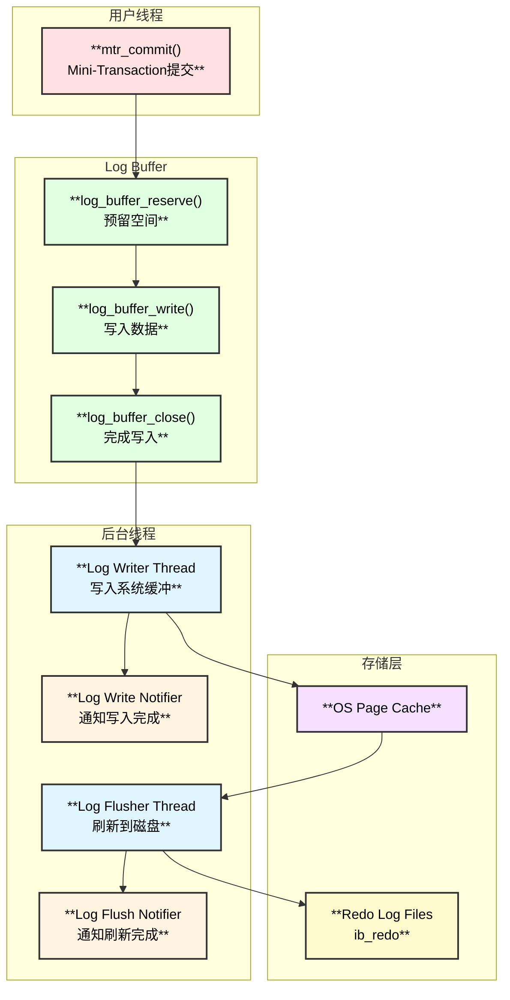
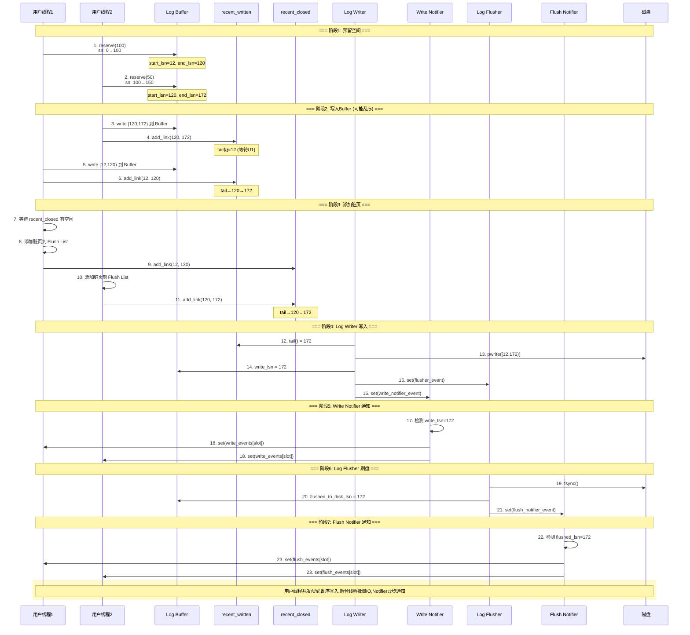

# InnoDB Redo Log 深度源码解析：从写入到落盘的完整旅程

## 开篇引子

你是否遇到过这样的场景：线上 MySQL 数据库在高并发写入时，TPS 突然下降，`SHOW PROCESSLIST` 显示大量事务在等待，而 CPU 和内存都不高？

很多 DBA 第一反应是增大 `innodb_log_buffer_size`，但效果甚微。问题的根源往往隐藏在 Redo Log 的内部机制中——**Log Buffer 争用、recent_written 空间不足、fsync 延迟**都可能成为瓶颈。

本文将带你深入 MySQL 8.0 源码（基于 Percona Server 8.0），揭开 Redo Log 从内存写入到磁盘落盘的完整流程，帮助你理解：

- 用户线程如何**并发无锁**地预留 Log Buffer 空间？
- **recent_written** 和 **recent_closed** 这两个神秘的数据结构是什么？
- Log Writer、Log Flusher、Notifier 线程如何协作？
- 遇到性能问题时，如何通过监控指标定位瓶颈？

---

## 场景展示：一次 INSERT 的 Redo 之旅

从文章“深入MySQL内核：一条INSERT语句背后的事务日志魔法” 中，我们全面了解了insert语句在MySQL内部的运转机制，跟redo落地相关主要涉及到mtr_commit()以及ha_flush_logs()两个函数：
* mtr_commit()： 把redo从MTR buffer中拷贝到redo buffer,并且开始redo落地流程
* ha_flush_logs()：调用log_write_up_to()，设置os_events等待事件，主动等待flushed_to_disk_lsn 被推进到了指定LSN位点，以确保redo 都落地了。
其实INSERT语句背后的 Redo Log 写入过程，涉及**至少 5 个线程**的协作：

```text
┌─────────────────────────────────────────────────────────────────────────────┐
│                    一条 INSERT 的 Redo 写入流程                              │
├─────────────────────────────────────────────────────────────────────────────┤
│                                                                             │
│  用户线程                                                                    │
│  ────────                                                                   │
│    1. mtr_commit() 提交 Mini-Transaction                                    │
│    2. log_buffer_reserve() 预留空间 → 获得 [start_lsn, end_lsn)             │
│    3. log_buffer_write() 写入 Log Buffer                                    │
│    4. recent_written.add_link() 注册完成                                    │
│    5. 等待 write_lsn >= end_lsn (如果需要)                                  │
│                                                                             │
│  Log Writer 线程                                                             │
│  ───────────────                                                            │
│    6. 监控 recent_written.tail()                                            │
│    7. pwrite() 写入 OS Page Cache                                           │
│    8. 更新 write_lsn                                                        │
│                                                                             │
│  Log Flusher 线程                                                            │
│  ────────────────                                                           │
│    9. fsync() 刷盘                                                          │
│    10. 更新 flushed_to_disk_lsn                                             │
│                                                                             │
│  Write/Flush Notifier 线程                                                   │
│  ─────────────────────────                                                  │
│    11. 唤醒等待 LSN 的用户线程                                               │
│                                                                             │
└─────────────────────────────────────────────────────────────────────────────┘
```

---

## 原理深入：Redo Log 整体架构

### 架构概览



## 源码根因揭秘

### 0.Redo Log 数据结构
首先，在开始介绍前，我们可以先看下redo 的数据结构，先清楚下面几个概念：
* redo log buffer 可以理解为是一段循环字节数组(仅保存redo log 数据部分),sn是数组空闲部分开始的位点
* sn是数据部分在redo log buffer中的偏移值，LSN是sn+header+tail的redo log物理存储偏移
* write_lsn redo刷新到OS Cache的checkpoint位点，小于它表示之前的redo都已经写入到OS Cache
* recent_written:一个Link_buf数组，保存了已经写入redo buffer的位点 <start_lsn,end_lsn>信息
* recent_closed: 一个Link_buf数组，保存了已经添加脏页到Flush List的位点 <start_lsn,end_lsn>信息
* Flush List: mysql 需要进行刷脏的page链表
* Dirty Page Flush Thread: 负责把Flush List中的脏页刷新到Disk
* page checkpoint Thread:  负责推进page checkpoint LSN ,小于它表示page已经不需要之前的redo保护了
* Log Writer Thread：负责把redo buffer中的数据刷新到OS Cache中，然后推进write_lsn
* Write Notifier Thread: 负责通知等待write_lsn推进结果的用户线程
* flushed_to_disk_lsn : redo 从OS Cache刷新到Disk的checkpoint位点，小于它表示之前的redo都已经落地
* Log Flusher Thread: 负责把OS Cache中的redo 刷新到Disk，然后推进flushed_to_disk_lsn
* Flush Notifier Thread: 负责通知等待flushed_to_disk_lsn推进结果的用户线程

```text
log_t 结构 - storage/innobase/include/log0sys.h
│
├── 【Log Buffer相关】
│   ├── byte *buf                           【Log Buffer起始地址】
│   ├── size_t buf_size                     【Log Buffer大小(字节)】
│   ├── atomic<sn_t> sn                     【当前序列号(预留空间用)】
│   └── atomic<sn_t> buf_limit_sn           【Buffer可用的最大SN】
│
├── 【写入进度跟踪】
│   ├── atomic<lsn_t> write_lsn             【已写入OS缓冲的LSN】
│   ├── atomic<lsn_t> flushed_to_disk_lsn   【已fsync到磁盘的LSN】
│   ├── Link_buf<lsn_t> recent_written      【跟踪并发写入完成状态】
│   │   └── tail() = buf_ready_for_write_lsn
│   └── Link_buf<lsn_t> recent_closed       【跟踪脏页添加完成状态】
│       └── tail() = buf_dirty_pages_added_up_to_lsn
│
├── 【后台线程同步】
│   ├── os_event_t writer_event             【唤醒Log Writer】
│   ├── os_event_t flusher_event            【唤醒Log Flusher】
│   ├── os_event_t write_notifier_event     【唤醒Write Notifier】
│   ├── os_event_t flush_notifier_event     【唤醒Flush Notifier】
│   ├── os_event_t write_events[]           【用户线程等待write_lsn】
│   └── os_event_t flush_events[]           【用户线程等待flushed_lsn】
│
├── 【互斥锁】
│   ├── rw_lock_t *sn_lock_inst             【保护SN预留的共享锁】
│   ├── atomic<sn_t> sn_locked              【X锁定时的sn值】
│   ├── ib_mutex_t writer_mutex             【保护Writer线程】
│   └── ib_mutex_t flusher_mutex            【保护Flusher线程】
│
└── 【文件管理】
    ├── Log_files_context m_files_ctx       【日志文件上下文】
    └── Log_file m_current_file             【当前写入的日志文件】
```

然后，我们简单解读下redo的运作过程：
阶段1：【User Thread】MTR Buffer -> Redo Buffer
* mtr_commit()函数触发：
* 预订Log Buffer空间，获取<start_lsn,end_lsn>
* 把数据从MTR buffer拷贝到 Redo Buffer
* 更新<start_lsn,end_lsn>到recent_written
* 把脏页添加到Flush List,然后更新<start_lsn,end_lsn>到recent_closed
阶段2：【Log Writer Thread】Redo Buffer -> OS Cache
* 等待：先自旋等待，然后event等待；
* 从recent_written 中获取最大连续的LSN位点
* 检查page checkpoint 确保 Redo文件有足够的空间
* 从Redo Buffer读取数据，准备完整块，然后写入到OS Cache
* 推进 write_lsn，通知Write Notifier唤醒用户线程
* 唤醒 Flusher Thread
阶段3：【Log Flusher Thread】 OS Cache -> Disk
* 等待：先自旋等待，然后event等待
* 检查触发条件：write_lsn > flushed_to_disk_lsn
* 执行fsync()，刷新OS Cache中的数据到Disk
* 推进flushed_to_disk_lsn，通知等待的用户线程

## Redo Log 完整时序图




阶段1：【User Thread】MTR Buffer -> Redo Buffer

```text
mtr_t::commit() - storage/innobase/mtr/mtr0mtr.cc:659
│  【Mini-Transaction 提交入口】
│
├── 创建 Command 对象
│   └── Command cmd(this)
│
├── 检查是否有日志记录需要写入
│   └── has_any_log_record() || has_modifications()
│
└── 执行写入和资源释放
    └── cmd.execute() 或 cmd.release_all() + cmd.release_resources()

mtr_t::Command::execute() - storage/innobase/mtr/mtr0mtr.cc:839
│  【执行Redo写入、添加脏页到Flush List、释放资源】
│
├── 1. 准备写入（计算日志长度）
│   │
│   └── prepare_write() - storage/innobase/mtr/mtr0mtr.cc:757
│       │  【计算需要写入的Redo记录总长度】
│       │
│       ├── 检查日志模式
│       │   └── switch (m_impl->m_log_mode)
│       │       ├── MTR_LOG_NO_REDO / MTR_LOG_NONE → return 0
│       │       └── MTR_LOG_ALL → 继续
│       │
│       ├── len = m_impl->m_log.size()  【获取日志缓冲区大小】
│       │
│       ├── n_recs = m_impl->m_n_log_recs  【获取记录数】
│       │
│       ├── 如果只有1条记录
│       │   └── *m_impl->m_log.front()->begin() |= MLOG_SINGLE_REC_FLAG
│       │
│       └── 如果有多条记录
│           └── mlog_catenate_ulint(&m_impl->m_log, MLOG_MULTI_REC_END, MLOG_1BYTE)
│               └── ++len
│
├── 2. 预留 Log Buffer 空间
│   │
│   └── ★ log_buffer_reserve(*log_sys, len) - storage/innobase/log/log0buf.cc:859
│       │  【关键函数：原子预留空间，返回LSN范围】
│       │
│       ├── srv_stats.log_write_requests.inc()  【统计：MTR提交计数】
│       │
│       ├── 原子获取SN空间
│       │   │
│       │   └── log_buffer_s_lock_enter_reserve() - storage/innobase/log/log0buf.cc:533
│       │       │  【获取S锁并预留空间】
│       │       │
│       │       ├── start_sn = log.sn.fetch_add(len)  【★原子操作：无锁并发】
│       │       │
│       │       └── if ((start_sn & SN_LOCKED) != 0)  【检查X锁】
│       │           │
│       │           └── log_buffer_s_lock_wait() - storage/innobase/log/log0buf.cc:499
│       │               │  【等待X锁释放（如log_buffer_resize时）】
│       │               │  【先CPU自旋等待，达到次数后，注册log.sn_lock_event等待被唤醒】
│       │               └── while ((log.sn.load() & SN_LOCKED) != 0)
│       │                   └── os_event_wait(log.sn_lock_event)
│       │
│       ├── 转换SN到LSN
│       │   ├── handle.start_lsn = log_translate_sn_to_lsn(start_sn)
│       │   └── handle.end_lsn = log_translate_sn_to_lsn(end_sn)
│       │
│       └── 如果空间不足，等待
│           │
│           └── if (end_sn > log.buf_limit_sn.load())
│               │
│               └── log_wait_for_space_after_reserving() - storage/innobase/log/log0buf.cc:701
│                   │  【等待Log Buffer空间】
│                   │
│                   ├── log_wait_for_space_in_log_buf() - storage/innobase/log/log0buf.cc:832
│                   │   │  【等待Log Buffer空间，触发两次，分别是start_lsn,end_lsn，确保有足够的空间，否则不能覆盖写】
│                   │   │  
│                   │   └── log_write_up_to()  【触发log writer thread写入，推进write_lsn，以腾出空间】- storage/innobase/log/log0write.cc:1091
│                   │  【仅在len超过log.buf_size_sn的时候触发大小的自动调整】
│                   └── log_buffer_resize_low() 
│
├── 3. 写入数据到 Log Buffer
│   │
│   └── m_impl->m_log.for_each_block(write_log)
│       │  【遍历MTR的日志块，逐块写入】
│       │
│       └── mtr_write_log_t::operator() - storage/innobase/mtr/mtr0mtr.cc:502
│           │  【写入单个日志块】
│           │
│           ├── start_lsn = m_lsn
│           │
│           ├── 写入数据
│           │   │
│           │   └── ★ log_buffer_write() - storage/innobase/log/log0buf.cc:922
│           │       │  【将数据复制到Log Buffer】
│           │       │
│           │       ├── ptr = log.buf + (start_lsn % log.buf_size)  【计算偏移】
│           │       │
│           │       └── while (true) 【循环复制，处理块边界】
│           │           │
│           │           ├── offset = lsn % OS_FILE_LOG_BLOCK_SIZE
│           │           │
│           │           ├── left = OS_FILE_LOG_BLOCK_SIZE - LOG_BLOCK_TRL_SIZE - offset
│           │           │   【当前块剩余空间】
│           │           │
│           │           ├── ★ std::memcpy(ptr, str, len)  【核心复制操作】
│           │           │
│           │           ├── 更新指针和长度
│           │           │   ├── str_len -= len
│           │           │   ├── str += len
│           │           │   ├── lsn += lsn_diff
│           │           │   └── ptr += lsn_diff
│           │           │
│           │           └── 如果跨块，处理环绕
│           │               └── if (ptr >= buf_end) ptr -= log.buf_size
│           │
│           ├── 如果跨块，设置first_rec_group
│           │   └── log_buffer_set_first_record_group()
│           │
│           └── 通知写入完成
│               │
│               └── ★ log_buffer_write_completed() - storage/innobase/log/log0buf.cc:1061
│                   │  【注册到recent_written，使Log Writer可见】
│                   │
│                   ├── 等待recent_written有空间
│                   │   └── while (!log.recent_written.has_space(start_lsn))
│                   │       ├── os_event_set(log.writer_event)  【唤醒Writer】
│                   │       └── sleep_for(20us)
│                   │
│                   ├── std::atomic_thread_fence(memory_order_release)
│                   │   【内存屏障：确保写入对Writer可见】
│                   │
│                   └── log.recent_written.add_link_advance_tail(start_lsn, end_lsn) - storage/innobase/include/ut0link_buf.h:277
│                       【★注册到Link_buf，推进tail】
|                       │  【添加link并尝试推进tail】
|                       │  【★无锁并发：多线程可同时调用】
|                       │
|                       ├── 获取当前tail位置
|                       │   └── position = m_tail.load(memory_order_acquire)
|                       │
|                       ├── 快速路径：如果from==tail
|                       │   │  【这个link刚好接在tail后面，可以直接推进】
|                       │   │
|                       │   └── if (position == from)
|                       │       └── m_tail.store(to, memory_order_release)
|                       │           【★直接推进tail到to，无需存储link】
|                       │
|                       └── 慢速路径：from > tail
|                           │  【前面还有未完成的link，需要存储】
|                           │
|                           ├── 存储link到slot
|                           │   ├── index = slot_index(from)  【from & (capacity-1)】
|                           │   └── slot.store(to, memory_order_release)
|                           │
|                           └── 尝试推进tail
|                               │
|                               └── advance_tail_until(stop_condition)
|                                   │  【推进直到遇到from之后的位置】
│
├── 4. 等待 recent_closed 有空间
│   │
│   └── log_wait_for_space_in_log_recent_closed() - storage/innobase/log/log0buf.cc:1125
│       │  【确保脏页可以添加到Flush List：recent_closed有空间】
│       │
│       └── while (!log.recent_closed.has_space(lsn))
│           └── sleep_for(20us)
│
├── 5. 添加脏页到 Flush List
│   │
│   └── add_dirty_blocks_to_flush_list(start_lsn, end_lsn) - storage/innobase/mtr/mtr0mtr.cc:827
│       │  【遍历MTR修改的页面，添加到Flush List】
│       │
│       ├── 创建迭代器
│       │   └── Add_dirty_blocks_to_flush_list add_to_flush(start_lsn, end_lsn, m_impl->m_flush_observer)
│       │
│       └── 遍历memo中的块
│           └── m_impl->m_memo.for_each_block_in_reverse(iterator)
│               │
│               └── 对每个修改的页面
│                   └── buf_flush_note_modification() - storage/innobase/include/buf0flu.ic:57
│                       【将页面添加到Buffer Pool的Flush List】
|                      │  【Flush List按oldest_lsn排序，用于刷脏页】
|                      ├── 加锁
|                      │   └── mutex_enter(&block->mutex)
|                      │
|                      ├── 设置页面的newest_modification
|                      │   │  【记录最近修改的LSN】
|                      │   │
|                      │   └── if (end_lsn != 0)
|                      │       └── block->page.set_newest_lsn(end_lsn)
|                      │
|                      ├── 设置Flush Observer
|                      │   └── if (observer != nullptr)
|                      │       └── block->page.set_flush_observer(observer)
|                      │
|                      ├── 检查是否已在Flush List中
|                      │   │
|                      │   └── if (!block->page.is_dirty())
|                      │       │  【首次变脏，需要插入Flush List】
|                      │       │
|                      │       └── buf_flush_insert_into_flush_list(buf_pool, block, start_lsn)
|                      │           │  【按oldest_lsn排序插入】
|                      │           │
|                      │           ├── buf_flush_list_mutex_enter(buf_pool)
|                      │           │
|                      │           ├── block->page.set_oldest_lsn(start_lsn)
|                      │           │   【★oldest_lsn决定页面在Flush List中的位置】
|                      │           │
|                      │           ├── 找到插入位置
|                      │           │   └── 遍历flush_list，找到oldest_lsn >= start_lsn的位置
|                      │           │
|                      │           ├── 插入链表
|                      │           │   └── UT_LIST_INSERT_AFTER(flush_list, ...)
|                      │           │
|                      │           └── buf_flush_list_mutex_exit(buf_pool)
|                      │
|                      └── 释放锁
|                          └── buf_page_mutex_exit(block)
│
├── 6. 关闭 Log Handle（注册到 recent_closed）
│   │
│   └── log_buffer_close() - storage/innobase/log/log0buf.cc:1142
│       │  【通知脏页添加完成】
│       │
│       ├── std::atomic_thread_fence(memory_order_release)
│       │   【内存屏障：确保脏页对Flush线程可见】
│       │
│       └── log_buffer_s_lock_exit_close() - storage/innobase/log/log0buf.cc:570
│           │  【释放sn S锁，注册到recent_closed】
│           ├─ 【"释放"的含义是：通知系统这段LSN范围的操作已完成。通过 recent_closed.tail() 的推进来体现。 】
│           ├─ 【X锁持有者如何等待所有S锁释放：通过等待 recent_closed.tail() 追上特定位置 】
│           └── log.recent_closed.add_link_advance_tail(start_lsn, end_lsn)
│               【★注册到Link_buf，推进tail】
│
├── 7. 释放所有 Latch
│   │
│   └── release_all() - storage/innobase/mtr/mtr0mtr.cc:816
│       │  【释放MTR持有的所有锁】
│       │
│       ├── 遍历memo释放锁
│       │   └── m_impl->m_memo.for_each_block_in_reverse(iterator)
│       │       │
│       │       └── Release_all::operator()
│       │           ├── buf_page_release_latch()  【释放页面锁】
│       │           └── mtr_memo_slot_release()   【释放其他资源】
│       │
│       └── m_locks_released = 1
│
└── 8. 释放资源
    │
    └── release_resources() - storage/innobase/mtr/mtr0mtr.cc:635
        │  【清理MTR内部资源】
        │
        ├── m_impl->m_log.erase()   【清空日志缓冲区】
        │
        ├── m_impl->m_memo.erase()  【清空memo】
        │
        ├── m_impl->m_state = MTR_STATE_COMMITTED
        │
        └── m_impl = nullptr
```

阶段2：【Log Writer Thread】Redo Buffer -> OS Cache


```text
log_writer() - storage/innobase/log/log0write.cc:2263
│  【Log Writer 后台线程主循环】
│  【职责：将 Log Buffer 数据写入 OS Page Cache】
│
├── 初始化
│   ├── log_writer_mutex_enter(log)  【获取writer互斥锁】
│   │
│   └── 创建等待对象
│       └── Log_thread_waiting waiting{log, log.writer_event, 
│               srv_log_writer_spin_delay, get_srv_log_writer_timeout()}
│
└── for (uint64_t step = 0;; ++step)  【主循环】
        │
        ├── 1. 等待条件满足（有数据可写或需要停止）
        │   │
        │   └── waiting.wait(stop_condition)
        │       │  【混合等待：先spin-wait，再event-wait】
        │       │
        │       └── stop_condition 闭包（每次轮询执行）
        │           │
        │           ├── 推进 ready_for_write_lsn
        │           │   │
        │           │   └── log_advance_ready_for_write_lsn() - storage/innobase/log/log0buf.cc:1282
        │           │       │  【推进 recent_written 的 tail】
        │           │       │
        │           │       ├── write_lsn = log.write_lsn.load()
        │           │       │
        │           │       ├── write_max_size = srv_log_write_max_size
        │           │       │   【单次写入最大字节数，默认8KB】
        │           │       │
        │           │       └── log.recent_written.advance_tail_until(stop_condition)
        │           │           │  【遍历Link_buf，推进tail直到遇到空洞或达到最大值】
        │           │           │
        │           │           └── 停止条件: prev_lsn - write_lsn >= write_max_size
        │           │
        │           ├── 获取可写入的最大LSN
        │           │   │
        │           │   └── ready_lsn = log_buffer_ready_for_write_lsn() - storage/innobase/include/log0buf.h:250
        │           │       │
        │           │       └── return log.recent_written.tail()
        │           │           【★recent_written.tail就是可安全写入的最大连续LSN】
        │           │
        │           └── 检查是否满足条件
        │               └── return (log.write_lsn.load() < ready_lsn) 
        │                       || log.should_stop_threads.load()
        │
        ├── 2. 检查是否有数据需要写入
        │   │
        │   └── if (log.write_lsn.load() < ready_lsn)
        │
        └── 3. 执行写入
            │
            └── ★ log_writer_write_buffer(log, ready_lsn) - storage/innobase/log/log0write.cc:2129
                │  【核心写入函数】
                │
                ├── 计算写入范围
                │   ├── last_write_lsn = log.write_lsn.load()
                │   ├── start_offset = last_write_lsn % log.buf_size
                │   └── end_offset = next_write_lsn % log.buf_size
                │
                ├── 等待 Checkpoint 推进（确保Redo文件有空间）
                │   │
                │   └── log_writer_wait_on_checkpoint() - storage/innobase/log/log0write.cc:1908
                │       │  【等待checkpoint推进，防止覆盖未checkpoint的日志】
                │       │
                │       ├── 乐观检查
                │       │   │
                │       │   └── log_writer_wait_on_checkpoint_optimistic() - :1901
                │       │       │
                │       │       ├── checkpoint_lsn = log.last_checkpoint_lsn.load()
                │       │       │
                │       │       ├── hard_limited_lsn = checkpoint_lsn + hard_logical_capacity
                │       │       │   【硬限制：不能超过checkpoint太远】
                │       │       │
                │       │       └── 检查是否进入extra_margin
                │       │           └── log_writer_extra_margin_check()
                │       │
                │       └── 如果乐观检查失败，悲观等待
                │           │
                │           └── log_writer_wait_on_checkpoint_pessimistic() - :1918
                │               │
                │               ├── os_event_set(log.checkpointer_event)
                │               │   【请求Checkpointer推进checkpoint】
                │               │
                │               └── while (true)
                │                   ├── os_event_wait(log.next_checkpoint_event)
                │                   └── 如果5秒没推进，打印错误日志
                │
                ├── 等待 Archiver（如果启用了归档）
                │   │
                │   └── if (arch_log_sys != nullptr)
                │       └── log_writer_wait_on_archiver()
                │
                ├── 准备写入缓冲区
                │   ├── buf_begin = log.buf + align_down(start_offset)
                │   └── buf_end = log.buf + end_offset
                │
                └── 执行实际写入
                    │
                    └── ★ log_write_buffer() - storage/innobase/log/log0write.cc:1726
                        │  【处理 write-ahead、调用系统写入】
                        │
                        ├── 验证缓冲区
                        │   └── validate_buffer(), validate_start_lsn()
                        │
                        ├── 计算文件偏移
                        │   └── real_offset = log.m_current_file.offset(start_lsn)
                        │
                        ├── 计算写入大小
                        │   │
                        │   └── compute_how_much_to_write() - :1555
                        │       │  【考虑write-ahead策略计算实际写入量】
                        │       │
                        │       └── 返回: write_size, write_from_log_buffer
                        │
                        ├── 准备完整块（填充块头/尾、校验和）
                        │   │
                        │   └── prepare_full_blocks() - :1462
                        │       │
                        │       └── 对每个完整块:
                        │           ├── log_block_set_hdr_no()      【设置块号】
                        │           ├── log_block_set_data_len()    【设置数据长度】
                        │           ├── log_block_set_epoch_no()    【设置epoch】
                        │           └── log_block_set_checksum()    【★CRC32校验和】
                        │
                        ├── 处理 write-ahead
                        │   │
                        │   └── if (!write_from_log_buffer)
                        │       │  【需要使用write_ahead_buf】
                        │       │
                        │       ├── copy_to_write_ahead_buffer() - :1623
                        │       │   │  【复制数据到write_ahead_buf】
                        │       │   │
                        │       │   └── std::memcpy(log.write_ahead_buf, buffer, write_size)
                        │       │
                        │       └── prepare_for_write_ahead() - :1677
                        │           │  【填充0到对齐边界，防止read-on-write】
                        │           │
                        │           └── std::memset(log.write_ahead_buf + write_size, 0, 
                        │                   written_ahead)
                        │
                        ├── 执行实际写入
                        │   │
                        │   └── write_blocks() - :1502  storage/innobase/log/log0write.cc:1572
                        │       │  【调用底层I/O】
                        │       │
                        │       └── log_data_blocks_write() - :1484  - storage/innobase/log/log0write.cc:1484
                        │       |   │
                        │       |   └── log.m_current_file_handle.write()
                        │       |       │  【pwrite系统调用】
                        │       |       │
                        │       |       └── os_file_pwrite()
                        │       |           └── pwrite(fd, buf, size, offset)
                        |       └── 归档Hook（如果启用）
                        |           └── meb::redo_log_archive_produce(write_buf, write_size)                    
                        │
                        ├── 更新 write_lsn
                        │   │
                        │   └── log.write_lsn.store(new_write_lsn)
                        │       【★原子更新，使Flusher和用户线程可见】
                        │
                        ├── 通知 write_lsn 推进
                        │   │
                        │   └── notify_about_advanced_write_lsn() - :1240 - storage/innobase/log/log0write.cc:1595
                        |       |  【唤醒Log Flusher: srv_flush_log_at_trx_commit == 1】
                        |       ├── os_event_set(log.flusher_event);
                        │       │  【通知等待写入完成的线程】
                        │       │
                        │       ├── 计算slot范围
                        │       │   ├── first_slot = log_compute_write_event_slot(old_write_lsn+1)
                        │       │   └── last_slot = log_compute_write_event_slot(new_write_lsn)
                        │       │
                        │       └── 通知
                        │       |   └── if (first_slot == last_slot)
                        │       |       │   os_event_set(log.write_events[first_slot])
                        │       |       else
                        │       |           os_event_set(log.write_notifier_event)
                        │       |           【跨多个slot时，唤醒Write Notifier】
                        │       ├──  os_event_set(log_archiver_thread_event); 
                        │       |   【如果有归档，则唤醒归档线程】 
                        │
                        ├── 更新 buf_limit
                        │   │
                        │   └── log_update_buf_limit()
                        │       【更新Log Buffer可用空间限制】
                        |   ┌─────────────────────────────────────────────────────────────────────────────┐
                        |   │                    buf_limit_sn 计算公式                                     │
                        |   ├─────────────────────────────────────────────────────────────────────────────┤
                        |   │                                                                             │
                        |   │  buf_limit_sn = write_sn + buf_size_sn - 2 * BLOCK_SIZE                     │
                        |   │                                                                             │
                        |   │  图示（Log Buffer 环形缓冲区）:                                              │
                        |   │  ┌────────────────────────────────────────────────────────┐                 │
                        |   │  │                                                        │                 │
                        |   │  │  write_lsn      sn (当前预留位置)     buf_limit_sn     │                 │
                        |   │  │     ↓               ↓                      ↓           │                 │
                        |   │  │  ───┼───────────────┼──────────────────────┼───────    │                 │
                        |   │  │     │<--已写入OS--->│<----可继续预留------>│           │                 │
                        |   │  │     │               │                      │           │                 │
                        |   │  │     │<────────── buf_size_sn ─────────────>│           │                 │
                        |   │  │     │                          (减去2个块余量)         │                 │
                        |   │  │                                                        │                 │
                        |   │  └────────────────────────────────────────────────────────┘                 │
                        |   │                                                                             │
                        |   │  为什么减去 2 * OS_FILE_LOG_BLOCK_SIZE (1024字节)？                         │
                        |   │  - 预留安全边距，避免追尾                                                    │
                        |   │  - 一个块给 Log Writer 正在写的不完整块                                      │
                        |   │  - 一个块防止 sn 精确追上 write_lsn 导致的判断问题                           │
                        |   │                                                                             │
                        |   └─────────────────────────────────────────────────────────────────────────────┘ 
                        │          
                        ├── 更新统计
                        │   ├── srv_stats.os_log_pending_writes.dec()
                        │   ├── srv_stats.log_writes.inc()
                        │   ├── srv_stats.os_log_written.add(write_size - written_ahead)
                        │   └── MONITOR_SET(MONITOR_LOG_FREE_SPACE, free_space)
```

阶段3：【Log Flusher Thread】 OS Cache -> Disk

```text
log_flusher() - storage/innobase/log/log0write.cc:2528
│  【Log Flusher 后台线程主循环】
│  【职责：将 OS Page Cache 中的数据 fsync 到磁盘】
│
├── 初始化
│   ├── 创建等待对象
│   │   └── Log_thread_waiting waiting{log, log.flusher_event,
│   │           srv_log_flusher_spin_delay, get_srv_log_flusher_timeout()}
│   │
│   └── log_flusher_mutex_enter(log)  【获取flusher互斥锁】
│
└── for (uint64_t step = 0;; ++step)  【主循环】
        │
        ├── 1. 检查是否需要停止
        │   │
        │   └── if (log.should_stop_threads.load())
        │       └── if (!log_writer_is_active()) break
        │           【只有Writer停止后，Flusher才能退出】
        │
        ├── 2. 处理暂停请求
        │   │
        │   └── if (log.writer_threads_paused.load())
        │       ├── log_flusher_mutex_exit(log)
        │       ├── os_event_wait(log.writer_threads_resume_event)
        │       └── log_flusher_mutex_enter(log)
        │
        ├── 3. 等待条件满足（有数据可刷或需要停止）
        │   │
        │   └── waiting.wait(stop_condition)
        │       │  【混合等待：先spin-wait，再event-wait】
        │       │
        │       └── stop_condition 闭包（每次轮询执行）
        │           │
        │           ├── 获取当前已刷新的LSN
        │           │   └── last_flush_lsn = log.flushed_to_disk_lsn.load()
        │           │
        │           ├── 检查是否有数据需要刷新
        │           │   └── if (last_flush_lsn < log.write_lsn.load())
        │           │
        │           └── 如果需要刷新，执行刷新
        │               │
        │               └── ★ log_flush_low(log) - storage/innobase/log/log0write.cc:2454
        │                   │  【核心刷新函数】
        │                   │
        │                   ├── 重置 flusher_event
        │                   │   │
        │                   │   └── if (!log.writer_threads_paused.load())
        │                   │       └── os_event_reset(log.flusher_event)
        │                   │
        │                   ├── 获取需要刷新的范围
        │                   │   ├── last_flush_lsn = log.flushed_to_disk_lsn.load()
        │                   │   └── flush_up_to_lsn = log.write_lsn.load()
        │                   │
        │                   ├── 提前返回检查
        │                   │   │
        │                   │   └── if (flush_up_to_lsn == last_flush_lsn)
        │                   │       ├── os_event_set(log.old_flush_event)
        │                   │       └── return
        │                   │
        │                   ├── 记录刷新开始时间
        │                   │   └── log.last_flush_start_time = Log_clock::now()
        │                   │
        │                   ├── ★ 执行 fsync
        │                   │   │
        │                   │   └── if (do_flush)  【do_flush = (flush_method != O_DSYNC)】
        │                   │       │
        │                   │       └── log.m_current_file_handle.fsync()
        │                   │           │  【调用操作系统 fsync】
        │                   │           │
        │                   │           └── pfs_os_file_fsync() - storage/innobase/os/os0file.cc
        │                   │               │
        │                   │               └── fsync(fd)  【POSIX fsync系统调用】
        │                   │                   【将OS Page Cache刷到磁盘】
        │                   │
        │                   ├── 记录刷新结束时间
        │                   │   └── log.last_flush_end_time = Log_clock::now()
        │                   │
        │                   ├── ★ 更新 flushed_to_disk_lsn
        │                   │   │
        │                   │   └── log.flushed_to_disk_lsn.store(flush_up_to_lsn)
        │                   │       【原子更新，使用户线程可见】
        │                   │
        │                   ├── 通知等待的用户线程
        │                   │   │
        │                   │   └── if (!log.writer_threads_paused.load())
        │                   │       │
        │                   │       ├── 计算slot范围
        │                   │       │   ├── first_slot = log_compute_flush_event_slot(last_flush_lsn + 1)
        │                   │       │   │   │
        │                   │       │   │   └── slot = ((lsn - 1) / OS_FILE_LOG_BLOCK_SIZE) 
        │                   │       │   │           % log.flush_events_size
        │                   │       │   │
        │                   │       │   └── last_slot = log_compute_flush_event_slot(flush_up_to_lsn)
        │                   │       │
        │                   │       └── 通知
        │                   │           └── if (first_slot == last_slot)
        │                   │               │   【只涉及一个slot，直接通知】
        │                   │               │
        │                   │               │   os_event_set(log.flush_events[first_slot])
        │                   │               │   【唤醒等待该slot的用户线程】
        │                   │               else
        │                   │                   【跨多个slot，唤醒Flush Notifier】
        │                   │
        │                   │                   os_event_set(log.flush_notifier_event)
        │                   │                   【让Flush Notifier批量通知】
        │                   │
        │                   └── 更新统计信息
        │                       │
        │                       └── log_flush_update_stats() - storage/innobase/log/log0write.cc:2442
        │                           │
        │                           ├── log.n_log_ios++  【I/O计数】
        │                           │
        │                           ├── 计算刷新延迟
        │                           │   └── flush_time = last_flush_end_time - last_flush_start_time
        │                           │
        │                           └── 更新Monitor
        │                               ├── MONITOR_INC(MONITOR_LOG_FLUSHES)
        │                               ├── MONITOR_SET(MONITOR_LOG_FLUSH_AVG_TIME, avg)
        │                               └── MONITOR_SET(MONITOR_LOG_FLUSH_MAX_TIME, max)
        │
        └── 4. innodb_flush_log_at_trx_commit != 1 时的定时刷新
            │
            └── if (srv_flush_log_at_trx_commit != 1)
                │  【非每次事务刷新模式】
                │
                ├── 计算距离上次刷新的时间
                │   └── time_elapsed = current_time - log.last_flush_start_time
                │
                ├── 获取刷新间隔
                │   └── flush_every = get_srv_flush_log_at_timeout()
                │       【默认1秒，由innodb_flush_log_at_timeout控制】
                │
                └── 如果未到时间，设置超时等待
                    └── if (time_elapsed < flush_every)
                        └── waiting.wait(stop_condition, 
                                flush_every - time_elapsed)
```

问题剖析：
1. 为什么需要预留Log Buffer空间？recent_written有什么用？
最大化用户并发写入，提升TPS。
我们知道redo需要顺序写，因此我们需要在log buffer中同样保持顺序性，因此我们在给用户预留空间的时候是sn是通过原子写的方式推进分配的。这样不同用户线程就可以知道自己写入的空间范围，然后并发写入。写完之后，通过recent_written进行乱序跟踪，Log writer thread通过recent_written可以发现哪些redo已经连续写完了，这样就可以把redo 从redo buffer中写到OS Cache了。
对于recent_written的覆盖写问题，如果tail已经超过了你要写的position，说明前面的已经被处理了，可以安全覆盖。

```text
┌─────────────────────────────────────────────────────────────────────────────┐
│                    Link Buffer (recent_written) 原理                        │
├─────────────────────────────────────────────────────────────────────────────┤
│                                                                             │
│  【数据结构】                                                                │
│  ┌─────────────────────────────────────────────────────────────────────┐    │
│  │ template <typename Position = lsn_t>                                │    │
│  │ class Link_buf {                                                    │    │
│  │     atomic<Position> *m_links;    // 槽位数组（无锁）               │    │
│  │     size_t m_capacity;            // 容量（默认1MB）                │    │
│  │     atomic<Position> m_tail;      // 连续完成的最大位置             │    │
│  │ };                                                                  │    │
│  │                                                                      │    │
│  │ 代码位置: storage/innobase/include/ut0link_buf.h                    │    │
│  └─────────────────────────────────────────────────────────────────────┘    │
│                                                                             │
│  【工作示例】                                                                │
│  ┌─────────────────────────────────────────────────────────────────────┐    │
│  │ 场景：3个用户线程并发写入，完成顺序与预留顺序不同                     │    │
│  │                                                                      │    │
│  │ 时间线：                                                             │    │
│  │   T1: 线程A预留 [0, 100)   → start_sn=0                              │    │
│  │   T2: 线程B预留 [100, 200) → start_sn=100                            │    │
│  │   T3: 线程C预留 [200, 300) → start_sn=200                            │    │
│  │   T4: 线程C完成写入 → add_link(200, 300)                             │    │
│  │   T5: 线程A完成写入 → add_link(0, 100)                               │    │
│  │   T6: 线程B完成写入 → add_link(100, 200)                             │    │
│  │                                                                      │    │
│  │ Link Buffer 状态变化：                                                │    │
│  │                                                                      │    │
│  │   T4后：slot[200]=300, tail=0（线程C完成，但前面有空洞）              │    │
│  │         [0    ][    ][    ][200→300][    ]...                        │    │
│  │          ↑tail                                                       │    │
│  │                                                                      │    │
│  │   T5后：slot[0]=100, tail→100                                        │    │
│  │         [0→100][    ][    ][200→300][    ]...                        │    │
│  │                 ↑tail                                                │    │
│  │                                                                      │    │
│  │   T6后：slot[100]=200, tail→100→200→300                              │    │
│  │         [0→100][100→200][    ][200→300][    ]...                     │    │
│  │                                    ↑tail=300                         │    │
│  │                                                                      │    │
│  └─────────────────────────────────────────────────────────────────────┘    │
│                                                                             │
│  【核心方法】                                                                │
│  ┌─────────────────────────────────────────────────────────────────────┐    │
│  │ add_link(from, to):                                                 │    │
│  │   - 原子更新 m_links[from % capacity] = to                           │    │
│  │   - 尝试推进 tail（如果是连续的链接）                                   │    │
│  │因此，recent_written 数组中并不是直接保存<start_lsn,end_lsn>，           │    │
│  │而是通过start_lsn计算槽位，然后保存end_lsn到数组中。                      │    │
│  │recent_closed也类似                                                  │    │
│  │                                                                    │    │
│  │ tail():                                                            │    │
│  │   - 返回连续完成的最大位置                                             │    │
│  │   - Log Writer 用它来确定可以安全写入的范围                             │    │
│  └─────────────────────────────────────────────────────────────────────┘    │
│                                                                             │
└─────────────────────────────────────────────────────────────────────────────┘
```


```text
Link_buf<Position>::has_space() - storage/innobase/include/ut0link_buf.h:407
│  【检查指定位置是否可以添加link】
│  【防止覆盖未处理的slot】
│
├── 获取当前tail
│   └── tail = m_tail.load(memory_order_acquire)
│
├── 检查是否有空间
│   │  【★关键：position必须在[tail, tail+capacity)范围内】
│   │
│   └── if (tail + m_capacity > position) return true
│       【position在窗口内，可以使用】
│
├── 尝试推进tail
│   │  【可能有link已完成但tail未推进】
│   │
│   └── advance_tail_until(stop_condition, 0)
│
└── 再次检查
    └── return tail + m_capacity > position

Link_buf<Position>::add_link_advance_tail() - storage/innobase/include/ut0link_buf.h:277
│  【添加link并尝试推进tail】
│  【★无锁并发：多线程可同时调用】
│
├── 获取当前tail位置
│   └── position = m_tail.load(memory_order_acquire)
│
├── 快速路径：如果from==tail
│   │  【这个link刚好接在tail后面，可以直接推进】
│   │
│   └── if (position == from)
│       └── m_tail.store(to, memory_order_release)
│           【★直接推进tail到to，无需存储link】
│
└── 慢速路径：from > tail
    │  【前面还有未完成的link，需要存储】
    │
    ├── 存储link到slot
    │   ├── index = slot_index(from)  【from & (capacity-1)】
    │   └── slot.store(to, memory_order_release)
    │
    └── 尝试推进tail
        │
        └── advance_tail_until(stop_condition)
            │  【推进直到遇到from之后的位置】

Link_buf<Position>::advance_tail_until() - storage/innobase/include/ut0link_buf.h:306
│  【推进tail直到stop_condition返回true或遇到空洞】
│  【★单线程安全推进（通过CAS获取独占权）】
│
├── 获取当前tail
│   └── position = m_tail.load(memory_order_acquire)
│
├── 阶段1：尝试获取独占推进权
│   │
│   └── while (true)
│       ├── index = slot_index(position)
│       ├── next_load = slot.load(memory_order_acquire)
│       │
│       ├── 检查是否有效link
│       │   └── if (next_load <= position || stop_condition(...))
│       │       └── return false  【无link或达到停止条件】
│       │
│       └── CAS尝试锁定slot
│           │  【★关键：将slot值改为position，表示正在推进】
│           │
│           └── if (slot.compare_exchange_strong(next_load, position))
│               └── 获取成功，进入阶段2
│
├── 阶段2：独占推进tail
│   │  【此时已获得推进权，可以安全遍历】
│   │
│   └── while (true)
│       ├── 查找下一个link
│       │   └── next_position(position, next)
│       │
│       ├── 检查是否停止
│       │   └── if (stop || stop_condition(...)) break
│       │
│       └── position = next  【继续推进】
│
└── 更新tail
    └── m_tail.store(position, memory_order_release)

Link_buf<Position>::tail() - storage/innobase/include/ut0link_buf.h:402
│  【获取当前tail值】
│
└── return m_tail.load(memory_order_acquire)
    【★tail就是最大连续完成的位置】
    【对于recent_written: tail = 可安全写入OS的最大LSN】
    【对于recent_closed: tail = 脏页已全部添加的最大LSN】
```

2. LSN 跟SN 是怎么相互转换的？
上面我们介绍过，SN 描述的时候MTR数据在redo buffer中的偏移起点，其实LSN是SN+log header+log tail在redo 文件中的偏移起点。sn是MySQL内存维度的描述，通过LOG_BLOCK_DATA_SIZE换算；lsn是操作系统文件维度的描述，通过OS_FILE_LOG_BLOCK_SIZE换算。

```text
| 概念 | 全称 | 说明 |
|:-----|:-----|:-----|
| **SN** | Sequence Number | 只计算实际数据字节的序列号，不包含块头和块尾 |
| **LSN** | Log Sequence Number | 计算所有字节的序列号，包括块头(12B)和块尾(4B) |
```

```text
┌─────────────────────────────────────────────────────────────────────────────┐
│                        SN → LSN 转换                                         │
├─────────────────────────────────────────────────────────────────────────────┤
│                                                                             │
│  lsn = sn / LOG_BLOCK_DATA_SIZE * OS_FILE_LOG_BLOCK_SIZE                   │
│      + sn % LOG_BLOCK_DATA_SIZE                                             │
│      + LOG_BLOCK_HDR_SIZE                                                   │
│                                                                             │
│  代入常量:                                                                   │
│  lsn = (sn / 496) * 512 + (sn % 496) + 12                                  │
│                                                                             │
├─────────────────────────────────────────────────────────────────────────────┤
│  代码位置: storage/innobase/include/log0log.h:85                            │
│                                                                             │
│  constexpr inline lsn_t log_translate_sn_to_lsn(sn_t sn) {                 │
│    return sn / LOG_BLOCK_DATA_SIZE * OS_FILE_LOG_BLOCK_SIZE +              │
│           sn % LOG_BLOCK_DATA_SIZE + LOG_BLOCK_HDR_SIZE;                   │
│  }                                                                          │
└─────────────────────────────────────────────────────────────────────────────┘
```

```text
┌─────────────────────────────────────────────────────────────────────────────┐
│                        LSN → SN 转换                                         │
├─────────────────────────────────────────────────────────────────────────────┤
│                                                                             │
│  // 计算lsn所在块的起始sn                                                    │
│  sn = (lsn / OS_FILE_LOG_BLOCK_SIZE) * LOG_BLOCK_DATA_SIZE                 │
│                                                                             │
│  // 计算lsn在块内的偏移                                                      │
│  diff = lsn % OS_FILE_LOG_BLOCK_SIZE                                       │
│                                                                             │
│  // 根据偏移位置决定返回值                                                    │
│  if (diff < LOG_BLOCK_HDR_SIZE) {                                          │
│      return sn;  // 在块头内，返回块起始sn                                   │
│  }                                                                          │
│  if (diff > OS_FILE_LOG_BLOCK_SIZE - LOG_BLOCK_TRL_SIZE) {                 │
│      return sn + LOG_BLOCK_DATA_SIZE;  // 在块尾内，返回下一块起始sn         │
│  }                                                                          │
│  return sn + diff - LOG_BLOCK_HDR_SIZE;  // 在数据区，返回对应sn            │
│                                                                             │
├─────────────────────────────────────────────────────────────────────────────┤
│  代码位置: storage/innobase/include/log0log.h:94                            │
└─────────────────────────────────────────────────────────────────────────────┘
```

```text
转换示例详解:

【示例1】SN = 0
  lsn = (0 / 496) * 512 + (0 % 496) + 12
      = 0 * 512 + 0 + 12
      = 12
  → LSN 12 是第一个块数据区的起始位置

【示例2】SN = 496 (第一个块写满)
  lsn = (496 / 496) * 512 + (496 % 496) + 12
      = 1 * 512 + 0 + 12
      = 524
  → LSN 524 是第二个块数据区的起始位置

【示例3】SN = 248 (第一个块写一半)
  lsn = (248 / 496) * 512 + (248 % 496) + 12
      = 0 * 512 + 248 + 12
      = 260
  → LSN 260 在第一个块数据区中间

【示例4】SN = 1000
  lsn = (1000 / 496) * 512 + (1000 % 496) + 12
      = 2 * 512 + 8 + 12
      = 1044
  → LSN 1044 在第三个块数据区起始附近
```

3. redo 为什么不需要类似Double Write的机制解决半写问题？
不需要，是因为它的写入基本单位是跟OS_FILE_LOG_BLOCK_SIZE对齐的，也就是本身就是原子写的。
另外，redo header中有连续编号hdr_no跟epoch_no，data len，redo tail有CRC32 checksum。这些可以用作校验数据的完整性。
redo是顺序追加的并且是幂等的。不会原地更新。即使最后一个块写失败，之前的块仍然完整。丢失最后几个未完成的记录可以接受（事务未提交）

```text
┌─────────────────────────────────────────────────────────────────────────────┐
│                    Data Page vs Redo Log 的半页写问题                        │
├─────────────────────────────────────────────────────────────────────────────┤
│                                                                             │
│  【Data Page 问题】                                                          │
│  ┌─────────────────────────────────────────────────────────────────────┐    │
│  │ 问题：                                                               │    │
│  │   - 数据页大小 16KB，磁盘原子写入通常 512B                            │    │
│  │   - 写入16KB需要32次原子操作                                         │    │
│  │   - 崩溃时可能只写入部分扇区，导致页面损坏                            │    │
│  │                                                                      │    │
│  │ 解决方案：Double Write Buffer                                        │    │
│  │   1. 先将脏页写入 doublewrite buffer (顺序写)                        │    │
│  │   2. 再写入实际数据文件位置 (随机写)                                  │    │
│  │   3. 崩溃恢复时，从 doublewrite 恢复损坏的页                          │    │
│  └─────────────────────────────────────────────────────────────────────┘    │
│                                                                             │
│  【Redo Log 问题及解决】                                                     │
│  ┌─────────────────────────────────────────────────────────────────────┐    │
│  │ 特点：                                                               │    │
│  │   - Redo块大小 512B = 磁盘扇区大小                                    │    │
│  │   - 每个块的写入是原子的（硬件保证）                                   │    │
│  │   - 不需要额外的 Double Write 机制                                    │    │
│  │                                                                      │    │
│  │ 但仍需处理的问题：                                                    │    │
│  │   - 块是否完整写入？                                                  │    │
│  │   - 块内容是否损坏？                                                  │    │
│  │                                                                      │    │
│  │ 解决方案：Checksum + Block Header 验证                               │    │
│  └─────────────────────────────────────────────────────────────────────┘    │
│                                                                             │
└─────────────────────────────────────────────────────────────────────────────┘
```

```text
┌─────────────────────────────────────────────────────────────────────────────┐
│                        OS_FILE_LOG_BLOCK_SIZE = 512 Bytes                    │
├─────────────────────────────────────────────────────────────────────────────┤
│                                                                             │
│  ┌─────────────────────────────┐                                            │
│  │   LOG_BLOCK_HDR_SIZE = 12B  │  ← 块头 (Header)                           │
│  │   ├─ hdr_no      (4B)       │     日志块编号【块号 = (lsn / OS_FILE_LOG_BLOCK_SIZE) & 0x3FFFFFFF】│
│  │   ├─ data_len    (2B)       │     有效数据长度                            │
│  │   ├─ first_rec   (2B)       │     第一个mtr记录组偏移                      │
│  │   └─ epoch_no    (4B)       │     纪元编号(用于检测块是否被覆盖)【epoch = log_files_capacity / OS_FILE_LOG_BLOCK_SIZE】│
│  └─────────────────────────────┘                                            │
│                                                                             │
│  ┌─────────────────────────────┐                                            │
│  │  LOG_BLOCK_DATA_SIZE = 496B │  ← 数据区域 (SN只计算这部分)               │
│  │                             │                                            │
│  │    实际的 Redo 日志数据      │                                            │
│  │                             │                                            │
│  └─────────────────────────────┘                                            │
│                                                                             │
│  ┌─────────────────────────────┐                                            │
│  │   LOG_BLOCK_TRL_SIZE = 4B   │  ← 块尾 (Trailer)                          │
│  │   └─ checksum    (4B)       │     校验和                                  │
│  └─────────────────────────────┘                                            │
│                                                                             │
└─────────────────────────────────────────────────────────────────────────────┘

常量关系:
  OS_FILE_LOG_BLOCK_SIZE = LOG_BLOCK_HDR_SIZE + LOG_BLOCK_DATA_SIZE + LOG_BLOCK_TRL_SIZE
                 512     =        12          +         496         +          4
```

```text
┌─────────────────────────────────────────────────────────────────────────────┐
│                    Redo Log Block 完整性验证                                 │
├─────────────────────────────────────────────────────────────────────────────┤
│                                                                             │
│  【1. Block Header 验证】                                                    │
│  ┌─────────────────────────────────────────────────────────────────────┐    │
│  │ hdr_no (块编号)：                                                    │    │
│  │   - 每个块有唯一的递增编号                                           │    │
│  │   - 恢复时检查编号是否连续                                           │    │
│  │   - 编号不匹配 → 日志结束或损坏                                       │    │
│  │                                                                      │    │
│  │ epoch_no (纪元编号)：                                                │    │
│  │   - 帮助检测旧的日志块（日志文件循环使用时）                          │    │
│  │   - 防止读取到上一轮的旧数据                                         │    │
│  │                                                                      │    │
│  │ 代码：log0recv.cc:3415                                               │    │
│  │   if (block_header.m_hdr_no != expected_hdr_no) {                   │    │
│  │       // 垃圾数据或未完成写入的块                                     │    │
│  │       finished = true;                                              │    │
│  │   }                                                                 │    │
│  └─────────────────────────────────────────────────────────────────────┘    │
│                                                                             │
│  【2. Checksum 校验】                                                        │
│  ┌─────────────────────────────────────────────────────────────────────┐    │
│  │ 写入时：                                                             │    │
│  │   - Log Writer 在写入前计算 CRC32 校验和                             │    │
│  │   - 存储在块尾的 4 字节 checksum 字段                                │    │
│  │                                                                      │    │
│  │ 恢复时：                                                             │    │
│  │   - 重新计算块内容的 CRC32                                           │    │
│  │   - 与存储的 checksum 比较                                           │    │
│  │   - 不匹配 → 块损坏或未完成写入                                       │    │
│  │                                                                      │    │
│  │ 代码：log0recv.cc:3428                                               │    │
│  │   if (!log_block_checksum_is_ok(log_block)) {                       │    │
│  │       // 校验失败，视为日志结束                                       │    │
│  │       finished = true;                                              │    │
│  │   }                                                                 │    │
│  │                                                                      │    │
│  │ 校验算法：log0files_io.h:560                                         │    │
│  │   ut_crc32(log_block, OS_FILE_LOG_BLOCK_SIZE - LOG_BLOCK_TRL_SIZE)  │    │
│  └─────────────────────────────────────────────────────────────────────┘    │
│                                                                             │
│  【3. Data_len 验证】                                                        │
│  ┌─────────────────────────────────────────────────────────────────────┐    │
│  │ - data_len 记录块内有效数据的长度                                    │    │
│  │ - 有效范围: LOG_BLOCK_HDR_SIZE(12) ~ OS_FILE_LOG_BLOCK_SIZE(512)    │    │
│  │ - 超出范围 → 块损坏                                                  │    │
│  │ - 小于512表示这是日志的最后一个块                                     │    │
│  └─────────────────────────────────────────────────────────────────────┘    │
│                                                                             │
└─────────────────────────────────────────────────────────────────────────────┘
```

4. 为什么需要分离独立的writer/flusher notifier线程出来？
解耦I/O操作，避免Notifier堵塞IO线程；通过pthread_cond可以做到批量通知。
不过，需要注意的是os_events数组的slot是根据start_lsn取模数组容量换算的，可能会有重复，因此用户线程被唤醒后，需要检查确认是否LSN是否真的追上了，否则重新设置时间等待，加入到pthread_cond的等待队列中。

```text
┌─────────────────────────────────────────────────────────────────────────────┐
│                        事件槽位映射示意图                                   │
├─────────────────────────────────────────────────────────────────────────────┤
│                                                                             │
│  LSN 范围                        槽位计算                  events[slot]      │
│  ─────────────────────────────────────────────────────────────────────────  │
│                                                                             │
│  [1, 512]          → (1-1)/512 % 2048 = 0       → events[0]                │
│  [513, 1024]       → (513-1)/512 % 2048 = 1     → events[1]                │
│  [1025, 1536]      → (1025-1)/512 % 2048 = 2    → events[2]                │
│       ...                 ...                         ...                   │
│  [1047553, 1048064] → slot = 2047               → events[2047]             │
│  [1048065, 1048576] → slot = 0                  → events[0]   (循环)       │
│                                                                             │
│  ┌───┬───┬───┬───┬───┬────────────────────────────────┬────────┐           │
│  │ 0 │ 1 │ 2 │ 3 │...│                                │  2047  │           │
│  └───┴───┴───┴───┴───┴────────────────────────────────┴────────┘           │
│    ↑                                                     ↑                  │
│  同一个 slot 可能有多个 LSN 范围的线程在等待                                │
│  Notifier 唤醒后，线程需要重新检查自己的 LSN 是否满足                       │
│                                                                             │
└─────────────────────────────────────────────────────────────────────────────┘
```

```text
┌─────────────────────────────────────────────────────────────────────────────┐
│                    Linux pthread_cond 实现架构                              │
├─────────────────────────────────────────────────────────────────────────────┤
│                                                                             │
│  用户空间 (glibc/NPTL)                                                      │
│  ────────────────────                                                       │
│  ┌─────────────────────────────────────────────────────────────────────┐   │
│  │  pthread_cond_wait():                                               │   │
│  │    1. 原子地释放 mutex 并进入等待                                    │   │
│  │    2. 调用 futex(FUTEX_WAIT) 系统调用                               │   │
│  │    3. 被唤醒后重新获取 mutex                                        │   │
│  │    4. 返回用户代码                                                  │   │
│  └─────────────────────────────────────────────────────────────────────┘   │
│                                      ↓                                      │
│                            ════════════════                                 │
│                              系统调用边界                                    │
│                            ════════════════                                 │
│                                      ↓                                      │
│  内核空间 (Linux Kernel)                                                    │
│  ─────────────────────                                                      │
│  ┌─────────────────────────────────────────────────────────────────────┐   │
│  │  futex (Fast Userspace muTEX):                                      │   │
│  │                                                                     │   │
│  │  struct futex_hash_bucket {                                         │   │
│  │      spinlock_t lock;         // 保护等待队列                        │   │
│  │      wait_queue_head_t wq;    // 等待队列头                          │   │
│  │  };                                                                 │   │
│  │                                                                     │   │
│  │  FUTEX_WAIT:                                                        │   │
│  │    1. 根据用户地址哈希到 futex_hash_bucket                          │   │
│  │    2. 将当前进程加入等待队列                                        │   │
│  │    3. 设置进程状态为 TASK_INTERRUPTIBLE                             │   │
│  │    4. 调用 schedule() 让出 CPU                                      │   │
│  │                                                                     │   │
│  │  FUTEX_WAKE:                                                        │   │
│  │    1. 找到对应的 futex_hash_bucket                                  │   │
│  │    2. 唤醒等待队列中的进程(一个或多个)                              │   │
│  │    3. 将进程状态设为 TASK_RUNNING                                   │   │
│  └─────────────────────────────────────────────────────────────────────┘   │
│                                                                             │
└─────────────────────────────────────────────────────────────────────────────┘
```

5. 怎么防止read-on-write问题？
**Read-on-Write** (读后写) 是指在进行非对齐写入时，操作系统需要先读取磁盘上的数据到内存，修改后再写回磁盘的问题。在Redo Log 这种高频写入场景，额外的IO操作会显著影响性能。
InnoDB 通过 **Write-Ahead Buffer** 机制避免 Read-on-Write.简单来说就是通过补0的方式主动对齐操作系统块的，

```text
┌─────────────────────────────────────────────────────────────────────────────┐
│                        Read-on-Write 问题示意图                             │
├─────────────────────────────────────────────────────────────────────────────┤
│                                                                             │
│  场景: 用户想写入 100 字节数据到文件偏移 200 处                             │
│        但磁盘 sector 大小是 512 字节                                        │
│                                                                             │
│  ┌─────────────────────────────────────────────────────────────────────┐   │
│  │                          Disk Sector (512B)                          │   │
│  │                                                                     │   │
│  │  0              200          300                               512  │   │
│  │  ├───────────────┼────────────┼─────────────────────────────────┤   │   │
│  │  │   旧数据 A     │  新数据    │            旧数据 B              │   │   │
│  │  │   (200 B)     │  (100 B)   │            (212 B)              │   │   │
│  │  └───────────────┴────────────┴─────────────────────────────────┘   │   │
│  └─────────────────────────────────────────────────────────────────────┘   │
│                                                                             │
│  操作系统的处理步骤:                                                        │
│                                                                             │
│  ┌────────────────────────────────────────────────────────────────────┐    │
│  │  步骤1: READ - 从磁盘读取整个 sector (512B)                        │    │
│  │         ┌─────────────────────────────────────────────────────┐    │    │
│  │         │              Sector 原始内容                         │    │    │
│  │         └─────────────────────────────────────────────────────┘    │    │
│  │                              ↓                                     │    │
│  │  步骤2: MODIFY - 在内存中修改偏移 200-300 的内容                   │    │
│  │         ┌──────────┬──────────────┬──────────────────────────┐    │    │
│  │         │ 旧数据 A  │   新数据     │         旧数据 B          │    │    │
│  │         └──────────┴──────────────┴──────────────────────────┘    │    │
│  │                              ↓                                     │    │
│  │  步骤3: WRITE - 将整个 sector 写回磁盘                            │    │
│  │         ┌─────────────────────────────────────────────────────┐    │    │
│  │         │              Sector 新内容                           │    │    │
│  │         └─────────────────────────────────────────────────────┘    │    │
│  └────────────────────────────────────────────────────────────────────┘    │
│                                                                             │
│  问题:                                                                      │
│    1. 额外的磁盘读取 I/O                                                    │
│    2. 读取可能触发磁盘寻道延迟                                              │
│    3. 对于 Redo Log 高频写入场景，性能影响显著                              │
│                                                                             │
└─────────────────────────────────────────────────────────────────────────────┘
```

```text
┌─────────────────────────────────────────────────────────────────────────────┐
│                      InnoDB Write-Ahead 机制详解                            │
├─────────────────────────────────────────────────────────────────────────────┤
│                                                                             │
│  配置参数: innodb_log_write_ahead_size = 4096 (4KB, 典型值)                │
│                                                                             │
│  ═══════════════════════════════════════════════════════════════════════   │
│  场景1: 写入量 < write_ahead_size，且未超出当前 write_ahead 区域           │
│  ═══════════════════════════════════════════════════════════════════════   │
│                                                                             │
│  文件偏移:  0        1K       2K       3K       4K       5K       6K       │
│            ├────────┼────────┼────────┼────────┼────────┼────────┤        │
│            │████████│████████│████▓▓▓▓│        │        │        │        │
│            │  已写   │  已写   │已写│新│        │        │        │        │
│            └────────┴────────┴────────┴────────┴────────┴────────┘        │
│            ◄──────── write_ahead_end = 4K ─────►                           │
│                                 ▲                                          │
│                              新写入 500B                                   │
│                                                                             │
│  处理: 直接写入，因为 4K 区域已经 write-ahead 过，不会触发 read-on-write    │
│                                                                             │
│  ═══════════════════════════════════════════════════════════════════════   │
│  场景2: 写入量较小，需要写入新的 write_ahead 区域                          │
│  ═══════════════════════════════════════════════════════════════════════   │
│                                                                             │
│  当前状态:                                                                  │
│            0        1K       2K       3K       4K       5K       6K       │
│            ├────────┼────────┼────────┼────────┼────────┼────────┤        │
│            │████████│████████│████████│████████│▓▓▓▓    │        │        │
│            │  已写   │  已写   │  已写   │  已写   │新│    │        │        │
│            └────────┴────────┴────────┴────────┴────────┴────────┘        │
│            ◄──────── write_ahead_end = 4K ─────►                           │
│                                              ▲                              │
│                                           新写入 500B                       │
│                                           超出 4K 边界                      │
│                                                                             │
│  处理步骤:                                                                  │
│    1. 将数据复制到 write_ahead_buf                                         │
│    2. 用 0x00 填充 write_ahead_buf 剩余部分 (到 8K)                         │
│    3. 写入整个 4KB (从 4K 到 8K)                                            │
│    4. 更新 write_ahead_end = 8K                                            │
│                                                                             │
│  结果:                                                                      │
│            0        1K       2K       3K       4K       5K       6K    8K  │
│            ├────────┼────────┼────────┼────────┼────────┼────────┼────┤   │
│            │████████│████████│████████│████████│████0000│00000000│0000│   │
│            └────────┴────────┴────────┴────────┴────────┴────────┴────┘   │
│            ◄────────────────── write_ahead_end = 8K ─────────────────►     │
│                                                                             │
│  ═══════════════════════════════════════════════════════════════════════   │
│  场景3: 写入量 > write_ahead_size                                          │
│  ═══════════════════════════════════════════════════════════════════════   │
│                                                                             │
│  当前状态: 需要写入 10KB 数据，write_ahead_size = 4KB                      │
│                                                                             │
│  处理:                                                                      │
│    1. 先写入 8KB (2 个完整的 write_ahead 区域)                              │
│       → 完整的 write_ahead_size 整数倍不会触发 read-on-write               │
│    2. 剩余 2KB 留待下次处理(走场景2的逻辑)                                  │
│                                                                             │
└─────────────────────────────────────────────────────────────────────────────┘
```

```text
compute_how_much_to_write() - storage/innobase/log/log0write.cc:1419
│  【计算本次可以写入的字节数】
│  【考虑：文件边界、write-ahead、块对齐】
│
├── 参数
│   ├── log: redo log系统
│   ├── real_offset: 文件内偏移
│   ├── buffer_size: 缓冲区大小
│   └── write_from_log_buffer: [out] 是否直接从log buffer写
│
├── 1. 检查当前文件是否有足够空间
│   │
│   └── if (!current_file_has_space(log, real_offset, buffer_size))
│       │  【写入会跨越文件边界】
│       │
│       ├── if (!current_file_has_space(log, real_offset, 1))
│       │   │  【已经到达文件末尾】
│       │   │
│       │   └── return 0  【需要切换到下一个文件】
│       │
│       └── else
│           │  【部分可以写入当前文件】
│           │
│           └── write_size = file_size - real_offset
│
├── 2. 检查write-ahead情况
│   │  【★防止read-on-write问题】
│   │
│   └── if (!current_write_ahead_enough(log, real_offset, write_size))
│       │
│       ├── if (!current_write_ahead_enough(log, real_offset, 1))
│       │   │  【当前write-ahead区域完全用完】
│       │   │
│       │   ├── next_wa = compute_next_write_ahead_end(real_offset)
│       │   │
│       │   └── if (!write_ahead_enough(next_wa, real_offset, write_size))
│       │       │  【数据量超过write-ahead大小】
│       │       │
│       │       └── write_size = next_wa - real_offset
│       │           【限制为write-ahead边界】
│       │   else
│       │       └── write_from_log_buffer = false
│       │           【需要使用write_ahead_buf】
│       │
│       └── else
│           │  【还有剩余write-ahead空间】
│           │
│           └── write_size = write_ahead_end_offset - real_offset
│
├── 3. 决定写入来源
│   │
│   └── write_from_log_buffer = (write_size >= OS_FILE_LOG_BLOCK_SIZE)
│       【★只有完整块才能直接从log buffer写】
│       【不完整块需要复制到write_ahead_buf处理】
│
└── 4. 更新统计
    ├── if (write_from_log_buffer)
    │   └── MONITOR_INC(MONITOR_LOG_FULL_BLOCK_WRITES)
    └── else
        └── MONITOR_INC(MONITOR_LOG_PARTIAL_BLOCK_WRITES)
```

6. 什么时候会出现Reserve等待


```text
┌─────────────────────────────────────────────────────────────────────────────┐
│                    Reserve 等待场景                                          │
├─────────────────────────────────────────────────────────────────────────────┤
│                                                                             │
│  【场景1: Log Buffer 空间不足】                                              │
│  ┌─────────────────────────────────────────────────────────────────────┐    │
│  │ 条件: end_sn > log.buf_limit_sn                                     │    │
│  │                                                                      │    │
│  │ 触发位置: log_buffer_reserve() → log_wait_for_space_after_reserving()│    │
│  │                                                                      │    │
│  │ 等待逻辑:                                                            │    │
│  │   while (end_lsn - log.write_lsn > log.buf_size) {                  │    │
│  │       // Buffer满了，等待Writer写出数据腾出空间                       │    │
│  │       os_event_set(log.writer_event);  // 唤醒Writer                │    │
│  │       sleep();                                                      │    │
│  │   }                                                                 │    │
│  │                                                                      │    │
│  │ 解除条件: Log Writer 写出数据，推进 write_lsn                        │    │
│  └─────────────────────────────────────────────────────────────────────┘    │
│                                                                             │
│  【场景2: recent_written 空间不足】                                          │
│  ┌─────────────────────────────────────────────────────────────────────┐    │
│  │ 条件: !log.recent_written.has_space(start_lsn)                      │    │
│  │                                                                      │    │
│  │ 触发位置: log_buffer_write_completed()                               │    │
│  │                                                                      │    │
│  │ has_space() 判断:                                                    │    │
│  │   return (position - tail < m_capacity)                             │    │
│  │   即: start_lsn 距离 tail 不能超过 recent_written 的容量             │    │
│  │                                                                      │    │
│  │ 等待逻辑:                                                            │    │
│  │   while (!log.recent_written.has_space(start_lsn)) {                │    │
│  │       os_event_set(log.writer_event);  // 唤醒Writer推进tail        │    │
│  │       sleep(20us);                                                  │    │
│  │   }                                                                 │    │
│  │                                                                      │    │
│  │ 解除条件: Log Writer 处理链接，推进 recent_written.tail()            │    │
│  └─────────────────────────────────────────────────────────────────────┘    │
│                                                                             │
│  【场景3: recent_closed 空间不足】                                           │
│  ┌─────────────────────────────────────────────────────────────────────┐    │
│  │ 条件: end_lsn - log.buf_dirty_pages_added_up_to_lsn >= L            │    │
│  │       其中 L = recent_closed 的容量                                  │    │
│  │                                                                      │    │
│  │ 触发位置: log_buffer_write_completed_before_dirty_pages_added()      │    │
│  │                                                                      │    │
│  │ 意义:                                                                │    │
│  │   - 限制脏页添加的"超前"程度                                         │    │
│  │   - 确保 Flush List 中的页面 LSN 差距有限                            │    │
│  │   - 保证 Checkpoint 能有效推进                                       │    │
│  │                                                                      │    │
│  │ 解除条件: 其他线程添加脏页并注册到 recent_closed，推进其 tail         │    │
│  └─────────────────────────────────────────────────────────────────────┘    │
│                                                                             │
│  【场景4: sn 被 X 锁锁定】                                                   │
│  ┌─────────────────────────────────────────────────────────────────────┐    │
│  │ 条件: (log.sn & SN_LOCKED) != 0                                     │    │
│  │                                                                      │    │
│  │ 触发位置: log_buffer_s_lock_enter_reserve()                          │    │
│  │                                                                      │    │
│  │ 等待逻辑: log_buffer_s_lock_wait()                                   │    │
│  │   while ((sn & SN_LOCKED) && sn_locked <= start_sn) {               │    │
│  │       spin_wait or os_event_wait(log.sn_lock_event);                │    │
│  │   }                                                                 │    │
│  │                                                                      │    │
│  │ X锁用途:                                                             │    │
│  │   - Log Buffer 扩容时需要X锁                                         │    │
│  │   - 阻止新的S锁获取，等待现有S锁释放                                 │    │
│  │                                                                      │    │
│  │ 解除条件: X锁持有者释放锁                                            │    │
│  └─────────────────────────────────────────────────────────────────────┘    │
│                                                                             │
└─────────────────────────────────────────────────────────────────────────────┘
```

7. 如果redo I/O失败，怎么处理？
除了磁盘空间不足错误，其他会crash

```text
write_blocks() - storage/innobase/log/log0write.cc:1572
│  【执行实际的Redo Log写入】
│
├── 验证
│   ├── ut_a(write_size >= OS_FILE_LOG_BLOCK_SIZE)
│   ├── ut_a(write_size % OS_FILE_LOG_BLOCK_SIZE == 0)
│   └── ut_a(write-ahead对齐检查)
│
├── 执行写入
│   │
│   └── log_data_blocks_write() - storage/innobase/log/log0write.cc:1484
│       │
│       └── log.m_current_file_handle.write(real_offset, write_buf, write_size)
│           │
│           └── pfs_os_file_write() → os_file_pwrite()
│               │
│               └── pwrite(fd, buf, size, offset)
│                   │  【POSIX同步写入】
│
├── ★IO失败处理
│   │
│   └── if (err != DB_SUCCESS)
│       │
│       └── return err  【返回错误给调用者】
│
│   【调用者 log_writer_write_buffer() 的失败处理:】
│
│   log_writer_write_buffer() 中:
│   └── if (err != DB_SUCCESS)
│       │
│       └── log_writer_write_failed() - storage/innobase/log/log0write.cc:2111
│           │  【IO失败处理逻辑】
│           │
│  static void log_writer_write_failed(log_t &log, dberr_t err) {            │
│      const auto file_path = log_file_path(                                 │
│          log.m_files_ctx, log.m_current_file.m_id);                        │
│                                                                             │
│      switch (err) {                                                        │
│          case DB_OUT_OF_DISK_SPACE:                                        │
│              // 磁盘空间不足：等待新日志文件可用                              │
│              ib::warn(ER_IB_MSG_LOG_WRITER_WAIT_ON_NEW_LOG_FILE);          │
│              log_writer_mutex_exit(log);                                   │
│              log_files_wait_for_next_file_available(log);                  │
│              log_writer_mutex_enter(log);                                  │
│              break;                                                        │
│                                                                             │
│          default:                                                          │
│              // 其他错误：直接crash服务器                                    │
│              ib::fatal(UT_LOCATION_HERE,                                   │
│                        ER_IB_MSG_LOG_WRITER_WRITE_FAILED,                  │
│                        static_cast<int>(err),                              │
│                        file_path.c_str());                                 │
│      }                                                                     │
│  }                                                                          │
│                                                                             │
│  【错误处理策略】                                                             │
│  ┌─────────────────────────────────────────────────────────────────────┐    │
│  │ ┌─────────────────────┬──────────────────────────────────────────┐  │    │
│  │ │ 错误类型             │ 处理方式                                  │  │    │
│  │ ├─────────────────────┼──────────────────────────────────────────┤  │    │
│  │ │ DB_OUT_OF_DISK_SPACE│ 等待日志文件回收，不crash                 │  │    │
│  │ ├─────────────────────┼──────────────────────────────────────────┤  │    │
│  │ │ 其他所有错误         │ ib::fatal → 直接crash服务器              │  │    │
│  │ │                      │ 这是最安全的做法，避免数据损坏           │  │    │
│  │ └─────────────────────┴──────────────────────────────────────────┘  │    │
│
└── 归档Hook（如果启用）
    └── meb::redo_log_archive_produce(write_buf, write_size)
```

8、都有哪些控制redo相关的参数

```text
### Buffer 相关参数
【innodb_log_buffer_size】           Redo Log Buffer 的大小 
【innodb_redo_log_capacity】         Redo Log 文件总容量
【innodb_log_write_ahead_size】      Write-Ahead 缓冲区大小，避免read-on-write问题

### Link_buf (recent_*) 参数
【innodb_log_recent_written_size】   recent_written Link_buf 的槽位数 
【innodb_log_recent_closed_size】    recent_closed Link_buf 的槽位数

### 事件通知参数
【innodb_log_write_events】          write_events 数组的大小（事件槽位数） 
【innodb_log_flush_events】          flush_events 数组的大小   
【innodb_log_write_notifier_spin_delay】Write Notifier线程在睡眠前的自旋次数 
【innodb_log_write_notifier_timeout】Write Notifier等待事件的超时时间（微秒） 
【innodb_log_flush_notifier_spin_delay / timeout】 类似 write_notifier 的参数，用于 Flush Notifier

### 行为控制参数
【innodb_flush_log_at_trx_commit】   事务提交时的Redo刷新策略 
┌──────┬──────────────────────────────────────────────────────────┐ 
│ 值   │ 行为                                                      │ 
├──────┼──────────────────────────────────────────────────────────┤ 
│ 0    │ 每秒flush一次，提交时不等待                               │ 
│ 1    │ 每次提交都等待fsync完成（最安全，默认）                    │ 
│ 2    │ 每次提交写入OS缓冲，每秒fsync一次                         │ 
└──────┴──────────────────────────────────────────────────────────┘ 
【innodb_flush_log_at_timeout】日志刷新的最大间隔（秒）,flush_log_at_trx_commit = 0 或 2 时的后台刷新频率 
【innodb_log_checksums】       是否计算和验证Redo Log块的校验和
【innodb_log_writer_threads】  是否启用专用的Log Writer/Flusher/Notifier线程


```

9、log writer & flusher 等线程被设置为高优先级线程没？
没有。因此，在K8S环境中，如果没有绑核，在CPU配置比较小的时候，CPU的争抢行为会导致TPS下降。

```text
┌─────────────────────────────────────────────────────────────────────────────┐
│                    Log相关线程优先级                                         │
├─────────────────────────────────────────────────────────────────────────────┤
│  【线程创建代码】                                                             │
│  ┌─────────────────────────────────────────────────────────────────────┐    │
│  │ // storage/innobase/log/log0log.cc:935                              │    │
│  │ srv_threads.m_log_writer =                                          │    │
│  │     os_thread_create(log_writer_thread_key, 0, log_writer, &log);   │    │
│  │                                                                      │    │
│  │ // 没有调用 os_thread_set_priority()                                 │    │
│  │ // 使用系统默认优先级                                                │    │
│  └─────────────────────────────────────────────────────────────────────┘    │
│                                                                             │
│  【有优先级设置的线程（对比）】                                              │
│  ┌─────────────────────────────────────────────────────────────────────┐    │
│  │ 只有以下线程有优先级控制参数：                                        │    │
│  │                                                                      │    │
│  │ ┌───────────────────────┬────────────────────────────────────────┐  │    │
│  │ │ 参数                   │ 控制的线程                              │  │    │
│  │ ├───────────────────────┼────────────────────────────────────────┤  │    │
│  │ │ innodb_sched_priority │ Purge线程（垃圾回收）                   │  │    │
│  │ │ _purge                │ 默认nice=19（最低优先级）               │  │    │
│  │ ├───────────────────────┼────────────────────────────────────────┤  │    │
│  │ │ innodb_sched_priority │ I/O线程（读写数据页）                   │  │    │
│  │ │ _io                   │ 默认nice=19                            │  │    │
│  │ ├───────────────────────┼────────────────────────────────────────┤  │    │
│  │ │ innodb_sched_priority │ Master线程                             │  │    │
│  │ │ _master               │ 默认nice=19                            │  │    │
│  │ └───────────────────────┴────────────────────────────────────────┘  │    │
│  │                                                                      │    │
│  │ 代码位置: storage/innobase/srv/srv0srv.cc:545                       │    │
│  │                                                                      │    │
│  │ 注意：这些参数只在Linux上有效，且需要root权限才能提高优先级           │    │
│  └─────────────────────────────────────────────────────────────────────┘    │
│                                                                             │
│                                                                             │
│  【如果需要提高Log线程优先级？】                                             │
│  ┌─────────────────────────────────────────────────────────────────────┐    │
│  │ InnoDB源码中没有提供参数，需要修改代码：                              │    │
│  │                                                                      │    │
│  │ // 在 log_start_background_threads() 中添加                          │    │
│  │ srv_threads.m_log_writer.start();                                   │    │
│  │ // 获取线程ID并设置优先级                                            │    │
│  │ os_thread_set_priority(thread_id, priority);                        │    │
│  │                                                                      │    │
│  │ 或者使用操作系统工具（如renice）在运行时调整                         │    │
│  └─────────────────────────────────────────────────────────────────────┘    │
│                                                                             │
└─────────────────────────────────────────────────────────────────────────────┘
```

10、sn什么时候会被锁定？
在线调整 innodb_log_buffer_size 的时候。
SN的最高位是锁标识，通过这种方式可以做到无锁S锁，通过位运算进行判断。
它在reserve的时候获取，在recent_closed添加了<start_lsn,end_lsn>后释放。

```text
┌─────────────────────────────────────────────────────────────────────────────┐
│                    S锁与X锁的关系                                            │
├─────────────────────────────────────────────────────────────────────────────┤
│                                                                             │
│  【锁的用途】                                                                │
│  ┌─────────────────────────────────────────────────────────────────────┐    │
│  │ ┌──────────┬──────────────────────────────────────────────────────┐ │    │
│  │ │ 锁类型   │ 用途                                                  │ │    │
│  │ ├──────────┼──────────────────────────────────────────────────────┤ │    │
│  │ │ S锁     │ 用户线程写入Redo Log时持有                           │ │    │
│  │ │          │ 多个用户线程可以同时持有S锁（并发写入）               │ │    │
│  │ │          │ 通过 log_buffer_s_lock_enter_reserve() 获取           │ │    │
│  │ │          │ 通过 recent_closed.add_link() 释放                   │ │    │
│  │ ├──────────┼──────────────────────────────────────────────────────┤ │    │
│  │ │ X锁     │ Log Buffer 扩容时持有                                │ │    │
│  │ │          │ X锁与所有S锁互斥                                     │ │    │
│  │ │          │ 获取X锁前需要等待所有S锁释放                         │ │    │
│  │ │          │ 持有X锁时，新的S锁获取请求会阻塞                     │ │    │
│  │ └──────────┴──────────────────────────────────────────────────────┘ │    │
│  └─────────────────────────────────────────────────────────────────────┘    │
│                                                                             │
│  【实现方式】                                                                │
│  ┌─────────────────────────────────────────────────────────────────────┐    │
│  │ 特点：利用SN的最高位作为锁标记，实现无锁S锁                          │    │
│  │                                                                      │    │
│  │   log.sn = current_sn | SN_LOCKED                                   │    │
│  │             ↑                  ↑                                    │    │
│  │          63位数据          最高位(bit 63)为锁标记                   │    │
│  │                                                                      │    │
│  │ S锁获取：                                                           │    │
│  │   start_sn = log.sn.fetch_add(len)  // 原子增加                     │    │
│  │   if (start_sn & SN_LOCKED) {                                       │    │
│  │       // 有X锁，需要等待                                            │    │
│  │       log_buffer_s_lock_wait()                                      │    │
│  │   }                                                                 │    │
│  │                                                                      │    │
│  │ X锁获取：                                                           │    │
│  │   log.sn.compare_exchange(sn, sn | SN_LOCKED)  // 原子设置标记位    │    │
│  │   // 然后等待所有S锁释放                                            │    │
│  └─────────────────────────────────────────────────────────────────────┘    │
│                                                                             │
│  【影响】                                                                    │
│  ┌─────────────────────────────────────────────────────────────────────┐    │
│  │ 在线调整 innodb_log_buffer_size 时：                                 │    │
│  │                                                                      │    │
│  │ 1. 所有新的MTR提交会短暂阻塞（等待X锁释放）                          │    │
│  │ 2. 正在进行的MTR提交不受影响（已持有S锁）                           │    │
│  │ 3. X锁持有时间取决于：                                              │    │
│  │    - 等待现有S锁释放的时间                                          │    │
│  │    - Buffer复制和重新分配的时间                                     │    │
│  │                                                                      │    │
│  │ 建议：在低负载时期调整 innodb_log_buffer_size                       │    │
│  └─────────────────────────────────────────────────────────────────────┘    │
│                                                                             │
└─────────────────────────────────────────────────────────────────────────────┘
```

11、data page 的checkpoint可能会堵塞redo写入不？
可能会，因为崩溃恢复的时候是从checkpoint开始恢复的，如果checkpoint跟实际的redo开始LSN中间有缺失，会导致数据丢失。换而言之，redo其实是对data page的保护。因此，log writer 会在log_writer_wait_on_checkpoint()中做检查，发现空间不足会发送event`os_event_set(log.checkpointer_event)`催checkpoint线程，等待5s后打印错误日志。
同理，如果有归档程序，也会等归档程序归档完成才覆盖。

12、为什么需要recent_closed？
因为page 上有modified_lsn，这个有顺序性依赖。如果乱序，这个值可能不准。

13、prepare_write() 中MTR为什么有多条记录的时候需要追加一条单条/多条的标识记录？
**目的**：用于崩溃恢复时确定 MTR 边界

MTR（Mini-Transaction）是 InnoDB 的原子操作单元，一个 MTR 可能包含多条 redo 日志记录。恢复时需要知道哪些记录属于同一个 MTR，以保证要么全部应用，要么全部不应用。

```text
┌─────────────────────────────────────────────────────────────────────────────┐
│                     MTR 边界标记格式                                         │
├─────────────────────────────────────────────────────────────────────────────┤
│                                                                             │
│  【单条记录MTR】MLOG_SINGLE_REC_FLAG (0x80) OR 到 type 字节                 │
│  ┌─────────────────────────────────────────────────────────┐                │
│  │ [type|0x80] [space_id] [page_no] [data...]              │                │
│  └─────────────────────────────────────────────────────────┘                │
│  例：INSERT 只修改一个页面                                                   │
│                                                                             │
│  【多条记录MTR】以 MLOG_MULTI_REC_END 结束                                  │
│  ┌─────────────────────────────────────────────────────────┐                │
│  │ [type1] [space1] [page1] [data1...]                     │                │
│  │ [type2] [space2] [page2] [data2...]                     │                │
│  │ ...                                                     │                │
│  │ [MLOG_MULTI_REC_END]                                    │ ← 结束标记     │
│  └─────────────────────────────────────────────────────────┘                │
│  例：B+树分裂，修改多个页面（父节点、新页面、兄弟指针等）                    │
│                                                                             │
└─────────────────────────────────────────────────────────────────────────────┘
```
#### 恢复时的解析逻辑

```cpp
// storage/innobase/log/log0recv.cc:3260-3270 (概念代码)
byte first_byte = *ptr;

if (first_byte & MLOG_SINGLE_REC_FLAG) {
    // ★单条记录MTR：直接处理这一条
    recv_single_rec(ptr, end_ptr);
} else {
    // ★多条记录MTR：收集直到 MLOG_MULTI_REC_END
    recv_multi_rec(ptr, end_ptr);
}

// 在 recv_multi_rec() 中:
for (;;) {
    parse_one_record();
    if (type == MLOG_MULTI_REC_END) {
        break;  // 找到结束标记，这个MTR完整
    }
    if (*ptr & MLOG_SINGLE_REC_FLAG) {
        // ★错误：多条记录中间出现了SINGLE标记
        recv_sys->found_corrupt_log = true;
    }
}
```

14、`buf_flush_note_modification()`设置的观察者是什么？


```text
┌─────────────────────────────────────────────────────────────────────────────┐
│                    Flush_observer 观察者机制详解                             │
├─────────────────────────────────────────────────────────────────────────────┤
│                                                                             │
│  【定义位置】storage/innobase/include/buf0flu.h:273                         │
│  【实现位置】storage/innobase/buf/buf0flu.cc:3790                           │
│                                                                             │
│  Flush_observer 用于跟踪 bulk create index (btr0load.cc) 期间的非redo       │
│  日志页面刷新。由于索引构建期间禁用了redo日志，需要确保所有脏页在任何       │
│  redo日志操作之前刷新到磁盘。                                               │
│                                                                             │
│  【主要使用场景】                                                           │
│  ┌─────────────────────────────────────────────────────────────────────┐   │
│  │ 1. ALTER TABLE ... ADD INDEX（创建索引）                            │   │
│  │    - 由 DDL 框架创建 Flush_observer                                 │   │
│  │    - 跟踪索引构建期间修改的所有页面                                  │   │
│  │    - 索引构建完成后确保所有脏页刷新                                  │   │
│  │                                                                     │   │
│  │ 2. 服务器启动时的表空间初始化                                        │   │
│  │    - srv0start.cc 中创建临时 Flush_observer                         │   │
│  │    - 确保系统表空间初始化完整                                        │   │
│  │                                                                     │   │
│  │ 3. Clone 操作                                                        │   │
│  │    - 跟踪克隆期间的页面修改                                          │   │
│  └─────────────────────────────────────────────────────────────────────┘   │
│                                                                             │
└─────────────────────────────────────────────────────────────────────────────┘
```

#### Flush_observer 的核心成员

```cpp
// storage/innobase/include/buf0flu.h:273-354
class Flush_observer {
  space_id_t m_space_id;    // 观察的表空间ID
  trx_t *m_trx;             // 关联的事务
  Alter_stage *m_stage;     // ALTER TABLE进度监控
  Counters m_flushed;       // 已发送刷新请求的页面计数（每个buffer pool实例）
  Counters m_removed;       // 已从flush list移除的页面计数
  Counter m_n_ref_count;    // 引用计数
  bool m_interrupted;       // 是否被中断
};
```

#### 观察者的通知机制

```text
┌─────────────────────────────────────────────────────────────────────────────┐
│  Flush_observer 观察者回调                                                   │
├─────────────────────────────────────────────────────────────────────────────┤
│                                                                             │
│  1. notify_flush() - 页面被刷新时调用                                        │
│     └── 在 buf_flush_page() 执行后调用                                      │
│     └── m_flushed[buf_pool_idx]++                                           │
│     └── 可选：更新 Alter_stage 进度条                                       │
│                                                                             │
│  2. notify_remove() - 页面从flush list移除时调用                            │
│     └── 在 buf_flush_remove() 中调用                                        │
│     └── m_removed[buf_pool_idx]++                                           │
│                                                                             │
│  3. is_complete() - 检查是否完成                                             │
│     └── return m_interrupted || (m_flushed[i] == m_removed[i])              │
│     └── 当所有刷新请求都被处理后返回true                                     │
│                                                                             │
│  4. flush() - 主动刷新所有脏页                                               │
│     └── buf_LRU_flush_or_remove_pages()                                     │
│     └── 循环等待 is_complete() 返回 true                                    │
│                                                                             │
└─────────────────────────────────────────────────────────────────────────────┘
```

#### 与 LSN 等待的区别

| 特性 | LSN 等待 (log_write_up_to) | Flush_observer |
|------|---------------------------|----------------|
| 等待目标 | 特定 LSN 的 redo 日志写入/刷新 | 特定页面刷新到磁盘 |
| 用途 | 保证事务持久性（WAL原则） | 无 redo 日志的 DDL 操作 |
| 跟踪单位 | LSN 位点 | 页面计数 |
| 等待机制 | os_event / spin-wait | 轮询 is_complete() |


15、怎么分析存在Redo IO

首先我们看下都是有哪些手段可以查看redo流程的状态


### 方法一：通过 SHOW GLOBAL STATUS 查看

```sql
-- 核心指标查询
SHOW GLOBAL STATUS WHERE Variable_name IN (
    'Innodb_log_waits',
    'Innodb_log_write_requests', 
    'Innodb_log_writes',
    'Innodb_os_log_written',
    'Innodb_os_log_fsyncs',
    'Innodb_os_log_pending_fsyncs',
    'Innodb_os_log_pending_writes',
    'Innodb_lsn_current',
    'Innodb_lsn_flushed',
    'Innodb_lsn_last_checkpoint'
);
```

**关键指标解读：**

```text
┌─────────────────────────────────────────────────────────────────────────────┐
│                    SHOW STATUS 核心指标                                      │
├─────────────────────────────────────────────────────────────────────────────┤
│                                                                             │
│  【Innodb_log_waits】 ★★★ 最重要的指标                                       │
│  ┌─────────────────────────────────────────────────────────────────────┐    │
│  │ 说明：Log Buffer 空间不足导致的等待次数                              │    │
│  │ 源码位置：storage/innobase/log/log0buf.cc:847                       │    │
│  │   srv_stats.log_waits.inc();                                        │    │
│  │                                                                      │    │
│  │ 触发条件：                                                           │    │
│  │   end_sn > log.buf_limit_sn                                         │    │
│  │   即：预留的空间超出了当前可用的Log Buffer限制                       │    │
│  │                                                                      │    │
│  │ 正常值：0 或接近0                                                    │    │
│  │ 异常表现：持续增长                                                   │    │
│  │ 解决方案：增大 innodb_log_buffer_size                                │    │
│  └─────────────────────────────────────────────────────────────────────┘    │
│                                                                             │
│  【Innodb_log_write_requests】                                               │
│  ┌─────────────────────────────────────────────────────────────────────┐    │
│  │ 说明：MTR提交请求次数（每次mtr_commit调用+1）                        │    │
│  │ 源码位置：storage/innobase/log/log0buf.cc:870                       │    │
│  │   srv_stats.log_write_requests.inc();                               │    │
│  │                                                                      │    │
│  │ 用途：衡量写入负载                                                   │    │
│  │ 计算：log_write_requests / sec = MTR提交速率                        │    │
│  └─────────────────────────────────────────────────────────────────────┘    │
│                                                                             │
│  【Innodb_log_writes】                                                       │
│  ┌─────────────────────────────────────────────────────────────────────┐    │
│  │ 说明：实际的物理写入次数（Log Writer执行pwrite次数）                  │    │
│  │ 源码位置：storage/innobase/log/log0write.cc:1817                    │    │
│  │   srv_stats.log_writes.inc();                                       │    │
│  │                                                                      │    │
│  │ 比率分析：                                                           │    │
│  │   log_write_requests / log_writes = Group Commit效果                │    │
│  │   比率越高，说明批量写入效果越好                                     │    │
│  └─────────────────────────────────────────────────────────────────────┘    │
│                                                                             │
│  【Innodb_os_log_pending_writes】                                            │
│  ┌─────────────────────────────────────────────────────────────────────┐    │
│  │ 说明：正在进行的写入操作数                                           │    │
│  │ 正常值：0-1                                                          │    │
│  │ 异常表现：持续 > 1 说明IO成为瓶颈                                    │    │
│  └─────────────────────────────────────────────────────────────────────┘    │
│                                                                             │
│  【Innodb_os_log_pending_fsyncs】                                            │
│  ┌─────────────────────────────────────────────────────────────────────┐    │
│  │ 说明：正在进行的fsync操作数                                          │    │
│  │ 正常值：0-1                                                          │    │
│  │ 异常表现：持续 > 1 说明fsync成为瓶颈                                 │    │
│  └─────────────────────────────────────────────────────────────────────┘    │
│                                                                             │
│  【LSN差距分析】                                                             │
│  ┌─────────────────────────────────────────────────────────────────────┐    │
│  │ lsn_current - lsn_flushed = 未刷盘的日志量                          │    │
│  │   正常：波动在 innodb_log_buffer_size 范围内                         │    │
│  │   异常：持续接近 buffer 上限说明写入跟不上                           │    │
│  │                                                                      │    │
│  │ lsn_flushed - lsn_last_checkpoint = Checkpoint Age                  │    │
│  │   正常：远小于 innodb_redo_log_capacity                              │    │
│  │   异常：接近 capacity 说明checkpoint跟不上                           │    │
│  └─────────────────────────────────────────────────────────────────────┘    │
│                                                                             │
└─────────────────────────────────────────────────────────────────────────────┘
```

### 方法二：通过 INNODB_METRICS 表查看详细指标

```sql
-- 启用所有log相关监控指标
SET GLOBAL innodb_monitor_enable = 'log%';
SET GLOBAL innodb_monitor_enable = 'trx_on_log%';

-- 查看详细指标
SELECT 
    NAME,
    COUNT,
    MAX_COUNT,
    AVG_COUNT,
    STATUS
FROM information_schema.INNODB_METRICS 
WHERE NAME LIKE 'log%' 
   OR NAME LIKE 'trx_on_log%'
ORDER BY NAME;
```

**详细指标分类：**

```text
┌─────────────────────────────────────────────────────────────────────────────┐
│                    INNODB_METRICS 详细指标                                   │
├─────────────────────────────────────────────────────────────────────────────┤
│                                                                             │
│  【一、用户线程等待指标】                                                    │
│  ┌─────────────────────────────────────────────────────────────────────┐    │
│  │ 指标名                              │ 说明                          │    │
│  ├─────────────────────────────────────┼───────────────────────────────┤    │
│  │ log_on_buffer_space_waits          │ 等待Buffer空间的次数           │    │
│  │ log_on_buffer_space_wait_loops     │ 等待Buffer空间的自旋次数       │    │
│  │ log_on_file_space_waits            │ 等待文件空间的次数             │    │
│  │ log_on_file_space_wait_loops       │ 等待文件空间的自旋次数         │    │
│  │ log_on_write_waits                 │ 等待write_lsn推进的次数        │    │
│  │ log_on_write_wait_loops            │ 等待write_lsn的自旋次数        │    │
│  │ log_on_flush_waits                 │ 等待flushed_lsn推进的次数      │    │
│  │ log_on_flush_wait_loops            │ 等待flushed_lsn的自旋次数      │    │
│  │ log_on_recent_written_wait_loops   │ 等待recent_written空间的次数  │    │
│  │ log_on_recent_closed_wait_loops    │ 等待recent_closed空间的次数   │    │
│  └─────────────────────────────────────┴───────────────────────────────┘    │
│                                                                             │
│  源码位置：                                                                  │
│  - log_on_buffer_space_*: log0buf.cc:853                                   │
│  - log_on_write_*: log0write.cc:883                                        │
│  - log_on_flush_*: log0write.cc:942                                        │
│  - log_on_recent_written_*: log0buf.cc:1085                                │
│  - log_on_recent_closed_*: log0buf.cc:1138                                 │
│                                                                             │
│  【二、后台线程等待指标】                                                    │
│  ┌─────────────────────────────────────────────────────────────────────┐    │
│  │ 指标名                              │ 说明                          │    │
│  ├─────────────────────────────────────┼───────────────────────────────┤    │
│  │ log_writer_no_waits                │ Writer线程无需等待的次数       │    │
│  │ log_writer_waits                   │ Writer线程等待的次数           │    │
│  │ log_writer_wait_loops              │ Writer线程等待的自旋次数       │    │
│  │ log_writer_on_free_space_waits     │ Writer等待日志文件空间        │    │
│  │ log_flusher_no_waits               │ Flusher线程无需等待的次数     │    │
│  │ log_flusher_waits                  │ Flusher线程等待的次数         │    │
│  │ log_flusher_wait_loops             │ Flusher线程等待的自旋次数     │    │
│  │ log_write_notifier_no_waits        │ Write Notifier无需等待次数    │    │
│  │ log_write_notifier_waits           │ Write Notifier等待的次数      │    │
│  │ log_flush_notifier_no_waits        │ Flush Notifier无需等待次数    │    │
│  │ log_flush_notifier_waits           │ Flush Notifier等待的次数      │    │
│  └─────────────────────────────────────┴───────────────────────────────┘    │
│                                                                             │
│  源码位置：                                                                  │
│  - log_writer_*: log0write.cc:2317                                         │
│  - log_flusher_*: log0write.cc:2643                                        │
│  - log_write_notifier_*: log0write.cc:2744                                 │
│  - log_flush_notifier_*: log0write.cc:2866                                 │
│                                                                             │
│  【三、IO性能指标】                                                          │
│  ┌─────────────────────────────────────────────────────────────────────┐    │
│  │ 指标名                              │ 说明                          │    │
│  ├─────────────────────────────────────┼───────────────────────────────┤    │
│  │ log_full_block_writes              │ 完整块写入次数                 │    │
│  │ log_partial_block_writes           │ 部分块写入次数                 │    │
│  │ log_padded                         │ Write-ahead填充字节数         │    │
│  │ log_flush_total_time               │ fsync总耗时（毫秒）            │    │
│  │ log_flush_max_time                 │ fsync最大耗时（微秒）          │    │
│  │ log_flush_avg_time                 │ fsync平均耗时（微秒）          │    │
│  │ log_flush_lsn_avg_rate             │ 平均刷盘速率（字节/秒）        │    │
│  │ log_write_to_file_requests_interval│ 写入请求间隔（微秒）          │    │
│  └─────────────────────────────────────┴───────────────────────────────┘    │
│                                                                             │
│  【四、容量和Checkpoint指标】                                                │
│  ┌─────────────────────────────────────────────────────────────────────┐    │
│  │ 指标名                              │ 说明                          │    │
│  ├─────────────────────────────────────┼───────────────────────────────┤    │
│  │ log_free_space                     │ 可用空间（负数表示紧急状态）   │    │
│  │ log_checkpoints                    │ Checkpoint次数                │    │
│  │ log_concurrency_margin             │ 并发余量                       │    │
│  │ log_next_file                      │ 新日志文件创建次数            │    │
│  └─────────────────────────────────────┴───────────────────────────────┘    │
│                                                                             │
└─────────────────────────────────────────────────────────────────────────────┘
```

### 方法三：通过事务等待指标查看

```sql
-- 查看事务在Redo Log上的等待情况
SELECT 
    NAME,
    COUNT,
    MAX_COUNT
FROM information_schema.INNODB_METRICS 
WHERE NAME IN (
    'trx_on_log_no_waits',
    'trx_on_log_waits', 
    'trx_on_log_wait_loops'
);
```

```text
┌─────────────────────────────────────────────────────────────────────────────┐
│                    事务级别等待指标                                          │
├─────────────────────────────────────────────────────────────────────────────┤
│                                                                             │
│  【trx_on_log_no_waits】                                                     │
│    事务提交时无需等待Redo刷盘的次数（立即返回）                              │
│                                                                             │
│  【trx_on_log_waits】                                                        │
│    事务提交时需要等待Redo刷盘的次数                                          │
│                                                                             │
│  【trx_on_log_wait_loops】                                                   │
│    事务等待的总自旋次数                                                      │
│                                                                             │
│  诊断公式：                                                                  │
│    等待比例 = trx_on_log_waits / (trx_on_log_waits + trx_on_log_no_waits)   │
│                                                                             │
│    - < 10%: 正常                                                            │
│    - 10-30%: 需要关注，可能有轻微IO瓶颈                                     │
│    - > 30%: 严重，需要优化IO或调整参数                                      │
│                                                                             │
│  代码位置：storage/innobase/include/srv0mon.h:320-322                       │
│                                                                             │
└─────────────────────────────────────────────────────────────────────────────┘
```


### 瓶颈定位决策树

```text
┌─────────────────────────────────────────────────────────────────────────────┐
│                    Redo Log 瓶颈定位决策树                                   │
├─────────────────────────────────────────────────────────────────────────────┤
│                                                                             │
│  Step 1: 检查 innodb_log_waits                                              │
│  ┌─────────────────────────────────────────────────────────────────────┐    │
│  │ SELECT variable_value FROM performance_schema.global_status         │    │
│  │ WHERE variable_name = 'Innodb_log_waits';                           │    │
│  │                                                                      │    │
│  │ 如果持续增长：                                                       │    │
│  │   ✗ 瓶颈：Log Buffer 太小                                           │    │
│  │   ✓ 解决：SET GLOBAL innodb_log_buffer_size = <更大值>;             │    │
│  └─────────────────────────────────────────────────────────────────────┘    │
│                                                                             │
│  Step 2: 检查 log_on_recent_written/closed_wait_loops                       │
│  ┌─────────────────────────────────────────────────────────────────────┐    │
│  │ SELECT name, count FROM information_schema.innodb_metrics           │    │
│  │ WHERE name IN ('log_on_recent_written_wait_loops',                  │    │
│  │                'log_on_recent_closed_wait_loops');                  │    │
│  │                                                                      │    │
│  │ 如果持续增长：                                                       │    │
│  │   ✗ 瓶颈：Link_buf 太小                                             │    │
│  │   ✓ 解决：调整 innodb_log_recent_written_size /                     │    │
│  │           innodb_log_recent_closed_size                             │    │
│  └─────────────────────────────────────────────────────────────────────┘    │
│                                                                             │
│  Step 3: 检查 log_writer_waits vs log_writer_no_waits                       │
│  ┌─────────────────────────────────────────────────────────────────────┐    │
│  │ SELECT name, count FROM information_schema.innodb_metrics           │    │
│  │ WHERE name LIKE 'log_writer%';                                      │    │
│  │                                                                      │    │
│  │ 如果 log_writer_waits 占比高：                                       │    │
│  │   表示 Log Writer 经常空闲（好现象）                                 │    │
│  │                                                                      │    │
│  │ 如果 log_writer_no_waits 很高但TPS低：                               │    │
│  │   ✗ 瓶颈：磁盘IO跟不上                                              │    │
│  │   ✓ 解决：使用更快的存储(SSD/NVMe)                                  │    │
│  └─────────────────────────────────────────────────────────────────────┘    │
│                                                                             │
│  Step 4: 检查 log_on_flush_waits                                            │
│  ┌─────────────────────────────────────────────────────────────────────┐    │
│  │ SELECT name, count FROM information_schema.innodb_metrics           │    │
│  │ WHERE name LIKE 'log_on_flush%';                                    │    │
│  │                                                                      │    │
│  │ 如果 log_on_flush_waits 很高：                                       │    │
│  │   ✗ 瓶颈：fsync 太慢                                                │    │
│  │   ✓ 解决：                                                          │    │
│  │     1. 使用带有 battery-backed 缓存的 RAID 控制器                   │    │
│  │     2. 考虑调整 innodb_flush_log_at_trx_commit = 2 但可能会丢数据   │    │
│  │     3. 使用更快的存储                                                │    │
│  └─────────────────────────────────────────────────────────────────────┘    │
│                                                                             │
│  Step 5: 检查 log_flush_avg_time 和 log_flush_max_time                      │
│  ┌─────────────────────────────────────────────────────────────────────┐    │
│  │ SELECT name, count FROM information_schema.innodb_metrics           │    │
│  │ WHERE name LIKE 'log_flush%time';                                   │    │
│  │                                                                      │    │
│  │ log_flush_avg_time 参考值：                                          │    │
│  │   - < 1ms: 优秀（SSD/NVMe）                                         │    │
│  │   - 1-5ms: 正常（普通SSD）                                          │    │
│  │   - 5-20ms: 较慢（HDD或性能不佳的SSD）                              │    │
│  │   - > 20ms: 需要关注存储性能                                        │    │
│  └─────────────────────────────────────────────────────────────────────┘    │
│                                                                             │
│  Step 6: 检查 Checkpoint 压力                                               │
│  ┌─────────────────────────────────────────────────────────────────────┐    │
│  │ SELECT name, count FROM information_schema.innodb_metrics           │    │
│  │ WHERE name IN ('log_free_space', 'log_checkpoints');                │    │
│  │                                                                      │    │
│  │ 如果 log_free_space 为负数或接近0：                                  │    │
│  │   ✗ 瓶颈：Checkpoint 跟不上                                         │    │
│  │   ✓ 解决：                                                          │    │
│  │     1. 增大 innodb_redo_log_capacity                                │    │
│  │     2. 增加 Buffer Pool 刷脏能力                                    │    │
│  │     3. 调整 innodb_io_capacity                                      │    │
│  └─────────────────────────────────────────────────────────────────────┘    │
│                                                                             │
└─────────────────────────────────────────────────────────────────────────────┘
```

## 总结与反思

### 核心设计亮点

1. **无锁空间预留**：`fetch_add` 原子操作避免了传统互斥锁的争用
2. **Link Buffer 跟踪**：允许乱序完成，但保证顺序处理
3. **专用后台线程**：IO 操作与用户线程解耦，批量处理提升效率
4. **事件槽位机制**：按块粒度通知，减少虚假唤醒

