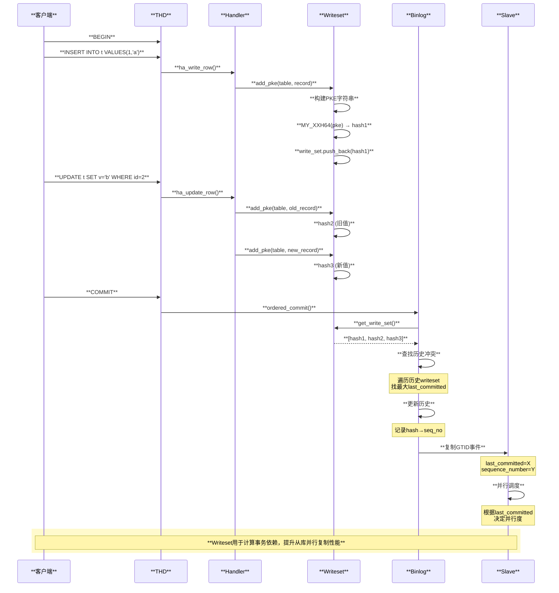

# Writeset 计算规则与使用逻辑深度分析

## 概述

Writeset 是 MySQL 用于**并行复制**和**Group Replication 冲突检测**的核心机制。它通过记录事务修改的主键/唯一键的哈希值，判断事务之间是否存在数据冲突。本文深入分析 Writeset 的计算规则和使用场景。

## Writeset 核心架构

```mermaid
graph TB
    subgraph "**Writeset 生成层**"
        A[**DML操作<br/>INSERT/UPDATE/DELETE**]
        B[**add_pke()<br/>提取主键等价物**]
        C[**generate_hash_pke()<br/>计算哈希值**]
        D[**Transaction_write_set_ctx<br/>存储事务writeset**]
    end
    
    subgraph "**Writeset 使用层**"
        E[**Binlog Commit<br/>计算last_committed**]
        F[**Slave Parallel Apply<br/>并行复制调度**]
        G[**Group Replication<br/>冲突认证**]
    end
    
    A --> B
    B --> C
    C --> D
    D --> E
    D --> G
    E --> F
    
    style A fill:#ffe1e1,stroke:#333,stroke-width:2px,color:#000
    style B fill:#e1ffe1,stroke:#333,stroke-width:2px,color:#000
    style C fill:#e1ffe1,stroke:#333,stroke-width:2px,color:#000
    style D fill:#e1f5ff,stroke:#333,stroke-width:2px,color:#000
    style E fill:#fff3e1,stroke:#333,stroke-width:2px,color:#000
    style F fill:#f5e1ff,stroke:#333,stroke-width:2px,color:#000
    style G fill:#fffacd,stroke:#333,stroke-width:2px,color:#000
```

## Writeset 计算完整调用链

### 从 DML 到 Writeset 哈希

\`\`\`text
【INSERT/UPDATE/DELETE 操作时的 Writeset 计算】

handler::ha_write_row() / ha_update_row() / ha_delete_row() - sql/handler.cc
│  【DML操作入口】
│
└── binlog_log_row() - sql/binlog.cc:11320
    │  【记录Binlog行事件时触发Writeset计算】
    │
    └── ★ add_pke() - sql/rpl_write_set_handler.cc:761
        │  【Primary Key Equivalent - 主键等价物提取与哈希】
        │  【这是Writeset计算的核心函数】
        │
        │  ┌────────────────────────────────────────────────────────────────────────────────────────────────────┐
        │  │ add_pke() 函数功能                                                                                  │
        │  ├────────────────────────────────────────────────────────────────────────────────────────────────────┤
        │  │                                                                                                    │
        │  │ 作用：提取表的主键/唯一键字段值，生成哈希加入到事务的Writeset中                                        │
        │  │                                                                                                    │
        │  │ 参数：                                                                                              │
        │  │   table  : TABLE对象                                                                               │
        │  │   thd    : 当前线程                                                                                │
        │  │   record : 行记录数据 (record[0] 或 record[1])                                                      │
        │  │                                                                                                    │
        │  └────────────────────────────────────────────────────────────────────────────────────────────────────┘
        │
        ├── 获取事务Writeset上下文
        │   └── Rpl_transaction_write_set_ctx *ws_ctx = 
        │           thd->get_transaction()->get_transaction_write_set_ctx()
        │
        ├── 遍历所有需要处理的键（主键 + 所有唯一键）
        │   │
        │   │  【为什么需要处理所有唯一键？】
        │   │  - 主键冲突：两个事务插入相同主键值
        │   │  - 唯一键冲突：两个事务修改导致唯一键重复
        │   │  - 都需要被检测并串行化
        │   │
        │   └── for (uint key_number = 0; key_number < table->s->keys; key_number++) {
        │           │
        │           ├── 跳过非主键且非唯一键
        │           │   └── if (!is_primary && !is_unique) continue;
        │           │
        │           ├── 构建PKE字符串
        │           │   │
        │           │   │  ┌────────────────────────────────────────────────────────────────────────────────────────┐
        │           │   │  │ PKE 字符串格式                                                                          │
        │           │   │  ├────────────────────────────────────────────────────────────────────────────────────────┤
        │           │   │  │                                                                                        │
        │           │   │  │ 格式: <index_name><separator><db_name><len><separator><table_name><len><separator>      │
        │           │   │  │       <col1_value><len><separator><col2_value><len>...                                  │
        │           │   │  │                                                                                        │
        │           │   │  │ 示例:                                                                                   │
        │           │   │  │   表: db1.users (id INT PRIMARY KEY, email VARCHAR(100) UNIQUE)                        │
        │           │   │  │   记录: id=123, email='test@example.com'                                               │
        │           │   │  │                                                                                        │
        │           │   │  │   主键PKE: "PRIMARY\377db1\003\377users\005\377123\003"                                 │
        │           │   │  │   唯一键PKE: "email\377db1\003\377users\005\377test@example.com\020"                    │
        │           │   │  │                                                                                        │
        │           │   │  │ 注: \377 是 HASH_STRING_SEPARATOR (0xFF)                                                │
        │           │   │  │     数字是前一个字段的长度                                                               │
        │           │   │  │                                                                                        │
        │           │   │  └────────────────────────────────────────────────────────────────────────────────────────┘
        │           │   │
        │           │   └── pke = index_name + SEPARATOR + db + db_len + SEPARATOR + 
        │           │                table + table_len + SEPARATOR + field_values...
        │           │
        │           └── 生成哈希并添加到Writeset
        │               │
        │               └── ★ generate_hash_pke() - sql/rpl_write_set_handler.cc:676
        │                   │  【使用XXH64计算哈希】
        │                   │
        │                   ├── uint64 hash = MY_XXH64(pke.c_str(), pke.size(), 0)
        │                   │   │  【使用xxHash算法，64位哈希】
        │                   │   │  【seed=0，确保相同输入产生相同哈希】
        │                   │
        │                   └── ws_ctx->add_write_set(hash)
        │                       │  【添加到事务的writeset集合】
        │       }
        │
        └── 返回
            │  【事务的所有DML操作都会调用add_pke()】
            │  【最终ws_ctx->write_set包含所有修改行的哈希】
\`\`\`

### Writeset 存储结构

\`\`\`text
Rpl_transaction_write_set_ctx - sql/rpl_transaction_write_set_ctx.h
│  【事务级别的Writeset上下文】
│
├── 核心数据成员
│   │
│   ├── std::vector<uint64> write_set       【存储所有PKE哈希值】
│   │   │
│   │   │  ┌──────────────────────────────────────────────────────────────────────────────────────────┐
│   │   │  │ write_set 示例                                                                           │
│   │   │  ├──────────────────────────────────────────────────────────────────────────────────────────┤
│   │   │  │                                                                                          │
│   │   │  │ 事务: BEGIN;                                                                             │
│   │   │  │       INSERT INTO users(id,email) VALUES(1,'a@b.com');                                   │
│   │   │  │       UPDATE users SET email='c@d.com' WHERE id=2;                                       │
│   │   │  │       DELETE FROM users WHERE id=3;                                                      │
│   │   │  │       COMMIT;                                                                            │
│   │   │  │                                                                                          │
│   │   │  │ write_set = [                                                                            │
│   │   │  │   0x1234...  // INSERT: PRIMARY key hash for id=1                                        │
│   │   │  │   0x5678...  // INSERT: UNIQUE key hash for email='a@b.com'                              │
│   │   │  │   0xABCD...  // UPDATE: PRIMARY key hash for id=2 (old)                                  │
│   │   │  │   0xEF01...  // UPDATE: UNIQUE key hash for email='c@d.com' (new)                        │
│   │   │  │   0x2345...  // DELETE: PRIMARY key hash for id=3                                        │
│   │   │  │ ]                                                                                        │
│   │   │  │                                                                                          │
│   │   │  └──────────────────────────────────────────────────────────────────────────────────────────┘
│   │
│   ├── bool m_has_missing_keys             【是否存在无主键/唯一键的表】
│   │   │  【如果true，不能使用Writeset并行复制】
│   │
│   └── bool m_has_related_foreign_keys     【是否涉及外键关联】
│       │  【外键可能导致隐式的级联更新】
│
├── 关键方法
│   │
│   ├── add_write_set(uint64 hash)          【添加一个哈希到集合】
│   │   │
│   │   └── 检查内存限制
│   │       │  if (write_set.size() >= limit) {
│   │       │      m_local_has_reached_write_set_limit = true;
│   │       │      clear_write_set();  // 超限则清空
│   │       │  }
│   │
│   ├── get_write_set()                     【获取整个集合】
│   │   └── return &write_set;
│   │
│   └── reset_state()                       【事务结束时重置】
│       └── clear_write_set();
│           m_has_missing_keys = false;
│
└── 生命周期
    │
    ├── 创建: 事务开始
    ├── 填充: 每次DML操作调用add_pke()
    ├── 使用: Binlog提交时计算last_committed
    └── 销毁: 事务结束时reset_state()
\`\`\`

## Writeset 在并行复制中的使用

### Binlog 提交时计算 last_committed

\`\`\`text
ordered_commit() - sql/binlog.cc
│  【Binlog Group Commit主函数】
│
└── MYSQL_BIN_LOG::flush_cache_to_file()
    │
    └── ★ m_dependency_tracker.get_dependency() - sql/rpl_trx_tracking.cc:244
        │  【计算事务的依赖关系】
        │  【决定last_committed和sequence_number】
        │
        │  ┌────────────────────────────────────────────────────────────────────────────────────────────────┐
        │  │ 并行复制依赖计算                                                                                 │
        │  ├────────────────────────────────────────────────────────────────────────────────────────────────┤
        │  │                                                                                                │
        │  │ GTID事件中的两个关键字段:                                                                        │
        │  │   - last_committed  : 本事务依赖的最后一个事务的sequence_number                                  │
        │  │   - sequence_number : 本事务的序列号                                                             │
        │  │                                                                                                │
        │  │ 并行复制规则:                                                                                   │
        │  │   如果 trx_A.last_committed < trx_B.sequence_number                                            │
        │  │   且 trx_B.last_committed < trx_A.sequence_number                                              │
        │  │   → trx_A 和 trx_B 可以并行执行                                                                 │
        │  │                                                                                                │
        │  └────────────────────────────────────────────────────────────────────────────────────────────────┘
        │
        └── Writeset_trx_dependency_tracker::get_dependency() - sql/rpl_trx_tracking.cc:172
            │  【基于Writeset计算依赖】
            │
            ├── 获取当前事务的Writeset
            │   └── std::vector<uint64> *ws = thd->get_transaction()
            │                                    ->get_transaction_write_set_ctx()
            │                                    ->get_write_set();
            │
            ├── 在历史记录中查找冲突
            │   │
            │   │  ┌────────────────────────────────────────────────────────────────────────────────────────┐
            │   │  │ Writeset History 结构                                                                   │
            │   │  ├────────────────────────────────────────────────────────────────────────────────────────┤
            │   │  │                                                                                        │
            │   │  │ m_writeset_history: 哈希表，存储最近N个事务的writeset                                    │
            │   │  │                                                                                        │
            │   │  │ 格式: { hash_value → sequence_number }                                                  │
            │   │  │                                                                                        │
            │   │  │ 示例:                                                                                   │
            │   │  │   {                                                                                    │
            │   │  │     0x1234... → 100,  // 事务100修改了hash=0x1234的行                                   │
            │   │  │     0x5678... → 102,  // 事务102修改了hash=0x5678的行                                   │
            │   │  │     0xABCD... → 105,  // 事务105修改了hash=0xABCD的行                                   │
            │   │  │   }                                                                                    │
            │   │  │                                                                                        │
            │   │  │ 大小由 binlog_transaction_dependency_history_size 控制 (默认25000)                      │
            │   │  │                                                                                        │
            │   │  └────────────────────────────────────────────────────────────────────────────────────────┘
            │   │
            │   └── for (uint64 hash : *ws) {
            │           auto it = m_writeset_history.find(hash);
            │           if (it != m_writeset_history.end()) {
            │               // 找到冲突！
            │               last_committed = max(last_committed, it->second);
            │           }
            │       }
            │
            ├── 更新历史记录
            │   │
            │   └── for (uint64 hash : *ws) {
            │           m_writeset_history[hash] = sequence_number;
            │       }
            │
            └── 返回 (last_committed, sequence_number)
\`\`\`

### Slave 端并行应用

\`\`\`text
【从库并行复制调度】

Slave_worker::slave_worker_exec_job() - sql/rpl_replica.cc
│  【工作线程执行事务】
│
└── 调度器决定哪些事务可以并行
    │
    └── Mts_submode_logical_clock::schedule_next_event() - sql/rpl_mta_submode.cc
        │  【逻辑时钟调度】
        │
        │  ┌────────────────────────────────────────────────────────────────────────────────────────────────┐
        │  │ 并行调度示例                                                                                    │
        │  ├────────────────────────────────────────────────────────────────────────────────────────────────┤
        │  │                                                                                                │
        │  │ 主库执行顺序:                                                                                   │
        │  │   T1: last_committed=0, sequence_number=1  (修改 row A)                                        │
        │  │   T2: last_committed=0, sequence_number=2  (修改 row B)                                        │
        │  │   T3: last_committed=1, sequence_number=3  (修改 row A) ← 依赖T1                               │
        │  │   T4: last_committed=2, sequence_number=4  (修改 row B) ← 依赖T2                               │
        │  │   T5: last_committed=0, sequence_number=5  (修改 row C)                                        │
        │  │                                                                                                │
        │  │ 从库并行执行:                                                                                   │
        │  │                                                                                                │
        │  │   时间 → ─────────────────────────────────────────────────                                     │
        │  │                                                                                                │
        │  │   Worker1: [  T1  ]          [  T3  ]                                                          │
        │  │   Worker2: [  T2  ]          [  T4  ]                                                          │
        │  │   Worker3: [  T5  ]                                                                            │
        │  │                                                                                                │
        │  │ 说明:                                                                                          │
        │  │   - T1, T2, T5 的 last_committed=0，可以并行执行                                                │
        │  │   - T3 必须等T1完成（last_committed=1）                                                         │
        │  │   - T4 必须等T2完成（last_committed=2）                                                         │
        │  │                                                                                                │
        │  └────────────────────────────────────────────────────────────────────────────────────────────────┘
        │
        └── 检查依赖是否满足
            │
            └── if (current_lwm >= last_committed) {
                    // 依赖已满足，可以执行
                    assign_to_worker(event);
                } else {
                    // 等待
                    wait_for_lwm_to_advance();
                }
\`\`\`

## Writeset 在 Group Replication 中的使用

\`\`\`text
【Group Replication 冲突认证】

Certifier::certify() - plugin/group_replication/src/certifier.cc
│  【认证事务是否可以提交】
│
├── 获取事务的Writeset
│   └── Transaction_context_log_event::get_write_set()
│       │  【从事务上下文事件中获取writeset】
│
├── 检查冲突
│   │
│   │  ┌────────────────────────────────────────────────────────────────────────────────────────────────┐
│   │  │ Group Replication 冲突检测                                                                      │
│   │  ├────────────────────────────────────────────────────────────────────────────────────────────────┤
│   │  │                                                                                                │
│   │  │ 场景: 节点A和节点B同时修改同一行                                                                 │
│   │  │                                                                                                │
│   │  │   节点A: UPDATE users SET name='Alice' WHERE id=1;                                             │
│   │  │   节点B: UPDATE users SET name='Bob' WHERE id=1;                                               │
│   │  │                                                                                                │
│   │  │ 认证过程:                                                                                       │
│   │  │   1. 两个事务几乎同时到达所有节点                                                                │
│   │  │   2. 根据全局顺序，假设A先于B                                                                    │
│   │  │   3. 认证A: writeset_A 与 certified_set 无交集 → 通过                                           │
│   │  │   4. 将 writeset_A 加入 certified_set                                                          │
│   │  │   5. 认证B: writeset_B 与 certified_set 有交集(id=1的hash) → 冲突！                             │
│   │  │   6. 事务B被回滚                                                                                │
│   │  │                                                                                                │
│   │  │ 冲突检测数据结构:                                                                                │
│   │  │   Certification_info: map<writeset_hash, transaction_sequence>                                 │
│   │  │                                                                                                │
│   │  └────────────────────────────────────────────────────────────────────────────────────────────────┘
│   │
│   └── for (auto hash : transaction_writeset) {
│           auto it = certification_info.find(hash);
│           if (it != certification_info.end()) {
│               if (it->second > snapshot_version) {
│                   // 冲突：该行在事务开始后被其他事务修改过
│                   return CERTIFICATION_FAILED;
│               }
│           }
│       }
│
├── 认证通过，更新认证信息
│   │
│   └── for (auto hash : transaction_writeset) {
│           certification_info[hash] = current_sequence;
│       }
│
└── 返回认证结果
    └── return CERTIFICATION_OK / CERTIFICATION_FAILED;
\`\`\`

## Writeset 计算的特殊情况

\`\`\`text
┌────────────────────────────────────────────────────────────────────────────────────────────────────────────┐
│                                    Writeset 计算的特殊处理                                                   │
├────────────────────────────────────────────────────────────────────────────────────────────────────────────┤
│                                                                                                            │
│  【1. 无主键表】                                                                                            │
│  ┌────────────────────────────────────────────────────────────────────────────────────────────────────────┐│
│  │ 问题：无法生成唯一的writeset哈希                                                                        ││
│  │                                                                                                        ││
│  │ 处理：                                                                                                  ││
│  │   ws_ctx->set_has_missing_keys(true);                                                                  ││
│  │                                                                                                        ││
│  │ 影响：                                                                                                  ││
│  │   - binlog_transaction_dependency_tracking=WRITESET 时回退到 COMMIT_ORDER                              ││
│  │   - Group Replication 可能不允许该表                                                                    ││
│  │                                                                                                        ││
│  │ 位置: add_pke() 中检查 table->s->primary_key == MAX_KEY                                                ││
│  └────────────────────────────────────────────────────────────────────────────────────────────────────────┘│
│                                                                                                            │
│  【2. 外键关联】                                                                                            │
│  ┌────────────────────────────────────────────────────────────────────────────────────────────────────────┐│
│  │ 问题：CASCADE 更新/删除可能影响其他表的行                                                                ││
│  │                                                                                                        ││
│  │ 示例：                                                                                                  ││
│  │   DELETE FROM parent WHERE id=1;                                                                       ││
│  │   -- 可能级联删除 child 表的多行                                                                        ││
│  │                                                                                                        ││
│  │ 处理：                                                                                                  ││
│  │   ws_ctx->set_has_related_foreign_keys(true);                                                          ││
│  │   -- 级联操作的行也会调用 add_pke()                                                                     ││
│  │                                                                                                        ││
│  │ 位置: binlog_log_row() 中处理                                                                           ││
│  └────────────────────────────────────────────────────────────────────────────────────────────────────────┘│
│                                                                                                            │
│  【3. 多值索引 (JSON多值)】                                                                                  │
│  ┌────────────────────────────────────────────────────────────────────────────────────────────────────────┐│
│  │ 问题：一个字段可能包含多个值需要索引                                                                     ││
│  │                                                                                                        ││
│  │ 示例：                                                                                                  ││
│  │   CREATE TABLE t (                                                                                     ││
│  │     id INT PRIMARY KEY,                                                                                ││
│  │     tags JSON,                                                                                         ││
│  │     INDEX idx ((CAST(tags AS CHAR(32) ARRAY)))                                                        ││
│  │   );                                                                                                   ││
│  │                                                                                                        ││
│  │ 处理：                                                                                                  ││
│  │   generate_mv_hash_pke() - 为每个数组元素生成单独的哈希                                                  ││
│  │                                                                                                        ││
│  │ 位置: sql/rpl_write_set_handler.cc:713                                                                  ││
│  └────────────────────────────────────────────────────────────────────────────────────────────────────────┘│
│                                                                                                            │
│  【4. Writeset 大小限制】                                                                                    │
│  ┌────────────────────────────────────────────────────────────────────────────────────────────────────────┐│
│  │ 参数：binlog_transaction_dependency_history_size (默认25000)                                            ││
│  │                                                                                                        ││
│  │ 作用：限制历史Writeset的大小                                                                            ││
│  │                                                                                                        ││
│  │ 超限处理：                                                                                               ││
│  │   - 清理最老的历史记录                                                                                   ││
│  │   - 或者回退到 COMMIT_ORDER 模式                                                                        ││
│  │                                                                                                        ││
│  │ 参数：group_replication_transaction_size_limit                                                          ││
│  │ 作用：Group Replication 中限制单事务的 writeset 大小                                                    ││
│  └────────────────────────────────────────────────────────────────────────────────────────────────────────┘│
│                                                                                                            │
│  【5. UPDATE 操作的前后镜像】                                                                                │
│  ┌────────────────────────────────────────────────────────────────────────────────────────────────────────┐│
│  │ UPDATE 需要记录两次：                                                                                    ││
│  │   - 旧值的哈希 (从 record[1] 计算)                                                                      ││
│  │   - 新值的哈希 (从 record[0] 计算)                                                                      ││
│  │                                                                                                        ││
│  │ 原因：                                                                                                  ││
│  │   - 旧值：确保没有其他事务也在修改同一行                                                                  ││
│  │   - 新值：确保新值不与其他事务冲突（唯一键）                                                              ││
│  │                                                                                                        ││
│  │ 位置: binlog_log_row() 中 BI/AI 处理                                                                    ││
│  └────────────────────────────────────────────────────────────────────────────────────────────────────────┘│
│                                                                                                            │
└────────────────────────────────────────────────────────────────────────────────────────────────────────────┘
\`\`\`

## Writeset 时序图



## 关键函数速查表

| 层级 | 函数名 | 文件路径 | 行号 | 功能说明 |
|:-----|:-------|:---------|:-----|:---------|
| **PKE生成** | `add_pke()` | sql/rpl_write_set_handler.cc | 761 | 提取主键等价物 |
| | `generate_hash_pke()` | sql/rpl_write_set_handler.cc | 676 | 计算哈希 |
| | `generate_mv_hash_pke()` | sql/rpl_write_set_handler.cc | 713 | 多值索引哈希 |
| **上下文管理** | `add_write_set()` | sql/rpl_transaction_write_set_ctx.cc | 64 | 添加哈希到集合 |
| | `get_write_set()` | sql/rpl_transaction_write_set_ctx.cc | 98 | 获取writeset |
| | `reset_state()` | sql/rpl_transaction_write_set_ctx.cc | 103 | 重置上下文 |
| **依赖计算** | `get_dependency()` | sql/rpl_trx_tracking.cc | 244 | 计算last_committed |
| | `Writeset_trx_dependency_tracker` | sql/rpl_trx_tracking.cc | 172 | Writeset依赖跟踪器 |
| **Binlog** | `binlog_log_row()` | sql/binlog.cc | 11320 | 记录行事件 |
| | `ordered_commit()` | sql/binlog.cc | 9100 | Group Commit |
| **Group Repl** | `Certifier::certify()` | plugin/group_replication/src/certifier.cc | 972 | 冲突认证 |
| | `add_write_set()` | plugin/group_replication/src/observer_trans.cc | 54 | 添加到TCLE |

## 相关配置参数

| 参数 | 默认值 | 说明 |
|:-----|:-------|:-----|
| `binlog_transaction_dependency_tracking` | COMMIT_ORDER | COMMIT_ORDER/WRITESET/WRITESET_SESSION |
| `binlog_transaction_dependency_history_size` | 25000 | Writeset历史记录大小 |
| `transaction_write_set_extraction` | XXHASH64 | 哈希算法 |
| `group_replication_transaction_size_limit` | 150MB | GR事务大小限制 |

