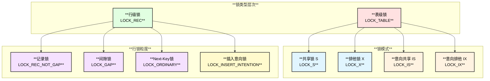
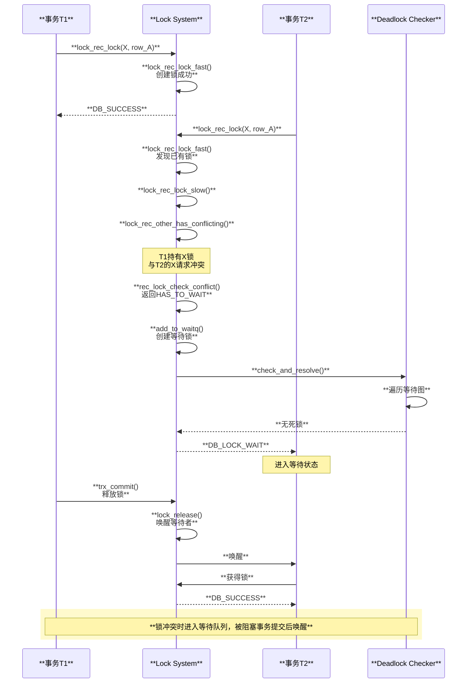

# InnoDB 锁冲突检查逻辑深度分析

## 概述

InnoDB 的锁机制是实现事务隔离性（Isolation）的核心。本文深入分析 InnoDB 如何进行锁冲突检查，包括锁兼容性矩阵、隐式锁、显式锁、锁等待和死锁检测。

## InnoDB 锁架构

## 锁冲突检查完整调用链

### 从 DML 操作到锁冲突检查

\`\`\`text
【SELECT ... FOR UPDATE 的锁冲突检查】

row_search_mvcc() - storage/innobase/row/row0sel.cc:4825
│  【MVCC查询入口，也处理锁定读】
│
├── 定位目标记录
│   └── btr_cur_search_to_nth_level()
│
└── 尝试加锁
    │
    └── sel_set_rec_lock() - storage/innobase/row/row0sel.cc:1245
        │  【对记录加锁】
        │
        └── ★ lock_clust_rec_read_check_and_lock() - storage/innobase/lock/lock0lock.cc:5984
            │  【聚簇索引记录加锁】
            │
            ├── 检查隐式锁
            │   └── lock_rec_convert_impl_to_expl()
            │       │  【如果存在隐式锁，转换为显式锁】
            │
            └── ★ lock_rec_lock() - storage/innobase/lock/lock0lock.cc:1887
                │  【记录锁核心函数】
                │
                │  ┌────────────────────────────────────────────────────────────────────────────────────────────────┐
                │  │ lock_rec_lock() 参数说明                                                                       │
                │  ├────────────────────────────────────────────────────────────────────────────────────────────────┤
                │  │                                                                                                │
                │  │ impl     : 是否可以使用隐式锁                                                                   │
                │  │ sel_mode : SELECT_ORDINARY / SELECT_SKIP_LOCKED / SELECT_NOWAIT                               │
                │  │ mode     : 锁模式 (LOCK_S | LOCK_X) | (LOCK_GAP | LOCK_REC_NOT_GAP | LOCK_ORDINARY)            │
                │  │ block    : 页面缓冲块                                                                          │
                │  │ heap_no  : 记录在页内的序号                                                                    │
                │  │ index    : 索引定义                                                                            │
                │  │ thr      : 查询线程                                                                            │
                │  │                                                                                                │
                │  └────────────────────────────────────────────────────────────────────────────────────────────────┘
                │
                ├── 尝试快速加锁
                │   │
                │   └── lock_rec_lock_fast() - storage/innobase/lock/lock0lock.cc:1747
                │       │  【无冲突时的快速路径】
                │       │
                │       ├── 检查是否有任何锁在该记录上
                │       │   └── lock_rec_get_first(lock_sys->rec_hash, block, heap_no)
                │       │
                │       ├── 如果没有锁
                │       │   └── lock_rec_create()  【直接创建锁】
                │       │       return LOCK_REC_SUCCESS_CREATED;
                │       │
                │       └── 如果有锁但当前事务已持有
                │           └── return LOCK_REC_SUCCESS;
                │
                └── 慢速路径（有潜在冲突）
                    │
                    └── lock_rec_lock_slow() - storage/innobase/lock/lock0lock.cc:1775
                        │
                        ├── 检查是否已持有足够强的锁
                        │   │
                        │   └── lock_rec_has_expl() - storage/innobase/lock/lock0lock.cc:772
                        │       │  【检查事务是否已有足够强的显式锁】
                        │       │
                        │       └── 遍历记录上的锁链表
                        │           if (lock->trx == trx && 
                        │               lock_mode_stronger_or_eq(lock->mode, mode)) {
                        │               return lock;  // 已有足够强的锁
                        │           }
                        │
                        └── ★ 检查冲突
                            │
                            └── lock_rec_other_has_conflicting() - storage/innobase/lock/lock0lock.cc:908
                                │  【核心：检查是否有冲突的锁】
                                │
                                │  详见下文
\`\`\`

### lock_rec_other_has_conflicting() 详解

\`\`\`text
lock_rec_other_has_conflicting() - storage/innobase/lock/lock0lock.cc:908
│  【检查其他事务是否持有冲突锁】
│  【返回需要等待的锁，如果无冲突返回nullptr】
│
├── 参数
│   │  mode    : 请求的锁模式
│   │  block   : 页面
│   │  heap_no : 记录编号
│   │  trx     : 请求锁的事务
│
├── 遍历记录上的所有锁
│   │
│   │  ┌────────────────────────────────────────────────────────────────────────────────────────────────┐
│   │  │ 锁链表结构                                                                                      │
│   │  ├────────────────────────────────────────────────────────────────────────────────────────────────┤
│   │  │                                                                                                │
│   │  │ lock_sys->rec_hash: 哈希表，按 (space_id, page_no) 组织                                        │
│   │  │                                                                                                │
│   │  │ 每个哈希桶链表:                                                                                 │
│   │  │   lock1 → lock2 → lock3 → ...                                                                  │
│   │  │                                                                                                │
│   │  │ 每个lock包含位图，标识锁定的heap_no:                                                            │
│   │  │   lock->bits: [0, 0, 1, 0, 1, 1, 0, ...]                                                       │
│   │  │               heap_no: 0  1  2  3  4  5  6                                                     │
│   │  │                                                                                                │
│   │  └────────────────────────────────────────────────────────────────────────────────────────────────┘
│   │
│   └── for (lock = lock_rec_get_first(rec_hash, block, heap_no); 
│            lock != nullptr; 
│            lock = lock_rec_get_next(heap_no, lock)) {
│           │
│           └── ★ rec_lock_check_conflict() - storage/innobase/lock/lock0lock.cc:559
│                   │  【检查单个锁是否冲突】
│                   │
│                   │  详见下文
│       }
│
└── 返回结果
    │
    └── struct Conflicting {
            const lock_t *wait_for;  // 需要等待的锁，nullptr表示无冲突
            bool bypassed;           // 是否绕过了等待中的锁
        };
\`\`\`

### rec_lock_check_conflict() 锁冲突检测核心

\`\`\`text
rec_lock_check_conflict() - storage/innobase/lock/lock0lock.cc:559
│  【锁冲突检测核心函数】
│
├── 参数
│   │  trx           : 请求锁的事务
│   │  type_mode     : 请求的锁模式
│   │  lock2         : 已存在的锁
│   │  lock_is_on_supremum : 是否在supremum记录上
│
├── 快速排除规则
│   │
│   ├── 规则1：同一事务的锁不冲突
│   │   │
│   │   └── if (trx == lock2->trx) {
│   │           return Conflict::NO_CONFLICT;
│   │       }
│   │
│   ├── 规则2：锁模式兼容则不冲突
│   │   │
│   │   └── if (lock_mode_compatible(LOCK_MODE_MASK & type_mode, 
│   │                                lock_get_mode(lock2))) {
│   │           return Conflict::NO_CONFLICT;
│   │       }
│   │   │
│   │   │  ┌─────────────────────────────────────────────────────────────────────────────────────────────┐
│   │   │  │ 锁兼容性矩阵                                                                                 │
│   │   │  ├─────────────────────────────────────────────────────────────────────────────────────────────┤
│   │   │  │                                                                                             │
│   │   │  │           │   IS    │   IX    │   S     │   X     │                                         │
│   │   │  │   ────────┼─────────┼─────────┼─────────┼─────────│                                         │
│   │   │  │   IS      │    ✓    │    ✓    │    ✓    │    ✗    │                                         │
│   │   │  │   IX      │    ✓    │    ✓    │    ✗    │    ✗    │                                         │
│   │   │  │   S       │    ✓    │    ✗    │    ✓    │    ✗    │                                         │
│   │   │  │   X       │    ✗    │    ✗    │    ✗    │    ✗    │                                         │
│   │   │  │                                                                                             │
│   │   │  │   ✓ = 兼容（不冲突）   ✗ = 不兼容（冲突）                                                      │
│   │   │  │                                                                                             │
│   │   │  │   位置: lock_mode_compatible() - storage/innobase/include/lock0priv.h:119                   │
│   │   │  │                                                                                             │
│   │   │  └─────────────────────────────────────────────────────────────────────────────────────────────┘
│   │
│   └── 规则3：高优先级事务可以忽略等待中的低优先级锁
│       │
│       └── if (trx_is_high_priority(trx) && 
│               lock2->is_waiting() && 
│               !trx_is_high_priority(lock2->trx)) {
│               return Conflict::NO_CONFLICT;
│           }
│
├── GAP锁特殊规则
│   │
│   │  ┌─────────────────────────────────────────────────────────────────────────────────────────────────────┐
│   │  │ GAP锁冲突规则                                                                                        │
│   │  ├─────────────────────────────────────────────────────────────────────────────────────────────────────┤
│   │  │                                                                                                     │
│   │  │ 【规则4】GAP锁（无INSERT_INTENTION）不需要等待任何锁                                                  │
│   │  │   - GAP锁只锁定记录之间的间隙                                                                        │
│   │  │   - 不同事务可以在同一间隙上持有GAP锁                                                                 │
│   │  │   - 因为GAP锁不锁定实际记录                                                                          │
│   │  │                                                                                                     │
│   │  │   if ((lock_is_on_supremum || (type_mode & LOCK_GAP)) &&                                            │
│   │  │       !(type_mode & LOCK_INSERT_INTENTION)) {                                                       │
│   │  │       return Conflict::NO_CONFLICT;                                                                 │
│   │  │   }                                                                                                 │
│   │  │                                                                                                     │
│   │  │ 【规则5】记录锁不需要等待GAP锁                                                                        │
│   │  │   - 记录锁只锁定记录本身                                                                             │
│   │  │   - GAP锁不影响对记录的操作                                                                          │
│   │  │                                                                                                     │
│   │  │   if (!(type_mode & LOCK_INSERT_INTENTION) && lock_rec_get_gap(lock2)) {                            │
│   │  │       return Conflict::NO_CONFLICT;                                                                 │
│   │  │   }                                                                                                 │
│   │  │                                                                                                     │
│   │  │ 【规则6】GAP锁不需要等待记录锁                                                                        │
│   │  │                                                                                                     │
│   │  │   if ((type_mode & LOCK_GAP) && lock_rec_get_rec_not_gap(lock2)) {                                  │
│   │  │       return Conflict::NO_CONFLICT;                                                                 │
│   │  │   }                                                                                                 │
│   │  │                                                                                                     │
│   │  └─────────────────────────────────────────────────────────────────────────────────────────────────────┘
│   │
│   └── 规则7：INSERT_INTENTION锁与GAP/Next-Key锁冲突
│       │
│       │  ┌─────────────────────────────────────────────────────────────────────────────────────────────────┐
│       │  │ INSERT_INTENTION 锁冲突                                                                          │
│       │  ├─────────────────────────────────────────────────────────────────────────────────────────────────┤
│       │  │                                                                                                 │
│       │  │ 场景：事务A持有GAP锁[3,7)，事务B要INSERT id=5                                                    │
│       │  │                                                                                                 │
│       │  │   事务A: SELECT * FROM t WHERE id BETWEEN 3 AND 7 FOR UPDATE;                                   │
│       │  │          → 持有 GAP锁 [3,7) 或 Next-Key锁                                                        │
│       │  │                                                                                                 │
│       │  │   事务B: INSERT INTO t(id) VALUES(5);                                                           │
│       │  │          → 请求 INSERT_INTENTION 锁                                                              │
│       │  │          → 被事务A的GAP锁阻塞                                                                    │
│       │  │                                                                                                 │
│       │  │ 代码：                                                                                           │
│       │  │   if (lock_rec_get_insert_intention(lock2)) {                                                   │
│       │  │       // INSERT_INTENTION锁不阻塞其他INSERT_INTENTION                                           │
│       │  │       return Conflict::NO_CONFLICT;                                                             │
│       │  │   }                                                                                             │
│       │  │                                                                                                 │
│       │  │   if (type_mode & LOCK_INSERT_INTENTION) {                                                      │
│       │  │       // 但被GAP/Next-Key锁阻塞                                                                  │
│       │  │       return Conflict::HAS_TO_WAIT;                                                             │
│       │  │   }                                                                                             │
│       │  │                                                                                                 │
│       │  └─────────────────────────────────────────────────────────────────────────────────────────────────┘
│
└── 所有规则都不满足，存在冲突
    │
    └── return Conflict::HAS_TO_WAIT;
\`\`\`

## 锁等待处理

\`\`\`text
【发现冲突后的处理流程】

lock_rec_lock_slow() - storage/innobase/lock/lock0lock.cc:1775
│
└── if (conflicting.wait_for != nullptr) {
        │  【存在冲突锁】
        │
        ├── 处理SKIP_LOCKED / NOWAIT模式
        │   │
        │   └── switch (sel_mode) {
        │           case SELECT_SKIP_LOCKED:
        │               return DB_SKIP_LOCKED;  // 跳过该行
        │           case SELECT_NOWAIT:
        │               return DB_LOCK_NOWAIT;  // 立即返回错误
        │           ...
        │       }
        │
        └── 普通模式：加入等待队列
            │
            └── RecLock rec_lock(thr, index, block, heap_no, mode);
                │
                └── rec_lock.add_to_waitq() - storage/innobase/lock/lock0lock.cc:2100
                    │  【将锁请求加入等待队列】
                    │
                    ├── 创建等待锁
                    │   └── lock_rec_create()
                    │       │  设置 LOCK_WAIT 标志
                    │       └── lock->type_mode |= LOCK_WAIT;
                    │
                    ├── 设置事务状态
                    │   │
                    │   └── trx->lock.que_state = TRX_QUE_LOCK_WAIT;
                    │       trx->lock.wait_started = 当前时间;
                    │       trx->lock.wait_lock = lock;
                    │
                    ├── 创建等待边（用于死锁检测）
                    │   │
                    │   └── lock_create_wait_for_edge() - storage/innobase/lock/lock0lock.cc:2044
                    │       │  【记录等待关系】
                    │       │
                    │       └── trx->lock.blocking_trx = blocking_lock->trx;
                    │
                    ├── 检查死锁
                    │   │
                    │   └── DeadlockChecker::check_and_resolve()
                    │       │  【死锁检测】
                    │       │
                    │       │  详见下文
                    │
                    └── 返回等待状态
                        └── return DB_LOCK_WAIT;
\`\`\`

## 死锁检测

\`\`\`text
DeadlockChecker::check_and_resolve() - storage/innobase/lock/lock0lock.cc:4644
│  【死锁检测与解决】
│
├── 检测时机
│   │  - 每次加入等待队列时
│   │  - 或者由后台线程周期性检测
│
├── 检测算法：等待图遍历（Wait-For Graph）
│   │
│   │  ┌─────────────────────────────────────────────────────────────────────────────────────────────────────┐
│   │  │ 死锁检测示例                                                                                         │
│   │  ├─────────────────────────────────────────────────────────────────────────────────────────────────────┤
│   │  │                                                                                                     │
│   │  │ 场景：                                                                                               │
│   │  │   事务T1: 持有row_A的X锁，等待row_B的X锁                                                             │
│   │  │   事务T2: 持有row_B的X锁，等待row_A的X锁                                                             │
│   │  │                                                                                                     │
│   │  │ 等待图：                                                                                              │
│   │  │   T1 ──等待──▶ T2                                                                                   │
│   │  │    ▲           │                                                                                    │
│   │  │    └───等待────┘                                                                                    │
│   │  │                                                                                                     │
│   │  │ 检测：从T1开始遍历等待链，发现回到T1 → 死锁！                                                         │
│   │  │                                                                                                     │
│   │  └─────────────────────────────────────────────────────────────────────────────────────────────────────┘
│   │
│   └── 遍历等待链
│       │
│       └── while (blocking_trx != nullptr) {
│               if (blocking_trx == start_trx) {
│                   // 发现环！死锁！
│                   return select_victim_and_rollback();
│               }
│               blocking_trx = blocking_trx->blocking_trx;
│           }
│
├── 选择牺牲者
│   │
│   │  ┌─────────────────────────────────────────────────────────────────────────────────────────────────────┐
│   │  │ 牺牲者选择策略                                                                                       │
│   │  ├─────────────────────────────────────────────────────────────────────────────────────────────────────┤
│   │  │                                                                                                     │
│   │  │ 默认策略：选择代价最小的事务回滚                                                                      │
│   │  │                                                                                                     │
│   │  │ 代价评估因素：                                                                                        │
│   │  │   1. 事务权重 (trx_weight)                                                                          │
│   │  │      - undo记录数量                                                                                  │
│   │  │      - 持有的锁数量                                                                                  │
│   │  │                                                                                                     │
│   │  │   2. 事务优先级                                                                                      │
│   │  │      - 高优先级事务不被选为牺牲者                                                                    │
│   │  │                                                                                                     │
│   │  │   3. innodb_deadlock_detect_priority                                                                │
│   │  │      - 自定义选择策略                                                                                │
│   │  │                                                                                                     │
│   │  │ 代码：select_victim() - storage/innobase/lock/lock0lock.cc                                          │
│   │  │                                                                                                     │
│   │  └─────────────────────────────────────────────────────────────────────────────────────────────────────┘
│   │
│   └── victim = trx_weight(trx_A) < trx_weight(trx_B) ? trx_A : trx_B;
│
└── 回滚牺牲者
    │
    └── victim->lock.was_chosen_as_deadlock_victim = true;
        lock_cancel_waiting_and_release(victim->lock.wait_lock);
        return DB_DEADLOCK;
\`\`\`

## 隐式锁机制

\`\`\`text
【隐式锁 (Implicit Lock)】

定义：当事务修改记录时，不立即创建锁结构，而是通过记录的trx_id判断锁状态

┌─────────────────────────────────────────────────────────────────────────────────────────────────────────────┐
│ 隐式锁的工作原理                                                                                             │
├─────────────────────────────────────────────────────────────────────────────────────────────────────────────┤
│                                                                                                             │
│ 【INSERT时】                                                                                                 │
│   1. 插入记录，设置 rec->trx_id = 当前事务ID                                                                 │
│   2. 不创建显式锁结构                                                                                        │
│   3. 记录的trx_id隐含表示该事务持有X锁                                                                       │
│                                                                                                             │
│ 【其他事务访问该记录时】                                                                                      │
│   1. 检查记录的trx_id                                                                                        │
│   2. 如果trx_id指向活跃事务 → 存在隐式锁                                                                     │
│   3. 调用 lock_rec_convert_impl_to_expl() 转换为显式锁                                                       │
│   4. 然后进行正常的锁冲突检查                                                                                 │
│                                                                                                             │
│ 【优势】                                                                                                     │
│   - 减少锁结构的创建开销                                                                                     │
│   - 大多数INSERT不会有并发访问，隐式锁足够                                                                    │
│   - 只有真正需要时才转换为显式锁                                                                              │
│                                                                                                             │
└─────────────────────────────────────────────────────────────────────────────────────────────────────────────┘

lock_rec_convert_impl_to_expl() - storage/innobase/lock/lock0lock.cc:6100
│  【隐式锁转换为显式锁】
│
├── 检查记录的trx_id
│   └── trx_id = row_get_rec_trx_id(rec, index, offsets);
│
├── 检查该事务是否活跃
│   └── impl_trx = trx_rw_is_active(trx_id);
│       if (impl_trx == nullptr) {
│           return;  // 事务已提交，无隐式锁
│       }
│
└── 创建显式锁
    └── lock_rec_add_to_queue(LOCK_X | LOCK_REC_NOT_GAP, 
                              block, heap_no, index, impl_trx);
\`\`\`

## 锁等待时序图

## 锁类型总结

\`\`\`text
┌────────────────────────────────────────────────────────────────────────────────────────────────────────────┐
│                                    InnoDB 锁类型详解                                                        │
├────────────────────────────────────────────────────────────────────────────────────────────────────────────┤
│                                                                                                            │
│  【表级锁 LOCK_TABLE】                                                                                      │
│  ┌────────────────────────────────────────────────────────────────────────────────────────────────────────┐│
│  │ LOCK_IS  : 意向共享锁，表示事务打算对某行加S锁                                                          ││
│  │ LOCK_IX  : 意向排他锁，表示事务打算对某行加X锁                                                          ││
│  │ LOCK_S   : 表级共享锁，如 LOCK TABLES t READ                                                           ││
│  │ LOCK_X   : 表级排他锁，如 LOCK TABLES t WRITE                                                          ││
│  │ LOCK_AUTO_INC : 自增锁，INSERT时保护AUTO_INCREMENT值                                                   ││
│  └────────────────────────────────────────────────────────────────────────────────────────────────────────┘│
│                                                                                                            │
│  【行级锁 LOCK_REC】                                                                                        │
│  ┌────────────────────────────────────────────────────────────────────────────────────────────────────────┐│
│  │ LOCK_REC_NOT_GAP : 记录锁，只锁定记录本身                                                               ││
│  │                    用于: 唯一索引的等值查询                                                             ││
│  │                    例: SELECT * FROM t WHERE id = 5 FOR UPDATE (id是主键)                              ││
│  ├────────────────────────────────────────────────────────────────────────────────────────────────────────┤│
│  │ LOCK_GAP : 间隙锁，锁定记录前的间隙                                                                     ││
│  │            用于: 防止幻读，RR隔离级别                                                                   ││
│  │            例: 记录[3, 7, 10]，对7加GAP锁锁定(3, 7)区间                                                 ││
│  ├────────────────────────────────────────────────────────────────────────────────────────────────────────┤│
│  │ LOCK_ORDINARY : Next-Key锁 = 记录锁 + 前面的间隙锁                                                     ││
│  │                 用于: 默认的行锁类型，防止幻读                                                          ││
│  │                 例: 对7加Next-Key锁锁定(3, 7]                                                          ││
│  ├────────────────────────────────────────────────────────────────────────────────────────────────────────┤│
│  │ LOCK_INSERT_INTENTION : 插入意向锁                                                                     ││
│  │                         用于: INSERT前检查是否可以插入                                                  ││
│  │                         特点: 不同事务在同一间隙插入不冲突                                              ││
│  │                               但与GAP锁冲突                                                             ││
│  └────────────────────────────────────────────────────────────────────────────────────────────────────────┘│
│                                                                                                            │
└────────────────────────────────────────────────────────────────────────────────────────────────────────────┘
\`\`\`

## 关键函数速查表

| 层级 | 函数名 | 文件路径 | 行号 | 功能说明 |
|:-----|:-------|:---------|:-----|:---------|
| **加锁入口** | `lock_rec_lock()` | storage/innobase/lock/lock0lock.cc | 1887 | 记录加锁主函数 |
| | `lock_rec_lock_fast()` | storage/innobase/lock/lock0lock.cc | 1747 | 快速加锁路径 |
| | `lock_rec_lock_slow()` | storage/innobase/lock/lock0lock.cc | 1775 | 慢速加锁路径 |
| **冲突检测** | `lock_rec_other_has_conflicting()` | storage/innobase/lock/lock0lock.cc | 908 | 检查冲突锁 |
| | `rec_lock_check_conflict()` | storage/innobase/lock/lock0lock.cc | 559 | 单锁冲突检查 |
| | `lock_mode_compatible()` | storage/innobase/include/lock0priv.h | 119 | 锁模式兼容性 |
| **锁查询** | `lock_rec_has_expl()` | storage/innobase/lock/lock0lock.cc | 772 | 检查显式锁 |
| | `lock_rec_get_first()` | storage/innobase/lock/lock0lock.cc | 697 | 获取第一个锁 |
| **等待处理** | `add_to_waitq()` | storage/innobase/lock/lock0lock.cc | 2100 | 加入等待队列 |
| | `lock_wait()` | storage/innobase/lock/lock0wait.cc | 396 | 等待锁释放 |
| **死锁检测** | `DeadlockChecker::check_and_resolve()` | storage/innobase/lock/lock0lock.cc | 4644 | 死锁检测 |
| **隐式锁** | `lock_rec_convert_impl_to_expl()` | storage/innobase/lock/lock0lock.cc | 6100 | 隐式转显式 |
| **锁释放** | `lock_release()` | storage/innobase/lock/lock0lock.cc | 4062 | 释放事务所有锁 |

