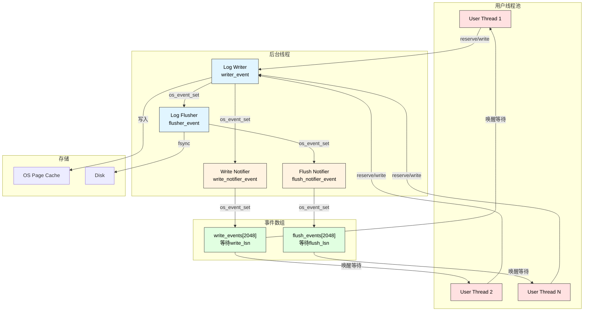
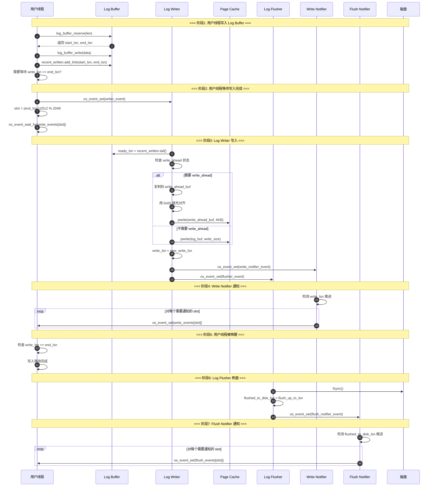

# os_event 原理与 Read-on-Write 问题深度分析

## 概述

本文深入分析 InnoDB 中 `os_event` 条件变量的实现原理（结合 Linux pthread 源码），以及 `Read-on-Write` 问题的本质和解决方案。

---

## 第一部分：os_event 运行原理

### 1.1 os_event 核心结构

InnoDB 的 `os_event` 是对操作系统条件变量的封装，提供了高效的线程间同步机制。

```text
源码位置: storage/innobase/os/os0event.cc

┌─────────────────────────────────────────────────────────────────────────────┐
│                           struct os_event                                   │
├─────────────────────────────────────────────────────────────────────────────┤
│                                                                             │
│  ┌─────────────────────┐                                                    │
│  │    bool m_set       │ ← 信号状态标志                                     │
│  │                     │   true:  已触发(signaled)，线程无需等待            │
│  │                     │   false: 未触发(nonsignaled)，线程需要等待         │
│  └─────────────────────┘                                                    │
│                                                                             │
│  ┌─────────────────────┐                                                    │
│  │  int64_t signal_cnt │ ← 信号计数器                                       │
│  │                     │   每次 broadcast 时递增                            │
│  │                     │   用于检测 reset 与 wait 之间的信号                 │
│  └─────────────────────┘                                                    │
│                                                                             │
│  ┌─────────────────────┐                                                    │
│  │   EventMutex mutex  │ ← 保护上述字段的互斥锁                             │
│  └─────────────────────┘                                                    │
│                                                                             │
│  ┌─────────────────────┐                                                    │
│  │ pthread_cond_t cond │ ← POSIX 条件变量                                   │
│  │                     │   (Windows: CONDITION_VARIABLE)                    │
│  └─────────────────────┘                                                    │
│                                                                             │
└─────────────────────────────────────────────────────────────────────────────┘
```

### 1.2 核心函数实现

#### os_event_set() - 触发事件

```cpp
// storage/innobase/os/os0event.cc:84-93
void set() UNIV_NOTHROW {
    mutex.enter();           // 1. 获取互斥锁

    if (!m_set) {
        broadcast();         // 2. 如果未触发，则广播通知所有等待线程
    }

    mutex.exit();            // 3. 释放互斥锁
}

// broadcast() 实现
void broadcast() UNIV_NOTHROW {
    m_set = true;            // 设置为已触发状态
    ++signal_count;          // 递增信号计数

    // 调用 POSIX 的 pthread_cond_broadcast
    // 唤醒所有等待在此条件变量上的线程
    pthread_cond_broadcast(&cond_var);
}
```

#### os_event_reset() - 重置事件

```cpp
// storage/innobase/os/os0event.cc:109-121
int64_t reset() UNIV_NOTHROW {
    mutex.enter();

    if (m_set) {
        m_set = false;       // 重置为未触发状态
    }

    int64_t ret = signal_count;  // 返回当前信号计数

    mutex.exit();

    return ret;              // 返回值用于 wait 时检测信号丢失
}
```

#### os_event_wait_low() - 等待事件

```cpp
// storage/innobase/os/os0event.cc:395-411
void wait_low(int64_t reset_sig_count) UNIV_NOTHROW {
    mutex.enter();

    // 检查是否已经触发，或者信号计数已变化
    if (!m_set && (reset_sig_count == 0 || signal_count == reset_sig_count)) {
        // 条件不满足，进入等待
        wait();  // 调用 pthread_cond_wait(&cond_var, mutex)
    }

    mutex.exit();
}
```

### 1.3 Linux pthread_cond 底层原理

InnoDB 的 `os_event` 底层依赖 Linux 的 pthread 条件变量。以下是 Linux 内核实现原理：

```text
┌─────────────────────────────────────────────────────────────────────────────┐
│                    Linux pthread_cond 实现架构                              │
├─────────────────────────────────────────────────────────────────────────────┤
│                                                                             │
│  用户空间 (glibc/NPTL)                                                      │
│  ────────────────────                                                       │
│  ┌─────────────────────────────────────────────────────────────────────┐   │
│  │  pthread_cond_wait():                                               │   │
│  │    1. 原子地释放 mutex 并进入等待                                    │   │
│  │    2. 调用 futex(FUTEX_WAIT) 系统调用                               │   │
│  │    3. 被唤醒后重新获取 mutex                                        │   │
│  │    4. 返回用户代码                                                  │   │
│  └─────────────────────────────────────────────────────────────────────┘   │
│                                      ↓                                      │
│                            ════════════════                                 │
│                              系统调用边界                                    │
│                            ════════════════                                 │
│                                      ↓                                      │
│  内核空间 (Linux Kernel)                                                    │
│  ─────────────────────                                                      │
│  ┌─────────────────────────────────────────────────────────────────────┐   │
│  │  futex (Fast Userspace muTEX):                                      │   │
│  │                                                                     │   │
│  │  struct futex_hash_bucket {                                         │   │
│  │      spinlock_t lock;         // 保护等待队列                        │   │
│  │      wait_queue_head_t wq;    // 等待队列头                          │   │
│  │  };                                                                 │   │
│  │                                                                     │   │
│  │  FUTEX_WAIT:                                                        │   │
│  │    1. 根据用户地址哈希到 futex_hash_bucket                          │   │
│  │    2. 将当前进程加入等待队列                                        │   │
│  │    3. 设置进程状态为 TASK_INTERRUPTIBLE                             │   │
│  │    4. 调用 schedule() 让出 CPU                                      │   │
│  │                                                                     │   │
│  │  FUTEX_WAKE:                                                        │   │
│  │    1. 找到对应的 futex_hash_bucket                                  │   │
│  │    2. 唤醒等待队列中的进程(一个或多个)                              │   │
│  │    3. 将进程状态设为 TASK_RUNNING                                   │   │
│  └─────────────────────────────────────────────────────────────────────┘   │
│                                                                             │
└─────────────────────────────────────────────────────────────────────────────┘
```

#### Linux futex 系统调用核心代码路径

```c
// Linux kernel: kernel/futex/core.c

// FUTEX_WAIT 实现
static int futex_wait(u32 __user *uaddr, unsigned int flags,
                      u32 val, ktime_t *abs_time) {
    struct futex_hash_bucket *hb;
    struct futex_q q = futex_q_init;
    
    // 1. 计算 futex 哈希桶
    hb = futex_hash(&key);
    
    // 2. 加锁并检查值
    spin_lock(&hb->lock);
    if (uval != val) {  // 值已改变，不需要等待
        spin_unlock(&hb->lock);
        return -EAGAIN;
    }
    
    // 3. 将当前任务加入等待队列
    __futex_queue(&q, hb);
    spin_unlock(&hb->lock);
    
    // 4. 设置超时(如果有)并休眠
    set_current_state(TASK_INTERRUPTIBLE);
    schedule();  // 让出 CPU，进入睡眠
    
    return 0;
}

// FUTEX_WAKE 实现  
static int futex_wake(u32 __user *uaddr, unsigned int flags, int nr_wake) {
    struct futex_hash_bucket *hb;
    
    // 1. 找到对应的哈希桶
    hb = futex_hash(&key);
    
    spin_lock(&hb->lock);
    
    // 2. 唤醒等待队列中的任务
    list_for_each_entry_safe(q, next, &hb->chain, list) {
        if (match_futex(&q->key, &key)) {
            wake_up_q(&wake_q);  // 唤醒任务
            if (++nr_woken >= nr_wake)
                break;
        }
    }
    
    spin_unlock(&hb->lock);
    return nr_woken;
}
```

### 1.4 os_event_wait_for 高级等待模式

InnoDB 实现了一种混合等待策略，结合了自旋等待和事件等待：

```cpp
// storage/innobase/include/os0event.ic:57-139
template <typename Condition>
Wait_stats os_event_wait_for(os_event_t &event,
                             uint64_t spins_limit,
                             std::chrono::microseconds timeout,
                             Condition condition) {
    uint32_t waits = 0;
    
    while (true) {
        // 阶段1: 自旋等待 (Spin Phase)
        const bool wait = (spins_limit == 0);
        const int64_t sig_count = !wait ? 0 : os_event_reset(event);
        
        // 检查条件是否满足
        if (condition(wait)) {
            return Wait_stats{waits};
        }
        
        if (!wait) {
            // 还在自旋阶段
            --spins_limit;
            UT_RELAX_CPU();  // PAUSE 指令，降低 CPU 功耗
        } else {
            // 阶段2: 事件等待 (Event Phase)
            ++waits;
            // 超时时间动态调整(指数退避)
            timeout = std::min(timeout * 2, MAX_TIMEOUT);
            
            // 调用 pthread_cond_timedwait
            os_event_wait_time_low(event, timeout, sig_count);
        }
    }
}
```

```text
┌─────────────────────────────────────────────────────────────────────────────┐
│                    os_event_wait_for 等待策略                               │
├─────────────────────────────────────────────────────────────────────────────┤
│                                                                             │
│  Phase 1: 自旋等待 (Spin Wait)                                              │
│  ─────────────────────────────                                              │
│   ┌─────────────────────────────────────────────────────────────────────┐  │
│   │  for (i = 0; i < spins_limit; i++) {                                │  │
│   │      if (condition()) return;     // 条件满足，立即返回              │  │
│   │      UT_RELAX_CPU();              // 执行 PAUSE 指令                 │  │
│   │  }                                                                  │  │
│   └─────────────────────────────────────────────────────────────────────┘  │
│   优点: 无系统调用开销，响应快                                             │
│   缺点: 消耗 CPU 资源                                                      │
│                                                                             │
│                          ↓ 自旋次数用尽                                     │
│                                                                             │
│  Phase 2: 事件等待 (Event Wait)                                             │
│  ──────────────────────────────                                             │
│   ┌─────────────────────────────────────────────────────────────────────┐  │
│   │  while (!condition()) {                                             │  │
│   │      sig_count = os_event_reset(event);                             │  │
│   │      os_event_wait_time_low(event, timeout, sig_count);             │  │
│   │      timeout = min(timeout * 2, 100ms);  // 指数退避                │  │
│   │  }                                                                  │  │
│   └─────────────────────────────────────────────────────────────────────┘  │
│   优点: 不消耗 CPU，可长时间等待                                           │
│   缺点: 需要系统调用，有上下文切换开销                                     │
│                                                                             │
│  超时退避策略:                                                              │
│  ─────────────                                                              │
│    初始: 1μs → 2μs → 4μs → 8μs → 16μs → ... → 100ms (最大值)             │
│                                                                             │
└─────────────────────────────────────────────────────────────────────────────┘
```

---

## 第二部分：Redo Log 中 os_event 的使用

### 2.1 Redo Log 线程间通信架构



### 2.2 用户线程等待写入完成

```cpp
// storage/innobase/log/log0write.cc:850-886
static Wait_stats log_wait_for_write(const log_t &log, lsn_t lsn,
                                     bool *interrupted) {
    // 1. 唤醒 Log Writer 线程(如果在休眠)
    os_event_set(log.writer_event);

    // 2. 计算最大自旋次数
    const uint64_t max_spins = log_max_spins_when_waiting_in_user_thread(
        srv_log_wait_for_write_spin_delay);

    // 3. 定义停止条件
    auto stop_condition = [&log, lsn, interrupted](bool wait) {
        // 检查 write_lsn 是否已经推进到目标位置
        if (log.write_lsn.load() >= lsn) {
            *interrupted = false;
            return true;  // 条件满足，停止等待
        }
        
        if (wait) {
            // 再次唤醒 Writer，确保不会错过
            os_event_set(log.writer_event);
        }
        
        return false;  // 继续等待
    };

    // 4. 计算等待的 slot
    //    slot = (lsn - 1) / 512 % events_size
    const size_t slot = log_compute_write_event_slot(log, lsn);

    // 5. 使用混合等待策略
    const auto wait_stats =
        os_event_wait_for(log.write_events[slot], max_spins,
                          get_srv_log_wait_for_write_timeout(), stop_condition);

    return wait_stats;
}
```

### 2.3 Log Write Notifier 通知机制

```cpp
// storage/innobase/log/log0write.cc:2665-2774
void log_write_notifier(log_t *log_ptr) {
    log_t &log = *log_ptr;
    lsn_t lsn = log.write_lsn.load() + 1;

    Log_thread_waiting waiting{log, log.write_notifier_event,
                               srv_log_write_notifier_spin_delay,
                               get_srv_log_write_notifier_timeout()};

    for (uint64_t step = 0;; ++step) {
        // 等待 write_lsn 推进
        auto stop_condition = [&log, lsn](bool wait) {
            if (log.write_lsn.load() >= lsn) {
                return true;  // write_lsn 已推进
            }
            return false;
        };

        waiting.wait(stop_condition);

        // 获取当前 write_lsn
        const lsn_t write_lsn = log.write_lsn.load();

        // 对齐到块边界
        const lsn_t notified_up_to_lsn =
            ut_uint64_align_up(write_lsn, OS_FILE_LOG_BLOCK_SIZE);

        // 通知所有等待的 slot
        while (lsn <= notified_up_to_lsn) {
            const auto slot = log_compute_write_event_slot(log, lsn);
            lsn += OS_FILE_LOG_BLOCK_SIZE;

            // 唤醒等待该 slot 的所有用户线程
            os_event_set(log.write_events[slot]);
        }

        lsn = write_lsn + 1;
    }
}
```

### 2.4 事件槽位计算

```cpp
// storage/innobase/log/log0write.cc:768-803
// 计算等待槽位的公式
static inline size_t log_compute_wait_event_slot(lsn_t lsn, size_t events_n) {
    // slot = (lsn - 1) / OS_FILE_LOG_BLOCK_SIZE % events_n
    //      = (lsn - 1) / 512 % events_n
    return ((lsn - 1) / OS_FILE_LOG_BLOCK_SIZE) & (events_n - 1);
}
```

```text
┌─────────────────────────────────────────────────────────────────────────────┐
│                        事件槽位映射示意图                                   │
├─────────────────────────────────────────────────────────────────────────────┤
│                                                                             │
│  LSN 范围                        槽位计算                  events[slot]      │
│  ─────────────────────────────────────────────────────────────────────────  │
│                                                                             │
│  [1, 512]          → (1-1)/512 % 2048 = 0       → events[0]                │
│  [513, 1024]       → (513-1)/512 % 2048 = 1     → events[1]                │
│  [1025, 1536]      → (1025-1)/512 % 2048 = 2    → events[2]                │
│       ...                 ...                         ...                   │
│  [1047553, 1048064] → slot = 2047               → events[2047]             │
│  [1048065, 1048576] → slot = 0                  → events[0]   (循环)       │
│                                                                             │
│  ┌───┬───┬───┬───┬───┬────────────────────────────────┬────────┐           │
│  │ 0 │ 1 │ 2 │ 3 │...│                                │  2047  │           │
│  └───┴───┴───┴───┴───┴────────────────────────────────┴────────┘           │
│    ↑                                                     ↑                  │
│  同一个 slot 可能有多个 LSN 范围的线程在等待                                │
│  Notifier 唤醒后，线程需要重新检查自己的 LSN 是否满足                       │
│                                                                             │
└─────────────────────────────────────────────────────────────────────────────┘
```

---

## 第三部分：Read-on-Write 问题深度分析

### 3.1 什么是 Read-on-Write

**Read-on-Write** (读后写) 是指在进行非对齐写入时，操作系统需要先读取磁盘上的数据到内存，修改后再写回磁盘的问题。

```text
┌─────────────────────────────────────────────────────────────────────────────┐
│                        Read-on-Write 问题示意图                             │
├─────────────────────────────────────────────────────────────────────────────┤
│                                                                             │
│  场景: 用户想写入 100 字节数据到文件偏移 200 处                             │
│        但磁盘 sector 大小是 512 字节                                        │
│                                                                             │
│  ┌─────────────────────────────────────────────────────────────────────┐   │
│  │                          Disk Sector (512B)                          │   │
│  │                                                                     │   │
│  │  0              200          300                               512  │   │
│  │  ├───────────────┼────────────┼─────────────────────────────────┤   │   │
│  │  │   旧数据 A     │  新数据    │            旧数据 B              │   │   │
│  │  │   (200 B)     │  (100 B)   │            (212 B)              │   │   │
│  │  └───────────────┴────────────┴─────────────────────────────────┘   │   │
│  └─────────────────────────────────────────────────────────────────────┘   │
│                                                                             │
│  操作系统的处理步骤:                                                        │
│                                                                             │
│  ┌────────────────────────────────────────────────────────────────────┐    │
│  │  步骤1: READ - 从磁盘读取整个 sector (512B)                        │    │
│  │         ┌─────────────────────────────────────────────────────┐    │    │
│  │         │              Sector 原始内容                         │    │    │
│  │         └─────────────────────────────────────────────────────┘    │    │
│  │                              ↓                                     │    │
│  │  步骤2: MODIFY - 在内存中修改偏移 200-300 的内容                   │    │
│  │         ┌──────────┬──────────────┬──────────────────────────┐    │    │
│  │         │ 旧数据 A  │   新数据     │         旧数据 B          │    │    │
│  │         └──────────┴──────────────┴──────────────────────────┘    │    │
│  │                              ↓                                     │    │
│  │  步骤3: WRITE - 将整个 sector 写回磁盘                            │    │
│  │         ┌─────────────────────────────────────────────────────┐    │    │
│  │         │              Sector 新内容                           │    │    │
│  │         └─────────────────────────────────────────────────────┘    │    │
│  └────────────────────────────────────────────────────────────────────┘    │
│                                                                             │
│  问题:                                                                      │
│    1. 额外的磁盘读取 I/O                                                    │
│    2. 读取可能触发磁盘寻道延迟                                              │
│    3. 对于 Redo Log 高频写入场景，性能影响显著                              │
│                                                                             │
└─────────────────────────────────────────────────────────────────────────────┘
```

### 3.2 Linux 文件系统中的 Read-on-Write

在 Linux 内核中，write 系统调用的处理涉及到 Page Cache 和块设备层：

```c
// Linux kernel: fs/read_write.c → mm/filemap.c → block/blk-core.c

// 简化的写入流程
ssize_t generic_file_write_iter(struct kiocb *iocb, struct iov_iter *from) {
    struct file *file = iocb->ki_filp;
    struct address_space *mapping = file->f_mapping;
    loff_t pos = iocb->ki_pos;
    size_t count = iov_iter_count(from);
    
    // 1. 检查写入是否页对齐
    if (!IS_ALIGNED(pos, PAGE_SIZE) || !IS_ALIGNED(count, PAGE_SIZE)) {
        // 非对齐写入，需要先读取页面
        struct page *page = grab_cache_page_write_begin(mapping, index);
        
        if (!PageUptodate(page)) {
            // 页面不是最新的，需要从磁盘读取
            // ============================================
            // 这就是 READ-ON-WRITE 发生的地方！
            // ============================================
            error = mapping->a_ops->readpage(file, page);
            wait_on_page_locked(page);
        }
        
        // 2. 在内存中修改页面
        copied = iov_iter_copy_from_user_atomic(page, from, offset, bytes);
        
        // 3. 标记页面为脏，稍后写回
        set_page_dirty(page);
    }
    
    return written;
}
```

### 3.3 块设备层的对齐要求

```text
┌─────────────────────────────────────────────────────────────────────────────┐
│                         Linux 块 I/O 层次结构                               │
├─────────────────────────────────────────────────────────────────────────────┤
│                                                                             │
│  ┌────────────────────────────────────────────────────────────────────┐    │
│  │  应用层 (InnoDB)                                                   │    │
│  │    write(fd, buf, 100) 写入 100 字节到偏移 200                      │    │
│  └────────────────────────────────────────────────────────────────────┘    │
│                                   ↓                                         │
│  ┌────────────────────────────────────────────────────────────────────┐    │
│  │  VFS 层                                                            │    │
│  │    vfs_write() → 检查对齐，路由到文件系统                           │    │
│  └────────────────────────────────────────────────────────────────────┘    │
│                                   ↓                                         │
│  ┌────────────────────────────────────────────────────────────────────┐    │
│  │  文件系统层 (ext4/xfs)                                             │    │
│  │    generic_file_write_iter()                                       │    │
│  │    → 如果非页对齐，先读取整页到 Page Cache                          │    │
│  │    → 修改 Page Cache 中的数据                                       │    │
│  │    → 标记页面为脏                                                   │    │
│  └────────────────────────────────────────────────────────────────────┘    │
│                                   ↓                                         │
│  ┌────────────────────────────────────────────────────────────────────┐    │
│  │  Block 层                                                          │    │
│  │    submit_bio() → 构造 bio 请求                                     │    │
│  │                                                                    │    │
│  │    硬件要求:                                                       │    │
│  │    ┌──────────────────────────────────────────────────────────┐   │    │
│  │    │  HDD: logical_block_size = 512B (典型)                    │   │    │
│  │    │  SSD: logical_block_size = 512B or 4KB                    │   │    │
│  │    │  NVMe: 可能 512B 或 4KB                                    │   │    │
│  │    │                                                          │   │    │
│  │    │  所有 I/O 必须是 logical_block_size 的整数倍对齐！         │   │    │
│  │    └──────────────────────────────────────────────────────────┘   │    │
│  └────────────────────────────────────────────────────────────────────┘    │
│                                   ↓                                         │
│  ┌────────────────────────────────────────────────────────────────────┐    │
│  │  设备驱动层                                                        │    │
│  │    SCSI/SATA/NVMe 驱动处理请求                                     │    │
│  └────────────────────────────────────────────────────────────────────┘    │
│                                   ↓                                         │
│  ┌────────────────────────────────────────────────────────────────────┐    │
│  │  硬件层                                                            │    │
│  │    磁盘/SSD 执行物理读写                                           │    │
│  └────────────────────────────────────────────────────────────────────┘    │
│                                                                             │
└─────────────────────────────────────────────────────────────────────────────┘
```

### 3.4 InnoDB Write-Ahead 解决方案

InnoDB 通过 **Write-Ahead Buffer** 机制避免 Read-on-Write：

```cpp
// storage/innobase/log/log0write.cc:1490-1528
// 检查是否需要 write-ahead
if (!current_write_ahead_enough(log, real_offset, write_size)) {
    if (!current_write_ahead_enough(log, real_offset, 1)) {
        // 当前 write-ahead 区域没有空间
        
        const auto next_wa = compute_next_write_ahead_end(real_offset);
        
        if (!write_ahead_enough(next_wa, real_offset, write_size)) {
            // 写入数据量超过一个 write-ahead 区域
            // 只写入整数倍的 write-ahead 区域
            write_size = next_wa - real_offset;
        } else {
            // 数据量较小，复制到 write-ahead buffer
            // 从 buffer 写入，而不是从 log buffer 直接写入
            write_from_log_buffer = false;
        }
    } else {
        // 限制写入到已经 write-ahead 过的区域末尾
        write_size = log.write_ahead_end_offset - real_offset;
    }
}
```

### 3.5 Write-Ahead 工作原理图解

```text
┌─────────────────────────────────────────────────────────────────────────────┐
│                      InnoDB Write-Ahead 机制详解                            │
├─────────────────────────────────────────────────────────────────────────────┤
│                                                                             │
│  配置参数: innodb_log_write_ahead_size = 4096 (4KB, 典型值)                │
│                                                                             │
│  ═══════════════════════════════════════════════════════════════════════   │
│  场景1: 写入量 < write_ahead_size，且未超出当前 write_ahead 区域           │
│  ═══════════════════════════════════════════════════════════════════════   │
│                                                                             │
│  文件偏移:  0        1K       2K       3K       4K       5K       6K       │
│            ├────────┼────────┼────────┼────────┼────────┼────────┤        │
│            │████████│████████│████▓▓▓▓│        │        │        │        │
│            │  已写   │  已写   │已写│新│        │        │        │        │
│            └────────┴────────┴────────┴────────┴────────┴────────┘        │
│            ◄──────── write_ahead_end = 4K ─────►                           │
│                                 ▲                                          │
│                              新写入 500B                                   │
│                                                                             │
│  处理: 直接写入，因为 4K 区域已经 write-ahead 过，不会触发 read-on-write    │
│                                                                             │
│  ═══════════════════════════════════════════════════════════════════════   │
│  场景2: 写入量较小，需要写入新的 write_ahead 区域                          │
│  ═══════════════════════════════════════════════════════════════════════   │
│                                                                             │
│  当前状态:                                                                  │
│            0        1K       2K       3K       4K       5K       6K       │
│            ├────────┼────────┼────────┼────────┼────────┼────────┤        │
│            │████████│████████│████████│████████│▓▓▓▓    │        │        │
│            │  已写   │  已写   │  已写   │  已写   │新│    │        │        │
│            └────────┴────────┴────────┴────────┴────────┴────────┘        │
│            ◄──────── write_ahead_end = 4K ─────►                           │
│                                              ▲                              │
│                                           新写入 500B                       │
│                                           超出 4K 边界                      │
│                                                                             │
│  处理步骤:                                                                  │
│    1. 将数据复制到 write_ahead_buf                                         │
│    2. 用 0x00 填充 write_ahead_buf 剩余部分 (到 8K)                         │
│    3. 写入整个 4KB (从 4K 到 8K)                                            │
│    4. 更新 write_ahead_end = 8K                                            │
│                                                                             │
│  结果:                                                                      │
│            0        1K       2K       3K       4K       5K       6K    8K  │
│            ├────────┼────────┼────────┼────────┼────────┼────────┼────┤   │
│            │████████│████████│████████│████████│████0000│00000000│0000│   │
│            └────────┴────────┴────────┴────────┴────────┴────────┴────┘   │
│            ◄────────────────── write_ahead_end = 8K ─────────────────►     │
│                                                                             │
│  ═══════════════════════════════════════════════════════════════════════   │
│  场景3: 写入量 > write_ahead_size                                          │
│  ═══════════════════════════════════════════════════════════════════════   │
│                                                                             │
│  当前状态: 需要写入 10KB 数据，write_ahead_size = 4KB                      │
│                                                                             │
│  处理:                                                                      │
│    1. 先写入 8KB (2 个完整的 write_ahead 区域)                              │
│       → 完整的 write_ahead_size 整数倍不会触发 read-on-write               │
│    2. 剩余 2KB 留待下次处理(走场景2的逻辑)                                  │
│                                                                             │
└─────────────────────────────────────────────────────────────────────────────┘
```

### 3.6 Write-Ahead Buffer 准备代码

```cpp
// storage/innobase/log/log0write.cc:1676-1710
static inline size_t prepare_for_write_ahead(log_t &log,
                                             os_offset_t real_offset,
                                             size_t &write_size) {
    // 计算下一个 write_ahead 边界
    const auto next_wa = compute_next_write_ahead_end(real_offset);

    // 需要填充的字节数
    size_t write_ahead = next_wa - (real_offset + write_size);

    // 检查是否超出文件边界
    if (!current_file_has_space(log, real_offset, write_size + write_ahead)) {
        write_ahead = log.m_current_file.m_size_in_bytes -
                      real_offset - write_size;
    }

    // 用 0x00 填充 write_ahead_buf 的剩余部分
    std::memset(log.write_ahead_buf + write_size, 0x00, write_ahead);

    write_size += write_ahead;  // 增加写入大小

    return write_ahead;
}
```

### 3.7 为什么 Write-Ahead 能避免 Read-on-Write

```text
┌─────────────────────────────────────────────────────────────────────────────┐
│                   Write-Ahead 避免 Read-on-Write 原理                       │
├─────────────────────────────────────────────────────────────────────────────┤
│                                                                             │
│  关键点: 确保所有写入都是 write_ahead_size 对齐的完整写入                   │
│                                                                             │
│  ┌─────────────────────────────────────────────────────────────────────┐   │
│  │  条件1: write_ahead_size 必须是磁盘 sector 大小的整数倍             │   │
│  │         典型配置: write_ahead_size = 4096, sector = 512             │   │
│  │         4096 % 512 = 0 ✓                                            │   │
│  │                                                                     │   │
│  │  条件2: 写入偏移量必须是 write_ahead_size 对齐                      │   │
│  │         log.write_ahead_end_offset % write_ahead_size == 0 ✓        │   │
│  │                                                                     │   │
│  │  条件3: 写入大小必须是 write_ahead_size 的整数倍                    │   │
│  │         write_size % write_ahead_size == 0 (通过填充0实现) ✓        │   │
│  └─────────────────────────────────────────────────────────────────────┘   │
│                                                                             │
│  结果:                                                                      │
│  ─────                                                                      │
│                                                                             │
│    没有 Write-Ahead:                                                        │
│    ┌────────────────────────────────────────────────────────────────┐      │
│    │  写入 500B 到偏移 3800                                         │      │
│    │                                                                │      │
│    │  3584     3800   4096    4300                                  │      │
│    │  ├────────┼──────┼───────┼────►                                │      │
│    │  │        │██████│       │                                     │      │
│    │  │<─ sector1 ───>│<─ sector2 ───>                              │      │
│    │                                                                │      │
│    │  OS 必须:                                                      │      │
│    │    1. READ sector1 (3584-4096) → read-on-write!                │      │
│    │    2. READ sector2 (4096-4608) → read-on-write!                │      │
│    │    3. MODIFY                                                   │      │
│    │    4. WRITE both sectors                                       │      │
│    └────────────────────────────────────────────────────────────────┘      │
│                                                                             │
│    有 Write-Ahead:                                                          │
│    ┌────────────────────────────────────────────────────────────────┐      │
│    │  写入 4KB 到偏移 4096 (即使只有 500B 有效数据)                  │      │
│    │                                                                │      │
│    │  4096                                              8192        │      │
│    │  ├─────────────────────────────────────────────────┤           │      │
│    │  │██████████████████00000000000000000000000000000000│           │      │
│    │  │<─ 500B data ───>│<──── zeros padding ──────────>│           │      │
│    │  │<─────────── 完整 4KB write-ahead ──────────────>│           │      │
│    │                                                                │      │
│    │  OS 直接: WRITE 4KB → 无需先读取！                             │      │
│    └────────────────────────────────────────────────────────────────┘      │
│                                                                             │
└─────────────────────────────────────────────────────────────────────────────┘
```

---

## 第四部分：完整时序图

### 4.1 Redo Log 写入与通知完整流程



---

## 总结

### os_event 核心要点

| 特性 | 说明 |
|:-----|:-----|
| **底层实现** | pthread_cond + mutex (Linux), CONDITION_VARIABLE (Windows) |
| **信号模型** | 手动重置 (manual reset)，需要显式调用 reset() |
| **等待策略** | 混合模式：先自旋 + 后事件等待 |
| **通知方式** | broadcast 唤醒所有等待线程 |
| **防信号丢失** | signal_count 机制检测 reset-wait 之间的信号 |

### Write-Ahead 核心要点

| 特性 | 说明 |
|:-----|:-----|
| **目的** | 避免 Read-on-Write 问题 |
| **参数** | `innodb_log_write_ahead_size` (默认 8192) |
| **原理** | 确保所有写入都是对齐的完整块 |
| **代价** | 可能写入比实际数据更多的字节 (0填充) |
| **收益** | 避免额外的磁盘读取 I/O |

### 相关参数

| 参数 | 默认值 | 说明 |
|:-----|:-------|:-----|
| `innodb_log_write_ahead_size` | 8192 | Write-ahead 块大小 |
| `innodb_log_write_events` | 2048 | 写入事件槽位数量 |
| `innodb_log_flush_events` | 2048 | 刷新事件槽位数量 |
| `innodb_log_wait_for_write_spin_delay` | 25000 | 等待写入的自旋延迟 |
| `innodb_log_wait_for_flush_spin_delay` | 25000 | 等待刷新的自旋延迟 |

---

## 源码参考

| 功能 | 文件 | 行号 |
|:-----|:-----|:-----|
| os_event 结构定义 | `storage/innobase/os/os0event.cc` | 63-280 |
| os_event_wait_for | `storage/innobase/include/os0event.ic` | 57-139 |
| log_wait_for_write | `storage/innobase/log/log0write.cc` | 850-886 |
| log_write_notifier | `storage/innobase/log/log0write.cc` | 2665-2774 |
| Write-ahead 逻辑 | `storage/innobase/log/log0write.cc` | 1490-1720 |
| write_ahead_size 定义 | `storage/innobase/srv/srv0srv.cc` | 273 |

---

## os_event 从创建到使用的完整源码分析

### 1. os_event 生命周期全景图

```text
┌─────────────────────────────────────────────────────────────────────────────┐
│                    os_event 完整生命周期                                     │
├─────────────────────────────────────────────────────────────────────────────┤
│                                                                             │
│  ┌─────────────────────────────────────────────────────────────────────┐   │
│  │ 阶段1: 全局初始化 (MySQL启动时执行一次)                              │   │
│  │ os_event_global_init()                                              │   │
│  │   └── pthread_condattr_init(&cond_attr)                             │   │
│  │   └── pthread_condattr_setclock(&cond_attr, CLOCK_MONOTONIC)        │   │
│  │   └── global_initialized = true                                     │   │
│  └─────────────────────────────────────────────────────────────────────┘   │
│                                      ↓                                      │
│  ┌─────────────────────────────────────────────────────────────────────┐   │
│  │ 阶段2: 创建事件对象 (按需创建多个)                                   │   │
│  │ os_event_create()                                                   │   │
│  │   └── ut::new_<os_event>()        // 分配内存                       │   │
│  │         └── os_event::os_event()  // 调用构造函数                   │   │
│  │               └── init()          // 初始化内部结构                 │   │
│  │                     └── mutex.init()                                │   │
│  │                     └── pthread_cond_init(&cond_var, &cond_attr)    │   │
│  │               └── m_set = false                                     │   │
│  │               └── signal_count = 1                                  │   │
│  └─────────────────────────────────────────────────────────────────────┘   │
│                                      ↓                                      │
│  ┌─────────────────────────────────────────────────────────────────────┐   │
│  │ 阶段3: 使用事件对象 (核心流程)                                       │   │
│  │                                                                     │   │
│  │  [等待者线程]                      [通知者线程]                      │   │
│  │       │                                 │                           │   │
│  │       ▼                                 │                           │   │
│  │  os_event_reset()                       │                           │   │
│  │  sig_count = signal_count               │                           │   │
│  │  m_set = false                          │                           │   │
│  │       │                                 │                           │   │
│  │       ▼                                 ▼                           │   │
│  │  os_event_wait_low(sig_count)     os_event_set()                    │   │
│  │       │                                 │                           │   │
│  │       │   ┌──────────────────────────── │                           │   │
│  │       ▼   ▼                             ▼                           │   │
│  │  ┌─────────────────────────────────────────────────┐                │   │
│  │  │ 竞争 mutex                                      │                │   │
│  │  │  - 等待者: 检查 m_set 和 signal_count           │                │   │
│  │  │  - 通知者: broadcast() → 唤醒所有等待者         │                │   │
│  │  └─────────────────────────────────────────────────┘                │   │
│  │                                                                     │   │
│  └─────────────────────────────────────────────────────────────────────┘   │
│                                      ↓                                      │
│  ┌─────────────────────────────────────────────────────────────────────┐   │
│  │ 阶段4: 销毁事件对象 (MySQL关闭时)                                    │   │
│  │ os_event_destroy(event)                                             │   │
│  │   └── ut::delete_(event)                                            │   │
│  │         └── ~os_event()                                             │   │
│  │               └── destroy()                                         │   │
│  │                     └── pthread_cond_destroy(&cond_var)             │   │
│  │                     └── mutex.destroy()                             │   │
│  └─────────────────────────────────────────────────────────────────────┘   │
│                                      ↓                                      │
│  ┌─────────────────────────────────────────────────────────────────────┐   │
│  │ 阶段5: 全局清理 (MySQL关闭时执行一次)                                │   │
│  │ os_event_global_destroy()                                           │   │
│  │   └── pthread_condattr_destroy(&cond_attr)                          │   │
│  └─────────────────────────────────────────────────────────────────────┘   │
│                                                                             │
└─────────────────────────────────────────────────────────────────────────────┘
```

---

### 2. 阶段一：全局初始化

```cpp
// storage/innobase/os/os0event.cc:614-637
void os_event_global_init(void) {
    ut_ad(os_event::n_objects_alive.load() == 0);  // 确保还没创建任何 os_event
    
#ifndef _WIN32
    // 1. 初始化条件变量属性
    int ret = pthread_condattr_init(&os_event::cond_attr);
    ut_a(ret == 0);
    
    // 2. 设置使用 CLOCK_MONOTONIC（单调时钟，不受系统时间调整影响）
#ifdef UNIV_LINUX
#ifdef HAVE_CLOCK_GETTIME
    ret = pthread_condattr_setclock(&os_event::cond_attr, CLOCK_MONOTONIC);
    if (ret == 0) {
        os_event::cond_attr_has_monotonic_clock = true;
    }
#endif
    
    // 如果不支持单调时钟，发出警告
    if (!os_event::cond_attr_has_monotonic_clock) {
        ib::warn(ER_IB_MSG_CLOCK_MONOTONIC_UNSUPPORTED);
    }
#endif
#endif
    
    // 3. 标记全局初始化完成
    os_event::global_initialized = true;
}
```

**为什么使用 CLOCK_MONOTONIC？**

| 时钟类型 | 特点 | 问题 |
|---------|------|------|
| CLOCK_REALTIME | 系统实时时钟 | 受 NTP/手动调整影响，可能跳变 |
| CLOCK_MONOTONIC | 单调递增时钟 | 不受系统时间调整影响 |

使用 MONOTONIC 可以避免因系统时间调整导致的超时计算错误。

---

### 3. 阶段二：创建事件对象

```cpp
// storage/innobase/os/os0event.cc:528-540
os_event_t os_event_create() {
    // 1. 分配内存并调用构造函数
    os_event_t ret = ut::new_withkey<os_event>(UT_NEW_THIS_FILE_PSI_KEY);
    
#if defined(LINUX_SUSE)
    // SuSE Linux 需要特殊处理，避免 pthread_mutex_destroy 返回 EBUSY
    os_event_reset(ret);
#endif
    
    return ret;
}

// 构造函数 - storage/innobase/os/os0event.cc:502-518
os_event::os_event() UNIV_NOTHROW {
    ut_a(global_initialized);  // 确保全局初始化已完成
    
    init();  // 初始化内部结构
    
    m_set = false;       // 初始状态：未触发
    signal_count = 1;    // 初始值为1（0有特殊含义）
}

// init() 函数 - storage/innobase/os/os0event.cc:158-173
void init() UNIV_NOTHROW {
    mutex.init();  // 初始化互斥锁
    
#ifdef _WIN32
    InitializeConditionVariable(&cond_var);
#else
    // 使用全局 cond_attr 初始化条件变量
    int ret = pthread_cond_init(&cond_var, &cond_attr);
    ut_a(ret == 0);
#endif

    ut_d(n_objects_alive.fetch_add(1));  // 调试：增加存活对象计数
}
```

**os_event 内存布局：**

```text
┌─────────────────────────────────────────────────────────────────────────────┐
│                       struct os_event 内存布局                               │
├─────────────────────────────────────────────────────────────────────────────┤
│                                                                             │
│  偏移量    成员                大小        说明                              │
│  ─────────────────────────────────────────────────────────────────────      │
│  0x00     bool m_set           1 byte    信号状态标志                        │
│  0x08     int64_t signal_count 8 bytes   信号计数器                          │
│  0x10     EventMutex mutex     48 bytes  互斥锁（依赖具体实现）              │
│  0x40     pthread_cond_t cond  48 bytes  条件变量（glibc实现）               │
│                                                                             │
│  总大小约 144 bytes（因对齐可能略有不同）                                    │
│                                                                             │
└─────────────────────────────────────────────────────────────────────────────┘
```

---

### 4. 阶段三：事件使用 - 核心操作

#### 4.1 os_event_set() - 触发事件

```cpp
// storage/innobase/os/os0event.cc:85-93
void set() UNIV_NOTHROW {
    mutex.enter();           // ① 获取互斥锁
    
    if (!m_set) {            // ② 仅在未触发时才 broadcast
        broadcast();
    }
    
    mutex.exit();            // ③ 释放互斥锁
}

// broadcast() 实现 - os0event.cc:194-207
void broadcast() UNIV_NOTHROW {
    m_set = true;            // ① 设置为已触发状态
    ++signal_count;          // ② 递增信号计数（防止信号丢失）
    
#ifdef _WIN32
    WakeAllConditionVariable(&cond_var);
#else
    // ③ 调用 POSIX 接口唤醒所有等待线程
    int ret = pthread_cond_broadcast(&cond_var);
    ut_a(ret == 0);
#endif
}
```

**pthread_cond_broadcast 内核路径：**

```text
pthread_cond_broadcast()                    [glibc/NPTL]
  └── __pthread_cond_broadcast_2_0()
        └── lll_futex_wake(&cond->__data.__wseq, INT_MAX)
              └── syscall(SYS_futex, addr, FUTEX_WAKE, nr_wake)
                    ────────────────────────────────────────
                    内核空间
                    ────────────────────────────────────────
                    └── do_futex()           [kernel/futex/core.c]
                          └── futex_wake()
                                └── wake_up_q()
                                      └── 遍历等待队列，设置 TASK_RUNNING
```

#### 4.2 os_event_reset() - 重置事件

```cpp
// storage/innobase/os/os0event.cc:109-121
int64_t reset() UNIV_NOTHROW {
    mutex.enter();
    
    if (m_set) {
        m_set = false;       // 重置为未触发状态
    }
    
    int64_t ret = signal_count;  // 记录当前信号计数
    
    mutex.exit();
    
    return ret;  // ★ 返回值用于 wait_low 检测信号丢失
}
```

**为什么要返回 signal_count？**

这是解决"Lost Wake-up"问题的关键：

```text
┌─────────────────────────────────────────────────────────────────────────────┐
│                    Lost Wake-up 问题和解决方案                               │
├─────────────────────────────────────────────────────────────────────────────┤
│                                                                             │
│  问题场景：                                                                  │
│                                                                             │
│  Thread A             Thread B              Thread C                        │
│     │                    │                     │                            │
│  reset()                 │                     │                            │
│  sig_count=1             │                     │                            │
│     │                    │                     │                            │
│     │                 set()                    │                            │
│     │                 m_set=true               │                            │
│     │                 sig_count=2              │                            │
│     │                    │                     │                            │
│     │                    │                  reset()                         │
│     │                    │                  m_set=false                     │
│     │                    │                  sig_count=2                     │
│     │                    │                     │                            │
│  wait_low(1)             │                     │                            │
│  ★ 如果只检查 m_set=false，将无限等待！                                    │
│  ★ 但 sig_count (1) != signal_count (2)，可以检测到信号发生过               │
│     │                    │                     │                            │
│  → 立即返回 ✓            │                  wait_low(2)                     │
│                          │                  → 需要等待                       │
│                                                                             │
└─────────────────────────────────────────────────────────────────────────────┘
```

#### 4.3 os_event_wait_low() - 等待事件

```cpp
// storage/innobase/os/os0event.cc:358-373
void os_event::wait_low(int64_t reset_sig_count) UNIV_NOTHROW {
    mutex.enter();
    
    // ① 如果调用者没有提供 sig_count，使用当前值
    if (!reset_sig_count) {
        reset_sig_count = signal_count;
    }
    
    // ② 循环等待（处理虚假唤醒）
    while (!m_set && signal_count == reset_sig_count) {
        wait();  // 调用 pthread_cond_wait
        
        // "Spurious wakeups may occur"
        // 醒来后重新检查条件
    }
    
    mutex.exit();
}

// wait() 实现 - os0event.cc:177-190
void wait() UNIV_NOTHROW {
#ifdef _WIN32
    if (!SleepConditionVariableCS(&cond_var, mutex, INFINITE)) {
        ut_error;
    }
#else
    // 原子地释放 mutex 并等待条件变量
    int ret = pthread_cond_wait(&cond_var, mutex);
    ut_a(ret == 0);
#endif
}
```

**pthread_cond_wait 内核路径：**

```text
pthread_cond_wait()                         [glibc/NPTL]
  └── __pthread_cond_wait()
        ├── 原子释放 mutex
        └── lll_futex_wait(&cond->__data.__wseq, expected_seq)
              └── syscall(SYS_futex, addr, FUTEX_WAIT, val)
                    ────────────────────────────────────────
                    内核空间
                    ────────────────────────────────────────
                    └── do_futex()           [kernel/futex/core.c]
                          └── futex_wait()
                                ├── 将当前进程加入等待队列
                                ├── set_current_state(TASK_INTERRUPTIBLE)
                                └── schedule()  // 让出 CPU，进入睡眠
```

---

### 5. 阶段三-续：混合等待策略 os_event_wait_for()

InnoDB 使用混合等待策略优化性能：

```cpp
// storage/innobase/include/os0event.ic:58-139
template <typename Condition>
inline static Wait_stats os_event_wait_for(
    os_event_t &event,
    uint64_t spins_limit,               // 最大自旋次数
    std::chrono::microseconds timeout,  // 初始超时时间
    Condition condition) {              // 条件检查函数
    
    uint32_t next_level = 4;   // 每4次等待后加倍超时
    uint32_t waits = 0;
    
    constexpr auto MIN_TIMEOUT = std::chrono::microseconds{1};
    constexpr auto MAX_TIMEOUT = std::chrono::microseconds{100 * 1000};  // 100ms
    
    while (true) {
        const bool wait = spins_limit == 0;
        
        // ① 在检查条件前记录 sig_count，避免丢失通知
        const int64_t sig_count = !wait ? 0 : os_event_reset(event);
        
        // ② 检查条件
        if (condition(wait)) {
            return Wait_stats{waits};  // 条件满足，返回
        }
        
        if (!wait) {
            // ③ 自旋阶段：执行 PAUSE 指令
            --spins_limit;
            UT_RELAX_CPU();  // PAUSE 指令，减少自旋功耗
            
        } else {
            // ④ 事件等待阶段
            ++waits;
            
            // 限制最小超时时间
            if (timeout < MIN_TIMEOUT) {
                timeout = MIN_TIMEOUT;
            }
            
            // 每 next_level 次等待后，加倍超时时间（最大 100ms）
            if (waits == next_level) {
                timeout = std::min(timeout * 2, MAX_TIMEOUT);
                next_level += 4;
            }
            
            // ⑤ 等待事件
            os_event_wait_time_low(event, timeout, sig_count);
        }
    }
}
```

```text
┌─────────────────────────────────────────────────────────────────────────────┐
│                os_event_wait_for() 混合等待策略                              │
├─────────────────────────────────────────────────────────────────────────────┤
│                                                                             │
│  【阶段1: 自旋等待】                                                         │
│  ┌─────────────────────────────────────────────────────────────────────┐   │
│  │  for (i = 0; i < spins_limit; i++) {                                │   │
│  │      if (condition()) return;    // 条件满足，立即返回               │   │
│  │      UT_RELAX_CPU();             // 执行 PAUSE 指令                  │   │
│  │  }                                                                  │   │
│  │                                                                     │   │
│  │  优点：延迟极低（纳秒级）                                            │   │
│  │  缺点：消耗 CPU                                                      │   │
│  │  适用：条件很快会满足的场景                                          │   │
│  └─────────────────────────────────────────────────────────────────────┘   │
│                                      ↓                                      │
│  【阶段2: 事件等待】                                                         │
│  ┌─────────────────────────────────────────────────────────────────────┐   │
│  │  超时时间递增策略：                                                  │   │
│  │                                                                     │   │
│  │  等待次数    超时时间                                                │   │
│  │  ─────────────────────                                              │   │
│  │  1-4        1us → 2us                                               │   │
│  │  5-8        2us → 4us                                               │   │
│  │  9-12       4us → 8us                                               │   │
│  │  ...                                                                │   │
│  │  >64        100ms (最大值)                                          │   │
│  │                                                                     │   │
│  │  优点：不消耗 CPU                                                    │   │
│  │  缺点：有唤醒延迟                                                    │   │
│  │  适用：条件需要较长时间才满足的场景                                  │   │
│  └─────────────────────────────────────────────────────────────────────┘   │
│                                                                             │
└─────────────────────────────────────────────────────────────────────────────┘
```

---

### 6. Redo Log 中 os_event 的具体应用

#### 6.1 事件数组创建

```cpp
// storage/innobase/log/log0log.cc:1409-1434

// 创建 write_events 数组
static void log_allocate_write_events(log_t &log) {
    const size_t n = srv_log_write_events;  // 默认 2048
    
    ut_a(n >= 1);
    ut_a((n & (n - 1)) == 0);  // 必须是 2 的幂
    
    log.write_events_size = n;
    log.write_events = ut::new_arr_withkey<os_event_t>(..., ut::Count{n});
    
    for (size_t i = 0; i < log.write_events_size; ++i) {
        log.write_events[i] = os_event_create();
    }
}

// 创建 flush_events 数组
static void log_allocate_flush_events(log_t &log) {
    const size_t n = srv_log_flush_events;  // 默认 2048
    
    log.flush_events_size = n;
    log.flush_events = ut::new_arr_withkey<os_event_t>(..., ut::Count{n});
    
    for (size_t i = 0; i < log.flush_events_size; ++i) {
        log.flush_events[i] = os_event_create();
    }
}
```

#### 6.2 LSN 到 Slot 的映射

```cpp
// storage/innobase/log/log0write.cc:768-786
static inline size_t log_compute_wait_event_slot(lsn_t lsn, size_t events_n) {
    // ★ 关键算法：将 LSN 映射到 slot
    // (lsn - 1) / 512 得到块号，& (events_n - 1) 取模
    return ((lsn - 1) / OS_FILE_LOG_BLOCK_SIZE) & (events_n - 1);
}

// 为什么 lsn - 1？
// 当 lsn % 512 == 0 时，该 LSN 属于上一个块的最后一个字节
// 这样可以确保同一个块内的所有 LSN 映射到同一个 slot
```

```text
┌─────────────────────────────────────────────────────────────────────────────┐
│                    LSN 到 Event Slot 的映射                                  │
├─────────────────────────────────────────────────────────────────────────────┤
│                                                                             │
│  LSN 范围             块号        Slot (events_n=2048)                      │
│  ─────────────────────────────────────────────────────────────────────      │
│  1 - 512             0           0                                          │
│  513 - 1024          1           1                                          │
│  1025 - 1536         2           2                                          │
│  ...                                                                        │
│  1048065 - 1048576   2047        2047                                       │
│  1048577 - 1049088   2048        0        ← 循环回来                        │
│                                                                             │
│  示例：                                                                      │
│  lsn = 1024 → slot = (1023) / 512 % 2048 = 1                               │
│  lsn = 1025 → slot = (1024) / 512 % 2048 = 2                               │
│                                                                             │
└─────────────────────────────────────────────────────────────────────────────┘
```

#### 6.3 用户线程等待流程

```cpp
// storage/innobase/log/log0write.cc:870-886
// 等待 write_lsn >= lsn
static Wait_stats log_wait_for_write(const log_t &log, lsn_t lsn) {
    // 1. 触发 Log Writer 线程工作
    os_event_set(log.writer_event);
    
    // 2. 计算等待的 slot
    const size_t slot = log_compute_write_event_slot(log, lsn);
    
    // 3. 使用混合等待策略
    const auto wait_stats = os_event_wait_for(
        log.write_events[slot],              // 等待的事件
        max_spins,                           // 自旋次数
        get_srv_log_wait_for_write_timeout(), // 初始超时
        stop_condition                        // 检查 write_lsn >= lsn
    );
    
    return wait_stats;
}
```

#### 6.4 Notifier 线程唤醒流程

```cpp
// storage/innobase/log/log0write.cc:2748-2763
// Log Write Notifier 唤醒等待线程
void log_write_notifier(log_t *log_ptr) {
    log_t &log = *log_ptr;
    lsn_t lsn = log.write_lsn.load() + 1;
    
    // ...等待 write_lsn 推进...
    
    const lsn_t write_lsn = log.write_lsn.load();
    
    // 对齐到块边界
    const lsn_t notified_up_to_lsn = 
        ut_uint64_align_up(write_lsn, OS_FILE_LOG_BLOCK_SIZE);
    
    // 遍历所有需要通知的 slot
    while (lsn <= notified_up_to_lsn) {
        const auto slot = log_compute_write_event_slot(log, lsn);
        lsn += OS_FILE_LOG_BLOCK_SIZE;  // 每个块一个 slot
        
        // ★ 触发事件，唤醒该 slot 上的所有等待者
        os_event_set(log.write_events[slot]);
    }
}
```

```text
┌─────────────────────────────────────────────────────────────────────────────┐
│                    Redo Log 线程间通信时序图                                 │
├─────────────────────────────────────────────────────────────────────────────┤
│                                                                             │
│  用户线程              Log Writer          Log Write Notifier               │
│     │                      │                      │                         │
│     │  (1) mtr_commit      │                      │                         │
│     │  写入 Log Buffer     │                      │                         │
│     │         │            │                      │                         │
│     │  (2) os_event_set    │                      │                         │
│     │  ──────────────────→ │                      │                         │
│     │  writer_event        │                      │                         │
│     │         │            │                      │                         │
│     │         │      (3) 被唤醒                   │                         │
│     │         │            │                      │                         │
│     │  (4) 计算 slot       │                      │                         │
│     │  os_event_wait_for   │                      │                         │
│     │  write_events[slot]  │                      │                         │
│     │         │            │                      │                         │
│     │   ┌─────────────┐    │  (5) pwrite()        │                         │
│     │   │ 自旋/等待   │    │      fsync()         │                         │
│     │   │             │    │         │            │                         │
│     │   │             │    │  (6) write_lsn++     │                         │
│     │   │             │    │         │            │                         │
│     │   │             │    │  (7) os_event_set    │                         │
│     │   │             │    │  ──────────────────→ │                         │
│     │   │             │    │  write_notifier_event│                         │
│     │   │             │    │         │            │                         │
│     │   │             │    │         │      (8) 被唤醒                      │
│     │   │             │    │         │            │                         │
│     │   │             │    │         │      (9) 遍历 slots                  │
│     │   │             │    │         │      os_event_set                    │
│     │   │  ←────────────────────────────────────  │                         │
│     │   │  write_events[slot]                     │                         │
│     │   │             │    │         │            │                         │
│     │   └─────────────┘    │         │            │                         │
│     │  (10) 条件满足       │         │            │                         │
│     │  返回                │         │            │                         │
│     │         │            │         │            │                         │
│     ▼         ▼            ▼         ▼            ▼                         │
│                                                                             │
└─────────────────────────────────────────────────────────────────────────────┘
```

---

### 7. 源码位置汇总

| 功能 | 文件:行号 |
|------|----------|
| os_event 结构定义 | `os0event.cc:63-280` |
| 全局初始化 | `os0event.cc:614-637` |
| 创建事件 | `os0event.cc:528-540` |
| set() 触发 | `os0event.cc:85-93` |
| reset() 重置 | `os0event.cc:109-121` |
| wait_low() 等待 | `os0event.cc:358-373` |
| 混合等待策略 | `os0event.ic:58-139` |
| Redo write_events 创建 | `log0log.cc:1409-1423` |
| LSN 到 slot 映射 | `log0write.cc:768-786` |
| 用户线程等待 | `log0write.cc:870-886` |
| Write Notifier 唤醒 | `log0write.cc:2748-2763` |

---

---

## 补充：单调时钟、os_event_create 调用链、m_set 状态变化

### 1. 什么是单调时钟 (Monotonic Clock)？

#### 1.1 两种时钟的对比

```text
┌─────────────────────────────────────────────────────────────────────────────┐
│                    Linux 系统中的两种时钟                                    │
├─────────────────────────────────────────────────────────────────────────────┤
│                                                                             │
│  【CLOCK_REALTIME - 实时时钟/墙上时钟】                                      │
│  ┌───────────────────────────────────────────────────────────────────────┐ │
│  │ • 表示真实世界的时间（如 2024-01-15 10:30:00）                         │ │
│  │ • 可以被 NTP 同步修改                                                  │ │
│  │ • 可以被管理员手动调整（向前或向后）                                    │ │
│  │ • 可能出现"时间跳跃"                                                   │ │
│  │                                                                       │ │
│  │ 问题示例：                                                             │ │
│  │   线程设置超时: now + 1秒 = 10:30:01                                  │ │
│  │   管理员把时间调回: 10:00:00                                          │ │
│  │   → 线程需要等待 30 分钟才能超时！                                     │ │
│  └───────────────────────────────────────────────────────────────────────┘ │
│                                                                             │
│  【CLOCK_MONOTONIC - 单调时钟】                                              │
│  ┌───────────────────────────────────────────────────────────────────────┐ │
│  │ • 从某个未指定的起点开始单调递增（通常是系统启动时间）                  │ │
│  │ • 不受 NTP 或手动调整影响                                              │ │
│  │ • 永远不会向后跳跃                                                     │ │
│  │ • 只增不减，保证时间间隔计算正确                                        │ │
│  │                                                                       │ │
│  │ 适用场景：                                                             │ │
│  │   - 超时等待                                                          │ │
│  │   - 性能测量                                                          │ │
│  │   - 任何需要计算时间间隔的场景                                         │ │
│  └───────────────────────────────────────────────────────────────────────┘ │
│                                                                             │
└─────────────────────────────────────────────────────────────────────────────┘
```

#### 1.2 InnoDB 中如何设置使用单调时钟

```cpp
// storage/innobase/os/os0event.cc:614-637
void os_event_global_init(void) {
#ifndef _WIN32
    // 步骤1: 初始化条件变量属性对象
    int ret = pthread_condattr_init(&os_event::cond_attr);
    ut_a(ret == 0);
    
#ifdef UNIV_LINUX
#ifdef HAVE_CLOCK_GETTIME
    // 步骤2: 设置条件变量使用 CLOCK_MONOTONIC
    // ★ 这是关键：告诉 pthread_cond_timedwait 使用单调时钟计算超时
    ret = pthread_condattr_setclock(&os_event::cond_attr, CLOCK_MONOTONIC);
    if (ret == 0) {
        os_event::cond_attr_has_monotonic_clock = true;
    }
#endif
#endif
#endif
    os_event::global_initialized = true;
}

// 后续创建条件变量时，使用这个属性
// storage/innobase/os/os0event.cc:158-173
void init() UNIV_NOTHROW {
    mutex.init();
    
    // ★ 使用带单调时钟属性的 cond_attr 初始化条件变量
    int ret = pthread_cond_init(&cond_var, &cond_attr);
    ut_a(ret == 0);
}

// 计算超时时使用 clock_gettime(CLOCK_MONOTONIC)
// storage/innobase/os/os0event.cc:386-411
struct timespec os_event::get_wait_timelimit(std::chrono::microseconds timeout) {
    if (cond_attr_has_monotonic_clock) {
        struct timespec tp;
        // ★ 使用 CLOCK_MONOTONIC 获取当前时间
        if (clock_gettime(CLOCK_MONOTONIC, &tp) == -1) {
            // 错误处理...
        } else {
            // 计算超时时间点 = 当前单调时间 + timeout
            tp.tv_nsec += timeout_in_nanoseconds;
            // 处理进位...
            return tp;
        }
    }
    // fallback 到 gettimeofday (CLOCK_REALTIME)...
}
```

```text
┌─────────────────────────────────────────────────────────────────────────────┐
│               pthread_cond_timedwait 使用单调时钟的原理                      │
├─────────────────────────────────────────────────────────────────────────────┤
│                                                                             │
│  【配置单调时钟的调用链】                                                    │
│                                                                             │
│  os_event_global_init()                                                     │
│       │                                                                     │
│       ├── pthread_condattr_init(&cond_attr)                                 │
│       │         └── 分配并初始化属性对象                                    │
│       │                                                                     │
│       └── pthread_condattr_setclock(&cond_attr, CLOCK_MONOTONIC)           │
│                 └── 设置属性: "使用单调时钟计算超时"                         │
│                                                                             │
│  os_event::init()                                                           │
│       │                                                                     │
│       └── pthread_cond_init(&cond_var, &cond_attr)                         │
│                 └── 创建条件变量，继承单调时钟属性                           │
│                                                                             │
│  os_event::timed_wait()                                                     │
│       │                                                                     │
│       ├── clock_gettime(CLOCK_MONOTONIC, &tp)                              │
│       │         └── 获取当前单调时间                                        │
│       │                                                                     │
│       ├── tp + timeout → abstime                                           │
│       │         └── 计算超时的绝对时间点                                    │
│       │                                                                     │
│       └── pthread_cond_timedwait(&cond_var, mutex, &abstime)               │
│                 └── 内核使用 CLOCK_MONOTONIC 比较时间                        │
│                                                                             │
└─────────────────────────────────────────────────────────────────────────────┘
```

---

### 2. os_event_create 完整调用链（MySQL → glibc → Linux内核）

```text
┌─────────────────────────────────────────────────────────────────────────────┐
│           os_event_create() 从 MySQL 到 Linux 内核的完整调用链               │
├─────────────────────────────────────────────────────────────────────────────┤
│                                                                             │
│  ═══════════════════════════════════════════════════════════════════════   │
│                         InnoDB 层 (MySQL)                                   │
│  ═══════════════════════════════════════════════════════════════════════   │
│                                                                             │
│  os_event_create()                        [os0event.cc:528]                 │
│       │                                                                     │
│       └── ut::new_<os_event>()            [内存分配]                        │
│             │                                                               │
│             └── os_event::os_event()      [构造函数, os0event.cc:502]       │
│                   │                                                         │
│                   ├── init()              [os0event.cc:158]                 │
│                   │     │                                                   │
│                   │     ├── mutex.init()  [OSMutex::init]                   │
│                   │     │     │                                             │
│                   │     │     └── pthread_mutex_init(&m_mutex, nullptr)     │
│                   │     │                                                   │
│                   │     └── pthread_cond_init(&cond_var, &cond_attr)        │
│                   │                                                         │
│                   ├── m_set = false                                         │
│                   └── signal_count = 1                                      │
│                                                                             │
│  ═══════════════════════════════════════════════════════════════════════   │
│                         glibc/NPTL 层                                       │
│  ═══════════════════════════════════════════════════════════════════════   │
│                                                                             │
│  pthread_mutex_init()                     [nptl/pthread_mutex_init.c]       │
│       │                                                                     │
│       └── 初始化 pthread_mutex_t 结构体                                     │
│             ├── 设置 __lock = 0                                             │
│             ├── 设置 __count = 0                                            │
│             └── 设置 __owner = 0                                            │
│                                                                             │
│  pthread_cond_init()                      [nptl/pthread_cond_init.c]        │
│       │                                                                     │
│       └── 初始化 pthread_cond_t 结构体                                      │
│             │                                                               │
│             ├── __data.__wseq = 0         // 等待序列号                     │
│             ├── __data.__g1_start = 0     // Group 1 起始                   │
│             ├── __data.__g_refs[2] = {0}  // Group 引用计数                 │
│             ├── __data.__g_size[2] = {0}  // Group 大小                     │
│             └── __data.__g1_orig_size = 0                                   │
│             │                                                               │
│             └── 如果 cond_attr 指定了 CLOCK_MONOTONIC:                      │
│                   __data.__clock = CLOCK_MONOTONIC                          │
│                                                                             │
│  ═══════════════════════════════════════════════════════════════════════   │
│                         Linux 内核层                                        │
│  ═══════════════════════════════════════════════════════════════════════   │
│                                                                             │
│  【初始化阶段不涉及内核调用】                                                │
│  - pthread_mutex_t 和 pthread_cond_t 都是用户空间结构体                    │
│  - 初始化只是设置内存中的字段                                               │
│  - 只有在 wait/wake 时才会调用内核 futex 系统调用                           │
│                                                                             │
│  等待时的内核调用:                                                           │
│  pthread_cond_wait() → futex(FUTEX_WAIT)                                   │
│       │                                                                     │
│       └── do_futex()                      [kernel/futex/core.c]             │
│             └── futex_wait()                                                │
│                   ├── 将进程加入等待队列                                    │
│                   ├── set_current_state(TASK_INTERRUPTIBLE)                 │
│                   └── schedule()          [让出 CPU]                        │
│                                                                             │
│  唤醒时的内核调用:                                                           │
│  pthread_cond_broadcast() → futex(FUTEX_WAKE)                              │
│       │                                                                     │
│       └── do_futex()                      [kernel/futex/core.c]             │
│             └── futex_wake()                                                │
│                   └── wake_up_q()         [唤醒等待队列中的进程]            │
│                                                                             │
└─────────────────────────────────────────────────────────────────────────────┘
```

#### glibc pthread_cond_t 内存结构

```c
// glibc/sysdeps/nptl/bits/thread-shared-types.h
struct __pthread_cond_s {
    __condvar_align_t __align;
    unsigned int __unused;
    __extension__ union {
        __extension__ unsigned long long int __wseq;    // 等待序列号
        struct {
            unsigned int __low;
            unsigned int __high;
        } __wseq32;
    };
    __extension__ union {
        __extension__ unsigned long long int __g1_start; // Group 1 起始序列号
        struct {
            unsigned int __low;
            unsigned int __high;
        } __g1_start32;
    };
    unsigned int __g_refs[2] __LOCK_ALIGNMENT;  // 两个 group 的引用计数
    unsigned int __g_size[2];                    // 两个 group 的大小
    unsigned int __g1_orig_size;                 // Group 1 原始大小
    unsigned int __wrefs;                        // 写者引用
    unsigned int __g_signals[2];                 // 信号计数
};
```

---

### 3. m_set 变量的状态变化详解

#### 3.1 m_set 的含义

`m_set` 是 `os_event` 结构中的一个布尔标志：
- `true`：事件已触发（signaled state），等待者不需要真正等待
- `false`：事件未触发（nonsignaled state），等待者需要等待

#### 3.2 m_set 状态变化流程

```text
┌─────────────────────────────────────────────────────────────────────────────┐
│                       m_set 状态变化完整流程                                 │
├─────────────────────────────────────────────────────────────────────────────┤
│                                                                             │
│  【初始状态】                                                                │
│  os_event::os_event() 构造函数:                                             │
│      m_set = false      ← 初始化为"未触发"                                  │
│      signal_count = 1   ← 初始化为 1（0 有特殊含义）                        │
│                                                                             │
│  ═══════════════════════════════════════════════════════════════════════   │
│                                                                             │
│  【触发事件: os_event_set()】                                                │
│                                                                             │
│  void set() {                                                               │
│      mutex.enter();                                                         │
│      │                                                                      │
│      if (!m_set) {         ← 检查: 如果还没触发                             │
│          broadcast();       ← 调用 broadcast                                │
│      }                                                                      │
│      │                                                                      │
│      mutex.exit();                                                          │
│  }                                                                          │
│                                                                             │
│  void broadcast() {                                                         │
│      m_set = true;         ← ★★★ 这里设置为 true ★★★                       │
│      ++signal_count;       ← 递增信号计数                                   │
│      │                                                                      │
│      pthread_cond_broadcast(&cond_var);  ← 唤醒所有等待线程                 │
│  }                                                                          │
│                                                                             │
│  ═══════════════════════════════════════════════════════════════════════   │
│                                                                             │
│  【重置事件: os_event_reset()】                                              │
│                                                                             │
│  int64_t reset() {                                                          │
│      mutex.enter();                                                         │
│      │                                                                      │
│      if (m_set) {          ← 检查: 如果已触发                               │
│          m_set = false;    ← ★★★ 这里设置为 false ★★★                      │
│      }                                                                      │
│      │                                                                      │
│      int64_t ret = signal_count;  ← 记录当前信号计数                        │
│      mutex.exit();                                                          │
│      return ret;           ← 返回信号计数（用于检测信号丢失）               │
│  }                                                                          │
│                                                                             │
│  ═══════════════════════════════════════════════════════════════════════   │
│                                                                             │
│  【等待事件: os_event_wait_low()】                                           │
│                                                                             │
│  void wait_low(int64_t reset_sig_count) {                                   │
│      mutex.enter();                                                         │
│      │                                                                      │
│      if (!reset_sig_count) {                                                │
│          reset_sig_count = signal_count;                                    │
│      }                                                                      │
│      │                                                                      │
│      // ★ 检查 m_set：如果为 true，不需要等待，直接返回                     │
│      while (!m_set && signal_count == reset_sig_count) {                    │
│          wait();  // pthread_cond_wait                                      │
│          // 被唤醒后重新检查条件（处理虚假唤醒）                             │
│      }                                                                      │
│      │                                                                      │
│      mutex.exit();                                                          │
│  }                                                                          │
│                                                                             │
└─────────────────────────────────────────────────────────────────────────────┘
```

#### 3.3 为什么 set() 中要检查 `if (!m_set)`？

```cpp
void set() {
    mutex.enter();
    if (!m_set) {       // ★ 为什么要这个检查？
        broadcast();
    }
    mutex.exit();
}
```

**原因**：避免重复广播

```text
场景：事件已经触发（m_set = true），又有线程调用 os_event_set()

如果不检查 m_set：
  - 每次调用 set() 都会调用 pthread_cond_broadcast()
  - 这是不必要的系统调用开销

有了 if (!m_set) 检查：
  - 如果已经触发，直接返回
  - 避免重复的 broadcast 调用
```

#### 3.4 时序图：m_set 的完整生命周期

```text
┌─────────────────────────────────────────────────────────────────────────────┐
│                    m_set 状态变化时序图                                      │
├─────────────────────────────────────────────────────────────────────────────┤
│                                                                             │
│  时间 ──────────────────────────────────────────────────────────────────→   │
│                                                                             │
│  Thread A (等待者)         Thread B (通知者)         m_set    signal_count  │
│       │                         │                    false        1         │
│       │                         │                                           │
│  reset()                        │                                           │
│  ─────────────                  │                                           │
│  m_set=false                    │                    false        1         │
│  return sig_count=1             │                                           │
│       │                         │                                           │
│  wait_low(1)                    │                                           │
│  ─────────────                  │                                           │
│  检查: m_set=false              │                                           │
│  检查: sig_count==1 ✓           │                                           │
│       │                         │                                           │
│  pthread_cond_wait()            │                                           │
│  [进入睡眠]                     │                                           │
│       │                         │                                           │
│       │                    set()                                            │
│       │                    ─────────────                                    │
│       │                    检查: m_set=false ✓                              │
│       │                    broadcast()                                      │
│       │                    ┌─────────────────┐                              │
│       │                    │ m_set = true    │       true         2         │
│       │                    │ signal_count++  │                              │
│       │                    │ pthread_cond_   │                              │
│       │                    │   broadcast()   │                              │
│       │                    └─────────────────┘                              │
│       │                         │                                           │
│  [被唤醒]  ←────────────────────┘                                           │
│  检查: m_set=true ✓             │                                           │
│  退出 while 循环                │                                           │
│  返回                           │                                           │
│       │                         │                                           │
│       ▼                         ▼                    true         2         │
│                                                                             │
│  ═══════════════════════════════════════════════════════════════════════   │
│                                                                             │
│  后续调用 reset():                                                          │
│       │                         │                                           │
│  reset()                        │                                           │
│  ─────────────                  │                                           │
│  m_set=true, 设为 false         │                    false        2         │
│  return sig_count=2             │                                           │
│       │                         │                                           │
│       ▼                         ▼                                           │
│                                                                             │
└─────────────────────────────────────────────────────────────────────────────┘
```

#### 3.5 m_set 与 signal_count 配合工作

```text
┌─────────────────────────────────────────────────────────────────────────────┐
│              为什么需要 m_set 和 signal_count 两个变量？                     │
├─────────────────────────────────────────────────────────────────────────────┤
│                                                                             │
│  【m_set 的作用】                                                            │
│  - 快速检查事件是否已触发                                                    │
│  - 如果 m_set = true，等待者可以立即返回，无需调用 pthread_cond_wait        │
│                                                                             │
│  【signal_count 的作用】                                                     │
│  - 检测"丢失的信号"                                                          │
│  - 当多个线程竞争时，防止无限等待                                            │
│                                                                             │
│  【场景：为什么只用 m_set 不够？】                                           │
│                                                                             │
│  Thread A         Thread B         Thread C         m_set                   │
│     │                │                │              false                  │
│  reset()             │                │                                     │
│  sig_count=1         │                │              false                  │
│     │                │                │                                     │
│     │             set()               │                                     │
│     │             m_set=true          │              true                   │
│     │                │                │                                     │
│     │                │             reset()                                  │
│     │                │             m_set=false       false                  │
│     │                │             sig_count=2                              │
│     │                │                │                                     │
│  wait_low(1)         │                │                                     │
│  ───────────         │                │                                     │
│  m_set=false ✓       │                │                                     │
│                                                                             │
│  ★ 如果只检查 m_set，Thread A 会无限等待！                                  │
│  ★ 但 sig_count (1) != signal_count (2)，可以检测到信号发生过               │
│  ★ Thread A 可以安全返回                                                    │
│                                                                             │
└─────────────────────────────────────────────────────────────────────────────┘
```

---
