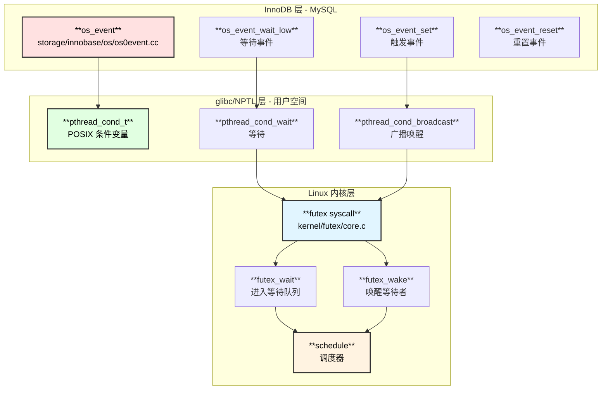

# MySQL 线程间等待唤醒机制深度剖析：从 os_event 到 Linux futex

## 源码版本说明

| 项目 | 版本 | 备注 |
|:-----|:-----|:-----|
| **Percona MySQL Server** | 8.4.3-3 | InnoDB 存储引擎 |
| **glibc (NPTL)** | 2.31+ | pthread 条件变量实现 |
| **Linux Kernel** | 6.12 | futex 子系统 |

---

## 一、开篇引子

你是否遇到过这样的场景：

> 线上 MySQL 数据库出现 TPS 下降，\`SHOW ENGINE INNODB STATUS\` 显示大量线程处于 "waiting for log flush" 状态。DBA 排查发现 CPU 使用率并不高，磁盘 I/O 也正常，但事务就是提交不了。

问题在哪？**线程同步机制出了问题**。

在 MySQL InnoDB 的高并发场景下，每秒可能有上万个 MTR（Mini-Transaction）需要写入 Redo Log。用户线程写完数据后，必须等待 Log Writer 线程将日志刷盘，才能安全提交。这个"等待-唤醒"的过程，看似简单，实则暗藏玄机。

**本文将带你从 MySQL 的 \`os_event\` 抽象层，一路深入到 Linux 内核的 \`futex\` 系统调用，揭示高效线程同步的底层实现原理。**

---

## 二、场景展示

### 2.1 Redo Log 写入的等待场景

当你执行一条 \`INSERT\` 语句时，InnoDB 会经历以下关键步骤：

\`\`\`text
┌─────────────────────────────────────────────────────────────────────────────┐
│                    用户线程提交事务的等待场景                                 │
├─────────────────────────────────────────────────────────────────────────────┤
│                                                                             │
│  用户线程                Log Writer               磁盘                      │
│     │                       │                       │                       │
│     │  mtr_commit()         │                       │                       │
│     │  写入 Log Buffer      │                       │                       │
│     │         │             │                       │                       │
│     │  ★ 需要等待 write_lsn 推进 ★                  │                       │
│     │         │             │                       │                       │
│     │  os_event_set()       │                       │                       │
│     │  ────────────────────►│                       │                       │
│     │  唤醒 Log Writer      │                       │                       │
│     │         │             │                       │                       │
│     │  os_event_wait()      │                       │                       │
│     │  [线程进入睡眠]       │                       │                       │
│     │         │             │  pwrite()             │                       │
│     │         │             │ ─────────────────────►│                       │
│     │         │             │       fsync()         │                       │
│     │         │             │ ─────────────────────►│                       │
│     │         │             │                       │                       │
│     │         │  推进 write_lsn                     │                       │
│     │         │  os_event_set()                     │                       │
│     │  ◄──────────────────── │                       │                       │
│     │  [被唤醒]             │                       │                       │
│     │         │             │                       │                       │
│     │  事务提交成功         │                       │                       │
│     ▼         ▼             ▼                       ▼                       │
│                                                                             │
└─────────────────────────────────────────────────────────────────────────────┘
\`\`\`

**关键问题**：这个 \`os_event_wait()\` 和 \`os_event_set()\` 内部是如何工作的？它是如何高效地让线程睡眠又快速唤醒的？

### 2.2 问题的复杂性

线程同步看似简单，实则面临三大挑战：

| 挑战 | 说明 | 风险 |
|:-----|:-----|:-----|
| **信号丢失** | Thread A 还没进入 wait，Thread B 就发了 signal | Thread A 永远等待 |
| **虚假唤醒** | 线程被唤醒但条件并未满足 | 业务逻辑错误 |
| **性能开销** | 每次等待/唤醒都要陷入内核 | TPS 下降 |

MySQL 的 \`os_event\` 是如何解决这些问题的？让我们深入源码。

---

## 三、原理深入

### 3.1 os_event 核心结构

InnoDB 的 \`os_event\` 是对操作系统条件变量的高级封装：

\`\`\`text
┌─────────────────────────────────────────────────────────────────────────────┐
│                           struct os_event                                   │
│                    源码位置: storage/innobase/os/os0event.cc                │
├─────────────────────────────────────────────────────────────────────────────┤
│                                                                             │
│  ┌─────────────────────┐                                                    │
│  │    bool m_set       │ ← 信号状态标志                                     │
│  │                     │   true:  已触发(signaled)，线程无需等待            │
│  │                     │   false: 未触发(nonsignaled)，线程需要等待         │
│  └─────────────────────┘                                                    │
│                                                                             │
│  ┌─────────────────────┐                                                    │
│  │  int64_t signal_cnt │ ← 信号计数器                                       │
│  │                     │   每次 broadcast 时递增                            │
│  │                     │   用于检测 reset 与 wait 之间的信号                 │
│  └─────────────────────┘                                                    │
│                                                                             │
│  ┌─────────────────────┐                                                    │
│  │   EventMutex mutex  │ ← 保护上述字段的互斥锁                             │
│  └─────────────────────┘                                                    │
│                                                                             │
│  ┌─────────────────────┐                                                    │
│  │ pthread_cond_t cond │ ← POSIX 条件变量                                   │
│  │                     │   底层依赖 Linux futex                             │
│  └─────────────────────┘                                                    │
│                                                                             │
└─────────────────────────────────────────────────────────────────────────────┘
\`\`\`

### 3.2 三层架构总览

### 3.3 为什么需要 futex？

在 futex 出现之前，Linux 的线程同步只能依赖内核信号量（semaphore），每次操作都需要系统调用，开销巨大。

**Futex (Fast Userspace muTEX) 的核心思想**：

| 场景 | 传统方式 | Futex 方式 |
|:-----|:---------|:-----------|
| **无竞争** | 陷入内核 | 纯用户态原子操作 |
| **有竞争** | 陷入内核 | 陷入内核（unavoidable） |

> **关键优化**：在无竞争的情况下（这是大多数情况），futex 完全在用户空间完成，避免了昂贵的系统调用。

---

## 四、源码根因揭秘

### 4.1 os_event 完整调用链

\`\`\`text
os_event 完整调用链（从 MySQL 到 Linux 内核）
═══════════════════════════════════════════════════════════════════════════════

【阶段一：全局初始化】

os_event_global_init() - storage/innobase/os/os0event.cc:614
├── pthread_condattr_init(&os_event::cond_attr)
│   └── 初始化条件变量属性对象
├── pthread_condattr_setclock(&cond_attr, CLOCK_MONOTONIC)
│   └── ┌────────────┬────────────────────────────────────────────────────────┐
│       │  参数       │  说明                                                   │
│       ├────────────┼────────────────────────────────────────────────────────┤
│       │  CLOCK_MONOTONIC │  单调时钟，不受 NTP/系统时间调整影响              │
│       ├────────────┼────────────────────────────────────────────────────────┤
│       │  作用       │  确保 pthread_cond_timedwait 超时计算正确              │
│       └────────────┴────────────────────────────────────────────────────────┘
└── global_initialized = true

═══════════════════════════════════════════════════════════════════════════════

【阶段二：创建事件对象】

os_event_create() - storage/innobase/os/os0event.cc:528
└── ut::new_<os_event>()
    └── os_event::os_event() - storage/innobase/os/os0event.cc:502
        ├── init() - storage/innobase/os/os0event.cc:158
        │   ├── mutex.init()
        │   │   └── pthread_mutex_init(&m_mutex, nullptr)
        │   │       ═══════════════════════════════════════════════════════════
        │   │                         glibc/NPTL 层
        │   │       ═══════════════════════════════════════════════════════════
        │   │       └── 初始化 pthread_mutex_t 结构体
        │   │           ├── __lock = 0
        │   │           └── __owner = 0
        │   │
        │   └── pthread_cond_init(&cond_var, &cond_attr)
        │       └── 初始化 pthread_cond_t 结构体
        │           └── ┌────────────┬────────────────────────────────────────┐
        │               │  字段       │  说明                                   │
        │               ├────────────┼────────────────────────────────────────┤
        │               │  __wseq     │  等待序列号，初始化为 0                 │
        │               ├────────────┼────────────────────────────────────────┤
        │               │  __g_signals│  组信号计数，futex 等待地址             │
        │               ├────────────┼────────────────────────────────────────┤
        │               │  __clock    │  时钟类型（MONOTONIC/REALTIME）         │
        │               └────────────┴────────────────────────────────────────┘
        ├── m_set = false       ← 初始状态：未触发
        └── signal_count = 1    ← 初始值为 1（0 有特殊含义）

═══════════════════════════════════════════════════════════════════════════════

【阶段三：触发事件 - os_event_set()】

os_event_set() - storage/innobase/os/os0event.cc:85
├── mutex.enter()                    ← 获取互斥锁
├── if (!m_set)                      ← 检查是否已触发
│   └── broadcast() - storage/innobase/os/os0event.cc:194
│       ├── m_set = true             ← ★ 设置为已触发状态 ★
│       ├── ++signal_count           ← 递增信号计数
│       └── pthread_cond_broadcast(&cond_var)
│           ═══════════════════════════════════════════════════════════════════
│                             glibc/NPTL 层
│           ═══════════════════════════════════════════════════════════════════
│           └── lll_futex_wake(&cond->__g_signals[g], INT_MAX)
│               ═══════════════════════════════════════════════════════════════
│                              Linux 内核层
│               ═══════════════════════════════════════════════════════════════
│               └── syscall(SYS_futex, addr, FUTEX_WAKE, INT_MAX)
│                   └── do_futex() - kernel/futex/core.c
│                       └── futex_wake() - kernel/futex/waitwake.c:155
│                           ├── get_futex_key()      ← 计算 futex 唯一标识
│                           ├── futex_hash(&key)     ← 定位哈希桶
│                           │   └── jhash2() 计算桶索引
│                           ├── spin_lock(&hb->lock) ← 获取桶锁
│                           ├── plist_for_each_entry_safe()
│                           │   └── futex_match(&q->key, &key)
│                           │       └── 匹配 key 找到等待者
│                           ├── futex_wake_mark() - kernel/futex/waitwake.c:134
│                           │   ├── __futex_unqueue(q)
│                           │   │   └── plist_del(&q->list)
│                           │   └── wake_q_add_safe(wake_q, q->task)
│                           │       └── ┌────────────┬────────────────────────┐
│                           │           │  操作       │  说明                   │
│                           │           ├────────────┼────────────────────────┤
│                           │           │  get_task  │  增加 task 引用计数     │
│                           │           ├────────────┼────────────────────────┤
│                           │           │  链入队列  │  加入 wake_q 单链表     │
│                           │           └────────────┴────────────────────────┘
│                           ├── spin_unlock(&hb->lock)
│                           └── wake_up_q(wake_q) - kernel/sched/core.c:930
│                               └── try_to_wake_up(task, TASK_NORMAL, 0)
│                                   ├── ttwu_state_match() ← 检查任务状态
│                                   ├── WRITE_ONCE(p->__state, TASK_WAKING)
│                                   ├── select_task_rq() ← 选择目标 CPU
│                                   ├── ttwu_queue() - kernel/sched/core.c:4029
│                                   │   └── ttwu_do_activate()
│                                   │       ├── activate_task(rq, p)
│                                   │       │   └── enqueue_task()
│                                   │       │       └── 根据调度类选择
│                                   │       │           ├── CFS: enqueue_task_fair()
│                                   │       │           ├── RT:  enqueue_task_rt()
│                                   │       │           └── DL:  enqueue_task_dl()
│                                   │       └── ttwu_do_wakeup()
│                                   │           ├── WRITE_ONCE(p->__state, TASK_RUNNING)
│                                   │           └── resched_curr(rq) ← 触发调度
│                                   └── put_task_struct(task)
└── mutex.exit()                     ← 释放互斥锁

═══════════════════════════════════════════════════════════════════════════════

【阶段四：等待事件 - os_event_wait_low()】

os_event_wait_low(reset_sig_count) - storage/innobase/os/os0event.cc:358
├── mutex.enter()
├── if (!reset_sig_count)
│   └── reset_sig_count = signal_count  ← 使用当前信号计数
├── while (!m_set && signal_count == reset_sig_count)
│   └── wait() - storage/innobase/os/os0event.cc:177
│       └── pthread_cond_wait(&cond_var, mutex)
│           ═══════════════════════════════════════════════════════════════════
│                             glibc/NPTL 层
│           ═══════════════════════════════════════════════════════════════════
│           ├── 原子释放 mutex
│           └── lll_futex_wait(&cond->__g_signals[g], expected_seq)
│               ═══════════════════════════════════════════════════════════════
│                              Linux 内核层
│               ═══════════════════════════════════════════════════════════════
│               └── syscall(SYS_futex, addr, FUTEX_WAIT, val)
│                   └── do_futex() - kernel/futex/core.c
│                       └── futex_wait() - kernel/futex/waitwake.c:688
│                           ├── futex_setup_timer() ← 设置超时定时器
│                           └── __futex_wait() - kernel/futex/waitwake.c:647
│                               ├── futex_wait_setup()
│                               │   ├── get_futex_key() ← 生成 futex key
│                               │   │   └── ┌────────────┬────────────────────┐
│                               │   │       │  私有映射   │  共享映射           │
│                               │   │       ├────────────┼────────────────────┤
│                               │   │       │  mm + addr  │  inode + pgoff     │
│                               │   │       └────────────┴────────────────────┘
│                               │   ├── futex_q_lock() ← 获取哈希桶锁
│                               │   └── futex_get_value_locked()
│                               │       └── 读取用户空间 futex 值
│                               └── futex_wait_queue() - kernel/futex/waitwake.c:343
│                                   ├── set_current_state(TASK_INTERRUPTIBLE)
│                                   ├── __futex_queue() - kernel/futex/core.c:557
│                                   │   ├── prio = min(current->normal_prio, MAX_RT_PRIO)
│                                   │   │   └── ┌────────────┬────────────────────┐
│                                   │   │       │  线程类型   │  优先级             │
│                                   │   │       ├────────────┼────────────────────┤
│                                   │   │       │  RT 线程    │  0-99（数值小优先） │
│                                   │   │       ├────────────┼────────────────────┤
│                                   │   │       │  普通线程   │  100（统一 FIFO）   │
│                                   │   │       └────────────┴────────────────────┘
│                                   │   ├── plist_node_init(&q->list, prio)
│                                   │   └── plist_add(&q->list, &hb->chain)
│                                   │       └── 按优先级插入等待队列
│                                   ├── spin_unlock(&hb->lock)
│                                   └── schedule() - kernel/sched/core.c:6772
│                                       ├── sched_submit_work(tsk)
│                                       └── __schedule_loop(SM_NONE)
│                                           └── __schedule() - kernel/sched/core.c:6585
│                                               ├── pick_next_task(rq)
│                                               │   └── 遍历调度类选择最高优先级任务
│                                               ├── deactivate_task(rq, prev)
│                                               │   └── dequeue_task()
│                                               └── context_switch(rq, prev, next)
│                                                   ├── switch_mm_irqs_off()
│                                                   └── switch_to(prev, next, prev)
│                                                       └── ★ 让出 CPU，进入睡眠 ★
└── mutex.exit()
\`\`\`

### 4.2 信号丢失问题的解决

os_event 使用 \`signal_count\` 来检测"丢失的信号"：

\`\`\`text
┌─────────────────────────────────────────────────────────────────────────────┐
│                    信号丢失检测机制                                          │
├─────────────────────────────────────────────────────────────────────────────┤
│                                                                             │
│  Thread A (等待者)       Thread B (通知者)       Thread C         状态      │
│     │                         │                     │                       │
│  reset()                      │                     │        m_set=false    │
│  记录 sig_count=1             │                     │        sig_count=1    │
│     │                         │                     │                       │
│     │                    ★ set() ★                 │                       │
│     │                    m_set=true                 │        m_set=true     │
│     │                    sig_count=2                │        sig_count=2    │
│     │                         │                     │                       │
│     │                         │                ★ reset() ★                 │
│     │                         │                m_set=false    m_set=false   │
│     │                         │                sig_count=2    sig_count=2   │
│     │                         │                     │                       │
│  wait_low(1)                  │                     │                       │
│  ─────────────                │                     │                       │
│  检查: m_set=false ✓          │                     │                       │
│  检查: sig_count(1) != signal_count(2) ✓            │                       │
│     │                         │                     │                       │
│  ★ 检测到信号发生过，立即返回 ★                     │                       │
│     │                         │                     │                       │
│     ▼                         ▼                     ▼                       │
│                                                                             │
│  【关键】: 如果只检查 m_set，Thread A 会永远等待！                          │
│            signal_count 的变化检测到了信号曾经发生过                         │
│                                                                             │
└─────────────────────────────────────────────────────────────────────────────┘
\`\`\`

### 4.3 Futex 哈希表机制

Linux 内核使用哈希表来管理 futex 等待队列：

\`\`\`mermaid
graph TB
    subgraph "用户空间地址"
        UA["**pthread_cond_t** 地址: 0x7fff1234"]
    end
    
    subgraph "Futex Key 计算"
        GFK["**get_futex_key** kernel/futex/core.c:222"]
        KEY["**futex_key** mm + address + offset"]
    end
    
    subgraph "哈希表查找"
        HASH["**futex_hash** jhash2 算法"]
        HB["**哈希桶** spinlock + plist"]
    end
    
    subgraph "等待队列 plist"
        Q1["**futex_q T1** prio=50 (RT)"]
        Q2["**futex_q T2** prio=100"]
        Q3["**futex_q T3** prio=100"]
    end
    
    UA --> GFK
    GFK --> KEY
    KEY --> HASH
    HASH --> HB
    HB --> Q1
    Q1 --> Q2
    Q2 --> Q3
    
    style UA fill:#ffe1e1,stroke:#333,stroke-width:2px,color:#000
    style KEY fill:#e1ffe1,stroke:#333,stroke-width:2px,color:#000
    style HB fill:#e1f5ff,stroke:#333,stroke-width:2px,color:#000
    style Q1 fill:#fff3e1,stroke:#333,stroke-width:2px,color:#000
\`\`\`

**唤醒顺序规则**：

| 线程类型 | 优先级值 | 唤醒顺序 |
|:---------|:---------|:---------|
| RT 线程 | 0-99 | 优先级值越小越先唤醒 |
| 普通线程 | 100 | 按 FIFO 顺序唤醒 |

### 4.4 Redo Log 中的 os_event 应用

InnoDB 使用事件数组实现高效的 LSN 等待通知：

\`\`\`text
┌─────────────────────────────────────────────────────────────────────────────┐
│                    Redo Log 事件槽位映射                                     │
├─────────────────────────────────────────────────────────────────────────────┤
│                                                                             │
│  LSN 范围             块号         Slot (events_n=2048)                     │
│  ─────────────────────────────────────────────────────────────────────      │
│  [1, 512]          → 0           → events[0]                                │
│  [513, 1024]       → 1           → events[1]                                │
│  [1025, 1536]      → 2           → events[2]                                │
│       ...               ...            ...                                   │
│  [1047553, 1048064] → 2047       → events[2047]                             │
│  [1048065, 1048576] → 2048       → events[0]   ← 循环回来                   │
│                                                                             │
│  计算公式: slot = (lsn - 1) / 512 % events_size                            │
│                                                                             │
│  ┌───┬───┬───┬───┬───┬────────────────────────────────┬────────┐           │
│  │ 0 │ 1 │ 2 │ 3 │...│                                │  2047  │           │
│  └───┴───┴───┴───┴───┴────────────────────────────────┴────────┘           │
│    ↑                                                     ↑                  │
│  同一个 slot 可能有多个 LSN 范围的线程在等待                                │
│  Notifier 唤醒后，线程需要重新检查自己的 LSN 是否满足                       │
│                                                                             │
└─────────────────────────────────────────────────────────────────────────────┘
\`\`\`

### 4.5 混合等待策略

InnoDB 实现了先自旋后等待的混合策略：

\`\`\`mermaid
sequenceDiagram
    participant UT as "用户线程"
    participant SPIN as "自旋阶段"
    participant EVENT as "事件等待"
    participant LW as "Log Writer"
    
    rect rgb(255, 240, 240)
    Note over UT,LW: **阶段1: 自旋等待 (纳秒级延迟)**
    end
    
    UT->>SPIN: **开始自旋 (spins_limit 次)**
    
    loop 每次自旋
        SPIN->>SPIN: **检查 write_lsn >= target_lsn**
        SPIN->>SPIN: **UT_RELAX_CPU() (PAUSE指令)**
    end
    
    SPIN-->>UT: **自旋次数用尽，条件未满足**
    
    rect rgb(240, 255, 240)
    Note over UT,LW: **阶段2: 事件等待 (微秒级延迟)**
    end
    
    UT->>EVENT: **os_event_reset()**
    UT->>EVENT: **os_event_wait_time_low(timeout)**
    
    Note over EVENT: **超时时间递增策略** 1μs → 2μs → 4μs → ... → 100ms
    
    LW->>LW: **pwrite() + fsync()**
    LW->>LW: **推进 write_lsn**
    LW->>EVENT: **os_event_set() 唤醒**
    
    EVENT-->>UT: **被唤醒，条件满足**
\`\`\`

---

## 五、优化与修复

### 5.1 为什么使用 CLOCK_MONOTONIC

\`\`\`cpp
// storage/innobase/os/os0event.cc:622
ret = pthread_condattr_setclock(&os_event::cond_attr, CLOCK_MONOTONIC);
\`\`\`

| 时钟类型 | 问题 | 后果 |
|:---------|:-----|:-----|
| CLOCK_REALTIME | 可被 NTP/管理员调整 | 超时计算可能出错 |
| CLOCK_MONOTONIC | 单调递增，不可调整 | 超时计算始终正确 |

**示例**：如果使用 REALTIME，管理员调回时间 1 小时，本应等待 1 秒的线程可能需要等待 1 小时！

### 5.2 为什么 set() 要检查 m_set

\`\`\`cpp
void set() {
    mutex.enter();
    if (!m_set) {       // ★ 避免重复广播
        broadcast();
    }
    mutex.exit();
}
\`\`\`

**优化点**：如果事件已经触发（m_set = true），跳过 \`pthread_cond_broadcast()\` 调用，避免不必要的系统调用开销。

### 5.3 自旋等待参数调优

\`\`\`text
相关参数：
├── innodb_log_wait_for_write_spin_delay = 25000   ← 等待 write_lsn 的自旋次数
├── innodb_log_wait_for_flush_spin_delay = 25000   ← 等待 flush_lsn 的自旋次数
├── innodb_log_write_events = 2048                  ← 写入事件槽位数量
└── innodb_log_flush_events = 2048                  ← 刷新事件槽位数量
\`\`\`

| 参数 | 调高 | 调低 |
|:-----|:-----|:-----|
| spin_delay | 降低延迟，增加 CPU 消耗 | 降低 CPU 消耗，增加延迟 |
| events | 减少槽位冲突，增加内存 | 减少内存，增加槽位冲突 |

---

## 六、总结与反思

### 6.1 核心要点回顾

\`\`\`mermaid
graph TB
    subgraph "问题挑战"
        P1["**信号丢失** signal_count 检测"]
        P2["**虚假唤醒** while 循环检查"]
        P3["**性能开销** 混合等待策略"]
    end
    
    subgraph "技术方案"
        S1["**os_event** InnoDB 事件抽象"]
        S2["**pthread_cond** POSIX 条件变量"]
        S3["**futex** Linux 内核原语"]
    end
    
    subgraph "最终效果"
        R1["**无竞争** 纯用户态"]
        R2["**有竞争** 快速内核切换"]
        R3["**高并发** 槽位分散等待"]
    end
    
    P1 --> S1
    P2 --> S1
    P3 --> S1
    S1 --> S2
    S2 --> S3
    S3 --> R1
    S3 --> R2
    S1 --> R3
    
    style P1 fill:#ffe1e1,stroke:#333,stroke-width:2px,color:#000
    style P2 fill:#ffe1e1,stroke:#333,stroke-width:2px,color:#000
    style P3 fill:#ffe1e1,stroke:#333,stroke-width:2px,color:#000
    style S1 fill:#e1f5ff,stroke:#333,stroke-width:2px,color:#000
    style S2 fill:#e1f5ff,stroke:#333,stroke-width:2px,color:#000
    style S3 fill:#e1f5ff,stroke:#333,stroke-width:2px,color:#000
    style R1 fill:#e1ffe1,stroke:#333,stroke-width:2px,color:#000
    style R2 fill:#e1ffe1,stroke:#333,stroke-width:2px,color:#000
    style R3 fill:#e1ffe1,stroke:#333,stroke-width:2px,color:#000
\`\`\`

### 6.2 实践建议

1. **监控关键指标**
   - \`innodb_log_waits\`：日志缓冲区等待次数
   - \`innodb_os_log_pending_writes\`：待写入的日志请求
   - \`innodb_os_log_pending_fsyncs\`：待刷盘的日志请求

2. **参数调优方向**
   - 高 IOPS 存储：可适当调低 spin_delay
   - 多核 CPU：可适当调高 spin_delay
   - 高并发场景：保持 events 为 2 的幂次

3. **诊断方法**
   \`\`\`sql
   -- 查看 Redo Log 等待情况
   SHOW ENGINE INNODB STATUS\G
   
   -- 关注 LOG 部分的 pending 计数
   -- 如果 pending_fsyncs 持续高，考虑 SSD 升级
   \`\`\`
