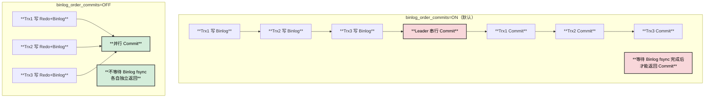
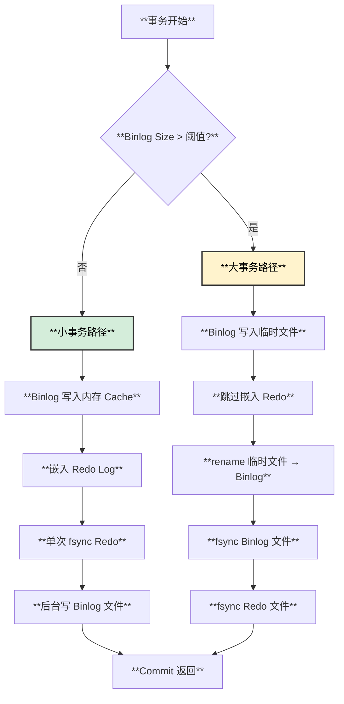

# Binlog in Redo 功能深度分析与源码改造方案

## 一、阿里 Binlog in Redo 方案详解

### 1.1 背景与问题

原生 MySQL 在双一配置（`sync_binlog=1` + `innodb_flush_log_at_trx_commit=1`）下，事务提交需要 **3 次同步 I/O**：

```
┌─────────────────────────────────────────────────────────────────────────────┐
│                    原生 MySQL 提交流程                                       │
├─────────────────────────────────────────────────────────────────────────────┤
│                                                                             │
│  ① FLUSH Stage:  fsync(Redo Log) - Prepare 阶段的 Redo                      │
│  ② SYNC Stage:   fsync(Binlog)   - Binlog 文件                              │
│  ③ AFTER COMMIT: fsync(Redo Log) - Commit Record                            │
│                                                                             │
│  总计: 3 次 fsync，延迟高                                                   │
│                                                                             │
└─────────────────────────────────────────────────────────────────────────────┘
```

### 1.2 阿里方案核心设计

```
┌─────────────────────────────────────────────────────────────────────────────┐
│                    阿里 Binlog in Redo 方案                                  │
├─────────────────────────────────────────────────────────────────────────────┤
│                                                                             │
│  核心思想：                                                                  │
│  ┌─────────────────────────────────────────────────────────────────────────┐│
│  │  1. 将 Binlog Event 嵌入 Redo Log                                       ││
│  │  2. Commit 阶段只等待 1 次 Redo fsync                                   ││
│  │  3. Binlog 文件由后台线程异步写入                                        ││
│  │  4. Crash Recovery 时从 Redo 中恢复 Binlog                              ││
│  └─────────────────────────────────────────────────────────────────────────┘│
│                                                                             │
│  参数配置：                                                                  │
│  - persist_binlog_to_redo = ON     （开启功能）                             │
│  - sync_binlog = 1                  （必须）                                │
│  - binlog_order_commits = OFF       （必须）                                │
│                                                                             │
│  效果:                                                                       │
│  - 同步 I/O: 3 次 → 1 次                                                    │
│  - 提交延迟: 降低 30-50%                                                    │
│                                                                             │
└─────────────────────────────────────────────────────────────────────────────┘
```

### 1.3 为什么必须关闭 binlog_order_commits？

#### 原理分析



#### 关闭原因

| 原因 | 说明 |
|------|------|
| **性能瓶颈** | `binlog_order_commits=ON` 时，Leader 需要串行等待所有事务的 Binlog fsync 完成后才能返回 Commit |
| **锁竞争** | 需要持有 `LOCK_commit` 直到 Binlog 写入完成，阻塞其他事务 |
| **与 Binlog in Redo 冲突** | Binlog in Redo 的核心是跳过 Binlog fsync，但 `order_commits=ON` 要求等待 |

#### 源码证据

```cpp
// sql/binlog.cc:9424
if ((opt_binlog_order_commits || Clone_handler::need_commit_order()) &&
    (sync_error == 0 || binlog_error_action != ABORT_SERVER)) {
  // binlog_order_commits=ON 时，进入 COMMIT_STAGE
  // Leader 串行执行所有事务的 commit
  if (change_stage(thd, Commit_stage_manager::COMMIT_STAGE, ...)) {
    ...
  }
  // 持有 LOCK_commit 直到所有事务 commit 完成
}

// sql/binlog.cc:9576-9582
// binlog_order_commits=ON: 持有 LOCK_commit
// binlog_order_commits=OFF: 各事务并行 commit，仅持有共享锁
if (opt_binlog_order_commits) {
  mysql_mutex_lock(&LOCK_commit);
} else {
  mysql_rwlock_wrlock(&LOCK_consistent_snapshot);
}
```

---

## 二、大事务优化：临时文件 Rename 方案

### 2.1 问题背景

大事务的 Binlog Event 可能达到 GB 级别，如果全部嵌入 Redo Log：
- Redo Log 快速膨胀
- Redo Buffer 竞争加剧
- Checkpoint 频繁触发

### 2.2 阿里的 Binlog Cache Free Flush 方案

```
┌─────────────────────────────────────────────────────────────────────────────┐
│                    大事务 Binlog Cache Free Flush                           │
├─────────────────────────────────────────────────────────────────────────────┤
│                                                                             │
│  正常流程 (小事务):                                                          │
│  ┌─────────────────────────────────────────────────────────────────────────┐│
│  │  Binlog Event → Binlog Cache (Memory) → 写入 Redo → 后台写 Binlog 文件  ││
│  └─────────────────────────────────────────────────────────────────────────┘│
│                                                                             │
│  大事务优化流程:                                                             │
│  ┌─────────────────────────────────────────────────────────────────────────┐│
│  │  Step 1: Binlog Event → Binlog Cache (Memory)                           ││
│  │  Step 2: Cache 满了 → 溢出到临时文件 (binlog.cache.tmp)                  ││
│  │  Step 3: Commit 时 → 临时文件 rename 为正式 Binlog 文件                  ││
│  │  Step 4: 跳过 Binlog in Redo → 直接 fsync Binlog 文件                    ││
│  └─────────────────────────────────────────────────────────────────────────┘│
│                                                                             │
│  优势:                                                                       │
│  - 避免 Redo 膨胀                                                           │
│  - 减少全局 Binlog Lock 持有时间                                            │
│  - rename 是原子操作，保证一致性                                            │
│                                                                             │
└─────────────────────────────────────────────────────────────────────────────┘
```

### 2.3 自动回退机制



### 2.4 源码改造方案

**文件**: `sql/binlog.cc`

```cpp
// 新增: 大事务检测和自动回退逻辑

class binlog_cache_data {
 public:
  // ... 现有代码 ...
  
  /**
   * 检查是否为大事务，需要回退到传统模式
   */
  bool is_large_transaction() const {
    // 条件1: Binlog 大小超过阈值
    if (m_cache.length() > opt_binlog_in_redo_threshold) {
      return true;
    }
    // 条件2: 已经溢出到临时文件
    if (m_cache.is_using_temp_file()) {
      return true;
    }
    return false;
  }
  
  /**
   * 获取临时文件路径（如果使用）
   */
  const char* get_temp_file_path() const {
    return m_cache.get_temp_file_name();
  }
};

/**
 * 大事务 Commit: 临时文件 rename 为 Binlog 文件
 * 
 * @param thd       当前线程
 * @param cache     Binlog cache
 * @param binlog_file 目标 Binlog 文件名
 * @return 0 成功, 非0 失败
 */
int binlog_large_trx_commit_with_rename(THD *thd, 
                                         binlog_cache_data *cache,
                                         const char *binlog_file) {
  DBUG_TRACE;
  
  const char *temp_file = cache->get_temp_file_path();
  if (temp_file == nullptr) {
    return 1;  // 没有临时文件
  }
  
  // Step 1: 在临时文件末尾写入文件头（预留空间）
  // 阿里的优化: 临时文件开头预留空间用于写入 Binlog 文件头
  if (write_binlog_header_to_temp_file(temp_file) != 0) {
    return 1;
  }
  
  // Step 2: 关闭 cache 的临时文件句柄
  cache->close_temp_file();
  
  // Step 3: 原子 rename 临时文件为 Binlog 文件
  // rename 是原子操作，保证崩溃一致性
  if (my_rename(temp_file, binlog_file, MYF(MY_WME)) != 0) {
    LogErr(ERROR_LEVEL, ER_BINLOG_CANT_CREATE_CACHE_FILE, temp_file);
    return 1;
  }
  
  // Step 4: fsync 新的 Binlog 文件
  File fd = mysql_file_open(key_file_binlog, binlog_file, 
                            O_WRONLY | O_APPEND, MYF(MY_WME));
  if (fd >= 0) {
    mysql_file_sync(fd, MYF(MY_WME));
    mysql_file_close(fd, MYF(MY_WME));
  }
  
  return 0;
}
```

**文件**: `sql/binlog_ostream.cc`

```cpp
// 修改 Binlog_cache_storage 类，支持临时文件预留空间

class Binlog_cache_storage {
 public:
  // ... 现有代码 ...
  
  /**
   * 打开临时文件时，预留文件头空间
   */
  bool open_temp_file_with_header_space() {
    // 预留 BINLOG_HEADER_SIZE 字节用于文件头
    const size_t BINLOG_HEADER_SIZE = 119;  // FDE + Previous GTIDs
    
    if (open_cached_file(&m_io_cache, mysql_tmpdir, "binlog_cache",
                         DISK_BUFFER_SIZE, MYF(MY_WME))) {
      return true;
    }
    
    // 写入预留空间（全零）
    uchar header_space[BINLOG_HEADER_SIZE] = {0};
    if (my_b_write(&m_io_cache, header_space, BINLOG_HEADER_SIZE)) {
      return true;
    }
    
    m_temp_file_header_reserved = true;
    return false;
  }
  
  /**
   * Commit 时填充文件头
   */
  bool fill_header_in_temp_file(const uchar *header, size_t header_len) {
    if (!m_temp_file_header_reserved) return true;
    
    // 定位到文件开头
    my_b_seek(&m_io_cache, 0);
    
    // 写入真正的文件头
    if (my_b_write(&m_io_cache, header, header_len)) {
      return true;
    }
    
    // flush 到磁盘
    if (my_b_flush_io_cache(&m_io_cache, true)) {
      return true;
    }
    
    return false;
  }
  
 private:
  bool m_temp_file_header_reserved = false;
};
```

---

## 三、Binlog 并行写入方案

### 3.1 问题分析

传统 Group Commit 中，Binlog 写入是串行的：

```
┌─────────────────────────────────────────────────────────────────────────────┐
│                    传统串行写入                                              │
├─────────────────────────────────────────────────────────────────────────────┤
│                                                                             │
│  FLUSH Stage:                                                               │
│  ┌─────────┬─────────┬─────────┬─────────┐                                 │
│  │  Trx 1  │  Trx 2  │  Trx 3  │  Trx 4  │  (排队等待)                     │
│  └────┬────┴────┬────┴────┬────┴────┬────┘                                 │
│       │         │         │         │                                       │
│       ▼         │         │         │                                       │
│  ┌─────────┐    │         │         │                                       │
│  │ 写 Trx1 │    │         │         │                                       │
│  └────┬────┘    │         │         │                                       │
│       │         ▼         │         │                                       │
│       │    ┌─────────┐    │         │                                       │
│       │    │ 写 Trx2 │    │         │                                       │
│       │    └────┬────┘    │         │                                       │
│       │         │         ▼         │                                       │
│       │         │    ┌─────────┐    │                                       │
│       │         │    │ 写 Trx3 │    │                                       │
│       │         │    └────┬────┘    │                                       │
│       │         │         │         ▼                                       │
│       │         │         │    ┌─────────┐                                  │
│       │         │         │    │ 写 Trx4 │                                  │
│       │         │         │    └─────────┘                                  │
│       ▼         ▼         ▼         ▼                                       │
│  ════════════════════════════════════════  Binlog 文件                      │
│                                                                             │
│  问题: 串行写入，CPU 利用率低，I/O 不能充分并行                              │
│                                                                             │
└─────────────────────────────────────────────────────────────────────────────┘
```

### 3.2 阿里 Binlog Parallel Flush 方案

```
┌─────────────────────────────────────────────────────────────────────────────┐
│                    Binlog Parallel Flush                                    │
├─────────────────────────────────────────────────────────────────────────────┤
│                                                                             │
│  Phase 1: 并行序列化 (各事务独立进行)                                        │
│  ┌─────────┐  ┌─────────┐  ┌─────────┐  ┌─────────┐                        │
│  │  Trx 1  │  │  Trx 2  │  │  Trx 3  │  │  Trx 4  │                        │
│  │序列化到 │  │序列化到 │  │序列化到 │  │序列化到 │                        │
│  │私有Buffer│  │私有Buffer│  │私有Buffer│  │私有Buffer│                        │
│  └────┬────┘  └────┬────┘  └────┬────┘  └────┬────┘                        │
│       │            │            │            │                              │
│       └────────────┴────────────┴────────────┘                              │
│                         │                                                    │
│                         ▼                                                    │
│  Phase 2: 分配全局位置 (串行，但非常快)                                      │
│  ┌─────────────────────────────────────────────────────────────────────────┐│
│  │  Leader 分配 Binlog Position:                                           ││
│  │  Trx1: pos=100, len=50                                                  ││
│  │  Trx2: pos=150, len=30                                                  ││
│  │  Trx3: pos=180, len=80                                                  ││
│  │  Trx4: pos=260, len=40                                                  ││
│  └─────────────────────────────────────────────────────────────────────────┘│
│                         │                                                    │
│                         ▼                                                    │
│  Phase 3: 并行写入 (pwrite 到指定位置)                                       │
│  ┌─────────┐  ┌─────────┐  ┌─────────┐  ┌─────────┐                        │
│  │ pwrite  │  │ pwrite  │  │ pwrite  │  │ pwrite  │                        │
│  │ pos=100 │  │ pos=150 │  │ pos=180 │  │ pos=260 │                        │
│  └────┬────┘  └────┬────┘  └────┬────┘  └────┬────┘                        │
│       │            │            │            │                              │
│       └────────────┴────────────┴────────────┘                              │
│                         │                                                    │
│                         ▼                                                    │
│  ════════════════════════════════════════  Binlog 文件                      │
│                                                                             │
│  优势: 充分利用多核 CPU，I/O 可以并行                                       │
│                                                                             │
└─────────────────────────────────────────────────────────────────────────────┘
```

### 3.3 源码改造方案

**文件**: `sql/binlog.cc`

```cpp
// 新增: Binlog Parallel Flush 实现

/**
 * 并行 Flush 的事务信息
 */
struct Parallel_flush_info {
  THD *thd;
  binlog_cache_data *cache;
  my_off_t binlog_pos;      // 在 Binlog 文件中的起始位置
  my_off_t binlog_len;      // 写入长度
  bool flush_done;          // 是否完成
  int error;                // 错误码
};

/**
 * 并行 Flush 线程池
 */
class Binlog_parallel_flush_pool {
 public:
  static const int MAX_FLUSH_THREADS = 8;
  
  void init() {
    for (int i = 0; i < MAX_FLUSH_THREADS; i++) {
      mysql_mutex_init(key_BINLOG_parallel_flush, &m_mutex[i], nullptr);
      mysql_cond_init(key_BINLOG_parallel_flush_cond, &m_cond[i]);
      m_busy[i] = false;
    }
    m_initialized = true;
  }
  
  /**
   * 提交并行 Flush 任务
   */
  void submit_flush_task(Parallel_flush_info *info) {
    int slot = find_free_slot();
    if (slot >= 0) {
      m_tasks[slot] = info;
      mysql_cond_signal(&m_cond[slot]);
    }
  }
  
  /**
   * 等待所有 Flush 任务完成
   */
  void wait_all_done(std::vector<Parallel_flush_info*> &tasks) {
    for (auto &task : tasks) {
      while (!task->flush_done) {
        my_sleep(10);  // 10us
      }
    }
  }
  
 private:
  mysql_mutex_t m_mutex[MAX_FLUSH_THREADS];
  mysql_cond_t m_cond[MAX_FLUSH_THREADS];
  bool m_busy[MAX_FLUSH_THREADS];
  Parallel_flush_info *m_tasks[MAX_FLUSH_THREADS];
  bool m_initialized = false;
};

// 全局并行 Flush 线程池
static Binlog_parallel_flush_pool parallel_flush_pool;

/**
 * 并行 Flush Worker 线程
 */
void *binlog_parallel_flush_worker(void *arg) {
  int slot = *(int*)arg;
  
  while (!shutdown_in_progress) {
    mysql_mutex_lock(&parallel_flush_pool.m_mutex[slot]);
    
    // 等待任务
    while (!parallel_flush_pool.m_busy[slot] && !shutdown_in_progress) {
      mysql_cond_wait(&parallel_flush_pool.m_cond[slot],
                      &parallel_flush_pool.m_mutex[slot]);
    }
    
    if (shutdown_in_progress) break;
    
    // 执行 Flush
    Parallel_flush_info *task = parallel_flush_pool.m_tasks[slot];
    if (task != nullptr) {
      task->error = do_parallel_flush(task);
      task->flush_done = true;
    }
    
    parallel_flush_pool.m_busy[slot] = false;
    mysql_mutex_unlock(&parallel_flush_pool.m_mutex[slot]);
  }
  
  return nullptr;
}

/**
 * 执行单个事务的并行 Flush
 */
int do_parallel_flush(Parallel_flush_info *task) {
  // 获取 Binlog 文件句柄
  File fd = mysql_bin_log.get_binlog_file_fd();
  
  // 读取 cache 内容
  uchar *buffer = (uchar*)my_malloc(key_memory_binlog_cache, 
                                     task->binlog_len, MYF(MY_WME));
  if (buffer == nullptr) return 1;
  
  task->cache->get_cache()->copy_to(buffer, task->binlog_len);
  
  // pwrite 到指定位置（支持并行）
  ssize_t written = mysql_file_pwrite(fd, buffer, task->binlog_len, 
                                       task->binlog_pos, MYF(MY_WME));
  
  my_free(buffer);
  
  return (written == (ssize_t)task->binlog_len) ? 0 : 1;
}

/**
 * 修改 process_flush_stage_queue，支持并行 Flush
 */
int MYSQL_BIN_LOG::process_flush_stage_queue_parallel(
    my_off_t *total_bytes_var, THD **out_queue_var) {
  
  THD *first_seen = fetch_and_process_flush_stage_queue();
  
  // Phase 1: 并行序列化（各事务独立完成，已经在 flush_thread_caches 中完成）
  
  // Phase 2: 分配全局位置（串行，持有 LOCK_log）
  std::vector<Parallel_flush_info*> flush_tasks;
  my_off_t current_pos = m_binlog_file->position();
  
  for (THD *head = first_seen; head; head = head->next_to_commit) {
    binlog_cache_mngr *cache_mngr = thd_get_cache_mngr(head);
    if (cache_mngr == nullptr) continue;
    
    Parallel_flush_info *info = new Parallel_flush_info();
    info->thd = head;
    info->cache = &cache_mngr->trx_cache;
    info->binlog_pos = current_pos;
    info->binlog_len = info->cache->get_byte_position();
    info->flush_done = false;
    info->error = 0;
    
    current_pos += info->binlog_len;
    flush_tasks.push_back(info);
  }
  
  // 更新文件大小（预分配空间）
  m_binlog_file->truncate(current_pos);
  
  // Phase 3: 并行写入
  for (auto &task : flush_tasks) {
    parallel_flush_pool.submit_flush_task(task);
  }
  
  // 等待所有任务完成
  parallel_flush_pool.wait_all_done(flush_tasks);
  
  // 检查错误
  int flush_error = 0;
  for (auto &task : flush_tasks) {
    if (task->error != 0) flush_error = 1;
    delete task;
  }
  
  *total_bytes_var = current_pos - m_binlog_file->position();
  *out_queue_var = first_seen;
  
  return flush_error;
}
```

---

## 四、半同步复制与组复制适配

### 4.1 为什么默认仅支持异步复制？

```
┌─────────────────────────────────────────────────────────────────────────────┐
│                    Binlog in Redo 与复制模式的冲突                          │
├─────────────────────────────────────────────────────────────────────────────┤
│                                                                             │
│  异步复制:                                                                  │
│  ┌─────────────────────────────────────────────────────────────────────────┐│
│  │  Master: Commit → 返回成功                                              ││
│  │  Slave:  异步拉取 Binlog，无需等待                                      ││
│  │                                                                          ││
│  │  ✅ 兼容 Binlog in Redo：                                                ││
│  │  - Master 不需要等待 Binlog 文件写入                                    ││
│  │  - Slave 从 Binlog 文件异步读取，后台线程会补齐                         ││
│  └─────────────────────────────────────────────────────────────────────────┘│
│                                                                             │
│  半同步复制:                                                                │
│  ┌─────────────────────────────────────────────────────────────────────────┐│
│  │  Master: Commit → 等待至少 1 个 Slave ACK → 返回成功                    ││
│  │  Slave:  收到 Binlog Event → 写入 Relay Log → 发送 ACK                  ││
│  │                                                                          ││
│  │  ❌ 冲突点：                                                             ││
│  │  - Slave 需要从 Binlog 文件读取 Event                                   ││
│  │  - 但 Binlog in Redo 模式下，Commit 返回时 Binlog 文件可能还未写入      ││
│  │  - Slave 读不到 Event → 无法 ACK → Master 等待超时                      ││
│  └─────────────────────────────────────────────────────────────────────────┘│
│                                                                             │
│  组复制:                                                                    │
│  ┌─────────────────────────────────────────────────────────────────────────┐│
│  │  类似半同步，需要 Binlog Event 的全局一致性排序                         ││
│  │  binlog_order_commits=OFF 会破坏 Paxos/Raft 的顺序要求                  ││
│  └─────────────────────────────────────────────────────────────────────────┘│
│                                                                             │
└─────────────────────────────────────────────────────────────────────────────┘
```

### 4.2 半同步复制适配方案

```mermaid
sequenceDiagram
    participant M as "Master"
    participant R as "Redo Log"
    participant B as "Binlog File"
    participant BT as "Binlog Thread"
    participant S as "Slave"
    
    M->>R: **1. 写入 Redo + Binlog Event**
    M->>R: **2. fsync Redo**
    
    rect rgb(40, 40, 40)
    Note over M,B: **半同步适配：等待 Binlog 写入**
    end
    
    M->>BT: **3. 通知后台线程紧急写入**
    BT->>B: **4. 写入 Binlog 文件**
    BT->>B: **5. fsync Binlog**
    BT-->>M: **6. 写入完成通知**
    
    M->>S: **7. 发送 Binlog Event**
    S->>S: **8. 写入 Relay Log**
    S-->>M: **9. ACK**
    
    M-->>M: **10. Commit 返回**
```



### 4.3 源码改造方案

**文件**: `sql/sys_vars.cc`

```cpp
// 新增参数: 控制半同步模式下的行为

static Sys_var_bool Sys_binlog_in_redo_wait_for_sync(
    "binlog_in_redo_wait_for_sync",
    "When enabled with persist_binlog_to_redo=ON, wait for binlog file "
    "sync before returning commit. Required for semi-sync replication.",
    GLOBAL_VAR(opt_binlog_in_redo_wait_for_sync),
    CMD_LINE(OPT_ARG),
    DEFAULT(false),  // 默认关闭，异步复制
    NO_MUTEX_GUARD,
    NOT_IN_BINLOG,
    ON_CHECK(nullptr),
    ON_UPDATE(nullptr));
```

**文件**: `sql/binlog.cc`

```cpp
// 修改 ordered_commit，支持半同步适配

int MYSQL_BIN_LOG::ordered_commit(THD *thd, bool all, bool skip_commit) {
  // ... 现有代码 ...
  
  // COMMIT Stage 之后
  if (opt_persist_binlog_to_redo) {
    if (opt_binlog_in_redo_wait_for_sync || 
        is_semi_sync_enabled() ||
        is_group_replication_enabled()) {
      // 半同步/组复制模式: 等待 Binlog 写入完成
      wait_for_binlog_sync(thd);
    }
    // 否则: 异步复制模式，直接返回
  }
  
  return finish_commit(thd);
}

/**
 * 等待 Binlog 文件同步完成
 */
void MYSQL_BIN_LOG::wait_for_binlog_sync(THD *thd) {
  // 通知后台线程紧急写入
  binlog_applier_urgent_flush();
  
  // 等待当前事务的 Binlog Event 写入完成
  my_off_t wait_pos = thd->binlog_next_pos;
  
  mysql_mutex_lock(&LOCK_binlog_sync);
  while (m_binlog_synced_pos < wait_pos && !shutdown_in_progress) {
    mysql_cond_wait(&COND_binlog_sync, &LOCK_binlog_sync);
  }
  mysql_mutex_unlock(&LOCK_binlog_sync);
}

/**
 * 后台线程紧急 Flush 接口
 */
void binlog_applier_urgent_flush() {
  mysql_mutex_lock(&binlog_applier_mutex);
  binlog_applier_urgent = true;
  mysql_cond_signal(&binlog_applier_cond);
  mysql_mutex_unlock(&binlog_applier_mutex);
}
```

**文件**: `sql/binlog_applier.cc`

```cpp
// 修改后台线程，支持紧急 Flush

void *binlog_applier_thread(void *arg) {
  while (!shutdown_in_progress) {
    mysql_mutex_lock(&binlog_applier_mutex);
    
    // 等待: 周期性唤醒 或 紧急 Flush 信号
    if (!binlog_applier_urgent) {
      struct timespec abstime;
      set_timespec_nsec(&abstime, opt_sync_binlog_interval * 1000000ULL);
      mysql_cond_timedwait(&binlog_applier_cond, &binlog_applier_mutex, &abstime);
    }
    
    bool is_urgent = binlog_applier_urgent;
    binlog_applier_urgent = false;
    
    mysql_mutex_unlock(&binlog_applier_mutex);
    
    // 处理待写入的 Binlog Events
    process_pending_binlog_events();
    
    // fsync Binlog 文件
    mysql_bin_log.sync_binlog_file(is_urgent);
    
    // 更新同步位置，通知等待的事务
    mysql_mutex_lock(&mysql_bin_log.LOCK_binlog_sync);
    mysql_bin_log.m_binlog_synced_pos = mysql_bin_log.get_binlog_end_pos();
    mysql_cond_broadcast(&mysql_bin_log.COND_binlog_sync);
    mysql_mutex_unlock(&mysql_bin_log.LOCK_binlog_sync);
  }
  
  return nullptr;
}
```

### 4.4 组复制适配方案

```cpp
// 组复制需要额外处理 Commit 顺序

/**
 * 检测组复制模式
 */
bool is_group_replication_enabled() {
  return is_group_replication_running();
}

/**
 * 组复制模式下的 Binlog in Redo 配置检查
 */
bool check_binlog_in_redo_for_group_replication() {
  if (opt_persist_binlog_to_redo && is_group_replication_enabled()) {
    // 组复制模式下强制要求:
    // 1. binlog_order_commits = ON (保证 Commit 顺序)
    // 2. binlog_in_redo_wait_for_sync = ON (等待 Binlog 同步)
    
    if (!opt_binlog_order_commits) {
      LogErr(WARNING_LEVEL, ER_BINLOG_IN_REDO_GR_ORDER_COMMITS);
      opt_binlog_order_commits = true;
    }
    
    if (!opt_binlog_in_redo_wait_for_sync) {
      LogErr(WARNING_LEVEL, ER_BINLOG_IN_REDO_GR_WAIT_SYNC);
      opt_binlog_in_redo_wait_for_sync = true;
    }
    
    // 组复制模式下 Binlog in Redo 的收益降低
    // 因为必须等待 Binlog 同步，I/O 减少有限
    LogErr(INFORMATION_LEVEL, ER_BINLOG_IN_REDO_GR_LIMITED_BENEFIT);
  }
  
  return true;
}
```

---

## 五、完整参数配置说明

### 5.1 新增参数列表

| 参数 | 类型 | 默认值 | 说明 |
|------|------|--------|------|
| `persist_binlog_to_redo` | bool | OFF | 开启 Binlog in Redo 功能 |
| `binlog_in_redo_threshold` | ulong | 64KB | 大事务阈值，超过则回退传统模式 |
| `sync_binlog_interval` | ulong | 1000ms | 后台 Binlog 同步间隔 |
| `binlog_in_redo_wait_for_sync` | bool | OFF | 等待 Binlog 同步（半同步需要） |
| `binlog_parallel_flush` | bool | ON | 开启并行 Flush |
| `binlog_parallel_flush_threads` | uint | 4 | 并行 Flush 线程数 |

### 5.2 配置示例

**异步复制（最高性能）**:
```sql
SET GLOBAL persist_binlog_to_redo = ON;
SET GLOBAL binlog_order_commits = OFF;
SET GLOBAL binlog_in_redo_threshold = 65536;  -- 64KB
SET GLOBAL sync_binlog_interval = 1000;       -- 1秒
SET GLOBAL binlog_in_redo_wait_for_sync = OFF;
SET GLOBAL binlog_parallel_flush = ON;
```

**半同步复制（兼容模式）**:
```sql
SET GLOBAL persist_binlog_to_redo = ON;
SET GLOBAL binlog_order_commits = OFF;
SET GLOBAL binlog_in_redo_threshold = 65536;
SET GLOBAL sync_binlog_interval = 100;        -- 100ms
SET GLOBAL binlog_in_redo_wait_for_sync = ON; -- 必须开启
SET GLOBAL binlog_parallel_flush = ON;
```

**组复制（强一致性）**:
```sql
SET GLOBAL persist_binlog_to_redo = ON;
SET GLOBAL binlog_order_commits = ON;         -- 必须开启
SET GLOBAL binlog_in_redo_threshold = 65536;
SET GLOBAL sync_binlog_interval = 0;          -- 立即同步
SET GLOBAL binlog_in_redo_wait_for_sync = ON; -- 必须开启
SET GLOBAL binlog_parallel_flush = ON;
```

---

## 六、改造文件清单（完整版）

| 序号 | 文件路径 | 改动类型 | 改动内容 |
|------|---------|---------|---------|
| 1 | `sql/sys_vars.cc` | 修改 | 新增 6 个系统参数 |
| 2 | `sql/mysqld.h` | 修改 | 新增参数声明 |
| 3 | `sql/mysqld.cc` | 修改 | 参数初始化、检查逻辑 |
| 4 | `sql/handler.h` | 修改 | 新增 binlog_in_redo_data_t 结构 |
| 5 | `sql/handler.cc` | 修改 | 传递 Binlog 数据、大事务检测 |
| 6 | `sql/binlog.cc` | 修改 | ordered_commit、并行 Flush、临时文件 rename |
| 7 | `sql/binlog.h` | 修改 | 新增函数声明、Parallel_flush_info |
| 8 | `sql/binlog_ostream.cc` | 修改 | 临时文件预留空间、填充文件头 |
| 9 | `sql/binlog_applier.cc` | **新建** | 后台 Binlog 写入线程、紧急 Flush |
| 10 | `sql/binlog_applier.h` | **新建** | 头文件 |
| 11 | `storage/innobase/include/mtr0types.h` | 修改 | 新增 MLOG_BINLOG_xxx 类型 |
| 12 | `storage/innobase/include/mtr0log.h` | 修改 | 新增 Redo Record 结构 |
| 13 | `storage/innobase/mtr/mtr0log.cc` | 修改 | 实现 mlog_write_binlog_xxx 函数 |
| 14 | `storage/innobase/trx/trx0trx.cc` | 修改 | 修改 trx_commit_low 嵌入 Binlog |
| 15 | `storage/innobase/include/trx0trx.h` | 修改 | trx_t 新增 binlog_data 字段 |
| 16 | `storage/innobase/log/log0recv.cc` | 修改 | Crash Recovery 恢复 Binlog |
| 17 | `plugin/semisync/` | 修改 | 半同步插件适配 |

---

## 七、总结

### 7.1 各问题解答

| 问题 | 解答 |
|------|------|
| **为什么关闭 binlog_order_commits？** | 避免串行等待 Binlog fsync，允许并行 Commit |
| **大事务自动回退怎么做？** | 检测 Binlog 大小 > 阈值或已溢出临时文件，回退传统模式 |
| **临时文件 rename 怎么改？** | 临时文件预留文件头空间，Commit 时填充后 rename |
| **并行写入怎么实现？** | Phase1 并行序列化，Phase2 分配位置，Phase3 pwrite 并行写入 |
| **为什么仅支持异步复制？** | 半同步需要 Slave 读取 Binlog 文件 ACK，与异步写入冲突 |
| **半同步如何适配？** | 新增参数 binlog_in_redo_wait_for_sync，等待 Binlog 写入 |
| **组复制如何适配？** | 强制 binlog_order_commits=ON + 等待 Binlog 同步 |

### 7.2 性能对比

| 模式 | fsync 次数 | 提交延迟 | 适用场景 |
|------|-----------|---------|---------|
| **原生 MySQL** | 3 次 | 高 | 默认 |
| **Binlog in Redo（异步）** | 1 次 | **最低** | 异步复制 |
| **Binlog in Redo（半同步）** | 2 次 | 中 | 半同步复制 |
| **Binlog in Redo（组复制）** | 2 次 | 中 | 组复制 |
