# MySQL 8.4.3 刷脏与Checkpoint机制详解

**版本**：基于 MySQL 8.4.3 / Percona Server  
**文档日期**：2025-11-09

---

## 1. 刷脏机制概述

### 1.1 什么是刷脏

**刷脏（Flush Dirty Pages）**是指将内存中修改过的数据页（脏页）写入磁盘的过程。InnoDB通过Buffer Pool缓存数据页，当数据被修改时，页面变为脏页，需要通过刷脏机制异步写入磁盘。

### 1.2 刷脏类型

InnoDB定义了4种刷脏类型（`storage/innobase/include/buf0types.h:70`）：

```c
enum buf_flush_t {
  BUF_FLUSH_LRU = 0,          // LRU刷脏：从LRU列表末尾刷脏页
  BUF_FLUSH_LIST,             // Flush List刷脏：按LSN顺序刷脏页
  BUF_FLUSH_SINGLE_PAGE,      // 单页刷脏：立即刷新单个页面
  BUF_FLUSH_N_TYPES           // 类型数量
};
```

### 1.3 刷脏类型对比

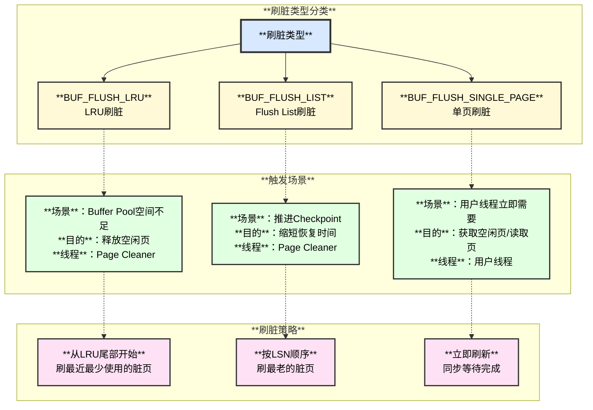

### 1.4 刷脏类型详细对比表

| **刷脏类型** | **触发条件** | **刷脏来源** | **执行线程** | **是否异步** | **优先级** |
|------------|------------|------------|------------|------------|-----------|
| **`BUF_FLUSH_LRU`** | 空闲页不足<br/>`srv_LRU_scan_depth`配置 | LRU List末尾 | Page Cleaner线程 | 异步 | 中 |
| **`BUF_FLUSH_LIST`** | Redo Log空间压力<br/>Checkpoint推进需要 | Flush List（按LSN顺序） | Page Cleaner线程 | 异步 | 高 |
| **`BUF_FLUSH_SINGLE_PAGE`** | 用户线程需要立即获取页面<br/>Buffer Pool已满 | 任意脏页 | 用户线程 | 同步 | 最高 |

---

## 2. Page Cleaner线程架构

### 2.1 Page Cleaner架构图

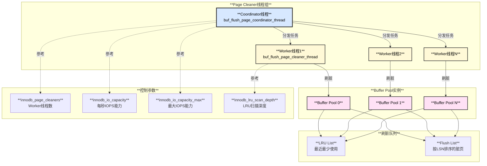

### 2.2 Page Cleaner数据结构

**核心结构（`buf0flu.cc:162`）：**

```c
struct page_cleaner_t {
  ib_mutex_t mutex;              // 保护整个page_cleaner结构的互斥锁
  os_event_t is_requested;       // 唤醒worker线程的事件
  os_event_t is_finished;        // 所有slot完成的事件
  
  bool requested;                // 是否有刷脏请求
  lsn_t lsn_limit;              // 需要刷到的LSN上限
  
  ulint n_slots;                // Slot总数（=Buffer Pool实例数）
  ulint n_slots_requested;      // 已请求的slot数量
  ulint n_slots_flushing;       // 正在刷脏的slot数量
  ulint n_slots_finished;       // 已完成的slot数量
  
  std::chrono::milliseconds flush_time;  // 刷脏耗时
  ulint flush_pass;             // 刷脏轮次计数
  
  ut::unique_ptr<page_cleaner_slot_t[]> slots;  // 每个Buffer Pool的slot
  bool is_running;              // 是否正在运行
};

// 每个Buffer Pool实例的slot
struct page_cleaner_slot_t {
  page_cleaner_state_t state;   // 状态：NONE/REQUESTED/FLUSHING/FINISHED
  
  bool succeeded_list;          // Flush List刷脏是否成功
  bool succeeded_lru;           // LRU List刷脏是否成功
  
  ulint n_flushed_lru;          // LRU刷脏的页面数
  ulint n_flushed_list;         // Flush List刷脏的页面数
  
  ulint n_pages_requested;      // 请求刷脏的页面数
};
```

**Slot状态流转：**

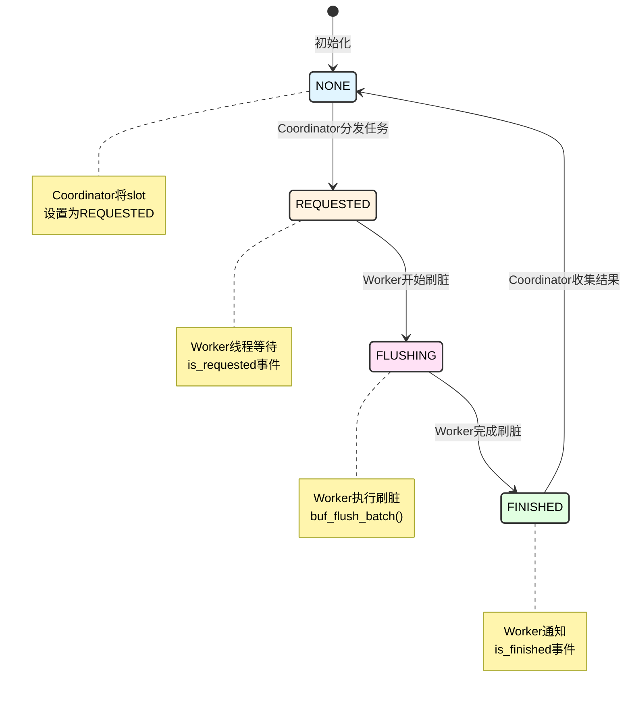

---

## 3. Checkpoint推进机制

### 3.1 Checkpoint概念

**Checkpoint**是InnoDB中的一个关键概念，标记了Redo Log中已经持久化到磁盘的数据页的最老LSN。在故障恢复时，从Checkpoint LSN开始应用Redo Log。

### 3.2 Checkpoint相关LSN

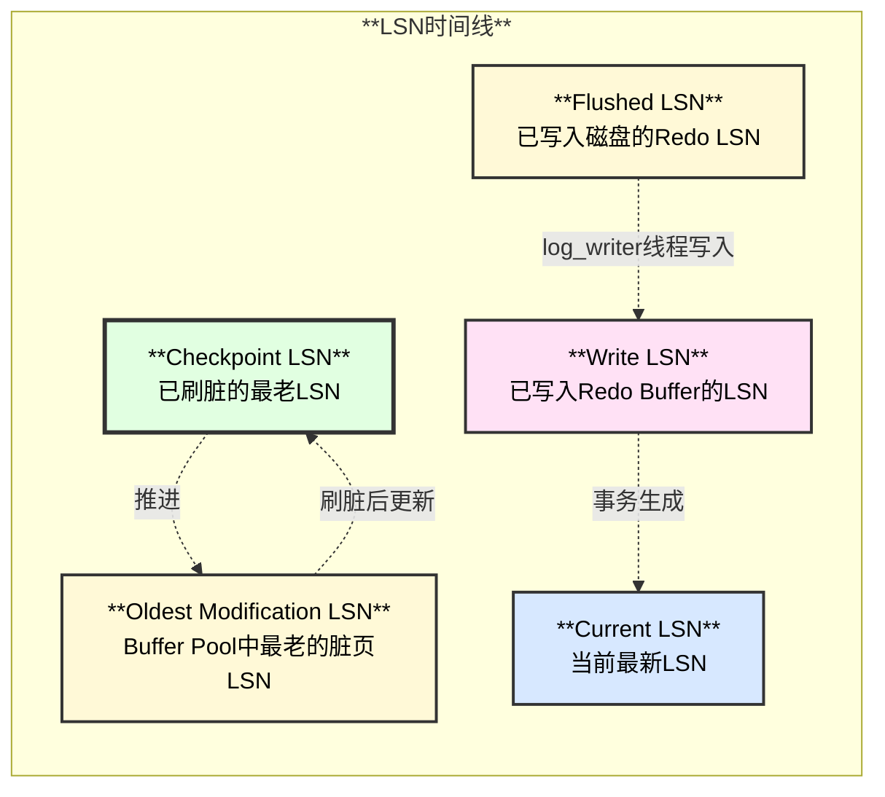

### 3.3 Checkpoint推进条件

**Checkpoint能够推进的前提（`log0chkp.cc`）：**

```c
// Checkpoint LSN推进的条件：
// 1. 所有小于oldest_lsn的数据页都已刷入磁盘
// 2. oldest_lsn = min(所有Buffer Pool中最老的脏页LSN)
// 3. Checkpoint LSN <= oldest_lsn

lsn_t log_get_available_for_checkpoint_lsn(const log_t &log) {
  // 1. 获取所有Buffer Pool中最老的脏页LSN
  lsn_t oldest_lsn = buf_pool_get_oldest_modification_approx();
  
  // 2. Checkpoint LSN不能超过oldest_lsn
  return oldest_lsn;
}
```

### 3.4 Checkpoint写入位置

**Checkpoint Header结构（`log0types.h:236`）：**

```c
struct Log_checkpoint_header {
  lsn_t m_checkpoint_lsn;  // Checkpoint LSN（8字节）
};
```

**Checkpoint存储位置：**

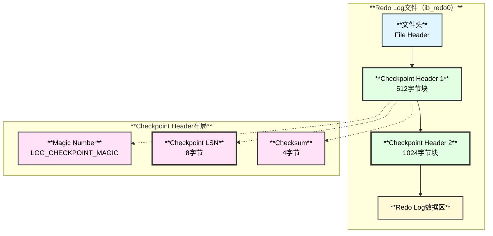

**双checkpoint设计：**

- InnoDB维护两个Checkpoint Header（交替写入）
- 恢复时选择LSN较大的有效checkpoint
- 避免写checkpoint时崩溃导致无法恢复

### 3.5 Checkpoint推进流程图

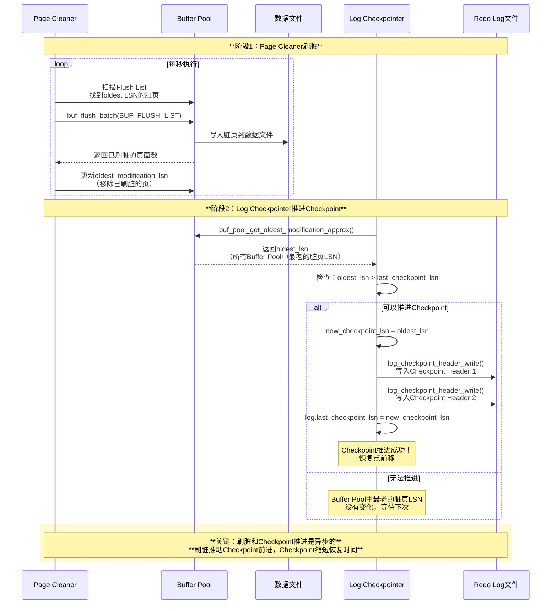

---

## 4. 刷脏触发时机

### 4.1 触发时机总览

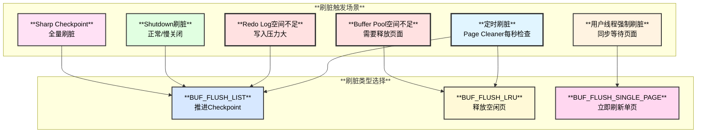

### 4.2 触发时机详细说明

| **触发场景** | **触发条件** | **刷脏类型** | **代码位置** | **紧迫度** |
|------------|------------|------------|------------|-----------|
| **定时刷脏** | Page Cleaner线程每秒检查 | `BUF_FLUSH_LIST` + `BUF_FLUSH_LRU` | `buf0flu.cc:3200` | 低 |
| **Redo Log空间不足** | `write_lsn - checkpoint_lsn > redo_log_capacity * 90%` | `BUF_FLUSH_LIST` | `log0write.cc:1900` | **高** |
| **Buffer Pool空间不足** | `free_pages < LRU_scan_depth` | `BUF_FLUSH_LRU` | `buf0lru.cc:600` | **高** |
| **用户线程强制刷脏** | 无法获取空闲页，立即刷脏 | `BUF_FLUSH_SINGLE_PAGE` | `buf0lru.cc:646` | **最高** |
| **Shutdown刷脏** | `srv_shutdown_state == SRV_SHUTDOWN_CLEANUP` | `BUF_FLUSH_LIST`（全量） | `buf0flu.cc:3427` | 中 |
| **Sharp Checkpoint** | 手动执行或测试场景 | `BUF_FLUSH_LIST`（全量） | `buf0flu.cc:2900` | 最高 |

### 4.3 Adaptive Flushing自适应刷脏

**自适应刷脏算法（`buf0flu.cc:2200`）：**

```cpp
// 根据Redo Log生成速率动态调整刷脏速度
ulint page_cleaner_flush_pages_recommendation() {
  // 1. 计算Redo Log生成速率
  lsn_t lsn_rate = (current_lsn - last_lsn) / time_elapsed;
  
  // 2. 计算Redo Log剩余容量
  lsn_t available_redo = redo_log_capacity - (write_lsn - checkpoint_lsn);
  
  // 3. 如果剩余容量 < 10%，激进刷脏
  if (available_redo < redo_log_capacity * 0.1) {
    return srv_io_capacity_max;  // 使用最大IOPS
  }
  
  // 4. 自适应计算刷脏页面数
  ulint n_pages = lsn_rate * pct_for_lsn / srv_io_capacity;
  
  // 5. 限制在[io_capacity, io_capacity_max]范围内
  return std::clamp(n_pages, srv_io_capacity, srv_io_capacity_max);
}
```

**自适应刷脏决策图：**

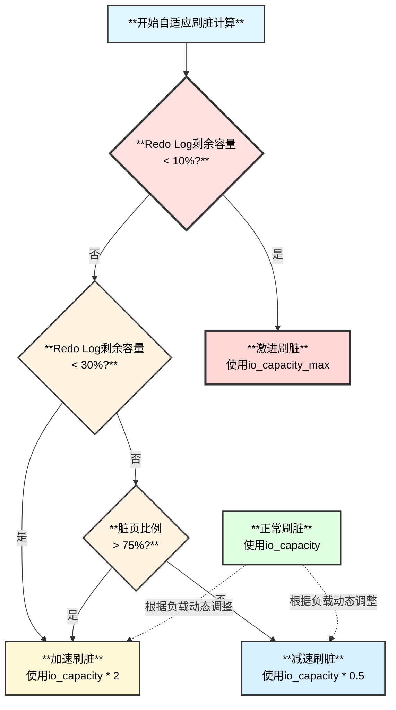

---

## 5. 代码调用链分析

### 5.1 BUF_FLUSH_LIST刷脏调用链

**完整函数调用栈：**

```
1. Page Cleaner Coordinator线程
   buf_flush_page_coordinator_thread()  // buf0flu.cc:3200
   └─> pc_request()  // 请求所有slot刷脏
       ├─> page_cleaner->lsn_limit = target_lsn
       ├─> page_cleaner->requested = true
       └─> os_event_set(page_cleaner->is_requested)  // 唤醒worker

2. Page Cleaner Worker线程
   buf_flush_page_cleaner_thread()  // buf0flu.cc:3564
   └─> os_event_wait(page_cleaner->is_requested)  // 等待请求
   └─> pc_flush_slot()  // buf0flu.cc:3100
       └─> buf_flush_lists()  // buf0flu.cc:2050
           └─> buf_flush_batch()  // buf0flu.cc:1945
               ├─> buf_flush_LRU_list_batch()  // 从LRU扫描
               │   └─> buf_flush_page_and_try_neighbors()
               │       └─> buf_flush_page()  // buf0flu.cc:1271
               │           ├─> buf_flush_write_block_low()
               │           │   ├─> fil_io()  // 异步I/O写入
               │           │   └─> buf_page_io_complete()  // I/O完成回调
               │           └─> buf_flush_remove()  // 从flush list移除
               │
               └─> buf_do_flush_list_batch()  // 从Flush List刷脏
                   └─> buf_flush_page_and_try_neighbors()
                       └─> buf_flush_page()  // 同上

3. I/O完成处理
   buf_page_io_complete()  // buf0buf.cc:6000
   ├─> buf_flush_write_complete()
   │   └─> 更新oldest_modification LSN
   └─> buf_page_set_io_fix(bpage, BUF_IO_NONE)

4. Checkpoint推进（异步）
   log_checkpointer()  // log0chkp.cc:500
   └─> log_checkpointer_step()
       ├─> buf_pool_get_oldest_modification_approx()
       │   └─> 返回oldest_lsn
       ├─> log_checkpoint()
       │   └─> log_files_write_checkpoint()
       │       ├─> log_checkpoint_header_write(..., checkpoint_header_no=1)
       │       └─> log_checkpoint_header_write(..., checkpoint_header_no=2)
       └─> log.last_checkpoint_lsn = new_checkpoint_lsn
```

### 5.2 BUF_FLUSH_LRU刷脏调用链

**LRU刷脏路径：**

```
1. Page Cleaner线程
   buf_flush_page_coordinator_thread()
   └─> pc_request()  // 每秒触发
       └─> buf_flush_LRU_lists()  // 刷所有Buffer Pool的LRU
           └─> buf_flush_LRU_list()  // buf0flu.cc:1800
               └─> buf_flush_batch(buf_pool, BUF_FLUSH_LRU, ...)
                   └─> buf_flush_LRU_list_batch()  // buf0flu.cc:1700
                       ├─> 从LRU尾部扫描 srv_LRU_scan_depth 个页面
                       ├─> 找到脏页：buf_flush_page_and_try_neighbors()
                       │   └─> buf_flush_page()
                       └─> 返回刷脏的页面数
```

### 5.3 BUF_FLUSH_SINGLE_PAGE刷脏调用链

**用户线程同步刷脏：**

```
1. 用户线程（需要空闲页）
   buf_LRU_get_free_block()  // buf0lru.cc:1400
   ├─> buf_LRU_scan_and_free_block()  // 扫描LRU寻找空闲页
   │   └─> 如果找不到空闲页
   │
   └─> buf_flush_single_page_from_LRU()  // buf0lru.cc:646
       └─> buf_flush_page()  // 同步刷脏
           ├─> buf_flush_page_try()
           │   └─> buf_flush_page(buf_pool, bpage, BUF_FLUSH_SINGLE_PAGE, true)
           │       └─> fil_io()  // 写入磁盘
           └─> 等待I/O完成  // 同步等待！
```

### 5.4 Checkpoint写入调用链

**Checkpoint写入路径：**

```
1. Log Checkpointer线程
   log_checkpointer()  // log0chkp.cc:500
   └─> while (srv_shutdown_state < SRV_SHUTDOWN_CLEANUP)
       ├─> log_checkpointer_step()
       │   ├─> log_compute_available_for_checkpoint_lsn()
       │   │   └─> buf_pool_get_oldest_modification_approx()
       │   │       └─> 遍历所有Buffer Pool，找最小的oldest_lsn
       │   │
       │   ├─> 检查：oldest_lsn > last_checkpoint_lsn
       │   │
       │   └─> log_checkpoint()  // log0chkp.cc:300
       │       ├─> log_files_write_checkpoint()
       │       │   ├─> 填充checkpoint header
       │       │   │   └─> header.m_checkpoint_lsn = checkpoint_lsn
       │       │   │
       │       │   ├─> log_checkpoint_header_write(file, HEADER_1, header)
       │       │   │   └─> os_file_write()  // 写第一个checkpoint header
       │       │   │
       │       │   └─> log_checkpoint_header_write(file, HEADER_2, header)
       │       │       └─> os_file_write()  // 写第二个checkpoint header
       │       │
       │       └─> log.last_checkpoint_lsn.store(checkpoint_lsn)
       │
       └─> std::this_thread::sleep_for(100ms)  // 每100ms检查一次

2. fil_write_flushed_lsn()  // 额外写入LSN到系统表空间
   fil0fil.cc:3980
   ├─> 打开系统表空间第一个页面（FSP_HEADER_PAGE）
   ├─> 写入LSN到FIL_PAGE_FILE_FLUSH_LSN字段
   └─> os_file_write()  // 持久化到磁盘
```

---

## 6. 故障恢复使用Checkpoint

### 6.1 恢复流程概述

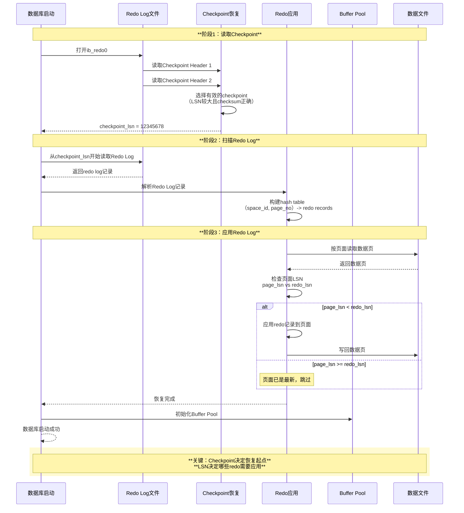

### 6.2 Checkpoint恢复代码路径

**完整恢复调用链：**

```
1. 数据库启动
   srv_start()  // srv0start.cc:2500
   └─> recv_sys_init()  // 初始化恢复系统
   └─> srv_start_redo_log_recovery()
       └─> recv_recovery_from_checkpoint_start()  // log0recv.cc:3500
           ├─> log_files_find_and_analyze()
           │   ├─> log_files_read_checkpoint_headers()
           │   │   ├─> log_checkpoint_header_read(file, HEADER_1, buf)
           │   │   ├─> log_checkpoint_header_read(file, HEADER_2, buf)
           │   │   └─> 选择LSN较大的有效checkpoint
           │   │       └─> recv_sys->checkpoint_lsn = checkpoint_lsn
           │   │
           │   └─> recv_scan_log_recs()  // 扫描redo log
           │       ├─> 从checkpoint_lsn开始读取
           │       ├─> recv_parse_log_recs()  // 解析redo记录
           │       └─> recv_add_to_hash_table()  // 加入hash table
           │
           └─> recv_init_crash_recovery()  // 初始化crash恢复
               └─> recv_sys->apply_log_recs = true

2. 应用Redo Log
   recv_apply_hashed_log_recs()  // log0recv.cc:2500
   ├─> 遍历hash table中的每个页面
   │   ├─> recv_read_in_area()  // 读取数据页
   │   │   └─> buf_read_page()
   │   │
   │   ├─> recv_recover_page()  // 应用redo到页面
   │   │   ├─> 检查：page_lsn < redo_lsn
   │   │   ├─> recv_parse_or_apply_log_rec_body()
   │   │   │   └─> 根据redo类型应用修改
   │   │   │       (MLOG_1BYTE, MLOG_WRITE_STRING, etc.)
   │   │   └─> buf_page_set_lsn(page, redo_lsn)
   │   │
   │   └─> buf_flush_page()  // 刷回磁盘
   │
   └─> recv_sys->apply_log_recs = false

3. 完成恢复
   recv_recovery_from_checkpoint_finish()  // log0recv.cc:4000
   ├─> recv_sys_free()  // 释放恢复系统内存
   └─> log_start()  // 启动redo log系统
       ├─> 启动log_writer线程
       ├─> 启动log_checkpointer线程
       └─> 启动log_flusher线程
```

### 6.3 Checkpoint选择算法

**选择有效checkpoint的逻辑（`log0recv.cc:950`）：**

```cpp
dberr_t log_files_find_and_analyze() {
  Log_checkpoint checkpoint_1, checkpoint_2;
  
  // 1. 读取两个checkpoint header
  log_checkpoint_header_read(file_handle, HEADER_1, &checkpoint_1);
  log_checkpoint_header_read(file_handle, HEADER_2, &checkpoint_2);
  
  // 2. 验证checksum
  bool valid_1 = (checkpoint_1.checksum == compute_checksum(checkpoint_1));
  bool valid_2 = (checkpoint_2.checksum == compute_checksum(checkpoint_2));
  
  // 3. 选择LSN较大的有效checkpoint
  lsn_t selected_lsn = 0;
  
  if (valid_1 && valid_2) {
    // 两个都有效，选LSN较大的
    selected_lsn = std::max(checkpoint_1.m_checkpoint_lsn,
                            checkpoint_2.m_checkpoint_lsn);
  } else if (valid_1) {
    selected_lsn = checkpoint_1.m_checkpoint_lsn;
  } else if (valid_2) {
    selected_lsn = checkpoint_2.m_checkpoint_lsn;
  } else {
    // 两个checkpoint都无效！
    return DB_ERROR;
  }
  
  recv_sys->checkpoint_lsn = selected_lsn;
  return DB_SUCCESS;
}
```

### 6.4 恢复时间与Checkpoint的关系

```mermaid
graph LR
    subgraph "**恢复时间计算**"
        RTO["**RTO<br/>Recovery Time Objective**"]
        
        T1["**读取Checkpoint时间**<br/>~100ms"]
        T2["**扫描Redo Log时间**<br/>(current_lsn - checkpoint_lsn) / scan_rate"]
        T3["**应用Redo Log时间**<br/>需要应用的redo量 / apply_rate"]
        T4["**刷脏时间**<br/>恢复的页面数 * flush_time"]
        
        RTO -.->|包含| T1
        RTO -.->|包含| T2
        RTO -.->|包含| T3
        RTO -.->|包含| T4
    end
    
    subgraph "**优化策略**"
        OPT1["**频繁推进Checkpoint**<br/>减少T2和T3"]
        OPT2["**增大Buffer Pool**<br/>减少T4"]
        OPT3["**并行应用Redo**<br/>减少T3"]
    end
    
    T2 -.->|优化| OPT1
    T3 -.->|优化| OPT1
    T3 -.->|优化| OPT3
    T4 -.->|优化| OPT2
    
    style RTO fill:#ffd7d7,stroke:#333,stroke-width:3px,color:#000
    style T1 fill:#e1f5ff,stroke:#333,stroke-width:2px,color:#000
    style T2 fill:#fff9d7,stroke:#333,stroke-width:3px,color:#000
    style T3 fill:#fff9d7,stroke:#333,stroke-width:3px,color:#000
    style T4 fill:#ffe1f5,stroke:#333,stroke-width:2px,color:#000
    style OPT1 fill:#e1ffe1,stroke:#333,stroke-width:2px,color:#000
    style OPT2 fill:#e1ffe1,stroke:#333,stroke-width:2px,color:#000
    style OPT3 fill:#e1ffe1,stroke:#333,stroke-width:2px,color:#000
```

**恢复时间关键因素：**

| **因素** | **影响** | **优化方法** |
|---------|---------|------------|
| **`current_lsn - checkpoint_lsn`** | 需要应用的redo量 | 频繁推进checkpoint，降低checkpoint age |
| **Redo Log记录数量** | 扫描和解析时间 | 优化redo生成，批量操作减少redo记录 |
| **脏页数量** | 刷脏时间 | 增大innodb_io_capacity，加速刷脏 |
| **Buffer Pool大小** | 页面缓存 | 增大innodb_buffer_pool_size |

---

## 7. 刷脏性能优化

### 7.1 关键参数配置

| **参数** | **默认值** | **推荐值** | **说明** |
|---------|-----------|-----------|---------|
| **`innodb_io_capacity`** | 200 | 1000-5000 | 后台I/O能力（IOPS），SSD建议5000+ |
| **`innodb_io_capacity_max`** | 2000 | 10000-20000 | 最大I/O能力，压力大时使用 |
| **`innodb_lru_scan_depth`** | 1024 | 1024-2048 | LRU扫描深度，影响LRU刷脏效率 |
| **`innodb_flush_neighbors`** | 0（SSD）<br/>1（HDD） | 0（SSD）<br/>1（HDD） | 是否刷相邻页，SSD建议关闭 |
| **`innodb_page_cleaners`** | 4 | = Buffer Pool实例数 | Page cleaner线程数 |
| **`innodb_adaptive_flushing`** | ON | ON | 自适应刷脏，强烈推荐开启 |
| **`innodb_adaptive_flushing_lwm`** | 10 | 10 | Redo容量低于10%时激进刷脏 |
| **`innodb_max_dirty_pages_pct`** | 90 | 75 | 脏页比例超过此值开始刷脏 |
| **`innodb_max_dirty_pages_pct_lwm`** | 10 | 25 | 脏页比例低水位，开始预刷脏 |

### 7.2 性能调优建议


### 7.3 监控指标

**关键监控SQL：**

```sql
-- 1. 查看刷脏统计
SELECT * FROM information_schema.INNODB_BUFFER_POOL_STATS
WHERE POOL_ID = 0;
-- 关注字段：
-- - PAGES_MADE_DIRTY: 生成的脏页数
-- - DIRTY_PAGES: 当前脏页数
-- - OLD_DATABASE_PAGES: LRU old区域页面数

-- 2. 查看Checkpoint Age
SELECT 
  VARIABLE_VALUE AS checkpoint_lsn
FROM performance_schema.global_status
WHERE VARIABLE_NAME = 'Innodb_checkpoint_lsn';

SELECT 
  VARIABLE_VALUE AS current_lsn
FROM performance_schema.global_status
WHERE VARIABLE_NAME = 'Innodb_lsn_current';

-- Checkpoint Age = current_lsn - checkpoint_lsn

-- 3. 查看刷脏活动
SELECT * FROM information_schema.INNODB_METRICS
WHERE NAME LIKE 'buffer%flush%';
-- 关注指标：
-- - buffer_flush_adaptive_total_page: 自适应刷脏页数
-- - buffer_flush_sync_total_page: 同步刷脏页数（应尽量避免）
-- - buffer_LRU_batch_flush_total_page: LRU批量刷脏页数
```

---

## 8. 完整刷脏时序图

### 8.1 BUF_FLUSH_LIST完整流程

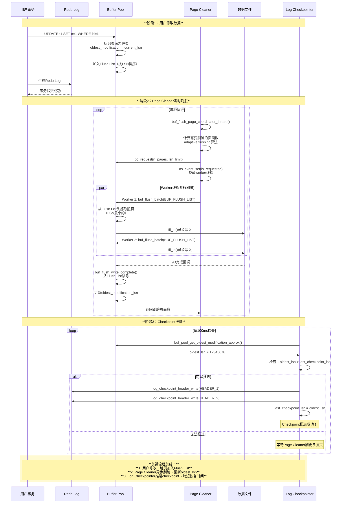

---

## 9. 总结

### 9.1 刷脏机制核心要点

| **方面** | **关键点** |
|---------|-----------|
| **刷脏类型** | BUF_FLUSH_LIST（推进checkpoint）、BUF_FLUSH_LRU（释放空闲页）、BUF_FLUSH_SINGLE_PAGE（同步刷脏） |
| **执行线程** | Page Cleaner线程（异步）、用户线程（同步，应避免） |
| **触发时机** | 定时刷脏、Redo空间不足、Buffer Pool空间不足、用户强制刷脏、Shutdown |
| **核心目标** | 推进Checkpoint、缩短恢复时间、保证Buffer Pool有足够空闲页 |

### 9.2 Checkpoint机制核心要点

| **方面** | **关键点** |
|---------|-----------|
| **Checkpoint LSN** | Buffer Pool中所有脏页的最小LSN，标记已持久化的数据点 |
| **推进条件** | 脏页被刷入磁盘后，oldest_lsn前移，checkpoint_lsn才能推进 |
| **存储位置** | Redo Log文件的两个checkpoint header（交替写入） |
| **恢复作用** | 从checkpoint_lsn开始应用Redo Log，缩短恢复时间 |

### 9.3 优化建议总结

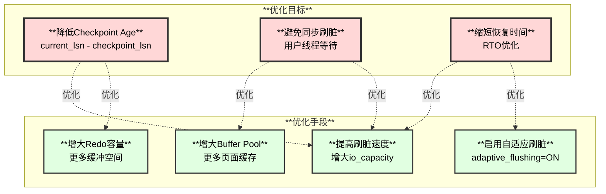

### 9.4 核心函数速查表

| **功能** | **关键函数** | **源文件** | **说明** |
|---------|------------|-----------|---------|
| **Page Cleaner主线程** | `buf_flush_page_coordinator_thread()` | buf0flu.cc:3200 | Coordinator线程入口 |
| **Page Cleaner Worker** | `buf_flush_page_cleaner_thread()` | buf0flu.cc:3564 | Worker线程入口 |
| **Flush List刷脏** | `buf_flush_batch()` | buf0flu.cc:1945 | 批量刷脏入口 |
| **单页刷脏** | `buf_flush_page()` | buf0flu.cc:1271 | 刷单个页面 |
| **Checkpoint推进** | `log_checkpointer()` | log0chkp.cc:500 | Checkpoint线程入口 |
| **Checkpoint写入** | `log_checkpoint_header_write()` | log0files_io.cc | 写checkpoint header |
| **恢复入口** | `recv_recovery_from_checkpoint_start()` | log0recv.cc:3500 | 从checkpoint恢复 |
| **应用Redo** | `recv_apply_hashed_log_recs()` | log0recv.cc:2500 | 应用redo到页面 |

---

**文档完成日期**：2025-11-09  
**下一步**：继续完成Redo日志详解文档

