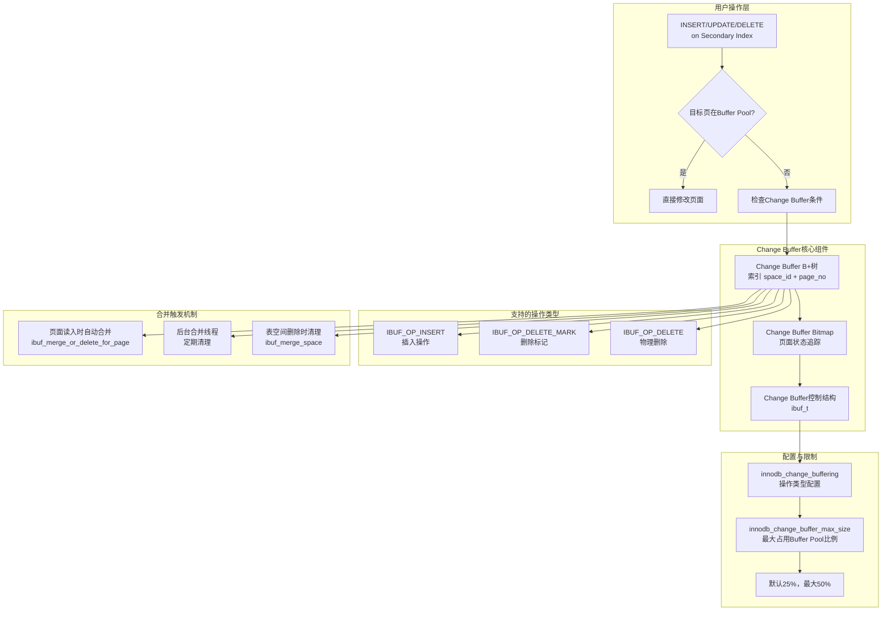
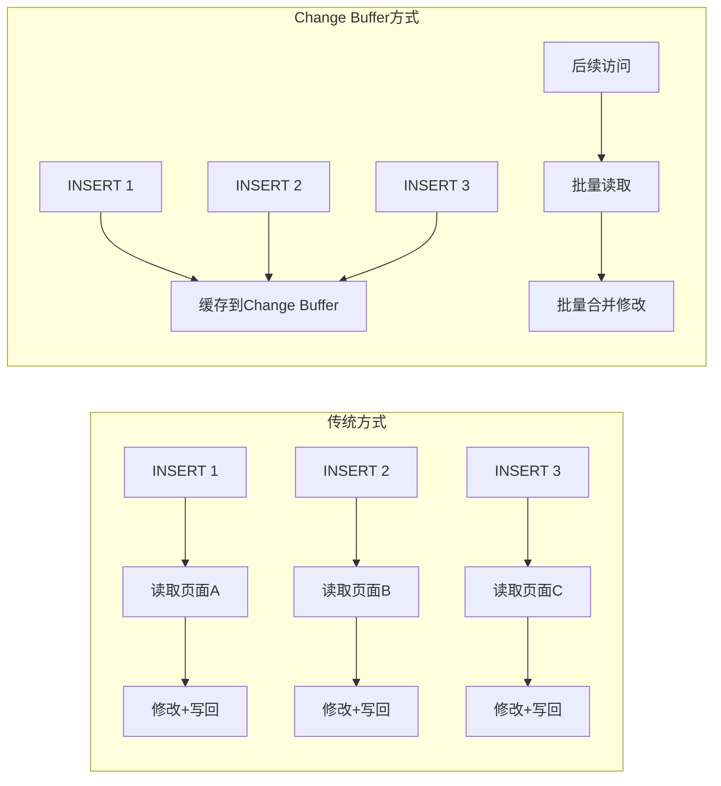
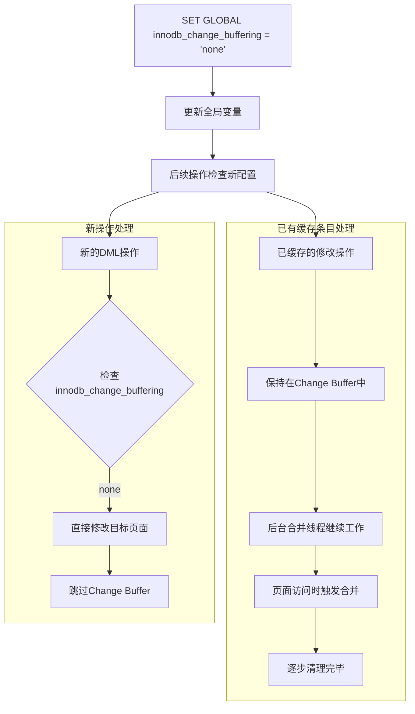
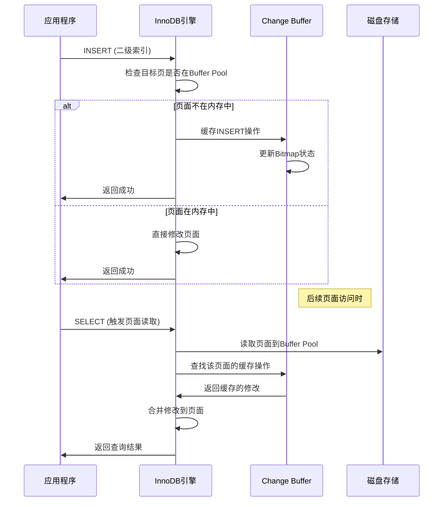
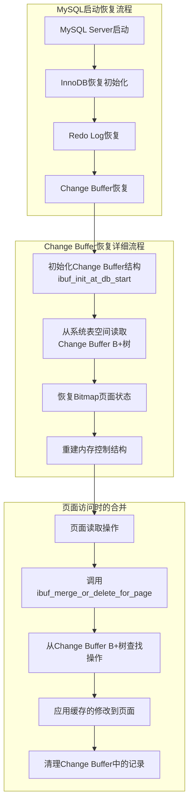
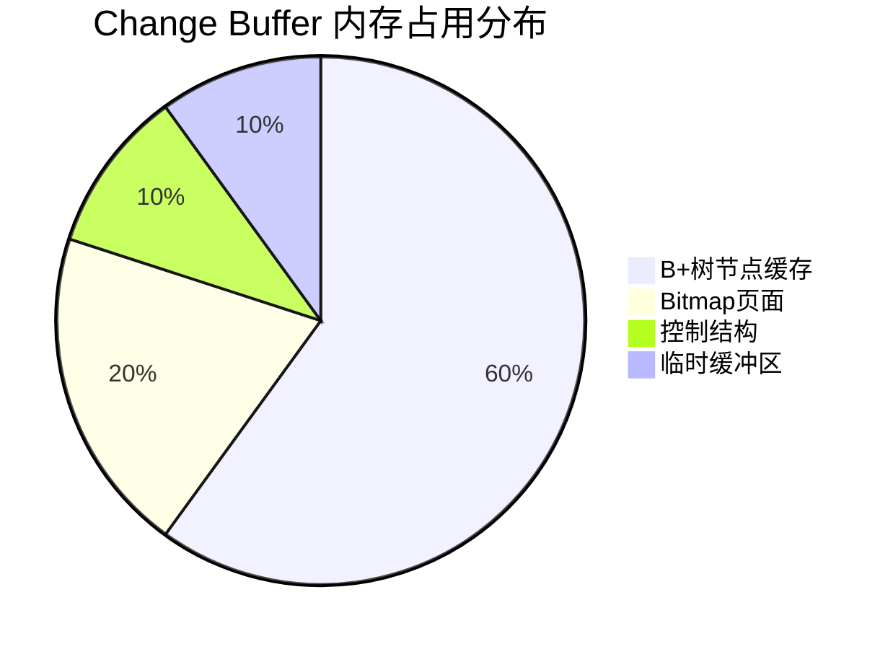
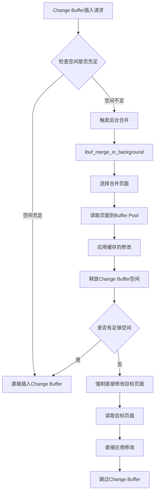

# InnoDB Change Buffer (插入缓冲区) 技术分析

## 概述

**Change Buffer** (也称为 Insert Buffer) 是 InnoDB 存储引擎的一个重要优化机制，用于减少对非唯一二级索引修改时的随机磁盘I/O操作。当目标数据页不在缓冲池中时，Change Buffer 将这些修改操作缓存起来，延迟到页面真正被读入内存时再进行合并操作。

**重要特性**：Change Buffer 支持动态开启/关闭，无需重启MySQL服务器，关闭后采用渐进式清理机制处理已缓存的条目。

## Change Buffer 架构图



## 1. Change Buffer 是什么？

Change Buffer 是 InnoDB 存储引擎中用于优化**非唯一二级索引**修改操作的内存缓冲机制。其核心思想是：

- **延迟写入**：当要修改的索引页不在 Buffer Pool 中时，不立即读取该页面
- **批量合并**：将多个修改操作缓存起来，在页面实际被访问时一次性应用
- **减少随机I/O**：避免为每个索引修改都产生一次随机磁盘读取

### 核心数据结构

```cpp
// storage/innobase/include/ibuf0ibuf.h
/** Change Buffer控制结构 */
extern ibuf_t *ibuf;

/** 支持的操作类型 */
typedef enum {
  IBUF_OP_INSERT = 0,        // 插入操作
  IBUF_OP_DELETE_MARK = 1,   // 删除标记操作  
  IBUF_OP_DELETE = 2,        // 物理删除操作
  IBUF_OP_COUNT = 3
} ibuf_op_t;

/** 可缓冲的操作组合 */
enum ibuf_use_t {
  IBUF_USE_NONE = 0,                    // 禁用
  IBUF_USE_INSERT,                      // 仅插入
  IBUF_USE_DELETE_MARK,                 // 仅删除标记
  IBUF_USE_INSERT_DELETE_MARK,          // 插入+删除标记
  IBUF_USE_DELETE,                      // 删除+清理
  IBUF_USE_ALL                          // 全部操作
};
```

## 2. 用来解决什么问题？

Change Buffer 主要解决以下性能问题：

### 2.1 随机I/O问题
- **问题**：二级索引修改通常是随机的，每次操作可能涉及不同的数据页
- **解决**：通过缓冲机制，将多次随机I/O转换为批量顺序I/O

### 2.2 内存利用率问题  
- **问题**：为了修改几个字节而读取整个16KB页面，内存利用率低
- **解决**：只有真正需要访问页面时才读入内存

### 2.3 写放大问题
- **问题**：频繁的小修改导致大量的页面写入操作
- **解决**：将多个修改合并后一次性写入

### 性能改进示例



## 3. 适用于什么场景？

### 3.1 适合的场景

1. **写多读少的工作负载**
   - 大量INSERT/UPDATE/DELETE操作
   - 读取访问相对较少的二级索引

2. **数据导入场景**
   - 批量数据导入
   - ETL操作
   - 数据迁移

3. **随机写入模式**
   - 索引值分布随机
   - 无明显的访问热点

### 3.2 不适合的场景

1. **读多写少的工作负载**
   - 频繁的SELECT操作会触发合并，降低效率

2. **内存充足的环境**
   - Buffer Pool足够大，所有热点页面都在内存中

3. **实时性要求高的场景**
   - 需要立即看到修改结果的应用

### 使用限制条件

```cpp
// storage/innobase/include/ibuf0ibuf.ic
static inline bool ibuf_should_try(dict_index_t *index, ulint ignore_sec_unique) {
  return (innodb_change_buffering != IBUF_USE_NONE && 
          ibuf->max_size != 0 &&
          index->space != dict_sys_t::s_dict_space_id &&  // 非系统表空间
          !index->is_clustered() &&                       // 非聚簇索引
          !dict_index_is_spatial(index) &&                // 非空间索引
          !dict_index_has_desc(index) &&                  // 非降序索引
          index->table->quiesce == QUIESCE_NONE &&        // 表未静默
          (ignore_sec_unique || !dict_index_is_unique(index)) && // 非唯一索引
          srv_force_recovery < SRV_FORCE_NO_IBUF_MERGE);  // 非强制恢复模式
}
```

## 4. 可以关闭吗？

**可以关闭**。Change Buffer 提供了灵活的配置选项：

### 4.1 配置参数

```sql
-- 完全关闭Change Buffer
SET GLOBAL innodb_change_buffering = 'none';

-- 只启用插入操作缓冲
SET GLOBAL innodb_change_buffering = 'inserts';

-- 只启用删除操作缓冲  
SET GLOBAL innodb_change_buffering = 'deletes';

-- 启用插入和删除标记
SET GLOBAL innodb_change_buffering = 'changes';

-- 启用所有类型操作（默认）
SET GLOBAL innodb_change_buffering = 'all';
```

### 4.2 动态关闭特性

**Change Buffer 的关闭是动态的**，无需重启 MySQL 服务器：

#### 系统变量定义
```cpp
// storage/innobase/handler/ha_innodb.cc
static MYSQL_SYSVAR_ENUM(
    change_buffering, innodb_change_buffering, PLUGIN_VAR_RQCMDARG,
    "Buffer changes to reduce random access:"
    " OFF (default), ON, inserting, deleting, changing, or purging.",
    nullptr, nullptr, IBUF_USE_NONE, &innodb_change_buffering_typelib);
```

#### 关闭时的具体操作

**MySQL 在关闭 Change Buffer 时的处理机制：**



#### 关闭时不做的操作

**重要特征**：**没有立即的清理操作**

1. **无update handler函数**：`innodb_change_buffering`参数没有注册update callback函数
2. **不强制合并**：不会立即合并所有已缓存的修改
3. **不清理内存**：Change Buffer的内存结构保持不变
4. **不停止后台线程**：后台合并线程继续正常运行

```cpp
// 检查Change Buffer使用条件的函数
static inline bool ibuf_should_try(dict_index_t *index, ulint ignore_sec_unique) {
  return (innodb_change_buffering != IBUF_USE_NONE &&  // 动态检查新值
          ibuf->max_size != 0 &&
          // ... 其他条件
  );
}
```

#### 渐进式影响机制

**关闭后的渐进式清理过程：**

1. **立即生效**：新的DML操作不再使用Change Buffer
2. **后台清理**：Master线程定期调用后台合并
3. **页面访问触发**：读取相关页面时自动合并
4. **自然消化**：已缓存条目逐步被处理完毕

```cpp
// storage/innobase/srv/srv0srv.cc
// Master线程定期执行后台合并
static void srv_master_do_active_tasks(void) {
    // 即使innodb_change_buffering=none，后台合并仍继续执行
    srv_main_thread_op_info = "doing insert buffer merge";
    ibuf_merge_in_background(false);  // 继续处理已有条目
}
```

### 4.3 禁用的影响

**性能影响分析：**


### 4.4 关闭的时机建议

#### 何时应该关闭

1. **读密集型应用**：频繁的读取操作会触发合并，反而降低性能
2. **实时性要求**：需要立即反映数据变更的场景
3. **内存充足**：Buffer Pool 已足够缓存所有热点数据
4. **调试需要**：排查数据一致性问题时

#### 关闭后的监控

```sql
-- 监控Change Buffer清理进度
SELECT 
    VARIABLE_NAME,
    VARIABLE_VALUE 
FROM performance_schema.global_status 
WHERE VARIABLE_NAME LIKE 'innodb_ibuf%';

-- 关键指标变化趋势：
-- Innodb_ibuf_size_pages: 应逐步减少至0
-- Innodb_ibuf_merges: 合并操作次数持续增加
-- Innodb_ibuf_merged_inserts: 已合并的插入操作数
```

### 4.5 重新启用

**重新启用Change Buffer同样是动态的：**

```sql
-- 重新启用所有操作
SET GLOBAL innodb_change_buffering = 'all';

-- 或选择性启用
SET GLOBAL innodb_change_buffering = 'inserts';
```

启用后立即生效，新的符合条件的DML操作将开始使用Change Buffer。

## 5. 什么操作需要同步修改它？

### 5.1 触发Change Buffer修改的操作

1. **DML操作**
   ```sql
   INSERT INTO table_with_secondary_index VALUES (...);
   UPDATE table_with_secondary_index SET indexed_col = new_value;
   DELETE FROM table_with_secondary_index WHERE condition;
   ```

2. **索引维护操作**
   ```sql
   ALTER TABLE table_name ADD INDEX idx_name (column);
   ALTER TABLE table_name DROP INDEX idx_name;
   ```

3. **表空间操作**
   ```sql
   DROP TABLE table_with_secondary_index;
   TRUNCATE TABLE table_with_secondary_index;
   ```

### 5.2 操作类型与Change Buffer交互



### 5.3 具体代码实现

```cpp
// storage/innobase/row/row0ins.cc  
// 二级索引插入时的Change Buffer逻辑
if (!dict_index_is_spatial(index)) {
    search_mode |= BTR_INSERT;  // 启用insert buffering
}

// storage/innobase/btr/btr0cur.cc
// 检查是否可以使用Change Buffer
if (ibuf_insert(IBUF_OP_INSERT, tuple, index, page_id, page_size, cursor->thr)) {
    cursor->flag = BTR_CUR_INSERT_TO_IBUF;
    goto func_exit;
}
```

## 6. 在故障恢复中它是怎么处理的？

### 6.1 恢复机制架构



### 6.2 恢复过程详解

#### 启动时初始化
```cpp
// storage/innobase/srv/srv0start.cc
// MySQL启动时初始化Change Buffer
void ibuf_init_at_db_start(void) {
    // 分配Change Buffer控制结构
    ibuf = static_cast<ibuf_t *>(
        ut::zalloc_withkey(UT_NEW_THIS_FILE_PSI_KEY, sizeof(ibuf_t)));
    
    // 设置默认最大大小（Buffer Pool的25%）
    ibuf->max_size = ((buf_pool_get_curr_size() / UNIV_PAGE_SIZE) *
                      CHANGE_BUFFER_DEFAULT_SIZE) / 100;
    
    // 从磁盘读取Change Buffer树的根页面
    header_page = ibuf_header_page_get(&mtr);
    
    // 重建内存中的索引结构
    ibuf->index = dict_mem_index_create("innodb_change_buffer", "CLUST_IND", 
                                        IBUF_SPACE_ID, DICT_CLUSTERED | DICT_IBUF, 1);
}
```

#### 页面级恢复合并
```cpp  
// storage/innobase/buf/buf0buf.cc
// 页面读入时自动触发Change Buffer合并
if (uncompressed && !recv_no_ibuf_operations &&
    fil_page_get_type(frame) == FIL_PAGE_INDEX && page_is_leaf(frame) &&
    !fsp_is_system_temporary(bpage->id.space()) &&
    !fsp_is_undo_tablespace(bpage->id.space()) && !bpage->was_stale()) {
    
    // 调用合并函数
    ibuf_merge_or_delete_for_page(block, bpage->id, &bpage->size, update_ibuf_bitmap);
}
```

### 6.3 崩溃一致性保证

1. **Redo Log记录**：Change Buffer的修改也会记录redo log
2. **原子性操作**：使用MTR保证Change Buffer操作的原子性
3. **顺序恢复**：先恢复redo log，再处理Change Buffer合并

### 6.4 特殊恢复场景

```cpp
// 强制恢复模式下禁用Change Buffer合并
if (srv_force_recovery >= SRV_FORCE_NO_IBUF_MERGE) {
    return;  // 跳过合并操作
}

// 系统表空间和临时表空间不使用Change Buffer
if (trx_sys_hdr_page(page_id) || fsp_is_system_temporary(page_id.space())) {
    return;
}
```

## 7. 占用多少缓存？

### 7.1 内存占用分析

Change Buffer的内存占用包括以下几个部分：



### 7.2 大小配置与计算

```cpp
// 默认配置值
constexpr uint32_t CHANGE_BUFFER_DEFAULT_SIZE = 25;  // Buffer Pool的25%

// 最大大小计算
void ibuf_max_size_update(ulint new_val) {
    ulint new_size = ((buf_pool_get_curr_size() / UNIV_PAGE_SIZE) * new_val) / 100;
    mutex_enter(&ibuf_mutex);
    ibuf->max_size = new_size;  // 以页面数量计算
    mutex_exit(&ibuf_mutex);
}
```

### 7.3 内存使用监控

```sql
-- 查看Change Buffer使用情况
SELECT 
  VARIABLE_NAME,
  VARIABLE_VALUE 
FROM performance_schema.global_status 
WHERE VARIABLE_NAME LIKE 'innodb_ibuf%';

-- 关键指标：
-- Innodb_ibuf_size_pages: 当前占用页面数
-- Innodb_ibuf_free_list: 空闲页面数  
-- Innodb_ibuf_segment_size: 总段大小
```

### 7.4 大小限制机制

```cpp
// 检查是否有足够空间进行插入缓冲
static bool ibuf_data_enough_free_for_insert(void) {
    ut_ad(mutex_own(&ibuf_mutex));
    
    // 如果超过最大允许大小的90%，则拒绝新的插入
    return ibuf->size < (ibuf->max_size * 9) / 10;
}
```

### 7.5 内存配置建议

| Buffer Pool大小 | 建议Change Buffer大小 | 适用场景 |
|----------------|---------------------|----------|
| < 1GB | 15-20% | 小型应用，内存紧张 |
| 1GB - 8GB | 25% (默认) | 一般应用 |
| 8GB - 32GB | 30-35% | 写入密集型应用 |
| > 32GB | 35-50% | 大型数据仓库，ETL场景 |

## 8. 如果满了，写到哪里？

### 8.1 Change Buffer满载处理机制



### 8.2 溢出处理策略

#### 8.2.1 预防机制
```cpp
// storage/innobase/ibuf/ibuf0ibuf.cc
// 检查空间是否足够，预防溢出
static dberr_t ibuf_insert_low(ulint mode, ibuf_op_t op, bool no_counter,
                               const dtuple_t *entry, ulint entry_size,
                               dict_index_t *index, const page_id_t &page_id,
                               const page_size_t &page_size, que_thr_t *thr) {
    
    if (BTR_LATCH_MODE_WITHOUT_INTENTION(mode) == BTR_MODIFY_TREE) {
        for (;;) {
            mutex_enter(&ibuf_pessimistic_insert_mutex);
            mutex_enter(&ibuf_mutex);
            
            // 检查是否有足够空间  
            if (UNIV_LIKELY(ibuf_data_enough_free_for_insert())) {
                break;
            }
            
            // 空间不足时释放锁并尝试添加空闲页面
            mutex_exit(&ibuf_mutex);
            mutex_exit(&ibuf_pessimistic_insert_mutex);
            
            if (!ibuf_add_free_page()) {
                // 无法添加空闲页面时返回失败
                return (DB_STRONG_FAIL);
            }
        }
    }
}
```

#### 8.2.2 溢出时的写入位置

1. **直接写入目标页面**
   - 当Change Buffer空间不足时，直接读取目标页面进行修改
   - 这样避免了Change Buffer的空间限制

2. **扩展Change Buffer段**
   ```cpp
   // 尝试为Change Buffer添加新的页面
   static bool ibuf_add_free_page(void) {
       // 从表空间中分配新页面给Change Buffer使用
       // 如果分配失败，则必须直接修改目标页面
   }
   ```

3. **强制合并机制**
   ```cpp  
   // 当空间紧张时触发积极的合并操作
   void ibuf_merge_in_background(bool full) {
       // 选择合并候选页面
       // 批量读取并应用修改
       // 释放Change Buffer空间
   }
   ```

### 8.3 溢出场景分析

#### 常见溢出原因：
1. **写入过于集中**：短时间内大量二级索引修改
2. **合并速度跟不上**：读取访问少，合并触发频率低
3. **配置过小**：Change Buffer大小设置不合理
4. **内存碎片**：长期运行导致的内存碎片化

#### 溢出影响：
- **性能下降**：直接I/O操作增加延迟
- **内存压力**：Buffer Pool中热点页面被挤出
- **合并风暴**：集中的合并操作影响查询性能

### 8.4 溢出监控与调优

```sql
-- 监控Change Buffer空间使用
SELECT 
    CONCAT(ROUND(100 * pages_used / total_pages, 2), '%') AS usage_percentage,
    pages_used,
    total_pages,
    pages_free
FROM (
    SELECT 
        VARIABLE_VALUE AS pages_used
    FROM performance_schema.global_status 
    WHERE VARIABLE_NAME = 'Innodb_ibuf_size_pages'
) t1,
(
    SELECT 
        VARIABLE_VALUE AS total_pages  
    FROM performance_schema.global_status
    WHERE VARIABLE_NAME = 'Innodb_ibuf_segment_size'
) t2,
(
    SELECT 
        VARIABLE_VALUE AS pages_free
    FROM performance_schema.global_status 
    WHERE VARIABLE_NAME = 'Innodb_ibuf_free_list'
) t3;
```

### 8.5 调优建议

1. **监控使用率**：保持Change Buffer使用率在70%以下
2. **适当扩容**：写入密集场景可增大change_buffer_max_size
3. **强制合并**：必要时手动触发合并操作
4. **工作负载调整**：平衡读写比例，避免纯写入工作负载

## 总结

InnoDB Change Buffer 是一个精心设计的性能优化机制，通过延迟合并策略显著减少了随机I/O操作。理解其工作原理、适用场景和配置方法，对于数据库性能优化具有重要意义。在实际使用中，应根据具体的工作负载特征来调整相关参数，以获得最佳的性能表现。

### 关键要点总结

| 方面 | 详细说明 |
|------|----------|
| **核心功能** | 缓存非唯一二级索引的修改操作，减少随机I/O |
| **适用场景** | 写多读少、批量数据导入、随机写入模式 |
| **可配置性** | 支持灵活的开关和大小控制 |
| **动态关闭** | 可在线关闭，无需重启；关闭后渐进式清理已有缓存 |
| **恢复机制** | 启动时自动恢复，页面访问时合并 |
| **内存占用** | 默认25%，最大50% of Buffer Pool |
| **溢出处理** | 直接修改目标页面，扩展段空间，强制合并 |
