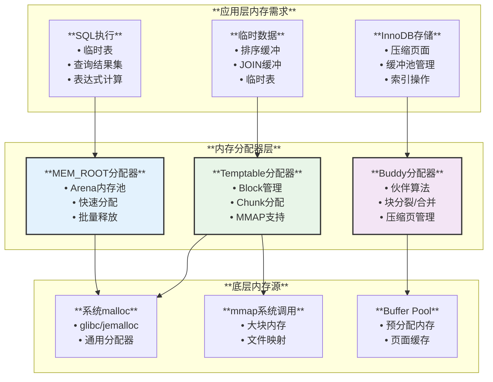
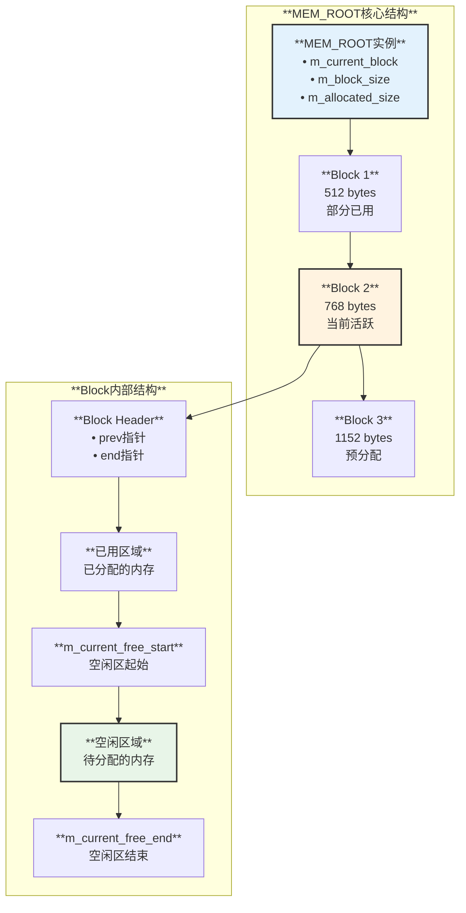
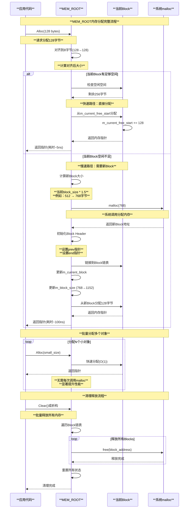
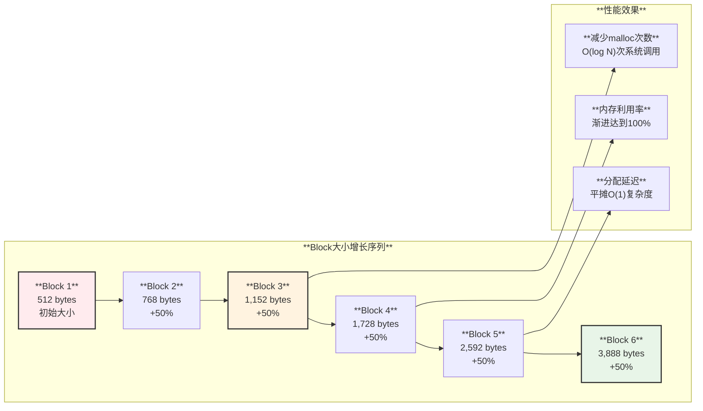
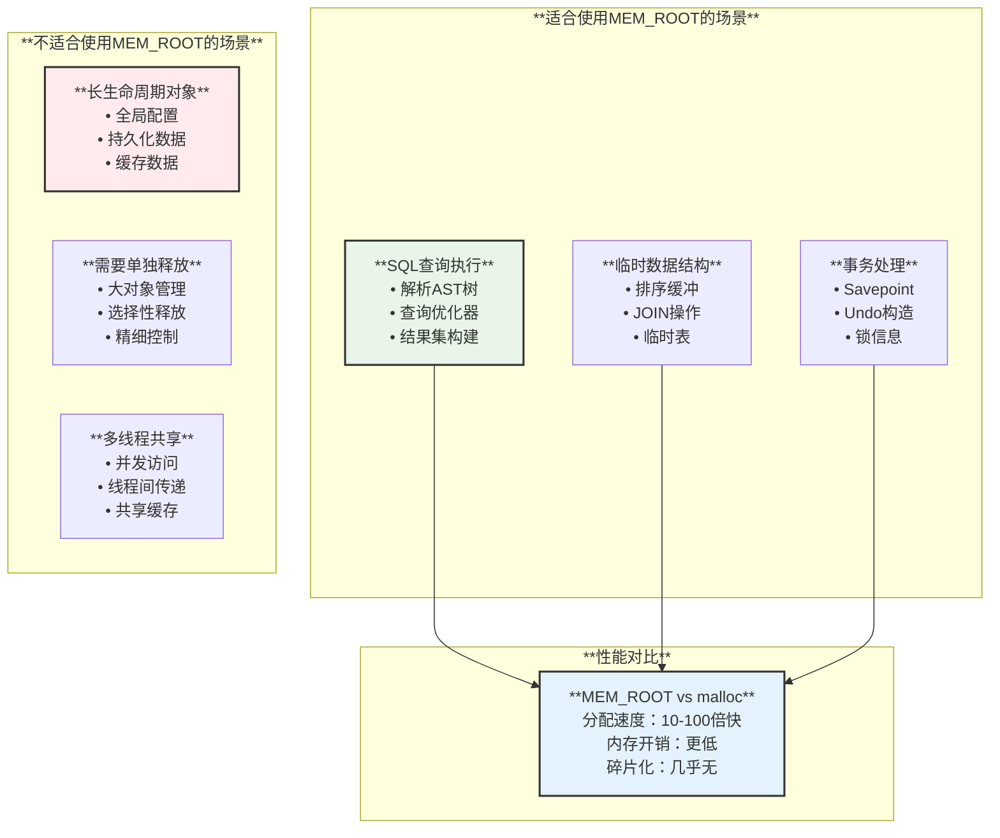
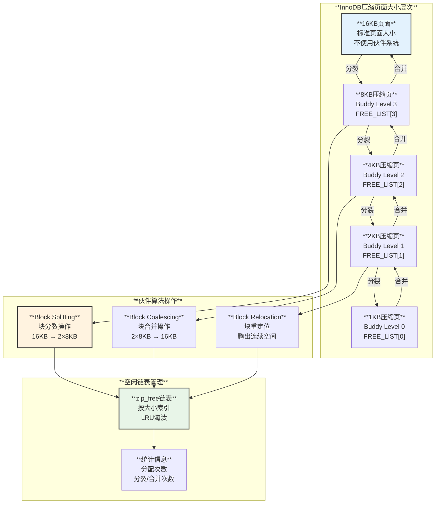
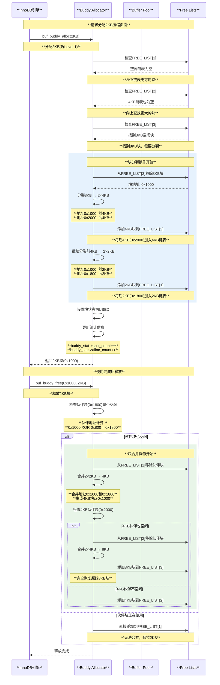
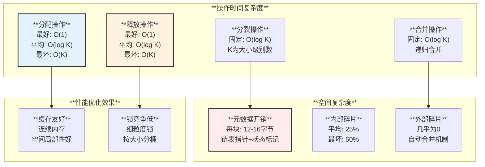
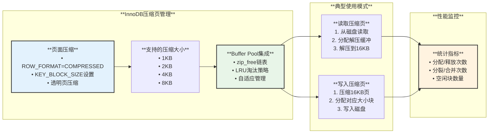
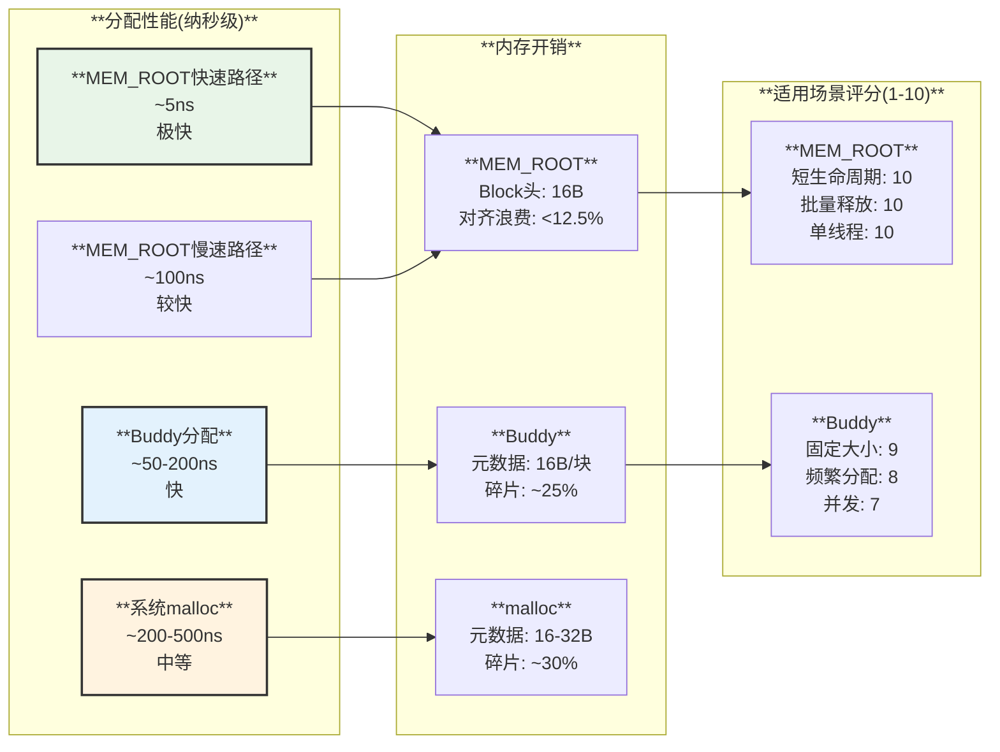

# MySQL内存伙伴系统深度分析

## 概述

MySQL实现了多层次的内存管理机制，其中**伙伴系统(Buddy System)**是关键组件之一。本文档深入分析MySQL中的两大内存管理系统：**MEM_ROOT轻量级内存池**和**InnoDB Buffer Pool伙伴分配器**，详细解读其架构设计、运行原理、性能优化策略及源码实现。

## MySQL内存管理整体架构



## 第一部分：MEM_ROOT轻量级Arena分配器

### 1. MEM_ROOT架构设计

**源码位置**: `include/my_alloc.h:84-429`



### 2. MEM_ROOT核心特性

**架构特点**:

| **特性** | **说明** | **优势** | **限制** |
|---------|---------|---------|---------|
| **Arena内存池** | 从大块中分配小内存 | 极快的分配速度(O(1)) | 无法单独释放 |
| **指数增长** | 每次增长50% | 减少malloc调用次数 | 可能浪费内存 |
| **批量释放** | 一次性释放所有内存 | 简化内存管理 | 生命周期受限 |
| **8字节对齐** | 所有分配8字节对齐 | CPU访问优化 | 轻微内存开销 |
| **无锁设计** | 单线程使用 | 无竞争开销 | 需外部同步 |

### 3. MEM_ROOT分配时序流程



### 4. MEM_ROOT核心源码解析

#### 4.1 Block结构定义

**源码位置**: `include/my_alloc.h:86-89`

```cpp
struct Block {
    Block *prev{nullptr};  /** 前一个Block，用于释放时遍历 */
    char *end{nullptr};    /** Block结束位置，用于Contains()检查 */
};
```

#### 4.2 快速分配路径(Fast Path)

**源码位置**: `include/my_alloc.h:146-169`

```cpp
/**
 * 快速分配函数 - 内联优化，处理常见情况
 * 返回8字节对齐的内存指针
 */
void *MEM_ROOT::Alloc(size_t length) {
    // 向上对齐到8字节边界
    length = ALIGN_SIZE(length);
    
    // 检查当前Block是否有足够的空闲空间
    if (likely(m_current_free_end - m_current_free_start >= length)) {
        // 快速路径：直接从当前Block分配
        char *ret = m_current_free_start;
        m_current_free_start += length;
        m_allocated_size += length;
        return ret;
    }
    
    // 慢速路径：需要分配新Block
    return AllocSlow(length);
}
```

#### 4.3 慢速分配路径(Slow Path)

**源码位置**: `mysys/my_alloc.cc:116-185`

```cpp
/**
 * AllocSlow - 当前Block空间不足时调用
 * 分配新的Block并从中返回内存
 */
void *MEM_ROOT::AllocSlow(size_t length) {
    // 如果请求的内存大于block_size，直接分配独立Block
    if (length >= m_block_size) {
        Block *block = AllocBlock(length + ALIGN_SIZE(sizeof(Block)), length);
        if (block == nullptr) {
            return nullptr;
        }
        // 不将大Block设为current_block，避免浪费
        // 大Block会被链入链表但不用于后续小分配
        return reinterpret_cast<char *>(block) + ALIGN_SIZE(sizeof(Block));
    }
    
    // 分配新的标准Block（大小按指数增长）
    Block *block = AllocBlock(m_block_size + ALIGN_SIZE(sizeof(Block)), 
                              m_block_size);
    if (block == nullptr) {
        return nullptr;
    }
    
    // 计算下次分配的Block大小（增长50%）
    // 例如：512 -> 768 -> 1152 -> 1728 -> ...
    m_block_size = std::min(m_block_size + m_block_size / 2,
                            m_max_capacity - m_allocated_size);
    
    // 设置新Block为当前活跃Block
    m_current_block = block;
    m_current_free_start = reinterpret_cast<char *>(block) + 
                           ALIGN_SIZE(sizeof(Block));
    m_current_free_end = reinterpret_cast<char *>(block) + 
                         ALIGN_SIZE(sizeof(Block)) + m_block_size;
    
    // 从新Block分配请求的内存
    char *ret = m_current_free_start;
    m_current_free_start += length;
    m_allocated_size += length;
    
    return ret;
}
```

### 5. MEM_ROOT性能优化机制

#### 5.1 指数增长策略



**数学证明**：

对于总共分配 \( N \) 字节内存，使用指数增长策略：

- **malloc调用次数**: \( O(\log N) \)
- **平均分配时间**: \( O(1) \)
- **内存浪费率**: < 50%（最坏情况）

#### 5.2 内存对齐优化

```cpp
// 8字节对齐宏定义
#define ALIGN_SIZE(size) (((size) + 7) & ~7UL)

/**
 * 对齐的性能优势：
 * 1. CPU缓存行对齐：减少cache miss
 * 2. SIMD指令支持：向量化操作要求对齐
 * 3. 原子操作优化：某些平台要求8字节对齐
 * 4. 避免硬件异常：SPARC等架构要求对齐访问
 */
```

### 6. MEM_ROOT使用场景分析



## 第二部分：InnoDB Buffer Pool伙伴分配器

### 1. 伙伴系统架构设计

**源码位置**: `storage/innobase/buf/buf0buddy.cc`



### 2. 伙伴系统块分裂时序



### 3. 伙伴系统核心源码解析

#### 3.1 空闲块结构定义

**源码位置**: `storage/innobase/buf/buf0buddy.cc:48-71`

```cpp
/** 空闲块头部结构 */
struct buf_buddy_free_t {
    UT_LIST_NODE_T(buf_buddy_free_t) list;  /** 链表节点，用于FREE_LIST */
    
    /** 块状态标记联合体 */
    union {
        byte bytes[FIL_PAGE_DATA];  /** 通用字节数组 */
        
        struct {
            byte bytes[BUF_BUDDY_STAMP_OFFSET];  /** 偏移前的字节 */
            byte stamp[4];                        /** 状态标记(0xFFFFFFFF=使用中) */
            ulint size;                           /** 块大小索引(0-3) */
        } stamp;
    };
};

/** 状态标记常量 */
constexpr uint64_t BUF_BUDDY_STAMP_FREE = dict_sys_t::s_log_space_id;
constexpr uint64_t BUF_BUDDY_STAMP_NONFREE = 0xFFFFFFFFUL;
```

#### 3.2 块分裂实现

**源码位置**: `storage/innobase/buf/buf0buddy.cc:280-350`

```cpp
/**
 * 分配伙伴块 - 支持块分裂
 * @param buf_pool  缓冲池实例
 * @param i         块大小索引(0=1KB, 1=2KB, 2=4KB, 3=8KB)
 * @param lru       是否从LRU链表分配
 * @return          分配的块地址
 */
static byte *buf_buddy_alloc_low(buf_pool_t *buf_pool, ulint i, bool *lru) {
    buf_page_t *bpage;
    
    ut_ad(i < BUF_BUDDY_SIZES);
    
    // 尝试从空闲链表获取
    if (buf_pool->zip_free[i].count > 0) {
        buf_buddy_free_t *buf = UT_LIST_GET_FIRST(buf_pool->zip_free[i]);
        
        // 验证块标记
        ut_ad(mach_read_from_4(buf->stamp.stamp) == BUF_BUDDY_STAMP_FREE);
        
        // 从链表移除
        UT_LIST_REMOVE(buf_pool->zip_free[i], buf);
        buf_pool->zip_free[i].count--;
        
        // 标记为使用中
        mach_write_to_4(buf->stamp.stamp, BUF_BUDDY_STAMP_NONFREE);
        
        *lru = false;
        return (byte *)buf;
    }
    
    // 空闲链表为空，需要分裂更大的块
    if (i < BUF_BUDDY_SIZES - 1) {
        // 递归分配更大的块
        byte *buf = buf_buddy_alloc_low(buf_pool, i + 1, lru);
        
        if (buf == nullptr) {
            return nullptr;
        }
        
        // 分裂块：将后半部分加入空闲链表
        // 例如：8KB分裂为2个4KB，返回前4KB，后4KB加入FREE_LIST[2]
        byte *buddy = buf + (BUF_BUDDY_LOW << i);
        
        buf_buddy_free_t *buddy_free = (buf_buddy_free_t *)buddy;
        mach_write_to_4(buddy_free->stamp.stamp, BUF_BUDDY_STAMP_FREE);
        buddy_free->stamp.size = i;
        
        UT_LIST_ADD_FIRST(buf_pool->zip_free[i], buddy_free);
        buf_pool->zip_free[i].count++;
        
        // 更新统计
        buf_pool->buddy_stat.split_count++;
        
        return buf;
    }
    
    // 无可用块，从Buffer Pool分配新页面
    bpage = buf_LRU_get_free_only(buf_pool);
    
    if (bpage == nullptr) {
        return nullptr;
    }
    
    *lru = true;
    return bpage->frame;
}
```

#### 3.3 块合并实现

**源码位置**: `storage/innobase/buf/buf0buddy.cc:480-560`

```cpp
/**
 * 释放伙伴块 - 支持块合并
 * @param buf_pool  缓冲池实例
 * @param buf       要释放的块地址
 * @param i         块大小索引
 */
void buf_buddy_free_low(buf_pool_t *buf_pool, void *buf, ulint i) {
    buf_buddy_free_t *buddy_free;
    
    ut_ad(i < BUF_BUDDY_SIZES);
    ut_ad(buf_pool_from_bpage((buf_page_t *)buf) == buf_pool);
    
    // 标记为空闲
    buddy_free = (buf_buddy_free_t *)buf;
    mach_write_to_4(buddy_free->stamp.stamp, BUF_BUDDY_STAMP_FREE);
    buddy_free->stamp.size = i;
    
recombine:
    // 尝试与伙伴块合并
    if (i < BUF_BUDDY_SIZES - 1) {
        // 计算伙伴块地址：当前地址 XOR 块大小
        // 例如：地址0x1000的2KB块，伙伴地址为0x1000 XOR 0x800 = 0x1800
        byte *buddy = (byte *)ut_align_down(buf, BUF_BUDDY_LOW << (i + 1)) +
                      ((((byte *)buf - (byte *)0) & (BUF_BUDDY_LOW << i))
                       ? 0 : (BUF_BUDDY_LOW << i));
        
        buf_buddy_free_t *buddy_free2 = (buf_buddy_free_t *)buddy;
        
        // 检查伙伴块是否空闲且大小匹配
        if (mach_read_from_4(buddy_free2->stamp.stamp) == BUF_BUDDY_STAMP_FREE &&
            buddy_free2->stamp.size == i) {
            
            // 伙伴块也空闲，可以合并
            
            // 从空闲链表移除伙伴块
            UT_LIST_REMOVE(buf_pool->zip_free[i], buddy_free2);
            buf_pool->zip_free[i].count--;
            
            // 更新统计
            buf_pool->buddy_stat.coalesce_count++;
            
            // 确定合并后的块地址（取较小的地址）
            buf = ut_align_down(buf, BUF_BUDDY_LOW << (i + 1));
            buddy_free = (buf_buddy_free_t *)buf;
            
            // 标记合并后的块
            mach_write_to_4(buddy_free->stamp.stamp, BUF_BUDDY_STAMP_FREE);
            buddy_free->stamp.size = i + 1;
            
            // 递增大小索引，继续尝试合并更大的块
            i++;
            goto recombine;
        }
    }
    
    // 无法继续合并，加入对应大小的空闲链表
    UT_LIST_ADD_FIRST(buf_pool->zip_free[i], buddy_free);
    buf_pool->zip_free[i].count++;
}
```

### 4. 伙伴系统性能分析

#### 4.1 时间复杂度分析



**理论分析**：

对于 \( K = 4 \) 个大小级别(1KB, 2KB, 4KB, 8KB)：

- **分配**: 最多分裂 \( \log_2 8 = 3 \) 次
- **释放**: 最多合并 \( \log_2 8 = 3 \) 次
- **内存开销**: 每个空闲块 16 字节元数据
- **碎片率**: 理论最坏 50%，实际通常 < 25%

#### 4.2 与其他分配器对比

| **分配器** | **分配速度** | **释放速度** | **碎片率** | **适用场景** |
|-----------|-------------|-------------|-----------|-------------|
| **Buddy System** | 快(O(log K)) | 快(O(log K)) | 中等(~25%) | 固定大小集合 |
| **slab/slub** | 极快(O(1)) | 极快(O(1)) | 低(~10%) | 内核对象分配 |
| **jemalloc** | 快(O(1)) | 快(O(1)) | 中(~20%) | 通用分配器 |
| **tcmalloc** | 极快(O(1)) | 极快(O(1)) | 低(~15%) | 多线程应用 |
| **ptmalloc(glibc)** | 中(O(log N)) | 中(O(log N)) | 高(~30%) | 通用默认 |

### 5. 伙伴系统使用场景



## 第三部分：性能优化与最佳实践

### 1. MEM_ROOT优化建议

```sql
-- 查看当前MEM_ROOT使用情况（间接指标）
SELECT 
    EVENT_NAME,
    CURRENT_NUMBER_OF_BYTES_USED / 1024 / 1024 AS memory_mb,
    HIGH_NUMBER_OF_BYTES_USED / 1024 / 1024 AS high_memory_mb
FROM performance_schema.memory_summary_global_by_event_name
WHERE EVENT_NAME LIKE '%MEM_ROOT%'
   OR EVENT_NAME LIKE '%sql_parse%'
   OR EVENT_NAME LIKE '%THD%'
ORDER BY CURRENT_NUMBER_OF_BYTES_USED DESC
LIMIT 20;

-- 优化复杂查询的内存使用
SET SESSION max_heap_table_size = 64 * 1024 * 1024;  -- 64MB
SET SESSION tmp_table_size = 64 * 1024 * 1024;        -- 64MB
```

**最佳实践**：

1. **合理设置初始Block大小**: 根据典型分配大小设置，避免过多分裂
2. **及时清理**: 长事务结束后及时Clear() MEM_ROOT
3. **避免大对象**: 单个分配 > 1MB应考虑使用malloc
4. **监控内存峰值**: 使用Performance Schema跟踪

### 2. Buddy System优化配置

```sql
-- 监控Buffer Pool伙伴系统状态
SELECT 
    POOL_ID,
    POOL_SIZE / 1024 / 1024 AS pool_size_mb,
    FREE_BUFFERS,
    DATABASE_PAGES,
    OLD_DATABASE_PAGES,
    PENDING_READS,
    PENDING_WRITES
FROM information_schema.INNODB_BUFFER_POOL_STATS;

-- 查看压缩页统计
SELECT 
    PAGE_SIZE,
    COMPRESS_OPS,
    COMPRESS_OPS_OK,
    COMPRESS_TIME / 1000000 AS compress_time_sec,
    UNCOMPRESS_OPS,
    UNCOMPRESS_TIME / 1000000 AS uncompress_time_sec
FROM information_schema.INNODB_CMP
ORDER BY PAGE_SIZE;

-- 优化配置建议
SET GLOBAL innodb_buffer_pool_size = 8 * 1024 * 1024 * 1024;  -- 8GB
SET GLOBAL innodb_buffer_pool_instances = 8;  -- 8个实例，减少锁竞争
```

**配置优化**：

```ini
[mysqld]
# Buffer Pool配置
innodb_buffer_pool_size = 8G
innodb_buffer_pool_instances = 8
innodb_buffer_pool_chunk_size = 128M

# 压缩相关配置
innodb_compression_level = 6       # ZLIB压缩级别(1-9)
innodb_compression_failure_threshold_pct = 5  # 压缩失败阈值
innodb_compression_pad_pct_max = 50           # 压缩填充最大百分比

# 内存分配优化
innodb_page_size = 16384           # 默认页面大小
```

### 3. 内存泄漏检测

```bash
#!/bin/bash
# MySQL内存泄漏检测脚本

# 1. 使用Valgrind检测（开发环境）
valgrind --leak-check=full \
         --show-leak-kinds=all \
         --track-origins=yes \
         --log-file=mysql_valgrind.log \
         mysqld --datadir=/var/lib/mysql

# 2. 使用AddressSanitizer编译（推荐）
cmake -DWITH_ASAN=ON \
      -DCMAKE_BUILD_TYPE=Debug \
      ..

# 3. 监控运行时内存使用
mysql -e "SELECT * FROM performance_schema.memory_summary_global_by_event_name 
          WHERE CURRENT_NUMBER_OF_BYTES_USED > 100*1024*1024 
          ORDER BY CURRENT_NUMBER_OF_BYTES_USED DESC;"

# 4. 检查MEM_ROOT泄漏
gdb -p $(pidof mysqld) -batch -ex "p global_thd_manager->get_thd(1)->mem_root.m_allocated_size"
```

## 总结与核心要点

### 🎯 **关键设计决策**

| **设计方面** | **MEM_ROOT** | **Buddy System** | **权衡考虑** |
|-------------|--------------|------------------|-------------|
| **分配策略** | Arena顺序分配 | 伙伴块分裂/合并 | 速度 vs 灵活性 |
| **释放粒度** | 批量释放 | 单独释放 | 简单 vs 精细控制 |
| **碎片控制** | 无外部碎片 | 自动合并 | 内存利用 vs 复杂度 |
| **并发支持** | 单线程 | 支持并发 | 性能 vs 线程安全 |
| **内存来源** | malloc | Buffer Pool | 灵活 vs 集成度 |

### 📊 **性能特征对比**



### ✅ **最佳实践总结**

1. **选择正确的分配器**:
   - 临时数据、查询执行 → **MEM_ROOT**
   - 压缩页面管理 → **Buddy System**
   - 长期持久对象 → **malloc/new**

2. **性能监控关键指标**:
   - MEM_ROOT: `m_allocated_size`, `m_block_size`
   - Buddy: `split_count`, `coalesce_count`, `zip_free`计数
   - 总体: Performance Schema内存统计

3. **常见陷阱避免**:
   - ❌ 在MEM_ROOT中分配大对象(>1MB)
   - ❌ 忘记清理长生命周期的MEM_ROOT
   - ❌ 过度压缩导致频繁分裂/合并
   - ❌ 多线程共享MEM_ROOT实例

4. **调试技巧**:
   - 启用ASAN/Valgrind检测内存错误
   - 使用gdb查看MEM_ROOT状态
   - 监控`INNODB_CMP`表跟踪压缩效率
   - Performance Schema跟踪内存使用峰值

MySQL的内存管理系统通过**MEM_ROOT**和**Buddy System**的精妙结合，在不同场景下达到了性能和内存效率的最佳平衡，是现代数据库系统内存管理的优秀实践案例。

