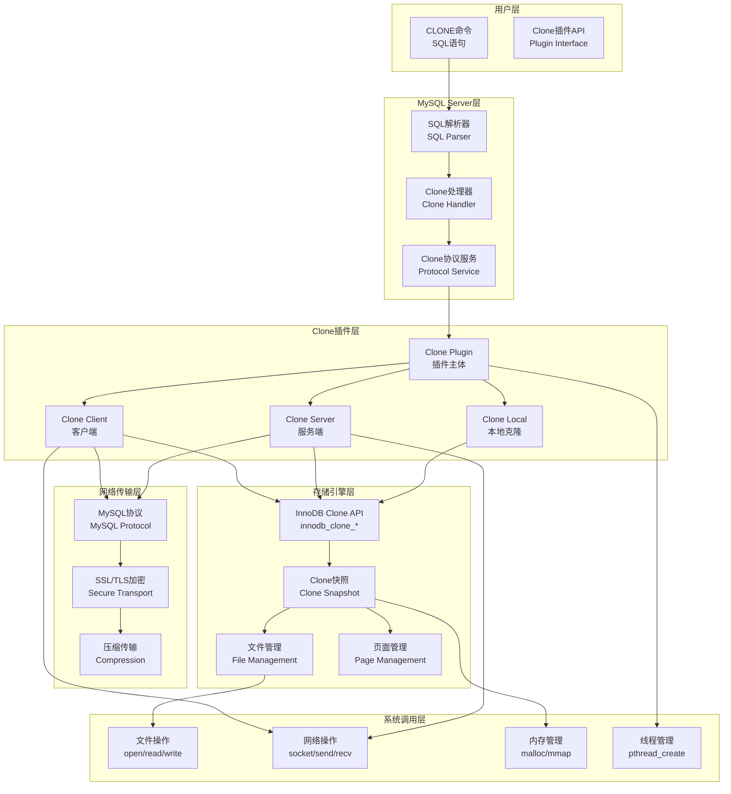
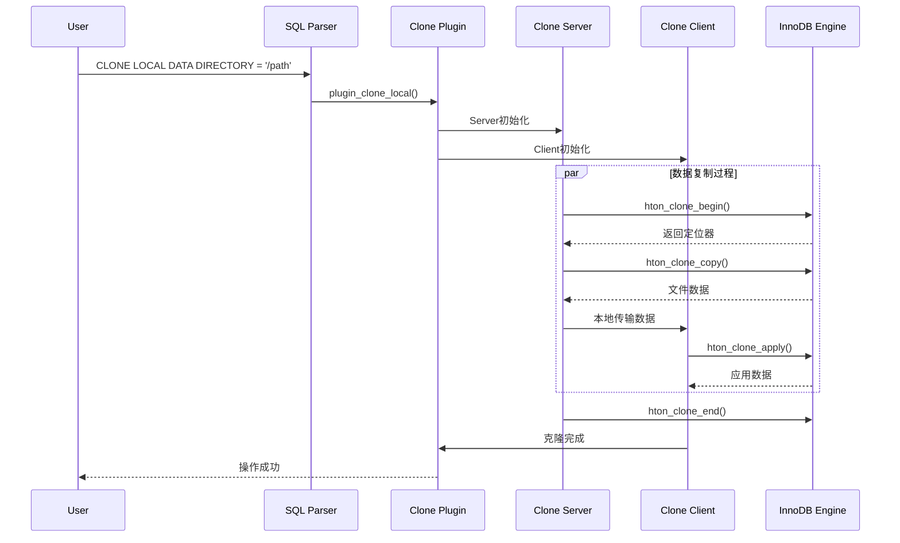
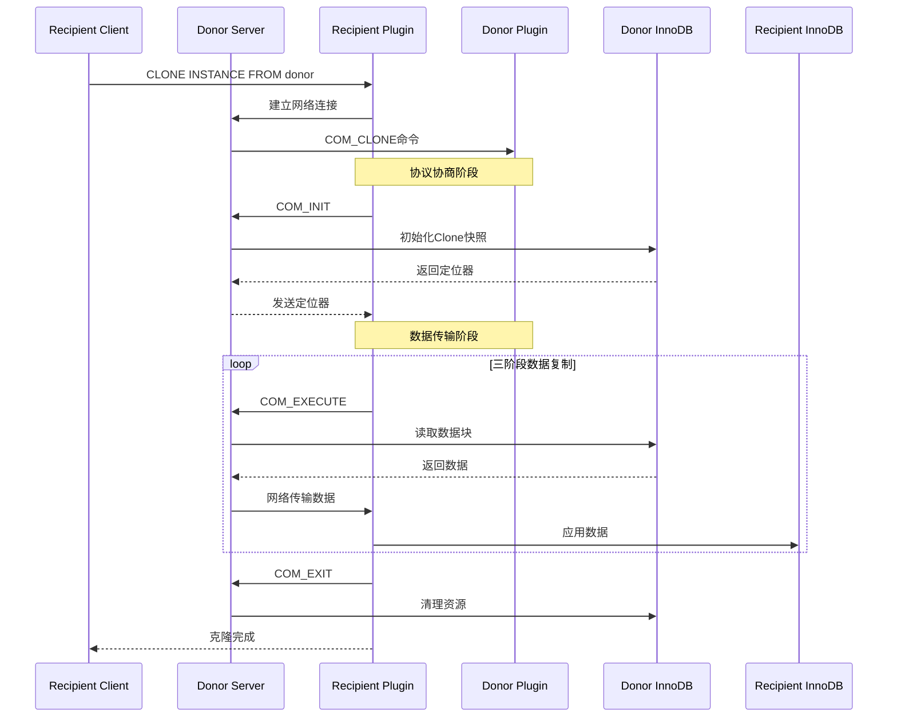
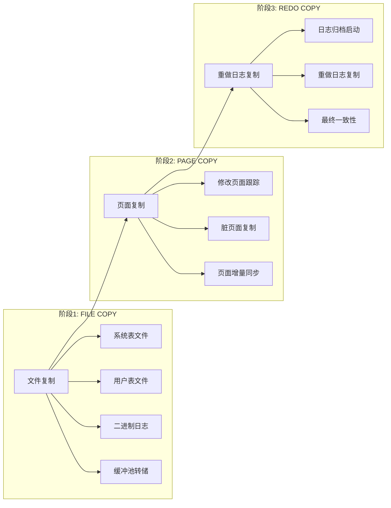
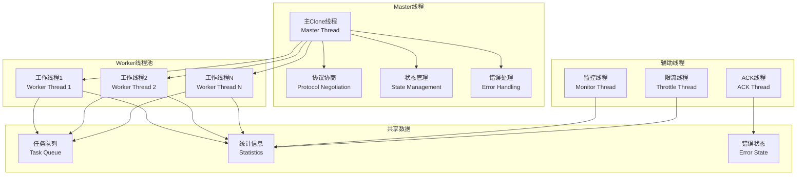
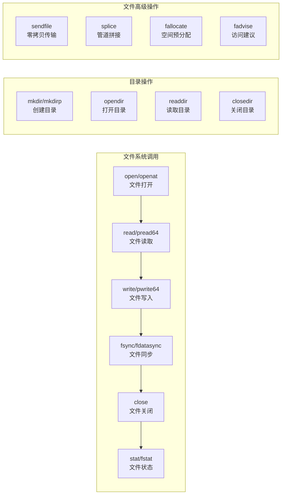
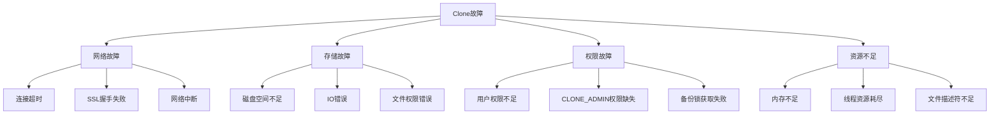

# MySQL 8.4 Clone功能深度分析

## 概述

MySQL Clone功能是MySQL 8.0引入的一项关键特性，允许用户在本地或远程复制完整的MySQL实例数据。本文档深入分析Clone的操作流程、内核实现原理、源码架构以及底层系统调用。

## MySQL Clone总体架构



## Clone操作类型与流程

### 1. Local Clone（本地克隆）



### 2. Remote Clone（远程克隆）



## Clone数据传输三阶段架构



## 核心源码实现分析

### 1. Clone插件入口点

**位置：** `plugin/clone/src/clone_plugin.cc`

```cpp
// 本地Clone操作入口
static int plugin_clone_local(THD *thd, const char *data_dir) {
  // 创建客户端共享对象
  myclone::Client_Share client_share(nullptr, 0, nullptr, nullptr, data_dir, 0);
  
  // 创建服务端对象
  myclone::Server server(thd, MYSQL_INVALID_SOCKET);
  
  // 设置性能监控键
  mysql_service_clone_protocol->mysql_clone_start_statement(
      thd, PSI_NOT_INSTRUMENTED, clone_stmt_local_key);
  
  // 创建本地Clone实例
  myclone::Local clone_inst(thd, &server, &client_share, 0, true);
  
  // 执行克隆操作
  auto error = clone_inst.clone();
  
  return (error);
}

// 远程Clone客户端操作入口
static int plugin_clone_remote_client(THD *thd, const char *remote_host,
                                      uint remote_port, const char *remote_user,
                                      const char *remote_passwd,
                                      const char *data_dir, int ssl_mode) {
  // 验证捐赠者地址
  auto error = match_valid_donor_address(thd, remote_host, remote_port);
  if (error != 0) {
    return (error);
  }
  
  // 创建客户端共享对象
  myclone::Client_Share client_share(remote_host, remote_port, remote_user,
                                     remote_passwd, data_dir, ssl_mode);
  
  // 创建客户端Clone实例
  myclone::Client clone_inst(thd, &client_share, 0, true);
  
  error = clone_inst.clone();
  
  return (error);
}
```

### 2. InnoDB存储引擎Clone接口

**位置：** `storage/innobase/clone/clone0api.cc`

```cpp
// InnoDB Clone开始接口
int innodb_clone_begin(handlerton *hton, THD *thd, const byte *&loc, 
                       uint &loc_len, uint &task_id, Ha_clone_type type,
                       Ha_clone_mode mode) {
  // 获取或创建Clone句柄
  auto clone_hdl = clone_sys->get_clone_by_index(loc, loc_len);
  
  if (clone_hdl == nullptr) {
    // 创建新的Clone句柄
    clone_hdl = clone_sys->create_clone(nullptr, type, mode, 
                                        Clone_Handle::CLONE_HDL_COPY);
    
    if (clone_hdl == nullptr) {
      return (ER_OUT_OF_RESOURCES);
    }
  }
  
  // 开始Clone操作
  auto err = clone_hdl->init(nullptr, 0);
  if (err != 0) {
    return (err);
  }
  
  // 获取定位器
  loc = clone_hdl->get_locator(loc_len);
  task_id = clone_hdl->get_task_count() - 1;
  
  return (0);
}

// InnoDB Clone复制接口
int innodb_clone_copy(handlerton *hton, THD *thd, const byte *loc, uint loc_len,
                      uint task_id, Ha_clone_cbk *cbk) {
  // 设置回调的存储引擎类型
  cbk->set_hton(hton);
  
  // 通过定位器获取Clone句柄
  auto clone_hdl = clone_sys->get_clone_by_index(loc, loc_len);
  
  auto err = clone_hdl->check_error(thd);
  if (err != 0) {
    return (err);
  }
  
  // 开始数据复制
  err = clone_hdl->copy(task_id, cbk);
  clone_hdl->save_error(err);
  
  return (err);
}
```

### 3. Clone快照管理

**位置：** `storage/innobase/clone/clone0snapshot.cc`

```cpp
// 快照状态转换
int Clone_Snapshot::change_state(Clone_Desc_State *state_desc,
                                 Snapshot_State new_state,
                                 byte *temp_buffer, uint temp_buffer_len,
                                 Ha_clone_cbk *cbk) {
  int err = 0;
  m_num_current_chunks = 0;
  
  if (!is_copy()) {
    err = init_apply_state(state_desc);
    return (err);
  }
  
  switch (new_state) {
    case CLONE_SNAPSHOT_FILE_COPY:
      ib::info(ER_IB_CLONE_OPERATION) << "Clone State BEGIN FILE COPY";
      err = init_file_copy(new_state);
      break;
      
    case CLONE_SNAPSHOT_PAGE_COPY:
      ib::info(ER_IB_CLONE_OPERATION) << "Clone State BEGIN PAGE COPY";
      err = init_page_copy(new_state, temp_buffer, temp_buffer_len);
      break;
      
    case CLONE_SNAPSHOT_REDO_COPY:
      ib::info(ER_IB_CLONE_OPERATION) << "Clone State BEGIN REDO COPY";
      err = init_redo_copy(new_state, cbk);
      break;
      
    case CLONE_SNAPSHOT_DONE:
      ib::info(ER_IB_CLONE_OPERATION) << "Clone State DONE";
      State_transit transit_guard(this, new_state);
      m_monitor.init_state(PSI_NOT_INSTRUMENTED, m_enable_pfs);
      m_redo_ctx.release();
      err = transit_guard.get_error();
      break;
  }
  return err;
}
```

## Clone网络协议实现

### 1. 协议命令定义

**位置：** `plugin/clone/include/clone.h`

```cpp
// Clone协议命令类型
typedef enum Type_Cmmand_RPC : uchar {
  COM_INIT = 1,      // 初始化Clone并协商版本
  COM_ATTACH,        // 附加到当前Clone操作
  COM_REINIT,        // 重新初始化Clone（网络错误恢复）
  COM_EXECUTE,       // 执行Clone操作
  COM_ACK,           // 发送错误或ACK数据
  COM_EXIT,          // 退出Clone协议
  COM_MAX
} Command_RPC;

// Clone协议响应类型
typedef enum Type_Command_Response : uchar {
  COM_RES_LOCS = 1,        // 远程定位器
  COM_RES_DATA_DESC,       // 远程数据描述符
  COM_RES_DATA,            // 远程数据
  COM_RES_PLUGIN,          // 插件信息
  COM_RES_CONFIG,          // 配置信息
  COM_RES_COLLATION,       // 字符集排序规则
  COM_RES_PLUGIN_V2,       // 带共享对象名的插件信息
  COM_RES_CONFIG_V3,       // 附加配置信息
  COM_RES_COMPLETE = 99,   // 响应数据结束
  COM_RES_ERROR = 100,     // 远程服务器操作错误
  COM_RES_MAX
} Command_Response;
```

### 2. 网络连接建立

**位置：** `plugin/clone/src/clone_client.cc`

```cpp
// 建立远程连接
int Client::connect_remote(bool is_restart, bool use_aux) {
  MYSQL_SOCKET conn_socket;
  mysql_clone_ssl_context ssl_context;
  
  // 设置压缩选项
  ssl_context.m_enable_compression = clone_enable_compression;
  if (ssl_context.m_enable_compression) {
    ssl_context.m_compression_algorithm = 
        clone_compression_lib_names[clone_compression_algorithm];
    ssl_context.m_compression_level = clone_zstd_compression_level;
  }
  
  // 设置SSL模式
  ssl_context.m_ssl_mode = m_share->m_ssl_mode;
  
  // 获取SSL配置参数
  Key_Values ssl_configs = {
      {"clone_ssl_key", ""}, {"clone_ssl_cert", ""}, {"clone_ssl_ca", ""}};
  auto err = mysql_service_clone_protocol->mysql_clone_get_configs(
      get_thd(), ssl_configs);
  
  if (err != 0) {
    return err;
  }
  
  // 建立连接
  m_conn = mysql_service_clone_protocol->mysql_clone_connect(
      m_server_thd, m_share->m_host, m_share->m_port, 
      m_share->m_user, m_share->m_passwd, &ssl_context, &conn_socket);
  
  if (m_conn == nullptr) {
    return ER_CLONE_DONOR;
  }
  
  m_ext_link.set_socket(conn_socket);
  return (0);
}
```

## 并发与多线程架构



### 多线程Clone实现

**位置：** `plugin/clone/src/clone_local.cc`

```cpp
// 本地Clone执行
int Local::clone_exec() {
  auto thd = m_clone_client.get_thd();
  auto dir_name = m_clone_client.get_data_dir();
  auto is_master = m_clone_client.is_master();
  auto acquire_backup_lock = (is_master && clone_block_ddl);
  auto num_workers = m_clone_client.get_max_concurrency() - 1;
  
  // 获取备份锁以阻止DDL操作
  if (acquire_backup_lock) {
    auto failed = mysql_service_mysql_backup_lock->acquire(
        thd, BACKUP_LOCK_SERVICE_DEFAULT, clone_ddl_timeout);
    
    if (failed) {
      return (ER_LOCK_WAIT_TIMEOUT);
    }
  }
  
  auto begin_mode = is_master ? HA_CLONE_MODE_START : HA_CLONE_MODE_ADD_TASK;
  
  // 开始Clone复制
  auto error = hton_clone_begin(thd, server_vector, server_tasks,
                                HA_CLONE_HYBRID, begin_mode);
  
  if (error != 0) {
    if (acquire_backup_lock) {
      mysql_service_mysql_backup_lock->release(thd);
    }
    return (error);
  }
  
  // 生成并行线程
  if (is_master) {
    // 复制服务端定位器到客户端
    client_vector = server_vector;
    
    // 开始Clone应用
    error = hton_clone_apply_begin(thd, dir_name, client_vector, 
                                   client_tasks, begin_mode);
    
    if (error != 0) {
      hton_clone_end(thd, server_vector, server_tasks, error);
      if (acquire_backup_lock) {
        mysql_service_mysql_backup_lock->release(thd);
      }
      return (error);
    }
    
    // 如果自动调优关闭，生成并发客户端任务
    if (!clone_autotune_concurrency) {
      auto to_spawn = m_clone_client.limit_workers(num_workers);
      using namespace std::placeholders;
      auto func = std::bind(clone_local, _1, m_clone_server, _2);
      m_clone_client.spawn_workers(to_spawn, func);
    }
  }
  
  // 创建回调对象进行数据复制
  Ha_clone_cbk *clone_callback = new Local_Callback(this);
  auto buffer_size = m_clone_client.limit_buffer(clone_buffer_size);
  clone_callback->set_client_buffer_size(buffer_size);
  
  // 从源复制数据并应用到目标
  error = hton_clone_copy(thd, server_vector, server_tasks, clone_callback);
  
  delete clone_callback;
  
  // 等待并发任务完成
  m_clone_client.wait_for_workers();
  
  // 结束Clone应用
  hton_clone_apply_end(thd, client_vector, client_tasks, error);
  
  // 结束Clone复制
  hton_clone_end(thd, server_vector, server_tasks, error);
  
  if (acquire_backup_lock) {
    mysql_service_mysql_backup_lock->release(thd);
  }
  
  return (error);
}
```

## MySQL Clone使用的Linux底层系统调用

### 1. 文件操作系统调用



#### 系统调用监控脚本

```bash
#!/bin/bash
# clone_syscalls_monitor.sh - 监控MySQL Clone的系统调用

echo "=== MySQL Clone 系统调用监控 ==="

# 获取MySQL进程PID
MYSQL_PID=$(pgrep -f mysqld | head -1)

if [ -z "$MYSQL_PID" ]; then
    echo "未找到MySQL进程"
    exit 1
fi

echo "监控MySQL进程: $MYSQL_PID"

# 监控文件系统调用
strace -p $MYSQL_PID -e trace=file -o clone_file_syscalls.log &
STRACE_PID=$!

echo "开始监控文件系统调用，日志文件: clone_file_syscalls.log"
echo "按Ctrl+C停止监控"

# 实时显示最频繁的系统调用
trap "kill $STRACE_PID 2>/dev/null; exit 0" INT

while true; do
    sleep 5
    if [ -f clone_file_syscalls.log ]; then
        echo "=== 最近5秒的系统调用统计 ==="
        tail -100 clone_file_syscalls.log | \
        grep -E "(open|read|write|close|fsync)" | \
        cut -d'(' -f1 | sort | uniq -c | sort -rn | head -10
    fi
done
```

### 2. 网络操作系统调用

**位置：** `sql/server_component/clone_protocol_service.cc`

```cpp
// 网络连接建立中的系统调用
MYSQL *mysql_clone_connect(THD *thd, const char *host, uint port,
                           const char *user, const char *passwd,
                           mysql_clone_ssl_context *ssl_ctx,
                           MYSQL_SOCKET *socket) {
  MYSQL *mysql = mysql_init(nullptr);
  
  if (mysql == nullptr) {
    return nullptr;
  }
  
  // 设置连接参数 - 底层使用socket()系统调用
  mysql_options(mysql, MYSQL_OPT_CONNECT_TIMEOUT, &net_read_timeout);
  mysql_options(mysql, MYSQL_OPT_READ_TIMEOUT, &net_read_timeout);
  mysql_options(mysql, MYSQL_OPT_WRITE_TIMEOUT, &net_write_timeout);
  
  // SSL配置
  if (ssl_ctx->m_ssl_mode != SSL_MODE_DISABLED) {
    mysql_ssl_set(mysql, ssl_ctx->m_ssl_key, ssl_ctx->m_ssl_cert,
                  ssl_ctx->m_ssl_ca, nullptr, nullptr);
    mysql_options(mysql, MYSQL_OPT_SSL_MODE, &ssl_ctx->m_ssl_mode);
  }
  
  // 压缩配置
  if (ssl_ctx->m_enable_compression) {
    mysql_options(mysql, MYSQL_OPT_COMPRESSION_ALGORITHMS,
                  ssl_ctx->m_compression_algorithm);
    mysql_options(mysql, MYSQL_OPT_ZSTD_COMPRESSION_LEVEL,
                  &ssl_ctx->m_compression_level);
  }
  
  // 建立连接 - 底层使用connect()系统调用
  auto ret_mysql = mysql_real_connect(mysql, host, user, passwd,
                                      nullptr, port, nullptr, 0);
  
  if (ret_mysql == nullptr) {
    char err_buf[MYSYS_ERRMSG_SIZE + 64];
    snprintf(err_buf, sizeof(err_buf), "Connect failed: %u : %s",
             mysql_errno(mysql), mysql_error(mysql));
    
    my_error(ER_CLONE_DONOR, MYF(0), err_buf);
    mysql_close(mysql);
    return nullptr;
  }
  
  NET *net = &mysql->net;
  Vio *vio = net->vio;
  
  *socket = vio->mysql_socket;
  
  // 设置网络超时 - 使用setsockopt()系统调用
  set_read_timeout(net, net_read_timeout);
  set_write_timeout(net, net_write_timeout);
  
  return mysql;
}
```

### 3. 内存管理系统调用

```cpp
// Clone中的内存分配
// 位置：storage/innobase/include/detail/ut/page_alloc.h

inline void *page_aligned_alloc(size_t n_bytes, bool populate = true) {
  void *ptr;
  
  // 使用mmap分配大页内存
  if (n_bytes >= LARGE_PAGE_SIZE) {
    ptr = mmap(nullptr, n_bytes, PROT_READ | PROT_WRITE,
               MAP_PRIVATE | MAP_ANONYMOUS | MAP_HUGETLB, -1, 0);
    
    if (ptr != MAP_FAILED) {
      // 使用madvise优化内存使用
      if (populate) {
        madvise(ptr, n_bytes, MADV_POPULATE_WRITE);
      }
      return ptr;
    }
  }
  
  // 回退到posix_memalign
  if (posix_memalign(&ptr, OS_FILE_LOG_BLOCK_SIZE, n_bytes) == 0) {
    if (populate) {
      // 预填充内存页面
      memset(ptr, 0, n_bytes);
    }
    return ptr;
  }
  
  return nullptr;
}

inline void page_aligned_free(void *ptr, size_t n_bytes) {
  if (n_bytes >= LARGE_PAGE_SIZE) {
    munmap(ptr, n_bytes);
  } else {
    free(ptr);
  }
}
```

### 4. 线程管理系统调用

**位置：** `plugin/clone/src/clone_client.cc`

```cpp
// Clone客户端工作线程创建
void Client::spawn_workers(uint32_t num_workers, 
                           std::function<void(Client_Share*, uint32_t)> func) {
  assert(is_master());
  
  for (uint32_t index = 1; index <= num_workers; ++index) {
    std::thread worker_thread([this, func, index]() {
      // 设置线程名称 - 使用pthread_setname_np系统调用
      char thread_name[16];
      snprintf(thread_name, sizeof(thread_name), "clone_work_%u", index);
      pthread_setname_np(pthread_self(), thread_name);
      
      // 设置线程优先级 - 使用setpriority系统调用
      setpriority(PRIO_PROCESS, 0, CLONE_THREAD_PRIORITY);
      
      // 执行Clone工作
      func(m_share, index);
    });
    
    // 分离线程
    worker_thread.detach();
    
    m_workers.push_back(std::move(worker_thread));
  }
}
```

## Clone性能优化与监控

### 1. 性能调优参数

```sql
-- Clone相关性能参数配置
SET GLOBAL clone_max_concurrency = 16;           -- 最大并发线程数
SET GLOBAL clone_buffer_size = 4194304;          -- Clone缓冲区大小(4MB)
SET GLOBAL clone_enable_compression = ON;        -- 启用压缩传输
SET GLOBAL clone_compression_algorithm = 'zstd'; -- 压缩算法
SET GLOBAL clone_zstd_compression_level = 3;     -- 压缩级别
SET GLOBAL clone_autotune_concurrency = ON;      -- 自动调优并发度
SET GLOBAL clone_max_data_bandwidth = 0;         -- 数据传输带宽限制(0=无限制)
SET GLOBAL clone_max_network_bandwidth = 0;      -- 网络传输带宽限制
SET GLOBAL clone_ddl_timeout = 300;              -- DDL锁超时时间
```

### 2. Clone状态监控

```sql
-- 监控Clone操作进度
SELECT 
    ID,
    STATE,
    BEGIN_TIME,
    END_TIME,
    SOURCE,
    DESTINATION,
    ERROR_NO,
    ERROR_MESSAGE,
    BINLOG_FILE,
    BINLOG_POSITION,
    GTID_EXECUTED
FROM performance_schema.clone_status;

-- 监控Clone进度详情
SELECT 
    ID,
    STAGE,
    STATE,
    BEGIN_TIME,
    END_TIME,
    THREADS,
    ESTIMATE,
    DATA,
    NETWORK,
    DATA_SPEED,
    NETWORK_SPEED
FROM performance_schema.clone_progress;
```

### 3. 系统资源监控脚本

```bash
#!/bin/bash
# clone_performance_monitor.sh - Clone性能监控脚本

echo "=== MySQL Clone 性能监控 ==="

MYSQL_PID=$(pgrep -f mysqld | head -1)
INTERVAL=5

monitor_clone_progress() {
    mysql -u root -p -e "
    SELECT 
        CONCAT('Stage: ', STAGE) as Stage,
        CONCAT('State: ', STATE) as State,
        CONCAT('Progress: ', ROUND((DATA_RECEIVED/ESTIMATE)*100, 2), '%') as Progress,
        CONCAT('Data Speed: ', ROUND(DATA_SPEED/1024/1024, 2), ' MB/s') as DataSpeed,
        CONCAT('Network Speed: ', ROUND(NETWORK_SPEED/1024/1024, 2), ' MB/s') as NetSpeed,
        CONCAT('Threads: ', THREADS) as Threads
    FROM performance_schema.clone_progress 
    WHERE ID = (SELECT MAX(ID) FROM performance_schema.clone_status);
    "
}

monitor_system_resources() {
    echo "=== 系统资源使用情况 ==="
    
    # CPU使用率
    echo "CPU使用率:"
    top -p $MYSQL_PID -n 1 -b | grep $MYSQL_PID | awk '{print "MySQL进程CPU: " $9 "%"}'
    
    # 内存使用
    echo "内存使用:"
    cat /proc/$MYSQL_PID/status | grep -E "(VmRSS|VmSize)" | \
    awk '{print $1 " " $2/1024 " MB"}'
    
    # 网络流量
    echo "网络IO:"
    cat /proc/$MYSQL_PID/net/dev | grep -E "(eth0|ens)" | \
    awk '{print "RX: " $2/1024/1024 " MB, TX: " $10/1024/1024 " MB"}'
    
    # 磁盘IO
    echo "磁盘IO:"
    iotop -p $MYSQL_PID -n 1 -q | tail -1 | \
    awk '{print "Read: " $4 ", Write: " $6}'
}

# 主监控循环
while true; do
    clear
    echo "时间: $(date)"
    echo "======================================"
    
    monitor_clone_progress
    echo ""
    monitor_system_resources
    
    echo ""
    echo "按Ctrl+C退出监控"
    sleep $INTERVAL
done
```

## Clone故障诊断与恢复

### 1. 常见故障类型



### 2. 故障恢复机制

**位置：** `plugin/clone/src/clone_client.cc`

```cpp
// Clone自动重连机制
int Client::clone() {
  bool restart = false;
  uint restart_count = 0;
  char info_mesg[128];
  
  auto num_workers = get_max_concurrency() - 1;
  
  auto err = pfs_begin_state();
  if (err != 0) {
    return (err);
  }
  
  do {
    ++restart_count;
    
    // 尝试连接远程服务器
    err = connect_remote(restart, false);
    log_error(get_thd(), true, err, "Task Connect");
    
    if (err != 0) {
      break;
    }
    
    // 建立辅助连接用于ACK
    err = connect_remote(restart, true);
    
    if (is_master()) {
      log_error(get_thd(), true, err, "Source ACK Connect");
    }
    
    if (err != 0) {
      assert(is_master());
      if (restart) {
        continue; // 继续重试
      }
      break;
    }
    
    // 确定RPC命令类型
    auto rpc_com = is_master() ? COM_INIT : COM_ATTACH;
    if (restart) {
      assert(is_master());
      rpc_com = COM_REINIT; // 重新初始化
    }
    
    // 协商Clone协议和存储引擎版本
    err = remote_command(rpc_com, false);
    
    snprintf(info_mesg, 128, "Command %s",
        is_master() ? (restart ? "COM_REINIT" : "COM_INIT") : "COM_ATTACH");
    log_error(get_thd(), true, err, &info_mesg[0]);
    
    // 如果成功，跳出重试循环
    if (err == 0) {
      break;
    }
    
    // 检查是否应该重试
    if (!should_retry(err)) {
      break;
    }
    
    restart = true;
    
  } while (restart_count < MAX_CLONE_RETRY_COUNT);
  
  return (err);
}
```

## 总结

MySQL Clone功能是一个高度复杂的系统，涵盖了：

### 🏗️ **多层架构设计**
- **插件层**：提供统一的Clone接口和协议处理
- **存储引擎层**：实现数据快照、文件管理和页面复制
- **网络传输层**：支持SSL加密、压缩传输和断点续传
- **系统调用层**：高效利用Linux内核功能

### 🔄 **三阶段数据传输**
1. **FILE COPY**：复制系统文件和用户数据文件
2. **PAGE COPY**：复制在阶段1期间修改的数据页
3. **REDO COPY**：复制重做日志确保数据一致性

### ⚡ **并发优化机制**
- 多线程并行传输提高效率
- 自适应并发度调整
- 智能限流和带宽控制
- 资源使用优化

### 🛡️ **可靠性保障**
- 自动重连和错误恢复
- 网络中断容错处理
- 数据完整性验证
- 详细的监控和诊断

### 🔧 **系统调用优化**
- 零拷贝文件传输（sendfile）
- 大页内存分配优化
- 非阻塞IO和异步处理
- NUMA感知的内存分配

MySQL Clone功能展示了现代数据库系统在分布式环境下的复杂性和精密设计，为MySQL的高可用性和可扩展性提供了重要支撑。
