# Google AlloyDB 云原生数据库架构设计与技术解析

## 1. 概述

Google AlloyDB 是 Google Cloud 在 2022 年推出的云原生 PostgreSQL 兼容数据库服务，采用**存储与计算分离**的架构设计。AlloyDB 结合了传统 OLTP 数据库的事务能力和列式存储的分析能力，提供 **4倍于标准 PostgreSQL** 的事务性能，分析查询性能提升**最高 100倍**。

## 2. 架构设计

### 2.1 整体架构

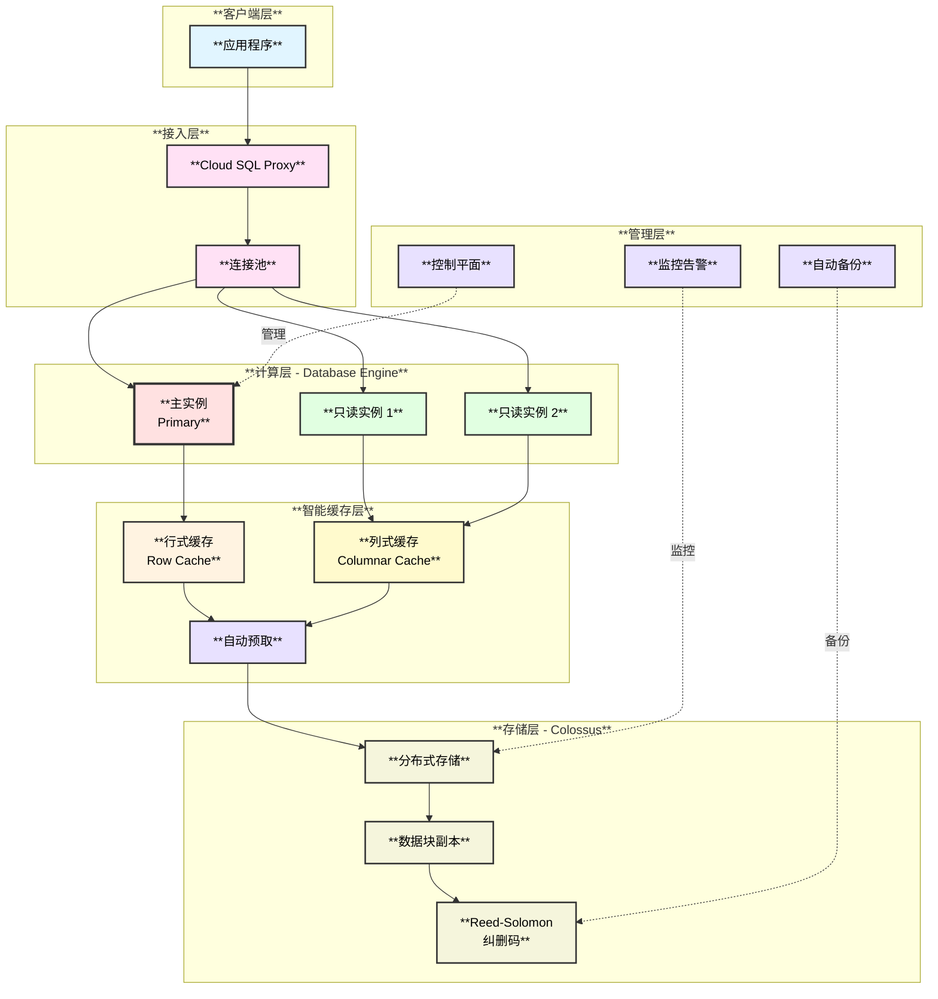

### 2.2 核心特性

- **PostgreSQL 兼容**：100% 兼容 PostgreSQL 14+
- **列式缓存引擎**：独创的 Columnar Engine，支持分析查询
- **智能存储层**：基于 Google Colossus 分布式文件系统
- **机器学习优化**：AI 驱动的查询优化和索引推荐
- **跨区域复制**：支持全球化部署

## 3. 功能设计与模块划分

### 3.1 计算层（Database Engine）

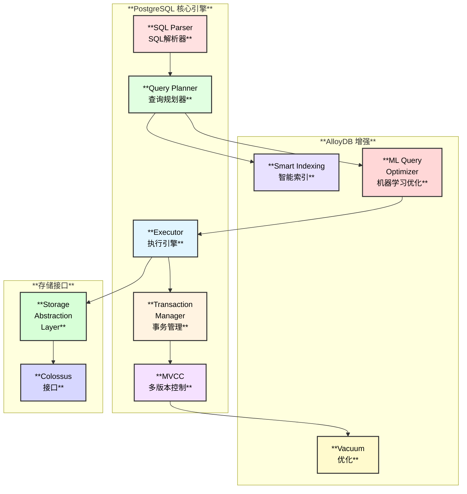

**与 PostgreSQL 的功能对比：**

| **功能模块** | **PostgreSQL** | **AlloyDB** | **优化改进** |
|------------|--------------|----------|----------|
| **SQL 解析** | ✅ | ✅ 完全兼容 | 无变化 |
| **查询优化器** | ✅ | ✅ + **ML 增强** | **AI 优化** |
| **事务管理** | ✅ ACID | ✅ ACID | 分布式优化 |
| **MVCC** | ✅ | ✅ 保留 | 性能优化 |
| **Vacuum** | ✅ 手动/自动 | ✅ **智能 Vacuum** | **大幅优化** |
| **索引** | ✅ B-Tree 等 | ✅ + **AI 推荐** | **自动优化** |
| **存储引擎** | ✅ 本地文件 | ⚠️ Colossus | **存储分离** |
| **复制** | ✅ 异步/同步 | ✅ 物理复制 | 低延迟 |
| **列式缓存** | ❌ | ✅ **Columnar Engine** | **分析加速** |

### 3.2 智能缓存层（Cache Layer）

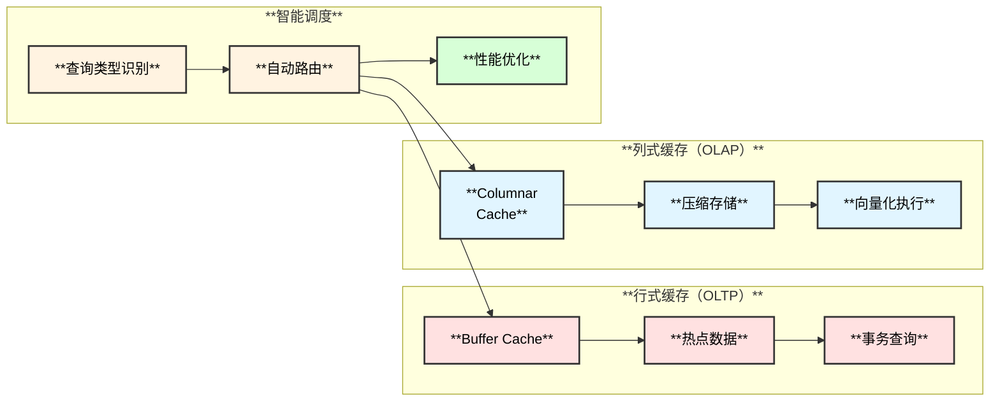

### 3.3 存储层（Colossus）

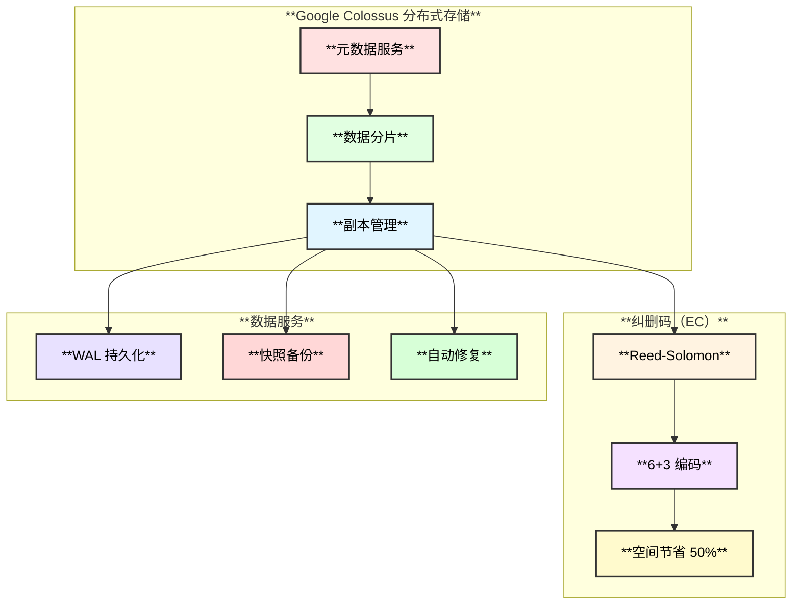

## 4. 数据交互流程

### 4.1 OLTP 写入流程

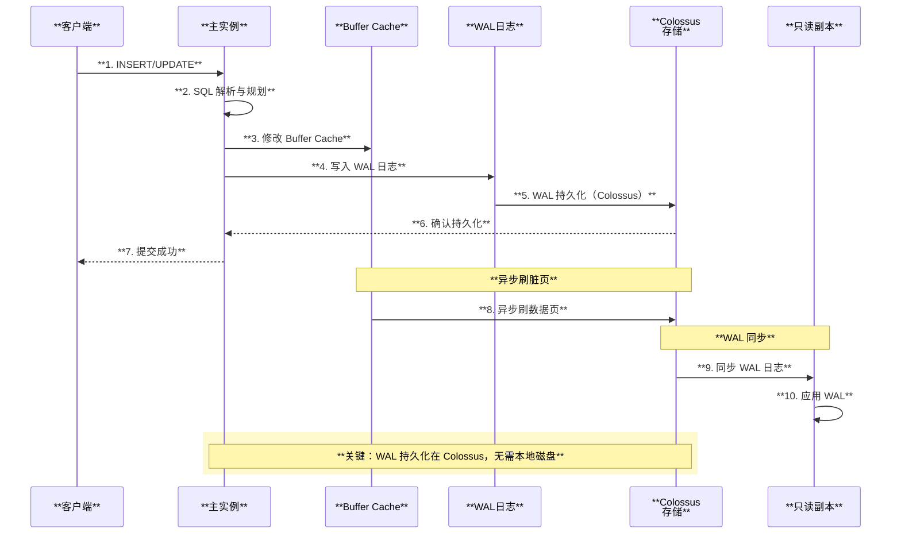

### 4.2 OLAP 读取流程（列式缓存）

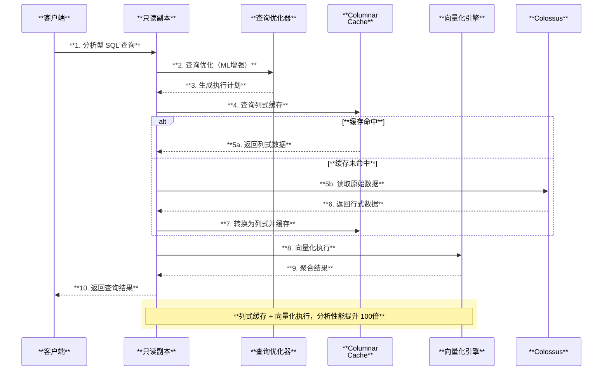

## 5. 技术创新点

### 5.1 列式缓存引擎（Columnar Engine）

```mermaid
graph TB
    subgraph "**传统行式存储**"
        A[**按行存储**]
        B[**全列扫描**]
        C[**性能瓶颈**]
    end
    
    subgraph "**AlloyDB 列式缓存**"
        D[**智能识别分析查询**]
        E[**自动转换为列式**]
        F[**压缩存储**]
        G[**向量化执行**]
        H[**性能提升 100x**]
    end
    
    A --> B
    B --> C
    
    D --> E
    E --> F
    F --> G
    G --> H
    
    style A fill:#ffd7d7,stroke:#333,stroke-width:2px,color:#000
    style B fill:#ffd7d7,stroke:#333,stroke-width:2px,color:#000
    style C fill:#ffd7d7,stroke:#333,stroke-width:3px,color:#000
    style D fill:#d7ffd7,stroke:#333,stroke-width:2px,color:#000
    style E fill:#d7ffd7,stroke:#333,stroke-width:2px,color:#000
    style F fill:#d7ffd7,stroke:#333,stroke-width:2px,color:#000
    style G fill:#d7ffd7,stroke:#333,stroke-width:2px,color:#000
    style H fill:#d7ffd7,stroke:#333,stroke-width:3px,color:#000
```

**列式缓存工作原理：**
1. **自动识别**：查询优化器识别分析型查询（如聚合、扫描）
2. **列式转换**：将行式数据转换为列式格式并缓存
3. **压缩存储**：使用列式压缩算法（如 RLE、字典编码）
4. **向量化执行**：利用 SIMD 指令并行处理
5. **透明访问**：对应用完全透明，无需修改 SQL

### 5.2 机器学习优化器

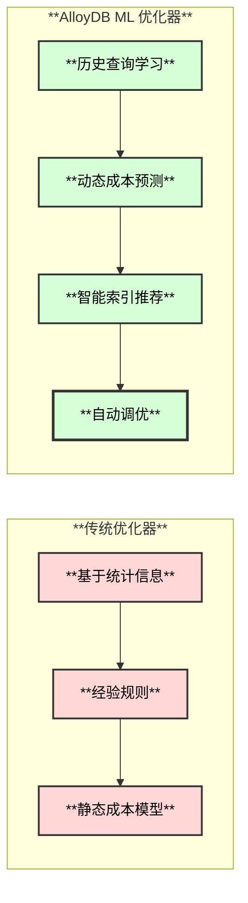

**ML 优化器功能：**
- **查询性能预测**：基于历史数据预测查询执行时间
- **索引推荐**：自动分析查询模式，推荐创建索引
- **查询重写**：自动优化低效查询
- **Vacuum 调度**：智能调度 Vacuum 任务

### 5.3 Vacuum 优化

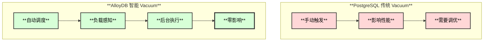

## 6. 高可用架构

### 6.1 故障检测与切换

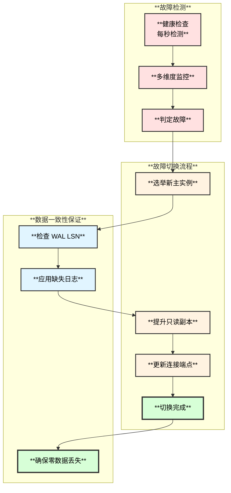

**高可用指标：**
- **RTO（恢复时间）**：< 60 秒
- **RPO（恢复点）**：= 0（无数据丢失）
- **SLA**：99.99%（标准）/ 99.999%（企业版）
- **跨区域容错**：支持

## 7. Serverless 特性

### 7.1 自动扩缩容

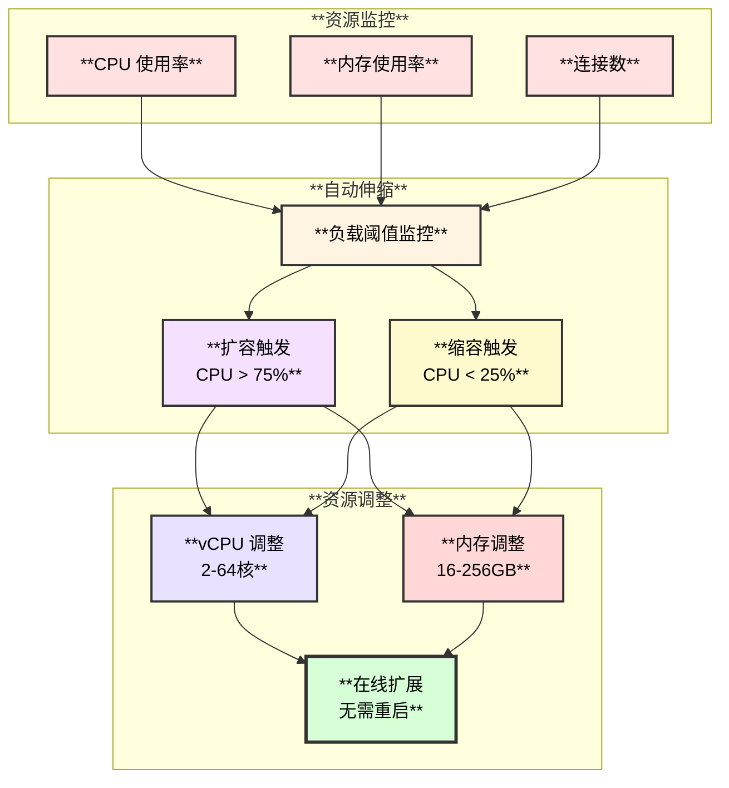

**Serverless 能力（计划中）：**
- **按需计费**：按实际使用的 vCPU·小时计费
- **自动暂停**：空闲时自动降配（最小 2vCPU）
- **快速恢复**：几秒内恢复到工作负载

## 8. PITR（时间点恢复）

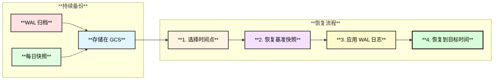

**PITR 能力：**
- **恢复粒度**：秒级
- **保留时长**：35 天（可配置）
- **恢复速度**：TB 级数据 < 1 小时
- **跨区域恢复**：支持

## 9. Binlog/WAL 订阅解决方案

### 9.1 逻辑复制支持

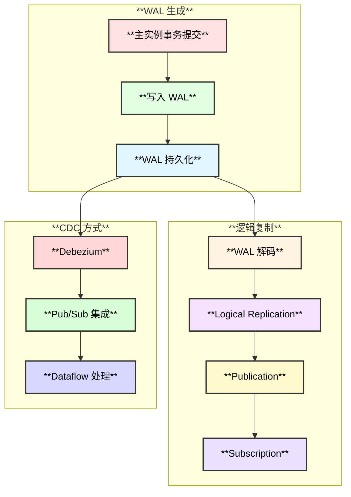

**订阅方式：**
1. **PostgreSQL 原生逻辑复制**：完全兼容
2. **Debezium CDC**：支持 Kafka 连接器
3. **Google Pub/Sub**：与 GCP 生态集成
4. **Datastream**：Google 的 CDC 服务

## 10. 计算层快速启动

### 10.1 快速恢复机制

```mermaid
graph TB
    subgraph "**传统 PostgreSQL 恢复**"
        A[**崩溃**]
        B[**扫描 WAL**]
        C[**重放日志**]
        D[**重建缓存**]
        E[**启动时间<br/>数分钟**]
    end
    
    subgraph "**AlloyDB 快速恢复**"
        F[**崩溃**]
        G[**Colossus 已有最新数据**]
        H[**轻量级恢复**]
        I[**智能预热**]
        J[**启动时间<br/>&lt; 30 秒**]
    end
    
    A --> B
    B --> C
    C --> D
    D --> E
    
    F --> G
    G --> H
    H --> I
    I --> J
    
    style A fill:#ffd7d7,stroke:#333,stroke-width:2px,color:#000
    style B fill:#ffd7d7,stroke:#333,stroke-width:2px,color:#000
    style C fill:#ffd7d7,stroke:#333,stroke-width:2px,color:#000
    style D fill:#ffd7d7,stroke:#333,stroke-width:2px,color:#000
    style E fill:#ffd7d7,stroke:#333,stroke-width:3px,color:#000
    style F fill:#d7ffd7,stroke:#333,stroke-width:2px,color:#000
    style G fill:#d7ffd7,stroke:#333,stroke-width:2px,color:#000
    style H fill:#d7ffd7,stroke:#333,stroke-width:2px,color:#000
    style I fill:#d7ffd7,stroke:#333,stroke-width:2px,color:#000
    style J fill:#d7ffd7,stroke:#333,stroke-width:3px,color:#000
```

**快速启动关键技术：**
1. **存储层持久化**：WAL 和数据都在 Colossus
2. **智能缓存预热**：ML 预测热点数据并预加载
3. **增量恢复**：只需恢复增量部分
4. **并行恢复**：多线程并行应用 WAL

## 11. 主从数据同步

### 11.1 同步机制

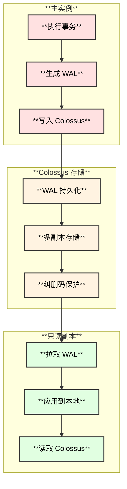

**同步的数据：**
1. **WAL 日志**：Write-Ahead Log（主要同步内容）
2. **数据页**：通过共享存储 Colossus 访问
3. **元数据**：表结构、索引等

**同步延迟：**
- **物理复制延迟**：< 100 毫秒
- **跨区域延迟**：< 1 秒

## 12. 使用场景

### 12.1 适用场景

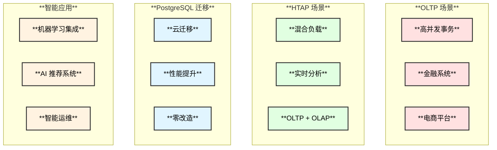

## 13. 资源成本分析

### 13.1 成本对比

| **资源维度** | **自建 PostgreSQL** | **Cloud SQL PostgreSQL** | **AlloyDB** | **AlloyDB 优势** |
|------------|-------------------|------------------------|----------|--------------|
| **CPU** | 固定配置 | 固定配置 | 动态调整 | **节省 20-30%** |
| **内存** | 固定配置 | 固定配置 | 动态调整 | **节省 20-30%** |
| **存储** | 预分配 | 预分配 | 按用量 + 纠删码 | **节省 40-50%** |
| **OLTP 性能** | 基准 | 1.5x | **4x** | **性能提升 4倍** |
| **OLAP 性能** | 基准 | 2x | **100x** | **性能提升 100倍** |
| **备份** | 额外存储 | 额外费用 | 包含在存储 | **节省 30-40%** |
| **运维** | 全人工 | 半自动 | AI 全自动 | **节省 70%+** |

### 13.2 性能成本比图表

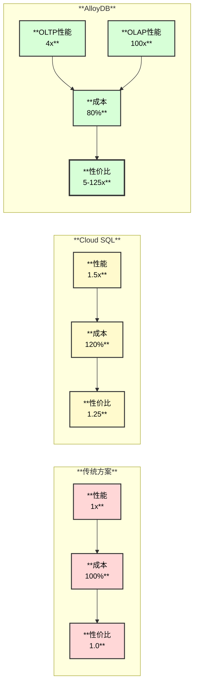

### 13.3 详细成本分析

**CPU 成本：**
- **智能调度**：AI 优化查询，减少 CPU 消耗
- **向量化执行**：SIMD 指令提升 CPU 效率
- **节省比例**：20-30%

**内存成本：**
- **智能缓存**：行式 + 列式双缓存，提高命中率
- **压缩存储**：列式压缩减少内存占用
- **节省比例**：20-30%

**磁盘成本：**
- **纠删码**：6+3 编码，节省 50% 存储空间
- **按用量计费**：无需预分配
- **智能分层**：冷热数据分离
- **节省比例**：40-50%

## 14. 核心问题解答总结

| **问题** | **AlloyDB 解决方案** | **技术关键** |
|---------|------------------|------------|
| **1. 计算层保留能力** | 完整保留 PostgreSQL 功能 | 100% 兼容 + AI 增强 |
| **2. WAL 订阅** | 完整支持逻辑复制 + Pub/Sub | PostgreSQL 原生能力 |
| **3. 主从同步** | 基于 WAL 的物理复制 | Colossus 存储 + 低延迟 |
| **4. WAL 改动** | 写入 Colossus + 纠删码保护 | 高可靠 + 低成本 |
| **5. 高可用** | 多副本 + 60秒切换 + LSN 保证 | RTO < 60s, RPO = 0 |
| **6. Serverless** | 动态扩缩容（计划中） | 按需计费 + 在线调整 |
| **7. PITR** | WAL 归档 + 快照 + 35天保留 | 秒级恢复粒度 |
| **8. 快速启动** | Colossus 存储 + 智能预热 | < 30 秒启动 |
| **9. 资源成本** | 总成本节省 20-40% | OLTP 4x, OLAP 100x 性能 |

## 15. AlloyDB 独特优势总结

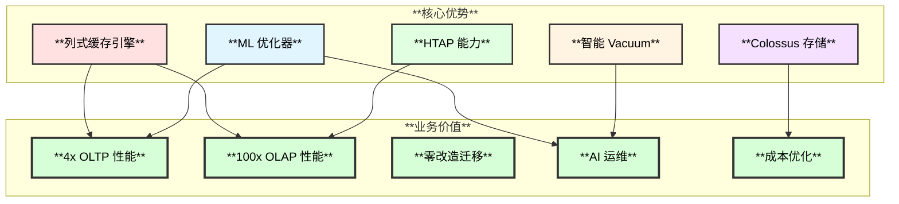

## 16. 参考资料

1. **官方文档**：
   - [AlloyDB 产品文档](https://cloud.google.com/alloydb/docs)
   - [AlloyDB 白皮书](https://cloud.google.com/alloydb/docs/resources/whitepapers)

2. **技术博客**：
   - [Introducing AlloyDB for PostgreSQL](https://cloud.google.com/blog/products/databases/introducing-alloydb-for-postgresql)
   - [AlloyDB Columnar Engine](https://cloud.google.com/blog/products/databases/alloydb-columnar-engine)

3. **最佳实践**：
   - [AlloyDB 迁移指南](https://cloud.google.com/alloydb/docs/migration)
   - [性能优化最佳实践](https://cloud.google.com/alloydb/docs/best-practices)

---

**文档版本**：v1.0  
**最后更新**：2025-11-04  
**作者**：云原生数据库技术团队

