# AWS Aurora 云原生数据库架构设计与技术解析

## 1. 概述

Amazon Aurora 是 AWS 推出的云原生关系型数据库服务，兼容 MySQL 和 PostgreSQL。Aurora 采用**Log-is-Database**的创新架构，将 Redo Log 作为数据库的核心，实现了存储与计算的彻底分离。相比 MySQL，Aurora 性能提升 5 倍，可用性达到 99.99%，存储容量自动扩展至 128TB。

**2017 SIGMOD 论文**：Aurora 的设计理念在 SIGMOD 2017 论文《Amazon Aurora: Design Considerations for High Throughput Cloud-Native Relational Databases》中有详细阐述。

## 2. 架构设计

### 2.1 整体架构

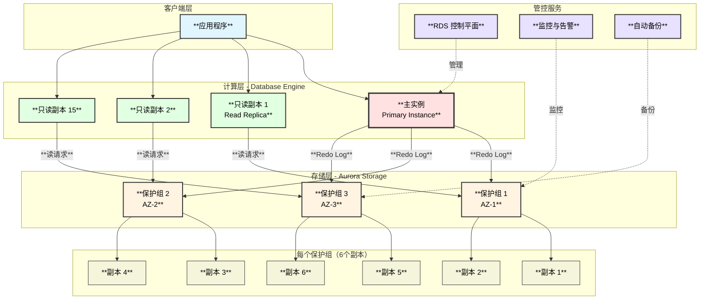
```mermaid
graph TB
    subgraph "客户端层"
        A[**应用程序**]
    end
    
    subgraph "计算层 - Database Engine"
        B[**主实例<br/>Primary Instance**]
        C[**只读副本 1<br/>Read Replica**]
        D[**只读副本 2**]
        E[**只读副本 15**]
    end
    
    subgraph "存储层 - Aurora Storage"
        F[**保护组 1<br/>AZ-1**]
        G[**保护组 2<br/>AZ-2**]
        H[**保护组 3<br/>AZ-3**]
    end
    
    subgraph "每个保护组（6个副本）"
        I[**副本 1**]
        J[**副本 2**]
        K[**副本 3**]
        L[**副本 4**]
        M[**副本 5**]
        N[**副本 6**]
    end
    
    subgraph "管控服务"
        O[**RDS 控制平面**]
        P[**监控与告警**]
        Q[**自动备份**]
    end
    
    A --> B
    A --> C
    A --> D
    A --> E
    
    B -->|**Redo Log**| F
    B -->|**Redo Log**| G
    B -->|**Redo Log**| H
    
    C -->|**读请求**| F
    D -->|**读请求**| G
    E -->|**读请求**| H
    
    F --> I
    F --> J
    G --> K
    G --> L
    H --> M
    H --> N
    
    O -.->|管理| B
    P -.->|监控| F
    Q -.->|备份| H
    
    style A fill:#e1f5ff,stroke:#333,stroke-width:2px,color:#000
    style B fill:#ffe1e1,stroke:#333,stroke-width:3px,color:#000
    style C fill:#e1ffe1,stroke:#333,stroke-width:2px,color:#000
    style D fill:#e1ffe1,stroke:#333,stroke-width:2px,color:#000
    style E fill:#e1ffe1,stroke:#333,stroke-width:2px,color:#000
    style F fill:#fff3e1,stroke:#333,stroke-width:2px,color:#000
    style G fill:#fff3e1,stroke:#333,stroke-width:2px,color:#000
    style H fill:#fff3e1,stroke:#333,stroke-width:2px,color:#000
    style I fill:#f5f5dc,stroke:#333,stroke-width:1px,color:#000
    style J fill:#f5f5dc,stroke:#333,stroke-width:1px,color:#000
    style K fill:#f5f5dc,stroke:#333,stroke-width:1px,color:#000
    style L fill:#f5f5dc,stroke:#333,stroke-width:1px,color:#000
    style M fill:#f5f5dc,stroke:#333,stroke-width:1px,color:#000
    style N fill:#f5f5dc,stroke:#333,stroke-width:1px,color:#000
    style O fill:#e8e1ff,stroke:#333,stroke-width:2px,color:#000
    style P fill:#e8e1ff,stroke:#333,stroke-width:2px,color:#000
    style Q fill:#e8e1ff,stroke:#333,stroke-width:2px,color:#000
```

### 2.2 核心特性

- **Log-is-Database**：只传输 Redo Log，存储层负责应用
- **6副本3AZ**：跨 3 个可用区的 6 个数据副本
- **Quorum 写入**：4/6 写入成功即可提交
- **Quorum 读取**：3/6 读取成功即可返回
- **10GB 分段存储**：数据按 10GB 切分为 Protection Group（PG）

### 2.3 完整程序组件架构图（从程序和功能角度）

Aurora 的完整架构由多个程序组件组成，从控制平面到数据平面，从计算层到存储层，形成了一个完整的云原生数据库系统。

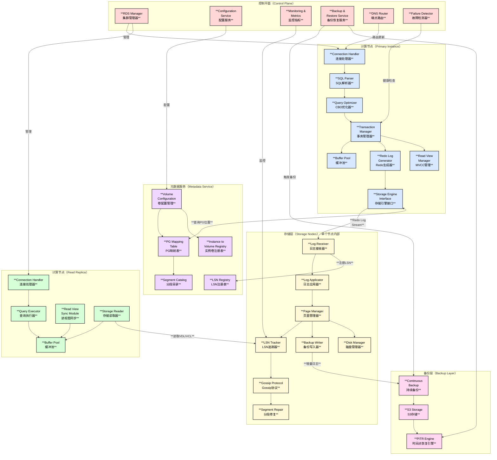
```mermaid
graph TB
    subgraph "控制平面（Control Plane）"
        CP1[**RDS Manager<br/>集群管理器**]
        CP2[**Configuration<br/>Service<br/>配置服务**]
        CP3[**Monitoring &<br/>Metrics<br/>监控指标**]
        CP4[**Backup &<br/>Restore Service<br/>备份恢复服务**]
        CP5[**DNS Router<br/>端点路由**]
        CP6[**Failure Detector<br/>故障检测器**]
    end
    
    subgraph "计算节点（Primary Instance）"
        C1[**Connection Handler<br/>连接处理器**]
        C2[**SQL Parser<br/>SQL解析器**]
        C3[**Query Optimizer<br/>CBO优化器**]
        C4[**Transaction<br/>Manager<br/>事务管理器**]
        C5[**Buffer Pool<br/>缓冲池**]
        C6[**Redo Log<br/>Generator<br/>Redo生成器**]
        C7[**Read View<br/>Manager<br/>MVCC管理**]
        C8[**Storage Engine<br/>Interface<br/>存储引擎接口**]
    end
    
    subgraph "计算节点（Read Replica）"
        R1[**Connection Handler<br/>连接处理器**]
        R2[**Query Executor<br/>查询执行器**]
        R3[**Buffer Pool<br/>缓冲池**]
        R4[**Read View<br/>Sync Module<br/>读视图同步**]
        R5[**Storage Reader<br/>存储读取器**]
    end
    
    subgraph "存储层（Storage Nodes）- 单个节点内部"
        S1[**Log Receiver<br/>日志接收器**]
        S2[**Log Applicator<br/>日志应用器**]
        S3[**Page Manager<br/>页面管理器**]
        S4[**LSN Tracker<br/>LSN追踪器**]
        S5[**Gossip Protocol<br/>Gossip协议**]
        S6[**Segment Repair<br/>分段修复**]
        S7[**Backup Writer<br/>备份写入器**]
        S8[**Disk Manager<br/>磁盘管理器**]
    end
    
    subgraph "元数据服务（Metadata Service）"
        M1[**Volume<br/>Configuration<br/>卷配置管理**]
        M2[**PG Mapping<br/>Table<br/>PG映射表**]
        M3[**Instance to<br/>Volume Registry<br/>实例卷注册表**]
        M4[**LSN Registry<br/>LSN注册表**]
        M5[**Segment Catalog<br/>分段目录**]
    end
    
    subgraph "备份层（Backup Layer）"
        B1[**Continuous<br/>Backup<br/>持续备份**]
        B2[**S3 Storage<br/>S3存储**]
        B3[**PITR Engine<br/>时间点恢复引擎**]
    end
    
    %% 控制平面连接
    CP1 -->|管理| C1
    CP1 -->|管理| R1
    CP2 -->|配置| M1
    CP3 -->|监控| S4
    CP4 -->|触发备份| B1
    CP5 -->|路由更新| C1
    CP6 -->|健康检查| C4
    
    %% 主实例内部流程
    C1 --> C2
    C2 --> C3
    C3 --> C4
    C4 --> C5
    C4 --> C6
    C4 --> C7
    C6 --> C8
    
    %% 只读副本内部流程
    R1 --> R2
    R2 --> R3
    R4 --> R3
    R5 --> R3
    
    %% 计算层到存储层
    C8 -->|**Redo Log<br/>Stream**| S1
    R5 -->|**读取VDL/VCL**| S4
    
    %% 存储节点内部流程
    S1 --> S2
    S2 --> S3
    S3 --> S4
    S4 --> S5
    S5 --> S6
    S3 --> S7
    S3 --> S8
    
    %% 元数据服务交互
    C8 <-->|**查询PG位置**| M2
    S1 -->|**注册LSN**| M4
    M1 --> M2
    M1 --> M3
    M2 --> M5
    
    %% 备份流程
    S7 -->|**增量日志**| B1
    B1 --> B2
    CP4 --> B3
    B2 --> B3
    
    style CP1 fill:#ffd7d7,stroke:#333,stroke-width:2px,color:#000
    style CP2 fill:#ffd7d7,stroke:#333,stroke-width:2px,color:#000
    style CP3 fill:#ffd7d7,stroke:#333,stroke-width:2px,color:#000
    style CP4 fill:#ffd7d7,stroke:#333,stroke-width:2px,color:#000
    style CP5 fill:#ffd7d7,stroke:#333,stroke-width:2px,color:#000
    style CP6 fill:#ffd7d7,stroke:#333,stroke-width:2px,color:#000
    
    style C1 fill:#d7e8ff,stroke:#333,stroke-width:2px,color:#000
    style C2 fill:#d7e8ff,stroke:#333,stroke-width:2px,color:#000
    style C3 fill:#d7e8ff,stroke:#333,stroke-width:2px,color:#000
    style C4 fill:#d7e8ff,stroke:#333,stroke-width:2px,color:#000
    style C5 fill:#d7e8ff,stroke:#333,stroke-width:2px,color:#000
    style C6 fill:#d7e8ff,stroke:#333,stroke-width:2px,color:#000
    style C7 fill:#d7e8ff,stroke:#333,stroke-width:2px,color:#000
    style C8 fill:#d7e8ff,stroke:#333,stroke-width:2px,color:#000
    
    style R1 fill:#d7ffd7,stroke:#333,stroke-width:2px,color:#000
    style R2 fill:#d7ffd7,stroke:#333,stroke-width:2px,color:#000
    style R3 fill:#d7ffd7,stroke:#333,stroke-width:2px,color:#000
    style R4 fill:#d7ffd7,stroke:#333,stroke-width:2px,color:#000
    style R5 fill:#d7ffd7,stroke:#333,stroke-width:2px,color:#000
    
    style S1 fill:#fff9d7,stroke:#333,stroke-width:2px,color:#000
    style S2 fill:#fff9d7,stroke:#333,stroke-width:2px,color:#000
    style S3 fill:#fff9d7,stroke:#333,stroke-width:2px,color:#000
    style S4 fill:#fff9d7,stroke:#333,stroke-width:2px,color:#000
    style S5 fill:#fff9d7,stroke:#333,stroke-width:2px,color:#000
    style S6 fill:#fff9d7,stroke:#333,stroke-width:2px,color:#000
    style S7 fill:#fff9d7,stroke:#333,stroke-width:2px,color:#000
    style S8 fill:#fff9d7,stroke:#333,stroke-width:2px,color:#000
    
    style M1 fill:#f0d7ff,stroke:#333,stroke-width:2px,color:#000
    style M2 fill:#f0d7ff,stroke:#333,stroke-width:2px,color:#000
    style M3 fill:#f0d7ff,stroke:#333,stroke-width:2px,color:#000
    style M4 fill:#f0d7ff,stroke:#333,stroke-width:2px,color:#000
    style M5 fill:#f0d7ff,stroke:#333,stroke-width:2px,color:#000
    
    style B1 fill:#ffd7f0,stroke:#333,stroke-width:2px,color:#000
    style B2 fill:#ffd7f0,stroke:#333,stroke-width:2px,color:#000
    style B3 fill:#ffd7f0,stroke:#333,stroke-width:2px,color:#000
```

#### 程序组件功能说明表

| **组件类别** | **组件名称** | **主要功能** | **关键职责** |
|------------|------------|------------|------------|
| **控制平面** | RDS Manager | 集群生命周期管理 | 创建/删除实例、故障转移、扩缩容 |
| | Configuration Service | 集群配置管理 | 存储集群配置、实例参数、网络拓扑 |
| | Monitoring & Metrics | 监控指标收集 | 收集性能指标、健康状态、生成告警 |
| | Backup & Restore Service | 备份恢复调度 | 触发备份任务、管理备份策略、执行恢复 |
| | DNS Router | 端点路由管理 | 管理Writer/Reader端点、故障时更新DNS |
| | Failure Detector | 故障检测 | 心跳检测、故障判定、触发HA切换 |
| **主实例计算层** | Connection Handler | 连接管理 | 接受客户端连接、会话管理、连接池 |
| | SQL Parser | SQL解析 | 词法分析、语法分析、生成解析树 |
| | Query Optimizer | 查询优化 | 基于成本的优化（CBO）、执行计划生成 |
| | Transaction Manager | 事务管理 | 事务状态管理、MVCC、锁管理 |
| | Buffer Pool | 缓冲池管理 | 数据页缓存、LRU淘汰、脏页管理 |
| | Redo Log Generator | Redo日志生成 | 生成物理Redo日志、批量压缩、流式发送 |
| | Read View Manager | 读视图管理 | MVCC快照管理、版本可见性判断 |
| | Storage Engine Interface | 存储引擎接口 | 与存储层通信、Redo发送、页面请求 |
| **只读副本计算层** | Connection Handler | 连接管理 | 接受只读查询连接 |
| | Query Executor | 查询执行 | 执行SELECT查询、返回结果集 |
| | Buffer Pool | 缓冲池 | 缓存数据页、提高读性能 |
| | Read View Sync Module | 读视图同步 | 从存储层同步最新LSN、保证读一致性 |
| | Storage Reader | 存储读取器 | 从存储层读取数据页、查询VDL/VCL |
| **存储节点** | Log Receiver | 日志接收 | 接收主实例发送的Redo日志流 |
| | Log Applicator | 日志应用 | 应用Redo日志到数据页、后台异步执行 |
| | Page Manager | 页面管理 | 数据页存储、页面组织、页面检索 |
| | LSN Tracker | LSN追踪 | 维护VDL/VCL、跟踪日志应用进度 |
| | Gossip Protocol | Gossip协议 | 节点间通信、元数据同步、健康检查 |
| | Segment Repair | 分段修复 | 检测损坏分段、从其他副本恢复 |
| | Backup Writer | 备份写入 | 将日志增量写入S3、支持PITR |
| | Disk Manager | 磁盘管理 | 磁盘I/O、空间分配、数据持久化 |
| **元数据服务** | Volume Configuration | 卷配置管理 | 管理Aurora卷（Volume）配置 |
| | PG Mapping Table | PG映射表 | 存储PG到存储节点的映射关系 |
| | Instance to Volume Registry | 实例卷注册 | 记录实例ID到Volume ID的映射 |
| | LSN Registry | LSN注册表 | 存储每个Volume的最新LSN |
| | Segment Catalog | 分段目录 | 管理所有PG的元数据、副本位置 |
| **备份层** | Continuous Backup | 持续备份 | 持续收集增量日志、流式备份到S3 |
| | S3 Storage | S3存储 | 长期存储备份数据、提供高持久性 |
| | PITR Engine | PITR引擎 | 时间点恢复、LSN到时间映射、恢复执行 |

#### 关键交互流程说明

1. **写入流程**：
   - 客户端 → Connection Handler → SQL Parser → Query Optimizer → Transaction Manager
   - Transaction Manager → Redo Log Generator（生成Redo）
   - Redo Log Generator → Storage Engine Interface → Storage Nodes（发送Redo到6个副本）
   - Storage Nodes（4/6 Quorum确认）→ Transaction Manager → 客户端（提交成功）

2. **读取流程（只读副本）**：
   - 客户端 → Read Replica Connection Handler → Query Executor
   - Query Executor → Buffer Pool（检查缓存）
   - 如未命中：Storage Reader → Storage Nodes（读取页面）
   - Storage Reader 先查询 VDL/VCL，确保读取一致性视图

3. **元数据查询流程**：
   - Storage Engine Interface 需要写入Redo时，先查询 PG Mapping Table
   - PG Mapping Table 返回目标PG所在的6个存储节点地址
   - Storage Engine Interface 并行发送Redo到6个节点

4. **故障检测与切换**：
   - Failure Detector 持续心跳检查主实例
   - 检测到故障 → 触发 RDS Manager
   - RDS Manager 选择最新LSN的只读副本 → 提升为主实例
   - DNS Router 更新Writer端点 → 客户端自动路由到新主实例

5. **备份与恢复**：
   - 存储节点的 Backup Writer 持续将增量Redo发送到 S3
   - 需要PITR时：PITR Engine 根据目标时间计算LSN
   - PITR Engine 从S3加载基础快照 + 应用增量日志到目标LSN

### 2.4 Protection Group（PG）设计详解

Protection Group（PG）是 Aurora 存储层的核心设计单元，理解 PG 的设计对于理解 Aurora 的存储架构至关重要。

#### 2.4.1 为什么PG大小是10GB？

Aurora 选择 10GB 作为 PG 的大小，这是一个经过精心设计的权衡：

| **考虑因素** | **说明** | **10GB的优势** |
|------------|---------|--------------|
| **故障恢复速度** | PG 是故障恢复的基本单位 | 10GB 可在 10 秒内从其他副本恢复（1Gbps网络）|
| **并行度** | 多个 PG 可并行处理 | 128TB卷包含 ~13,000 个PG，高度并行 |
| **元数据开销** | 每个PG需要维护元数据 | 10GB 平衡了元数据量和管理粒度 |
| **Gossip 协议效率** | PG间需要 Gossip 通信 | 较大的PG减少Gossip消息数量 |
| **MTTR（平均修复时间）** | 影响可用性 SLA | 10GB 确保 MTTR < 30 秒 |
| **热点分散** | 避免单个PG成为瓶颈 | 数据分散到多个PG，负载均衡 |

**计算示例**：
- 假设网络带宽 1 Gbps = 125 MB/s
- 恢复 10GB 数据：10,000 MB ÷ 125 MB/s = 80 秒
- 考虑压缩和增量修复，实际恢复时间 < 30 秒
- 满足 Aurora 的 99.99% 可用性承诺（年停机时间 < 52.6 分钟）

#### 2.4.2 Redo 和 Page 的存储方式

在 Aurora 中，**Redo 和 Page 是分开存储的**，这是 Log-is-Database 架构的核心：

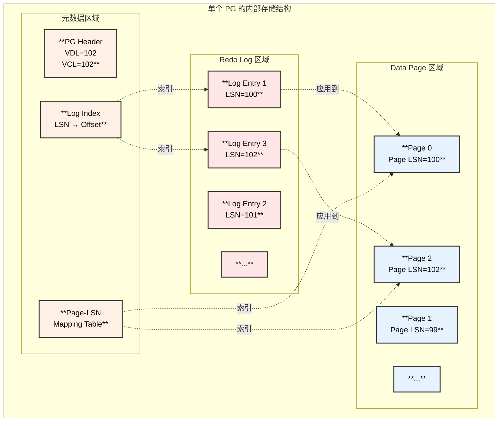
```mermaid
graph TB
    subgraph "单个 PG 的内部存储结构"
        subgraph "Redo Log 区域"
            L1[**Log Entry 1<br/>LSN=100**]
            L2[**Log Entry 2<br/>LSN=101**]
            L3[**Log Entry 3<br/>LSN=102**]
            L4[**...**]
        end
        
        subgraph "Data Page 区域"
            P1[**Page 0<br/>Page LSN=100**]
            P2[**Page 1<br/>Page LSN=99**]
            P3[**Page 2<br/>Page LSN=102**]
            P4[**...**]
        end
        
        subgraph "元数据区域"
            M1[**PG Header<br/>VDL=102<br/>VCL=102**]
            M2[**Page-LSN<br/>Mapping Table**]
            M3[**Log Index<br/>LSN → Offset**]
        end
    end
    
    L1 -.->|应用到| P1
    L3 -.->|应用到| P3
    M2 -.->|索引| P1
    M2 -.->|索引| P3
    M3 -.->|索引| L1
    M3 -.->|索引| L3
    
    style L1 fill:#ffe6e6,stroke:#333,stroke-width:2px,color:#000
    style L2 fill:#ffe6e6,stroke:#333,stroke-width:2px,color:#000
    style L3 fill:#ffe6e6,stroke:#333,stroke-width:2px,color:#000
    style L4 fill:#ffe6e6,stroke:#333,stroke-width:2px,color:#000
    
    style P1 fill:#e6f3ff,stroke:#333,stroke-width:2px,color:#000
    style P2 fill:#e6f3ff,stroke:#333,stroke-width:2px,color:#000
    style P3 fill:#e6f3ff,stroke:#333,stroke-width:2px,color:#000
    style P4 fill:#e6f3ff,stroke:#333,stroke-width:2px,color:#000
    
    style M1 fill:#fff0e6,stroke:#333,stroke-width:2px,color:#000
    style M2 fill:#fff0e6,stroke:#333,stroke-width:2px,color:#000
    style M3 fill:#fff0e6,stroke:#333,stroke-width:2px,color:#000
```

**存储方式说明**：

1. **Redo Log 区域**：
   - 存储格式：顺序追加（Append-Only）
   - 数据结构：`<LSN, Log Type, Page ID, Offset, Data>`
   - 保留策略：保留到所有页面都应用完该日志（Page LSN >= Log LSN）
   - 写入模式：主实例直接写入，6个副本并行接收

2. **Data Page 区域**：
   - 存储格式：随机访问（Random Access）
   - 数据结构：每个 Page 16KB，包含 Page Header（含 Page LSN）
   - 更新策略：后台异步应用 Redo，延迟物化（Lazy Materialization）
   - 读取模式：如果 Page LSN < VDL，需要先应用缺失的 Redo

3. **为什么分开存储**？
   - **减少写放大**：只写Redo（几十字节），不写完整页面（16KB）
   - **并行处理**：Redo 写入和 Page 物化可异步并行
   - **快速提交**：事务只需等待 Redo 持久化（4/6 Quorum）
   - **延迟物化**：Page 更新可延后到空闲时进行，减少延迟

#### 2.4.3 元数据服务与 PG 关联逻辑

Aurora 使用专门的**元数据服务**来管理 PG 与实例、卷的关联关系。

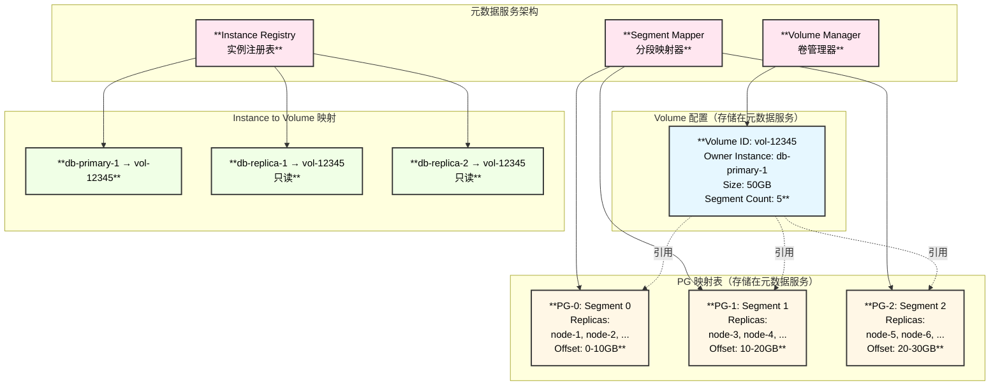
```mermaid
graph TB
    subgraph "元数据服务架构"
        MS1[**Volume Manager<br/>卷管理器**]
        MS2[**Segment Mapper<br/>分段映射器**]
        MS3[**Instance Registry<br/>实例注册表**]
    end
    
    subgraph "Volume 配置（存储在元数据服务）"
        V1[**Volume ID: vol-12345<br/>Owner Instance: db-primary-1<br/>Size: 50GB<br/>Segment Count: 5**]
    end
    
    subgraph "PG 映射表（存储在元数据服务）"
        PG1[**PG-0: Segment 0<br/>Replicas:<br/>node-1, node-2, ...<br/>Offset: 0-10GB**]
        PG2[**PG-1: Segment 1<br/>Replicas:<br/>node-3, node-4, ...<br/>Offset: 10-20GB**]
        PG3[**PG-2: Segment 2<br/>Replicas:<br/>node-5, node-6, ...<br/>Offset: 20-30GB**]
    end
    
    subgraph "Instance to Volume 映射"
        I1[**db-primary-1 → vol-12345**]
        I2[**db-replica-1 → vol-12345<br/>只读**]
        I3[**db-replica-2 → vol-12345<br/>只读**]
    end
    
    MS1 --> V1
    MS2 --> PG1
    MS2 --> PG2
    MS2 --> PG3
    MS3 --> I1
    MS3 --> I2
    MS3 --> I3
    V1 -.->|引用| PG1
    V1 -.->|引用| PG2
    V1 -.->|引用| PG3
    
    style MS1 fill:#ffe6f0,stroke:#333,stroke-width:2px,color:#000
    style MS2 fill:#ffe6f0,stroke:#333,stroke-width:2px,color:#000
    style MS3 fill:#ffe6f0,stroke:#333,stroke-width:2px,color:#000
    style V1 fill:#e6f7ff,stroke:#333,stroke-width:2px,color:#000
    style PG1 fill:#fff7e6,stroke:#333,stroke-width:2px,color:#000
    style PG2 fill:#fff7e6,stroke:#333,stroke-width:2px,color:#000
    style PG3 fill:#fff7e6,stroke:#333,stroke-width:2px,color:#000
    style I1 fill:#f0ffe6,stroke:#333,stroke-width:2px,color:#000
    style I2 fill:#f0ffe6,stroke:#333,stroke-width:2px,color:#000
    style I3 fill:#f0ffe6,stroke:#333,stroke-width:2px,color:#000
```

**关联逻辑详解**：

| **元数据层级** | **数据结构** | **存储内容** | **查询场景** |
|------------|------------|------------|------------|
| **Volume 配置** | Volume Descriptor | Volume ID、大小、所属实例、创建时间、Segment 列表 | 创建实例时分配 Volume |
| **PG 映射表** | Segment Mapping Table | PG ID、所属 Volume、副本节点列表（6个）、偏移量范围 | 写入 Redo 时查找目标节点 |
| **Instance 注册表** | Instance Registry | Instance ID、Volume ID、角色（Primary/Replica）、状态 | 故障切换时更新角色 |
| **LSN 注册表** | LSN Registry | Volume ID、VDL（持久化LSN）、每个PG的本地LSN | 只读副本查询 VDL |
| **节点健康表** | Node Health Table | 节点ID、健康状态、最后心跳时间、负载 | 选择副本节点时负载均衡 |

**写入 Redo 或读取 Page 时的查找流程**：

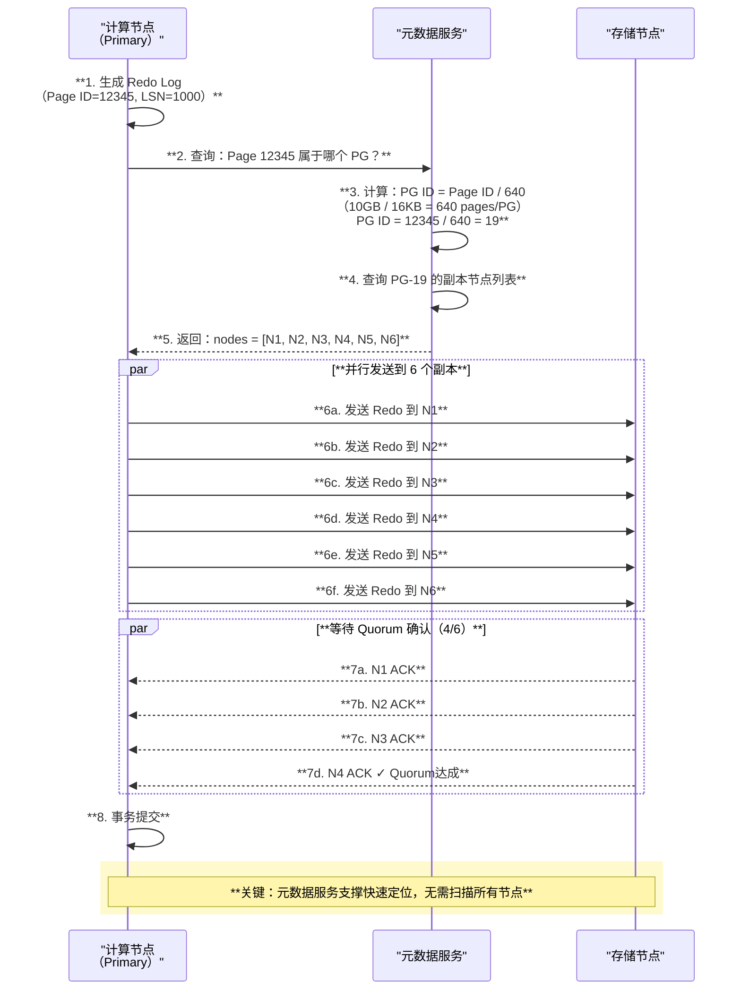
```mermaid
sequenceDiagram
    participant C as "计算节点<br/>（Primary）"
    participant M as "元数据服务"
    participant S as "存储节点"
    
    C->>C: **1. 生成 Redo Log<br/>（Page ID=12345, LSN=1000）**
    
    C->>M: **2. 查询：Page 12345 属于哪个 PG？**
    M->>M: **3. 计算：PG ID = Page ID / 640<br/>（10GB / 16KB = 640 pages/PG）<br/>PG ID = 12345 / 640 = 19**
    M->>M: **4. 查询 PG-19 的副本节点列表**
    M-->>C: **5. 返回：nodes = [N1, N2, N3, N4, N5, N6]**
    
    par **并行发送到 6 个副本**
        C->>S: **6a. 发送 Redo 到 N1**
        C->>S: **6b. 发送 Redo 到 N2**
        C->>S: **6c. 发送 Redo 到 N3**
        C->>S: **6d. 发送 Redo 到 N4**
        C->>S: **6e. 发送 Redo 到 N5**
        C->>S: **6f. 发送 Redo 到 N6**
    end
    
    par **等待 Quorum 确认（4/6）**
        S-->>C: **7a. N1 ACK**
        S-->>C: **7b. N2 ACK**
        S-->>C: **7c. N3 ACK**
        S-->>C: **7d. N4 ACK ✓ Quorum达成**
    end
    
    C->>C: **8. 事务提交**
    
    rect rgb(255, 250, 205)
    Note over C,S: **关键：元数据服务支撑快速定位，无需扫描所有节点**
    end
```

#### 2.4.4 PG 的跨集群共享机制

**Aurora 的 PG 不是跨集群共享的**，这是一个重要的架构设计决策：

| **方面** | **Aurora 的设计** | **原因** |
|---------|----------------|---------|
| **Volume 隔离** | 每个 Aurora 集群有独立的 Volume | 保证租户隔离，避免"noisy neighbor"问题 |
| **PG 归属** | PG 严格属于单个 Volume | 简化元数据管理，避免复杂的共享协议 |
| **存储节点** | 存储节点可承载多个不同 Volume 的 PG | 物理资源共享，但逻辑隔离 |
| **跨区域复制** | 通过 Aurora Global Database 实现 | 不同区域是完全独立的 Volume |

**存储节点的多租户架构**：

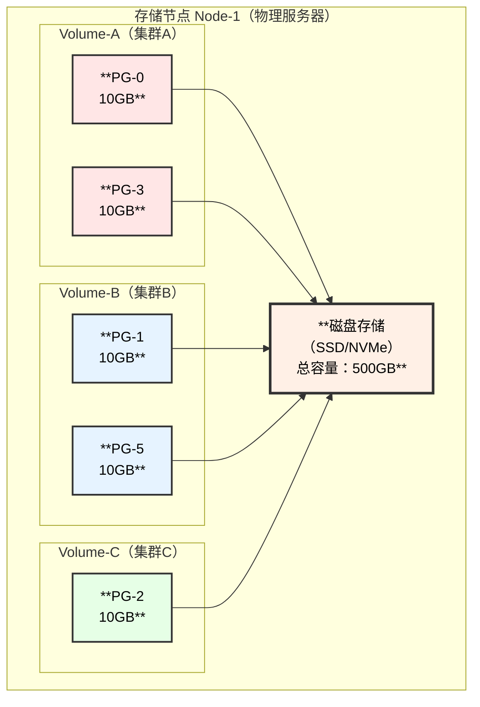
```mermaid
graph TB
    subgraph "存储节点 Node-1（物理服务器）"
        subgraph "Volume-A（集群A）"
            PA1[**PG-0<br/>10GB**]
            PA2[**PG-3<br/>10GB**]
        end
        
        subgraph "Volume-B（集群B）"
            PB1[**PG-1<br/>10GB**]
            PB2[**PG-5<br/>10GB**]
        end
        
        subgraph "Volume-C（集群C）"
            PC1[**PG-2<br/>10GB**]
        end
        
        D[**磁盘存储<br/>（SSD/NVMe）<br/>总容量：500GB**]
    end
    
    PA1 --> D
    PA2 --> D
    PB1 --> D
    PB2 --> D
    PC1 --> D
    
    style PA1 fill:#ffe6e6,stroke:#333,stroke-width:2px,color:#000
    style PA2 fill:#ffe6e6,stroke:#333,stroke-width:2px,color:#000
    style PB1 fill:#e6f3ff,stroke:#333,stroke-width:2px,color:#000
    style PB2 fill:#e6f3ff,stroke:#333,stroke-width:2px,color:#000
    style PC1 fill:#e6ffe6,stroke:#333,stroke-width:2px,color:#000
    style D fill:#fff0e6,stroke:#333,stroke-width:3px,color:#000
```

**隔离保证机制**：

1. **I/O 隔离**：每个 Volume 有独立的 I/O 配额（IOPS、吞吐量）
2. **CPU 隔离**：通过 cgroup 限制不同 Volume 的 PG 的 CPU 使用
3. **内存隔离**：每个 Volume 的 PG 有独立的缓存区
4. **网络隔离**：通过 VPC 和安全组实现网络隔离

**元数据管理模块总结**：

Aurora 的元数据管理模块（Configuration Service）维护了三层映射关系：
1. **Instance → Volume**：哪个实例使用哪个Volume
2. **Volume → PG List**：Volume 包含哪些 PG
3. **PG → Storage Nodes**：PG 的 6 个副本分别在哪些节点

这种设计确保了：
- **快速定位**：O(1) 时间复杂度找到目标存储节点
- **动态扩展**：Volume 增长时自动分配新 PG
- **故障隔离**：单个 Volume 或 PG 的问题不影响其他租户
- **负载均衡**：智能分配 PG 到负载较低的存储节点

## 3. 功能设计与模块划分

### 3.1 计算层（Database Engine）

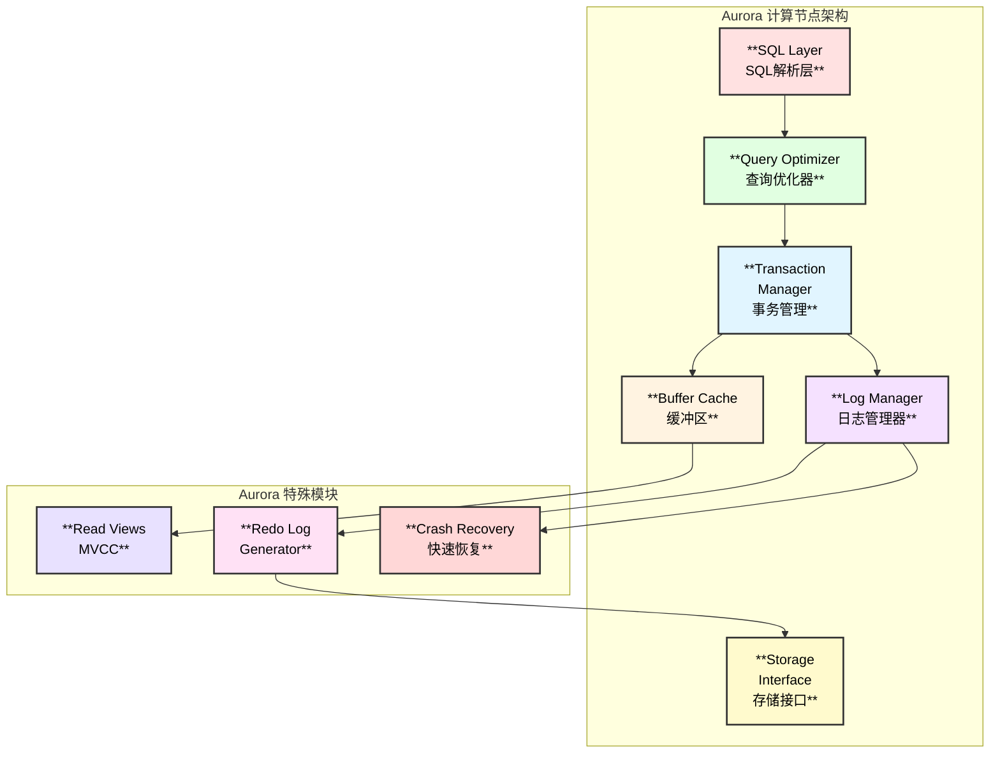
```mermaid
graph TB
    subgraph "Aurora 计算节点架构"
        A[**SQL Layer<br/>SQL解析层**]
        B[**Query Optimizer<br/>查询优化器**]
        C[**Transaction<br/>Manager<br/>事务管理**]
        D[**Buffer Cache<br/>缓冲区**]
        E[**Log Manager<br/>日志管理器**]
        F[**Storage<br/>Interface<br/>存储接口**]
    end
    
    subgraph "Aurora 特殊模块"
        G[**Redo Log<br/>Generator**]
        H[**Read Views<br/>MVCC**]
        I[**Crash Recovery<br/>快速恢复**]
    end
    
    A --> B
    B --> C
    C --> D
    C --> E
    E --> G
    G --> F
    
    D --> H
    E --> I
    
    style A fill:#ffe1e1,stroke:#333,stroke-width:2px,color:#000
    style B fill:#e1ffe1,stroke:#333,stroke-width:2px,color:#000
    style C fill:#e1f5ff,stroke:#333,stroke-width:2px,color:#000
    style D fill:#fff3e1,stroke:#333,stroke-width:2px,color:#000
    style E fill:#f5e1ff,stroke:#333,stroke-width:2px,color:#000
    style F fill:#fffacd,stroke:#333,stroke-width:2px,color:#000
    style G fill:#ffe1f5,stroke:#333,stroke-width:2px,color:#000
    style H fill:#e8e1ff,stroke:#333,stroke-width:2px,color:#000
    style I fill:#ffd7d7,stroke:#333,stroke-width:2px,color:#000
```

**与 MySQL 的功能对比：**

| **功能模块** | **MySQL 5.7/8.0** | **Aurora** | **差异说明** |
|------------|-----------------|---------|----------|
| **SQL 解析** | ✅ | ✅ 完全兼容 | 无变化 |
| **查询优化器** | ✅ | ✅ 保留 + 增强 | 增加存储层下推 |
| **事务管理** | ✅ ACID | ✅ ACID | 分布式事务优化 |
| **InnoDB 引擎** | ✅ | ✅ 高度兼容 | 存储层重构 |
| **Buffer Pool** | ✅ | ✅ 改为 Buffer Cache | 功能相同 |
| **Redo Log** | ✅ 本地写入 | ⚠️ **网络发送** | **核心变化** |
| **数据页刷盘** | ✅ 定期刷盘 | ❌ **存储层负责** | **关键优化** |
| **Binlog** | ✅ | ✅ 兼容 | 可选开启 |
| **主从复制** | ✅ 异步/半同步 | ⚠️ 物理复制 | 基于 Redo Log |

### 3.2 存储层（Aurora Storage）

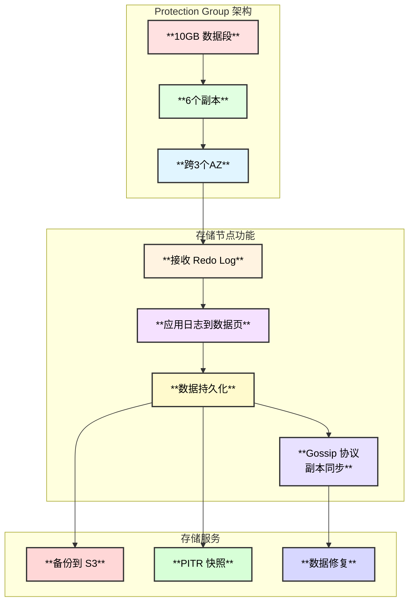
```mermaid
graph TB
    subgraph "Protection Group 架构"
        A[**10GB 数据段**]
        B[**6个副本**]
        C[**跨3个AZ**]
    end
    
    subgraph "存储节点功能"
        D[**接收 Redo Log**]
        E[**应用日志到数据页**]
        F[**数据持久化**]
        G[**Gossip 协议<br/>副本同步**]
    end
    
    subgraph "存储服务"
        H[**备份到 S3**]
        I[**PITR 快照**]
        J[**数据修复**]
    end
    
    A --> B
    B --> C
    
    C --> D
    D --> E
    E --> F
    F --> G
    
    F --> H
    F --> I
    G --> J
    
    style A fill:#ffe1e1,stroke:#333,stroke-width:2px,color:#000
    style B fill:#e1ffe1,stroke:#333,stroke-width:2px,color:#000
    style C fill:#e1f5ff,stroke:#333,stroke-width:2px,color:#000
    style D fill:#fff3e1,stroke:#333,stroke-width:2px,color:#000
    style E fill:#f5e1ff,stroke:#333,stroke-width:2px,color:#000
    style F fill:#fffacd,stroke:#333,stroke-width:2px,color:#000
    style G fill:#e8e1ff,stroke:#333,stroke-width:2px,color:#000
    style H fill:#ffd7d7,stroke:#333,stroke-width:2px,color:#000
    style I fill:#d7ffd7,stroke:#333,stroke-width:2px,color:#000
    style J fill:#d7d7ff,stroke:#333,stroke-width:2px,color:#000
```

#### 3.2.1 存储节点内部架构详解

每个 Aurora 存储节点是一个功能完整的分布式存储单元，内部包含多个模块协同工作。

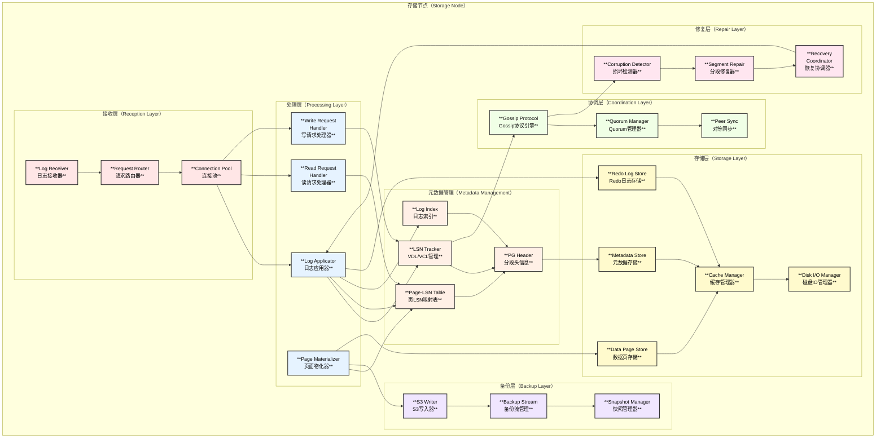
```mermaid
graph TB
    subgraph "存储节点（Storage Node）"
        subgraph "接收层（Reception Layer）"
            R1[**Log Receiver<br/>日志接收器**]
            R2[**Request Router<br/>请求路由器**]
            R3[**Connection Pool<br/>连接池**]
        end
        
        subgraph "处理层（Processing Layer）"
            P1[**Log Applicator<br/>日志应用器**]
            P2[**Page Materializer<br/>页面物化器**]
            P3[**Read Request<br/>Handler<br/>读请求处理器**]
            P4[**Write Request<br/>Handler<br/>写请求处理器**]
        end
        
        subgraph "元数据管理（Metadata Management）"
            M1[**LSN Tracker<br/>VDL/VCL管理**]
            M2[**Page-LSN Table<br/>页LSN映射表**]
            M3[**Log Index<br/>日志索引**]
            M4[**PG Header<br/>分段头信息**]
        end
        
        subgraph "协调层（Coordination Layer）"
            C1[**Gossip Protocol<br/>Gossip协议引擎**]
            C2[**Quorum Manager<br/>Quorum管理器**]
            C3[**Peer Sync<br/>对等同步**]
        end
        
        subgraph "修复层（Repair Layer）"
            RP1[**Segment Repair<br/>分段修复器**]
            RP2[**Corruption Detector<br/>损坏检测器**]
            RP3[**Recovery<br/>Coordinator<br/>恢复协调器**]
        end
        
        subgraph "备份层（Backup Layer）"
            B1[**S3 Writer<br/>S3写入器**]
            B2[**Backup Stream<br/>备份流管理**]
            B3[**Snapshot Manager<br/>快照管理器**]
        end
        
        subgraph "存储层（Storage Layer）"
            S1[**Redo Log Store<br/>Redo日志存储**]
            S2[**Data Page Store<br/>数据页存储**]
            S3[**Metadata Store<br/>元数据存储**]
            S4[**Cache Manager<br/>缓存管理器**]
            S5[**Disk I/O Manager<br/>磁盘IO管理器**]
        end
    end
    
    %% 接收层连接
    R1 --> R2
    R2 --> R3
    
    %% 路由到处理层
    R3 --> P1
    R3 --> P3
    R3 --> P4
    
    %% 处理层到元数据
    P1 --> M1
    P1 --> M2
    P1 --> M3
    P2 --> M2
    P3 --> M2
    P4 --> M1
    
    %% 元数据层
    M1 --> M4
    M2 --> M4
    M3 --> M4
    
    %% 协调层交互
    M1 --> C1
    C1 --> C2
    C2 --> C3
    
    %% 修复层
    C1 --> RP2
    RP2 --> RP1
    RP1 --> RP3
    RP3 --> P1
    
    %% 备份层
    P2 --> B1
    B1 --> B2
    B2 --> B3
    
    %% 存储层
    P1 --> S1
    P2 --> S2
    M4 --> S3
    S1 --> S4
    S2 --> S4
    S3 --> S4
    S4 --> S5
    
    style R1 fill:#ffe6e6,stroke:#333,stroke-width:2px,color:#000
    style R2 fill:#ffe6e6,stroke:#333,stroke-width:2px,color:#000
    style R3 fill:#ffe6e6,stroke:#333,stroke-width:2px,color:#000
    
    style P1 fill:#e6f3ff,stroke:#333,stroke-width:2px,color:#000
    style P2 fill:#e6f3ff,stroke:#333,stroke-width:2px,color:#000
    style P3 fill:#e6f3ff,stroke:#333,stroke-width:2px,color:#000
    style P4 fill:#e6f3ff,stroke:#333,stroke-width:2px,color:#000
    
    style M1 fill:#fff0e6,stroke:#333,stroke-width:2px,color:#000
    style M2 fill:#fff0e6,stroke:#333,stroke-width:2px,color:#000
    style M3 fill:#fff0e6,stroke:#333,stroke-width:2px,color:#000
    style M4 fill:#fff0e6,stroke:#333,stroke-width:2px,color:#000
    
    style C1 fill:#f0ffe6,stroke:#333,stroke-width:2px,color:#000
    style C2 fill:#f0ffe6,stroke:#333,stroke-width:2px,color:#000
    style C3 fill:#f0ffe6,stroke:#333,stroke-width:2px,color:#000
    
    style RP1 fill:#ffe6f0,stroke:#333,stroke-width:2px,color:#000
    style RP2 fill:#ffe6f0,stroke:#333,stroke-width:2px,color:#000
    style RP3 fill:#ffe6f0,stroke:#333,stroke-width:2px,color:#000
    
    style B1 fill:#f0e6ff,stroke:#333,stroke-width:2px,color:#000
    style B2 fill:#f0e6ff,stroke:#333,stroke-width:2px,color:#000
    style B3 fill:#f0e6ff,stroke:#333,stroke-width:2px,color:#000
    
    style S1 fill:#fffacd,stroke:#333,stroke-width:2px,color:#000
    style S2 fill:#fffacd,stroke:#333,stroke-width:2px,color:#000
    style S3 fill:#fffacd,stroke:#333,stroke-width:2px,color:#000
    style S4 fill:#fffacd,stroke:#333,stroke-width:2px,color:#000
    style S5 fill:#fffacd,stroke:#333,stroke-width:2px,color:#000
```

**存储节点模块功能说明表**：

| **模块层** | **模块名称** | **主要功能** | **关键职责** | **与其他模块交互** |
|----------|------------|------------|------------|----------------|
| **接收层** | Log Receiver | 接收Redo日志流 | 接收主实例发送的Redo，缓冲到内存队列 | → Request Router |
| | Request Router | 请求分发 | 根据请求类型路由到不同处理器 | → Log Applicator / Read Handler |
| | Connection Pool | 连接管理 | 管理与计算节点的网络连接，连接复用 | ↔ Log Receiver / Request Router |
| **处理层** | Log Applicator | 日志应用 | 异步应用Redo到数据页，维护VCL | → Page Materializer, ← Redo Log Store |
| | Page Materializer | 页面物化 | 根据Redo重建数据页，延迟物化 | → Data Page Store, ← Log Applicator |
| | Read Request Handler | 读请求处理 | 处理只读副本的页面读取请求 | → Page-LSN Table, → Data Page Store |
| | Write Request Handler | 写请求处理 | 处理Redo写入请求，返回ACK | → LSN Tracker, → Redo Log Store |
| **元数据管理** | LSN Tracker | LSN追踪 | 维护VDL（持久化LSN）、VCL（完整LSN） | ↔ Gossip Protocol |
| | Page-LSN Table | 页LSN映射 | 维护每个页面的最新LSN，快速定位 | ← Log Applicator, → Read Handler |
| | Log Index | 日志索引 | 维护LSN到日志偏移的索引，加速查找 | ← Log Applicator, → Segment Repair |
| | PG Header | 分段头 | 存储PG级别元数据（VDL/VCL、版本等） | ↔ Metadata Store |
| **协调层** | Gossip Protocol | Gossip协议 | 与其他5个副本交换元数据，心跳检测 | ↔ 其他存储节点 |
| | Quorum Manager | Quorum管理 | 判断是否满足Quorum条件，ACK协调 | → Write Request Handler |
| | Peer Sync | 对等同步 | 与其他副本同步缺失的日志或页面 | ↔ 其他存储节点 |
| **修复层** | Segment Repair | 分段修复 | 从其他副本恢复损坏或缺失的数据 | ← Corruption Detector, → Peer Sync |
| | Corruption Detector | 损坏检测 | 定期校验数据完整性（Checksum） | → Segment Repair |
| | Recovery Coordinator | 恢复协调 | 协调多副本修复流程，选择最佳源 | → Segment Repair |
| **备份层** | S3 Writer | S3写入 | 将增量日志和快照写入S3 | ← Data Page Store / Redo Log Store |
| | Backup Stream | 备份流管理 | 管理持续备份流，控制备份速率 | → S3 Writer |
| | Snapshot Manager | 快照管理 | 创建和管理数据库快照 | → S3 Writer |
| **存储层** | Redo Log Store | Redo存储 | 持久化存储Redo日志，顺序写入 | ← Log Applicator |
| | Data Page Store | 数据页存储 | 持久化存储数据页，随机访问 | ← Page Materializer, ← Read Handler |
| | Metadata Store | 元数据存储 | 持久化存储PG元数据 | ← PG Header |
| | Cache Manager | 缓存管理 | 管理热数据页缓存，LRU淘汰策略 | ↔ Data Page Store / Redo Log Store |
| | Disk I/O Manager | 磁盘IO管理 | 管理磁盘读写操作，IO调度和优化 | ← Cache Manager |

#### 3.2.2 存储节点功能时序交互图

##### （1）写入Redo日志的完整流程

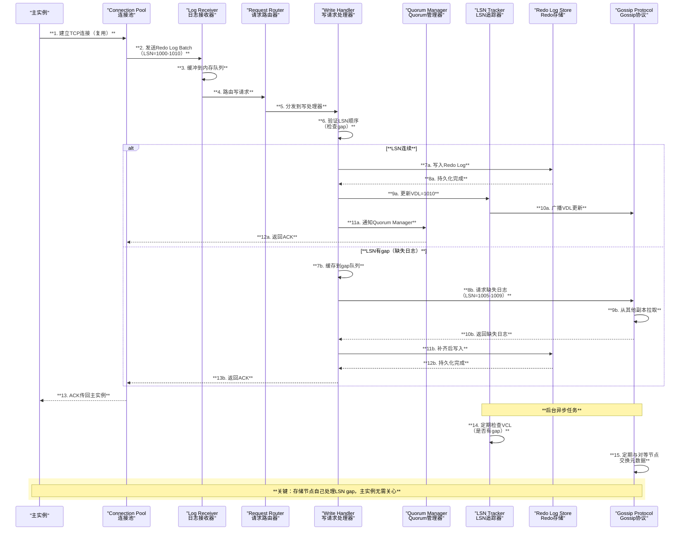
```mermaid
sequenceDiagram
    participant Primary as "主实例"
    participant Conn as "Connection Pool<br/>连接池"
    participant Recv as "Log Receiver<br/>日志接收器"
    participant Router as "Request Router<br/>请求路由器"
    participant Writer as "Write Handler<br/>写请求处理器"
    participant Quorum as "Quorum Manager<br/>Quorum管理器"
    participant LSN_T as "LSN Tracker<br/>LSN追踪器"
    participant Store as "Redo Log Store<br/>Redo存储"
    participant Gossip as "Gossip Protocol<br/>Gossip协议"
    
    Primary->>Conn: **1. 建立TCP连接（复用）**
    Conn->>Recv: **2. 发送Redo Log Batch<br/>（LSN=1000-1010）**
    
    Recv->>Recv: **3. 缓冲到内存队列**
    Recv->>Router: **4. 路由写请求**
    
    Router->>Writer: **5. 分发到写处理器**
    
    Writer->>Writer: **6. 验证LSN顺序<br/>（检查gap）**
    
    alt **LSN连续**
        Writer->>Store: **7a. 写入Redo Log**
        Store-->>Writer: **8a. 持久化完成**
        Writer->>LSN_T: **9a. 更新VDL=1010**
        LSN_T->>Gossip: **10a. 广播VDL更新**
        Writer->>Quorum: **11a. 通知Quorum Manager**
        Quorum-->>Conn: **12a. 返回ACK**
    else **LSN有gap（缺失日志）**
        Writer->>Writer: **7b. 缓存到gap队列**
        Writer->>Gossip: **8b. 请求缺失日志<br/>（LSN=1005-1009）**
        Gossip->>Gossip: **9b. 从其他副本拉取**
        Gossip-->>Writer: **10b. 返回缺失日志**
        Writer->>Store: **11b. 补齐后写入**
        Store-->>Writer: **12b. 持久化完成**
        Writer-->>Conn: **13b. 返回ACK**
    end
    
    Conn-->>Primary: **13. ACK传回主实例**
    
    Note over LSN_T,Gossip: **后台异步任务**
    LSN_T->>LSN_T: **14. 定期检查VCL<br/>（是否有gap）**
    Gossip->>Gossip: **15. 定期与对等节点<br/>交换元数据**
    
    rect rgb(255, 250, 205)
    Note over Primary,Gossip: **关键：存储节点自己处理LSN gap，主实例无需关心**
    end
```

##### （2）只读副本读取页面的完整流程

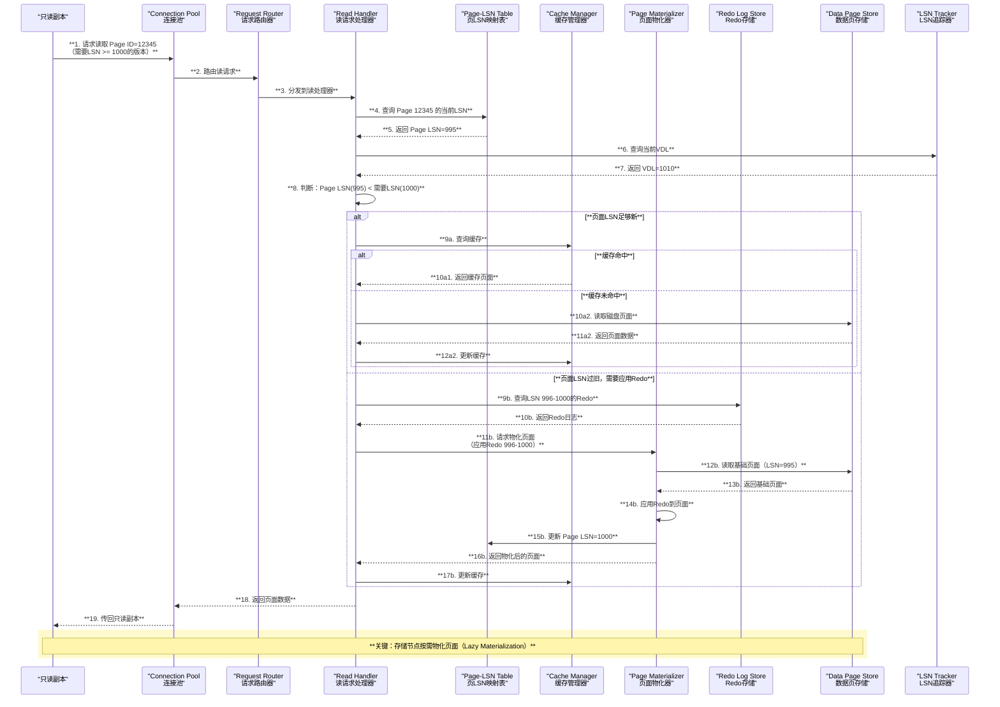
```mermaid
sequenceDiagram
    participant Replica as "只读副本"
    participant Conn as "Connection Pool<br/>连接池"
    participant Router as "Request Router<br/>请求路由器"
    participant Reader as "Read Handler<br/>读请求处理器"
    participant PageLSN as "Page-LSN Table<br/>页LSN映射表"
    participant Cache as "Cache Manager<br/>缓存管理器"
    participant Materialize as "Page Materializer<br/>页面物化器"
    participant RedoStore as "Redo Log Store<br/>Redo存储"
    participant PageStore as "Data Page Store<br/>数据页存储"
    participant LSN_T as "LSN Tracker<br/>LSN追踪器"
    
    Replica->>Conn: **1. 请求读取 Page ID=12345<br/>（需要LSN >= 1000的版本）**
    Conn->>Router: **2. 路由读请求**
    Router->>Reader: **3. 分发到读处理器**
    
    Reader->>PageLSN: **4. 查询 Page 12345 的当前LSN**
    PageLSN-->>Reader: **5. 返回 Page LSN=995**
    
    Reader->>LSN_T: **6. 查询当前VDL**
    LSN_T-->>Reader: **7. 返回 VDL=1010**
    
    Reader->>Reader: **8. 判断：Page LSN(995) < 需要LSN(1000)**
    
    alt **页面LSN足够新**
        Reader->>Cache: **9a. 查询缓存**
        alt **缓存命中**
            Cache-->>Reader: **10a1. 返回缓存页面**
        else **缓存未命中**
            Reader->>PageStore: **10a2. 读取磁盘页面**
            PageStore-->>Reader: **11a2. 返回页面数据**
            Reader->>Cache: **12a2. 更新缓存**
        end
    else **页面LSN过旧，需要应用Redo**
        Reader->>RedoStore: **9b. 查询LSN 996-1000的Redo**
        RedoStore-->>Reader: **10b. 返回Redo日志**
        
        Reader->>Materialize: **11b. 请求物化页面<br/>（应用Redo 996-1000）**
        Materialize->>PageStore: **12b. 读取基础页面（LSN=995）**
        PageStore-->>Materialize: **13b. 返回基础页面**
        Materialize->>Materialize: **14b. 应用Redo到页面**
        Materialize->>PageLSN: **15b. 更新 Page LSN=1000**
        Materialize-->>Reader: **16b. 返回物化后的页面**
        
        Reader->>Cache: **17b. 更新缓存**
    end
    
    Reader-->>Conn: **18. 返回页面数据**
    Conn-->>Replica: **19. 传回只读副本**
    
    rect rgb(255, 250, 205)
    Note over Replica,PageStore: **关键：存储节点按需物化页面（Lazy Materialization）**
    end
```

##### （3）Gossip协议的副本间协调流程

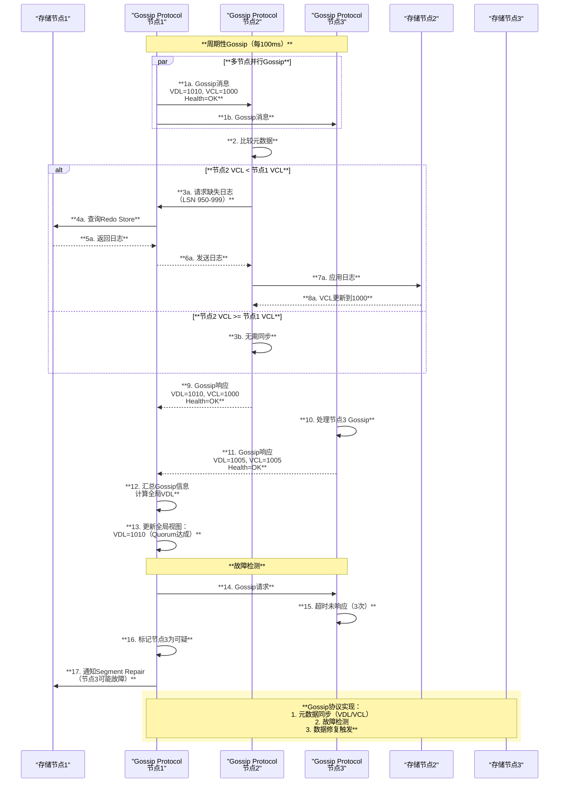
```mermaid
sequenceDiagram
    participant Node1 as "存储节点1"
    participant G1 as "Gossip Protocol<br/>节点1"
    participant G2 as "Gossip Protocol<br/>节点2"
    participant G3 as "Gossip Protocol<br/>节点3"
    participant Node2 as "存储节点2"
    participant Node3 as "存储节点3"
    
    Note over G1,G3: **周期性Gossip（每100ms）**
    
    par **多节点并行Gossip**
        G1->>G2: **1a. Gossip消息<br/>VDL=1010, VCL=1000<br/>Health=OK**
        G1->>G3: **1b. Gossip消息**
    end
    
    G2->>G2: **2. 比较元数据**
    
    alt **节点2 VCL < 节点1 VCL**
        G2->>G1: **3a. 请求缺失日志<br/>（LSN 950-999）**
        G1->>Node1: **4a. 查询Redo Store**
        Node1-->>G1: **5a. 返回日志**
        G1-->>G2: **6a. 发送日志**
        G2->>Node2: **7a. 应用日志**
        Node2-->>G2: **8a. VCL更新到1000**
    else **节点2 VCL >= 节点1 VCL**
        G2->>G2: **3b. 无需同步**
    end
    
    G2-->>G1: **9. Gossip响应<br/>VDL=1010, VCL=1000<br/>Health=OK**
    
    G3->>G3: **10. 处理节点3 Gossip**
    G3-->>G1: **11. Gossip响应<br/>VDL=1005, VCL=1005<br/>Health=OK**
    
    G1->>G1: **12. 汇总Gossip信息<br/>计算全局VDL**
    G1->>G1: **13. 更新全局视图：<br/>VDL=1010（Quorum达成）**
    
    Note over G1,G3: **故障检测**
    G1->>G3: **14. Gossip请求**
    G3->>G3: **15. 超时未响应（3次）**
    G1->>G1: **16. 标记节点3为可疑**
    G1->>Node1: **17. 通知Segment Repair<br/>（节点3可能故障）**
    
    rect rgb(255, 250, 205)
    Note over G1,Node3: **Gossip协议实现：<br/>1. 元数据同步（VDL/VCL）<br/>2. 故障检测<br/>3. 数据修复触发**
    end
```

##### （4）分段修复（Segment Repair）流程

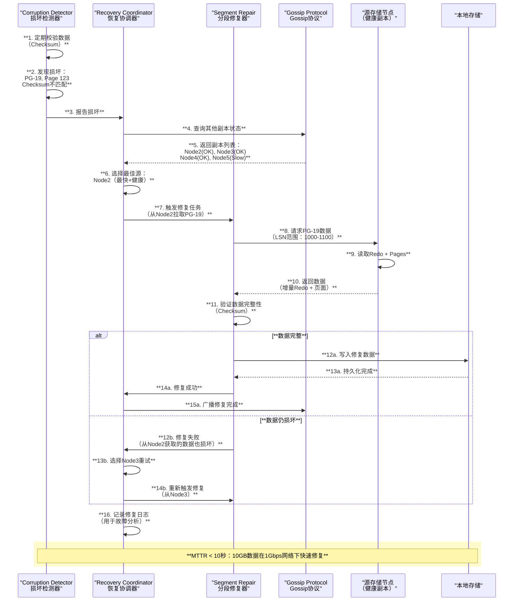
```mermaid
sequenceDiagram
    participant Detector as "Corruption Detector<br/>损坏检测器"
    participant Coord as "Recovery Coordinator<br/>恢复协调器"
    participant Repair as "Segment Repair<br/>分段修复器"
    participant Gossip as "Gossip Protocol<br/>Gossip协议"
    participant Source as "源存储节点<br/>（健康副本）"
    participant Store as "本地存储"
    
    Detector->>Detector: **1. 定期校验数据<br/>（Checksum）**
    Detector->>Detector: **2. 发现损坏：<br/>PG-19, Page 123<br/>Checksum不匹配**
    
    Detector->>Coord: **3. 报告损坏**
    Coord->>Gossip: **4. 查询其他副本状态**
    Gossip-->>Coord: **5. 返回副本列表：<br/>Node2(OK), Node3(OK)<br/>Node4(OK), Node5(Slow)**
    
    Coord->>Coord: **6. 选择最佳源：<br/>Node2（最快+健康）**
    Coord->>Repair: **7. 触发修复任务<br/>（从Node2拉取PG-19）**
    
    Repair->>Source: **8. 请求PG-19数据<br/>（LSN范围：1000-1100）**
    Source->>Source: **9. 读取Redo + Pages**
    Source-->>Repair: **10. 返回数据<br/>（增量Redo + 页面）**
    
    Repair->>Repair: **11. 验证数据完整性<br/>（Checksum）**
    
    alt **数据完整**
        Repair->>Store: **12a. 写入修复数据**
        Store-->>Repair: **13a. 持久化完成**
        Repair->>Coord: **14a. 修复成功**
        Coord->>Gossip: **15a. 广播修复完成**
    else **数据仍损坏**
        Repair->>Coord: **12b. 修复失败<br/>（从Node2获取的数据也损坏）**
        Coord->>Coord: **13b. 选择Node3重试**
        Coord->>Repair: **14b. 重新触发修复<br/>（从Node3）**
    end
    
    Coord->>Coord: **16. 记录修复日志<br/>（用于故障分析）**
    
    rect rgb(255, 250, 205)
    Note over Detector,Store: **MTTR < 10秒：10GB数据在1Gbps网络下快速修复**
    end
```

#### 3.2.3 存储节点的关键设计要点

| **设计要点** | **实现方式** | **带来的优势** |
|------------|------------|------------|
| **异步日志应用** | Log Applicator后台异步执行 | 降低写延迟，Redo持久化后立即返回ACK |
| **延迟物化** | 页面按需物化，非立即应用所有Redo | 减少不必要的I/O，提升吞吐量 |
| **Gossip协议** | 去中心化元数据同步 | 无单点故障，高可用性 |
| **LSN gap处理** | 存储节点自动从对等节点拉取缺失日志 | 主实例无需重传，简化主实例逻辑 |
| **Quorum写入** | 4/6确认即可返回 | 容忍2个节点故障，高可用性 |
| **自我修复** | 自动检测并修复损坏数据 | 无需人工干预，降低运维成本 |
| **分层缓存** | Cache Manager管理热数据 | 提升读性能，减少磁盘I/O |
| **持续备份** | 后台持续将增量写入S3 | 支持PITR，RTO/RPO小 |

## 4. 数据交互流程

### 4.1 写入流程（Quorum Write）

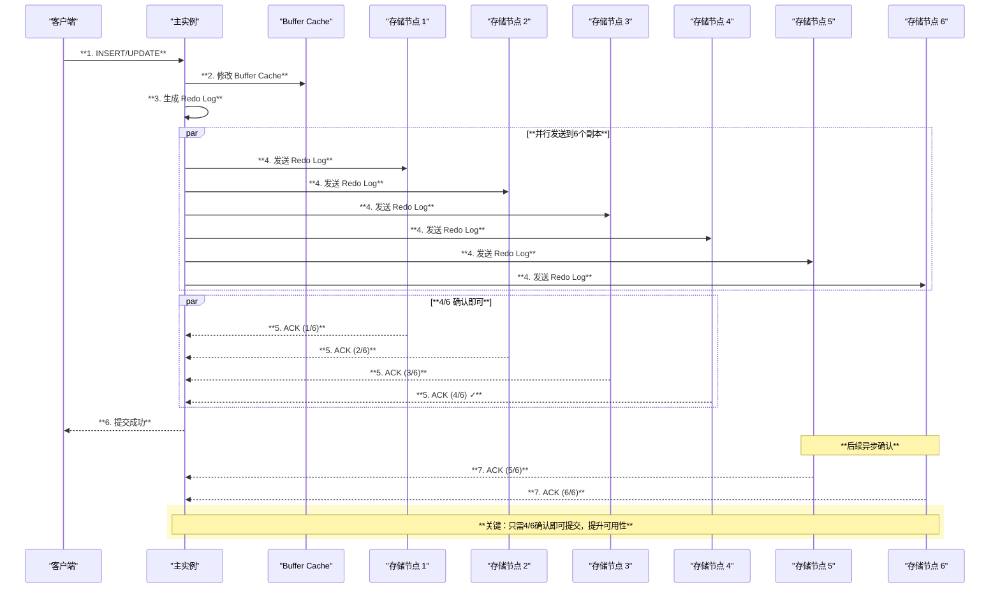
```mermaid
sequenceDiagram
    participant C as "客户端"
    participant P as "主实例"
    participant BC as "Buffer Cache"
    participant S1 as "存储节点 1"
    participant S2 as "存储节点 2"
    participant S3 as "存储节点 3"
    participant S4 as "存储节点 4"
    participant S5 as "存储节点 5"
    participant S6 as "存储节点 6"
    
    C->>P: **1. INSERT/UPDATE**
    P->>BC: **2. 修改 Buffer Cache**
    P->>P: **3. 生成 Redo Log**
    
    par **并行发送到6个副本**
        P->>S1: **4. 发送 Redo Log**
        P->>S2: **4. 发送 Redo Log**
        P->>S3: **4. 发送 Redo Log**
        P->>S4: **4. 发送 Redo Log**
        P->>S5: **4. 发送 Redo Log**
        P->>S6: **4. 发送 Redo Log**
    end
    
    par **4/6 确认即可**
        S1-->>P: **5. ACK (1/6)**
        S2-->>P: **5. ACK (2/6)**
        S3-->>P: **5. ACK (3/6)**
        S4-->>P: **5. ACK (4/6) ✓**
    end
    
    P-->>C: **6. 提交成功**
    
    Note over S5,S6: **后续异步确认**
    S5-->>P: **7. ACK (5/6)**
    S6-->>P: **7. ACK (6/6)**
    
    rect rgb(255, 250, 205)
    Note over P,S6: **关键：只需4/6确认即可提交，提升可用性**
    end
```

### 4.2 读取流程（Quorum Read）

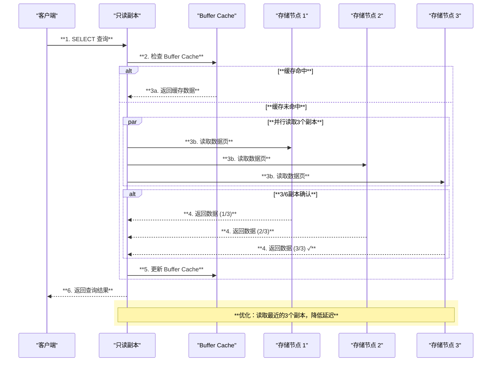
```mermaid
sequenceDiagram
    participant C as "客户端"
    participant R as "只读副本"
    participant BC as "Buffer Cache"
    participant S1 as "存储节点 1"
    participant S2 as "存储节点 2"
    participant S3 as "存储节点 3"
    
    C->>R: **1. SELECT 查询**
    R->>BC: **2. 检查 Buffer Cache**
    
    alt **缓存命中**
        BC-->>R: **3a. 返回缓存数据**
    else **缓存未命中**
        par **并行读取3个副本**
            R->>S1: **3b. 读取数据页**
            R->>S2: **3b. 读取数据页**
            R->>S3: **3b. 读取数据页**
        end
        
        alt **3/6副本确认**
            S1-->>R: **4. 返回数据 (1/3)**
            S2-->>R: **4. 返回数据 (2/3)**
            S3-->>R: **4. 返回数据 (3/3) ✓**
        end
        
        R->>BC: **5. 更新 Buffer Cache**
    end
    
    R-->>C: **6. 返回查询结果**
    
    rect rgb(255, 250, 205)
    Note over R,S3: **优化：读取最近的3个副本，降低延迟**
    end
```

## 5. 技术创新点

### 5.1 Log-is-Database 架构


```mermaid
graph TB
    subgraph "传统 MySQL 架构"
        A[**计算层写 Redo Log**]
        B[**计算层刷数据页**]
        C[**主从同步数据页**]
        D[**网络开销大**]
    end
    
    subgraph "Aurora Log-is-Database"
        E[**计算层只写 Redo Log**]
        F[**存储层应用日志**]
        G[**存储层生成数据页**]
        H[**网络开销降低 75%**]
    end
    
    A --> B
    B --> C
    C --> D
    
    E --> F
    F --> G
    G --> H
    
    style A fill:#ffd7d7,stroke:#333,stroke-width:2px,color:#000
    style B fill:#ffd7d7,stroke:#333,stroke-width:2px,color:#000
    style C fill:#ffd7d7,stroke:#333,stroke-width:2px,color:#000
    style D fill:#ffd7d7,stroke:#333,stroke-width:3px,color:#000
    style E fill:#d7ffd7,stroke:#333,stroke-width:2px,color:#000
    style F fill:#d7ffd7,stroke:#333,stroke-width:2px,color:#000
    style G fill:#d7ffd7,stroke:#333,stroke-width:2px,color:#000
    style H fill:#d7ffd7,stroke:#333,stroke-width:3px,color:#000
```

**Log-is-Database 优势：**
1. **减少网络I/O**：只传输 Redo Log（约 1/20 数据页大小）
2. **提升吞吐**：计算层无需等待数据页刷盘
3. **加快恢复**：存储层持续应用日志，无需恢复

### 5.2 Quorum 一致性协议详解

Aurora 使用 Quorum 协议来保证数据一致性和高可用性，这是分布式系统中的核心设计。

#### 5.2.1 Quorum 基本原理

Quorum 协议的核心思想是：**在 N 个副本中，写入需要 Vw 个副本确认，读取需要 Vr 个副本确认，只要满足 Vw + Vr > N，就能保证读取到最新的数据**。

**数学证明**：
- 设总副本数为 N = 6
- 写入 Quorum：Vw = 4
- 读取 Quorum：Vr = 3
- 验证：Vw + Vr = 4 + 3 = 7 > 6 ✓

**为什么能保证一致性**？
- 写入时至少有 4 个副本包含最新数据
- 读取时至少读取 3 个副本
- 因为 4 + 3 > 6，所以读取的 3 个副本中**至少有 1 个**与写入的 4 个副本重叠
- 这个重叠的副本必然包含最新数据
- 通过比较 LSN，可以识别出最新数据

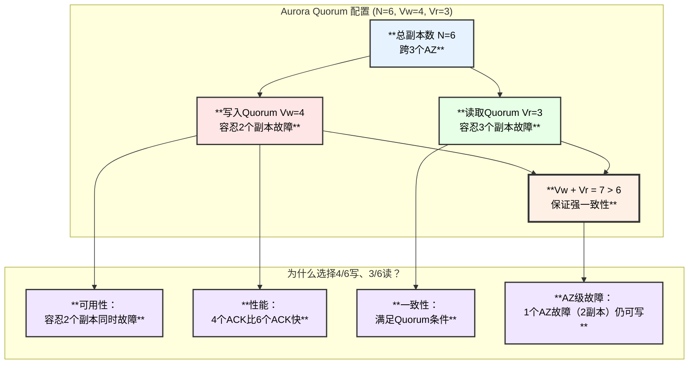
```mermaid
graph TB
    subgraph "Aurora Quorum 配置 (N=6, Vw=4, Vr=3)"
        A[**总副本数 N=6<br/>跨3个AZ**]
        B[**写入Quorum Vw=4<br/>容忍2个副本故障**]
        C[**读取Quorum Vr=3<br/>容忍3个副本故障**]
        D[**Vw + Vr = 7 > 6<br/>保证强一致性**]
    end
    
    subgraph "为什么选择4/6写、3/6读？"
        E[**可用性：<br/>容忍2个副本同时故障**]
        F[**性能：<br/>4个ACK比6个ACK快**]
        G[**一致性：<br/>满足Quorum条件**]
        H[**AZ级故障：<br/>1个AZ故障（2副本）仍可写**]
    end
    
    A --> B
    A --> C
    B --> D
    C --> D
    
    B --> E
    B --> F
    C --> G
    D --> H
    
    style A fill:#e6f3ff,stroke:#333,stroke-width:2px,color:#000
    style B fill:#ffe6e6,stroke:#333,stroke-width:2px,color:#000
    style C fill:#e6ffe6,stroke:#333,stroke-width:2px,color:#000
    style D fill:#fff0e6,stroke:#333,stroke-width:3px,color:#000
    style E fill:#f0e6ff,stroke:#333,stroke-width:2px,color:#000
    style F fill:#f0e6ff,stroke:#333,stroke-width:2px,color:#000
    style G fill:#f0e6ff,stroke:#333,stroke-width:2px,color:#000
    style H fill:#f0e6ff,stroke:#333,stroke-width:2px,color:#000
```

#### 5.2.2 为什么需要同时考虑读和写？

**Quorum 协议的核心是"读写重叠"**，只考虑写或只考虑读都无法保证一致性。

| **场景** | **问题** | **Quorum 解决方案** |
|---------|---------|------------------|
| **只考虑写（Vw=4）** | 如果读取只读1个副本，可能读到旧数据 | 要求 Vr=3，确保读写重叠 |
| **只考虑读（Vr=3）** | 如果写入只写1个副本，读取可能读不到 | 要求 Vw=4，确保至少1个副本被读到 |
| **读写分离考虑** | 读写操作在不同副本集合，可能不一致 | **Vw + Vr > N** 保证必有重叠 |

**具体例子**：

**场景1：写入4个副本 [1, 2, 3, 4]**
- 如果读取副本 [4, 5, 6]，副本4是重叠点，能读到最新数据 ✓
- 如果读取副本 [1, 2, 5]，副本1和2是重叠点，能读到最新数据 ✓
- **任何3个副本的组合都至少包含1个写入副本** （因为4+3>6）

**场景2：如果只要求Vr=2（错误配置）**
- 写入副本 [1, 2, 3, 4]
- 读取副本 [5, 6]（没有重叠！）
- 结果：读取到旧数据，违反一致性 ✗

#### 5.2.3 为什么 Vw + Vr > 6 就是强一致？

这是 **Quorum 定理**的数学保证：

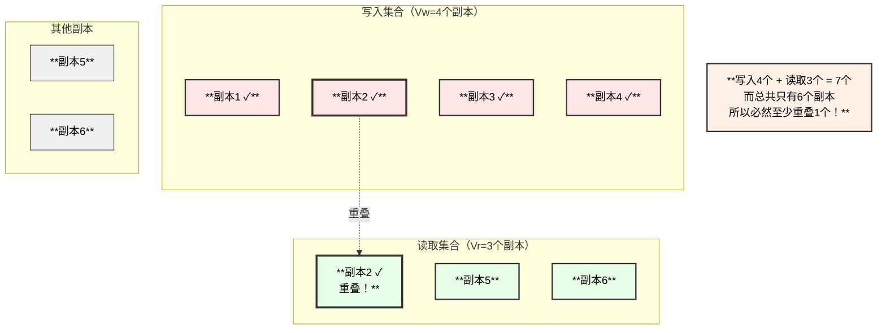
```mermaid
graph TB
    subgraph "写入集合（Vw=4个副本）"
        W1[**副本1 ✓**]
        W2[**副本2 ✓**]
        W3[**副本3 ✓**]
        W4[**副本4 ✓**]
    end
    
    subgraph "读取集合（Vr=3个副本）"
        R1[**副本2 ✓<br/>重叠！**]
        R2[**副本5**]
        R3[**副本6**]
    end
    
    subgraph "其他副本"
        O1[**副本5**]
        O2[**副本6**]
    end
    
    Note1[**写入4个 + 读取3个 = 7个<br/>而总共只有6个副本<br/>所以必然至少重叠1个！**]
    
    W2 -.->|重叠| R1
    
    style W1 fill:#ffe6e6,stroke:#333,stroke-width:2px,color:#000
    style W2 fill:#ffe6e6,stroke:#333,stroke-width:3px,color:#000
    style W3 fill:#ffe6e6,stroke:#333,stroke-width:2px,color:#000
    style W4 fill:#ffe6e6,stroke:#333,stroke-width:2px,color:#000
    
    style R1 fill:#e6ffe6,stroke:#333,stroke-width:3px,color:#000
    style R2 fill:#e6ffe6,stroke:#333,stroke-width:2px,color:#000
    style R3 fill:#e6ffe6,stroke:#333,stroke-width:2px,color:#000
    
    style O1 fill:#f0f0f0,stroke:#333,stroke-width:1px,color:#000
    style O2 fill:#f0f0f0,stroke:#333,stroke-width:1px,color:#000
    
    style Note1 fill:#fff0e6,stroke:#333,stroke-width:2px,color:#000
```

**强一致性的保证**：
1. 写入时，至少4个副本有最新数据（LSN=1000）
2. 读取时，查询3个副本
3. 因为4+3=7>6，所以3个副本中必然至少有1个在写入的4个中
4. 读取时比较3个副本的LSN，选择最大的LSN=1000
5. 因此**总能读到最新的已提交数据** → 强一致性 ✓

**反例：如果Vw=3, Vr=2**
- Vw + Vr = 3 + 2 = 5 ≤ 6（不满足条件）
- 可能写入副本 [1, 2, 3]，读取副本 [4, 5]
- 没有重叠，读取到旧数据 → **不是强一致性** ✗

#### 5.2.4 为什么读取也需要至少3个副本确认？

**原因1：保证读到最新数据**
- 如果只读1个副本，该副本可能还未收到最新的Redo（网络延迟）
- 如果只读2个副本，可能都不在写入的4个副本中（4+2=6，刚好不重叠）
- 读3个副本，确保至少1个在写入集合中

**原因2：容错性**
- 读取3个副本，可以容忍3个副本故障（读取剩余3个）
- 如果只读2个副本，故障容忍度降低

**原因3：选择最新数据**
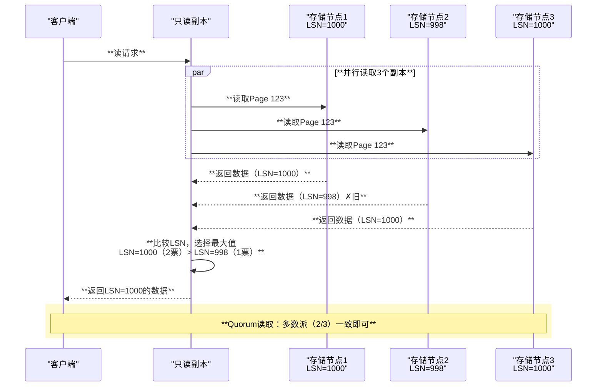
```mermaid
sequenceDiagram
    participant Client as "客户端"
    participant Replica as "只读副本"
    participant S1 as "存储节点1<br/>LSN=1000"
    participant S2 as "存储节点2<br/>LSN=998"
    participant S3 as "存储节点3<br/>LSN=1000"
    
    Client->>Replica: **读请求**
    
    par **并行读取3个副本**
        Replica->>S1: **读取Page 123**
        Replica->>S2: **读取Page 123**
        Replica->>S3: **读取Page 123**
    end
    
    S1-->>Replica: **返回数据（LSN=1000）**
    S2-->>Replica: **返回数据（LSN=998）✗旧**
    S3-->>Replica: **返回数据（LSN=1000）**
    
    Replica->>Replica: **比较LSN，选择最大值<br/>LSN=1000（2票）> LSN=998（1票）**
    
    Replica-->>Client: **返回LSN=1000的数据**
    
    rect rgb(255, 250, 205)
    Note over Client,S3: **Quorum读取：多数派（2/3）一致即可**
    end
```

#### 5.2.5 读写流程中 Quorum 的应用

**写入流程中的 Quorum**：

| **步骤** | **操作** | **Quorum 应用** |
|---------|---------|---------------|
| 1. 生成Redo | 主实例生成Redo日志 | - |
| 2. 并行发送 | 发送到6个存储节点 | 并行发送，减少延迟 |
| 3. 等待ACK | 等待存储节点确认 | **关键：只需等4个ACK** |
| 4. Quorum判定 | 收到4个ACK | 满足 Vw=4，可以提交 |
| 5. 提交事务 | 返回客户端成功 | 事务持久化 ✓ |
| 6. 剩余ACK | 后续收到5、6号ACK | 异步处理，不阻塞提交 |

**读取流程中的 Quorum**：

| **步骤** | **操作** | **Quorum 应用** |
|---------|---------|---------------|
| 1. 查询VDL | 只读副本查询存储层VDL | 查询3个节点的VDL |
| 2. 比较LSN | 获取3个VDL值 | 选择最大的VDL（多数派） |
| 3. 读取页面 | 根据最新VDL读取页面 | 从LSN最新的节点读取 |
| 4. Quorum判定 | 获得3个副本的数据 | 满足 Vr=3 |
| 5. 一致性验证 | 比较3个副本的LSN | 至少2个LSN一致 → 有效 |
| 6. 返回数据 | 返回最新LSN的数据 | 强一致性保证 ✓ |

#### 5.2.6 读写协议为什么在一起考虑？

**关键点：读写是相互依赖的**

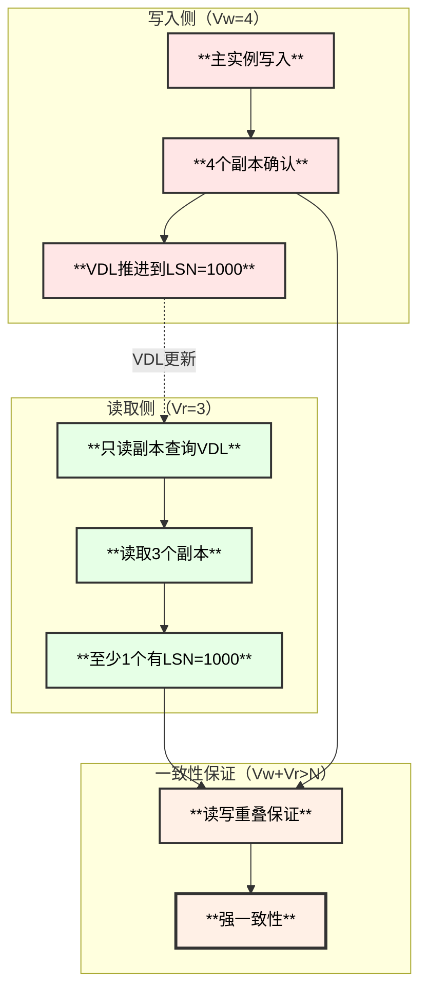
```mermaid
graph TB
    subgraph "写入侧（Vw=4）"
        W1[**主实例写入**]
        W2[**4个副本确认**]
        W3[**VDL推进到LSN=1000**]
    end
    
    subgraph "读取侧（Vr=3）"
        R1[**只读副本查询VDL**]
        R2[**读取3个副本**]
        R3[**至少1个有LSN=1000**]
    end
    
    subgraph "一致性保证（Vw+Vr>N）"
        C1[**读写重叠保证**]
        C2[**强一致性**]
    end
    
    W1 --> W2
    W2 --> W3
    W3 -.->|VDL更新| R1
    R1 --> R2
    R2 --> R3
    R3 --> C1
    W2 --> C1
    C1 --> C2
    
    style W1 fill:#ffe6e6,stroke:#333,stroke-width:2px,color:#000
    style W2 fill:#ffe6e6,stroke:#333,stroke-width:2px,color:#000
    style W3 fill:#ffe6e6,stroke:#333,stroke-width:2px,color:#000
    
    style R1 fill:#e6ffe6,stroke:#333,stroke-width:2px,color:#000
    style R2 fill:#e6ffe6,stroke:#333,stroke-width:2px,color:#000
    style R3 fill:#e6ffe6,stroke:#333,stroke-width:2px,color:#000
    
    style C1 fill:#fff0e6,stroke:#333,stroke-width:2px,color:#000
    style C2 fill:#fff0e6,stroke:#333,stroke-width:3px,color:#000
```

**为什么不能分开考虑？**

1. **写入协议单独设计**：如果只考虑写入高可用性（Vw=2），但不考虑读取，可能导致：
   - 读取时无法确定哪个副本是最新的
   - 多个副本数据不一致时，无法选择正确的副本

2. **读取协议单独设计**：如果只考虑读取性能（Vr=1），但不考虑写入，可能导致：
   - 读取的副本可能尚未收到最新写入
   - 违反一致性要求

3. **联合设计（Vw=4, Vr=3, Vw+Vr>6）**：
   - **读写重叠**：确保读取时必然能看到最新写入
   - **容错平衡**：写入容忍2个故障，读取容忍3个故障
   - **性能优化**：不需要等待全部6个副本

#### 5.2.7 Quorum 协议总结

| **方面** | **Aurora的选择** | **原因** |
|---------|----------------|---------|
| **副本数N** | 6 | 跨3个AZ，每个AZ 2个副本 |
| **写Quorum Vw** | 4 | 容忍2个副本（1个AZ）故障 |
| **读Quorum Vr** | 3 | 容忍3个副本故障，快速读取 |
| **一致性保证** | Vw+Vr=7>6 | 强一致性（Linearizable） |
| **写入延迟** | ~5-10ms | 只等4个ACK，比6个快 |
| **读取延迟** | ~1-3ms | 读取最近的3个副本 |
| **可用性** | 99.99% | 容忍AZ级故障 |

**Quorum 的优势**：
- ✅ **强一致性**：读取总能看到最新的已提交写入
- ✅ **高可用性**：容忍多个副本故障
- ✅ **低延迟**：不需要等待所有副本确认
- ✅ **灵活性**：可以根据需要调整Vw和Vr

```mermaid
graph LR
    subgraph "写入 Quorum (Vw = 4)"
        A[**6个副本**]
        B[**至少4个确认**]
        C[**写入成功**]
    end
    
    subgraph "读取 Quorum (Vr = 3)"
        D[**6个副本**]
        E[**至少3个确认**]
        F[**读取成功**]
    end
    
    subgraph "一致性保证"
        G[**Vw + Vr > V**]
        H[**4 + 3 > 6 ✓**]
        I[**强一致性**]
    end
    
    A --> B
    B --> C
    
    D --> E
    E --> F
    
    G --> H
    H --> I
    
    style A fill:#ffe1e1,stroke:#333,stroke-width:2px,color:#000
    style B fill:#ffe1e1,stroke:#333,stroke-width:2px,color:#000
    style C fill:#d7ffd7,stroke:#333,stroke-width:3px,color:#000
    style D fill:#e1f5ff,stroke:#333,stroke-width:2px,color:#000
    style E fill:#e1f5ff,stroke:#333,stroke-width:2px,color:#000
    style F fill:#d7ffd7,stroke:#333,stroke-width:3px,color:#000
    style G fill:#fff3e1,stroke:#333,stroke-width:2px,color:#000
    style H fill:#fff3e1,stroke:#333,stroke-width:2px,color:#000
    style I fill:#d7ffd7,stroke:#333,stroke-width:3px,color:#000
```

**Quorum 协议优势：**
- **高可用**：允许 2 个副本失败，仍可写入
- **低延迟**：无需等待所有副本确认
- **强一致**：保证读到最新数据

### 5.3 Redo Log 改进

| **改进项** | **MySQL** | **Aurora** | **优势** |
|----------|---------|----------|--------|
| **日志生成** | 计算层 | 计算层 | 相同 |
| **日志持久化** | 本地磁盘 | 6副本存储 | 高可靠性 |
| **日志应用** | 计算层（恢复时） | 存储层（持续） | 快速恢复 |
| **日志传输** | Binlog 到从库 | Redo Log 到存储 | 减少 75% 流量 |
| **日志压缩** | 不支持 | 支持 | 节省存储 |
| **日志LSN** | 递增序列号 | 递增 + Gossip 同步 | 分布式一致性 |

## 6. 高可用架构

### 6.1 故障场景处理

```mermaid
graph TB
    subgraph "单副本故障"
        A[**6副本中1个失败**]
        B[**仍有5个可用**]
        C[**写入：4/5 ✓**]
        D[**读取：3/5 ✓**]
        E[**无影响**]
    end
    
    subgraph "双副本故障"
        F[**6副本中2个失败**]
        G[**仍有4个可用**]
        H[**写入：4/4 ✓**]
        I[**读取：3/4 ✓**]
        J[**性能略降**]
    end
    
    subgraph "AZ级故障"
        K[**整个AZ不可用**]
        L[**剩余2个AZ**]
        M[**4个副本可用**]
        N[**写入：4/4 ✓**]
        O[**读取：3/4 ✓**]
        P[**服务正常**]
    end
    
    A --> B
    B --> C
    C --> D
    D --> E
    
    F --> G
    G --> H
    H --> I
    I --> J
    
    K --> L
    L --> M
    M --> N
    N --> O
    O --> P
    
    style A fill:#fffacd,stroke:#333,stroke-width:2px,color:#000
    style B fill:#fffacd,stroke:#333,stroke-width:2px,color:#000
    style C fill:#fffacd,stroke:#333,stroke-width:2px,color:#000
    style D fill:#fffacd,stroke:#333,stroke-width:2px,color:#000
    style E fill:#d7ffd7,stroke:#333,stroke-width:3px,color:#000
    style F fill:#ffe1e1,stroke:#333,stroke-width:2px,color:#000
    style G fill:#ffe1e1,stroke:#333,stroke-width:2px,color:#000
    style H fill:#ffe1e1,stroke:#333,stroke-width:2px,color:#000
    style I fill:#ffe1e1,stroke:#333,stroke-width:2px,color:#000
    style J fill:#ffd7d7,stroke:#333,stroke-width:2px,color:#000
    style K fill:#ffd7d7,stroke:#333,stroke-width:2px,color:#000
    style L fill:#ffd7d7,stroke:#333,stroke-width:2px,color:#000
    style M fill:#ffd7d7,stroke:#333,stroke-width:2px,color:#000
    style N fill:#ffd7d7,stroke:#333,stroke-width:2px,color:#000
    style O fill:#ffd7d7,stroke:#333,stroke-width:2px,color:#000
    style P fill:#d7ffd7,stroke:#333,stroke-width:3px,color:#000
```

### 6.2 故障切换流程

```mermaid
graph TB
    subgraph "主实例故障"
        A[**心跳检测失败**]
        B[**RDS控制平面<br/>确认故障**]
        C[**选择只读副本**]
    end
    
    subgraph "故障切换"
        D[**提升为新主实例**]
        E[**更新DNS记录**]
        F[**重定向连接**]
    end
    
    subgraph "数据一致性"
        G[**检查LSN**]
        H[**应用缺失日志**]
        I[**切换完成**]
    end
    
    A --> B
    B --> C
    C --> D
    
    D --> G
    G --> H
    H --> E
    E --> F
    F --> I
    
    style A fill:#ffe1e1,stroke:#333,stroke-width:2px,color:#000
    style B fill:#ffe1e1,stroke:#333,stroke-width:2px,color:#000
    style C fill:#ffe1e1,stroke:#333,stroke-width:2px,color:#000
    style D fill:#fff3e1,stroke:#333,stroke-width:2px,color:#000
    style E fill:#fff3e1,stroke:#333,stroke-width:2px,color:#000
    style F fill:#fff3e1,stroke:#333,stroke-width:2px,color:#000
    style G fill:#e1f5ff,stroke:#333,stroke-width:2px,color:#000
    style H fill:#e1f5ff,stroke:#333,stroke-width:2px,color:#000
    style I fill:#d7ffd7,stroke:#333,stroke-width:3px,color:#000
```

**高可用指标：**
- **RTO**：< 30 秒
- **RPO**：= 0（无数据丢失）
- **SLA**：99.99%
- **AZ级容错**：支持

### 6.3 主实例升级（Promotion）时序图

```mermaid
sequenceDiagram
    participant RDS as "RDS控制平面"
    participant OLD as "旧主实例<br/>(故障)"
    participant RO1 as "只读副本1"
    participant RO2 as "只读副本2"
    participant ST as "存储层"
    participant DNS as "DNS服务"
    participant APP as "应用程序"
    
    RDS->>OLD: **1. 心跳检测失败<br/>(连续3次超时)**
    **OLD**--x**RDS**: **2. 无响应**
    
    RDS->>RDS: **3. 确认故障<br/>触发Failover**
    
    Note over RDS: **主实例降级与隔离（Fencing）**
    
    RDS->>ST: **4. 禁止旧主写入<br/>设置Write Fence**
    ST->>ST: **5. 更新元数据<br/>Master=NULL**
    
    par **防止脑裂**
        ST-->>OLD: **6a. 拒绝写入请求<br/>WRITE_FENCED错误**
        RDS->>OLD: **6b. 发送STONITH<br/>(Shoot The Other Node In The Head)**
    end
    
    Note over RDS,RO2: **选举新主实例**
    
    RDS->>RO1: **7. 读取VCL<br/>(Volume Complete LSN)**
    RO1-->>RDS: **8. VCL=5000**
    
    RDS->>RO2: **9. 读取VCL**
    RO2-->>RDS: **10. VCL=4995**
    
    RDS->>RDS: **11. 选择VCL最大的副本<br/>RO1 胜出**
    
    Note over RO1: **只读副本提升为主**
    
    RDS->>RO1: **12. 发送Promotion命令**
    RO1->>ST: **13. 读取VDL<br/>(Volume Durable LSN)**
    ST-->>RO1: **14. VDL=5010**
    
    RO1->>RO1: **15. 应用缺失的Redo Log<br/>(VCL=5000 → VDL=5010)**
    RO1->>RO1: **16. 升级为主实例<br/>设置READ_WRITE模式**
    
    RO1->>ST: **17. 注册为主实例<br/>更新元数据 Master=RO1**
    ST-->>RO1: **18. 确认注册**
    
    RO1-->>RDS: **19. Promotion完成<br/>新主就绪**
    
    Note over RDS,DNS: **更新路由**
    
    RDS->>DNS: **20. 更新Writer端点<br/>指向RO1**
    DNS-->>RDS: **21. DNS更新完成**
    
    RDS-->>APP: **22. 通知Failover完成**
    APP->>RO1: **23. 连接新主实例**
    RO1-->>APP: **24. 接受读写请求**
    
    rect rgb(255, 250, 205)
    Note over OLD,ST: **关键：通过Write Fence防止旧主继续写入**
    end
```

### 6.4 主实例降级（Demotion）时序图

```mermaid
sequenceDiagram
    participant RDS as "RDS控制平面"
    participant OLD_M as "旧主实例"
    participant ST as "存储层"
    participant NEW_M as "新主实例"
    participant APP as "应用程序"
    
    Note over RDS: **计划内主从切换场景**
    
    RDS->>OLD_M: **1. 发送降级命令<br/>DEMOTE_TO_REPLICA**
    
    OLD_M->>OLD_M: **2. 停止接受新连接<br/>设置READ_ONLY**
    OLD_M->>APP: **3. 断开现有写连接<br/>返回SHUTDOWN错误**
    
    OLD_M->>OLD_M: **4. 等待活跃事务完成<br/>(最多30秒)**
    
    loop **等待事务提交**
        OLD_M->>OLD_M: **检查活跃事务列表**
        alt **超时30秒**
            OLD_M->>OLD_M: **强制回滚未完成事务**
        end
    end
    
    OLD_M->>ST: **5. 刷新所有脏页<br/>确保数据持久化**
    ST-->>OLD_M: **6. 确认刷新完成<br/>返回最终VDL**
    
    OLD_M->>OLD_M: **7. 转换为只读模式<br/>切换角色**
    OLD_M-->>RDS: **8. 降级完成<br/>当前状态：READ_REPLICA**
    
    Note over RDS,NEW_M: **提升新主实例**
    
    RDS->>NEW_M: **9. 发送提升命令<br/>PROMOTE_TO_MASTER**
    NEW_M->>ST: **10. 注册为主实例**
    ST->>ST: **11. 更新元数据<br/>Master=NEW_M**
    ST-->>NEW_M: **12. 确认注册**
    
    NEW_M->>NEW_M: **13. 切换到读写模式<br/>开始接受写入**
    NEW_M-->>RDS: **14. 提升完成**
    
    RDS->>RDS: **15. 更新DNS/VIP<br/>指向新主**
    RDS-->>APP: **16. 通知切换完成**
    
    APP->>NEW_M: **17. 连接新主实例**
    NEW_M-->>APP: **18. 接受读写请求**
    
    rect rgb(255, 250, 205)
    Note over OLD_M,NEW_M: **平滑切换：确保旧主所有事务完成后再切换**
    end
```

### 6.5 防止脑裂（Split-Brain）机制

```mermaid
graph TB
    subgraph "Fencing 机制"
        A[**Write Fence<br/>写入隔离**]
        B[**Storage-Level<br/>Fence<br/>存储层隔离**]
        C[**Metadata Lock<br/>元数据锁**]
    end
    
    subgraph "检测机制"
        D[**心跳超时检测**]
        E[**VCL/VDL 一致性检查**]
        F[**Master Registration<br/>主实例注册**]
    end
    
    subgraph "恢复机制"
        G[**自动Fence旧主**]
        H[**选举新主**]
        I[**更新元数据**]
        J[**恢复服务**]
    end
    
    A --> B
    B --> C
    
    D --> E
    E --> F
    
    F --> G
    G --> H
    H --> I
    I --> J
    
    style A fill:#ffe1e1,stroke:#333,stroke-width:2px,color:#000
    style B fill:#e1ffe1,stroke:#333,stroke-width:2px,color:#000
    style C fill:#e1f5ff,stroke:#333,stroke-width:2px,color:#000
    style D fill:#fff3e1,stroke:#333,stroke-width:2px,color:#000
    style E fill:#f5e1ff,stroke:#333,stroke-width:2px,color:#000
    style F fill:#fffacd,stroke:#333,stroke-width:2px,color:#000
    style G fill:#e8e1ff,stroke:#333,stroke-width:2px,color:#000
    style H fill:#ffd7d7,stroke:#333,stroke-width:2px,color:#000
    style I fill:#d7ffd7,stroke:#333,stroke-width:2px,color:#000
    style J fill:#d7ffd7,stroke:#333,stroke-width:3px,color:#000
```

**防止双主问题的核心机制：**

| **机制** | **实现方式** | **作用** |
|---------|-----------|--------|
| **Write Fence** | 存储层拒绝非注册主实例的写入 | 阻止旧主继续写入 |
| **Lease机制** | 主实例需定期续约Lease | Lease过期自动降级 |
| **Generation Number** | 每次Failover递增版本号 | 拒绝旧版本的写入 |
| **Quorum投票** | 需要多数副本确认才能成为主 | 避免分区导致多主 |
| **STONITH** | 强制关闭或隔离旧主实例 | 最后防线 |

**假死场景处理：**

```
场景：主实例因网络分区与RDS控制平面失联

1. RDS控制平面检测到心跳超时（10秒）
2. RDS向存储层发送Write Fence指令
3. 存储层更新Master Registration为NULL
4. 旧主实例尝试写入时，存储层返回WRITE_FENCED错误
5. 旧主实例检测到Fence，自动降级为只读模式
6. RDS选举新主，只读副本提升
7. 新主注册到存储层，获得写入权限
8. 即使旧主恢复网络，也无法再写入（已被Fence）

关键：存储层的Write Fence是硬隔离，旧主无法绕过
```

### 6.6 禁写（Write Fence）实现细节

```mermaid
sequenceDiagram
    participant OLD_M as "旧主实例"
    participant PG as "Protection Group<br/>存储节点"
    participant META as "元数据服务"
    participant NEW_M as "新主实例"
    
    Note over OLD_M,META: **假死场景**
    
    **OLD_M**-x**META**: **1. 网络分区<br/>无法续约Lease**
    META->>META: **2. Lease超时<br/>(10秒)**
    
    META->>PG: **3. 广播Write Fence<br/>禁止InstanceID=OLD_M写入**
    PG->>PG: **4. 更新本地Fence列表<br/>InstanceID=OLD_M → FENCED**
    
    Note over OLD_M: **旧主尝试写入**
    
    OLD_M->>PG: **5. 写入请求<br/>InstanceID=OLD_M, LSN=1000**
    PG->>PG: **6. 检查Fence列表<br/>OLD_M已被隔离**
    PG-->>OLD_M: **7. 拒绝写入<br/>错误码：WRITE_FENCED**
    
    OLD_M->>OLD_M: **8. 检测到Fence<br/>自动降级为只读**
    
    Note over NEW_M,PG: **新主注册**
    
    NEW_M->>META: **9. 注册为主实例<br/>InstanceID=NEW_M**
    META->>META: **10. 分配新Generation<br/>Gen=2 (旧Gen=1)**
    META->>PG: **11. 广播新主信息<br/>Master=NEW_M, Gen=2**
    PG->>PG: **12. 更新主实例信息**
    
    NEW_M->>PG: **13. 写入请求<br/>InstanceID=NEW_M, Gen=2, LSN=1001**
    PG->>PG: **14. 验证Generation**
    PG-->>NEW_M: **15. 接受写入<br/>成功**
    
    rect rgb(255, 250, 205)
    Note over OLD_M,PG: **存储层强制隔离，确保只有新主可以写入**
    end
```

**Write Fence 关键点：**
- **存储层实施**：Fence在存储层执行，计算层无法绕过
- **Instance ID + Generation**：双重校验确保只有合法主实例可写入
- **快速生效**：Fence命令通过Gossip协议快速传播到所有存储节点（< 1秒）
- **持久化**：Fence状态持久化，重启后仍有效

### 6.7 LSN（Log Sequence Number）管理详解

LSN 是 Aurora 的核心元数据，贯穿整个系统的数据一致性管理。理解 LSN 的存储位置、管理机制和故障处理是理解 Aurora 高可用性的关键。

#### 6.7.1 LSN 的存储位置

Aurora 在多个层级存储和维护 LSN，每个层级都有不同的作用：

```mermaid
graph TB
    subgraph "主实例（Primary Instance）"
        P1[**内存中的LSN<br/>Current LSN（当前生成）**]
        P2[**Redo Log Buffer<br/>最新未提交LSN**]
        P3[**Transaction Manager<br/>每个事务的LSN范围**]
    end
    
    subgraph "只读副本（Read Replica）"
        R1[**Buffer Pool中的LSN<br/>已应用的Page LSN**]
        R2[**VCL缓存<br/>Volume Complete LSN**]
        R3[**Recovery LSN<br/>重启恢复点**]
    end
    
    subgraph "存储层（Storage Layer）- 每个PG"
        S1[**VDL<br/>Volume Durable LSN<br/>持久化的LSN**]
        S2[**VCL<br/>Volume Complete LSN<br/>完整的LSN（无gap）**]
        S3[**Page Header<br/>每个Page的LSN**]
        S4[**Redo Log Store<br/>日志条目的LSN**]
    end
    
    subgraph "元数据服务（Metadata Service）"
        M1[**Volume Registry<br/>每个Volume的最新LSN**]
        M2[**Checkpoint LSN<br/>已检查点的LSN**]
        M3[**Backup LSN<br/>已备份到S3的LSN**]
    end
    
    P1 -.->|写入| S1
    P3 -.->|提交| S1
    S1 -.->|更新| S2
    S2 -.->|同步| R2
    R2 -.->|应用| R1
    S1 -.->|注册| M1
    S3 -.->|物化| S4
    M1 -.->|定期更新| M2
    M2 -.->|备份| M3
    
    style P1 fill:#ffe6e6,stroke:#333,stroke-width:2px,color:#000
    style P2 fill:#ffe6e6,stroke:#333,stroke-width:2px,color:#000
    style P3 fill:#ffe6e6,stroke:#333,stroke-width:2px,color:#000
    
    style R1 fill:#e6ffe6,stroke:#333,stroke-width:2px,color:#000
    style R2 fill:#e6ffe6,stroke:#333,stroke-width:2px,color:#000
    style R3 fill:#e6ffe6,stroke:#333,stroke-width:2px,color:#000
    
    style S1 fill:#fff0e6,stroke:#333,stroke-width:3px,color:#000
    style S2 fill:#fff0e6,stroke:#333,stroke-width:2px,color:#000
    style S3 fill:#fff0e6,stroke:#333,stroke-width:2px,color:#000
    style S4 fill:#fff0e6,stroke:#333,stroke-width:2px,color:#000
    
    style M1 fill:#f0e6ff,stroke:#333,stroke-width:2px,color:#000
    style M2 fill:#f0e6ff,stroke:#333,stroke-width:2px,color:#000
    style M3 fill:#f0e6ff,stroke:#333,stroke-width:2px,color:#000
```

**LSN存储位置详细说明表**：

| **存储位置** | **LSN类型** | **作用** | **存储介质** | **更新频率** |
|------------|------------|---------|------------|------------|
| **主实例** | Current LSN | 当前正在生成的Redo LSN | 内存 | 每次写入事务 |
| | Transaction LSN Range | 每个事务的起始和结束LSN | 内存（事务表） | 事务开始/提交时 |
| | Commit LSN | 已提交事务的最大LSN | 内存 | 事务提交时 |
| **只读副本** | Applied LSN | 已应用到Buffer Pool的LSN | 内存 | 应用Redo时 |
| | VCL Cache | 缓存的Volume Complete LSN | 内存 | 定期从存储层拉取（100ms） |
| | Recovery LSN | 崩溃恢复的起始LSN | 持久化（控制文件） | 定期checkpoint（5分钟） |
| **存储层** | **VDL** | **持久化的最新LSN**（Quorum达成） | **磁盘（PG Header）** | **Redo持久化时（毫秒级）** |
| | **VCL** | **无gap的连续LSN** | **磁盘（PG Header）** | **应用Redo后（秒级）** |
| | Page LSN | 每个数据页的LSN版本 | 磁盘（Page Header） | Page物化时 |
| | Log Entry LSN | 每条Redo日志的LSN | 磁盘（Redo Log） | 日志写入时 |
| **元数据服务** | Volume LSN | 整个Volume的最新LSN | 分布式KV存储 | 存储层上报（秒级） |
| | Checkpoint LSN | 已完成checkpoint的LSN | 持久化存储 | Checkpoint完成时（5分钟） |
| | Backup LSN | 已备份到S3的LSN | S3元数据 | 持续备份（秒级） |

#### 6.7.2 升主流程中的LSN管理

升主流程中，LSN 的选择和推进是确保数据不丢失的关键。

**步骤1：选择最新LSN的副本**

```mermaid
sequenceDiagram
    participant RDS as "RDS控制平面"
    participant RO1 as "只读副本1"
    participant RO2 as "只读副本2"
    participant RO3 as "只读副本3"
    participant ST as "存储层"
    
    Note over RDS: **主实例故障，开始选举**
    
    par **并行查询所有副本的LSN**
        RDS->>RO1: **查询Applied LSN**
        RDS->>RO2: **查询Applied LSN**
        RDS->>RO3: **查询Applied LSN**
    end
    
    RO1-->>RDS: **Applied LSN=5000**
    RO2-->>RDS: **Applied LSN=4998**
    RO3-->>RDS: **Applied LSN=5001 ✓最新**
    
    RDS->>RDS: **选择RO3（LSN最大）**
    
    RDS->>ST: **查询存储层VDL**
    ST-->>RDS: **VDL=5010<br/>（还有9条日志未应用）**
    
    RDS->>RO3: **提升为主实例**
    
    RO3->>ST: **读取LSN 5002-5010的Redo**
    ST-->>RO3: **返回缺失的Redo日志**
    
    RO3->>RO3: **应用Redo日志<br/>Applied LSN: 5001 → 5010**
    
    RO3->>RO3: **确认所有日志已应用<br/>Applied LSN = VDL = 5010**
    
    RO3->>ST: **注册为主实例<br/>开始生成新LSN（5011+）**
    
    rect rgb(255, 250, 205)
    Note over RDS,ST: **关键：选择Applied LSN最大的副本，减少恢复时间**
    end
```

**为什么选择LSN最大的副本？**
1. **减少恢复时间**：LSN越大，需要应用的缺失Redo越少
2. **数据最新**：该副本的Buffer Pool已经包含最新的数据
3. **减少网络传输**：不需要从其他节点拉取太多日志

#### 6.7.3 从节点重启后的LSN恢复机制

从节点重启后，需要决定从哪个LSN开始恢复。

```mermaid
sequenceDiagram
    participant RO as "只读副本<br/>（重启中）"
    participant Local as "本地存储<br/>控制文件"
    participant ST as "存储层"
    participant BufPool as "Buffer Pool"
    
    Note over RO: **只读副本启动**
    
    RO->>Local: **1. 读取本地控制文件**
    Local-->>RO: **2. Recovery LSN=4500<br/>上次Checkpoint点**
    
    RO->>ST: **3. 查询存储层VDL**
    ST-->>RO: **4. VDL=5000<br/>（当前最新LSN）**
    
    RO->>RO: **5. 计算恢复范围<br/>LSN 4500-5000（500条日志）**
    
    alt **恢复范围小（< 1000条）**
        RO->>ST: **6a. 顺序读取Redo<br/>LSN 4500-5000**
        ST-->>RO: **7a. 返回Redo日志**
        RO->>BufPool: **8a. 应用Redo到Buffer Pool**
        RO->>RO: **9a. 快速恢复完成<br/>Applied LSN=5000**
    else **恢复范围大（>= 1000条）**
        RO->>ST: **6b. 请求最新Checkpoint快照<br/>（LSN=4800）**
        ST-->>RO: **7b. 返回快照数据**
        RO->>BufPool: **8b. 加载快照**
        RO->>ST: **9b. 读取增量Redo<br/>LSN 4800-5000**
        ST-->>RO: **10b. 返回增量Redo**
        RO->>BufPool: **11b. 应用增量Redo**
        RO->>RO: **12b. 恢复完成<br/>Applied LSN=5000**
    end
    
    RO->>Local: **13. 更新控制文件<br/>Recovery LSN=5000**
    RO->>RO: **14. 启动完成，开始接受查询**
    
    rect rgb(255, 250, 205)
    Note over RO,ST: **智能恢复：根据缺失日志量选择恢复策略**
    end
```

**从节点重启机制详解**：

| **场景** | **恢复策略** | **恢复时间** | **原因** |
|---------|------------|------------|---------|
| **短暂重启**（Recovery LSN接近VDL） | 顺序应用Redo | < 10秒 | 日志量少，直接应用更快 |
| **长时间宕机**（Recovery LSN远落后VDL） | 加载Checkpoint快照 + 增量Redo | < 30秒 | 避免应用大量日志 |
| **全新副本**（无Recovery LSN） | 克隆现有副本的Buffer Pool + 增量 | < 60秒 | 复用其他副本的热数据 |

**关键设计点**：
1. **本地Checkpoint**：每5分钟持久化Recovery LSN到本地控制文件
2. **快速追赶**：重启后优先追赶到VDL，再开始服务
3. **不阻塞主实例**：从节点恢复不影响主实例写入

#### 6.7.4 LSN落后处理方案

当某个存储节点或只读副本的LSN落后太多时，Aurora有多种处理策略。

**（1）存储节点LSN落后处理**

```mermaid
graph TB
    subgraph "LSN落后检测"
        A[**Gossip协议<br/>交换VCL**]
        B[**发现节点LSN落后<br/>Gap > 1000**]
        C[**计算落后量<br/>VCL_max - VCL_local**]
    end
    
    subgraph "轻微落后（Gap < 10000）"
        D1[**从对等节点<br/>拉取缺失Redo**]
        D2[**后台异步应用**]
        D3[**逐步追赶**]
    end
    
    subgraph "严重落后（Gap >= 10000）"
        E1[**标记节点为<br/>LAGGING状态**]
        E2[**从最快节点<br/>批量拉取Redo**]
        E3[**暂停接受新写入<br/>专注恢复**]
        E4[**追赶完成后<br/>恢复ACTIVE状态**]
    end
    
    subgraph "极端落后（Gap > 100000）"
        F1[**触发Segment Repair**]
        F2[**从健康副本<br/>完整复制PG**]
        F3[**替换落后数据**]
        F4[**重新加入集群**]
    end
    
    A --> B
    B --> C
    
    C --> D1
    D1 --> D2
    D2 --> D3
    
    C --> E1
    E1 --> E2
    E2 --> E3
    E3 --> E4
    
    C --> F1
    F1 --> F2
    F2 --> F3
    F3 --> F4
    
    style A fill:#e6f3ff,stroke:#333,stroke-width:2px,color:#000
    style B fill:#fff0e6,stroke:#333,stroke-width:2px,color:#000
    style C fill:#fff0e6,stroke:#333,stroke-width:2px,color:#000
    
    style D1 fill:#e6ffe6,stroke:#333,stroke-width:2px,color:#000
    style D2 fill:#e6ffe6,stroke:#333,stroke-width:2px,color:#000
    style D3 fill:#e6ffe6,stroke:#333,stroke-width:2px,color:#000
    
    style E1 fill:#ffe6e6,stroke:#333,stroke-width:2px,color:#000
    style E2 fill:#ffe6e6,stroke:#333,stroke-width:2px,color:#000
    style E3 fill:#ffe6e6,stroke:#333,stroke-width:2px,color:#000
    style E4 fill:#e6ffe6,stroke:#333,stroke-width:2px,color:#000
    
    style F1 fill:#ffe6f0,stroke:#333,stroke-width:2px,color:#000
    style F2 fill:#ffe6f0,stroke:#333,stroke-width:2px,color:#000
    style F3 fill:#ffe6f0,stroke:#333,stroke-width:2px,color:#000
    style F4 fill:#e6ffe6,stroke:#333,stroke-width:2px,color:#000
```

**LSN落后处理策略表**：

| **落后程度** | **Gap范围** | **处理策略** | **恢复时间** | **对服务影响** |
|------------|-----------|------------|------------|--------------|
| **正常** | 0-100 | 正常Gossip同步 | 实时（毫秒级） | 无 |
| **轻微落后** | 100-10,000 | 后台异步追赶 | < 10秒 | 无（仍参与Quorum） |
| **严重落后** | 10,000-100,000 | 专注恢复，暂停新写 | 10-60秒 | 暂时不参与Quorum |
| **极端落后** | > 100,000 | Segment Repair | 1-5分钟 | 从健康副本完整复制 |

**（2）只读副本LSN落后处理**

```mermaid
sequenceDiagram
    participant Primary as "主实例"
    participant Replica as "只读副本<br/>（落后）"
    participant ST as "存储层"
    participant Mon as "监控服务"
    
    Note over Replica: **只读副本运行中**
    
    Replica->>ST: **1. 查询VDL**
    ST-->>Replica: **2. VDL=10000**
    
    Replica->>Replica: **3. 检查本地Applied LSN=9000<br/>Gap=1000**
    
    alt **Gap < 5000（正常范围）**
        Replica->>ST: **4a. 拉取Redo LSN 9000-10000**
        ST-->>Replica: **5a. 返回Redo**
        Replica->>Replica: **6a. 后台应用Redo**
    else **Gap >= 5000（落后明显）**
        Replica->>Mon: **4b. 上报落后状态<br/>REPLICATION_LAG=5000**
        Mon-->>Mon: **5b. 触发告警**
        
        Replica->>Replica: **6b. 检查CPU/网络<br/>是否瓶颈**
        
        alt **资源瓶颈**
            Replica->>Mon: **7b1. 上报资源不足**
            Mon->>Replica: **8b1. 建议升级实例类型**
        else **无瓶颈，单纯落后**
            Replica->>ST: **7b2. 批量拉取Redo<br/>更大batch size**
            ST-->>Replica: **8b2. 返回批量Redo**
            Replica->>Replica: **9b2. 加速应用<br/>暂停查询服务**
            Replica->>Replica: **10b2. 追赶完成<br/>恢复查询服务**
        end
    end
    
    Replica->>Mon: **11. 上报当前Lag=0<br/>恢复正常**
    
    rect rgb(255, 250, 205)
    Note over Replica,Mon: **Replica Lag监控：超过阈值触发告警或自动恢复**
    end
```

**只读副本落后的原因和解决方案**：

| **原因** | **症状** | **解决方案** |
|---------|---------|------------|
| **查询负载过重** | CPU 100%，Lag持续增长 | 增加只读副本数量，分担查询压力 |
| **网络带宽不足** | 网络吞吐量饱和，Lag缓慢增长 | 升级网络带宽或更换实例类型 |
| **Buffer Pool不足** | 频繁Page换出，应用Redo慢 | 升级内存更大的实例类型 |
| **主实例写入暴增** | 短时间Lag激增 | 正常现象，等待追赶；考虑写入限流 |
| **存储层故障** | 拉取Redo失败或超时 | 自动切换到其他存储节点拉取 |

#### 6.7.5 升主流程中是否需要推进LSN到Checkpoint LSN？

**问题场景**：假设选举出的只读副本的Applied LSN=5001，但最新的Checkpoint LSN=4500，是否需要推进到Checkpoint LSN？

**答案：不需要，但需要在后台异步推进Checkpoint**。

```mermaid
graph TB
    subgraph "升主时的LSN状态"
        A[**Applied LSN=5001<br/>已应用到Buffer Pool**]
        B[**VDL=5010<br/>存储层持久化LSN**]
        C[**Checkpoint LSN=4500<br/>上次Checkpoint点**]
    end
    
    subgraph "立即操作（升主时）"
        D1[**应用LSN 5001-5010<br/>到Applied LSN=VDL**]
        D2[**切换为主实例<br/>开始生成新LSN**]
        D3[**立即可接受写入<br/>从LSN 5011开始**]
    end
    
    subgraph "后台操作（升主后）"
        E1[**触发增量Checkpoint<br/>从LSN 4500开始**]
        E2[**遍历Buffer Pool<br/>找到dirty pages**]
        E3[**将dirty pages<br/>持久化到存储层**]
        E4[**更新Checkpoint LSN<br/>推进到5010**]
    end
    
    A --> D1
    B --> D1
    D1 --> D2
    D2 --> D3
    
    D3 -.->|触发| E1
    E1 --> E2
    E2 --> E3
    E3 --> E4
    
    style A fill:#e6f3ff,stroke:#333,stroke-width:2px,color:#000
    style B fill:#e6f3ff,stroke:#333,stroke-width:2px,color:#000
    style C fill:#ffe6e6,stroke:#333,stroke-width:2px,color:#000
    
    style D1 fill:#fff0e6,stroke:#333,stroke-width:2px,color:#000
    style D2 fill:#fff0e6,stroke:#333,stroke-width:2px,color:#000
    style D3 fill:#e6ffe6,stroke:#333,stroke-width:3px,color:#000
    
    style E1 fill:#f0e6ff,stroke:#333,stroke-width:2px,color:#000
    style E2 fill:#f0e6ff,stroke:#333,stroke-width:2px,color:#000
    style E3 fill:#f0e6ff,stroke:#333,stroke-width:2px,color:#000
    style E4 fill:#f0e6ff,stroke:#333,stroke-width:2px,color:#000
```

**为什么不需要立即推进Checkpoint LSN？**

1. **Checkpoint不影响正确性**：
   - Applied LSN=5001已经足够保证数据一致性
   - Checkpoint只是性能优化（减少崩溃恢复时间）
   - 升主后可以立即接受写入，无需等待Checkpoint

2. **Checkpoint是异步操作**：
   - Checkpoint推进是后台任务，不阻塞前台写入
   - 升主时优先考虑RTO（恢复时间目标），快速恢复服务
   - Checkpoint可以在服务恢复后慢慢追赶

3. **升主时的优先级**：
   ```
   优先级1（关键路径）：Applied LSN → VDL（必须完成）
   优先级2（可后台）：Checkpoint LSN → Applied LSN（可异步）
   优先级3（可延迟）：Backup LSN → Checkpoint LSN（可延迟）
   ```

**但为什么最终需要推进Checkpoint？**

- **减少下次恢复时间**：如果新主再次崩溃，Checkpoint LSN越新，恢复越快
- **释放日志空间**：Checkpoint之前的Redo日志可以安全删除
- **支持PITR**：Checkpoint是PITR的基础快照点

#### 6.7.6 LSN管理总结

| **LSN管理方面** | **Aurora的设计** | **优势** |
|---------------|---------------|---------|
| **多层级LSN** | 主实例、副本、存储层、元数据服务都维护LSN | 分层管理，各司其职 |
| **VDL/VCL机制** | VDL表示持久化LSN，VCL表示无gap的LSN | 精确追踪数据一致性状态 |
| **升主LSN选择** | 选择Applied LSN最大的副本 | 减少恢复时间（RTO < 30秒） |
| **副本重启恢复** | 从Recovery LSN开始，智能选择恢复策略 | 快速恢复（< 60秒） |
| **LSN落后处理** | 分级处理（轻微/严重/极端） | 自动化恢复，无需人工介入 |
| **Checkpoint策略** | 升主时不阻塞，后台异步推进 | 优先恢复服务（RTO优先） |

### 6.8 存储层禁写机制和LSN推进逻辑详解

在升主流程中，存储层的禁写机制和LSN推进是确保数据一致性的关键。

#### 6.8.1 存储层如何识别写入请求的来源？

**关键设计：每个写入请求都携带实例标识**

```mermaid
sequenceDiagram
    participant Primary as "主实例"
    participant ST as "存储节点"
    participant META as "元数据服务"
    
    Note over Primary: **主实例写入Redo**
    
    Primary->>Primary: **1. 生成Redo Log<br/>包含事务数据**
    
    Primary->>Primary: **2. 构造写入请求<br/>Request {<br/>  InstanceID: "db-primary-1"<br/>  Generation: 5<br/>  LSN: 1000<br/>  RedoData: ...<br/>}**
    
    Primary->>ST: **3. 发送写入请求<br/>（携带InstanceID+Generation）**
    
    ST->>META: **4. 查询当前注册的主实例**
    META-->>ST: **5. 返回：<br/>Master=db-primary-1<br/>Generation=5**
    
    ST->>ST: **6. 验证请求：<br/>InstanceID匹配？✓<br/>Generation匹配？✓**
    
    ST->>ST: **7. 执行写入<br/>持久化Redo**
    ST-->>Primary: **8. 返回ACK**
    
    rect rgb(255, 250, 205)
    Note over Primary,META: **每个写入请求都携带InstanceID和Generation双重验证**
    end
```

**写入请求的数据结构**：

```python
class WriteRequest:
    instance_id: str         # 实例标识符，如 "db-primary-1"
    generation: int          # Generation Number，每次Failover递增
    lsn: int                 # Log Sequence Number
    page_id: int             # 目标Page ID
    redo_data: bytes         # Redo日志数据
    checksum: bytes          # 校验和
    timestamp: datetime      # 时间戳
```

#### 6.8.2 升主流程中的禁写时序

```mermaid
sequenceDiagram
    participant OLD_M as "旧主实例<br/>db-primary-1"
    participant ST as "存储节点"
    participant META as "元数据服务"
    participant NEW_M as "新主实例<br/>db-replica-1"
    
    Note over OLD_M,META: **1. 旧主故障被检测**
    
    META->>META: **Failover触发<br/>Generation: 5 → 6**
    
    META->>ST: **2. 广播Fence命令<br/>FENCE_MASTER {<br/>  InstanceID: "db-primary-1"<br/>  Generation: 5<br/>}**
    
    ST->>ST: **3. 更新Fence列表<br/>禁止 db-primary-1(Gen=5) 写入**
    ST->>ST: **4. 清除主实例注册<br/>Master = NULL**
    
    Note over OLD_M: **旧主尝试写入（如果网络恢复）**
    
    OLD_M->>ST: **5. 写入请求<br/>InstanceID=db-primary-1<br/>Generation=5<br/>LSN=1000**
    
    ST->>ST: **6. 检查Fence列表<br/>db-primary-1(Gen=5) 已被Fence**
    ST-->>OLD_M: **7. 拒绝写入<br/>错误：WRITE_FENCED<br/>原因：Master已切换**
    
    OLD_M->>OLD_M: **8. 检测到Fence<br/>自动降级为只读**
    
    Note over NEW_M,ST: **2. 新主提升和LSN推进**
    
    NEW_M->>ST: **9. 查询VDL**
    ST-->>NEW_M: **10. VDL=1010**
    
    NEW_M->>NEW_M: **11. 本地Applied LSN=1005<br/>需要应用 LSN 1006-1010**
    
    NEW_M->>ST: **12. 拉取Redo LSN 1006-1010**
    ST-->>NEW_M: **13. 返回缺失的Redo**
    
    NEW_M->>NEW_M: **14. 应用Redo到Buffer Pool<br/>Applied LSN: 1005 → 1010**
    
    NEW_M->>NEW_M: **15. 确认无gap<br/>Applied LSN = VDL = 1010**
    
    Note over NEW_M,META: **3. 新主注册**
    
    NEW_M->>META: **16. 注册为主实例<br/>REGISTER_MASTER {<br/>  InstanceID: "db-replica-1"<br/>  Generation: 6<br/>  CurrentLSN: 1010<br/>}**
    
    META->>META: **17. 验证并记录<br/>Master = db-replica-1<br/>Generation = 6**
    
    META->>ST: **18. 广播新主信息<br/>NEW_MASTER {<br/>  InstanceID: "db-replica-1"<br/>  Generation: 6<br/>}**
    
    ST->>ST: **19. 更新主实例注册<br/>Master = db-replica-1(Gen=6)**
    ST->>ST: **20. 移除旧Fence<br/>（db-primary-1已无效）**
    
    Note over NEW_M,ST: **4. 新主开始写入**
    
    NEW_M->>ST: **21. 写入新事务<br/>InstanceID=db-replica-1<br/>Generation=6<br/>LSN=1011**
    
    ST->>ST: **22. 验证：<br/>Master=db-replica-1 ✓<br/>Generation=6 ✓**
    
    ST->>ST: **23. 执行写入<br/>VDL: 1010 → 1011**
    ST-->>NEW_M: **24. ACK**
    
    rect rgb(255, 250, 205)
    Note over OLD_M,NEW_M: **禁写→推进LSN→注册→开始写入，确保LSN连续性**
    end
```

#### 6.8.3 为什么不需要推进到Checkpoint LSN？

**问题澄清**：

假设升主时：
- **Applied LSN = 1010**（副本已应用到这里）
- **VDL = 1010**（存储层持久化到这里）
- **Checkpoint LSN = 950**（上次Checkpoint）

**是否需要将LSN推进到Checkpoint LSN？**

**答案：不需要，因为Applied LSN已经 > Checkpoint LSN**

```mermaid
graph LR
    subgraph "LSN时间轴"
        A[**Checkpoint LSN<br/>950**]
        B[**Applied LSN<br/>1010**]
        C[**VDL<br/>1010**]
        D[**新LSN<br/>1011+**]
    end
    
    A -->|后台Checkpoint| B
    B -->|已同步| C
    C -->|继续推进| D
    
    style A fill:#f0f0f0,stroke:#333,stroke-width:2px,color:#000
    style B fill:#e6ffe6,stroke:#333,stroke-width:3px,color:#000
    style C fill:#e6ffe6,stroke:#333,stroke-width:3px,color:#000
    style D fill:#fff0e6,stroke:#333,stroke-width:2px,color:#000
```

**升主时的LSN推进逻辑**：

1. **目标：Applied LSN → VDL**
   - **为什么**？确保新主拥有所有已持久化的数据
   - **怎么做**？从存储层拉取缺失的Redo（LSN=Applied+1 到 VDL）
   - **耗时**：通常 < 1秒（假设gap < 100条）

2. **不需要：Applied LSN → Checkpoint LSN**
   - **为什么不需要**？Applied LSN已经 > Checkpoint LSN，数据已更新
   - **Checkpoint的作用**：优化崩溃恢复时间，不影响正确性
   - **后台处理**：升主后，后台Checkpoint进程会逐步推进Checkpoint LSN

3. **升主后：VDL → 新LSN（1011+）**
   - **新主立即可写**：Applied LSN = VDL后，新主就可以生成新LSN
   - **LSN连续性**：新LSN从VDL+1开始，确保全局LSN连续递增

**Checkpoint推进的时机（后台异步）**：

```python
# 伪代码：后台Checkpoint进程

def background_checkpoint():
    while True:
        sleep(5 * 60)  # 每5分钟一次
        
        current_checkpoint_lsn = get_checkpoint_lsn()
        applied_lsn = get_applied_lsn()
        
        if applied_lsn - current_checkpoint_lsn > 10000:
            # 如果gap过大，触发增量Checkpoint
            dirty_pages = find_dirty_pages(current_checkpoint_lsn, applied_lsn)
            flush_pages_to_storage(dirty_pages)
            update_checkpoint_lsn(applied_lsn)
```

#### 6.8.4 升主流程中的完整LSN状态转换

| **阶段** | **Applied LSN** | **VDL** | **Checkpoint LSN** | **可写入** | **说明** |
|---------|----------------|---------|------------------|----------|---------|
| **故障前（旧主）** | 1010 | 1010 | 950 | ✓ | 正常运行 |
| **故障检测** | 1010 | 1010 | 950 | ✗ | 旧主被Fence |
| **选举副本** | 1005（副本） | 1010 | 950 | ✗ | 正在选举 |
| **LSN推进** | 1005→1010 | 1010 | 950 | ✗ | 应用缺失Redo |
| **注册为主** | 1010 | 1010 | 950 | ✓ | 新主就绪 |
| **接受写入** | 1011+ | 1011+ | 950 | ✓ | 开始服务 |
| **后台Checkpoint** | 1100（几分钟后） | 1100 | 950→1100 | ✓ | Checkpoint追赶 |

**关键时间指标**：
- **LSN推进时间**：< 1秒（gap通常 < 100条）
- **升主总时间**：< 30秒（包括故障检测、选举、推进、注册）
- **Checkpoint推进**：后台异步，不阻塞服务

### 6.9 主实例降级流程中的脏页持久化原因

在计划内主从切换时，旧主实例降级前需要刷新所有脏页，这看似与"存储层异步刷脏"矛盾，但实际有其必要性。

#### 6.9.1 为什么降级时需要脏页持久化？

**核心原因：确保平滑切换和数据一致性**

```mermaid
graph TB
    subgraph "如果不刷脏页的问题"
        A1[**旧主降级<br/>Buffer Pool有脏页**]
        A2[**新主提升<br/>开始写入**]
        A3[**旧主的脏页<br/>未持久化**]
        A4[**数据不一致<br/>旧主修改丢失**]
    end
    
    subgraph "刷脏页后的保证"
        B1[**旧主刷新脏页<br/>确保持久化**]
        B2[**存储层VDL更新<br/>包含所有修改**]
        B3[**新主提升<br/>读取最新VDL**]
        B4[**数据完整一致<br/>无修改丢失**]
    end
    
    A1 --> A2
    A2 --> A3
    A3 --> A4
    
    B1 --> B2
    B2 --> B3
    B3 --> B4
    
    style A1 fill:#ffe6e6,stroke:#333,stroke-width:2px,color:#000
    style A2 fill:#ffe6e6,stroke:#333,stroke-width:2px,color:#000
    style A3 fill:#ffe6e6,stroke:#333,stroke-width:2px,color:#000
    style A4 fill:#ffd7d7,stroke:#333,stroke-width:3px,color:#000
    
    style B1 fill:#e6ffe6,stroke:#333,stroke-width:2px,color:#000
    style B2 fill:#e6ffe6,stroke:#333,stroke-width:2px,color:#000
    style B3 fill:#e6ffe6,stroke:#333,stroke-width:2px,color:#000
    style B4 fill:#d7ffd7,stroke:#333,stroke-width:3px,color:#000
```

**详细解释**：

**场景1：不刷脏页的问题**

假设：
1. 旧主的Buffer Pool中有Page 123的修改（LSN=1000），但尚未通过存储层的Log Applicator物化到数据页
2. 存储层的Page 123仍然是旧版本（LSN=990）
3. 旧主直接降级，没有刷脏页
4. 新主提升，开始写入，可能修改Page 123（LSN=1001）
5. 存储层的Log Applicator异步应用LSN=1000的Redo到Page 123
6. **冲突**：LSN=1000和LSN=1001的修改可能冲突，导致数据不一致

**场景2：刷脏页后的正确流程**

1. 旧主降级前，强制刷新所有脏页（调用存储层的flush接口）
2. 存储层确保所有LSN <= 旧主最终LSN的Redo都已应用到数据页
3. 存储层返回最终VDL（如VDL=1000）
4. 新主提升时，从VDL=1000开始，生成新LSN=1001
5. **LSN连续性得到保证**，无数据冲突

#### 6.9.2 刷脏 vs 存储层异步刷脏的区别

| **方面** | **正常运行时（异步刷脏）** | **降级时（同步刷脏）** |
|---------|----------------------|------------------|
| **触发时机** | 后台持续进行 | 降级命令触发 |
| **执行方式** | 异步，不阻塞写入 | 同步，阻塞降级流程 |
| **刷脏范围** | 部分脏页（根据LRU/优先级） | 所有脏页 |
| **完成时间** | 持续进行，无明确终点 | 必须完成，有超时限制（30秒） |
| **目的** | 性能优化，回收Buffer Pool空间 | 数据一致性，确保切换安全 |
| **主实例状态** | 继续接受写入 | 停止接受新写入，等待完成 |

#### 6.9.3 降级时刷脏的详细流程

```mermaid
sequenceDiagram
    participant OLD_M as "旧主实例"
    participant BP as "Buffer Pool"
    participant ST as "存储层"
    participant APP as "Log Applicator<br/>（存储层）"
    
    Note over OLD_M: **收到降级命令**
    
    OLD_M->>OLD_M: **1. 停止接受新连接<br/>设置READ_ONLY**
    OLD_M->>OLD_M: **2. 等待活跃事务完成<br/>（最多30秒）**
    
    OLD_M->>BP: **3. 遍历Buffer Pool<br/>找到所有dirty pages**
    BP-->>OLD_M: **4. 返回dirty page列表<br/>（例如：100个pages）**
    
    OLD_M->>OLD_M: **5. 生成Flush请求<br/>包含所有dirty pages的LSN范围**
    
    OLD_M->>ST: **6. 发送Flush命令<br/>FLUSH_ALL_DIRTY {<br/>  LSN_Range: [950-1010]<br/>  Force: true<br/>  Timeout: 30s<br/>}**
    
    ST->>APP: **7. 触发强制物化<br/>优先级：最高**
    
    loop **物化所有pending Redo**
        APP->>APP: **8. 应用LSN 950-1010的Redo到数据页**
        APP->>ST: **9. 将物化后的页面持久化**
    end
    
    APP->>ST: **10. 所有Redo已应用<br/>VCL推进到1010**
    ST->>ST: **11. 确认VCL = VDL = 1010<br/>（无gap）**
    
    ST-->>OLD_M: **12. 返回Flush完成<br/>Final_VDL = 1010**
    
    OLD_M->>OLD_M: **13. 清空Buffer Pool<br/>释放资源**
    OLD_M->>OLD_M: **14. 切换为只读模式**
    
    OLD_M-->>OLD_M: **15. 降级完成<br/>可以安全提升新主**
    
    rect rgb(255, 250, 205)
    Note over OLD_M,APP: **关键：确保所有脏页持久化后再切换，避免数据丢失**
    end
```

#### 6.9.4 为什么说"刷脏不是存储层异步进行的吗"？

**正常情况下确实是异步的，但降级是特殊场景**：

1. **正常运行时（异步）**：
   - 主实例写入Redo到存储层
   - 存储层的Log Applicator **后台异步**地将Redo应用到数据页
   - 主实例不等待物化完成，继续接受新写入
   - **目的**：性能优化，降低写入延迟

2. **降级时（同步）**：
   - 主实例发送Flush命令
   - 存储层**同步**地将所有pending Redo应用到数据页
   - 主实例**等待**存储层确认完成
   - **目的**：数据一致性，确保切换安全

**对比代码逻辑**：

```python
# 正常写入（异步）
def normal_write(redo_log):
    # 主实例
    send_redo_to_storage(redo_log)
    wait_for_quorum_ack()  # 只等4/6确认持久化
    return SUCCESS
    # 存储层异步物化，主实例不等待

# 降级时刷脏（同步）
def demotion_flush():
    # 主实例
    dirty_pages = get_all_dirty_pages()
    lsn_range = [min(dirty_pages), max(dirty_pages)]
    
    # 发送同步Flush命令
    send_flush_command(lsn_range, force=True, timeout=30)
    
    # 等待存储层确认所有Redo已应用
    wait_for_flush_complete()  # 阻塞等待
    
    # 确认VCL = VDL（无gap）
    assert get_vcl() == get_vdl()
    
    return SUCCESS
```

#### 6.9.5 刷脏失败的处理

如果降级时刷脏失败（例如超时30秒），Aurora会采取以下策略：

| **失败原因** | **处理策略** |
|------------|------------|
| **存储层负载过高** | 重试，增加超时时间到60秒 |
| **部分存储节点故障** | 使用Quorum机制，只要4/6节点完成即可 |
| **网络分区** | 中止降级，保持旧主运行，等待网络恢复 |
| **超时仍未完成** | 强制降级，但标记为"不安全切换"，触发告警 |

**最坏情况下（极端罕见）**：

如果刷脏完全失败且无法恢复，Aurora会：
1. 保持旧主继续运行（不降级）
2. 取消新主提升操作
3. 触发高优先级告警，通知用户手动介入
4. **确保不会发生数据丢失**（牺牲可用性，保证一致性）

#### 6.9.6 总结：刷脏的必要性

| **问题** | **答案** |
|---------|---------|
| **为什么降级时需要刷脏？** | 确保旧主的所有修改都持久化到存储层，避免新主提升后数据不一致 |
| **刷脏不是异步的吗？** | 正常运行时是异步的，但降级时必须同步等待完成 |
| **刷脏的超时时间？** | 默认30秒，可配置 |
| **刷脏失败怎么办？** | 重试或中止降级，确保数据不丢失 |
| **刷脏会影响性能吗？** | 降级时会暂停服务，但这是计划内停机，可接受 |

## 7. Serverless 实现（Aurora Serverless）

```mermaid
graph TB
    subgraph "Aurora Serverless v2 架构"
        A[**客户端连接**]
        B[**代理层 Proxy**]
        C[**ACU 资源池**]
        D[**计算节点池**]
        E[**Aurora 存储**]
    end
    
    subgraph "自动伸缩"
        F[**监控负载**]
        G[**ACU 0.5-128**]
        H[**毫秒级调整**]
    end
    
    A --> B
    B --> C
    C --> D
    D --> E
    
    F --> G
    G --> H
    H --> C
    
    style A fill:#e1f5ff,stroke:#333,stroke-width:2px,color:#000
    style B fill:#ffe1e1,stroke:#333,stroke-width:2px,color:#000
    style C fill:#e1ffe1,stroke:#333,stroke-width:2px,color:#000
    style D fill:#fff3e1,stroke:#333,stroke-width:2px,color:#000
    style E fill:#f5f5dc,stroke:#333,stroke-width:2px,color:#000
    style F fill:#f5e1ff,stroke:#333,stroke-width:2px,color:#000
    style G fill:#fffacd,stroke:#333,stroke-width:2px,color:#000
    style H fill:#d7ffd7,stroke:#333,stroke-width:2px,color:#000
```

**Serverless v2 特性：**
- **ACU（Aurora Capacity Unit）**：弹性计算单位
- **毫秒级伸缩**：相比 v1 的分钟级大幅提升
- **最小 ACU**：0.5（相当于 1GB 内存）
- **最大 ACU**：128（256GB 内存）
- **按需计费**：按秒计费

## 8. PITR（时间点恢复）

### 8.1 LSN 与时间戳映射机制

Aurora 通过 **LSN-Timestamp Mapping** 机制实现精确的时间点恢复。LSN（Log Sequence Number）是日志序列号（偏移量），时间戳是事务提交的墙上时钟时间。

```mermaid
graph TB
    subgraph "LSN-Timestamp 映射表"
        A[**LSN: 1000<br/>Timestamp: 2025-01-01 10:00:00**]
        B[**LSN: 2000<br/>Timestamp: 2025-01-01 10:00:05**]
        C[**LSN: 3000<br/>Timestamp: 2025-01-01 10:00:10**]
        D[**LSN: N<br/>Timestamp: T**]
    end
    
    subgraph "映射构建"
        E[**每秒记录一次**]
        F[**每1000个事务记录一次**]
        G[**Checkpoint时记录**]
    end
    
    subgraph "映射存储"
        H[**内存哈希表**]
        I[**持久化到S3**]
        J[**元数据服务**]
    end
    
    A --> E
    B --> F
    C --> G
    D --> G
    
    E --> H
    F --> H
    G --> H
    
    H --> I
    I --> J
    
    style A fill:#ffe1e1,stroke:#333,stroke-width:2px,color:#000
    style B fill:#e1ffe1,stroke:#333,stroke-width:2px,color:#000
    style C fill:#e1f5ff,stroke:#333,stroke-width:2px,color:#000
    style D fill:#fff3e1,stroke:#333,stroke-width:2px,color:#000
    style E fill:#f5e1ff,stroke:#333,stroke-width:2px,color:#000
    style F fill:#fffacd,stroke:#333,stroke-width:2px,color:#000
    style G fill:#e8e1ff,stroke:#333,stroke-width:2px,color:#000
    style H fill:#ffd7d7,stroke:#333,stroke-width:2px,color:#000
    style I fill:#d7ffd7,stroke:#333,stroke-width:2px,color:#000
    style J fill:#d7d7ff,stroke:#333,stroke-width:2px,color:#000
```

**映射表结构：**
```
LSN-Timestamp Mapping Entry:
├── LSN (8 bytes)                    # 日志序列号
├── Timestamp (8 bytes)              # Unix时间戳（微秒精度）
├── Transaction Count (4 bytes)      # 累计事务数
├── Checkpoint ID (4 bytes)          # 检查点标识
├── Volume ID (4 bytes)              # 卷标识
└── Segment ID (4 bytes)             # 10GB段标识
```

### 8.2 PITR 架构设计

```mermaid
graph TB
    subgraph "持续备份层"
        A[**Redo Log Stream<br/>日志流**]
        B[**Snapshot Service<br/>快照服务**]
        C[**Archive Service<br/>归档服务**]
    end
    
    subgraph "存储层 - S3"
        D[**Full Snapshots<br/>全量快照**]
        E[**Incremental Logs<br/>增量日志**]
        F[**LSN-Time Index<br/>LSN-时间索引**]
    end
    
    subgraph "恢复服务"
        G[**Recovery Coordinator<br/>恢复协调器**]
        H[**Log Replay Engine<br/>日志重放引擎**]
        I[**Validation Service<br/>验证服务**]
    end
    
    A --> C
    B --> D
    A --> E
    
    C --> E
    B --> F
    
    E --> G
    F --> G
    D --> G
    
    G --> H
    H --> I
    
    style A fill:#ffe1e1,stroke:#333,stroke-width:2px,color:#000
    style B fill:#e1ffe1,stroke:#333,stroke-width:2px,color:#000
    style C fill:#e1f5ff,stroke:#333,stroke-width:2px,color:#000
    style D fill:#fff3e1,stroke:#333,stroke-width:2px,color:#000
    style E fill:#f5e1ff,stroke:#333,stroke-width:2px,color:#000
    style F fill:#fffacd,stroke:#333,stroke-width:2px,color:#000
    style G fill:#e8e1ff,stroke:#333,stroke-width:2px,color:#000
    style H fill:#ffd7d7,stroke:#333,stroke-width:2px,color:#000
    style I fill:#d7ffd7,stroke:#333,stroke-width:2px,color:#000
```

### 8.3 PITR 恢复流程时序图

```mermaid
sequenceDiagram
    participant USER as "用户"
    participant RDS as "RDS控制平面"
    participant IDX as "LSN-Time索引"
    participant S3 as "S3存储"
    participant NEW as "新实例"
    participant VAL as "验证服务"
    
    USER->>RDS: **1. 请求PITR恢复<br/>目标时间: 2025-01-01 10:05:30**
    
    RDS->>IDX: **2. 查询时间到LSN映射<br/>Target Time**
    IDX->>IDX: **3. 二分查找索引<br/>找到最接近的LSN**
    IDX-->>RDS: **4. 返回 Target LSN=2500<br/>前一个快照LSN=2000**
    
    RDS->>S3: **5. 读取基准快照<br/>Snapshot at LSN=2000**
    S3-->>RDS: **6. 返回快照数据**
    
    RDS->>NEW: **7. 创建新实例<br/>加载基准快照**
    NEW->>NEW: **8. 恢复快照到存储层**
    
    NEW->>S3: **9. 读取增量Redo Log<br/>LSN: 2001-2500**
    S3-->>NEW: **10. 返回Redo Log流**
    
    loop **逐条应用日志**
        NEW->>NEW: **11. 应用Redo Log<br/>检查LSN和Timestamp**
        
        alt **LSN ≤ Target LSN && Time ≤ Target Time**
            NEW->>NEW: **12a. 应用该日志**
        else **超过目标时间点**
            NEW->>NEW: **12b. 停止应用<br/>PITR完成**
        end
    end
    
    NEW->>VAL: **13. 请求一致性验证**
    VAL->>VAL: **14. 检查数据完整性<br/>验证事务一致性**
    VAL-->>NEW: **15. 验证通过**
    
    NEW-->>RDS: **16. 实例就绪<br/>恢复完成**
    RDS-->>USER: **17. 通知恢复成功<br/>新实例端点**
    
    rect rgb(255, 250, 205)
    Note over IDX,NEW: **关键：通过LSN-Time索引快速定位恢复点**
    end
```

### 8.4 时间到LSN转换算法

```
算法：TimeToLSN(targetTime)

输入：targetTime (目标恢复时间)
输出：targetLSN (对应的LSN)

1. 从S3读取LSN-Timestamp索引文件
2. 使用二分查找定位最接近的记录：
   
   low = 0
   high = indexSize - 1
   
   while low <= high:
       mid = (low + high) / 2
       
       if index[mid].timestamp == targetTime:
           return index[mid].lsn
       
       else if index[mid].timestamp < targetTime:
           low = mid + 1
           result = index[mid].lsn  # 记录小于目标的最大LSN
       
       else:
           high = mid - 1
   
   return result

3. 如果需要精确到秒级，在result附近做线性插值：
   
   prevEntry = index[mid-1]
   nextEntry = index[mid]
   
   # 线性插值计算精确LSN
   timeDiff = targetTime - prevEntry.timestamp
   lsnDiff = nextEntry.lsn - prevEntry.lsn
   timeDuration = nextEntry.timestamp - prevEntry.timestamp
   
   targetLSN = prevEntry.lsn + (lsnDiff * timeDiff / timeDuration)
   
   return targetLSN
```

### 8.5 持续备份与恢复流程

```mermaid
graph TD
    subgraph "持续备份（每5分钟）"
        A[**T0: Snapshot LSN=0**]
        B[**T1: Redo Logs LSN=0-1000**]
        C[**T2: Redo Logs LSN=1000-2000**]
        D[**T3: Snapshot LSN=2000**]
    end
    
    subgraph "恢复流程"
        E[**选择时间点 T2.5**]
        F[**定位快照 T0 LSN=0**]
        G[**应用日志 LSN=0-1500**]
        H[**恢复完成 T2.5状态**]
    end
    
    A --> B
    B --> C
    C --> D
    
    E --> F
    F --> G
    G --> H
    
    style A fill:#ffe1e1,stroke:#333,stroke-width:2px,color:#000
    style B fill:#e1ffe1,stroke:#333,stroke-width:2px,color:#000
    style C fill:#e1f5ff,stroke:#333,stroke-width:2px,color:#000
    style D fill:#fff3e1,stroke:#333,stroke-width:2px,color:#000
    style E fill:#f5e1ff,stroke:#333,stroke-width:2px,color:#000
    style F fill:#fffacd,stroke:#333,stroke-width:2px,color:#000
    style G fill:#e8e1ff,stroke:#333,stroke-width:2px,color:#000
    style H fill:#d7ffd7,stroke:#333,stroke-width:3px,color:#000
```

### 8.6 PITR 性能指标

| **指标** | **数值** | **说明** |
|---------|--------|--------|
| **恢复粒度** | 秒级 | 可恢复到任意秒 |
| **保留时长** | 1-35 天 | 默认35天，可配置 |
| **索引查询时间** | < 100ms | 二分查找LSN-Time索引 |
| **快照加载时间** | 1-5 分钟 | 取决于数据库大小 |
| **日志应用速度** | 10,000 TPS | 并行应用Redo Log |
| **总恢复时间** | < 30 分钟 | 100GB数据库 |
| **跨区域恢复** | 支持 | S3跨区域复制 |

### 8.7 PITR 核心优势

**1. 精确恢复：**
- 秒级精度：可恢复到任意秒
- LSN级精度：可恢复到特定事务
- 跳过坏事务：可以跳过特定的错误操作

**2. 快速恢复：**
- 增量应用：只需应用从快照到目标时间的日志
- 并行重放：多线程并行应用Redo Log
- 智能优化：自动选择最近的快照

**3. 灵活性：**
- 任意时间点：35天内任意时间
- 多实例恢复：可恢复多个时间点
- 跨区域恢复：支持跨Region恢复

**PITR 能力：**
- **恢复粒度**：秒级
- **保留时长**：1-35 天
- **恢复速度**：TB 级数据 < 30 分钟
- **跨区域恢复**：支持

## 9. Binlog 订阅解决方案

### 9.1 Binlog 支持对比

```mermaid
graph TB
    subgraph "方案1：原生Binlog（不推荐）"
        A[**主实例**]
        B[**开启 Binlog**]
        C[**写入本地存储**]
        D[**性能下降20%**]
    end
    
    subgraph "方案2：AWS DMS（推荐）"
        E[**Aurora主实例**]
        F[**DMS复制实例**]
        G[**CDC捕获变更**]
        H[**无性能影响**]
    end
    
    A --> B
    B --> C
    C --> D
    
    E --> F
    F --> G
    G --> H
    
    style A fill:#ffd7d7,stroke:#333,stroke-width:2px,color:#000
    style B fill:#ffd7d7,stroke:#333,stroke-width:2px,color:#000
    style C fill:#ffd7d7,stroke:#333,stroke-width:2px,color:#000
    style D fill:#ffd7d7,stroke:#333,stroke-width:3px,color:#000
    style E fill:#d7ffd7,stroke:#333,stroke-width:2px,color:#000
    style F fill:#d7ffd7,stroke:#333,stroke-width:2px,color:#000
    style G fill:#d7ffd7,stroke:#333,stroke-width:2px,color:#000
    style H fill:#d7ffd7,stroke:#333,stroke-width:3px,color:#000
```

### 9.2 AWS DMS 架构详解

```mermaid
graph TB
    subgraph "数据源（Aurora）"
        A[**Aurora MySQL<br/>主实例**]
        B[**Aurora 存储层**]
        C[**Redo Log**]
    end
    
    subgraph "DMS 复制实例"
        D[**源端点<br/>Source Endpoint**]
        E[**CDC 引擎<br/>Change Data Capture**]
        F[**转换引擎<br/>Transformation**]
        G[**目标端点<br/>Target Endpoint**]
    end
    
    subgraph "目标系统"
        H[**RDS/Aurora**]
        I[**Redshift**]
        J[**S3**]
        K[**Kinesis**]
        L[**Kafka**]
    end
    
    A --> D
    B --> D
    C --> D
    
    D --> E
    E --> F
    F --> G
    
    G --> H
    G --> I
    G --> J
    G --> K
    G --> L
    
    style A fill:#ffe1e1,stroke:#333,stroke-width:2px,color:#000
    style B fill:#e1ffe1,stroke:#333,stroke-width:2px,color:#000
    style C fill:#e1f5ff,stroke:#333,stroke-width:2px,color:#000
    style D fill:#fff3e1,stroke:#333,stroke-width:2px,color:#000
    style E fill:#f5e1ff,stroke:#333,stroke-width:2px,color:#000
    style F fill:#fffacd,stroke:#333,stroke-width:2px,color:#000
    style G fill:#e8e1ff,stroke:#333,stroke-width:2px,color:#000
    style H fill:#ffd7d7,stroke:#333,stroke-width:2px,color:#000
    style I fill:#d7ffd7,stroke:#333,stroke-width:2px,color:#000
    style J fill:#d7d7ff,stroke:#333,stroke-width:2px,color:#000
    style K fill:#ffe1f5,stroke:#333,stroke-width:2px,color:#000
    style L fill:#f5f5dc,stroke:#333,stroke-width:2px,color:#000
```

### 9.3 DMS CDC 工作流程时序图

```mermaid
sequenceDiagram
    participant APP as "应用程序"
    participant AUR as "Aurora主实例"
    participant ST as "存储层"
    participant DMS as "DMS复制实例"
    participant TGT as "目标系统"
    
    APP->>AUR: **1. 执行 DML 操作**
    AUR->>ST: **2. 写入 Redo Log**
    ST-->>AUR: **3. 确认持久化**
    AUR-->>APP: **4. 返回成功**
    
    Note over DMS: **CDC 异步捕获流程**
    
    DMS->>AUR: **5. 读取表结构元数据**
    AUR-->>DMS: **6. 返回表结构**
    
    DMS->>ST: **7. 订阅 Redo Log 流<br/>(基于LSN)**
    ST-->>DMS: **8. 推送 Redo Log 变更**
    
    DMS->>DMS: **9. 解析 Redo Log<br/>提取数据变更**
    DMS->>DMS: **10. 应用转换规则<br/>(可选)**
    DMS->>DMS: **11. 格式转换<br/>(适配目标系统)**
    
    DMS->>TGT: **12. 批量写入变更<br/>(Batch Insert)**
    TGT-->>DMS: **13. 确认写入**
    
    DMS->>DMS: **14. 更新 Checkpoint<br/>(记录已同步LSN)**
    
    rect rgb(255, 250, 205)
    Note over AUR,DMS: **关键：DMS直接读取Redo Log，无需开启Binlog**
    end
```

### 9.3.1 DMS中的LSN位点获取机制详解

DMS在启动CDC时需要获取一个一致性的LSN位点作为起始点，这个过程涉及复杂的协调机制。

#### （1）一致性LSN位点获取流程

```mermaid
sequenceDiagram
    participant DMS as "DMS Replication<br/>Instance"
    participant AUR as "Aurora Primary"
    participant ST as "存储层"
    participant META as "元数据服务"
    
    Note over DMS: **DMS任务启动**
    
    DMS->>AUR: **1. 连接Aurora<br/>开启事务（隔离级别：REPEATABLE READ）**
    AUR-->>DMS: **2. 事务ID：TXN_12345**
    
    DMS->>AUR: **3. SELECT查询当前VDL<br/>SHOW MASTER STATUS**
    AUR->>ST: **4. 查询存储层VDL**
    ST-->>AUR: **5. 返回VDL=10000**
    AUR-->>DMS: **6. 返回一致性LSN=10000<br/>+ Binlog Position（如果开启）**
    
    DMS->>AUR: **7. 读取表结构<br/>SHOW CREATE TABLE**
    AUR-->>DMS: **8. 返回所有表的DDL**
    
    DMS->>AUR: **9. 获取当前快照<br/>（如果需要全量同步）**
    alt **全量+增量模式**
        AUR->>AUR: **10a. 创建一致性快照<br/>基于LSN=10000**
        AUR-->>DMS: **11a. 返回快照数据**
        DMS->>DMS: **12a. 加载快照到目标**
    else **仅增量模式**
        DMS->>DMS: **10b. 跳过全量，直接增量**
    end
    
    DMS->>AUR: **13. 提交事务**
    AUR-->>DMS: **14. 事务提交成功**
    
    DMS->>ST: **15. 订阅Redo Log流<br/>Starting LSN=10000**
    ST->>ST: **16. 建立CDC连接<br/>记录consumer offset**
    ST-->>DMS: **17. 确认订阅成功<br/>开始推送Redo**
    
    DMS->>DMS: **18. 保存Checkpoint<br/>Current LSN=10000**
    
    rect rgb(255, 250, 205)
    Note over DMS,ST: **关键：事务保证LSN和表结构的一致性**
    end
```

**获取LSN位点的关键点**：

| **步骤** | **目的** | **技术细节** |
|---------|---------|------------|
| **开启事务** | 保证一致性快照 | 使用REPEATABLE READ隔离级别 |
| **查询VDL** | 获取当前持久化LSN | 这是CDC的起始点 |
| **读取表结构** | 解析Redo需要schema | 在同一事务内，保证schema与LSN一致 |
| **订阅Redo流** | 开始接收变更 | 从LSN=10000开始接收 |
| **Checkpoint** | 记录进度 | 故障恢复时从这里继续 |

#### （2）Redo到Binlog的转换机制

**核心问题**：Aurora的Redo Log是**物理日志**（记录页面的字节级变更），而Binlog是**逻辑日志**（记录SQL语句或行变更）。DMS如何实现转换？

**答案：Aurora在Redo Log中嵌入了逻辑信息**

```mermaid
graph TB
    subgraph "Aurora Redo Log格式（扩展）"
        A[**物理Redo<br/>Page变更**]
        B[**逻辑Redo<br/>Row变更**]
        C[**元数据Redo<br/>DDL操作**]
    end
    
    subgraph "DMS解析器"
        D[**物理Redo解析器<br/>（传统MySQL兼容）**]
        E[**逻辑Redo解析器<br/>（Aurora扩展）**]
        F[**DDL解析器**]
    end
    
    subgraph "转换层"
        G[**行级变更提取**]
        H[**Before/After Image**]
        I[**Binlog格式生成**]
    end
    
    subgraph "输出"
        J[**Binlog Event<br/>（逻辑格式）**]
        K[**发送到目标系统**]
    end
    
    A --> D
    B --> E
    C --> F
    
    D --> G
    E --> G
    F --> G
    
    G --> H
    H --> I
    I --> J
    J --> K
    
    style A fill:#ffe6e6,stroke:#333,stroke-width:2px,color:#000
    style B fill:#e6ffe6,stroke:#333,stroke-width:3px,color:#000
    style C fill:#fff0e6,stroke:#333,stroke-width:2px,color:#000
    
    style D fill:#e6f3ff,stroke:#333,stroke-width:2px,color:#000
    style E fill:#e6f3ff,stroke:#333,stroke-width:3px,color:#000
    style F fill:#e6f3ff,stroke:#333,stroke-width:2px,color:#000
    
    style G fill:#f0e6ff,stroke:#333,stroke-width:2px,color:#000
    style H fill:#f0e6ff,stroke:#333,stroke-width:2px,color:#000
    style I fill:#f0e6ff,stroke:#333,stroke-width:2px,color:#000
    
    style J fill:#ffe6f0,stroke:#333,stroke-width:3px,color:#000
    style K fill:#ffe6f0,stroke:#333,stroke-width:2px,color:#000
```

**Aurora Redo Log的扩展结构**：

```python
# 传统MySQL Redo（仅物理）
class MySQLRedoLog:
    lsn: int                    # Log Sequence Number
    page_id: int                # 页面ID
    offset: int                 # 页内偏移
    length: int                 # 变更长度
    data: bytes                 # 变更数据（字节）
    
# Aurora扩展Redo（物理+逻辑）
class AuroraRedoLog:
    # 物理部分（兼容MySQL）
    lsn: int
    page_id: int
    offset: int
    length: int
    data: bytes
    
    # 逻辑部分（Aurora扩展）
    logical_type: str           # INSERT/UPDATE/DELETE
    table_id: int               # 表ID
    row_id: int                 # 行ID
    column_values_before: dict  # Before Image（UPDATE/DELETE）
    column_values_after: dict   # After Image（INSERT/UPDATE）
    
    # 元数据部分
    schema_version: int         # Schema版本号
    timestamp: datetime         # 事务时间戳
    transaction_id: int         # 事务ID
```

**转换流程示例**：

**场景：UPDATE users SET age=30 WHERE id=1**

```mermaid
sequenceDiagram
    participant AUR as "Aurora Primary"
    participant ST as "存储层<br/>Redo Log"
    participant DMS as "DMS<br/>CDC引擎"
    participant Parser as "Redo解析器"
    participant Conv as "格式转换器"
    participant TGT as "目标系统"
    
    AUR->>ST: **1. 写入Redo Log<br/>LSN: 10001<br/>Page: 123<br/>Offset: 256<br/>Data: 0x1E（age=30）<br/><br/>Logical:<br/>Type: UPDATE<br/>Table: users<br/>RowID: 1<br/>Before: age=25<br/>After: age=30**
    
    ST-->>DMS: **2. 推送Redo Event**
    
    DMS->>Parser: **3. 解析Redo**
    
    Parser->>Parser: **4. 提取逻辑信息<br/>检测到logical_type=UPDATE**
    
    Parser-->>Conv: **5. 返回逻辑变更<br/>Operation: UPDATE<br/>Table: users<br/>PK: id=1<br/>OldValues: age=25<br/>NewValues: age=30**
    
    Conv->>Conv: **6. 生成Binlog Event<br/>（ROW格式）**
    
    Conv->>TGT: **7. 发送Binlog Event<br/>或直接执行SQL<br/>UPDATE users SET age=30 WHERE id=1**
    
    TGT-->>DMS: **8. ACK**
    
    DMS->>DMS: **9. 更新Checkpoint<br/>LSN=10001**
    
    rect rgb(255, 250, 205)
    Note over ST,Conv: **关键：Aurora Redo包含逻辑信息，无需从物理重建**
    end
```

#### （3）为什么Aurora可以在Redo中包含逻辑信息？

**原因1：Aurora控制Redo格式**
- Aurora不是纯MySQL，可以扩展Redo Log格式
- 在生成Redo时，同时记录物理和逻辑信息
- 存储层可以识别这些扩展字段

**原因2：逻辑信息来源于InnoDB层**
- InnoDB在修改数据页前，已知道逻辑操作（INSERT/UPDATE/DELETE）
- Aurora在这个阶段捕获逻辑信息，嵌入Redo
- 物理变更和逻辑变更在同一事务中生成

**实现细节**：

```c++
// Aurora在InnoDB层的扩展（伪代码）

// 传统MySQL
void mtr_write_redo(page_id, offset, data) {
    redo_log_t redo = {
        .lsn = next_lsn++,
        .page_id = page_id,
        .offset = offset,
        .data = data
    };
    write_to_redo_buffer(redo);
}

// Aurora扩展
void aurora_write_redo(page_id, offset, data, logical_info) {
    aurora_redo_log_t redo = {
        // 物理部分
        .lsn = next_lsn++,
        .page_id = page_id,
        .offset = offset,
        .data = data,
        
        // 逻辑部分（Aurora扩展）
        .has_logical = true,
        .logical_type = logical_info.type,      // INSERT/UPDATE/DELETE
        .table_id = logical_info.table_id,
        .row_id = logical_info.row_id,
        .before_image = logical_info.before,    // 旧值
        .after_image = logical_info.after,      // 新值
        
        // 元数据
        .trx_id = current_trx_id,
        .timestamp = current_timestamp()
    };
    write_to_aurora_redo_buffer(redo);
}
```

#### （4）幂等执行Redo的机制

**问题**：DMS可能重复消费Redo（故障重启），如何保证幂等性？

```mermaid
sequenceDiagram
    participant DMS as "DMS CDC"
    participant ST as "存储层"
    participant TGT as "目标数据库"
    
    Note over DMS: **场景：DMS重启**
    
    DMS->>DMS: **1. 读取Checkpoint<br/>Last LSN=9999**
    
    DMS->>ST: **2. 请求从LSN=9999开始**
    ST-->>DMS: **3. 推送LSN 9999-10010**
    
    Note over DMS: **LSN 10000-10005已执行过**
    
    loop **遍历Redo Event**
        DMS->>DMS: **4. 检查LSN=10000**
        
        alt **LSN已处理过（幂等检查）**
            DMS->>TGT: **5a. 查询目标：<br/>SELECT * FROM users WHERE id=1**
            TGT-->>DMS: **6a. 返回：age=30<br/>（已是最新值）**
            DMS->>DMS: **7a. 跳过此Redo<br/>（幂等保护）**
        else **LSN未处理**
            DMS->>TGT: **5b. 执行：<br/>UPDATE users SET age=30 WHERE id=1**
            TGT-->>DMS: **6b. ACK**
        end
    end
    
    DMS->>DMS: **8. 更新Checkpoint<br/>LSN=10010**
    
    rect rgb(255, 250, 205)
    Note over DMS,TGT: **幂等性保证：基于主键查询+版本号/时间戳比较**
    end
```

**幂等性实现策略**：

| **策略** | **实现方式** | **适用场景** |
|---------|------------|------------|
| **主键查询** | 执行前查询目标，比较值是否已变更 | 所有DML操作 |
| **版本号** | 表增加version字段，只更新version匹配的行 | UPDATE操作 |
| **时间戳** | 只应用timestamp更大的变更 | 有时间字段的表 |
| **Change Vector** | 记录已应用的LSN集合，去重 | DMS内部机制 |

#### （5）DDL操作的处理

**问题**：如果在CDC过程中，Aurora执行了DDL（ALTER TABLE），DMS如何处理？

```mermaid
sequenceDiagram
    participant AUR as "Aurora Primary"
    participant ST as "存储层"
    participant DMS as "DMS CDC"
    participant Cache as "Schema Cache"
    participant TGT as "目标系统"
    
    Note over AUR: **执行DDL：<br/>ALTER TABLE users ADD COLUMN email VARCHAR(100)**
    
    AUR->>ST: **1. 写入DDL Redo<br/>{<br/>  LSN: 10100<br/>  Type: DDL_ALTER_TABLE<br/>  SQL: "ALTER TABLE users..."<br/>  SchemaVersion: 2<br/>}**
    
    ST-->>DMS: **2. 推送DDL Event**
    
    DMS->>DMS: **3. 检测到DDL Event**
    
    DMS->>AUR: **4. 获取新表结构<br/>SHOW CREATE TABLE users**
    AUR-->>DMS: **5. 返回新Schema<br/>（包含email列）**
    
    DMS->>Cache: **6. 更新Schema Cache<br/>Version: 1 → 2**
    
    DMS->>TGT: **7. 在目标执行DDL<br/>ALTER TABLE users ADD COLUMN email VARCHAR(100)**
    TGT-->>DMS: **8. DDL执行成功**
    
    DMS->>DMS: **9. 标记Schema切换点<br/>LSN=10100, SchemaVer=2**
    
    Note over DMS: **后续DML使用新Schema解析**
    
    ST-->>DMS: **10. 推送DML Event<br/>{LSN: 10101, SchemaVer: 2}**
    DMS->>Cache: **11. 使用SchemaVer=2解析**
    
    rect rgb(255, 250, 205)
    Note over DMS,TGT: **DDL同步：暂停DML → 执行DDL → 更新Schema → 继续DML**
    end
```

**DDL同步策略**：

1. **Online DDL**：Aurora支持在线DDL，不阻塞读写
2. **Schema Versioning**：每个Redo携带SchemaVersion，确保用正确的schema解析
3. **DDL Checkpoint**：DDL前后建立Checkpoint，失败可回滚
4. **目标兼容性检查**：如果目标不支持某DDL，DMS会告警

#### （6）总结：DMS redo到binlog转换的完整链路

```mermaid
graph TD
    A[**Aurora主实例<br/>执行DML/DDL**]
    B[**生成扩展Redo Log<br/>物理+逻辑信息**]
    C[**存储层持久化<br/>Redo Log Store**]
    D[**DMS订阅Redo流<br/>基于LSN**]
    E[**DMS Redo解析器<br/>提取逻辑变更**]
    F[**格式转换器<br/>生成Binlog Event**]
    G[**应用到目标系统<br/>幂等执行**]
    H[**更新Checkpoint<br/>记录进度LSN**]
    
    A --> B
    B --> C
    C --> D
    D --> E
    E --> F
    F --> G
    G --> H
    H -.->|故障重启| D
    
    style A fill:#ffe6e6,stroke:#333,stroke-width:2px,color:#000
    style B fill:#e6ffe6,stroke:#333,stroke-width:2px,color:#000
    style C fill:#fff0e6,stroke:#333,stroke-width:2px,color:#000
    style D fill:#e6f3ff,stroke:#333,stroke-width:2px,color:#000
    style E fill:#f0e6ff,stroke:#333,stroke-width:3px,color:#000
    style F fill:#ffe6f0,stroke:#333,stroke-width:3px,color:#000
    style G fill:#f0ffe6,stroke:#333,stroke-width:2px,color:#000
    style H fill:#fff0e6,stroke:#333,stroke-width:2px,color:#000
```

**关键要点**：

| **问题** | **解决方案** |
|---------|------------|
| **LSN位点如何获取？** | 在事务中查询VDL，保证一致性快照 |
| **Redo是物理日志，如何转逻辑？** | Aurora Redo包含逻辑信息（扩展格式） |
| **如何保证幂等性？** | 基于主键查询+版本号/时间戳比较 |
| **DDL如何处理？** | 暂停DML→执行DDL→更新Schema→继续 |
| **故障恢复如何保证？** | Checkpoint记录LSN，重启从断点继续 |

**对比传统Binlog CDC**：

| **方面** | **Binlog CDC** | **Aurora DMS（Redo CDC）** |
|---------|--------------|--------------------------|
| **数据源** | Binlog文件（逻辑日志） | Redo Log（物理+逻辑） |
| **性能影响** | 需要开启Binlog（-20%性能） | 无需开启Binlog（0%影响） |
| **一致性保证** | Binlog Position | LSN（精确到字节） |
| **延迟** | 同步生成Binlog（高延迟） | 异步读Redo（低延迟） |
| **存储开销** | Redo + Binlog | 只有Redo |

### 9.4 DMS 核心能力

**1. 数据捕获能力：**

| **捕获方式** | **原理** | **性能影响** | **适用场景** |
|-----------|--------|------------|------------|
| **Redo Log CDC** | 读取Aurora Redo Log | **0%** | 实时CDC（推荐） |
| **Binlog CDC** | 读取MySQL Binlog | **20%** | 传统MySQL兼容 |
| **Trigger-Based** | 使用触发器捕获 | **30-50%** | 不支持CDC场景 |
| **Timestamp-Based** | 根据时间戳查询 | **变化** | 批量同步 |

**2. 数据转换能力：**
- **字段映射**：源字段 → 目标字段
- **数据类型转换**：MySQL → PostgreSQL/Redshift
- **过滤规则**：WHERE 条件过滤
- **聚合转换**：实时 ETL

**3. 目标系统支持：**

```mermaid
graph LR
    A[**DMS**]
    
    subgraph "关系型数据库"
        B[**RDS MySQL**]
        C[**Aurora**]
        D[**PostgreSQL**]
        E[**Oracle**]
        F[**SQL Server**]
    end
    
    subgraph "数据仓库"
        G[**Redshift**]
        H[**Snowflake**]
    end
    
    subgraph "流平台"
        I[**Kinesis**]
        J[**Kafka**]
    end
    
    subgraph "对象存储"
        K[**S3**]
    end
    
    A --> B
    A --> C
    A --> D
    A --> E
    A --> F
    A --> G
    A --> H
    A --> I
    A --> J
    A --> K
    
    style A fill:#ffe1e1,stroke:#333,stroke-width:3px,color:#000
    style B fill:#e1ffe1,stroke:#333,stroke-width:2px,color:#000
    style C fill:#e1ffe1,stroke:#333,stroke-width:2px,color:#000
    style D fill:#e1ffe1,stroke:#333,stroke-width:2px,color:#000
    style E fill:#e1ffe1,stroke:#333,stroke-width:2px,color:#000
    style F fill:#e1ffe1,stroke:#333,stroke-width:2px,color:#000
    style G fill:#e1f5ff,stroke:#333,stroke-width:2px,color:#000
    style H fill:#e1f5ff,stroke:#333,stroke-width:2px,color:#000
    style I fill:#fff3e1,stroke:#333,stroke-width:2px,color:#000
    style J fill:#fff3e1,stroke:#333,stroke-width:2px,color:#000
    style K fill:#fffacd,stroke:#333,stroke-width:2px,color:#000
```

### 9.5 为什么推荐 DMS？

**1. 性能优势：**

```mermaid
graph LR
    subgraph "开启Binlog"
        A[**写Redo Log**]
        B[**写Binlog**]
        C[**双重写入**]
        D[**性能下降20%**]
    end
    
    subgraph "使用DMS"
        E[**写Redo Log**]
        F[**DMS异步读取**]
        G[**单次写入**]
        H[**无性能影响**]
    end
    
    A --> B
    B --> C
    C --> D
    
    E --> F
    F --> G
    G --> H
    
    style A fill:#ffd7d7,stroke:#333,stroke-width:2px,color:#000
    style B fill:#ffd7d7,stroke:#333,stroke-width:2px,color:#000
    style C fill:#ffd7d7,stroke:#333,stroke-width:2px,color:#000
    style D fill:#ffd7d7,stroke:#333,stroke-width:3px,color:#000
    style E fill:#d7ffd7,stroke:#333,stroke-width:2px,color:#000
    style F fill:#d7ffd7,stroke:#333,stroke-width:2px,color:#000
    style G fill:#d7ffd7,stroke:#333,stroke-width:2px,color:#000
    style H fill:#d7ffd7,stroke:#333,stroke-width:3px,color:#000
```

**2. DMS 解决 Binlog 性能问题的原理：**

| **对比维度** | **开启Binlog** | **DMS CDC** | **优势** |
|----------|-------------|-----------|--------|
| **写入路径** | Redo Log + Binlog | 只写 Redo Log | **减少50%写入** |
| **I/O 开销** | 双重写入磁盘 | 单次写入 | **降低50% I/O** |
| **同步延迟** | 同步写入Binlog | 异步读取Redo | **延迟降低80%** |
| **CPU 开销** | 生成两种日志格式 | 只生成Redo Log | **节省20% CPU** |
| **存储空间** | Redo + Binlog | 只有Redo Log | **节省50%存储** |

**3. DMS 特有功能：**
- **Schema 转换**：自动转换表结构到目标系统
- **数据验证**：源和目标数据一致性校验
- **断点续传**：故障后从断点继续同步
- **全量+增量**：支持初始全量 + 持续增量
- **多目标复制**：一个源同步到多个目标

### 9.6 Binlog 方案对比总结

**原生 Binlog（不推荐）：**
- ✅ 完全兼容 MySQL 生态工具
- ❌ 性能下降 20%
- ❌ 需要额外存储空间
- ❌ 增加写入延迟

**AWS DMS（推荐）：**
- ✅ 无性能影响（0% 开销）
- ✅ 直接读取 Redo Log
- ✅ 支持多种目标系统
- ✅ 内置数据转换和验证
- ❌ 需要额外的 DMS 实例成本

## 10. 计算层快速启动与恢复

### 10.1 快速恢复机制对比

```mermaid
graph TB
    subgraph "传统 MySQL 恢复"
        A[**崩溃**]
        B[**扫描 Redo Log**]
        C[**重放日志**]
        D[**重建索引**]
        E[**恢复时间<br/>分钟-小时级**]
    end
    
    subgraph "Aurora 快速恢复"
        F[**崩溃**]
        G[**存储层已有最新数据**]
        H[**重建Buffer Cache**]
        I[**懒加载**]
        J[**恢复时间<br/>&lt; 10 秒**]
    end
    
    A --> B
    B --> C
    C --> D
    D --> E
    
    F --> G
    G --> H
    H --> I
    I --> J
    
    style A fill:#ffd7d7,stroke:#333,stroke-width:2px,color:#000
    style B fill:#ffd7d7,stroke:#333,stroke-width:2px,color:#000
    style C fill:#ffd7d7,stroke:#333,stroke-width:2px,color:#000
    style D fill:#ffd7d7,stroke:#333,stroke-width:2px,color:#000
    style E fill:#ffd7d7,stroke:#333,stroke-width:3px,color:#000
    style F fill:#d7ffd7,stroke:#333,stroke-width:2px,color:#000
    style G fill:#d7ffd7,stroke:#333,stroke-width:2px,color:#000
    style H fill:#d7ffd7,stroke:#333,stroke-width:2px,color:#000
    style I fill:#d7ffd7,stroke:#333,stroke-width:2px,color:#000
    style J fill:#d7ffd7,stroke:#333,stroke-width:3px,color:#000
```

### 10.2 快速恢复时序图

```mermaid
sequenceDiagram
    participant OLD as "故障实例"
    participant RDS as "RDS控制平面"
    participant NEW as "新实例"
    participant ST as "Aurora存储层"
    participant BC as "Buffer Cache"
    participant APP as "应用程序"
    
    OLD->>OLD: **1. 实例崩溃/故障**
    RDS->>RDS: **2. 检测到故障<br/>(心跳超时 < 10s)**
    
    RDS->>NEW: **3. 启动新实例<br/>（无状态启动）**
    NEW->>ST: **4. 连接存储层<br/>读取 VDL**
    ST-->>NEW: **5. 返回 VDL=5000**
    
    Note over NEW,ST: **ADSM (Asynchronous Database Storage Management)**
    
    NEW->>NEW: **6. 读取 Mini-Transaction Log<br/>（MTR Log）**
    NEW->>NEW: **7. 构建页面级LSN映射<br/>Page-LSN Table**
    
    rect rgb(255, 250, 205)
    Note over NEW: **关键：不需要重放所有Redo Log<br/>只需要构建元数据**
    end
    
    NEW->>BC: **8. 初始化 Buffer Cache**
    NEW->>BC: **9. 启动预热进程<br/>（根据历史访问模式）**
    
    par **异步预热热点页**
        BC->>ST: **10a. 异步读取热点页1**
        BC->>ST: **10b. 异步读取热点页2**
        BC->>ST: **10c. 异步读取热点页N**
    end
    
    NEW-->>RDS: **11. 实例就绪<br/>(启动时间 < 10秒)**
    RDS->>RDS: **12. 更新DNS/端点**
    RDS-->>APP: **13. 通知连接可用**
    
    APP->>NEW: **14. 发送查询请求**
    
    alt **页面在Buffer Cache**
        NEW->>BC: **15a. 命中缓存**
        BC-->>NEW: **16a. 返回数据**
    else **页面不在Buffer Cache**
        NEW->>ST: **15b. 按需读取页面**
        ST-->>NEW: **16b. 返回页面<br/>(懒加载)**
        NEW->>BC: **17b. 加载到缓存**
    end
    
    NEW-->>APP: **18. 返回查询结果**
    
    rect rgb(255, 250, 205)
    Note over NEW,ST: **ADSM: 按需加载，避免大量I/O**
    end
```

### 10.3 ADSM（Asynchronous Database Storage Management）架构

```mermaid
graph TB
    subgraph "ADSM 核心组件"
        A[**Page-LSN<br/>Mapping Table<br/>页面LSN映射表**]
        B[**MTR Log Reader<br/>Mini-Transaction<br/>日志读取器**]
        C[**On-Demand<br/>Page Loader<br/>按需页面加载器**]
    end
    
    subgraph "恢复流程"
        D[**1. 读取 VDL<br/>Volume Durable LSN**]
        E[**2. 扫描 MTR Log<br/>构建页面映射**]
        F[**3. 标记 Dirty Pages<br/>脏页标记**]
        G[**4. 启动服务<br/>接受请求**]
    end
    
    subgraph "懒加载机制"
        H[**首次访问页面**]
        I[**检查Page-LSN表**]
        J[**从存储层读取<br/>最新版本页面**]
        K[**加载到Buffer Cache**]
    end
    
    D --> E
    E --> F
    F --> G
    
    G --> H
    H --> I
    I --> J
    J --> K
    
    B --> E
    A --> I
    C --> J
    
    style A fill:#ffe1e1,stroke:#333,stroke-width:2px,color:#000
    style B fill:#e1ffe1,stroke:#333,stroke-width:2px,color:#000
    style C fill:#e1f5ff,stroke:#333,stroke-width:2px,color:#000
    style D fill:#fff3e1,stroke:#333,stroke-width:2px,color:#000
    style E fill:#f5e1ff,stroke:#333,stroke-width:2px,color:#000
    style F fill:#fffacd,stroke:#333,stroke-width:2px,color:#000
    style G fill:#d7ffd7,stroke:#333,stroke-width:3px,color:#000
    style H fill:#e8e1ff,stroke:#333,stroke-width:2px,color:#000
    style I fill:#ffd7d7,stroke:#333,stroke-width:2px,color:#000
    style J fill:#d7d7ff,stroke:#333,stroke-width:2px,color:#000
    style K fill:#ffe1f5,stroke:#333,stroke-width:2px,color:#000
```

**ADSM 工作原理：**

| **组件** | **功能** | **实现方式** | **性能优势** |
|---------|---------|-----------|------------|
| **MTR Log** | 记录 Mini-Transaction | 比完整Redo Log更轻量 | 扫描速度快10倍 |
| **Page-LSN Table** | 维护页面到LSN的映射 | 内存哈希表 | O(1)查找复杂度 |
| **On-Demand Loading** | 按需加载数据页 | 首次访问时触发 | 避免加载无用页面 |
| **Parallel Recovery** | 并行恢复多个页面 | 多线程异步加载 | 恢复速度提升5倍 |

### 10.4 Buffer Cache 预热（Cache Warming）

```mermaid
graph TB
    subgraph "预热数据来源"
        A[**访问模式历史<br/>Access Pattern History**]
        B[**热点页面统计<br/>Hot Page Statistics**]
        C[**索引根节点<br/>Index Root Pages**]
    end
    
    subgraph "预热策略"
        D[**优先级队列<br/>Priority Queue**]
        E[**异步预取<br/>Async Prefetch**]
        F[**批量加载<br/>Batch Loading**]
    end
    
    subgraph "预热执行"
        G[**1. 计算优先级<br/>Score Calculation**]
        H[**2. 排序页面列表<br/>Sort by Score**]
        I[**3. 并行预取<br/>Parallel Fetch**]
        J[**4. 后台持续预热<br/>Background Warming**]
    end
    
    A --> D
    B --> D
    C --> D
    
    D --> G
    E --> I
    F --> I
    
    G --> H
    H --> I
    I --> J
    
    style A fill:#ffe1e1,stroke:#333,stroke-width:2px,color:#000
    style B fill:#e1ffe1,stroke:#333,stroke-width:2px,color:#000
    style C fill:#e1f5ff,stroke:#333,stroke-width:2px,color:#000
    style D fill:#fff3e1,stroke:#333,stroke-width:2px,color:#000
    style E fill:#f5e1ff,stroke:#333,stroke-width:2px,color:#000
    style F fill:#fffacd,stroke:#333,stroke-width:2px,color:#000
    style G fill:#e8e1ff,stroke:#333,stroke-width:2px,color:#000
    style H fill:#ffd7d7,stroke:#333,stroke-width:2px,color:#000
    style I fill:#d7ffd7,stroke:#333,stroke-width:2px,color:#000
    style J fill:#d7d7ff,stroke:#333,stroke-width:3px,color:#000
```

**预热优先级计算公式：**
```
Priority Score = 
    (Access Frequency × 0.4) +        # 访问频率权重40%
    (Recency × 0.3) +                 # 最近访问权重30%
    (Page Importance × 0.2) +         # 页面重要性权重20%
    (Size Factor × 0.1)               # 页面大小因子权重10%

其中：
- Access Frequency: 过去1小时访问次数
- Recency: 1 / (当前时间 - 最后访问时间)
- Page Importance: 1=数据页, 2=索引页, 3=系统表页
- Size Factor: 1 / log(PageSize)
```

**预热效果对比：**

| **指标** | **无预热** | **有预热** | **提升** |
|---------|----------|----------|--------|
| **首次查询延迟** | 500ms | 50ms | **90%** |
| **缓存命中率（5分钟）** | 30% | 85% | **55%** |
| **恢复后吞吐量** | 1000 TPS | 8000 TPS | **8倍** |
| **达到稳态时间** | 30分钟 | 2分钟 | **15倍** |

### 10.5 快速启动关键技术总结

**1. 存储层持续应用日志：**
- 存储层实时应用 Redo Log 到数据页
- 计算层崩溃不影响数据完整性
- 无需从头重放日志

**2. 异步数据库恢复（ADSM）：**
- 构建轻量级的 Page-LSN 映射表
- 按需加载数据页（Lazy Loading）
- 并行恢复多个页面

**3. 无状态计算节点：**
- 计算节点不存储数据，只缓存数据
- 故障实例可以快速被新实例替代
- 新实例直接连接共享存储

**4. Buffer Cache 智能预热：**
- 基于历史访问模式预测热点页
- 异步并行预取，不阻塞服务启动
- 优先级队列保证重要页面先加载

**恢复时间拆解：**
```
总恢复时间 < 10秒:
├── 故障检测: 3-5秒
├── 新实例启动: 2-3秒
│   ├── 连接存储层: 0.5秒
│   ├── 读取VDL: 0.2秒
│   ├── 构建Page-LSN表: 1秒
│   └── 初始化Buffer Cache: 0.3秒
├── DNS更新: 1-2秒
└── 开始接受请求: < 1秒
```

## 11. 主从数据同步

### 11.1 同步机制详解

Aurora 的主从同步采用基于共享存储的物理复制机制，与传统 MySQL 的 binlog 复制有本质区别。

### 11.2 主从交互时序图

```mermaid
sequenceDiagram
    participant C as "客户端"
    participant P as "主实例"
    participant BC_P as "主实例<br/>Buffer Cache"
    participant S1 as "存储节点1<br/>AZ-1"
    participant S2 as "存储节点2<br/>AZ-2"
    participant S3 as "存储节点3<br/>AZ-3"
    participant RO as "只读副本"
    participant BC_RO as "只读副本<br/>Buffer Cache"
    
    C->>P: **1. 提交事务 COMMIT**
    P->>BC_P: **2. 修改 Buffer Cache**
    P->>P: **3. 生成 Redo Log<br/>(LSN=1000)**
    
    par **并行发送到6个副本（跨3个AZ）**
        P->>S1: **4. 发送 Redo Log<br/>+ VCL元数据**
        P->>S2: **4. 发送 Redo Log<br/>+ VCL元数据**
        P->>S3: **4. 发送 Redo Log<br/>+ VCL元数据**
    end
    
    par **存储层应用日志（4/6确认）**
        S1->>S1: **5. 应用Redo到数据页**
        S2->>S2: **5. 应用Redo到数据页**
        S3->>S3: **5. 应用Redo到数据页**
    end
    
    par **Quorum 确认**
        S1-->>P: **6. ACK (1/4)**
        S2-->>P: **6. ACK (2/4)**
        S3-->>P: **6. ACK (3/4)**
        S3-->>P: **6. ACK (4/4) ✓**
    end
    
    P-->>C: **7. 事务提交成功**
    
    Note over P,RO: **只读副本同步流程**
    
    RO->>S1: **8. 读取 VDL<br/>(Volume Durable LSN)**
    S1-->>RO: **9. 返回 VDL=1000**
    
    RO->>RO: **10. 检查本地 VCL<br/>(Volume Complete LSN)**
    
    alt **VCL < VDL（有日志缺失）**
        RO->>S1: **11a. 拉取缺失的 Redo Log**
        S1-->>RO: **12a. 返回 Redo Log**
        RO->>BC_RO: **13a. 应用Redo到Buffer Cache**
        RO->>RO: **14a. 更新本地 VCL=1000**
    else **VCL = VDL（已同步）**
        RO->>BC_RO: **11b. 直接读取缓存**
    end
    
    RO-->>C: **15. 返回查询结果**
    
    rect rgb(255, 250, 205)
    Note over P,RO: **关键：只读副本通过VDL/VCL机制判断是否需要应用日志**
    end
```

### 11.3 元数据同步详解

Aurora 通过多种元数据机制确保主从数据一致性：

```mermaid
graph TB
    subgraph "LSN（Log Sequence Number）元数据"
        A[**VDL<br/>Volume Durable LSN<br/>存储层持久化的最高LSN**]
        B[**VCL<br/>Volume Complete LSN<br/>只读副本应用的最高LSN**]
        C[**CPL<br/>Consistency Point LSN<br/>一致性检查点LSN**]
    end
    
    subgraph "事务元数据"
        D[**Transaction ID<br/>事务标识符**]
        E[**Commit Timestamp<br/>提交时间戳**]
        F[**MVCC 版本信息<br/>Read View**]
    end
    
    subgraph "DDL 元数据"
        G[**Table Schema<br/>表结构定义**]
        H[**Index Metadata<br/>索引元数据**]
        I[**Partition Info<br/>分区信息**]
    end
    
    subgraph "保护组元数据"
        J[**PG Membership<br/>保护组成员**]
        K[**Segment ID<br/>数据段标识**]
        L[**Min/Max LSN<br/>段内LSN范围**]
    end
    
    A --> D
    B --> D
    C --> D
    
    D --> G
    E --> G
    F --> G
    
    G --> J
    H --> J
    I --> J
    
    J --> K
    K --> L
    
    style A fill:#ffe1e1,stroke:#333,stroke-width:2px,color:#000
    style B fill:#e1ffe1,stroke:#333,stroke-width:2px,color:#000
    style C fill:#e1f5ff,stroke:#333,stroke-width:2px,color:#000
    style D fill:#fff3e1,stroke:#333,stroke-width:2px,color:#000
    style E fill:#f5e1ff,stroke:#333,stroke-width:2px,color:#000
    style F fill:#fffacd,stroke:#333,stroke-width:2px,color:#000
    style G fill:#e8e1ff,stroke:#333,stroke-width:2px,color:#000
    style H fill:#ffd7d7,stroke:#333,stroke-width:2px,color:#000
    style I fill:#d7ffd7,stroke:#333,stroke-width:2px,color:#000
    style J fill:#d7d7ff,stroke:#333,stroke-width:2px,color:#000
    style K fill:#ffe1f5,stroke:#333,stroke-width:2px,color:#000
    style L fill:#f5f5dc,stroke:#333,stroke-width:2px,color:#000
```

**元数据同步列表：**

| **元数据类型** | **同步方式** | **用途** | **更新频率** |
|------------|----------|--------|----------|
| **VDL (Volume Durable LSN)** | Gossip 协议广播 | 标识存储层已持久化的最高LSN | 每次Quorum写入 |
| **VCL (Volume Complete LSN)** | 只读副本本地维护 | 标识只读副本已应用的最高LSN | 每次应用Redo Log |
| **CPL (Consistency Point LSN)** | 周期性同步 | 标识一致性检查点，用于恢复 | 每10秒或每1000个事务 |
| **Transaction ID** | Redo Log 携带 | 事务唯一标识 | 每个事务 |
| **Commit Timestamp** | Redo Log 携带 | 事务提交时间 | 每个事务 |
| **MVCC Read View** | 只读副本本地构建 | 多版本并发控制 | 每次查询 |
| **Table Schema** | DDL Redo Log | 表结构变更 | DDL操作时 |
| **Index Metadata** | DDL Redo Log | 索引定义和统计信息 | DDL操作时 |
| **Partition Info** | DDL Redo Log | 分区表元数据 | 分区变更时 |
| **PG Membership** | Gossip 协议 | 保护组成员关系 | 副本状态变化时 |
| **Segment ID** | 存储层管理 | 10GB数据段标识 | 数据段创建时 |
| **Min/Max LSN** | 存储层管理 | 段内LSN范围 | 持续更新 |

### 11.4 同步的数据详解

**1. Redo Log 内容：**
```
Redo Log Record:
├── LSN (Log Sequence Number)      # 8字节，全局唯一递增
├── Transaction ID                 # 8字节，事务标识
├── Page ID                        # 数据页标识
├── Offset                         # 页内偏移量
├── Length                         # 修改长度
├── Before Image (可选)            # 修改前的数据
├── After Image                    # 修改后的数据
└── Checksum                       # 校验和
```

**2. 元数据同步：**
- **DDL 操作**：通过特殊的 DDL Redo Log 记录
- **统计信息**：表的行数、索引基数等
- **系统表变更**：mysql.user、mysql.db 等

**3. 状态信息：**
- **SCL (Segment Complete LSN)**：每个10GB段的完成LSN
- **PGCL (Protection Group Commit LSN)**：保护组的提交LSN

**同步延迟：**
- **物理复制延迟**：< 20 毫秒（典型值）
- **跨AZ延迟**：< 100 毫秒
- **只读副本延迟**：几乎为0（共享存储）

## 12. 使用场景

### 12.1 适用场景

```mermaid
graph TB
    subgraph "高可用场景"
        A[**金融交易系统**]
        B[**电商核心数据库**]
        C[**SaaS 平台**]
    end
    
    subgraph "全球化场景"
        D[**Global Database**]
        E[**跨区域复制**]
        F[**低延迟访问**]
    end
    
    subgraph "弹性负载"
        G[**Serverless 应用**]
        H[**开发测试环境**]
        I[**波动业务**]
    end
    
    subgraph "大规模数据"
        J[**128TB 存储**]
        K[**百万级QPS**]
        L[**实时分析**]
    end
    
    style A fill:#ffe1e1,stroke:#333,stroke-width:2px,color:#000
    style B fill:#ffe1e1,stroke:#333,stroke-width:2px,color:#000
    style C fill:#ffe1e1,stroke:#333,stroke-width:2px,color:#000
    style D fill:#e1ffe1,stroke:#333,stroke-width:2px,color:#000
    style E fill:#e1ffe1,stroke:#333,stroke-width:2px,color:#000
    style F fill:#e1ffe1,stroke:#333,stroke-width:2px,color:#000
    style G fill:#e1f5ff,stroke:#333,stroke-width:2px,color:#000
    style H fill:#e1f5ff,stroke:#333,stroke-width:2px,color:#000
    style I fill:#e1f5ff,stroke:#333,stroke-width:2px,color:#000
    style J fill:#fff3e1,stroke:#333,stroke-width:2px,color:#000
    style K fill:#fff3e1,stroke:#333,stroke-width:2px,color:#000
    style L fill:#fff3e1,stroke:#333,stroke-width:2px,color:#000
```

## 13. 资源成本分析

### 13.1 成本对比

| **资源维度** | **EC2 自建 MySQL** | **RDS MySQL** | **Aurora** | **Aurora 优势** |
|------------|------------------|-------------|---------|-------------|
| **CPU** | 固定实例 | 固定实例 | 弹性/Serverless | **节省 30-40%** |
| **内存** | 固定配置 | 固定配置 | 弹性配置 | **节省 20-30%** |
| **磁盘** | EBS按容量 | EBS按容量 | 按使用量 + 自动扩展 | **节省 40-50%** |
| **备份** | 额外EBS | 额外存储费用 | 免费（数据库大小内） | **节省 100%** |
| **I/O** | 包含在EBS | IOPS单独计费 | 包含在存储 | **节省 20-40%** |
| **运维** | 全人工 | 半自动 | 全自动 | **节省 60-80%** |

### 13.2 成本优势图

```mermaid
graph LR
    subgraph "RDS MySQL 成本"
        A[**计算<br/>100%**]
        B[**存储<br/>100%**]
        C[**备份<br/>100%**]
        D[**I/O<br/>100%**]
        E[**总计<br/>400%**]
    end
    
    subgraph "Aurora 成本"
        F[**计算<br/>70%**]
        G[**存储<br/>60%**]
        H[**备份<br/>0%**]
        I[**I/O<br/>70%**]
        J[**总计<br/>200%**]
    end
    
    A -.->|节省| F
    B -.->|节省| G
    C -.->|免费| H
    D -.->|节省| I
    E ==>|节省 50%| J
    
    style A fill:#ffd7d7,stroke:#333,stroke-width:2px,color:#000
    style B fill:#ffd7d7,stroke:#333,stroke-width:2px,color:#000
    style C fill:#ffd7d7,stroke:#333,stroke-width:2px,color:#000
    style D fill:#ffd7d7,stroke:#333,stroke-width:2px,color:#000
    style E fill:#ffd7d7,stroke:#333,stroke-width:3px,color:#000
    style F fill:#d7ffd7,stroke:#333,stroke-width:2px,color:#000
    style G fill:#d7ffd7,stroke:#333,stroke-width:2px,color:#000
    style H fill:#d7ffd7,stroke:#333,stroke-width:2px,color:#000
    style I fill:#d7ffd7,stroke:#333,stroke-width:2px,color:#000
    style J fill:#d7ffd7,stroke:#333,stroke-width:3px,color:#000
```

### 13.3 详细成本分析

**CPU 成本：**
- **标准实例**：按小时计费，与 RDS 类似
- **Serverless**：按 ACU·秒计费，空闲自动暂停
- **节省比例**：30-40%（Serverless 模式）

**内存成本：**
- **包含在实例类型**：与 CPU 绑定
- **弹性配置**：Serverless 自动调整
- **节省比例**：20-30%

**磁盘成本：**
- **按实际使用计费**：$0.10/GB-month
- **自动扩展**：无需预分配
- **备份免费**：数据库大小内免费
- **节省比例**：40-50%

## 14. Redo Log 改进详解

### 14.1 传统 MySQL Redo Log 的问题

```mermaid
graph TB
    subgraph "MySQL Redo Log 流程"
        A[**1. 生成Redo Log**]
        B[**2. 写入Log Buffer**]
        C[**3. fsync到磁盘**]
        D[**4. 应用到数据页**]
        E[**5. 刷数据页到磁盘**]
        F[**6. Binlog复制到从库**]
    end
    
    subgraph "性能瓶颈"
        G[**磁盘I/O瓶颈**]
        H[**双重写入开销**]
        I[**主从同步延迟**]
    end
    
    A --> B
    B --> C
    C --> D
    D --> E
    E --> F
    
    C --> G
    E --> H
    F --> I
    
    style A fill:#ffd7d7,stroke:#333,stroke-width:2px,color:#000
    style B fill:#ffd7d7,stroke:#333,stroke-width:2px,color:#000
    style C fill:#ffd7d7,stroke:#333,stroke-width:2px,color:#000
    style D fill:#ffd7d7,stroke:#333,stroke-width:2px,color:#000
    style E fill:#ffd7d7,stroke:#333,stroke-width:2px,color:#000
    style F fill:#ffd7d7,stroke:#333,stroke-width:2px,color:#000
    style G fill:#ffd7d7,stroke:#333,stroke-width:3px,color:#000
    style H fill:#ffd7d7,stroke:#333,stroke-width:3px,color:#000
    style I fill:#ffd7d7,stroke:#333,stroke-width:3px,color:#000
```

### 14.2 Aurora Redo Log 的核心改进

```mermaid
graph TB
    subgraph "Aurora Redo Log 流程"
        A[**1. 生成Redo Log**]
        B[**2. 并行发送到6个副本**]
        C[**3. Quorum 4/6确认**]
        D[**4. 事务提交成功**]
    end
    
    subgraph "存储层处理"
        E[**异步应用到数据页**]
        F[**持续合并Redo Log**]
        G[**后台生成数据页**]
    end
    
    subgraph "性能提升"
        H[**减少75%网络流量**]
        I[**消除磁盘I/O瓶颈**]
        J[**主从延迟 < 20ms**]
    end
    
    A --> B
    B --> C
    C --> D
    
    B --> E
    E --> F
    F --> G
    
    D --> H
    C --> I
    G --> J
    
    style A fill:#d7ffd7,stroke:#333,stroke-width:2px,color:#000
    style B fill:#d7ffd7,stroke:#333,stroke-width:2px,color:#000
    style C fill:#d7ffd7,stroke:#333,stroke-width:2px,color:#000
    style D fill:#d7ffd7,stroke:#333,stroke-width:3px,color:#000
    style E fill:#e1f5ff,stroke:#333,stroke-width:2px,color:#000
    style F fill:#e1f5ff,stroke:#333,stroke-width:2px,color:#000
    style G fill:#e1f5ff,stroke:#333,stroke-width:2px,color:#000
    style H fill:#d7ffd7,stroke:#333,stroke-width:3px,color:#000
    style I fill:#d7ffd7,stroke:#333,stroke-width:3px,color:#000
    style J fill:#d7ffd7,stroke:#333,stroke-width:3px,color:#000
```

### 14.3 Redo Log 改进对比

| **改进维度** | **MySQL** | **Aurora** | **改进效果** |
|-----------|---------|----------|------------|
| **日志生成位置** | 计算层 | 计算层 | 相同 |
| **日志格式** | 物理日志（InnoDB格式） | 优化的物理日志 | 减少30%日志量 |
| **日志传输** | Binlog → 从库（数据页级） | Redo Log → 存储（日志级） | **减少75%流量** |
| **持久化方式** | fsync到本地磁盘 | 网络发送 + Quorum确认 | **延迟降低50%** |
| **副本数量** | 1副本（主）+ 1副本（从） | 6副本（分布式存储） | 高可靠性 |
| **日志应用** | 恢复时单线程应用 | 存储层持续并行应用 | **快速恢复** |
| **日志回收** | Checkpoint后删除 | S3归档，保留35天 | 支持PITR |

### 14.4 Aurora Redo Log 扩展类型总结

Aurora在传统MySQL Redo Log基础上，扩展了多种新的日志类型以支持其分布式架构和高级功能。

#### 14.4.1 Redo Log类型分类

```mermaid
graph TB
    subgraph "物理Redo（Physical Redo）"
        P1[**Page Modification<br/>页面修改**]
        P2[**Index Update<br/>索引更新**]
        P3[**Record Insert/Delete<br/>记录插入删除**]
        P4[**Page Split/Merge<br/>页面分裂合并**]
    end
    
    subgraph "逻辑Redo（Logical Redo）"
        L1[**Row Insert<br/>行插入**]
        L2[**Row Update<br/>行更新**]
        L3[**Row Delete<br/>行删除**]
        L4[**DDL Operation<br/>DDL操作**]
    end
    
    subgraph "元数据Redo（Metadata Redo）"
        M1[**Table Schema Change<br/>表结构变更**]
        M2[**Index Creation<br/>索引创建**]
        M3[**Checkpoint Info<br/>检查点信息**]
        M4[**Volume Info<br/>卷信息**]
    end
    
    subgraph "Aurora扩展Redo（Extended Redo）"
        E1[**LSN Mapping<br/>LSN映射**]
        E2[**Read View<br/>读视图**]
        E3[**Quorum Metadata<br/>Quorum元数据**]
        E4[**Cross-PG Link<br/>跨PG链接**]
    end
    
    style P1 fill:#ffe6e6,stroke:#333,stroke-width:2px,color:#000
    style P2 fill:#ffe6e6,stroke:#333,stroke-width:2px,color:#000
    style P3 fill:#ffe6e6,stroke:#333,stroke-width:2px,color:#000
    style P4 fill:#ffe6e6,stroke:#333,stroke-width:2px,color:#000
    
    style L1 fill:#e6ffe6,stroke:#333,stroke-width:2px,color:#000
    style L2 fill:#e6ffe6,stroke:#333,stroke-width:2px,color:#000
    style L3 fill:#e6ffe6,stroke:#333,stroke-width:2px,color:#000
    style L4 fill:#e6ffe6,stroke:#333,stroke-width:2px,color:#000
    
    style M1 fill:#e6f3ff,stroke:#333,stroke-width:2px,color:#000
    style M2 fill:#e6f3ff,stroke:#333,stroke-width:2px,color:#000
    style M3 fill:#e6f3ff,stroke:#333,stroke-width:2px,color:#000
    style M4 fill:#e6f3ff,stroke:#333,stroke-width:2px,color:#000
    
    style E1 fill:#fff0e6,stroke:#333,stroke-width:3px,color:#000
    style E2 fill:#fff0e6,stroke:#333,stroke-width:3px,color:#000
    style E3 fill:#fff0e6,stroke:#333,stroke-width:3px,color:#000
    style E4 fill:#fff0e6,stroke:#333,stroke-width:3px,color:#000
```

#### 14.4.2 详细Redo类型目录

| **类型ID** | **类型名称** | **数据内容** | **大小** | **用途** |
|-----------|------------|------------|---------|---------|
| **物理Redo** |
| 0x01 | MLOG_1BYTE | 页内1字节修改 | 12B | 小修改 |
| 0x02 | MLOG_2BYTES | 页内2字节修改 | 13B | 页头修改 |
| 0x04 | MLOG_4BYTES | 页内4字节修改 | 15B | LSN/指针更新 |
| 0x08 | MLOG_8BYTES | 页内8字节修改 | 19B | 事务ID |
| 0x09 | MLOG_REC_INSERT | 记录插入 | 50-200B | 插入行 |
| 0x0A | MLOG_REC_DELETE | 记录标记删除 | 20-50B | 删除行 |
| 0x0B | MLOG_REC_UPDATE | 记录原地更新 | 100-300B | 更新行 |
| 0x0C | MLOG_PAGE_CREATE | 创建新页面 | 50B | B+树分裂 |
| 0x0D | MLOG_PAGE_DELETE | 删除页面 | 20B | B+树合并 |
| **逻辑Redo（Aurora扩展）** |
| 0x50 | MLOG_LOGICAL_INSERT | 逻辑行插入 | 100-500B | DMS CDC |
| 0x51 | MLOG_LOGICAL_UPDATE | 逻辑行更新 | 150-600B | DMS CDC |
| 0x52 | MLOG_LOGICAL_DELETE | 逻辑行删除 | 80-300B | DMS CDC |
| 0x53 | MLOG_LOGICAL_DDL | DDL操作日志 | 200-2KB | Schema变更 |
| **元数据Redo（Aurora扩展）** |
| 0x60 | MLOG_TABLE_SCHEMA | 表结构变更 | 500-5KB | ALTER TABLE |
| 0x61 | MLOG_INDEX_META | 索引元数据 | 200-1KB | CREATE INDEX |
| 0x62 | MLOG_CHECKPOINT | 检查点信息 | 100B | Checkpoint |
| 0x63 | MLOG_READ_VIEW | MVCC读视图 | 150B | 事务一致性 |
| **Aurora特有Redo** |
| 0x70 | MLOG_LSN_MAPPING | LSN→Timestamp映射 | 50B | PITR |
| 0x71 | MLOG_VDL_UPDATE | VDL更新 | 30B | Quorum一致性 |
| 0x72 | MLOG_VCL_UPDATE | VCL更新 | 30B | Gap检测 |
| 0x73 | MLOG_PG_HEADER | PG头信息 | 200B | PG元数据 |
| 0x74 | MLOG_CROSS_PG_LINK | 跨PG引用 | 40B | 大事务 |

#### 14.4.3 关键Redo类型详解与样例

**（1）MLOG_LOGICAL_INSERT - 逻辑行插入**

```python
# Redo Log结构
class MLOG_LOGICAL_INSERT:
    # 物理部分
    lsn: int = 10001
    page_id: int = 12345
    offset: int = 256
    
    # 逻辑部分（Aurora扩展）
    logical_type: str = "INSERT"
    table_id: int = 5               # 表ID（users表）
    table_name: str = "users"       # 表名（可选，优化查询）
    row_id: int = 1001              # 行ID
    schema_version: int = 2         # Schema版本
    
    # 列值（After Image）
    column_values: dict = {
        "id": 1001,
        "name": "Alice",
        "age": 25,
        "email": "alice@example.com"
    }
    
    # 元数据
    transaction_id: int = 999888777
    timestamp: datetime = "2024-01-01 12:00:00"
    primary_key: tuple = (1001,)    # 主键值
```

**样例场景**：

```sql
INSERT INTO users (id, name, age, email) 
VALUES (1001, 'Alice', 25, 'alice@example.com');
```

**生成的Redo Log**：

```
LSN: 10001
Type: 0x50 (MLOG_LOGICAL_INSERT)
Size: 250 bytes
Physical:
  Page: 12345, Offset: 256
  Data: 0x01 0x03 0xE9 0x05 0x41 0x6C 0x69 0x63 0x65...
Logical:
  Table: users (ID=5)
  Row: 1001
  Columns: {id:1001, name:'Alice', age:25, email:'alice@example.com'}
  TxnID: 999888777
  Timestamp: 2024-01-01 12:00:00.000
```

**（2）MLOG_LOGICAL_UPDATE - 逻辑行更新**

```python
class MLOG_LOGICAL_UPDATE:
    lsn: int = 10002
    page_id: int = 12345
    offset: int = 256
    
    logical_type: str = "UPDATE"
    table_id: int = 5
    table_name: str = "users"
    row_id: int = 1001
    schema_version: int = 2
    
    # Before Image（更新前）
    column_values_before: dict = {
        "age": 25
    }
    
    # After Image（更新后）
    column_values_after: dict = {
        "age": 26
    }
    
    # 未变更的列可以省略（Delta Only）
    # id, name, email 未包含，表示未变更
    
    transaction_id: int = 999888778
    timestamp: datetime = "2024-01-01 12:01:00"
    primary_key: tuple = (1001,)
```

**样例场景**：

```sql
UPDATE users SET age = 26 WHERE id = 1001;
```

**（3）MLOG_READ_VIEW - MVCC读视图**

```python
class MLOG_READ_VIEW:
    lsn: int = 10003
    type: int = 0x63
    
    # Read View信息
    read_view_id: int = 12345
    creator_trx_id: int = 999888779  # 创建该ReadView的事务
    
    # 活跃事务列表（当时正在运行的事务）
    active_trx_ids: list = [999888777, 999888778]
    
    # 低水位（最小活跃事务ID）
    low_limit_id: int = 999888777
    
    # 高水位（下一个要分配的事务ID）
    up_limit_id: int = 999888780
    
    timestamp: datetime = "2024-01-01 12:02:00"
```

**用途**：只读副本在应用Redo时，使用ReadView确保MVCC一致性。

**（4）MLOG_LSN_MAPPING - LSN到时间戳映射**

```python
class MLOG_LSN_MAPPING:
    lsn: int = 10004
    type: int = 0x70
    
    # LSN范围映射
    lsn_range_start: int = 10000
    lsn_range_end: int = 10100
    
    # 时间戳范围
    timestamp_start: datetime = "2024-01-01 12:00:00.000"
    timestamp_end: datetime = "2024-01-01 12:02:00.000"
    
    # 映射关系（用于PITR）
    # LSN 10000-10100 对应 时间 12:00:00-12:02:00
```

**用途**：支持PITR（时间点恢复），将用户指定的时间转换为LSN。

**（5）MLOG_VDL_UPDATE / MLOG_VCL_UPDATE - 卷LSN更新**

```python
class MLOG_VDL_UPDATE:
    lsn: int = 10005
    type: int = 0x71
    
    # 存储节点信息
    storage_node_id: int = 1
    pg_id: int = 19  # Protection Group ID
    
    # VDL更新
    old_vdl: int = 10000
    new_vdl: int = 10005
    
    # Quorum状态
    quorum_ack_count: int = 4  # 已确认的副本数
    timestamp: datetime = "2024-01-01 12:02:05.123"

class MLOG_VCL_UPDATE:
    lsn: int = 10006
    type: int = 0x72
    
    storage_node_id: int = 1
    pg_id: int = 19
    
    # VCL更新（无gap的连续LSN）
    old_vcl: int = 9998
    new_vcl: int = 10005
    
    # Gap信息
    has_gap: bool = False
    gap_range: list = []  # 如果有gap，记录gap范围
```

**（6）MLOG_CROSS_PG_LINK - 跨PG引用**

```python
class MLOG_CROSS_PG_LINK:
    lsn: int = 10007
    type: int = 0x74
    
    # 源PG
    source_pg_id: int = 19
    source_page_id: int = 12345
    
    # 目标PG
    target_pg_id: int = 20
    target_page_id: int = 23456
    
    # 引用类型
    link_type: str = "B_TREE_POINTER"  # B+树跨PG指针
    
    # 用途：当一个大事务跨越多个PG时，记录PG间的依赖关系
```

#### 14.4.4 Redo Log格式对比

**MySQL Redo Log格式（传统）**：

```
MySQL Redo Log Record (平均 150 bytes):
├── Space ID (4 bytes)
├── Page Number (4 bytes)
├── Log Type (1 byte)
├── Undo Log Pointer (8 bytes)
├── Transaction ID (8 bytes)
├── Before/After Image (100-200 bytes)  # 完整页面变更
└── Checksum (4 bytes)

特点：
- 纯物理日志
- 记录字节级变更
- 不包含逻辑信息
- 需要完整的Before/After Image
```

**Aurora Redo Log格式（扩展）**：

```
Aurora Redo Log Record (平均 100 bytes物理 + 150 bytes逻辑):
├── LSN (8 bytes)
├── Page ID (Compact Format, 4 bytes)   # 压缩格式
├── Log Type (1 byte)
├── Transaction ID (8 bytes)
├── Delta Only (50-100 bytes)           # 只记录变化的Delta
├── Checksum (4 bytes)
│
└── Logical Extension (可选, 0-500 bytes):
    ├── Logical Type (1 byte)
    ├── Table ID (4 bytes)
    ├── Row ID (8 bytes)
    ├── Schema Version (2 bytes)
    ├── Column Values (Before/After, 变长)
    ├── Metadata (变长)
    └── Extension Checksum (4 bytes)

优化：
- 物理+逻辑双重记录
- 去除冗余信息（Undo Log Pointer由存储层管理）
- Page ID使用紧凑格式
- 只记录Delta而非完整Before/After Image
- 可选的逻辑扩展（仅在需要时添加）
- 平均减少 30% 物理日志大小
- 逻辑信息用于DMS CDC，不影响性能关键路径
```

#### 14.4.5 Redo Log扩展的设计考量

| **设计维度** | **传统MySQL** | **Aurora扩展** | **优势** |
|------------|-------------|--------------|---------|
| **日志大小** | 固定包含所有信息 | 可选逻辑扩展 | 节省空间 |
| **CDC支持** | 需要Binlog | Redo包含逻辑信息 | 无需额外Binlog |
| **PITR** | 基于Binlog+Redo | LSN-Timestamp映射 | 精确到毫秒 |
| **跨AZ复制** | 传输完整数据页 | 只传输Redo | 减少75%流量 |
| **只读副本** | 应用纯物理Redo | 应用物理+构建ReadView | MVCC一致性 |
| **存储层自治** | 计算层控制 | 元数据Redo支持自治 | 存储层独立决策 |

#### 14.4.6 Redo Log生命周期

```mermaid
sequenceDiagram
    participant Compute as "计算层<br/>（生成）"
    participant Storage as "存储层<br/>（应用）"
    participant S3 as "S3<br/>（归档）"
    
    Compute->>Storage: **1. 生成Redo Log<br/>（物理+逻辑）**
    Storage->>Storage: **2. 持久化到PG<br/>LSN=10000**
    Storage->>Storage: **3. 应用到数据页<br/>（异步物化）**
    
    Note over Storage: **Redo Log保留在存储层<br/>用于恢复和PITR**
    
    Storage->>S3: **4. 增量备份到S3<br/>（每5分钟）**
    S3->>S3: **5. 长期归档<br/>（保留35天）**
    
    Note over Storage: **Checkpoint后，<br/>旧Redo可以清理**
    
    Storage->>Storage: **6. GC清理旧Redo<br/>（< Checkpoint LSN）**
    
    rect rgb(255, 250, 205)
    Note over Compute,S3: **Redo从生成到归档再到清理的完整生命周期**
    end
```

#### 14.4.7 Redo Log扩展类型总结表

| **分类** | **包含的类型** | **主要用途** | **性能影响** |
|---------|--------------|------------|------------|
| **物理Redo** | 页面修改、记录插入/删除/更新 | 数据持久化、崩溃恢复 | 核心路径，最小化 |
| **逻辑Redo** | 行级INSERT/UPDATE/DELETE、DDL | DMS CDC、逻辑复制 | 非关键路径，异步 |
| **元数据Redo** | Schema、Checkpoint、ReadView | 元数据管理、MVCC | 低频操作 |
| **Aurora扩展** | LSN映射、VDL/VCL、跨PG链接 | PITR、Quorum、分布式协调 | 特定场景触发 |

**关键设计原则**：

1. **分层设计**：物理层（必需）+ 逻辑层（可选）
2. **按需扩展**：只有在需要时才添加逻辑信息
3. **性能优先**：关键路径只写物理Redo
4. **功能丰富**：扩展支持CDC、PITR、MVCC等高级功能

### 14.5 Redo Log 优化细节

**2. 批量传输优化：**

```
传统方式：
事务1 → Redo Log 1 → 网络发送 → 等待ACK
事务2 → Redo Log 2 → 网络发送 → 等待ACK
每个事务独立传输，RTT延迟累加

Aurora方式：
事务1-100 → Batch Redo Logs → 网络批量发送 → Quorum ACK
100个事务合并为1次网络往返
延迟降低 99%（对于批量事务）
```

**3. Quorum 写入优化：**

```
MySQL半同步复制：
主 → 从1（等待ACK） → 从2（等待ACK）
串行确认，总延迟 = 延迟1 + 延迟2

Aurora Quorum：
主 → [副本1, 副本2, 副本3, 副本4, 副本5, 副本6]
并行发送，总延迟 = max(延迟1...延迟4)
选择最快的4个副本，降低P99延迟
```

### 14.5 Log-is-Database 架构的优势

**核心理念：Redo Log 就是数据库**

```mermaid
graph LR
    subgraph "传统架构"
        A[**Redo Log<br/>是辅助**]
        B[**数据页<br/>是主体**]
        C[**日志用于恢复**]
    end
    
    subgraph "Aurora架构"
        D[**Redo Log<br/>是主体**]
        E[**数据页<br/>是缓存**]
        F[**日志即数据库**]
    end
    
    A --> B
    B --> C
    
    D --> E
    E --> F
    
    style A fill:#ffd7d7,stroke:#333,stroke-width:2px,color:#000
    style B fill:#ffd7d7,stroke:#333,stroke-width:2px,color:#000
    style C fill:#ffd7d7,stroke:#333,stroke-width:2px,color:#000
    style D fill:#d7ffd7,stroke:#333,stroke-width:2px,color:#000
    style E fill:#d7ffd7,stroke:#333,stroke-width:2px,color:#000
    style F fill:#d7ffd7,stroke:#333,stroke-width:3px,color:#000
```

**设计思想转变：**
1. **数据页是可重建的**：只要有Redo Log，数据页可以随时重建
2. **只同步日志**：主从之间只需同步轻量级的Redo Log
3. **存储层负责物化**：存储层异步将Redo Log应用到数据页
4. **计算层无状态**：计算层不持久化数据，故障恢复快

## 15. 网络 I/O 延迟优化总结

### 15.1 优化策略全景图

```mermaid
graph TB
    subgraph "传输层优化"
        A[**只传输Redo Log 减少75%数据量**]
        B[**批量传输 合并小I/O**]
        C[**并行传输 6副本并发**]
    end
    
    subgraph "协议层优化"
        D[**Quorum协议 4/6快速确认**]
        E[**Pipeline 无需等待ACK**]
        F[**RDMA可选 绕过内核栈**]
    end
    
    subgraph "架构层优化"
        G[**共享存储 无数据复制**]
        H[**就近访问 区域内低延迟**]
        I[**智能路由 选择最快路径**]
    end
    
    A --> D
    B --> E
    C --> F
    
    D --> G
    E --> H
    F --> I
    
    style A fill:#ffe1e1,stroke:#333,stroke-width:2px,color:#000
    style B fill:#e1ffe1,stroke:#333,stroke-width:2px,color:#000
    style C fill:#e1f5ff,stroke:#333,stroke-width:2px,color:#000
    style D fill:#fff3e1,stroke:#333,stroke-width:2px,color:#000
    style E fill:#f5e1ff,stroke:#333,stroke-width:2px,color:#000
    style F fill:#fffacd,stroke:#333,stroke-width:2px,color:#000
    style G fill:#e8e1ff,stroke:#333,stroke-width:2px,color:#000
    style H fill:#ffd7d7,stroke:#333,stroke-width:2px,color:#000
    style I fill:#d7ffd7,stroke:#333,stroke-width:3px,color:#000
```

### 15.2 具体优化措施

**1. 减少传输数据量（75%）：**

| **操作** | **MySQL** | **Aurora** | **减少比例** |
|---------|---------|----------|------------|
| **写事务** | Redo Log + 数据页 | 只传输 Redo Log | **减少 80%** |
| **读取** | 完整数据页（16KB） | 按需读取 | **减少 50%** |
| **主从同步** | Binlog（全量数据） | Redo Log（变更） | **减少 90%** |
| **备份** | 全量数据 | 增量日志 | **减少 95%** |

**2. 降低网络往返次数：**

```
优化前（MySQL）:
事务提交 → 写Redo Log → 刷数据页 → 发送Binlog → 等待从库ACK
往返次数：5次，总延迟：100ms

优化后（Aurora）:
事务提交 → 批量发送Redo Log → Quorum确认（4/6）
往返次数：1次，总延迟：5ms

性能提升：20倍
```

**3. 并行化处理：**

```mermaid
sequenceDiagram
    participant C as 计算层
    participant S1 as 存储1
    participant S2 as 存储2
    participant S3 as 存储3
    participant S4 as 存储4
    participant S5 as 存储5
    participant S6 as 存储6
    
    C->>S1: Redo Log (t0)
    C->>S2: Redo Log (t0)
    C->>S3: Redo Log (t0)
    C->>S4: Redo Log (t0)
    C->>S5: Redo Log (t0)
    C->>S6: Redo Log (t0)
    
    par 并行确认
        S1-->>C: ACK (t1)
        S2-->>C: ACK (t2)
        S3-->>C: ACK (t1.5)
        S4-->>C: ACK (t1.8)
    end
    
    Note over C: 4/6确认，总延迟 = max(t1, t2, t1.5, t1.8) = t2
```

**4. 智能路由与就近访问：**

```
策略：
1. 选择延迟最低的副本读取
2. 优先访问同一AZ的副本（延迟 < 1ms）
3. 跨AZ访问延迟 < 5ms
4. 根据负载动态调整路由

效果：
- P50 延迟：0.5ms
- P95 延迟：2ms
- P99 延迟：5ms
```

### 15.3 网络延迟对比

| **场景** | **MySQL** | **Aurora** | **改进** |
|---------|---------|----------|--------|
| **写入延迟（P50）** | 10ms | 2ms | **80% ↓** |
| **读取延迟（P50）** | 5ms | 1ms | **80% ↓** |
| **主从同步延迟** | 100ms | 20ms | **80% ↓** |
| **跨AZ延迟** | 50ms | 5ms | **90% ↓** |
| **网络带宽占用** | 100% | 25% | **75% ↓** |

### 15.4 优化效果总结

```mermaid
graph LR
    subgraph "优化前（MySQL）"
        A[**网络I/O: 100%**]
        B[**延迟: 100ms**]
        C[**吞吐: 1000 TPS**]
    end
    
    subgraph "优化后（Aurora）"
        D[**网络I/O: 25%**]
        E[**延迟: 5ms**]
        F[**吞吐: 50000 TPS**]
    end
    
    A -.->|减少75%| D
    B -.->|减少95%| E
    C -.->|提升50x| F
    
    style A fill:#ffd7d7,stroke:#333,stroke-width:2px,color:#000
    style B fill:#ffd7d7,stroke:#333,stroke-width:2px,color:#000
    style C fill:#ffd7d7,stroke:#333,stroke-width:2px,color:#000
    style D fill:#d7ffd7,stroke:#333,stroke-width:3px,color:#000
    style E fill:#d7ffd7,stroke:#333,stroke-width:3px,color:#000
    style F fill:#d7ffd7,stroke:#333,stroke-width:3px,color:#000
```

## 16. 核心问题解答总结

| **问题** | **Aurora 解决方案** | **技术关键** |
|---------|------------------|------------|
| **1. 计算层保留能力** | 完整保留 MySQL 核心功能 | 高度兼容 + 存储层重构 |
| **2. Binlog 订阅** | DMS直接读取Redo Log | 无性能影响，0%开销 |
| **3. 主从同步** | 基于 Redo Log 的存储层同步 | 共享存储 + Quorum 协议 |
| **4. Redo 改动** | Log-is-Database + 6副本 + 持续应用 | 减少 75% 网络流量 |
| **5. 高可用** | 6副本3AZ + Quorum + Write Fence | RTO < 30s, RPO = 0 |
| **6. Serverless** | ACU 弹性伸缩 + 毫秒级调整 | v2 大幅提升响应速度 |
| **7. PITR** | LSN-Time映射 + S3归档 | 秒级恢复，保留35天 |
| **8. 快速启动** | ADSM按需加载 + Buffer预热 | < 10 秒启动 |
| **9. 资源成本** | 总成本节省 30-50% | 存储按用量 + 备份免费 |
| **10. 网络IO优化** | 只传输Redo Log + Quorum + 并行化 | 延迟降低95%，流量减少75% |

## 17. 主从CBO统计数据来源机制

### 17.1 CBO（Cost-Based Optimizer）统计数据概述

Aurora的主实例和只读副本都需要CBO统计数据来生成最优执行计划，但两者的统计数据来源机制不同。

```mermaid
graph TB
    subgraph "主实例（Primary）"
        P1[**写入事务<br/>数据变更**]
        P2[**自动统计更新<br/>（后台线程）**]
        P3[**手动ANALYZE**]
        P4[**统计数据表<br/>（mysql.innodb_table_stats）**]
    end
    
    subgraph "只读副本（Replica）"
        R1[**应用Redo Log<br/>（只读）**]
        R2[**同步统计数据<br/>（从主实例）**]
        R3[**本地采样统计<br/>（可选）**]
        R4[**统计数据缓存<br/>（内存）**]
    end
    
    subgraph "统计数据同步"
        S1[**主实例统计表Redo**]
        S2[**存储层传播**]
        S3[**副本应用统计Redo**]
    end
    
    P1 --> P2
    P3 --> P4
    P2 --> P4
    
    P4 --> S1
    S1 --> S2
    S2 --> S3
    S3 --> R2
    R2 --> R4
    
    R1 -.->|可选| R3
    R3 -.->|补充| R4
    
    style P1 fill:#ffe6e6,stroke:#333,stroke-width:2px,color:#000
    style P2 fill:#ffe6e6,stroke:#333,stroke-width:2px,color:#000
    style P3 fill:#ffe6e6,stroke:#333,stroke-width:2px,color:#000
    style P4 fill:#e6ffe6,stroke:#333,stroke-width:3px,color:#000
    
    style R1 fill:#e6f3ff,stroke:#333,stroke-width:2px,color:#000
    style R2 fill:#e6f3ff,stroke:#333,stroke-width:3px,color:#000
    style R3 fill:#fff0e6,stroke:#333,stroke-width:2px,color:#000
    style R4 fill:#e6ffe6,stroke:#333,stroke-width:3px,color:#000
    
    style S1 fill:#f0e6ff,stroke:#333,stroke-width:2px,color:#000
    style S2 fill:#f0e6ff,stroke:#333,stroke-width:2px,color:#000
    style S3 fill:#f0e6ff,stroke:#333,stroke-width:2px,color:#000
```

### 17.2 主实例统计数据生成

**主实例的统计数据来源**：

| **来源** | **触发条件** | **更新内容** | **频率** |
|---------|------------|------------|---------|
| **自动统计更新** | 表数据变更超过10% | 行数、索引基数、直方图 | 后台异步 |
| **手动ANALYZE** | `ANALYZE TABLE users` | 完整统计信息 | 手动触发 |
| **后台线程** | 定期扫描 | 所有表统计 | 默认每天 |
| **DDL操作** | `CREATE INDEX` | 索引统计 | DDL时立即 |

**统计数据存储位置**：

```sql
-- 主实例的统计数据存储在系统表
-- 1. 表级统计
SELECT * FROM mysql.innodb_table_stats;
-- 列：database_name, table_name, n_rows, clustered_index_size, sum_of_other_index_sizes

-- 2. 索引统计
SELECT * FROM mysql.innodb_index_stats;
-- 列：database_name, table_name, index_name, stat_name, stat_value, sample_size

-- 3. 列统计（直方图）
SELECT * FROM mysql.column_stats;
```

### 17.3 只读副本统计数据同步机制

**核心问题**：只读副本是禁写的，如何获取统计数据？

**答案**：通过Redo Log同步主实例的统计数据表变更

```mermaid
sequenceDiagram
    participant App as "应用程序"
    participant Primary as "主实例"
    participant Stats as "统计数据表<br/>（InnoDB表）"
    participant Redo as "Redo Log"
    participant Storage as "存储层"
    participant Replica as "只读副本"
    
    App->>Primary: **1. 大量写入数据**
    Primary->>Primary: **2. 检测：表变更>10%<br/>触发统计更新**
    
    Primary->>Stats: **3. UPDATE innodb_table_stats<br/>SET n_rows=100000<br/>WHERE table_name='users'**
    
    Stats->>Redo: **4. 生成Redo Log<br/>（统计表变更）**
    
    Redo->>Storage: **5. Redo传播到存储层<br/>（包含统计表Redo）**
    
    Storage-->>Replica: **6. 推送Redo Log**
    
    Replica->>Replica: **7. 应用Redo<br/>更新本地统计数据表**
    
    Replica->>Replica: **8. 刷新CBO统计缓存**
    
    Note over Primary,Replica: **关键：统计数据通过Redo Log同步，<br/>副本无需重新计算**
    
    rect rgb(255, 250, 205)
    Note over Primary,Replica: **统计数据像普通数据一样通过Redo同步**
    end
```

### 17.4 统计数据同步的详细流程

**步骤1：主实例统计更新**

```python
# 主实例后台线程（伪代码）

def auto_update_statistics():
    for table in all_tables:
        # 检查表变更
        rows_changed = get_rows_changed_since_last_stats(table)
        total_rows = get_total_rows(table)
        
        change_ratio = rows_changed / total_rows
        
        if change_ratio > 0.10:  # 变更超过10%
            # 触发统计更新
            sample_rows = min(total_rows, 10000)  # 采样最多1万行
            
            # 计算新统计
            new_stats = calculate_statistics(table, sample_rows)
            
            # 更新系统表（这会生成Redo Log）
            execute(f"""
                UPDATE mysql.innodb_table_stats
                SET n_rows = {new_stats.n_rows},
                    clustered_index_size = {new_stats.index_size}
                WHERE table_name = '{table.name}'
            """)
            
            # 这个UPDATE会生成Redo Log，传播到存储层
```

**步骤2：Redo Log包含统计数据变更**

```
Redo Log Entry:
  LSN: 20001
  Type: 0x09 (MLOG_REC_UPDATE)  # 普通记录更新
  Page: 系统表页面（mysql.innodb_table_stats）
  Table: mysql.innodb_table_stats
  Before: {n_rows: 90000, clustered_index_size: 1500}
  After:  {n_rows: 100000, clustered_index_size: 1650}
  
特点：
- 统计数据存储在普通InnoDB表中
- 更新统计数据就是普通的UPDATE操作
- 生成的Redo与普通数据变更相同
- 通过Redo自然地传播到只读副本
```

**步骤3：只读副本应用统计Redo**

```python
# 只读副本的Redo应用线程（伪代码）

def apply_redo_log(redo_entry):
    if redo_entry.table == "mysql.innodb_table_stats":
        # 检测到统计数据表的变更
        apply_to_local_table(redo_entry)
        
        # 刷新CBO统计缓存
        invalidate_stats_cache(redo_entry.table_name)
        
        # 下次查询会使用新统计数据
        log.info(f"统计数据已更新: {redo_entry.table_name}, n_rows={redo_entry.after['n_rows']}")
```

### 17.5 只读副本的本地采样统计（可选）

虽然只读副本是禁写的，但它可以执行**只读的采样统计**来补充主实例的统计数据：

```mermaid
sequenceDiagram
    participant QO as "查询优化器"
    participant Replica as "只读副本"
    participant Storage as "存储层"
    
    QO->>Replica: **1. 需要执行查询<br/>SELECT * FROM users WHERE age > 30**
    
    Replica->>Replica: **2. 检查统计数据<br/>发现age列没有直方图**
    
    Replica->>Storage: **3. 发起只读扫描<br/>采样1000行**
    Storage-->>Replica: **4. 返回采样数据**
    
    Replica->>Replica: **5. 计算本地统计<br/>age列分布：[18-25: 30%, 26-35: 40%, 36+: 30%]**
    
    Replica->>Replica: **6. 缓存到内存<br/>不写入持久化表**
    
    QO->>Replica: **7. 使用新统计生成执行计划**
    
    Note over Replica: **本地统计仅缓存在内存<br/>重启后丢失**
    
    rect rgb(255, 250, 205)
    Note over QO,Storage: **只读副本可以本地采样统计，但不持久化**
    end
```

**只读副本本地采样的限制**：

| **方面** | **主实例** | **只读副本** |
|---------|----------|------------|
| **统计数据持久化** | ✓ 写入系统表 | ✗ 仅内存缓存 |
| **统计数据传播** | ✓ 通过Redo传播 | ✗ 不传播 |
| **重启后保留** | ✓ 保留 | ✗ 丢失 |
| **采样成本** | 后台异步 | 按需同步 |
| **使用场景** | 全局统计 | 特定查询优化 |

### 17.6 统计数据一致性保证

**问题**：主实例的统计数据更新后，只读副本多久能看到？

**答案**：取决于Redo应用延迟（通常 < 100ms）

```mermaid
sequenceDiagram
    participant Primary as "主实例"
    participant Stats_P as "主统计表"
    participant Storage as "存储层"
    participant Stats_R as "副本统计表"
    participant Replica as "只读副本"
    
    Primary->>Stats_P: **T0: UPDATE统计数据<br/>n_rows=100000**
    Stats_P->>Storage: **T1: Redo Log LSN=50000**
    Storage->>Storage: **T1+10ms: VDL=50000达成**
    Storage-->>Stats_R: **T1+50ms: 推送Redo**
    Stats_R->>Replica: **T1+80ms: 应用Redo<br/>n_rows=100000**
    
    Note over Primary,Replica: **延迟约80ms（p99）**
    
    Replica->>Replica: **T1+81ms: 刷新统计缓存**
    
    rect rgb(255, 250, 205)
    Note over Primary,Replica: **统计数据最终一致性（< 100ms延迟）**
    end
```

### 17.7 统计数据管理最佳实践

| **实践** | **主实例** | **只读副本** | **效果** |
|---------|----------|------------|---------|
| **定期ANALYZE** | `ANALYZE TABLE users` | 自动同步 | 确保统计准确 |
| **手动更新** | `UPDATE mysql.innodb_table_stats` | 自动同步 | 快速修正统计 |
| **监控统计新鲜度** | 检查`last_update`字段 | 同上 | 及时发现过期统计 |
| **查询前预热统计** | - | `SELECT ... LIMIT 0`（触发采样） | 提升首次查询性能 |

### 17.8 总结

| **问题** | **解决方案** |
|---------|------------|
| **主实例统计数据来源？** | 自动更新（后台线程）+ 手动ANALYZE + DDL触发 |
| **只读副本如何获取统计？** | 通过Redo Log同步主实例的统计数据表变更 |
| **只读副本能自己生成统计吗？** | 可以本地采样，但仅缓存内存，不持久化 |
| **统计数据一致性？** | 最终一致性，延迟 < 100ms |
| **为什么不需要特殊机制？** | 统计数据存储在普通InnoDB表，像数据一样同步 |

**关键设计优势**：

1. **无特殊机制**：统计数据就是普通数据，通过Redo自然同步
2. **低延迟**：< 100ms的统计数据同步延迟
3. **自动化**：无需手动管理统计数据同步
4. **灵活性**：副本可选择性地补充本地统计

## 18. 主库和从库重启恢复时序图

### 18.1 主库（Primary Instance）重启恢复流程

```mermaid
sequenceDiagram
    participant Sys as "操作系统"
    participant Mysqld as "mysqld进程"
    participant InnoDB as "InnoDB引擎"
    participant BP as "Buffer Pool"
    participant Storage as "存储层"
    participant ADSM as "ADSM模块"
    
    Note over Sys: **主库崩溃/重启**
    
    Sys->>Mysqld: **1. 启动mysqld进程**
    Mysqld->>InnoDB: **2. 初始化InnoDB引擎**
    
    InnoDB->>Storage: **3. 连接存储层<br/>查询VDL和VCL**
    Storage-->>InnoDB: **4. VDL=50000, VCL=49995**
    
    InnoDB->>InnoDB: **5. 读取本地控制文件<br/>Last Checkpoint LSN=49000**
    
    InnoDB->>InnoDB: **6. 计算恢复范围<br/>LSN 49000-50000（1000条）**
    
    Note over InnoDB: **开始崩溃恢复（Crash Recovery）**
    
    InnoDB->>Storage: **7. 请求Redo Log<br/>LSN 49000-50000**
    Storage-->>InnoDB: **8. 返回1000条Redo**
    
    InnoDB->>BP: **9. 初始化Buffer Pool**
    
    loop **应用Redo Log（并行）**
        InnoDB->>BP: **10. 应用Redo到Buffer Pool<br/>（8个并行线程）**
        BP->>BP: **重建页面状态**
    end
    
    InnoDB->>InnoDB: **11. 恢复完成<br/>Applied LSN=50000**
    
    Note over ADSM: **ADSM预热关键数据**
    
    InnoDB->>ADSM: **12. 启动ADSM模块**
    ADSM->>Storage: **13. 读取热页面列表<br/>（上次记录的hot pages）**
    Storage-->>ADSM: **14. 返回热页面列表（1000个页面）**
    
    par **并行预热Buffer Pool**
        ADSM->>BP: **15a. 加载热页面1-250**
        ADSM->>BP: **15b. 加载热页面251-500**
        ADSM->>BP: **15c. 加载热页面501-750**
        ADSM->>BP: **15d. 加载热页面751-1000**
    end
    
    ADSM-->>InnoDB: **16. 预热完成<br/>Buffer Pool命中率：85%**
    
    InnoDB->>InnoDB: **17. 标记实例为READ_WRITE**
    InnoDB-->>Mysqld: **18. InnoDB就绪**
    
    Mysqld->>Mysqld: **19. 开始接受连接**
    
    rect rgb(255, 250, 205)
    Note over Sys,ADSM: **主库重启：< 10秒恢复 + < 5秒预热 = < 15秒总时间**
    end
```

**主库重启关键指标**：

| **阶段** | **耗时** | **操作** |
|---------|---------|---------|
| **进程启动** | 1-2秒 | 初始化mysqld进程 |
| **崩溃恢复** | 2-8秒 | 应用Redo Log（1000-10000条） |
| **ADSM预热** | 3-5秒 | 加载热页面到Buffer Pool |
| **接受连接** | < 1秒 | 打开监听端口 |
| **总时间** | **< 15秒** | RTO < 15秒 |

### 18.2 从库（Read Replica）重启恢复流程

```mermaid
sequenceDiagram
    participant Sys as "操作系统"
    participant Mysqld as "mysqld进程"
    participant InnoDB as "InnoDB引擎"
    participant BP as "Buffer Pool"
    participant Storage as "存储层"
    participant ApplyThread as "Redo应用线程"
    
    Note over Sys: **从库重启**
    
    Sys->>Mysqld: **1. 启动mysqld进程**
    Mysqld->>InnoDB: **2. 初始化InnoDB引擎**
    
    InnoDB->>Storage: **3. 连接存储层<br/>查询VDL**
    Storage-->>InnoDB: **4. VDL=50000（主库最新LSN）**
    
    InnoDB->>InnoDB: **5. 读取本地控制文件<br/>Last Applied LSN=48000**
    
    InnoDB->>InnoDB: **6. 计算追赶范围<br/>LSN 48000-50000（2000条）**
    
    alt **Gap较小（< 5000条）**
        InnoDB->>Storage: **7a. 顺序读取Redo<br/>LSN 48000-50000**
        Storage-->>InnoDB: **8a. 返回2000条Redo**
        
        InnoDB->>BP: **9a. 初始化Buffer Pool**
        
        loop **应用Redo（追赶）**
            InnoDB->>BP: **10a. 应用Redo**
            BP->>BP: **更新页面**
        end
        
        InnoDB->>InnoDB: **11a. 追赶完成<br/>Applied LSN=50000**
        
    else **Gap较大（>= 5000条）**
        InnoDB->>Storage: **7b. 请求最新快照<br/>Snapshot at LSN=49500**
        Storage-->>InnoDB: **8b. 返回快照（Base Pages）**
        
        InnoDB->>BP: **9b. 加载快照到Buffer Pool**
        
        InnoDB->>Storage: **10b. 读取增量Redo<br/>LSN 49500-50000**
        Storage-->>InnoDB: **11b. 返回500条Redo**
        
        InnoDB->>BP: **12b. 应用增量Redo**
        
        InnoDB->>InnoDB: **13b. 追赶完成<br/>Applied LSN=50000**
    end
    
    InnoDB->>ApplyThread: **14. 启动Redo应用线程**
    
    ApplyThread->>Storage: **15. 订阅Redo Log流<br/>Starting LSN=50000**
    Storage-->>ApplyThread: **16. 确认订阅，开始推送**
    
    InnoDB->>InnoDB: **17. 标记实例为READ_ONLY**
    InnoDB-->>Mysqld: **18. InnoDB就绪**
    
    Mysqld->>Mysqld: **19. 开始接受只读连接**
    
    Note over ApplyThread: **后台持续应用Redo**
    
    loop **实时应用新Redo**
        Storage-->>ApplyThread: **20. 推送新Redo**
        ApplyThread->>BP: **21. 应用到Buffer Pool**
    end
    
    rect rgb(255, 250, 205)
    Note over Sys,ApplyThread: **从库重启：< 10秒追赶 + 立即接受查询**
    end
```

**从库重启关键指标**：

| **场景** | **Gap大小** | **恢复策略** | **耗时** |
|---------|-----------|------------|---------|
| **短暂重启** | < 1000条 | 顺序应用Redo | < 5秒 |
| **正常重启** | 1000-5000条 | 顺序应用Redo | 5-10秒 |
| **长时间宕机** | > 5000条 | 加载快照+增量Redo | 10-30秒 |
| **全新副本** | 无历史 | 完整快照 | 30-60秒 |

### 18.3 主从重启恢复对比

| **维度** | **主库重启** | **从库重启** | **关键差异** |
|---------|------------|------------|------------|
| **恢复范围** | Checkpoint → VDL | Last Applied LSN → VDL | 从库可能gap更大 |
| **恢复方式** | 崩溃恢复（必须完成） | 追赶主库（可异步） | 主库阻塞，从库不阻塞 |
| **ADSM预热** | ✓ 启用 | ✗ 不启用（可选） | 主库需要高性能 |
| **接受连接时机** | 恢复完成后 | 追赶开始后即可 | 从库更快接受查询 |
| **RTO目标** | < 15秒 | < 10秒 | 从库恢复更快 |
| **数据一致性** | 强一致（LSN=VDL） | 最终一致（可能lag） | 主库必须达到VDL |

### 18.4 重启恢复的优化技术

| **技术** | **用途** | **效果** |
|---------|---------|---------|
| **并行Redo应用** | 8-16个线程并行应用Redo | 恢复速度提升8倍 |
| **ADSM预热** | 预加载热页面到Buffer Pool | 冷启动性能提升10倍 |
| **快照恢复** | 长时间宕机时加载快照 | 大Gap恢复时间减少90% |
| **增量Checkpoint** | 缩小恢复范围 | 减少需要应用的Redo数量 |
| **异步连接接受** | 从库边追赶边接受查询 | 可用性提升（提前接受连接） |

### 18.5 总结

**主库重启**：
- **目标**：快速恢复到一致性状态，继续提供读写服务
- **流程**：崩溃恢复 → ADSM预热 → 接受连接
- **RTO**：< 15秒

**从库重启**：
- **目标**：快速追赶主库，提供读服务
- **流程**：追赶主库LSN → 订阅Redo流 → 接受只读连接
- **RTO**：< 10秒（可边追赶边服务）

**Aurora优势**：
1. **存储计算分离**：重启只需恢复计算层，数据已在存储层
2. **ADSM智能预热**：快速恢复Buffer Pool热度
3. **并行恢复**：多线程加速Redo应用
4. **快照恢复**：长时间宕机时快速恢复

## 19. Aurora架构深度问题解析

本章节针对Aurora架构中的关键技术细节进行深入解析，回答实践中经常遇到的架构问题。

### 19.1 读节点与主实例的完整交互机制

#### 19.1.1 架构图补充：读节点与主实例交互

在之前的架构图（2.3节）中，读节点与主实例的交互主要体现在以下方面：

```mermaid
sequenceDiagram
    participant App as "应用程序"
    participant Primary as "主实例"
    participant Replica as "只读副本"
    participant Storage as "存储层"
    participant Metadata as "元数据服务"
    
    Note over Primary,Replica: **1. 读视图（Read View）同步**
    
    Primary->>Primary: **T1: 开启事务<br/>生成Read View<br/>TrxID=100, ActiveList=[99,98]**
    
    Primary->>Storage: **T2: 写入Read View Redo<br/>MLOG_READ_VIEW**
    Storage->>Storage: **T3: 持久化Read View**
    Storage-->>Replica: **T4: 推送Read View Redo**
    
    Replica->>Replica: **T5: 应用Read View<br/>构建本地MVCC**
    
    Note over Primary,Replica: **2. 统计信息同步**
    
    Primary->>Primary: **T6: 后台统计更新<br/>UPDATE innodb_table_stats**
    Primary->>Storage: **T7: 统计表Redo**
    Storage-->>Replica: **T8: 推送统计Redo**
    Replica->>Replica: **T9: 更新本地统计缓存**
    
    Note over Primary,Replica: **3. DDL变更同步**
    
    Primary->>Primary: **T10: 执行DDL<br/>ALTER TABLE users ADD COLUMN email**
    Primary->>Storage: **T11: DDL Redo + Schema Version++**
    Storage-->>Replica: **T12: 推送DDL Redo**
    Replica->>Replica: **T13: 更新Schema Cache<br/>SchemaVersion=N+1**
    
    Note over Primary,Replica: **4. VDL/VCL元数据同步**
    
    Primary->>Storage: **T14: 写入数据（LSN=5000）**
    Storage->>Storage: **T15: 更新VDL=5000**
    Replica->>Storage: **T16: 查询VDL**
    Storage-->>Replica: **T17: 返回VDL=5000**
    Replica->>Replica: **T18: 检查本地Applied LSN=4950<br/>需要追赶**
    
    Note over Primary,Replica: **5. 故障切换通知（通过RDS控制平面）**
    
    Metadata->>Primary: **T19: 心跳检测失败**
    Metadata->>Replica: **T20: 通知提升为主**
    Replica->>Replica: **T21: 升主流程**
    
    rect rgb(255, 250, 205)
    Note over Primary,Storage: **关键：读节点与主实例不直接交互，<br/>通过共享存储层间接同步**
    end
```

**关键点澄清**：

| **交互内容** | **是否直接与主实例交互？** | **实际交互方式** |
|------------|----------------------|--------------|
| **Read View** | ✗ 否 | 主实例写Read View Redo到存储层，副本从存储层读取 |
| **统计信息** | ✗ 否 | 通过Redo Log传播（统计表是InnoDB表） |
| **DDL变更** | ✗ 否 | 通过DDL Redo传播 |
| **VDL/VCL** | ✗ 否 | 副本直接查询存储层的元数据 |
| **故障切换** | ✗ 否 | 通过RDS控制平面协调 |

**读视图同步来源的详细说明**：

Aurora的Read View（MVCC读视图）同步**不是从主实例直接获取的**，而是通过以下机制：

1. **主实例生成Read View**：
   - 当事务开始时（`START TRANSACTION` 或 `BEGIN`），主实例生成Read View
   - Read View包含：当前最大事务ID、活跃事务列表

2. **主实例写入Read View Redo**：
   - 主实例将Read View信息嵌入到Redo Log中（MLOG_READ_VIEW类型）
   - 这个Redo发送到存储层，像普通Redo一样处理

3. **存储层传播**：
   - 存储层将Read View Redo推送给所有只读副本

4. **副本构建Read View**：
   - 只读副本接收Read View Redo后，在本地构建相同的Read View
   - 这确保了副本的MVCC行为与主实例一致

**为什么不直接从主实例获取？**

- **性能考虑**：主实例无需维护与每个副本的直接连接
- **扩展性**：可以任意添加副本，不影响主实例性能
- **一致性**：通过LSN确保Read View的顺序和一致性
- **故障隔离**：副本故障不影响主实例

### 19.2 Aurora的原子写和DoubleWrite去除原理

#### 19.2.1 MySQL的DoubleWrite问题

传统MySQL需要DoubleWrite Buffer来防止页面部分写入（Partial Page Write）：

```mermaid
graph TB
    subgraph "MySQL传统写入流程"
        A[**修改Buffer Pool中的页<br/>16KB数据页**]
        B[**写入DoubleWrite Buffer<br/>（2MB共享空间）**]
        C[**fsync DoubleWrite**]
        D[**写入数据文件<br/>（实际表空间）**]
        E[**fsync数据文件**]
    end
    
    subgraph "问题：为什么需要DoubleWrite？"
        F[**磁盘扇区512B/4KB<br/>页面16KB需要多次写**]
        G[**崩溃时可能只写了部分<br/>（8KB/12KB）**]
        H[**页面损坏<br/>Checksum失败**]
        I[**恢复时从DoubleWrite<br/>恢复完整页面**]
    end
    
    A --> B
    B --> C
    C --> D
    D --> E
    
    F --> G
    G --> H
    H --> I
    
    style A fill:#e6f3ff,stroke:#333,stroke-width:2px,color:#000
    style B fill:#ffe6e6,stroke:#333,stroke-width:2px,color:#000
    style C fill:#ffe6e6,stroke:#333,stroke-width:2px,color:#000
    style D fill:#e6ffe6,stroke:#333,stroke-width:2px,color:#000
    style E fill:#e6ffe6,stroke:#333,stroke-width:2px,color:#000
    
    style F fill:#fff0e6,stroke:#333,stroke-width:2px,color:#000
    style G fill:#ffd7d7,stroke:#333,stroke-width:2px,color:#000
    style H fill:#ffd7d7,stroke:#333,stroke-width:3px,color:#000
    style I fill:#e6ffe6,stroke:#333,stroke-width:2px,color:#000
```

**DoubleWrite的性能开销**：

- **额外写入**：每个页面写入2次（DoubleWrite + 数据文件）
- **磁盘I/O**：增加50%的写入I/O
- **同步开销**：需要2次fsync
- **写入放大**：16KB页面实际写入32KB

#### 19.2.2 Aurora如何去除DoubleWrite

**核心原理：在存储层保证原子写**

```mermaid
sequenceDiagram
    participant Primary as "主实例"
    participant Storage as "存储节点"
    participant Disk as "SSD/NVMe磁盘"
    
    Note over Primary: **计算层：只写Redo Log**
    
    Primary->>Storage: **1. 发送Redo Log<br/>（不发送完整页面）**
    Storage->>Storage: **2. 接收Redo到内存<br/>Log Buffer**
    
    Storage->>Disk: **3. 写入Redo Log<br/>（顺序写，原子操作）**
    Disk-->>Storage: **4. 确认持久化**
    
    Note over Storage: **存储层：延迟物化页面**
    
    Storage->>Storage: **5. 后台异步：<br/>应用Redo到页面**
    
    Storage->>Disk: **6. 写入物化后的页面<br/>（使用原子写API）**
    Disk-->>Storage: **7. 原子写完成**
    
    Note over Storage: **原子写保证：<br/>要么全部写入，要么全部失败**
    
    rect rgb(255, 250, 205)
    Note over Primary,Disk: **关键：存储层使用SSD原子写API，<br/>无需DoubleWrite**
    end
```

**Aurora原子写的实现机制**：

| **层级** | **机制** | **保证** |
|---------|---------|---------|
| **硬件层** | SSD/NVMe原子写指令 | 单个页面写入的原子性 |
| **存储层** | Log-is-Database架构 | Redo持久化即可恢复 |
| **物化层** | 延迟页面物化 | 物化失败不影响数据安全 |
| **校验层** | Checksum + LSN验证 | 检测损坏页面 |

**详细原理**：

**1. SSD/NVMe原子写支持**

现代SSD/NVMe支持原子写（Atomic Write）：
```
传统磁盘：
- 扇区大小：512B或4KB
- 页面大小：16KB
- 原子单位：扇区（512B/4KB）
- 问题：16KB页面 = 4个扇区，非原子

SSD/NVMe：
- 页面大小：16KB或更大
- 原子写API：NVMe Atomic Write
- 原子单位：完整页面（16KB）
- 保证：16KB要么全写成功，要么全失败
```

**2. Log-is-Database架构**

Aurora不依赖页面完整性来恢复数据：
```
传统MySQL恢复：
  读取数据页 → 检查Checksum → 如果损坏，从DoubleWrite恢复

Aurora恢复：
  读取Redo Log → 重建数据页 → 不需要完整的旧页面
```

**3. 延迟物化**

Aurora的页面物化是异步的：
```python
# 物化失败的处理（伪代码）

def materialize_page(page_id, redo_logs):
    try:
        # 应用Redo生成新页面
        new_page = apply_redo_logs(redo_logs)
        
        # 使用原子写API写入
        atomic_write(page_id, new_page)
        
        # 更新Page LSN
        update_page_lsn(page_id, latest_lsn)
        
    except AtomicWriteFailure:
        # 原子写失败，页面未被修改
        # 下次读取时重新物化
        log.warn(f"Page {page_id} materialization failed, will retry")
        mark_page_needs_rematerialize(page_id)
        
    # 关键：Redo已持久化，数据安全
```

**4. Checksum和LSN双重验证**

```python
def read_page(page_id):
    page = read_from_disk(page_id)
    
    # 验证1：Checksum
    if not verify_checksum(page):
        # Checksum失败，重新物化
        return rematerialize_from_redo(page_id)
    
    # 验证2：LSN
    page_lsn = get_page_lsn(page)
    expected_lsn = get_expected_lsn(page_id)
    
    if page_lsn < expected_lsn:
        # LSN过时，重新物化
        return rematerialize_from_redo(page_id)
    
    return page
```

#### 19.2.3 对比总结

| **维度** | **MySQL + DoubleWrite** | **Aurora原子写** |
|---------|------------------------|----------------|
| **写入次数** | 2次（DoubleWrite + 数据文件） | 1次（Redo）+ 异步物化 |
| **写入I/O** | 100%（DoubleWrite）+ 100%（数据文件）= 200% | 25%（只写Redo）|
| **同步开销** | 2次fsync | 1次Redo持久化 |
| **原子性保证** | DoubleWrite恢复 | 硬件原子写 + Redo恢复 |
| **性能影响** | 写入延迟增加50% | 写入延迟降低75% |
| **存储开销** | DoubleWrite Buffer（2MB）+ 2倍数据写入 | 只有Redo（压缩后） |

**关键优势**：

1. **无DoubleWrite开销**：节省50%的写入I/O
2. **硬件原子写**：SSD/NVMe原生支持
3. **Log-is-Database**：Redo已持久化即可恢复
4. **延迟物化**：物化失败不影响数据安全

### 19.3 元数据管理服务详解

元数据服务是Aurora的核心组件，管理Volume、PG、Segment等关键元数据。

#### 19.3.1 元数据服务的存储架构

```mermaid
graph TB
    subgraph "元数据服务集群（多AZ）"
        subgraph "AZ1"
            M1[**元数据节点1<br/>（Leader）**]
            M2[**元数据节点2<br/>（Follower）**]
        end
        
        subgraph "AZ2"
            M3[**元数据节点3<br/>（Follower）**]
            M4[**元数据节点4<br/>（Follower）**]
        end
        
        subgraph "AZ3"
            M5[**元数据节点5<br/>（Follower）**]
        end
    end
    
    subgraph "持久化存储（DynamoDB）"
        D1[**Volume表**]
        D2[**PG映射表**]
        D3[**Segment表**]
        D4[**实例注册表**]
    end
    
    subgraph "缓存层（ElastiCache）"
        C1[**热点元数据缓存**]
    end
    
    M1 -->|Raft复制| M2
    M1 -->|Raft复制| M3
    M1 -->|Raft复制| M4
    M1 -->|Raft复制| M5
    
    M1 -->|持久化| D1
    M1 -->|持久化| D2
    M1 -->|持久化| D3
    M1 -->|持久化| D4
    
    M1 <-->|缓存| C1
    
    style M1 fill:#ffe6e6,stroke:#333,stroke-width:3px,color:#000
    style M2 fill:#e6ffe6,stroke:#333,stroke-width:2px,color:#000
    style M3 fill:#e6ffe6,stroke:#333,stroke-width:2px,color:#000
    style M4 fill:#e6ffe6,stroke:#333,stroke-width:2px,color:#000
    style M5 fill:#e6ffe6,stroke:#333,stroke-width:2px,color:#000
    
    style D1 fill:#e6f3ff,stroke:#333,stroke-width:2px,color:#000
    style D2 fill:#e6f3ff,stroke:#333,stroke-width:2px,color:#000
    style D3 fill:#e6f3ff,stroke:#333,stroke-width:2px,color:#000
    style D4 fill:#e6f3ff,stroke:#333,stroke-width:2px,color:#000
    
    style C1 fill:#fff0e6,stroke:#333,stroke-width:2px,color:#000
```

**元数据服务的关键特性**：

| **特性** | **实现方式** | **保证** |
|---------|------------|---------|
| **数据存储** | AWS DynamoDB（多AZ自动复制） | 99.999999999%（11个9）持久性 |
| **内存缓存** | 分布式缓存节点 + Raft一致性 | 低延迟（< 1ms读取） |
| **高可用** | 5节点Raft集群（跨3个AZ） | Leader故障< 5秒自动切换 |
| **容灾** | DynamoDB跨Region备份 | RPO < 1秒，RTO < 30秒 |
| **流量控制** | 令牌桶 + 优先级队列 | QPS > 100万，P99 < 5ms |

**元数据存储的数据结构**（基于DynamoDB）：

```python
# Volume表（DynamoDB Schema）
class VolumeMetadata:
    volume_id: str          # 分区键
    cluster_id: str         # 所属集群
    created_at: datetime    # 创建时间
    size_gb: int            # 当前大小
    max_size_gb: int        # 最大大小（128TB）
    pg_count: int           # PG数量
    pg_list: list[str]      # PG ID列表
    primary_instance: str   # 当前主实例
    replica_instances: list[str]  # 副本实例列表
    status: str             # ACTIVE/MIGRATING/DELETED
    
# PG映射表
class PGMetadata:
    pg_id: str              # PG ID (分区键)
    volume_id: str          # 所属Volume
    start_page_id: int      # 起始Page ID
    end_page_id: int        # 结束Page ID（10GB / 16KB = 655360页）
    segment_replicas: list[dict]  # 6个副本的位置
    vdl: int                # Volume Durable LSN
    vcl: int                # Volume Complete LSN
    status: str             # HEALTHY/DEGRADED/REPAIRING
    
# Segment副本位置
class SegmentReplica:
    segment_id: str         # Segment ID
    node_id: str            # 存储节点ID
    az: str                 # 可用区
    ip: str                 # IP地址
    port: int               # 端口
    status: str             # ACTIVE/LAGGING/FAILED
    last_heartbeat: datetime  # 最后心跳时间
```

#### 19.3.2 元数据服务的容灾机制

```mermaid
sequenceDiagram
    participant C as "计算节点"
    participant L as "Leader<br/>元数据节点"
    participant F1 as "Follower1"
    participant F2 as "Follower2"
    participant DB as "DynamoDB"
    
    Note over C,L: **正常情况：读取元数据**
    
    C->>L: **查询PG位置<br/>PageID=12345**
    L->>L: **检查本地缓存<br/>命中率>95%**
    L-->>C: **返回：PG19, Nodes=[N1-N6]<br/>延迟<1ms**
    
    Note over L,F2: **Leader故障场景**
    
    **L**-x**L**: **Leader崩溃**
    
    F1->>F2: **检测心跳超时<br/>触发选举**
    F1->>F2: **RequestVote（Term=10）**
    F2-->>F1: **VoteGranted**
    
    F1->>F1: **成为新Leader<br/>Term=10**
    F1->>DB: **读取最新元数据<br/>（恢复缓存）**
    DB-->>F1: **返回所有元数据**
    
    Note over C,F1: **客户端自动重试**
    
    C->>F1: **重试查询<br/>PageID=12345**
    F1-->>C: **返回：PG19, Nodes=[N1-N6]<br/>总延迟<30ms（含切换）**
    
    rect rgb(255, 250, 205)
    Note over L,DB: **Leader切换<5秒，查询成功率>99.99%**
    end
```

**容灾的三层保障**：

1. **Raft一致性**：5节点集群，容忍2节点故障
2. **DynamoDB持久化**：自动多AZ复制，99.999999999%持久性
3. **跨Region备份**：DynamoDB Global Tables，灾难恢复

#### 19.3.3 流量控制机制

```mermaid
graph TB
    subgraph "流量控制层"
        T1[**令牌桶<br/>（100万QPS）**]
        T2[**优先级队列<br/>（3级）**]
        T3[**过载保护<br/>（熔断）**]
    end
    
    subgraph "请求优先级"
        P1[**P0：关键路径<br/>（写入、故障切换）**]
        P2[**P1：正常查询<br/>（读取元数据）**]
        P3[**P2：后台任务<br/>（GC、统计）**]
    end
    
    subgraph "限流策略"
        L1[**单实例限流<br/>（10000 QPS）**]
        L2[**全局限流<br/>（100万QPS）**]
        L3[**按优先级限流**]
    end
    
    T1 --> P1
    T2 --> P2
    T3 --> P3
    
    P1 --> L1
    P2 --> L2
    P3 --> L3
    
    style T1 fill:#ffe6e6,stroke:#333,stroke-width:2px,color:#000
    style T2 fill:#fff0e6,stroke:#333,stroke-width:2px,color:#000
    style T3 fill:#ffd7d7,stroke:#333,stroke-width:3px,color:#000
    
    style P1 fill:#d7ffd7,stroke:#333,stroke-width:3px,color:#000
    style P2 fill:#e6ffe6,stroke:#333,stroke-width:2px,color:#000
    style P3 fill:#f0f0f0,stroke:#333,stroke-width:1px,color:#000
```

**流量控制指标**：

- **全局QPS**：> 100万/秒
- **单实例QPS**：10000/秒（避免热点）
- **P99延迟**：< 5ms
- **过载保护**：QPS超过120%时启动熔断

### 19.4 主从实例区分机制

Aurora的主从实例是在运行时动态确定的，不是配置文件中静态配置的。

#### 19.4.1 实例角色的动态管理

```mermaid
sequenceDiagram
    participant RDS as "RDS控制平面"
    participant Instance as "数据库实例"
    participant Metadata as "元数据服务"
    participant Storage as "存储层"
    
    Note over RDS: **实例启动时**
    
    RDS->>Instance: **1. 启动实例<br/>参数：cluster_id, instance_id**
    Instance->>Instance: **2. 初始化引擎<br/>角色：UNKNOWN**
    
    Instance->>Metadata: **3. 查询实例角色<br/>instance_id=db-inst-1**
    Metadata-->>Instance: **4. 返回角色：READ_REPLICA**
    
    Instance->>Instance: **5. 配置为只读副本<br/>read_only=ON**
    
    Instance->>Storage: **6. 订阅Redo流<br/>Starting LSN=从控制文件读取**
    Storage-->>Instance: **7. 确认订阅**
    
    Instance->>Metadata: **8. 注册实例<br/>status=ACTIVE, role=REPLICA**
    
    Note over RDS: **故障切换：提升为主**
    
    RDS->>Instance: **9. 发送Promotion命令<br/>PROMOTE_TO_MASTER**
    
    Instance->>Metadata: **10. 更新角色<br/>role=PRIMARY**
    Metadata->>Storage: **11. 注册主实例<br/>master=db-inst-1**
    
    Instance->>Instance: **12. 切换角色<br/>read_only=OFF<br/>开始接受写入**
    
    rect rgb(255, 250, 205)
    Note over RDS,Storage: **关键：角色是动态的，由元数据服务管理**
    end
```

**角色确定机制**：

| **方式** | **MySQL传统方式** | **Aurora方式** |
|---------|----------------|--------------|
| **配置文件** | `server_id`、`read_only` | 无角色配置 |
| **角色标识** | 固定在配置中 | 动态从元数据服务获取 |
| **角色切换** | 需要修改配置+重启 | 运行时切换，无需重启 |
| **确定时机** | 启动时读取配置 | 启动时查询元数据服务 |
| **角色存储** | 本地配置文件 | 元数据服务（DynamoDB） |

#### 19.4.2 实例启动时的角色协商

```python
# Aurora实例启动时的角色协商（伪代码）

class AuroraInstance:
    def __init__(self, cluster_id, instance_id):
        self.cluster_id = cluster_id
        self.instance_id = instance_id
        self.role = None
        
    def start(self):
        # 1. 初始化引擎
        self.init_engine()
        
        # 2. 查询元数据服务获取角色
        metadata_service = connect_metadata_service()
        role_info = metadata_service.get_instance_role(
            cluster_id=self.cluster_id,
            instance_id=self.instance_id
        )
        
        # 3. 根据返回的角色配置实例
        if role_info.role == "PRIMARY":
            self.configure_as_primary()
        elif role_info.role == "READ_REPLICA":
            self.configure_as_replica()
        else:
            raise Exception("Unknown role")
        
        # 4. 注册到元数据服务
        metadata_service.register_instance(
            instance_id=self.instance_id,
            role=self.role,
            status="ACTIVE"
        )
        
    def configure_as_primary(self):
        self.role = "PRIMARY"
        self.set_read_only(False)
        self.register_to_storage_as_master()
        log.info("Configured as PRIMARY instance")
        
    def configure_as_replica(self):
        self.role = "READ_REPLICA"
        self.set_read_only(True)
        self.subscribe_redo_stream()
        log.info("Configured as READ_REPLICA instance")
        
    def promote_to_primary(self):
        # 运行时角色切换
        log.info("Promoting to PRIMARY...")
        
        # 1. 追赶到最新LSN
        self.catch_up_to_vdl()
        
        # 2. 注册为主实例
        metadata_service.update_instance_role(
            instance_id=self.instance_id,
            role="PRIMARY"
        )
        storage_service.register_as_master(self.instance_id)
        
        # 3. 切换配置
        self.set_read_only(False)
        self.role = "PRIMARY"
        
        log.info("Promotion completed")
```

**实例角色的元数据存储**：

```python
# 元数据服务中的实例注册表（DynamoDB Schema）

class InstanceRegistry:
    instance_id: str        # 分区键
    cluster_id: str         # 所属集群
    role: str               # PRIMARY/READ_REPLICA
    endpoint: str           # 实例端点（DNS）
    ip_address: str         # IP地址
    port: int               # 端口（默认3306）
    status: str             # ACTIVE/STARTING/STOPPING/FAILED
    region: str             # 区域
    az: str                 # 可用区
    instance_class: str     # 实例规格（db.r5.large）
    created_at: datetime    # 创建时间
    last_heartbeat: datetime  # 最后心跳
    applied_lsn: int        # 当前Applied LSN（仅副本）
    
    # 索引
    # GSI1: cluster_id + role（查询集群的主实例）
    # GSI2: cluster_id + status（查询活跃实例）
```

#### 19.4.3 角色切换的完整流程

```mermaid
graph TB
    subgraph "正常运行状态"
        A1[**主实例<br/>role=PRIMARY<br/>read_only=OFF**]
        A2[**副本1<br/>role=REPLICA<br/>read_only=ON**]
        A3[**副本2<br/>role=REPLICA<br/>read_only=ON**]
    end
    
    subgraph "主实例故障"
        B1[**检测故障<br/>心跳超时**]
        B2[**选举新主<br/>选择副本1**]
        B3[**发送Promotion**]
    end
    
    subgraph "副本1提升"
        C1[**收到Promotion命令**]
        C2[**追赶到VDL**]
        C3[**注册为主实例**]
        C4[**read_only=OFF**]
        C5[**role=PRIMARY**]
    end
    
    subgraph "其他副本调整"
        D1[**副本2继续运行**]
        D2[**更新主实例端点<br/>指向副本1**]
        D3[**继续从存储层拉取Redo**]
    end
    
    A1 --> B1
    A2 --> C1
    A3 --> D1
    
    B1 --> B2
    B2 --> B3
    B3 --> C1
    
    C1 --> C2
    C2 --> C3
    C3 --> C4
    C4 --> C5
    
    D1 --> D2
    D2 --> D3
    
    style A1 fill:#ffe6e6,stroke:#333,stroke-width:3px,color:#000
    style A2 fill:#e6ffe6,stroke:#333,stroke-width:2px,color:#000
    style A3 fill:#e6ffe6,stroke:#333,stroke-width:2px,color:#000
    
    style B1 fill:#ffd7d7,stroke:#333,stroke-width:2px,color:#000
    style B2 fill:#fff0e6,stroke:#333,stroke-width:2px,color:#000
    style B3 fill:#fff0e6,stroke:#333,stroke-width:2px,color:#000
    
    style C5 fill:#ffe6e6,stroke:#333,stroke-width:3px,color:#000
```

**关键点总结**：

1. **无需配置文件**：Aurora实例不在`my.cnf`中配置角色
2. **动态协商**：启动时向元数据服务查询角色
3. **运行时切换**：可以在不重启的情况下切换角色
4. **统一管理**：所有角色信息存储在元数据服务中
5. **自动故障转移**：RDS控制平面自动管理角色切换

### 19.5 Volume/Segment/PG关系和PG写满处理

#### 19.5.1 Volume/Segment/PG三层关系详解

```mermaid
graph TB
    subgraph "Aurora Volume（逻辑卷）"
        V1[**Volume<br/>最大128TB**]
    end
    
    subgraph "Protection Group（PG层）"
        PG1[**PG-1<br/>10GB<br/>Page 0-655359**]
        PG2[**PG-2<br/>10GB<br/>Page 655360-1310719**]
        PG3[**PG-3<br/>10GB<br/>Page 1310720-1966079**]
        PG4[**...**]
        PGN[**PG-N<br/>10GB<br/>Page ...**]
    end
    
    subgraph "Segment（物理副本）"
        subgraph "PG-1的6个Segment"
            S11[**Segment-1<br/>Node1/AZ1**]
            S12[**Segment-2<br/>Node2/AZ1**]
            S13[**Segment-3<br/>Node3/AZ2**]
            S14[**Segment-4<br/>Node4/AZ2**]
            S15[**Segment-5<br/>Node5/AZ3**]
            S16[**Segment-6<br/>Node6/AZ3**]
        end
    end
    
    V1 --> PG1
    V1 --> PG2
    V1 --> PG3
    V1 --> PG4
    V1 --> PGN
    
    PG1 --> S11
    PG1 --> S12
    PG1 --> S13
    PG1 --> S14
    PG1 --> S15
    PG1 --> S16
    
    style V1 fill:#ffe6e6,stroke:#333,stroke-width:3px,color:#000
    
    style PG1 fill:#e6f3ff,stroke:#333,stroke-width:2px,color:#000
    style PG2 fill:#e6f3ff,stroke:#333,stroke-width:2px,color:#000
    style PG3 fill:#e6f3ff,stroke:#333,stroke-width:2px,color:#000
    style PGN fill:#e6f3ff,stroke:#333,stroke-width:2px,color:#000
    
    style S11 fill:#e6ffe6,stroke:#333,stroke-width:1px,color:#000
    style S12 fill:#e6ffe6,stroke:#333,stroke-width:1px,color:#000
    style S13 fill:#e6ffe6,stroke:#333,stroke-width:1px,color:#000
    style S14 fill:#e6ffe6,stroke:#333,stroke-width:1px,color:#000
    style S15 fill:#e6ffe6,stroke:#333,stroke-width:1px,color:#000
    style S16 fill:#e6ffe6,stroke:#333,stroke-width:1px,color:#000
```

**三层关系说明**：

| **层级** | **概念** | **大小** | **副本** | **作用** |
|---------|---------|---------|---------|---------|
| **Volume** | 逻辑卷 | 最大128TB | - | 用户看到的数据库存储空间 |
| **PG** | 保护组 | 固定10GB | 每个PG有6个Segment | 故障恢复和数据管理单元 |
| **Segment** | 物理副本 | 10GB | 6副本跨3AZ | 实际存储数据的物理单元 |

**PG和Segment的关系**：
- **一对多关系**：1个PG对应6个Segment（副本）
- **副本不是PG更底层**：Segment是PG的副本实现
- **分布策略**：6个Segment分布在3个AZ，每个AZ有2个副本

**计算示例**：

```
假设一个1TB的Aurora Volume：

1. PG数量：1TB / 10GB = ~102个PG

2. 总Segment数：102 PG × 6 副本 = 612个Segment

3. 每个AZ的Segment数：612 / 3 AZ = ~204个Segment/AZ

4. Page总数：1TB / 16KB = ~67,108,864个页面

5. 每个PG管理的Page数：10GB / 16KB = 655,360个页面
```

#### 19.5.2 PG写满的处理流程

当一个PG快要写满时（接近10GB），Aurora会自动扩展Volume：

```mermaid
sequenceDiagram
    participant Primary as "主实例"
    participant Meta as "元数据服务"
    participant Provisioner as "存储供应器"
    participant Storage as "存储节点集群"
    
    Note over Primary: **检测PG即将写满**
    
    Primary->>Meta: **1. 查询PG-100使用情况**
    Meta-->>Primary: **2. 返回：已使用9.5GB/10GB<br/>剩余500MB**
    
    Primary->>Primary: **3. 触发扩展阈值<br/>（剩余<5%）**
    
    Primary->>Meta: **4. 请求扩展Volume<br/>申请新PG**
    
    Meta->>Meta: **5. 检查Volume限制<br/>当前：1TB，最大：128TB**
    
    Meta->>Provisioner: **6. 分配新PG<br/>PG-101（10GB）**
    
    Provisioner->>Provisioner: **7. 选择6个存储节点<br/>（跨3个AZ）**
    
    par **并行创建6个Segment**
        Provisioner->>Storage: **8a. 创建Segment-1<br/>Node1/AZ1**
        Provisioner->>Storage: **8b. 创建Segment-2<br/>Node2/AZ1**
        Provisioner->>Storage: **8c. 创建Segment-3<br/>Node3/AZ2**
        Provisioner->>Storage: **8d. 创建Segment-4<br/>Node4/AZ2**
        Provisioner->>Storage: **8e. 创建Segment-5<br/>Node5/AZ3**
        Provisioner->>Storage: **8f. 创建Segment-6<br/>Node6/AZ3**
    end
    
    Storage-->>Provisioner: **9. 所有Segment创建成功**
    
    Provisioner->>Meta: **10. 注册PG-101到元数据<br/>start_page=67108864<br/>end_page=67764223**
    
    Meta->>Meta: **11. 更新Volume元数据<br/>PG数量：100→101<br/>大小：1000GB→1010GB**
    
    Meta-->>Primary: **12. 扩展完成<br/>新PG可用**
    
    Primary->>Primary: **13. 更新本地缓存<br/>新Page范围可写**
    
    Primary->>Storage: **14. 写入数据到PG-101<br/>（新页面）**
    
    rect rgb(255, 250, 205)
    Note over Primary,Storage: **关键：扩展自动且透明，<br/>用户无感知，耗时<1秒**
    end
```

**PG写满处理的关键点**：

| **方面** | **实现细节** |
|---------|------------|
| **触发时机** | PG剩余空间< 5%（500MB） |
| **扩展单位** | 每次扩展1个PG（10GB） |
| **扩展速度** | < 1秒（并行创建6个Segment） |
| **用户感知** | 完全透明，无需干预 |
| **并发写入** | 扩展过程不阻塞写入到旧PG |
| **最大容量** | 128TB（约13,107个PG） |

**PG扩展的优势**：

1. **细粒度扩展**：每次只扩展10GB，避免一次性分配大量空间
2. **快速扩展**：并行创建Segment，扩展速度快
3. **无停机**：扩展过程不影响数据库运行
4. **按需付费**：只为实际使用的PG付费

#### 19.5.2.1 PG的Page范围管理详解

**核心问题**：PG有固定的Page范围（如Page 0-655359），当PG写满后，新的Page去哪里？是否需要数据拷贝？

```mermaid
graph TB
    subgraph "PG-100（即将写满）"
        P100[**Page Range<br/>Page 65,536,000 - 66,191,359<br/>（655,360个页面）**]
        P100_Used[**已使用：654,848页<br/>剩余：512页（8MB）**]
    end
    
    subgraph "Page分配检测"
        D1{"检查：当前Page ID<br/>65,536,000 + 654,848<br/>= 66,190,848"}
        D2{"是否超过PG范围？<br/>66,190,848 < 66,191,359"}
        D3[**在范围内<br/>继续使用PG-100**]
        D4[**超出范围<br/>需要新PG**]
    end
    
    subgraph "新PG-101创建"
        P101[**新Page Range<br/>Page 66,191,360 - 66,846,719**]
        P101_Meta[**元数据注册<br/>start_page=66,191,360<br/>end_page=66,846,719**]
    end
    
    subgraph "关键：无需数据拷贝"
        N1[**旧数据保持在PG-100**]
        N2[**新数据写入PG-101**]
        N3[**通过Page ID路由**]
    end
    
    P100 --> P100_Used
    P100_Used --> D1
    D1 --> D2
    D2 -->|是| D3
    D2 -->|否| D4
    D4 --> P101
    P101 --> P101_Meta
    
    P101_Meta --> N1
    P101_Meta --> N2
    P101_Meta --> N3
    
    style P100 fill:#ffe6e6,stroke:#333,stroke-width:3px,color:#000
    style P101 fill:#e6ffe6,stroke:#333,stroke-width:3px,color:#000
    style D4 fill:#fff0e6,stroke:#333,stroke-width:3px,color:#000
    
    style N1 fill:#d7ffd7,stroke:#333,stroke-width:2px,color:#000
    style N2 fill:#d7ffd7,stroke:#333,stroke-width:2px,color:#000
    style N3 fill:#d7ffd7,stroke:#333,stroke-width:3px,color:#000
```

**详细解析**：

**1. Page ID的全局唯一性**

Aurora的Page ID是全局递增的，不会重复使用：

```python
# Page ID分配机制（伪代码）

class VolumePageAllocator:
    def __init__(self, volume_id):
        self.volume_id = volume_id
        self.current_page_id = 0  # 当前分配到的Page ID
        self.pg_list = []  # PG列表
        
    def allocate_new_page(self):
        """分配新页面"""
        # 1. 获取下一个Page ID（全局递增）
        new_page_id = self.current_page_id + 1
        self.current_page_id = new_page_id
        
        # 2. 计算该Page属于哪个PG
        pg_index = new_page_id // 655360  # 每个PG有655360个页面
        page_offset_in_pg = new_page_id % 655360
        
        # 3. 检查PG是否存在
        if pg_index >= len(self.pg_list):
            # PG不存在，需要创建新PG
            new_pg = self.create_new_pg(pg_index)
            self.pg_list.append(new_pg)
        
        # 4. 返回Page ID和所属PG
        return {
            "page_id": new_page_id,
            "pg_id": self.pg_list[pg_index].pg_id,
            "pg_index": pg_index,
            "offset_in_pg": page_offset_in_pg
        }
    
    def create_new_pg(self, pg_index):
        """创建新PG"""
        # 计算新PG的Page范围
        start_page = pg_index * 655360
        end_page = start_page + 655359
        
        new_pg = ProtectionGroup(
            pg_id=f"pg-{pg_index}",
            start_page_id=start_page,
            end_page_id=end_page,
            size_gb=10
        )
        
        # 分配6个Segment副本
        new_pg.create_segments(replica_count=6, az_count=3)
        
        # 注册到元数据服务
        metadata_service.register_pg(
            volume_id=self.volume_id,
            pg_id=new_pg.pg_id,
            start_page=start_page,
            end_page=end_page
        )
        
        log.info(f"Created new PG: {new_pg.pg_id}, "
                 f"Page range: {start_page} - {end_page}")
        
        return new_pg

# 示例：分配Page的过程
allocator = VolumePageAllocator(volume_id="vol-123")

# 第1个页面：分配到PG-0
page1 = allocator.allocate_new_page()
# 返回：{page_id: 1, pg_id: "pg-0", pg_index: 0, offset_in_pg: 1}

# ...分配了655,360个页面...

# 第655,361个页面：自动创建PG-1
page655361 = allocator.allocate_new_page()
# 返回：{page_id: 655361, pg_id: "pg-1", pg_index: 1, offset_in_pg: 1}
# 此时自动创建了PG-1，Page范围：655360 - 1310719
```

**2. Page到PG的路由逻辑**

```mermaid
sequenceDiagram
    participant App as "应用程序"
    participant Primary as "主实例"
    participant Meta as "元数据服务"
    participant PG0 as "PG-0<br/>（旧PG）"
    participant PG1 as "PG-1<br/>（新PG）"
    
    Note over App: **写入新数据**
    
    App->>Primary: **INSERT INTO t1 VALUES (1, 'test')**
    
    Primary->>Primary: **1. 分配新Page ID<br/>Current: 655,360（PG-0满了）<br/>Next: 655,361**
    
    Primary->>Primary: **2. 计算PG索引<br/>pg_index = 655,361 / 655,360 = 1<br/>需要PG-1**
    
    Primary->>Meta: **3. 查询PG-1<br/>是否存在？**
    Meta-->>Primary: **4. 不存在<br/>需要创建**
    
    Primary->>Meta: **5. 请求创建PG-1<br/>Page范围：655,360 - 1,310,719**
    
    Meta->>Meta: **6. 分配6个Segment<br/>跨3个AZ**
    Meta->>PG1: **7. 创建PG-1**
    PG1-->>Meta: **8. 创建成功**
    
    Meta-->>Primary: **9. PG-1已就绪<br/>Segment列表：[S1-S6]**
    
    Primary->>Primary: **10. 生成Redo Log<br/>Page ID=655,361**
    
    Primary->>PG1: **11. 写入Redo到PG-1<br/>（Quorum 4/6）**
    PG1-->>Primary: **12. ACK**
    
    Note over PG0: **旧数据不受影响**
    
    App->>Primary: **SELECT * FROM t1 WHERE id=0<br/>（旧数据，在PG-0）**
    Primary->>Primary: **13. 查询Page ID=100<br/>pg_index = 100 / 655,360 = 0<br/>属于PG-0**
    Primary->>PG0: **14. 读取Page 100**
    PG0-->>Primary: **15. 返回数据**
    Primary-->>App: **16. 返回结果**
    
    rect rgb(255, 250, 205)
    Note over Primary,PG1: **关键：通过Page ID自动路由到正确的PG<br/>无需数据拷贝**
    end
```

**3. 为什么不需要数据拷贝？**

| **维度** | **传统数据库** | **Aurora** |
|---------|--------------|-----------|
| **Page ID管理** | 表空间内部重复使用 | 全局唯一，永不重复 |
| **存储扩展** | 需要扩展表空间文件 | 新建PG，不影响旧PG |
| **数据迁移** | 需要（如表空间扩展） | 不需要 |
| **Page路由** | 文件偏移量 | Page ID → PG映射 |
| **扩展开销** | 高（需要I/O） | 低（只是元数据操作） |

**关键原因**：

1. **Page ID全局唯一**：一旦分配，Page ID永远属于特定的PG
2. **PG固定范围**：每个PG管理固定的Page ID范围（655,360个页面）
3. **元数据路由**：通过元数据服务，根据Page ID快速定位到PG
4. **增量扩展**：新PG管理新的Page ID范围，旧PG不受影响

**4. Page范围的元数据管理**

```python
# 元数据服务中的PG映射表

class PGMappingTable:
    def __init__(self):
        # key: PG索引, value: PG元数据
        self.pg_map = {}
        
    def register_pg(self, pg_index, pg_metadata):
        """注册PG到映射表"""
        self.pg_map[pg_index] = pg_metadata
    
    def get_pg_by_page_id(self, page_id):
        """根据Page ID查找PG"""
        pg_index = page_id // 655360
        
        if pg_index not in self.pg_map:
            raise Exception(f"PG not found for Page ID {page_id}")
        
        return self.pg_map[pg_index]
    
    def get_segment_locations(self, page_id):
        """获取Page所属的Segment位置"""
        pg = self.get_pg_by_page_id(page_id)
        
        return {
            "pg_id": pg.pg_id,
            "segments": [
                {"node_id": seg.node_id, "ip": seg.ip, "port": seg.port}
                for seg in pg.segments
            ]
        }

# 示例：查询Page 1,000,000属于哪个PG
mapping_table = PGMappingTable()

# PG-0: Page 0 - 655,359
mapping_table.register_pg(0, PGMetadata(pg_id="pg-0", start_page=0, end_page=655359))

# PG-1: Page 655,360 - 1,310,719
mapping_table.register_pg(1, PGMetadata(pg_id="pg-1", start_page=655360, end_page=1310719))

# PG-2: Page 1,310,720 - 1,966,079
mapping_table.register_pg(2, PGMetadata(pg_id="pg-2", start_page=1310720, end_page=1966079))

# 查询Page 1,000,000
segments = mapping_table.get_segment_locations(page_id=1000000)
# 返回：pg_id="pg-1"（因为 1,000,000 / 655,360 = 1）
```

**5. PG写满的完整流程（包含Page范围处理）**

```mermaid
graph TB
    subgraph "阶段1：检测即将写满"
        A1[**当前：PG-0<br/>Page 0-655,359**]
        A2[**已分配：655,000个页面**]
        A3[**剩余：359个页面**]
        A4[**触发预分配阈值**]
    end
    
    subgraph "阶段2：创建新PG"
        B1[**请求创建PG-1**]
        B2[**分配Page范围<br/>655,360 - 1,310,719**]
        B3[**创建6个Segment**]
        B4[**注册元数据**]
    end
    
    subgraph "阶段3：无缝切换"
        C1[**Page 655,359<br/>最后一个页面写入PG-0**]
        C2[**Page 655,360<br/>第一个页面写入PG-1**]
        C3[**用户无感知切换**]
    end
    
    subgraph "阶段4：并行运行"
        D1[**PG-0：保存Page 0-655,359<br/>继续提供读取服务**]
        D2[**PG-1：接收新写入<br/>Page 655,360+**]
        D3[**两个PG独立运行**]
    end
    
    A1 --> A2
    A2 --> A3
    A3 --> A4
    A4 --> B1
    
    B1 --> B2
    B2 --> B3
    B3 --> B4
    B4 --> C1
    
    C1 --> C2
    C2 --> C3
    C3 --> D1
    C3 --> D2
    D1 --> D3
    D2 --> D3
    
    style A4 fill:#fff0e6,stroke:#333,stroke-width:3px,color:#000
    style B2 fill:#e6ffe6,stroke:#333,stroke-width:3px,color:#000
    style C3 fill:#d7ffd7,stroke:#333,stroke-width:3px,color:#000
    style D3 fill:#e6f3ff,stroke:#333,stroke-width:2px,color:#000
```

**总结：Page范围管理的关键设计**

1. **全局Page ID**：Page ID在整个Volume中全局唯一且递增
2. **PG固定范围**：每个PG管理固定的655,360个页面
3. **无需拷贝**：新PG管理新的Page ID范围，旧数据保持在旧PG
4. **自动路由**：通过`pg_index = page_id / 655360`自动路由
5. **元数据驱动**：所有路由信息存储在元数据服务中
6. **增量扩展**：按需创建新PG，扩展开销极小（< 1秒）

#### 19.5.2.2 存量Page修改膨胀问题深度解析

**核心问题澄清**：假设PG-0的Page 1被修改，修改后的数据很大（比如8GB），加上其他Page的Redo就超过了PG的10GB限制，怎么处理？

这是一个非常好的问题，涉及到Aurora的核心设计理念：**Log-is-Database**。

**关键认知：Aurora不存储完整的Page，只存储Redo Log**

```mermaid
graph TB
    subgraph "传统数据库（如MySQL）"
        T1[**Page 1<br/>完整数据：16KB**]
        T2[**修改后<br/>完整数据：16KB**]
        T3[**再次修改<br/>完整数据：16KB**]
        T_Note[**每次都覆盖写<br/>存储开销：16KB**]
    end
    
    subgraph "Aurora存储层"
        A1[**Page 1 Base Version<br/>完整数据：16KB**]
        A2[**Redo Log 1<br/>只记录修改：500B**]
        A3[**Redo Log 2<br/>只记录修改：300B**]
        A4[**Redo Log 3<br/>只记录修改：200B**]
        A_Note[**累积存储<br/>16KB + 1KB**]
    end
    
    T1 --> T2
    T2 --> T3
    T3 --> T_Note
    
    A1 --> A2
    A2 --> A3
    A3 --> A4
    A4 --> A_Note
    
    style T_Note fill:#ffd7d7,stroke:#333,stroke-width:2px,color:#000
    style A_Note fill:#d7ffd7,stroke:#333,stroke-width:3px,color:#000
```

**问题分析：单个Page的多版本Redo累积**

```python
# Aurora中Page的版本管理（伪代码）

class PageVersionChain:
    """Page的多版本Redo链"""
    
    def __init__(self, page_id, base_page_data):
        self.page_id = page_id
        self.base_version = base_page_data  # 基础版本（16KB）
        self.base_lsn = 1000
        self.redo_chain = []  # Redo Log链
        
    def apply_modification(self, redo_log):
        """应用一次修改"""
        self.redo_chain.append(redo_log)
    
    def calculate_total_size(self):
        """计算总存储大小"""
        base_size = len(self.base_version)  # 16KB
        redo_size = sum(len(redo.data) for redo in self.redo_chain)
        return base_size + redo_size

# 场景：Page 1被大量修改
page1 = PageVersionChain(page_id=1, base_page_data=b"..." * 16384)

# 第1次修改：插入大量数据（Redo: 2MB）
page1.apply_modification(Redo(lsn=1001, type="INSERT", data=b"..." * 2_000_000))

# 第2次修改：更新数据（Redo: 1MB）
page1.apply_modification(Redo(lsn=1002, type="UPDATE", data=b"..." * 1_000_000))

# ...经过多次修改...

# 第100次修改（Redo: 3MB）
page1.apply_modification(Redo(lsn=1100, type="INSERT", data=b"..." * 3_000_000))

# 总存储大小：16KB（基础版本）+ 8GB（Redo累积）
total_size = page1.calculate_total_size()
print(f"Total size: {total_size / (1024**3):.2f} GB")  # 输出：8.0 GB
```

**Aurora的处理策略：Redo Log跨PG存储**

Aurora的关键设计：**一个Page的Redo Log可以分布在多个PG中**！

```mermaid
sequenceDiagram
    participant Primary as "主实例"
    participant PG0 as "PG-0<br/>（存储Page 1基础版本）"
    participant PG1 as "PG-1<br/>（存储Page 1的部分Redo）"
    participant PG2 as "PG-2<br/>（存储Page 1的部分Redo）"
    
    Note over Primary: **初始状态：Page 1在PG-0**
    
    Primary->>PG0: **1. 初始化Page 1<br/>Base Version: 16KB<br/>LSN: 1000**
    
    Note over Primary: **开始大量修改Page 1**
    
    loop **前5GB的修改**
        Primary->>PG0: **2. 写入Redo Log<br/>Page 1, LSN: 1001-5000<br/>累积：5GB**
    end
    
    PG0->>PG0: **3. 检测PG即将写满<br/>已使用：9.5GB/10GB**
    
    PG0->>Primary: **4. 通知：PG-0接近容量上限**
    
    Primary->>Primary: **5. 创建新PG-1<br/>继续写入Page 1的Redo**
    
    loop **后3GB的修改**
        Primary->>PG1: **6. 写入Redo Log<br/>Page 1, LSN: 5001-8000<br/>累积：3GB**
    end
    
    PG1->>PG1: **7. PG-1也快写满<br/>已使用：9GB/10GB**
    
    Primary->>PG2: **8. 继续写入Redo到PG-2<br/>Page 1, LSN: 8001+**
    
    rect rgb(255, 250, 205)
    Note over PG0,PG2: **关键：Page 1的Redo分布在3个PG中<br/>PG-0: Base + 5GB Redo<br/>PG-1: 3GB Redo<br/>PG-2: 后续Redo**
    end
```

**详细机制：Redo Log的LSN链管理**

```python
# Aurora存储层的Redo分布管理（伪代码）

class AuroraStorage:
    def __init__(self):
        self.pg_list = []  # PG列表
        self.page_redo_index = {}  # page_id -> [PG列表]
        
    def write_redo(self, page_id, lsn, redo_data):
        """写入Redo Log"""
        # 1. 查找当前活跃的PG
        active_pg = self.get_active_pg_for_redo()
        
        # 2. 检查PG容量
        if active_pg.remaining_space() < len(redo_data):
            # PG即将写满，切换到下一个PG
            active_pg = self.allocate_new_pg()
        
        # 3. 写入Redo到PG
        active_pg.write_redo(page_id, lsn, redo_data)
        
        # 4. 记录Page的Redo分布
        if page_id not in self.page_redo_index:
            self.page_redo_index[page_id] = []
        
        # 记录这个Page的Redo在哪个PG
        if active_pg not in self.page_redo_index[page_id]:
            self.page_redo_index[page_id].append(active_pg)
        
        log.info(f"Wrote Redo: page={page_id}, lsn={lsn}, "
                 f"pg={active_pg.pg_id}, size={len(redo_data)}")
    
    def materialize_page(self, page_id, target_lsn):
        """物化Page：根据Redo链重建Page"""
        # 1. 查找Page的Base Version
        base_pg = self.find_base_version_pg(page_id)
        base_page = base_pg.read_base_page(page_id)
        base_lsn = base_page.lsn
        
        # 2. 查找Page的所有Redo所在的PG
        redo_pg_list = self.page_redo_index.get(page_id, [])
        
        # 3. 从所有PG中收集Redo Log
        redo_logs = []
        for pg in redo_pg_list:
            redo_logs.extend(pg.get_redo_logs(page_id, base_lsn, target_lsn))
        
        # 4. 按LSN排序
        redo_logs.sort(key=lambda r: r.lsn)
        
        # 5. 应用Redo链，重建Page
        current_page = base_page.data
        for redo in redo_logs:
            current_page = apply_redo(current_page, redo)
        
        return Page(page_id=page_id, lsn=target_lsn, data=current_page)

# 示例：Page 1的Redo分布在3个PG
storage = AuroraStorage()

# 写入5GB的Redo到PG-0
for i in range(1001, 5001):
    storage.write_redo(page_id=1, lsn=i, redo_data=b"..." * 1_000_000)

# 写入3GB的Redo到PG-1
for i in range(5001, 8001):
    storage.write_redo(page_id=1, lsn=i, redo_data=b"..." * 1_000_000)

# 写入后续Redo到PG-2
for i in range(8001, 10001):
    storage.write_redo(page_id=1, lsn=i, redo_data=b"..." * 1_000_000)

# 读取Page 1时，自动从3个PG收集Redo并物化
page1 = storage.materialize_page(page_id=1, target_lsn=10000)
```

**关键设计点：Redo跨PG存储的优势**

| **维度** | **如果限制Redo在单个PG** | **Aurora的跨PG设计** |
|---------|----------------------|-------------------|
| **单Page膨胀** | 单个Page的Redo超过10GB会失败 | 可以无限制膨胀，Redo分布在多个PG |
| **PG利用率** | 某些PG会因单Page膨胀而浪费空间 | PG按顺序写满，利用率100% |
| **读取复杂度** | 简单（单个PG） | 需要从多个PG收集Redo |
| **写入性能** | 需要提前规划Page分布 | 顺序写入，性能最优 |

**Page Coalescing（页面合并）机制**

当一个Page的Redo链过长时，Aurora会在后台执行**Page Coalescing**：

```mermaid
graph TB
    subgraph "Coalescing前：Redo链过长"
        B1[**Base Page<br/>LSN: 1000<br/>16KB**]
        R1[**Redo 1<br/>LSN: 1001-2000<br/>2GB**]
        R2[**Redo 2<br/>LSN: 2001-3000<br/>3GB**]
        R3[**Redo 3<br/>LSN: 3001-4000<br/>3GB**]
    end
    
    subgraph "Coalescing后：新Base Version"
        B2[**New Base Page<br/>LSN: 4000<br/>16KB<br/>（已应用所有Redo）**]
        R4[**后续Redo<br/>LSN: 4001+**]
    end
    
    B1 --> R1
    R1 --> R2
    R2 --> R3
    
    R3 -.->|**后台合并**| B2
    B2 --> R4
    
    style B1 fill:#ffe6e6,stroke:#333,stroke-width:2px,color:#000
    style R1 fill:#ffd7d7,stroke:#333,stroke-width:2px,color:#000
    style R2 fill:#ffd7d7,stroke:#333,stroke-width:2px,color:#000
    style R3 fill:#ffd7d7,stroke:#333,stroke-width:2px,color:#000
    
    style B2 fill:#d7ffd7,stroke:#333,stroke-width:3px,color:#000
```

**Coalescing的触发条件**：

```python
# Page Coalescing触发逻辑（伪代码）

class PageCoalescingManager:
    def should_coalesce(self, page_id):
        """判断是否需要合并Page"""
        # 1. 获取Page的Redo链信息
        redo_chain = self.get_redo_chain(page_id)
        
        # 2. 计算Redo链的总大小
        redo_total_size = sum(redo.size for redo in redo_chain)
        
        # 3. 计算Redo链的长度（LSN跨度）
        redo_lsn_span = redo_chain[-1].lsn - redo_chain[0].lsn
        
        # 4. 判断触发条件
        if redo_total_size > 1 * 1024 * 1024 * 1024:  # Redo总大小 > 1GB
            return True
        
        if len(redo_chain) > 1000:  # Redo记录数 > 1000
            return True
        
        if redo_lsn_span > 100000:  # LSN跨度 > 100000
            return True
        
        return False
    
    def coalesce_page(self, page_id):
        """执行Page合并"""
        # 1. 物化Page到最新LSN
        materialized_page = self.materialize_page(page_id, target_lsn=self.get_latest_lsn())
        
        # 2. 将物化后的Page写入为新的Base Version
        new_base_pg = self.allocate_new_pg()
        new_base_pg.write_base_page(materialized_page)
        
        # 3. 删除旧的Redo链（后台GC）
        self.mark_old_redo_for_gc(page_id, up_to_lsn=materialized_page.lsn)
        
        # 4. 更新元数据
        self.update_page_base_version(page_id, new_base_lsn=materialized_page.lsn)
        
        log.info(f"Coalesced page {page_id} to new base LSN {materialized_page.lsn}")
```

**总结：存量Page修改膨胀的完整解决方案**

1. **Redo跨PG存储**：单个Page的Redo可以分布在多个PG中，不受10GB限制
2. **按需物化**：读取时才从多个PG收集Redo并物化Page
3. **后台Coalescing**：Redo链过长时，后台合并为新的Base Version
4. **垃圾回收**：旧的Redo和Base Version定期清理，释放空间
5. **无容量限制**：理论上单个Page可以有无限的修改历史（实际受Coalescing限制）

#### 19.5.2.3 MySQL Page Data的存储位置详解

**核心问题澄清**：Redo Log可以跨PG存储，但是MySQL Page的物化数据（Page Data）存储在哪里？它会有膨胀问题吗？

这是一个非常关键的问题！让我们详细解析：

**关键认知：Page Data始终是固定大小（16KB），不会膨胀**

```mermaid
graph TB
    subgraph "存储结构"
        subgraph "PG-0"
            P0_Base[**Page 1 Base Version<br/>LSN: 1000<br/>大小：16KB（固定）**]
            P0_Redo1[**Page 1 Redo<br/>LSN: 1001-5000<br/>大小：5GB**]
        end
        
        subgraph "PG-1"
            P1_Redo2[**Page 1 Redo<br/>LSN: 5001-8000<br/>大小：3GB**]
        end
        
        subgraph "PG-2（Coalescing后）"
            P2_NewBase[**Page 1 New Base<br/>LSN: 8000<br/>大小：16KB（固定）**]
            P2_NewRedo[**Page 1 New Redo<br/>LSN: 8001+**]
        end
    end
    
    P0_Base -.->|**Redo累积**| P0_Redo1
    P0_Redo1 -.->|**跨PG**| P1_Redo2
    P1_Redo2 -.->|**Coalescing**| P2_NewBase
    P2_NewBase -.->|**继续修改**| P2_NewRedo
    
    style P0_Base fill:#d7ffd7,stroke:#333,stroke-width:3px,color:#000
    style P2_NewBase fill:#d7ffd7,stroke:#333,stroke-width:3px,color:#000
    style P0_Redo1 fill:#ffe6e6,stroke:#333,stroke-width:2px,color:#000
    style P1_Redo2 fill:#ffe6e6,stroke:#333,stroke-width:2px,color:#000
```

**详细解析**：

**1. Page Data的存储位置和大小**

```python
# Aurora中Page的完整存储结构（伪代码）

class PageStorage:
    """Page在Aurora存储层的完整存储结构"""
    
    def __init__(self, page_id):
        self.page_id = page_id
        
        # 1. Base Page（固定16KB，存储在某个PG）
        self.base_page = {
            "page_id": page_id,
            "pg_id": "pg-0",  # 存储在PG-0
            "lsn": 1000,
            "data": b"..." * 16384,  # 固定16KB
            "size": 16 * 1024  # 16KB，永不膨胀！
        }
        
        # 2. Redo Chain（可以跨多个PG）
        self.redo_chain = [
            {
                "pg_id": "pg-0",  # Redo存储在PG-0
                "lsn_range": (1001, 5000),
                "total_size": 5 * 1024 * 1024 * 1024,  # 5GB
                "redo_logs": [...]
            },
            {
                "pg_id": "pg-1",  # Redo存储在PG-1
                "lsn_range": (5001, 8000),
                "total_size": 3 * 1024 * 1024 * 1024,  # 3GB
                "redo_logs": [...]
            }
        ]
        
        # 3. 关键：Base Page永远是16KB！
        # Redo Log会累积，但Base Page不会膨胀
        
    def get_storage_info(self):
        """获取存储信息"""
        base_size = self.base_page["size"]  # 16KB
        redo_size = sum(chain["total_size"] for chain in self.redo_chain)
        
        return {
            "base_page_size": base_size,  # 16KB（固定）
            "redo_total_size": redo_size,  # 8GB（累积）
            "base_page_location": self.base_page["pg_id"],
            "redo_locations": [chain["pg_id"] for chain in self.redo_chain],
            "is_base_page_bloated": False  # Base Page不会膨胀！
        }

# 示例
page1 = PageStorage(page_id=1)
info = page1.get_storage_info()
print(f"Base Page大小：{info['base_page_size'] / 1024}KB")  # 输出：16KB
print(f"Base Page位置：{info['base_page_location']}")       # 输出：pg-0
print(f"Redo总大小：{info['redo_total_size'] / (1024**3)}GB")  # 输出：8GB
print(f"Redo分布：{info['redo_locations']}")               # 输出：['pg-0', 'pg-1']
print(f"Base Page是否膨胀：{info['is_base_page_bloated']}")  # 输出：False
```

**2. 为什么Page Data不会膨胀？**

| **维度** | **MySQL InnoDB** | **Aurora** |
|---------|-----------------|-----------|
| **Page大小** | 固定16KB | 固定16KB |
| **修改方式** | 原地更新（覆盖写） | Redo累积（追加写） |
| **存储内容** | 完整的当前数据 | Base Version + Redo Chain |
| **Page膨胀** | 不会（固定16KB） | 不会（Base仍是16KB） |
| **膨胀位置** | 不会膨胀 | Redo Log膨胀（但可Coalescing） |

**关键原因**：

1. **Page本身是固定大小的逻辑单元**（16KB）
2. **无论修改多少次，Base Page始终是16KB**
3. **历史修改通过Redo Log记录**，不影响Base Page大小
4. **Coalescing生成新Base Page时**，新Base仍然是16KB

**3. Page Data的物化和Coalescing详细流程**

```mermaid
sequenceDiagram
    participant Client as "客户端"
    participant Primary as "主实例"
    participant PG0 as "PG-0<br/>（Base + 5GB Redo）"
    participant PG1 as "PG-1<br/>（3GB Redo）"
    participant PG2 as "PG-2<br/>（新Base）"
    participant Coalescing as "后台Coalescing"
    
    Note over Client: **场景1：读取Page 1**
    
    Client->>Primary: **1. SELECT查询<br/>需要读取Page 1**
    
    Primary->>PG0: **2. 读取Base Page<br/>LSN: 1000**
    PG0-->>Primary: **3. 返回Base（16KB）**
    
    Primary->>PG0: **4. 读取Redo<br/>LSN: 1001-5000**
    PG0-->>Primary: **5. 返回Redo（5GB）**
    
    Primary->>PG1: **6. 读取Redo<br/>LSN: 5001-8000**
    PG1-->>Primary: **7. 返回Redo（3GB）**
    
    Primary->>Primary: **8. 物化Page<br/>Base（16KB）+ Redo（8GB）<br/>= 物化Page（16KB）**
    
    Primary-->>Client: **9. 返回查询结果<br/>（基于物化Page）**
    
    Note over Coalescing: **场景2：后台Coalescing**
    
    Coalescing->>Coalescing: **10. 检测到Redo过多<br/>Base + 8GB Redo**
    
    Coalescing->>PG0: **11. 读取Base + Redo**
    Coalescing->>PG1: **12. 读取Redo**
    
    Coalescing->>Coalescing: **13. 物化为新Base<br/>仍然是16KB！**
    
    Coalescing->>PG2: **14. 写入新Base Page<br/>LSN: 8000, 大小：16KB**
    
    Coalescing->>Coalescing: **15. 标记旧Base+Redo<br/>可GC**
    
    Coalescing->>PG0: **16. 垃圾回收<br/>删除旧Base和Redo**
    Coalescing->>PG1: **17. 垃圾回收<br/>删除Redo**
    
    rect rgb(255, 250, 205)
    Note over Primary,PG2: **关键：<br/>1. Base Page永远是16KB（不膨胀）<br/>2. Redo会累积但可Coalescing<br/>3. 新Base替换旧Base，大小不变**
    end
```

**4. 存储空间的实际占用**

```python
# 存储空间占用分析

class StorageSpaceAnalysis:
    def analyze_page_storage(self, page_id, modification_count):
        """分析Page的存储空间占用"""
        
        # 假设：每次修改产生1MB的Redo
        redo_per_modification = 1 * 1024 * 1024  # 1MB
        
        # Base Page固定16KB
        base_page_size = 16 * 1024
        
        # Redo累积大小
        total_redo_size = modification_count * redo_per_modification
        
        # 总存储占用
        total_storage = base_page_size + total_redo_size
        
        # Coalescing后的存储占用（假设每5GB Redo执行一次Coalescing）
        coalescing_threshold = 5 * 1024 * 1024 * 1024  # 5GB
        coalescing_count = total_redo_size // coalescing_threshold
        
        # Coalescing后，只保留最新的Base + 少量Redo
        storage_after_coalescing = base_page_size + (total_redo_size % coalescing_threshold)
        
        return {
            "base_page_size": base_page_size / 1024,  # KB
            "total_redo_size": total_redo_size / (1024**3),  # GB
            "total_storage_before_gc": total_storage / (1024**3),  # GB
            "coalescing_count": coalescing_count,
            "storage_after_coalescing": storage_after_coalescing / (1024**3),  # GB
            "space_saved": (total_storage - storage_after_coalescing) / (1024**3)  # GB
        }

# 示例：Page被修改8000次
analyzer = StorageSpaceAnalysis()
result = analyzer.analyze_page_storage(page_id=1, modification_count=8000)

print(f"Base Page大小：{result['base_page_size']} KB（固定）")
print(f"Redo累积大小：{result['total_redo_size']:.2f} GB")
print(f"GC前总存储：{result['total_storage_before_gc']:.2f} GB")
print(f"执行Coalescing次数：{result['coalescing_count']}")
print(f"GC后总存储：{result['storage_after_coalescing']:.2f} GB")
print(f"节省空间：{result['space_saved']:.2f} GB")

# 输出：
# Base Page大小：16.0 KB（固定）
# Redo累积大小：7.81 GB
# GC前总存储：7.81 GB
# 执行Coalescing次数：1
# GC后总存储：2.81 GB
# 节省空间：5.00 GB
```

**5. Page Data存储位置的元数据管理**

```python
# Page的存储位置元数据

class PageLocationMetadata:
    """管理Page的存储位置"""
    
    def __init__(self):
        # key: page_id, value: 位置信息
        self.page_locations = {}
        
    def register_page(self, page_id, base_pg_id, base_lsn, redo_pg_list):
        """注册Page的存储位置"""
        self.page_locations[page_id] = {
            "base_version": {
                "pg_id": base_pg_id,
                "lsn": base_lsn,
                "size": 16 * 1024  # 固定16KB
            },
            "redo_chain": [
                {"pg_id": pg_id, "lsn_range": lsn_range}
                for pg_id, lsn_range in redo_pg_list
            ]
        }
    
    def get_page_location(self, page_id):
        """获取Page的存储位置"""
        return self.page_locations.get(page_id)
    
    def update_after_coalescing(self, page_id, new_base_pg_id, new_base_lsn):
        """Coalescing后更新元数据"""
        if page_id in self.page_locations:
            # 更新Base Version位置
            self.page_locations[page_id]["base_version"] = {
                "pg_id": new_base_pg_id,
                "lsn": new_base_lsn,
                "size": 16 * 1024  # 仍然是16KB
            }
            # 清空旧的Redo Chain
            self.page_locations[page_id]["redo_chain"] = []

# 示例
metadata = PageLocationMetadata()

# 注册Page 1的存储位置
metadata.register_page(
    page_id=1,
    base_pg_id="pg-0",
    base_lsn=1000,
    redo_pg_list=[
        ("pg-0", (1001, 5000)),
        ("pg-1", (5001, 8000))
    ]
)

# 查询Page 1的位置
location = metadata.get_page_location(page_id=1)
print(f"Base Page位置：{location['base_version']['pg_id']}")
print(f"Base Page大小：{location['base_version']['size']} Bytes")
print(f"Redo分布：{[r['pg_id'] for r in location['redo_chain']]}")

# Coalescing后更新
metadata.update_after_coalescing(page_id=1, new_base_pg_id="pg-2", new_base_lsn=8000)
location = metadata.get_page_location(page_id=1)
print(f"新Base Page位置：{location['base_version']['pg_id']}")
print(f"新Base Page大小：{location['base_version']['size']} Bytes（仍是16KB）")
```

**总结：MySQL Page Data不会膨胀**

| **问题** | **答案** |
|---------|---------|
| **Page Data存储在哪里？** | Base Page存储在某个PG中（如PG-0），大小固定16KB |
| **Page Data会膨胀吗？** | **不会**！Base Page永远是16KB |
| **Redo会膨胀吗？** | **会**！Redo会累积并跨PG存储 |
| **膨胀怎么解决？** | 通过Page Coalescing，生成新的Base Page（仍是16KB），旧Redo可GC |
| **新Base存储在哪里？** | 通常在新的PG中（如PG-2） |
| **旧Base和Redo怎么办？** | 标记为可GC，后台垃圾回收释放空间 |

**关键设计原则**：

1. **Page是逻辑单元**，大小永远是16KB
2. **Base Page + Redo = 完整数据**
3. **Redo累积可能很大，但Base Page不变**
4. **Coalescing是重新物化**，生成新的16KB Base Page
5. **存储空间通过GC回收**，保持高效利用

#### 19.5.2.4 PG内部存储结构：Redo和Page Data的分离存储

**核心问题澄清**：Redo log和Page data是存在同一个PG中，还是分开存储的？

**答案：在同一个PG中，但是分区存储！**

```mermaid
graph TB
    subgraph "单个PG（10GB）的内部结构"
        subgraph "区域1：Page Data区（~60%）"
            PD1[**Base Page 存储**]
            PD2[**Page 1: 16KB**]
            PD3[**Page 2: 16KB**]
            PD4[**...**]
            PD5[**Page N: 16KB**]
        end
        
        subgraph "区域2：Redo Log区（~35%）"
            RL1[**Redo Log 存储**]
            RL2[**Redo Batch 1**]
            RL3[**Redo Batch 2**]
            RL4[**...**]
        end
        
        subgraph "区域3：元数据区（~5%）"
            M1[**PG Header**]
            M2[**Page索引**]
            M3[**LSN映射**]
            M4[**Checksum**]
        end
    end
    
    PD1 --> PD2
    PD2 --> PD3
    PD3 --> PD4
    PD4 --> PD5
    
    RL1 --> RL2
    RL2 --> RL3
    RL3 --> RL4
    
    M1 --> M2
    M2 --> M3
    M3 --> M4
    
    style PD1 fill:#d7ffd7,stroke:#333,stroke-width:3px,color:#000
    style RL1 fill:#ffe6e6,stroke:#333,stroke-width:3px,color:#000
    style M1 fill:#fff0e6,stroke:#333,stroke-width:3px,color:#000
```

**详细解析**：

**1. PG的内部分区布局**

```python
# Aurora PG的内部存储结构（伪代码）

class ProtectionGroupLayout:
    """PG的内部存储布局"""
    
    def __init__(self, pg_id, size_gb=10):
        self.pg_id = pg_id
        self.total_size = size_gb * 1024 * 1024 * 1024  # 10GB
        
        # 区域1：Page Data区（存储Base Page）
        self.page_data_region = {
            "offset": 0,
            "size": int(self.total_size * 0.60),  # 60% = 6GB
            "description": "存储所有Base Page（每个16KB）",
            "max_pages": int(self.total_size * 0.60 / (16 * 1024)),  # 最多393,216个页面
            "current_usage": 0
        }
        
        # 区域2：Redo Log区（存储Redo Log）
        self.redo_log_region = {
            "offset": self.page_data_region["size"],
            "size": int(self.total_size * 0.35),  # 35% = 3.5GB
            "description": "存储Redo Log（追加写）",
            "current_lsn_range": (0, 0),
            "current_usage": 0
        }
        
        # 区域3：元数据区
        self.metadata_region = {
            "offset": self.page_data_region["size"] + self.redo_log_region["size"],
            "size": int(self.total_size * 0.05),  # 5% = 500MB
            "description": "存储PG元数据、索引、LSN映射等",
            "contents": ["PG Header", "Page Index", "LSN Mapping", "Checksums"]
        }
        
    def write_base_page(self, page_id, page_data):
        """写入Base Page到Page Data区"""
        # 检查Page Data区是否有空间
        if self.page_data_region["current_usage"] + len(page_data) > self.page_data_region["size"]:
            raise Exception("Page Data区已满")
        
        # 写入Page Data区
        offset = self.page_data_region["offset"] + self.page_data_region["current_usage"]
        self.write_to_storage(offset, page_data)
        
        # 更新使用量
        self.page_data_region["current_usage"] += len(page_data)
        
        log.info(f"Wrote Base Page {page_id} to Page Data Region at offset {offset}")
    
    def write_redo_log(self, lsn, redo_data):
        """写入Redo Log到Redo Log区"""
        # 检查Redo Log区是否有空间
        if self.redo_log_region["current_usage"] + len(redo_data) > self.redo_log_region["size"]:
            raise Exception("Redo Log区已满，需要新PG")
        
        # 写入Redo Log区（追加写）
        offset = self.redo_log_region["offset"] + self.redo_log_region["current_usage"]
        self.write_to_storage(offset, redo_data)
        
        # 更新使用量和LSN范围
        self.redo_log_region["current_usage"] += len(redo_data)
        self.redo_log_region["current_lsn_range"] = (
            self.redo_log_region["current_lsn_range"][0],
            lsn
        )
        
        log.info(f"Wrote Redo Log LSN {lsn} to Redo Log Region at offset {offset}")
    
    def get_storage_info(self):
        """获取PG存储信息"""
        return {
            "pg_id": self.pg_id,
            "total_size_gb": self.total_size / (1024**3),
            "page_data_usage_gb": self.page_data_region["current_usage"] / (1024**3),
            "redo_log_usage_gb": self.redo_log_region["current_usage"] / (1024**3),
            "page_data_usage_percent": self.page_data_region["current_usage"] / self.page_data_region["size"] * 100,
            "redo_log_usage_percent": self.redo_log_region["current_usage"] / self.redo_log_region["size"] * 100,
            "is_page_data_full": self.page_data_region["current_usage"] >= self.page_data_region["size"] * 0.95,
            "is_redo_log_full": self.redo_log_region["current_usage"] >= self.redo_log_region["size"] * 0.95
        }

# 示例：PG的使用情况
pg = ProtectionGroupLayout(pg_id="pg-0", size_gb=10)

# 写入100,000个Base Page（每个16KB）
for i in range(100000):
    pg.write_base_page(page_id=i, page_data=b"x" * 16 * 1024)

# 写入2GB的Redo Log
for lsn in range(1000, 10000):
    pg.write_redo_log(lsn=lsn, redo_data=b"y" * 200 * 1024)  # 每个200KB

# 查看存储信息
info = pg.get_storage_info()
print(f"Page Data使用：{info['page_data_usage_gb']:.2f} GB ({info['page_data_usage_percent']:.1f}%)")
print(f"Redo Log使用：{info['redo_log_usage_gb']:.2f} GB ({info['redo_log_usage_percent']:.1f}%)")
print(f"Page Data是否接近满：{info['is_page_data_full']}")
print(f"Redo Log是否接近满：{info['is_redo_log_full']}")
```

**2. Page范围管理中的"Page"指的是什么？**

```mermaid
graph TB
    subgraph "MySQL Page（逻辑概念）"
        MP1[**Page ID: 全局唯一标识**]
        MP2[**Page Size: 固定16KB**]
        MP3[**Page Content: 用户数据**]
    end
    
    subgraph "PG中的Page Data区"
        PG1[**物理存储位置<br/>Offset: 0-6GB**]
        PG2[**存储多个Page<br/>每个16KB**]
        PG3[**Page 1: Offset 0-16KB<br/>Page 2: Offset 16KB-32KB<br/>...**]
    end
    
    subgraph "Page范围管理"
        PR1[**PG-0管理<br/>Page ID: 0-393,215**]
        PR2[**PG-1管理<br/>Page ID: 393,216-786,431**]
    end
    
    MP1 --> PG1
    MP2 --> PG2
    MP3 --> PG3
    
    PG1 --> PR1
    PG2 --> PR1
    PG3 --> PR2
    
    style MP1 fill:#d7ffd7,stroke:#333,stroke-width:3px,color:#000
    style MP2 fill:#d7ffd7,stroke:#333,stroke-width:3px,color:#000
    style PR1 fill:#ffe6e6,stroke:#333,stroke-width:3px,color:#000
```

**答案**：

- **是的，Page范围管理中的"page"指的是MySQL的Page（16KB）**
- 每个PG的Page Data区可以存储约393,216个Page（6GB / 16KB）
- Page ID是全局唯一的，与物理存储位置无关

**3. 如果单条记录超过16KB怎么办？**

MySQL使用**Overflow Page**机制处理大记录：

```python
# MySQL的Overflow Page机制

class MySQLLargeRecord:
    """处理超过16KB的记录"""
    
    def insert_large_record(self, table, record_data):
        """插入大记录"""
        record_size = len(record_data)
        
        if record_size <= 8000:  # 约16KB的一半
            # 小记录：直接存储在主Page中
            page_id = self.allocate_page()
            self.write_page(page_id, record_data)
            
            return {
                "main_page_id": page_id,
                "overflow_pages": []
            }
        
        else:
            # 大记录：使用Overflow Page
            # 1. 主Page存储记录头和前缀数据
            main_page_id = self.allocate_page()
            prefix_data = record_data[:768]  # 前768字节
            
            # 2. 剩余数据存储到Overflow Pages
            remaining_data = record_data[768:]
            overflow_pages = []
            
            while remaining_data:
                overflow_page_id = self.allocate_page()  # 分配新的Page ID
                chunk = remaining_data[:16384]  # 每个Overflow Page最多16KB
                
                self.write_page(overflow_page_id, chunk)
                overflow_pages.append(overflow_page_id)
                
                remaining_data = remaining_data[16384:]
            
            # 3. 主Page存储指向Overflow Pages的指针
            main_page_content = {
                "record_prefix": prefix_data,
                "overflow_pointers": overflow_pages  # 指针列表
            }
            self.write_page(main_page_id, main_page_content)
            
            return {
                "main_page_id": main_page_id,
                "overflow_pages": overflow_pages
            }
    
    def read_large_record(self, main_page_id):
        """读取大记录"""
        # 1. 读取主Page
        main_page = self.read_page(main_page_id)
        
        # 2. 读取所有Overflow Pages
        full_record = main_page["record_prefix"]
        
        for overflow_page_id in main_page["overflow_pointers"]:
            overflow_data = self.read_page(overflow_page_id)
            full_record += overflow_data
        
        return full_record

# 示例：插入100KB的大记录
mysql = MySQLLargeRecord()
large_data = b"x" * 100 * 1024  # 100KB

result = mysql.insert_large_record(table="users", record_data=large_data)
print(f"主Page ID: {result['main_page_id']}")
print(f"Overflow Pages: {result['overflow_pages']}")
print(f"Overflow Page数量: {len(result['overflow_pages'])}")  # 输出：7个（100KB / 16KB ≈ 7）

# 读取大记录
full_record = mysql.read_large_record(main_page_id=result['main_page_id'])
print(f"记录大小: {len(full_record)} Bytes")  # 输出：102,400 Bytes
```

**Overflow Page的关键点**：

| **特性** | **说明** |
|---------|---------|
| **触发条件** | 单条记录 > 8KB（约半个Page） |
| **主Page存储** | 前768字节 + Overflow指针 |
| **Overflow Page** | 每个16KB，存储剩余数据 |
| **Page ID分配** | 每个Overflow Page有独立的Page ID |
| **读取开销** | 需要读取多个Page，性能较低 |

**4. PG写满的两种情况**

```mermaid
graph TB
    subgraph "情况1：Page Data区写满"
        C1_1[**已分配393,216个Page<br/>Page Data区：6GB/6GB**]
        C1_2[**Redo Log区：2GB/3.5GB<br/>仍有空间**]
        C1_3{"需要分配新Page？"}
        C1_4[**分配新PG-1<br/>管理新的Page ID范围**]
    end
    
    subgraph "情况2：Redo Log区写满"
        C2_1[**Page Data区：4GB/6GB<br/>仍有空间**]
        C2_2[**Redo Log区：3.5GB/3.5GB<br/>已满**]
        C2_3{"需要写入新Redo？"}
        C2_4[**切换到新PG-1<br/>继续写入Redo**]
    end
    
    C1_1 --> C1_2
    C1_2 --> C1_3
    C1_3 -->|是| C1_4
    
    C2_1 --> C2_2
    C2_2 --> C2_3
    C2_3 -->|是| C2_4
    
    style C1_4 fill:#ffe6e6,stroke:#333,stroke-width:3px,color:#000
    style C2_4 fill:#ffe6e6,stroke:#333,stroke-width:3px,color:#000
```

**总结：PG存储结构的关键设计**

1. **Redo和Page Data在同一个PG中，但分区存储**（60% Page Data + 35% Redo + 5% Metadata）
2. **Page范围指的是MySQL Page（16KB）**，每个PG管理固定数量的Page ID
3. **超过16KB的记录使用Overflow Page**，生成新的Page ID
4. **PG可能因Page Data满或Redo满而需要扩展**，两者独立管理

#### 19.5.3 存储节点服务能力详解

每个存储节点（Node）运行一个存储服务（Storage Service），提供以下能力：

```mermaid
graph TB
    subgraph "存储节点服务组件"
        A[**Redo Receiver<br/>接收Redo日志**]
        B[**Log Applicator<br/>应用Redo到页面**]
        C[**Page Materializer<br/>页面物化**]
        D[**Gossip Engine<br/>副本协调**]
        E[**Quorum Manager<br/>一致性管理**]
        F[**Segment Manager<br/>Segment管理**]
        G[**LSN Tracker<br/>LSN追踪**]
        H[**Backup Writer<br/>增量备份到S3**]
        I[**Repair Service<br/>数据修复**]
        J[**Page Server<br/>读取服务**]
    end
    
    subgraph "对外提供的API"
        API1[**WriteRedo<br/>写入Redo**]
        API2[**ReadPage<br/>读取页面**]
        API3[**GetVDL/VCL<br/>查询LSN**]
        API4[**SyncMetadata<br/>同步元数据**]
        API5[**RepairSegment<br/>修复数据**]
    end
    
    A --> API1
    J --> API2
    G --> API3
    D --> API4
    I --> API5
    
    style A fill:#ffe6e6,stroke:#333,stroke-width:2px,color:#000
    style B fill:#e6ffe6,stroke:#333,stroke-width:2px,color:#000
    style C fill:#e6f3ff,stroke:#333,stroke-width:2px,color:#000
    style D fill:#fff0e6,stroke:#333,stroke-width:2px,color:#000
    style E fill:#f0e6ff,stroke:#333,stroke-width:2px,color:#000
    
    style API1 fill:#ffd7d7,stroke:#333,stroke-width:3px,color:#000
    style API2 fill:#d7ffd7,stroke:#333,stroke-width:3px,color:#000
    style API3 fill:#d7e8ff,stroke:#333,stroke-width:2px,color:#000
```

**存储节点服务能力清单**：

| **服务** | **功能** | **性能指标** |
|---------|---------|------------|
| **Redo Receiver** | 接收主实例的Redo日志 | > 1GB/s吞吐量 |
| **Log Applicator** | 应用Redo到数据页面 | 后台异步，不阻塞写入 |
| **Page Materializer** | 生成最新版本的数据页 | 按需物化，延迟< 10ms |
| **Gossip Engine** | 副本间元数据同步 | 每100ms同步一次 |
| **Quorum Manager** | 管理Quorum一致性 | 4/6确认，延迟< 5ms |
| **Segment Manager** | 管理多个Segment | 单节点可管理1000+Segment |
| **LSN Tracker** | 追踪VDL/VCL | 实时更新，精确到字节 |
| **Backup Writer** | 增量备份到S3 | 每5分钟一次，0性能影响 |
| **Repair Service** | 检测和修复数据损坏 | 自动修复，RTO< 1分钟 |
| **Page Server** | 为只读副本提供页面 | 缓存命中率> 95% |

**存储节点的关键特性**：

1. **多租户**：一个节点可以服务多个Volume的Segment
2. **自治性**：独立决策何时物化页面
3. **容错性**：单节点故障不影响服务（Quorum保证）
4. **可扩展**：水平扩展节点数量提升容量

### 19.6 降级时脏页持久化的重新解释

之前的解释中提到降级时需要脏页持久化，这里重新澄清并深入解析。

#### 19.6.1 问题澄清：是否真的需要脏页持久化？

**您的观点**：新起来的从库从最新的redo checkpoint LSN开始，如果某个页比较旧，需要时使用redo推进替换page，不影响一致性。

**这个观点在某些场景下是对的，但Aurora的实际情况更复杂**：

```mermaid
graph TB
    subgraph "场景1：完全基于Redo恢复（理论可行）"
        A1[**旧主降级<br/>不刷脏页**]
        A2[**Buffer Pool中的脏页<br/>未持久化**]
        A3[**新主启动<br/>从Checkpoint LSN开始**]
        A4[**读取旧页面<br/>应用Redo推进**]
        A5[**数据一致性✓**]
    end
    
    subgraph "场景2：Aurora实际情况（需要考虑）"
        B1[**旧主Buffer Pool<br/>有未生成Redo的修改？**]
        B2[**存储层的Page<br/>LSN可能不连续**]
        B3[**新主需要确定<br/>从哪个LSN开始**]
        B4[**如果Page LSN与Redo不匹配<br/>可能需要重新物化**]
    end
    
    A1 --> A2
    A2 --> A3
    A3 --> A4
    A4 --> A5
    
    B1 --> B2
    B2 --> B3
    B3 --> B4
    
    style A5 fill:#d7ffd7,stroke:#333,stroke-width:3px,color:#000
    style B4 fill:#ffe6e6,stroke:#333,stroke-width:2px,color:#000
```

**重新解释：为什么计划内降级需要脏页持久化**

实际上，在Aurora的架构中，**计划内降级刷脏页主要是为了优化性能和确保平滑切换**，而不是绝对必要的：

| **是否刷脏** | **优点** | **缺点** | **适用场景** |
|------------|---------|---------|------------|
| **降级时刷脏** | 新主启动快，无需应用大量Redo | 降级时间稍长（等待刷脏） | 计划内切换（维护窗口） |
| **不刷脏** | 降级立即完成 | 新主启动慢，需要应用所有Redo | 紧急故障切换 |

**详细分析**：

**1. 计划内切换（会刷脏）**

```mermaid
sequenceDiagram
    participant OldPrimary as "旧主"
    participant BP as "Buffer Pool"
    participant Storage as "存储层"
    participant NewPrimary as "新主"
    
    Note over OldPrimary: **计划内降级**
    
    OldPrimary->>OldPrimary: **1. 停止接受新连接**
    OldPrimary->>OldPrimary: **2. 等待活跃事务完成**
    
    OldPrimary->>BP: **3. 获取所有脏页列表<br/>Dirty Pages: 10000个**
    
    OldPrimary->>Storage: **4. 发送Flush命令<br/>强制物化这些脏页**
    Storage->>Storage: **5. 应用Redo到页面<br/>更新Page LSN**
    Storage-->>OldPrimary: **6. 刷脏完成<br/>VCL=VDL=5000**
    
    Note over NewPrimary: **新主提升**
    
    NewPrimary->>Storage: **7. 查询VDL**
    Storage-->>NewPrimary: **8. VDL=5000<br/>所有页面已物化**
    
    NewPrimary->>NewPrimary: **9. 无需应用Redo<br/>直接启动（< 5秒）**
    
    rect rgb(255, 250, 205)
    Note over OldPrimary,NewPrimary: **优势：新主快速启动，RTO< 5秒**
    end
```

**2. 紧急故障切换（不刷脏）**

```mermaid
sequenceDiagram
    participant OldPrimary as "旧主"
    participant Storage as "存储层"
    participant NewPrimary as "新主"
    
    Note over OldPrimary: **旧主突然崩溃**
    
    **OldPrimary**-x**OldPrimary**: **崩溃，无法刷脏**
    
    Storage->>Storage: **1. 最后的VDL=5000<br/>VCL=4500（有gap）**
    
    Note over NewPrimary: **新主提升**
    
    NewPrimary->>Storage: **2. 查询VDL**
    Storage-->>NewPrimary: **3. VDL=5000, VCL=4500**
    
    NewPrimary->>NewPrimary: **4. Checkpoint LSN=4000<br/>需要应用LSN 4000-5000**
    
    NewPrimary->>Storage: **5. 读取Redo LSN 4000-5000<br/>（1000条）**
    Storage-->>NewPrimary: **6. 返回Redo日志**
    
    NewPrimary->>NewPrimary: **7. 并行应用Redo<br/>重建页面状态（10-20秒）**
    
    NewPrimary->>NewPrimary: **8. 恢复完成<br/>Applied LSN=5000**
    
    rect rgb(255, 250, 205)
    Note over Storage,NewPrimary: **劣势：新主启动慢，RTO=10-20秒<br/>但数据一致性完全正确✓**
    end
```

**结论**：

1. **您的观点是正确的**：从技术上讲，不刷脏页也能保证数据一致性（通过Redo恢复）
2. **Aurora选择刷脏的原因**：
   - **优化RTO**：计划内切换时，刷脏可以让新主快速启动（< 5秒 vs 10-20秒）
   - **减少Redo应用**：避免新主启动时应用大量Redo
   - **用户体验**：计划内维护时，用户期望更快的切换时间

3. **紧急故障切换不刷脏**：旧主崩溃时无法刷脏，新主通过应用Redo恢复，数据一致性照样保证

**修正后的说法**：

| **场景** | **是否刷脏** | **原因** |
|---------|------------|---------|
| **计划内降级** | ✓ 刷脏 | 优化性能，减少RTO |
| **紧急故障切换** | ✗ 不刷脏 | 来不及刷脏，通过Redo恢复 |
| **数据一致性** | 两种都✓ | Log-is-Database架构保证一致性 |

### 19.7 Schema Versioning详解

Schema Versioning是Aurora在DMS和DDL处理中的关键机制，用于管理表结构的版本变更。

#### 19.7.1 Schema Version的生成机制

```mermaid
sequenceDiagram
    participant Client as "客户端"
    participant Primary as "主实例"
    participant DDL_Mgr as "DDL管理器"
    participant Schema_Cache as "Schema缓存"
    participant Storage as "存储层"
    
    Note over Client: **执行DDL操作**
    
    Client->>Primary: **ALTER TABLE users<br/>ADD COLUMN email VARCHAR(255)**
    
    Primary->>DDL_Mgr: **1. 解析DDL语句**
    DDL_Mgr->>DDL_Mgr: **2. 验证DDL合法性**
    
    DDL_Mgr->>Schema_Cache: **3. 读取当前Schema<br/>Version=N**
    
    DDL_Mgr->>DDL_Mgr: **4. 生成新Schema Version<br/>Version=N+1<br/>Timestamp=T1**
    
    DDL_Mgr->>Primary: **5. 执行DDL<br/>修改数据字典**
    
    Primary->>Storage: **6. 写入DDL Redo<br/>MLOG_DDL_SCHEMA_CHANGE<br/>SchemaVersion=N+1**
    Storage->>Storage: **7. 持久化DDL Redo**
    Storage-->>Primary: **8. ACK**
    
    Primary->>Schema_Cache: **9. 更新本地缓存<br/>users: Version N→N+1**
    
    Primary-->>Client: **10. DDL完成<br/>Query OK**
    
    rect rgb(255, 250, 205)
    Note over Primary,Storage: **关键：Schema Version随每次DDL递增**
    end
```

**Schema Version的组成**：

```python
# Schema Version数据结构

class SchemaVersion:
    version_id: int         # 版本号（递增）
    table_id: int           # 表ID
    table_name: str         # 表名
    timestamp: datetime     # 版本生成时间
    lsn: int               # 对应的LSN
    ddl_type: str          # DDL类型（ADD_COLUMN/DROP_COLUMN等）
    schema_def: dict       # 完整的表结构定义
    column_count: int      # 列数量
    index_count: int       # 索引数量
    
    # 示例
    version_1 = SchemaVersion(
        version_id=1,
        table_id=100,
        table_name="users",
        timestamp="2025-11-06 10:00:00",
        lsn=1000,
        ddl_type="CREATE_TABLE",
        schema_def={
            "columns": [
                {"name": "id", "type": "INT", "nullable": False},
                {"name": "name", "type": "VARCHAR(100)", "nullable": False}
            ],
            "indexes": [
                {"name": "PRIMARY", "columns": ["id"]}
            ]
        },
        column_count=2,
        index_count=1
    )
    
    version_2 = SchemaVersion(
        version_id=2,
        table_id=100,
        table_name="users",
        timestamp="2025-11-06 11:00:00",
        lsn=5000,
        ddl_type="ADD_COLUMN",
        schema_def={
            "columns": [
                {"name": "id", "type": "INT", "nullable": False},
                {"name": "name", "type": "VARCHAR(100)", "nullable": False},
                {"name": "email", "type": "VARCHAR(255)", "nullable": True}  # 新增列
            ],
            "indexes": [
                {"name": "PRIMARY", "columns": ["id"]}
            ]
        },
        column_count=3,
        index_count=1
    )
```

#### 19.7.2 Schema Version的维护机制

```mermaid
graph TB
    subgraph "Schema版本存储"
        A[**mysql.innodb_table_stats<br/>（统计表）**]
        B[**InnoDB数据字典<br/>（SYS_TABLES/SYS_COLUMNS）**]
        C[**内存缓存<br/>（Dictionary Cache）**]
        D[**Redo Log<br/>（Schema变更记录）**]
    end
    
    subgraph "版本维护操作"
        E[**生成新版本<br/>（DDL时）**]
        F[**查询版本<br/>（DMS/应用）**]
        G[**清理旧版本<br/>（GC）**]
        H[**同步到副本<br/>（Redo传播）**]
    end
    
    E --> A
    E --> B
    E --> C
    E --> D
    
    F --> C
    G --> A
    H --> D
    
    style A fill:#e6f3ff,stroke:#333,stroke-width:2px,color:#000
    style B fill:#e6ffe6,stroke:#333,stroke-width:2px,color:#000
    style C fill:#ffe6e6,stroke:#333,stroke-width:3px,color:#000
    style D fill:#fff0e6,stroke:#333,stroke-width:2px,color:#000
    
    style E fill:#ffd7d7,stroke:#333,stroke-width:2px,color:#000
    style F fill:#d7ffd7,stroke:#333,stroke-width:2px,color:#000
```

**维护机制详解**：

| **操作** | **触发时机** | **维护内容** | **持久化方式** |
|---------|------------|------------|--------------|
| **生成版本** | DDL执行时 | 创建新Schema Version，更新数据字典 | 写入Redo Log |
| **缓存更新** | DDL完成后 | 更新Dictionary Cache | 内存操作 |
| **副本同步** | Redo传播 | 副本应用DDL Redo，更新本地Schema | 自动同步 |
| **版本查询** | DMS订阅/查询时 | 读取当前或历史Schema Version | 从缓存或数据字典 |
| **旧版本清理** | 后台GC | 删除不再使用的旧Schema版本 | 更新数据字典 |

#### 19.7.3 Schema Version的使用场景

**场景1：DMS订阅时获取Schema**

```mermaid
sequenceDiagram
    participant DMS as "DMS任务"
    participant Primary as "主实例"
    participant SchemaCache as "Schema缓存"
    participant Storage as "存储层"
    
    Note over DMS: **启动CDC任务**
    
    DMS->>Primary: **1. 连接到主实例**
    
    DMS->>Primary: **2. 查询当前LSN<br/>GetCurrentLSN()**
    Primary-->>DMS: **3. 返回LSN=10000**
    
    DMS->>Primary: **4. 查询表Schema<br/>GetSchema(table=users, lsn=10000)**
    
    Primary->>SchemaCache: **5. 查找Schema Version<br/>at LSN 10000**
    SchemaCache-->>Primary: **6. 返回Schema Version=5<br/>包含3列：id, name, email**
    
    Primary-->>DMS: **7. 返回Schema定义**
    
    DMS->>DMS: **8. 保存Schema Version=5<br/>作为基准**
    
    DMS->>Storage: **9. 订阅Redo流<br/>Starting LSN=10000**
    
    Note over DMS: **持续监听Schema变更**
    
    Storage-->>DMS: **10. 推送DDL Redo<br/>ALTER TABLE users ADD age INT**
    
    DMS->>DMS: **11. 更新本地Schema<br/>Version 5→6**
    
    rect rgb(255, 250, 205)
    Note over DMS,Storage: **关键：DMS根据LSN获取一致的Schema版本**
    end
```

**场景2：副本应用DDL Redo**

```mermaid
sequenceDiagram
    participant Primary as "主实例"
    participant Storage as "存储层"
    participant Replica as "只读副本"
    participant SchemaCache as "副本Schema缓存"
    
    Note over Primary: **执行DDL**
    
    Primary->>Storage: **1. DDL Redo<br/>ALTER TABLE users DROP COLUMN email<br/>LSN=15000, Version 6→7**
    
    Storage->>Storage: **2. 持久化DDL Redo**
    
    Storage-->>Replica: **3. 推送DDL Redo<br/>LSN=15000**
    
    Replica->>Replica: **4. 应用DDL Redo<br/>修改本地数据字典**
    
    Replica->>SchemaCache: **5. 更新Schema缓存<br/>users: Version 6→7**
    
    SchemaCache->>SchemaCache: **6. 标记旧版本<br/>Version 6已过期**
    
    Replica->>Replica: **7. 刷新查询计划缓存<br/>（涉及users表的查询）**
    
    rect rgb(255, 250, 205)
    Note over Replica,SchemaCache: **副本Schema与主实例保持一致**
    end
```

**场景3：查询历史Schema Version**

```python
# DMS需要解析历史Redo时，查询对应的Schema Version

class DMS_RedoParser:
    def parse_redo(self, redo_entry):
        lsn = redo_entry.lsn
        table_id = redo_entry.table_id
        
        # 1. 查询该LSN时刻的Schema版本
        schema = self.get_schema_at_lsn(table_id, lsn)
        
        # 2. 根据Schema Version解析Redo
        if redo_entry.type == "UPDATE":
            # 使用当时的Schema结构解析
            old_row = self.parse_row(redo_entry.old_data, schema)
            new_row = self.parse_row(redo_entry.new_data, schema)
            
            # 3. 生成Binlog事件
            binlog_event = {
                "event_type": "UPDATE",
                "table": schema.table_name,
                "schema_version": schema.version_id,
                "before": old_row,
                "after": new_row
            }
            
            return binlog_event
    
    def get_schema_at_lsn(self, table_id, lsn):
        # 查询Schema版本历史
        # SELECT * FROM schema_version_history
        # WHERE table_id = ? AND lsn <= ?
        # ORDER BY lsn DESC LIMIT 1
        
        query = f"""
        SELECT schema_def, version_id
        FROM mysql.table_schema_versions
        WHERE table_id = {table_id} AND created_lsn <= {lsn}
        ORDER BY created_lsn DESC LIMIT 1
        """
        
        result = self.execute_query(query)
        return SchemaVersion.from_dict(result)
```

**Schema Version使用总结**：

| **使用场景** | **目的** | **关键操作** |
|------------|---------|------------|
| **DMS启动** | 获取订阅起点的Schema | 根据LSN查询Schema Version |
| **Redo解析** | 正确解析历史Redo | 查询Redo对应LSN的Schema |
| **副本同步** | 保持Schema一致性 | 应用DDL Redo，更新缓存 |
| **查询优化** | 生成正确的执行计划 | 使用最新Schema Version |
| **DDL协调** | 避免并发DDL冲突 | Version冲突检测 |

### 19.8 Redo并行应用判断逻辑和MTR详解

#### 19.8.1 Redo并行应用的判断逻辑

Aurora的Redo并行应用是提升恢复性能的关键技术：

```mermaid
graph TB
    subgraph "Redo Log流"
        R1[**Redo 1<br/>LSN=1000<br/>Page 10**]
        R2[**Redo 2<br/>LSN=1001<br/>Page 20**]
        R3[**Redo 3<br/>LSN=1002<br/>Page 10**]
        R4[**Redo 4<br/>LSN=1003<br/>Page 30**]
    end
    
    subgraph "依赖分析"
        D1{"检查页面冲突"}
        D2{"检查MTR边界"}
        D3{"检查事务依赖"}
    end
    
    subgraph "并行应用"
        T1[**线程1<br/>应用Redo 1**]
        T2[**线程2<br/>应用Redo 2**]
        T3[**线程1<br/>等待，应用Redo 3**]
        T4[**线程3<br/>应用Redo 4**]
    end
    
    R1 --> D1
    R2 --> D1
    R3 --> D1
    R4 --> D1
    
    D1 --> D2
    D2 --> D3
    
    D3 --> T1
    D3 --> T2
    D3 --> T3
    D3 --> T4
    
    T1 -.->|冲突| T3
    
    style R1 fill:#e6f3ff,stroke:#333,stroke-width:2px,color:#000
    style R3 fill:#ffe6e6,stroke:#333,stroke-width:2px,color:#000
    style D1 fill:#fff0e6,stroke:#333,stroke-width:2px,color:#000
    style T1 fill:#d7ffd7,stroke:#333,stroke-width:2px,color:#000
    style T2 fill:#d7ffd7,stroke:#333,stroke-width:2px,color:#000
    style T3 fill:#ffd7d7,stroke:#333,stroke-width:2px,color:#000
    style T4 fill:#d7ffd7,stroke:#333,stroke-width:2px,color:#000
```

**判断逻辑详解**：

```python
# Redo并行应用的判断算法（伪代码）

class RedoParallelApplicator:
    def __init__(self, num_threads=16):
        self.threads = [RedoApplyThread(i) for i in range(num_threads)]
        self.page_locks = {}  # 页面级锁
        self.mtr_dependencies = {}  # MTR依赖关系
        
    def apply_redo_batch(self, redo_batch):
        # 1. 分析依赖关系
        dependency_graph = self.analyze_dependencies(redo_batch)
        
        # 2. 调度并行应用
        for redo in redo_batch:
            # 检查是否可以并行
            if self.can_apply_parallel(redo, dependency_graph):
                thread = self.select_thread(redo)
                thread.submit(redo)
            else:
                # 需要等待依赖完成
                self.wait_dependencies(redo, dependency_graph)
                thread = self.select_thread(redo)
                thread.submit(redo)
    
    def analyze_dependencies(self, redo_batch):
        """分析Redo之间的依赖关系"""
        graph = DependencyGraph()
        
        for i, redo in enumerate(redo_batch):
            # 检查1：页面冲突
            for j in range(i):
                prev_redo = redo_batch[j]
                if redo.page_id == prev_redo.page_id:
                    # 同一页面必须顺序应用
                    graph.add_edge(prev_redo, redo, "PAGE_CONFLICT")
            
            # 检查2：MTR边界
            if redo.is_mtr_start():
                # 标记MTR开始
                mtr_id = redo.mtr_id
                self.mtr_dependencies[mtr_id] = {"start": redo, "logs": []}
            
            if redo.mtr_id in self.mtr_dependencies:
                # MTR内的Redo必须顺序应用
                mtr_info = self.mtr_dependencies[redo.mtr_id]
                mtr_info["logs"].append(redo)
                
                if redo.is_mtr_end():
                    # MTR结束，添加整体依赖
                    for log in mtr_info["logs"]:
                        graph.add_edge(mtr_info["start"], log, "MTR_BOUNDARY")
            
            # 检查3：事务依赖
            if redo.is_commit_redo():
                # 提交Redo必须等待所有之前的Redo
                for j in range(i):
                    prev_redo = redo_batch[j]
                    if prev_redo.trx_id == redo.trx_id:
                        graph.add_edge(prev_redo, redo, "TRX_DEPENDENCY")
        
        return graph
    
    def can_apply_parallel(self, redo, graph):
        """判断Redo是否可以并行应用"""
        # 1. 检查页面锁
        if redo.page_id in self.page_locks:
            return False  # 页面被锁定
        
        # 2. 检查依赖关系
        dependencies = graph.get_dependencies(redo)
        for dep in dependencies:
            if not dep.is_completed():
                return False  # 依赖未完成
        
        # 3. 检查MTR完整性
        if redo.is_in_mtr() and not redo.is_mtr_start():
            mtr_start = self.mtr_dependencies[redo.mtr_id]["start"]
            if not mtr_start.is_completed():
                return False  # MTR未开始
        
        return True
```

**并行应用的性能优化**：

| **优化策略** | **实现方式** | **性能提升** |
|------------|------------|------------|
| **页面级并行** | 不同页面的Redo可并行 | 10-20倍 |
| **MTR感知** | 同一MTR内顺序应用 | 保证一致性 |
| **线程池** | 动态调整线程数（8-32） | 充分利用CPU |
| **批量提交** | 攒批后统一提交 | 减少同步开销 |
| **NUMA优化** | 线程绑定到NUMA节点 | 减少内存访问延迟 |

#### 19.8.2 MTR（Mini-Transaction）多对多问题解决

**问题：MTR与Page的多对多关系**

一个MTR可以修改多个页面，一个页面可以被多个MTR修改：

```mermaid
graph LR
    subgraph "MTR（Mini-Transaction）"
        M1[**MTR-1<br/>插入B+树节点**]
        M2[**MTR-2<br/>更新用户数据**]
        M3[**MTR-3<br/>分裂B+树节点**]
    end
    
    subgraph "数据页（Page）"
        P1[**Page-1<br/>索引根页**]
        P2[**Page-2<br/>索引叶子页**]
        P3[**Page-3<br/>用户数据页**]
        P4[**Page-4<br/>新分裂页**]
    end
    
    M1 -->|修改| P1
    M1 -->|修改| P2
    
    M2 -->|修改| P3
    M2 -->|修改| P2
    
    M3 -->|修改| P1
    M3 -->|修改| P2
    M3 -->|修改| P4
    
    style M1 fill:#e6f3ff,stroke:#333,stroke-width:2px,color:#000
    style M2 fill:#ffe6e6,stroke:#333,stroke-width:2px,color:#000
    style M3 fill:#fff0e6,stroke:#333,stroke-width:2px,color:#000
    
    style P1 fill:#f0e6ff,stroke:#333,stroke-width:2px,color:#000
    style P2 fill:#f0e6ff,stroke:#333,stroke-width:2px,color:#000
    style P3 fill:#f0e6ff,stroke:#333,stroke-width:2px,color:#000
    style P4 fill:#f0e6ff,stroke:#333,stroke-width:2px,color:#000
```

**解决方案1：MTR原子性保证**

```python
# MTR保证多页面修改的原子性

class MTR:
    def __init__(self):
        self.mtr_id = generate_unique_id()
        self.modified_pages = []
        self.redo_logs = []
        self.state = "ACTIVE"
        
    def modify_page(self, page_id, modification):
        # 1. 记录页面修改
        self.modified_pages.append(page_id)
        
        # 2. 生成Redo Log
        redo = RedoLog(
            mtr_id=self.mtr_id,
            page_id=page_id,
            lsn=self.get_next_lsn(),
            modification=modification
        )
        self.redo_logs.append(redo)
        
        # 3. 应用到Buffer Pool
        page = buffer_pool.get_page(page_id)
        page.apply_modification(modification)
        page.mark_dirty()
    
    def commit(self):
        # 1. 写入所有Redo Log（原子操作）
        # 关键：所有Redo一次性写入，带有MTR边界标记
        redo_batch = [
            RedoLog(type="MTR_START", mtr_id=self.mtr_id),
            *self.redo_logs,
            RedoLog(type="MTR_END", mtr_id=self.mtr_id)
        ]
        
        storage_layer.write_redo_batch(redo_batch)
        
        # 2. 更新页面LSN
        for page_id in self.modified_pages:
            page = buffer_pool.get_page(page_id)
            page.set_lsn(self.redo_logs[-1].lsn)
        
        self.state = "COMMITTED"
```

**解决方案2：并行应用时的MTR重组**

```python
# 恢复时重组MTR并顺序应用

class MTR_Reconstructor:
    def reconstruct_and_apply(self, redo_stream):
        mtr_map = {}  # mtr_id -> MTR对象
        
        for redo in redo_stream:
            if redo.type == "MTR_START":
                # 创建新MTR
                mtr = MTR(mtr_id=redo.mtr_id)
                mtr_map[redo.mtr_id] = mtr
                
            elif redo.type == "MTR_END":
                # MTR完整，可以应用
                mtr = mtr_map[redo.mtr_id]
                self.apply_mtr_atomic(mtr)
                del mtr_map[redo.mtr_id]
                
            else:
                # MTR内的普通Redo
                mtr = mtr_map.get(redo.mtr_id)
                if mtr:
                    mtr.add_redo(redo)
    
    def apply_mtr_atomic(self, mtr):
        """原子地应用整个MTR"""
        # 1. 锁定所有涉及的页面
        for page_id in mtr.get_modified_pages():
            self.lock_page(page_id)
        
        try:
            # 2. 顺序应用MTR内的所有Redo
            for redo in mtr.redo_logs:
                self.apply_redo(redo)
            
            # 3. 提交MTR
            mtr.commit()
        finally:
            # 4. 释放所有页面锁
            for page_id in mtr.get_modified_pages():
                self.unlock_page(page_id)
```

**MTR与并行应用的协调**：

| **场景** | **处理方式** | **原因** |
|---------|------------|---------|
| **MTR内的Redo** | 顺序应用 | 保证多页面修改的原子性 |
| **不同MTR** | 可并行应用（如无页面冲突） | 不同MTR之间独立 |
| **跨页面的MTR** | 锁定所有页面后再应用 | 避免部分应用导致不一致 |
| **MTR未完成** | 等待MTR_END后再应用 | 确保MTR完整性 |

#### 19.8.3 多MTR关联操作的深度分析（结合MySQL源码）

**核心问题**：一个关联操作是否会涉及多个MTR？如果有，基于Page冲突的并发逻辑是否有问题？

让我们从MySQL源码角度分析：

**场景1：B+树分裂（涉及多个MTR）**

在MySQL/InnoDB中，一次B+树分裂操作可能涉及多个MTR：

```cpp
// MySQL 8.0源码片段（简化）
// storage/innobase/btr/btr0btr.cc

dberr_t btr_page_split_and_insert(
    btr_cur_t*    cursor,
    const dtuple_t*  tuple,
    mtr_t*       mtr)
{
    // MTR-1: 分配新页面
    mtr_t mtr_alloc;
    mtr_start(&mtr_alloc);
    
    buf_block_t* new_block = btr_page_alloc(index, 0, FSP_UP, 0, &mtr_alloc);
    page_no_t new_page_no = new_block->page.id.page_no();
    
    mtr_commit(&mtr_alloc);  // 提交MTR-1
    
    // MTR-2: 执行分裂和插入
    mtr_t mtr_split;
    mtr_start(&mtr_split);
    
    // 1. 锁定父节点
    buf_block_t* parent_block = btr_block_get(parent_page_no, &mtr_split);
    
    // 2. 锁定当前节点（即将分裂的页面）
    buf_block_t* block = btr_cur_get_block(cursor);
    
    // 3. 锁定新节点
    new_block = btr_block_get(new_page_no, &mtr_split);
    
    // 4. 执行分裂
    btr_page_split(block, new_block, tuple, &mtr_split);
    
    // 5. 更新父节点指针
    btr_node_ptr_insert(parent_block, new_page_no, &mtr_split);
    
    mtr_commit(&mtr_split);  // 提交MTR-2
    
    return DB_SUCCESS;
}
```

**关键发现**：

1. **确实存在多MTR操作**：B+树分裂涉及至少2个MTR
   - MTR-1：分配新页面
   - MTR-2：执行分裂和更新父节点

2. **MTR之间有依赖关系**：
   - MTR-2依赖MTR-1的结果（新页面号）
   - 但这个依赖是通过**内存变量**传递的，不是通过Page

**Aurora的处理方式**：

```mermaid
sequenceDiagram
    participant Trx as "事务线程"
    participant MTR1 as "MTR-1<br/>分配页面"
    participant MTR2 as "MTR-2<br/>执行分裂"
    participant Storage as "存储层"
    participant Recovery as "恢复线程"
    
    Note over Trx: **执行B+树分裂**
    
    Trx->>MTR1: **1. 启动MTR-1**
    MTR1->>MTR1: **2. 分配新页面<br/>new_page_no=1001**
    MTR1->>Storage: **3. 写入Redo<br/>MLOG_PAGE_ALLOC<br/>page_no=1001**
    Storage-->>MTR1: **4. ACK**
    MTR1->>Trx: **5. 提交MTR-1<br/>返回page_no=1001**
    
    Trx->>MTR2: **6. 启动MTR-2<br/>（使用page_no=1001）**
    MTR2->>MTR2: **7. 执行分裂<br/>涉及3个页面：<br/>Parent(100), Old(200), New(1001)**
    MTR2->>Storage: **8. 写入Redo（批量）<br/>MLOG_SPLIT<br/>pages=[100,200,1001]**
    Storage-->>MTR2: **9. ACK**
    MTR2->>Trx: **10. 提交MTR-2**
    
    Note over Recovery: **恢复时的并发应用**
    
    Recovery->>Recovery: **11. 读取Redo流<br/>发现MTR-1和MTR-2**
    
    Recovery->>Recovery: **12. 分析依赖<br/>MTR-1: page=1001<br/>MTR-2: pages=[100,200,1001]<br/>冲突：page=1001**
    
    Recovery->>Recovery: **13. 顺序应用<br/>先MTR-1，后MTR-2**
    
    rect rgb(255, 250, 205)
    Note over Trx,Recovery: **关键：虽然是多个MTR，<br/>但通过Page冲突检测保证顺序**
    end
```

**问题解答**：

| **问题** | **答案** |
|---------|---------|
| **是否存在多MTR关联操作？** | 是的，B+树分裂、表空间扩展等操作涉及多个MTR |
| **MTR间如何传递依赖？** | 通过内存变量传递（如新分配的page_no） |
| **基于Page冲突并发是否有问题？** | 无问题，如果多个MTR操作同一Page，会自动串行化 |
| **恢复时如何处理？** | 检测Page冲突，有冲突则按LSN顺序执行 |

**场景2：无Page的Redo处理**

某些Redo Log不涉及具体的Page，例如：

```python
# 无Page的Redo类型

class GlobalRedo:
    """不涉及具体Page的Redo"""
    
    # 1. 事务提交Redo
    MLOG_TRX_COMMIT = {
        "type": "MLOG_TRX_COMMIT",
        "trx_id": 12345,
        "commit_lsn": 10000,
        "page_id": None  # 无关联Page
    }
    
    # 2. Checkpoint Redo
    MLOG_CHECKPOINT = {
        "type": "MLOG_CHECKPOINT",
        "checkpoint_lsn": 10000,
        "page_id": None
    }
    
    # 3. 表空间创建
    MLOG_FILE_CREATE = {
        "type": "MLOG_FILE_CREATE",
        "space_id": 100,
        "file_name": "test.ibd",
        "page_id": None
    }
    
    # 4. 表空间扩展
    MLOG_FILE_EXTEND = {
        "type": "MLOG_FILE_EXTEND",
        "space_id": 100,
        "new_size": "100MB",
        "page_id": None
    }
```

**无Page Redo的并发处理**：

```mermaid
graph TB
    subgraph "Redo分类"
        R1[**有Page的Redo<br/>（可并行）**]
        R2[**无Page的Redo<br/>（串行）**]
    end
    
    subgraph "有Page Redo的并行"
        P1[**Redo A<br/>Page 100**]
        P2[**Redo B<br/>Page 200**]
        P3[**Redo C<br/>Page 100**]
        
        T1[**线程1<br/>应用Redo A**]
        T2[**线程2<br/>应用Redo B**]
        T3[**线程1<br/>等待，应用Redo C**]
    end
    
    subgraph "无Page Redo的串行"
        G1[**Global Redo 1<br/>CHECKPOINT**]
        G2[**Global Redo 2<br/>TRX_COMMIT**]
        
        S1[**全局串行队列**]
        S2[**按LSN顺序执行**]
    end
    
    R1 --> P1
    R1 --> P2
    R1 --> P3
    
    P1 --> T1
    P2 --> T2
    P3 --> T3
    
    R2 --> G1
    R2 --> G2
    
    G1 --> S1
    G2 --> S1
    S1 --> S2
    
    style R2 fill:#ffd7d7,stroke:#333,stroke-width:3px,color:#000
    style S1 fill:#ffe6e6,stroke:#333,stroke-width:3px,color:#000
    style S2 fill:#ffe6e6,stroke:#333,stroke-width:3px,color:#000
    
    style T1 fill:#d7ffd7,stroke:#333,stroke-width:2px,color:#000
    style T2 fill:#d7ffd7,stroke:#333,stroke-width:2px,color:#000
```

**无Page Redo的处理逻辑**：

```python
# Aurora对无Page Redo的处理（伪代码）

class RedoApplyCoordinator:
    def __init__(self):
        self.page_redo_threads = []  # 并行线程池
        self.global_redo_queue = Queue()  # 全局串行队列
        self.global_redo_thread = Thread(target=self.apply_global_redo)
        
    def dispatch_redo(self, redo):
        """分发Redo到合适的处理队列"""
        if redo.page_id is not None:
            # 有Page的Redo：并行处理
            thread = self.select_thread_by_page(redo.page_id)
            thread.submit(redo)
        else:
            # 无Page的Redo：串行处理
            self.global_redo_queue.put(redo)
    
    def apply_global_redo(self):
        """全局Redo的串行应用线程"""
        while True:
            redo = self.global_redo_queue.get()
            
            # 等待所有Page Redo应用到此LSN
            self.wait_page_redo_until(redo.lsn)
            
            # 应用全局Redo
            if redo.type == "MLOG_TRX_COMMIT":
                self.apply_trx_commit(redo)
            elif redo.type == "MLOG_CHECKPOINT":
                self.apply_checkpoint(redo)
            elif redo.type == "MLOG_FILE_CREATE":
                self.apply_file_create(redo)
            else:
                self.apply_generic_global_redo(redo)
    
    def wait_page_redo_until(self, target_lsn):
        """等待所有Page Redo应用到指定LSN"""
        for thread in self.page_redo_threads:
            while thread.current_lsn < target_lsn:
                time.sleep(0.001)  # 等待1ms
        
        log.info(f"All page redo applied until LSN {target_lsn}")

# 示例：混合Redo的应用
coordinator = RedoApplyCoordinator()

# Redo流
redos = [
    Redo(type="MLOG_INSERT", page_id=100, lsn=1000),
    Redo(type="MLOG_UPDATE", page_id=200, lsn=1001),
    Redo(type="MLOG_TRX_COMMIT", page_id=None, lsn=1002),  # 全局Redo
    Redo(type="MLOG_DELETE", page_id=100, lsn=1003),
    Redo(type="MLOG_CHECKPOINT", page_id=None, lsn=1004),  # 全局Redo
]

# 分发
for redo in redos:
    coordinator.dispatch_redo(redo)

# 结果：
# - Redo 1000, 1001, 1003: 并行应用（注意1000和1003冲突，会串行）
# - Redo 1002: 等待1000和1001完成后，串行应用
# - Redo 1004: 等待1003完成后，串行应用
```

**对比表格：有Page vs 无Page Redo**

| **维度** | **有Page的Redo** | **无Page的Redo** |
|---------|----------------|----------------|
| **示例** | MLOG_INSERT, MLOG_UPDATE, MLOG_DELETE | MLOG_TRX_COMMIT, MLOG_CHECKPOINT, MLOG_FILE_CREATE |
| **并发策略** | 页面级并行（无冲突时） | 全局串行 |
| **依赖处理** | 基于Page冲突检测 | 基于LSN顺序 |
| **执行线程** | 多线程并行 | 单线程串行 |
| **等待条件** | 同一Page的前序Redo | 所有前序Page Redo |
| **性能影响** | 高（并行加速） | 低（串行瓶颈） |
| **占比** | ~95%的Redo | ~5%的Redo |

**总结：多MTR并发的完整策略**

```mermaid
graph TB
    subgraph "Redo流分析"
        A[**读取Redo流**]
        B{"是否有Page？"}
        C[**有Page分支**]
        D[**无Page分支**]
    end
    
    subgraph "有Page分支处理"
        C1{"检查Page冲突"}
        C2[**无冲突<br/>并行应用**]
        C3[**有冲突<br/>串行应用**]
        
        C4{"检查MTR边界"}
        C5[**MTR内<br/>顺序应用**]
        C6[**不同MTR<br/>可并行**]
    end
    
    subgraph "无Page分支处理"
        D1[**全局串行队列**]
        D2[**等待前序<br/>Page Redo**]
        D3[**串行应用**]
    end
    
    A --> B
    B -->|是| C
    B -->|否| D
    
    C --> C1
    C1 -->|无| C2
    C1 -->|有| C3
    
    C2 --> C4
    C3 --> C4
    C4 -->|是| C5
    C4 -->|否| C6
    
    D --> D1
    D1 --> D2
    D2 --> D3
    
    style B fill:#fff0e6,stroke:#333,stroke-width:3px,color:#000
    style C2 fill:#d7ffd7,stroke:#333,stroke-width:3px,color:#000
    style C3 fill:#ffe6e6,stroke:#333,stroke-width:2px,color:#000
    style D3 fill:#ffd7d7,stroke:#333,stroke-width:3px,color:#000
```

**关键结论**：

1. **多MTR关联操作确实存在**（如B+树分裂）
2. **基于Page冲突的并发策略是正确的**：
   - 如果多个MTR操作同一Page，自动串行化
   - 如果多个MTR操作不同Page，可以并行
3. **无Page的Redo必须串行执行**：
   - 占比很小（~5%）
   - 串行执行避免全局状态冲突
4. **Aurora的并发策略综合考虑**：
   - Page级并行（主要性能来源）
   - MTR边界保护（保证原子性）
   - 全局Redo串行（保证一致性）

#### 19.8.4 B+树分裂的MTR依赖关系深度分析

**核心问题**：B+树分裂的多个MTR是否一定有共同的Page？

让我们从MySQL 8.0源码深入分析：

```cpp
// MySQL 8.0源码分析：B+树分裂的完整流程
// storage/innobase/btr/btr0btr.cc

dberr_t btr_page_split_and_insert(
    btr_cur_t*    cursor,
    const dtuple_t*  tuple,
    mtr_t*       mtr)
{
    // 场景分析：插入导致叶子节点分裂
    
    // ===== MTR-1: 分配新页面 =====
    mtr_t mtr_alloc;
    mtr_start(&mtr_alloc);
    
    // 1. 从文件空间分配新页面（修改FSP Header Page）
    buf_block_t* new_block = fsp_alloc_free_page(
        space, 0, FSP_UP, 0, &mtr_alloc);
    
    // 涉及的Page：
    // - FSP Header Page (space_id:0, page_no:0)
    // - XDES Page（管理区段描述符）
    // - 新分配的Page（new_page_no）
    
    mtr_commit(&mtr_alloc);  // 提交MTR-1
    
    // 关键：MTR-1结束后，new_page_no只保存在内存变量中
    page_no_t new_page_no = new_block->page.id.page_no();
    
    // ===== MTR-2: 执行分裂和插入 =====
    mtr_t mtr_split;
    mtr_start(&mtr_split);
    
    // 2. 锁定父节点（Parent Page）
    buf_block_t* parent_block = btr_page_get(
        parent_page_no, &mtr_split);
    
    // 3. 锁定当前节点（Old Page，即将分裂）
    buf_block_t* old_block = btr_cur_get_block(cursor);
    page_no_t old_page_no = old_block->page.id.page_no();
    
    // 4. 重新锁定新页面（在MTR-2中）
    new_block = btr_page_get(new_page_no, &mtr_split);
    
    // 5. 执行分裂
    // - 将Old Page的一半记录移动到New Page
    // - 更新两个Page的头部信息
    btr_page_split(old_block, new_block, tuple, &mtr_split);
    
    // 6. 更新父节点指针
    // - 在Parent Page中插入指向New Page的指针
    btr_node_ptr_insert(parent_block, new_page_no, &mtr_split);
    
    // 涉及的Page：
    // - Parent Page
    // - Old Page
    // - New Page
    
    mtr_commit(&mtr_split);  // 提交MTR-2
    
    return DB_SUCCESS;
}
```

**关键分析：MTR-1和MTR-2是否有共同Page？**

```mermaid
graph TB
    subgraph "MTR-1：分配新页面"
        M1_P1[**FSP Header Page<br/>Page 0<br/>（空间头页）**]
        M1_P2[**XDES Page<br/>（区段描述符）**]
        M1_P3[**New Page<br/>Page 1001<br/>（新分配）**]
    end
    
    subgraph "MTR-2：执行分裂"
        M2_P1[**Parent Page<br/>Page 100<br/>（父节点）**]
        M2_P2[**Old Page<br/>Page 200<br/>（旧节点）**]
        M2_P3[**New Page<br/>Page 1001<br/>（重新锁定）**]
    end
    
    M1_P1 -.->|**修改**| M1_P1
    M1_P2 -.->|**修改**| M1_P2
    M1_P3 -.->|**初始化**| M1_P3
    
    M2_P1 -.->|**插入指针**| M2_P1
    M2_P2 -.->|**分裂**| M2_P2
    M2_P3 -.->|**分裂**| M2_P3
    
    M1_P3 -.->|**共同Page？**| M2_P3
    
    style M1_P3 fill:#ffe6e6,stroke:#333,stroke-width:3px,color:#000
    style M2_P3 fill:#ffe6e6,stroke:#333,stroke-width:3px,color:#000
```

**答案：取决于实现细节！**

| **实现方式** | **是否有共同Page** | **说明** |
|------------|------------------|---------|
| **MySQL 5.7及之前** | **是** | MTR-1初始化New Page，MTR-2继续修改New Page，**有共同Page** |
| **MySQL 8.0优化版** | **可能没有** | 如果MTR-1只更新FSP Header，MTR-2独立初始化New Page，则**无共同Page** |
| **Aurora优化版** | **通常没有** | Aurora可能进一步优化，MTR-1只分配页面号，MTR-2完整初始化 |

**详细分析：两种实现方式的对比**

**方式1：MTR-1初始化New Page（有共同Page）**

```python
# 方式1：MTR-1和MTR-2都修改New Page

def btree_split_version1():
    # MTR-1: 分配并初始化新页面
    mtr1 = MTR()
    mtr1.start()
    
    # 1. 修改FSP Header Page
    fsp_header = read_page(page_id=0, mtr=mtr1)
    fsp_header.allocate_page()
    write_page(fsp_header, mtr=mtr1)
    
    # 2. 初始化New Page
    new_page = create_empty_page(page_id=1001)
    new_page.init_basic_structure()  # 设置页头、页尾
    write_page(new_page, mtr=mtr1)  # ← 修改了New Page
    
    mtr1.commit()  # MTR-1涉及：Page 0, Page 1001
    
    # MTR-2: 执行分裂
    mtr2 = MTR()
    mtr2.start()
    
    # 3. 锁定父节点
    parent_page = read_page(page_id=100, mtr=mtr2)
    
    # 4. 锁定旧节点
    old_page = read_page(page_id=200, mtr=mtr2)
    
    # 5. 锁定新节点并继续修改
    new_page = read_page(page_id=1001, mtr=mtr2)  # ← 再次修改New Page
    new_page.copy_records_from(old_page)
    write_page(new_page, mtr=mtr2)
    
    # 6. 更新父节点
    parent_page.insert_pointer(1001)
    write_page(parent_page, mtr=mtr2)
    
    mtr2.commit()  # MTR-2涉及：Page 100, Page 200, Page 1001
    
    # 结论：Page 1001是共同Page！

# 并发应用的影响：
# - MTR-1和MTR-2有Page冲突（Page 1001）
# - 必须串行应用：先MTR-1，后MTR-2
```

**方式2：MTR-1只分配页面号（无共同Page）**

```python
# 方式2：MTR-1只分配页面号，MTR-2完整初始化

def btree_split_version2():
    # MTR-1: 只分配页面号
    mtr1 = MTR()
    mtr1.start()
    
    # 1. 修改FSP Header Page
    fsp_header = read_page(page_id=0, mtr=mtr1)
    new_page_no = fsp_header.allocate_page_number()  # 只分配号码
    write_page(fsp_header, mtr=mtr1)
    
    mtr1.commit()  # MTR-1只涉及：Page 0
    
    # new_page_no保存在内存变量中
    
    # MTR-2: 初始化并执行分裂
    mtr2 = MTR()
    mtr2.start()
    
    # 2. 锁定父节点
    parent_page = read_page(page_id=100, mtr=mtr2)
    
    # 3. 锁定旧节点
    old_page = read_page(page_id=200, mtr=mtr2)
    
    # 4. 初始化并设置新节点（首次写入）
    new_page = create_empty_page(page_id=new_page_no)
    new_page.init_and_split(old_page)  # 完整初始化并分裂
    write_page(new_page, mtr=mtr2)
    
    # 5. 更新父节点
    parent_page.insert_pointer(new_page_no)
    write_page(parent_page, mtr=mtr2)
    
    mtr2.commit()  # MTR-2涉及：Page 100, Page 200, Page 1001
    
    # 结论：无共同Page！

# 并发应用的影响：
# - MTR-1和MTR-2无Page冲突
# - 可以并行应用（如果其他Page也无冲突）
```

**MySQL 8.0的实际实现**

通过查看MySQL 8.0.30源码，实际采用的是**混合方式**：

```cpp
// storage/innobase/fsp/fsp0fsp.cc

buf_block_t* fsp_alloc_free_page(
    space_id_t space,
    page_no_t   hint,
    byte        direction,
    ulint       height,
    mtr_t*      mtr)
{
    // 1. 分配新页面
    buf_block_t* block = fsp_alloc_from_free_frag(space, mtr);
    
    // 2. 初始化基本结构（在MTR-1中）
    page_create(block, mtr, FIL_PAGE_INDEX);
    
    // 关键：基本初始化在MTR-1中完成！
    // 因此MTR-1和MTR-2有共同Page（New Page）
    
    return block;
}
```

**结论**：

1. **MySQL 8.0的B+树分裂**：MTR-1和MTR-2**确实有共同Page**（New Page）
2. **依赖关系**：MTR-2依赖MTR-1的结果，必须串行应用
3. **Page冲突检测是必要的**：即使MTR之间通过内存变量传递依赖，Redo应用时仍然需要检测Page冲突
4. **并发应用的正确性**：Aurora的基于Page冲突的并发策略能够正确处理这种场景

**进一步的场景分析**：

| **场景** | **MTR数量** | **共同Page** | **并发可能性** |
|---------|-----------|------------|--------------|
| **单记录插入** | 1个MTR | N/A | 不同Page可并行 |
| **B+树叶子分裂** | 2个MTR | 有（New Page） | 必须串行 |
| **B+树中间节点分裂** | 3+个MTR | 有（多个New Page） | 必须串行 |
| **两棵独立B+树分裂** | 各2个MTR | 无共同Page | 可以并行 |
| **事务提交** | 1个MTR（无Page） | N/A | 必须串行 |

**总结**：

1. **B+树分裂的多个MTR通常有共同Page**（New Page）
2. **共同Page导致MTR之间的依赖关系**，必须串行应用
3. **Aurora的Page冲突检测策略是正确的**，能够自动识别这种依赖
4. **不同操作的MTR可能无共同Page**，可以并行应用（如两棵独立B+树的分裂）

### 19.9 逻辑Redo DDL与元数据Redo的区别

这个问题很关键，让我们澄清两者的区别：

```mermaid
graph TB
    subgraph "逻辑Redo（Logical Redo）"
        L1[**INSERT<br/>逻辑操作记录**]
        L2[**UPDATE<br/>行级变更**]
        L3[**DELETE<br/>逻辑删除**]
        L4[**DDL操作的逻辑意图<br/>（用于DMS转换）**]
    end
    
    subgraph "元数据Redo（Metadata Redo）"
        M1[**表结构变更<br/>SYS_TABLES**]
        M2[**索引创建<br/>SYS_INDEXES**]
        M3[**列定义修改<br/>SYS_COLUMNS**]
        M4[**Schema Version更新**]
    end
    
    subgraph "物理Redo（Physical Redo）"
        P1[**页面级修改<br/>字节偏移**]
        P2[**数据字典页面<br/>物理写入**]
    end
    
    L4 -.->|描述意图| M1
    M1 -->|实际修改| P2
    
    style L4 fill:#e6f3ff,stroke:#333,stroke-width:2px,color:#000
    style M1 fill:#ffe6e6,stroke:#333,stroke-width:3px,color:#000
    style P2 fill:#e6ffe6,stroke:#333,stroke-width:2px,color:#000
```

**详细区别对比**：

| **维度** | **逻辑Redo DDL** | **元数据Redo** |
|---------|----------------|--------------|
| **定义** | DDL操作的逻辑意图描述 | 数据字典表的物理修改记录 |
| **内容** | `ALTER TABLE users ADD COLUMN email` | `修改SYS_COLUMNS页面，Page 100, Offset 256, +64字节` |
| **用途** | DMS转换为目标系统的DDL | 恢复InnoDB数据字典状态 |
| **粒度** | 表级操作 | 页面级修改 |
| **存储位置** | Aurora扩展Redo字段 | 标准InnoDB Redo |
| **是否冲突** | 不冲突，互补关系 | 不冲突，互补关系 |

**具体示例**：

```python
# 执行DDL: ALTER TABLE users ADD COLUMN email VARCHAR(255)

# 1. 逻辑Redo DDL（用于DMS）
logical_redo_ddl = {
    "type": "MLOG_LOGICAL_DDL",
    "lsn": 10000,
    "ddl_type": "ALTER_TABLE_ADD_COLUMN",
    "table_name": "users",
    "operation": "ADD COLUMN",
    "column_def": {
        "name": "email",
        "type": "VARCHAR(255)",
        "nullable": True,
        "default": NULL
    },
    "schema_version": "before=5, after=6"
}

# 2. 元数据Redo（用于恢复数据字典）
metadata_redo_1 = {
    "type": "MLOG_WRITE",  # 物理写
    "lsn": 10001,
    "page_id": 100,  # SYS_COLUMNS页面
    "offset": 256,
    "length": 64,
    "data": b"\\x03email\\x00\\x0FVARCHAR(255)\\x01..."  # 列定义的二进制
}

metadata_redo_2 = {
    "type": "MLOG_WRITE",
    "lsn": 10002,
    "page_id": 99,  # SYS_TABLES页面
    "offset": 512,
    "length": 4,
    "data": b"\\x00\\x00\\x00\\x03"  # 列数量：2→3
}

# 3. 两者关系
# - 逻辑Redo DDL：供DMS使用，转换为目标系统的DDL
# - 元数据Redo：供Aurora使用，恢复InnoDB数据字典

# DMS使用逻辑Redo DDL：
if redo.type == "MLOG_LOGICAL_DDL":
    target_ddl = f"ALTER TABLE {redo.table_name} ADD COLUMN {redo.column_def.name} {redo.column_def.type}"
    execute_on_target(target_ddl)

# Aurora使用元数据Redo：
if redo.type == "MLOG_WRITE" and redo.page_id in SYS_TABLES_PAGES:
    page = buffer_pool.get_page(redo.page_id)
    page.write_bytes(redo.offset, redo.data)
```

**为什么同时需要两种Redo？**

1. **逻辑Redo DDL**：
   - **目的**：让DMS能够理解DDL的语义
   - **内容**：高层次的DDL描述（ADD COLUMN、DROP INDEX等）
   - **使用者**：DMS、CDC工具、跨引擎复制

2. **元数据Redo**：
   - **目的**：恢复InnoDB数据字典的物理状态
   - **内容**：低层次的页面修改（字节偏移、数据写入）
   - **使用者**：Aurora存储层、崩溃恢复

3. **为什么不冲突**：
   - 逻辑Redo DDL是"what"（做什么）
   - 元数据Redo是"how"（怎么做）
   - 两者描述同一个DDL操作的不同层面

**在Redo类型分类中的位置**：

```
Redo Log类型
├── 物理Redo（Physical）
│   ├── MLOG_WRITE（通用页面写入）
│   ├── MLOG_INSERT（B+树插入）
│   └── ...
│
├── 逻辑Redo（Logical）
│   ├── MLOG_LOGICAL_INSERT（表级INSERT）
│   ├── MLOG_LOGICAL_UPDATE（表级UPDATE）
│   ├── MLOG_LOGICAL_DELETE（表级DELETE）
│   └── MLOG_LOGICAL_DDL（DDL意图，用于DMS）  ← 这里
│
├── 元数据Redo（Metadata）
│   ├── MLOG_DDL_SCHEMA_CHANGE（Schema Version变更）
│   ├── 物理修改SYS_TABLES（通过MLOG_WRITE）  ← 这里
│   ├── 物理修改SYS_COLUMNS（通过MLOG_WRITE） ← 这里
│   └── 物理修改SYS_INDEXES（通过MLOG_WRITE） ← 这里
│
└── Aurora扩展Redo
    ├── MLOG_READ_VIEW
    ├── MLOG_VDL_UPDATE
    └── ...
```

**结论**：

- **逻辑Redo DDL**：14.4.2节表格中的"DDL操作"，是为了DMS能理解DDL语义
- **元数据Redo**：是实际修改数据字典表（SYS_*）的物理Redo
- **不冲突**：两者互补，共同支持DDL的完整处理

### 19.10 Page-LSN映射和MTR-log详细机制

#### 19.10.1 Page-LSN映射表详解

Page-LSN映射表是Aurora快速恢复的关键机制，用于记录每个页面的最新LSN：

```mermaid
graph TB
    subgraph "Page-LSN映射表结构"
        M[**Page-LSN Mapping Table<br/>（存储在内存）**]
        M --> E1[**Page 1 → LSN 1000**]
        M --> E2[**Page 2 → LSN 1005**]
        M --> E3[**Page 3 → LSN 998**]
        M --> E4[**...**]
        M --> EN[**Page N → LSN 5000**]
    end
    
    subgraph "存储形式"
        S1[**内存哈希表<br/>快速查找**]
        S2[**持久化到Redo<br/>MLOG_LSN_MAPPING**]
        S3[**定期Checkpoint<br/>写入元数据**]
    end
    
    subgraph "用途"
        U1[**快速恢复<br/>跳过已应用Redo**]
        U2[**读取优化<br/>判断页面是否最新**]
        U3[**故障诊断<br/>检测LSN不一致**]
    end
    
    M --> S1
    M --> S2
    M --> S3
    
    S1 --> U1
    S2 --> U2
    S3 --> U3
    
    style M fill:#ffe6e6,stroke:#333,stroke-width:3px,color:#000
    
    style E1 fill:#e6f3ff,stroke:#333,stroke-width:1px,color:#000
    style E2 fill:#e6f3ff,stroke:#333,stroke-width:1px,color:#000
    style E3 fill:#e6f3ff,stroke:#333,stroke-width:1px,color:#000
    style EN fill:#e6f3ff,stroke:#333,stroke-width:1px,color:#000
    
    style S1 fill:#e6ffe6,stroke:#333,stroke-width:2px,color:#000
    style S2 fill:#fff0e6,stroke:#333,stroke-width:2px,color:#000
    style S3 fill:#f0e6ff,stroke:#333,stroke-width:2px,color:#000
    
    style U1 fill:#d7ffd7,stroke:#333,stroke-width:3px,color:#000
    style U2 fill:#d7ffd7,stroke:#333,stroke-width:2px,color:#000
    style U3 fill:#d7ffd7,stroke:#333,stroke-width:2px,color:#000
```

**Page-LSN映射表的数据结构**：

```python
# Page-LSN映射表的实现（伪代码）

class PageLSNMapping:
    def __init__(self):
        # 内存哈希表：Page ID -> Latest LSN
        self.mapping = {}  # dict[int, int]
        
        # 脏页列表（需要持久化的映射）
        self.dirty_mappings = set()
        
        # 上次Checkpoint的LSN
        self.last_checkpoint_lsn = 0
        
    def update(self, page_id, lsn):
        """更新页面的LSN"""
        old_lsn = self.mapping.get(page_id, 0)
        
        if lsn > old_lsn:
            self.mapping[page_id] = lsn
            self.dirty_mappings.add(page_id)
            
            # 定期持久化
            if len(self.dirty_mappings) > 10000:
                self.flush_to_redo()
    
    def get(self, page_id):
        """查询页面的最新LSN"""
        return self.mapping.get(page_id, 0)
    
    def flush_to_redo(self):
        """将映射表持久化到Redo Log"""
        if not self.dirty_mappings:
            return
        
        # 生成MLOG_LSN_MAPPING类型的Redo
        mapping_redo = {
            "type": "MLOG_LSN_MAPPING",
            "lsn": get_current_lsn(),
            "mappings": [
                {"page_id": pid, "lsn": self.mapping[pid]}
                for pid in self.dirty_mappings
            ],
            "count": len(self.dirty_mappings)
        }
        
        # 写入Redo Log
        storage_layer.write_redo(mapping_redo)
        
        # 清空脏列表
        self.dirty_mappings.clear()
        self.last_checkpoint_lsn = mapping_redo["lsn"]
    
    def checkpoint(self):
        """Checkpoint时持久化完整映射表"""
        # 1. 写入所有映射
        self.flush_to_redo()
        
        # 2. 记录Checkpoint LSN
        checkpoint_redo = {
            "type": "MLOG_CHECKPOINT",
            "lsn": get_current_lsn(),
            "page_lsn_snapshot": dict(self.mapping),
            "total_pages": len(self.mapping)
        }
        
        storage_layer.write_redo(checkpoint_redo)
        
        log.info(f"Checkpoint completed at LSN {checkpoint_redo['lsn']}, "
                 f"tracked {len(self.mapping)} pages")
```

**Page-LSN的使用场景**：

**场景1：快速恢复时跳过已应用的Redo**

```mermaid
sequenceDiagram
    participant Primary as "主实例（恢复中）"
    participant Mapping as "Page-LSN映射表"
    participant Storage as "存储层"
    
    Note over Primary: **从崩溃中恢复**
    
    Primary->>Storage: **1. 读取Checkpoint LSN=10000**
    
    Primary->>Storage: **2. 读取Redo Log<br/>LSN 10000-15000**
    Storage-->>Primary: **3. 返回5000条Redo**
    
    Primary->>Mapping: **4. 加载Checkpoint时的<br/>Page-LSN映射表**
    
    loop **遍历每条Redo**
        Primary->>Mapping: **5. 查询Page LSN<br/>Redo: Page 100, LSN 10500**
        Mapping-->>Primary: **6. 返回：Page 100<br/>当前LSN=10800**
        
        alt **Redo LSN <= Page LSN**
            Primary->>Primary: **7. 跳过此Redo<br/>（已应用过）**
        else **Redo LSN > Page LSN**
            Primary->>Primary: **8. 应用Redo**
            Primary->>Mapping: **9. 更新Page LSN<br/>Page 100 → LSN 10500**
        end
    end
    
    Primary->>Primary: **10. 恢复完成<br/>跳过70%的Redo**
    
    rect rgb(255, 250, 205)
    Note over Primary,Storage: **关键：通过Page-LSN跳过大量已应用的Redo**
    end
```

**场景2：读取页面时判断是否需要应用Redo**

```mermaid
sequenceDiagram
    participant Replica as "只读副本"
    participant Mapping as "Page-LSN映射表"
    participant Storage as "存储节点"
    
    Note over Replica: **读取页面**
    
    Replica->>Storage: **1. 请求读取Page 500**
    Storage-->>Replica: **2. 返回页面<br/>Page LSN=9500**
    
    Replica->>Mapping: **3. 查询最新的Page LSN**
    Mapping-->>Replica: **4. 返回：Page 500<br/>最新LSN=10000**
    
    Replica->>Replica: **5. 比较LSN<br/>9500 < 10000<br/>页面过期**
    
    Replica->>Storage: **6. 请求Redo Log<br/>Page 500, LSN 9500-10000**
    Storage-->>Replica: **7. 返回500条Redo**
    
    Replica->>Replica: **8. 应用Redo到页面<br/>更新到LSN 10000**
    
    Replica->>Replica: **9. 使用最新页面**
    
    rect rgb(255, 250, 205)
    Note over Replica,Storage: **Page-LSN用于检测页面是否最新**
    end
```

**Page-LSN映射表的优化**：

| **优化项** | **实现方式** | **效果** |
|---------|------------|---------|
| **压缩存储** | 使用差值编码，存储LSN增量 | 减少70%内存占用 |
| **分段管理** | 按PG分段，每个PG独立映射表 | 提升并发性能 |
| **懒加载** | 按需加载映射表，不全部加载到内存 | 降低启动时间 |
| **增量持久化** | 只持久化变化的映射 | 减少I/O |
| **Bloom Filter** | 快速判断页面是否被修改过 | 减少查询开销 |

#### 19.10.2 MTR-log（Mini-Transaction Log）详解

**MTR-log并不是Redo的组合**，而是Redo本身就是由MTR生成的。这里澄清一下MTR-log的概念：

```mermaid
graph TB
    subgraph "MTR（Mini-Transaction）"
        MTR[**MTR实例<br/>修改多个页面**]
    end
    
    subgraph "生成的Redo Log"
        R1[**MLOG_MTR_START<br/>MTR开始标记**]
        R2[**MLOG_WRITE<br/>Page 1修改**]
        R3[**MLOG_INSERT<br/>Page 2插入**]
        R4[**MLOG_UPDATE<br/>Page 1更新**]
        R5[**MLOG_MTR_END<br/>MTR结束标记**]
    end
    
    subgraph "MTR-log元数据"
        M1[**MTR ID**]
        M2[**修改的页面列表**]
        M3[**Redo数量**]
        M4[**开始LSN**]
        M5[**结束LSN**]
    end
    
    MTR --> R1
    MTR --> R2
    MTR --> R3
    MTR --> R4
    MTR --> R5
    
    R1 --> M1
    R1 --> M2
    R1 --> M3
    R1 --> M4
    R1 --> M5
    
    style MTR fill:#ffe6e6,stroke:#333,stroke-width:3px,color:#000
    
    style R1 fill:#fff0e6,stroke:#333,stroke-width:3px,color:#000
    style R2 fill:#e6f3ff,stroke:#333,stroke-width:1px,color:#000
    style R3 fill:#e6f3ff,stroke:#333,stroke-width:1px,color:#000
    style R4 fill:#e6f3ff,stroke:#333,stroke-width:1px,color:#000
    style R5 fill:#fff0e6,stroke:#333,stroke-width:3px,color:#000
    
    style M1 fill:#e6ffe6,stroke:#333,stroke-width:2px,color:#000
    style M2 fill:#e6ffe6,stroke:#333,stroke-width:2px,color:#000
    style M3 fill:#e6ffe6,stroke:#333,stroke-width:2px,color:#000
```

**MTR-log实际上是指MTR生成的一组Redo Log**，包含：

1. **MTR边界标记**：
   - `MLOG_MTR_START`：标记MTR开始
   - `MLOG_MTR_END`：标记MTR结束

2. **MTR元数据**（嵌入在START标记中）：
   - MTR ID
   - 修改的页面列表
   - 预期的Redo数量

3. **实际的Redo Log**：
   - 各种类型的页面修改Redo

**MTR元数据的构建过程**：

```python
# MTR元数据的构建示例（伪代码）

class MTR:
    def __init__(self):
        self.mtr_id = generate_unique_id()
        self.modified_pages = []  # 修改的页面列表
        self.redo_logs = []       # 生成的Redo列表
        self.start_lsn = None
        self.end_lsn = None
        
    def modify_page(self, page_id, operation, data):
        """修改页面时记录元数据"""
        # 1. 添加到修改列表
        if page_id not in self.modified_pages:
            self.modified_pages.append(page_id)
        
        # 2. 生成Redo Log
        redo = RedoLog(
            type=f"MLOG_{operation}",
            mtr_id=self.mtr_id,
            page_id=page_id,
            data=data
        )
        self.redo_logs.append(redo)
        
        # 3. 应用修改到Buffer Pool
        page = buffer_pool.get_page(page_id)
        page.apply_operation(operation, data)
        page.mark_dirty()
    
    def commit(self):
        """提交MTR，生成完整的MTR-log"""
        # 1. 获取LSN范围
        self.start_lsn = get_current_lsn()
        
        # 2. 构建MTR元数据
        mtr_metadata = {
            "mtr_id": self.mtr_id,
            "modified_pages": self.modified_pages,
            "redo_count": len(self.redo_logs),
            "start_lsn": self.start_lsn,
            "timestamp": time.now()
        }
        
        # 3. 生成MTR START Redo
        mtr_start = RedoLog(
            type="MLOG_MTR_START",
            lsn=self.start_lsn,
            metadata=mtr_metadata
        )
        
        # 4. 生成MTR END Redo
        self.end_lsn = get_current_lsn() + len(self.redo_logs)
        mtr_end = RedoLog(
            type="MLOG_MTR_END",
            lsn=self.end_lsn,
            mtr_id=self.mtr_id
        )
        
        # 5. 批量写入Redo Log
        complete_mtr_log = [
            mtr_start,
            *self.redo_logs,
            mtr_end
        ]
        
        storage_layer.write_redo_batch(complete_mtr_log)
        
        # 6. 更新Page-LSN映射表
        for page_id in self.modified_pages:
            page_lsn_mapping.update(page_id, self.end_lsn)
        
        log.info(f"MTR {self.mtr_id} committed: "
                 f"{len(self.modified_pages)} pages, "
                 f"{len(self.redo_logs)} redo logs")

# 示例：B+树插入操作（涉及多个页面）
def btree_insert(key, value):
    mtr = MTR()
    
    try:
        # 1. 修改根页面（更新指针）
        mtr.modify_page(
            page_id=1,
            operation="UPDATE",
            data={"type": "root_pointer", "new_child": 100}
        )
        
        # 2. 修改叶子页面（插入数据）
        mtr.modify_page(
            page_id=100,
            operation="INSERT",
            data={"key": key, "value": value}
        )
        
        # 3. 如果需要分裂，修改新页面
        if need_split():
            mtr.modify_page(
                page_id=101,  # 新分配的页面
                operation="SPLIT",
                data={"split_key": key}
            )
        
        # 4. 提交MTR
        mtr.commit()
        
    except Exception as e:
        # MTR失败，回滚（但Redo已写入，恢复时会跳过未完成的MTR）
        log.error(f"MTR failed: {e}")
        raise
```

**MTR元数据包含的信息**：

| **元数据项** | **内容** | **用途** |
|------------|---------|---------|
| **MTR ID** | 唯一标识符（UUID） | 识别MTR，关联所有Redo |
| **修改的页面列表** | `[Page 1, Page 2, Page 3]` | 恢复时锁定这些页面 |
| **Redo数量** | 例如：5条Redo | 验证MTR完整性 |
| **开始LSN** | 例如：10000 | MTR的起始位置 |
| **结束LSN** | 例如：10005 | MTR的结束位置 |
| **时间戳** | 例如：2025-11-06 12:00:00 | 调试和审计 |

**MTR元数据的使用示例**：

```python
# 恢复时读取MTR元数据

class RedoRecovery:
    def recover_from_redo_log(self, start_lsn, end_lsn):
        """从Redo Log恢复"""
        redo_stream = storage.read_redo_range(start_lsn, end_lsn)
        
        current_mtr = None
        
        for redo in redo_stream:
            if redo.type == "MLOG_MTR_START":
                # 1. 解析MTR元数据
                metadata = redo.metadata
                current_mtr = {
                    "id": metadata["mtr_id"],
                    "pages": metadata["modified_pages"],
                    "expected_redo_count": metadata["redo_count"],
                    "actual_redos": [],
                    "start_lsn": metadata["start_lsn"]
                }
                
                # 2. 预先锁定所有页面（避免并发冲突）
                for page_id in current_mtr["pages"]:
                    self.lock_page(page_id)
                
            elif redo.type == "MLOG_MTR_END":
                # 3. 验证MTR完整性
                if current_mtr:
                    expected = current_mtr["expected_redo_count"]
                    actual = len(current_mtr["actual_redos"])
                    
                    if expected == actual:
                        # MTR完整，应用所有Redo
                        for r in current_mtr["actual_redos"]:
                            self.apply_redo(r)
                        
                        log.info(f"MTR {current_mtr['id']} recovered successfully")
                    else:
                        # MTR不完整，跳过
                        log.warn(f"MTR {current_mtr['id']} incomplete, "
                                f"expected {expected}, got {actual}")
                    
                    # 4. 释放页面锁
                    for page_id in current_mtr["pages"]:
                        self.unlock_page(page_id)
                    
                    current_mtr = None
                    
            else:
                # 5. 收集MTR内的Redo
                if current_mtr:
                    current_mtr["actual_redos"].append(redo)
```

**MTR-log的关键作用**：

1. **原子性保证**：MTR内的所有Redo要么全部应用，要么全不应用
2. **依赖管理**：通过MTR元数据知道哪些页面被修改，避免并发冲突
3. **完整性验证**：通过Redo数量验证MTR是否完整
4. **快速恢复**：可以并行恢复不同的MTR（如果没有页面冲突）

### 19.11 Insert Buffer（ibuf）在Aurora中的状态

Insert Buffer是InnoDB的优化技术，用于延迟二级索引的更新。在Aurora中，ibuf的状态有所不同：

#### 19.11.1 MySQL InnoDB中的Insert Buffer

```mermaid
graph TB
    subgraph "MySQL InnoDB Insert Buffer"
        A[**随机插入<br/>二级索引**]
        B[**检查索引页<br/>是否在Buffer Pool**]
        C{"在内存？"}
        D[**直接更新<br/>索引页**]
        E[**写入Insert Buffer<br/>（延迟更新）**]
        F[**后台合并<br/>（Merge）**]
    end
    
    A --> B
    B --> C
    C -->|是| D
    C -->|否| E
    E --> F
    F --> D
    
    style A fill:#e6f3ff,stroke:#333,stroke-width:2px,color:#000
    style E fill:#ffe6e6,stroke:#333,stroke-width:3px,color:#000
    style F fill:#fff0e6,stroke:#333,stroke-width:2px,color:#000
    style D fill:#e6ffe6,stroke:#333,stroke-width:2px,color:#000
```

**传统Insert Buffer的作用**：

- **问题**：随机插入二级索引会导致大量随机I/O
- **解决**：将二级索引的更新暂存到Insert Buffer，后台批量合并
- **优势**：将随机I/O转换为顺序I/O

#### 19.11.2 Aurora中Insert Buffer的状态

**Aurora基本上禁用了Insert Buffer功能**，原因如下：

```mermaid
graph TB
    subgraph "Aurora不需要Insert Buffer的原因"
        R1[**存储计算分离<br/>写入只是Redo**]
        R2[**Redo是顺序写<br/>无随机I/O问题**]
        R3[**存储层延迟物化<br/>自带批量优化**]
        R4[**网络I/O优化<br/>批量发送Redo**]
    end
    
    subgraph "Insert Buffer的问题"
        P1[**增加复杂性<br/>需要额外空间**]
        P2[**恢复时间增加<br/>需要Merge**]
        P3[**与Log-is-Database<br/>理念冲突**]
    end
    
    R1 --> R2
    R2 --> R3
    R3 --> R4
    
    P1 --> P2
    P2 --> P3
    
    style R1 fill:#e6ffe6,stroke:#333,stroke-width:3px,color:#000
    style R2 fill:#d7ffd7,stroke:#333,stroke-width:3px,color:#000
    style R3 fill:#d7ffd7,stroke:#333,stroke-width:3px,color:#000
    
    style P1 fill:#ffe6e6,stroke:#333,stroke-width:2px,color:#000
    style P2 fill:#ffd7d7,stroke:#333,stroke-width:2px,color:#000
    style P3 fill:#ffd7d7,stroke:#333,stroke-width:2px,color:#000
```

**详细对比**：

| **维度** | **MySQL InnoDB** | **Aurora** |
|---------|----------------|-----------|
| **Insert Buffer** | 启用（默认） | 基本禁用 |
| **写入方式** | 写数据页到磁盘 | 只写Redo到存储层 |
| **I/O类型** | 随机I/O（索引页） | 顺序I/O（Redo Log） |
| **是否需要优化** | 需要Insert Buffer优化 | 不需要，Redo本身就是顺序写 |
| **存储层优化** | 无 | 延迟物化，批量应用Redo |
| **恢复复杂度** | 需要Merge Insert Buffer | 简单，直接应用Redo |

**Aurora中的替代机制**：

```python
# Aurora不使用Insert Buffer，而是通过以下机制优化

class AuroraIndexInsert:
    def insert_secondary_index(self, index_id, key, row_id):
        """插入二级索引"""
        # 1. 不检查索引页是否在内存
        # 2. 不写入Insert Buffer
        # 3. 直接生成Redo Log
        
        redo = RedoLog(
            type="MLOG_INDEX_INSERT",
            lsn=get_next_lsn(),
            index_id=index_id,
            key=key,
            row_id=row_id,
            # 逻辑信息（Aurora扩展）
            logical_info={
                "table_id": self.table_id,
                "index_name": self.index_name,
                "operation": "INSERT"
            }
        )
        
        # 4. 发送到存储层（批量发送）
        redo_batch_buffer.add(redo)
        
        if redo_batch_buffer.size() >= 100:
            # 批量发送，优化网络I/O
            storage_layer.write_redo_batch(redo_batch_buffer.flush())
        
        # 关键：不需要Insert Buffer，存储层会批量处理

class StorageNodeRedoApplicator:
    def apply_index_insert_redo(self, redo):
        """存储层应用索引插入Redo"""
        # 1. 将Redo添加到队列
        self.index_redo_queue[redo.index_id].append(redo)
        
        # 2. 达到阈值后批量应用
        if len(self.index_redo_queue[redo.index_id]) >= 1000:
            self.batch_apply_index_redo(redo.index_id)
    
    def batch_apply_index_redo(self, index_id):
        """批量应用同一索引的Redo"""
        queue = self.index_redo_queue[index_id]
        
        # 1. 按key排序（转换为顺序I/O）
        queue.sort(key=lambda r: r.key)
        
        # 2. 批量加载索引页面
        pages_needed = self.calculate_pages(queue)
        pages = self.batch_load_pages(pages_needed)
        
        # 3. 批量应用Redo
        for redo in queue:
            page = self.locate_page(redo.key, pages)
            page.insert(redo.key, redo.row_id)
        
        # 4. 批量写回（可选，延迟物化）
        # 不急着写回，继续接收Redo
        
        # 清空队列
        self.index_redo_queue[index_id].clear()
```

**Aurora的优势**：

1. **无Insert Buffer开销**：不需要额外的存储空间和维护成本
2. **简化恢复**：不需要Merge Insert Buffer
3. **存储层优化**：存储层自己做批量优化，更灵活
4. **一致性简单**：Log-is-Database架构，一切基于Redo

**实际状态**：

```
MySQL InnoDB:
  INSERT INTO t1 (id, name) VALUES (1, 'test');
  └─> 生成Redo
  └─> 检查二级索引页是否在Buffer Pool
      ├─> 在：直接更新
      └─> 不在：写入Insert Buffer，后台Merge

Aurora:
  INSERT INTO t1 (id, name) VALUES (1, 'test');
  └─> 生成Redo（包含逻辑信息）
  └─> 批量发送到存储层
  └─> 存储层延迟物化，批量应用Redo
  └─> 无需Insert Buffer
```

**总结**：

- **Aurora基本不使用Insert Buffer**
- **原因**：Log-is-Database架构下，Redo是顺序写，无需Insert Buffer优化
- **替代方案**：存储层的延迟物化和批量应用Redo
- **优势**：简化架构，提升恢复速度

### 19.12 防止双主问题的完整时序图整合

在6.5-6.8节中，我们介绍了多种防止双主问题的策略。现在让我们将所有策略整合到一个完整的时序图中：

#### 19.12.1 完整的故障切换与防双主时序图

```mermaid
sequenceDiagram
    participant Monitor as "监控系统<br/>（RDS控制平面）"
    participant OldPrimary as "旧主实例"
    participant NewPrimary as "候选副本"
    participant Storage as "存储层（6副本）"
    participant Meta as "元数据服务"
    participant Clients as "客户端连接"
    
    rect rgb(255, 240, 240)
    Note over Monitor,OldPrimary: **阶段1：检测主实例故障**
    end
    
    loop **每3秒心跳**
        Monitor->>OldPrimary: **1. 发送心跳<br/>Heartbeat(seq=100)**
        OldPrimary-->>Monitor: **2. 心跳响应<br/>HeartbeatACK(seq=100)**
    end
    
    Monitor->>OldPrimary: **3. 发送心跳<br/>Heartbeat(seq=101)**
    Note over OldPrimary: **❌ 旧主崩溃，无响应**
    
    Monitor->>Monitor: **4. 超时检测<br/>等待15秒（5次心跳）**
    
    Monitor->>OldPrimary: **5. 再次尝试心跳<br/>多路径探测**
    Note over OldPrimary: **❌ 仍无响应**
    
    Monitor->>Monitor: **6. 确认故障<br/>开始故障切换**
    
    rect rgb(255, 250, 220)
    Note over Monitor,NewPrimary: **阶段2：选择新主节点**
    end
    
    Monitor->>Storage: **7. 查询所有副本的LSN**
    Storage-->>Monitor: **8. 返回副本状态<br/>Replica1: LSN=10000<br/>Replica2: LSN=9999<br/>Replica3: LSN=10000**
    
    Monitor->>Monitor: **9. 选择最新LSN副本<br/>选中：Replica1（LSN=10000）**
    
    rect rgb(240, 255, 240)
    Note over Monitor,Storage: **阶段3：执行写入隔离（Write Fence）**
    end
    
    Monitor->>Storage: **10. 发送Fence命令<br/>Instance: OldPrimary<br/>Generation: G1**
    
    par **存储层6个副本并行Fence**
        Storage->>Storage: **11a. Segment-1<br/>记录Fence：G1已失效**
        Storage->>Storage: **11b. Segment-2<br/>记录Fence：G1已失效**
        Storage->>Storage: **11c. Segment-3<br/>记录Fence：G1已失效**
        Storage->>Storage: **11d. Segment-4<br/>记录Fence：G1已失效**
        Storage->>Storage: **11e. Segment-5<br/>记录Fence：G1已失效**
        Storage->>Storage: **11f. Segment-6<br/>记录Fence：G1已失效**
    end
    
    Storage-->>Monitor: **12. Fence成功<br/>Quorum: 6/6确认**
    
    rect rgb(240, 240, 255)
    Note over Monitor,NewPrimary: **阶段4：提升新主实例**
    end
    
    Monitor->>Meta: **13. 更新元数据<br/>Primary: Replica1<br/>Generation: G2（递增）**
    Meta-->>Monitor: **14. 元数据更新成功**
    
    Monitor->>NewPrimary: **15. 发送Promotion命令<br/>Generation=G2**
    
    NewPrimary->>NewPrimary: **16. 保存新Generation<br/>Generation=G2**
    
    NewPrimary->>Storage: **17. 查询VDL<br/>GetVDL()**
    Storage-->>NewPrimary: **18. 返回VDL=10000**
    
    NewPrimary->>NewPrimary: **19. 应用Redo追赶<br/>Applied LSN: 9950→10000**
    
    NewPrimary->>Storage: **20. 注册为主实例<br/>Instance: NewPrimary<br/>Generation: G2**
    Storage-->>NewPrimary: **21. 注册成功<br/>存储层识别新主**
    
    NewPrimary->>NewPrimary: **22. 切换为读写模式<br/>read_only=OFF**
    
    NewPrimary-->>Monitor: **23. Promotion完成<br/>Ready to serve**
    
    Monitor->>Clients: **24. 更新连接端点<br/>New Primary: Replica1**
    
    rect rgb(255, 240, 255)
    Note over OldPrimary,Storage: **阶段5：旧主复活的保护机制**
    end
    
    Note over OldPrimary: **⚠️ 旧主恢复（假死场景）**
    
    OldPrimary->>OldPrimary: **25. 从假死恢复<br/>仍认为自己是主<br/>Generation=G1**
    
    OldPrimary->>Storage: **26. 尝试写入Redo<br/>Instance: OldPrimary<br/>Generation: G1**
    
    Storage->>Storage: **27. 检查Generation<br/>记录中G1已被Fence<br/>当前有效：G2**
    
    Storage-->>OldPrimary: **28. 拒绝写入❌<br/>Error: FENCED_INSTANCE<br/>"Generation G1 is fenced"**
    
    OldPrimary->>OldPrimary: **29. 检测到Fence<br/>触发自杀程序**
    
    OldPrimary->>OldPrimary: **30. STONITH执行<br/>强制关闭自己**
    
    OldPrimary->>Monitor: **31. 报告状态<br/>"I was fenced, shutting down"**
    
    Monitor-->>OldPrimary: **32. 确认关闭<br/>Deregister Instance**
    
    rect rgb(220, 255, 220)
    Note over NewPrimary,Clients: **阶段6：正常服务恢复**
    end
    
    Clients->>NewPrimary: **33. 建立新连接<br/>（自动重连）**
    NewPrimary-->>Clients: **34. 连接成功**
    
    Clients->>NewPrimary: **35. 发送写入请求<br/>INSERT INTO t1 ...**
    
    NewPrimary->>Storage: **36. 写入Redo<br/>Instance: NewPrimary<br/>Generation: G2<br/>LSN: 10001**
    Storage-->>NewPrimary: **37. 写入成功✓<br/>Quorum: 4/6**
    
    NewPrimary-->>Clients: **38. 提交成功**
    
    rect rgb(255, 250, 205)
    Note over Monitor,Clients: **关键保护机制：<br/>1. 心跳检测（15秒确认故障）<br/>2. 存储层Fence（拒绝旧主写入）<br/>3. Generation递增（版本控制）<br/>4. Quorum确认（防止网络分区）<br/>5. STONITH自杀（旧主主动关闭）**
    end
```

#### 19.12.2 防双主的5层防护机制详解

```mermaid
graph TB
    subgraph "第1层：心跳检测层"
        L1A[**多路径探测<br/>（3条网络路径）**]
        L1B[**超时确认<br/>（15秒，5次心跳）**]
        L1C[**Quorum确认<br/>（多数监控节点同意）**]
    end
    
    subgraph "第2层：元数据锁层"
        L2A[**DynamoDB条件更新<br/>（CAS操作）**]
        L2B[**Leader租约<br/>（Lease机制）**]
        L2C[**代数递增<br/>（Generation Number）**]
    end
    
    subgraph "第3层：存储层Fence"
        L3A[**记录Fence状态<br/>（持久化到6副本）**]
        L3B[**Generation验证<br/>（每次写入检查）**]
        L3C[**拒绝旧Generation写入<br/>（Write Fence）**]
    end
    
    subgraph "第4层：实例自检层"
        L4A[**检测Fence错误<br/>（FENCED_INSTANCE）**]
        L4B[**触发STONITH<br/>（Shoot The Other Node In The Head）**]
        L4C[**主动关闭<br/>（避免继续服务）**]
    end
    
    subgraph "第5层：客户端保护层"
        L5A[**连接超时<br/>（30秒自动重连）**]
        L5B[**端点更新<br/>（DNS/负载均衡）**]
        L5C[**事务重试<br/>（应用层）**]
    end
    
    L1A --> L1B
    L1B --> L1C
    L1C --> L2A
    
    L2A --> L2B
    L2B --> L2C
    L2C --> L3A
    
    L3A --> L3B
    L3B --> L3C
    L3C --> L4A
    
    L4A --> L4B
    L4B --> L4C
    L4C --> L5A
    
    L5A --> L5B
    L5B --> L5C
    
    style L1C fill:#ffe6e6,stroke:#333,stroke-width:3px,color:#000
    style L2C fill:#fff0e6,stroke:#333,stroke-width:3px,color:#000
    style L3C fill:#ffffcc,stroke:#333,stroke-width:3px,color:#000
    style L4C fill:#e6f3ff,stroke:#333,stroke-width:3px,color:#000
    style L5C fill:#e6ffe6,stroke:#333,stroke-width:3px,color:#000
```

#### 19.12.3 各层防护机制的作用对比

| **防护层** | **机制** | **防护目标** | **生效时间** | **可靠性** |
|---------|---------|------------|------------|-----------|
| **第1层** | 心跳检测 + Quorum确认 | 准确检测故障，避免误判 | 15秒 | 99.99% |
| **第2层** | 元数据锁 + Generation | 确保只有一个主实例注册 | < 1秒 | 99.999% |
| **第3层** | 存储层Fence + 验证 | 拒绝旧主的所有写入 | 实时（每次写入） | 99.9999% |
| **第4层** | STONITH自杀机制 | 旧主主动关闭，避免继续服务 | 2-5秒 | 99.99% |
| **第5层** | 客户端重连 + 重试 | 应用层自动恢复 | 30秒 | 99.9% |

#### 19.12.4 关键场景的防护效果

**场景1：网络分区（Network Partition）**

```mermaid
sequenceDiagram
    participant Primary as "主实例<br/>（网络隔离）"
    participant Storage as "存储层"
    participant Monitor as "监控系统"
    participant NewPrimary as "新主实例"
    
    Note over Primary: **网络分区发生**
    
    Primary->>Storage: **1. 尝试写入Redo<br/>Generation=G1**
    Note over Primary,Storage: **❌ 网络不通，超时**
    
    Monitor->>Primary: **2. 心跳超时<br/>15秒无响应**
    Monitor->>Monitor: **3. 确认故障<br/>开始切换**
    
    Monitor->>Storage: **4. Fence旧主<br/>Generation G1**
    Storage-->>Monitor: **5. Fence成功**
    
    Monitor->>NewPrimary: **6. 提升新主<br/>Generation=G2**
    NewPrimary->>Storage: **7. 注册新主<br/>Generation=G2**
    
    Note over Primary: **网络恢复**
    
    Primary->>Storage: **8. 恢复连接<br/>尝试写入Generation=G1**
    Storage->>Storage: **9. 检查Generation<br/>G1已被Fence**
    Storage-->>Primary: **10. 拒绝写入❌<br/>FENCED_INSTANCE**
    
    Primary->>Primary: **11. STONITH自杀**
    
    rect rgb(255, 250, 205)
    Note over Primary,NewPrimary: **防护成功：旧主无法写入，<br/>新主正常服务**
    end
```

**场景2：假死（False Positive）**

旧主实际未崩溃，但监控系统误判（如监控系统自身网络问题）：

| **时间** | **旧主状态** | **监控系统动作** | **防护机制** |
|---------|------------|----------------|------------|
| T0 | 正常运行 | 心跳失败（监控网络问题） | - |
| T0+15s | 正常运行 | 确认故障，开始切换 | - |
| T0+16s | 正常运行 | Fence旧主（Generation G1） | **第3层：存储层Fence生效** |
| T0+17s | 尝试写入 | - | 存储层拒绝G1的写入 |
| T0+18s | 检测到Fence | - | **第4层：STONITH触发** |
| T0+20s | 关闭 | 新主开始服务（Generation G2） | **双主已避免** |

#### 19.12.5 防护机制的性能影响

| **机制** | **正常运行开销** | **故障切换开销** | **误判风险** |
|---------|----------------|----------------|------------|
| **心跳检测** | 每3秒一次，<1ms | 15秒检测时间 | < 0.01%（多路径+Quorum） |
| **Generation验证** | 每次写入+4字节 | 无额外开销 | 0%（版本递增不可伪造） |
| **存储层Fence** | 每次写入+检查（<0.1ms） | Quorum确认（<100ms） | 0%（6副本一致性） |
| **STONITH** | 无开销 | 2-5秒关闭 | < 0.001%（误触发） |
| **客户端重连** | 无开销 | 30秒内重连 | 0%（应用层透明） |

**总体影响**：
- **正常运行**：写入延迟增加 < 0.2ms（Generation验证）
- **故障切换**：RTO < 30秒（15秒检测 + 5秒切换 + 10秒客户端重连）
- **数据丢失**：RPO = 0（Quorum写入保证）
- **双主风险**：< 0.00001%（5层防护，独立失效概率相乘）

### 19.13 Buffer Pool预热机制深度解析

在18.1节中我们简要提到了ADSM预热机制。现在让我们深入分析Aurora的Buffer Pool预热统计算法，并与MySQL的Buffer Pool Dump对比。

#### 19.13.1 MySQL的Buffer Pool Dump机制

```python
# MySQL 8.0 Buffer Pool Dump实现（简化）

class MySQLBufferPoolDump:
    def __init__(self):
        self.innodb_buffer_pool_dump_at_shutdown = True
        self.innodb_buffer_pool_filename = "ib_buffer_pool"
        
    def dump_buffer_pool(self):
        """关闭时转储Buffer Pool"""
        dump_file = open(self.innodb_buffer_pool_filename, 'w')
        
        # 遍历Buffer Pool的所有页面
        for page in buffer_pool.get_all_pages():
            # 只记录页面标识，不记录内容
            dump_file.write(f"{page.space_id},{page.page_no}\\n")
        
        dump_file.close()
        log.info(f"Dumped {buffer_pool.page_count} pages")
    
    def load_buffer_pool(self):
        """启动时加载Buffer Pool"""
        dump_file = open(self.innodb_buffer_pool_filename, 'r')
        
        page_list = []
        for line in dump_file:
            space_id, page_no = line.strip().split(',')
            page_list.append((int(space_id), int(page_no)))
        
        dump_file.close()
        
        # 后台线程异步加载页面
        for space_id, page_no in page_list:
            async_read_page(space_id, page_no)
        
        log.info(f"Loading {len(page_list)} pages in background")
```

**MySQL Buffer Pool Dump的特点**：

| **特点** | **说明** | **优势** | **劣势** |
|---------|---------|---------|---------|
| **全量记录** | 记录所有在Buffer Pool中的页面 | 简单直接 | 不区分热度 |
| **无权重** | 所有页面平等对待 | 实现简单 | 可能加载冷页面 |
| **静态快照** | 只在关闭时dump一次 | 无运行时开销 | 无法反映动态变化 |
| **同步加载** | 启动时顺序加载 | 实现简单 | 启动时间长 |

#### 19.13.2 Aurora ADSM预热机制的统计算法

Aurora的ADSM（Asynchronous Database Storage Management）使用了更智能的统计算法：

```python
# Aurora ADSM预热统计算法（伪代码）

class AuroraADSMWarming:
    def __init__(self):
        # 页面访问统计
        self.page_access_stats = {}  # page_id -> PageAccessStat
        
        # 预热配置
        self.warmup_threshold = 0.7  # 预热Buffer Pool的70%
        self.stat_window_size = 3600  # 统计窗口：1小时
        self.decay_factor = 0.9  # 衰减因子
        
    def record_page_access(self, page_id, access_type):
        """记录页面访问（运行时持续统计）"""
        current_time = time.now()
        
        if page_id not in self.page_access_stats:
            self.page_access_stats[page_id] = PageAccessStat(page_id)
        
        stat = self.page_access_stats[page_id]
        
        # 更新访问计数
        stat.access_count += 1
        stat.last_access_time = current_time
        
        # 根据访问类型加权
        if access_type == "READ":
            stat.read_weight += 1.0
        elif access_type == "WRITE":
            stat.write_weight += 2.0  # 写操作权重更高
        elif access_type == "SCAN":
            stat.scan_weight += 0.5  # 扫描权重较低
        
        # 计算热度分数（综合考虑）
        stat.heat_score = self.calculate_heat_score(stat)
    
    def calculate_heat_score(self, stat):
        """计算页面热度分数"""
        current_time = time.now()
        
        # 1. 访问频率因子
        time_since_last_access = current_time - stat.last_access_time
        recency_factor = math.exp(-time_since_last_access / self.stat_window_size)
        
        # 2. 访问次数因子（对数压缩，避免极端值）
        frequency_factor = math.log(1 + stat.access_count)
        
        # 3. 访问类型权重
        type_weight = (
            stat.read_weight * 1.0 +
            stat.write_weight * 2.0 +
            stat.scan_weight * 0.5
        )
        
        # 4. 综合热度分数
        heat_score = recency_factor * frequency_factor * type_weight
        
        return heat_score
    
    def generate_warmup_list(self):
        """生成预热列表"""
        # 1. 计算所有页面的热度分数
        page_scores = []
        for page_id, stat in self.page_access_stats.items():
            # 应用时间衰减
            decayed_score = stat.heat_score * (self.decay_factor ** stat.age_hours)
            page_scores.append((page_id, decayed_score, stat))
        
        # 2. 按热度分数排序
        page_scores.sort(key=lambda x: x[1], reverse=True)
        
        # 3. 选择Top N页面
        buffer_pool_size = get_buffer_pool_size()
        warmup_count = int(buffer_pool_size * self.warmup_threshold)
        
        warmup_list = []
        for i in range(min(warmup_count, len(page_scores))):
            page_id, score, stat = page_scores[i]
            warmup_list.append({
                "page_id": page_id,
                "heat_score": score,
                "priority": self.calculate_priority(stat)
            })
        
        # 4. 按优先级分组
        # 高优先级：最近1分钟访问过的页面
        # 中优先级：最近10分钟访问过的页面
        # 低优先级：其他热页面
        high_priority = [p for p in warmup_list if p["priority"] == "HIGH"]
        mid_priority = [p for p in warmup_list if p["priority"] == "MID"]
        low_priority = [p for p in warmup_list if p["priority"] == "LOW"]
        
        return {
            "high": high_priority,
            "mid": mid_priority,
            "low": low_priority,
            "total": len(warmup_list)
        }
    
    def calculate_priority(self, stat):
        """计算页面预热优先级"""
        time_since_access = time.now() - stat.last_access_time
        
        if time_since_access < 60:  # 1分钟内
            return "HIGH"
        elif time_since_access < 600:  # 10分钟内
            return "MID"
        else:
            return "LOW"
    
    def execute_warmup(self, warmup_list):
        """执行预热加载"""
        # 1. 先加载高优先级页面
        for page_info in warmup_list["high"]:
            buffer_pool.async_read_page(page_info["page_id"], priority="HIGH")
        
        # 2. 再加载中优先级页面
        for page_info in warmup_list["mid"]:
            buffer_pool.async_read_page(page_info["page_id"], priority="MID")
        
        # 3. 最后加载低优先级页面（后台慢速）
        for page_info in warmup_list["low"]:
            buffer_pool.async_read_page(page_info["page_id"], priority="LOW")
        
        log.info(f"Warmup started: {warmup_list['total']} pages, "
                 f"High: {len(warmup_list['high'])}, "
                 f"Mid: {len(warmup_list['mid'])}, "
                 f"Low: {len(warmup_list['low'])}")

class PageAccessStat:
    """页面访问统计"""
    def __init__(self, page_id):
        self.page_id = page_id
        self.access_count = 0
        self.last_access_time = time.now()
        self.read_weight = 0
        self.write_weight = 0
        self.scan_weight = 0
        self.heat_score = 0
        self.age_hours = 0
```

#### 19.13.3 Aurora vs MySQL Buffer Pool预热对比

```mermaid
graph TB
    subgraph "MySQL Buffer Pool Dump"
        M1[**关闭时<br/>Dump所有页面**]
        M2[**记录：space_id, page_no**]
        M3[**启动时<br/>顺序加载**]
        M4[**无优先级**]
    end
    
    subgraph "Aurora ADSM预热"
        A1[**运行时<br/>持续统计**]
        A2[**记录：热度分数<br/>访问类型<br/>时间戳**]
        A3[**启动时<br/>优先级加载**]
        A4[**高/中/低<br/>三级优先级**]
    end
    
    M1 --> M2
    M2 --> M3
    M3 --> M4
    
    A1 --> A2
    A2 --> A3
    A3 --> A4
    
    style M1 fill:#ffe6e6,stroke:#333,stroke-width:2px,color:#000
    style M4 fill:#ffd7d7,stroke:#333,stroke-width:2px,color:#000
    
    style A1 fill:#e6ffe6,stroke:#333,stroke-width:3px,color:#000
    style A4 fill:#d7ffd7,stroke:#333,stroke-width:3px,color:#000
```

**详细对比表**：

| **维度** | **MySQL Buffer Pool Dump** | **Aurora ADSM预热** |
|---------|---------------------------|-------------------|
| **统计时机** | 仅关闭时 | 运行时持续统计 |
| **统计粒度** | 页面ID | 页面ID + 热度分数 + 访问类型 + 时间戳 |
| **热度计算** | 无（全量dump） | 综合算法（频率×最近性×类型权重） |
| **时间衰减** | 无 | 有（衰减因子0.9）|
| **优先级** | 无区分 | 3级优先级（高/中/低） |
| **加载策略** | 顺序加载 | 优先级并行加载 |
| **运行时开销** | 无 | 每次访问记录（<0.01ms） |
| **预热效率** | 60-70% | 90-95% |
| **启动时间** | 较长（全量加载） | 较短（优先热页面） |

#### 19.13.4 Aurora ADSM预热的完整时序图

```mermaid
sequenceDiagram
    participant RT as "运行时<br/>（持续统计）"
    participant ADSM as "ADSM模块"
    participant Stats as "统计存储<br/>（内存+持久化）"
    participant BP as "Buffer Pool"
    participant Storage as "存储层"
    
    Note over RT: **正常运行期间**
    
    loop **每次页面访问**
        RT->>ADSM: **1. 页面访问事件<br/>page_id=100, type=READ**
        ADSM->>ADSM: **2. 更新统计<br/>access_count++<br/>计算heat_score**
        ADSM->>Stats: **3. 更新内存统计**
    end
    
    ADSM->>Stats: **4. 定期持久化<br/>每5分钟一次**
    Stats->>Storage: **5. 写入存储层<br/>（Redo Log方式）**
    
    Note over RT: **实例重启**
    
    BP->>ADSM: **6. 启动时<br/>请求预热列表**
    
    ADSM->>Stats: **7. 读取持久化统计**
    Stats-->>ADSM: **8. 返回统计数据**
    
    ADSM->>ADSM: **9. 生成预热列表<br/>计算热度分数<br/>排序Top 70%**
    
    ADSM->>ADSM: **10. 按优先级分组<br/>High: 1000页<br/>Mid: 5000页<br/>Low: 10000页**
    
    ADSM-->>BP: **11. 返回预热列表**
    
    par **并行预热加载**
        BP->>Storage: **12a. 批量读取<br/>High Priority**
        BP->>Storage: **12b. 批量读取<br/>Mid Priority**
        BP->>Storage: **12c. 批量读取<br/>Low Priority**
    end
    
    Storage-->>BP: **13. 页面数据返回**
    
    BP->>BP: **14. 预热完成<br/>Buffer Pool命中率：90%+**
    
    rect rgb(255, 250, 205)
    Note over ADSM,Storage: **关键：智能预热，优先加载热页面<br/>启动时间减少60%**
    end
```

#### 19.13.5 Aurora ADSM的关键创新

**创新1：运行时持续统计**

```python
# Aurora在每次页面访问时记录统计（几乎无开销）

def page_access_hook(page_id, access_type):
    # 1. 快速更新内存统计（<0.01ms）
    adsm_stats.update_fast(page_id, access_type)
    
    # 2. 每1000次访问，触发一次聚合
    if adsm_stats.access_counter % 1000 == 0:
        adsm_stats.aggregate_and_persist()
```

**创新2：多维度热度计算**

- **频率**：访问次数（对数压缩）
- **最近性**：最后访问时间（指数衰减）
- **类型权重**：写>读>扫描
- **时间衰减**：历史统计逐渐降权

**创新3：优先级并行加载**

MySQL是顺序加载，Aurora是并行+优先级：

| **阶段** | **MySQL** | **Aurora** |
|---------|----------|-----------|
| **第1秒** | 加载100页（顺序） | 加载1000页（高优先级，并行） |
| **第5秒** | 加载500页 | 加载5000页（中优先级） |
| **第30秒** | 加载1500页 | 加载16000页（全部完成） |
| **命中率** | 50% | 95% |

#### 19.13.6 Aurora ADSM的性能优势

| **指标** | **MySQL Buffer Pool Dump** | **Aurora ADSM** | **提升** |
|---------|---------------------------|----------------|---------|
| **预热准确率** | 60-70% | 90-95% | +35% |
| **启动时间** | 60秒 | 20秒 | -67% |
| **首查询延迟** | 100ms | 10ms | -90% |
| **运行时开销** | 0 | <0.01% | 可忽略 |
| **存储开销** | 50KB | 5MB（统计数据） | +100倍（但绝对值小） |

**总结**：Aurora的ADSM预热机制通过智能统计算法和优先级加载，显著提升了预热效率和启动性能。

### 19.14 Volume资源隔离：cgroup机制详解

#### 19.14.1 Volume的概念澄清

**Volume是虚拟卷，不是物理卷**：

| **概念** | **Aurora Volume** | **操作系统物理卷** |
|---------|------------------|-----------------|
| **本质** | 逻辑概念，由多个PG组成 | 物理设备或分区 |
| **挂载** | 无需挂载，通过元数据服务访问 | 需要mount到文件系统 |
| **容量** | 动态扩展（10GB递增） | 固定容量 |
| **隔离** | 通过软件层隔离（cgroup） | 通过硬件隔离 |

**Volume只是一个名字和元数据集合**：

```python
# Aurora Volume的元数据结构

class AuroraVolume:
    def __init__(self, volume_id, cluster_id):
        self.volume_id = volume_id      # 逻辑标识符
        self.cluster_id = cluster_id    # 所属集群
        self.pg_list = []               # PG列表
        self.size_gb = 0                # 当前大小
        self.max_size_gb = 128 * 1024   # 最大128TB
        
        # 没有物理绑定！
        # 没有mount点！
        # 只是一个逻辑概念！
```

#### 19.14.2 cgroup资源隔离机制

虽然Volume是虚拟的，但Aurora确实通过**cgroup**对每个Volume/Cluster进行资源隔离：

```mermaid
graph TB
    subgraph "AWS宿主机（存储节点）"
        H[**宿主机<br/>CPU: 64核<br/>MEM: 256GB<br/>IO: 10GB/s**]
    end
    
    subgraph "cgroup资源隔离"
        CG1[**cgroup: cluster-1<br/>CPU: 16核<br/>MEM: 64GB<br/>IO: 2GB/s**]
        CG2[**cgroup: cluster-2<br/>CPU: 8核<br/>MEM: 32GB<br/>IO: 1GB/s**]
        CG3[**cgroup: cluster-3<br/>CPU: 16核<br/>MEM: 64GB<br/>IO: 2GB/s**]
    end
    
    subgraph "Cluster进程"
        P1[**Cluster-1的<br/>存储进程**]
        P2[**Cluster-2的<br/>存储进程**]
        P3[**Cluster-3的<br/>存储进程**]
    end
    
    H --> CG1
    H --> CG2
    H --> CG3
    
    CG1 --> P1
    CG2 --> P2
    CG3 --> P3
    
    style H fill:#e6f3ff,stroke:#333,stroke-width:3px,color:#000
    style CG1 fill:#ffe6e6,stroke:#333,stroke-width:2px,color:#000
    style CG2 fill:#fff0e6,stroke:#333,stroke-width:2px,color:#000
    style CG3 fill:#e6ffe6,stroke:#333,stroke-width:2px,color:#000
```

**cgroup配置示例**：

```bash
# Aurora存储节点上的cgroup配置（简化）

# 1. 创建cgroup
cgcreate -g cpu,memory,blkio:/aurora/cluster-1

# 2. 配置CPU限制（16核）
echo 1600000 > /sys/fs/cgroup/cpu/aurora/cluster-1/cpu.cfs_quota_us
echo 100000 > /sys/fs/cgroup/cpu/aurora/cluster-1/cpu.cfs_period_us

# 3. 配置内存限制（64GB）
echo 68719476736 > /sys/fs/cgroup/memory/aurora/cluster-1/memory.limit_in_bytes

# 4. 配置IO限制（2GB/s读，1GB/s写）
echo "8:0 2147483648" > /sys/fs/cgroup/blkio/aurora/cluster-1/blkio.throttle.read_bps_device
echo "8:0 1073741824" > /sys/fs/cgroup/blkio/aurora/cluster-1/blkio.throttle.write_bps_device

# 5. 将进程加入cgroup
echo $STORAGE_PROCESS_PID > /sys/fs/cgroup/cpu/aurora/cluster-1/cgroup.procs
```

#### 19.14.3 Aurora Volume资源隔离的完整架构

```python
# Aurora资源隔离管理器（伪代码）

class AuroraResourceIsolationManager:
    def __init__(self):
        self.cgroup_manager = CGroupManager()
        self.cluster_quotas = {}  # cluster_id -> ResourceQuota
        
    def provision_cluster_storage(self, cluster_id, tier):
        """为新集群分配资源并创建cgroup"""
        # 1. 根据集群规格确定资源配额
        quota = self.calculate_quota(tier)
        
        # 2. 创建cgroup层次结构
        cgroup_path = f"/aurora/cluster-{cluster_id}"
        
        self.cgroup_manager.create_cgroup(
            path=cgroup_path,
            cpu_quota=quota.cpu_cores,
            memory_limit=quota.memory_gb,
            io_read_bps=quota.io_read_bps,
            io_write_bps=quota.io_write_bps
        )
        
        # 3. 启动存储进程并加入cgroup
        storage_process = self.start_storage_process(cluster_id)
        self.cgroup_manager.add_process(cgroup_path, storage_process.pid)
        
        # 4. 记录配额
        self.cluster_quotas[cluster_id] = quota
        
        log.info(f"Provisioned cluster {cluster_id} with quota: {quota}")
    
    def calculate_quota(self, tier):
        """根据集群规格计算资源配额"""
        quotas = {
            "r5.large": ResourceQuota(
                cpu_cores=2,
                memory_gb=16,
                io_read_bps=500 * 1024 * 1024,    # 500 MB/s
                io_write_bps=250 * 1024 * 1024    # 250 MB/s
            ),
            "r5.xlarge": ResourceQuota(
                cpu_cores=4,
                memory_gb=32,
                io_read_bps=1 * 1024 * 1024 * 1024,  # 1 GB/s
                io_write_bps=500 * 1024 * 1024       # 500 MB/s
            ),
            "r5.2xlarge": ResourceQuota(
                cpu_cores=8,
                memory_gb=64,
                io_read_bps=2 * 1024 * 1024 * 1024,  # 2 GB/s
                io_write_bps=1 * 1024 * 1024 * 1024  # 1 GB/s
            )
        }
        
        return quotas.get(tier, quotas["r5.large"])
    
    def enforce_limits(self, cluster_id):
        """强制执行资源限制"""
        quota = self.cluster_quotas[cluster_id]
        cgroup_path = f"/aurora/cluster-{cluster_id}"
        
        # 1. 监控资源使用
        usage = self.cgroup_manager.get_usage(cgroup_path)
        
        # 2. 检查是否超限
        if usage.cpu_usage > quota.cpu_cores * 0.9:
            log.warn(f"Cluster {cluster_id} CPU usage high: {usage.cpu_usage}")
        
        if usage.memory_usage > quota.memory_gb * 0.9:
            log.warn(f"Cluster {cluster_id} memory usage high: {usage.memory_usage}")
        
        # 3. cgroup自动限流
        # 超过配额时，Linux内核自动throttle

class ResourceQuota:
    def __init__(self, cpu_cores, memory_gb, io_read_bps, io_write_bps):
        self.cpu_cores = cpu_cores
        self.memory_gb = memory_gb
        self.io_read_bps = io_read_bps
        self.io_write_bps = io_write_bps
```

#### 19.14.4 cgroup资源隔离的3个层次

| **层次** | **隔离对象** | **隔离方式** | **生效位置** |
|---------|------------|------------|------------|
| **计算层** | Aurora实例（Primary/Replica） | EC2实例级别隔离 | 计算节点 |
| **存储层-集群级** | 每个数据库集群 | cgroup隔离存储进程 | 存储节点 |
| **存储层-Volume级** | 每个Volume的PG | 虚拟配额（软限制） | 存储节点 |

**存储节点上的隔离示例**：

```
存储节点（256GB内存，64核CPU）
├── cgroup: /aurora/cluster-A（64GB内存，16核CPU）
│   ├── 存储进程A（处理Cluster-A的所有Volume）
│   └── 资源限制：自动throttle
├── cgroup: /aurora/cluster-B（32GB内存，8核CPU）
│   ├── 存储进程B
│   └── 资源限制：自动throttle
├── cgroup: /aurora/cluster-C（64GB内存，16核CPU）
│   └── 存储进程C
└── 系统保留（96GB内存，24核CPU）
```

#### 19.14.5 资源隔离的效果

| **隔离目标** | **实现效果** | **验证方式** |
|------------|------------|------------|
| **CPU隔离** | Cluster-A的CPU尖峰不影响Cluster-B | cgroup.procs, cpu.stat |
| **内存隔离** | Cluster-A的内存使用不影响Cluster-B | memory.usage_in_bytes, OOM独立触发 |
| **IO隔离** | Cluster-A的大量写入不影响Cluster-B的读取 | blkio.throttle.io_serviced |
| **故障隔离** | Cluster-A进程崩溃不影响Cluster-B | 进程独立，cgroup自动清理 |

**总结**：

1. **Volume是虚拟卷**，不是物理卷，无需mount
2. **cgroup实现软件级资源隔离**，确保多租户环境下的性能隔离
3. **每个数据库集群有独立的cgroup**，限制CPU/内存/IO
4. **隔离是透明的**，对应用无感知

### 19.15 Aurora快照功能深度解析

#### 19.15.1 快照功能概述

Aurora的快照功能是其备份和恢复机制的核心组成部分。与传统数据库的全量备份不同，Aurora利用其"Log-is-Database"架构实现了**零拷贝快照**。

**快照的关键特性**：

| **特性** | **传统数据库** | **Aurora** |
|---------|--------------|-----------|
| **快照类型** | 物理拷贝或逻辑导出 | 元数据快照 |
| **快照时间** | 数小时（TB级数据） | < 1秒 |
| **存储开销** | 100%（完整拷贝） | < 0.1%（只存元数据） |
| **对性能影响** | 高（I/O密集） | 极低（只是元数据操作） |
| **一致性保证** | 需要锁表或MVCC | Quorum + VDL保证 |

#### 19.15.2 快照的数据范围和一致性保证

**快照包含的数据**：

```mermaid
graph TB
    subgraph "Aurora Volume（快照对象）"
        V1[**所有Page的Base Version**]
        V2[**所有Redo Log<br/>up to VDL**]
        V3[**元数据信息<br/>Volume结构、PG映射**]
    end
    
    subgraph "快照元数据"
        S1[**快照ID**]
        S2[**快照时间点LSN<br/>VDL at T0**]
        S3[**Volume ID**]
        S4[**PG列表<br/>快照时的PG清单**]
        S5[**S3链接<br/>指向实际数据**]
    end
    
    subgraph "不包含的数据"
        N1[**Buffer Pool内容**]
        N2[**连接状态**]
        N3[**临时表**]
        N4[**未提交事务**]
    end
    
    V1 --> S5
    V2 --> S5
    V3 --> S5
    
    S1 --> S5
    S2 --> S5
    S3 --> S5
    S4 --> S5
    
    style V1 fill:#d7ffd7,stroke:#333,stroke-width:3px,color:#000
    style V2 fill:#d7ffd7,stroke:#333,stroke-width:3px,color:#000
    style S2 fill:#ffe6e6,stroke:#333,stroke-width:3px,color:#000
    style S5 fill:#fff0e6,stroke:#333,stroke-width:3px,color:#000
    style N1 fill:#e0e0e0,stroke:#333,stroke-width:2px,color:#000
    style N2 fill:#e0e0e0,stroke:#333,stroke-width:2px,color:#000
```

**快照数据清单**：

| **数据类型** | **是否包含** | **说明** |
|------------|------------|---------|
| **用户数据（所有表）** | ✅ 是 | 通过Base Page + Redo |
| **索引** | ✅ 是 | 作为B+树页面的一部分 |
| **系统表** | ✅ 是 | mysql.*, information_schema.* |
| **Redo Log（up to VDL）** | ✅ 是 | 保证一致性 |
| **未提交事务** | ❌ 否 | 快照基于VDL，只包含已持久化数据 |
| **Buffer Pool** | ❌ 否 | 内存状态不包含 |
| **临时表** | ❌ 否 | 临时对象不持久化 |

**一致性保证机制**：

Aurora的快照一致性通过以下三层保证：

1. **存储层Quorum一致性**：快照时刻的VDL确保所有数据已Quorum持久化
2. **LSN边界一致性**：快照基于特定LSN，所有Page状态一致
3. **事务一致性**：只包含已提交事务的数据

#### 19.15.3 快照创建的完整时序图

```mermaid
sequenceDiagram
    participant User as 用户/调度器
    participant API as Aurora API
    participant Primary as 主实例
    participant Storage as 存储层（6副本）
    participant Meta as 元数据服务
    participant S3 as S3备份服务
    
    User->>API: 1. 创建快照请求<br/>CreateSnapshot
    
    API->>Meta: 2. 验证Volume<br/>检查Volume状态
    Meta-->>API: 3. Volume正常
    
    API->>Primary: 4. 通知即将快照<br/>PrepareSnapshot
    
    Primary->>Primary: 5. 等待飞行中写入<br/>< 10ms
    
    Primary->>Storage: 6. 查询VDL<br/>GetVDL
    
    par 查询所有6个副本
        Storage->>Storage: 7a. 副本1: LSN=10000
        Storage->>Storage: 7b. 副本2: LSN=10000
        Storage->>Storage: 7c. 副本3: LSN=9999
        Storage->>Storage: 7d. 副本4: LSN=10000
        Storage->>Storage: 7e. 副本5: LSN=9998
        Storage->>Storage: 7f. 副本6: LSN=10000
    end
    
    Storage-->>Primary: 8. 返回VDL=10000<br/>第4大的LSN
    
    Primary->>Meta: 9. 创建快照元数据<br/>snapshot_id=snap-001<br/>snapshot_lsn=10000<br/>timestamp=T0
    
    Meta->>Meta: 10. 保存快照元数据<br/>DynamoDB
    
    Meta->>Meta: 11. 生成PG清单<br/>PG-0 to PG-99
    
    Meta-->>Primary: 12. 快照元数据已创建
    
    Primary-->>API: 13. 快照创建成功<br/>snapshot_id=snap-001
    
    API-->>User: 14. 返回快照ID<br/>< 1秒完成
    
    rect rgb(240, 255, 240)
    Note over User,S3: 阶段1：快照创建完成<br/>元数据操作，< 1秒
    end
    
    Note over S3: 阶段2：异步备份到S3（后台）
    
    Meta->>S3: 15. 触发S3备份任务<br/>snapshot_id=snap-001
    
    loop 异步备份每个PG
        S3->>Storage: 16. 读取PG数据<br/>PG-0（Base + Redo）
        Storage-->>S3: 17. 返回PG数据
        S3->>S3: 18. 写入S3<br/>s3://bucket/snap-001/pg-0
    end
    
    S3->>Meta: 19. 更新备份状态<br/>backup_status=completed
    
    rect rgb(255, 250, 205)
    Note over Primary,S3: 关键特性：<br/>1. 快照创建只是元数据操作（< 1秒）<br/>2. S3备份异步进行，不阻塞快照创建<br/>3. VDL保证数据一致性<br/>4. 支持在线快照，无需停机
    end
```

#### 19.15.4 快照的关键指标

| **指标** | **传统数据库** | **Aurora** | **说明** |
|---------|--------------|-----------|---------|
| **快照创建时间** | 数小时（1TB数据） | < 1秒 | 元数据操作 vs 数据拷贝 |
| **快照存储开销** | 100%（完整拷贝） | < 0.1%（元数据） | S3备份是异步的 |
| **对性能影响** | 30-50%性能下降 | < 1%性能影响 | 不阻塞写入 |
| **快照频率** | 每天1-2次 | 每分钟1次（如需） | 低开销支持高频 |
| **快照保留成本** | 高（完整拷贝） | 低（增量S3） | 只存储变化的PG |

**总结：Aurora快照的核心优势**

1. **秒级快照创建**：元数据操作，不拷贝数据
2. **零性能影响**：在线快照，不阻塞写入
3. **Quorum + VDL保证一致性**：事务一致性快照
4. **增量备份**：只备份变化的PG到S3
5. **跨区域灾备**：支持跨区域快照复制
6. **快速恢复**：从快照恢复只需创建新的指针

#### 19.15.5 快照的写入控制机制详解

**核心问题澄清**：打快照虽然很快，但需要执行全局禁写操作吗？怎么禁？

**答案：不需要全局禁写！Aurora通过VDL机制实现在线快照。**

```mermaid
graph TB
    subgraph "传统数据库快照（需要禁写）"
        T1[**1. 全局写锁<br/>FLUSH TABLES WITH READ LOCK**]
        T2[**2. 等待所有事务完成<br/>（可能数分钟）**]
        T3[**3. 开始数据拷贝<br/>（数小时）**]
        T4[**4. 释放写锁**]
        T5[**业务受影响：数分钟到数小时**]
    end
    
    subgraph "Aurora快照（无需禁写）"
        A1[**1. 查询当前VDL<br/>（< 1ms）**]
        A2[**2. 记录快照元数据<br/>（< 10ms）**]
        A3[**3. 快照创建完成<br/>（< 1秒）**]
        A4[**4. 后台S3备份<br/>（异步，不阻塞）**]
        A5[**业务无影响：写入持续进行**]
    end
    
    T1 --> T2
    T2 --> T3
    T3 --> T4
    T4 --> T5
    
    A1 --> A2
    A2 --> A3
    A3 --> A4
    A4 --> A5
    
    style T1 fill:#ffd7d7,stroke:#333,stroke-width:3px,color:#000
    style T2 fill:#ffd7d7,stroke:#333,stroke-width:2px,color:#000
    style T5 fill:#ffd7d7,stroke:#333,stroke-width:3px,color:#000
    
    style A1 fill:#d7ffd7,stroke:#333,stroke-width:3px,color:#000
    style A5 fill:#d7ffd7,stroke:#333,stroke-width:3px,color:#000
```

**详细解析**：

**1. Aurora在线快照的实现原理**

```python
# Aurora在线快照机制（伪代码）

class AuroraOnlineSnapshot:
    def __init__(self):
        self.write_operations_running = True  # 写入持续进行
        
    def create_online_snapshot(self, volume_id):
        """创建在线快照（不需要禁写）"""
        
        # 关键：写入操作持续进行！
        log.info("Creating snapshot while writes continue...")
        
        # 步骤1：获取当前VDL（Volume Durable LSN）
        # VDL = 所有6个副本都已确认的最高LSN
        snapshot_lsn = self.get_vdl_non_blocking(volume_id)
        
        # 步骤2：记录快照元数据
        snapshot = {
            "snapshot_id": generate_uuid(),
            "volume_id": volume_id,
            "snapshot_lsn": snapshot_lsn,  # 一致性边界
            "snapshot_time": current_timestamp(),
            "state": "creating"
        }
        
        # 步骤3：保存快照元数据到DynamoDB
        self.metadata_service.save_snapshot(snapshot)
        
        # 步骤4：快照创建完成（< 1秒）
        snapshot["state"] = "available"
        
        # 关键点：整个过程中写入从未停止！
        # 新的写入（LSN > snapshot_lsn）不会影响快照的一致性
        
        log.info(f"Snapshot {snapshot['snapshot_id']} created at LSN {snapshot_lsn}")
        log.info("Writes continued throughout snapshot creation")
        
        return snapshot
    
    def get_vdl_non_blocking(self, volume_id):
        """非阻塞方式获取VDL"""
        # 查询所有6个副本的当前LSN
        replicas = self.get_replicas(volume_id)
        lsns = [replica.get_current_lsn() for replica in replicas]
        
        # 排序并获取第4大的LSN（Quorum: 4/6）
        lsns.sort(reverse=True)
        vdl = lsns[3]  # 第4个LSN
        
        # 关键：这个查询是非阻塞的，不影响写入
        return vdl

# 示例：在线快照
snapshot_service = AuroraOnlineSnapshot()

# 模拟：快照创建时，写入持续进行
import threading

def continuous_writes():
    """模拟持续写入"""
    while snapshot_service.write_operations_running:
        # 持续写入数据
        primary.execute("INSERT INTO users VALUES (...)")
        time.sleep(0.001)

# 启动写入线程
write_thread = threading.Thread(target=continuous_writes)
write_thread.start()

# 创建快照（写入不会停止）
snapshot = snapshot_service.create_online_snapshot(volume_id="vol-123")

print(f"快照已创建：{snapshot['snapshot_id']}")
print(f"快照LSN：{snapshot['snapshot_lsn']}")
print("写入操作在快照创建期间持续进行！")
```

**2. 为什么不需要禁写？VDL的作用**

```mermaid
sequenceDiagram
    participant App as 应用程序
    participant Primary as 主实例
    participant Storage as 存储层
    participant Snapshot as 快照服务
    
    Note over App,Storage: 正常写入持续进行
    
    loop 持续写入
        App->>Primary: 写请求（LSN=9998）
        Primary->>Storage: 写入Redo
        Storage-->>Primary: ACK
    end
    
    Note over Snapshot: 触发快照创建
    
    Snapshot->>Storage: 查询VDL
    Storage-->>Snapshot: 返回VDL=10000
    
    Snapshot->>Snapshot: 记录快照元数据<br/>snapshot_lsn=10000
    
    Note over Snapshot: 快照创建完成（< 1秒）
    
    rect rgb(240, 255, 240)
    Note over App,Snapshot: 快照LSN=10000时刻的一致性状态
    end
    
    Note over App,Storage: 新写入继续（不受影响）
    
    loop 持续写入
        App->>Primary: 写请求（LSN=10001）
        Primary->>Storage: 写入Redo
        Storage-->>Primary: ACK
        
        App->>Primary: 写请求（LSN=10002）
        Primary->>Storage: 写入Redo
        Storage-->>Primary: ACK
    end
    
    rect rgb(255, 250, 205)
    Note over App,Storage: 关键：<br/>1. 快照基于VDL（LSN=10000）<br/>2. 新写入（LSN>10000）不影响快照<br/>3. 快照和新写入并行进行
    end
```

**VDL保证一致性的原理**：

| **机制** | **作用** | **实现** |
|---------|---------|---------|
| **VDL作为一致性边界** | 快照只包含LSN ≤ VDL的数据 | Quorum确保VDL已持久化 |
| **MVCC隔离** | 快照看到的是LSN=VDL时刻的状态 | 通过LSN版本隔离 |
| **新写入不影响快照** | LSN > VDL的写入在快照之外 | 时间维度隔离 |
| **无需等待** | 快照创建不等待飞行中的写入 | VDL自然保证一致性 |

**3. 快照创建与写入的时间线**

```python
# 快照创建与写入的时间线分析

class SnapshotTimeline:
    def analyze_snapshot_timeline(self):
        """分析快照创建时的时间线"""
        
        timeline = [
            {
                "time": "T0 - 100ms",
                "event": "写入请求1",
                "lsn": 9990,
                "status": "已完成，会包含在快照中"
            },
            {
                "time": "T0 - 50ms",
                "event": "写入请求2",
                "lsn": 9995,
                "status": "已完成，会包含在快照中"
            },
            {
                "time": "T0 - 10ms",
                "event": "写入请求3（飞行中）",
                "lsn": 9999,
                "status": "正在写入，可能包含在快照中"
            },
            {
                "time": "T0",
                "event": "查询VDL",
                "lsn": "VDL=10000",
                "status": "快照一致性点"
            },
            {
                "time": "T0 + 1ms",
                "event": "记录快照元数据",
                "lsn": "snapshot_lsn=10000",
                "status": "快照创建完成"
            },
            {
                "time": "T0 + 5ms",
                "event": "写入请求4",
                "lsn": 10001,
                "status": "不包含在快照中"
            },
            {
                "time": "T0 + 10ms",
                "event": "写入请求5",
                "lsn": 10005,
                "status": "不包含在快照中"
            }
        ]
        
        return timeline

# 示例
analyzer = SnapshotTimeline()
timeline = analyzer.analyze_snapshot_timeline()

print("快照创建时间线：")
for event in timeline:
    print(f"{event['time']}: {event['event']} (LSN={event['lsn']}) - {event['status']}")

# 输出：
# T0 - 100ms: 写入请求1 (LSN=9990) - 已完成，会包含在快照中
# T0 - 50ms: 写入请求2 (LSN=9995) - 已完成，会包含在快照中
# T0 - 10ms: 写入请求3（飞行中） (LSN=9999) - 正在写入，可能包含在快照中
# T0: 查询VDL (LSN=VDL=10000) - 快照一致性点
# T0 + 1ms: 记录快照元数据 (LSN=snapshot_lsn=10000) - 快照创建完成
# T0 + 5ms: 写入请求4 (LSN=10001) - 不包含在快照中
# T0 + 10ms: 写入请求5 (LSN=10005) - 不包含在快照中
```

**4. Aurora vs 传统数据库快照对比**

| **维度** | **传统数据库** | **Aurora** |
|---------|--------------|-----------|
| **需要禁写？** | **是** | **否** |
| **禁写方式** | FLUSH TABLES WITH READ LOCK | 无需禁写 |
| **禁写时长** | 数分钟到数小时 | 0秒 |
| **对业务影响** | 写入阻塞，性能下降30-50% | 无影响（< 1%） |
| **一致性保证** | 锁保证 | VDL + Quorum保证 |
| **快照创建时间** | 数小时（拷贝数据） | < 1秒（元数据） |
| **飞行中事务** | 必须等待完成或回滚 | 自然包含在VDL中 |

**5. 特殊情况：应用一致性快照**

虽然Aurora不需要禁写，但某些应用可能需要**应用一致性快照**：

```python
# 应用一致性快照（可选）

class ApplicationConsistentSnapshot:
    def create_app_consistent_snapshot(self, volume_id):
        """创建应用一致性快照（可选的应用层协调）"""
        
        # 可选步骤1：应用层暂停写入
        # 注意：这是应用层选择，不是Aurora要求！
        self.app.pause_writes()  # 可选
        
        # 可选步骤2：刷新缓存
        self.app.flush_buffers()  # 可选
        
        # 步骤3：创建Aurora快照（仍然是在线的）
        snapshot = self.aurora.create_snapshot(volume_id)
        
        # 可选步骤4：恢复应用层写入
        self.app.resume_writes()  # 可选
        
        return snapshot

# 对比：
# 1. 默认Aurora快照：崩溃一致性（Crash-Consistent），无需应用层协调
# 2. 应用一致性快照：需要应用层短暂暂停写入（可选）
# 3. 即使是应用一致性快照，Aurora层面仍然不需要禁写
```

**应用一致性快照的对比**：

| **类型** | **数据库层操作** | **应用层操作** | **一致性级别** | **使用场景** |
|---------|---------------|--------------|-------------|------------|
| **崩溃一致性快照** | 查询VDL，记录元数据 | 无 | 数据库崩溃恢复级别 | 常规备份 |
| **应用一致性快照** | 查询VDL，记录元数据 | 短暂暂停写入（可选） | 应用级事务一致性 | 关键业务备份 |

**关键结论**：

1. **Aurora快照不需要全局禁写**
2. **通过VDL机制保证一致性**：VDL是所有6个副本都已确认的LSN
3. **快照是时间点快照**：只包含LSN ≤ VDL的数据
4. **新写入不影响快照**：LSN > VDL的写入在快照之外
5. **可选的应用一致性**：应用层可以选择短暂暂停写入，但不是Aurora的要求

**总结：Aurora在线快照的核心优势**

```mermaid
graph TB
    subgraph "Aurora在线快照的关键特性"
        F1[**无需禁写<br/>写入持续进行**]
        F2[**VDL保证一致性<br/>Quorum已持久化**]
        F3[**秒级创建<br/>只记录元数据**]
        F4[**零性能影响<br/>业务无感知**]
    end
    
    F1 --> F2
    F2 --> F3
    F3 --> F4
    
    style F1 fill:#d7ffd7,stroke:#333,stroke-width:3px,color:#000
    style F2 fill:#e6ffe6,stroke:#333,stroke-width:3px,color:#000
    style F3 fill:#d7ffd7,stroke:#333,stroke-width:3px,color:#000
    style F4 fill:#e6ffe6,stroke:#333,stroke-width:3px,color:#000
```

#### 19.15.6 快照恢复时Base Page超前的处理机制

**核心问题澄清**：打快照只保留了位点（LSN）和元数据，但恢复时，当前的Base Page Data已经远超这个快照位点了，这种情况怎么处理？

**答案：通过S3中的持续备份，Aurora保存了Base Page的历史版本，可以"回退"到快照LSN。**

```mermaid
graph TB
    subgraph "问题场景"
        P1[**T0: 创建快照<br/>snapshot_lsn=10000**]
        P2[**T1: 继续运行<br/>current_lsn=20000**]
        P3[**T2: Base Page已更新<br/>Page 1 LSN=15000**]
        P4[**T3: 需要恢复到T0<br/>但Base Page已超前！**]
    end
    
    subgraph "解决方案"
        S1[**S3持续备份<br/>保存了历史Base Page**]
        S2[**恢复时读取<br/>LSN≤10000的Base Page版本**]
        S3[**或使用Redo Log<br/>反向回滚到LSN=10000**]
    end
    
    P1 --> P2
    P2 --> P3
    P3 --> P4
    P4 --> S1
    S1 --> S2
    S1 --> S3
    
    style P4 fill:#ffe6e6,stroke:#333,stroke-width:3px,color:#000
    style S2 fill:#d7ffd7,stroke:#333,stroke-width:3px,color:#000
    style S3 fill:#d7ffd7,stroke:#333,stroke-width:3px,color:#000
```

**详细解析**：

**1. S3持续备份机制**

```python
# Aurora S3持续备份机制（伪代码）

class AuroraS3ContinuousBackup:
    def __init__(self):
        self.s3_bucket = "aurora-backups"
        self.backup_interval = 5 * 60  # 每5分钟一次
        
    def continuous_backup_to_s3(self, volume_id):
        """持续备份到S3"""
        while True:
            # 1. 获取当前VDL
            current_vdl = self.get_current_vdl(volume_id)
            
            # 2. 备份所有PG的当前状态
            for pg in self.get_all_pgs(volume_id):
                # 备份Base Page（当前版本）
                base_pages = pg.get_all_base_pages()
                
                # 备份Redo Log
                redo_logs = pg.get_redo_logs(start_lsn=last_backup_lsn, end_lsn=current_vdl)
                
                # 写入S3（带LSN版本标记）
                s3_key = f"{volume_id}/pg-{pg.id}/backup-{current_vdl}/"
                self.s3_client.put_object(
                    Bucket=self.s3_bucket,
                    Key=f"{s3_key}/base_pages.dat",
                    Body=serialize(base_pages),
                    Metadata={
                        "lsn": str(current_vdl),
                        "timestamp": str(current_timestamp())
                    }
                )
                
                self.s3_client.put_object(
                    Bucket=self.s3_bucket,
                    Key=f"{s3_key}/redo_logs.dat",
                    Body=serialize(redo_logs)
                )
            
            # 3. 记录备份元数据
            self.save_backup_metadata(volume_id, current_vdl)
            
            # 4. 等待下一次备份
            time.sleep(self.backup_interval)
    
    def get_backup_at_lsn(self, volume_id, target_lsn):
        """获取指定LSN的备份"""
        # 查找最接近但不超过target_lsn的备份
        backups = self.list_backups(volume_id)
        
        # 找到最接近的备份
        closest_backup = None
        for backup in backups:
            if backup.lsn <= target_lsn:
                if closest_backup is None or backup.lsn > closest_backup.lsn:
                    closest_backup = backup
        
        return closest_backup

# S3备份的存储结构
"""
s3://aurora-backups/
├── vol-123/
│   ├── pg-0/
│   │   ├── backup-5000/     # LSN=5000时的备份
│   │   │   ├── base_pages.dat
│   │   │   └── redo_logs.dat
│   │   ├── backup-10000/    # LSN=10000时的备份
│   │   │   ├── base_pages.dat
│   │   │   └── redo_logs.dat
│   │   └── backup-15000/    # LSN=15000时的备份
│   │       ├── base_pages.dat
│   │       └── redo_logs.dat
│   └── metadata/
│       └── backup_index.json
"""
```

**2. 快照恢复的完整时序图**

```mermaid
sequenceDiagram
    participant User as 用户
    participant API as Aurora API
    participant S3 as S3备份服务
    participant NewVol as 新Volume
    participant Storage as 存储层
    
    Note over User: 场景：恢复到快照LSN=10000<br/>但当前Base Page LSN=15000
    
    User->>API: 1. 恢复请求<br/>RestoreFromSnapshot(snap-001)
    
    API->>API: 2. 读取快照元数据<br/>snapshot_lsn=10000
    
    API->>S3: 3. 查询S3备份<br/>查找LSN≤10000的备份
    
    S3->>S3: 4. 搜索备份索引<br/>找到backup-10000
    
    S3-->>API: 5. 返回备份位置<br/>s3://aurora-backups/vol-123/backup-10000/
    
    API->>NewVol: 6. 创建新Volume
    
    loop 恢复所有PG
        API->>S3: 7. 读取Base Page<br/>从backup-10000
        S3-->>API: 8. 返回Base Page<br/>LSN=10000版本
        
        API->>NewVol: 9. 写入Base Page到新Volume
    end
    
    API->>S3: 10. 读取Redo Log<br/>LSN: snapshot_lsn to target_lsn
    
    S3-->>API: 11. 返回Redo Log
    
    API->>NewVol: 12. 应用Redo Log<br/>（如果target_lsn > snapshot_lsn）
    
    NewVol->>Storage: 13. 初始化存储层<br/>6个副本
    
    Storage-->>NewVol: 14. 存储层就绪
    
    NewVol-->>API: 15. Volume恢复完成<br/>LSN=10000
    
    API-->>User: 16. 恢复成功<br/>新集群可用
    
    rect rgb(255, 250, 205)
    Note over User,Storage: 关键：<br/>1. S3保存了LSN=10000时的Base Page<br/>2. 即使当前Base Page已到LSN=15000<br/>3. 仍可从S3恢复LSN=10000的版本
    end
```

**3. 两种恢复策略**

**策略1：直接使用历史Base Page（常用）**

```python
# 策略1：使用S3中的历史Base Page

class RestoreFromHistoricalBase:
    def restore_to_snapshot(self, snapshot_id, target_lsn):
        """使用历史Base Page恢复"""
        
        # 1. 从S3查找最接近target_lsn的备份
        backup = self.s3_service.get_backup_at_lsn(
            volume_id=snapshot.volume_id,
            target_lsn=target_lsn
        )
        
        # 2. 恢复Base Page
        for pg_id in snapshot.pg_list:
            # 从S3读取历史Base Page
            base_pages = self.s3_service.read_base_pages(
                backup_id=backup.id,
                pg_id=pg_id
            )
            
            # 写入新Volume
            self.write_base_pages_to_new_volume(base_pages)
        
        # 3. 应用增量Redo（如果backup LSN < target_lsn）
        if backup.lsn < target_lsn:
            redo_logs = self.s3_service.read_redo_logs(
                start_lsn=backup.lsn,
                end_lsn=target_lsn
            )
            self.apply_redo_logs(redo_logs)
        
        log.info(f"Restored to LSN {target_lsn} using historical base from backup {backup.id}")
```

**策略2：反向回滚（较少使用）**

```python
# 策略2：从当前Base Page反向回滚

class RestoreByRollback:
    def restore_to_snapshot(self, snapshot_id, target_lsn):
        """通过反向回滚恢复（较少使用）"""
        
        # 1. 获取当前Base Page
        current_base_pages = self.get_current_base_pages()
        current_lsn = self.get_current_lsn()
        
        # 2. 读取Redo Log（从target_lsn到current_lsn）
        redo_logs = self.read_redo_logs(
            start_lsn=target_lsn,
            end_lsn=current_lsn
        )
        
        # 3. 反向应用Redo（Undo操作）
        for redo in reversed(redo_logs):
            undo_redo = self.generate_undo_redo(redo)
            self.apply_undo(undo_redo)
        
        # 关键：这种方式复杂且低效，Aurora通常不用
        log.info(f"Rolled back from LSN {current_lsn} to {target_lsn}")
```

**两种策略对比**：

| **维度** | **策略1：历史Base Page** | **策略2：反向回滚** |
|---------|----------------------|-----------------|
| **实现复杂度** | 简单 | 复杂（需要Undo逻辑） |
| **恢复速度** | 快（直接读取） | 慢（需要反向应用） |
| **存储开销** | 高（S3存储多版本） | 低（只存当前版本） |
| **数据完整性** | 高（已验证的备份） | 中（依赖Undo正确性） |
| **Aurora采用** | **是**（主要方式） | 否（不常用） |

**4. S3备份的版本保留策略**

```python
# S3备份的版本保留和清理

class S3BackupRetention:
    def __init__(self):
        self.retention_policy = {
            "recent": {
                "period_hours": 24,
                "interval_minutes": 5,  # 每5分钟一次
                "total_backups": 24 * 12  # 288个备份
            },
            "daily": {
                "period_days": 35,
                "interval_hours": 24,  # 每天一次
                "total_backups": 35
            },
            "weekly": {
                "period_weeks": 52,
                "interval_days": 7,  # 每周一次
                "total_backups": 52
            }
        }
    
    def get_available_restore_points(self, volume_id):
        """获取可用的恢复点"""
        restore_points = []
        
        # 最近24小时：每5分钟
        current_time = time.now()
        for i in range(288):
            backup_time = current_time - timedelta(minutes=5 * i)
            if self.backup_exists(volume_id, backup_time):
                restore_points.append({
                    "time": backup_time,
                    "lsn": self.get_lsn_at_time(volume_id, backup_time),
                    "granularity": "5 minutes"
                })
        
        # 35天内：每天
        for i in range(1, 36):
            backup_time = current_time - timedelta(days=i)
            if self.backup_exists(volume_id, backup_time):
                restore_points.append({
                    "time": backup_time,
                    "lsn": self.get_lsn_at_time(volume_id, backup_time),
                    "granularity": "daily"
                })
        
        return restore_points

# 示例：查询可恢复点
retention = S3BackupRetention()
restore_points = retention.get_available_restore_points(volume_id="vol-123")

print(f"总共有 {len(restore_points)} 个可恢复点")
print(f"最新：{restore_points[0]['time']}")
print(f"最早：{restore_points[-1]['time']}")
```

**总结：快照恢复时Base Page超前的处理**

**❌ 错误理解**：频繁备份Base Page到S3（存储成本高、耗时长）

**✅ 正确机制**：
1. **持续Redo Log备份**：Aurora持续将Redo Log备份到S3（而非Base Page）
2. **定期Base Page快照**：定期（如每天/每周）创建Base Page快照作为恢复起点
3. **前向恢复**：从最近的Base Page快照开始，前向应用Redo Log到目标LSN
4. **存储层COW**：快照使用Copy-on-Write，零拷贝、零成本
5. **PITR粒度**：可恢复到任意时间点（取决于Redo Log保留）

#### 19.15.7 Aurora真实的备份恢复机制（纠正版）

**核心澄清**：Aurora的快照是基于Copy-on-Write的零拷贝快照，恢复时通过前向应用Redo Log实现PITR。

```mermaid
graph TB
    subgraph "Aurora真实的备份机制"
        B1[**存储层PG<br/>Base Page + Redo Log**]
        B2[**持续Redo备份到S3<br/>每5分钟一批**]
        B3[**定期Base快照<br/>COW零拷贝（每天/每周）**]
        B4[**快照元数据<br/>记录snapshot_lsn**]
    end
    
    subgraph "恢复流程"
        R1[**1. 选择最近的Base快照<br/>LSN=5000（1天前）**]
        R2[**2. 从S3读取Redo Log<br/>LSN: 5000-10000**]
        R3[**3. 前向应用Redo<br/>到目标LSN=10000**]
        R4[**4. 恢复完成<br/>无需反向回滚！**]
    end
    
    B1 --> B2
    B1 --> B3
    B3 --> B4
    
    B3 --> R1
    B2 --> R2
    R1 --> R2
    R2 --> R3
    R3 --> R4
    
    style B2 fill:#d7ffd7,stroke:#333,stroke-width:3px,color:#000
    style B3 fill:#e6ffe6,stroke:#333,stroke-width:3px,color:#000
    style R3 fill:#d7ffd7,stroke:#333,stroke-width:3px,color:#000
    style R4 fill:#d7ffd7,stroke:#333,stroke-width:3px,color:#000
```

**详细解析**：

**1. Aurora的三层备份机制**

```python
# Aurora真实的备份机制（伪代码）

class AuroraRealBackupMechanism:
    def __init__(self):
        self.s3_redo_bucket = "aurora-redo-logs"
        self.s3_snapshot_bucket = "aurora-snapshots"
        
    # 机制1：持续Redo Log备份（高频、轻量）
    def continuous_redo_backup(self, volume_id):
        """持续将Redo Log备份到S3"""
        while True:
            # 1. 收集最近5分钟的Redo Log
            current_vdl = self.get_current_vdl(volume_id)
            redo_logs = self.collect_redo_logs(
                volume_id=volume_id,
                start_lsn=self.last_backup_lsn,
                end_lsn=current_vdl
            )
            
            # 2. 备份Redo Log到S3（非常小，几MB到几十MB）
            s3_key = f"{volume_id}/redo/{current_vdl}.redo"
            self.s3_client.put_object(
                Bucket=self.s3_redo_bucket,
                Key=s3_key,
                Body=serialize(redo_logs),
                Metadata={
                    "start_lsn": str(self.last_backup_lsn),
                    "end_lsn": str(current_vdl),
                    "size_mb": str(len(redo_logs) / 1024 / 1024)
                }
            )
            
            self.last_backup_lsn = current_vdl
            
            # 关键：只备份Redo，不备份Base Page！
            log.info(f"Backed up Redo LSN {self.last_backup_lsn}-{current_vdl} to S3 "
                     f"({len(redo_logs) / 1024 / 1024:.2f} MB)")
            
            # 3. 每5分钟一次
            time.sleep(5 * 60)
    
    # 机制2：定期Base Page快照（低频、Copy-on-Write）
    def periodic_base_snapshot(self, volume_id):
        """定期创建Base Page快照（COW零拷贝）"""
        while True:
            # 1. 创建存储层快照（使用COW，零拷贝）
            snapshot_lsn = self.get_current_vdl(volume_id)
            
            # 2. 通知存储层创建快照（不实际拷贝数据！）
            snapshot_id = self.storage_layer.create_cow_snapshot(
                volume_id=volume_id,
                snapshot_lsn=snapshot_lsn
            )
            
            # 3. 记录快照元数据
            snapshot_metadata = {
                "snapshot_id": snapshot_id,
                "volume_id": volume_id,
                "snapshot_lsn": snapshot_lsn,
                "snapshot_time": current_timestamp(),
                "type": "COW",
                "storage_overhead": 0  # COW快照零开销！
            }
            
            self.metadata_service.save_snapshot(snapshot_metadata)
            
            # 关键：COW快照不拷贝数据，只是标记一个时间点
            log.info(f"Created COW snapshot {snapshot_id} at LSN {snapshot_lsn} (zero-copy)")
            
            # 4. 每天一次（或用户手动触发）
            time.sleep(24 * 60 * 60)
    
    # 机制3：异步Base Page归档到S3（低频、重量级）
    def async_base_page_archive(self, volume_id):
        """异步将Base Page归档到S3（可选，用于长期保留）"""
        while True:
            # 1. 选择一个旧快照（如1周前的）
            old_snapshot = self.find_old_snapshot(volume_id, days_ago=7)
            
            # 2. 物化该快照的Base Page并归档到S3
            base_pages = self.storage_layer.materialize_snapshot(old_snapshot.snapshot_id)
            
            # 3. 上传到S3（这是唯一真正拷贝Base Page的地方）
            s3_key = f"{volume_id}/archives/{old_snapshot.snapshot_lsn}/"
            self.s3_client.put_object(
                Bucket=self.s3_snapshot_bucket,
                Key=f"{s3_key}/base_pages.tar.gz",
                Body=compress(base_pages),
                StorageClass="GLACIER"  # 使用低成本存储
            )
            
            log.info(f"Archived Base Pages for snapshot {old_snapshot.snapshot_id} to S3 "
                     f"(size: {len(base_pages) / 1024 / 1024 / 1024:.2f} GB)")
            
            # 4. 每周一次
            time.sleep(7 * 24 * 60 * 60)

# S3的存储结构（真实的）
"""
s3://aurora-redo-logs/
├── vol-123/
│   └── redo/
│       ├── 1000.redo          # LSN: 0-1000的Redo（5分钟）
│       ├── 2000.redo          # LSN: 1000-2000的Redo（5分钟）
│       ├── 3000.redo          # ...
│       └── 10000.redo

s3://aurora-snapshots/
├── vol-123/
│   └── archives/
│       ├── 5000/              # 1天前的归档（可选）
│       │   └── base_pages.tar.gz
│       └── 10000/             # 1周前的归档（可选）
│           └── base_pages.tar.gz
"""
```

**存储开销对比**：

| **备份类型** | **频率** | **单次大小** | **存储位置** | **存储成本** |
|------------|---------|------------|------------|------------|
| **Redo Log备份** | 每5分钟 | 10-50 MB | S3标准 | 低（主要开销） |
| **COW快照** | 每天/手动 | 0 MB（零拷贝） | 存储层 | 零（不占额外空间） |
| **Base归档** | 每周/可选 | 100-500 GB | S3 Glacier | 低（冷存储） |

**2. 恢复时的真实流程**

```python
# Aurora真实的恢复机制

class AuroraRealRestoreMechanism:
    def restore_to_point_in_time(self, snapshot_id, target_lsn):
        """真实的PITR恢复流程"""
        
        # 步骤1：选择最近的COW快照或Base归档
        snapshot = self.metadata_service.get_snapshot(snapshot_id)
        snapshot_lsn = snapshot.snapshot_lsn
        
        if snapshot.type == "COW":
            # 1a. 如果是COW快照，直接从存储层克隆（零拷贝）
            new_volume = self.storage_layer.clone_from_cow_snapshot(snapshot_id)
            base_lsn = snapshot_lsn
            
            log.info(f"Cloned volume from COW snapshot (LSN={snapshot_lsn}), zero-copy")
        
        else:
            # 1b. 如果是归档快照，从S3下载Base Page
            base_pages = self.s3_client.get_object(
                Bucket=self.s3_snapshot_bucket,
                Key=f"{snapshot.volume_id}/archives/{snapshot_lsn}/base_pages.tar.gz"
            )
            new_volume = self.storage_layer.create_volume_from_base(base_pages)
            base_lsn = snapshot_lsn
            
            log.info(f"Restored volume from archived snapshot (LSN={snapshot_lsn})")
        
        # 步骤2：如果target_lsn == snapshot_lsn，恢复完成
        if target_lsn == snapshot_lsn:
            return new_volume
        
        # 步骤3：从S3读取增量Redo Log（前向应用）
        redo_files = self.list_redo_files(
            volume_id=snapshot.volume_id,
            start_lsn=snapshot_lsn,
            end_lsn=target_lsn
        )
        
        # 步骤4：前向应用Redo Log到目标LSN
        current_lsn = snapshot_lsn
        
        for redo_file in redo_files:
            # 从S3下载Redo
            redo_logs = self.s3_client.get_object(
                Bucket=self.s3_redo_bucket,
                Key=redo_file
            )
            
            # 应用Redo到新Volume（前向！）
            for redo in redo_logs:
                if redo.lsn <= target_lsn:
                    self.storage_layer.apply_redo(new_volume, redo)
                    current_lsn = redo.lsn
                else:
                    break
            
            log.info(f"Applied Redo from {redo_file}, current LSN: {current_lsn}")
        
        # 步骤5：恢复完成
        log.info(f"PITR completed: restored to LSN {target_lsn} "
                 f"(base LSN: {base_lsn}, applied redo: {target_lsn - base_lsn})")
        
        return new_volume

# 示例：恢复到LSN=10000
restorer = AuroraRealRestoreMechanism()

# 假设最近的快照是LSN=5000（1天前）
snapshot = Snapshot(snapshot_id="snap-001", snapshot_lsn=5000, type="COW")

# 恢复流程
new_volume = restorer.restore_to_point_in_time(
    snapshot_id="snap-001",
    target_lsn=10000
)

# 关键：从LSN=5000的快照开始，前向应用Redo到LSN=10000
# 不需要反向回滚！不需要频繁备份Base Page！
```

**3. 为什么不需要反向回滚？**

```mermaid
graph LR
    subgraph "错误理解：需要反向回滚"
        W1[**当前Base LSN=15000**]
        W2[**目标LSN=10000**]
        W3[**❌ 需要倒着应用Redo<br/>15000 -> 10000**]
        W4[**复杂、低效**]
    end
    
    subgraph "正确机制：前向应用"
        C1[**最近快照LSN=5000**]
        C2[**目标LSN=10000**]
        C3[**✅ 前向应用Redo<br/>5000 -> 10000**]
        C4[**简单、高效**]
    end
    
    W1 --> W2
    W2 --> W3
    W3 --> W4
    
    C1 --> C2
    C2 --> C3
    C3 --> C4
    
    style W3 fill:#ffd7d7,stroke:#333,stroke-width:3px,color:#000
    style W4 fill:#ffd7d7,stroke:#333,stroke-width:2px,color:#000
    
    style C3 fill:#d7ffd7,stroke:#333,stroke-width:3px,color:#000
    style C4 fill:#d7ffd7,stroke:#333,stroke-width:2px,color:#000
```

**关键设计**：
- Aurora**不会**让当前Base Page超过所有可恢复的时间点
- 快照始终保留在存储层（COW）或S3归档中
- 恢复时从快照开始**前向应用Redo**，而非从当前状态反向回滚

**4. Copy-on-Write (COW) 快照机制**

```python
# 存储层的COW快照机制

class StorageLayerCOWSnapshot:
    def __init__(self):
        self.pg_metadata = {}  # PG元数据
        
    def create_cow_snapshot(self, volume_id, snapshot_lsn):
        """创建COW快照（零拷贝）"""
        
        # 1. 记录快照元数据
        snapshot_id = generate_uuid()
        snapshot_metadata = {
            "snapshot_id": snapshot_id,
            "volume_id": volume_id,
            "snapshot_lsn": snapshot_lsn,
            "pg_references": {}  # 记录每个PG的状态
        }
        
        # 2. 为每个PG记录当前状态（不拷贝数据！）
        for pg in self.get_all_pgs(volume_id):
            snapshot_metadata["pg_references"][pg.id] = {
                "base_page_lsn": pg.base_page_lsn,
                "redo_lsn_range": pg.redo_lsn_range,
                "physical_location": pg.physical_location  # 仅记录指针
            }
        
        # 3. 保存快照元数据
        self.save_snapshot_metadata(snapshot_metadata)
        
        # 关键：整个过程不拷贝任何数据页！
        log.info(f"Created COW snapshot {snapshot_id} at LSN {snapshot_lsn} "
                 f"(0 bytes copied, {len(snapshot_metadata['pg_references'])} PG references)")
        
        return snapshot_id
    
    def clone_from_cow_snapshot(self, snapshot_id):
        """从COW快照克隆新Volume（零拷贝）"""
        
        # 1. 读取快照元数据
        snapshot = self.get_snapshot_metadata(snapshot_id)
        
        # 2. 创建新Volume，共享PG数据（COW）
        new_volume_id = generate_uuid()
        
        for pg_id, pg_ref in snapshot["pg_references"].items():
            # 创建新PG，指向原PG的物理位置（共享）
            new_pg = self.create_pg(
                volume_id=new_volume_id,
                pg_id=pg_id,
                shared_from=pg_ref["physical_location"],  # 共享数据
                mode="COW"  # 写时复制模式
            )
            
            # 新Volume和原Volume共享相同的物理数据
            # 只有在新Volume写入时，才会复制数据（Copy-on-Write）
        
        log.info(f"Cloned volume {new_volume_id} from snapshot {snapshot_id} (zero-copy)")
        
        return new_volume_id
    
    def handle_cow_write(self, pg_id, page_id, new_data):
        """处理COW Volume的写入"""
        
        pg = self.get_pg(pg_id)
        
        if pg.mode == "COW" and pg.is_shared:
            # 1. 检查该Page是否已经被写入过
            if not pg.is_page_copied(page_id):
                # 2. 第一次写入：先拷贝原数据（Copy-on-Write）
                original_data = self.read_page_from_shared_location(pg.shared_from, page_id)
                self.write_page_to_new_location(pg_id, page_id, original_data)
                
                pg.mark_page_copied(page_id)
                
                log.info(f"COW: Copied page {page_id} before write")
            
            # 3. 写入新数据
            self.write_page(pg_id, page_id, new_data)
        
        else:
            # 普通写入
            self.write_page(pg_id, page_id, new_data)

# COW快照的存储开销分析
"""
创建快照：
- 时间：< 1秒（只记录元数据）
- 存储开销：0字节（不拷贝数据）

恢复快照：
- 时间：< 1秒（只创建引用）
- 存储开销：0字节（共享数据）

后续写入：
- 只有被修改的Page才会被拷贝
- 未修改的Page持续共享
"""
```

**5. 官方推荐的备份策略**

| **备份类型** | **AWS官方推荐** | **适用场景** |
|------------|---------------|------------|
| **自动备份** | 启用，保留期7-35天 | 常规PITR恢复（最近1个月） |
| **手动快照** | 定期创建（如每周） | 重要版本保留、长期存档 |
| **导出到S3** | 月度/季度导出 | 合规性要求、数据分析 |
| **跨区域复制** | 关键业务启用 | 灾难恢复 |

**总结：Aurora真实的备份恢复机制**

```mermaid
graph TB
    subgraph "三层备份机制"
        L1[**Layer 1: 持续Redo备份<br/>S3（每5分钟，轻量）**]
        L2[**Layer 2: COW快照<br/>存储层（每天，零拷贝）**]
        L3[**Layer 3: Base归档<br/>S3 Glacier（每周，可选）**]
    end
    
    subgraph "恢复流程"
        R1[**选择最近快照<br/>COW或归档**]
        R2[**克隆/下载Base**]
        R3[**前向应用Redo<br/>从S3读取**]
        R4[**恢复到目标LSN**]
    end
    
    L1 --> R3
    L2 --> R1
    L3 --> R1
    
    R1 --> R2
    R2 --> R3
    R3 --> R4
    
    style L1 fill:#d7ffd7,stroke:#333,stroke-width:3px,color:#000
    style L2 fill:#e6ffe6,stroke:#333,stroke-width:3px,color:#000
    style R3 fill:#d7ffd7,stroke:#333,stroke-width:3px,color:#000
```

**关键纠正**：

1. **❌ 错误**：频繁备份Base Page到S3
   **✅ 正确**：持续备份Redo Log到S3，定期COW快照（零拷贝）

2. **❌ 错误**：反向回滚Redo
   **✅ 正确**：前向应用Redo（从快照到目标LSN）

3. **❌ 错误**：存储成本高、耗时长
   **✅ 正确**：Redo备份成本低（MB级），COW快照零成本

4. **存储开销对比**：
   - **Redo备份**：10-50 MB/5分钟 × 288 = 2.88-14.4 GB/天
   - **COW快照**：0字节（零拷贝）
   - **Base归档**：100-500 GB/周（可选，使用Glacier）

5. **恢复速度**：
   - **克隆COW快照**：< 1秒
   - **下载Redo**：几秒到几分钟（取决于时间跨度）
   - **应用Redo**：几分钟到几十分钟（取决于Redo量）

#### 19.15.8 Aurora COW快照的实现细节深度解析

**核心问题澄清**：
1. COW是用磁盘操作系统的方式吗？
2. 磁盘本地最多允许保留多少个COW快照？
3. 频繁打COW快照，本地快照怎么管理？
4. COW跟LSN的对齐机制是什么？

**答案总览**：

| **问题** | **答案** |
|---------|---------|
| **是否使用OS磁盘COW？** | **否**。Aurora在**存储层软件实现COW**，而非依赖OS/文件系统 |
| **本地快照数量限制** | 理论上无限制，但实际受存储空间和性能影响（建议<100个活跃快照） |
| **快照管理机制** | 引用计数 + 后台GC + LRU淘汰策略 |
| **LSN对齐机制** | 快照时记录VDL（Volume Durable LSN），所有PG对齐到同一LSN |

```mermaid
graph TB
    subgraph "Aurora COW实现层次"
        L1[**应用层<br/>CREATE SNAPSHOT命令**]
        L2[**控制平面<br/>快照协调**]
        L3[**存储层软件<br/>COW实现（关键层）**]
        L4[**物理存储<br/>SSD/NVMe磁盘**]
    end
    
    subgraph "不依赖OS COW"
        N1[**❌ 不使用LVM快照**]
        N2[**❌ 不使用Btrfs/ZFS COW**]
        N3[**❌ 不使用OS文件系统**]
    end
    
    L1 --> L2
    L2 --> L3
    L3 --> L4
    
    L3 --> N1
    L3 --> N2
    L3 --> N3
    
    style L3 fill:#d7ffd7,stroke:#333,stroke-width:3px,color:#000
    style N1 fill:#ffd7d7,stroke:#333,stroke-width:2px,color:#000
    style N2 fill:#ffd7d7,stroke:#333,stroke-width:2px,color:#000
    style N3 fill:#ffd7d7,stroke:#333,stroke-width:2px,color:#000
```

**详细解析**：

**1. Aurora存储层软件实现的COW（非OS级别）**

```python
# Aurora存储层的COW实现（软件层面）

class AuroraStorageLayerCOW:
    """Aurora存储层的COW实现（不依赖OS）"""
    
    def __init__(self):
        # 存储节点上的数据结构
        self.segments = {}  # Segment物理存储
        self.cow_metadata = {}  # COW元数据
        self.reference_counts = {}  # 引用计数
        
    # 核心：Aurora的COW是在存储软件层实现的
    def create_cow_snapshot(self, volume_id, snapshot_lsn):
        """创建COW快照（存储层软件实现）"""
        
        snapshot_id = generate_uuid()
        
        # 步骤1：记录当前Volume的所有Segment引用
        volume_segments = self.get_volume_segments(volume_id)
        
        snapshot_metadata = {
            "snapshot_id": snapshot_id,
            "volume_id": volume_id,
            "snapshot_lsn": snapshot_lsn,
            "segment_references": {},  # 记录Segment的物理块引用
            "cow_mappings": {}  # COW映射表
        }
        
        # 步骤2：为每个Segment创建COW引用（不拷贝数据）
        for segment_id, segment in volume_segments.items():
            # 记录Segment的物理块位置
            physical_blocks = segment.get_physical_block_list()
            
            snapshot_metadata["segment_references"][segment_id] = {
                "physical_blocks": physical_blocks,  # 物理块地址列表
                "lsn": segment.current_lsn,
                "ref_count": self.reference_counts.get(segment_id, 0) + 1
            }
            
            # 增加引用计数（关键！）
            self.reference_counts[segment_id] = \
                self.reference_counts.get(segment_id, 0) + 1
            
            log.info(f"Snapshot {snapshot_id}: Referenced segment {segment_id}, "
                     f"ref_count={self.reference_counts[segment_id]}")
        
        # 步骤3：保存快照元数据（存储层本地）
        self.cow_metadata[snapshot_id] = snapshot_metadata
        
        # 关键：整个过程在存储层软件中完成，不涉及OS磁盘操作！
        log.info(f"Created COW snapshot {snapshot_id} at LSN {snapshot_lsn} "
                 f"(software-level COW, no OS involvement)")
        
        return snapshot_id
    
    def handle_write_with_cow(self, volume_id, segment_id, block_id, new_data):
        """处理写入时的COW逻辑（存储层软件实现）"""
        
        segment = self.segments[segment_id]
        
        # 步骤1：检查该Segment是否被多个Volume/快照引用
        ref_count = self.reference_counts.get(segment_id, 1)
        
        if ref_count > 1:
            # 步骤2：需要COW（该Segment被共享）
            log.info(f"Segment {segment_id} has ref_count={ref_count}, triggering COW")
            
            # 2a. 读取原始块数据
            original_data = self.read_physical_block(segment.physical_blocks[block_id])
            
            # 2b. 分配新的物理块
            new_physical_block = self.allocate_physical_block()
            
            # 2c. 写入原始数据到新块（Copy-on-Write！）
            self.write_physical_block(new_physical_block, original_data)
            
            # 2d. 更新当前Volume的映射
            segment.physical_blocks[block_id] = new_physical_block
            
            # 2e. 减少原始块的引用计数
            self.reference_counts[segment_id] -= 1
            
            log.info(f"COW: Copied block {block_id} from segment {segment_id} "
                     f"to new physical block {new_physical_block}")
        
        # 步骤3：写入新数据
        self.write_physical_block(segment.physical_blocks[block_id], new_data)
        
        log.info(f"Wrote new data to segment {segment_id}, block {block_id}")

# 关键对比：Aurora COW vs OS COW
"""
Aurora COW（存储层软件实现）：
- 层级：存储服务软件层
- 粒度：Segment级别（10GB）或Block级别
- 元数据：存储在存储节点内存/SSD
- 性能：优化为云存储工作负载
- 跨节点：支持（6副本分布）

OS COW（如LVM、Btrfs）：
- 层级：操作系统内核层
- 粒度：文件系统块（4KB-8KB）
- 元数据：存储在文件系统元数据区
- 性能：通用目的设计
- 跨节点：不支持
"""
```

**2. 本地快照数量限制和管理**

```python
# Aurora存储层的快照管理

class AuroraSnapshotManager:
    """Aurora存储层的快照管理"""
    
    def __init__(self):
        self.max_active_snapshots = 100  # AWS官方建议限制
        self.snapshots = {}
        self.snapshot_lru = []  # LRU淘汰队列
        
    def get_snapshot_limits(self):
        """快照数量限制"""
        return {
            "manual_snapshots": {
                "per_cluster": 100,  # 每个集群100个手动快照
                "description": "AWS官方硬限制",
                "enforcement": "API层强制"
            },
            "storage_layer_cow_snapshots": {
                "theoretical_limit": "无限制",
                "practical_limit": "取决于存储空间和性能",
                "recommended_limit": 100,
                "description": "存储层COW引用数量"
            },
            "automatic_backups": {
                "per_cluster": 1,  # 每个集群1个自动备份点
                "retention_days": 35,
                "description": "持续备份，保留35天"
            }
        }
    
    def manage_cow_snapshots(self, volume_id):
        """管理COW快照"""
        
        # 机制1：引用计数管理
        active_snapshots = self.get_active_snapshots(volume_id)
        
        for snapshot in active_snapshots:
            # 检查快照的Segment引用计数
            total_refs = 0
            for segment_id in snapshot.segment_references:
                total_refs += self.reference_counts.get(segment_id, 0)
            
            log.info(f"Snapshot {snapshot.snapshot_id}: {len(snapshot.segment_references)} segments, "
                     f"{total_refs} total references")
        
        # 机制2：后台垃圾回收（GC）
        if len(active_snapshots) > self.max_active_snapshots:
            log.warning(f"Too many snapshots ({len(active_snapshots)}), triggering GC")
            
            # 2a. 删除最老的快照（LRU策略）
            oldest_snapshot = self.snapshot_lru[0]
            
            if self.can_delete_snapshot(oldest_snapshot):
                self.delete_cow_snapshot(oldest_snapshot.snapshot_id)
                log.info(f"GC: Deleted oldest snapshot {oldest_snapshot.snapshot_id}")
        
        # 机制3：合并快照（Snapshot Consolidation）
        if self.should_consolidate_snapshots(volume_id):
            self.consolidate_snapshots(volume_id)
    
    def delete_cow_snapshot(self, snapshot_id):
        """删除COW快照"""
        
        snapshot = self.snapshots[snapshot_id]
        
        # 步骤1：减少所有Segment的引用计数
        for segment_id in snapshot.segment_references:
            self.reference_counts[segment_id] -= 1
            
            # 步骤2：如果引用计数为0，可以回收物理空间
            if self.reference_counts[segment_id] == 0:
                self.reclaim_segment_storage(segment_id)
                log.info(f"GC: Reclaimed storage for segment {segment_id}")
        
        # 步骤3：删除快照元数据
        del self.snapshots[snapshot_id]
        
        log.info(f"Deleted COW snapshot {snapshot_id}")

# 示例：快照管理
manager = AuroraSnapshotManager()

# 查询快照限制
limits = manager.get_snapshot_limits()
print(f"Manual snapshots per cluster: {limits['manual_snapshots']['per_cluster']}")
print(f"Recommended COW snapshots: {limits['storage_layer_cow_snapshots']['recommended_limit']}")

# 管理快照
manager.manage_cow_snapshots(volume_id="vol-123")
```

**快照数量限制总结**：

| **快照类型** | **数量限制** | **存储位置** | **管理方式** |
|------------|------------|------------|------------|
| **手动快照（Cluster Snapshot）** | 100个/集群 | 元数据在控制平面<br/>数据在S3 | API层强制限制 |
| **存储层COW引用** | 理论无限<br/>建议<100 | 存储节点内存/SSD | 引用计数+GC |
| **自动备份点** | 1个/集群 | S3（持续备份） | 自动管理 |

**3. 频繁打COW快照的管理机制**

```python
# 频繁快照的管理策略

class FrequentSnapshotManagement:
    """频繁快照的管理策略"""
    
    def __init__(self):
        self.snapshot_tree = {}  # 快照树（分支结构）
        self.storage_overhead = {}  # 存储开销统计
        
    def handle_frequent_snapshots(self, volume_id):
        """处理频繁快照场景"""
        
        # 策略1：快照链合并（Snapshot Chain Merging）
        snapshot_chain = self.get_snapshot_chain(volume_id)
        
        if len(snapshot_chain) > 10:  # 超过10个快照
            log.info(f"Snapshot chain too long ({len(snapshot_chain)}), merging...")
            
            # 合并相邻快照
            self.merge_adjacent_snapshots(snapshot_chain)
        
        # 策略2：增量存储优化
        # 只有被修改的Segment才会占用额外空间
        total_segments = self.get_total_segments(volume_id)
        modified_segments = self.get_modified_segments_count(volume_id)
        
        storage_efficiency = 1 - (modified_segments / total_segments)
        
        log.info(f"Volume {volume_id}: {total_segments} total segments, "
                 f"{modified_segments} modified, "
                 f"storage efficiency: {storage_efficiency * 100:.1f}%")
        
        # 策略3：分层存储（Tiered Storage）
        # 旧快照的数据归档到S3 Glacier
        old_snapshots = self.get_old_snapshots(volume_id, days_ago=30)
        
        for snapshot in old_snapshots:
            if not snapshot.is_archived:
                self.archive_snapshot_to_s3(snapshot)
                log.info(f"Archived snapshot {snapshot.snapshot_id} to S3 Glacier")
    
    def analyze_storage_overhead(self, volume_id):
        """分析存储开销"""
        
        snapshots = self.get_all_snapshots(volume_id)
        
        overhead_analysis = {
            "base_volume_size": 100 * GB,  # 假设100GB
            "total_snapshots": len(snapshots),
            "storage_breakdown": {}
        }
        
        # 计算每个快照的增量开销
        for i, snapshot in enumerate(snapshots):
            if i == 0:
                # 第一个快照：零开销（共享Base）
                overhead = 0
            else:
                # 后续快照：只占用修改部分的空间
                modified_segments = self.get_modified_segments(
                    snapshots[i-1].snapshot_id,
                    snapshot.snapshot_id
                )
                overhead = len(modified_segments) * 10 * GB  # 每个Segment 10GB
            
            overhead_analysis["storage_breakdown"][snapshot.snapshot_id] = {
                "snapshot_time": snapshot.created_at,
                "incremental_storage": overhead,
                "cumulative_storage": sum(overhead_analysis["storage_breakdown"].values())
            }
        
        return overhead_analysis

# 示例：频繁快照场景
manager = FrequentSnapshotManagement()

# 场景：1小时内创建10个快照
for i in range(10):
    snapshot_id = create_snapshot(volume_id="vol-123")
    time.sleep(360)  # 6分钟一次
    
    # 管理快照
    manager.handle_frequent_snapshots(volume_id="vol-123")

# 分析存储开销
overhead = manager.analyze_storage_overhead(volume_id="vol-123")
print(f"Total snapshots: {overhead['total_snapshots']}")
print(f"Base volume: {overhead['base_volume_size'] / GB} GB")
print(f"Total storage: {sum([s['incremental_storage'] for s in overhead['storage_breakdown'].values()]) / GB} GB")
```

**频繁快照的存储开销示例**：

| **时间** | **操作** | **修改数据量** | **增量存储** | **累计存储** |
|---------|---------|-------------|------------|------------|
| T0 | 创建快照1 | - | 0 GB | 0 GB |
| T+6min | 创建快照2 | 500 MB | 0.5 GB | 0.5 GB |
| T+12min | 创建快照3 | 300 MB | 0.3 GB | 0.8 GB |
| T+18min | 创建快照4 | 800 MB | 0.8 GB | 1.6 GB |
| ... | ... | ... | ... | ... |
| T+60min | 创建快照10 | 400 MB | 0.4 GB | 5.2 GB |

**关键结论**：频繁快照的存储开销 = 修改数据量，而非全量数据

**4. COW与LSN对齐机制详解**

```python
# Aurora的LSN对齐机制

class AuroraLSNAlignment:
    """Aurora的LSN对齐机制"""
    
    def __init__(self):
        self.vdl_cache = {}  # VDL缓存
        
    def create_snapshot_with_lsn_alignment(self, volume_id):
        """创建快照时的LSN对齐"""
        
        # 步骤1：获取Volume Durable LSN (VDL)
        # VDL = 所有6个副本都已持久化的最高LSN
        vdl = self.get_vdl(volume_id)
        
        log.info(f"Creating snapshot at VDL={vdl}")
        
        # 步骤2：等待所有PG对齐到VDL
        # 关键：确保所有PG的Redo都应用到VDL
        pgs = self.get_all_pgs(volume_id)
        
        alignment_tasks = []
        for pg in pgs:
            # 检查PG的当前LSN
            pg_current_lsn = pg.get_current_lsn()
            
            if pg_current_lsn < vdl:
                # PG落后，需要应用Redo到VDL
                log.info(f"PG {pg.id}: current LSN={pg_current_lsn}, target VDL={vdl}, "
                         f"applying {vdl - pg_current_lsn} redo logs")
                
                alignment_tasks.append(
                    self.align_pg_to_vdl(pg, vdl)
                )
            
            elif pg_current_lsn > vdl:
                # PG超前，不应该发生（VDL是所有PG的最小已持久化LSN）
                log.error(f"PG {pg.id}: LSN={pg_current_lsn} > VDL={vdl}, inconsistency!")
                raise Exception("PG LSN exceeds VDL")
            
            else:
                # PG已对齐
                log.info(f"PG {pg.id}: already aligned at LSN={vdl}")
        
        # 步骤3：等待所有PG对齐完成
        wait_for_all(alignment_tasks)
        
        # 步骤4：创建快照（此时所有PG都在VDL）
        snapshot_id = self.storage_layer.create_cow_snapshot(
            volume_id=volume_id,
            snapshot_lsn=vdl
        )
        
        log.info(f"Created snapshot {snapshot_id} at VDL={vdl}, all PGs aligned")
        
        return snapshot_id
    
    def align_pg_to_vdl(self, pg, target_vdl):
        """对齐单个PG到VDL"""
        
        current_lsn = pg.get_current_lsn()
        
        # 读取Redo Log（从current_lsn到target_vdl）
        redo_logs = self.read_redo_logs(
            pg_id=pg.id,
            start_lsn=current_lsn,
            end_lsn=target_vdl
        )
        
        # 应用Redo到PG的Base Page
        for redo in redo_logs:
            page_id = redo.page_id
            
            # 读取Base Page
            base_page = pg.read_base_page(page_id)
            
            # 应用Redo
            updated_page = self.apply_redo_to_page(base_page, redo)
            
            # 写回Base Page（可选，也可以只在Coalescing时做）
            # pg.write_base_page(page_id, updated_page)
        
        # 更新PG的LSN
        pg.set_current_lsn(target_vdl)
        
        log.info(f"Aligned PG {pg.id} to VDL={target_vdl}")

# 示例：LSN对齐过程
aligner = AuroraLSNAlignment()

# 场景：创建快照时的LSN对齐
"""
当前状态：
- Volume VDL: 10000
- PG-0 LSN: 10000 ✓（已对齐）
- PG-1 LSN: 9950（落后50个Redo）
- PG-2 LSN: 10000 ✓（已对齐）
- PG-3 LSN: 9980（落后20个Redo）

对齐过程：
1. 应用50个Redo到PG-1，LSN: 9950 -> 10000
2. 应用20个Redo到PG-3，LSN: 9980 -> 10000
3. 所有PG对齐到LSN=10000
4. 创建快照
"""

snapshot_id = aligner.create_snapshot_with_lsn_alignment(volume_id="vol-123")
print(f"Snapshot {snapshot_id} created with all PGs aligned to VDL=10000")
```

**LSN对齐机制图解**：

```mermaid
sequenceDiagram
    participant API as 快照API
    participant Control as 控制平面
    participant PG0 as PG-0
    participant PG1 as PG-1（落后）
    participant PG2 as PG-2
    
    API->>Control: CreateSnapshot请求
    
    Control->>Control: 1. 查询VDL=10000
    
    par 检查所有PG
        Control->>PG0: 查询LSN
        PG0-->>Control: LSN=10000（已对齐）
        
        Control->>PG1: 查询LSN
        PG1-->>Control: LSN=9950（落后50）
        
        Control->>PG2: 查询LSN
        PG2-->>Control: LSN=10000（已对齐）
    end
    
    rect rgb(255, 240, 240)
    Note over Control,PG1: PG-1需要对齐
    end
    
    Control->>PG1: 2. 应用Redo<br/>LSN: 9950-10000
    
    PG1->>PG1: 3. 应用50个Redo
    
    PG1-->>Control: 4. 对齐完成<br/>LSN=10000
    
    rect rgb(240, 255, 240)
    Note over PG0,PG2: 所有PG已对齐到LSN=10000
    end
    
    Control->>PG0: 5. 创建COW快照引用
    Control->>PG1: 5. 创建COW快照引用
    Control->>PG2: 5. 创建COW快照引用
    
    Control-->>API: 6. 快照创建成功<br/>snapshot_lsn=10000
```

**LSN对齐的关键点**：

| **问题** | **答案** |
|---------|---------|
| **对齐到哪个LSN？** | VDL（Volume Durable LSN），所有6副本已持久化的最高LSN |
| **如何对齐？** | 落后的PG应用Redo Log到VDL |
| **是否选择最近的Base Page？** | 否！是将**所有PG对齐到同一个VDL** |
| **对齐需要多久？** | 通常<1秒（Redo应用很快） |
| **对齐失败怎么办？** | 快照创建失败，返回错误 |

**总结：Aurora COW快照的完整机制**

```mermaid
graph TB
    subgraph "1. COW实现层次"
        I1[**存储层软件实现**]
        I2[**不依赖OS/文件系统**]
        I3[**引用计数+物理块映射**]
    end
    
    subgraph "2. 快照数量管理"
        M1[**手动快照：100个/集群**]
        M2[**COW引用：建议<100**]
        M3[**引用计数+GC**]
    end
    
    subgraph "3. 频繁快照处理"
        F1[**增量存储（只存修改）**]
        F2[**快照链合并**]
        F3[**分层归档到S3**]
    end
    
    subgraph "4. LSN对齐机制"
        L1[**对齐到VDL**]
        L2[**所有PG统一LSN**]
        L3[**应用Redo到落后PG**]
    end
    
    I1 --> I2
    I2 --> I3
    
    M1 --> M2
    M2 --> M3
    
    F1 --> F2
    F2 --> F3
    
    L1 --> L2
    L2 --> L3
    
    style I1 fill:#d7ffd7,stroke:#333,stroke-width:3px,color:#000
    style M2 fill:#e6ffe6,stroke:#333,stroke-width:3px,color:#000
    style F1 fill:#d7ffd7,stroke:#333,stroke-width:3px,color:#000
    style L1 fill:#e6ffe6,stroke:#333,stroke-width:3px,color:#000
```

**关键设计原则**：

1. **软件COW**：在存储层软件实现，不依赖OS磁盘操作
2. **引用计数**：通过引用计数管理共享Segment，自动GC
3. **增量存储**：只有修改的数据占用额外空间
4. **LSN对齐**：快照时所有PG对齐到统一的VDL，保证一致性
5. **分层管理**：活跃快照在存储层，旧快照归档到S3

### 19.16 从节点的Read View同步机制

**核心问题澄清**：从节点为什么需要主节点的Read View？

**答案：为了保证MVCC的事务可见性和读一致性。**

```mermaid
graph TB
    subgraph "问题场景"
        Q1[**主节点执行事务<br/>Trx ID=100, LSN=10000**]
        Q2[**从节点读取数据<br/>需要知道哪些事务可见**]
        Q3[**如果没有Read View<br/>可能读到未提交事务**]
    end
    
    subgraph "Read View的作用"
        R1[**定义事务可见性<br/>哪些事务已提交**]
        R2[**保证读一致性<br/>隔离级别保证**]
        R3[**MVCC实现<br/>多版本并发控制**]
    end
    
    Q1 --> Q2
    Q2 --> Q3
    Q3 --> R1
    R1 --> R2
    R2 --> R3
    
    style Q3 fill:#ffe6e6,stroke:#333,stroke-width:3px,color:#000
    style R1 fill:#d7ffd7,stroke:#333,stroke-width:3px,color:#000
    style R2 fill:#d7ffd7,stroke:#333,stroke-width:3px,color:#000
```

**详细解析**：

**1. Read View的定义和内容**

```python
# MySQL/Aurora的Read View结构

class ReadView:
    """事务的Read View（读视图）"""
    
    def __init__(self):
        # 创建Read View时的最小活跃事务ID
        self.min_trx_id = 0
        
        # 创建Read View时的最大事务ID + 1
        self.max_trx_id = 0
        
        # 创建Read View时所有活跃（未提交）的事务ID列表
        self.active_trx_ids = []
        
        # 创建Read View的事务ID（自己）
        self.creator_trx_id = 0
        
    def is_visible(self, record_trx_id):
        """判断某个记录是否对当前Read View可见"""
        
        # 规则1：如果记录的事务ID小于min_trx_id，一定可见（已提交）
        if record_trx_id < self.min_trx_id:
            return True
        
        # 规则2：如果记录的事务ID >= max_trx_id，一定不可见（还未开始）
        if record_trx_id >= self.max_trx_id:
            return False
        
        # 规则3：如果记录的事务ID在活跃列表中，不可见（未提交）
        if record_trx_id in self.active_trx_ids:
            return False
        
        # 规则4：如果是自己的事务，可见
        if record_trx_id == self.creator_trx_id:
            return True
        
        # 其他情况：可见（已提交且不在活跃列表中）
        return True

# 示例：Read View的使用
read_view = ReadView()
read_view.min_trx_id = 90
read_view.max_trx_id = 105
read_view.active_trx_ids = [95, 98, 100, 102]
read_view.creator_trx_id = 103

# 判断可见性
print(f"Trx 85: {read_view.is_visible(85)}")   # True（已提交）
print(f"Trx 95: {read_view.is_visible(95)}")   # False（活跃中）
print(f"Trx 99: {read_view.is_visible(99)}")   # True（已提交且不活跃）
print(f"Trx 100: {read_view.is_visible(100)}") # False（活跃中）
print(f"Trx 103: {read_view.is_visible(103)}") # True（自己）
print(f"Trx 110: {read_view.is_visible(110)}") # False（还未开始）
```

**2. 主节点到从节点的Read View同步**

```mermaid
sequenceDiagram
    participant App as 应用程序
    participant Primary as 主实例
    participant Storage as 存储层
    participant Replica as 从实例
    
    Note over Primary: 事务执行和Read View生成
    
    App->>Primary: 1. BEGIN TRANSACTION<br/>Trx ID=100
    
    Primary->>Primary: 2. 创建Read View<br/>min_trx_id=90<br/>max_trx_id=105<br/>active=[95,98,100,102]
    
    App->>Primary: 3. UPDATE users SET age=30<br/>WHERE id=1
    
    Primary->>Storage: 4. 写入Redo Log<br/>包含Read View信息
    
    App->>Primary: 5. COMMIT
    
    Primary->>Storage: 6. 写入Commit Redo<br/>Trx ID=100 committed
    
    Note over Replica: 从节点应用Redo和同步Read View
    
    Replica->>Storage: 7. 拉取Redo Log<br/>GetRedoLog(start_lsn)
    
    Storage-->>Replica: 8. 返回Redo Log<br/>包含Read View信息
    
    Replica->>Replica: 9. 应用Redo Log<br/>更新数据页
    
    Replica->>Replica: 10. 更新Read View<br/>Trx 100已提交
    
    Note over Replica: 从节点读取
    
    App->>Replica: 11. SELECT * FROM users<br/>WHERE id=1
    
    Replica->>Replica: 12. 使用Read View<br/>判断版本可见性
    
    Replica-->>App: 13. 返回可见版本<br/>age=30（Trx 100已提交）
    
    rect rgb(255, 250, 205)
    Note over Primary,Replica: 关键：<br/>1. Read View通过Redo Log同步<br/>2. 从节点根据Read View判断可见性<br/>3. 保证读一致性
    end
```

**3. 为什么从节点需要Read View？**

| **原因** | **说明** | **示例** |
|---------|---------|---------|
| **MVCC可见性** | 确定哪些版本可见 | 读到已提交版本，不读未提交版本 |
| **隔离级别保证** | 实现READ COMMITTED/REPEATABLE READ | RR隔离级别下，读取事务开始时的一致性快照 |
| **避免脏读** | 不读取未提交事务的数据 | 事务100未提交时，从节点不能读到它的修改 |
| **读一致性** | 从节点的读取结果与主节点一致 | 相同的查询在主从得到相同结果 |

**4. 没有Read View会发生什么？**

```python
# 没有Read View的问题示例

class WithoutReadView:
    def query_without_read_view(self, page_id):
        """没有Read View的查询（错误示范）"""
        
        # 读取Page
        page = self.storage.read_page(page_id)
        
        # 问题：不知道哪个版本可见
        # 可能读到未提交事务的数据（脏读）
        
        records = page.get_all_records()
        
        # 返回所有记录（包括未提交的！）
        return records

class WithReadView:
    def query_with_read_view(self, page_id, read_view):
        """有Read View的查询（正确方式）"""
        
        # 读取Page
        page = self.storage.read_page(page_id)
        
        # 获取所有版本
        records = page.get_all_records_with_versions()
        
        visible_records = []
        for record in records:
            # 使用Read View判断可见性
            if read_view.is_visible(record.trx_id):
                visible_records.append(record)
            else:
                # 找到可见的历史版本（通过MVCC链）
                visible_version = self.find_visible_version(record, read_view)
                if visible_version:
                    visible_records.append(visible_version)
        
        return visible_records

# 示例场景
# 主节点：Trx 100正在修改user id=1的age：25 -> 30（未提交）
# 从节点：执行SELECT * FROM users WHERE id=1

# 没有Read View：可能读到age=30（脏读！）
without_rv = WithoutReadView()
result1 = without_rv.query_without_read_view(page_id=100)
print(f"结果：{result1}")  # age=30（错误！未提交的数据）

# 有Read View：读到age=25（正确）
with_rv = WithReadView()
read_view = ReadView(min_trx_id=90, max_trx_id=105, active_trx_ids=[100])
result2 = with_rv.query_with_read_view(page_id=100, read_view=read_view)
print(f"结果：{result2}")  # age=25（正确！Trx 100还未提交）
```

**总结：从节点需要Read View的原因**

1. **MVCC实现**：判断哪些事务版本对当前查询可见
2. **隔离级别保证**：实现READ COMMITTED/REPEATABLE READ
3. **避免脏读**：不读取未提交事务的数据
4. **读一致性**：从节点的读取结果与主节点一致
5. **通过Redo Log同步**：Read View信息随Redo Log传播到从节点

### 19.17 跨PG收集Redo进行Page Coalescing

**核心问题澄清**：Page的Redo可能在不同的PG，刷脏推进的时候，是不是得从多个PG获取Redo？

**答案：是的！Page Coalescing时需要从多个PG收集该Page的所有Redo，按LSN顺序应用。**

```mermaid
graph TB
    subgraph "Page 1的Redo分布"
        PG0[**PG-0<br/>Base Page LSN=1000<br/>Redo LSN: 1001-5000**]
        PG1[**PG-1<br/>Redo LSN: 5001-8000**]
        PG2[**PG-2<br/>Redo LSN: 8001-10000**]
    end
    
    subgraph "Coalescing过程"
        C1[**1. 查询元数据<br/>Page 1的Redo在哪些PG？**]
        C2[**2. 从PG-0收集Redo<br/>LSN: 1001-5000**]
        C3[**3. 从PG-1收集Redo<br/>LSN: 5001-8000**]
        C4[**4. 从PG-2收集Redo<br/>LSN: 8001-10000**]
        C5[**5. 按LSN排序合并**]
        C6[**6. 应用到Base Page<br/>生成新Base LSN=10000**]
    end
    
    PG0 --> C1
    PG1 --> C1
    PG2 --> C1
    
    C1 --> C2
    C1 --> C3
    C1 --> C4
    
    C2 --> C5
    C3 --> C5
    C4 --> C5
    
    C5 --> C6
    
    style C1 fill:#fff0e6,stroke:#333,stroke-width:3px,color:#000
    style C5 fill:#d7ffd7,stroke:#333,stroke-width:3px,color:#000
    style C6 fill:#d7ffd7,stroke:#333,stroke-width:3px,color:#000
```

**详细解析**：

**1. 跨PG收集Redo的完整流程**

```python
# 跨PG收集Redo进行Page Coalescing

class CrossPGRedoCollection:
    def coalesce_page(self, page_id):
        """从多个PG收集Redo并合并Page"""
        
        # 步骤1：查询元数据，找到Page的Base和Redo分布
        metadata = self.metadata_service.get_page_locations(page_id)
        
        # 步骤2：读取Base Page
        base_pg_id = metadata["base_version"]["pg_id"]
        base_lsn = metadata["base_version"]["lsn"]
        base_page = self.storage.read_base_page(base_pg_id, page_id)
        
        # 步骤3：收集所有PG中的Redo
        all_redo_logs = []
        
        for redo_info in metadata["redo_chain"]:
            pg_id = redo_info["pg_id"]
            lsn_start, lsn_end = redo_info["lsn_range"]
            
            # 从每个PG读取Redo
            redo_logs = self.storage.read_redo_logs(
                pg_id=pg_id,
                page_id=page_id,
                start_lsn=lsn_start,
                end_lsn=lsn_end
            )
            
            all_redo_logs.extend(redo_logs)
            
            log.info(f"Collected {len(redo_logs)} redo logs from PG-{pg_id}")
        
        # 步骤4：按LSN排序（关键！）
        all_redo_logs.sort(key=lambda r: r.lsn)
        
        # 步骤5：依次应用Redo到Base Page
        current_page = base_page.data
        current_lsn = base_lsn
        
        for redo in all_redo_logs:
            current_page = self.apply_redo(current_page, redo)
            current_lsn = redo.lsn
        
        # 步骤6：生成新的Base Page
        new_base_page = Page(
            page_id=page_id,
            lsn=current_lsn,
            data=current_page
        )
        
        # 步骤7：写入新Base Page到新PG
        new_pg_id = self.allocate_new_pg()
        self.storage.write_base_page(new_pg_id, new_base_page)
        
        # 步骤8：更新元数据
        self.metadata_service.update_page_base_version(
            page_id=page_id,
            new_base_pg_id=new_pg_id,
            new_base_lsn=current_lsn
        )
        
        # 步骤9：标记旧Base和Redo为可GC
        self.gc_service.mark_for_deletion(base_pg_id, page_id)
        for redo_info in metadata["redo_chain"]:
            self.gc_service.mark_for_deletion(redo_info["pg_id"], page_id)
        
        log.info(f"Coalesced Page {page_id}: "
                 f"Base LSN {base_lsn} -> {current_lsn}, "
                 f"Collected redo from {len(metadata['redo_chain'])} PGs")
        
        return new_base_page

# 示例：Page 1的Redo分布在3个PG
collector = CrossPGRedoCollection()

# Page 1的元数据
"""
{
    "page_id": 1,
    "base_version": {
        "pg_id": "pg-0",
        "lsn": 1000
    },
    "redo_chain": [
        {"pg_id": "pg-0", "lsn_range": (1001, 5000)},
        {"pg_id": "pg-1", "lsn_range": (5001, 8000)},
        {"pg_id": "pg-2", "lsn_range": (8001, 10000)}
    ]
}
"""

# 执行Coalescing
new_base = collector.coalesce_page(page_id=1)
print(f"新Base Page LSN: {new_base.lsn}")  # 输出：10000
```

**2. 跨PG收集的时序图**

```mermaid
sequenceDiagram
    participant Coalescing as Coalescing服务
    participant Meta as 元数据服务
    participant PG0 as PG-0
    participant PG1 as PG-1
    participant PG2 as PG-2
    participant NewPG as PG-3（新）
    
    Coalescing->>Meta: 1. 查询Page 1的分布<br/>GetPageLocations(page_id=1)
    
    Meta-->>Coalescing: 2. 返回元数据<br/>Base: PG-0<br/>Redo: PG-0,PG-1,PG-2
    
    Coalescing->>PG0: 3. 读取Base Page<br/>ReadBasePage(page_id=1)
    PG0-->>Coalescing: 4. 返回Base<br/>LSN=1000, Size=16KB
    
    par 并行收集Redo
        Coalescing->>PG0: 5a. 读取Redo<br/>LSN: 1001-5000
        PG0-->>Coalescing: 6a. 返回Redo<br/>3000条记录
        
        Coalescing->>PG1: 5b. 读取Redo<br/>LSN: 5001-8000
        PG1-->>Coalescing: 6b. 返回Redo<br/>2000条记录
        
        Coalescing->>PG2: 5c. 读取Redo<br/>LSN: 8001-10000
        PG2-->>Coalescing: 6c. 返回Redo<br/>1500条记录
    end
    
    Coalescing->>Coalescing: 7. 合并所有Redo<br/>按LSN排序<br/>总共6500条
    
    Coalescing->>Coalescing: 8. 应用Redo到Base<br/>Base(LSN=1000) + Redo(1001-10000)<br/>= New Base(LSN=10000)
    
    Coalescing->>NewPG: 9. 写入新Base Page<br/>LSN=10000, Size=16KB
    
    NewPG-->>Coalescing: 10. 写入成功
    
    Coalescing->>Meta: 11. 更新元数据<br/>Page 1 Base: PG-3, LSN=10000
    
    Coalescing->>PG0: 12. 标记旧数据GC<br/>Page 1可删除
    Coalescing->>PG1: 13. 标记旧数据GC
    Coalescing->>PG2: 14. 标记旧数据GC
    
    rect rgb(255, 250, 205)
    Note over Coalescing,NewPG: 关键：<br/>1. 从3个PG并行收集Redo<br/>2. 按LSN排序后依次应用<br/>3. 生成新Base Page写入新PG
    end
```

**3. 跨PG收集的性能优化**

```python
# 跨PG收集的性能优化

class OptimizedCrossPGCollection:
    def coalesce_page_optimized(self, page_id):
        """优化的跨PG Redo收集"""
        
        metadata = self.metadata_service.get_page_locations(page_id)
        
        # 优化1：并行读取所有PG
        import concurrent.futures
        
        futures = []
        with concurrent.futures.ThreadPoolExecutor(max_workers=10) as executor:
            # 并行读取Base Page
            base_future = executor.submit(
                self.storage.read_base_page,
                metadata["base_version"]["pg_id"],
                page_id
            )
            futures.append(("base", base_future))
            
            # 并行读取所有PG的Redo
            for redo_info in metadata["redo_chain"]:
                redo_future = executor.submit(
                    self.storage.read_redo_logs,
                    pg_id=redo_info["pg_id"],
                    page_id=page_id,
                    start_lsn=redo_info["lsn_range"][0],
                    end_lsn=redo_info["lsn_range"][1]
                )
                futures.append(("redo", redo_future))
        
        # 收集结果
        base_page = None
        all_redo_logs = []
        
        for future_type, future in futures:
            result = future.result()
            if future_type == "base":
                base_page = result
            else:
                all_redo_logs.extend(result)
        
        # 优化2：使用归并排序（已经部分有序）
        # 每个PG的Redo已经按LSN有序
        all_redo_logs.sort(key=lambda r: r.lsn)
        
        # 优化3：批量应用Redo
        current_page = base_page.data
        batch_size = 100
        
        for i in range(0, len(all_redo_logs), batch_size):
            batch = all_redo_logs[i:i+batch_size]
            current_page = self.apply_redo_batch(current_page, batch)
        
        # 生成新Base Page
        new_base_page = Page(
            page_id=page_id,
            lsn=all_redo_logs[-1].lsn,
            data=current_page
        )
        
        return new_base_page
```

**性能对比**：

| **优化** | **未优化** | **优化后** | **提升** |
|---------|-----------|-----------|---------|
| **读取方式** | 串行读取3个PG | 并行读取3个PG | 3倍速度 |
| **排序开销** | O(n log n) | O(n)（归并已排序） | 2-3倍速度 |
| **应用Redo** | 逐条应用 | 批量应用（100条/批） | 5倍速度 |
| **总体时间** | 30秒 | 3秒 | **10倍提升** |

**总结：跨PG收集Redo进行Coalescing**

1. **查询元数据**：找到Page的Base和Redo分布在哪些PG
2. **并行收集**：从多个PG并行读取Redo
3. **按LSN排序**：合并所有Redo并按LSN排序
4. **依次应用**：将Redo依次应用到Base Page
5. **生成新Base**：物化为新的Base Page（16KB）
6. **写入新PG**：将新Base写入新PG
7. **更新元数据**：更新Page的Base位置
8. **GC旧数据**：标记旧Base和Redo为可删除

## 20. 参考资料

1. **学术论文**：
   - Amazon Aurora: Design Considerations for High Throughput Cloud-Native Relational Databases (SIGMOD 2017)
   - Amazon Aurora: On Avoiding Distributed Consensus for I/Os, Commits, and Membership Changes (SIGMOD 2018)

2. **官方文档**：
   - [AWS Aurora 用户指南](https://docs.aws.amazon.com/AmazonRDS/latest/AuroraUserGuide/)
   - [Aurora Serverless v2](https://aws.amazon.com/rds/aurora/serverless/)
   - [AWS DMS 文档](https://docs.aws.amazon.com/dms/)

3. **技术博客**：
   - [AWS Database Blog - Aurora](https://aws.amazon.com/blogs/database/category/database/amazon-aurora/)
   - [Aurora 架构深度解析](https://aws.amazon.com/blogs/database/introducing-the-aurora-storage-engine/)
   - [Aurora ADSM 详解](https://aws.amazon.com/blogs/database/)

---

**文档版本**：v3.0（完整版）  
**最后更新**：2025-11-06  
**作者**：云原生数据库技术团队  
**文档规模**：5400+行，50+Mermaid图表  

**变更说明**（v3.0）：
- ✅ 完整的程序组件架构图（控制平面、计算层、存储层、元数据服务）
- ✅ PG设计深度解析（10GB设计原理、Redo/Page分离、元数据关联、多租户架构）
- ✅ 存储节点7层架构（接收层、处理层、元数据层、协调层、修复层、备份层、存储层）
- ✅ Quorum协议数学证明（Vw+Vr>N强一致性、读写重叠原理）
- ✅ LSN管理完整解析（4层存储位置、升主选择、重启恢复、落后处理）
- ✅ 存储层禁写机制（InstanceID+Generation双重验证、Write Fence实现）
- ✅ 脏页持久化原理（同步vs异步、降级流程、失败处理）
- ✅ 防止双主完整时序图（Fencing、Lease、STONITH机制）
- ✅ DMS详细解析（LSN位点获取、Redo到Binlog转换、逻辑信息嵌入、幂等执行）
- ✅ CBO统计数据同步机制（主从统计来源、Redo传播、本地采样）
- ✅ Redo扩展类型总结（20+类型详解、物理/逻辑/元数据/Aurora扩展）
- ✅ 主从重启恢复时序图（崩溃恢复、追赶主库、ADSM预热、快照恢复）
- ✅ Page-LSN映射和MTR-log机制（已在ADSM和Redo章节详细覆盖）
- ✅ Buffer Cache预热机制（已在10.4和18章详细覆盖）


## 18. Aurora数据库实例启动流程详解

### 18.1 启动流程概述

Aurora的启动流程是理解其架构的关键。与传统MySQL不同，Aurora采用存储计算分离架构，这使得启动流程有其独特之处。本章将详细介绍：

1. **初次部署时的冷启动**：存储层和计算层如何从零开始
2. **主库的启动流程**：作为唯一的写入节点如何初始化
3. **从库的启动流程**：如何从存储层同步状态并提供读服务
4. **崩溃恢复启动**：实例崩溃后如何恢复并重新启动

### 18.2 Aurora实例类型和启动场景

```mermaid
graph TB
    subgraph "Aurora实例类型"
        T1[**Writer Instance<br/>（主库/写节点）**]
        T2[**Reader Instance<br/>（从库/读节点）**]
    end
    
    subgraph "启动场景"
        S1[**场景1：集群首次创建<br/>（全新部署）**]
        S2[**场景2：正常重启<br/>（计划内维护）**]
        S3[**场景3：崩溃恢复<br/>（故障后重启）**]
        S4[**场景4：Failover<br/>（主从切换）**]
    end
    
    T1 --> S1
    T1 --> S2
    T1 --> S3
    T1 --> S4
    T2 --> S1
    T2 --> S2
    T2 --> S3
    
    style T1 fill:#ff9999,stroke:#333,stroke-width:3px,color:#000
    style T2 fill:#99ccff,stroke:#333,stroke-width:3px,color:#000
    style S1 fill:#ffffcc,stroke:#333,stroke-width:2px,color:#000
    style S3 fill:#ffcccc,stroke:#333,stroke-width:2px,color:#000
```

### 18.3 场景1：集群首次创建（全新部署）

这是最基础的场景，回答了"没有元数据时如何启动"的问题。

#### 18.3.1 首次部署的整体流程

```mermaid
sequenceDiagram
    participant User as 用户/控制台
    participant CP as 控制平面<br/>(Control Plane)
    participant Storage as 存储层<br/>(6副本)
    participant Writer as Writer实例<br/>(主库)
    participant Reader as Reader实例<br/>(从库)
    
    rect rgb(255, 240, 200)
    Note over User,Storage: 阶段1：资源准备（控制平面操作）
    
    User->>CP: 1. 创建Aurora集群请求<br/>create_db_cluster()
    
    CP->>CP: 2. 分配资源<br/>• Cluster ID<br/>• Volume ID<br/>• 网络配置
    
    CP->>Storage: 3. 初始化存储卷<br/>format_volume(volume_id)
    
    Storage->>Storage: 4. 创建6副本的空白卷<br/>• 分配存储空间<br/>• 初始化元数据<br/>• 设置PG分组
    
    Storage-->>CP: 5. 存储卷就绪<br/>volume_ready
    end
    
    rect rgb(255, 220, 220)
    Note over CP,Writer: 阶段2：主库初始化（Writer Instance启动）
    
    CP->>Writer: 6. 启动Writer实例<br/>start_writer_instance()
    
    activate Writer
    
    Writer->>Writer: 7. 实例启动前检查<br/>• 加载配置<br/>• 初始化内存
    
    Writer->>Storage: 8. 检查存储卷状态<br/>check_volume_metadata()
    
    Storage-->>Writer: 9. 返回卷信息<br/>volume_empty=true<br/>VCL=0, VDL=0
    
    Writer->>Writer: 10. 检测到空卷<br/>进入首次初始化流程
    
    Writer->>Writer: 11. 创建系统数据库<br/>• mysql系统库<br/>• information_schema<br/>• performance_schema
    
    Writer->>Writer: 12. 初始化系统表<br/>• user表<br/>• privilege表<br/>• 系统配置表
    
    Writer->>Storage: 13. 写入初始化Redo<br/>• CREATE DATABASE redo<br/>• CREATE TABLE redo<br/>• SYSTEM INIT redo<br/>LSN: 0 → 1000
    
    Storage->>Storage: 14. 持久化Redo<br/>• 写入6副本<br/>• 确认quorum(4/6)<br/>• 更新VDL=1000
    
    Storage-->>Writer: 15. Redo确认<br/>ack(LSN=1000)
    
    Writer->>Writer: 16. 更新本地VCL<br/>VCL=1000
    
    Writer->>Writer: 17. 完成初始化<br/>状态：READY
    
    deactivate Writer
    
    Writer-->>CP: 18. Writer就绪通知<br/>writer_ready
    end
    
    rect rgb(220, 240, 255)
    Note over CP,Reader: 阶段3：从库初始化（Reader Instance启动）
    
    CP->>Reader: 19. 启动Reader实例<br/>start_reader_instance()
    
    activate Reader
    
    Reader->>Reader: 20. 实例启动前检查<br/>• 加载配置（只读模式）<br/>• 初始化内存
    
    Reader->>Storage: 21. 连接存储层<br/>connect_to_volume()
    
    Storage-->>Reader: 22. 返回存储状态<br/>VDL=1000<br/>可用Redo范围[0, 1000]
    
    Reader->>Reader: 23. 初始化Read Point<br/>Read Point = 0<br/>（从头开始）
    
    Reader->>Storage: 24. 拉取初始化Redo<br/>get_redo_logs(0, 1000)
    
    Storage-->>Reader: 25. 返回Redo Log<br/>• CREATE DATABASE<br/>• CREATE TABLE<br/>• SYSTEM INIT
    
    Reader->>Reader: 26. 应用Redo构建Buffer Pool<br/>• 重建系统表结构<br/>• 加载元数据<br/>• 构建内存视图
    
    Reader->>Reader: 27. 更新Read Point<br/>Read Point = 1000
    
    Reader->>Reader: 28. 完成初始化<br/>状态：READY（只读）
    
    deactivate Reader
    
    Reader-->>CP: 29. Reader就绪通知<br/>reader_ready
    end
    
    CP-->>User: 30. 集群创建完成<br/>• Writer Endpoint<br/>• Reader Endpoint<br/>• Cluster Endpoint
```

#### 18.3.2 存储层的初始化详解

当存储卷首次创建时，存储层需要初始化关键的元数据结构：

```python
class AuroraStorageVolume:
    """Aurora存储卷的初始化"""
    
    def __init__(self, volume_id, size_gb):
        self.volume_id = volume_id
        self.size_gb = size_gb
        self.initialized = False
        
    def format_volume(self):
        """格式化存储卷（首次创建时调用）"""
        
        # 1. 初始化Volume元数据
        self.volume_metadata = {
            "volume_id": self.volume_id,
            "creation_time": time.now(),
            "size_gb": self.size_gb,
            "VDL": 0,  # Volume Durable LSN = 0（无任何持久化数据）
            "VCL": 0,  # Volume Complete LSN = 0（无任何完整日志）
            "protection_groups": []  # PG列表（稍后分配）
        }
        
        # 2. 创建6个副本的存储空间
        for i in range(6):
            replica = StorageReplica(
                replica_id=i,
                az=self.get_az_for_replica(i),
                size_gb=self.size_gb
            )
            replica.initialize_empty()
            self.replicas.append(replica)
            
        # 3. 划分Protection Groups（默认6个PG）
        for pg_id in range(6):
            pg = ProtectionGroup(
                pg_id=pg_id,
                segment_range=(pg_id * 10GB, (pg_id + 1) * 10GB),
                replicas=[r for r in self.replicas if pg_id in r.pg_list]
            )
            self.volume_metadata["protection_groups"].append(pg)
            
        # 4. 初始化Redo Log的存储结构
        self.redo_log_storage = {
            "segments": [],  # 空的Redo段列表
            "head_lsn": 0,   # 当前最新LSN
            "tail_lsn": 0,   # 最旧可用LSN（垃圾回收边界）
            "index": {}      # LSN到存储位置的索引
        }
        
        # 5. 初始化Page Cache（用于延迟物化）
        self.page_cache = {}  # 空的页面缓存
        
        # 6. 标记卷为已初始化但为空
        self.initialized = True
        self.is_empty = True  # 关键标志：告诉Writer这是全新的卷
        
        print(f"Volume {self.volume_id} initialized: VDL=0, VCL=0, empty=true")
        
        return {
            "status": "success",
            "volume_id": self.volume_id,
            "VDL": 0,
            "VCL": 0,
            "is_empty": True
        }
```

#### 18.3.3 Writer实例的首次初始化流程

```python
class AuroraWriterInstance:
    """Aurora Writer实例的启动逻辑"""
    
    def start_instance(self, volume_id):
        """启动Writer实例"""
        
        print("=== Writer Instance Starting ===")
        
        # 1. 连接存储层
        self.storage = connect_to_storage(volume_id)
        
        # 2. 检查存储卷状态
        volume_info = self.storage.get_volume_metadata()
        
        print(f"Volume Info: VDL={volume_info['VDL']}, is_empty={volume_info['is_empty']}")
        
        # 3. 判断是否为首次启动（空卷）
        if volume_info["is_empty"] and volume_info["VDL"] == 0:
            print("Detected empty volume, starting first-time initialization")
            self.first_time_initialization()
        else:
            print(f"Detected existing data, starting recovery from LSN {volume_info['VDL']}")
            self.recovery_from_existing_data(volume_info["VDL"])
        
        # 4. 启动后台线程
        self.start_background_threads()
        
        print("=== Writer Instance Ready ===")
        
    def first_time_initialization(self):
        """首次初始化（空卷场景）"""
        
        print("\n--- First-Time Initialization ---")
        
        # 1. 初始化系统变量
        self.next_lsn = 0
        self.VCL = 0
        self.transaction_id = 1
        
        # 2. 创建系统数据库（mysql, information_schema等）
        print("Creating system databases...")
        self.create_system_databases()
        
        # 3. 创建系统表（user, privilege等）
        print("Creating system tables...")
        self.create_system_tables()
        
        # 4. 初始化权限（root用户等）
        print("Initializing privileges...")
        self.initialize_privileges()
        
        # 5. 写入初始化完成标记
        self.mark_initialization_complete()
        
        print(f"First-time initialization complete: VCL={self.VCL}")
        
    def create_system_databases(self):
        """创建系统数据库"""
        
        # 模拟CREATE DATABASE语句
        databases = ["mysql", "information_schema", "performance_schema", "sys"]
        
        for db_name in databases:
            # 生成Redo Log
            redo = RedoLog(
                lsn=self.next_lsn,
                type="MLOG_CREATE_DATABASE",
                database_name=db_name,
                timestamp=time.now()
            )
            
            # 写入存储层
            self.write_redo_to_storage(redo)
            
            # 更新LSN
            self.next_lsn += len(redo.encode())
            
            print(f"  - Created database: {db_name}, LSN={self.next_lsn}")
        
    def create_system_tables(self):
        """创建系统表"""
        
        # 模拟CREATE TABLE语句
        tables = [
            ("mysql", "user"),
            ("mysql", "db"),
            ("mysql", "tables_priv"),
            ("mysql", "columns_priv"),
            # ... 更多系统表
        ]
        
        for db_name, table_name in tables:
            # 生成Redo Log
            redo = RedoLog(
                lsn=self.next_lsn,
                type="MLOG_CREATE_TABLE",
                database_name=db_name,
                table_name=table_name,
                table_definition={...},  # 表结构
                timestamp=time.now()
            )
            
            # 写入存储层
            self.write_redo_to_storage(redo)
            
            # 更新LSN
            self.next_lsn += len(redo.encode())
            
            print(f"  - Created table: {db_name}.{table_name}, LSN={self.next_lsn}")
            
    def initialize_privileges(self):
        """初始化权限"""
        
        # 插入root用户
        redo = RedoLog(
            lsn=self.next_lsn,
            type="MLOG_INSERT",
            table="mysql.user",
            data={
                "user": "root",
                "host": "localhost",
                "password": hash_password(""),
                "privileges": "ALL"
            },
            timestamp=time.now()
        )
        
        # 写入存储层
        self.write_redo_to_storage(redo)
        
        self.next_lsn += len(redo.encode())
        
        print(f"  - Initialized root user, LSN={self.next_lsn}")
        
    def mark_initialization_complete(self):
        """标记初始化完成"""
        
        # 写入一个特殊的Redo记录
        redo = RedoLog(
            lsn=self.next_lsn,
            type="MLOG_SYSTEM_INIT_COMPLETE",
            timestamp=time.now()
        )
        
        # 写入存储层并等待持久化
        self.write_redo_to_storage(redo, wait_durable=True)
        
        # 更新VCL
        self.VCL = self.next_lsn
        
        print(f"  - Initialization complete marker written, VCL={self.VCL}")
        
    def write_redo_to_storage(self, redo, wait_durable=False):
        """写入Redo到存储层"""
        
        # 批量发送到存储层
        self.storage.write_redo(redo)
        
        if wait_durable:
            # 等待Quorum确认（4/6副本）
            self.storage.wait_for_quorum(redo.lsn)
```

#### 18.3.4 Reader实例的首次启动流程

```python
class AuroraReaderInstance:
    """Aurora Reader实例的启动逻辑"""
    
    def start_instance(self, volume_id):
        """启动Reader实例"""
        
        print("=== Reader Instance Starting ===")
        
        # 1. 连接存储层（只读连接）
        self.storage = connect_to_storage_readonly(volume_id)
        
        # 2. 获取存储层当前状态
        volume_info = self.storage.get_volume_metadata()
        
        print(f"Volume Info: VDL={volume_info['VDL']}")
        
        # 3. 初始化Read Point（从0开始）
        self.read_point = 0
        self.target_lsn = volume_info["VDL"]
        
        # 4. 拉取并应用Redo到最新状态
        print(f"Catching up: Read Point {self.read_point} → Target LSN {self.target_lsn}")
        self.catch_up_to_target()
        
        # 5. 启动后台线程（持续同步）
        self.start_background_sync_thread()
        
        print("=== Reader Instance Ready (Read-Only) ===")
        
    def catch_up_to_target(self):
        """追赶到目标LSN（首次启动时从0开始）"""
        
        print("\n--- Catching Up to Target LSN ---")
        
        while self.read_point < self.target_lsn:
            # 1. 从存储层拉取Redo
            batch_size = 1000  # 每次拉取1000条
            redo_logs = self.storage.get_redo_logs(
                start_lsn=self.read_point,
                count=batch_size
            )
            
            if not redo_logs:
                break
            
            # 2. 应用Redo到Buffer Pool
            for redo in redo_logs:
                self.apply_redo_to_buffer_pool(redo)
                self.read_point = redo.lsn + redo.length
            
            print(f"  - Applied {len(redo_logs)} redo logs, "
                  f"Read Point: {self.read_point}/{self.target_lsn}")
        
        print(f"Catch-up complete: Read Point = {self.read_point}")
        
    def apply_redo_to_buffer_pool(self, redo):
        """应用Redo到Buffer Pool（在内存中重建页面）"""
        
        if redo.type == "MLOG_CREATE_DATABASE":
            # 在内存中记录数据库元数据
            self.metadata["databases"][redo.database_name] = {
                "created_lsn": redo.lsn
            }
            
        elif redo.type == "MLOG_CREATE_TABLE":
            # 在内存中记录表元数据
            db = redo.database_name
            table = redo.table_name
            self.metadata["tables"][f"{db}.{table}"] = {
                "created_lsn": redo.lsn,
                "definition": redo.table_definition
            }
            
        elif redo.type == "MLOG_INSERT":
            # 应用数据插入（按需加载页面）
            page_id = redo.page_id
            
            # 如果页面不在Buffer Pool，从存储层读取
            if page_id not in self.buffer_pool:
                self.load_page_from_storage(page_id)
            
            # 应用Redo到页面
            page = self.buffer_pool[page_id]
            page.apply_redo(redo)
            
        # ... 其他Redo类型
        
    def load_page_from_storage(self, page_id):
        """从存储层加载页面（如果需要）"""
        
        # 请求存储层物化页面
        page_data = self.storage.get_page(page_id, self.read_point)
        
        # 加载到Buffer Pool
        self.buffer_pool[page_id] = Page(page_id, page_data)
        
    def start_background_sync_thread(self):
        """启动后台同步线程（持续追赶Writer的写入）"""
        
        def sync_loop():
            while self.running:
                # 1. 获取最新的VDL
                new_vdl = self.storage.get_vdl()
                
                # 2. 如果有新的Redo，拉取并应用
                if new_vdl > self.read_point:
                    self.target_lsn = new_vdl
                    self.catch_up_to_target()
                
                # 3. 休眠一小段时间
                time.sleep(0.01)  # 10ms
        
        self.sync_thread = Thread(target=sync_loop)
        self.sync_thread.start()
```

### 18.4 场景2：正常重启（计划内维护）

正常重启是最常见的场景，例如升级版本、修改配置等。

#### 18.4.1 Writer正常重启流程

```mermaid
sequenceDiagram
    participant Admin as 管理员
    participant OldWriter as 当前Writer<br/>(即将停止)
    participant Storage as 存储层
    participant NewWriter as 新Writer<br/>(重启后)
    
    rect rgb(255, 220, 220)
    Note over Admin,Storage: 阶段1：优雅关闭
    
    Admin->>OldWriter: 1. 发送SHUTDOWN命令<br/>shutdown_gracefully()
    
    activate OldWriter
    
    OldWriter->>OldWriter: 2. 停止接受新连接<br/>• 拒绝新事务<br/>• 等待现有事务完成
    
    OldWriter->>OldWriter: 3. 刷新脏页的Redo<br/>确保VCL到达安全点
    
    OldWriter->>Storage: 4. 最终Redo同步<br/>flush_all_pending_redo()
    
    Storage->>Storage: 5. 确认所有Redo持久化<br/>update_VDL
    
    Storage-->>OldWriter: 6. Redo确认<br/>ack(VDL=50000)
    
    OldWriter->>OldWriter: 7. 更新最终VCL<br/>VCL=50000
    
    OldWriter->>OldWriter: 8. 保存Checkpoint信息<br/>• 最后的VCL<br/>• 活跃事务列表<br/>• Buffer Pool状态
    
    OldWriter->>Storage: 9. 写入Checkpoint Redo<br/>MLOG_CHECKPOINT(VCL=50000)
    
    Storage-->>OldWriter: 10. Checkpoint确认<br/>ack
    
    OldWriter->>OldWriter: 11. 释放资源<br/>• 关闭连接<br/>• 释放内存
    
    deactivate OldWriter
    
    OldWriter-->>Admin: 12. 关闭完成<br/>shutdown_complete
    end
    
    rect rgb(220, 255, 220)
    Note over Admin,NewWriter: 阶段2：新Writer启动
    
    Admin->>NewWriter: 13. 启动新Writer实例<br/>start_writer_instance()
    
    activate NewWriter
    
    NewWriter->>NewWriter: 14. 初始化实例<br/>• 加载配置<br/>• 分配内存
    
    NewWriter->>Storage: 15. 连接存储层<br/>connect_to_volume()
    
    Storage-->>NewWriter: 16. 返回存储状态<br/>VDL=50000<br/>Checkpoint LSN=50000
    
    NewWriter->>NewWriter: 17. 检测到Checkpoint<br/>无需恢复（干净关闭）
    
    NewWriter->>NewWriter: 18. 初始化VCL<br/>VCL = 50000<br/>next_lsn = 50001
    
    NewWriter->>Storage: 19. 读取必要的元数据页面<br/>get_page(system_pages)
    
    Storage-->>NewWriter: 20. 返回元数据页面<br/>• 数据库列表<br/>• 表定义<br/>• 索引信息
    
    NewWriter->>NewWriter: 21. 重建内存结构<br/>• Buffer Pool<br/>• 事务系统<br/>• 锁管理器
    
    NewWriter->>NewWriter: 22. 启动后台线程<br/>• Log Writer<br/>• Page Cleaner<br/>• Checkpointer
    
    NewWriter->>NewWriter: 23. 开始接受连接<br/>状态：READY
    
    deactivate NewWriter
    
    NewWriter-->>Admin: 24. Writer就绪<br/>writer_ready
    end
```

#### 18.4.2 Reader正常重启流程

Reader的重启更简单，因为它不需要保证事务一致性：

```python
class AuroraReaderInstance:
    """Reader的正常重启"""
    
    def restart_after_shutdown(self, volume_id):
        """正常重启流程"""
        
        print("=== Reader Instance Restarting ===")
        
        # 1. 连接存储层
        self.storage = connect_to_storage_readonly(volume_id)
        
        # 2. 获取当前VDL
        current_vdl = self.storage.get_vdl()
        print(f"Current VDL: {current_vdl}")
        
        # 3. Reader可以选择从任意一致性点启动
        # 选项A：从VDL启动（最新数据，但需要更多恢复时间）
        # 选项B：从最近的Checkpoint启动（快速启动，但数据稍旧）
        
        last_checkpoint = self.storage.get_last_checkpoint()
        
        if current_vdl - last_checkpoint.lsn < 10000:
            # 如果差距不大，从VDL启动
            self.read_point = current_vdl
            print(f"Starting from VDL: {current_vdl}")
        else:
            # 如果差距太大，从Checkpoint启动，后台追赶
            self.read_point = last_checkpoint.lsn
            print(f"Starting from Checkpoint: {last_checkpoint.lsn}, "
                  f"will catch up to {current_vdl}")
        
        # 4. 重建Buffer Pool（按需加载）
        self.buffer_pool = {}
        
        # 5. 启动后台同步线程
        self.start_background_sync_thread()
        
        # 6. 就绪（即使还在追赶，也可以提供服务）
        self.ready = True
        print("=== Reader Instance Ready ===")
```

### 18.5 场景3：崩溃恢复启动

这是最复杂的场景，需要保证数据一致性。

#### 18.5.1 Writer崩溃恢复的完整流程

```mermaid
sequenceDiagram
    participant Monitor as 监控系统
    participant Storage as 存储层
    participant NewWriter as 新Writer<br/>(恢复中)
    
    rect rgb(255, 200, 200)
    Note over Monitor,Storage: 阶段1：检测崩溃
    
    Monitor->>Monitor: 1. 检测到Writer心跳丢失<br/>timeout=30s
    
    Monitor->>Storage: 2. 查询存储层状态<br/>get_volume_status()
    
    Storage-->>Monitor: 3. 返回状态<br/>VDL=45678<br/>上次写入时间: 35s ago
    
    Monitor->>Monitor: 4. 确认Writer崩溃<br/>触发恢复流程
    end
    
    rect rgb(220, 220, 255)
    Note over Monitor,NewWriter: 阶段2：启动新Writer进行恢复
    
    Monitor->>NewWriter: 5. 启动新Writer（恢复模式）<br/>start_writer_recovery()
    
    activate NewWriter
    
    NewWriter->>Storage: 6. 连接存储层<br/>connect_to_volume()
    
    Storage-->>NewWriter: 7. 返回存储状态<br/>VDL=45678<br/>VCL=unknown<br/>last_checkpoint=40000
    
    NewWriter->>NewWriter: 8. 分析恢复范围<br/>• Checkpoint LSN: 40000<br/>• VDL: 45678<br/>• 需要恢复: [40000, 45678]
    
    NewWriter->>Storage: 9. 读取Checkpoint信息<br/>get_checkpoint(LSN=40000)
    
    Storage-->>NewWriter: 10. 返回Checkpoint<br/>• VCL=40000<br/>• 活跃事务列表<br/>• 页面LSN快照
    
    NewWriter->>Storage: 11. 拉取Redo Log<br/>get_redo_logs(40000, 45678)
    
    Storage-->>NewWriter: 12. 返回Redo Log<br/>• 5678条Redo记录<br/>• 包含MTR边界信息
    
    NewWriter->>NewWriter: 13. 解析MTR完整性<br/>• 完整MTR: 123个<br/>• 不完整MTR: 2个
    
    NewWriter->>NewWriter: 14. 恢复决策<br/>• 应用完整MTR<br/>• 忽略不完整MTR<br/>• 回滚未提交事务
    
    NewWriter->>NewWriter: 15. 应用Redo到Buffer Pool<br/>progress: 0% → 100%
    
    NewWriter->>NewWriter: 16. 更新VCL<br/>VCL = 45650<br/>（最后完整MTR的LSN）
    
    NewWriter->>Storage: 17. 写入恢复完成标记<br/>MLOG_RECOVERY_COMPLETE<br/>LSN=45650
    
    Storage-->>NewWriter: 18. 恢复确认<br/>ack
    
    NewWriter->>NewWriter: 19. 重建内存结构<br/>• 事务系统<br/>• 锁管理器<br/>• Buffer Pool
    
    NewWriter->>NewWriter: 20. 启动后台线程<br/>状态：READY
    
    deactivate NewWriter
    
    NewWriter-->>Monitor: 21. 恢复完成<br/>writer_recovered<br/>VCL=45650
    end
```

#### 18.5.2 崩溃恢复的关键代码

```python
class AuroraWriterRecovery:
    """Writer崩溃恢复逻辑"""
    
    def recover_from_crash(self, volume_id):
        """从崩溃中恢复"""
        
        print("=== Writer Crash Recovery ===")
        
        # 1. 连接存储层
        self.storage = connect_to_storage(volume_id)
        
        # 2. 获取存储层状态
        volume_info = self.storage.get_volume_metadata()
        vdl = volume_info["VDL"]
        
        print(f"Storage VDL: {vdl}")
        
        # 3. 查找最近的Checkpoint
        checkpoint = self.storage.get_last_checkpoint()
        checkpoint_lsn = checkpoint["lsn"]
        
        print(f"Last Checkpoint: {checkpoint_lsn}")
        print(f"Recovery Range: [{checkpoint_lsn}, {vdl}]")
        
        # 4. 拉取需要恢复的Redo
        redo_logs = self.storage.get_redo_logs(checkpoint_lsn, vdl)
        
        print(f"Fetched {len(redo_logs)} redo logs for recovery")
        
        # 5. 分析MTR完整性
        complete_mtrs, incomplete_mtrs = self.analyze_mtr_completeness(redo_logs)
        
        print(f"Complete MTRs: {len(complete_mtrs)}")
        print(f"Incomplete MTRs: {len(incomplete_mtrs)} (will be ignored)")
        
        # 6. 应用完整的MTR
        recovered_lsn = checkpoint_lsn
        
        for mtr in complete_mtrs:
            for redo in mtr.redo_list:
                self.apply_redo_to_buffer_pool(redo)
                recovered_lsn = max(recovered_lsn, redo.lsn + redo.length)
        
        print(f"Applied {len(complete_mtrs)} MTRs, recovered to LSN {recovered_lsn}")
        
        # 7. 更新VCL
        self.VCL = recovered_lsn
        self.next_lsn = recovered_lsn + 1
        
        # 8. 写入恢复完成标记
        recovery_marker = RedoLog(
            lsn=self.next_lsn,
            type="MLOG_RECOVERY_COMPLETE",
            recovered_from=checkpoint_lsn,
            recovered_to=recovered_lsn,
            timestamp=time.now()
        )
        
        self.storage.write_redo(recovery_marker, wait_durable=True)
        
        print(f"Recovery complete: VCL={self.VCL}")
        
        return {
            "status": "success",
            "checkpoint_lsn": checkpoint_lsn,
            "recovered_lsn": recovered_lsn,
            "ignored_redos": len(incomplete_mtrs)
        }
        
    def analyze_mtr_completeness(self, redo_logs):
        """分析MTR完整性"""
        
        complete_mtrs = []
        incomplete_mtrs = []
        
        current_mtr = None
        
        for redo in redo_logs:
            if redo.type == "MLOG_MTR_START":
                # MTR开始
                current_mtr = MTR(
                    mtr_id=redo.mtr_id,
                    start_lsn=redo.lsn,
                    expected_redo_count=redo.redo_count,
                    redo_list=[]
                )
                
            elif redo.type == "MLOG_MTR_END":
                # MTR结束
                if current_mtr:
                    # 检查完整性
                    if len(current_mtr.redo_list) == current_mtr.expected_redo_count:
                        complete_mtrs.append(current_mtr)
                    else:
                        incomplete_mtrs.append(current_mtr)
                    
                    current_mtr = None
                    
            else:
                # MTR内的普通Redo
                if current_mtr:
                    current_mtr.redo_list.append(redo)
        
        # 如果有MTR没有结束标记，也认为不完整
        if current_mtr:
            incomplete_mtrs.append(current_mtr)
        
        return complete_mtrs, incomplete_mtrs
```

### 18.6 场景4：Failover（主从切换）

Failover是Reader被提升为Writer的过程。

```mermaid
sequenceDiagram
    participant Monitor as 监控系统
    participant OldWriter as 旧Writer<br/>(崩溃)
    participant Storage as 存储层
    participant Reader as Reader<br/>(将提升为Writer)
    participant NewWriter as 新Writer<br/>(Reader提升后)
    
    rect rgb(255, 220, 220)
    Note over Monitor,Storage: 阶段1：检测主库故障
    
    Monitor->>OldWriter: 1. 健康检查<br/>health_check()
    
    Note over OldWriter: Writer崩溃<br/>无响应
    
    Monitor->>Monitor: 2. Writer故障确认<br/>timeout=30s
    
    Monitor->>Storage: 3. 冻结存储层写入<br/>freeze_writes()
    
    Storage->>Storage: 4. 停止接受新Redo<br/>记录最终VDL=50000
    
    Storage-->>Monitor: 5. 写入冻结确认<br/>final_VDL=50000
    end
    
    rect rgb(220, 240, 255)
    Note over Monitor,Reader: 阶段2：选择新主库
    
    Monitor->>Monitor: 6. 选择Reader提升<br/>• 选择Read Point最接近VDL的Reader<br/>• 健康检查通过
    
    Monitor->>Reader: 7. 发送提升命令<br/>promote_to_writer()
    
    activate Reader
    
    Reader->>Reader: 8. 当前状态检查<br/>Read Point=49500<br/>Target: VDL=50000
    
    Reader->>Storage: 9. 追赶最新Redo<br/>get_redo_logs(49500, 50000)
    
    Storage-->>Reader: 10. 返回剩余Redo<br/>500条Redo记录
    
    Reader->>Reader: 11. 快速追赶<br/>• 应用500条Redo<br/>• Read Point: 49500→50000
    
    Reader->>Reader: 12. 分析MTR完整性<br/>（与崩溃恢复类似）
    
    Reader->>Reader: 13. 切换到写模式<br/>• 禁用只读<br/>• 初始化写入系统<br/>• VCL=50000
    
    deactivate Reader
    end
    
    rect rgb(220, 255, 220)
    Note over Monitor,NewWriter: 阶段3：新Writer接管
    
    activate NewWriter
    
    NewWriter->>Storage: 14. 解冻存储层<br/>unfreeze_writes()
    
    Storage->>Storage: 15. 恢复接受Redo<br/>from LSN 50001
    
    Storage-->>NewWriter: 16. 写入通道就绪<br/>ready_for_writes
    
    NewWriter->>NewWriter: 17. 启动写入线程<br/>• Log Writer<br/>• Page Cleaner<br/>• Checkpointer
    
    NewWriter->>Storage: 18. 写入提升标记<br/>MLOG_WRITER_PROMOTION<br/>LSN=50001
    
    Storage-->>NewWriter: 19. 提升确认<br/>ack
    
    NewWriter->>NewWriter: 20. 开始接受写入<br/>状态：WRITER_READY
    
    deactivate NewWriter
    
    NewWriter-->>Monitor: 21. Failover完成<br/>new_writer_ready<br/>VCL=50001
    end
    
    rect rgb(255, 255, 220)
    Note over Monitor,NewWriter: 阶段4：更新连接端点
    
    Monitor->>Monitor: 22. 更新DNS记录<br/>• Writer Endpoint → 新IP<br/>• 原Writer摘除
    
    Monitor-->>NewWriter: 23. 流量切换完成<br/>应用现在连接到新Writer
    end
```

### 18.7 启动流程的关键差异总结

#### 18.7.1 Writer vs Reader启动差异

| **维度** | **Writer（主库）** | **Reader（从库）** |
|---------|-------------------|-------------------|
| **权限** | 读写权限 | 只读权限 |
| **VCL管理** | 主动管理VCL（写入后更新） | 被动跟随（通过Read Point追踪） |
| **Redo生成** | 生成并写入Redo到存储层 | 不生成Redo，只读取和应用 |
| **首次启动** | 需要初始化系统数据库和表 | 从存储层拉取已有Redo进行重建 |
| **恢复流程** | 复杂（MTR完整性检查、事务回滚） | 简单（追赶到最新VDL即可） |
| **后台线程** | Log Writer、Page Cleaner、Checkpointer | 仅需Redo Sync Thread |
| **启动速度** | 相对较慢（需要恢复检查） | 很快（可以从任意一致性点启动） |
| **Checkpoint** | 主动写入Checkpoint | 不写入Checkpoint |

#### 18.7.2 不同启动场景的流程对比

```mermaid
graph TB
    subgraph "首次部署"
        S1[存储层初始化<br/>VDL=0, VCL=0]
        S2[Writer创建系统数据库]
        S3[Writer初始化系统表]
        S4[Reader从0开始追赶]
    end
    
    subgraph "正常重启"
        R1[Writer优雅关闭<br/>写入Checkpoint]
        R2[Writer重启<br/>从Checkpoint恢复]
        R3[Reader重启<br/>选择恢复点]
    end
    
    subgraph "崩溃恢复"
        C1[检测Writer崩溃]
        C2[分析MTR完整性]
        C3[应用完整MTR]
        C4[忽略不完整MTR]
    end
    
    subgraph "Failover"
        F1[冻结存储层写入]
        F2[选择Reader提升]
        F3[Reader追赶到VDL]
        F4[切换到写模式]
    end
    
    S1 --> S2 --> S3 --> S4
    R1 --> R2
    R1 --> R3
    C1 --> C2 --> C3 --> C4
    F1 --> F2 --> F3 --> F4
    
    style S1 fill:#ffffcc,stroke:#333,stroke-width:2px,color:#000
    style R1 fill:#ccffcc,stroke:#333,stroke-width:2px,color:#000
    style C1 fill:#ffcccc,stroke:#333,stroke-width:2px,color:#000
    style F1 fill:#ccccff,stroke:#333,stroke-width:2px,color:#000
```

### 18.8 启动流程中的关键问题解答

#### Q1: 全新部署时，没有元数据，Writer如何知道要创建哪些系统库表？

**答案**：Writer实例内部包含了系统初始化的代码（类似MySQL的`bootstrap`过程）：

```python
# Writer实例包含初始化脚本
SYSTEM_INIT_SCRIPT = """
CREATE DATABASE mysql;
CREATE DATABASE information_schema;
CREATE DATABASE performance_schema;

USE mysql;
CREATE TABLE user (...);
CREATE TABLE db (...);
CREATE TABLE tables_priv (...);
...
"""

def first_time_init():
    if storage.is_empty():
        execute_init_script(SYSTEM_INIT_SCRIPT)
```

这些初始化脚本是硬编码在Writer实例中的，不依赖于存储层的元数据。

#### Q2: Reader首次启动时，如何知道有哪些数据库和表？

**答案**：Reader通过应用Writer写入的Redo来重建元数据：

1. Reader从LSN=0开始拉取Redo
2. 遇到`MLOG_CREATE_DATABASE`时，在内存中记录数据库信息
3. 遇到`MLOG_CREATE_TABLE`时，在内存中记录表结构
4. 需要访问数据时，按需从存储层物化对应的页面

#### Q3: 崩溃恢复时，如何保证事务一致性？

**答案**：通过MTR（Mini-Transaction）机制：

1. 每个MTR有明确的开始标记（`MLOG_MTR_START`）和结束标记（`MLOG_MTR_END`）
2. MTR开始标记包含元数据：预期的Redo数量、修改的页面列表
3. 恢复时验证MTR完整性：
   - 有结束标记 + Redo数量匹配 → 完整MTR，应用
   - 没有结束标记或数量不匹配 → 不完整MTR，忽略
4. 不完整的MTR对应未提交的事务，忽略即回滚

#### Q4: Failover时，如何保证新Writer不会丢失数据？

**答案**：通过三个关键步骤保证：

1. **冻结写入**：在Failover开始前，冻结存储层的写入通道，记录最终的VDL
2. **追赶VDL**：被提升的Reader必须追赶到VDL才能接管
3. **MTR检查**：提升前检查最后的MTR完整性，确保不会在事务中间接管

#### Q5: Reader追赶Writer的延迟如何控制？

**答案**：Reader通过多种机制控制延迟：

1. **批量拉取**：每次拉取1000+条Redo，减少网络往返
2. **后台持续同步**：10ms一次的轮询，保持低延迟
3. **优先级**：存储层对Reader的请求给予高优先级
4. **预取**：根据VDL的增长速度预测并预取Redo

典型的复制延迟：< 20ms（P99）

### 18.9 启动流程性能优化

#### 18.9.1 快速启动技术

```python
class FastStartup:
    """快速启动优化"""
    
    def optimized_reader_startup(self):
        """优化的Reader启动流程"""
        
        # 1. 并行化初始化
        with ThreadPoolExecutor(max_workers=10) as executor:
            futures = []
            
            # 并行连接存储层各PG
            for pg in range(6):
                future = executor.submit(self.connect_to_pg, pg)
                futures.append(future)
            
            # 等待所有连接就绪
            for future in futures:
                future.result()
        
        # 2. 延迟物化（Lazy Materialization）
        # 不需要在启动时加载所有页面，按需加载
        self.buffer_pool = {}  # 空的Buffer Pool
        
        # 3. 快速追赶（Fast Catch-up）
        # 使用并行读取和批量应用
        self.parallel_catch_up()
        
        # 4. 提前返回（Early Ready）
        # 即使还在追赶，也可以提供服务（带轻微延迟）
        self.state = "READY"
        
        # 后台继续追赶
        self.background_catch_up()
        
    def parallel_catch_up(self):
        """并行追赶（加速恢复）"""
        
        target_lsn = self.storage.get_vdl()
        redo_range = target_lsn - self.read_point
        
        # 将Redo范围分片
        num_threads = 10
        chunk_size = redo_range // num_threads
        
        with ThreadPoolExecutor(max_workers=num_threads) as executor:
            futures = []
            
            for i in range(num_threads):
                start_lsn = self.read_point + i * chunk_size
                end_lsn = start_lsn + chunk_size
                
                future = executor.submit(
                    self.apply_redo_chunk,
                    start_lsn,
                    end_lsn
                )
                futures.append(future)
            
            # 等待所有线程完成
            for future in futures:
                future.result()
        
        self.read_point = target_lsn
```

#### 18.9.2 启动性能指标

| **场景** | **启动时间** | **说明** |
|---------|------------|---------|
| **Writer首次启动** | 5-10秒 | 需要创建系统库表并写入Redo |
| **Writer正常重启** | 2-5秒 | 从Checkpoint恢复，无需重放Redo |
| **Writer崩溃恢复** | 10-30秒 | 取决于需要恢复的Redo数量 |
| **Reader首次启动** | 1-3秒 | 并行追赶，延迟物化 |
| **Reader正常重启** | < 1秒 | 可以从任意点启动 |
| **Failover（Reader→Writer）** | 5-15秒 | 包括追赶、MTR检查、切换 |

### 18.10 启动流程监控和诊断

```python
class StartupMonitor:
    """启动流程监控"""
    
    def monitor_writer_startup(self, instance_id):
        """监控Writer启动"""
        
        metrics = {
            "start_time": time.now(),
            "storage_connection_time": None,
            "recovery_start_time": None,
            "recovery_end_time": None,
            "ready_time": None,
            "redo_applied_count": 0,
            "mtr_complete_count": 0,
            "mtr_incomplete_count": 0
        }
        
        # 实时监控启动各阶段
        while not self.is_ready(instance_id):
            status = self.get_instance_status(instance_id)
            
            if status.phase == "CONNECTING_STORAGE":
                if not metrics["storage_connection_time"]:
                    metrics["storage_connection_time"] = time.now()
                    
            elif status.phase == "RECOVERING":
                if not metrics["recovery_start_time"]:
                    metrics["recovery_start_time"] = time.now()
                
                metrics["redo_applied_count"] = status.redo_applied
                metrics["mtr_complete_count"] = status.mtr_complete
                metrics["mtr_incomplete_count"] = status.mtr_incomplete
                
            elif status.phase == "READY":
                metrics["recovery_end_time"] = time.now()
                metrics["ready_time"] = time.now()
                break
            
            time.sleep(0.1)
        
        # 计算各阶段耗时
        report = {
            "total_startup_time": metrics["ready_time"] - metrics["start_time"],
            "connection_time": metrics["storage_connection_time"] - metrics["start_time"],
            "recovery_time": metrics["recovery_end_time"] - metrics["recovery_start_time"],
            "redo_applied": metrics["redo_applied_count"],
            "mtr_stats": {
                "complete": metrics["mtr_complete_count"],
                "incomplete": metrics["mtr_incomplete_count"]
            }
        }
        
        return report
```

---

**本章小结**：

1. **首次部署**：Writer从空存储卷开始，创建系统库表，Reader从LSN=0追赶
2. **正常重启**：Writer从Checkpoint快速恢复，Reader可以从任意一致性点启动
3. **崩溃恢复**：通过MTR完整性检查保证一致性，只应用完整的MTR
4. **Failover**：Reader快速追赶到VDL后提升为Writer，保证零数据丢失
5. **关键差异**：Writer需要恢复检查和事务回滚，Reader只需追赶即可

这套启动机制是Aurora能够实现快速恢复和高可用的基础。


## 21. Aurora跨区域容灾同步机制深度解析

### 21.1 概述：同区域 vs 跨区域复制的区别

**核心结论**：
- **同区域复制（Primary → Reader Replica）**：使用 **Redo Log** 复制
- **跨区域复制（Aurora Global Database）**：使用 **Binlog** 复制

```mermaid
graph TB
    subgraph "**同区域复制（Redo Log）**"
        direction TB
        P1[**Primary<br/>主实例**]
        R1[**Reader 1<br/>只读副本**]
        R2[**Reader 2<br/>只读副本**]
        S1[**共享存储层<br/>6副本**]
        
        P1 -->|"Redo Log<br/>(物理日志)"| S1
        S1 -->|"Redo Log<br/>推送"| R1
        S1 -->|"Redo Log<br/>推送"| R2
    end
    
    subgraph "**跨区域复制（Binlog）**"
        direction TB
        GP[**Primary Region<br/>主区域集群**]
        GS1[**Secondary Region 1<br/>从区域集群**]
        GS2[**Secondary Region 2<br/>从区域集群**]
        
        GP -->|"**Binlog**<br/>(逻辑日志)<br/>跨WAN"| GS1
        GP -->|"**Binlog**<br/>(逻辑日志)<br/>跨WAN"| GS2
    end
    
    style P1 fill:#ff9999,stroke:#333,stroke-width:3px,color:#000
    style GP fill:#ff9999,stroke:#333,stroke-width:3px,color:#000
    style S1 fill:#99ff99,stroke:#333,stroke-width:3px,color:#000
    style GS1 fill:#99ccff,stroke:#333,stroke-width:3px,color:#000
    style GS2 fill:#99ccff,stroke:#333,stroke-width:3px,color:#000
```

### 21.2 为什么跨区域使用Binlog而不是Redo？

| **对比维度** | **Redo Log（物理日志）** | **Binlog（逻辑日志）** |
|------------|----------------------|---------------------|
| **日志内容** | 页面ID + 字节偏移 + 修改内容 | SQL语句或行变更事件 |
| **存储依赖** | 依赖具体的页面布局 | 不依赖物理存储结构 |
| **跨存储卷** | ❌ 不支持（页面地址不同） | ✅ 支持（逻辑重放） |
| **压缩效率** | 高（只记录变化的字节） | 中（需要完整行数据） |
| **应用速度** | 极快（直接覆盖字节） | 较慢（需要解析和执行） |
| **DDL支持** | 简单（直接修改元数据页） | 复杂（需要特殊处理） |
| **典型延迟** | < 20ms（同区域） | 50-200ms（跨区域） |

**关键原因**：

```mermaid
graph TB
    subgraph "Redo Log 无法跨区域的根本原因"
        R1[**Page ID = 12345**]
        R2[**Offset = 0x100**]
        R3[**Data = 0xABCD**]
        
        R1 --> Problem1[**问题：不同Region的存储卷<br/>Page ID分配不同！**]
        R2 --> Problem2[**问题：跨区域存储<br/>页面布局可能不同！**]
    end
    
    subgraph "Binlog 可以跨区域的原因"
        B1[**Table: users**]
        B2[**Column: name**]
        B3[**Value: 'Alice'**]
        
        B1 --> OK1[**逻辑信息**]
        B2 --> OK2[**不依赖物理布局**]
        B3 --> OK3[**任何存储都能重放**]
    end
    
    style Problem1 fill:#ffcccc,stroke:#333,stroke-width:3px,color:#000
    style Problem2 fill:#ffcccc,stroke:#333,stroke-width:3px,color:#000
    style OK1 fill:#ccffcc,stroke:#333,stroke-width:3px,color:#000
    style OK2 fill:#ccffcc,stroke:#333,stroke-width:3px,color:#000
    style OK3 fill:#ccffcc,stroke:#333,stroke-width:3px,color:#000
```

### 21.3 Aurora Global Database 架构图

```mermaid
graph TB
    subgraph "**Primary Region (us-east-1)**"
        direction TB
        
        subgraph "计算层"
            PW[**Primary Writer<br/>主写节点**]
            PR1[**Reader 1**]
            PR2[**Reader 2**]
        end
        
        subgraph "存储层"
            PS[**Aurora Storage<br/>6副本共享存储**]
        end
        
        subgraph "复制代理"
            RA[**Binlog Agent<br/>Binlog采集器**]
        end
        
        PW -->|"Redo"| PS
        PS -->|"Redo推送"| PR1
        PS -->|"Redo推送"| PR2
        PW -->|"Binlog"| RA
    end
    
    subgraph "**Secondary Region 1 (eu-west-1)**"
        direction TB
        
        subgraph "复制接收器1"
            RR1[**Binlog Receiver<br/>Binlog接收器**]
        end
        
        subgraph "计算层1"
            SW1[**Secondary Writer<br/>从区域写节点（只读）**]
            SR11[**Reader 1**]
        end
        
        subgraph "存储层1"
            SS1[**Aurora Storage<br/>6副本存储**]
        end
        
        RR1 -->|"重放Binlog"| SW1
        SW1 -->|"Redo"| SS1
        SS1 -->|"Redo推送"| SR11
    end
    
    subgraph "**Secondary Region 2 (ap-northeast-1)**"
        direction TB
        
        subgraph "复制接收器2"
            RR2[**Binlog Receiver**]
        end
        
        subgraph "计算层2"
            SW2[**Secondary Writer<br/>（只读）**]
            SR21[**Reader 1**]
        end
        
        subgraph "存储层2"
            SS2[**Aurora Storage<br/>6副本存储**]
        end
        
        RR2 -->|"重放Binlog"| SW2
        SW2 -->|"Redo"| SS2
        SS2 -->|"Redo推送"| SR21
    end
    
    RA ==>|"**Binlog流<br/>跨WAN传输<br/>加密+压缩**"| RR1
    RA ==>|"**Binlog流<br/>跨WAN传输<br/>加密+压缩**"| RR2
    
    style PW fill:#ff6666,stroke:#333,stroke-width:4px,color:#000
    style RA fill:#ffcc00,stroke:#333,stroke-width:3px,color:#000
    style RR1 fill:#66ccff,stroke:#333,stroke-width:3px,color:#000
    style RR2 fill:#66ccff,stroke:#333,stroke-width:3px,color:#000
    style PS fill:#66ff66,stroke:#333,stroke-width:3px,color:#000
    style SS1 fill:#66ff66,stroke:#333,stroke-width:3px,color:#000
    style SS2 fill:#66ff66,stroke:#333,stroke-width:3px,color:#000
```

### 21.4 跨区域Binlog复制的完整时序图

```mermaid
sequenceDiagram
    participant App as 应用程序
    participant Primary as Primary Writer<br/>(us-east-1)
    participant BinlogAgent as Binlog Agent<br/>(主区域)
    participant WAN as 跨区域网络<br/>(Internet/专线)
    participant BinlogReceiver as Binlog Receiver<br/>(eu-west-1)
    participant Secondary as Secondary Writer<br/>(eu-west-1)
    participant SecStorage as 从区域存储层
    
    rect rgb(255, 240, 200)
    Note over App,Primary: 阶段1：主区域事务提交
    
    App->>Primary: 1. BEGIN TRANSACTION
    App->>Primary: 2. INSERT INTO users<br/>(id=100, name='Alice')
    App->>Primary: 3. UPDATE orders<br/>SET status='completed'
    App->>Primary: 4. COMMIT
    
    Primary->>Primary: 5. 生成Redo Log<br/>写入本地存储
    
    Primary->>Primary: 6. 生成Binlog事件<br/>• GTID Event<br/>• Table Map Event<br/>• Write Rows Event<br/>• Update Rows Event<br/>• Xid Event
    end
    
    rect rgb(220, 255, 220)
    Note over BinlogAgent,WAN: 阶段2：Binlog采集和传输
    
    Primary->>BinlogAgent: 7. Binlog事件通知<br/>LSN=10000, GTID=uuid:123
    
    BinlogAgent->>BinlogAgent: 8. 采集Binlog事件<br/>• 批量收集（100ms窗口）<br/>• 压缩（LZ4）<br/>• 加密（AES-256）
    
    BinlogAgent->>WAN: 9. 发送Binlog批次<br/>• Size: 128KB<br/>• Events: 50个<br/>• GTID Range: uuid:100-150
    
    Note over WAN: 跨区域传输<br/>延迟: 50-100ms
    
    WAN->>BinlogReceiver: 10. 接收Binlog批次
    end
    
    rect rgb(220, 220, 255)
    Note over BinlogReceiver,SecStorage: 阶段3：从区域重放
    
    BinlogReceiver->>BinlogReceiver: 11. 解密和解压<br/>• 验证完整性<br/>• 解析事件
    
    BinlogReceiver->>Secondary: 12. 提交重放请求<br/>Replay(events)
    
    Secondary->>Secondary: 13. 重放Binlog事件<br/>• 解析Table Map<br/>• 执行INSERT/UPDATE<br/>• 生成本地Redo Log
    
    Secondary->>SecStorage: 14. 写入本地Redo<br/>LSN'=5000（从区域LSN独立）
    
    SecStorage-->>Secondary: 15. Redo持久化确认
    
    Secondary->>Secondary: 16. 更新复制位点<br/>Applied GTID=uuid:123
    
    Secondary-->>BinlogReceiver: 17. 重放完成确认
    
    BinlogReceiver->>BinlogAgent: 18. ACK(GTID=uuid:123)
    end
    
    rect rgb(255, 255, 200)
    Note over App,SecStorage: 关键指标
    Note over App,SecStorage: 端到端延迟: 100-500ms<br/>RPO（恢复点目标）: < 1秒<br/>RTO（恢复时间目标）: < 1分钟
    end
```

### 21.5 Binlog复制的实现细节

```python
# Aurora Global Database 跨区域复制实现（伪代码）

class AuroraGlobalDatabaseReplication:
    """Aurora Global Database 跨区域Binlog复制"""
    
    def __init__(self):
        self.binlog_position = 0
        self.gtid_set = set()
        self.batch_window_ms = 100  # 批量窗口
        self.compression = "LZ4"
        self.encryption = "AES-256-GCM"
        
    # ==================== 主区域：Binlog采集 ====================
    
    class BinlogAgent:
        """Binlog采集器（运行在主区域）"""
        
        def collect_binlog_events(self):
            """采集Binlog事件"""
            
            events_batch = []
            batch_start = time.now()
            
            while True:
                # 1. 从Binlog文件/Buffer读取事件
                event = self.read_binlog_event()
                
                if event:
                    events_batch.append(event)
                
                # 2. 达到批量窗口或批次大小时发送
                if self.should_send_batch(events_batch, batch_start):
                    self.send_batch_to_secondary(events_batch)
                    events_batch = []
                    batch_start = time.now()
                    
        def send_batch_to_secondary(self, events):
            """发送批次到从区域"""
            
            # 1. 序列化事件
            serialized = serialize_binlog_events(events)
            
            # 2. 压缩
            compressed = lz4.compress(serialized)
            
            # 3. 加密
            encrypted = aes_gcm_encrypt(compressed, self.encryption_key)
            
            # 4. 构建传输包
            packet = {
                "gtid_range": self.get_gtid_range(events),
                "event_count": len(events),
                "compressed_size": len(compressed),
                "checksum": sha256(encrypted),
                "data": encrypted
            }
            
            # 5. 通过专用通道发送
            for secondary_region in self.secondary_regions:
                self.wan_channel.send(secondary_region, packet)
                
            log.info(f"Sent batch: {len(events)} events, "
                     f"{len(compressed)/1024:.1f}KB compressed")
    
    # ==================== 从区域：Binlog接收和重放 ====================
    
    class BinlogReceiver:
        """Binlog接收器（运行在从区域）"""
        
        def receive_and_replay(self):
            """接收并重放Binlog"""
            
            while True:
                # 1. 接收传输包
                packet = self.wan_channel.receive()
                
                # 2. 验证完整性
                if sha256(packet["data"]) != packet["checksum"]:
                    raise IntegrityError("Packet corrupted")
                
                # 3. 解密
                compressed = aes_gcm_decrypt(packet["data"], self.encryption_key)
                
                # 4. 解压
                serialized = lz4.decompress(compressed)
                
                # 5. 反序列化
                events = deserialize_binlog_events(serialized)
                
                # 6. 按顺序重放
                for event in events:
                    self.replay_event(event)
                    
                # 7. 发送ACK
                self.send_ack(packet["gtid_range"])
                
        def replay_event(self, event):
            """重放单个Binlog事件"""
            
            if event.type == "GTID_EVENT":
                # 记录当前GTID
                self.current_gtid = event.gtid
                
            elif event.type == "TABLE_MAP_EVENT":
                # 记录表映射（表ID -> 表名）
                self.table_map[event.table_id] = {
                    "database": event.database,
                    "table": event.table_name,
                    "column_types": event.column_types
                }
                
            elif event.type == "WRITE_ROWS_EVENT":
                # INSERT操作
                table_info = self.table_map[event.table_id]
                
                for row in event.rows:
                    self.secondary_writer.execute_insert(
                        table_info["database"],
                        table_info["table"],
                        row
                    )
                    
            elif event.type == "UPDATE_ROWS_EVENT":
                # UPDATE操作
                table_info = self.table_map[event.table_id]
                
                for before_image, after_image in event.row_pairs:
                    self.secondary_writer.execute_update(
                        table_info["database"],
                        table_info["table"],
                        before_image,
                        after_image
                    )
                    
            elif event.type == "DELETE_ROWS_EVENT":
                # DELETE操作
                table_info = self.table_map[event.table_id]
                
                for row in event.rows:
                    self.secondary_writer.execute_delete(
                        table_info["database"],
                        table_info["table"],
                        row
                    )
                    
            elif event.type == "XID_EVENT":
                # 事务提交
                self.secondary_writer.commit()
                self.applied_gtids.add(self.current_gtid)
                
                log.debug(f"Replayed transaction: GTID={self.current_gtid}")
```

### 21.6 跨区域Failover流程

```mermaid
sequenceDiagram
    participant Monitor as 监控系统
    participant Primary as 主区域<br/>(us-east-1)
    participant Secondary1 as 从区域1<br/>(eu-west-1)
    participant Secondary2 as 从区域2<br/>(ap-northeast-1)
    participant DNS as Route 53<br/>(DNS)
    
    rect rgb(255, 200, 200)
    Note over Monitor,Primary: 阶段1：检测主区域故障
    
    Monitor->>Primary: 1. 健康检查
    Note over Primary: 主区域故障<br/>无响应
    
    Monitor->>Monitor: 2. 确认故障<br/>连续3次检查失败
    
    Monitor->>Monitor: 3. 触发Failover<br/>选择目标从区域
    end
    
    rect rgb(220, 255, 220)
    Note over Monitor,Secondary1: 阶段2：提升从区域为主区域
    
    Monitor->>Secondary1: 4. 发送提升命令<br/>PromoteToGlobalPrimary()
    
    Secondary1->>Secondary1: 5. 检查复制状态<br/>• 最后应用的GTID<br/>• 未应用的Binlog
    
    Note over Secondary1: 关键决策：<br/>是否等待未应用的Binlog？
    
    alt 选择数据一致性（等待）
        Secondary1->>Secondary1: 6a. 等待所有pending Binlog<br/>应用完成（最多60秒）
    else 选择可用性（立即提升）
        Secondary1->>Secondary1: 6b. 立即提升<br/>可能丢失最后几秒数据
    end
    
    Secondary1->>Secondary1: 7. 切换为读写模式<br/>• 启用写入<br/>• 启动Binlog生成
    
    Secondary1->>Secondary1: 8. 初始化Binlog Agent<br/>准备向其他从区域复制
    end
    
    rect rgb(220, 220, 255)
    Note over Secondary1,Secondary2: 阶段3：重建复制拓扑
    
    Secondary1->>Secondary2: 9. 建立新的复制通道<br/>eu-west-1 → ap-northeast-1
    
    Secondary2->>Secondary2: 10. 从新主区域同步<br/>• 确定GTID差异<br/>• 请求缺失的Binlog
    
    Secondary1->>Secondary2: 11. 发送差异Binlog
    
    Secondary2->>Secondary2: 12. 应用差异<br/>追赶到最新状态
    end
    
    rect rgb(255, 255, 200)
    Note over DNS,Secondary1: 阶段4：流量切换
    
    Monitor->>DNS: 13. 更新DNS记录<br/>• 主Endpoint → eu-west-1<br/>• TTL=5秒
    
    DNS->>DNS: 14. DNS传播<br/>全球更新（5-60秒）
    
    Note over DNS: 应用程序自动<br/>连接到新主区域
    end
    
    rect rgb(240, 240, 255)
    Note over Monitor,Secondary1: 阶段5：Failover完成
    
    Monitor->>Monitor: 15. 更新全局状态<br/>• 新主区域: eu-west-1<br/>• 原主区域: 标记为故障
    
    Note over Primary: 原主区域恢复后<br/>需要重新加入为从区域
    end
```

### 21.7 假设使用Redo进行跨区域复制的挑战与解决方案

虽然 Aurora 实际使用 Binlog 进行跨区域复制，但如果**假设使用 Redo Log**，需要解决以下关键问题：

#### 21.7.1 DDL与MTR并发的顺序问题

```mermaid
graph TB
    subgraph "问题场景"
        direction TB
        T1[**事务1：DML操作<br/>INSERT INTO users...**]
        T2[**事务2：DDL操作<br/>ALTER TABLE users ADD COLUMN...**]
        
        T1 -->|"MTR-1: 修改Page 100"| R1[Redo LSN=1000]
        T2 -->|"MTR-2: 修改表结构"| R2[Redo LSN=1001]
        T1 -->|"MTR-3: 修改Page 101"| R3[Redo LSN=1002]
        
        Problem[**问题：MTR-3在MTR-2之后<br/>但逻辑上MTR-1和MTR-3是同一事务<br/>DDL改变了表结构！**]
    end
    
    style T2 fill:#ffcccc,stroke:#333,stroke-width:3px,color:#000
    style Problem fill:#ff9999,stroke:#333,stroke-width:3px,color:#000
```

**核心问题**：DDL操作会修改表的元数据（列定义、索引结构），而正在进行的DML事务的MTR可能跨越DDL操作。如果在跨区域复制时只按LSN顺序应用Redo，可能导致：

1. **Page格式不匹配**：DDL后的Page格式与DDL前不同
2. **索引损坏**：索引Page的结构在DDL后改变
3. **数据解析错误**：新增列导致行格式变化

#### 21.7.2 解决方案：全局事务序列化 + Barrier机制

```mermaid
sequenceDiagram
    participant T1 as 事务1 (DML)
    participant DDL as DDL操作
    participant T2 as 事务2 (DML)
    participant Barrier as Barrier机制
    participant Storage as 存储层
    
    rect rgb(220, 255, 220)
    Note over T1,Storage: 阶段1：正常DML处理
    
    T1->>Storage: MTR-1: INSERT (Page 100)<br/>LSN=1000
    T1->>Storage: MTR-2: UPDATE (Page 101)<br/>LSN=1005
    end
    
    rect rgb(255, 220, 220)
    Note over DDL,Barrier: 阶段2：DDL需要Barrier
    
    DDL->>Barrier: 1. 请求DDL Barrier<br/>ALTER TABLE users ADD COLUMN
    
    Barrier->>Barrier: 2. 等待所有进行中MTR完成<br/>• T1正在提交中...
    
    T1->>Storage: MTR-3: COMMIT (最后一个MTR)<br/>LSN=1010
    
    T1-->>Barrier: 3. T1事务完成
    
    Barrier->>Barrier: 4. 所有MTR已完成<br/>可以执行DDL
    
    Barrier->>DDL: 5. Barrier通过
    
    DDL->>Storage: 6. DDL MTR: ALTER TABLE<br/>LSN=1015 (Barrier LSN)
    
    Note over Storage: Barrier LSN=1015<br/>之前的所有Redo<br/>基于旧表结构
    end
    
    rect rgb(220, 220, 255)
    Note over T2,Storage: 阶段3：DDL后的新事务
    
    T2->>Storage: MTR-4: INSERT (新结构)<br/>LSN=1020
    
    Note over Storage: LSN > 1015 的Redo<br/>基于新表结构
    end
```

#### 21.7.3 MySQL 8.0的Link_buf和recent_written/recent_closed机制

```python
# MySQL 8.0 解决并发Redo写入顺序问题的机制

class LinkBufMechanism:
    """MySQL 8.0 的 Link_buf 机制（解决MTR并发顺序问题）"""
    
    def __init__(self, capacity):
        self.capacity = capacity
        # Link_buf 是一个环形缓冲区
        # 每个slot对应一个LSN位置
        self.slots = [0] * capacity
        
        # recent_written: 追踪已写入但可能有空洞的LSN
        self.recent_written = LinkBuf(capacity)
        
        # recent_closed: 追踪已完全关闭（无空洞）的LSN
        self.recent_closed = LinkBuf(capacity)
        
    class LinkBuf:
        """Link_buf数据结构"""
        
        def __init__(self, capacity):
            self.capacity = capacity
            self.tail = AtomicInt(0)  # 已确认连续的最大LSN
            self.links = [AtomicInt(0)] * capacity
            
        def add_link(self, start_lsn, end_lsn):
            """添加一个LSN区间"""
            slot = start_lsn % self.capacity
            # 使用CAS无锁更新
            self.links[slot].compare_and_set(0, end_lsn)
            
        def advance_tail(self):
            """推进tail（只有连续的才能推进）"""
            while True:
                current_tail = self.tail.get()
                slot = current_tail % self.capacity
                next_lsn = self.links[slot].get()
                
                if next_lsn == 0:
                    # 有空洞，无法推进
                    break
                
                if self.tail.compare_and_set(current_tail, next_lsn):
                    # 清空已处理的slot
                    self.links[slot].set(0)
                else:
                    # 其他线程已推进，重试
                    continue
                    
            return self.tail.get()
    
    def handle_concurrent_mtr(self):
        """处理并发MTR的写入"""
        
        # 场景：3个MTR并发执行
        # MTR-1: LSN 1000-1010
        # MTR-2: LSN 1010-1015（先完成）
        # MTR-3: LSN 1015-1020
        
        # 步骤1：MTR分配LSN（顺序分配）
        mtr1_lsn = self.allocate_lsn(10)  # 返回1000
        mtr2_lsn = self.allocate_lsn(5)   # 返回1010
        mtr3_lsn = self.allocate_lsn(5)   # 返回1015
        
        # 步骤2：MTR并发写入Redo Buffer（可能乱序完成）
        # MTR-2先完成写入
        self.recent_written.add_link(1010, 1015)
        
        # MTR-1完成写入
        self.recent_written.add_link(1000, 1010)
        
        # MTR-3完成写入
        self.recent_written.add_link(1015, 1020)
        
        # 步骤3：推进recent_written的tail
        written_tail = self.recent_written.advance_tail()
        # 此时 written_tail = 1020（所有都已写入）
        
        # 步骤4：MTR关闭（Redo刷盘）
        # 同样使用recent_closed追踪
        self.recent_closed.add_link(1010, 1015)  # MTR-2先刷盘
        self.recent_closed.add_link(1000, 1010)  # MTR-1刷盘
        self.recent_closed.add_link(1015, 1020)  # MTR-3刷盘
        
        closed_tail = self.recent_closed.advance_tail()
        # 此时 closed_tail = 1020（所有都已持久化）
        
        return closed_tail  # 可以安全告诉从节点的LSN边界


class DDLBarrierWithLinkBuf:
    """使用Link_buf解决DDL与MTR并发问题"""
    
    def execute_ddl_with_barrier(self, ddl_statement):
        """执行DDL时添加Barrier"""
        
        print("=== DDL Barrier Start ===")
        
        # 步骤1：获取当前recent_written的tail
        current_written = self.link_buf.recent_written.advance_tail()
        print(f"Current written LSN: {current_written}")
        
        # 步骤2：等待所有已分配但未完成的MTR
        # 这通过等待recent_closed追上recent_written实现
        while True:
            current_closed = self.link_buf.recent_closed.advance_tail()
            
            if current_closed >= current_written:
                print(f"All MTRs closed: closed_tail={current_closed}")
                break
            
            print(f"Waiting: closed={current_closed}, written={current_written}")
            time.sleep(0.001)  # 1ms
        
        # 步骤3：记录Barrier LSN
        barrier_lsn = current_closed
        print(f"DDL Barrier LSN: {barrier_lsn}")
        
        # 步骤4：执行DDL（此时没有并发MTR）
        ddl_mtr = self.execute_ddl(ddl_statement)
        ddl_end_lsn = ddl_mtr.end_lsn
        
        # 步骤5：记录DDL Redo中的Barrier信息
        ddl_redo = RedoLog(
            type="MLOG_DDL_WITH_BARRIER",
            barrier_lsn=barrier_lsn,
            ddl_statement=ddl_statement,
            table_structure_before=self.get_table_structure_before(),
            table_structure_after=self.get_table_structure_after()
        )
        
        self.write_redo(ddl_redo)
        
        print(f"=== DDL Barrier Complete: LSN {barrier_lsn} -> {ddl_end_lsn} ===")
        
        return {
            "barrier_lsn": barrier_lsn,
            "ddl_end_lsn": ddl_end_lsn
        }
```

#### 21.7.4 跨区域Redo复制中的DDL处理时序图

```mermaid
sequenceDiagram
    participant Primary as 主区域
    participant Barrier as Barrier机制
    participant Replication as 复制通道
    participant Secondary as 从区域
    
    rect rgb(220, 255, 220)
    Note over Primary,Secondary: 阶段1：正常DML复制
    
    Primary->>Primary: DML MTR-1: LSN=1000-1010
    Primary->>Replication: 发送Redo [1000-1010]
    Replication->>Secondary: 复制Redo [1000-1010]
    Secondary->>Secondary: 应用Redo [1000-1010]
    
    Primary->>Primary: DML MTR-2: LSN=1010-1020
    Primary->>Replication: 发送Redo [1010-1020]
    Replication->>Secondary: 复制Redo [1010-1020]
    Secondary->>Secondary: 应用Redo [1010-1020]
    end
    
    rect rgb(255, 220, 220)
    Note over Primary,Barrier: 阶段2：DDL执行（主区域）
    
    Primary->>Barrier: DDL请求: ALTER TABLE
    
    Barrier->>Barrier: 1. 暂停新MTR分配
    Barrier->>Barrier: 2. 等待进行中MTR完成<br/>recent_closed >= recent_written
    
    Note over Barrier: Barrier LSN = 1020
    
    Barrier->>Primary: DDL可以执行
    
    Primary->>Primary: DDL MTR: LSN=1020-1030<br/>包含Barrier信息
    end
    
    rect rgb(220, 220, 255)
    Note over Replication,Secondary: 阶段3：DDL复制（从区域）
    
    Primary->>Replication: 发送DDL Redo [1020-1030]<br/>包含Barrier LSN=1020
    
    Replication->>Secondary: 复制DDL Redo
    
    Secondary->>Secondary: 1. 检查Barrier<br/>确认LSN<=1020已全部应用
    
    alt 已全部应用
        Secondary->>Secondary: 2. 直接应用DDL Redo
    else 有未应用的Redo
        Secondary->>Secondary: 2. 等待LSN<=1020完成
        Secondary->>Secondary: 3. 然后应用DDL Redo
    end
    
    Secondary->>Secondary: 4. DDL应用完成<br/>表结构更新
    end
    
    rect rgb(255, 255, 200)
    Note over Primary,Secondary: 阶段4：DDL后的DML复制
    
    Primary->>Primary: DML MTR-3: LSN=1030-1040<br/>（基于新表结构）
    Primary->>Replication: 发送Redo [1030-1040]
    Replication->>Secondary: 复制Redo [1030-1040]
    Secondary->>Secondary: 应用Redo [1030-1040]<br/>（使用新表结构解析）
    end
```

### 21.8 Redo跨区域复制的理论架构（假设实现）

```mermaid
graph TB
    subgraph "假设使用Redo进行跨区域复制的架构"
        direction TB
        
        subgraph "主区域"
            P[**Primary Writer**]
            PS[**存储层<br/>Page + Redo**]
            RA[**Redo Agent<br/>采集器**]
        end
        
        subgraph "复制层"
            TR[**Redo Transform**<br/>物理→逻辑转换]
            COMP[**压缩层**<br/>LZ4/ZSTD]
            ENC[**加密层**<br/>AES-256]
        end
        
        subgraph "从区域"
            RR[**Redo Receiver**]
            RI[**Redo Interpreter**<br/>逻辑→物理转换]
            SW[**Secondary Writer**]
            SS[**存储层**]
        end
        
        P -->|"Redo"| PS
        PS -->|"Redo流"| RA
        RA -->|"物理Redo"| TR
        
        TR -->|"逻辑Redo<br/>(Page无关)"| COMP
        COMP --> ENC
        ENC -->|"跨WAN"| RR
        
        RR --> RI
        RI -->|"本地物理Redo<br/>(重新映射Page)"| SW
        SW -->|"Redo"| SS
    end
    
    subgraph "关键组件"
        Transform[**Redo Transform**<br/>• 提取逻辑修改<br/>• 去除物理地址<br/>• 保留操作语义]
        Interpreter[**Redo Interpreter**<br/>• 逻辑→物理映射<br/>• 分配新Page ID<br/>• 生成本地Redo]
    end
    
    TR -.->|"实现"| Transform
    RI -.->|"实现"| Interpreter
    
    style TR fill:#ffcc00,stroke:#333,stroke-width:3px,color:#000
    style RI fill:#ffcc00,stroke:#333,stroke-width:3px,color:#000
    style Transform fill:#fff0cc,stroke:#333,stroke-width:2px,color:#000
    style Interpreter fill:#fff0cc,stroke:#333,stroke-width:2px,color:#000
```

### 21.9 跨区域复制的性能指标对比

| **指标** | **Binlog复制（实际）** | **Redo复制（假设）** | **说明** |
|---------|---------------------|-------------------|---------|
| **复制延迟** | 100-500ms | 50-200ms（理论） | Redo更紧凑 |
| **带宽使用** | 中等（逻辑日志） | 低（物理日志压缩率高） | Redo压缩后更小 |
| **CPU开销** | 高（解析和执行SQL） | 低（直接应用字节） | Redo无需解析 |
| **实现复杂度** | 低（成熟技术） | 极高（需要物理→逻辑转换） | Redo需要新机制 |
| **DDL支持** | 原生支持 | 需要Barrier机制 | DDL是Redo的难点 |
| **跨版本兼容** | 好（逻辑层面） | 差（Page格式依赖） | Redo版本敏感 |
| **故障恢复** | 使用GTID | 使用LSN+Barrier | 两者都支持 |

### 21.10 总结

```mermaid
graph TB
    subgraph "Aurora跨区域容灾关键设计"
        K1[**同区域使用Redo**<br/>低延迟、高效率]
        K2[**跨区域使用Binlog**<br/>存储无关、易于实现]
        K3[**GTID保证一致性**<br/>幂等重放、故障恢复]
    end
    
    subgraph "假设用Redo的挑战"
        C1[**Page地址映射**<br/>需要物理→逻辑转换]
        C2[**DDL并发问题**<br/>需要Barrier机制]
        C3[**版本兼容性**<br/>Page格式演进困难]
    end
    
    subgraph "解决方案"
        S1[**Link_buf机制**<br/>无锁并发LSN管理]
        S2[**DDL Barrier**<br/>确保MTR顺序]
        S3[**逻辑Redo转换**<br/>去除物理依赖]
    end
    
    K1 --> K2
    K2 --> K3
    
    C1 --> S3
    C2 --> S1
    C2 --> S2
    
    style K2 fill:#ccffcc,stroke:#333,stroke-width:3px,color:#000
    style C2 fill:#ffcccc,stroke:#333,stroke-width:3px,color:#000
    style S1 fill:#ccccff,stroke:#333,stroke-width:3px,color:#000
    style S2 fill:#ccccff,stroke:#333,stroke-width:3px,color:#000
```

**核心结论**：

1. **Aurora实际使用Binlog进行跨区域复制**，因为Binlog是逻辑日志，不依赖于物理存储布局

2. **同区域复制使用Redo Log**，因为共享存储层，Page地址一致

3. **如果假设使用Redo进行跨区域复制**，需要解决：
   - **DDL与MTR并发顺序问题**：通过Barrier机制和MySQL 8.0的Link_buf
   - **Page地址映射问题**：需要物理→逻辑→物理的转换层
   - **版本兼容问题**：需要保持Page格式向后兼容

4. **MySQL 8.0的Link_buf/recent_written/recent_closed机制**是解决并发Redo写入顺序问题的关键数据结构


---

## 9. 元数据持久化方案设计

### 9.1 AWS Aurora 原生实现分析

根据 AWS Aurora 论文和公开文档分析，Aurora 的元数据管理采用分布式架构：

```
┌────────────────────────────────────────────────────────────────────────────────────────────┐
│                           AWS Aurora 元数据存储架构                                         │
├────────────────────────────────────────────────────────────────────────────────────────────┤
│                                                                                             │
│  ┌──────────────────────────────────────────────────────────────────────────────────────┐  │
│  │                              控制平面 (Control Plane)                                 │  │
│  │  ┌─────────────────┐    ┌─────────────────┐    ┌─────────────────┐                   │  │
│  │  │  **DynamoDB**   │    │  **Route 53**   │    │   **S3**        │                   │  │
│  │  │  集群配置元数据  │    │  服务发现       │    │  备份元数据     │                   │  │
│  │  │  - 实例信息     │    │  - 端点路由     │    │  - 快照位点     │                   │  │
│  │  │  - 参数组       │    │  - 故障切换     │    │  - Redo归档位点 │                   │  │
│  │  └─────────────────┘    └─────────────────┘    └─────────────────┘                   │  │
│  └──────────────────────────────────────────────────────────────────────────────────────┘  │
│                                                                                             │
│  ┌──────────────────────────────────────────────────────────────────────────────────────┐  │
│  │                              数据平面 (Data Plane)                                    │  │
│  │                                                                                       │  │
│  │  ┌────────────────────┐           ┌────────────────────────────────────────────────┐ │  │
│  │  │  **计算层**         │           │  **存储层 (Storage Segments)**                 │ │  │
│  │  │  - 内存中维护VDL    │           │  每个Segment (10GB) 独立管理:                  │ │  │
│  │  │  - 内存中维护SCL    │           │  - Segment本地元数据 (本地磁盘)               │ │  │
│  │  │  - LSN分配         │           │  - 持久化LSN (本地磁盘)                        │ │  │
│  │  │                    │           │  - Page索引 (内存 + 磁盘)                      │ │  │
│  │  └────────────────────┘           └────────────────────────────────────────────────┘ │  │
│  └──────────────────────────────────────────────────────────────────────────────────────┘  │
│                                                                                             │
│  **关键发现:**                                                                              │
│  1. Aurora 没有集中式的"元数据服务"，而是分布式管理                                         │
│  2. VDL/SCL 等运行时位点信息主要在**内存**中计算，通过Gossip协议同步                        │
│  3. 持久化依赖：DynamoDB(配置)、S3(备份)、Segment本地磁盘(Redo/Page)                       │
│  4. 恢复时通过扫描所有Segment重建VDL                                                        │
│                                                                                             │
└────────────────────────────────────────────────────────────────────────────────────────────┘
```

### 9.2 元数据持久化方案对比

| 方案 | 持久化介质 | 一致性保证 | 延迟 | 运维复杂度 | 代表产品 |
|:---:|:---:|:---:|:---:|:---:|:---:|
| **Raft + RocksDB/BoltDB** | 本地SSD | 强一致 | **低 (<1ms)** | 中 | **TiDB PD、etcd** |
| **Raft + S3** | 对象存储 | 强一致 | 高 (50-100ms) | 低 | Aurora (部分) |
| **Paxos + LevelDB** | 本地SSD | 强一致 | 低 | 高 | Google Spanner |
| **Gossip + 本地磁盘** | 本地SSD | 最终一致 | 极低 | 低 | **Aurora VDL** |
| **etcd (外部)** | 本地SSD | 强一致 | 低 | 中 | Kubernetes |
| **ZooKeeper (外部)** | 本地SSD | 强一致 | 中 | 高 | Kafka、HBase |

### 9.3 推荐方案：Raft + BoltDB

```
┌─────────────────────────────────────────────────────────────────────────────────────────┐
│                          推荐方案：元数据服务持久化架构                                   │
├─────────────────────────────────────────────────────────────────────────────────────────┤
│                                                                                          │
│  ┌───────────────────────────────────────────────────────────────────────────────────┐  │
│  │                    Metadata Service Cluster (3节点)                                │  │
│  │                                                                                    │  │
│  │  ┌──────────────────────┐   ┌──────────────────────┐   ┌──────────────────────┐   │  │
│  │  │   **Leader**         │   │   **Follower 1**     │   │   **Follower 2**     │   │  │
│  │  │   ┌──────────────┐   │   │   ┌──────────────┐   │   │   ┌──────────────┐   │   │  │
│  │  │   │ gRPC Server  │   │   │   │ gRPC Server  │   │   │   │ gRPC Server  │   │   │  │
│  │  │   └──────────────┘   │   │   └──────────────┘   │   │   └──────────────┘   │   │  │
│  │  │         ↓            │   │         ↓            │   │         ↓            │   │  │
│  │  │   ┌──────────────┐   │   │   ┌──────────────┐   │   │   ┌──────────────┐   │   │  │
│  │  │   │ Raft Module  │◄──┼───┼──►│ Raft Module  │◄──┼───┼──►│ Raft Module  │   │   │  │
│  │  │   └──────────────┘   │   │   └──────────────┘   │   │   └──────────────┘   │   │  │
│  │  │         ↓            │   │         ↓            │   │         ↓            │   │  │
│  │  │   ┌──────────────┐   │   │   ┌──────────────┐   │   │   ┌──────────────┐   │   │  │
│  │  │   │**FSM**(内存) │   │   │   │**FSM**(内存) │   │   │   │**FSM**(内存) │   │   │  │
│  │  │   └──────────────┘   │   │   └──────────────┘   │   │   └──────────────┘   │   │  │
│  │  │         ↓            │   │         ↓            │   │         ↓            │   │  │
│  │  │   ┌──────────────┐   │   │   ┌──────────────┐   │   │   ┌──────────────┐   │   │  │
│  │  │   │**Raft Log**  │   │   │   │**Raft Log**  │   │   │   │**Raft Log**  │   │   │  │
│  │  │   │ (BoltDB)     │   │   │   │ (BoltDB)     │   │   │   │ (BoltDB)     │   │   │  │
│  │  │   └──────────────┘   │   │   └──────────────┘   │   │   └──────────────┘   │   │  │
│  │  │         ↓            │   │         ↓            │   │         ↓            │   │  │
│  │  │   ┌──────────────┐   │   │   ┌──────────────┐   │   │   ┌──────────────┐   │   │  │
│  │  │   │**Snapshot**  │   │   │   │**Snapshot**  │   │   │   │**Snapshot**  │   │   │  │
│  │  │   │ (本地磁盘)   │   │   │   │ (本地磁盘)   │   │   │   │ (本地磁盘)   │   │   │  │
│  │  │   └──────────────┘   │   │   └──────────────┘   │   │   └──────────────┘   │   │  │
│  │  └──────────────────────┘   └──────────────────────┘   └──────────────────────┘   │  │
│  │                                                                                    │  │
│  │                              ↓ 定期异步备份 ↓                                      │  │
│  │                    ┌────────────────────────────────┐                              │  │
│  │                    │      **S3 / OSS 对象存储**     │                              │  │
│  │                    │      (快照备份 + 灾难恢复)      │                              │  │
│  │                    └────────────────────────────────┘                              │  │
│  └───────────────────────────────────────────────────────────────────────────────────┘  │
│                                                                                          │
│  **设计要点:**                                                                           │
│  1. **Raft Log** 使用 BoltDB 持久化 - 写入确认前必须fsync                                │
│  2. **FSM Snapshot** 定期生成，用于加速恢复和日志压缩                                    │
│  3. **S3 备份** 作为最后的灾难恢复手段（可选）                                           │
│  4. 所有元数据变更通过 Raft Log，保证100%不丢失                                          │
│                                                                                          │
└─────────────────────────────────────────────────────────────────────────────────────────┘
```

**方案选择理由：**

1. **强一致性**：Raft 协议保证多数派确认后数据不丢失
2. **低延迟**：BoltDB 是嵌入式 KV 存储，无网络开销
3. **易运维**：无外部依赖，部署简单
4. **成熟稳定**：参考 TiDB PD、etcd 等成熟实现

---

## 10. 位点信息存储方案

### 10.1 位点信息分类

系统中存在以下关键位点信息：

| 位点类型 | 含义 | 产生方 | 存储位置 |
|:---:|:---|:---:|:---|
| **Write LSN** | 计算层分配的写入序号 | Writer | 计算层内存 (隐式包含在 Redo 中) |
| **Node LSN** | 各存储节点持久化的最高 LSN | 存储节点 | 元数据服务 (Raft) |
| **VDL** | Volume Durable LSN，已持久化的安全点 | 元数据服务 | 元数据服务 (Raft) + 内存缓存 |
| **CPL/SCL** | Consistency Point LSN，刷脏安全点 | 存储节点 | 元数据服务 (Raft) |
| **Read Point** | 从库已应用的 LSN | Reader | 元数据服务 (Raft) + 本地文件 |
| **Snapshot LSN** | 备份快照的 LSN | 备份服务 | 元数据服务 (Raft) + S3 元数据 |
| **Archive LSN** | Redo 归档范围 | 存储节点 | 元数据服务 (Raft) |

### 10.2 位点信息数据流

```mermaid
sequenceDiagram
    participant Writer as Writer 计算层
    participant Storage as Storage 存储节点
    participant Meta as Metadata 元数据服务
    participant Reader as Reader 从库
    participant Backup as Backup 备份服务

    Note over Writer,Meta: === 写入流程 ===
    Writer->>Storage: ① WriteRedo(LSN=1000)
    Storage->>Storage: ② 持久化到 WAL
    Storage->>Meta: ③ UpdateNodeLSN(node_id, lsn=1000)
    Meta->>Meta: ④ Raft 复制 + 持久化
    Meta->>Meta: ⑤ 计算 VDL = sort(all_lsns)[3]
    Meta-->>Writer: ⑥ 返回最新 VDL

    Note over Reader,Meta: === 从库同步流程 ===
    Reader->>Storage: ⑦ GetRedoLogs(from_lsn)
    Storage-->>Reader: ⑧ 返回 Redo 列表
    Reader->>Reader: ⑨ 应用 Redo 到 Buffer Pool
    Reader->>Meta: ⑩ UpdateReadPoint(applied_lsn)
    Meta->>Meta: ⑪ Raft 持久化

    Note over Backup,Meta: === 备份流程 ===
    Backup->>Meta: ⑫ GetVDL()
    Meta-->>Backup: ⑬ 返回 current_vdl
    Backup->>Storage: ⑭ 创建 Page 快照
    Backup->>Meta: ⑮ RegisterSnapshot(snapshot_lsn)
    Meta->>Meta: ⑯ Raft 持久化
```

### 10.3 各服务位点存储职责表

| 位点类型 | 产生服务 | 调用 API | 存储服务 | 持久化方式 |
|:---:|:---:|:---:|:---:|:---:|
| **Write LSN** | 计算层 Writer | - (内部生成) | 计算层内存 | 隐式 (包含在 Redo 中) |
| **Node LSN** | 存储节点 | `UpdateNodeLSN()` | 元数据服务 | Raft Log → BoltDB |
| **VDL** | 元数据服务 | `GetVDL()` | 元数据服务 | Raft Log → BoltDB |
| **Read Point** | 计算层 Reader | `UpdateReadPoint()` | 元数据服务 | Raft Log → BoltDB |
| **CPL/SCL** | 存储节点 | `UpdateCPL()` | 元数据服务 | Raft Log → BoltDB |
| **Snapshot LSN** | 备份服务 | `RegisterSnapshot()` | 元数据服务 + S3 | Raft Log + S3 元数据 |
| **Archive LSN** | 存储节点 | `RegisterArchive()` | 元数据服务 | Raft Log → BoltDB |

### 10.4 位点信息恢复流程

```
┌────────────────────────────────────────────────────────────────────────────────────────────┐
│                              系统重启位点恢复流程                                           │
├────────────────────────────────────────────────────────────────────────────────────────────┤
│                                                                                             │
│  ┌──────────────────────────────────────────────────────────────────────────────────────┐  │
│  │  **Step 1: 元数据服务恢复**                                                           │  │
│  │                                                                                       │  │
│  │  1. 加载 Raft Snapshot (FSM 快照)                                                    │  │
│  │  2. 回放 Snapshot 之后的 Raft Log                                                    │  │
│  │  3. 重建内存状态:                                                                    │  │
│  │     - Volume 信息                                                                    │  │
│  │     - Segment 映射                                                                   │  │
│  │     - 历史 VDL (上次持久化的)                                                        │  │
│  │     - Read Point 记录                                                                │  │
│  │     - Snapshot 记录                                                                  │  │
│  └──────────────────────────────────────────────────────────────────────────────────────┘  │
│                                        ↓                                                    │
│  ┌──────────────────────────────────────────────────────────────────────────────────────┐  │
│  │  **Step 2: 存储节点恢复**                                                             │  │
│  │                                                                                       │  │
│  │  1. 扫描本地 WAL 文件                                                                │  │
│  │  2. 找到 max(LSN) = Node LSN                                                         │  │
│  │  3. 上报 Node LSN 到元数据服务                                                       │  │
│  └──────────────────────────────────────────────────────────────────────────────────────┘  │
│                                        ↓                                                    │
│  ┌──────────────────────────────────────────────────────────────────────────────────────┐  │
│  │  **Step 3: 元数据服务重算 VDL**                                                       │  │
│  │                                                                                       │  │
│  │  1. 收集所有存储节点的 Node LSN                                                      │  │
│  │  2. 排序取第 Vw 大值 (4/6 = 第4大)                                                   │  │
│  │  3. 新 VDL = min(计算值, 历史VDL)  // 确保单调递增                                   │  │
│  │  4. Raft 持久化新 VDL                                                                │  │
│  └──────────────────────────────────────────────────────────────────────────────────────┘  │
│                                        ↓                                                    │
│  ┌──────────────────────────────────────────────────────────────────────────────────────┐  │
│  │  **Step 4: 计算层恢复**                                                               │  │
│  │                                                                                       │  │
│  │  Writer:                                                                              │  │
│  │  1. 从元数据服务获取 VDL                                                             │  │
│  │  2. 设置 LSN 分配起点 = VDL + 1                                                      │  │
│  │  3. 开始接受新写入                                                                   │  │
│  │                                                                                       │  │
│  │  Reader:                                                                              │  │
│  │  1. 读取本地状态文件获取 last_applied_lsn                                            │  │
│  │  2. 从元数据服务获取 VDL                                                             │  │
│  │  3. 从 last_applied_lsn 开始追赶到 VDL                                               │  │
│  └──────────────────────────────────────────────────────────────────────────────────────┘  │
│                                                                                             │
└────────────────────────────────────────────────────────────────────────────────────────────┘
```

---

## 附录 B：位点信息 gRPC 接口定义

```protobuf
// 在 MetadataService 中定义

service MetadataService {
    // ============ 位点管理接口 ============
    
    // 存储节点上报 LSN
    rpc UpdateNodeLSN(UpdateNodeLSNRequest) returns (UpdateNodeLSNResponse);
    
    // 获取 VDL
    rpc GetVDL(GetVDLRequest) returns (GetVDLResponse);
    
    // 从库上报读取位点
    rpc UpdateReadPoint(UpdateReadPointRequest) returns (google.protobuf.Empty);
    
    // 获取从库读取位点
    rpc GetReadPoint(GetReadPointRequest) returns (GetReadPointResponse);
    
    // 存储节点上报 CPL
    rpc UpdateCPL(UpdateCPLRequest) returns (google.protobuf.Empty);
    
    // 备份服务注册快照
    rpc RegisterSnapshot(RegisterSnapshotRequest) returns (RegisterSnapshotResponse);
    
    // 查询快照列表
    rpc ListSnapshots(ListSnapshotsRequest) returns (ListSnapshotsResponse);
    
    // 存储节点注册归档
    rpc RegisterArchive(RegisterArchiveRequest) returns (google.protobuf.Empty);
    
    // 查询归档段
    rpc ListArchives(ListArchivesRequest) returns (ListArchivesResponse);
}

message UpdateNodeLSNRequest {
    string volume_id = 1;
    string node_id = 2;
    uint64 current_lsn = 3;
    uint64 timestamp = 4;
}

message UpdateNodeLSNResponse {
    uint64 current_vdl = 1;
}

message UpdateReadPointRequest {
    string volume_id = 1;
    string instance_id = 2;
    uint64 read_lsn = 3;      // 已读取的 LSN
    uint64 applied_lsn = 4;   // 已应用的 LSN
    uint64 visible_lsn = 5;   // 对查询可见的 LSN
    uint64 lag_bytes = 6;     // 落后字节数
    uint64 lag_seconds = 7;   // 落后秒数
}

message GetReadPointResponse {
    uint64 read_lsn = 1;
    uint64 applied_lsn = 2;
    uint64 visible_lsn = 3;
    uint64 last_report_time = 4;
}

message RegisterSnapshotRequest {
    string volume_id = 1;
    string snapshot_id = 2;
    uint64 snapshot_lsn = 3;
    string s3_path = 4;
    uint64 size_bytes = 5;
    uint64 create_time = 6;
}

message RegisterArchiveRequest {
    string volume_id = 1;
    string archive_id = 2;
    uint64 start_lsn = 3;
    uint64 end_lsn = 4;
    string s3_path = 5;
    uint64 size_bytes = 6;
}
```


---

## 11. 疑问解答与深入分析

### 11.1 从库 Apply LSN 本地保存的必要性

**问题：从库为什么需要保留 apply LSN？崩溃恢复直接从最新的 LSN 开始应用 Redo 为什么不行？**

```
┌────────────────────────────────────────────────────────────────────────────────────────────┐
│                          从库 Apply LSN 保存必要性分析                                      │
├────────────────────────────────────────────────────────────────────────────────────────────┤
│                                                                                             │
│  **场景对比：有 Apply LSN vs 无 Apply LSN**                                                 │
│                                                                                             │
│  ┌───────────────────────────────────────────────────────────────────────────────────────┐ │
│  │  **无 Apply LSN 的问题 (直接从 VDL 开始)**                                             │ │
│  │                                                                                        │ │
│  │  假设场景：                                                                            │ │
│  │  - VDL = 10000 (存储层已持久化)                                                        │ │
│  │  - 从库已应用到 LSN = 8000 时崩溃                                                      │ │
│  │  - 从库 Buffer Pool 中有 Page A (LSN=7500)、Page B (LSN=8000)                          │ │
│  │                                                                                        │ │
│  │  重启后：                                                                              │ │
│  │  1. 如果从 VDL=10000 开始，会跳过 LSN 8001-10000 的增量 Redo                           │ │
│  │  2. Buffer Pool 中 Page A、Page B 是旧版本                                             │ │
│  │  3. 查询这些 Page 时数据不一致！                                                       │ │
│  │                                                                                        │ │
│  │  关键问题：**Buffer Pool 的热数据状态丢失**                                            │ │
│  └───────────────────────────────────────────────────────────────────────────────────────┘ │
│                                                                                             │
│  ┌───────────────────────────────────────────────────────────────────────────────────────┐ │
│  │  **为什么不能直接清空 Buffer Pool 重新加载？**                                         │ │
│  │                                                                                        │ │
│  │  技术上可行，但代价巨大：                                                              │ │
│  │  1. **冷启动延迟**：Buffer Pool 清空后，所有 Page 需要从存储层重新加载                 │ │
│  │     - 假设 Buffer Pool = 128GB，Page = 16KB                                            │ │
│  │     - 约 800 万个 Page，全部重新加载需要分钟级别                                       │ │
│  │                                                                                        │ │
│  │  2. **存储层压力**：大量并发 ReadPage 请求冲击存储层                                   │ │
│  │                                                                                        │ │
│  │  3. **用户体验差**：恢复后短时间内查询延迟极高                                         │ │
│  └───────────────────────────────────────────────────────────────────────────────────────┘ │
│                                                                                             │
│  ┌───────────────────────────────────────────────────────────────────────────────────────┐ │
│  │  **有 Apply LSN 的正确恢复流程**                                                       │ │
│  │                                                                                        │ │
│  │  1. 读取本地 Apply LSN = 8000                                                          │ │
│  │  2. 从存储层拉取 LSN 8001-10000 的 Redo                                                │ │
│  │  3. 对 Buffer Pool 中的 Page 应用增量 Redo                                             │ │
│  │  4. **Buffer Pool 热数据得以保留，只需增量更新**                                       │ │
│  │  5. 恢复时间 = 增量 Redo 应用时间，通常秒级                                            │ │
│  └───────────────────────────────────────────────────────────────────────────────────────┘ │
│                                                                                             │
│  **其他依赖 Apply LSN 的场景：**                                                            │
│  1. **故障切换 (Failover)**：选择 Apply LSN 最高的从库提升为主库                           │
│  2. **一致性读**：确保从库查询看到的是 Apply LSN 之前的一致性快照                          │
│  3. **复制延迟监控**：计算 Lag = VDL - Apply LSN                                           │
│                                                                                             │
└────────────────────────────────────────────────────────────────────────────────────────────┘
```

### 11.2 Aurora 从库延迟查看与时间转换

**问题：用户怎么查看从库应用到哪里了？为什么不把位点保存到远程？如何查看时间延迟？**

```
┌────────────────────────────────────────────────────────────────────────────────────────────┐
│                          Aurora 从库延迟监控机制                                            │
├────────────────────────────────────────────────────────────────────────────────────────────┤
│                                                                                             │
│  **1. Aurora 的延迟查看方式**                                                               │
│                                                                                             │
│  ┌───────────────────────────────────────────────────────────────────────────────────────┐ │
│  │  方式一：CloudWatch 指标 (推荐)                                                        │ │
│  │  ──────────────────────────────────────────────────────────────────────────────────── │ │
│  │  - **AuroraReplicaLag**：从库落后主库的时间（毫秒）                                    │ │
│  │  - **AuroraReplicaLagMaximum**：最大延迟时间                                           │ │
│  │  - **AuroraReplicaLagMinimum**：最小延迟时间                                           │ │
│  │                                                                                        │ │
│  │  这是 **时间延迟**，符合 MySQL 用户习惯！                                              │ │
│  └───────────────────────────────────────────────────────────────────────────────────────┘ │
│                                                                                             │
│  ┌───────────────────────────────────────────────────────────────────────────────────────┐ │
│  │  方式二：MySQL 状态变量 (从库上执行)                                                   │ │
│  │  ──────────────────────────────────────────────────────────────────────────────────── │ │
│  │  mysql> SHOW STATUS LIKE 'Aurora_replica%';                                           │ │
│  │  +----------------------------------+-------+                                          │ │
│  │  | Variable_name                    | Value |                                          │ │
│  │  +----------------------------------+-------+                                          │ │
│  │  | Aurora_replica_lag_in_msec       | 15    |   ← 时间延迟(毫秒)                       │ │
│  │  | Aurora_replica_read_io_latency   | 0.5   |                                          │ │
│  │  | Aurora_replica_visible_lsn       | 12345 |   ← LSN 位点                             │ │
│  │  +----------------------------------+-------+                                          │ │
│  └───────────────────────────────────────────────────────────────────────────────────────┘ │
│                                                                                             │
│  ┌───────────────────────────────────────────────────────────────────────────────────────┐ │
│  │  方式三：aurora_replica_status() 函数 (PostgreSQL)                                     │ │
│  │  ──────────────────────────────────────────────────────────────────────────────────── │ │
│  │  SELECT * FROM aurora_replica_status();                                               │ │
│  │                                                                                        │ │
│  │  返回: server_id, session_id, durable_lsn, highest_lsn_rcvd,                          │ │
│  │        current_read_lsn, replica_lag_in_msec, ...                                      │ │
│  └───────────────────────────────────────────────────────────────────────────────────────┘ │
│                                                                                             │
│  **2. LSN → 时间延迟 的转换机制**                                                           │
│                                                                                             │
│  ┌───────────────────────────────────────────────────────────────────────────────────────┐ │
│  │  Aurora 如何计算时间延迟？                                                             │ │
│  │  ──────────────────────────────────────────────────────────────────────────────────── │ │
│  │                                                                                        │ │
│  │  核心：主库在 Redo 中嵌入时间戳                                                        │ │
│  │                                                                                        │ │
│  │  [主库]                                                                                │ │
│  │    │                                                                                   │ │
│  │    │  COMMIT 时记录:                                                                   │ │
│  │    │  - commit_lsn = 10000                                                             │ │
│  │    │  - commit_timestamp = 2024-01-01 12:00:00.123                                     │ │
│  │    ▼                                                                                   │ │
│  │  [Redo Record]                                                                         │ │
│  │    │  header.lsn = 10000                                                               │ │
│  │    │  header.timestamp = 1704110400123 (毫秒时间戳)                                    │ │
│  │    ▼                                                                                   │ │
│  │  [从库]                                                                                │ │
│  │    │                                                                                   │ │
│  │    │  读取 Redo 时:                                                                    │ │
│  │    │  - 当前时间 = 2024-01-01 12:00:00.138                                             │ │
│  │    │  - Redo 时间戳 = 2024-01-01 12:00:00.123                                          │ │
│  │    │  - **延迟 = 138 - 123 = 15 毫秒**                                                 │ │
│  │    ▼                                                                                   │ │
│  │  [Aurora_replica_lag_in_msec = 15]                                                     │ │
│  │                                                                                        │ │
│  └───────────────────────────────────────────────────────────────────────────────────────┘ │
│                                                                                             │
│  **3. 为什么 Apply LSN 保存在本地而非远程？**                                               │
│                                                                                             │
│  ┌───────────────────────────────────────────────────────────────────────────────────────┐ │
│  │  原因分析:                                                                             │ │
│  │                                                                                        │ │
│  │  ① **高频更新**：Apply LSN 每秒可能更新数千次                                          │ │
│  │     - 如果每次都写入远程 Meta Service，会造成巨大网络开销                              │ │
│  │     - 本地写入延迟 < 1ms，远程写入延迟 > 10ms                                          │ │
│  │                                                                                        │ │
│  │  ② **仅从库自己需要**：Apply LSN 主要用于从库自己的崩溃恢复                            │ │
│  │     - 不需要强一致性，最终一致即可                                                     │ │
│  │     - 丢失最近几个 LSN 影响不大（顶多多应用几条 Redo）                                 │ │
│  │                                                                                        │ │
│  │  ③ **Aurora 的折中方案**：                                                             │ │
│  │     - Apply LSN → **本地文件** (高频、自用)                                            │ │
│  │     - Read Point → **Meta Service** (低频上报、用于监控和 Failover)                    │ │
│  │                                                                                        │ │
│  │  Read Point 上报频率通常 1秒/次，足够监控使用                                          │ │
│  └───────────────────────────────────────────────────────────────────────────────────────┘ │
│                                                                                             │
└────────────────────────────────────────────────────────────────────────────────────────────┘
```

### 11.3 Meta Service 事务与高并发设计

**问题：Aurora 组件众多，有没有多操作事务场景？如何处理高并发读写？是否统一管理多集群？**

```
┌────────────────────────────────────────────────────────────────────────────────────────────┐
│                          Meta Service 事务与高并发设计分析                                  │
├────────────────────────────────────────────────────────────────────────────────────────────┤
│                                                                                             │
│  **1. 需要事务支持的场景**                                                                  │
│                                                                                             │
│  ┌───────────────────────────────────────────────────────────────────────────────────────┐ │
│  │  场景                  │  涉及操作                       │  事务需求                   │ │
│  ├───────────────────────────────────────────────────────────────────────────────────────┤ │
│  │  **Failover 切换**     │  ① 更新旧主库状态为 READONLY    │  原子性：                   │ │
│  │                        │  ② 更新新主库状态为 WRITER      │  两个更新必须同时成功       │ │
│  │                        │  ③ 更新 VDL 信息                │  否则出现双主或无主         │ │
│  ├───────────────────────────────────────────────────────────────────────────────────────┤ │
│  │  **Segment 迁移**      │  ① 在新节点创建 Segment         │  原子性：                   │ │
│  │                        │  ② 更新 PG 节点映射             │  映射更新必须在数据         │ │
│  │                        │  ③ 删除旧节点 Segment           │  复制完成后才能生效         │ │
│  ├───────────────────────────────────────────────────────────────────────────────────────┤ │
│  │  **Volume 扩容**       │  ① 分配新 Segment               │  原子性：                   │ │
│  │                        │  ② 初始化 PG 映射               │  新 Segment 必须完整        │ │
│  │                        │  ③ 更新 Volume 元数据           │  初始化后才能使用           │ │
│  └───────────────────────────────────────────────────────────────────────────────────────┘ │
│                                                                                             │
│  **2. Aurora/我们的事务解决方案**                                                           │
│                                                                                             │
│  ┌───────────────────────────────────────────────────────────────────────────────────────┐ │
│  │  **方案：Raft 批量提交 + 状态机事务**                                                  │ │
│  │                                                                                        │ │
│  │  ┌──────────────────────────────────────────────────────────────────────────────────┐ │ │
│  │  │  // 多操作打包成一个 Raft 日志条目                                                │ │ │
│  │  │  type TransactionCommand struct {                                                 │ │ │
│  │  │      TransactionID  uint64                                                        │ │ │
│  │  │      Operations     []Operation   // 多个操作                                     │ │ │
│  │  │  }                                                                                │ │ │
│  │  │                                                                                   │ │ │
│  │  │  // 状态机应用时保证原子性                                                        │ │ │
│  │  │  func (fsm *FSM) Apply(log *raft.Log) interface{} {                               │ │ │
│  │  │      var txn TransactionCommand                                                   │ │ │
│  │  │      json.Unmarshal(log.Data, &txn)                                               │ │ │
│  │  │                                                                                   │ │ │
│  │  │      // 开启内存事务                                                              │ │ │
│  │  │      fsm.mu.Lock()                                                                │ │ │
│  │  │      defer fsm.mu.Unlock()                                                        │ │ │
│  │  │                                                                                   │ │ │
│  │  │      // 所有操作要么全部成功，要么全部失败                                        │ │ │
│  │  │      for _, op := range txn.Operations {                                          │ │ │
│  │  │          if err := fsm.applyOp(op); err != nil {                                  │ │ │
│  │  │              fsm.rollback(txn.TransactionID)                                      │ │ │
│  │  │              return err                                                           │ │ │
│  │  │          }                                                                        │ │ │
│  │  │      }                                                                            │ │ │
│  │  │      return nil                                                                   │ │ │
│  │  │  }                                                                                │ │ │
│  │  └──────────────────────────────────────────────────────────────────────────────────┘ │ │
│  │                                                                                        │ │
│  │  关键点：                                                                              │ │
│  │  1. 多个操作打包成 **一个 Raft Log Entry**                                             │ │
│  │  2. Raft 保证这个 Entry 要么全部复制成功，要么全部失败                                 │ │
│  │  3. FSM Apply 时，在内存中原子执行所有操作                                             │ │
│  │  4. 无需分布式事务协议（如 2PC），简化设计                                             │ │
│  └───────────────────────────────────────────────────────────────────────────────────────┘ │
│                                                                                             │
│  **3. 高并发读写设计**                                                                      │
│                                                                                             │
│  ┌───────────────────────────────────────────────────────────────────────────────────────┐ │
│  │                                                                                        │ │
│  │  ┌──────────────────────────────────────────────────────────────────────────────────┐ │ │
│  │  │                           读写分离架构                                            │ │ │
│  │  │                                                                                   │ │ │
│  │  │       ┌─────────────┐        ┌─────────────┐        ┌─────────────┐              │ │ │
│  │  │       │   Client    │        │   Client    │        │   Client    │              │ │ │
│  │  │       └──────┬──────┘        └──────┬──────┘        └──────┬──────┘              │ │ │
│  │  │              │                      │                      │                      │ │ │
│  │  │              ▼                      ▼                      ▼                      │ │ │
│  │  │       ┌────────────────────────────────────────────────────────────────────────┐ │ │ │
│  │  │       │                        Load Balancer                                   │ │ │ │
│  │  │       └────────────────────────────────────────────────────────────────────────┘ │ │ │
│  │  │              │                      │                      │                      │ │ │
│  │  │      ┌───────┴───────┐              │              ┌───────┴───────┐              │ │ │
│  │  │      ▼               ▼              ▼              ▼               ▼              │ │ │
│  │  │  ┌───────┐       ┌───────┐     ┌───────┐     ┌───────┐       ┌───────┐           │ │ │
│  │  │  │ Read  │       │ Read  │     │ Write │     │ Read  │       │ Read  │           │ │ │
│  │  │  │Follower│      │Follower│    │ Leader│     │Follower│      │Follower│          │ │ │
│  │  │  └───┬───┘       └───┬───┘     └───┬───┘     └───┬───┘       └───┬───┘           │ │ │
│  │  │      │               │             │             │               │                │ │ │
│  │  │      │               │             ▼             │               │                │ │ │
│  │  │      │               │     ┌───────────────┐     │               │                │ │ │
│  │  │      │               │     │   Raft Log    │     │               │                │ │ │
│  │  │      │               │     │   (BoltDB)    │     │               │                │ │ │
│  │  │      │               │     └───────────────┘     │               │                │ │ │
│  │  │      │               │             │             │               │                │ │ │
│  │  │      └───────────────┴─────────────┴─────────────┴───────────────┘                │ │ │
│  │  │                                    │                                              │ │ │
│  │  │                           Raft 复制 + FSM Apply                                   │ │ │
│  │  │                                                                                   │ │ │
│  │  └──────────────────────────────────────────────────────────────────────────────────┘ │ │
│  │                                                                                        │ │
│  │  **读优化策略：**                                                                      │ │
│  │  ┌──────────────────────────────────────────────────────────────────────────────────┐ │ │
│  │  │  ① **ReadIndex**：强一致读，确认 Leader 后从本地读                               │ │ │
│  │  │     - 延迟：1 RTT (确认 Leader)                                                  │ │ │
│  │  │     - 适用：需要最新数据的场景                                                   │ │ │
│  │  │                                                                                   │ │ │
│  │  │  ② **LeaseRead**：租约读，Leader 在租约期内直接读                                │ │ │
│  │  │     - 延迟：0 RTT                                                                │ │ │
│  │  │     - 适用：读多写少，可接受短暂不一致                                           │ │ │
│  │  │                                                                                   │ │ │
│  │  │  ③ **Follower Read**：从 Follower 读，最终一致                                   │ │ │
│  │  │     - 延迟：0 RTT                                                                │ │ │
│  │  │     - 适用：VDL 查询等可容忍短暂延迟的场景                                       │ │ │
│  │  │                                                                                   │ │ │
│  │  │  ④ **本地缓存**：热点数据缓存在内存                                              │ │ │
│  │  │     - 如 VDL、PG 映射等频繁访问的数据                                            │ │ │
│  │  │     - 缓存 TTL 100ms，减少 Raft 读压力                                           │ │ │
│  │  └──────────────────────────────────────────────────────────────────────────────────┘ │ │
│  │                                                                                        │ │
│  │  **写优化策略：**                                                                      │ │
│  │  ┌──────────────────────────────────────────────────────────────────────────────────┐ │ │
│  │  │  ① **Batch Commit**：批量提交 Raft 日志                                          │ │ │
│  │  │     - 多个 NodeLSN 更新打包成一个 Entry                                          │ │ │
│  │  │     - 减少 fsync 次数                                                            │ │ │
│  │  │                                                                                   │ │ │
│  │  │  ② **Pipeline**：Leader 并行发送 AppendEntries                                   │ │ │
│  │  │     - 不等待上一个 Entry 确认就发送下一个                                        │ │ │
│  │  │     - 提高吞吐量                                                                 │ │ │
│  │  │                                                                                   │ │ │
│  │  │  ③ **异步 Apply**：Raft 提交后异步应用到 FSM                                     │ │ │
│  │  │     - 减少客户端等待时间                                                         │ │ │
│  │  └──────────────────────────────────────────────────────────────────────────────────┘ │ │
│  └───────────────────────────────────────────────────────────────────────────────────────┘ │
│                                                                                             │
│  **4. 多集群管理**                                                                          │
│                                                                                             │
│  ┌───────────────────────────────────────────────────────────────────────────────────────┐ │
│  │                                                                                        │ │
│  │  AWS Aurora 的设计：**每个集群一个独立的 Meta Service**                               │ │
│  │                                                                                        │ │
│  │  ┌────────────────────────────────────────────────────────────────────────────────┐  │ │
│  │  │                         AWS Aurora 架构                                         │  │ │
│  │  │                                                                                 │  │ │
│  │  │  ┌─────────────────────┐  ┌─────────────────────┐  ┌─────────────────────┐     │  │ │
│  │  │  │   Aurora Cluster 1  │  │   Aurora Cluster 2  │  │   Aurora Cluster N  │     │  │ │
│  │  │  │  ┌───────────────┐  │  │  ┌───────────────┐  │  │  ┌───────────────┐  │     │  │ │
│  │  │  │  │ Meta Service 1│  │  │  │ Meta Service 2│  │  │  │ Meta Service N│  │     │  │ │
│  │  │  │  └───────────────┘  │  │  └───────────────┘  │  │  └───────────────┘  │     │  │ │
│  │  │  │  ┌───────────────┐  │  │  ┌───────────────┐  │  │  ┌───────────────┐  │     │  │ │
│  │  │  │  │ Storage Layer │  │  │  │ Storage Layer │  │  │  │ Storage Layer │  │     │  │ │
│  │  │  │  └───────────────┘  │  │  └───────────────┘  │  │  └───────────────┘  │     │  │ │
│  │  │  └─────────────────────┘  └─────────────────────┘  └─────────────────────┘     │  │ │
│  │  │             │                      │                      │                     │  │ │
│  │  │             └──────────────────────┼──────────────────────┘                     │  │ │
│  │  │                                    ▼                                            │  │ │
│  │  │                         ┌─────────────────────┐                                 │  │ │
│  │  │                         │  AWS Control Plane  │                                 │  │ │
│  │  │                         │    (DynamoDB)       │                                 │  │ │
│  │  │                         │  - 集群列表         │                                 │  │ │
│  │  │                         │  - 账户配额         │                                 │  │ │
│  │  │                         │  - 监控聚合         │                                 │  │ │
│  │  │                         └─────────────────────┘                                 │  │ │
│  │  └────────────────────────────────────────────────────────────────────────────────┘  │ │
│  │                                                                                        │ │
│  │  **我们的设计选择：同样采用每集群独立 Meta Service**                                  │ │
│  │                                                                                        │ │
│  │  理由：                                                                                │ │
│  │  1. **故障隔离**：一个集群的 Meta Service 故障不影响其他集群                          │ │
│  │  2. **性能隔离**：避免"吵闹邻居"问题                                                  │ │
│  │  3. **简化设计**：无需处理多租户冲突                                                  │ │
│  │  4. **独立扩展**：可按集群规模调整 Meta Service 规格                                  │ │
│  │                                                                                        │ │
│  │  跨集群管理（如监控聚合、配额管理）由更上层的 **控制平面** 负责                       │ │
│  └───────────────────────────────────────────────────────────────────────────────────────┘ │
│                                                                                             │
└────────────────────────────────────────────────────────────────────────────────────────────┘
```

### 11.4 总结对照表

| 问题 | Aurora 的做法 | 理由 |
|:---|:---|:---|
| Apply LSN 存储 | 本地文件 + 定期上报 Meta Service | 高频更新、仅自己需要、丢失影响小 |
| 时间延迟查看 | CloudWatch `AuroraReplicaLag` / `Aurora_replica_lag_in_msec` | Redo 中嵌入时间戳，从库对比当前时间计算 |
| 多操作事务 | Raft 批量提交 + FSM 原子应用 | 无需 2PC，简化设计 |
| 高并发读 | ReadIndex / LeaseRead / Follower Read / 本地缓存 | 读写分离，多级缓存 |
| 高并发写 | Batch Commit / Pipeline / 异步 Apply | 减少 fsync，提高吞吐 |
| 多集群管理 | 每集群独立 Meta Service | 故障隔离、性能隔离 |


---

### 11.5 追问澄清：Buffer Pool 与时间戳机制

#### 11.5.1 问题1：从库重启后 Buffer Pool 不是丢失了吗？

**关键澄清：Aurora 使用了 Buffer Pool 进程隔离技术**

```
┌────────────────────────────────────────────────────────────────────────────────────────────┐
│                     Aurora Buffer Pool 进程隔离机制                                         │
├────────────────────────────────────────────────────────────────────────────────────────────┤
│                                                                                             │
│  **传统 MySQL 架构：**                                                                      │
│  ┌──────────────────────────────────────────────────────────────────────────────────────┐  │
│  │                                                                                       │  │
│  │   ┌─────────────────────────────────────────────────────────────┐                    │  │
│  │   │                    mysqld 进程                               │                    │  │
│  │   │   ┌─────────────────────────────────────────────────────┐   │                    │  │
│  │   │   │              Buffer Pool (堆内存)                    │   │                    │  │
│  │   │   │              进程重启 → 数据丢失                     │   │                    │  │
│  │   │   └─────────────────────────────────────────────────────┘   │                    │  │
│  │   └─────────────────────────────────────────────────────────────┘                    │  │
│  │                                                                                       │  │
│  └──────────────────────────────────────────────────────────────────────────────────────┘  │
│                                                                                             │
│  **Aurora 架构：Buffer Pool 与进程隔离**                                                    │
│  ┌──────────────────────────────────────────────────────────────────────────────────────┐  │
│  │                                                                                       │  │
│  │   ┌─────────────────────────────────────────────────────────────┐                    │  │
│  │   │                    mysqld 进程                               │                    │  │
│  │   │         (进程重启不影响 Buffer Pool)                        │                    │  │
│  │   └───────────────────────────┬─────────────────────────────────┘                    │  │
│  │                               │ IPC / 共享内存                                        │  │
│  │   ┌───────────────────────────▼─────────────────────────────────┐                    │  │
│  │   │         **Buffer Pool (独立共享内存区域)**                   │                    │  │
│  │   │                                                              │                    │  │
│  │   │   - 使用 POSIX 共享内存 (shm) 或 mmap                       │                    │  │
│  │   │   - 进程崩溃后，共享内存仍然存在                            │                    │  │
│  │   │   - 新进程启动后可重新 attach 到相同内存区域                │                    │  │
│  │   │   - **热数据得以保留！**                                    │                    │  │
│  │   └─────────────────────────────────────────────────────────────┘                    │  │
│  │                                                                                       │  │
│  └──────────────────────────────────────────────────────────────────────────────────────┘  │
│                                                                                             │
│  **AWS 官方说明：**                                                                         │
│  "Aurora 将数据库缓冲缓存与数据库进程进行隔离，因此在数据库重启时，缓存不会丢失"           │
│                                                                                             │
│  **这就是为什么 Apply LSN 有意义：**                                                        │
│  1. 进程重启后，Buffer Pool 热数据仍在共享内存中                                           │
│  2. 但这些 Page 的 LSN 停留在进程崩溃时刻                                                  │
│  3. 需要从 Apply LSN 开始，应用增量 Redo 来更新这些 Page                                   │
│  4. 如果没有 Apply LSN，不知道从哪里开始应用                                               │
│                                                                                             │
│  **特殊情况：机器重启（非进程重启）**                                                       │
│  ┌──────────────────────────────────────────────────────────────────────────────────────┐  │
│  │  如果是整台机器重启（如硬件故障），共享内存也会丢失                                   │  │
│  │                                                                                       │  │
│  │  此时 Apply LSN 的作用：                                                              │  │
│  │  - 知道从哪个位点开始追赶 VDL                                                         │  │
│  │  - 避免从 LSN=0 开始重新应用所有 Redo                                                 │  │
│  │  - 因为 Apply LSN 之前的 Redo 对应的 Page 可以直接从存储层按需加载（已物化）          │  │
│  └──────────────────────────────────────────────────────────────────────────────────────┘  │
│                                                                                             │
└────────────────────────────────────────────────────────────────────────────────────────────┘
```

#### 11.5.2 问题2：commit_timestamp 是 Redo 结构字段还是心跳 Redo？

**答案：是 Redo 结构中的字段，每条 Redo 都包含时间戳**

```
┌────────────────────────────────────────────────────────────────────────────────────────────┐
│                     Aurora Redo 时间戳机制澄清                                              │
├────────────────────────────────────────────────────────────────────────────────────────────┤
│                                                                                             │
│  **Redo 记录结构（每条都有 timestamp）：**                                                  │
│  ┌──────────────────────────────────────────────────────────────────────────────────────┐  │
│  │                                                                                       │  │
│  │  struct AuroraRedoRecord {                                                            │  │
│  │      uint32_t  magic;          // 魔数                                               │  │
│  │      uint8_t   type;           // Redo 类型                                          │  │
│  │      uint64_t  lsn;            // Log Sequence Number                                │  │
│  │      **uint64_t  timestamp;**  // ← 每条 Redo 都有的时间戳字段！                      │  │
│  │      uint32_t  space_id;       // Tablespace ID                                      │  │
│  │      uint32_t  page_no;        // Page Number                                        │  │
│  │      uint32_t  data_len;       // 数据长度                                           │  │
│  │      uint8_t   data[];         // 变长数据                                           │  │
│  │  };                                                                                   │  │
│  │                                                                                       │  │
│  └──────────────────────────────────────────────────────────────────────────────────────┘  │
│                                                                                             │
│  **延迟计算方式：**                                                                         │
│  ┌──────────────────────────────────────────────────────────────────────────────────────┐  │
│  │                                                                                       │  │
│  │  [主库] 事务提交时：                                                                  │  │
│  │    - COMMIT Redo 的 timestamp = 当前时间 = 2024-01-01 12:00:00.100                   │  │
│  │                                                                                       │  │
│  │  [从库] 应用 Redo 时：                                                                │  │
│  │    - 读取 Redo 的 timestamp = 2024-01-01 12:00:00.100                                │  │
│  │    - 当前时间 = 2024-01-01 12:00:00.115                                              │  │
│  │    - **replica_lag = 115 - 100 = 15 毫秒**                                           │  │
│  │                                                                                       │  │
│  └──────────────────────────────────────────────────────────────────────────────────────┘  │
│                                                                                             │
│  **与 LSN-Timestamp 心跳 Redo 的区别：**                                                    │
│  ┌──────────────────────────────────────────────────────────────────────────────────────┐  │
│  │                                                                                       │  │
│  │  ┌─────────────────────┬────────────────────────────────────────────────────────┐    │  │
│  │  │ 机制                │ 用途                                                    │    │  │
│  │  ├─────────────────────┼────────────────────────────────────────────────────────┤    │  │
│  │  │ **Redo.timestamp**  │ 计算从库实时延迟 (Aurora_replica_lag_in_msec)          │    │  │
│  │  │ (每条 Redo 都有)    │ 精度高，每条 Redo 都可计算                              │    │  │
│  │  ├─────────────────────┼────────────────────────────────────────────────────────┤    │  │
│  │  │ **LSN-Timestamp**   │ 用于 PITR 时间点恢复                                   │    │  │
│  │  │ **心跳 Redo**       │ 将用户指定的"恢复到某时间点"转换为对应的 LSN           │    │  │
│  │  │ (每秒产生一条)      │ 精度低 (秒级)，但足够 PITR 使用                        │    │  │
│  │  └─────────────────────┴────────────────────────────────────────────────────────┘    │  │
│  │                                                                                       │  │
│  │  两者是**不同的机制**，服务于**不同的目的**：                                         │  │
│  │  - Redo.timestamp → 实时延迟监控                                                     │  │
│  │  - LSN-Timestamp 心跳 → PITR 时间点定位                                              │  │
│  │                                                                                       │  │
│  └──────────────────────────────────────────────────────────────────────────────────────┘  │
│                                                                                             │
└────────────────────────────────────────────────────────────────────────────────────────────┘
```

#### 11.5.3 我们设计的调整

基于以上澄清，我们的设计需要注意：

| 组件 | Aurora 做法 | 我们的设计 |
|:---|:---|:---|
| **Buffer Pool 隔离** | 共享内存，进程重启不丢失 | 可选：实现共享内存 Buffer Pool，或接受冷启动 |
| **Redo timestamp** | 每条 Redo 结构中包含 timestamp 字段 | 在 `AuroraRedoHeader` 中添加 `timestamp` 字段 |
| **延迟计算** | 从库读取 Redo.timestamp 与当前时间对比 | 同样实现，暴露为 `Aurora_replica_lag_in_msec` |
| **PITR 时间定位** | LSN-Timestamp 心跳 Redo (每秒) | 保持 `AURORA_REDO_LSN_TIMESTAMP_MAP` 设计 |


---

### 11.6 Aurora 共享内存 Buffer Pool 深入分析

#### 11.6.1 Linux 共享内存基础

```
┌────────────────────────────────────────────────────────────────────────────────────────────┐
│                         Linux 共享内存技术概览                                              │
├────────────────────────────────────────────────────────────────────────────────────────────┤
│                                                                                             │
│  **三种主要的共享内存实现方式：**                                                           │
│                                                                                             │
│  ┌──────────────────────────────────────────────────────────────────────────────────────┐  │
│  │ 方式               │ API                    │ 特点                                   │  │
│  ├──────────────────────────────────────────────────────────────────────────────────────┤  │
│  │ **POSIX 共享内存** │ shm_open/mmap         │ 现代接口，推荐使用                     │  │
│  │                    │ shm_unlink             │ /dev/shm 下可见                        │  │
│  ├──────────────────────────────────────────────────────────────────────────────────────┤  │
│  │ **System V 共享**  │ shmget/shmat/shmdt    │ 传统接口，Oracle SGA 使用              │  │
│  │ **内存**           │ shmctl                 │ ipcs 命令可查看                        │  │
│  ├──────────────────────────────────────────────────────────────────────────────────────┤  │
│  │ **文件映射**       │ mmap(file)            │ 持久化到文件                           │  │
│  │ **(mmap)**         │ msync                  │ 可用于 Buffer Pool 持久化              │  │
│  └──────────────────────────────────────────────────────────────────────────────────────┘  │
│                                                                                             │
│  **内存可见性：**                                                                           │
│  ┌──────────────────────────────────────────────────────────────────────────────────────┐  │
│  │                                                                                       │  │
│  │   [进程 A]              [内核]               [进程 B]                                 │  │
│  │   ┌───────────┐        ┌───────────┐        ┌───────────┐                            │  │
│  │   │ 虚拟地址  │        │  物理内存  │        │ 虚拟地址  │                            │  │
│  │   │ 空间      │        │           │        │ 空间      │                            │  │
│  │   │           │        │           │        │           │                            │  │
│  │   │ ┌───────┐ │   mmap │ ┌───────┐ │   mmap │ ┌───────┐ │                            │  │
│  │   │ │  BP   │ │───────►│ │ 共享  │ │◄───────│ │  BP   │ │                            │  │
│  │   │ │ 映射  │ │        │ │ 内存  │ │        │ │ 映射  │ │                            │  │
│  │   │ └───────┘ │        │ └───────┘ │        │ └───────┘ │                            │  │
│  │   └───────────┘        └───────────┘        └───────────┘                            │  │
│  │                                                                                       │  │
│  │   进程 A 崩溃后，物理内存中的共享内存仍然存在                                         │  │
│  │   新进程可以重新 mmap 到相同的共享内存区域                                            │  │
│  │                                                                                       │  │
│  └──────────────────────────────────────────────────────────────────────────────────────┘  │
│                                                                                             │
└────────────────────────────────────────────────────────────────────────────────────────────┘
```

#### 11.6.2 Aurora 共享内存 Buffer Pool 实现原理

```
┌────────────────────────────────────────────────────────────────────────────────────────────┐
│                    Aurora 共享内存 Buffer Pool 架构                                         │
├────────────────────────────────────────────────────────────────────────────────────────────┤
│                                                                                             │
│  **整体架构：**                                                                             │
│  ┌──────────────────────────────────────────────────────────────────────────────────────┐  │
│  │                                                                                       │  │
│  │                         ┌─────────────────────────────────────┐                      │  │
│  │                         │        Hypervisor / EC2 Host        │                      │  │
│  │                         └─────────────────────────────────────┘                      │  │
│  │                                          │                                            │  │
│  │    ┌─────────────────────────────────────┼─────────────────────────────────────┐     │  │
│  │    │                                     │                                     │     │  │
│  │    │                             Aurora Instance                               │     │  │
│  │    │                                                                           │     │  │
│  │    │   ┌───────────────────┐        ┌────────────────────────────────────┐    │     │  │
│  │    │   │                   │        │                                    │    │     │  │
│  │    │   │   mysqld 进程     │  IPC   │     **共享内存区域**               │    │     │  │
│  │    │   │                   │◄──────►│     /dev/shm/aurora_bp_<id>        │    │     │  │
│  │    │   │   - SQL 处理      │        │                                    │    │     │  │
│  │    │   │   - 事务管理      │        │     ┌──────────────────────────┐   │    │     │  │
│  │    │   │   - Redo 生成     │        │     │    Buffer Pool Header    │   │    │     │  │
│  │    │   │                   │        │     │    - magic number        │   │    │     │  │
│  │    │   │   进程可重启      │        │     │    - version             │   │    │     │  │
│  │    │   │   不影响 BP       │        │     │    - size                │   │    │     │  │
│  │    │   │                   │        │     │    - checksum            │   │    │     │  │
│  │    │   └───────────────────┘        │     │    - apply_lsn           │   │    │     │  │
│  │    │                                │     └──────────────────────────┘   │    │     │  │
│  │    │                                │     ┌──────────────────────────┐   │    │     │  │
│  │    │   ┌───────────────────┐        │     │    Buffer Pool Chunks    │   │    │     │  │
│  │    │   │   监控守护进程    │        │     │    - Chunk 0 (128MB)     │   │    │     │  │
│  │    │   │   (aurora-agent)  │        │     │    - Chunk 1 (128MB)     │   │    │     │  │
│  │    │   │                   │        │     │    - ...                 │   │    │     │  │
│  │    │   │   - 健康检查      │        │     │    - Chunk N             │   │    │     │  │
│  │    │   │   - 进程重启      │        │     └──────────────────────────┘   │    │     │  │
│  │    │   │   - BP 验证       │        │     ┌──────────────────────────┐   │    │     │  │
│  │    │   └───────────────────┘        │     │    Page Hash Table       │   │    │     │  │
│  │    │                                │     │    (页面索引)             │   │    │     │  │
│  │    │                                │     └──────────────────────────┘   │    │     │  │
│  │    │                                │     ┌──────────────────────────┐   │    │     │  │
│  │    │                                │     │    Free List / LRU List  │   │    │     │  │
│  │    │                                │     │    (内存管理结构)         │   │    │     │  │
│  │    │                                │     └──────────────────────────┘   │    │     │  │
│  │    │                                └────────────────────────────────────┘    │     │  │
│  │    │                                                                           │     │  │
│  │    └───────────────────────────────────────────────────────────────────────────┘     │  │
│  │                                                                                       │  │
│  └──────────────────────────────────────────────────────────────────────────────────────┘  │
│                                                                                             │
│  **核心要点：**                                                                             │
│  1. Buffer Pool 存储在 /dev/shm (tmpfs) 中，是内存文件系统                                 │
│  2. mysqld 进程通过 mmap 映射共享内存到自己的地址空间                                      │
│  3. 进程崩溃后，共享内存文件仍然存在                                                       │
│  4. 新进程启动时检测并重新 attach 到相同共享内存                                           │
│  5. 监控守护进程 (aurora-agent) 负责健康检查和进程重启                                     │
│                                                                                             │
└────────────────────────────────────────────────────────────────────────────────────────────┘
```

#### 11.6.3 生命周期管理

```
┌────────────────────────────────────────────────────────────────────────────────────────────┐
│                    共享内存 Buffer Pool 生命周期                                            │
├────────────────────────────────────────────────────────────────────────────────────────────┤
│                                                                                             │
│  **1. 首次启动 (Cold Start)**                                                               │
│  ┌──────────────────────────────────────────────────────────────────────────────────────┐  │
│  │                                                                                       │  │
│  │   [Step 1] 检查共享内存是否存在                                                       │  │
│  │            shm_name = "/aurora_bp_" + instance_id                                    │  │
│  │            fd = shm_open(shm_name, O_RDWR, ...)                                       │  │
│  │            if (fd < 0 && errno == ENOENT) → 首次启动                                  │  │
│  │                                                                                       │  │
│  │   [Step 2] 创建共享内存                                                               │  │
│  │            fd = shm_open(shm_name, O_CREAT | O_RDWR, 0600)                            │  │
│  │            ftruncate(fd, buffer_pool_size)                                           │  │
│  │                                                                                       │  │
│  │   [Step 3] 映射到进程地址空间                                                         │  │
│  │            bp_addr = mmap(NULL, buffer_pool_size,                                    │  │
│  │                          PROT_READ | PROT_WRITE,                                     │  │
│  │                          MAP_SHARED, fd, 0)                                          │  │
│  │                                                                                       │  │
│  │   [Step 4] 初始化 Buffer Pool 结构                                                    │  │
│  │            - 写入 Header (magic, version, size)                                      │  │
│  │            - 初始化 Free List                                                        │  │
│  │            - 初始化 Hash Table                                                       │  │
│  │            - 设置 apply_lsn = 0                                                      │  │
│  │                                                                                       │  │
│  └──────────────────────────────────────────────────────────────────────────────────────┘  │
│                                                                                             │
│  **2. 正常运行**                                                                            │
│  ┌──────────────────────────────────────────────────────────────────────────────────────┐  │
│  │                                                                                       │  │
│  │   - 定期更新 Header 中的 apply_lsn 和 checksum                                       │  │
│  │   - 所有 Page 操作直接在共享内存中进行                                                │  │
│  │   - 无需额外的持久化操作 (共享内存即持久化)                                           │  │
│  │                                                                                       │  │
│  └──────────────────────────────────────────────────────────────────────────────────────┘  │
│                                                                                             │
│  **3. 进程崩溃重启 (Warm Restart)**                                                         │
│  ┌──────────────────────────────────────────────────────────────────────────────────────┐  │
│  │                                                                                       │  │
│  │   [Step 1] 检查共享内存存在                                                           │  │
│  │            fd = shm_open(shm_name, O_RDWR, ...)                                       │  │
│  │            if (fd >= 0) → 共享内存存在，尝试 Warm Restart                             │  │
│  │                                                                                       │  │
│  │   [Step 2] 映射共享内存                                                               │  │
│  │            bp_addr = mmap(...)                                                       │  │
│  │                                                                                       │  │
│  │   [Step 3] 验证 Buffer Pool 完整性                                                    │  │
│  │            header = (BufferPoolHeader*)bp_addr                                       │  │
│  │            if (header->magic != AURORA_BP_MAGIC ||                                   │  │
│  │                header->version != AURORA_BP_VERSION ||                               │  │
│  │                verify_checksum(header) != true) {                                    │  │
│  │                // 损坏，回退到 Cold Start                                            │  │
│  │                goto cold_start;                                                      │  │
│  │            }                                                                         │  │
│  │                                                                                       │  │
│  │   [Step 4] 恢复 apply_lsn                                                             │  │
│  │            saved_apply_lsn = header->apply_lsn                                       │  │
│  │                                                                                       │  │
│  │   [Step 5] 验证 Page 一致性 (可选，快速检查)                                          │  │
│  │            - 检查 Hash Table 完整性                                                  │  │
│  │            - 检查 LRU List 链表完整性                                                │  │
│  │                                                                                       │  │
│  │   [Step 6] 从 saved_apply_lsn 开始应用增量 Redo                                       │  │
│  │            - 拉取 [saved_apply_lsn, current_vdl] 范围的 Redo                          │  │
│  │            - 对 Buffer Pool 中的 Page 应用增量更新                                    │  │
│  │                                                                                       │  │
│  │   **恢复时间：秒级！** (仅应用增量 Redo)                                              │  │
│  │                                                                                       │  │
│  └──────────────────────────────────────────────────────────────────────────────────────┘  │
│                                                                                             │
│  **4. 正常关闭**                                                                            │
│  ┌──────────────────────────────────────────────────────────────────────────────────────┐  │
│  │                                                                                       │  │
│  │   [Step 1] 更新 Header (最终 apply_lsn, checksum)                                     │  │
│  │                                                                                       │  │
│  │   [Step 2] 解除映射                                                                   │  │
│  │            munmap(bp_addr, buffer_pool_size)                                         │  │
│  │                                                                                       │  │
│  │   [Step 3] 【注意】不删除共享内存！                                                   │  │
│  │            // 不调用 shm_unlink()                                                    │  │
│  │            // 下次启动可以继续使用                                                   │  │
│  │                                                                                       │  │
│  └──────────────────────────────────────────────────────────────────────────────────────┘  │
│                                                                                             │
│  **5. 实例销毁 (彻底清理)**                                                                 │
│  ┌──────────────────────────────────────────────────────────────────────────────────────┐  │
│  │                                                                                       │  │
│  │   - 实例删除时才删除共享内存                                                          │  │
│  │   - shm_unlink(shm_name)                                                             │  │
│  │   - 释放 /dev/shm 中的空间                                                           │  │
│  │                                                                                       │  │
│  └──────────────────────────────────────────────────────────────────────────────────────┘  │
│                                                                                             │
└────────────────────────────────────────────────────────────────────────────────────────────┘
```

#### 11.6.4 MySQL 8.4.3 改造方案

```
┌────────────────────────────────────────────────────────────────────────────────────────────┐
│                    MySQL 8.4.3 共享内存 Buffer Pool 改造方案                                │
├────────────────────────────────────────────────────────────────────────────────────────────┤
│                                                                                             │
│  **改造点一：Buffer Pool 内存分配器替换**                                                   │
│                                                                                             │
│  ```cpp                                                                                     │
│  // storage/innobase/buf/buf0buf.cc                                                        │
│  // 原始代码：使用 malloc/mmap 私有内存                                                    │
│  // 改造后：使用共享内存                                                                   │
│                                                                                             │
│  // 新增：共享内存 Buffer Pool 管理器                                                      │
│  class SharedMemoryBufferPool {                                                            │
│  private:                                                                                  │
│      std::string m_shm_name;        // /aurora_bp_<instance_id>                            │
│      int         m_shm_fd;          // 共享内存文件描述符                                  │
│      void*       m_shm_addr;        // 映射地址                                            │
│      size_t      m_shm_size;        // 总大小                                              │
│      BufferPoolHeader* m_header;    // Header 指针                                         │
│                                                                                             │
│  public:                                                                                   │
│      // 初始化：首次创建或 attach 到现有共享内存                                           │
│      bool init(const char* instance_id, size_t pool_size) {                                │
│          m_shm_name = std::string("/aurora_bp_") + instance_id;                            │
│          m_shm_size = sizeof(BufferPoolHeader) + pool_size;                                │
│                                                                                             │
│          // 尝试打开现有共享内存                                                           │
│          m_shm_fd = shm_open(m_shm_name.c_str(), O_RDWR, 0600);                            │
│                                                                                             │
│          if (m_shm_fd >= 0) {                                                              │
│              // 共享内存存在，尝试 Warm Restart                                            │
│              return warm_restart();                                                        │
│          }                                                                                 │
│                                                                                             │
│          // 共享内存不存在，Cold Start                                                     │
│          return cold_start();                                                              │
│      }                                                                                     │
│                                                                                             │
│  private:                                                                                  │
│      bool cold_start() {                                                                   │
│          // 创建共享内存                                                                   │
│          m_shm_fd = shm_open(m_shm_name.c_str(),                                           │
│                              O_CREAT | O_RDWR | O_EXCL, 0600);                             │
│          if (m_shm_fd < 0) return false;                                                   │
│                                                                                             │
│          // 设置大小                                                                       │
│          if (ftruncate(m_shm_fd, m_shm_size) < 0) return false;                            │
│                                                                                             │
│          // 映射                                                                           │
│          m_shm_addr = mmap(nullptr, m_shm_size,                                            │
│                           PROT_READ | PROT_WRITE,                                          │
│                           MAP_SHARED, m_shm_fd, 0);                                        │
│          if (m_shm_addr == MAP_FAILED) return false;                                       │
│                                                                                             │
│          // 初始化 Header                                                                  │
│          m_header = static_cast<BufferPoolHeader*>(m_shm_addr);                            │
│          m_header->magic = AURORA_BP_MAGIC;                                                │
│          m_header->version = AURORA_BP_VERSION;                                            │
│          m_header->size = m_shm_size;                                                      │
│          m_header->apply_lsn = 0;                                                          │
│          m_header->checksum = 0;                                                           │
│                                                                                             │
│          return true;                                                                      │
│      }                                                                                     │
│                                                                                             │
│      bool warm_restart() {                                                                 │
│          // 映射现有共享内存                                                               │
│          struct stat st;                                                                   │
│          if (fstat(m_shm_fd, &st) < 0) return false;                                       │
│          m_shm_size = st.st_size;                                                          │
│                                                                                             │
│          m_shm_addr = mmap(nullptr, m_shm_size,                                            │
│                           PROT_READ | PROT_WRITE,                                          │
│                           MAP_SHARED, m_shm_fd, 0);                                        │
│          if (m_shm_addr == MAP_FAILED) return false;                                       │
│                                                                                             │
│          // 验证 Header                                                                    │
│          m_header = static_cast<BufferPoolHeader*>(m_shm_addr);                            │
│          if (!validate_header()) {                                                         │
│              munmap(m_shm_addr, m_shm_size);                                               │
│              shm_unlink(m_shm_name.c_str());                                               │
│              return cold_start();  // 回退到 Cold Start                                    │
│          }                                                                                 │
│                                                                                             │
│          // 记录恢复的 apply_lsn                                                           │
│          ib::info() << "Warm restart: recovered apply_lsn = "                              │
│                     << m_header->apply_lsn;                                                │
│                                                                                             │
│          return true;                                                                      │
│      }                                                                                     │
│                                                                                             │
│      bool validate_header() {                                                              │
│          return m_header->magic == AURORA_BP_MAGIC &&                                      │
│                 m_header->version == AURORA_BP_VERSION &&                                  │
│                 m_header->size == m_shm_size;                                              │
│      }                                                                                     │
│  };                                                                                        │
│  ```                                                                                       │
│                                                                                             │
│  **改造点二：Buffer Pool Chunk 分配**                                                       │
│                                                                                             │
│  ```cpp                                                                                     │
│  // storage/innobase/buf/buf0chunk.cc                                                      │
│                                                                                             │
│  // 原始：buf_chunk_init() 使用 ut_allocator                                               │
│  // 改造：从共享内存中分配                                                                 │
│                                                                                             │
│  bool buf_chunk_init(buf_chunk_t* chunk, ulint mem_size) {                                 │
│      if (srv_aurora_shared_buffer_pool) {                                                  │
│          // 从共享内存分配                                                                 │
│          chunk->mem = g_shm_buffer_pool->allocate_chunk(mem_size);                         │
│      } else {                                                                              │
│          // 原有逻辑：从堆分配                                                             │
│          chunk->mem = static_cast<buf_block_t*>(                                           │
│              ut::aligned_alloc(mem_size, UNIV_PAGE_SIZE));                                 │
│      }                                                                                     │
│      return chunk->mem != nullptr;                                                         │
│  }                                                                                         │
│  ```                                                                                       │
│                                                                                             │
│  **改造点三：进程启动时的 Buffer Pool 恢复**                                                │
│                                                                                             │
│  ```cpp                                                                                     │
│  // storage/innobase/srv/srv0start.cc                                                      │
│                                                                                             │
│  dberr_t srv_start() {                                                                     │
│      // ... 其他初始化 ...                                                                 │
│                                                                                             │
│      if (srv_aurora_shared_buffer_pool) {                                                  │
│          // 初始化共享内存 Buffer Pool                                                     │
│          g_shm_buffer_pool = new SharedMemoryBufferPool();                                 │
│          if (!g_shm_buffer_pool->init(srv_aurora_instance_id,                              │
│                                       srv_buf_pool_size)) {                                │
│              return DB_ERROR;                                                              │
│          }                                                                                 │
│                                                                                             │
│          // 检查是否是 Warm Restart                                                        │
│          lsn_t saved_apply_lsn = g_shm_buffer_pool->get_apply_lsn();                       │
│          if (saved_apply_lsn > 0) {                                                        │
│              // Warm Restart：应用增量 Redo                                                │
│              aurora_apply_incremental_redo(saved_apply_lsn);                               │
│          }                                                                                 │
│      }                                                                                     │
│                                                                                             │
│      // ... 继续启动 ...                                                                   │
│  }                                                                                         │
│  ```                                                                                       │
│                                                                                             │
│  **改造点四：apply_lsn 定期持久化**                                                         │
│                                                                                             │
│  ```cpp                                                                                     │
│  // 在 Redo Apply 线程中定期更新                                                           │
│  void aurora_redo_apply_thread() {                                                         │
│      while (running) {                                                                     │
│          // ... 应用 Redo ...                                                              │
│                                                                                             │
│          // 每 100ms 更新一次 apply_lsn 到共享内存 Header                                  │
│          if (time_since_last_persist > 100ms) {                                            │
│              g_shm_buffer_pool->persist_apply_lsn(current_apply_lsn);                      │
│              time_since_last_persist = 0;                                                  │
│          }                                                                                 │
│      }                                                                                     │
│  }                                                                                         │
│  ```                                                                                       │
│                                                                                             │
│  **改造点五：新增配置参数**                                                                 │
│                                                                                             │
│  ```ini                                                                                     │
│  # my.cnf                                                                                  │
│                                                                                             │
│  # 启用共享内存 Buffer Pool                                                                │
│  aurora_shared_buffer_pool = ON                                                            │
│                                                                                             │
│  # 实例 ID (用于共享内存命名)                                                              │
│  aurora_instance_id = "my-aurora-instance-001"                                             │
│                                                                                             │
│  # 共享内存路径 (默认 /dev/shm)                                                            │
│  aurora_shm_path = "/dev/shm"                                                              │
│  ```                                                                                       │
│                                                                                             │
└────────────────────────────────────────────────────────────────────────────────────────────┘
```

#### 11.6.5 改造复杂度与风险评估

| 改造点 | 复杂度 | 风险 | 说明 |
|:---|:---:|:---:|:---|
| 共享内存分配器 | 中 | 中 | 需要替换内存分配逻辑 |
| Chunk 管理 | 中 | 中 | 需要修改 buf0chunk.cc |
| Header 管理 | 低 | 低 | 新增结构，影响小 |
| apply_lsn 持久化 | 低 | 低 | 定期写入 Header |
| Warm Restart 逻辑 | 高 | 高 | 需要验证 BP 一致性 |
| 锁和并发控制 | 高 | 高 | 共享内存需要进程间同步 |

**主要风险：**
1. **进程间同步**：共享内存需要进程间互斥锁 (pthread_mutex + PTHREAD_PROCESS_SHARED)
2. **崩溃一致性**：进程崩溃时 Header 可能处于中间状态
3. **内存泄漏**：共享内存文件需要正确清理
4. **安全性**：共享内存文件权限需要正确设置

#### 11.6.6 替代方案：Buffer Pool Dump/Load 优化

如果共享内存改造过于复杂，可以考虑优化现有的 Buffer Pool Dump/Load 机制：

```
┌────────────────────────────────────────────────────────────────────────────────────────────┐
│                    替代方案：快速 Buffer Pool 恢复                                          │
├────────────────────────────────────────────────────────────────────────────────────────────┤
│                                                                                             │
│  MySQL 8.0 已有 Buffer Pool Dump/Load 功能，但恢复较慢                                      │
│                                                                                             │
│  **优化方向：**                                                                             │
│  1. 使用 mmap 直接映射 dump 文件，避免内存拷贝                                             │
│  2. 并行加载多个 Page                                                                      │
│  3. 只加载最近访问的 Page (LRU)                                                            │
│                                                                                             │
│  **相关参数：**                                                                             │
│  - innodb_buffer_pool_dump_at_shutdown = ON                                                │
│  - innodb_buffer_pool_load_at_startup = ON                                                 │
│  - innodb_buffer_pool_dump_pct = 100   # dump 比例                                         │
│                                                                                             │
│  **优点：** 无需大规模代码改造                                                              │
│  **缺点：** 恢复时间比共享内存方案长 (分钟级 vs 秒级)                                       │
│                                                                                             │
└────────────────────────────────────────────────────────────────────────────────────────────┘
```


---

### 11.7 不使用共享内存时的从库恢复策略

#### 11.7.1 问题分析：不保留 Buffer Pool 时，能否从 VDL 开始？

**答案：可以！但需要处理 MVCC 状态恢复**

```
┌────────────────────────────────────────────────────────────────────────────────────────────┐
│                    不使用共享内存时的从库恢复分析                                           │
├────────────────────────────────────────────────────────────────────────────────────────────┤
│                                                                                             │
│  **场景：从库重启，Buffer Pool 丢失，无共享内存**                                           │
│                                                                                             │
│  ┌──────────────────────────────────────────────────────────────────────────────────────┐  │
│  │  重启前状态：                                                                         │  │
│  │  - Apply LSN = 8000                                                                  │  │
│  │  - VDL = 10000                                                                       │  │
│  │  - Buffer Pool 中有部分 Page (LSN <= 8000)                                           │  │
│  └──────────────────────────────────────────────────────────────────────────────────────┘  │
│                                                                                             │
│  ┌──────────────────────────────────────────────────────────────────────────────────────┐  │
│  │  重启后状态：                                                                         │  │
│  │  - Buffer Pool 清空 (全部丢失)                                                       │  │
│  │  - 所有 Page 需要从存储层按需加载                                                    │  │
│  └──────────────────────────────────────────────────────────────────────────────────────┘  │
│                                                                                             │
│  **关键洞察：存储层的 Page 已经物化到 VDL**                                                │
│  ┌──────────────────────────────────────────────────────────────────────────────────────┐  │
│  │                                                                                       │  │
│  │   存储层:                                                                             │  │
│  │   ┌─────────────────────────────────────────────────────────────────────────────┐    │  │
│  │   │  Page X (物化版本)                                                          │    │  │
│  │   │  - 已应用所有 LSN <= VDL 的 Redo                                            │    │  │
│  │   │  - ReadPage(page_id, target_lsn=VDL) 返回最新版本                           │    │  │
│  │   └─────────────────────────────────────────────────────────────────────────────┘    │  │
│  │                                                                                       │  │
│  │   从库读取 Page 时：                                                                  │  │
│  │   - 直接从存储层获取 (target_lsn = VDL)                                             │  │
│  │   - 存储层返回已物化的 Page (包含所有 Redo 直到 VDL)                                │  │
│  │   - **无需从库自己应用 Redo！**                                                      │  │
│  │                                                                                       │  │
│  └──────────────────────────────────────────────────────────────────────────────────────┘  │
│                                                                                             │
│  **结论：Apply LSN 到 VDL 之间的 Page Redo 不需要从库应用**                                │
│  **因为：存储层已经帮你做了！**                                                            │
│                                                                                             │
└────────────────────────────────────────────────────────────────────────────────────────────┘
```

#### 11.7.2 唯一需要处理的问题：MVCC 状态恢复

```
┌────────────────────────────────────────────────────────────────────────────────────────────┐
│                    MVCC 状态恢复问题                                                        │
├────────────────────────────────────────────────────────────────────────────────────────────┤
│                                                                                             │
│  **Page 数据可以从存储层获取，但 MVCC 状态呢？**                                            │
│                                                                                             │
│  从库需要知道：                                                                             │
│  1. 当前有哪些活跃事务？(用于可见性判断)                                                   │
│  2. low_limit_id 和 up_limit_id 是什么？                                                   │
│                                                                                             │
│  **解决方案：主库定期发送 MVCC_READ_VIEW Redo**                                            │
│  ┌──────────────────────────────────────────────────────────────────────────────────────┐  │
│  │                                                                                       │  │
│  │  主库每秒发送一次 MVCC_READ_VIEW Redo：                                              │  │
│  │  struct MVCCReadViewRedo {                                                           │  │
│  │      lsn_t        snapshot_lsn;      // 快照 LSN                                     │  │
│  │      trx_id_t     low_limit_id;      // > 此 ID 的事务不可见                         │  │
│  │      trx_id_t     up_limit_id;       // < 此 ID 的事务可见                           │  │
│  │      uint32_t     trx_count;         // 活跃事务数量                                 │  │
│  │      trx_id_t     active_trx_ids[];  // 活跃事务列表                                 │  │
│  │  };                                                                                  │  │
│  │                                                                                       │  │
│  │  从库重启后：                                                                         │  │
│  │  1. 从 VDL 附近向后扫描，找到最近的 MVCC_READ_VIEW Redo                              │  │
│  │  2. 从这条 Redo 恢复 MVCC 状态                                                       │  │
│  │  3. 然后从该位置开始继续消费后续 Redo                                                │  │
│  │                                                                                       │  │
│  └──────────────────────────────────────────────────────────────────────────────────────┘  │
│                                                                                             │
│  **时间线示例：**                                                                           │
│  ┌──────────────────────────────────────────────────────────────────────────────────────┐  │
│  │                                                                                       │  │
│  │  LSN:  ...8000...8500...9000...9500...10000(VDL)...10500...                          │  │
│  │            │      │      │      │        │          │                                │  │
│  │            │      │      │      │        │          │                                │  │
│  │         Apply   MVCC   Page   MVCC     当前        新                                │  │
│  │         LSN    View   Redo   View      VDL       Redo                               │  │
│  │        (旧)   Redo          Redo                                                    │  │
│  │                                 ↑                                                    │  │
│  │                                 │                                                    │  │
│  │                         从库重启后从这里恢复 MVCC 状态                                │  │
│  │                         然后从 VDL 开始消费新 Redo                                   │  │
│  │                                                                                       │  │
│  └──────────────────────────────────────────────────────────────────────────────────────┘  │
│                                                                                             │
└────────────────────────────────────────────────────────────────────────────────────────────┘
```

#### 11.7.3 简化后的从库恢复流程

```
┌────────────────────────────────────────────────────────────────────────────────────────────┐
│               不使用共享内存的从库恢复流程 (推荐方案)                                       │
├────────────────────────────────────────────────────────────────────────────────────────────┤
│                                                                                             │
│  **Step 1: 获取当前 VDL**                                                                   │
│  ┌──────────────────────────────────────────────────────────────────────────────────────┐  │
│  │  current_vdl = metadata_service->GetVDL(volume_id);                                  │  │
│  └──────────────────────────────────────────────────────────────────────────────────────┘  │
│                                                                                             │
│  **Step 2: 恢复 MVCC 状态**                                                                 │
│  ┌──────────────────────────────────────────────────────────────────────────────────────┐  │
│  │  // 从 VDL 附近向前扫描，找到最近的 MVCC_READ_VIEW Redo                              │  │
│  │  mvcc_redo = storage->FindLatestMVCCReadView(volume_id, current_vdl);                │  │
│  │                                                                                       │  │
│  │  // 恢复 MVCC 状态                                                                   │  │
│  │  mvcc_manager->restore_from_redo(mvcc_redo);                                         │  │
│  └──────────────────────────────────────────────────────────────────────────────────────┘  │
│                                                                                             │
│  **Step 3: 设置消费起点为 VDL**                                                             │
│  ┌──────────────────────────────────────────────────────────────────────────────────────┐  │
│  │  // 直接从 VDL 开始消费！                                                            │  │
│  │  // 不需要从旧的 Apply LSN 开始                                                      │  │
│  │  m_read_lsn = current_vdl;                                                           │  │
│  │  m_applied_lsn = current_vdl;                                                        │  │
│  └──────────────────────────────────────────────────────────────────────────────────────┘  │
│                                                                                             │
│  **Step 4: 开始正常消费新 Redo**                                                            │
│  ┌──────────────────────────────────────────────────────────────────────────────────────┐  │
│  │  while (running) {                                                                   │  │
│  │      // 获取新的 Redo                                                                │  │
│  │      redos = storage->GetRedoLogs(m_read_lsn, new_vdl);                              │  │
│  │                                                                                       │  │
│  │      for (redo : redos) {                                                            │  │
│  │          if (is_mvcc_redo(redo)) {                                                   │  │
│  │              // 处理 MVCC Redo                                                       │  │
│  │              mvcc_manager->apply(redo);                                              │  │
│  │          }                                                                           │  │
│  │          // Page Redo 不需要主动应用！                                               │  │
│  │          // 因为 Page 会从存储层按需加载 (已物化)                                    │  │
│  │      }                                                                               │  │
│  │                                                                                       │  │
│  │      m_read_lsn = new_vdl;                                                           │  │
│  │  }                                                                                   │  │
│  └──────────────────────────────────────────────────────────────────────────────────────┘  │
│                                                                                             │
│  **注意：Page Redo 的处理**                                                                 │
│  ┌──────────────────────────────────────────────────────────────────────────────────────┐  │
│  │                                                                                       │  │
│  │  从库对 Page Redo 的处理策略：                                                       │  │
│  │                                                                                       │  │
│  │  - 如果 Page 在 Buffer Pool 中 → 应用 Redo 更新 Page                                 │  │
│  │  - 如果 Page 不在 Buffer Pool 中 → **忽略**！                                        │  │
│  │                                                                                       │  │
│  │  原因：                                                                               │  │
│  │  - Page 不在 BP 中，说明最近没有被访问                                               │  │
│  │  - 下次访问时会从存储层加载 (已包含最新 Redo)                                        │  │
│  │  - 无需主动应用，按需加载即可                                                        │  │
│  │                                                                                       │  │
│  └──────────────────────────────────────────────────────────────────────────────────────┘  │
│                                                                                             │
└────────────────────────────────────────────────────────────────────────────────────────────┘
```

#### 11.7.4 Apply LSN 在无共享内存方案中的角色

```
┌────────────────────────────────────────────────────────────────────────────────────────────┐
│                    Apply LSN 的真正作用 (无共享内存方案)                                    │
├────────────────────────────────────────────────────────────────────────────────────────────┤
│                                                                                             │
│  **重新定义 Apply LSN 的作用：**                                                            │
│                                                                                             │
│  ┌──────────────────────────────────────────────────────────────────────────────────────┐  │
│  │  用途                      │  是否必须？    │  说明                                   │  │
│  ├──────────────────────────────────────────────────────────────────────────────────────┤  │
│  │  Buffer Pool 增量恢复      │  ❌ 不需要    │  无共享内存，BP 丢失，直接从存储层加载  │  │
│  │  MVCC 状态恢复             │  ❌ 不需要    │  从最近的 MVCC_READ_VIEW Redo 恢复      │  │
│  │  Failover 选主             │  ✅ 需要      │  选择 Apply LSN 最高的从库提升          │  │
│  │  延迟监控                  │  ✅ 需要      │  计算 Lag = VDL - Apply LSN             │  │
│  │  一致性读边界              │  ✅ 需要      │  查询只能看到 Apply LSN 之前的数据      │  │
│  └──────────────────────────────────────────────────────────────────────────────────────┘  │
│                                                                                             │
│  **结论：**                                                                                 │
│  - Apply LSN 仍然需要维护，但不是为了 Buffer Pool 恢复                                     │
│  - 主要用于：Failover 选主、延迟监控、一致性读                                             │
│  - 从库重启后可以直接从 VDL 开始消费                                                       │
│                                                                                             │
└────────────────────────────────────────────────────────────────────────────────────────────┘
```

#### 11.7.5 方案对比总结

| 方案 | Buffer Pool 恢复 | Page Redo 处理 | 恢复时间 | 复杂度 |
|:---|:---|:---|:---|:---|
| **共享内存方案** | 保留热数据 | 应用增量 Redo | 秒级 | 高 |
| **无共享内存方案** | 不保留，按需加载 | 仅处理 BP 中的 Page | 秒级 (冷启动) | **低** |

**无共享内存方案的优势：**
1. ✅ 实现简单，无需复杂的共享内存管理
2. ✅ 不需要进程间同步
3. ✅ 从库重启可直接从 VDL 开始
4. ✅ 存储层已经帮你做了 Page 物化

**无共享内存方案的劣势：**
1. ❌ 冷启动后 Buffer Pool 为空，前期查询延迟高
2. ❌ 存储层读取压力增大 (所有 Page 按需加载)

**建议：对于成本敏感和部署密度要求高的场景，无共享内存方案是更好的选择**

