# Aurora 功能需求设计文档

**版本**：v1.0  
**日期**：2025-11-06  
**基础版本**：MySQL 8.4.3  
**目标**：实现Aurora云原生数据库架构

---

## 1. 文档概述

### 1.1 文档目的

本文档详细描述基于MySQL 8.4.3实现Aurora云原生数据库的所有模块功能需求、接口定义、数据结构和交互流程。本文档面向开发团队，作为系统开发的技术指导文档。

### 1.2 系统目标

- **性能目标**：相比MySQL提升5倍写入性能
- **可用性目标**：99.99%可用性（年停机时间<52.6分钟）
- **扩展性目标**：存储自动扩展至128TB
- **恢复目标**：RTO < 30秒，RPO = 0（无数据丢失）

### 1.3 架构概览

Aurora采用**Log-is-Database**架构，实现存储与计算分离：

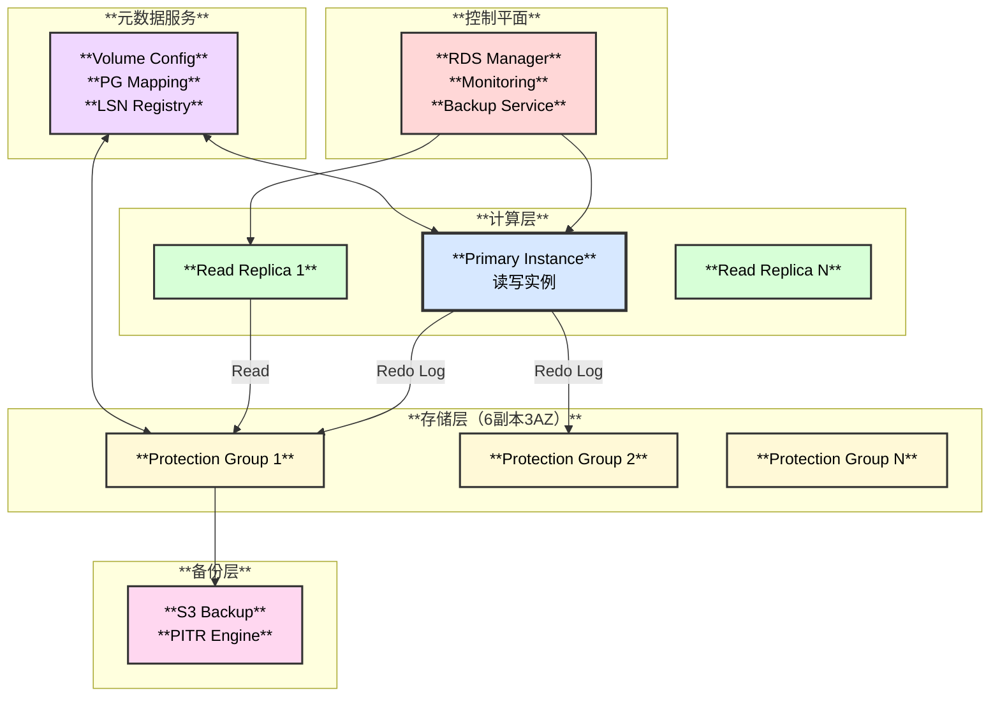
```mermaid
graph TB
    subgraph "**控制平面**"
        CP[**RDS Manager**<br/>**Monitoring**<br/>**Backup Service**]
    end
    
    subgraph "**计算层**"
        P[**Primary Instance**<br/>读写实例]
        R1[**Read Replica 1**]
        R2[**Read Replica N**]
    end
    
    subgraph "**存储层（6副本3AZ）**"
        S1[**Protection Group 1**]
        S2[**Protection Group 2**]
        S3[**Protection Group N**]
    end
    
    subgraph "**元数据服务**"
        M[**Volume Config**<br/>**PG Mapping**<br/>**LSN Registry**]
    end
    
    subgraph "**备份层**"
        B[**S3 Backup**<br/>**PITR Engine**]
    end
    
    CP --> P
    CP --> R1
    P -->|Redo Log| S1
    P -->|Redo Log| S2
    R1 -->|Read| S1
    M <--> P
    M <--> S1
    S1 --> B
    
    style CP fill:#ffd7d7,stroke:#333,stroke-width:2px,color:#000
    style P fill:#d7e8ff,stroke:#333,stroke-width:3px,color:#000
    style R1 fill:#d7ffd7,stroke:#333,stroke-width:2px,color:#000
    style R2 fill:#d7ffd7,stroke:#333,stroke-width:2px,color:#000
    style S1 fill:#fff9d7,stroke:#333,stroke-width:2px,color:#000
    style S2 fill:#fff9d7,stroke:#333,stroke-width:2px,color:#000
    style S3 fill:#fff9d7,stroke:#333,stroke-width:2px,color:#000
    style M fill:#f0d7ff,stroke:#333,stroke-width:2px,color:#000
    style B fill:#ffd7f0,stroke:#333,stroke-width:2px,color:#000
```

### 1.4 核心创新点

| **创新点** | **说明** | **带来的优势** |
|-----------|---------|--------------|
| **Log-is-Database** | 只传输Redo Log，存储层负责应用日志 | 网络流量减少75%，提升5倍性能 |
| **6副本3AZ** | 跨3个可用区的6个副本，4/6写、3/6读 | 容忍2个副本或1个AZ故障，可用性99.99% |
| **10GB Protection Group** | 数据按10GB切分为独立副本组 | 快速故障恢复（<10秒），高度并行 |
| **延迟物化** | 存储层异步应用Redo，按需物化页面 | 降低写延迟，减少写放大 |
| **Quorum协议** | 4/6写Quorum，3/6读Quorum | 强一致性 + 高可用性 + 低延迟 |
| **Gossip协议** | 存储节点间去中心化元数据同步 | 无单点故障，自动修复 |

---

## 2. 总体架构设计

### 2.1 系统分层架构

Aurora系统由5个核心层组成：

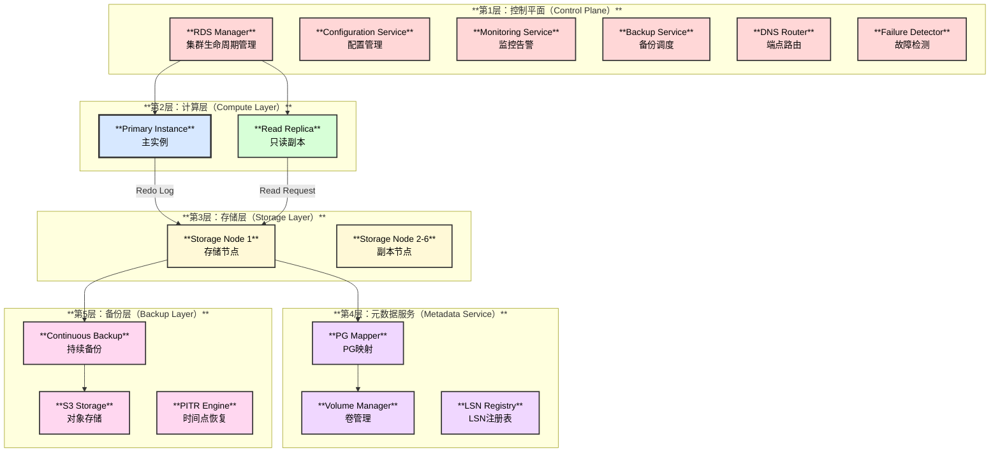
```mermaid
graph TB
    subgraph "**第1层：控制平面（Control Plane）**"
        CP1[**RDS Manager**<br/>集群生命周期管理]
        CP2[**Configuration Service**<br/>配置管理]
        CP3[**Monitoring Service**<br/>监控告警]
        CP4[**Backup Service**<br/>备份调度]
        CP5[**DNS Router**<br/>端点路由]
        CP6[**Failure Detector**<br/>故障检测]
    end
    
    subgraph "**第2层：计算层（Compute Layer）**"
        C1[**Primary Instance**<br/>主实例]
        C2[**Read Replica**<br/>只读副本]
    end
    
    subgraph "**第3层：存储层（Storage Layer）**"
        S1[**Storage Node 1**<br/>存储节点]
        S2[**Storage Node 2-6**<br/>副本节点]
    end
    
    subgraph "**第4层：元数据服务（Metadata Service）**"
        M1[**Volume Manager**<br/>卷管理]
        M2[**PG Mapper**<br/>PG映射]
        M3[**LSN Registry**<br/>LSN注册表]
    end
    
    subgraph "**第5层：备份层（Backup Layer）**"
        B1[**Continuous Backup**<br/>持续备份]
        B2[**S3 Storage**<br/>对象存储]
        B3[**PITR Engine**<br/>时间点恢复]
    end
    
    CP1 --> C1
    CP1 --> C2
    C1 -->|Redo Log| S1
    C2 -->|Read Request| S1
    S1 --> M2
    M2 --> M1
    S1 --> B1
    B1 --> B2
    
    style CP1 fill:#ffd7d7,stroke:#333,stroke-width:2px,color:#000
    style CP2 fill:#ffd7d7,stroke:#333,stroke-width:2px,color:#000
    style CP3 fill:#ffd7d7,stroke:#333,stroke-width:2px,color:#000
    style CP4 fill:#ffd7d7,stroke:#333,stroke-width:2px,color:#000
    style CP5 fill:#ffd7d7,stroke:#333,stroke-width:2px,color:#000
    style CP6 fill:#ffd7d7,stroke:#333,stroke-width:2px,color:#000
    style C1 fill:#d7e8ff,stroke:#333,stroke-width:3px,color:#000
    style C2 fill:#d7ffd7,stroke:#333,stroke-width:2px,color:#000
    style S1 fill:#fff9d7,stroke:#333,stroke-width:2px,color:#000
    style S2 fill:#fff9d7,stroke:#333,stroke-width:2px,color:#000
    style M1 fill:#f0d7ff,stroke:#333,stroke-width:2px,color:#000
    style M2 fill:#f0d7ff,stroke:#333,stroke-width:2px,color:#000
    style M3 fill:#f0d7ff,stroke:#333,stroke-width:2px,color:#000
    style B1 fill:#ffd7f0,stroke:#333,stroke-width:2px,color:#000
    style B2 fill:#ffd7f0,stroke:#333,stroke-width:2px,color:#000
    style B3 fill:#ffd7f0,stroke:#333,stroke-width:2px,color:#000
```

### 2.2 模块功能总览表

| **层级** | **模块** | **主要功能** | **开发优先级** |
|---------|---------|------------|--------------|
| **控制平面** | RDS Manager | 集群创建、删除、故障切换、扩缩容 | P0（最高） |
| | Configuration Service | 配置管理、参数同步 | P0 |
| | Monitoring Service | 监控指标收集、告警生成 | P1 |
| | Backup Service | 备份调度、恢复管理 | P1 |
| | DNS Router | Writer/Reader端点管理 | P0 |
| | Failure Detector | 心跳检测、故障判定 | P0 |
| **计算层** | Primary Instance | SQL执行、事务管理、Redo生成 | P0 |
| | Read Replica | 查询执行、读请求处理 | P1 |
| **存储层** | Storage Node | Redo接收、日志应用、页面管理 | P0 |
| | Gossip Protocol | 副本间元数据同步 | P0 |
| | Segment Repair | 自动修复损坏数据 | P1 |
| **元数据服务** | Volume Manager | Volume配置管理 | P0 |
| | PG Mapper | PG到节点映射 | P0 |
| | LSN Registry | LSN追踪和注册 | P0 |
| **备份层** | Continuous Backup | 增量备份到S3 | P1 |
| | PITR Engine | 时间点恢复 | P2 |

---

## 3. 控制平面（Control Plane）详细设计

### 3.1 模块组成

控制平面负责Aurora集群的全生命周期管理，包含6个核心模块：


```mermaid
graph TB
    subgraph "**RDS Manager（集群管理器）**"
        RM1[**Cluster Lifecycle<br/>集群生命周期**]
        RM2[**Failover Controller<br/>故障切换控制器**]
        RM3[**Scaling Manager<br/>扩缩容管理**]
    end
    
    subgraph "**Configuration Service（配置服务）**"
        CS1[**Cluster Config Store<br/>集群配置存储**]
        CS2[**Parameter Sync<br/>参数同步**]
        CS3[**Topology Manager<br/>拓扑管理**]
    end
    
    subgraph "**Monitoring Service（监控服务）**"
        MS1[**Metrics Collector<br/>指标收集器**]
        MS2[**Alert Manager<br/>告警管理器**]
        MS3[**Health Checker<br/>健康检查器**]
    end
    
    subgraph "**Backup Service（备份服务）**"
        BS1[**Backup Scheduler<br/>备份调度器**]
        BS2[**Restore Manager<br/>恢复管理器**]
        BS3[**Snapshot Controller<br/>快照控制器**]
    end
    
    subgraph "**DNS Router（DNS路由器）**"
        DR1[**Endpoint Manager<br/>端点管理器**]
        DR2[**Connection Router<br/>连接路由器**]
        DR3[**Load Balancer<br/>负载均衡器**]
    end
    
    subgraph "**Failure Detector（故障检测器）**"
        FD1[**Heartbeat Monitor<br/>心跳监控**]
        FD2[**Failure Analyzer<br/>故障分析器**]
        FD3[**Recovery Trigger<br/>恢复触发器**]
    end
    
    RM1 --> CS1
    RM2 --> FD1
    MS1 --> MS2
    BS1 --> BS3
    DR1 --> DR2
    FD2 --> FD3
    
    style RM1 fill:#ffe6e6,stroke:#333,stroke-width:2px,color:#000
    style RM2 fill:#ffe6e6,stroke:#333,stroke-width:2px,color:#000
    style RM3 fill:#ffe6e6,stroke:#333,stroke-width:2px,color:#000
    style CS1 fill:#e6f3ff,stroke:#333,stroke-width:2px,color:#000
    style CS2 fill:#e6f3ff,stroke:#333,stroke-width:2px,color:#000
    style CS3 fill:#e6f3ff,stroke:#333,stroke-width:2px,color:#000
    style MS1 fill:#e6ffe6,stroke:#333,stroke-width:2px,color:#000
    style MS2 fill:#e6ffe6,stroke:#333,stroke-width:2px,color:#000
    style MS3 fill:#e6ffe6,stroke:#333,stroke-width:2px,color:#000
    style BS1 fill:#fff0e6,stroke:#333,stroke-width:2px,color:#000
    style BS2 fill:#fff0e6,stroke:#333,stroke-width:2px,color:#000
    style BS3 fill:#fff0e6,stroke:#333,stroke-width:2px,color:#000
    style DR1 fill:#f0e6ff,stroke:#333,stroke-width:2px,color:#000
    style DR2 fill:#f0e6ff,stroke:#333,stroke-width:2px,color:#000
    style DR3 fill:#f0e6ff,stroke:#333,stroke-width:2px,color:#000
    style FD1 fill:#ffe6f0,stroke:#333,stroke-width:2px,color:#000
    style FD2 fill:#ffe6f0,stroke:#333,stroke-width:2px,color:#000
    style FD3 fill:#ffe6f0,stroke:#333,stroke-width:2px,color:#000
```

### 3.2 RDS Manager（集群管理器）功能需求

#### 3.2.1 模块职责

RDS Manager是控制平面的核心模块，负责Aurora集群的全生命周期管理和故障切换协调。

#### 3.2.2 功能需求清单

| **功能模块** | **功能描述** | **输入** | **输出** | **优先级** |
|------------|------------|---------|---------|----------|
| **集群创建** | 创建新Aurora集群 | 集群配置（实例类型、存储大小、AZ等） | 集群ID、Volume ID、实例列表 | P0 |
| **集群删除** | 删除Aurora集群 | 集群ID、删除选项（保留快照/完全删除） | 删除状态 | P0 |
| **实例添加** | 向集群添加只读副本 | 集群ID、实例类型、AZ | 新实例ID | P1 |
| **实例删除** | 从集群删除只读副本 | 实例ID | 删除状态 | P1 |
| **故障切换** | 主实例故障时切换 | 故障通知、候选副本列表 | 新主实例ID、切换日志 | P0 |
| **计划切换** | 主动切换主实例 | 目标副本ID | 切换状态 | P1 |
| **扩缩容** | 调整实例规格 | 实例ID、目标规格 | 扩缩容状态 | P1 |
| **存储扩展** | 自动扩展存储容量 | Volume ID、当前使用率 | 新PG分配列表 | P0 |

#### 3.2.3 核心数据结构

**集群元数据（ClusterMetadata）**

```c
struct ClusterMetadata {
    char cluster_id[64];              // 集群ID（UUID）
    char cluster_name[256];           // 集群名称
    char engine_version[32];          // 引擎版本（MySQL 8.4.3）
    char volume_id[64];               // Volume ID
    ClusterStatus status;             // 集群状态
    time_t create_time;               // 创建时间
    time_t modify_time;               // 修改时间
    
    // 主实例信息
    char primary_instance_id[64];     // 主实例ID
    char primary_endpoint[256];       // 主实例端点
    
    // 副本列表
    int replica_count;                // 副本数量
    char replica_ids[15][64];         // 副本ID列表（最多15个）
    char reader_endpoint[256];        // 读端点（负载均衡）
    
    // 网络配置
    char vpc_id[64];                  // VPC ID
    char subnet_ids[3][64];           // 子网ID（跨3个AZ）
    char security_group_id[64];       // 安全组ID
    
    // 存储配置
    uint64_t allocated_storage_gb;    // 已分配存储（GB）
    uint64_t used_storage_gb;         // 已使用存储（GB）
    int pg_count;                     // Protection Group数量
    
    // 备份配置
    int backup_retention_days;        // 备份保留天数
    time_t latest_backup_time;        // 最新备份时间
};

enum ClusterStatus {
    CLUSTER_CREATING = 0,    // 创建中
    CLUSTER_AVAILABLE,       // 可用
    CLUSTER_MODIFYING,       // 修改中
    CLUSTER_UPGRADING,       // 升级中
    CLUSTER_DELETING,        // 删除中
    CLUSTER_FAILED,          // 故障
    CLUSTER_MAINTENANCE      // 维护中
};
```

**实例元数据（InstanceMetadata）**

```c
struct InstanceMetadata {
    char instance_id[64];             // 实例ID
    char cluster_id[64];              // 所属集群ID
    InstanceRole role;                // 实例角色
    InstanceType type;                // 实例类型
    InstanceStatus status;            // 实例状态
    
    // 网络配置
    char endpoint[256];               // 实例端点
    int port;                         // 端口（默认3306）
    char availability_zone[64];       // 可用区
    char private_ip[64];              // 私有IP
    
    // 计算资源
    int vcpu_count;                   // vCPU数量
    uint64_t memory_mb;               // 内存（MB）
    
    // LSN信息
    uint64_t applied_lsn;             // 已应用LSN
    uint64_t vdl;                     // Volume Durable LSN
    uint64_t vcl;                     // Volume Complete LSN
    time_t last_lsn_update_time;      // LSN最后更新时间
    
    // 健康状态
    HealthStatus health_status;       // 健康状态
    time_t last_heartbeat_time;       // 最后心跳时间
    float cpu_usage;                  // CPU使用率
    float memory_usage;               // 内存使用率
};

enum InstanceRole {
    ROLE_PRIMARY = 0,      // 主实例
    ROLE_REPLICA,          // 只读副本
    ROLE_SERVERLESS        // Serverless实例
};

enum InstanceType {
    TYPE_DB_R5_LARGE = 0,     // 2vCPU, 16GB
    TYPE_DB_R5_XLARGE,        // 4vCPU, 32GB
    TYPE_DB_R5_2XLARGE,       // 8vCPU, 64GB
    TYPE_DB_R5_4XLARGE,       // 16vCPU, 128GB
    TYPE_DB_R5_8XLARGE,       // 32vCPU, 256GB
    TYPE_DB_R5_16XLARGE       // 64vCPU, 512GB
};

enum InstanceStatus {
    INSTANCE_CREATING = 0,   // 创建中
    INSTANCE_AVAILABLE,      // 可用
    INSTANCE_BACKING_UP,     // 备份中
    INSTANCE_MODIFYING,      // 修改中
    INSTANCE_REBOOTING,      // 重启中
    INSTANCE_FAILED,         // 故障
    INSTANCE_STOPPED         // 已停止
};

enum HealthStatus {
    HEALTH_OK = 0,          // 健康
    HEALTH_WARNING,         // 警告
    HEALTH_CRITICAL,        // 严重
    HEALTH_UNKNOWN          // 未知
};
```

#### 3.2.4 核心接口定义

**API接口**

```c
// 集群管理接口
int create_cluster(const ClusterConfig *config, ClusterMetadata *cluster);
int delete_cluster(const char *cluster_id, bool delete_snapshots);
int describe_cluster(const char *cluster_id, ClusterMetadata *cluster);
int list_clusters(ClusterMetadata clusters[], int *count);

// 实例管理接口
int add_instance(const char *cluster_id, const InstanceConfig *config, 
                 InstanceMetadata *instance);
int remove_instance(const char *instance_id);
int describe_instance(const char *instance_id, InstanceMetadata *instance);
int modify_instance(const char *instance_id, const InstanceConfig *new_config);

// 故障切换接口
int trigger_failover(const char *cluster_id, const char *target_instance_id);
int promote_replica(const char *instance_id);
int demote_primary(const char *instance_id);

// 扩缩容接口
int scale_instance(const char *instance_id, InstanceType new_type);
int scale_storage(const char *volume_id, uint64_t target_size_gb);
```

**内部接口**

```c
// 与Configuration Service交互
int register_cluster(const ClusterMetadata *cluster);
int update_cluster_config(const char *cluster_id, const ClusterMetadata *cluster);
int get_cluster_topology(const char *cluster_id, ClusterTopology *topology);

// 与Failure Detector交互
int register_health_check(const char *instance_id, HealthCheckConfig *config);
int handle_failure_event(const FailureEvent *event);

// 与DNS Router交互
int update_writer_endpoint(const char *cluster_id, const char *instance_id);
int update_reader_endpoint(const char *cluster_id, const char *instance_ids[], int count);

// 与Monitoring Service交互
int report_cluster_metrics(const char *cluster_id, const ClusterMetrics *metrics);
int subscribe_alerts(const char *cluster_id, AlertCallback callback);
```

#### 3.2.5 故障切换流程设计

**故障切换状态机**

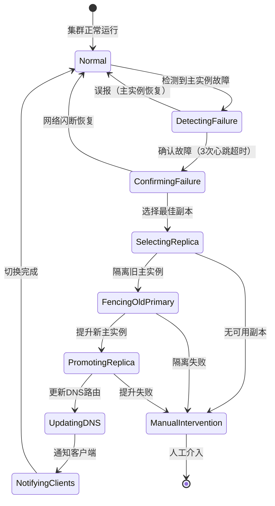
```mermaid
stateDiagram-v2
    [*] --> Normal: 集群正常运行
    Normal --> DetectingFailure: 检测到主实例故障
    DetectingFailure --> ConfirmingFailure: 确认故障（3次心跳超时）
    ConfirmingFailure --> SelectingReplica: 选择最佳副本
    SelectingReplica --> FencingOldPrimary: 隔离旧主实例
    FencingOldPrimary --> PromotingReplica: 提升新主实例
    PromotingReplica --> UpdatingDNS: 更新DNS路由
    UpdatingDNS --> NotifyingClients: 通知客户端
    NotifyingClients --> Normal: 切换完成
    
    DetectingFailure --> Normal: 误报（主实例恢复）
    ConfirmingFailure --> Normal: 网络闪断恢复
    SelectingReplica --> ManualIntervention: 无可用副本
    FencingOldPrimary --> ManualIntervention: 隔离失败
    PromotingReplica --> ManualIntervention: 提升失败
    ManualIntervention --> [*]: 人工介入
```

#### 3.2.6 故障切换时序图

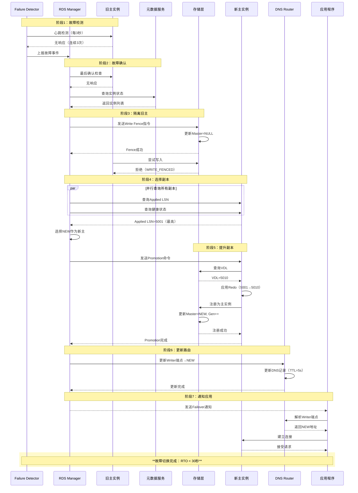
```mermaid
sequenceDiagram
    participant FD as Failure Detector
    participant RM as RDS Manager
    participant OLD as 旧主实例
    participant META as 元数据服务
    participant ST as 存储层
    participant NEW as 新主实例
    participant DNS as DNS Router
    participant APP as 应用程序
    
    Note over FD,OLD: 阶段1：故障检测
    FD->>OLD: 心跳检测（每3秒）
    OLD--xFD: 无响应（连续3次）
    FD->>RM: 上报故障事件
    
    Note over RM,META: 阶段2：故障确认
    RM->>OLD: 最后确认检查
    OLD--xRM: 无响应
    RM->>META: 查询实例状态
    META-->>RM: 返回实例列表
    
    Note over RM,ST: 阶段3：隔离旧主
    RM->>ST: 发送Write Fence指令
    ST->>ST: 更新Master=NULL
    ST-->>RM: Fence成功
    OLD->>ST: 尝试写入
    ST-->>OLD: 拒绝（WRITE_FENCED）
    
    Note over RM,NEW: 阶段4：选择副本
    par 并行查询所有副本
        RM->>NEW: 查询Applied LSN
        RM->>NEW: 查询健康状态
    end
    NEW-->>RM: Applied LSN=5001（最高）
    RM->>RM: 选择NEW作为新主
    
    Note over NEW,ST: 阶段5：提升副本
    RM->>NEW: 发送Promotion命令
    NEW->>ST: 查询VDL
    ST-->>NEW: VDL=5010
    NEW->>NEW: 应用Redo（5001→5010）
    NEW->>ST: 注册为主实例
    ST->>ST: 更新Master=NEW, Gen++
    ST-->>NEW: 注册成功
    NEW-->>RM: Promotion完成
    
    Note over RM,DNS: 阶段6：更新路由
    RM->>DNS: 更新Writer端点→NEW
    DNS->>DNS: 更新DNS记录（TTL=5s）
    DNS-->>RM: 更新完成
    
    Note over RM,APP: 阶段7：通知应用
    RM-->>APP: 发送Failover通知
    APP->>DNS: 解析Writer端点
    DNS-->>APP: 返回NEW地址
    APP->>NEW: 建立连接
    NEW-->>APP: 接受请求
    
    rect rgb(255, 250, 205)
    Note over FD,APP: **故障切换完成：RTO < 30秒**
    end
```

### 3.3 Configuration Service（配置服务）功能需求

#### 3.3.1 模块职责

Configuration Service负责管理Aurora集群的所有配置信息，包括集群拓扑、参数配置、网络配置等，并提供配置的版本管理和同步功能。

#### 3.3.2 功能需求清单

| **功能模块** | **功能描述** | **输入** | **输出** | **优先级** |
|------------|------------|---------|---------|----------|
| **配置存储** | 持久化存储集群配置 | 配置对象、版本号 | 存储状态 | P0 |
| **配置查询** | 查询集群配置信息 | 集群ID、配置键 | 配置值 | P0 |
| **配置更新** | 更新集群配置 | 集群ID、配置变更 | 新版本号 | P0 |
| **参数同步** | 同步参数到实例 | 集群ID、参数列表 | 同步状态 | P0 |
| **拓扑管理** | 管理集群网络拓扑 | 集群ID | 拓扑信息 | P0 |
| **版本管理** | 配置版本控制 | 集群ID | 版本历史 | P1 |
| **配置回滚** | 回滚到历史版本 | 集群ID、目标版本号 | 回滚状态 | P1 |
| **配置验证** | 验证配置合法性 | 配置对象 | 验证结果 | P0 |

#### 3.3.3 核心数据结构

**集群配置（ClusterConfig）**

```c
struct ClusterConfig {
    char cluster_id[64];              // 集群ID
    uint32_t config_version;          // 配置版本号
    time_t last_modified;             // 最后修改时间
    
    // 数据库参数
    struct {
        uint64_t innodb_buffer_pool_size;     // Buffer Pool大小（字节）
        uint32_t max_connections;              // 最大连接数
        uint32_t innodb_log_buffer_size;       // Redo Log Buffer大小（字节）
        uint32_t innodb_io_capacity;           // IO容量
        uint32_t innodb_read_io_threads;       // 读IO线程数
        uint32_t innodb_write_io_threads;      // 写IO线程数
        bool innodb_flush_log_at_trx_commit;   // 事务提交时刷日志
        char default_storage_engine[32];       // 默认存储引擎
        char character_set[32];                // 字符集
        char time_zone[64];                    // 时区
    } db_params;
    
    // Aurora特定参数
    struct {
        uint32_t redo_batch_size;              // Redo批量发送大小
        uint32_t redo_compression_level;       // Redo压缩级别（0-9）
        uint32_t quorum_write_timeout_ms;      // Quorum写超时（毫秒）
        uint32_t quorum_read_timeout_ms;       // Quorum读超时（毫秒）
        uint32_t gossip_interval_ms;           // Gossip间隔（毫秒）
        uint32_t heartbeat_interval_ms;        // 心跳间隔（毫秒）
        uint32_t heartbeat_timeout_ms;         // 心跳超时（毫秒）
        uint32_t segment_repair_threshold;     // 分段修复阈值
        bool enable_fast_failover;             // 启用快速故障切换
    } aurora_params;
    
    // 网络配置
    struct {
        char vpc_id[64];                       // VPC ID
        char subnet_ids[3][64];                // 子网ID（3个AZ）
        char security_group_ids[5][64];        // 安全组ID列表
        int security_group_count;              // 安全组数量
        bool publicly_accessible;              // 是否公网访问
        int port;                              // 端口
    } network_config;
    
    // 备份配置
    struct {
        int backup_retention_days;             // 备份保留天数（1-35）
        char preferred_backup_window[32];      // 备份窗口（HH:MM-HH:MM UTC）
        bool enable_continuous_backup;         // 启用持续备份
        int snapshot_interval_hours;           // 快照间隔（小时）
    } backup_config;
    
    // 监控配置
    struct {
        bool enable_enhanced_monitoring;       // 启用增强监控
        int monitoring_interval_seconds;       // 监控间隔（秒）
        char cloudwatch_log_group[256];        // CloudWatch日志组
        bool enable_performance_insights;      // 启用性能洞察
    } monitoring_config;
};
```

**集群拓扑（ClusterTopology）**

```c
struct ClusterTopology {
    char cluster_id[64];              // 集群ID
    char volume_id[64];               // Volume ID
    
    // 主实例
    struct {
        char instance_id[64];         // 实例ID
        char endpoint[256];           // 端点
        char availability_zone[64];   // 可用区
        char private_ip[64];          // 私有IP
        char public_ip[64];           // 公网IP（如果启用）
    } primary;
    
    // 只读副本列表
    int replica_count;
    struct {
        char instance_id[64];
        char endpoint[256];
        char availability_zone[64];
        char private_ip[64];
        int priority;                 // 提升优先级（用于故障切换）
    } replicas[15];
    
    // 存储节点映射
    int storage_node_count;
    struct {
        char node_id[64];             // 存储节点ID
        char availability_zone[64];   // 可用区
        char private_ip[64];          // 私有IP
        int pg_count;                 // 该节点上的PG数量
        char pg_ids[1000][64];        // PG ID列表
    } storage_nodes[18];              // 每个AZ 6个节点，共18个
    
    // PG到节点的映射
    int pg_mapping_count;
    struct {
        char pg_id[64];               // PG ID
        uint64_t pg_offset_gb;        // PG在Volume中的偏移（GB）
        char replica_node_ids[6][64]; // 6个副本节点ID
        char availability_zones[6][64]; // 副本所在AZ
    } pg_mappings[13000];             // 最多128TB/10GB=13000个PG
};
```

#### 3.3.4 核心接口定义

```c
// 配置管理接口
int save_cluster_config(const ClusterConfig *config);
int load_cluster_config(const char *cluster_id, ClusterConfig *config);
int update_cluster_config(const char *cluster_id, const ConfigUpdate *update);
int list_config_versions(const char *cluster_id, ConfigVersion versions[], int *count);
int rollback_config(const char *cluster_id, uint32_t target_version);

// 参数同步接口
int sync_params_to_instance(const char *instance_id, const ClusterConfig *config);
int sync_params_to_all_instances(const char *cluster_id);
int validate_params(const ClusterConfig *config, ValidationResult *result);

// 拓扑管理接口
int get_cluster_topology(const char *cluster_id, ClusterTopology *topology);
int update_instance_in_topology(const char *cluster_id, const InstanceInfo *instance);
int remove_instance_from_topology(const char *cluster_id, const char *instance_id);
int get_pg_mapping(const char *pg_id, PGMapping *mapping);
int update_pg_mapping(const char *pg_id, const PGMapping *mapping);

// 配置订阅接口（用于配置变更通知）
int subscribe_config_changes(const char *cluster_id, ConfigChangeCallback callback);
int unsubscribe_config_changes(const char *cluster_id, int subscription_id);
```

### 3.4 Monitoring Service（监控服务）功能需求

#### 3.4.1 模块职责

Monitoring Service负责收集Aurora集群的性能指标、健康状态、日志信息，并提供告警、可视化和分析功能。

#### 3.4.2 功能需求清单

| **功能模块** | **功能描述** | **输入** | **输出** | **优先级** |
|------------|------------|---------|---------|----------|
| **指标收集** | 收集实例和存储层指标 | 集群ID、指标类型 | 指标数据 | P0 |
| **健康检查** | 定期检查组件健康状态 | 组件ID | 健康状态 | P0 |
| **告警管理** | 生成和发送告警 | 告警规则、指标数据 | 告警事件 | P0 |
| **日志收集** | 收集系统日志 | 日志源、时间范围 | 日志条目 | P1 |
| **性能分析** | 分析性能瓶颈 | 集群ID、时间范围 | 分析报告 | P1 |
| **指标聚合** | 聚合和汇总指标 | 原始指标、聚合规则 | 聚合指标 | P1 |
| **可视化** | 提供监控仪表盘 | 集群ID | 仪表盘数据 | P2 |

#### 3.4.3 核心数据结构

**监控指标（Metrics）**

```c
// 实例指标
struct InstanceMetrics {
    char instance_id[64];             // 实例ID
    time_t timestamp;                 // 时间戳
    
    // CPU指标
    float cpu_usage_percent;          // CPU使用率（%）
    float cpu_user_percent;           // 用户态CPU（%）
    float cpu_system_percent;         // 系统态CPU（%）
    float cpu_iowait_percent;         // IO等待CPU（%）
    
    // 内存指标
    uint64_t memory_used_bytes;       // 已使用内存（字节）
    uint64_t memory_available_bytes;  // 可用内存（字节）
    float memory_usage_percent;       // 内存使用率（%）
    uint64_t buffer_pool_used_bytes;  // Buffer Pool使用（字节）
    uint64_t buffer_pool_hit_ratio;   // Buffer Pool命中率（%）
    
    // 连接指标
    int active_connections;           // 活跃连接数
    int max_connections;              // 最大连接数
    int connections_per_second;       // 每秒连接数
    int aborted_connections;          // 中止连接数
    
    // 事务指标
    uint64_t transactions_per_second; // 每秒事务数（TPS）
    uint64_t queries_per_second;      // 每秒查询数（QPS）
    uint64_t commits_per_second;      // 每秒提交数
    uint64_t rollbacks_per_second;    // 每秒回滚数
    double avg_transaction_latency_ms; // 平均事务延迟（毫秒）
    
    // IO指标
    uint64_t read_iops;               // 读IOPS
    uint64_t write_iops;              // 写IOPS
    uint64_t read_throughput_mbps;    // 读吞吐量（MB/s）
    uint64_t write_throughput_mbps;   // 写吞吐量（MB/s）
    double avg_read_latency_ms;       // 平均读延迟（毫秒）
    double avg_write_latency_ms;      // 平均写延迟（毫秒）
    
    // Redo日志指标
    uint64_t redo_log_generated_mbps; // Redo生成速率（MB/s）
    uint64_t redo_log_sent_mbps;      // Redo发送速率（MB/s）
    double redo_quorum_latency_ms;    // Redo Quorum延迟（毫秒）
    int redo_quorum_success_rate;     // Quorum成功率（%）
};

// 存储层指标
struct StorageMetrics {
    char storage_node_id[64];         // 存储节点ID
    time_t timestamp;                 // 时间戳
    
    // LSN指标
    uint64_t vdl;                     // Volume Durable LSN
    uint64_t vcl;                     // Volume Complete LSN
    uint64_t lsn_lag;                 // LSN滞后量（VDL - VCL）
    uint64_t lsn_apply_rate;          // LSN应用速率（/秒）
    
    // 存储指标
    uint64_t used_storage_gb;         // 已使用存储（GB）
    uint64_t available_storage_gb;    // 可用存储（GB）
    float storage_usage_percent;      // 存储使用率（%）
    int pg_count;                     // PG数量
    
    // IO指标
    uint64_t disk_read_iops;          // 磁盘读IOPS
    uint64_t disk_write_iops;         // 磁盘写IOPS
    uint64_t disk_read_mbps;          // 磁盘读吞吐（MB/s）
    uint64_t disk_write_mbps;         // 磁盘写吞吐（MB/s）
    
    // Gossip指标
    uint64_t gossip_messages_sent;    // 发送Gossip消息数
    uint64_t gossip_messages_received; // 接收Gossip消息数
    double gossip_latency_ms;         // Gossip延迟（毫秒）
    
    // 修复指标
    uint64_t segments_repaired;       // 已修复分段数
    uint64_t corruption_detected;     // 检测到损坏数
    double repair_latency_ms;         // 修复延迟（毫秒）
};
```

**告警规则（AlertRule）**

```c
struct AlertRule {
    char rule_id[64];                 // 规则ID
    char rule_name[256];              // 规则名称
    AlertType type;                   // 告警类型
    AlertSeverity severity;           // 告警级别
    bool enabled;                     // 是否启用
    
    // 触发条件
    char metric_name[128];            // 指标名称
    ComparisonOperator operator;      // 比较运算符
    double threshold;                 // 阈值
    int evaluation_periods;           // 评估周期数
    int datapoints_to_alarm;          // 触发告警的数据点数
    
    // 通知配置
    char notification_targets[10][256]; // 通知目标（邮件、短信、Webhook）
    int notification_target_count;
    int cooldown_seconds;             // 冷却时间（秒）
};

enum AlertType {
    ALERT_CPU_HIGH = 0,           // CPU高
    ALERT_MEMORY_HIGH,            // 内存高
    ALERT_STORAGE_FULL,           // 存储满
    ALERT_REPLICATION_LAG,        // 复制延迟
    ALERT_CONNECTION_OVERFLOW,    // 连接溢出
    ALERT_INSTANCE_DOWN,          // 实例宕机
    ALERT_QUORUM_FAILURE,         // Quorum失败
    ALERT_FAILOVER_TRIGGERED      // 故障切换触发
};

enum AlertSeverity {
    SEVERITY_INFO = 0,            // 信息
    SEVERITY_WARNING,             // 警告
    SEVERITY_ERROR,               // 错误
    SEVERITY_CRITICAL             // 严重
};

enum ComparisonOperator {
    OP_GREATER_THAN = 0,          // 大于
    OP_GREATER_THAN_OR_EQUAL,     // 大于等于
    OP_LESS_THAN,                 // 小于
    OP_LESS_THAN_OR_EQUAL,        // 小于等于
    OP_EQUAL                      // 等于
};
```

#### 3.4.4 核心接口定义

```c
// 指标收集接口
int collect_instance_metrics(const char *instance_id, InstanceMetrics *metrics);
int collect_storage_metrics(const char *storage_node_id, StorageMetrics *metrics);
int batch_collect_metrics(const char *cluster_id, ClusterMetrics *metrics);
int push_metrics_to_storage(const Metrics *metrics);

// 告警管理接口
int create_alert_rule(const AlertRule *rule);
int update_alert_rule(const char *rule_id, const AlertRule *rule);
int delete_alert_rule(const char *rule_id);
int list_alert_rules(const char *cluster_id, AlertRule rules[], int *count);
int evaluate_alert_rules(const char *cluster_id);
int send_alert(const Alert *alert);

// 健康检查接口
int check_instance_health(const char *instance_id, HealthStatus *status);
int check_storage_node_health(const char *node_id, HealthStatus *status);
int check_cluster_health(const char *cluster_id, ClusterHealthStatus *status);

// 日志收集接口
int collect_error_logs(const char *instance_id, time_t start, time_t end, LogEntry logs[], int *count);
int collect_slow_query_logs(const char *instance_id, time_t start, time_t end, SlowQuery queries[], int *count);
int collect_audit_logs(const char *cluster_id, time_t start, time_t end, AuditLogEntry logs[], int *count);
```

### 3.5 Failure Detector（故障检测器）功能需求

#### 3.5.1 模块职责

Failure Detector负责持续监控Aurora集群中所有组件的健康状态，及时发现故障并触发故障恢复流程。

#### 3.5.2 功能需求清单

| **功能模块** | **功能描述** | **输入** | **输出** | **优先级** |
|------------|------------|---------|---------|----------|
| **心跳检测** | 定期向实例发送心跳 | 实例ID、心跳配置 | 心跳响应 | P0 |
| **故障判定** | 判断实例是否故障 | 心跳历史、判定规则 | 故障状态 | P0 |
| **故障分类** | 分类故障类型 | 故障状态、诊断信息 | 故障类型 | P0 |
| **故障恢复触发** | 触发故障恢复流程 | 故障事件 | 恢复任务ID | P0 |
| **假死检测** | 检测网络分区导致的假死 | 实例状态、网络状态 | 假死判定 | P0 |
| **脑裂预防** | 防止双主问题 | 主实例列表 | 隔离决策 | P0 |
| **健康评分** | 计算组件健康评分 | 健康指标 | 健康评分（0-100） | P1 |

#### 3.5.3 核心数据结构

**心跳配置（HeartbeatConfig）**

```c
struct HeartbeatConfig {
    char target_id[64];               // 目标ID（实例或节点）
    TargetType target_type;           // 目标类型
    
    // 心跳参数
    int interval_ms;                  // 心跳间隔（毫秒，默认3000）
    int timeout_ms;                   // 心跳超时（毫秒，默认1000）
    int failure_threshold;            // 故障判定阈值（连续失败次数，默认3）
    int recovery_threshold;           // 恢复判定阈值（连续成功次数，默认3）
    
    // 检测方法
    bool enable_tcp_check;            // TCP连接检查
    bool enable_mysql_check;          // MySQL协议检查
    bool enable_query_check;          // 查询检查（SELECT 1）
    
    // 回调函数
    HeartbeatCallback success_callback;  // 心跳成功回调
    HeartbeatCallback failure_callback;  // 心跳失败回调
};

enum TargetType {
    TARGET_PRIMARY_INSTANCE = 0,   // 主实例
    TARGET_REPLICA_INSTANCE,       // 只读副本
    TARGET_STORAGE_NODE            // 存储节点
};
```

**故障事件（FailureEvent）**

```c
struct FailureEvent {
    char event_id[64];                // 事件ID
    time_t event_time;                // 事件时间
    char target_id[64];               // 故障目标ID
    TargetType target_type;           // 目标类型
    FailureType failure_type;         // 故障类型
    FailureSeverity severity;         // 故障严重程度
    
    // 故障详情
    char failure_reason[512];         // 故障原因
    int consecutive_failures;         // 连续失败次数
    time_t first_failure_time;        // 首次故障时间
    time_t last_failure_time;         // 最后故障时间
    
    // 诊断信息
    bool network_reachable;           // 网络是否可达
    bool tcp_connectable;             // TCP是否可连接
    bool mysql_responding;            // MySQL是否响应
    int response_time_ms;             // 响应时间（毫秒）
    
    // 恢复信息
    RecoveryAction recommended_action; // 推荐恢复动作
    bool auto_recovery_enabled;       // 是否启用自动恢复
    RecoveryStatus recovery_status;   // 恢复状态
};

enum FailureType {
    FAILURE_HEARTBEAT_TIMEOUT = 0,  // 心跳超时
    FAILURE_NETWORK_PARTITION,      // 网络分区
    FAILURE_PROCESS_CRASH,          // 进程崩溃
    FAILURE_DISK_FULL,              // 磁盘满
    FAILURE_OOM,                    // 内存溢出
    FAILURE_QUORUM_LOST,            // Quorum丢失
    FAILURE_SPLIT_BRAIN,            // 脑裂
    FAILURE_UNKNOWN                 // 未知故障
};

enum FailureSeverity {
    SEV_MINOR = 0,              // 轻微（不影响服务）
    SEV_MAJOR,                  // 主要（部分功能受影响）
    SEV_CRITICAL                // 严重（服务不可用）
};

enum RecoveryAction {
    ACTION_NONE = 0,            // 无需恢复
    ACTION_RESTART,             // 重启实例
    ACTION_FAILOVER,            // 故障切换
    ACTION_FENCE,               // 隔离实例
    ACTION_REPAIR,              // 修复数据
    ACTION_MANUAL_INTERVENTION  // 人工介入
};

enum RecoveryStatus {
    RECOVERY_NOT_STARTED = 0,   // 未开始
    RECOVERY_IN_PROGRESS,       // 进行中
    RECOVERY_SUCCEEDED,         // 成功
    RECOVERY_FAILED,            // 失败
    RECOVERY_CANCELLED          // 取消
};
```

#### 3.5.4 核心接口定义

```c
// 心跳检测接口
int register_heartbeat_target(const HeartbeatConfig *config);
int unregister_heartbeat_target(const char *target_id);
int send_heartbeat(const char *target_id, HeartbeatResponse *response);
int get_heartbeat_status(const char *target_id, HeartbeatStatus *status);

// 故障判定接口
int evaluate_failure(const char *target_id, FailureEvent *event);
int classify_failure(const FailureEvent *event, FailureType *type);
int calculate_health_score(const char *target_id, int *score);

// 故障恢复接口
int trigger_recovery(const FailureEvent *event, char *recovery_task_id);
int get_recovery_status(const char *recovery_task_id, RecoveryStatus *status);
int cancel_recovery(const char *recovery_task_id);

// 假死检测接口
int detect_network_partition(const char *target_id, bool *is_partitioned);
int detect_split_brain(const char *cluster_id, bool *has_split_brain);
int fence_instance(const char *instance_id);

// 事件通知接口
int subscribe_failure_events(const char *cluster_id, FailureEventCallback callback);
int unsubscribe_failure_events(int subscription_id);
```

#### 3.5.5 心跳检测时序图

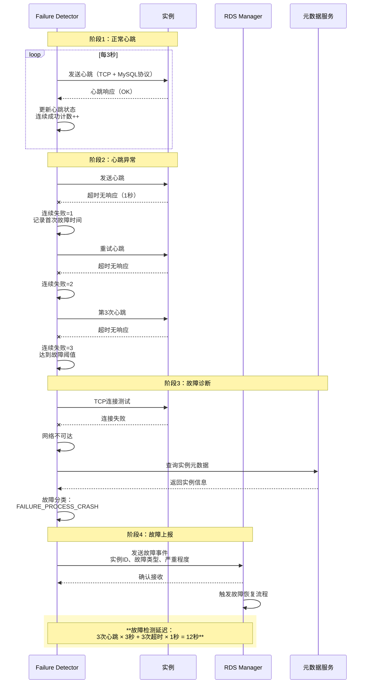
```mermaid
sequenceDiagram
    participant FD as Failure Detector
    participant INS as 实例
    participant RM as RDS Manager
    participant META as 元数据服务
    
    Note over FD,INS: 阶段1：正常心跳
    loop 每3秒
        FD->>INS: 发送心跳（TCP + MySQL协议）
        INS-->>FD: 心跳响应（OK）
        FD->>FD: 更新心跳状态<br/>连续成功计数++
    end
    
    Note over FD,INS: 阶段2：心跳异常
    FD->>INS: 发送心跳
    INS--xFD: 超时无响应（1秒）
    FD->>FD: 连续失败=1<br/>记录首次故障时间
    
    FD->>INS: 重试心跳
    INS--xFD: 超时无响应
    FD->>FD: 连续失败=2
    
    FD->>INS: 第3次心跳
    INS--xFD: 超时无响应
    FD->>FD: 连续失败=3<br/>达到故障阈值
    
    Note over FD,META: 阶段3：故障诊断
    FD->>INS: TCP连接测试
    INS--xFD: 连接失败
    FD->>FD: 网络不可达
    
    FD->>META: 查询实例元数据
    META-->>FD: 返回实例信息
    
    FD->>FD: 故障分类：<br/>FAILURE_PROCESS_CRASH
    
    Note over FD,RM: 阶段4：故障上报
    FD->>RM: 发送故障事件<br/>实例ID、故障类型、严重程度
    RM-->>FD: 确认接收
    
    RM->>RM: 触发故障恢复流程
    
    rect rgb(255, 250, 205)
    Note over FD,RM: **故障检测延迟：<br/>3次心跳 × 3秒 + 3次超时 × 1秒 = 12秒**
    end
```

---

## 4. 计算层（Compute Layer）详细设计

### 4.1 计算层架构

计算层包含主实例（Primary Instance）和只读副本（Read Replica），基于MySQL 8.4.3进行改造，实现Log-is-Database架构。

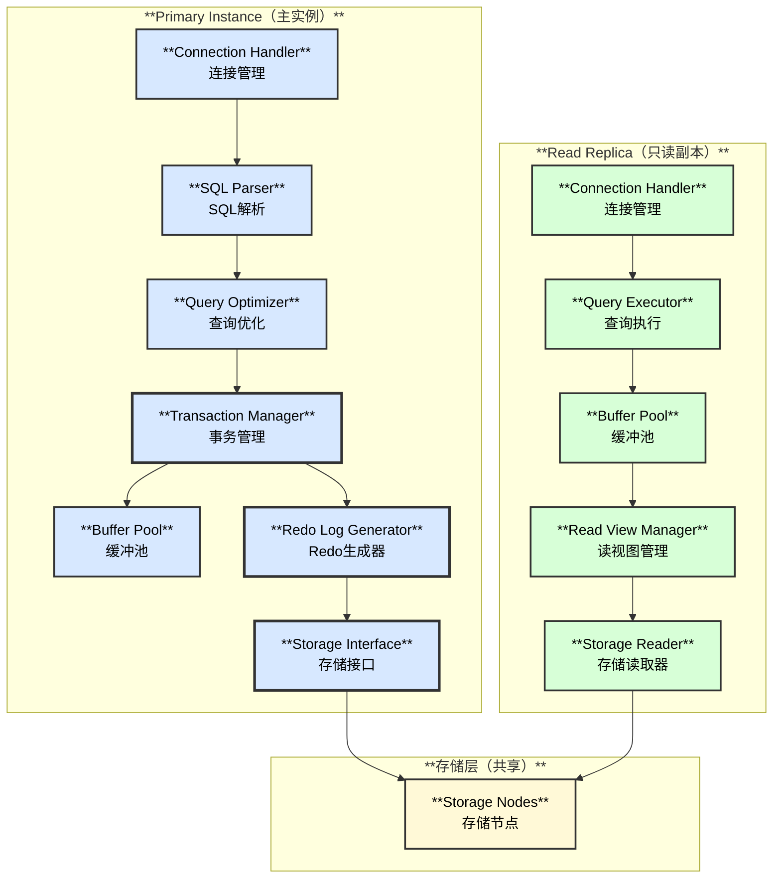
```mermaid
graph TB
    subgraph "**Primary Instance（主实例）**"
        P1[**Connection Handler**<br/>连接管理]
        P2[**SQL Parser**<br/>SQL解析]
        P3[**Query Optimizer**<br/>查询优化]
        P4[**Transaction Manager**<br/>事务管理]
        P5[**Buffer Pool**<br/>缓冲池]
        P6[**Redo Log Generator**<br/>Redo生成器]
        P7[**Storage Interface**<br/>存储接口]
    end
    
    subgraph "**Read Replica（只读副本）**"
        R1[**Connection Handler**<br/>连接管理]
        R2[**Query Executor**<br/>查询执行]
        R3[**Buffer Pool**<br/>缓冲池]
        R4[**Read View Manager**<br/>读视图管理]
        R5[**Storage Reader**<br/>存储读取器]
    end
    
    subgraph "**存储层（共享）**"
        S1[**Storage Nodes**<br/>存储节点]
    end
    
    P1 --> P2
    P2 --> P3
    P3 --> P4
    P4 --> P5
    P4 --> P6
    P6 --> P7
    P7 --> S1
    
    R1 --> R2
    R2 --> R3
    R3 --> R4
    R4 --> R5
    R5 --> S1
    
    style P1 fill:#d7e8ff,stroke:#333,stroke-width:2px,color:#000
    style P2 fill:#d7e8ff,stroke:#333,stroke-width:2px,color:#000
    style P3 fill:#d7e8ff,stroke:#333,stroke-width:2px,color:#000
    style P4 fill:#d7e8ff,stroke:#333,stroke-width:3px,color:#000
    style P5 fill:#d7e8ff,stroke:#333,stroke-width:2px,color:#000
    style P6 fill:#d7e8ff,stroke:#333,stroke-width:3px,color:#000
    style P7 fill:#d7e8ff,stroke:#333,stroke-width:3px,color:#000
    
    style R1 fill:#d7ffd7,stroke:#333,stroke-width:2px,color:#000
    style R2 fill:#d7ffd7,stroke:#333,stroke-width:2px,color:#000
    style R3 fill:#d7ffd7,stroke:#333,stroke-width:2px,color:#000
    style R4 fill:#d7ffd7,stroke:#333,stroke-width:2px,color:#000
    style R5 fill:#d7ffd7,stroke:#333,stroke-width:2px,color:#000
    
    style S1 fill:#fff9d7,stroke:#333,stroke-width:2px,color:#000
```

### 4.2 Primary Instance（主实例）功能需求

#### 4.2.1 模块职责

主实例是Aurora集群中唯一可以接受写入请求的实例，负责处理所有INSERT、UPDATE、DELETE操作，并生成Redo Log发送到存储层。

#### 4.2.2 功能需求清单

| **功能模块** | **功能描述** | **输入** | **输出** | **优先级** |
|------------|------------|---------|---------|----------|
| **Redo Log Generator** | 生成物理Redo日志 | 数据页修改操作 | Redo Log记录 | P0 |
| **Quorum Write Manager** | 管理Quorum写入 | Redo Log、目标节点列表 | Quorum确认 | P0 |
| **LSN Generator** | 生成递增LSN | 事务提交 | LSN | P0 |
| **Transaction Coordinator** | 协调分布式事务 | 事务操作 | 提交/回滚 | P0 |
| **Buffer Pool Manager** | 管理数据页缓存 | 页面ID | 页面数据 | P0 |
| **Storage Interface** | 与存储层通信 | Redo Log、读请求 | ACK、数据页 | P0 |
| **Instance Registration** | 注册为主实例 | 实例ID、Volume ID | 注册凭证 | P0 |

#### 4.2.3 核心数据结构

**Redo Log Entry（Redo日志条目）**

```c
struct RedoLogEntry {
    uint64_t lsn;                     // Log Sequence Number
    uint64_t prev_lsn;                // 上一条LSN（链表）
    RedoType redo_type;               // Redo类型
    uint32_t space_id;                // 表空间ID
    uint32_t page_no;                 // 页面编号
    uint16_t data_offset;             // 数据在页面中的偏移
    uint16_t data_length;             // 数据长度
    time_t timestamp;                 // 时间戳
    uint64_t trx_id;                  // 事务ID
    uint32_t checksum;                // 校验和
    char data[0];                     // 变长数据（具体的修改内容）
};

enum RedoType {
    REDO_INSERT = 0,      // 插入记录
    REDO_UPDATE,          // 更新记录
    REDO_DELETE,          // 删除记录
    REDO_SPACE_EXT,       // 扩展表空间
    REDO_PAGE_CREATE,     // 创建页面
    REDO_PAGE_MODIFY,     // 修改页面
    REDO_INDEX_BUILD,     // 索引构建
    REDO_CHECKPOINT       // 检查点
};
```

**Quorum Write Context（Quorum写上下文）**

```c
struct QuorumWriteContext {
    char request_id[64];              // 请求ID
    uint64_t lsn;                     // LSN
    int batch_size;                   // 批量大小（多少条Redo）
    RedoLogEntry *entries;            // Redo条目数组
    
    // 目标存储节点（6个副本）
    char target_node_ids[6][64];      // 目标节点ID
    char target_node_ips[6][64];      // 目标节点IP
    int target_node_ports[6];         // 目标节点端口
    
    // Quorum配置
    int quorum_size;                  // Quorum大小（默认4）
    int timeout_ms;                   // 超时时间（毫秒）
    
    // 响应状态
    bool node_acked[6];               // 节点确认状态
    time_t ack_times[6];              // 确认时间
    int ack_count;                    // 已确认数量
    QuorumStatus status;              // Quorum状态
    
    // 回调函数
    QuorumCallback success_callback;  // 成功回调
    QuorumCallback failure_callback;  // 失败回调
};

enum QuorumStatus {
    QUORUM_PENDING = 0,    // 等待中
    QUORUM_ACHIEVED,       // 达成
    QUORUM_TIMEOUT,        // 超时
    QUORUM_FAILED          // 失败
};
```

**Transaction Context（事务上下文）**

```c
struct TransactionContext {
    uint64_t trx_id;                  // 事务ID
    uint64_t start_lsn;               // 起始LSN
    uint64_t commit_lsn;              // 提交LSN（提交时分配）
    time_t start_time;                // 开始时间
    time_t commit_time;               // 提交时间
    TrxState state;                   // 事务状态
    IsolationLevel isolation_level;   // 隔离级别
    
    // Undo信息
    uint64_t undo_log_size;           // Undo日志大小
    uint64_t undo_page_count;         // Undo页面数量
    
    // Redo信息
    int redo_log_count;               // Redo日志条数
    uint64_t redo_log_size;           // Redo日志总大小
    RedoLogEntry *redo_logs;          // Redo日志链表
    
    // 锁信息
    int lock_count;                   // 持有锁数量
    void *lock_list;                  // 锁列表
    
    // 会话信息
    uint64_t session_id;              // 会话ID
    char user[64];                    // 用户名
    char host[64];                    // 主机
};

enum TrxState {
    TRX_ACTIVE = 0,       // 活跃
    TRX_PREPARED,         // 已准备（2PC）
    TRX_COMMITTED,        // 已提交
    TRX_ROLLED_BACK       // 已回滚
};

enum IsolationLevel {
    READ_UNCOMMITTED = 0,
    READ_COMMITTED,
    REPEATABLE_READ,
    SERIALIZABLE
};
```

#### 4.2.4 核心接口定义

```c
// Redo Log生成接口
int generate_redo_log(const PageModification *mod, RedoLogEntry *entry);
int batch_generate_redo_logs(const PageModification mods[], int count, RedoLogEntry entries[]);
int compress_redo_log(const RedoLogEntry *entry, CompressedRedoLog *compressed);

// Quorum写入接口
int init_quorum_write(const RedoLogEntry entries[], int count, QuorumWriteContext *ctx);
int execute_quorum_write(QuorumWriteContext *ctx);
int wait_quorum_ack(QuorumWriteContext *ctx, int timeout_ms);
int check_quorum_status(const QuorumWriteContext *ctx, QuorumStatus *status);

// LSN管理接口
uint64_t allocate_lsn();
uint64_t get_current_lsn();
int advance_lsn(uint64_t lsn);
int register_lsn_callback(uint64_t lsn, LSNCallback callback);

// 事务管理接口
uint64_t begin_transaction(IsolationLevel level, TransactionContext *ctx);
int commit_transaction(TransactionContext *ctx);
int rollback_transaction(TransactionContext *ctx);
int prepare_transaction(TransactionContext *ctx);  // 2PC

// Storage Interface接口
int send_redo_to_storage(const char *node_id, const RedoLogEntry entries[], int count);
int read_page_from_storage(uint32_t space_id, uint32_t page_no, PageData *page);
int query_vdl_from_storage(const char *volume_id, uint64_t *vdl);

// 主实例注册接口
int register_as_primary(const char *instance_id, const char *volume_id, uint32_t generation);
int renew_primary_lease(const char *instance_id);
int unregister_primary(const char *instance_id);
```

#### 4.2.5 写入流程时序图

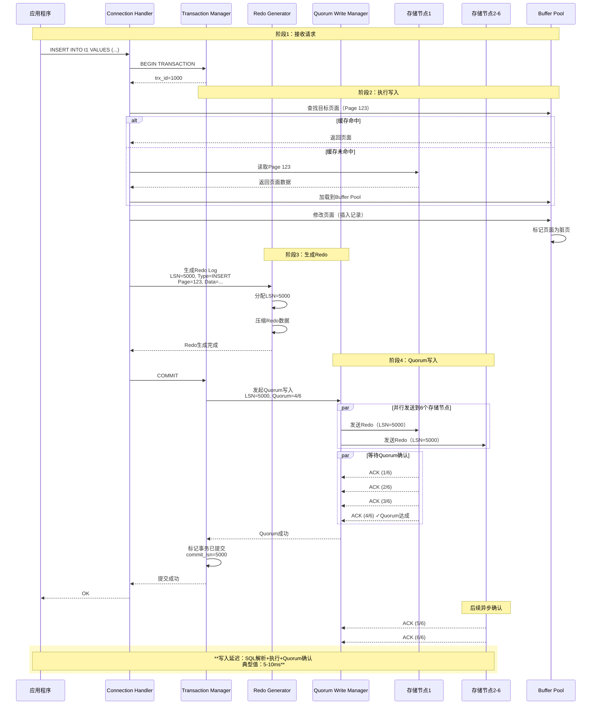
```mermaid
sequenceDiagram
    participant APP as 应用程序
    participant CONN as Connection Handler
    participant TRX as Transaction Manager
    participant REDO as Redo Generator
    participant QRWT as Quorum Write Manager
    participant ST1 as 存储节点1
    participant ST2 as 存储节点2-6
    participant BUF as Buffer Pool
    
    Note over APP,BUF: 阶段1：接收请求
    APP->>CONN: INSERT INTO t1 VALUES (...)
    CONN->>TRX: BEGIN TRANSACTION
    TRX-->>CONN: trx_id=1000
    
    Note over TRX,BUF: 阶段2：执行写入
    CONN->>BUF: 查找目标页面（Page 123）
    alt 缓存命中
        BUF-->>CONN: 返回页面
    else 缓存未命中
        CONN->>ST1: 读取Page 123
        ST1-->>CONN: 返回页面数据
        CONN->>BUF: 加载到Buffer Pool
    end
    
    CONN->>BUF: 修改页面（插入记录）
    BUF->>BUF: 标记页面为脏页
    
    Note over REDO,QRWT: 阶段3：生成Redo
    CONN->>REDO: 生成Redo Log<br/>LSN=5000, Type=INSERT<br/>Page=123, Data=...
    REDO->>REDO: 分配LSN=5000
    REDO->>REDO: 压缩Redo数据
    REDO-->>CONN: Redo生成完成
    
    Note over QRWT,ST2: 阶段4：Quorum写入
    CONN->>TRX: COMMIT
    TRX->>QRWT: 发起Quorum写入<br/>LSN=5000, Quorum=4/6
    
    par 并行发送到6个存储节点
        QRWT->>ST1: 发送Redo（LSN=5000）
        QRWT->>ST2: 发送Redo（LSN=5000）
    end
    
    par 等待Quorum确认
        ST1-->>QRWT: ACK (1/6)
        ST1-->>QRWT: ACK (2/6)
        ST1-->>QRWT: ACK (3/6)
        ST1-->>QRWT: ACK (4/6) ✓Quorum达成
    end
    
    QRWT-->>TRX: Quorum成功
    TRX->>TRX: 标记事务已提交<br/>commit_lsn=5000
    TRX-->>CONN: 提交成功
    CONN-->>APP: OK
    
    Note over ST2: 后续异步确认
    ST2-->>QRWT: ACK (5/6)
    ST2-->>QRWT: ACK (6/6)
    
    rect rgb(255, 250, 205)
    Note over APP,ST2: **写入延迟：SQL解析+执行+Quorum确认<br/>典型值：5-10ms**
    end
```

### 4.3 Read Replica（只读副本）功能需求

#### 4.3.1 模块职责

只读副本负责处理SELECT查询，从存储层读取数据页，并维护与主实例一致的读视图。

#### 4.3.2 功能需求清单

| **功能模块** | **功能描述** | **输入** | **输出** | **优先级** |
|------------|------------|---------|---------|----------|
| **Read View Manager** | 管理MVCC读视图 | 查询LSN要求 | 读视图 | P0 |
| **VDL Sync** | 同步存储层VDL | Volume ID | 最新VDL | P0 |
| **Storage Reader** | 从存储层读取页面 | 页面ID、LSN | 页面数据 | P0 |
| **Buffer Pool Manager** | 管理只读缓存 | 页面ID | 页面数据 | P0 |
| **Query Executor** | 执行只读查询 | SELECT语句 | 结果集 | P0 |
| **Lag Monitor** | 监控复制延迟 | 当前Applied LSN | Lag时间 | P1 |
| **Replica Registration** | 注册为副本 | 实例ID、Volume ID | 注册状态 | P0 |

#### 4.3.3 核心数据结构

**Read View（读视图）**

```c
struct ReadView {
    uint64_t view_lsn;                // 视图LSN（基准LSN）
    time_t view_time;                 // 视图创建时间
    uint64_t trx_id;                  // 事务ID
    
    // MVCC相关
    uint64_t low_limit_id;            // 低水位（最小活跃事务ID）
    uint64_t up_limit_id;             // 高水位（最大已分配事务ID）
    int active_trx_count;             // 活跃事务数量
    uint64_t active_trx_ids[1024];    // 活跃事务ID列表
    
    // 一致性保证
    uint64_t vdl_at_view_time;        // 视图创建时的VDL
    bool is_consistent;               // 是否一致
};
```

**Replication Lag（复制延迟）**

```c
struct ReplicationLag {
    char replica_id[64];              // 副本ID
    time_t measure_time;              // 测量时间
    
    // LSN延迟
    uint64_t primary_current_lsn;     // 主实例当前LSN
    uint64_t replica_applied_lsn;     // 副本已应用LSN
    uint64_t lsn_lag;                 // LSN滞后量
    
    // 时间延迟
    time_t primary_commit_time;       // 主实例提交时间
    time_t replica_apply_time;        // 副本应用时间
    int lag_seconds;                  // 时间滞后（秒）
    
    // 存储层延迟
    uint64_t storage_vdl;             // 存储层VDL
    uint64_t replica_vcl;             // 副本VCL
    int storage_lag;                  // 与存储层的滞后
};
```

#### 4.3.4 核心接口定义

```c
// Read View管理接口
int create_read_view(uint64_t lsn, ReadView *view);
int get_current_read_view(ReadView *view);
bool is_visible(const ReadView *view, uint64_t trx_id, uint64_t undo_lsn);
int destroy_read_view(ReadView *view);

// VDL同步接口
int sync_vdl_from_storage(const char *volume_id, uint64_t *vdl);
int wait_for_lsn(uint64_t target_lsn, int timeout_ms);
int get_applied_lsn(uint64_t *lsn);

// Storage Reader接口
int read_page_with_lsn(uint32_t space_id, uint32_t page_no, uint64_t required_lsn, PageData *page);
int prefetch_pages(const PageRequest requests[], int count);
int query_page_lsn(uint32_t space_id, uint32_t page_no, uint64_t *lsn);

// Lag监控接口
int calculate_replication_lag(const char *replica_id, ReplicationLag *lag);
int get_lag_alert_threshold(int *seconds);
int set_lag_alert_threshold(int seconds);
```

#### 4.3.5 只读查询流程时序图

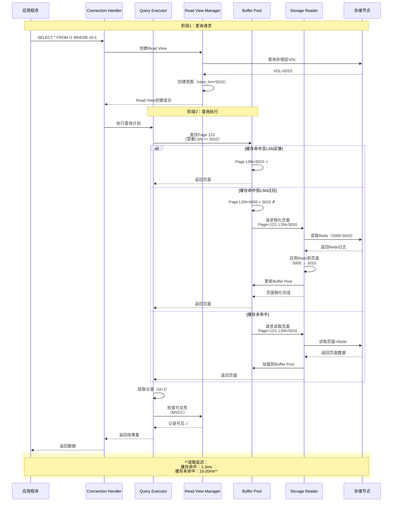
```mermaid
sequenceDiagram
    participant APP as 应用程序
    participant CONN as Connection Handler
    participant EXEC as Query Executor
    participant RV as Read View Manager
    participant BUF as Buffer Pool
    participant SR as Storage Reader
    participant ST as 存储节点
    
    Note over APP,ST: 阶段1：查询请求
    APP->>CONN: SELECT * FROM t1 WHERE id=1
    CONN->>RV: 创建Read View
    RV->>ST: 查询存储层VDL
    ST-->>RV: VDL=5010
    RV->>RV: 创建视图（view_lsn=5010）
    RV-->>CONN: Read View创建成功
    
    Note over EXEC,BUF: 阶段2：查询执行
    CONN->>EXEC: 执行查询计划
    EXEC->>BUF: 查找Page 123<br/>（需要LSN >= 5010）
    
    alt 缓存命中且LSN足够
        BUF->>BUF: Page LSN=5010 ✓
        BUF-->>EXEC: 返回页面
    else 缓存命中但LSN过旧
        BUF->>BUF: Page LSN=5005 < 5010 ✗
        BUF->>SR: 请求物化页面<br/>Page=123, LSN=5010
        SR->>ST: 读取Redo（5005-5010）
        ST-->>SR: 返回Redo日志
        SR->>SR: 应用Redo到页面<br/>5005 → 5010
        SR->>BUF: 更新Buffer Pool
        SR-->>BUF: 页面物化完成
        BUF-->>EXEC: 返回页面
    else 缓存未命中
        BUF->>SR: 请求读取页面<br/>Page=123, LSN=5010
        SR->>ST: 读取页面+Redo
        ST-->>SR: 返回页面数据
        SR->>BUF: 加载到Buffer Pool
        SR-->>EXEC: 返回页面
    end
    
    EXEC->>EXEC: 提取记录（id=1）
    EXEC->>RV: 检查可见性<br/>（MVCC）
    RV-->>EXEC: 记录可见 ✓
    
    EXEC-->>CONN: 返回结果集
    CONN-->>APP: 返回数据
    
    rect rgb(255, 250, 205)
    Note over APP,ST: **读取延迟：<br/>缓存命中：1-3ms<br/>缓存未命中：10-20ms**
    end
```

### 4.4 计算层与存储层交互接口

#### 4.4.1 网络协议设计

**Aurora Storage Protocol（ASP）**

```c
// 协议头
struct ASPHeader {
    uint32_t magic;                   // 魔数（0x41535000 = "ASP\0"）
    uint16_t version;                 // 协议版本
    uint16_t message_type;            // 消息类型
    uint32_t message_length;          // 消息长度（不含头）
    uint64_t request_id;              // 请求ID
    uint32_t checksum;                // 校验和
    char instance_id[64];             // 实例ID
    uint32_t generation;              // Generation号（防脑裂）
};

enum ASPMessageType {
    ASP_WRITE_REDO = 1,        // 写入Redo
    ASP_READ_PAGE,             // 读取页面
    ASP_QUERY_VDL,             // 查询VDL
    ASP_QUERY_VCL,             // 查询VCL
    ASP_ACK,                   // 确认
    ASP_NACK,                  // 拒绝
    ASP_HEARTBEAT,             // 心跳
    ASP_FENCE                  // 隔离
};
```

**Write Redo Request（写Redo请求）**

```c
struct WriteRedoRequest {
    ASPHeader header;                 // 协议头
    char volume_id[64];               // Volume ID
    char pg_id[64];                   // Protection Group ID
    int redo_count;                   // Redo条目数量
    RedoLogEntry entries[0];          // 变长数组
};

struct WriteRedoResponse {
    ASPHeader header;                 // 协议头
    WriteRedoStatus status;           // 状态
    uint64_t vdl;                     // 当前VDL
    uint64_t vcl;                     // 当前VCL
    time_t storage_time;              // 存储时间
};

enum WriteRedoStatus {
    WRITE_SUCCESS = 0,         // 成功
    WRITE_FENCED,              // 被隔离
    WRITE_QUORUM_FAILED,       // Quorum失败
    WRITE_TIMEOUT,             // 超时
    WRITE_DISK_FULL,           // 磁盘满
    WRITE_ERROR                // 错误
};
```

**Read Page Request（读页面请求）**

```c
struct ReadPageRequest {
    ASPHeader header;                 // 协议头
    char volume_id[64];               // Volume ID
    uint32_t space_id;                // 表空间ID
    uint32_t page_no;                 // 页面编号
    uint64_t required_lsn;            // 要求的最小LSN
    bool apply_redo;                  // 是否应用Redo
};

struct ReadPageResponse {
    ASPHeader header;                 // 协议头
    ReadPageStatus status;            // 状态
    uint32_t page_size;               // 页面大小
    uint64_t page_lsn;                // 页面LSN
    uint32_t checksum;                // 页面校验和
    char page_data[0];                // 变长页面数据
};

enum ReadPageStatus {
    READ_SUCCESS = 0,          // 成功
    READ_PAGE_NOT_FOUND,       // 页面不存在
    READ_LSN_TOO_OLD,          // LSN太旧
    READ_TIMEOUT,              // 超时
    READ_ERROR                 // 错误
};
```

---

## 5. 存储层（Storage Layer）详细设计

### 5.1 存储层架构

存储层是Aurora的核心创新，采用Log-is-Database架构，将Redo Log作为数据的源头。

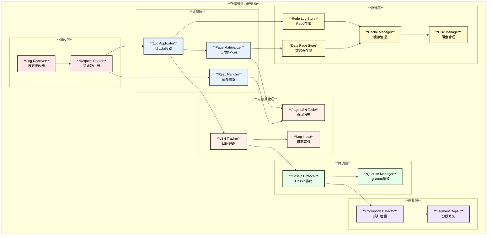
```mermaid
graph TB
    subgraph "**存储节点内部架构**"
        subgraph "**接收层**"
            L1[**Log Receiver**<br/>日志接收器]
            L2[**Request Router**<br/>请求路由器]
        end
        
        subgraph "**处理层**"
            P1[**Log Applicator**<br/>日志应用器]
            P2[**Page Materializer**<br/>页面物化器]
            P3[**Read Handler**<br/>读处理器]
        end
        
        subgraph "**元数据管理**"
            M1[**LSN Tracker**<br/>LSN追踪]
            M2[**Page-LSN Table**<br/>页LSN表]
            M3[**Log Index**<br/>日志索引]
        end
        
        subgraph "**协调层**"
            C1[**Gossip Protocol**<br/>Gossip协议]
            C2[**Quorum Manager**<br/>Quorum管理]
        end
        
        subgraph "**修复层**"
            R1[**Corruption Detector**<br/>损坏检测]
            R2[**Segment Repair**<br/>分段修复]
        end
        
        subgraph "**存储层**"
            S1[**Redo Log Store**<br/>Redo存储]
            S2[**Data Page Store**<br/>数据页存储]
            S3[**Cache Manager**<br/>缓存管理]
            S4[**Disk Manager**<br/>磁盘管理]
        end
    end
    
    L1 --> L2
    L2 --> P1
    L2 --> P3
    P1 --> M1
    P1 --> P2
    P2 --> M2
    P3 --> M2
    M1 --> M3
    M1 --> C1
    C1 --> C2
    C1 --> R1
    R1 --> R2
    P1 --> S1
    P2 --> S2
    S1 --> S3
    S2 --> S3
    S3 --> S4
    
    style L1 fill:#ffe6e6,stroke:#333,stroke-width:2px,color:#000
    style L2 fill:#ffe6e6,stroke:#333,stroke-width:2px,color:#000
    style P1 fill:#e6f3ff,stroke:#333,stroke-width:3px,color:#000
    style P2 fill:#e6f3ff,stroke:#333,stroke-width:2px,color:#000
    style P3 fill:#e6f3ff,stroke:#333,stroke-width:2px,color:#000
    style M1 fill:#fff0e6,stroke:#333,stroke-width:3px,color:#000
    style M2 fill:#fff0e6,stroke:#333,stroke-width:2px,color:#000
    style M3 fill:#fff0e6,stroke:#333,stroke-width:2px,color:#000
    style C1 fill:#e6ffe6,stroke:#333,stroke-width:3px,color:#000
    style C2 fill:#e6ffe6,stroke:#333,stroke-width:2px,color:#000
    style R1 fill:#f0e6ff,stroke:#333,stroke-width:2px,color:#000
    style R2 fill:#f0e6ff,stroke:#333,stroke-width:2px,color:#000
    style S1 fill:#fffacd,stroke:#333,stroke-width:2px,color:#000
    style S2 fill:#fffacd,stroke:#333,stroke-width:2px,color:#000
    style S3 fill:#fffacd,stroke:#333,stroke-width:2px,color:#000
    style S4 fill:#fffacd,stroke:#333,stroke-width:2px,color:#000
```

### 5.2 Protection Group（PG）设计

#### 5.2.1 PG基本结构

每个PG是10GB的数据段，包含640个16KB页面，拥有6个副本分布在3个可用区。

```c
struct ProtectionGroup {
    char pg_id[64];                   // PG ID（UUID）
    char volume_id[64];               // 所属Volume ID
    uint64_t pg_offset;               // 在Volume中的偏移（字节）
    uint64_t pg_size;                 // PG大小（10GB）
    time_t create_time;               // 创建时间
    PGStatus status;                  // PG状态
    
    // LSN信息
    uint64_t vdl;                     // Volume Durable LSN
    uint64_t vcl;                     // Volume Complete LSN
    uint64_t min_log_lsn;             // 最小日志LSN
    uint64_t max_log_lsn;             // 最大日志LSN
    
    // 副本信息
    int replica_count;                // 副本数量（固定6）
    struct {
        char node_id[64];             // 存储节点ID
        char availability_zone[64];   // 可用区
        char node_ip[64];             // 节点IP
        int node_port;                // 节点端口
        ReplicaStatus status;         // 副本状态
        uint64_t local_vcl;           // 本地VCL
        time_t last_sync_time;        // 最后同步时间
    } replicas[6];
    
    // 页面信息
    uint32_t page_count;              // 页面数量（640）
    uint32_t page_size;               // 页面大小（16KB）
    uint32_t first_page_no;           // 首页编号
    uint32_t last_page_no;            // 末页编号
    
    // 统计信息
    uint64_t total_redo_count;        // 总Redo数量
    uint64_t total_redo_bytes;        // 总Redo字节数
    uint64_t total_read_count;        // 总读次数
    uint64_t total_write_count;       // 总写次数
    time_t last_access_time;          // 最后访问时间
};

enum PGStatus {
    PG_CREATING = 0,       // 创建中
    PG_ACTIVE,             // 活跃
    PG_READONLY,           // 只读
    PG_REPAIRING,          // 修复中
    PG_DELETING            // 删除中
};

enum ReplicaStatus {
    REPLICA_HEALTHY = 0,   // 健康
    REPLICA_LAGGING,       // 滞后
    REPLICA_FAILED,        // 故障
    REPLICA_REPAIRING      // 修复中
};
```

#### 5.2.2 PG内部存储布局

```c
// PG磁盘布局
struct PGDiskLayout {
    // 1. PG Header（1个Page，16KB）
    struct {
        uint32_t magic;                   // 魔数
        uint32_t version;                 // 版本
        char pg_id[64];                   // PG ID
        uint64_t vdl;                     // VDL
        uint64_t vcl;                     // VCL
        uint32_t page_count;              // 页面数量
        uint32_t checksum;                // 校验和
    } header;
    
    // 2. Page-LSN Mapping Table（元数据区，约10MB）
    //    记录每个页面的最新LSN
    struct {
        uint32_t page_no;                 // 页面编号
        uint64_t page_lsn;                // 页面LSN
        uint32_t page_offset;             // 页面在磁盘上的偏移
    } page_lsn_table[640];
    
    // 3. Log Index（日志索引区，约100MB）
    //    LSN到日志偏移的B+树索引
    struct {
        uint64_t lsn;                     // LSN
        uint64_t log_offset;              // 日志文件偏移
        uint32_t log_length;              // 日志长度
    } log_index[];
    
    // 4. Redo Log Area（Redo日志区，约2-3GB）
    //    顺序存储Redo日志
    struct {
        RedoLogEntry entries[];           // Redo条目
    } redo_log_area;
    
    // 5. Data Page Area（数据页区，10GB）
    //    存储640个16KB页面
    struct {
        PageData pages[640];              // 数据页数组
    } data_page_area;
};
```

### 5.3 Log Applicator（日志应用器）功能需求

#### 5.3.1 模块职责

Log Applicator负责异步应用Redo Log到数据页，实现延迟物化（Lazy Materialization）。

#### 5.3.2 功能需求清单

| **功能模块** | **功能描述** | **输入** | **输出** | **优先级** |
|------------|------------|---------|---------|----------|
| **日志队列管理** | 管理待应用日志队列 | Redo Log | 队列状态 | P0 |
| **LSN Gap检测** | 检测LSN不连续 | LSN序列 | Gap信息 | P0 |
| **Gap填充** | 从对等节点拉取缺失日志 | Gap范围 | Redo Log | P0 |
| **日志应用** | 应用Redo到数据页 | Redo Log、页面 | 更新后的页面 | P0 |
| **VCL推进** | 推进Volume Complete LSN | 应用进度 | 新VCL | P0 |
| **批量应用** | 批量应用多条日志 | Redo Log数组 | 应用结果 | P1 |
| **优先级调度** | 优先应用热页面的日志 | 页面访问频率 | 应用顺序 | P1 |

#### 5.3.3 核心数据结构

**Log Application Queue（日志应用队列）**

```c
struct LogApplicationQueue {
    char pg_id[64];                   // PG ID
    pthread_mutex_t lock;             // 队列锁
    
    // 队列信息
    int queue_capacity;               // 队列容量
    int queue_size;                   // 当前队列大小
    RedoLogEntry *queue[10000];       // 队列（循环队列）
    int head;                         // 队列头
    int tail;                         // 队列尾
    
    // LSN信息
    uint64_t next_expected_lsn;       // 下一个期望的LSN
    uint64_t last_applied_lsn;        // 最后应用的LSN
    
    // Gap管理
    int gap_count;                    // Gap数量
    struct {
        uint64_t gap_start_lsn;       // Gap起始LSN
        uint64_t gap_end_lsn;         // Gap结束LSN
        time_t detect_time;           // 检测时间
        bool filling;                 // 是否正在填充
    } gaps[100];
    
    // 性能统计
    uint64_t total_applied;           // 总应用数
    uint64_t total_gap_filled;        // 总填充Gap数
    double avg_apply_latency_ms;      // 平均应用延迟
};
```

**Page Materialization Context（页面物化上下文）**

```c
struct MaterializationContext {
    uint32_t space_id;                // 表空间ID
    uint32_t page_no;                 // 页面编号
    uint64_t base_lsn;                // 基础LSN
    uint64_t target_lsn;              // 目标LSN
    
    // 页面数据
    PageData *base_page;              // 基础页面
    PageData *materialized_page;      // 物化后的页面
    
    // 需要应用的Redo
    int redo_count;                   // Redo数量
    RedoLogEntry *redos[1000];        // Redo数组
    
    // 状态
    MaterializationStatus status;     // 物化状态
    time_t start_time;                // 开始时间
    time_t end_time;                  // 结束时间
};

enum MaterializationStatus {
    MAT_PENDING = 0,       // 等待中
    MAT_IN_PROGRESS,       // 进行中
    MAT_COMPLETED,         // 完成
    MAT_FAILED             // 失败
};
```

#### 5.3.4 日志应用时序图

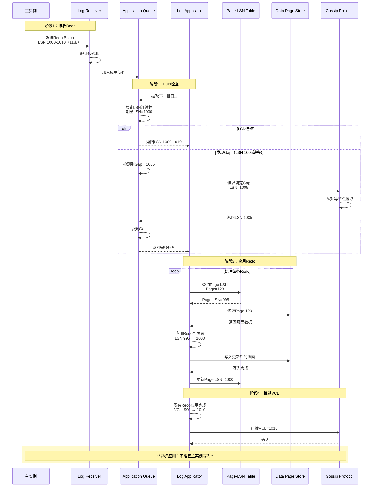
```mermaid
sequenceDiagram
    participant PRIMARY as 主实例
    participant RECV as Log Receiver
    participant QUEUE as Application Queue
    participant APP as Log Applicator
    participant PAGEIDX as Page-LSN Table
    participant STORE as Data Page Store
    participant GOSSIP as Gossip Protocol
    
    Note over PRIMARY,RECV: 阶段1：接收Redo
    PRIMARY->>RECV: 发送Redo Batch<br/>LSN 1000-1010（11条）
    RECV->>RECV: 验证校验和
    RECV->>QUEUE: 加入应用队列
    
    Note over QUEUE,APP: 阶段2：LSN检查
    APP->>QUEUE: 拉取下一批日志
    QUEUE->>QUEUE: 检查LSN连续性<br/>期望LSN=1000
    
    alt LSN连续
        QUEUE-->>APP: 返回LSN 1000-1010
    else 发现Gap（LSN 1005缺失）
        QUEUE->>QUEUE: 检测到Gap：1005
        QUEUE->>GOSSIP: 请求填充Gap<br/>LSN=1005
        GOSSIP->>GOSSIP: 从对等节点拉取
        GOSSIP-->>QUEUE: 返回LSN 1005
        QUEUE->>QUEUE: 填充Gap
        QUEUE-->>APP: 返回完整序列
    end
    
    Note over APP,STORE: 阶段3：应用Redo
    loop 处理每条Redo
        APP->>PAGEIDX: 查询Page LSN<br/>Page=123
        PAGEIDX-->>APP: Page LSN=995
        
        APP->>STORE: 读取Page 123
        STORE-->>APP: 返回页面数据
        
        APP->>APP: 应用Redo到页面<br/>LSN 995 → 1000
        
        APP->>STORE: 写入更新后的页面
        STORE-->>APP: 写入完成
        
        APP->>PAGEIDX: 更新Page LSN=1000
    end
    
    Note over APP,GOSSIP: 阶段4：推进VCL
    APP->>APP: 所有Redo应用完成<br/>VCL: 990 → 1010
    APP->>GOSSIP: 广播VCL=1010
    GOSSIP-->>APP: 确认
    
    rect rgb(255, 250, 205)
    Note over PRIMARY,GOSSIP: **异步应用：不阻塞主实例写入**
    end
```

### 5.4 Gossip Protocol（Gossip协议）功能需求

#### 5.4.1 模块职责

Gossip Protocol实现存储节点间的去中心化元数据同步，用于LSN同步、故障检测和数据修复协调。

#### 5.4.2 功能需求清单

| **功能模块** | **功能描述** | **输入** | **输出** | **优先级** |
|------------|------------|---------|---------|----------|
| **元数据广播** | 广播本地LSN状态 | VDL、VCL | 广播消息 | P0 |
| **元数据收集** | 收集对等节点元数据 | Gossip消息 | 全局视图 | P0 |
| **Gap检测** | 检测LSN缺失 | 节点LSN列表 | Gap列表 | P0 |
| **Gap修复** | 请求缺失日志 | Gap范围、目标节点 | Redo Log | P0 |
| **心跳检测** | 检测节点健康状态 | 心跳间隔 | 健康状态 | P0 |
| **故障隔离** | 隔离故障节点 | 故障节点ID | 隔离状态 | P1 |

#### 5.4.3 Gossip协议时序图

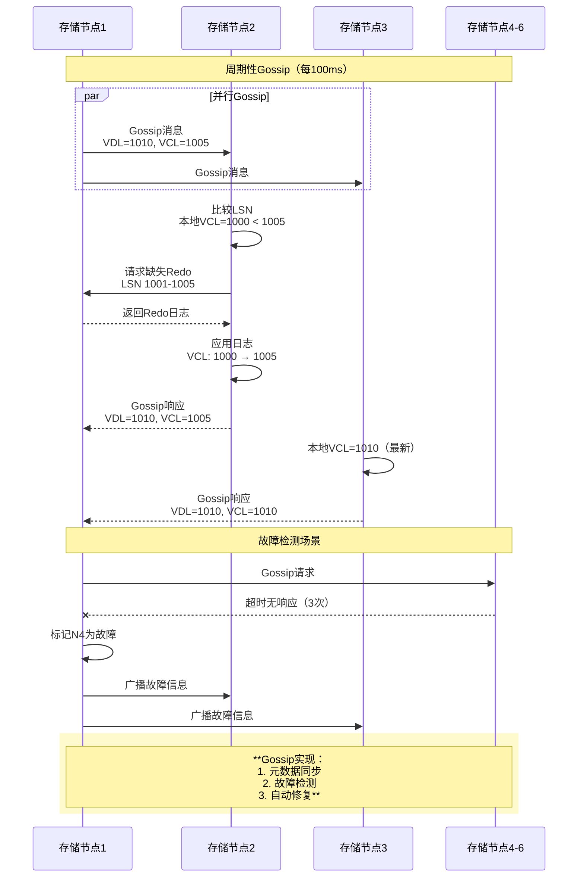
```mermaid
sequenceDiagram
    participant N1 as 存储节点1
    participant N2 as 存储节点2
    participant N3 as 存储节点3
    participant N4 as 存储节点4-6
    
    Note over N1,N4: 周期性Gossip（每100ms）
    
    par 并行Gossip
        N1->>N2: Gossip消息<br/>VDL=1010, VCL=1005
        N1->>N3: Gossip消息
    end
    
    N2->>N2: 比较LSN<br/>本地VCL=1000 < 1005
    
    N2->>N1: 请求缺失Redo<br/>LSN 1001-1005
    N1-->>N2: 返回Redo日志
    N2->>N2: 应用日志<br/>VCL: 1000 → 1005
    
    N2-->>N1: Gossip响应<br/>VDL=1010, VCL=1005
    
    N3->>N3: 本地VCL=1010（最新）
    N3-->>N1: Gossip响应<br/>VDL=1010, VCL=1010
    
    Note over N1,N4: 故障检测场景
    N1->>N4: Gossip请求
    N4--xN1: 超时无响应（3次）
    N1->>N1: 标记N4为故障
    N1->>N2: 广播故障信息
    N1->>N3: 广播故障信息
    
    rect rgb(255, 250, 205)
    Note over N1,N4: **Gossip实现：<br/>1. 元数据同步<br/>2. 故障检测<br/>3. 自动修复**
    end
```

---

## 6. 元数据服务（Metadata Service）详细设计

### 6.1 元数据服务架构

元数据服务管理Aurora集群的所有元数据，包括Volume配置、PG映射、LSN注册等。

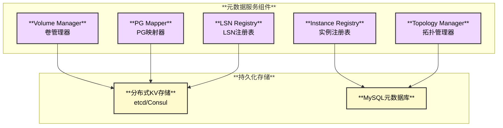
```mermaid
graph TB
    subgraph "**元数据服务组件**"
        M1[**Volume Manager**<br/>卷管理器]
        M2[**PG Mapper**<br/>PG映射器]
        M3[**LSN Registry**<br/>LSN注册表]
        M4[**Instance Registry**<br/>实例注册表]
        M5[**Topology Manager**<br/>拓扑管理器]
    end
    
    subgraph "**持久化存储**"
        D1[**分布式KV存储**<br/>etcd/Consul]
        D2[**MySQL元数据库**]
    end
    
    M1 --> D1
    M2 --> D1
    M3 --> D1
    M4 --> D2
    M5 --> D2
    
    style M1 fill:#f0d7ff,stroke:#333,stroke-width:2px,color:#000
    style M2 fill:#f0d7ff,stroke:#333,stroke-width:2px,color:#000
    style M3 fill:#f0d7ff,stroke:#333,stroke-width:2px,color:#000
    style M4 fill:#f0d7ff,stroke:#333,stroke-width:2px,color:#000
    style M5 fill:#f0d7ff,stroke:#333,stroke-width:2px,color:#000
    style D1 fill:#fffacd,stroke:#333,stroke-width:2px,color:#000
    style D2 fill:#fffacd,stroke:#333,stroke-width:2px,color:#000
```

### 6.2 核心功能需求

#### 6.2.1 Volume Manager（卷管理器）

**功能需求**：
- Volume创建和删除
- Volume扩容（自动添加PG）
- Volume快照管理
- Volume克隆

**核心数据结构**：

```c
struct VolumeMetadata {
    char volume_id[64];               // Volume ID
    char cluster_id[64];              // 所属集群ID
    VolumeStatus status;              // Volume状态
    time_t create_time;               // 创建时间
    
    // 容量信息
    uint64_t allocated_size_gb;       // 已分配大小（GB）
    uint64_t used_size_gb;            // 已使用大小（GB）
    uint64_t max_size_gb;             // 最大大小（128TB）
    
    // PG信息
    int pg_count;                     // PG数量
    char pg_ids[13000][64];           // PG ID列表
    
    // LSN信息
    uint64_t current_vdl;             // 当前VDL
    uint64_t current_vcl;             // 当前VCL
    uint64_t checkpoint_lsn;          // 检查点LSN
    
    // 副本配置
    int replica_factor;               // 副本因子（固定6）
    int quorum_size;                  // Quorum大小（固定4）
    int availability_zone_count;      // 可用区数量（固定3）
};

enum VolumeStatus {
    VOLUME_CREATING = 0,   // 创建中
    VOLUME_AVAILABLE,      // 可用
    VOLUME_EXPANDING,      // 扩容中
    VOLUME_SNAPSHOTTING,   // 快照中
    VOLUME_DELETING        // 删除中
};
```

#### 6.2.2 PG Mapper（PG映射器）

**功能需求**：
- PG到存储节点的映射管理
- PG重新平衡
- PG故障转移
- PG副本放置策略

**PG映射算法**：

```c
// PG映射决策
struct PGPlacement {
    char pg_id[64];                   // PG ID
    char primary_node_id[64];         // 主副本节点
    char replica_node_ids[5][64];     // 其他5个副本节点
    char availability_zones[6][64];   // 各副本所在AZ
    PlacementStrategy strategy;       // 放置策略
};

enum PlacementStrategy {
    STRATEGY_BALANCED = 0,     // 负载均衡
    STRATEGY_AZ_AWARE,         // 可用区感知
    STRATEGY_LOCALITY,         // 局部性优化
    STRATEGY_PERFORMANCE       // 性能优化
};

// PG映射算法
int map_pg_to_nodes(const char *pg_id, const PlacementStrategy strategy, 
                    PGPlacement *placement) {
    // 1. 获取所有可用存储节点
    StorageNode nodes[100];
    int node_count = get_available_storage_nodes(nodes);
    
    // 2. 按可用区分组
    StorageNode az_nodes[3][50];
    group_nodes_by_az(nodes, node_count, az_nodes);
    
    // 3. 选择6个节点（每个AZ 2个）
    switch (strategy) {
        case STRATEGY_BALANCED:
            // 选择负载最低的节点
            select_nodes_by_load(az_nodes, placement);
            break;
        case STRATEGY_AZ_AWARE:
            // 优先跨AZ分布
            select_nodes_by_az_distribution(az_nodes, placement);
            break;
        default:
            // 默认策略
            select_nodes_random(az_nodes, placement);
    }
    
    return 0;
}
```

---

## 7. 备份与恢复层详细设计

### 7.1 备份架构

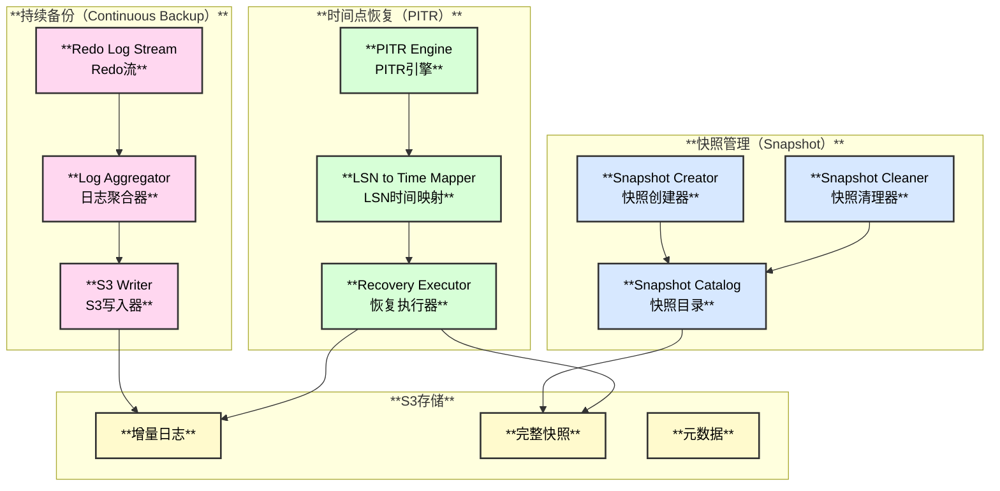
```mermaid
graph TB
    subgraph "**持续备份（Continuous Backup）**"
        B1[**Redo Log Stream<br/>Redo流**]
        B2[**Log Aggregator<br/>日志聚合器**]
        B3[**S3 Writer<br/>S3写入器**]
    end
    
    subgraph "**快照管理（Snapshot）**"
        S1[**Snapshot Creator<br/>快照创建器**]
        S2[**Snapshot Catalog<br/>快照目录**]
        S3[**Snapshot Cleaner<br/>快照清理器**]
    end
    
    subgraph "**时间点恢复（PITR）**"
        P1[**PITR Engine<br/>PITR引擎**]
        P2[**LSN to Time Mapper<br/>LSN时间映射**]
        P3[**Recovery Executor<br/>恢复执行器**]
    end
    
    subgraph "**S3存储**"
        O1[**增量日志**]
        O2[**完整快照**]
        O3[**元数据**]
    end
    
    B1 --> B2
    B2 --> B3
    B3 --> O1
    
    S1 --> S2
    S2 --> O2
    S3 --> S2
    
    P1 --> P2
    P2 --> P3
    P3 --> O1
    P3 --> O2
    
    style B1 fill:#ffd7f0,stroke:#333,stroke-width:2px,color:#000
    style B2 fill:#ffd7f0,stroke:#333,stroke-width:2px,color:#000
    style B3 fill:#ffd7f0,stroke:#333,stroke-width:2px,color:#000
    style S1 fill:#d7e8ff,stroke:#333,stroke-width:2px,color:#000
    style S2 fill:#d7e8ff,stroke:#333,stroke-width:2px,color:#000
    style S3 fill:#d7e8ff,stroke:#333,stroke-width:2px,color:#000
    style P1 fill:#d7ffd7,stroke:#333,stroke-width:2px,color:#000
    style P2 fill:#d7ffd7,stroke:#333,stroke-width:2px,color:#000
    style P3 fill:#d7ffd7,stroke:#333,stroke-width:2px,color:#000
    style O1 fill:#fffacd,stroke:#333,stroke-width:2px,color:#000
    style O2 fill:#fffacd,stroke:#333,stroke-width:2px,color:#000
    style O3 fill:#fffacd,stroke:#333,stroke-width:2px,color:#000
```

### 7.2 持续备份功能需求

#### 7.2.1 核心功能

| **功能模块** | **功能描述** | **输入** | **输出** | **优先级** |
|------------|------------|---------|---------|----------|
| **增量备份** | 持续备份Redo Log到S3 | Redo Log流 | S3对象 | P0 |
| **快照创建** | 创建Volume完整快照 | Volume ID、LSN | 快照ID | P1 |
| **PITR** | 恢复到任意时间点 | 目标时间、Volume ID | 新Volume ID | P1 |
| **备份验证** | 验证备份完整性 | 备份ID | 验证结果 | P2 |
| **备份清理** | 清理过期备份 | 保留策略 | 清理日志 | P2 |

#### 7.2.2 PITR时序图

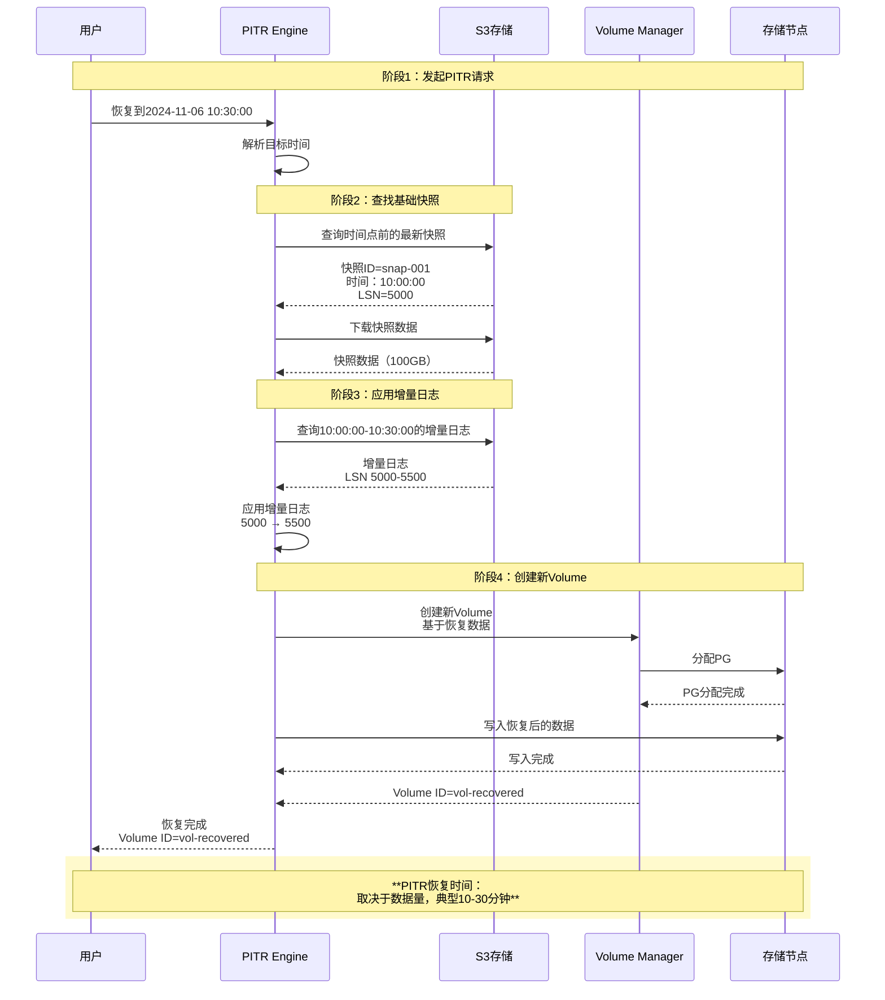
```mermaid
sequenceDiagram
    participant USER as 用户
    participant PITR as PITR Engine
    participant S3 as S3存储
    participant VOL as Volume Manager
    participant ST as 存储节点
    
    Note over USER,ST: 阶段1：发起PITR请求
    USER->>PITR: 恢复到2024-11-06 10:30:00
    PITR->>PITR: 解析目标时间
    
    Note over PITR,S3: 阶段2：查找基础快照
    PITR->>S3: 查询时间点前的最新快照
    S3-->>PITR: 快照ID=snap-001<br/>时间：10:00:00<br/>LSN=5000
    
    PITR->>S3: 下载快照数据
    S3-->>PITR: 快照数据（100GB）
    
    Note over PITR,S3: 阶段3：应用增量日志
    PITR->>S3: 查询10:00:00-10:30:00的增量日志
    S3-->>PITR: 增量日志<br/>LSN 5000-5500
    
    PITR->>PITR: 应用增量日志<br/>5000 → 5500
    
    Note over PITR,ST: 阶段4：创建新Volume
    PITR->>VOL: 创建新Volume<br/>基于恢复数据
    VOL->>ST: 分配PG
    ST-->>VOL: PG分配完成
    
    PITR->>ST: 写入恢复后的数据
    ST-->>PITR: 写入完成
    
    VOL-->>PITR: Volume ID=vol-recovered
    PITR-->>USER: 恢复完成<br/>Volume ID=vol-recovered
    
    rect rgb(255, 250, 205)
    Note over USER,ST: **PITR恢复时间：<br/>取决于数据量，典型10-30分钟**
    end
```

---

## 8. 关键场景完整时序图

### 8.1 完整写入流程（端到端）

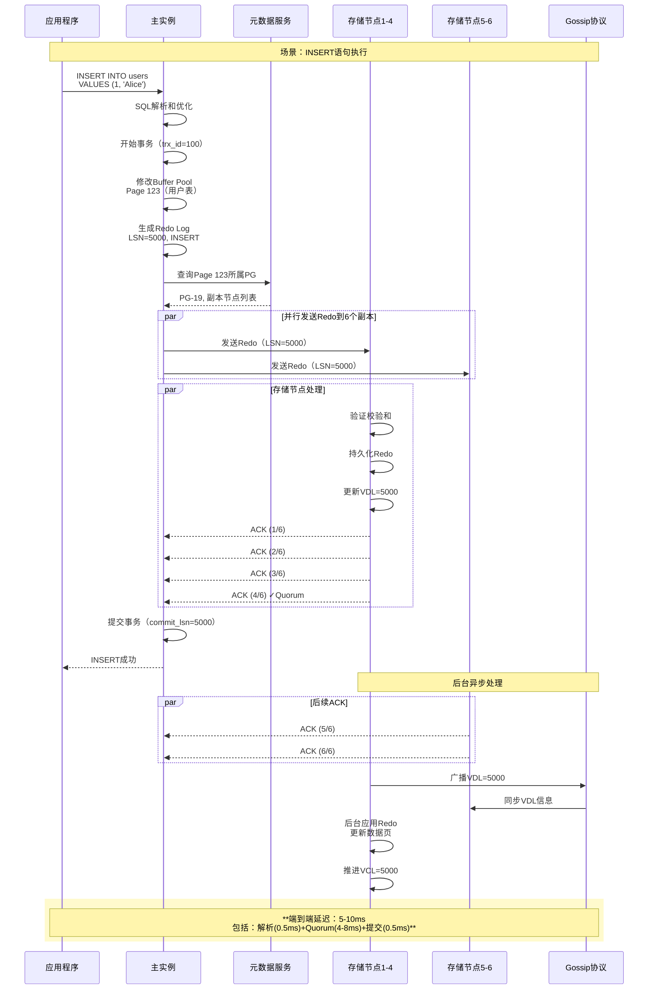
```mermaid
sequenceDiagram
    participant APP as 应用程序
    participant PRIMARY as 主实例
    participant META as 元数据服务
    participant ST1 as 存储节点1-4
    participant ST2 as 存储节点5-6
    participant GOSSIP as Gossip协议
    
    Note over APP,GOSSIP: 场景：INSERT语句执行
    
    APP->>PRIMARY: INSERT INTO users<br/>VALUES (1, 'Alice')
    
    PRIMARY->>PRIMARY: SQL解析和优化
    PRIMARY->>PRIMARY: 开始事务（trx_id=100）
    
    PRIMARY->>PRIMARY: 修改Buffer Pool<br/>Page 123（用户表）
    PRIMARY->>PRIMARY: 生成Redo Log<br/>LSN=5000, INSERT
    
    PRIMARY->>META: 查询Page 123所属PG
    META-->>PRIMARY: PG-19, 副本节点列表
    
    par 并行发送Redo到6个副本
        PRIMARY->>ST1: 发送Redo（LSN=5000）
        PRIMARY->>ST2: 发送Redo（LSN=5000）
    end
    
    par 存储节点处理
        ST1->>ST1: 验证校验和
        ST1->>ST1: 持久化Redo
        ST1->>ST1: 更新VDL=5000
        ST1-->>PRIMARY: ACK (1/6)
        ST1-->>PRIMARY: ACK (2/6)
        ST1-->>PRIMARY: ACK (3/6)
        ST1-->>PRIMARY: ACK (4/6) ✓Quorum
    end
    
    PRIMARY->>PRIMARY: 提交事务（commit_lsn=5000）
    PRIMARY-->>APP: INSERT成功
    
    Note over ST1,GOSSIP: 后台异步处理
    par 后续ACK
        ST2-->>PRIMARY: ACK (5/6)
        ST2-->>PRIMARY: ACK (6/6)
    end
    
    ST1->>GOSSIP: 广播VDL=5000
    GOSSIP->>ST2: 同步VDL信息
    
    ST1->>ST1: 后台应用Redo<br/>更新数据页
    ST1->>ST1: 推进VCL=5000
    
    rect rgb(255, 250, 205)
    Note over APP,GOSSIP: **端到端延迟：5-10ms<br/>包括：解析(0.5ms)+Quorum(4-8ms)+提交(0.5ms)**
    end
```

### 8.2 主实例故障切换完整流程

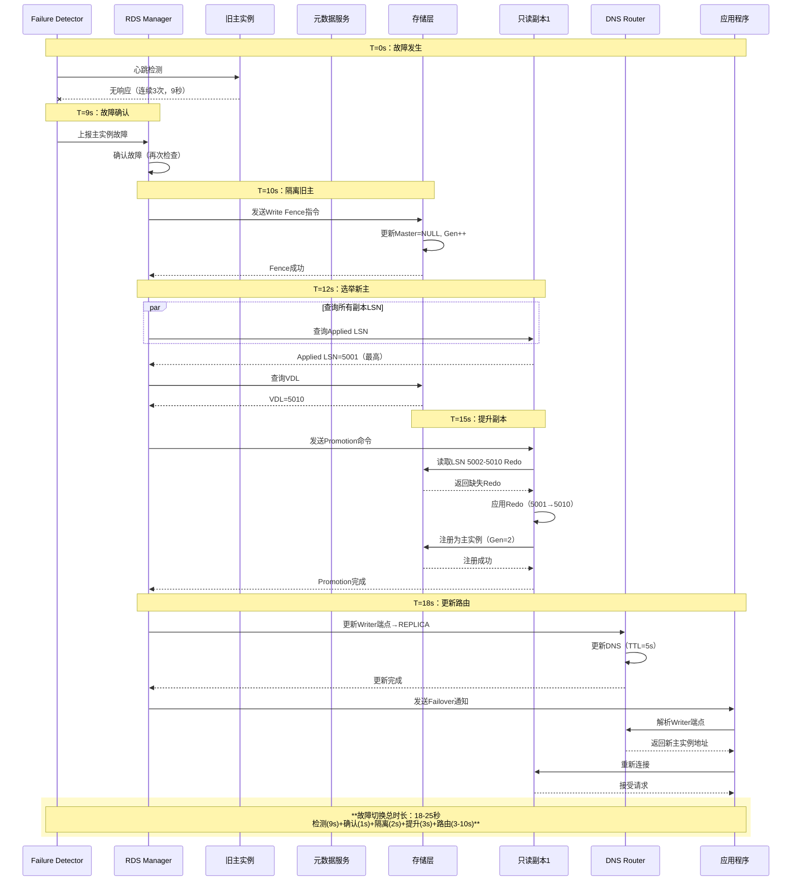
```mermaid
sequenceDiagram
    participant FD as Failure Detector
    participant RM as RDS Manager
    participant OLD_P as 旧主实例
    participant META as 元数据服务
    participant ST as 存储层
    participant REPLICA as 只读副本1
    participant DNS as DNS Router
    participant APP as 应用程序
    
    Note over FD,APP: T=0s：故障发生
    FD->>OLD_P: 心跳检测
    OLD_P--xFD: 无响应（连续3次，9秒）
    
    Note over FD,RM: T=9s：故障确认
    FD->>RM: 上报主实例故障
    RM->>RM: 确认故障（再次检查）
    
    Note over RM,ST: T=10s：隔离旧主
    RM->>ST: 发送Write Fence指令
    ST->>ST: 更新Master=NULL, Gen++
    ST-->>RM: Fence成功
    
    Note over RM,REPLICA: T=12s：选举新主
    par 查询所有副本LSN
        RM->>REPLICA: 查询Applied LSN
    end
    REPLICA-->>RM: Applied LSN=5001（最高）
    
    RM->>ST: 查询VDL
    ST-->>RM: VDL=5010
    
    Note over REPLICA,ST: T=15s：提升副本
    RM->>REPLICA: 发送Promotion命令
    REPLICA->>ST: 读取LSN 5002-5010 Redo
    ST-->>REPLICA: 返回缺失Redo
    REPLICA->>REPLICA: 应用Redo（5001→5010）
    REPLICA->>ST: 注册为主实例（Gen=2）
    ST-->>REPLICA: 注册成功
    REPLICA-->>RM: Promotion完成
    
    Note over RM,APP: T=18s：更新路由
    RM->>DNS: 更新Writer端点→REPLICA
    DNS->>DNS: 更新DNS（TTL=5s）
    DNS-->>RM: 更新完成
    
    RM->>APP: 发送Failover通知
    APP->>DNS: 解析Writer端点
    DNS-->>APP: 返回新主实例地址
    APP->>REPLICA: 重新连接
    REPLICA-->>APP: 接受请求
    
    rect rgb(255, 250, 205)
    Note over FD,APP: **故障切换总时长：18-25秒<br/>检测(9s)+确认(1s)+隔离(2s)+提升(3s)+路由(3-10s)**
    end
```

---

## 9. 非功能性需求

### 9.1 性能指标

| **性能指标** | **目标值** | **说明** |
|------------|----------|---------|
| **写入TPS** | 100,000 TPS | 单实例持续写入吞吐量 |
| **读取QPS** | 500,000 QPS | 15个副本总查询吞吐量 |
| **写入延迟（P99）** | < 10ms | 99%的写入请求延迟 |
| **读取延迟（P99）** | < 5ms | 99%的读取请求延迟（缓存命中） |
| **Quorum延迟** | < 5ms | 4/6 Quorum确认延迟 |
| **复制延迟** | < 100ms | 只读副本与主实例的延迟 |
| **故障切换时间（RTO）** | < 30s | 从故障到恢复服务的时间 |
| **数据丢失（RPO）** | 0 | 无数据丢失 |

### 9.2 可用性指标

| **可用性指标** | **目标值** | **实现方式** |
|--------------|----------|-------------|
| **SLA** | 99.99% | 6副本3AZ，容忍2副本或1个AZ故障 |
| **年停机时间** | < 52.6分钟 | 自动故障切换 + 快速恢复 |
| **MTTR** | < 30秒 | 自动故障检测和切换 |
| **MTBF** | > 10,000小时 | 高可靠性硬件 + 软件冗余 |
| **数据持久性** | 99.999999999% | 6副本 + S3备份 |

### 9.3 扩展性指标

| **扩展性指标** | **目标值** | **说明** |
|------------|----------|---------|
| **存储容量** | 128TB | 自动扩展，无需人工干预 |
| **只读副本数量** | 15个 | 支持高读负载 |
| **PG数量** | 13,000个 | 128TB ÷ 10GB = 13,000 |
| **并发连接数** | 100,000+ | 基于实例规格 |
| **数据库数量** | 无限制 | 受存储容量限制 |

### 9.4 可靠性要求

| **可靠性要求** | **目标值** | **实现方式** |
|------------|----------|-------------|
| **副本因子** | 6 | 跨3个AZ，每个AZ 2个副本 |
| **Quorum写** | 4/6 | 容忍2个副本故障 |
| **Quorum读** | 3/6 | 容忍3个副本故障 |
| **数据校验** | 每个数据块 | Checksum验证 |
| **自动修复** | < 10秒 | Segment Repair自动修复损坏数据 |
| **备份频率** | 持续备份 | 实时备份Redo Log到S3 |

### 9.5 安全性要求

| **安全要求** | **实现方式** |
|-----------|-------------|
| **数据加密（静态）** | AES-256加密存储 |
| **数据加密（传输）** | TLS 1.2+ |
| **访问控制** | IAM + 数据库用户权限 |
| **网络隔离** | VPC + 安全组 |
| **审计日志** | 完整的操作审计日志 |
| **密钥管理** | KMS集成 |

---

## 10. 模块开发优先级和依赖关系

### 10.1 开发阶段划分

**阶段1：核心基础（P0，1-3个月）**

```mermaid
graph LR
    A[存储层基础] --> B[PG管理]
    B --> C[Redo Log接收]
    C --> D[Quorum写入]
    D --> E[主实例改造]
    E --> F[Storage Interface]
    
    style A fill:#ffd7d7,stroke:#333,stroke-width:2px,color:#000
    style B fill:#ffd7d7,stroke:#333,stroke-width:2px,color:#000
    style C fill:#ffd7d7,stroke:#333,stroke-width:2px,color:#000
    style D fill:#ffd7d7,stroke:#333,stroke-width:2px,color:#000
    style E fill:#ffd7d7,stroke:#333,stroke-width:2px,color:#000
    style F fill:#ffd7d7,stroke:#333,stroke-width:2px,color:#000
```

**阶段2：高可用（P0-P1，3-5个月）**

```mermaid
graph LR
    A[Gossip Protocol] --> B[LSN管理]
    B --> C[Failure Detector]
    C --> D[故障切换]
    D --> E[只读副本]
    E --> F[元数据服务]
    
    style A fill:#d7e8ff,stroke:#333,stroke-width:2px,color:#000
    style B fill:#d7e8ff,stroke:#333,stroke-width:2px,color:#000
    style C fill:#d7e8ff,stroke:#333,stroke-width:2px,color:#000
    style D fill:#d7e8ff,stroke:#333,stroke-width:2px,color:#000
    style E fill:#d7e8ff,stroke:#333,stroke-width:2px,color:#000
    style F fill:#d7e8ff,stroke:#333,stroke-width:2px,color:#000
```

**阶段3：运维增强（P1-P2，5-8个月）**

```mermaid
graph LR
    A[持续备份] --> B[PITR]
    B --> C[监控服务]
    C --> D[Segment Repair]
    D --> E[性能优化]
    E --> F[完整测试]
    
    style A fill:#d7ffd7,stroke:#333,stroke-width:2px,color:#000
    style B fill:#d7ffd7,stroke:#333,stroke-width:2px,color:#000
    style C fill:#d7ffd7,stroke:#333,stroke-width:2px,color:#000
    style D fill:#d7ffd7,stroke:#333,stroke-width:2px,color:#000
    style E fill:#d7ffd7,stroke:#333,stroke-width:2px,color:#000
    style F fill:#d7ffd7,stroke:#333,stroke-width:2px,color:#000
```

### 10.2 模块依赖矩阵

| **模块** | **依赖模块** | **开发优先级** |
|---------|------------|--------------|
| **PG Manager** | - | P0（第1周）|
| **Redo Log Store** | PG Manager | P0（第2周）|
| **Log Receiver** | Redo Log Store | P0（第3周）|
| **Quorum Manager** | Log Receiver | P0（第4周）|
| **Storage Interface** | Quorum Manager | P0（第5-6周）|
| **Redo Generator** | Storage Interface | P0（第7-8周）|
| **LSN Tracker** | Redo Log Store | P0（第9周）|
| **Gossip Protocol** | LSN Tracker | P0（第10-11周）|
| **Log Applicator** | Gossip Protocol | P1（第12-13周）|
| **Read Handler** | Log Applicator | P1（第14周）|
| **Read Replica** | Read Handler | P1（第15-16周）|
| **Failure Detector** | Gossip Protocol | P0（第17周）|
| **RDS Manager** | Failure Detector | P0（第18-20周）|
| **元数据服务** | RDS Manager | P0（第21-22周）|
| **Segment Repair** | Gossip Protocol | P1（第23-24周）|
| **持续备份** | Redo Log Store | P1（第25-26周）|
| **PITR Engine** | 持续备份 | P1（第27-28周）|
| **监控服务** | - | P1（第29-30周）|
| **Configuration Service** | 元数据服务 | P1（第31-32周）|

---

## 11. 测试策略

### 11.1 单元测试

| **测试模块** | **测试内容** | **覆盖率目标** |
|------------|------------|--------------|
| **Redo Generator** | Redo生成正确性、压缩效果 | > 90% |
| **Quorum Manager** | Quorum逻辑、超时处理 | > 95% |
| **LSN Tracker** | LSN分配、Gap检测 | > 95% |
| **Page Materializer** | 页面物化正确性 | > 90% |
| **Gossip Protocol** | 元数据同步、故障检测 | > 85% |

### 11.2 集成测试

| **测试场景** | **测试目标** | **成功标准** |
|------------|------------|------------|
| **写入流程** | 端到端写入延迟 | < 10ms (P99) |
| **读取流程** | 端到端读取延迟 | < 5ms (P99) |
| **故障切换** | RTO测试 | < 30s |
| **数据一致性** | 强一致性验证 | 100%一致 |
| **Quorum容错** | 2副本故障测试 | 服务正常 |

### 11.3 性能测试

| **测试类型** | **测试工具** | **测试指标** |
|------------|------------|------------|
| **TPS测试** | sysbench | > 100,000 TPS |
| **QPS测试** | sysbench | > 500,000 QPS (15副本) |
| **延迟测试** | sysbench | P99 < 10ms |
| **存储扩展** | 自定义脚本 | 自动扩展到128TB |
| **负载均衡** | haproxy测试 | 15个副本负载均衡 |

### 11.4 可靠性测试

| **测试场景** | **测试方法** | **预期结果** |
|------------|------------|------------|
| **单副本故障** | 主动kill进程 | 服务无影响 |
| **双副本故障** | 主动kill 2个进程 | 服务无影响 |
| **AZ级故障** | 模拟AZ断电 | 服务正常 |
| **网络分区** | iptables模拟 | 正确处理脑裂 |
| **磁盘故障** | umount磁盘 | 自动Segment Repair |
| **数据损坏** | 人为破坏数据 | Checksum检测+修复 |

---

## 12. 总结

### 12.1 文档覆盖范围

本文档详细描述了基于MySQL 8.4.3实现Aurora云原生数据库的完整功能需求，包括：

1. **控制平面**：RDS Manager、Configuration Service、Monitoring Service、Failure Detector
2. **计算层**：Primary Instance、Read Replica、Storage Interface
3. **存储层**：Protection Group、Log Applicator、Gossip Protocol、Segment Repair
4. **元数据服务**：Volume Manager、PG Mapper、LSN Registry
5. **备份层**：持续备份、快照管理、PITR
6. **完整时序图**：写入、读取、故障切换、PITR等关键场景
7. **非功能性需求**：性能、可用性、扩展性、可靠性指标

### 12.2 核心创新总结

| **创新点** | **技术实现** | **带来的优势** |
|----------|------------|--------------|
| **Log-is-Database** | 只传输Redo Log，存储层负责应用 | 网络流量减少75%，写入性能提升5倍 |
| **6副本3AZ Quorum** | 4/6写、3/6读，跨3个可用区 | 99.99%可用性，容忍AZ级故障 |
| **延迟物化** | 异步应用Redo，按需物化页面 | 降低写延迟，减少写放大 |
| **10GB PG** | 数据按10GB切分，6副本独立管理 | 快速故障恢复（<10秒），高度并行 |
| **Gossip协议** | 去中心化元数据同步 | 无单点故障，自动修复 |
| **持续备份** | 实时备份Redo到S3 | RPO=0，支持任意时间点恢复 |

### 12.3 实施建议

1. **采用敏捷开发**：按阶段迭代开发，每2周一个迭代
2. **持续集成**：自动化测试和部署
3. **灰度发布**：先在测试环境验证，再逐步推广到生产环境
4. **监控先行**：在开发初期就建立完善的监控体系
5. **文档同步**：代码和文档同步更新

### 12.4 风险评估

| **风险** | **影响** | **缓解措施** |
|---------|---------|------------|
| **MySQL版本兼容性** | 高 | 充分测试MySQL 8.4.3特性兼容性 |
| **性能达不到目标** | 高 | 早期性能基准测试，及时优化 |
| **数据一致性bug** | 严重 | 完善的测试用例，形式化验证 |
| **运维复杂度高** | 中 | 自动化运维工具，完善监控告警 |
| **开发周期延长** | 中 | 合理的milestone规划，敏捷开发 |

---

**文档结束**

