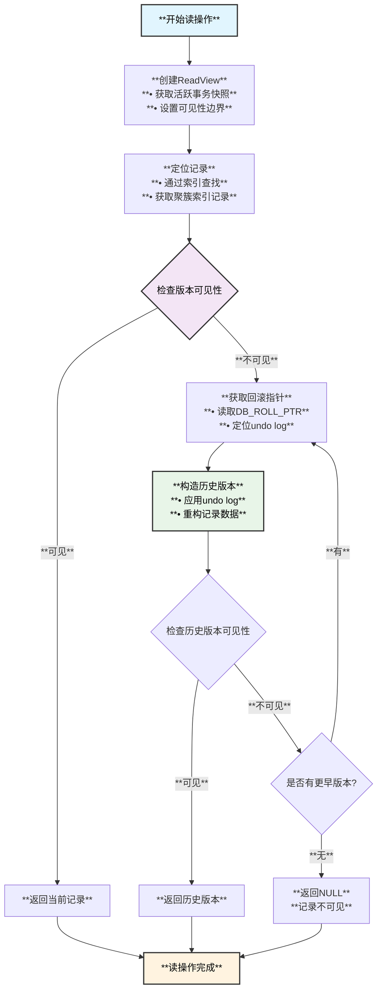
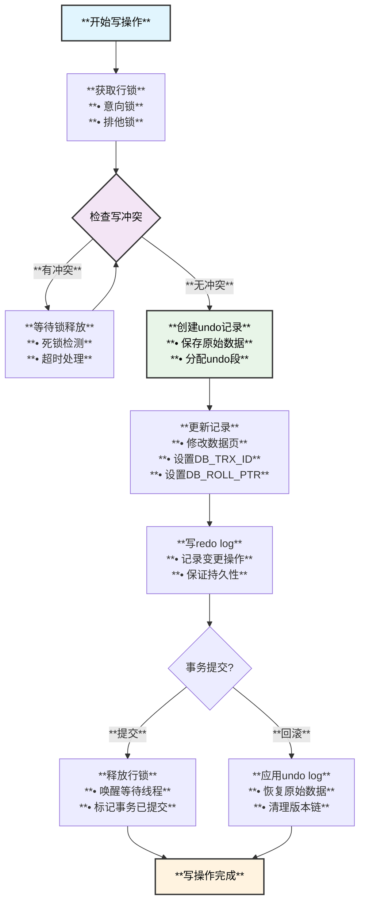

# MySQL多版本数据（MVD）模块设计架构

## 概述

**MVD（Multi-Version Data）多版本数据模块**是MySQL MVCC（多版本并发控制）系统的核心组件，负责管理数据的多个版本，支持读写并发，提供一致性读和写操作的隔离性。本文档深入分析MVD的模块架构、功能点和逻辑流程。

## MVD模块架构

### **整体架构图**

```mermaid
graph TB
    subgraph "MySQL MVD多版本数据架构"
        subgraph "事务管理层"
            TXN_MGR[**事务管理器**<br/>**• 事务ID分配**<br/>**• ReadView生成**<br/>**• 事务状态跟踪**]
            
            READ_VIEW[**ReadView模块**<br/>**• 活跃事务快照**<br/>**• 可见性判断**<br/>**• 版本选择**]
        end
        
        subgraph "版本控制层"
            VERSION_MGR[**版本管理器**<br/>**• 版本链维护**<br/>**• 版本创建删除**<br/>**• 版本链剪枝**]
            
            UNDO_LOG[**Undo Log系统**<br/>**• 回滚记录存储**<br/>**• 版本链构建**<br/>**• 历史版本重构**]
            
            VERSION_CHAIN[**版本链存储**<br/>**• 链表结构管理**<br/>**• 版本指针维护**<br/>**• 内存优化**]
        end
        
        subgraph "存储引擎层"
            PAGE_MGR[**页面管理器**<br/>**• 聚簇索引页**<br/>**• 二级索引页**<br/>**• 页面版本控制**]
            
            RECORD_MGR[**记录管理器**<br/>**• 记录版本标记**<br/>**• DB_TRX_ID字段**<br/>**• DB_ROLL_PTR指针**]
            
            PURGE_SYS[**清理系统**<br/>**• 过期版本清理**<br/>**• 版本链剪枝**<br/>**• 空间回收**]
        end
    end
    
    TXN_MGR --> READ_VIEW
    READ_VIEW --> VERSION_MGR
    VERSION_MGR --> UNDO_LOG
    UNDO_LOG --> VERSION_CHAIN
    VERSION_CHAIN --> PAGE_MGR
    PAGE_MGR --> RECORD_MGR
    RECORD_MGR --> PURGE_SYS
    
    style TXN_MGR fill:#e1f5fe,color:#000,stroke:#333,stroke-width:2px
    style VERSION_MGR fill:#e8f5e8,color:#000,stroke:#333,stroke-width:2px
    style PAGE_MGR fill:#f3e5f5,color:#000,stroke:#333,stroke-width:2px
    style PURGE_SYS fill:#fff3e0,color:#000,stroke:#333,stroke-width:2px
```



### **核心数据结构**

```cpp
/** MVD核心数据结构定义 */

// 事务ID类型定义
typedef uint64_t trx_id_t;

/** ReadView结构 - 记录事务可见性快照 */
struct ReadView {
  trx_id_t m_low_limit_id;          // 最小活跃事务ID
  trx_id_t m_up_limit_id;           // 最大已提交事务ID  
  trx_id_t m_creator_trx_id;        // 创建该ReadView的事务ID
  trx_id_t* m_ids;                  // 活跃事务ID数组
  ulint m_size;                     // 活跃事务数量
  
  /** 判断事务可见性 */
  bool changes_visible(trx_id_t id, const table_name_t &name) const {
    // 1. 如果是创建ReadView的事务，可见
    if (id == m_creator_trx_id) {
      return true;
    }
    
    // 2. 如果事务ID小于最小活跃事务ID，已提交，可见
    if (id < m_up_limit_id) {
      return true;
    }
    
    // 3. 如果事务ID大于等于最大事务ID，未提交或未开始，不可见
    if (id >= m_low_limit_id) {
      return false;
    }
    
    // 4. 在活跃事务范围内，检查是否在活跃事务列表中
    return !std::binary_search(m_ids, m_ids + m_size, id);
  }
};

/** 版本链节点结构 */
struct Version_Node {
  trx_id_t trx_id;                  // 事务ID
  roll_ptr_t roll_ptr;              // 回滚指针，指向undo log
  byte* record_data;                // 记录数据
  Version_Node* next;               // 指向前一个版本
  
  /** 版本可见性检查 */
  bool is_visible(const ReadView* view) const {
    return view->changes_visible(trx_id, "");
  }
};

/** 多版本记录头 */
struct MVD_Record_Header {
  trx_id_t db_trx_id;               // 最后修改的事务ID
  roll_ptr_t db_roll_ptr;           // 指向undo log的指针
  row_id_t db_row_id;               // 行ID（如果没有主键）
  
  // 记录状态标志
  uint8_t info_bits;                // 记录信息位
  uint8_t n_owned;                  // 拥有的记录数
  uint16_t heap_no;                 // 堆序号
};
```

## MVD功能模块详解

### 1. **版本创建模块**

```cpp
/** 版本创建管理器 */
class Version_Creator {
private:
    mem_heap_t* m_heap;             // 内存堆
    trx_t* m_trx;                   // 当前事务
    
public:
    /** 创建新版本 */
    dberr_t create_new_version(dict_index_t* index, 
                              const dtuple_t* entry,
                              rec_t* rec,
                              const ulint* offsets) {
        // 1. 分配新的版本节点
        Version_Node* new_version = allocate_version_node();
        
        // 2. 设置版本信息
        new_version->trx_id = m_trx->id;
        new_version->roll_ptr = generate_roll_ptr(m_trx);
        
        // 3. 复制记录数据
        copy_record_data(new_version, rec, offsets);
        
        // 4. 创建undo log记录
        create_undo_log_record(index, entry, rec, offsets);
        
        // 5. 链接到版本链
        link_to_version_chain(new_version, rec);
        
        return DB_SUCCESS;
    }
    
    /** 创建undo log记录 */
    void create_undo_log_record(dict_index_t* index,
                               const dtuple_t* entry, 
                               rec_t* rec,
                               const ulint* offsets) {
        trx_undo_t* undo = m_trx->rsegs.m_redo.update_undo;
        
        if (undo == nullptr) {
            // 分配新的undo log segment
            undo = trx_undo_assign_undo(m_trx, TRX_UNDO_UPDATE);
        }
        
        // 写入undo log记录
        trx_undo_page_report_modify(undo, index, rec, offsets, 
                                   entry, m_trx);
    }
};
```

### 2. **版本读取模块**

```cpp
/** 多版本读取器 */
class MVD_Reader {
private:
    ReadView* m_read_view;          // 读视图
    dict_index_t* m_index;          // 索引对象
    
public:
    /** 读取可见版本 */
    rec_t* read_visible_version(rec_t* rec, 
                               const ulint* offsets,
                               mem_heap_t* heap) {
        // 1. 获取记录的事务信息
        trx_id_t trx_id = row_get_rec_trx_id(rec, m_index, offsets);
        
        // 2. 检查当前版本是否可见
        if (m_read_view->changes_visible(trx_id, m_index->table->name)) {
            return rec;  // 当前版本可见
        }
        
        // 3. 当前版本不可见，需要构造历史版本
        return build_previous_version(rec, offsets, heap);
    }
    
    /** 构造历史版本 */
    rec_t* build_previous_version(rec_t* rec,
                                 const ulint* offsets, 
                                 mem_heap_t* heap) {
        // 1. 获取回滚指针
        roll_ptr_t roll_ptr = row_get_rec_roll_ptr(rec, m_index, offsets);
        
        // 2. 通过undo log构造历史版本
        rec_t* old_version = nullptr;
        trx_undo_rec_t* undo_rec = trx_undo_get_undo_rec(roll_ptr);
        
        if (undo_rec) {
            // 3. 应用undo log构造旧版本
            old_version = row_build_prev_vers(undo_rec, m_index, 
                                            rec, offsets, heap);
            
            // 4. 检查构造的版本是否可见
            if (old_version) {
                trx_id_t old_trx_id = row_get_rec_trx_id(old_version, 
                                                        m_index, offsets);
                if (!m_read_view->changes_visible(old_trx_id, 
                                                m_index->table->name)) {
                    // 递归构造更早版本
                    return build_previous_version(old_version, offsets, heap);
                }
            }
        }
        
        return old_version;
    }
};
```

### 3. **版本清理模块**

```cpp
/** 版本清理系统 */
class MVD_Purge_System {
private:
    std::queue<purge_node_t*> m_purge_queue;  // 清理队列
    trx_id_t m_purge_sys_trx_id;              // 清理系统事务ID
    
public:
    /** 清理过期版本 */
    void purge_expired_versions() {
        // 1. 获取最老的活跃ReadView
        ReadView* oldest_view = get_oldest_active_view();
        
        if (oldest_view == nullptr) {
            return;  // 没有活跃的读事务
        }
        
        // 2. 确定可清理的版本边界
        trx_id_t purge_limit = oldest_view->m_up_limit_id;
        
        // 3. 遍历undo log，标记可清理的版本
        mark_purgeable_versions(purge_limit);
        
        // 4. 执行清理操作
        execute_purge_operations();
    }
    
    /** 标记可清理版本 */
    void mark_purgeable_versions(trx_id_t purge_limit) {
        trx_sys_mutex_enter();
        
        // 遍历已提交事务的undo log
        for (auto& rseg : trx_sys.rsegs) {
            if (rseg.update_undo_list.empty()) continue;
            
            for (auto& undo : rseg.update_undo_list) {
                if (undo->trx_id < purge_limit) {
                    // 标记为可清理
                    add_to_purge_queue(undo);
                }
            }
        }
        
        trx_sys_mutex_exit();
    }
    
    /** 执行清理操作 */
    void execute_purge_operations() {
        while (!m_purge_queue.empty()) {
            purge_node_t* node = m_purge_queue.front();
            m_purge_queue.pop();
            
            // 1. 清理索引记录
            purge_index_records(node);
            
            // 2. 释放undo log段
            free_undo_log_segment(node->undo);
            
            // 3. 更新清理统计信息
            update_purge_statistics(node);
        }
    }
};
```

## MVD逻辑流程

### **读操作流程**



### **写操作流程**



### **清理操作流程**

```cpp
/** Purge线程工作流程 */
class MVD_Purge_Thread {
public:
    /** 主清理循环 */
    void purge_coordinator_thread() {
        while (srv_shutdown_state < SRV_SHUTDOWN_CLEANUP) {
            // 1. 检查是否需要清理
            if (!should_purge()) {
                os_thread_sleep(1000000);  // 休眠1秒
                continue;
            }
            
            // 2. 获取清理边界
            purge_sys->limit = get_purge_limit();
            
            // 3. 分配清理任务给工作线程
            distribute_purge_tasks();
            
            // 4. 等待工作线程完成
            wait_for_purge_completion();
            
            // 5. 更新清理进度
            update_purge_progress();
        }
    }
    
private:
    /** 确定清理边界 */
    trx_id_t get_purge_limit() {
        // 获取最老的活跃ReadView
        ReadView* oldest_view = nullptr;
        trx_sys_mutex_enter();
        
        for (auto& trx : trx_sys.rw_trx_list) {
            if (trx->read_view && trx->read_view->is_open()) {
                if (oldest_view == nullptr || 
                    trx->read_view->m_up_limit_id < oldest_view->m_up_limit_id) {
                    oldest_view = trx->read_view;
                }
            }
        }
        
        trx_sys_mutex_exit();
        
        return oldest_view ? oldest_view->m_up_limit_id : purge_sys->limit;
    }
};
```

## 性能优化与监控

### **性能优化策略**

```cpp
/** MVD性能优化配置 */
struct MVD_Performance_Config {
    // 版本链长度控制
    static constexpr ulint MAX_VERSION_CHAIN_LENGTH = 1000;
    
    // ReadView缓存大小
    static constexpr ulint READ_VIEW_CACHE_SIZE = 256;
    
    // Purge线程配置
    static constexpr ulint PURGE_THREAD_COUNT = 4;
    static constexpr ulint PURGE_BATCH_SIZE = 300;
    
    /** 版本链长度监控 */
    class Version_Chain_Monitor {
    public:
        void check_chain_length(const rec_t* rec, dict_index_t* index) {
            ulint chain_length = calculate_version_chain_length(rec, index);
            
            if (chain_length > MAX_VERSION_CHAIN_LENGTH) {
                // 触发紧急清理
                trigger_emergency_purge(rec, index);
                
                // 记录性能告警
                log_performance_warning(
                    "Version chain too long", chain_length);
            }
        }
        
    private:
        ulint calculate_version_chain_length(const rec_t* rec, 
                                           dict_index_t* index) {
            ulint length = 0;
            roll_ptr_t roll_ptr = row_get_rec_roll_ptr(rec, index, nullptr);
            
            while (roll_ptr != 0 && length < MAX_VERSION_CHAIN_LENGTH * 2) {
                trx_undo_rec_t* undo_rec = trx_undo_get_undo_rec(roll_ptr);
                if (!undo_rec) break;
                
                roll_ptr = trx_undo_rec_get_prev_roll_ptr(undo_rec);
                length++;
            }
            
            return length;
        }
    };
};
```

### **监控指标**

```cpp
/** MVD监控统计 */
struct MVD_Statistics {
    // 版本相关统计
    std::atomic<uint64_t> total_versions_created{0};
    std::atomic<uint64_t> total_versions_purged{0};
    std::atomic<uint64_t> avg_version_chain_length{0};
    
    // ReadView统计
    std::atomic<uint64_t> read_view_created{0};
    std::atomic<uint64_t> read_view_reused{0};
    
    // 清理统计
    std::atomic<uint64_t> purge_operations{0};
    std::atomic<uint64_t> purge_records_processed{0};
    
    /** 输出统计报告 */
    void print_statistics() const {
        ib::info() << "=== MVD Statistics ===";
        ib::info() << "Versions created: " << total_versions_created.load();
        ib::info() << "Versions purged: " << total_versions_purged.load();
        ib::info() << "Avg chain length: " << avg_version_chain_length.load();
        ib::info() << "ReadView created: " << read_view_created.load();
        ib::info() << "ReadView reused: " << read_view_reused.load();
        ib::info() << "Purge operations: " << purge_operations.load();
    }
};
```

## 总结

### **MVD核心特性**
1. **多版本并发**：支持读写并发，读不阻塞写，写不阻塞读
2. **事务隔离**：提供REPEATABLE READ和READ COMMITTED隔离级别
3. **版本管理**：通过undo log维护完整的版本链
4. **自动清理**：Purge系统自动清理过期版本，回收存储空间

### **技术优势**
1. **高并发性能**：大幅提升读写并发能力
2. **存储效率**：通过差异化存储和自动清理优化空间使用
3. **数据一致性**：保证事务ACID特性和数据一致性
4. **可扩展性**：支持大量并发事务和长时间运行的分析查询

### **适用场景**
1. **OLTP系统**：高并发事务处理系统
2. **混合工作负载**：OLTP和OLAP混合场景
3. **数据分析**：需要数据一致性的分析查询
4. **高可用系统**：要求系统持续可用的业务场景

MySQL的MVD多版本数据模块是现代数据库并发控制的核心技术，通过精妙的版本管理和清理机制，实现了高性能的多版本并发控制，为数据库系统提供了强大的并发处理能力。
