# PolarDB 云原生数据库架构设计与技术解析

## 1. 概述

PolarDB 是阿里云推出的云原生关系型数据库，采用**存储与计算分离**的架构设计。它兼容 MySQL、PostgreSQL 和 Oracle，提供高性能、高可用性和弹性扩展能力。相比传统 MySQL，PolarDB 在高并发场景下性能可提升 6 倍以上，存储容量最高可达 100TB。

## 2. 架构设计

### 2.1 整体架构

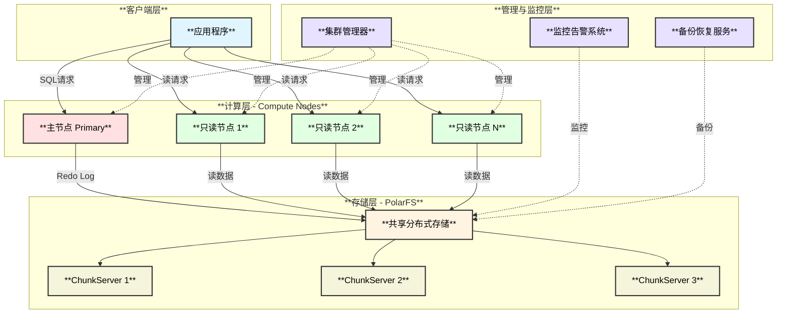

### 2.2 核心特性

- **存储计算分离**：计算节点和存储节点独立扩展
- **一写多读**：1 个主节点 + 最多 15 个只读节点
- **共享存储**：所有计算节点共享同一份数据
- **RDMA 网络**：计算层与存储层通过 RDMA 实现低延迟通信

## 3. 功能设计与模块划分

### 3.1 计算层（Compute Layer）

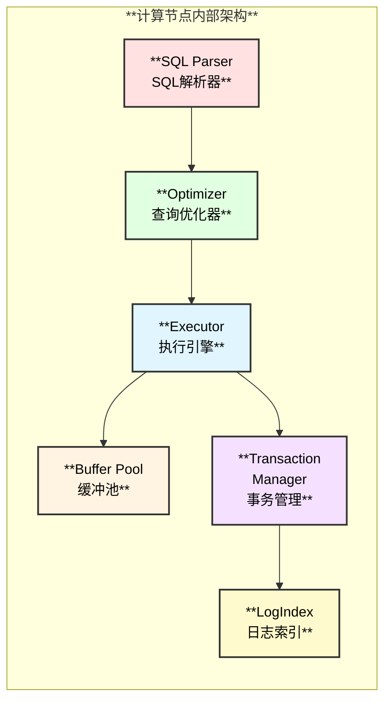

**计算层保留的 MySQL 核心功能：**

| **功能模块** | **保留能力** | **优化改进** |
|------------|------------|------------|
| **SQL 解析** | ✅ 完全兼容 MySQL 语法 | 支持分布式查询优化 |
| **查询优化器** | ✅ 保留 MySQL 优化器 | 增加并行查询优化 |
| **事务管理** | ✅ 完整 ACID 支持 | 分布式事务优化 |
| **存储引擎接口** | ✅ InnoDB 兼容 | 适配共享存储 |
| **连接管理** | ✅ 连接池管理 | 支持更高并发 |
| **权限管理** | ✅ 完整用户权限系统 | 云原生身份认证 |
| **复制机制** | ⚠️ 改为物理复制 | 基于 Redo Log 复制 |

### 3.2 存储层（Storage Layer - PolarFS）

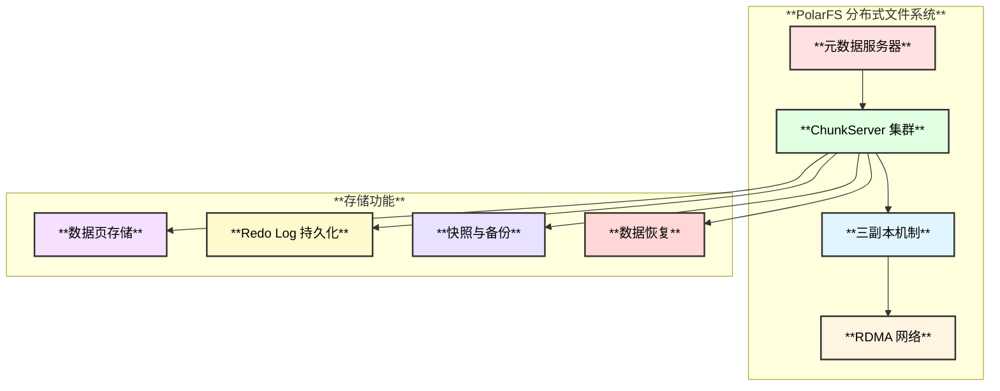

## 4. 数据交互流程

### 4.1 写入流程

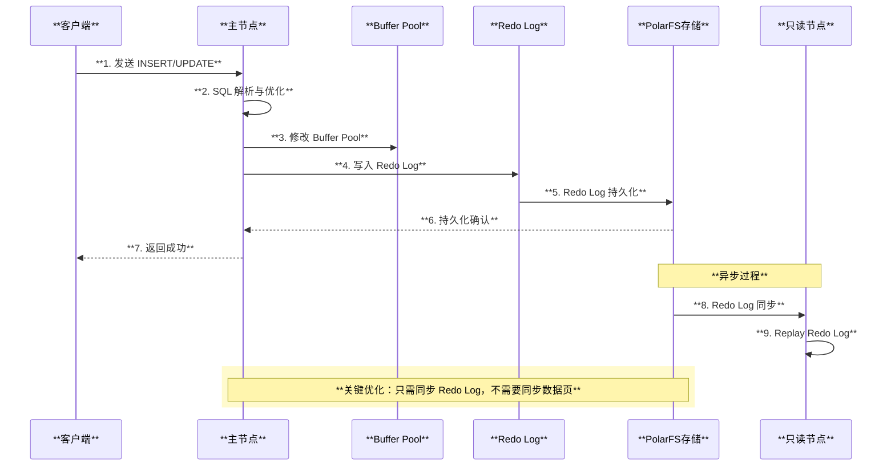

### 4.2 读取流程

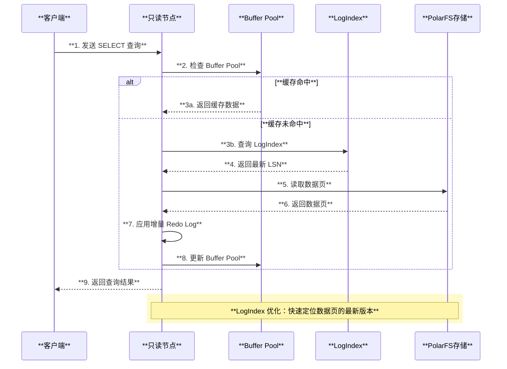

## 5. 技术创新点

### 5.1 LogIndex 机制

**LogIndex** 是 PolarDB 的核心创新，用于解决只读节点的数据一致性问题。

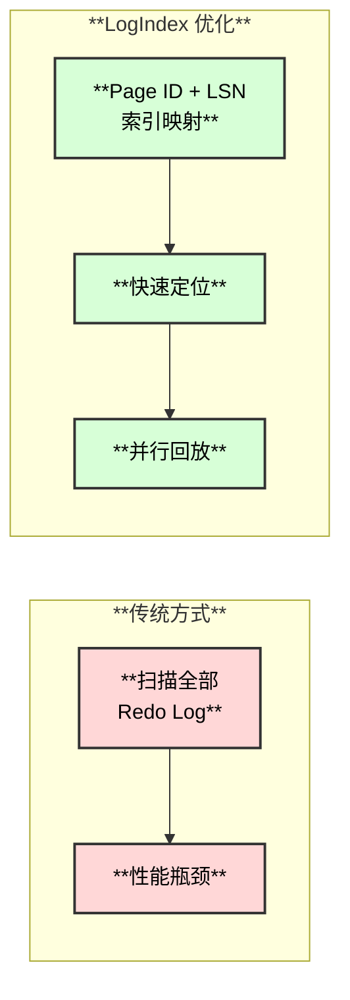

**LogIndex 工作原理：**
- 维护 `Page ID -> LSN` 的映射关系
- 只读节点只需回放与查询相关的 Redo Log
- 支持并行回放，大幅提升性能

### 5.2 Redo Log 改动

| **改动项** | **传统 MySQL** | **PolarDB** | **优势** |
|----------|--------------|-----------|--------|
| **日志格式** | 物理日志 | 物理日志（优化） | 减少日志量 |
| **写入位置** | 本地磁盘 | 共享存储（PolarFS） | 主从共享 |
| **同步方式** | 异步/半同步 | 基于 RDMA 的低延迟同步 | 微秒级延迟 |
| **回放机制** | 串行回放 | 并行回放（基于 LogIndex） | 10x+ 性能提升 |

## 6. 高可用架构

### 6.1 故障检测与切换

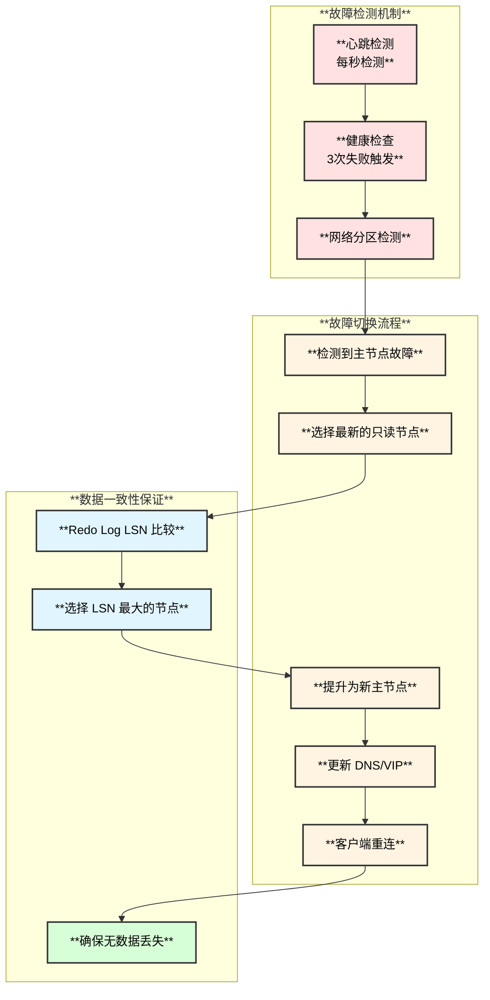

**故障切换时间：**
- **检测时间**：< 10 秒
- **切换时间**：< 30 秒
- **总 RTO**：< 1 分钟

## 7. Serverless 实现

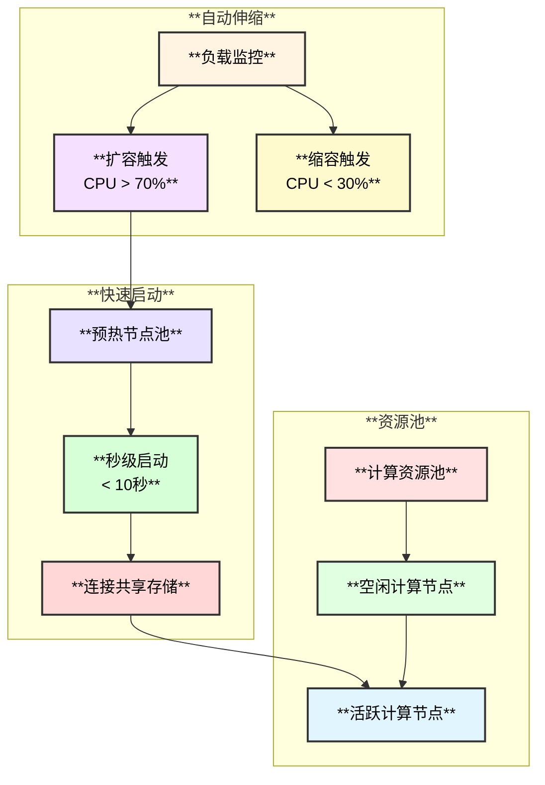

**Serverless 核心能力：**
1. **按需分配**：根据负载自动分配计算资源
2. **秒级启动**：计算节点无状态，连接共享存储即可启动
3. **按量计费**：按实际使用的 CPU/内存/时长计费

## 8. PITR（时间点恢复）

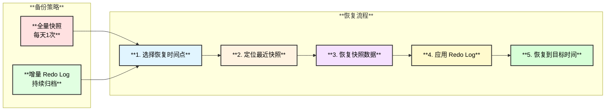

**PITR 能力：**
- **恢复粒度**：秒级
- **保留时长**：7-730 天可配置
- **恢复速度**：TB 级数据 < 1 小时

## 9. Binlog 订阅解决方案

### 9.1 实现方案

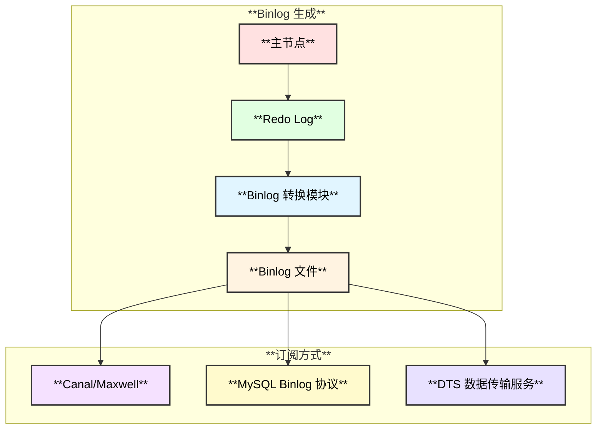

**解决方案：**
1. **兼容模式**：生成标准 MySQL Binlog，支持主流订阅工具
2. **DTS 服务**：阿里云提供的数据传输服务，原生支持 PolarDB
3. **CDC 能力**：Change Data Capture，实时捕获数据变更

## 10. 计算层快速启动

### 10.1 启动优化

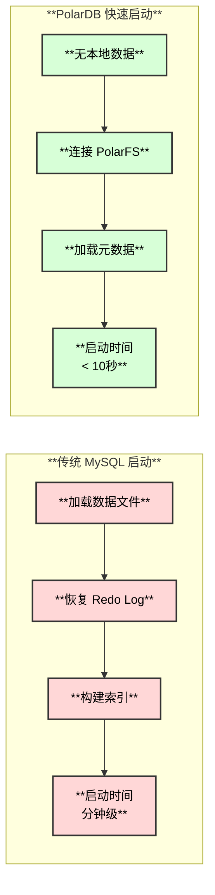

**快速启动原因：**
1. **无状态设计**：计算节点不存储数据
2. **共享存储**：直接连接 PolarFS，无需加载数据
3. **元数据预热**：只需加载必要的元数据

## 11. 主从数据同步

### 11.1 同步机制

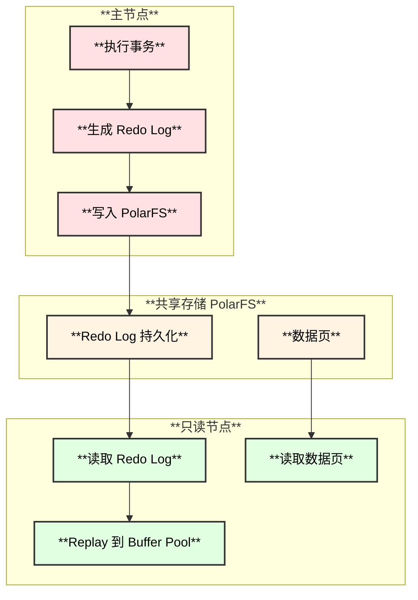

**同步的数据：**
1. **Redo Log**：事务日志（主要同步内容）
2. **数据页**：通过共享存储访问，无需同步
3. **元数据**：表结构、索引信息等

**同步延迟：**
- **物理复制延迟**：微秒级（< 100μs）
- **逻辑复制延迟**：毫秒级（传统 binlog）

## 12. 使用场景

### 12.1 适用场景

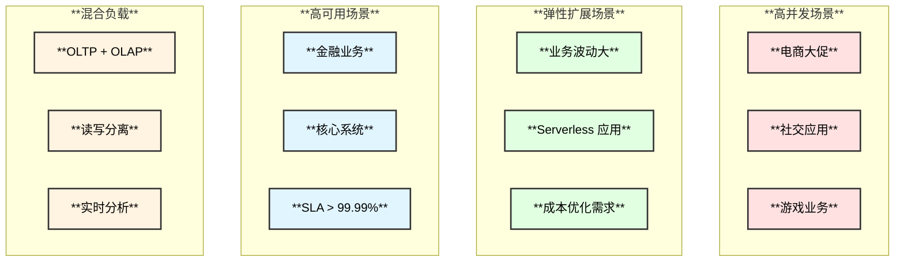

## 13. 资源成本分析

### 13.1 成本对比

| **资源维度** | **传统 MySQL** | **PolarDB** | **优势分析** |
|------------|--------------|-----------|------------|
| **CPU** | 固定配置，利用率低 | 按需分配，弹性伸缩 | **节省 30-50%** |
| **内存** | 每个实例独立 Buffer Pool | 主从共享 Buffer Pool（优化） | **节省 20-40%** |
| **磁盘** | 主从各自存储完整数据 | 共享存储，单份数据 | **节省 50-70%** |
| **网络** | 传输完整数据页 | 只传输 Redo Log | **减少 80%+ 流量** |
| **运维** | 人工管理 | 自动化管理 | **降低 60% 运维成本** |

### 13.2 成本优化图

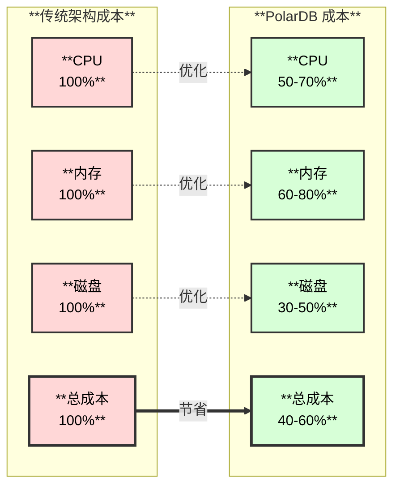

## 14. 核心问题解答总结

### 14.1 问题汇总

| **问题** | **PolarDB 解决方案** | **技术关键** |
|---------|-------------------|------------|
| **1. 计算层保留能力** | 完整保留 MySQL 核心功能（SQL解析、事务、存储引擎） | InnoDB 兼容 + 共享存储适配 |
| **2. Binlog 订阅** | 生成标准 Binlog + DTS 服务 | Redo Log 转 Binlog |
| **3. 主从同步** | 基于 Redo Log 的物理复制 | 共享存储 + LogIndex |
| **4. Redo 改动** | RDMA 低延迟 + 并行回放 + LogIndex | 微秒级同步延迟 |
| **5. 高可用** | 秒级故障检测 + 自动切换 + LSN 保证一致性 | RTO < 1分钟 |
| **6. Serverless** | 无状态计算节点 + 资源池化 + 秒级启动 | 按量计费 |
| **7. PITR** | 全量快照 + Redo Log 归档 | 秒级恢复粒度 |
| **8. 快速启动** | 无本地数据 + 共享存储 | < 10秒启动 |
| **9. 资源成本** | 存储节省 50-70%，总成本节省 40-60% | 共享存储 + 弹性伸缩 |

## 15. 参考资料

1. **官方文档**：
   - [PolarDB 产品文档](https://www.aliyun.com/product/polardb)
   - [PolarDB 技术白皮书](https://developer.aliyun.com/article/polardb)

2. **学术论文**：
   - POLARDB Meets Computational Storage: Efficiently Support Analytical Workloads in Cloud-Native Relational Database (FAST 2020)

3. **技术博客**：
   - [PolarDB 存储计算分离架构解析](https://developer.aliyun.com)
   - [PolarDB LogIndex 技术详解](https://developer.aliyun.com)

---

**文档版本**：v1.0  
**最后更新**：2025-11-04  
**作者**：云原生数据库技术团队

