# TDSQL-C (CynosDB) 云原生数据库架构设计与技术解析

## 1. 概述

TDSQL-C (CynosDB) 是腾讯云推出的新一代云原生关系型数据库，采用**存储与计算完全解耦**的架构设计。它兼容 MySQL 和 PostgreSQL 两大生态，提供百万级 QPS 的高吞吐能力，存储容量可达 PB 级。TDSQL-C 在性能、可用性和成本方面都有显著优势。

## 2. 架构设计

### 2.1 整体架构

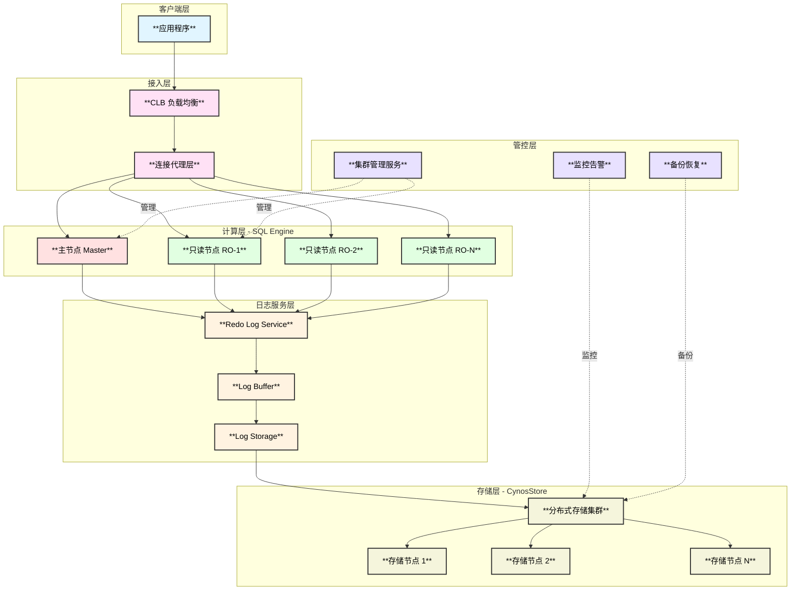

### 2.2 核心特性

- **三层架构**：接入层、计算层、存储层完全解耦
- **共享存储**：所有计算节点共享同一份数据
- **独立日志服务**：Redo Log Service 独立管理
- **1主多读**：支持 1 个主节点 + 最多 15 个只读节点
- **秒级扩展**：计算和存储资源独立扩展

## 3. 功能设计与模块划分

### 3.1 计算层（Compute Layer）

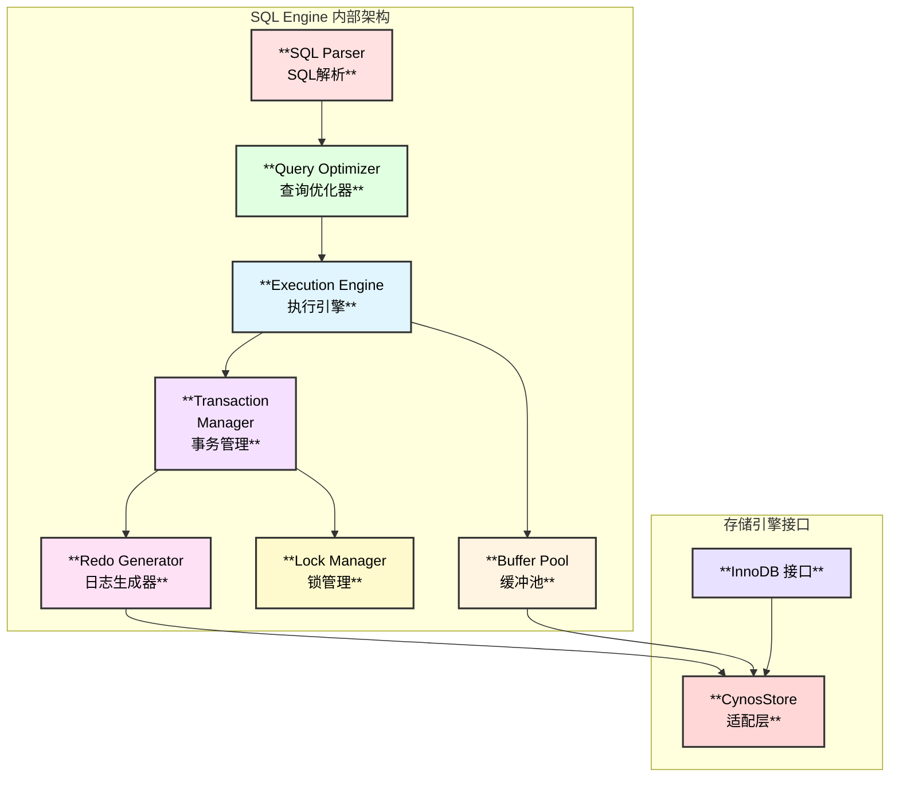

**与 MySQL 的功能对比：**

| **功能模块** | **MySQL 原生** | **TDSQL-C 保留** | **优化改进** |
|------------|--------------|----------------|------------|
| **SQL 解析器** | ✅ | ✅ 完全兼容 | 支持分布式 SQL 优化 |
| **查询优化器** | ✅ | ✅ 完整保留 | 增加存储层下推优化 |
| **事务管理** | ✅ ACID | ✅ 完整 ACID | 分布式事务增强 |
| **InnoDB 引擎** | ✅ | ✅ 高度兼容 | 适配共享存储 |
| **Binlog** | ✅ | ✅ 完全兼容 | 支持标准订阅 |
| **主从复制** | ✅ 异步/半同步 | ⚠️ 改为物理复制 | 基于 Redo Log |
| **Buffer Pool** | ✅ | ✅ 独立管理 | 主从各自维护 |
| **Redo Log** | ✅ 本地写入 | ⚠️ 写入日志服务 | 集中式管理 |

### 3.2 日志服务层（Redo Log Service）

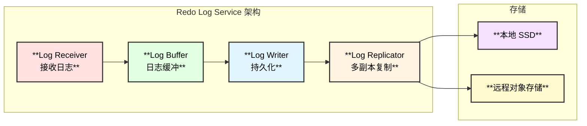

**日志服务的关键优势：**
- **集中管理**：统一管理所有节点的 Redo Log
- **高可靠**：多副本机制，确保日志不丢失
- **低延迟**：本地 SSD 缓存 + 异步刷盘

### 3.3 存储层（CynosStore）

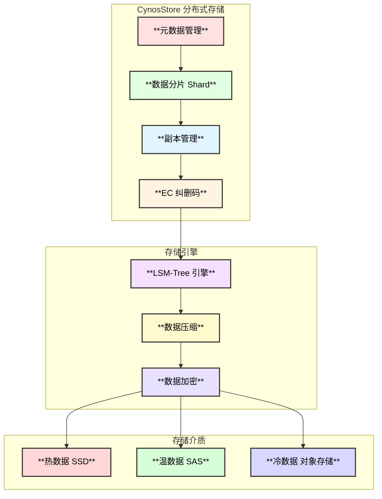

## 4. 数据交互流程

### 4.1 写入流程

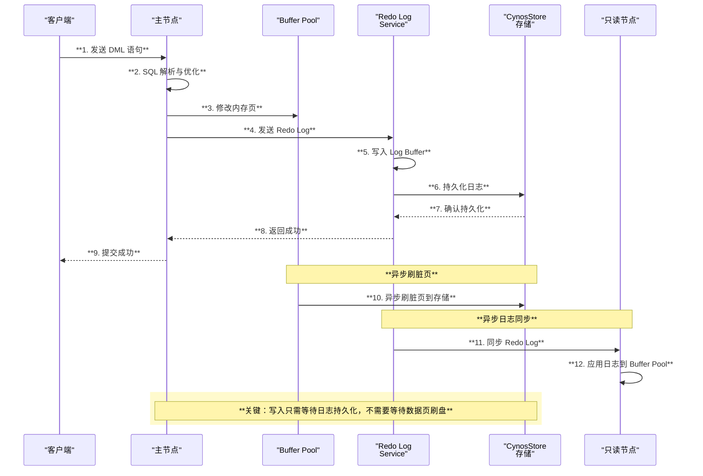

### 4.2 读取流程

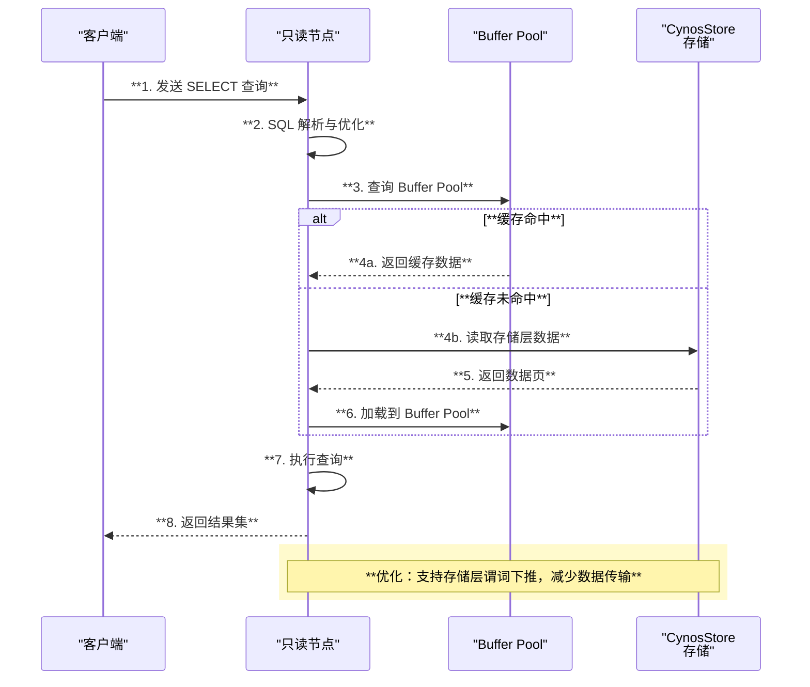

## 5. 技术创新点

### 5.1 三层解耦架构

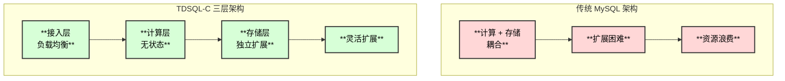

### 5.2 Redo Log 改进

| **改进项** | **传统 MySQL** | **TDSQL-C** | **优势** |
|----------|--------------|-----------|--------|
| **日志管理** | 本地磁盘 | 独立日志服务 | 集中管理，高可靠 |
| **写入方式** | 同步刷盘 | 异步刷盘 + 多副本 | 低延迟，高吞吐 |
| **存储位置** | 本地文件 | SSD + 对象存储 | 成本优化 |
| **复制机制** | Binlog 异步复制 | Redo Log 物理复制 | 微秒级延迟 |
| **日志压缩** | 不支持 | 支持智能压缩 | 节省存储空间 |

## 6. 高可用架构

### 6.1 故障检测与切换流程

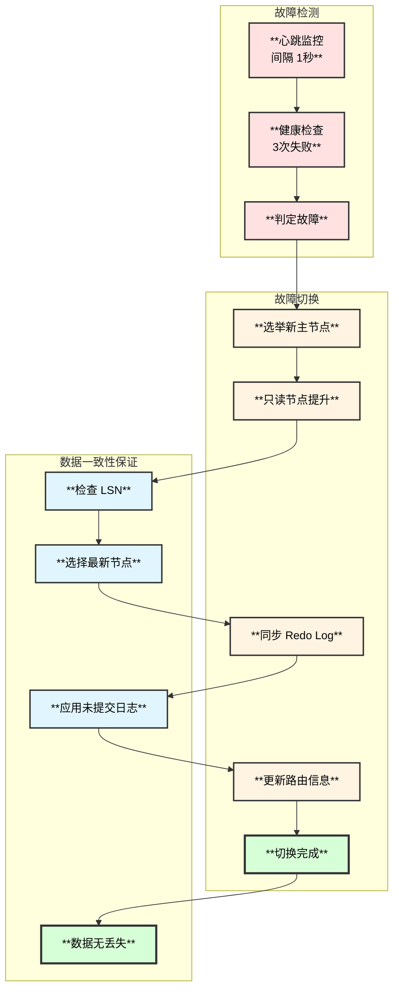

**高可用指标：**
- **RTO（恢复时间目标）**：< 60 秒
- **RPO（恢复点目标）**：= 0（无数据丢失）
- **可用性 SLA**：99.99%

## 7. Serverless 实现

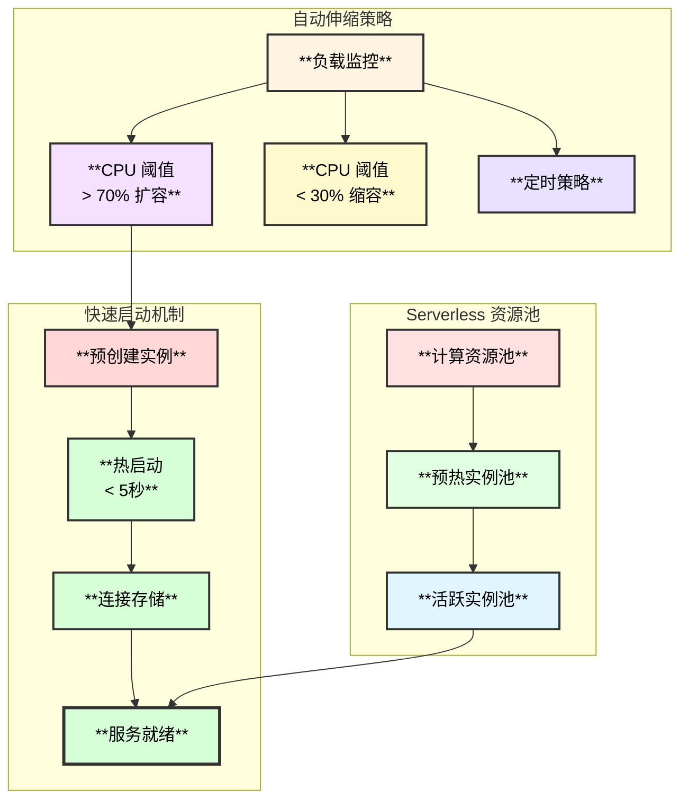

**Serverless 特性：**
- **按需计费**：按 CCU（TDSQL-C Compute Unit）计费
- **自动暂停**：空闲 10 分钟自动暂停，节省成本
- **快速恢复**：暂停后首次请求 < 5 秒恢复

## 8. PITR（时间点恢复）

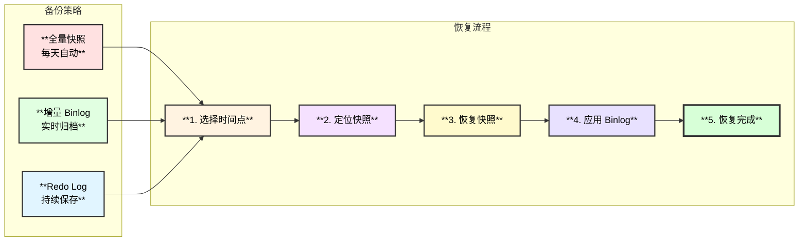

**PITR 能力：**
- **恢复粒度**：秒级
- **保留周期**：7-1830 天（可配置）
- **恢复速度**：100GB 数据 < 10 分钟

## 9. Binlog 订阅解决方案

### 9.1 完整的 Binlog 支持

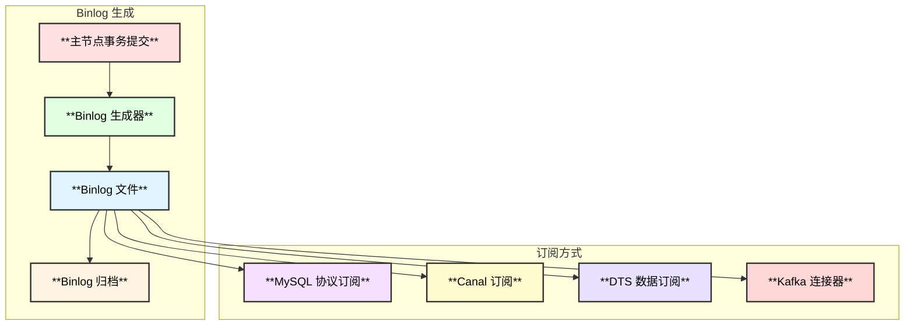

**Binlog 支持：**
- **完全兼容**：生成标准 MySQL Binlog（ROW/STATEMENT/MIXED）
- **订阅工具**：支持 Canal、Maxwell、Debezium 等
- **DTS 服务**：腾讯云 DTS 原生支持
- **实时性**：< 1 秒延迟

## 10. 计算层快速启动

### 10.1 启动流程对比

```mermaid
graph TB
    subgraph "传统 MySQL 启动"
        A[**加载数据字典**]
        B[**恢复 Redo Log**]
        C[**重建 Buffer Pool**]
        D[**启动时间<br/>3-10 分钟**]
    end
    
    subgraph "TDSQL-C 快速启动"
        E[**连接存储层**]
        F[**加载元数据**]
        G[**初始化 Buffer Pool**]
        H[**启动时间<br/>&lt; 10 秒**]
    end
    
    A --> B
    B --> C
    C --> D
    
    E --> F
    F --> G
    G --> H
    
    style A fill:#ffd7d7,stroke:#333,stroke-width:2px,color:#000
    style B fill:#ffd7d7,stroke:#333,stroke-width:2px,color:#000
    style C fill:#ffd7d7,stroke:#333,stroke-width:2px,color:#000
    style D fill:#ffd7d7,stroke:#333,stroke-width:3px,color:#000
    style E fill:#d7ffd7,stroke:#333,stroke-width:2px,color:#000
    style F fill:#d7ffd7,stroke:#333,stroke-width:2px,color:#000
    style G fill:#d7ffd7,stroke:#333,stroke-width:2px,color:#000
    style H fill:#d7ffd7,stroke:#333,stroke-width:3px,color:#000
```

**快速启动关键技术：**
1. **无状态计算节点**：不存储数据，只需连接存储层
2. **元数据缓存**：热点元数据预加载
3. **懒加载**：Buffer Pool 按需加载
4. **预热实例池**：Serverless 模式下预创建实例

## 11. 主从数据同步

### 11.1 同步机制

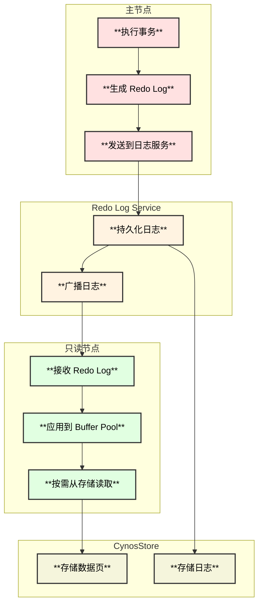

**同步的数据：**
1. **Redo Log**：事务的物理日志（主要同步内容）
2. **元数据变更**：DDL 操作的元数据
3. **数据页**：通过共享存储访问，无需同步

**同步延迟：**
- **物理复制延迟**：< 1 毫秒（微秒级）
- **应用延迟**：< 10 毫秒

## 12. 使用场景

### 12.1 典型应用场景

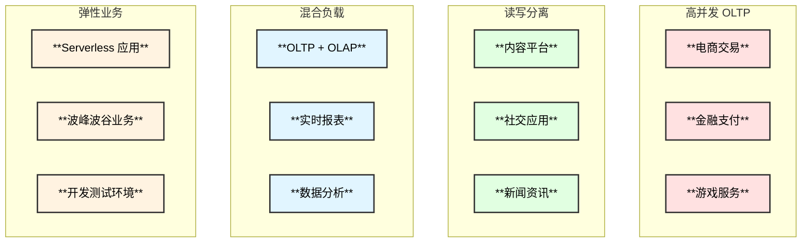

## 13. 资源成本分析

### 13.1 成本对比

| **资源维度** | **自建 MySQL** | **云数据库 RDS** | **TDSQL-C** | **成本优势** |
|------------|--------------|----------------|-----------|----------|
| **CPU** | 固定配置 | 固定配置 | 弹性伸缩 | **节省 40-60%** |
| **内存** | 固定配置 | 固定配置 | 弹性伸缩 | **节省 30-50%** |
| **磁盘** | 主从各 1 份 | 主从各 1 份 | 单份 + 多副本 | **节省 50-70%** |
| **运维** | 人工运维 | 半自动化 | 全自动化 | **节省 70%+** |
| **备份** | 占用主存储 | 独立计费 | 共享存储快照 | **节省 80%+** |

### 13.2 成本优势图表

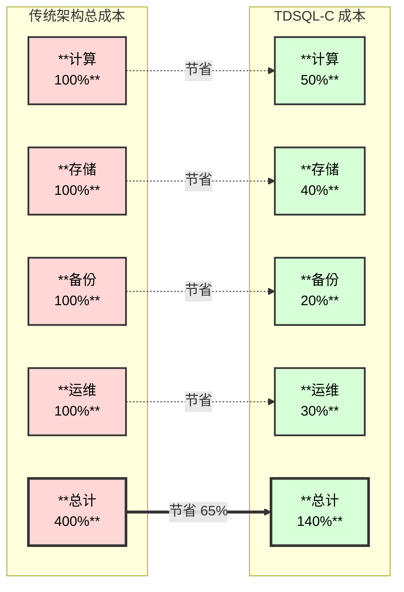

### 13.3 详细成本分析

**CPU 成本：**
- **弹性伸缩**：根据负载动态调整，避免资源浪费
- **Serverless 模式**：空闲自动暂停，无需付费
- **节省比例**：40-60%

**内存成本：**
- **按需分配**：计算节点独立扩展内存
- **共享存储**：减少重复数据缓存
- **节省比例**：30-50%

**磁盘成本：**
- **单份存储**：所有节点共享同一份数据
- **智能分层**：热温冷数据自动分层存储
- **快照备份**：增量快照，不占用主存储
- **节省比例**：50-70%

## 14. 核心问题解答总结

| **问题** | **TDSQL-C 解决方案** | **技术关键** |
|---------|-------------------|------------|
| **1. 计算层保留能力** | 完整保留 MySQL 功能（SQL、事务、InnoDB） | 高度兼容 + 存储层适配 |
| **2. Binlog 订阅** | 完整支持 MySQL Binlog + DTS 服务 | 标准 Binlog 格式 |
| **3. 主从同步** | 基于 Redo Log 的物理复制 | 独立日志服务 + 微秒级延迟 |
| **4. Redo 改动** | 独立日志服务 + 异步刷盘 + 多副本 | 低延迟 + 高可靠 |
| **5. 高可用** | 自动故障检测 + 60秒切换 + LSN 一致性 | RTO < 60s, RPO = 0 |
| **6. Serverless** | 无状态节点 + 预热池 + 5秒启动 | 按 CCU 计费 + 自动暂停 |
| **7. PITR** | 快照 + Binlog 归档 + 秒级恢复 | 最长保留 1830 天 |
| **8. 快速启动** | 无本地数据 + 元数据预热 + 懒加载 | < 10 秒启动 |
| **9. 资源成本** | 总成本节省 50-65% | 存储节省最显著 |

## 15. 参考资料

1. **官方文档**：
   - [TDSQL-C 产品文档](https://cloud.tencent.com/document/product/1003)
   - [TDSQL-C 技术白皮书](https://cloud.tencent.com/developer/article/tdsql-c)

2. **技术博客**：
   - [TDSQL-C 架构解析](https://cloud.tencent.com/developer/column)
   - [存算分离架构实践](https://cloud.tencent.com/developer/article)

3. **最佳实践**：
   - [TDSQL-C 性能优化指南](https://cloud.tencent.com/document/product/1003/best-practices)
   - [Serverless 应用场景](https://cloud.tencent.com/document/product/1003/serverless)

---

**文档版本**：v1.0  
**最后更新**：2025-11-04  
**作者**：云原生数据库技术团队

