# 华为 TaurusDB (GaussDB(for MySQL)) 云原生数据库架构设计与技术解析

## 1. 概述

TaurusDB（现更名为 GaussDB(for MySQL)）是华为云推出的企业级云原生数据库，采用**计算与存储分离**的架构设计。它兼容 MySQL 生态，基于华为自研的 DFV（Distributed File Volume）分布式存储，提供高达**百万级 TPS** 的性能，存储容量可达 **128TB**，支持秒级扩容和高可用。

## 2. 架构设计

### 2.1 整体架构

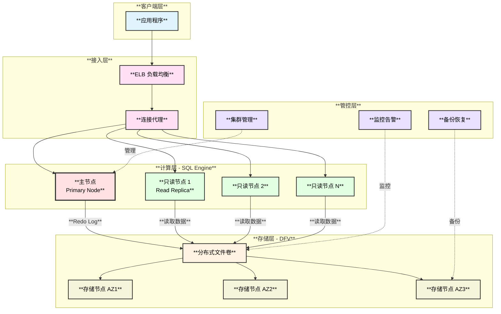

### 2.2 核心特性

- **三副本冗余**：跨3个可用区部署，每份数据3个副本
- **共享存储**：所有计算节点共享同一份数据
- **DFV 存储引擎**：华为自研分布式文件卷
- **1主多读**：1个主节点 + 最多15个只读节点
- **秒级扩容**：计算与存储资源独立扩展

## 3. 功能设计与模块划分

### 3.1 计算层（Compute Layer）

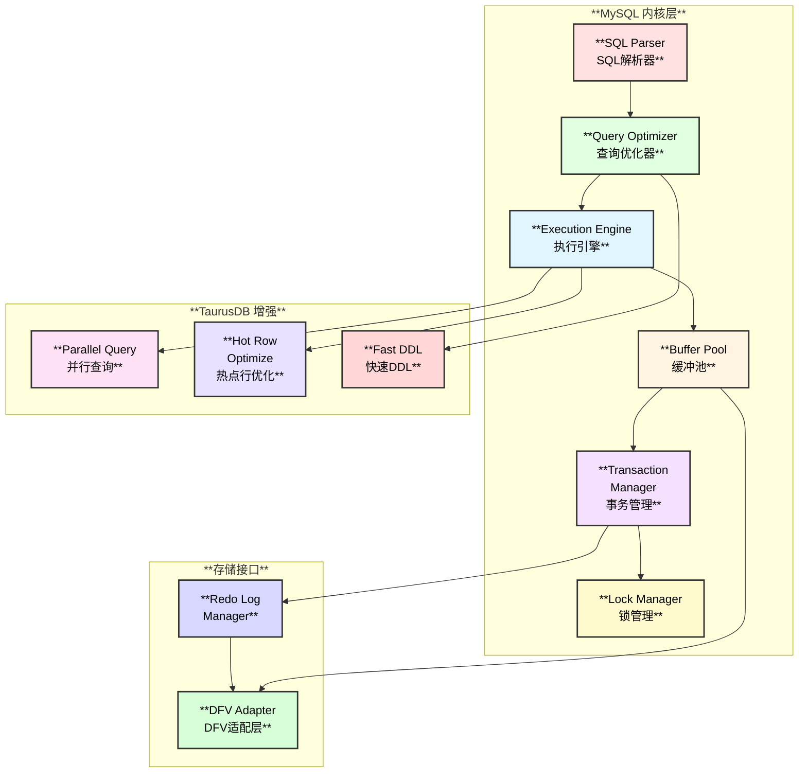

**与 MySQL 的功能对比：**

| **功能模块** | **MySQL 8.0** | **TaurusDB** | **优化改进** |
|------------|-------------|------------|------------|
| **SQL 解析** | ✅ | ✅ 完全兼容 | 无变化 |
| **查询优化器** | ✅ | ✅ 增强优化 | 并行查询支持 |
| **事务管理** | ✅ ACID | ✅ ACID | 分布式事务优化 |
| **InnoDB 引擎** | ✅ | ✅ 高度兼容 | 适配 DFV 存储 |
| **Buffer Pool** | ✅ | ✅ 保留 | 主从独立管理 |
| **Redo Log** | ✅ 本地写入 | ⚠️ **写入 DFV** | **存储分离** |
| **Binlog** | ✅ | ✅ 完全兼容 | 支持标准订阅 |
| **主从复制** | ✅ 异步/半同步 | ⚠️ 物理复制 | 基于 Redo Log |
| **并行查询** | ❌ | ✅ **支持** | **OLAP 加速** |
| **热点行优化** | ❌ | ✅ **支持** | **高并发优化** |

### 3.2 存储层（DFV - Distributed File Volume）

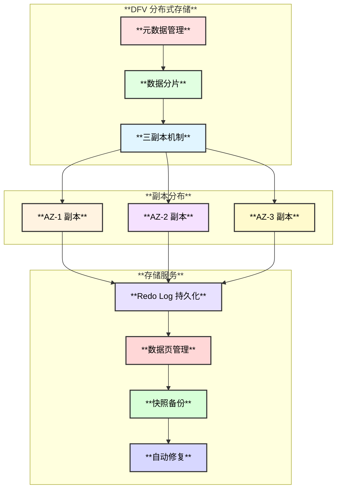

## 4. 数据交互流程

### 4.1 写入流程

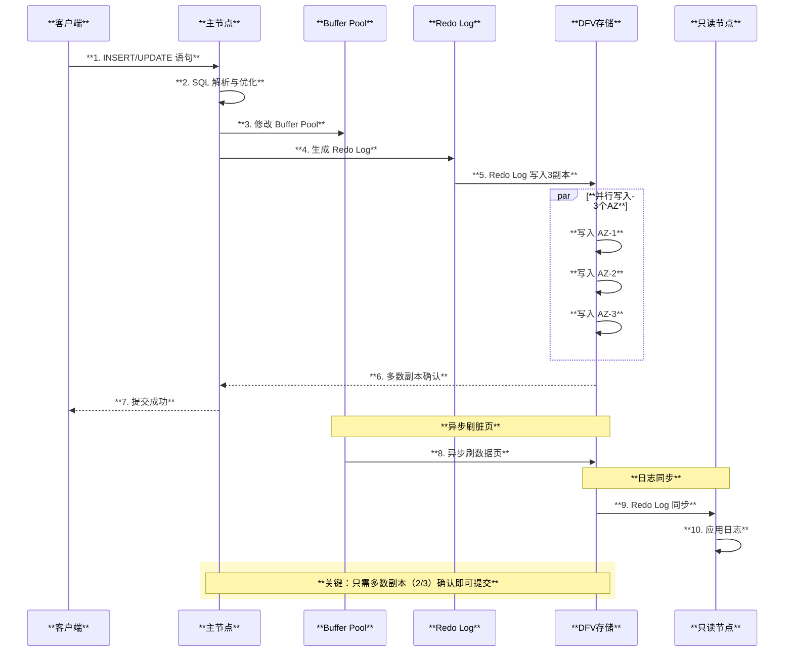

### 4.2 读取流程

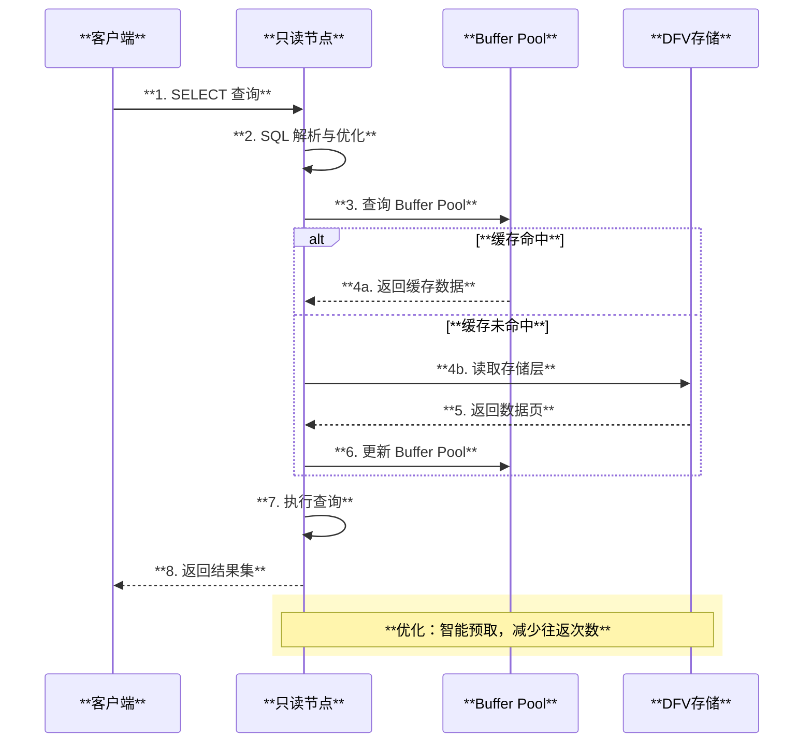

## 5. 技术创新点

### 5.1 热点行优化

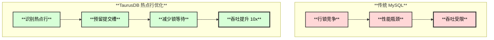

**热点行优化原理：**
- **自动识别**：检测高并发更新的行
- **内存队列**：为热点行建立提交队列
- **批量提交**：减少锁竞争和上下文切换
- **性能提升**：热点场景吞吐量提升 10 倍以上

### 5.2 并行查询

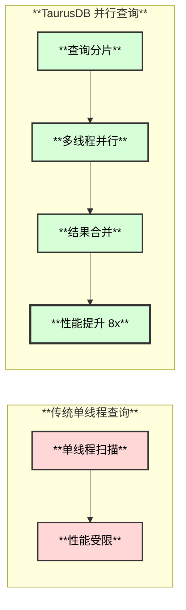

**并行查询能力：**
- **适用场景**：大表扫描、聚合查询
- **并行度**：最高32线程
- **性能提升**：8倍以上

### 5.3 Redo Log 改进

| **改进项** | **MySQL** | **TaurusDB** | **优势** |
|----------|---------|-----------|--------|
| **日志位置** | 本地磁盘 | DFV 存储 | 高可靠性 |
| **副本数** | 1（主节点） | 3（跨AZ） | 容灾能力强 |
| **同步方式** | Binlog 异步 | Redo Log 物理复制 | 低延迟 |
| **持久化** | fsync 刷盘 | 分布式多数确认 | 高性能 |
| **恢复速度** | 分钟级 | 秒级 | 快速恢复 |

## 6. 高可用架构

### 6.1 故障检测与切换

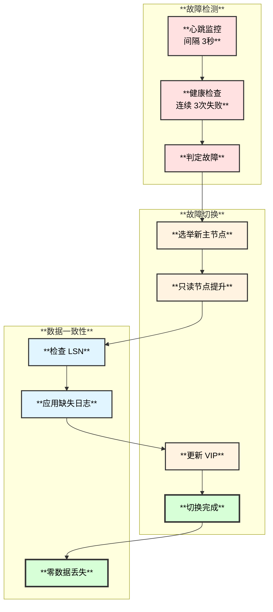

**高可用指标：**
- **RTO（恢复时间）**：< 30 秒
- **RPO（恢复点）**：= 0（无数据丢失）
- **SLA**：99.99%
- **跨 AZ 容错**：支持1个AZ故障

### 6.2 三副本容灾

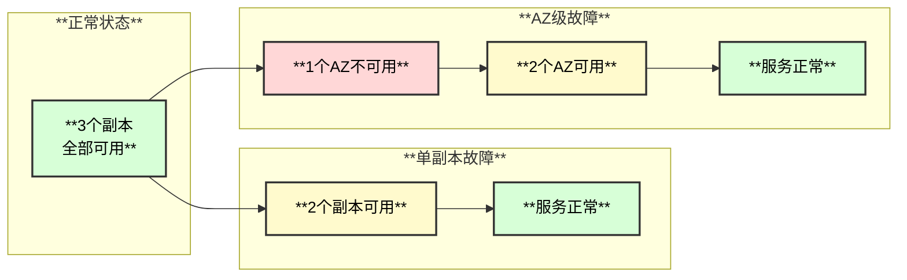

## 7. Serverless 实现

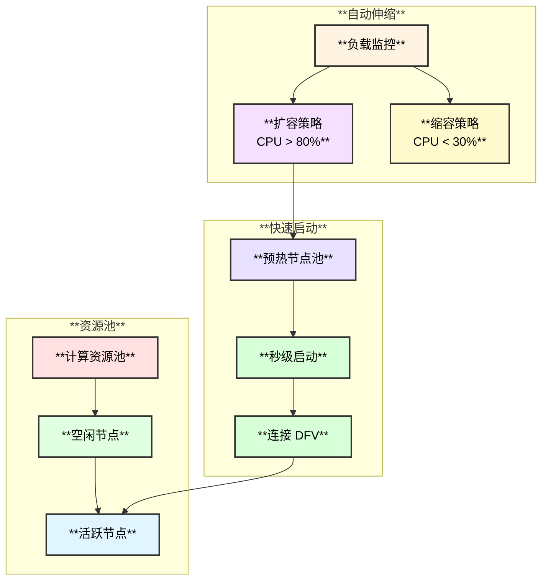

**Serverless 特性：**
- **按需计费**：按 CCU（Computing Capacity Unit）计费
- **自动暂停**：空闲 10 分钟自动暂停
- **快速唤醒**：< 5 秒恢复服务

## 8. PITR（时间点恢复）

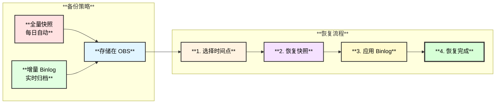

**PITR 能力：**
- **恢复粒度**：秒级
- **保留时长**：7-732 天可配置
- **恢复速度**：100GB < 10 分钟

## 9. Binlog 订阅解决方案

### 9.1 完整的 Binlog 支持

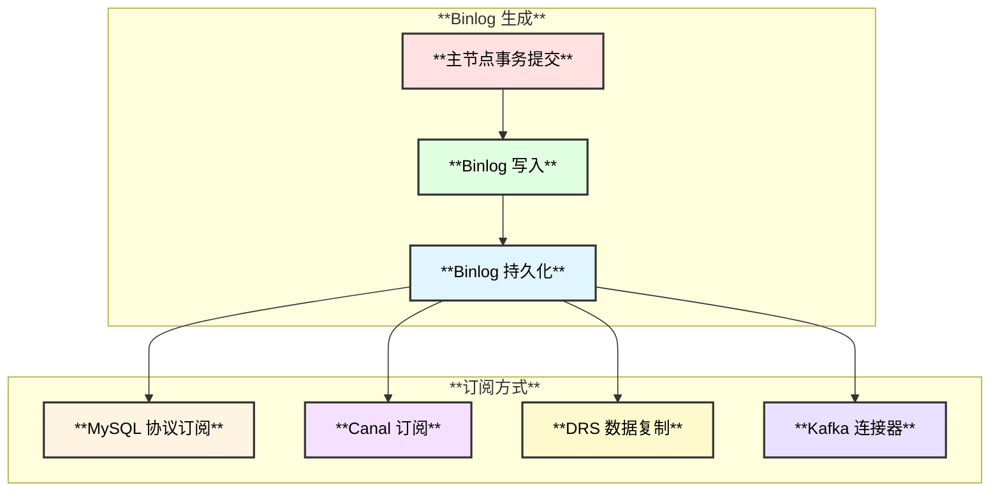

**Binlog 支持：**
- **完全兼容**：标准 MySQL Binlog（ROW/STATEMENT/MIXED）
- **订阅工具**：支持 Canal、Maxwell、Debezium
- **DRS 服务**：华为云 DRS（Data Replication Service）
- **延迟**：< 1 秒

## 10. 计算层快速启动

### 10.1 启动流程对比

```mermaid
graph TB
    subgraph "**传统 MySQL 启动**"
        A[**加载数据文件**]
        B[**恢复 Redo Log**]
        C[**重建 Buffer Pool**]
        D[**启动时间<br/>3-10 分钟**]
    end
    
    subgraph "**TaurusDB 快速启动**"
        E[**连接 DFV 存储**]
        F[**加载元数据**]
        G[**初始化 Buffer Pool**]
        H[**启动时间<br/>&lt; 10 秒**]
    end
    
    A --> B
    B --> C
    C --> D
    
    E --> F
    F --> G
    G --> H
    
    style A fill:#ffd7d7,stroke:#333,stroke-width:2px,color:#000
    style B fill:#ffd7d7,stroke:#333,stroke-width:2px,color:#000
    style C fill:#ffd7d7,stroke:#333,stroke-width:2px,color:#000
    style D fill:#ffd7d7,stroke:#333,stroke-width:3px,color:#000
    style E fill:#d7ffd7,stroke:#333,stroke-width:2px,color:#000
    style F fill:#d7ffd7,stroke:#333,stroke-width:2px,color:#000
    style G fill:#d7ffd7,stroke:#333,stroke-width:2px,color:#000
    style H fill:#d7ffd7,stroke:#333,stroke-width:3px,color:#000
```

**快速启动关键技术：**
1. **无状态计算节点**：不存储数据，只需连接 DFV
2. **元数据缓存**：热点元数据预加载
3. **懒加载**：Buffer Pool 按需加载
4. **预热实例池**：Serverless 模式预创建实例

## 11. 主从数据同步

### 11.1 同步机制

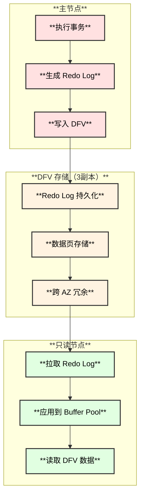

**同步的数据：**
1. **Redo Log**：事务的物理日志（主要同步内容）
2. **数据页**：通过共享存储 DFV 访问
3. **Binlog**：可选开启，用于逻辑复制

**同步延迟：**
- **物理复制延迟**：< 10 毫秒
- **跨 AZ 延迟**：< 100 毫秒

## 12. 使用场景

### 12.1 适用场景

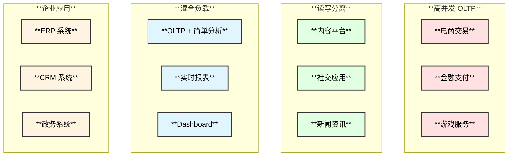

## 13. 资源成本分析

### 13.1 成本对比

| **资源维度** | **自建 MySQL** | **云数据库 RDS** | **TaurusDB** | **TaurusDB 优势** |
|------------|--------------|----------------|-----------|---------------|
| **CPU** | 固定配置 | 固定配置 | 弹性伸缩 | **节省 30-40%** |
| **内存** | 固定配置 | 固定配置 | 弹性伸缩 | **节省 20-30%** |
| **存储** | 主从各1份 | 主从各1份 | 单份 + 3副本 | **节省 40-50%** |
| **IOPS** | 单独采购 | 单独计费 | 包含在存储 | **节省 30-40%** |
| **备份** | 额外存储 | 额外费用 | 快照备份 | **节省 50-60%** |
| **运维** | 全人工 | 半自动 | 全自动 | **节省 60-70%** |

### 13.2 成本优势图表

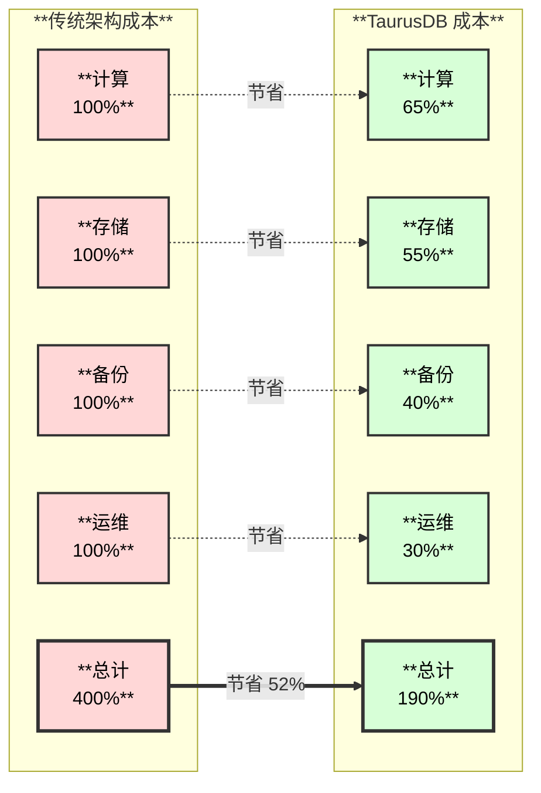

### 13.3 详细成本分析

**CPU 成本：**
- **弹性伸缩**：根据负载自动调整规格
- **热点行优化**：提升 CPU 利用率
- **并行查询**：充分利用多核
- **节省比例**：30-40%

**内存成本：**
- **按需分配**：避免资源浪费
- **智能缓存**：提高命中率
- **节省比例**：20-30%

**存储成本：**
- **单份数据**：所有节点共享
- **三副本冗余**：比主从各1份更经济
- **快照备份**：增量备份，节省空间
- **节省比例**：40-50%

## 14. 核心问题解答总结

| **问题** | **TaurusDB 解决方案** | **技术关键** |
|---------|-------------------|------------|
| **1. 计算层保留能力** | 完整保留 MySQL 功能 + 增强 | 高度兼容 + 热点行优化 + 并行查询 |
| **2. Binlog 订阅** | 完整支持 MySQL Binlog + DRS | 标准 Binlog 格式 |
| **3. 主从同步** | 基于 Redo Log 的物理复制 | DFV 存储 + 低延迟 |
| **4. Redo 改动** | 写入 DFV + 3副本跨AZ | 高可靠 + 快速恢复 |
| **5. 高可用** | 3副本跨AZ + 30秒切换 | RTO < 30s, RPO = 0 |
| **6. Serverless** | CCU 弹性计费 + 自动暂停 | 5秒唤醒 |
| **7. PITR** | 快照 + Binlog + 732天保留 | 秒级恢复粒度 |
| **8. 快速启动** | 无本地数据 + 连接 DFV | < 10 秒启动 |
| **9. 资源成本** | 总成本节省 50%+ | 存储节省最显著 |

## 15. TaurusDB 核心优势总结

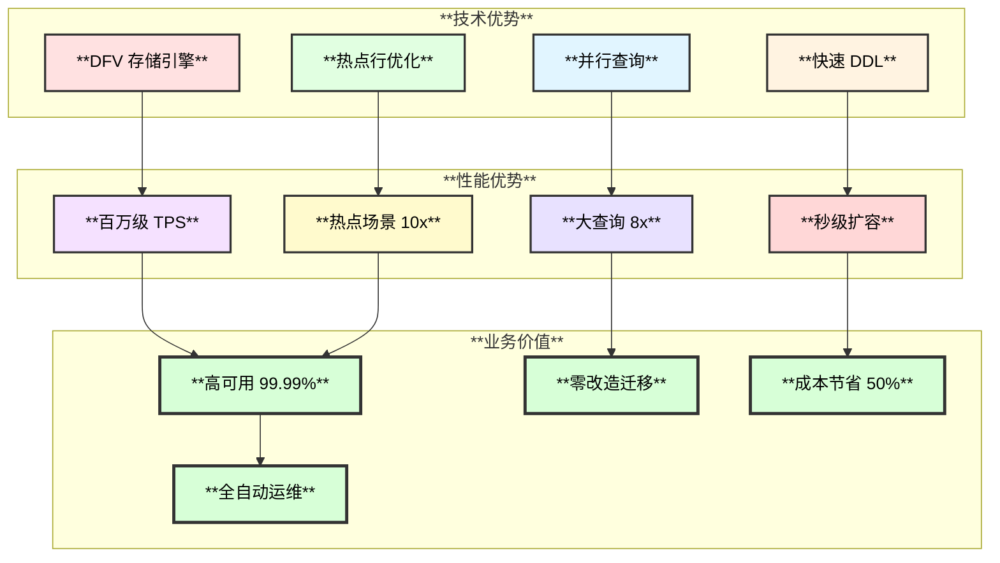

## 16. 参考资料

1. **官方文档**：
   - [华为云 GaussDB(for MySQL) 产品文档](https://support.huaweicloud.com/gaussdb_mysql/index.html)
   - [TaurusDB 技术白皮书](https://support.huaweicloud.com/wtsnew-gaussdb_mysql/index.html)

2. **技术博客**：
   - [TaurusDB 架构解析](https://bbs.huaweicloud.com/forum/forum-675-1.html)
   - [DFV 分布式存储技术](https://bbs.huaweicloud.com)

3. **最佳实践**：
   - [TaurusDB 性能优化指南](https://support.huaweicloud.com/bestpractice-gaussdb_mysql/index.html)
   - [迁移上云最佳实践](https://support.huaweicloud.com/migration-gaussdb_mysql/index.html)

---

**文档版本**：v1.0  
**最后更新**：2025-11-04  
**作者**：云原生数据库技术团队

