# Aurora-Like 分布式数据库功能设计文档

## 1. 项目概述

本项目基于 Aurora 架构设计实现一个云原生分布式数据库系统，采用**Log-is-Database**架构，实现存储与计算分离。

### 1.1 技术栈

| 模块 | 开发语言 | 版本 | 说明 |
|------|----------|------|------|
| **计算层** | C++ | MySQL 8.4.3-3 | 基于 Percona Server 改造 |
| **存储层** | Golang | 1.21+ | 独立开发 |
| **元数据服务** | Golang | 1.21+ | 基于 Raft 协议 |
| **控制平面** | Golang | 1.21+ | 集群管理 |
| **模块通信** | gRPC | 1.60+ | Protocol Buffers |

### 1.2 文档索引

| 文档 | 说明 |
|------|------|
| [01_compute_layer.md](./01_compute_layer.md) | 计算层设计（C++ MySQL） |
| [02_storage_layer.md](./02_storage_layer.md) | 存储层设计（Golang） |
| [03_metadata_service.md](./03_metadata_service.md) | 元数据服务设计（Golang） |
| [04_control_plane.md](./04_control_plane.md) | 控制平面设计（Golang） |
| [05_grpc_protocol.md](./05_grpc_protocol.md) | gRPC 协议定义 |
| [06_physical_format.md](./06_physical_format.md) | 物理文件格式设计 |
| [07_cross_region.md](./07_cross_region.md) | 跨城容灾设计 |
| [08_dts.md](./08_dts.md) | 数据传输服务（DTS）设计 |
| [09_backup_pitr.md](./09_backup_pitr.md) | 备份恢复与 PITR 设计 |
| [10_replication_protocol.md](./10_replication_protocol.md) | 复制协议设计（Quorum/Multi-Raft） |
| [11_network_layer.md](./11_network_layer.md) | 网络层设计（TCP/RDMA） |

---

## 2. 系统架构

### 2.1 整体架构图

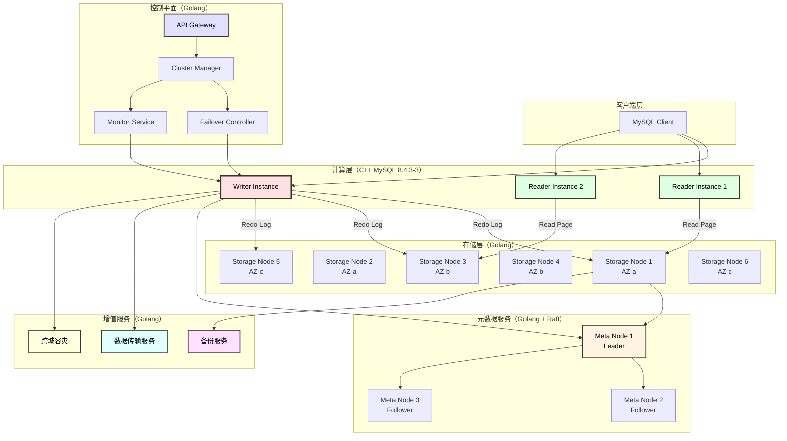

### 2.2 模块职责

| 模块 | 职责 | 关键功能 |
|------|------|----------|
| **计算层** | SQL 处理与事务管理 | SQL 解析、查询优化、Redo 生成、Buffer Pool |
| **存储层** | 数据持久化与物化 | Redo 接收、Page 物化、Quorum 写入、Coalescing |
| **元数据服务** | 元数据管理 | Volume 管理、LSN 追踪、PG 映射、强一致性 |
| **控制平面** | 集群管理 | 健康监控、故障切换、实例管理、调度 |
| **备份服务** | 数据保护 | 自动备份、快照管理、PITR 恢复 |
| **DTS** | 数据传输 | 数据迁移、实时同步、CDC 订阅 |
| **跨城容灾** | 异地容灾 | Binlog 同步、容灾切换、全局管理 |

### 2.3 Quorum 配置

| 参数 | 值 | 说明 |
|------|-----|------|
| **N** | 6 | 总副本数 |
| **Vw** | 4 | 写入 Quorum |
| **Vr** | 3 | 读取 Quorum |
| **AZ** | 3 | 可用区数量 |

---

## 3. 模块间通信

### 3.1 gRPC 服务端口

| 服务 | 端口 | 提供方 | 说明 |
|------|------|--------|------|
| `StorageService` | 9002 | 存储层 | Redo 写入、Page 读取 |
| `MetadataService` | 9003 | 元数据服务 | VDL 管理、PG 映射 |
| `ComputeService` | 9001 | 计算层 | 健康检查、角色切换 |
| `ControlPlaneService` | 9000 | 控制平面 | 集群管理 API |
| `CrossRegionService` | 9010 | 跨城服务 | Binlog 同步、容灾切换 |
| `DTSService` | 9020 | DTS | 数据迁移、同步任务 |
| `BackupService` | 9030 | 备份服务 | 快照管理、PITR |

### 3.2 模块间调用关系

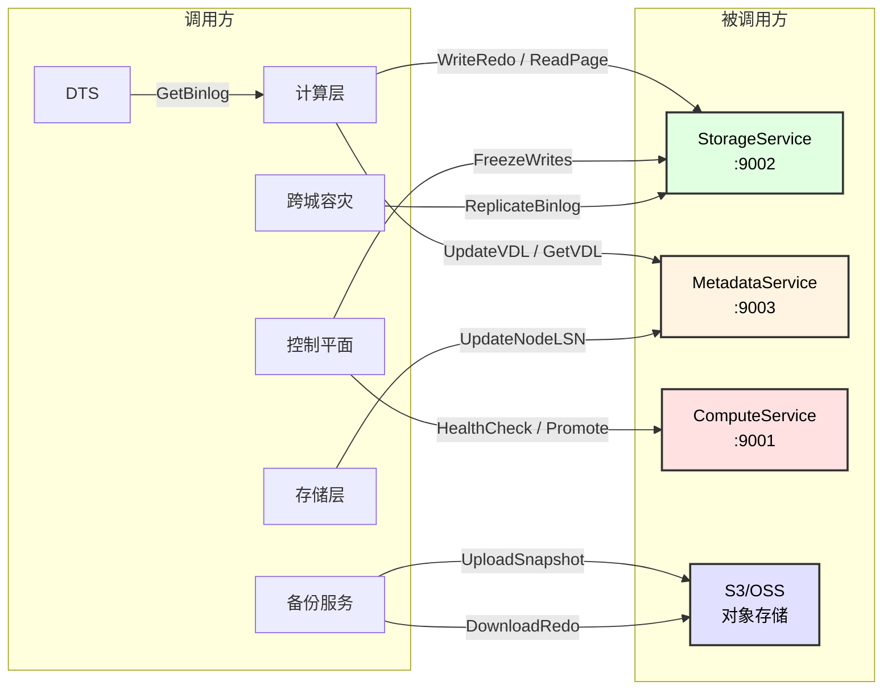

---

## 4. 核心场景时序图

### 4.1 写入流程（Write Path）

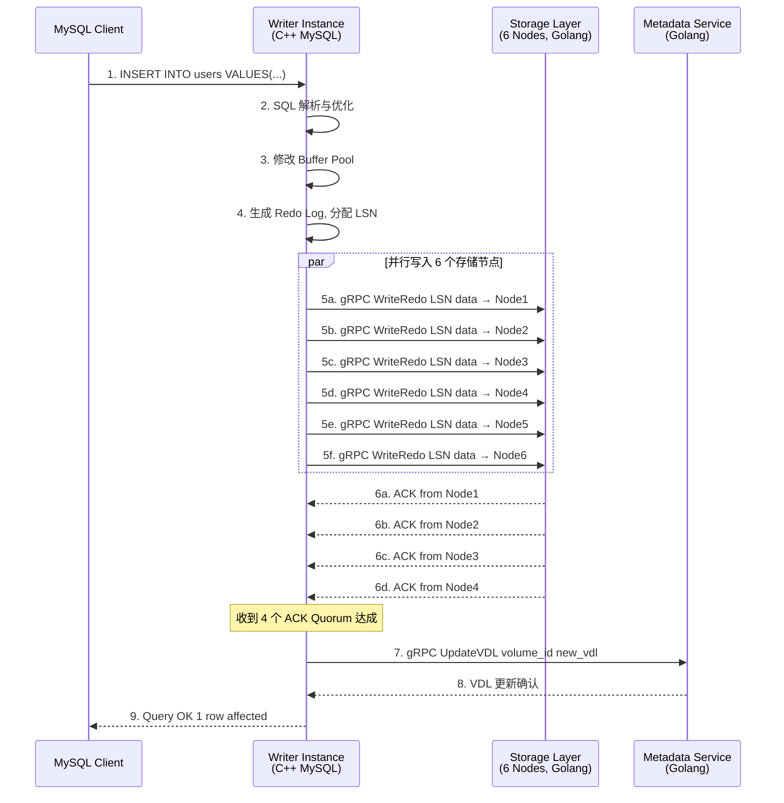

### 4.2 读取流程（Read Path）

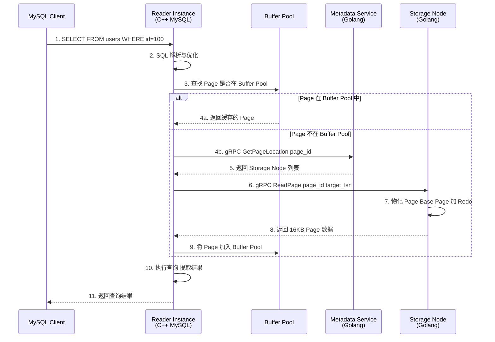

### 4.3 事务提交流程（Commit Path）

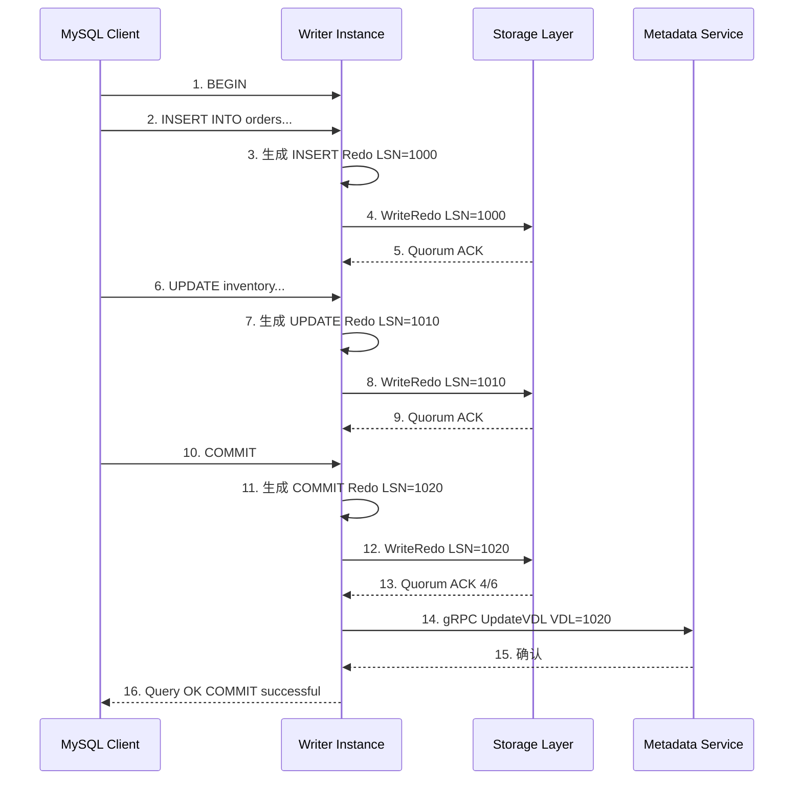

### 4.4 Reader 同步流程

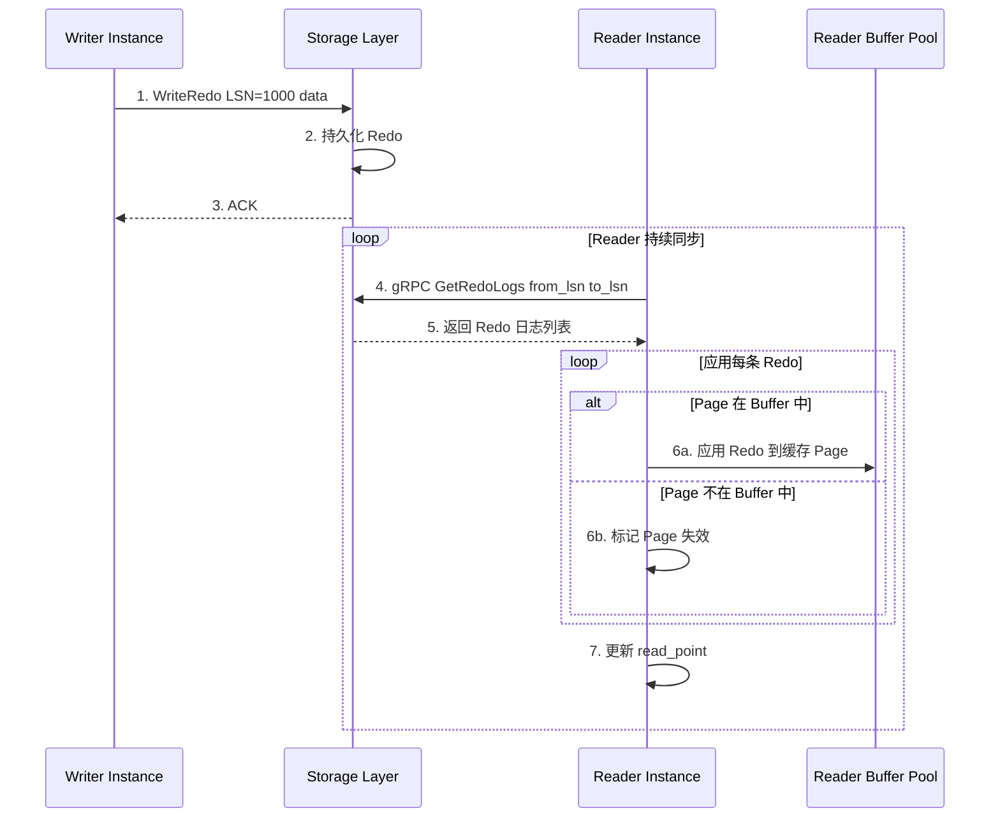

### 4.5 故障切换流程（Failover）

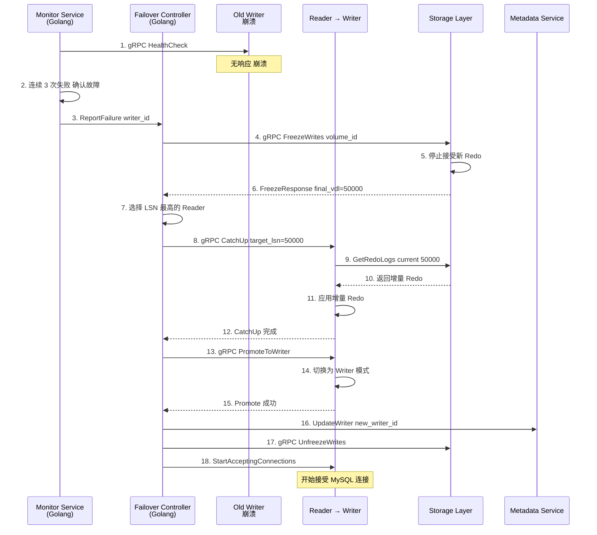

### 4.6 跨城容灾同步流程

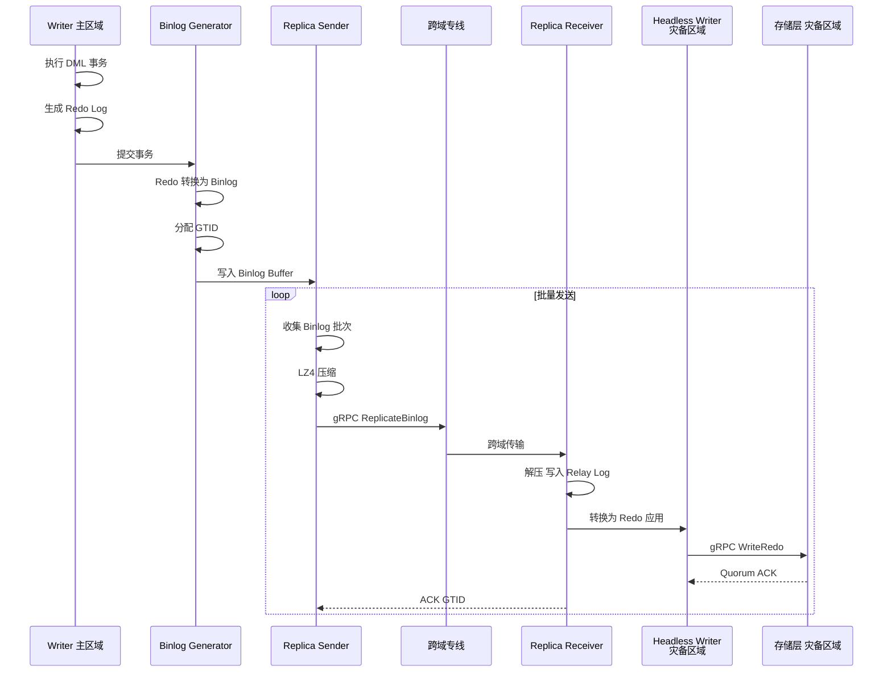

### 4.7 PITR 恢复流程

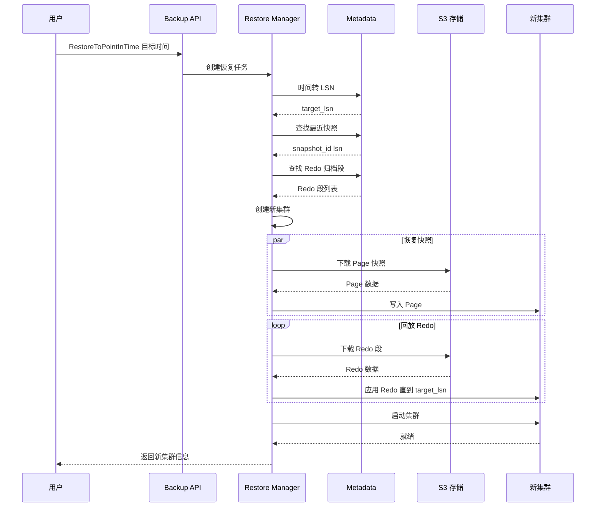

### 4.8 数据迁移流程（DTS）

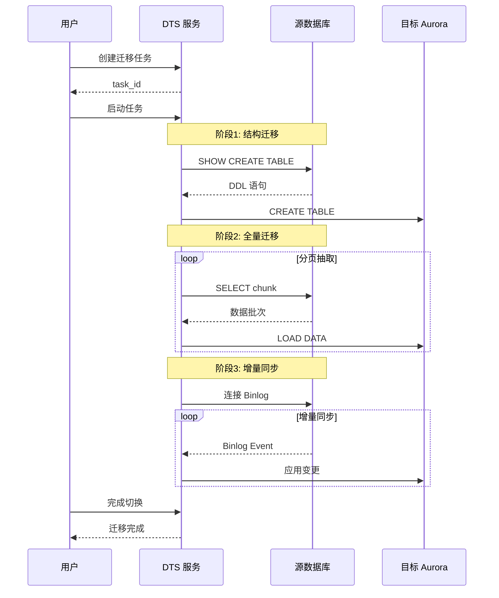

---

## 5. 数据流图

### 5.1 Redo Log 数据流

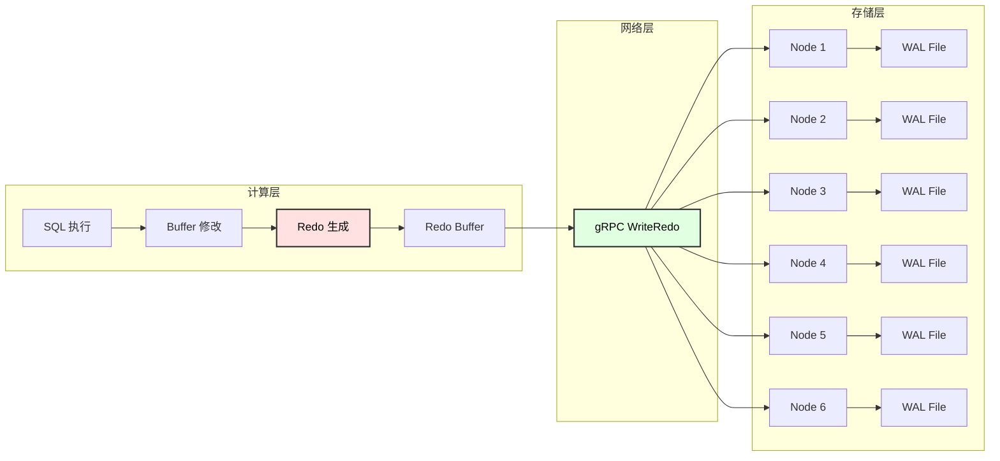

### 5.2 VDL 计算

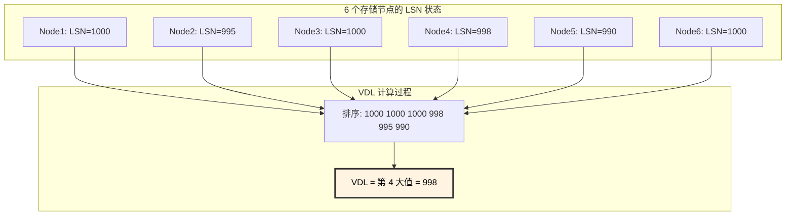

---

## 6. 部署架构

### 6.1 典型部署拓扑

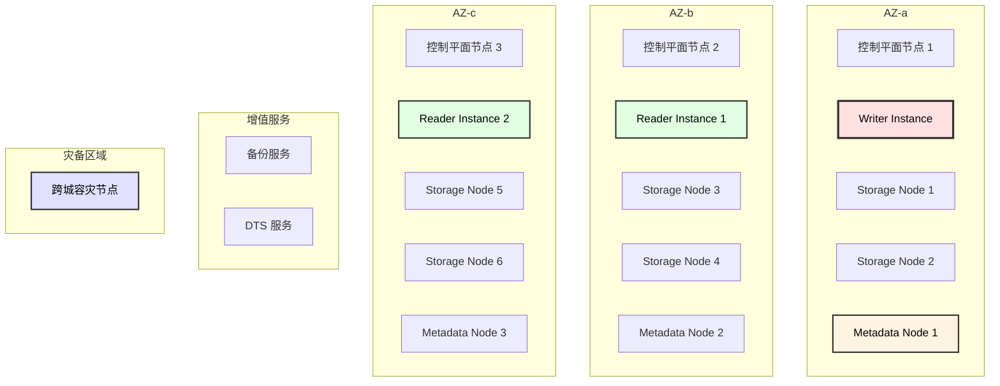

### 6.2 最小部署配置

| 组件 | 最小数量 | 推荐数量 | 说明 |
|------|----------|----------|------|
| Writer | 1 | 1 | 单写入点 |
| Reader | 0 | 2+ | 按读负载扩展 |
| Storage Node | 6 | 6 | 固定 6 副本 |
| Metadata Node | 3 | 3 | Raft 需要奇数 |
| Control Plane | 1 | 3 | 高可用建议 3 个 |
| 备份服务 | 1 | 2 | 高可用建议 2 个 |
| DTS 服务 | 0 | 1+ | 按需部署 |
| 跨城容灾 | 0 | 1 | 按需部署 |

---

## 7. 关键设计决策

### 7.1 设计原则

| 原则 | 说明 |
|------|------|
| **Log-is-Database** | Redo Log 是唯一的持久化数据源，Page 是派生数据 |
| **Quorum Write** | 写入 4/6 节点即可确认，容忍 2 节点故障 |
| **Lazy Materialization** | Page 按需物化，减少不必要的 I/O |
| **Shared Storage** | 所有计算节点共享同一存储层 |
| **Separation of Concerns** | 计算、存储、元数据分离 |

### 7.2 性能目标

| 指标 | 目标值 |
|------|--------|
| 写入延迟 (P99) | < 5ms |
| 读取延迟 (P99) | < 2ms (Buffer 命中), < 10ms (需物化) |
| 主从复制延迟 | < 20ms |
| Failover 时间 | < 30s |
| 存储吞吐量 | > 100K IOPS / 节点 |
| 跨城同步延迟 | < 100ms |
| PITR 恢复时间 | < 10min（取决于数据量） |

---

## 8. 代码仓库结构

```
aurora/
├── cmd/                          # 各服务入口
│   ├── storage-node/             # 存储节点 (Golang)
│   ├── metadata-service/         # 元数据服务 (Golang)
│   ├── control-plane/            # 控制平面 (Golang)
│   ├── backup-service/           # 备份服务 (Golang)
│   ├── dts-service/              # DTS 服务 (Golang)
│   └── cross-region/             # 跨城容灾 (Golang)
├── pkg/                          # 公共包
│   ├── proto/                    # gRPC 定义
│   ├── redo/                     # Redo 处理
│   ├── page/                     # Page 处理
│   └── quorum/                   # Quorum 协议
├── internal/                     # 内部包
│   ├── storage/                  # 存储层实现
│   ├── metadata/                 # 元数据实现
│   ├── control/                  # 控制平面实现
│   ├── backup/                   # 备份实现
│   ├── dts/                      # DTS 实现
│   └── crossregion/              # 跨城容灾实现
├── mysql-plugin/                 # MySQL 插件 (C++)
│   ├── storage_engine/           # 存储引擎适配
│   └── redo_sender/              # Redo 发送模块
└── docs/                         # 文档
```

---

## 附录 A：术语表

| 术语 | 说明 |
|------|------|
| **VDL** | Volume Durable LSN，已持久化的最高 LSN |
| **VCL** | Volume Complete LSN，已完成的最高 LSN |
| **MTR** | Mini Transaction，最小事务单元 |
| **PG** | Protection Group，保护组（10GB 数据单元） |
| **Quorum** | 法定人数，达成一致的最小节点数 |
| **Coalescing** | 合并，将 Redo 应用到 Base Page 生成新 Page |
| **PITR** | Point-In-Time Recovery，时间点恢复 |
| **DTS** | Data Transmission Service，数据传输服务 |
| **CDC** | Change Data Capture，变更数据捕获 |
| **GTID** | Global Transaction Identifier，全局事务标识 |
