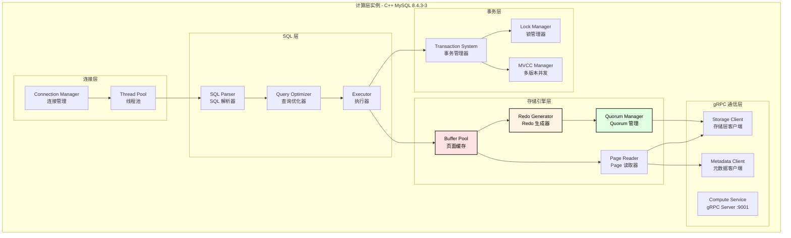
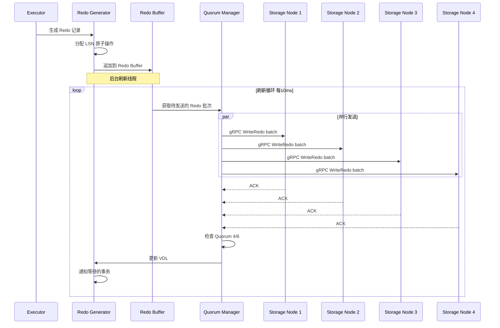
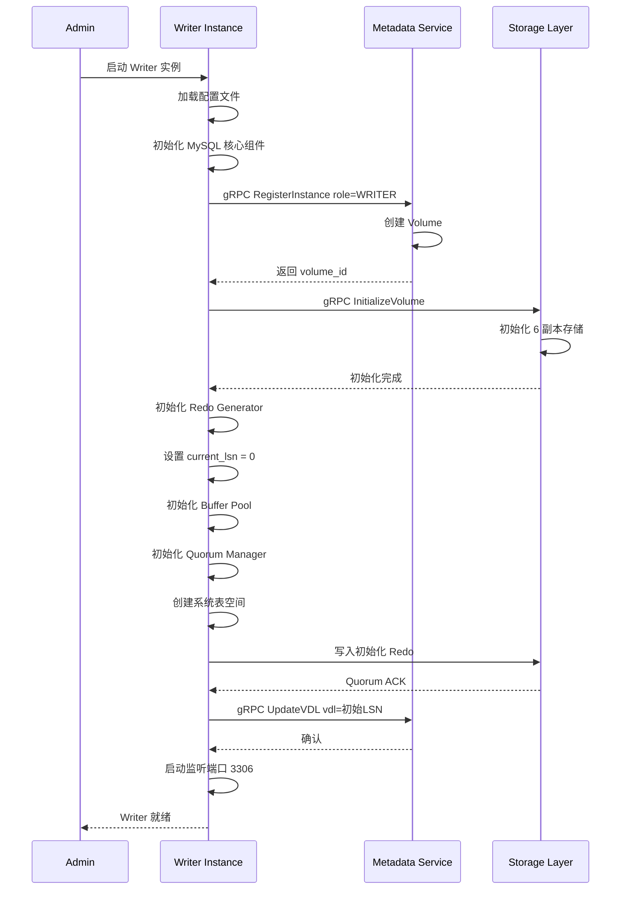
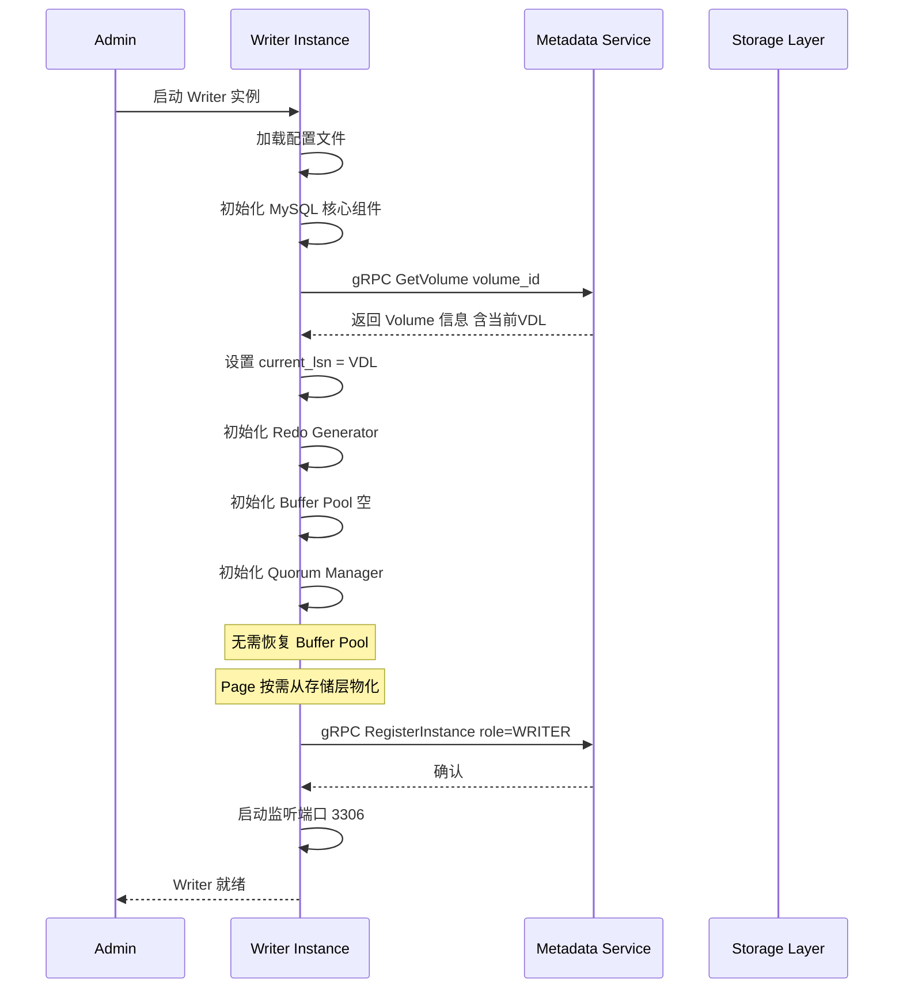
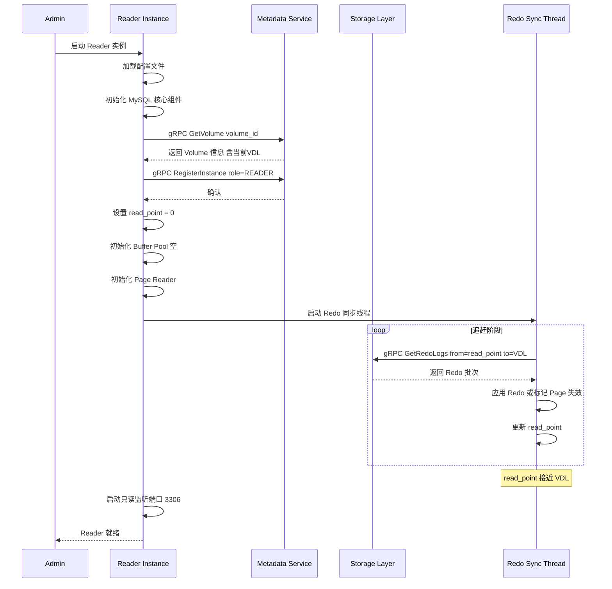
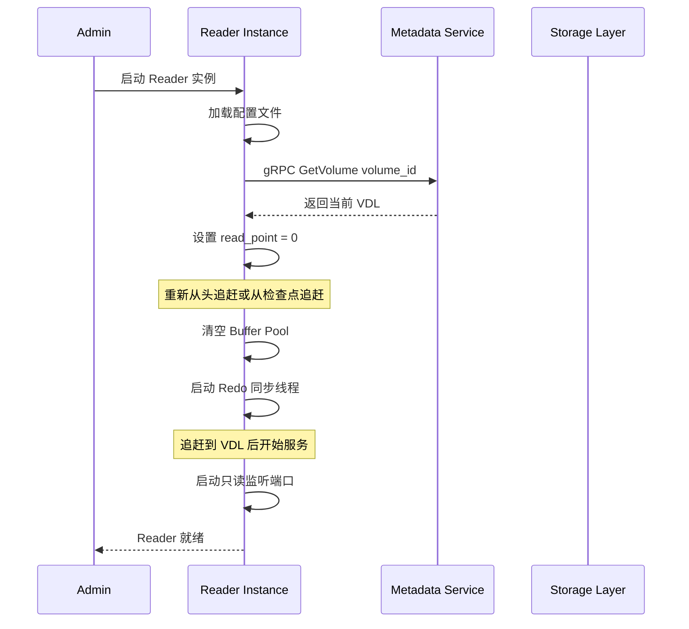
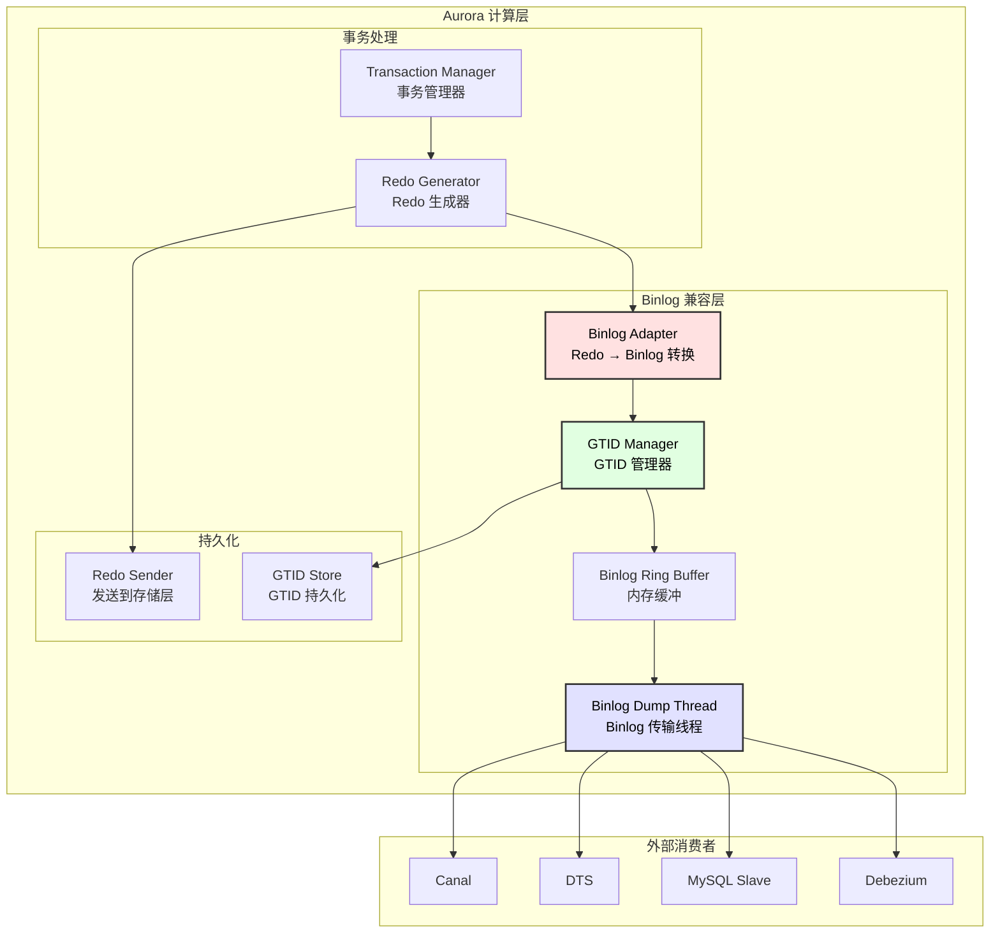
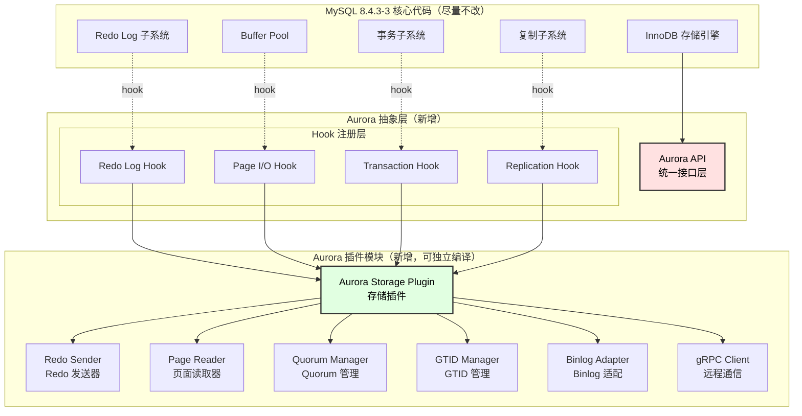
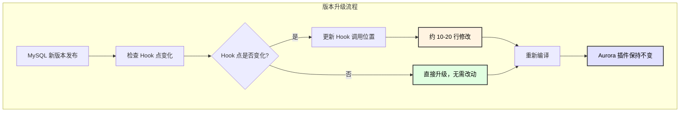

# 计算层设计文档

## 1. 模块概述

计算层基于 **MySQL 8.4.3-3 (Percona Server)** 进行改造，使用 **C++** 开发，负责 SQL 处理、事务管理和 Redo 生成。

### 1.1 核心职责

| 职责 | 说明 |
|------|------|
| SQL 处理 | 解析、优化、执行 SQL 语句 |
| 事务管理 | MVCC、锁管理、事务隔离 |
| Redo 生成 | 生成 Redo Log 并通过 gRPC 发送到存储层 |
| Buffer Pool | 页面缓存、按需从存储层物化 |
| Reader 同步 | 从存储层同步 Redo 并更新 Buffer Pool |

### 1.2 模块架构图



---

## 2. Redo 类型设计

### 2.1 Redo 类型定义

```cpp
// redo_types.h

enum class RedoType : uint16_t {
    // ========== 记录操作类型 ==========
    MLOG_REC_INSERT         = 1,   // 插入记录
    MLOG_REC_UPDATE_IN_PLACE = 2,  // 原地更新
    MLOG_REC_UPDATE         = 3,   // 更新（可能移动）
    MLOG_REC_DELETE         = 4,   // 删除记录
    MLOG_REC_CLUST_DELETE_MARK = 5, // 标记聚簇索引删除
    MLOG_REC_SEC_DELETE_MARK = 6,  // 标记二级索引删除
    
    // ========== 页面操作类型 ==========
    MLOG_PAGE_CREATE        = 10,  // 创建页面
    MLOG_PAGE_INIT          = 11,  // 初始化页面
    MLOG_PAGE_REORGANIZE    = 12,  // 页面重组
    MLOG_PAGE_SPLIT         = 13,  // 页面分裂
    MLOG_PAGE_MERGE         = 14,  // 页面合并
    
    // ========== 索引操作类型 ==========
    MLOG_BTREE_INSERT       = 20,  // B+树插入
    MLOG_BTREE_DELETE       = 21,  // B+树删除
    MLOG_BTREE_SPLIT        = 22,  // B+树分裂
    MLOG_BTREE_MERGE        = 23,  // B+树合并
    
    // ========== 事务操作类型 ==========
    MLOG_TRX_PREPARE        = 30,  // 事务 Prepare
    MLOG_TRX_COMMIT         = 31,  // 事务提交
    MLOG_TRX_ROLLBACK       = 32,  // 事务回滚
    
    // ========== MTR 操作类型 ==========
    MLOG_MTR_COMMIT         = 40,  // MTR 提交
    
    // ========== DDL 操作类型 ==========
    MLOG_DDL_CREATE_TABLE   = 50,  // 创建表
    MLOG_DDL_DROP_TABLE     = 51,  // 删除表
    MLOG_DDL_ALTER_TABLE    = 52,  // 修改表
    MLOG_DDL_CREATE_INDEX   = 53,  // 创建索引
    MLOG_DDL_DROP_INDEX     = 54,  // 删除索引
    MLOG_DDL_TRUNCATE       = 55,  // 截断表
    
    // ========== 空间操作类型 ==========
    MLOG_SPACE_CREATE       = 60,  // 创建表空间
    MLOG_SPACE_DROP         = 61,  // 删除表空间
    MLOG_SPACE_EXTEND       = 62,  // 扩展表空间
    
    // ========== Undo 操作类型 ==========
    MLOG_UNDO_INSERT        = 70,  // Undo 插入
    MLOG_UNDO_UPDATE        = 71,  // Undo 更新
    MLOG_UNDO_ERASE         = 72,  // Undo 擦除
    
    // ========== 系统类型 ==========
    MLOG_CHECKPOINT         = 80,  // 检查点
    MLOG_BARRIER            = 81,  // DDL Barrier
    MLOG_FILE_OP            = 82,  // 文件操作
    
    // ========== Aurora 扩展类型 ==========
    MLOG_AURORA_LSN_SYNC    = 100, // LSN 同步
    MLOG_AURORA_VDL_UPDATE  = 101, // VDL 更新
    MLOG_AURORA_PAGE_VERSION = 102, // Page 版本信息
};
```

### 2.2 Redo 记录结构

```cpp
// redo_record.h

// Redo 记录头部（48 字节）
struct RedoRecordHeader {
    uint64_t lsn;           // 日志序列号
    uint64_t space_id;      // 表空间 ID
    uint64_t page_id;       // 页面 ID
    uint64_t trx_id;        // 事务 ID
    uint64_t mtr_id;        // MTR ID
    RedoType type;          // Redo 类型（2 字节）
    uint16_t flags;         // 标志位
    uint32_t data_len;      // 数据长度
};

// 标志位定义
constexpr uint16_t REDO_FLAG_MTR_START  = 0x0001;  // MTR 开始
constexpr uint16_t REDO_FLAG_MTR_END    = 0x0002;  // MTR 结束
constexpr uint16_t REDO_FLAG_SYNC       = 0x0004;  // 同步写入
constexpr uint16_t REDO_FLAG_DDL        = 0x0008;  // DDL 操作
constexpr uint16_t REDO_FLAG_BARRIER    = 0x0010;  // Barrier

// 完整 Redo 记录
struct RedoRecord {
    RedoRecordHeader header;
    std::vector<uint8_t> data;
    uint32_t checksum;
};
```

### 2.3 不同类型 Redo 的数据格式

| Redo 类型 | 数据格式 |
|-----------|----------|
| `MLOG_REC_INSERT` | `slot_no(2) + rec_len(2) + rec_data(N)` |
| `MLOG_REC_UPDATE_IN_PLACE` | `slot_no(2) + offset(2) + old_len(2) + new_len(2) + old_data(M) + new_data(N)` |
| `MLOG_REC_DELETE` | `slot_no(2) + rec_len(2) + rec_data(N)` |
| `MLOG_PAGE_INIT` | `page_type(4) + flags(4)` |
| `MLOG_TRX_COMMIT` | `commit_lsn(8) + timestamp(8)` |
| `MLOG_DDL_CREATE_TABLE` | `table_id(8) + schema_len(2) + schema(N) + table_len(2) + table(M)` |
| `MLOG_CHECKPOINT` | `checkpoint_lsn(8) + checkpoint_no(8)` |

---

## 3. 内部时序图

### 3.1 SQL 执行内部流程

```mermaid
sequenceDiagram
    participant Client as MySQL Client
    participant Conn as Connection Manager
    participant Parser as SQL Parser
    participant Opt as Query Optimizer
    participant Exec as Executor
    participant Trx as Transaction Manager
    participant Buffer as Buffer Pool
    participant Redo as Redo Generator

    Client->>Conn: 发送 SQL 请求
    Conn->>Conn: 获取线程
    Conn->>Parser: 传递 SQL 语句
    
    Parser->>Parser: 词法分析
    Parser->>Parser: 语法分析
    Parser->>Parser: 生成解析树
    Parser->>Opt: 传递解析树
    
    Opt->>Opt: 逻辑优化
    Opt->>Opt: 基于成本的优化 CBO
    Opt->>Opt: 生成执行计划
    Opt->>Exec: 传递执行计划
    
    Exec->>Trx: 开始或获取事务
    Trx-->>Exec: 返回事务上下文
    
    Exec->>Buffer: 获取数据页
    Buffer-->>Exec: 返回页面数据
    
    Exec->>Exec: 执行修改操作
    Exec->>Buffer: 标记页面为脏
    Exec->>Redo: 生成 Redo 记录
    Redo->>Redo: 分配 LSN
    Redo->>Redo: 写入 Redo Buffer
    
    Exec-->>Client: 返回执行结果
```

### 3.2 Redo 生成与发送流程



---

## 4. 实例启动流程

### 4.1 Writer 实例首次启动



### 4.2 Writer 实例后续启动



### 4.3 Reader 实例首次启动



### 4.4 Reader 实例后续启动



---

## 5. 关闭原生功能说明

### 5.1 需要禁用的 MySQL 原生功能

| 功能 | 配置项 | 禁用原因 |
|------|--------|----------|
| **本地 Redo Log** | `innodb_log_file_size=0` | Redo 发送到远程存储层，不写本地 |
| **Doublewrite Buffer** | `innodb_doublewrite=OFF` | 存储层保证数据一致性，不需要双写 |
| **本地 Checkpoint** | `innodb_checkpoint_disabled=ON` | 由存储层管理 Checkpoint |
| **Binlog** | `skip-log-bin` | 主从复制改用 Redo 同步 |
| **GTID** | `gtid_mode=OFF` | 不使用 Binlog 复制 |
| **本地数据文件** | - | ibd 文件存储在远程存储层 |
| **Flush Log at Commit** | `innodb_flush_log_at_trx_commit=0` | 由 Quorum 机制保证持久化 |
| **Buffer Pool Dump** | `innodb_buffer_pool_dump_at_shutdown=OFF` | 重启后从存储层按需加载 |
| **Native AIO** | 保持启用 | gRPC 异步发送 |

### 5.2 配置文件示例

```ini
# aurora-mysql.cnf

[mysqld]
# ========== 禁用本地存储相关 ==========
innodb_log_file_size = 0
innodb_log_files_in_group = 0
innodb_doublewrite = OFF
innodb_flush_log_at_trx_commit = 0
innodb_flush_method = O_DIRECT
innodb_buffer_pool_dump_at_shutdown = OFF
innodb_buffer_pool_load_at_startup = OFF

# ========== 禁用复制相关 ==========
skip-log-bin
gtid_mode = OFF
enforce_gtid_consistency = OFF

# ========== Aurora 扩展配置 ==========
aurora_mode = ON
aurora_volume_id = vol-12345678
aurora_storage_nodes = storage1:9002,storage2:9002,storage3:9002,storage4:9002,storage5:9002,storage6:9002
aurora_metadata_nodes = metadata1:9003,metadata2:9003,metadata3:9003

# ========== Redo 发送配置 ==========
aurora_redo_buffer_size = 16M
aurora_redo_flush_interval_ms = 10
aurora_quorum_write = 4
aurora_quorum_timeout_ms = 5000

# ========== Reader 同步配置 ==========
aurora_reader_sync_interval_ms = 10
aurora_reader_sync_batch_size = 1000

# ========== Buffer Pool ==========
innodb_buffer_pool_size = 8G
innodb_buffer_pool_instances = 8

# ========== 性能优化 ==========
innodb_io_capacity = 10000
innodb_io_capacity_max = 20000
```

### 5.3 源码改造点

| 改造点 | 文件 | 说明 |
|--------|------|------|
| Redo Log 写入 | `storage/innobase/log/log0write.cc` | 替换为 gRPC 发送 |
| Buffer Pool 读取 | `storage/innobase/buf/buf0buf.cc` | 增加远程物化逻辑 |
| Checkpoint | `storage/innobase/log/log0chkp.cc` | 禁用本地 Checkpoint |
| Doublewrite | `storage/innobase/buf/buf0dblwr.cc` | 完全禁用 |
| 文件 I/O | `storage/innobase/os/os0file.cc` | 替换为远程存储 |
| 启动恢复 | `storage/innobase/log/log0recv.cc` | 修改恢复逻辑 |

---

## 6. 管理命令设计

### 6.1 LSN 信息查询

```sql
-- 查询当前 LSN 状态
SHOW AURORA STATUS;

+------------------------+----------------+
| Variable_name          | Value          |
+------------------------+----------------+
| aurora_current_lsn     | 1234567890     |
| aurora_vdl             | 1234567800     |
| aurora_vcl             | 1234567850     |
| aurora_instance_role   | WRITER         |
| aurora_reader_count    | 2              |
| aurora_storage_nodes   | 6              |
| aurora_healthy_nodes   | 6              |
+------------------------+----------------+

-- 查询复制状态（Reader 执行）
SHOW AURORA REPLICA STATUS;

+------------------------+----------------+
| Variable_name          | Value          |
+------------------------+----------------+
| aurora_read_point      | 1234567700     |
| aurora_target_vdl      | 1234567800     |
| aurora_lag_lsn         | 100            |
| aurora_lag_ms          | 15             |
| aurora_redo_applied    | 5000000        |
| aurora_pages_invalidated | 1234         |
+------------------------+----------------+
```

### 6.2 存储节点状态查询

```sql
-- 查询存储节点状态
SHOW AURORA STORAGE NODES;

+-----------+--------+------------+-----------+---------------+
| node_id   | az     | is_healthy | lsn       | lag_bytes     |
+-----------+--------+------------+-----------+---------------+
| node-1    | az-a   | YES        | 1234567890| 0             |
| node-2    | az-a   | YES        | 1234567880| 100           |
| node-3    | az-b   | YES        | 1234567890| 0             |
| node-4    | az-b   | YES        | 1234567850| 400           |
| node-5    | az-c   | YES        | 1234567890| 0             |
| node-6    | az-c   | NO         | 1234567000| 8900          |
+-----------+--------+------------+-----------+---------------+
```

### 6.3 性能统计查询

```sql
-- 查询 Redo 发送统计
SHOW AURORA REDO STATS;

+----------------------------+----------------+
| Variable_name              | Value          |
+----------------------------+----------------+
| aurora_redo_generated      | 10000000       |
| aurora_redo_bytes          | 1073741824     |
| aurora_redo_batches        | 50000          |
| aurora_quorum_latency_avg  | 2.5            |
| aurora_quorum_latency_p99  | 8.0            |
| aurora_quorum_success      | 49990          |
| aurora_quorum_failed       | 10             |
+----------------------------+----------------+

-- 查询 Buffer Pool 统计
SHOW AURORA BUFFER STATS;

+----------------------------+----------------+
| Variable_name              | Value          |
+----------------------------+----------------+
| aurora_bp_pages_total      | 524288         |
| aurora_bp_pages_data       | 400000         |
| aurora_bp_pages_dirty      | 0              |
| aurora_bp_hit_rate         | 99.5           |
| aurora_bp_remote_reads     | 10000          |
| aurora_bp_materializations | 5000           |
+----------------------------+----------------+
```

### 6.4 管理命令

```sql
-- 手动触发 Failover（管理员执行）
AURORA FAILOVER TO 'reader-1';

-- 冻结写入（维护用）
AURORA FREEZE WRITES;

-- 解冻写入
AURORA UNFREEZE WRITES;

-- 查看 Failover 历史
SHOW AURORA FAILOVER HISTORY;

+-------------+------------+------------+------------+------------+--------+
| failover_id | start_time | end_time   | old_writer | new_writer | status |
+-------------+------------+------------+------------+------------+--------+
| fo-001      | 2025-01-01 | 2025-01-01 | writer-1   | reader-1   | OK     |
+-------------+------------+------------+------------+------------+--------+

-- 添加 Reader
AURORA ADD READER 'reader-3' IN 'az-c';

-- 删除 Reader
AURORA REMOVE READER 'reader-2';
```

### 6.5 information_schema 扩展表

```sql
-- aurora_lsn_status 表
CREATE TABLE information_schema.AURORA_LSN_STATUS (
    instance_id VARCHAR(64),
    instance_role ENUM('WRITER', 'READER'),
    current_lsn BIGINT UNSIGNED,
    vdl BIGINT UNSIGNED,
    vcl BIGINT UNSIGNED,
    read_point BIGINT UNSIGNED,
    lag_lsn BIGINT UNSIGNED,
    lag_ms BIGINT UNSIGNED,
    last_update TIMESTAMP
);

-- aurora_storage_nodes 表
CREATE TABLE information_schema.AURORA_STORAGE_NODES (
    node_id VARCHAR(64),
    availability_zone VARCHAR(32),
    endpoint VARCHAR(256),
    is_healthy BOOLEAN,
    current_lsn BIGINT UNSIGNED,
    disk_used_bytes BIGINT UNSIGNED,
    disk_total_bytes BIGINT UNSIGNED,
    last_heartbeat TIMESTAMP
);

-- aurora_redo_stats 表
CREATE TABLE information_schema.AURORA_REDO_STATS (
    stat_name VARCHAR(64),
    stat_value BIGINT UNSIGNED,
    stat_type ENUM('COUNTER', 'GAUGE', 'HISTOGRAM')
);
```

---

## 7. 源码改造指引

### 7.1 核心改造模块

```
storage/innobase/
├── aurora/                      # 新增：Aurora 专用模块
│   ├── aurora_redo.h            # Redo 发送器接口
│   ├── aurora_redo.cc           # Redo 发送实现
│   ├── aurora_quorum.h          # Quorum 管理器接口
│   ├── aurora_quorum.cc         # Quorum 实现
│   ├── aurora_page_reader.h     # Page 读取器接口
│   ├── aurora_page_reader.cc    # Page 读取实现
│   ├── aurora_grpc_client.h     # gRPC 客户端
│   ├── aurora_grpc_client.cc
│   ├── aurora_reader_sync.h     # Reader 同步
│   ├── aurora_reader_sync.cc
│   └── aurora_commands.cc       # 管理命令实现
├── buf/
│   ├── buf0buf.cc               # 改造：增加远程读取逻辑
│   └── buf0flu.cc               # 改造：禁用脏页刷新
├── log/
│   ├── log0write.cc             # 改造：替换为 gRPC 发送
│   ├── log0recv.cc              # 改造：启动恢复逻辑
│   └── log0chkp.cc              # 改造：禁用 Checkpoint
├── fil/
│   └── fil0fil.cc               # 改造：远程文件访问
└── os/
    └── os0file.cc               # 改造：gRPC 替换本地 I/O
```

### 7.2 Redo 发送改造

**原始代码位置：** `storage/innobase/log/log0write.cc`

```cpp
// 原始 MySQL 代码
void log_write_flush_to_disk_low() {
    // 写入本地 redo log 文件
    fil_io(IORequestLogWrite, true, page_id_t(...), ...);
    // fsync
    fil_flush(SRV_LOG_SPACE_FIRST_ID);
}

// Aurora 改造后
void log_write_flush_to_disk_low() {
    // 构造 Redo 批次
    auto batch = aurora::RedoBuffer::get_pending_batch();
    
    // 通过 Quorum Manager 发送
    auto result = aurora::QuorumManager::write_quorum(batch);
    
    if (result.success && result.ack_count >= 4) {
        // 更新 VDL
        aurora::update_vdl(result.persisted_lsn);
        // 通知等待的事务
        aurora::notify_waiting_transactions(result.persisted_lsn);
    } else {
        // Quorum 失败处理
        aurora::handle_quorum_failure(result);
    }
}
```

### 7.3 Buffer Pool 读取改造

**原始代码位置：** `storage/innobase/buf/buf0buf.cc`

```cpp
// 原始 MySQL 代码
buf_page_t* buf_page_get_gen(...) {
    // 从 Buffer Pool 查找
    block = buf_page_hash_get_low(...);
    if (block == nullptr) {
        // 从本地文件读取
        buf_read_page(page_id, ...);
    }
    return block;
}

// Aurora 改造后
buf_page_t* buf_page_get_gen(..., uint64_t target_lsn) {
    // 从 Buffer Pool 查找
    block = buf_page_hash_get_low(...);
    
    if (block != nullptr) {
        // 检查 Page 是否失效
        if (aurora::is_page_invalid(page_id, block->page_lsn)) {
            // 需要重新物化
            goto materialize;
        }
        // 检查 LSN 是否足够新
        if (block->page_lsn >= target_lsn) {
            return block;
        }
    }
    
materialize:
    // 从存储层读取并物化
    auto page_data = aurora::PageReader::read_page(
        page_id.space(), page_id.page_no(), target_lsn);
    
    if (block == nullptr) {
        // 分配新的 Buffer Pool 页面
        block = buf_LRU_get_free_block(...);
    }
    
    // 复制数据到 Buffer Pool
    memcpy(block->frame, page_data.data(), UNIV_PAGE_SIZE);
    block->page_lsn = page_data.lsn();
    
    return block;
}
```

### 7.4 Reader 同步改造

**新增代码位置：** `storage/innobase/aurora/aurora_reader_sync.cc`

```cpp
// aurora_reader_sync.cc

class ReaderSyncThread {
public:
    void run() {
        while (running_) {
            // 获取当前 VDL
            uint64_t target_vdl = metadata_client_->get_vdl(volume_id_);
            
            // 获取 Redo 日志
            auto redo_logs = storage_client_->get_redo_logs(
                read_point_, target_vdl, BATCH_SIZE);
            
            for (const auto& redo : redo_logs) {
                apply_redo(redo);
            }
            
            read_point_ = redo_logs.back().lsn();
            
            // 短暂休眠
            std::this_thread::sleep_for(
                std::chrono::milliseconds(sync_interval_ms_));
        }
    }
    
    void apply_redo(const RedoLogEntry& redo) {
        auto page_id = page_id_t(redo.space_id(), redo.page_id());
        
        // 尝试获取 Buffer Pool 中的页面
        auto* block = buf_page_hash_get_low(page_id);
        
        if (block != nullptr && block->page_lsn < redo.lsn()) {
            // 页面在 Buffer 中，应用 Redo
            apply_redo_to_page(block, redo);
            block->page_lsn = redo.lsn();
        } else if (block == nullptr) {
            // 页面不在 Buffer 中，标记失效
            invalid_page_list_.add(page_id, redo.lsn());
        }
    }
};
```

### 7.5 编译配置改造

**CMakeLists.txt 修改：**

```cmake
# storage/innobase/CMakeLists.txt

# 添加 Aurora 模块
SET(AURORA_SOURCES
    aurora/aurora_redo.cc
    aurora/aurora_quorum.cc
    aurora/aurora_page_reader.cc
    aurora/aurora_grpc_client.cc
    aurora/aurora_reader_sync.cc
    aurora/aurora_commands.cc
)

# 添加 gRPC 依赖
FIND_PACKAGE(gRPC REQUIRED)
FIND_PACKAGE(Protobuf REQUIRED)

# 生成 gRPC 代码
PROTOBUF_GENERATE_CPP(PROTO_SRCS PROTO_HDRS
    aurora/proto/storage.proto
    aurora/proto/metadata.proto
    aurora/proto/compute.proto
)

# 链接库
TARGET_LINK_LIBRARIES(innobase
    gRPC::grpc++
    protobuf::libprotobuf
)
```

---

## 8. 监控指标

| 指标 | 类型 | 说明 |
|------|------|------|
| `aurora_redo_generated_total` | Counter | 生成的 Redo 总数 |
| `aurora_redo_bytes_total` | Counter | 生成的 Redo 总字节数 |
| `aurora_quorum_latency_seconds` | Histogram | Quorum 写入延迟 |
| `aurora_quorum_success_total` | Counter | Quorum 成功次数 |
| `aurora_quorum_failed_total` | Counter | Quorum 失败次数 |
| `aurora_buffer_pool_hit_rate` | Gauge | Buffer Pool 命中率 |
| `aurora_reader_lag_lsn` | Gauge | Reader 复制延迟（LSN） |
| `aurora_reader_lag_ms` | Gauge | Reader 复制延迟（毫秒） |
| `aurora_current_lsn` | Gauge | 当前 LSN |
| `aurora_vdl` | Gauge | 当前 VDL |

---

## 9. Binlog/GTID 兼容层设计

### 9.1 兼容性目标

| 目标 | 说明 |
|------|------|
| **MySQL 复制协议** | 支持 MySQL 原生复制协议 |
| **GTID 模式** | 完整支持 GTID 模式 |
| **CDC 工具兼容** | 支持 Canal、Debezium、Maxwell 等 |
| **DTS 兼容** | 支持阿里云 DTS、AWS DMS 等迁移工具 |
| **MySQL 从库** | 可作为 MySQL 从库的主库 |

### 9.2 架构设计



### 9.3 GTID 管理器

```cpp
// storage/innobase/aurora/aurora_gtid.h

class AuroraGTIDManager {
public:
    struct GTID {
        uuid_t server_uuid;
        uint64_t gno;  // Global Transaction Number
        
        std::string to_string() const;
        static GTID parse(const std::string& str);
    };
    
    struct GTIDSet {
        // server_uuid -> [start, end] 区间列表
        std::map<uuid_t, std::vector<std::pair<uint64_t, uint64_t>>> intervals;
        
        void add(const GTID& gtid);
        void merge(const GTIDSet& other);
        bool contains(const GTID& gtid) const;
        GTIDSet subtract(const GTIDSet& other) const;
        std::string to_string() const;
    };
    
    // 初始化
    void init(const uuid_t& server_uuid);
    
    // 分配新 GTID
    GTID allocate();
    
    // 绑定 GTID 和 LSN
    void bind_lsn(const GTID& gtid, uint64_t lsn);
    
    // 获取执行过的 GTID 集合
    GTIDSet get_executed_set() const;
    
    // GTID <-> LSN 转换
    GTID lsn_to_gtid(uint64_t lsn) const;
    uint64_t gtid_to_lsn(const GTID& gtid) const;
    
    // 持久化和恢复
    void persist();
    void recover();
    
private:
    uuid_t server_uuid_;
    std::atomic<uint64_t> next_gno_{1};
    GTIDSet executed_set_;
    
    // LSN <-> GTID 映射（双向）
    std::map<uint64_t, GTID> lsn_to_gtid_map_;
    std::map<GTID, uint64_t> gtid_to_lsn_map_;
    
    mutable std::shared_mutex mutex_;
};
```

### 9.4 Binlog 适配器

```cpp
// storage/innobase/aurora/aurora_binlog_adapter.h

class BinlogAdapter {
public:
    // 事件类型
    enum EventType {
        QUERY_EVENT = 2,
        TABLE_MAP_EVENT = 19,
        WRITE_ROWS_EVENT = 30,
        UPDATE_ROWS_EVENT = 31,
        DELETE_ROWS_EVENT = 32,
        GTID_EVENT = 33,
        XID_EVENT = 16,
    };
    
    // 从 Redo 转换为 Binlog 事件
    std::vector<BinlogEvent*> convert(
        const RedoRecord* redo,
        const GTID& gtid
    );
    
private:
    // 缓存表映射信息
    std::map<uint64_t, TableMapInfo> table_map_cache_;
    
    // 事件生成
    BinlogEvent* make_gtid_event(const GTID& gtid);
    BinlogEvent* make_query_event(const std::string& sql);
    BinlogEvent* make_table_map_event(const TableMapInfo& info);
    BinlogEvent* make_rows_event(EventType type, const RowData& data);
    BinlogEvent* make_xid_event(uint64_t xid);
    
    // Redo 解析
    RowData parse_insert_redo(const RedoRecord* redo);
    std::pair<RowData, RowData> parse_update_redo(const RedoRecord* redo);
    RowData parse_delete_redo(const RedoRecord* redo);
};
```

### 9.5 Binlog Dump 实现

```cpp
// storage/innobase/aurora/aurora_binlog_dump.cc

class BinlogDumpHandler {
public:
    // 处理 COM_BINLOG_DUMP_GTID
    void handle_dump_gtid(
        THD* thd,
        const std::string& slave_gtid_set_str
    ) {
        // 解析从库的 GTID 集合
        GTIDSet slave_set;
        slave_set.parse(slave_gtid_set_str);
        
        // 计算需要发送的差集
        GTIDSet executed = gtid_manager_->get_executed_set();
        GTIDSet to_send = executed.subtract(slave_set);
        
        // 找到起始 LSN
        uint64_t start_lsn = find_start_lsn(to_send);
        
        // 发送 FDE
        send_format_description_event(thd);
        
        // 持续发送事件
        uint64_t current_lsn = start_lsn;
        while (!thd->killed) {
            auto events = binlog_buffer_->get_events(current_lsn, 1000);
            
            if (events.empty()) {
                // 等待新事件（最多 1 秒）
                binlog_buffer_->wait_for_events(1000);
                continue;
            }
            
            for (auto* event : events) {
                if (send_event(thd, event) != 0) {
                    return;  // 发送失败
                }
                current_lsn = event->end_lsn;
            }
            
            // 发送心跳
            send_heartbeat(thd, current_lsn);
        }
    }
    
    // 处理 COM_BINLOG_DUMP（传统模式）
    void handle_dump_pos(
        THD* thd,
        const std::string& binlog_file,
        uint64_t binlog_pos
    ) {
        // 转换 binlog 位置到 LSN
        uint64_t start_lsn = binlog_pos_to_lsn(binlog_file, binlog_pos);
        
        // 后续逻辑类似 GTID 模式
        // ...
    }
    
private:
    BinlogBuffer* binlog_buffer_;
    AuroraGTIDManager* gtid_manager_;
};
```

### 9.6 修正后的配置

```ini
# aurora-mysql.cnf

[mysqld]
# ========== Aurora 核心配置 ==========
aurora_mode = ON
aurora_volume_id = vol-12345678
aurora_storage_nodes = storage1:9002,storage2:9002,storage3:9002,storage4:9002,storage5:9002,storage6:9002
aurora_metadata_nodes = metadata1:9003,metadata2:9003,metadata3:9003

# ========== Binlog 兼容配置（重要！）==========
# 启用 Binlog 兼容层 - 仅内存缓冲，不写本地文件
aurora_binlog_compat = ON
aurora_binlog_buffer_size = 256M
aurora_binlog_buffer_count = 65536

# 虚拟 Binlog 文件配置（用于兼容性展示）
aurora_binlog_file_prefix = mysql-bin
aurora_binlog_rotate_size = 1073741824

# ========== GTID 配置（必须开启）==========
gtid_mode = ON
enforce_gtid_consistency = ON

# Binlog 格式配置
binlog_format = ROW
binlog_row_image = FULL
binlog_rows_query_log_events = ON

# ========== 禁用本地存储（Aurora 特有）==========
# Redo Log 发送到远程存储层，不写本地
innodb_log_file_size = 0
innodb_log_files_in_group = 0

# 禁用 Doublewrite（存储层保证一致性）
innodb_doublewrite = OFF

# 禁用本地 Flush
innodb_flush_log_at_trx_commit = 0

# Buffer Pool 配置
innodb_buffer_pool_size = 8G
innodb_buffer_pool_instances = 8
innodb_buffer_pool_dump_at_shutdown = OFF
innodb_buffer_pool_load_at_startup = OFF

# ========== Redo 发送配置 ==========
aurora_redo_buffer_size = 16M
aurora_redo_flush_interval_ms = 10
aurora_quorum_write = 4
aurora_quorum_timeout_ms = 5000

# ========== 复制配置 ==========
server_id = 1

# ========== 性能优化 ==========
innodb_io_capacity = 10000
innodb_io_capacity_max = 20000
```

### 9.7 兼容性验证

```sql
-- 1. 验证 GTID 模式
SHOW VARIABLES LIKE 'gtid_mode';
+---------------+-------+
| Variable_name | Value |
+---------------+-------+
| gtid_mode     | ON    |
+---------------+-------+

-- 2. 验证 Binlog 状态
SHOW MASTER STATUS;
+------------------+----------+--------------+------------------+------------------------------------------+
| File             | Position | Binlog_Do_DB | Binlog_Ignore_DB | Executed_Gtid_Set                        |
+------------------+----------+--------------+------------------+------------------------------------------+
| mysql-bin.000001 | 12345678 |              |                  | 3E11FA47-71CA-11E1-9E33-C80AA9429562:1-1000 |
+------------------+----------+--------------+------------------+------------------------------------------+

-- 3. 验证 Aurora 状态
SHOW AURORA STATUS;
+------------------------+------------------------------------------+
| Variable_name          | Value                                    |
+------------------------+------------------------------------------+
| aurora_current_lsn     | 1234567890                               |
| aurora_vdl             | 1234567800                               |
| aurora_gtid_executed   | 3E11FA47-71CA-11E1-9E33-C80AA9429562:1-1000 |
| aurora_binlog_compat   | ON                                       |
+------------------------+------------------------------------------+

-- 4. 查看 Binlog 事件（验证格式）
SHOW BINLOG EVENTS IN 'mysql-bin.000001' LIMIT 5;
+------------------+-----+----------------+-----------+-------------+---------------------------------------+
| Log_name         | Pos | Event_type     | Server_id | End_log_pos | Info                                  |
+------------------+-----+----------------+-----------+-------------+---------------------------------------+
| mysql-bin.000001 | 4   | Format_desc    | 1         | 123         | Server ver: 8.4.3-3-Aurora            |
| mysql-bin.000001 | 123 | Previous_gtids | 1         | 194         |                                       |
| mysql-bin.000001 | 194 | Gtid           | 1         | 265         | SET @@SESSION.GTID_NEXT= '...:1'      |
| mysql-bin.000001 | 265 | Query          | 1         | 341         | BEGIN                                 |
| mysql-bin.000001 | 341 | Table_map      | 1         | 396         | table_id: 123 (test.users)            |
+------------------+-----+----------------+-----------+-------------+---------------------------------------+

-- 5. 连接为 MySQL 从库验证
-- 在 MySQL 从库执行：
CHANGE MASTER TO
    MASTER_HOST = 'aurora-cluster.example.com',
    MASTER_PORT = 3306,
    MASTER_USER = 'repl',
    MASTER_PASSWORD = 'password',
    MASTER_AUTO_POSITION = 1;

START SLAVE;

SHOW SLAVE STATUS\G
-- 验证 Slave_IO_Running: Yes, Slave_SQL_Running: Yes

-- 6. Canal 连接验证
-- Canal 配置：
-- canal.instance.master.address = aurora-cluster.example.com:3306
-- canal.instance.gtidon = true
```

### 9.8 与 DTS/Canal 集成示例

```yaml
# Canal 配置示例
canal.instance.mysql.slaveId = 1234
canal.instance.master.address = aurora-cluster.example.com:3306
canal.instance.master.journal.name = mysql-bin.000001
canal.instance.master.position = 0
canal.instance.gtidon = true

# DTS 任务配置
dts_task:
  source:
    type: aurora
    endpoint: aurora-cluster.example.com:3306
    username: dts_user
    password: ****
    database: mydb
  target:
    type: kafka
    brokers: kafka:9092
    topic: aurora_cdc
  sync_mode: incremental
  gtid_mode: true
```

---

## 10. LSN-GTID 映射表设计

### 10.1 映射表结构

```sql
-- 存储在元数据服务中
CREATE TABLE aurora_lsn_gtid_mapping (
    id BIGINT AUTO_INCREMENT PRIMARY KEY,
    lsn BIGINT UNSIGNED NOT NULL,
    gtid_uuid BINARY(16) NOT NULL,
    gtid_gno BIGINT UNSIGNED NOT NULL,
    trx_id BIGINT UNSIGNED NOT NULL,
    commit_time TIMESTAMP(6) NOT NULL,
    INDEX idx_lsn (lsn),
    INDEX idx_gtid (gtid_uuid, gtid_gno),
    INDEX idx_time (commit_time)
) ENGINE=InnoDB;

-- 时间点索引表（用于 PITR）
CREATE TABLE aurora_time_lsn_index (
    time_bucket TIMESTAMP NOT NULL,      -- 按分钟分桶
    min_lsn BIGINT UNSIGNED NOT NULL,
    max_lsn BIGINT UNSIGNED NOT NULL,
    min_gtid_gno BIGINT UNSIGNED NOT NULL,
    max_gtid_gno BIGINT UNSIGNED NOT NULL,
    PRIMARY KEY (time_bucket)
) ENGINE=InnoDB;
```

### 10.2 源码改造总结

| 模块 | 文件 | 改造内容 |
|------|------|----------|
| GTID 管理 | `aurora/aurora_gtid.cc` | 新增 GTID 分配和管理 |
| Binlog 适配 | `aurora/aurora_binlog_adapter.cc` | Redo → Binlog 转换 |
| Binlog Dump | `aurora/aurora_binlog_dump.cc` | 支持 COM_BINLOG_DUMP_GTID |
| 事务提交 | `trx/trx0trx.cc` | 分配 GTID，绑定 LSN |
| 配置参数 | `srv/srv0srv.cc` | 新增 aurora_binlog_* 参数 |
| 系统变量 | `sql/sys_vars.cc` | 暴露 aurora 相关变量 |

---

## 11. 最小化源码改造方案

### 11.1 设计目标

| 目标 | 说明 |
|------|------|
| **最小侵入** | 尽量使用 MySQL 已有扩展点，减少源码修改 |
| **版本兼容** | 方便跟进 MySQL/Percona 新版本 |
| **模块解耦** | Aurora 逻辑独立封装，与 MySQL 核心代码分离 |
| **可测试性** | 支持独立测试 Aurora 模块 |
| **可回滚性** | 通过配置开关可恢复原生行为 |

### 11.2 改造策略对比

| 策略 | 侵入程度 | 版本兼容性 | 实现难度 | 推荐度 |
|------|----------|------------|----------|--------|
| 直接修改源码 | ❌ 高 | ❌ 差 | ✅ 低 | ❌ |
| 存储引擎插件 | ✅ 低 | ✅ 好 | ⚠️ 中 | ⚠️ |
| **Hook + 抽象层** | ✅ 低 | ✅ 好 | ⚠️ 中 | ✅ 推荐 |
| 独立进程 Proxy | ✅ 极低 | ✅ 极好 | ❌ 高 | ⚠️ |

**推荐方案：Hook + 抽象层 + 插件**

### 11.3 架构设计



### 11.4 改造点分类

#### 11.4.1 必须修改的代码（最小集）

| 文件 | 修改类型 | 改动量 | 说明 |
|------|----------|--------|------|
| `storage/innobase/log/log0write.cc` | 添加 Hook 调用 | ~10 行 | 在 redo 写入前调用 hook |
| `storage/innobase/buf/buf0buf.cc` | 添加 Hook 调用 | ~15 行 | 在 page 读取时调用 hook |
| `storage/innobase/srv/srv0start.cc` | 添加初始化调用 | ~5 行 | 初始化 Aurora 模块 |
| `storage/innobase/CMakeLists.txt` | 添加编译选项 | ~20 行 | 条件编译 Aurora 模块 |
| `sql/mysqld.cc` | 添加插件加载 | ~5 行 | 加载 Aurora 插件 |
| `sql/sys_vars.cc` | 添加系统变量 | ~50 行 | 注册 aurora_* 变量 |

**总计约 100 行修改**，其余 Aurora 逻辑都在独立模块中。

#### 11.4.2 独立开发的模块（不改 MySQL 源码）

| 模块 | 位置 | 说明 |
|------|------|------|
| Aurora Plugin | `plugin/aurora/` | 独立插件目录 |
| Aurora InnoDB | `storage/innobase/aurora/` | InnoDB 扩展模块 |
| gRPC 通信 | `plugin/aurora/grpc/` | 远程通信 |
| Binlog 适配 | `plugin/aurora/binlog/` | Binlog 兼容层 |

### 11.5 Hook 机制设计

#### 11.5.1 Hook 接口定义

```cpp
// storage/innobase/include/aurora/aurora_hook.h

#ifndef AURORA_HOOK_H
#define AURORA_HOOK_H

#include <functional>
#include <memory>

namespace aurora {

/**
 * Aurora Hook 接口
 * 使用函数指针/std::function，允许运行时注册
 */
class AuroraHooks {
public:
    static AuroraHooks& instance();
    
    // ==================== Redo Log Hooks ====================
    
    /**
     * Redo 写入 Hook
     * 在 log_writer 写入本地文件前调用
     * 返回 true 表示已处理，跳过本地写入
     * 返回 false 表示继续本地写入（非 Aurora 模式）
     */
    using RedoWriteHook = std::function<bool(
        const byte* log_block,    // redo log 块数据
        size_t len,               // 数据长度
        uint64_t start_lsn,       // 起始 LSN
        uint64_t end_lsn          // 结束 LSN
    )>;
    
    void register_redo_write_hook(RedoWriteHook hook);
    bool call_redo_write_hook(const byte* log_block, size_t len, 
                              uint64_t start_lsn, uint64_t end_lsn);
    
    /**
     * Redo Flush Hook
     * 在 fsync 前调用，用于 Quorum 等待
     */
    using RedoFlushHook = std::function<bool(uint64_t flush_to_lsn)>;
    
    void register_redo_flush_hook(RedoFlushHook hook);
    bool call_redo_flush_hook(uint64_t flush_to_lsn);
    
    // ==================== Page I/O Hooks ====================
    
    /**
     * Page 读取 Hook
     * 在本地文件读取前调用
     * 返回 true 表示已从远程读取
     */
    using PageReadHook = std::function<bool(
        uint32_t space_id,
        uint32_t page_no,
        byte* buf,                // 输出缓冲区
        uint64_t target_lsn       // 目标 LSN
    )>;
    
    void register_page_read_hook(PageReadHook hook);
    bool call_page_read_hook(uint32_t space_id, uint32_t page_no,
                             byte* buf, uint64_t target_lsn);
    
    /**
     * Page 写入 Hook
     * 在 Aurora 模式下禁止写入本地文件
     */
    using PageWriteHook = std::function<bool(
        uint32_t space_id,
        uint32_t page_no,
        const byte* buf
    )>;
    
    void register_page_write_hook(PageWriteHook hook);
    bool call_page_write_hook(uint32_t space_id, uint32_t page_no,
                              const byte* buf);
    
    // ==================== Transaction Hooks ====================
    
    /**
     * 事务提交 Hook
     * 用于分配 GTID、等待 Quorum
     */
    using TrxCommitHook = std::function<void(
        uint64_t trx_id,
        uint64_t commit_lsn
    )>;
    
    void register_trx_commit_hook(TrxCommitHook hook);
    void call_trx_commit_hook(uint64_t trx_id, uint64_t commit_lsn);
    
    // ==================== 其他 Hooks ====================
    
    /**
     * Checkpoint Hook
     * Aurora 模式下禁用本地 checkpoint
     */
    using CheckpointHook = std::function<bool(uint64_t checkpoint_lsn)>;
    
    void register_checkpoint_hook(CheckpointHook hook);
    bool call_checkpoint_hook(uint64_t checkpoint_lsn);
    
    /**
     * 启动恢复 Hook
     * Aurora 模式下跳过本地恢复
     */
    using RecoveryHook = std::function<bool()>;
    
    void register_recovery_hook(RecoveryHook hook);
    bool call_recovery_hook();
    
    // ==================== 状态查询 ====================
    
    bool is_aurora_mode() const { return aurora_mode_; }
    void set_aurora_mode(bool enabled) { aurora_mode_ = enabled; }
    
private:
    AuroraHooks() = default;
    
    bool aurora_mode_ = false;
    
    RedoWriteHook redo_write_hook_;
    RedoFlushHook redo_flush_hook_;
    PageReadHook page_read_hook_;
    PageWriteHook page_write_hook_;
    TrxCommitHook trx_commit_hook_;
    CheckpointHook checkpoint_hook_;
    RecoveryHook recovery_hook_;
    
    mutable std::mutex mutex_;
};

// 便捷宏
#define AURORA_HOOKS aurora::AuroraHooks::instance()

}  // namespace aurora

#endif  // AURORA_HOOK_H
```

#### 11.5.2 Hook 实现

```cpp
// storage/innobase/aurora/aurora_hook.cc

#include "aurora/aurora_hook.h"

namespace aurora {

AuroraHooks& AuroraHooks::instance() {
    static AuroraHooks inst;
    return inst;
}

void AuroraHooks::register_redo_write_hook(RedoWriteHook hook) {
    std::lock_guard<std::mutex> lock(mutex_);
    redo_write_hook_ = std::move(hook);
}

bool AuroraHooks::call_redo_write_hook(
    const byte* log_block, 
    size_t len,
    uint64_t start_lsn, 
    uint64_t end_lsn
) {
    if (!aurora_mode_ || !redo_write_hook_) {
        return false;  // 继续本地处理
    }
    return redo_write_hook_(log_block, len, start_lsn, end_lsn);
}

// ... 其他 hook 实现类似

}  // namespace aurora
```

### 11.6 源码修改点详解

#### 11.6.1 Redo Log 写入修改

**位置：** `storage/innobase/log/log0write.cc`

```cpp
// 原始代码 log_writer_write_buffer()
void log_writer_write_buffer(log_t &log, ...) {
    // ... 准备数据 ...
    
    // ====== Aurora Hook 插入点（约 5 行）======
    #ifdef HAVE_AURORA
    if (AURORA_HOOKS.call_redo_write_hook(
            log.write_ahead_buf, 
            write_size,
            start_lsn, 
            end_lsn)) {
        // Aurora 模式：已发送到远程，跳过本地写入
        return;
    }
    #endif
    // ============================================
    
    // 原始逻辑：写入本地文件
    fil_io(...);
}
```

**修改量：** 约 10 行（含条件编译宏）

#### 11.6.2 Buffer Pool 读取修改

**位置：** `storage/innobase/buf/buf0buf.cc`

```cpp
// 原始代码 buf_page_get_low()
buf_page_t* buf_page_get_low(...) {
    // ... 查找 buffer pool ...
    
    if (page not found in buffer pool) {
        // ====== Aurora Hook 插入点（约 10 行）======
        #ifdef HAVE_AURORA
        if (AURORA_HOOKS.is_aurora_mode()) {
            byte* frame = allocate_page_frame();
            if (AURORA_HOOKS.call_page_read_hook(
                    space_id, page_no, frame, target_lsn)) {
                // Aurora 模式：从远程读取成功
                add_page_to_buffer_pool(frame, space_id, page_no);
                return get_page_from_buffer_pool(space_id, page_no);
            }
        }
        #endif
        // ============================================
        
        // 原始逻辑：从本地文件读取
        fil_io(OS_FILE_READ, ...);
    }
}
```

**修改量：** 约 15 行

#### 11.6.3 Flush/Checkpoint 禁用

**位置：** `storage/innobase/buf/buf0flu.cc`

```cpp
// 原始代码 buf_flush_page()
bool buf_flush_page(...) {
    // ====== Aurora Hook 插入点（约 3 行）======
    #ifdef HAVE_AURORA
    if (AURORA_HOOKS.call_page_write_hook(space_id, page_no, frame)) {
        return true;  // Aurora 模式：不写本地，直接返回成功
    }
    #endif
    // ============================================
    
    // 原始逻辑
    fil_io(OS_FILE_WRITE, ...);
}
```

**修改量：** 约 5 行

#### 11.6.4 启动初始化

**位置：** `storage/innobase/srv/srv0start.cc`

```cpp
// srv_start() 函数
dberr_t srv_start(...) {
    // ... 初始化代码 ...
    
    // ====== Aurora 初始化（约 5 行）======
    #ifdef HAVE_AURORA
    if (srv_aurora_mode) {
        aurora::initialize(srv_aurora_config);
        AURORA_HOOKS.set_aurora_mode(true);
    }
    #endif
    // ============================================
    
    // ... 后续初始化 ...
}
```

**修改量：** 约 5 行

### 11.7 Aurora 插件设计

#### 11.7.1 目录结构

```
plugin/aurora/
├── CMakeLists.txt              # 插件编译配置
├── aurora_plugin.cc            # 插件入口
├── aurora_plugin.h
├── config/
│   ├── aurora_config.cc        # 配置管理
│   └── aurora_config.h
├── redo/
│   ├── redo_sender.cc          # Redo 发送
│   ├── redo_sender.h
│   ├── redo_buffer.cc          # Redo 缓冲
│   └── quorum_manager.cc       # Quorum 管理
├── page/
│   ├── page_reader.cc          # Page 读取
│   └── page_cache.cc           # Page 缓存
├── replication/
│   ├── gtid_manager.cc         # GTID 管理
│   ├── binlog_adapter.cc       # Binlog 适配
│   └── reader_sync.cc          # Reader 同步
├── grpc/
│   ├── storage_client.cc       # 存储层客户端
│   ├── metadata_client.cc      # 元数据客户端
│   └── proto/
│       ├── storage.proto
│       └── metadata.proto
└── sql/
    └── aurora_commands.cc      # 管理命令
```

#### 11.7.2 插件入口实现

```cpp
// plugin/aurora/aurora_plugin.cc

#include "aurora_plugin.h"
#include "aurora/aurora_hook.h"
#include "redo/redo_sender.h"
#include "page/page_reader.h"
#include "replication/gtid_manager.h"

namespace aurora {

class AuroraPlugin {
public:
    static AuroraPlugin& instance();
    
    bool initialize(const AuroraConfig& config);
    void shutdown();
    
private:
    AuroraPlugin() = default;
    
    void register_hooks();
    
    std::unique_ptr<RedoSender> redo_sender_;
    std::unique_ptr<PageReader> page_reader_;
    std::unique_ptr<QuorumManager> quorum_manager_;
    std::unique_ptr<GTIDManager> gtid_manager_;
    std::unique_ptr<StorageClient> storage_client_;
    std::unique_ptr<MetadataClient> metadata_client_;
};

bool AuroraPlugin::initialize(const AuroraConfig& config) {
    // 1. 初始化 gRPC 客户端
    storage_client_ = std::make_unique<StorageClient>(config.storage_nodes);
    metadata_client_ = std::make_unique<MetadataClient>(config.metadata_nodes);
    
    // 2. 初始化各组件
    redo_sender_ = std::make_unique<RedoSender>(storage_client_.get());
    page_reader_ = std::make_unique<PageReader>(storage_client_.get());
    quorum_manager_ = std::make_unique<QuorumManager>(config.quorum_write);
    gtid_manager_ = std::make_unique<GTIDManager>(config.server_uuid);
    
    // 3. 注册 Hooks
    register_hooks();
    
    // 4. 启动后台线程
    redo_sender_->start();
    
    return true;
}

void AuroraPlugin::register_hooks() {
    // 注册 Redo 写入 Hook
    AURORA_HOOKS.register_redo_write_hook(
        [this](const byte* data, size_t len, uint64_t start_lsn, uint64_t end_lsn) {
            return redo_sender_->send(data, len, start_lsn, end_lsn);
        }
    );
    
    // 注册 Redo Flush Hook（Quorum 等待）
    AURORA_HOOKS.register_redo_flush_hook(
        [this](uint64_t flush_to_lsn) {
            return quorum_manager_->wait_for_quorum(flush_to_lsn);
        }
    );
    
    // 注册 Page 读取 Hook
    AURORA_HOOKS.register_page_read_hook(
        [this](uint32_t space_id, uint32_t page_no, byte* buf, uint64_t lsn) {
            return page_reader_->read(space_id, page_no, buf, lsn);
        }
    );
    
    // 注册 Page 写入 Hook（禁用本地写入）
    AURORA_HOOKS.register_page_write_hook(
        [this](uint32_t space_id, uint32_t page_no, const byte* buf) {
            return true;  // 直接返回 true，跳过本地写入
        }
    );
    
    // 注册事务提交 Hook
    AURORA_HOOKS.register_trx_commit_hook(
        [this](uint64_t trx_id, uint64_t commit_lsn) {
            gtid_manager_->assign_gtid(trx_id, commit_lsn);
        }
    );
    
    // 注册 Checkpoint Hook（禁用）
    AURORA_HOOKS.register_checkpoint_hook(
        [this](uint64_t checkpoint_lsn) {
            return true;  // 跳过本地 checkpoint
        }
    );
    
    // 注册恢复 Hook
    AURORA_HOOKS.register_recovery_hook(
        [this]() {
            // Aurora 模式：从元数据服务获取 VDL，跳过本地恢复
            return true;
        }
    );
}

}  // namespace aurora

// MySQL 插件接口
static int aurora_plugin_init(void* p) {
    return aurora::AuroraPlugin::instance().initialize(
        aurora::load_config()) ? 0 : 1;
}

static int aurora_plugin_deinit(void* p) {
    aurora::AuroraPlugin::instance().shutdown();
    return 0;
}

mysql_declare_plugin(aurora) {
    MYSQL_STORAGE_ENGINE_PLUGIN,
    &aurora_storage_engine_handler,
    "aurora",
    "Aurora Team",
    "Aurora distributed storage plugin",
    PLUGIN_LICENSE_GPL,
    aurora_plugin_init,
    aurora_plugin_deinit,
    nullptr,
    0x0100,
    nullptr,
    nullptr,
    nullptr,
    0,
} mysql_declare_plugin_end;
```

### 11.8 编译配置

#### 11.8.1 CMake 配置

```cmake
# storage/innobase/CMakeLists.txt 添加

# Aurora 条件编译
OPTION(WITH_AURORA "Build with Aurora support" OFF)

IF(WITH_AURORA)
    ADD_DEFINITIONS(-DHAVE_AURORA)
    
    # 添加 Aurora Hook 头文件
    SET(INNOBASE_INCLUDE_DIRS
        ${INNOBASE_INCLUDE_DIRS}
        ${CMAKE_SOURCE_DIR}/storage/innobase/include/aurora
    )
    
    # 添加 Aurora Hook 源文件
    SET(INNOBASE_SOURCES
        ${INNOBASE_SOURCES}
        aurora/aurora_hook.cc
    )
ENDIF()
```

```cmake
# plugin/aurora/CMakeLists.txt

MYSQL_ADD_PLUGIN(aurora
    aurora_plugin.cc
    config/aurora_config.cc
    redo/redo_sender.cc
    redo/redo_buffer.cc
    redo/quorum_manager.cc
    page/page_reader.cc
    page/page_cache.cc
    replication/gtid_manager.cc
    replication/binlog_adapter.cc
    replication/reader_sync.cc
    grpc/storage_client.cc
    grpc/metadata_client.cc
    sql/aurora_commands.cc
    MODULE_ONLY
    LINK_LIBRARIES
        grpc++
        protobuf::libprotobuf
)

# 生成 gRPC 代码
PROTOBUF_GENERATE_CPP(PROTO_SRCS PROTO_HDRS
    grpc/proto/storage.proto
    grpc/proto/metadata.proto
)
```

#### 11.8.2 编译命令

```bash
# 编译带 Aurora 支持的 MySQL
cmake .. \
    -DWITH_AURORA=ON \
    -DWITH_BOOST=/path/to/boost \
    -DDOWNLOAD_BOOST=1

make -j$(nproc)

# 或仅编译 Aurora 插件（用于现有 MySQL 安装）
cd plugin/aurora
cmake .
make
# 生成 aurora.so 插件
```

### 11.9 系统变量注册

**位置：** `sql/sys_vars.cc`

```cpp
// 在文件末尾添加 Aurora 系统变量（约 50 行）

#ifdef HAVE_AURORA

static Sys_var_bool Sys_aurora_mode(
    "aurora_mode",
    "Enable Aurora mode (send redo to remote storage)",
    GLOBAL_VAR(srv_aurora_mode),
    CMD_LINE(OPT_ARG),
    DEFAULT(false),
    NO_MUTEX_GUARD,
    NOT_IN_BINLOG
);

static Sys_var_charptr Sys_aurora_volume_id(
    "aurora_volume_id",
    "Aurora volume ID",
    READ_ONLY GLOBAL_VAR(srv_aurora_volume_id),
    CMD_LINE(REQUIRED_ARG),
    IN_FS_CHARSET,
    DEFAULT("")
);

static Sys_var_charptr Sys_aurora_storage_nodes(
    "aurora_storage_nodes",
    "Comma-separated list of storage nodes (host:port)",
    READ_ONLY GLOBAL_VAR(srv_aurora_storage_nodes),
    CMD_LINE(REQUIRED_ARG),
    IN_FS_CHARSET,
    DEFAULT("")
);

static Sys_var_charptr Sys_aurora_metadata_nodes(
    "aurora_metadata_nodes",
    "Comma-separated list of metadata nodes (host:port)",
    READ_ONLY GLOBAL_VAR(srv_aurora_metadata_nodes),
    CMD_LINE(REQUIRED_ARG),
    IN_FS_CHARSET,
    DEFAULT("")
);

static Sys_var_uint Sys_aurora_redo_buffer_size(
    "aurora_redo_buffer_size",
    "Size of redo buffer in bytes",
    GLOBAL_VAR(srv_aurora_redo_buffer_size),
    CMD_LINE(REQUIRED_ARG),
    VALID_RANGE(1024*1024, 256*1024*1024),
    DEFAULT(16*1024*1024),
    BLOCK_SIZE(1024*1024)
);

static Sys_var_uint Sys_aurora_quorum_write(
    "aurora_quorum_write",
    "Number of nodes required for write quorum",
    GLOBAL_VAR(srv_aurora_quorum_write),
    CMD_LINE(REQUIRED_ARG),
    VALID_RANGE(1, 6),
    DEFAULT(4),
    BLOCK_SIZE(1)
);

static Sys_var_bool Sys_aurora_binlog_compat(
    "aurora_binlog_compat",
    "Enable binlog compatibility layer",
    GLOBAL_VAR(srv_aurora_binlog_compat),
    CMD_LINE(OPT_ARG),
    DEFAULT(true),
    NO_MUTEX_GUARD,
    NOT_IN_BINLOG
);

#endif  // HAVE_AURORA
```

### 11.10 改造点汇总

#### 11.10.1 源码修改清单（最小集）

| # | 文件 | 行数 | 类型 | 说明 |
|---|------|------|------|------|
| 1 | `log/log0write.cc` | ~10 | Hook 调用 | Redo 写入拦截 |
| 2 | `buf/buf0buf.cc` | ~15 | Hook 调用 | Page 读取拦截 |
| 3 | `buf/buf0flu.cc` | ~5 | Hook 调用 | Flush 禁用 |
| 4 | `log/log0chkp.cc` | ~5 | Hook 调用 | Checkpoint 禁用 |
| 5 | `log/log0recv.cc` | ~5 | Hook 调用 | 恢复跳过 |
| 6 | `srv/srv0start.cc` | ~5 | 初始化 | Aurora 初始化 |
| 7 | `CMakeLists.txt` | ~20 | 编译配置 | 条件编译 |
| 8 | `sql/sys_vars.cc` | ~50 | 变量注册 | aurora_* 变量 |
| 9 | `sql/mysqld.cc` | ~5 | 插件加载 | 加载 Aurora 插件 |
| **总计** | | **~120 行** | | |

#### 11.10.2 新增代码（独立模块）

| 模块 | 位置 | 行数 | 说明 |
|------|------|------|------|
| Hook 框架 | `storage/innobase/aurora/` | ~300 | Hook 接口和实现 |
| Aurora 插件 | `plugin/aurora/` | ~5000 | 完整 Aurora 逻辑 |
| Proto 定义 | `plugin/aurora/grpc/proto/` | ~500 | gRPC 接口 |
| **总计** | | **~5800 行** | |

### 11.11 版本升级策略



**关键优势：**

1. **Aurora 插件独立编译** - 核心逻辑在插件中，不受 MySQL 版本影响
2. **Hook 点稳定** - InnoDB 核心接口（redo 写入、page 读取）很少变化
3. **条件编译** - 可以编译纯净的 MySQL 或带 Aurora 的版本
4. **热升级支持** - 只需更新插件，无需重新编译 MySQL

### 11.12 测试策略

```cpp
// 独立测试 Aurora 模块（不需要启动 MySQL）

// test/aurora_hook_test.cc
TEST(AuroraHookTest, RedoWriteHook) {
    // Mock storage client
    auto mock_client = std::make_unique<MockStorageClient>();
    EXPECT_CALL(*mock_client, write_redo(_, _, _, _))
        .WillOnce(Return(true));
    
    // 初始化 Aurora 插件
    aurora::AuroraPlugin::instance().initialize(config);
    
    // 模拟 Redo 写入
    byte log_block[512];
    bool handled = AURORA_HOOKS.call_redo_write_hook(
        log_block, 512, 1000, 1512);
    
    EXPECT_TRUE(handled);
}

// test/aurora_integration_test.cc
TEST(AuroraIntegrationTest, EndToEnd) {
    // 启动测试环境（mock 存储层）
    auto storage_server = start_mock_storage_server();
    
    // 启动 MySQL with Aurora
    auto mysql = start_mysql_with_aurora(config);
    
    // 执行 SQL
    mysql.execute("INSERT INTO test VALUES (1, 'hello')");
    
    // 验证 Redo 已发送到存储层
    EXPECT_EQ(storage_server.get_redo_count(), 1);
}
```
