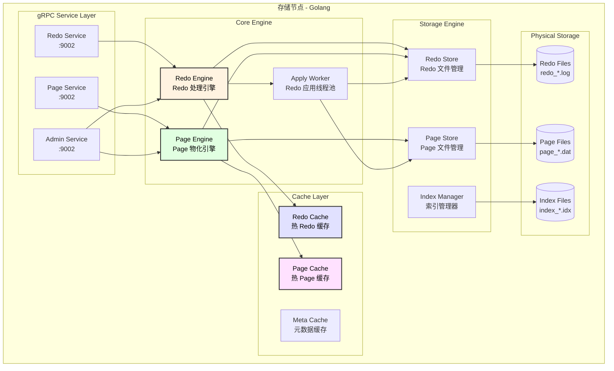
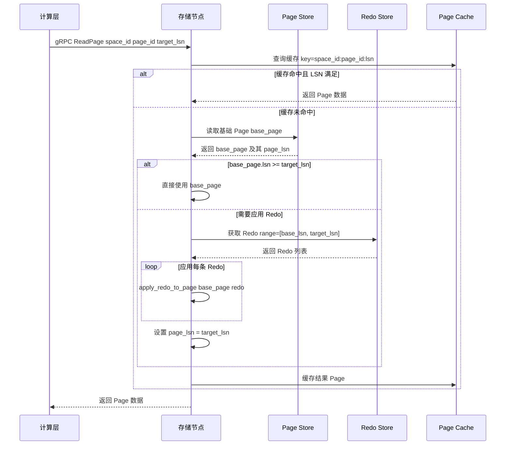
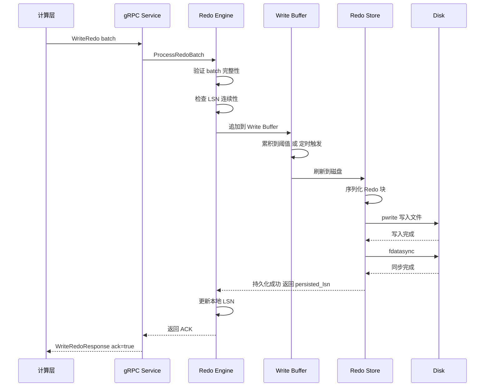
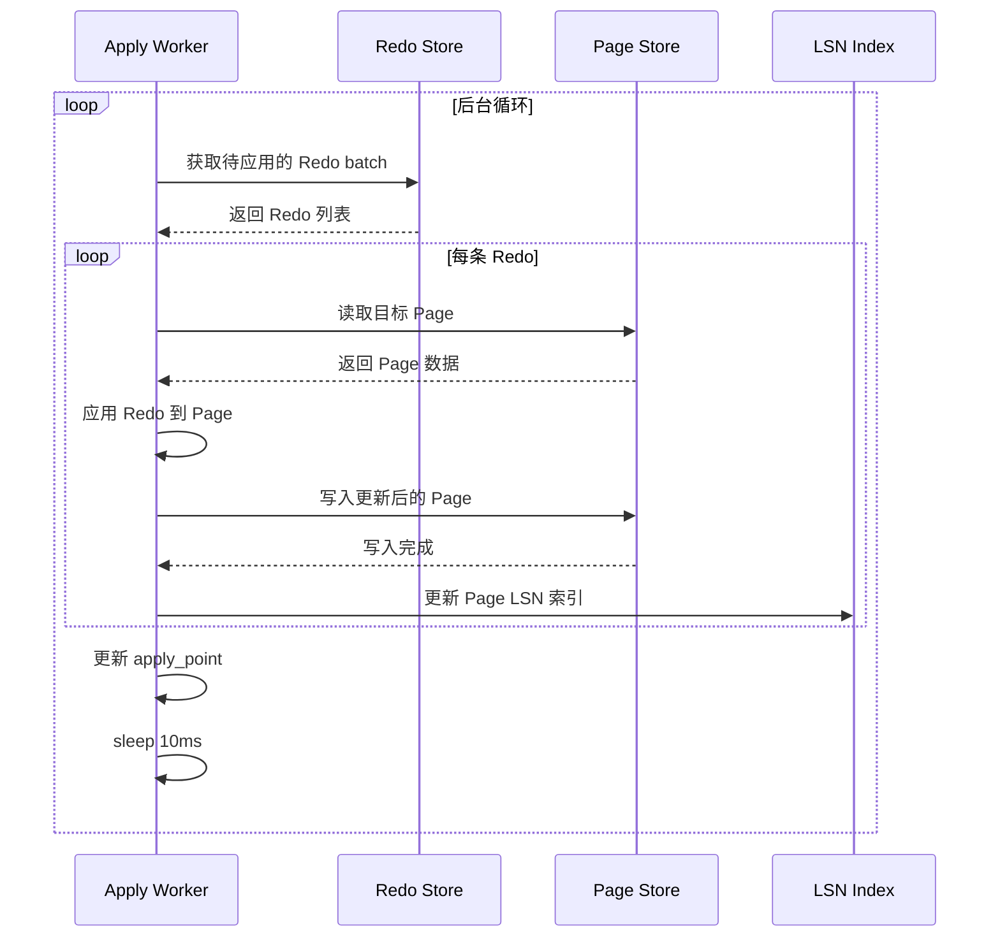
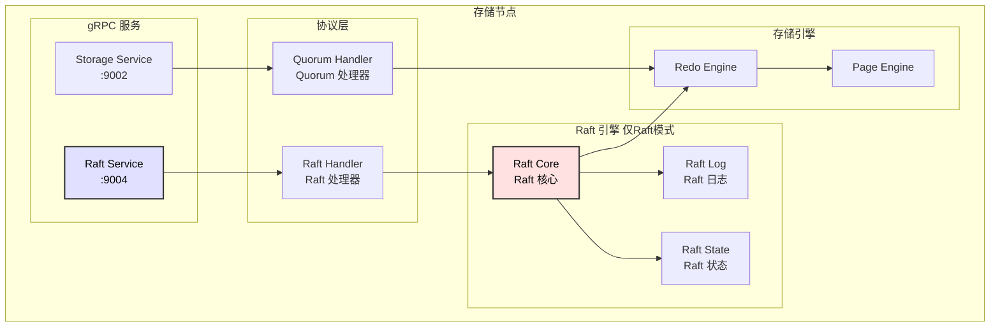
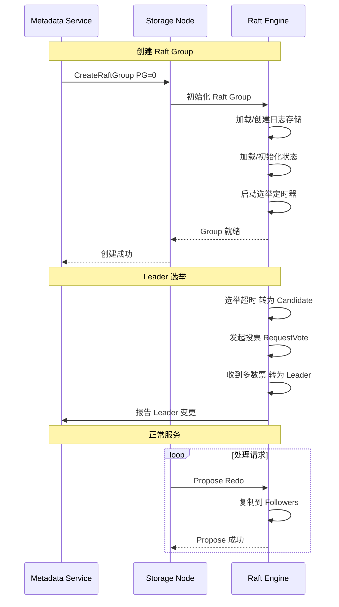
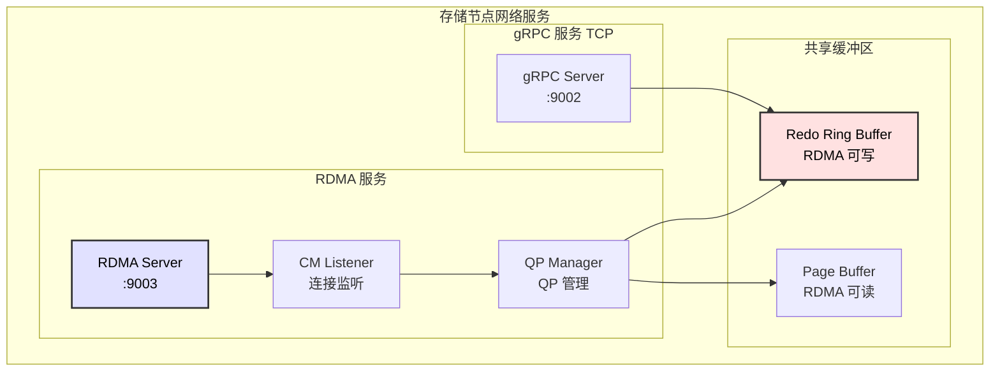

# 存储层设计文档

## 1. 模块概述

存储层使用 **Golang** 开发，负责 Redo 持久化、Page 物化、数据存储管理。

### 1.1 核心职责

| 职责 | 说明 |
|------|------|
| Redo 接收 | 接收来自计算层的 Redo 并持久化 |
| Redo 应用 | 异步将 Redo 应用到 Page |
| Page 物化 | 根据请求的 LSN 物化 Page |
| 磁盘管理 | 管理本地磁盘的 Redo 和 Page 存储 |
| 垃圾回收 | 回收过期的 Redo 和旧版本 Page |

### 1.2 模块架构图



---

## 2. InnoDB 物理文件结构回顾

### 2.1 原始 MySQL InnoDB 结构

```
┌─────────────────────────────────────────────────────────────────────────┐
│                        表空间 (Tablespace / .ibd 文件)                    │
├─────────────────────────────────────────────────────────────────────────┤
│  ┌─────────────────────────────────────────────────────────────────┐    │
│  │                         Extent 0 (1MB)                          │    │
│  │  ┌─────┬─────┬─────┬─────┬─────┬─────┬────────────────┬─────┐  │    │
│  │  │Page0│Page1│Page2│Page3│Page4│Page5│      ...       │Pg63 │  │    │
│  │  │16KB │16KB │16KB │16KB │16KB │16KB │                │16KB │  │    │
│  │  └─────┴─────┴─────┴─────┴─────┴─────┴────────────────┴─────┘  │    │
│  └─────────────────────────────────────────────────────────────────┘    │
│  ┌─────────────────────────────────────────────────────────────────┐    │
│  │                         Extent 1 (1MB)                          │    │
│  │                    64 个 Page × 16KB = 1MB                      │    │
│  └─────────────────────────────────────────────────────────────────┘    │
│                                 ...                                      │
│  ┌─────────────────────────────────────────────────────────────────┐    │
│  │                         Extent N (1MB)                          │    │
│  └─────────────────────────────────────────────────────────────────┘    │
└─────────────────────────────────────────────────────────────────────────┘
```

**关键概念：**

| 概念 | 大小 | 说明 |
|------|------|------|
| Page | 16KB | 最小 I/O 单位 |
| Extent | 1MB | 64 个 Page，空间分配单位 |
| Segment | 变长 | 逻辑概念，如叶子节点段、非叶子节点段 |
| Tablespace | 变长 | 一个或多个 .ibd 文件 |

---

## 3. Aurora 存储架构设计

### 3.1 Protection Group (PG) 设计

```
┌───────────────────────────────────────────────────────────────────────────────┐
│                           Volume (最大 128TB)                                  │
├───────────────────────────────────────────────────────────────────────────────┤
│  ┌────────────────────┐  ┌────────────────────┐  ┌────────────────────┐       │
│  │    PG 0 (10GB)     │  │    PG 1 (10GB)     │  │    PG 2 (10GB)     │ ...   │
│  │  6 副本跨 3 AZ     │  │  6 副本跨 3 AZ     │  │  6 副本跨 3 AZ     │       │
│  └────────────────────┘  └────────────────────┘  └────────────────────┘       │
│                                                                                │
│  PG 内部结构：                                                                 │
│  ┌────────────────────────────────────────────────────────────────────────┐   │
│  │ PG 0                                                                    │   │
│  │  ┌─────────┐ ┌─────────┐ ┌─────────┐ ┌─────────┐ ┌─────────┐ ┌───────┐ │   │
│  │  │Segment 0│ │Segment 1│ │Segment 2│ │Segment 3│ │Segment 4│ │  ...  │ │   │
│  │  │ 10MB    │ │ 10MB    │ │ 10MB    │ │ 10MB    │ │ 10MB    │ │       │ │   │
│  │  └─────────┘ └─────────┘ └─────────┘ └─────────┘ └─────────┘ └───────┘ │   │
│  │                         10GB = 1024 个 Segment                          │   │
│  └────────────────────────────────────────────────────────────────────────┘   │
└───────────────────────────────────────────────────────────────────────────────┘
```

### 3.2 Segment 内部结构

```
┌───────────────────────────────────────────────────────────────────────────────┐
│                           Segment (10MB)                                       │
├───────────────────────────────────────────────────────────────────────────────┤
│  ┌─────────────────────────────────────────────────────────────────────────┐  │
│  │                      Segment Header (4KB)                                │  │
│  │  ┌──────────────────────────────────────────────────────────────────┐   │  │
│  │  │ segment_id(8) │ pg_id(4) │ state(1) │ page_count(4) │ checksum(4)│   │  │
│  │  └──────────────────────────────────────────────────────────────────┘   │  │
│  │  ┌──────────────────────────────────────────────────────────────────┐   │  │
│  │  │            Page Bitmap (640 bits = 80 bytes)                      │   │  │
│  │  │            每 bit 表示一个 Page 是否存在                          │   │  │
│  │  └──────────────────────────────────────────────────────────────────┘   │  │
│  └─────────────────────────────────────────────────────────────────────────┘  │
│                                                                                │
│  ┌─────────────────────────────────────────────────────────────────────────┐  │
│  │                      Page Data Area (10MB - 4KB)                         │  │
│  │  ┌─────────┐ ┌─────────┐ ┌─────────┐ ┌─────────┐ ┌─────────────────┐    │  │
│  │  │ Page 0  │ │ Page 1  │ │ Page 2  │ │ Page 3  │ │       ...       │    │  │
│  │  │  16KB   │ │  16KB   │ │  16KB   │ │  16KB   │ │                 │    │  │
│  │  │ offset 0│ │off 16KB │ │off 32KB │ │off 48KB │ │                 │    │  │
│  │  └─────────┘ └─────────┘ └─────────┘ └─────────┘ └─────────────────┘    │  │
│  │                   最多 640 个 Page (640 × 16KB ≈ 10MB)                   │  │
│  └─────────────────────────────────────────────────────────────────────────┘  │
└───────────────────────────────────────────────────────────────────────────────┘
```

---

## 4. Page、IBD、Redo 存储映射详解

### 4.1 逻辑到物理的映射关系

```
┌─────────────────────────────────────────────────────────────────────────────────────┐
│                              InnoDB 逻辑层 (MySQL 视角)                              │
├─────────────────────────────────────────────────────────────────────────────────────┤
│                                                                                      │
│  Table: users (space_id = 100)                                                       │
│    └── users.ibd (逻辑上的文件)                                                      │
│           ├── Page 0  (FSP Header)                                                   │
│           ├── Page 1  (Insert Buffer Bitmap)                                         │
│           ├── Page 2  (First Inode Page)                                             │
│           ├── Page 3  (Root of clustered index)                                      │
│           ├── Page 4-63  (Additional pages)                                          │
│           └── ... (更多 Page)                                                        │
│                                                                                      │
├─────────────────────────────────────────────────────────────────────────────────────┤
│                              Aurora 映射层                                           │
├─────────────────────────────────────────────────────────────────────────────────────┤
│                                                                                      │
│  Volume: vol-12345678                                                                │
│    └── space_id=100 映射:                                                            │
│           page_id=0  → PG=0, Segment=0, offset=0                                     │
│           page_id=1  → PG=0, Segment=0, offset=16384                                 │
│           page_id=2  → PG=0, Segment=0, offset=32768                                 │
│           ...                                                                        │
│           page_id=640 → PG=0, Segment=1, offset=0                                    │
│           page_id=641 → PG=0, Segment=1, offset=16384                                │
│           ...                                                                        │
│           page_id=655360 → PG=1, Segment=0, offset=0  (超过10GB进入下一个PG)         │
│                                                                                      │
├─────────────────────────────────────────────────────────────────────────────────────┤
│                              物理存储层 (磁盘)                                        │
├─────────────────────────────────────────────────────────────────────────────────────┤
│                                                                                      │
│  存储节点 1 (AZ-A):                                                                  │
│    /data/volumes/vol-12345678/                                                       │
│      ├── redo/                                                                       │
│      │     ├── redo_00000000.log   (Redo 日志文件)                                   │
│      │     ├── redo_00000001.log                                                     │
│      │     └── ...                                                                   │
│      ├── pages/                                                                      │
│      │     ├── pg_0000/                                                              │
│      │     │     ├── seg_0000.dat   (Segment 数据文件)                               │
│      │     │     ├── seg_0001.dat                                                    │
│      │     │     └── ...                                                             │
│      │     ├── pg_0001/                                                              │
│      │     └── ...                                                                   │
│      └── meta/                                                                       │
│            ├── volume.meta                                                           │
│            ├── pg_mapping.idx                                                        │
│            └── lsn_index.idx                                                         │
│                                                                                      │
└─────────────────────────────────────────────────────────────────────────────────────┘
```

### 4.2 Page 地址计算公式

```go
// page_mapping.go

// 常量定义
const (
    PageSize          = 16384            // 16KB
    SegmentSize       = 10 * 1024 * 1024 // 10MB
    PGSize            = 10 * 1024 * 1024 * 1024 // 10GB
    PagesPerSegment   = 640              // 10MB / 16KB
    SegmentsPerPG     = 1024             // 10GB / 10MB
    PagesPerPG        = 655360           // 10GB / 16KB
)

// PageAddress 表示一个 Page 的物理地址
type PageAddress struct {
    VolumeID  string
    PGIndex   uint32   // Protection Group 索引
    SegIndex  uint32   // Segment 索引
    PageIndex uint32   // Segment 内 Page 索引
}

// GlobalPageID 逻辑 Page 地址
type GlobalPageID struct {
    SpaceID uint64
    PageNo  uint64
}

// 计算物理地址
func (g GlobalPageID) ToPhysicalAddress(spaceMapping *SpaceMapping) PageAddress {
    // 获取该 space 在 Volume 中的起始 Page 偏移
    baseOffset := spaceMapping.GetBasePageOffset(g.SpaceID)
    
    // 全局 Page 编号
    globalPageNo := baseOffset + g.PageNo
    
    // 计算 PG 索引
    pgIndex := globalPageNo / PagesPerPG
    
    // PG 内的 Page 编号
    pageInPG := globalPageNo % PagesPerPG
    
    // 计算 Segment 索引
    segIndex := pageInPG / PagesPerSegment
    
    // Segment 内的 Page 索引
    pageInSeg := pageInPG % PagesPerSegment
    
    return PageAddress{
        VolumeID:  spaceMapping.VolumeID,
        PGIndex:   uint32(pgIndex),
        SegIndex:  uint32(segIndex),
        PageIndex: uint32(pageInSeg),
    }
}

// 计算文件路径和偏移
func (addr PageAddress) GetFileLocation() (filePath string, offset int64) {
    filePath = fmt.Sprintf("/data/volumes/%s/pages/pg_%04d/seg_%04d.dat",
        addr.VolumeID, addr.PGIndex, addr.SegIndex)
    
    // Segment Header 占 4KB，Page 数据区从 4KB 开始
    offset = 4096 + int64(addr.PageIndex) * PageSize
    
    return
}
```

### 4.3 Redo 日志文件结构

```
┌───────────────────────────────────────────────────────────────────────────────┐
│                        Redo 日志文件 (redo_XXXXXXXX.log)                       │
├───────────────────────────────────────────────────────────────────────────────┤
│                                                                                │
│  ┌─────────────────────────────────────────────────────────────────────────┐  │
│  │                      File Header (4KB)                                   │  │
│  │  ┌───────────────────────────────────────────────────────────────────┐  │  │
│  │  │ magic(8) │ version(4) │ file_seq(8) │ start_lsn(8) │ end_lsn(8)  │  │  │
│  │  │ create_time(8) │ volume_id(32) │ node_id(32) │ checksum(4)       │  │  │
│  │  └───────────────────────────────────────────────────────────────────┘  │  │
│  └─────────────────────────────────────────────────────────────────────────┘  │
│                                                                                │
│  ┌─────────────────────────────────────────────────────────────────────────┐  │
│  │                      Block 0 (512B aligned)                              │  │
│  │  ┌───────────────────────────────────────────────────────────────────┐  │  │
│  │  │ Block Header (16B)                                                 │  │  │
│  │  │  block_lsn(8) │ data_len(4) │ checksum(4)                         │  │  │
│  │  ├───────────────────────────────────────────────────────────────────┤  │  │
│  │  │ Redo Record 1                                                      │  │  │
│  │  │  header(48B) │ data(N) │ crc(4)                                    │  │  │
│  │  ├───────────────────────────────────────────────────────────────────┤  │  │
│  │  │ Redo Record 2                                                      │  │  │
│  │  ├───────────────────────────────────────────────────────────────────┤  │  │
│  │  │ ...                                                                │  │  │
│  │  ├───────────────────────────────────────────────────────────────────┤  │  │
│  │  │ Padding (to 512B boundary)                                         │  │  │
│  │  └───────────────────────────────────────────────────────────────────┘  │  │
│  └─────────────────────────────────────────────────────────────────────────┘  │
│                                                                                │
│  ┌─────────────────────────────────────────────────────────────────────────┐  │
│  │                      Block 1 (512B aligned)                              │  │
│  └─────────────────────────────────────────────────────────────────────────┘  │
│                                  ...                                           │
│  ┌─────────────────────────────────────────────────────────────────────────┐  │
│  │                      Block N                                             │  │
│  └─────────────────────────────────────────────────────────────────────────┘  │
│                                                                                │
└───────────────────────────────────────────────────────────────────────────────┘

单个 Redo 文件大小：512MB（可配置）
```

### 4.4 详细的 Redo 记录字节布局

```
┌───────────────────────────────────────────────────────────────────────────────┐
│                         Redo Record 字节布局 (48 + N + 4 字节)                 │
├───────────────────────────────────────────────────────────────────────────────┤
│                                                                                │
│  Header (48 字节):                                                             │
│  ┌──────┬──────┬──────┬──────┬──────┬──────┬──────┬──────┐                    │
│  │  0   │  1   │  2   │  3   │  4   │  5   │  6   │  7   │   LSN (8 bytes)    │
│  ├──────┼──────┼──────┼──────┼──────┼──────┼──────┼──────┤                    │
│  │  8   │  9   │  10  │  11  │  12  │  13  │  14  │  15  │   Space ID (8 B)   │
│  ├──────┼──────┼──────┼──────┼──────┼──────┼──────┼──────┤                    │
│  │  16  │  17  │  18  │  19  │  20  │  21  │  22  │  23  │   Page ID (8 B)    │
│  ├──────┼──────┼──────┼──────┼──────┼──────┼──────┼──────┤                    │
│  │  24  │  25  │  26  │  27  │  28  │  29  │  30  │  31  │   TRX ID (8 B)     │
│  ├──────┼──────┼──────┼──────┼──────┼──────┼──────┼──────┤                    │
│  │  32  │  33  │  34  │  35  │  36  │  37  │  38  │  39  │   MTR ID (8 B)     │
│  ├──────┼──────┼──────┼──────┼──────┼──────┼──────┼──────┤                    │
│  │  40  │  41  │  42  │  43  │  44  │  45  │  46  │  47  │   Type+Flags+Len   │
│  └──────┴──────┴──────┴──────┴──────┴──────┴──────┴──────┘                    │
│         Type: 2B    Flags: 2B    Data Len: 4B                                  │
│                                                                                │
│  Data (N 字节):                                                                │
│  ┌──────────────────────────────────────────────────────────────────────────┐ │
│  │   变长数据区域，根据 Type 不同有不同的内部格式                            │ │
│  │   例如 INSERT: slot_no(2) + rec_len(2) + rec_data(N-4)                    │ │
│  └──────────────────────────────────────────────────────────────────────────┘ │
│                                                                                │
│  Checksum (4 字节):                                                            │
│  ┌──────┬──────┬──────┬──────┐                                                │
│  │ CRC32 校验和              │                                                │
│  └──────┴──────┴──────┴──────┘                                                │
│                                                                                │
└───────────────────────────────────────────────────────────────────────────────┘
```

---

## 5. Page 物化过程详解

### 5.1 物化流程图



### 5.2 物化实现代码

```go
// page_materializer.go

type PageMaterializer struct {
    pageStore  *PageStore
    redoStore  *RedoStore
    pageCache  *PageCache
}

func (m *PageMaterializer) MaterializePage(
    spaceID, pageID, targetLSN uint64,
) (*Page, error) {
    
    // 1. 查询缓存
    cacheKey := fmt.Sprintf("%d:%d:%d", spaceID, pageID, targetLSN)
    if page, ok := m.pageCache.Get(cacheKey); ok {
        return page, nil
    }
    
    // 2. 读取基础 Page（最近的持久化版本）
    basePage, baseLSN, err := m.pageStore.ReadPage(spaceID, pageID)
    if err != nil {
        // 页面不存在，创建空白页面
        if err == ErrPageNotFound {
            basePage = NewEmptyPage(spaceID, pageID)
            baseLSN = 0
        } else {
            return nil, err
        }
    }
    
    // 3. 检查是否需要应用 Redo
    if baseLSN >= targetLSN {
        return basePage, nil
    }
    
    // 4. 获取需要应用的 Redo
    redoLogs, err := m.redoStore.GetRedoRange(spaceID, pageID, baseLSN, targetLSN)
    if err != nil {
        return nil, err
    }
    
    // 5. 依次应用 Redo
    workPage := basePage.Clone()
    for _, redo := range redoLogs {
        if err := m.applyRedo(workPage, redo); err != nil {
            return nil, fmt.Errorf("apply redo failed at LSN %d: %w", redo.LSN, err)
        }
    }
    workPage.SetLSN(targetLSN)
    
    // 6. 缓存结果
    m.pageCache.Put(cacheKey, workPage)
    
    return workPage, nil
}

func (m *PageMaterializer) applyRedo(page *Page, redo *RedoRecord) error {
    switch redo.Type {
    case MLOG_REC_INSERT:
        return m.applyInsert(page, redo.Data)
    case MLOG_REC_UPDATE_IN_PLACE:
        return m.applyUpdateInPlace(page, redo.Data)
    case MLOG_REC_DELETE:
        return m.applyDelete(page, redo.Data)
    case MLOG_PAGE_INIT:
        return m.applyPageInit(page, redo.Data)
    // ... 其他类型
    default:
        return fmt.Errorf("unknown redo type: %d", redo.Type)
    }
}
```

---

## 6. 物理文件详细格式

### 6.1 Segment 文件格式 (seg_XXXX.dat)

```
┌───────────────────────────────────────────────────────────────────────────────┐
│                     Segment 文件 (seg_XXXX.dat) ~10MB                          │
├───────────────────────────────────────────────────────────────────────────────┤
│                                                                                │
│  ┌─────────────────────────────────────────────────────────────────────────┐  │
│  │                     Segment Header (4096 字节)                           │  │
│  │  ┌──────────────────────────────────────────────────────────────────┐   │  │
│  │  │ Offset 0-7:    magic_number    (8B)  = 0x5345475F41555254       │   │  │
│  │  │ Offset 8-11:   version         (4B)  = 1                         │   │  │
│  │  │ Offset 12-19:  segment_id      (8B)                              │   │  │
│  │  │ Offset 20-23:  pg_index        (4B)                              │   │  │
│  │  │ Offset 24-27:  seg_index       (4B)                              │   │  │
│  │  │ Offset 28:     state           (1B)  0=empty, 1=active, 2=full   │   │  │
│  │  │ Offset 29-31:  reserved        (3B)                              │   │  │
│  │  │ Offset 32-35:  page_count      (4B)  当前 Page 数量              │   │  │
│  │  │ Offset 36-43:  max_lsn         (8B)  最大 LSN                    │   │  │
│  │  │ Offset 44-51:  create_time     (8B)  创建时间戳                  │   │  │
│  │  │ Offset 52-59:  update_time     (8B)  更新时间戳                  │   │  │
│  │  │ Offset 60-139: page_bitmap     (80B) 640 bits，Page 存在位图     │   │  │
│  │  │ Offset 140-5235: page_lsn_map  (5096B) 640×8B，每个 Page 的 LSN  │   │  │
│  │  │ Offset 5236-5239: header_crc   (4B)  Header CRC32                │   │  │
│  │  │ Offset 5240-4095: padding      填充到 4KB                        │   │  │
│  │  └──────────────────────────────────────────────────────────────────┘   │  │
│  └─────────────────────────────────────────────────────────────────────────┘  │
│                                                                                │
│  ┌─────────────────────────────────────────────────────────────────────────┐  │
│  │                     Page Data Area                                       │  │
│  │  ┌──────────────────────────────────────────────────────────────────┐   │  │
│  │  │ Page 0: Offset 4096 - 20479      (16KB)                          │   │  │
│  │  ├──────────────────────────────────────────────────────────────────┤   │  │
│  │  │ Page 1: Offset 20480 - 36863     (16KB)                          │   │  │
│  │  ├──────────────────────────────────────────────────────────────────┤   │  │
│  │  │ Page 2: Offset 36864 - 53247     (16KB)                          │   │  │
│  │  ├──────────────────────────────────────────────────────────────────┤   │  │
│  │  │ ...                                                              │   │  │
│  │  ├──────────────────────────────────────────────────────────────────┤   │  │
│  │  │ Page 639: Offset 10481664 - 10498047 (16KB)                      │   │  │
│  │  └──────────────────────────────────────────────────────────────────┘   │  │
│  │                                                                          │  │
│  │  Page 偏移计算: offset = 4096 + page_index * 16384                       │  │
│  └─────────────────────────────────────────────────────────────────────────┘  │
│                                                                                │
└───────────────────────────────────────────────────────────────────────────────┘
```

### 6.2 Page 内部格式 (16KB)

```
┌───────────────────────────────────────────────────────────────────────────────┐
│                          Page 内部格式 (16384 字节)                            │
├───────────────────────────────────────────────────────────────────────────────┤
│                                                                                │
│  ┌─────────────────────────────────────────────────────────────────────────┐  │
│  │                   File Header (38 字节)                                  │  │
│  │  ┌──────────────────────────────────────────────────────────────────┐   │  │
│  │  │ Offset 0-3:    checksum        (4B)  Page 校验和                 │   │  │
│  │  │ Offset 4-7:    page_no         (4B)  Page 编号                   │   │  │
│  │  │ Offset 8-11:   prev_page       (4B)  前一个 Page                 │   │  │
│  │  │ Offset 12-15:  next_page       (4B)  后一个 Page                 │   │  │
│  │  │ Offset 16-23:  lsn             (8B)  最后修改的 LSN              │   │  │
│  │  │ Offset 24-25:  page_type       (2B)  Page 类型                   │   │  │
│  │  │ Offset 26-33:  flush_lsn       (8B)  刷新时的 LSN                │   │  │
│  │  │ Offset 34-37:  space_id        (4B)  表空间 ID                   │   │  │
│  │  └──────────────────────────────────────────────────────────────────┘   │  │
│  └─────────────────────────────────────────────────────────────────────────┘  │
│                                                                                │
│  ┌─────────────────────────────────────────────────────────────────────────┐  │
│  │                   Page Body (16252 字节)                                 │  │
│  │                   具体格式取决于 page_type                               │  │
│  │                                                                          │  │
│  │   INDEX Page (B+Tree 节点):                                              │  │
│  │   ┌──────────────────────────────────────────────────────────────────┐  │  │
│  │   │ Index Header (36B): 索引信息                                     │  │  │
│  │   │ FSEG Header (20B): 段信息                                        │  │  │
│  │   │ Page Directory: 稀疏目录                                         │  │  │
│  │   │ User Records: 用户数据记录                                       │  │  │
│  │   │ Supremum/Infimum Records                                         │  │  │
│  │   │ Free Space                                                        │  │  │
│  │   └──────────────────────────────────────────────────────────────────┘  │  │
│  └─────────────────────────────────────────────────────────────────────────┘  │
│                                                                                │
│  ┌─────────────────────────────────────────────────────────────────────────┐  │
│  │                   File Trailer (8 字节)                                  │  │
│  │  ┌──────────────────────────────────────────────────────────────────┐   │  │
│  │  │ Offset 16376-16379: old_checksum  (4B) 旧版校验和                │   │  │
│  │  │ Offset 16380-16383: lsn_low32     (4B) LSN 低 32 位              │   │  │
│  │  └──────────────────────────────────────────────────────────────────┘   │  │
│  └─────────────────────────────────────────────────────────────────────────┘  │
│                                                                                │
└───────────────────────────────────────────────────────────────────────────────┘
```

### 6.3 LSN 索引文件格式 (lsn_index.idx)

```
┌───────────────────────────────────────────────────────────────────────────────┐
│                      LSN 索引文件 (lsn_index.idx)                              │
├───────────────────────────────────────────────────────────────────────────────┤
│                                                                                │
│  ┌─────────────────────────────────────────────────────────────────────────┐  │
│  │                     Index Header (64 字节)                               │  │
│  │  ┌──────────────────────────────────────────────────────────────────┐   │  │
│  │  │ magic(8) │ version(4) │ entry_count(8) │ min_lsn(8) │ max_lsn(8)│   │  │
│  │  │ create_time(8) │ update_time(8) │ checksum(4) │ reserved(14)    │   │  │
│  │  └──────────────────────────────────────────────────────────────────┘   │  │
│  └─────────────────────────────────────────────────────────────────────────┘  │
│                                                                                │
│  ┌─────────────────────────────────────────────────────────────────────────┐  │
│  │                     Index Entries (每个 32 字节)                         │  │
│  │  ┌──────────────────────────────────────────────────────────────────┐   │  │
│  │  │ Entry 0: lsn(8) │ file_seq(4) │ offset(4) │ len(4) │ page_id(8) │   │  │
│  │  │          │ space_id(4)                                           │   │  │
│  │  ├──────────────────────────────────────────────────────────────────┤   │  │
│  │  │ Entry 1: ...                                                     │   │  │
│  │  ├──────────────────────────────────────────────────────────────────┤   │  │
│  │  │ ...                                                              │   │  │
│  │  └──────────────────────────────────────────────────────────────────┘   │  │
│  └─────────────────────────────────────────────────────────────────────────┘  │
│                                                                                │
│  用途：快速定位某个 LSN 对应的 Redo 记录在哪个文件的哪个偏移位置              │
│                                                                                │
└───────────────────────────────────────────────────────────────────────────────┘
```

---

## 7. 内部时序图

### 7.1 Redo 接收与持久化



### 7.2 后台 Redo 应用



---

## 8. 存储空间分配

### 8.1 表空间到 PG 的映射

```go
// space_allocator.go

type SpaceAllocator struct {
    volumeID    string
    metaClient  *MetadataClient
    allocations map[uint64]*SpaceAllocation  // space_id -> allocation
}

type SpaceAllocation struct {
    SpaceID       uint64
    StartPG       uint32
    StartSegment  uint32
    StartPage     uint32
    CurrentPage   uint32  // 当前已分配的最大 Page
}

func (a *SpaceAllocator) AllocatePages(spaceID uint64, count int) ([]PageAddress, error) {
    alloc, ok := a.allocations[spaceID]
    if !ok {
        // 新表空间，分配起始位置
        alloc = a.allocateNewSpace(spaceID)
    }
    
    result := make([]PageAddress, count)
    for i := 0; i < count; i++ {
        result[i] = a.nextPageAddress(alloc)
        alloc.CurrentPage++
    }
    
    // 持久化分配信息到元数据服务
    a.metaClient.UpdateSpaceAllocation(a.volumeID, alloc)
    
    return result, nil
}
```

---

## 9. 垃圾回收

### 9.1 Redo GC

```go
// redo_gc.go

type RedoGC struct {
    store       *RedoStore
    metaClient  *MetadataClient
}

func (gc *RedoGC) Run() {
    for {
        // 获取所有 Reader 的 read_point
        minReadPoint := gc.metaClient.GetMinReaderReadPoint(volumeID)
        
        // 获取最近的 Checkpoint LSN
        checkpointLSN := gc.metaClient.GetCheckpointLSN(volumeID)
        
        // 可以删除的 LSN 上限
        deletableLSN := min(minReadPoint, checkpointLSN)
        
        // 删除旧的 Redo 文件
        gc.store.DeleteRedoBeforeLSN(deletableLSN)
        
        time.Sleep(time.Minute)
    }
}
```

---

## 10. 监控指标

| 指标 | 类型 | 说明 |
|------|------|------|
| `storage_redo_received_total` | Counter | 接收的 Redo 总数 |
| `storage_redo_bytes_total` | Counter | 接收的 Redo 总字节数 |
| `storage_redo_apply_lag` | Gauge | Redo 应用延迟（LSN） |
| `storage_page_reads_total` | Counter | Page 读取总数 |
| `storage_page_materializations_total` | Counter | Page 物化次数 |
| `storage_page_cache_hit_rate` | Gauge | Page 缓存命中率 |
| `storage_disk_used_bytes` | Gauge | 磁盘使用量 |
| `storage_disk_total_bytes` | Gauge | 磁盘总容量 |
| `storage_current_lsn` | Gauge | 当前持久化的 LSN |

---

## 11. Multi-Raft 支持

### 11.1 架构扩展

存储层支持两种复制模式：



### 11.2 Raft 日志存储

```go
// raft_log_store.go

type RaftLogStore struct {
    groupID     uint64
    logDir      string
    currentFile *os.File
    index       *RaftLogIndex
    mu          sync.RWMutex
}

// Raft 日志文件格式
type RaftLogFile struct {
    Header      RaftLogFileHeader
    Entries     []RaftLogEntry
}

type RaftLogFileHeader struct {
    Magic       uint64   // 0x524146544C4F4731 "RAFTLOG1"
    Version     uint32
    GroupID     uint64
    FirstIndex  uint64
    LastIndex   uint64
    FirstTerm   uint64
    LastTerm    uint64
    CreateTime  int64
}

func (s *RaftLogStore) Append(entries []*RaftLogEntry) error {
    s.mu.Lock()
    defer s.mu.Unlock()
    
    for _, entry := range entries {
        // 序列化
        data := entry.Serialize()
        
        // 写入文件
        if _, err := s.currentFile.Write(data); err != nil {
            return err
        }
        
        // 更新索引
        s.index.Add(entry.Index, entry.Term, s.currentFile.Name(), offset)
    }
    
    return nil
}
```

### 11.3 Raft Group 生命周期



### 11.4 配置

```yaml
# storage_config.yaml

storage:
  # 复制协议
  replication_protocol: "raft"  # quorum 或 raft
  
  # Raft 配置
  raft:
    enabled: true
    data_dir: "/data/raft"
    
    # 定时器配置
    heartbeat_interval_ms: 100
    election_timeout_min_ms: 300
    election_timeout_max_ms: 500
    
    # 日志配置
    max_log_file_size: 67108864  # 64MB
    max_log_entries: 100000
    snapshot_threshold: 10000
    
    # 网络配置
    grpc_port: 9004
    max_message_size: 16777216  # 16MB
```

详细设计参见 [10_replication_protocol.md](./10_replication_protocol.md)。

---

## 12. RDMA 网络支持

### 12.1 RDMA 服务架构

存储层支持 RDMA 高性能传输，实现微秒级延迟：



### 12.2 RDMA 内存布局

```go
// RDMA 注册内存区域
type RDMAMemoryLayout struct {
    // Redo 接收区（供计算层 RDMA Write）
    RedoBuffer struct {
        BaseAddr    uint64
        Size        uint64   // 256MB
        RKey        uint32
        // 环形缓冲区管理
        WritePtr    uint64   // 计算层写入位置（原子更新）
        ReadPtr     uint64   // 存储层读取位置
    }
    
    // Page 发送区（供计算层 RDMA Read）
    PageBuffer struct {
        BaseAddr    uint64
        Size        uint64   // 1GB
        RKey        uint32
        // Page 槽位管理
        Slots       []*PageSlot
    }
    
    // 控制区（元数据交换）
    ControlBuffer struct {
        BaseAddr    uint64
        Size        uint64   // 4KB
        RKey        uint32
    }
}

type PageSlot struct {
    SpaceID     uint32
    PageNo      uint32
    LSN         uint64
    State       SlotState  // FREE, LOADING, READY
    Offset      uint64     // 在 PageBuffer 中的偏移
}
```

### 12.3 配置

```yaml
# storage_config.yaml

storage:
  network:
    # TCP/gRPC 服务
    grpc:
      enabled: true
      port: 9002
      
    # RDMA 服务
    rdma:
      enabled: true
      port: 9003
      device: "mlx5_0"
      
      # 内存配置
      redo_buffer_mb: 256
      page_buffer_mb: 1024
      
      # 性能调优
      max_qp_per_client: 4
      use_srq: true
      srq_size: 8192
```

详细设计参见 [11_network_layer.md](./11_network_layer.md)。
