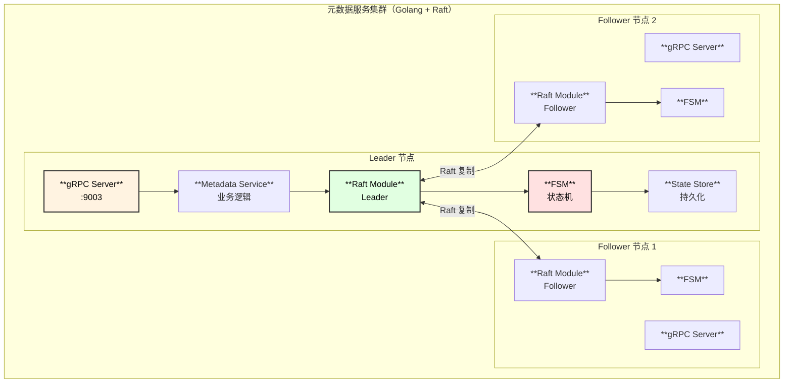
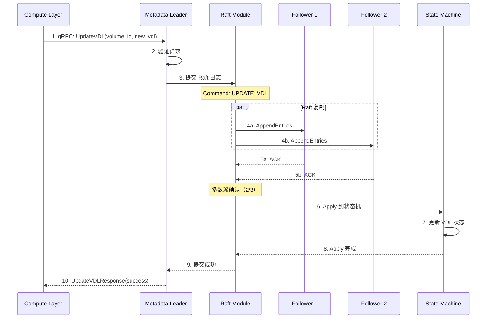
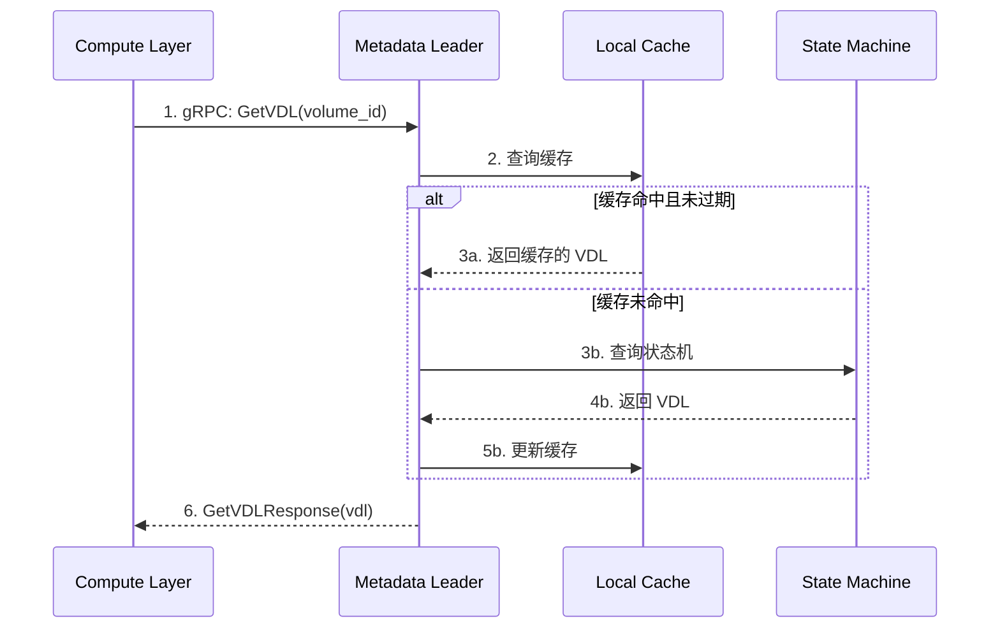
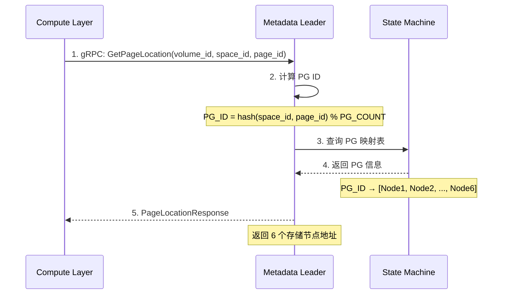
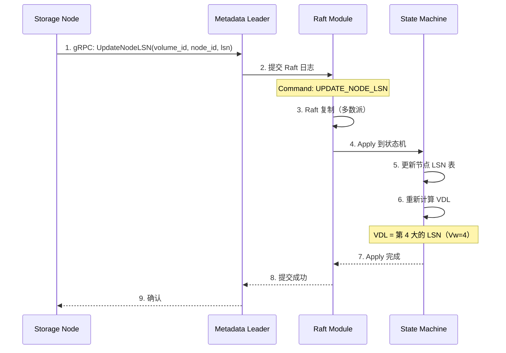
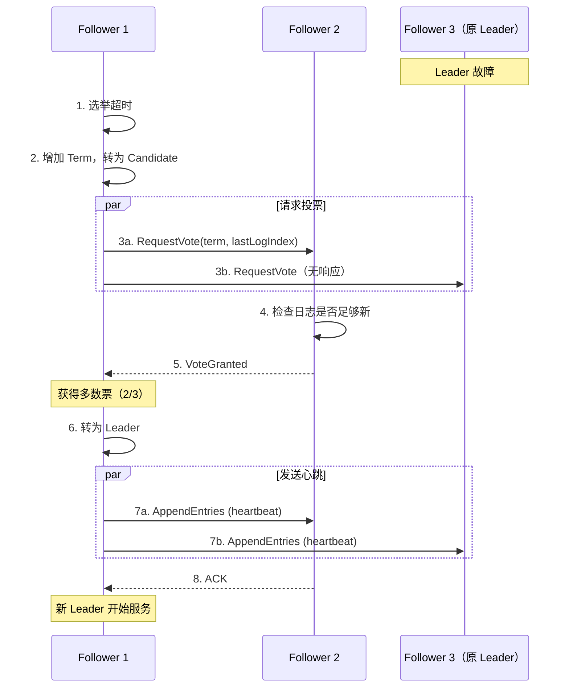

# 元数据服务设计文档

## 1. 模块概述

元数据服务使用 **Golang + Raft** 开发，负责元数据管理和强一致性保证。

### 1.1 核心职责

| 职责 | 说明 |
|------|------|
| Volume 管理 | Volume 创建、删除、配置 |
| VDL 管理 | 维护 Volume Durable LSN |
| PG 映射 | Page 到存储节点的映射 |
| 实例注册 | 计算实例注册与管理 |
| 强一致性 | 通过 Raft 协议保证元数据一致性 |

### 1.2 模块架构图



---

## 2. 内部时序图

### 2.1 VDL 更新流程（写入路径）



### 2.2 VDL 查询流程（读取路径）



### 2.3 PG 映射查询流程



### 2.4 存储节点 LSN 上报流程



### 2.5 Leader 选举流程



---

## 3. 核心组件设计

### 3.1 FSM（有限状态机）

```go
// internal/raft/fsm.go

type FSM struct {
    mu sync.RWMutex
    
    // 状态存储
    volumes     map[string]*VolumeState
    nodeLSNs    map[string]map[string]int64  // volume_id → node_id → lsn
    pgMappings  map[string]*PGMapping        // volume_id → pg mappings
    instances   map[string]*InstanceState    // cluster_id → instance
}

type VolumeState struct {
    VolumeID    string
    ClusterID   string
    SizeBytes   int64
    CurrentVDL  int64
    PGCount     int
    CreatedAt   int64
}

// Apply Raft 日志
func (f *FSM) Apply(log *raft.Log) interface{} {
    var cmd Command
    json.Unmarshal(log.Data, &cmd)
    
    switch cmd.Type {
    case CmdCreateVolume:
        return f.applyCreateVolume(cmd.Data)
    case CmdUpdateVDL:
        return f.applyUpdateVDL(cmd.Data)
    case CmdUpdateNodeLSN:
        return f.applyUpdateNodeLSN(cmd.Data)
    case CmdRegisterInstance:
        return f.applyRegisterInstance(cmd.Data)
    }
    return nil
}

// 计算 VDL
func (f *FSM) calculateVDL(volumeID string) int64 {
    lsns := f.nodeLSNs[volumeID]
    if len(lsns) < 4 {
        return 0
    }
    
    // 排序取第 4 大值
    sorted := make([]int64, 0, len(lsns))
    for _, lsn := range lsns {
        sorted = append(sorted, lsn)
    }
    sort.Slice(sorted, func(i, j int) bool {
        return sorted[i] > sorted[j]
    })
    
    return sorted[3]  // 第 4 大值（index=3）
}
```

### 3.2 Metadata Service

```go
// internal/api/metadata_service.go

type MetadataService struct {
    raftNode *raft.Node
    fsm      *FSM
    cache    *Cache
}

// 更新 VDL
func (s *MetadataService) UpdateVDL(ctx context.Context, req *pb.UpdateVDLRequest) (*pb.UpdateVDLResponse, error) {
    // 必须是 Leader
    if !s.raftNode.IsLeader() {
        return nil, ErrNotLeader
    }
    
    // 提交到 Raft
    cmd := Command{Type: CmdUpdateVDL, Data: marshal(req)}
    if err := s.raftNode.Apply(cmd, 5*time.Second); err != nil {
        return nil, err
    }
    
    return &pb.UpdateVDLResponse{Success: true, CurrentVdl: req.NewVdl}, nil
}

// 获取 VDL
func (s *MetadataService) GetVDL(ctx context.Context, req *pb.GetVDLRequest) (*pb.GetVDLResponse, error) {
    // 读操作可在 Follower 执行（最终一致）
    // 或者通过 ReadIndex 实现线性一致读
    
    if cached, ok := s.cache.GetVDL(req.VolumeId); ok {
        return &pb.GetVDLResponse{Vdl: cached}, nil
    }
    
    vdl, _ := s.fsm.GetVDL(req.VolumeId)
    s.cache.SetVDL(req.VolumeId, vdl)
    
    return &pb.GetVDLResponse{Vdl: vdl}, nil
}

// 获取 Page 位置
func (s *MetadataService) GetPageLocation(ctx context.Context, req *pb.GetPageLocationRequest) (*pb.PageLocationResponse, error) {
    // 计算 PG ID
    pgID := s.calculatePGID(req.SpaceId, req.PageId)
    
    // 从 FSM 获取 PG 映射
    nodes := s.fsm.GetPGNodes(req.VolumeId, pgID)
    
    return &pb.PageLocationResponse{
        NodeIds: nodes,
        PgId:    int32(pgID),
    }, nil
}
```

### 3.3 PG 映射

```go
// internal/metadata/pg_mapping.go

type PGMapping struct {
    VolumeID  string
    PGCount   int
    PGs       []*ProtectionGroup
}

type ProtectionGroup struct {
    PGID    int
    Nodes   []string  // 6 个节点 ID
}

// 计算 Page 所属 PG
func (m *PGMapping) GetPGForPage(spaceID, pageID int64) int {
    // 每个 PG 包含约 640 个 Page（10GB / 16KB）
    key := (spaceID << 32) | pageID
    return int(key % int64(m.PGCount))
}
```

---

## 4. gRPC 接口

### 4.1 Metadata Service

```protobuf
service MetadataService {
    // Volume 管理
    rpc CreateVolume(CreateVolumeRequest) returns (CreateVolumeResponse);
    rpc GetVolume(GetVolumeRequest) returns (VolumeInfo);
    rpc DeleteVolume(DeleteVolumeRequest) returns (google.protobuf.Empty);
    
    // VDL 管理
    rpc UpdateVDL(UpdateVDLRequest) returns (UpdateVDLResponse);
    rpc GetVDL(GetVDLRequest) returns (GetVDLResponse);
    
    // 节点 LSN 管理
    rpc UpdateNodeLSN(UpdateNodeLSNRequest) returns (google.protobuf.Empty);
    rpc GetNodeLSNs(GetNodeLSNsRequest) returns (GetNodeLSNsResponse);
    
    // PG 映射
    rpc GetPageLocation(GetPageLocationRequest) returns (PageLocationResponse);
    
    // 实例管理
    rpc RegisterInstance(RegisterInstanceRequest) returns (RegisterInstanceResponse);
    rpc UnregisterInstance(UnregisterInstanceRequest) returns (google.protobuf.Empty);
    
    // 健康检查
    rpc HealthCheck(HealthCheckRequest) returns (HealthCheckResponse);
    rpc GetLeader(google.protobuf.Empty) returns (LeaderResponse);
}

message UpdateVDLRequest {
    string volume_id = 1;
    int64 new_vdl = 2;
    string instance_id = 3;
}

message GetVDLResponse {
    int64 vdl = 1;
}

message UpdateNodeLSNRequest {
    string volume_id = 1;
    string node_id = 2;
    int64 current_lsn = 3;
}

message GetNodeLSNsResponse {
    map<string, int64> node_lsns = 1;
    int64 min_lsn = 2;
    int64 max_lsn = 3;
}

message PageLocationResponse {
    repeated string node_ids = 1;
    int64 base_lsn = 2;
    int32 pg_id = 3;
}

message HealthCheckResponse {
    bool is_healthy = 1;
    bool is_leader = 2;
    string leader_id = 3;
}
```

---

## 5. 配置参数

```yaml
server:
  grpc_port: 9003
  node_id: metadata-1

raft:
  data_dir: /data/aurora/metadata/raft
  peers:
    - id: metadata-1
      address: metadata1:9004
    - id: metadata-2
      address: metadata2:9004
    - id: metadata-3
      address: metadata3:9004
  election_timeout: 1000ms
  heartbeat_timeout: 100ms
  snapshot_threshold: 10000

cache:
  max_entries: 10000
  ttl: 100ms
```

---

## 6. 监控指标

| 指标 | 类型 | 说明 |
|------|------|------|
| `metadata_raft_is_leader` | Gauge | 是否为 Leader |
| `metadata_raft_term` | Gauge | 当前 Term |
| `metadata_raft_commit_index` | Gauge | 提交索引 |
| `metadata_volumes_total` | Gauge | Volume 总数 |
| `metadata_requests_total` | Counter | 请求总数 |
| `metadata_request_latency_seconds` | Histogram | 请求延迟 |
| `metadata_cache_hit_rate` | Gauge | 缓存命中率 |
