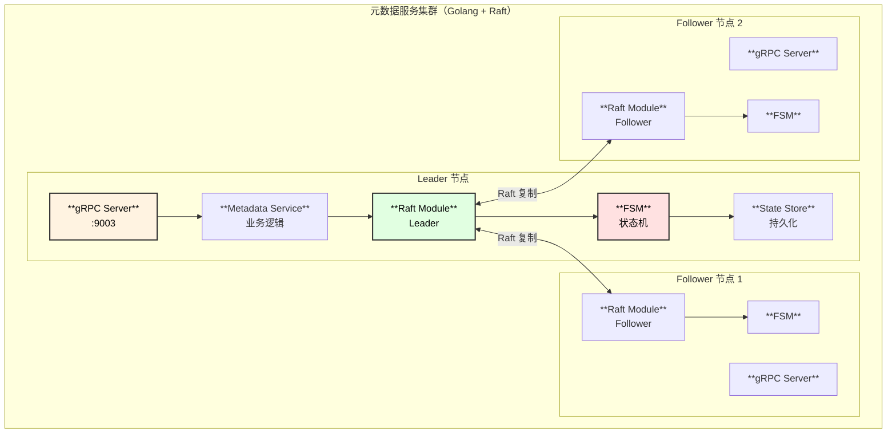
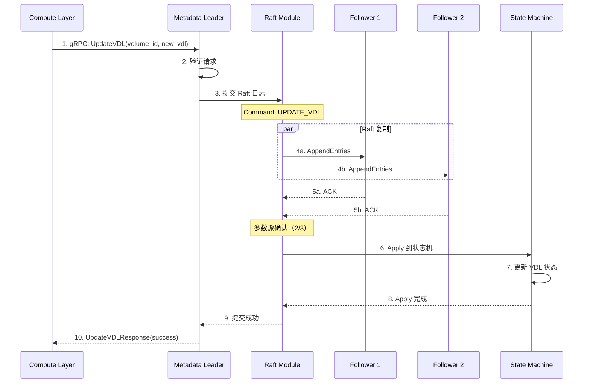
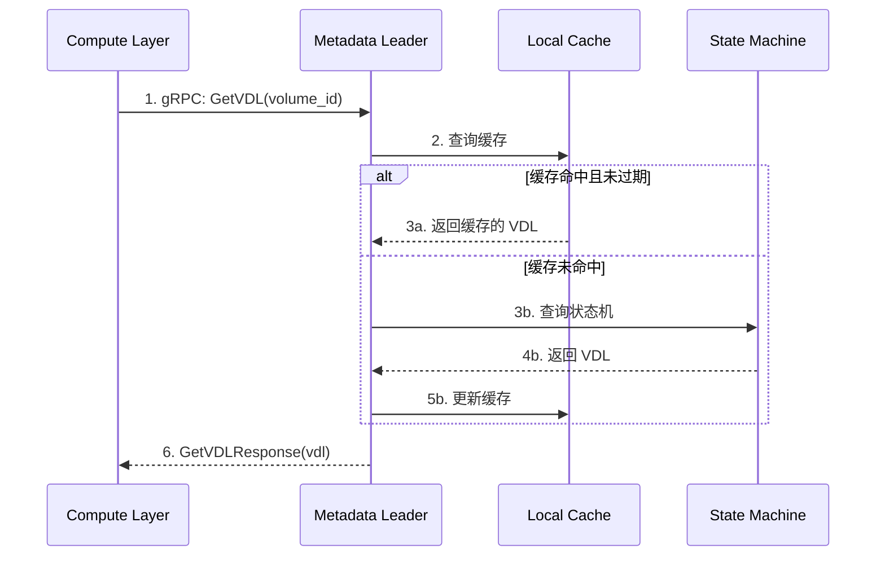
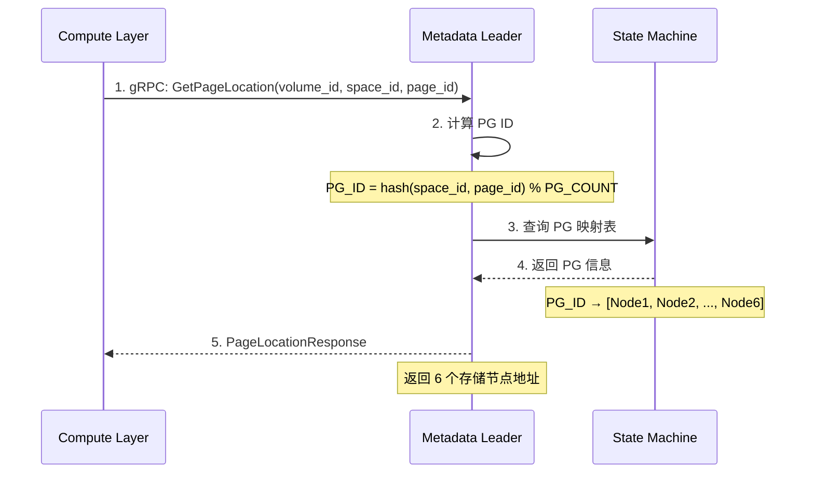
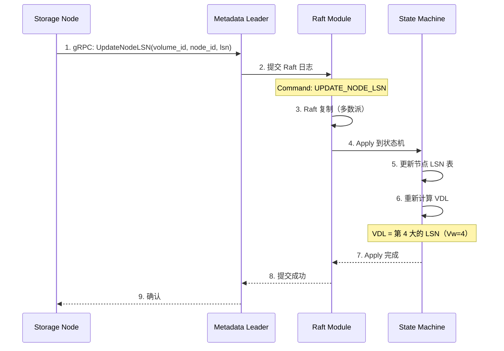
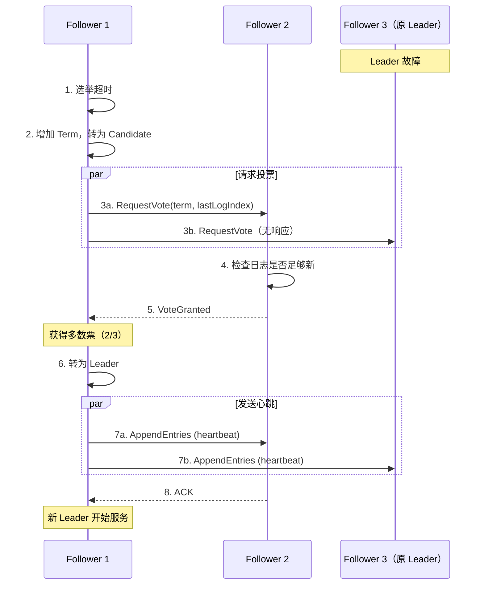
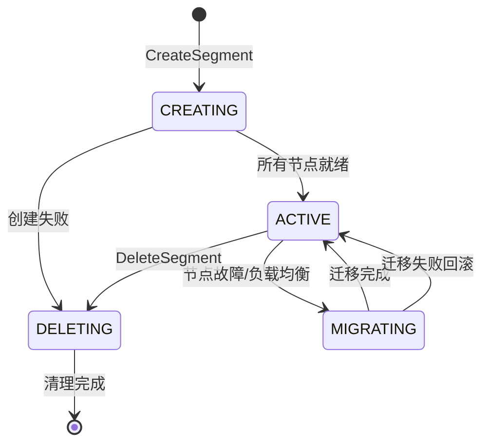

# 元数据服务设计文档

## 1. 模块概述

元数据服务使用 **Golang + Raft** 开发，负责元数据管理和强一致性保证。

### 1.1 核心职责

| 职责 | 说明 |
|------|------|
| Volume 管理 | Volume 创建、删除、配置 |
| VDL 管理 | 维护 Volume Durable LSN |
| PG 映射 | Page 到存储节点的映射 |
| 实例注册 | 计算实例注册与管理 |
| 强一致性 | 通过 Raft 协议保证元数据一致性 |

### 1.2 模块架构图



---

## 2. 内部时序图

### 2.1 VDL 更新流程（写入路径）



### 2.2 VDL 查询流程（读取路径）



### 2.3 PG 映射查询流程



### 2.4 存储节点 LSN 上报流程



### 2.5 Leader 选举流程



---

## 3. 核心组件设计

### 3.1 FSM（有限状态机）

```go
// internal/raft/fsm.go

type FSM struct {
    mu sync.RWMutex
    
    // 状态存储
    volumes     map[string]*VolumeState
    nodeLSNs    map[string]map[string]int64  // volume_id → node_id → lsn
    pgMappings  map[string]*PGMapping        // volume_id → pg mappings
    instances   map[string]*InstanceState    // cluster_id → instance
}

type VolumeState struct {
    VolumeID    string
    ClusterID   string
    SizeBytes   int64
    CurrentVDL  int64
    PGCount     int
    CreatedAt   int64
}

// Apply Raft 日志
func (f *FSM) Apply(log *raft.Log) interface{} {
    var cmd Command
    json.Unmarshal(log.Data, &cmd)
    
    switch cmd.Type {
    case CmdCreateVolume:
        return f.applyCreateVolume(cmd.Data)
    case CmdUpdateVDL:
        return f.applyUpdateVDL(cmd.Data)
    case CmdUpdateNodeLSN:
        return f.applyUpdateNodeLSN(cmd.Data)
    case CmdRegisterInstance:
        return f.applyRegisterInstance(cmd.Data)
    }
    return nil
}

// 计算 VDL
func (f *FSM) calculateVDL(volumeID string) int64 {
    lsns := f.nodeLSNs[volumeID]
    if len(lsns) < 4 {
        return 0
    }
    
    // 排序取第 4 大值
    sorted := make([]int64, 0, len(lsns))
    for _, lsn := range lsns {
        sorted = append(sorted, lsn)
    }
    sort.Slice(sorted, func(i, j int) bool {
        return sorted[i] > sorted[j]
    })
    
    return sorted[3]  // 第 4 大值（index=3）
}
```

### 3.2 Metadata Service

```go
// internal/api/metadata_service.go

type MetadataService struct {
    raftNode *raft.Node
    fsm      *FSM
    cache    *Cache
}

// 更新 VDL
func (s *MetadataService) UpdateVDL(ctx context.Context, req *pb.UpdateVDLRequest) (*pb.UpdateVDLResponse, error) {
    // 必须是 Leader
    if !s.raftNode.IsLeader() {
        return nil, ErrNotLeader
    }
    
    // 提交到 Raft
    cmd := Command{Type: CmdUpdateVDL, Data: marshal(req)}
    if err := s.raftNode.Apply(cmd, 5*time.Second); err != nil {
        return nil, err
    }
    
    return &pb.UpdateVDLResponse{Success: true, CurrentVdl: req.NewVdl}, nil
}

// 获取 VDL
func (s *MetadataService) GetVDL(ctx context.Context, req *pb.GetVDLRequest) (*pb.GetVDLResponse, error) {
    // 读操作可在 Follower 执行（最终一致）
    // 或者通过 ReadIndex 实现线性一致读
    
    if cached, ok := s.cache.GetVDL(req.VolumeId); ok {
        return &pb.GetVDLResponse{Vdl: cached}, nil
    }
    
    vdl, _ := s.fsm.GetVDL(req.VolumeId)
    s.cache.SetVDL(req.VolumeId, vdl)
    
    return &pb.GetVDLResponse{Vdl: vdl}, nil
}

// 获取 Page 位置
func (s *MetadataService) GetPageLocation(ctx context.Context, req *pb.GetPageLocationRequest) (*pb.PageLocationResponse, error) {
    // 计算 PG ID
    pgID := s.calculatePGID(req.SpaceId, req.PageId)
    
    // 从 FSM 获取 PG 映射
    nodes := s.fsm.GetPGNodes(req.VolumeId, pgID)
    
    return &pb.PageLocationResponse{
        NodeIds: nodes,
        PgId:    int32(pgID),
    }, nil
}
```

### 3.3 PG 映射

```go
// internal/metadata/pg_mapping.go

type PGMapping struct {
    VolumeID  string
    PGCount   int
    PGs       []*ProtectionGroup
}

type ProtectionGroup struct {
    PGID    int
    Nodes   []string  // 6 个节点 ID
}

// 计算 Page 所属 PG
func (m *PGMapping) GetPGForPage(spaceID, pageID int64) int {
    // 每个 PG 包含约 640 个 Page（10GB / 16KB）
    key := (spaceID << 32) | pageID
    return int(key % int64(m.PGCount))
}
```

---

## 4. gRPC 接口

### 4.1 Metadata Service

```protobuf
service MetadataService {
    // Volume 管理
    rpc CreateVolume(CreateVolumeRequest) returns (CreateVolumeResponse);
    rpc GetVolume(GetVolumeRequest) returns (VolumeInfo);
    rpc DeleteVolume(DeleteVolumeRequest) returns (google.protobuf.Empty);
    
    // VDL 管理
    rpc UpdateVDL(UpdateVDLRequest) returns (UpdateVDLResponse);
    rpc GetVDL(GetVDLRequest) returns (GetVDLResponse);
    
    // 节点 LSN 管理
    rpc UpdateNodeLSN(UpdateNodeLSNRequest) returns (google.protobuf.Empty);
    rpc GetNodeLSNs(GetNodeLSNsRequest) returns (GetNodeLSNsResponse);
    
    // PG 映射
    rpc GetPageLocation(GetPageLocationRequest) returns (PageLocationResponse);
    
    // 实例管理
    rpc RegisterInstance(RegisterInstanceRequest) returns (RegisterInstanceResponse);
    rpc UnregisterInstance(UnregisterInstanceRequest) returns (google.protobuf.Empty);
    
    // 健康检查
    rpc HealthCheck(HealthCheckRequest) returns (HealthCheckResponse);
    rpc GetLeader(google.protobuf.Empty) returns (LeaderResponse);
}

message UpdateVDLRequest {
    string volume_id = 1;
    int64 new_vdl = 2;
    string instance_id = 3;
}

message GetVDLResponse {
    int64 vdl = 1;
}

message UpdateNodeLSNRequest {
    string volume_id = 1;
    string node_id = 2;
    int64 current_lsn = 3;
}

message GetNodeLSNsResponse {
    map<string, int64> node_lsns = 1;
    int64 min_lsn = 2;
    int64 max_lsn = 3;
}

message PageLocationResponse {
    repeated string node_ids = 1;
    int64 base_lsn = 2;
    int32 pg_id = 3;
}

message HealthCheckResponse {
    bool is_healthy = 1;
    bool is_leader = 2;
    string leader_id = 3;
}
```

---

## 5. 配置参数

```yaml
server:
  grpc_port: 9003
  node_id: metadata-1

raft:
  data_dir: /data/aurora/metadata/raft
  peers:
    - id: metadata-1
      address: metadata1:9004
    - id: metadata-2
      address: metadata2:9004
    - id: metadata-3
      address: metadata3:9004
  election_timeout: 1000ms
  heartbeat_timeout: 100ms
  snapshot_threshold: 10000

cache:
  max_entries: 10000
  ttl: 100ms
```

---

## 6. 监控指标

| 指标 | 类型 | 说明 |
|------|------|------|
| `metadata_raft_is_leader` | Gauge | 是否为 Leader |
| `metadata_raft_term` | Gauge | 当前 Term |
| `metadata_raft_commit_index` | Gauge | 提交索引 |
| `metadata_volumes_total` | Gauge | Volume 总数 |
| `metadata_requests_total` | Counter | 请求总数 |
| `metadata_request_latency_seconds` | Histogram | 请求延迟 |
| `metadata_cache_hit_rate` | Gauge | 缓存命中率 |

---

## 7. Segment 管理设计

### 7.1 Segment 概念

```
┌────────────────────────────────────────────────────────────────────────────────────────────┐
│                                   Segment 架构                                              │
├────────────────────────────────────────────────────────────────────────────────────────────┤
│                                                                                             │
│  Volume (最大 128TB)                                                                        │
│  ┌──────────┬──────────┬──────────┬──────────┬──────────┬──────────┬───────────────────┐   │
│  │ Segment 0│ Segment 1│ Segment 2│ Segment 3│   ...    │Segment N │  每个 Segment 10GB│   │
│  │ 10GB     │ 10GB     │ 10GB     │ 10GB     │          │ 10GB     │                   │   │
│  └──────────┴──────────┴──────────┴──────────┴──────────┴──────────┴───────────────────┘   │
│       │                                                                                     │
│       ▼                                                                                     │
│  ┌────────────────────────────────────────────────────────────────────────────────────┐    │
│  │  每个 Segment 对应一个 Protection Group (PG)                                       │    │
│  │                                                                                     │    │
│  │  PG 0 分布:                                                                        │    │
│  │  ┌─────────────┐  ┌─────────────┐  ┌─────────────┐                                 │    │
│  │  │   AZ-a      │  │   AZ-b      │  │   AZ-c      │                                 │    │
│  │  │  Node 1     │  │  Node 3     │  │  Node 5     │                                 │    │
│  │  │  Node 2     │  │  Node 4     │  │  Node 6     │                                 │    │
│  │  └─────────────┘  └─────────────┘  └─────────────┘                                 │    │
│  │                                                                                     │    │
│  │  Quorum: Vw=4 (写入需要4个节点确认), Vr=3 (读取需要3个节点)                        │    │
│  └────────────────────────────────────────────────────────────────────────────────────┘    │
│                                                                                             │
└────────────────────────────────────────────────────────────────────────────────────────────┘
```

### 7.2 Segment 数据结构

```go
// internal/metadata/segment.go

// Segment 状态枚举
type SegmentStatus int
const (
    SEGMENT_CREATING   SegmentStatus = iota  // 创建中
    SEGMENT_ACTIVE                            // 正常服务
    SEGMENT_MIGRATING                         // 迁移中
    SEGMENT_DELETING                          // 删除中
    SEGMENT_OFFLINE                           // 离线
)

// Segment 元数据
type Segment struct {
    SegmentID     uint64            `json:"segment_id"`      // 全局唯一ID
    VolumeID      string            `json:"volume_id"`       // 所属 Volume
    PGID          uint32            `json:"pg_id"`           // Protection Group ID
    StartOffset   uint64            `json:"start_offset"`    // 在 Volume 中的起始偏移
    SizeBytes     uint64            `json:"size_bytes"`      // 大小 (默认 10GB)
    Status        SegmentStatus     `json:"status"`          // 状态
    
    // 节点分布
    Nodes         [6]string         `json:"nodes"`           // 6个存储节点ID
    NodeAddrs     [6]string         `json:"node_addrs"`      // 节点地址
    NodeAZs       [6]string         `json:"node_azs"`        // 节点所在AZ
    
    // LSN 信息
    NodeLSNs      [6]uint64         `json:"node_lsns"`       // 各节点的当前 LSN
    VDL           uint64            `json:"vdl"`             // 该 Segment 的 VDL
    CPL           uint64            `json:"cpl"`             // Consistency Point LSN
    
    // 时间戳
    CreatedAt     time.Time         `json:"created_at"`
    UpdatedAt     time.Time         `json:"updated_at"`
}

// Segment 节点信息
type SegmentNode struct {
    NodeID        string            `json:"node_id"`
    Address       string            `json:"address"`
    AZ            string            `json:"az"`
    CurrentLSN    uint64            `json:"current_lsn"`
    Status        NodeStatus        `json:"status"`
    LastHeartbeat time.Time         `json:"last_heartbeat"`
}
```

### 7.3 Segment 生命周期



### 7.4 Segment 管理 API

```go
// internal/api/segment_service.go

type SegmentService struct {
    raftNode *raft.Node
    fsm      *FSM
}

// 创建 Segment
func (s *SegmentService) CreateSegment(ctx context.Context, req *pb.CreateSegmentRequest) (*pb.SegmentInfo, error) {
    // 1. 选择 6 个存储节点 (2 per AZ)
    nodes, err := s.selectNodesForPG(req.VolumeId)
    if err != nil {
        return nil, err
    }
    
    // 2. 分配 Segment ID
    segmentID := s.generateSegmentID()
    
    // 3. 创建 Segment 元数据
    segment := &Segment{
        SegmentID:   segmentID,
        VolumeID:    req.VolumeId,
        PGID:        req.PgId,
        StartOffset: req.StartOffset,
        SizeBytes:   10 * 1024 * 1024 * 1024, // 10GB
        Status:      SEGMENT_CREATING,
        Nodes:       nodes,
        CreatedAt:   time.Now(),
    }
    
    // 4. 通过 Raft 持久化
    cmd := Command{Type: CmdCreateSegment, Data: marshal(segment)}
    if err := s.raftNode.Apply(cmd, 5*time.Second); err != nil {
        return nil, err
    }
    
    // 5. 通知存储节点初始化
    if err := s.initializeSegmentOnNodes(segment); err != nil {
        // 标记为失败状态
        s.updateSegmentStatus(segmentID, SEGMENT_DELETING)
        return nil, err
    }
    
    // 6. 更新状态为 ACTIVE
    s.updateSegmentStatus(segmentID, SEGMENT_ACTIVE)
    
    return segment.ToProto(), nil
}

// 选择 PG 节点
func (s *SegmentService) selectNodesForPG(volumeID string) ([6]string, error) {
    // 获取所有可用存储节点
    nodes := s.fsm.GetAvailableStorageNodes()
    
    // 按 AZ 分组
    azNodes := make(map[string][]string)
    for _, node := range nodes {
        az := node.AZ
        azNodes[az] = append(azNodes[az], node.NodeID)
    }
    
    // 从每个 AZ 选择 2 个节点
    var selected [6]string
    idx := 0
    for az, nodeList := range azNodes {
        if len(nodeList) < 2 {
            return selected, fmt.Errorf("AZ %s has insufficient nodes", az)
        }
        // 按负载均衡选择
        sort.Slice(nodeList, func(i, j int) bool {
            return s.getNodeLoad(nodeList[i]) < s.getNodeLoad(nodeList[j])
        })
        selected[idx] = nodeList[0]
        selected[idx+1] = nodeList[1]
        idx += 2
    }
    
    return selected, nil
}

// 更新 Segment 节点 LSN
func (s *SegmentService) UpdateSegmentNodeLSN(ctx context.Context, req *pb.UpdateSegmentNodeLSNRequest) (*pb.UpdateSegmentNodeLSNResponse, error) {
    // 1. 通过 Raft 持久化
    cmd := Command{
        Type: CmdUpdateSegmentNodeLSN,
        Data: marshal(req),
    }
    if err := s.raftNode.Apply(cmd, 5*time.Second); err != nil {
        return nil, err
    }
    
    // 2. 重新计算 Segment VDL
    segment := s.fsm.GetSegment(req.SegmentId)
    vdl := s.calculateSegmentVDL(segment)
    
    return &pb.UpdateSegmentNodeLSNResponse{
        CurrentVdl: vdl,
    }, nil
}

// 计算 Segment VDL
func (s *SegmentService) calculateSegmentVDL(segment *Segment) uint64 {
    // 排序所有节点 LSN
    lsns := make([]uint64, 6)
    copy(lsns, segment.NodeLSNs[:])
    sort.Slice(lsns, func(i, j int) bool {
        return lsns[i] > lsns[j]
    })
    
    // 取第 4 大值 (Vw = 4)
    return lsns[3]
}

// Segment 迁移
func (s *SegmentService) MigrateSegment(ctx context.Context, req *pb.MigrateSegmentRequest) (*pb.MigrateSegmentResponse, error) {
    segment := s.fsm.GetSegment(req.SegmentId)
    if segment == nil {
        return nil, errors.New("segment not found")
    }
    
    // 1. 更新状态为 MIGRATING
    s.updateSegmentStatus(req.SegmentId, SEGMENT_MIGRATING)
    
    // 2. 在新节点上初始化
    if err := s.initializeSegmentOnNode(segment, req.NewNodeId); err != nil {
        s.updateSegmentStatus(req.SegmentId, SEGMENT_ACTIVE)
        return nil, err
    }
    
    // 3. 复制数据到新节点
    if err := s.copySegmentData(segment, req.OldNodeId, req.NewNodeId); err != nil {
        s.updateSegmentStatus(req.SegmentId, SEGMENT_ACTIVE)
        return nil, err
    }
    
    // 4. 更新节点映射
    s.updateSegmentNode(req.SegmentId, req.OldNodeId, req.NewNodeId)
    
    // 5. 清理旧节点数据
    s.cleanupNodeData(req.OldNodeId, req.SegmentId)
    
    // 6. 更新状态为 ACTIVE
    s.updateSegmentStatus(req.SegmentId, SEGMENT_ACTIVE)
    
    return &pb.MigrateSegmentResponse{Success: true}, nil
}
```

### 7.5 Segment gRPC 接口定义

```protobuf
// segment_service.proto

service SegmentService {
    // Segment 创建
    rpc CreateSegment(CreateSegmentRequest) returns (SegmentInfo);
    
    // Segment 查询
    rpc GetSegment(GetSegmentRequest) returns (SegmentInfo);
    
    // Segment 列表
    rpc ListSegments(ListSegmentsRequest) returns (ListSegmentsResponse);
    
    // 更新 Segment 节点 LSN
    rpc UpdateSegmentNodeLSN(UpdateSegmentNodeLSNRequest) returns (UpdateSegmentNodeLSNResponse);
    
    // Segment 迁移
    rpc MigrateSegment(MigrateSegmentRequest) returns (MigrateSegmentResponse);
    
    // Segment 删除
    rpc DeleteSegment(DeleteSegmentRequest) returns (google.protobuf.Empty);
    
    // 获取 Segment 节点映射
    rpc GetSegmentNodes(GetSegmentNodesRequest) returns (GetSegmentNodesResponse);
}

message CreateSegmentRequest {
    string volume_id = 1;
    uint32 pg_id = 2;
    uint64 start_offset = 3;
}

message SegmentInfo {
    uint64 segment_id = 1;
    string volume_id = 2;
    uint32 pg_id = 3;
    uint64 start_offset = 4;
    uint64 size_bytes = 5;
    string status = 6;
    repeated string nodes = 7;
    repeated uint64 node_lsns = 8;
    uint64 vdl = 9;
    uint64 cpl = 10;
    int64 created_at = 11;
    int64 updated_at = 12;
}

message UpdateSegmentNodeLSNRequest {
    uint64 segment_id = 1;
    string node_id = 2;
    uint64 current_lsn = 3;
}

message UpdateSegmentNodeLSNResponse {
    uint64 current_vdl = 1;
}

message MigrateSegmentRequest {
    uint64 segment_id = 1;
    string old_node_id = 2;
    string new_node_id = 3;
    string reason = 4;  // FAILURE, LOAD_BALANCE, MAINTENANCE
}
```

---

## 8. Raft 持久化层设计

### 8.1 Raft 存储架构

```
┌────────────────────────────────────────────────────────────────────────────────────────────┐
│                              Raft 持久化层架构                                              │
├────────────────────────────────────────────────────────────────────────────────────────────┤
│                                                                                             │
│  ┌──────────────────────────────────────────────────────────────────────────────────────┐  │
│  │                           单个 Metadata 节点                                          │  │
│  │                                                                                       │  │
│  │  ┌─────────────────────────────────────────────────────────────────────────────────┐ │  │
│  │  │                              内存层                                              │ │  │
│  │  │                                                                                  │ │  │
│  │  │  ┌──────────────────┐   ┌──────────────────┐   ┌──────────────────┐            │ │  │
│  │  │  │   FSM (状态机)   │   │   Raft State     │   │   Log Cache      │            │ │  │
│  │  │  │                  │   │                  │   │                  │            │ │  │
│  │  │  │  - Volumes       │   │  - Term          │   │  - Recent Logs   │            │ │  │
│  │  │  │  - Segments      │   │  - VotedFor      │   │  - Index Cache   │            │ │  │
│  │  │  │  - NodeLSNs      │   │  - CommitIndex   │   │                  │            │ │  │
│  │  │  │  - ReadPoints    │   │  - LastApplied   │   │                  │            │ │  │
│  │  │  │  - Snapshots     │   │                  │   │                  │            │ │  │
│  │  │  └──────────────────┘   └──────────────────┘   └──────────────────┘            │ │  │
│  │  └─────────────────────────────────────────────────────────────────────────────────┘ │  │
│  │                                        │                                              │  │
│  │                                        ▼                                              │  │
│  │  ┌─────────────────────────────────────────────────────────────────────────────────┐ │  │
│  │  │                              持久化层                                            │ │  │
│  │  │                                                                                  │ │  │
│  │  │  ┌──────────────────────────────────────┐   ┌─────────────────────────────────┐ │ │  │
│  │  │  │         BoltDB (Raft Log)            │   │      Snapshot Files             │ │ │  │
│  │  │  │                                      │   │                                 │ │ │  │
│  │  │  │  Buckets:                            │   │  {data_dir}/snapshots/          │ │ │  │
│  │  │  │  ├─ "logs"       (index → entry)    │   │  ├─ snapshot-00001.dat          │ │ │  │
│  │  │  │  ├─ "hard_state" (term, vote, commit)│   │  ├─ snapshot-00002.dat          │ │ │  │
│  │  │  │  └─ "config"     (cluster config)   │   │  └─ snapshot-current → 00002    │ │ │  │
│  │  │  │                                      │   │                                 │ │ │  │
│  │  │  │  {data_dir}/raft.db                 │   │                                 │ │ │  │
│  │  │  └──────────────────────────────────────┘   └─────────────────────────────────┘ │ │  │
│  │  └─────────────────────────────────────────────────────────────────────────────────┘ │  │
│  │                                                                                       │  │
│  └──────────────────────────────────────────────────────────────────────────────────────┘  │
│                                                                                             │
└────────────────────────────────────────────────────────────────────────────────────────────┘
```

### 8.2 Raft 存储接口

```go
// internal/raft/storage.go

// RaftStorage 接口定义
type RaftStorage interface {
    // ===== 日志操作 =====
    
    // 追加日志条目
    AppendEntries(entries []*RaftLogEntry) error
    
    // 获取日志条目
    GetEntries(startIdx, endIdx uint64) ([]*RaftLogEntry, error)
    
    // 获取单条日志
    GetEntry(index uint64) (*RaftLogEntry, error)
    
    // 获取最后一条日志的索引和任期
    LastIndex() uint64
    LastTerm() uint64
    
    // 日志截断 (Snapshot 后清理旧日志)
    TruncatePrefix(lastIndex uint64) error
    TruncateSuffix(firstIndex uint64) error
    
    // ===== 状态持久化 =====
    
    // 保存 Raft 硬状态 (必须 fsync)
    SaveHardState(state *HardState) error
    
    // 加载 Raft 硬状态
    LoadHardState() (*HardState, error)
    
    // ===== 快照操作 =====
    
    // 保存快照
    SaveSnapshot(snapshot *Snapshot) error
    
    // 加载最新快照
    LoadSnapshot() (*Snapshot, error)
    
    // 列出所有快照
    ListSnapshots() ([]*SnapshotMeta, error)
    
    // 删除旧快照
    DeleteSnapshot(snapshotID string) error
    
    // 关闭存储
    Close() error
}

// Raft 硬状态
type HardState struct {
    Term        uint64 `json:"term"`
    VotedFor    string `json:"voted_for"`
    CommitIndex uint64 `json:"commit_index"`
}

// Raft 日志条目
type RaftLogEntry struct {
    Index     uint64         `json:"index"`
    Term      uint64         `json:"term"`
    Type      RaftEntryType  `json:"type"`
    Data      []byte         `json:"data"`
    Timestamp time.Time      `json:"timestamp"`
}

type RaftEntryType int
const (
    ENTRY_NORMAL RaftEntryType = iota
    ENTRY_CONFIG_CHANGE
    ENTRY_NOOP
)

// 快照
type Snapshot struct {
    Meta *SnapshotMeta
    Data []byte
}

type SnapshotMeta struct {
    SnapshotID    string    `json:"snapshot_id"`
    LastIndex     uint64    `json:"last_index"`
    LastTerm      uint64    `json:"last_term"`
    Configuration []string  `json:"configuration"`
    CreateTime    time.Time `json:"create_time"`
    SizeBytes     int64     `json:"size_bytes"`
}
```

### 8.3 BoltDB 实现

```go
// internal/raft/boltdb_storage.go

type BoltDBStorage struct {
    db          *bolt.DB
    dataDir     string
    
    // 缓存
    logCache    *lru.Cache  // 最近日志缓存
    lastIndex   uint64
    lastTerm    uint64
    
    mutex       sync.RWMutex
}

const (
    BucketLogs      = "logs"
    BucketHardState = "hard_state"
    BucketConfig    = "config"
    
    KeyHardState    = "state"
)

// 创建 BoltDB 存储
func NewBoltDBStorage(dataDir string) (*BoltDBStorage, error) {
    dbPath := filepath.Join(dataDir, "raft.db")
    
    db, err := bolt.Open(dbPath, 0600, &bolt.Options{
        Timeout:      1 * time.Second,
        NoSync:       false,  // 必须同步写入
        FreelistType: bolt.FreelistMapType,
    })
    if err != nil {
        return nil, err
    }
    
    // 初始化 Buckets
    err = db.Update(func(tx *bolt.Tx) error {
        for _, bucket := range []string{BucketLogs, BucketHardState, BucketConfig} {
            if _, err := tx.CreateBucketIfNotExists([]byte(bucket)); err != nil {
                return err
            }
        }
        return nil
    })
    if err != nil {
        db.Close()
        return nil, err
    }
    
    s := &BoltDBStorage{
        db:       db,
        dataDir:  dataDir,
        logCache: lru.New(1000),
    }
    
    // 加载最后的索引和任期
    s.loadLastIndexTerm()
    
    return s, nil
}

// 追加日志条目
func (s *BoltDBStorage) AppendEntries(entries []*RaftLogEntry) error {
    if len(entries) == 0 {
        return nil
    }
    
    s.mutex.Lock()
    defer s.mutex.Unlock()
    
    err := s.db.Update(func(tx *bolt.Tx) error {
        b := tx.Bucket([]byte(BucketLogs))
        
        for _, entry := range entries {
            key := make([]byte, 8)
            binary.BigEndian.PutUint64(key, entry.Index)
            
            value, err := json.Marshal(entry)
            if err != nil {
                return err
            }
            
            if err := b.Put(key, value); err != nil {
                return err
            }
            
            // 更新缓存
            s.logCache.Add(entry.Index, entry)
        }
        
        return nil
    })
    
    if err != nil {
        return err
    }
    
    // 更新最后索引
    lastEntry := entries[len(entries)-1]
    s.lastIndex = lastEntry.Index
    s.lastTerm = lastEntry.Term
    
    return nil
}

// 保存硬状态 (必须同步)
func (s *BoltDBStorage) SaveHardState(state *HardState) error {
    return s.db.Update(func(tx *bolt.Tx) error {
        b := tx.Bucket([]byte(BucketHardState))
        
        value, err := json.Marshal(state)
        if err != nil {
            return err
        }
        
        return b.Put([]byte(KeyHardState), value)
    })
}

// 加载硬状态
func (s *BoltDBStorage) LoadHardState() (*HardState, error) {
    var state HardState
    
    err := s.db.View(func(tx *bolt.Tx) error {
        b := tx.Bucket([]byte(BucketHardState))
        value := b.Get([]byte(KeyHardState))
        
        if value == nil {
            return nil
        }
        
        return json.Unmarshal(value, &state)
    })
    
    return &state, err
}

// 日志截断 (快照后清理)
func (s *BoltDBStorage) TruncatePrefix(lastIndex uint64) error {
    s.mutex.Lock()
    defer s.mutex.Unlock()
    
    return s.db.Update(func(tx *bolt.Tx) error {
        b := tx.Bucket([]byte(BucketLogs))
        c := b.Cursor()
        
        for k, _ := c.First(); k != nil; {
            index := binary.BigEndian.Uint64(k)
            if index > lastIndex {
                break
            }
            
            // 删除该条目
            toDelete := make([]byte, len(k))
            copy(toDelete, k)
            
            k, _ = c.Next()
            
            if err := b.Delete(toDelete); err != nil {
                return err
            }
            
            // 从缓存删除
            s.logCache.Remove(index)
        }
        
        return nil
    })
}
```

### 8.4 FSM 快照设计

```go
// internal/raft/fsm_snapshot.go

// FSM 快照内容
type FSMSnapshot struct {
    // Volume 元数据
    Volumes     map[string]*VolumeState     `json:"volumes"`
    
    // Segment 元数据
    Segments    map[uint64]*SegmentState    `json:"segments"`
    
    // 节点 LSN 表
    NodeLSNs    map[string]map[string]uint64 `json:"node_lsns"`  // volume_id -> node_id -> lsn
    
    // VDL 表
    VDLs        map[string]uint64           `json:"vdls"`       // volume_id -> vdl
    
    // 实例信息
    Instances   map[string]*InstanceState   `json:"instances"`
    
    // 从库读取位点
    ReadPoints  map[string]*ReadPointState  `json:"read_points"` // instance_id -> read_point
    
    // 备份快照记录
    Snapshots   map[string]*SnapshotRecord  `json:"snapshots"`
    
    // Redo 归档记录
    Archives    map[string][]*ArchiveRecord `json:"archives"`   // volume_id -> archives
    
    // 快照元数据
    SnapshotIndex uint64                    `json:"snapshot_index"`
    SnapshotTerm  uint64                    `json:"snapshot_term"`
}

// 创建快照
func (f *FSM) Snapshot() (raft.FSMSnapshot, error) {
    f.mu.RLock()
    defer f.mu.RUnlock()
    
    // 深拷贝当前状态
    snapshot := &FSMSnapshot{
        Volumes:       deepCopyVolumes(f.volumes),
        Segments:      deepCopySegments(f.segments),
        NodeLSNs:      deepCopyNodeLSNs(f.nodeLSNs),
        VDLs:          copyMap(f.vdls),
        Instances:     deepCopyInstances(f.instances),
        ReadPoints:    deepCopyReadPoints(f.readPoints),
        Snapshots:     deepCopySnapshots(f.snapshots),
        Archives:      deepCopyArchives(f.archives),
        SnapshotIndex: f.lastApplied,
        SnapshotTerm:  f.lastTerm,
    }
    
    return snapshot, nil
}

// 持久化快照
func (s *FSMSnapshot) Persist(sink raft.SnapshotSink) error {
    // 序列化
    data, err := json.Marshal(s)
    if err != nil {
        sink.Cancel()
        return err
    }
    
    // 写入
    if _, err := sink.Write(data); err != nil {
        sink.Cancel()
        return err
    }
    
    return sink.Close()
}

// 从快照恢复
func (f *FSM) Restore(snapshot io.ReadCloser) error {
    defer snapshot.Close()
    
    data, err := io.ReadAll(snapshot)
    if err != nil {
        return err
    }
    
    var fsmSnapshot FSMSnapshot
    if err := json.Unmarshal(data, &fsmSnapshot); err != nil {
        return err
    }
    
    f.mu.Lock()
    defer f.mu.Unlock()
    
    // 恢复状态
    f.volumes = fsmSnapshot.Volumes
    f.segments = fsmSnapshot.Segments
    f.nodeLSNs = fsmSnapshot.NodeLSNs
    f.vdls = fsmSnapshot.VDLs
    f.instances = fsmSnapshot.Instances
    f.readPoints = fsmSnapshot.ReadPoints
    f.snapshots = fsmSnapshot.Snapshots
    f.archives = fsmSnapshot.Archives
    f.lastApplied = fsmSnapshot.SnapshotIndex
    f.lastTerm = fsmSnapshot.SnapshotTerm
    
    return nil
}
```

### 8.5 日志压缩策略

```go
// internal/raft/log_compaction.go

type LogCompactionConfig struct {
    // 触发快照的日志条目数阈值
    SnapshotThreshold int
    
    // 快照后保留的日志条目数
    TrailingLogs int
    
    // 定时检查间隔
    CheckInterval time.Duration
    
    // 最大快照保留数
    MaxSnapshotsRetain int
}

var DefaultCompactionConfig = LogCompactionConfig{
    SnapshotThreshold:  10000,
    TrailingLogs:       1000,
    CheckInterval:      1 * time.Minute,
    MaxSnapshotsRetain: 3,
}

type LogCompactor struct {
    raftNode *raft.Raft
    storage  RaftStorage
    config   LogCompactionConfig
    
    stopCh   chan struct{}
}

func (c *LogCompactor) Run() {
    ticker := time.NewTicker(c.config.CheckInterval)
    defer ticker.Stop()
    
    for {
        select {
        case <-ticker.C:
            c.maybeCompact()
        case <-c.stopCh:
            return
        }
    }
}

func (c *LogCompactor) maybeCompact() {
    // 获取当前日志状态
    lastIndex := c.storage.LastIndex()
    lastApplied := c.raftNode.AppliedIndex()
    
    // 获取最后一个快照的索引
    snapshot, _ := c.storage.LoadSnapshot()
    var snapshotIndex uint64
    if snapshot != nil {
        snapshotIndex = snapshot.Meta.LastIndex
    }
    
    // 计算待压缩的日志数
    pendingLogs := lastApplied - snapshotIndex
    
    // 检查是否达到阈值
    if int(pendingLogs) < c.config.SnapshotThreshold {
        return
    }
    
    log.Info().
        Uint64("last_applied", lastApplied).
        Uint64("snapshot_index", snapshotIndex).
        Uint64("pending_logs", pendingLogs).
        Msg("triggering log compaction")
    
    // 触发快照
    future := c.raftNode.Snapshot()
    if err := future.Error(); err != nil {
        log.Error().Err(err).Msg("failed to create snapshot")
        return
    }
    
    // 截断旧日志
    truncateIndex := lastApplied - uint64(c.config.TrailingLogs)
    if err := c.storage.TruncatePrefix(truncateIndex); err != nil {
        log.Error().Err(err).Msg("failed to truncate logs")
        return
    }
    
    // 清理旧快照
    c.cleanupOldSnapshots()
}

func (c *LogCompactor) cleanupOldSnapshots() {
    snapshots, err := c.storage.ListSnapshots()
    if err != nil {
        return
    }
    
    // 按时间排序
    sort.Slice(snapshots, func(i, j int) bool {
        return snapshots[i].CreateTime.After(snapshots[j].CreateTime)
    })
    
    // 删除超出保留数的快照
    for i := c.config.MaxSnapshotsRetain; i < len(snapshots); i++ {
        c.storage.DeleteSnapshot(snapshots[i].SnapshotID)
    }
}
```

### 8.6 Raft 监控指标

| 指标名称 | 类型 | 说明 |
|---------|------|------|
| `metadata_raft_is_leader` | Gauge | 是否为 Leader (1=是, 0=否) |
| `metadata_raft_term` | Gauge | 当前任期 |
| `metadata_raft_commit_index` | Gauge | 已提交索引 |
| `metadata_raft_applied_index` | Gauge | 已应用索引 |
| `metadata_raft_last_log_index` | Gauge | 最后日志索引 |
| `metadata_raft_snapshot_index` | Gauge | 最后快照索引 |
| `metadata_raft_pending_logs` | Gauge | 待压缩日志数 |
| `metadata_raft_apply_latency_seconds` | Histogram | Apply 延迟 |
| `metadata_raft_commit_latency_seconds` | Histogram | Commit 延迟 |
| `metadata_raft_replication_lag` | Gauge | 复制延迟 (与 Leader 的差距) |


---

## 9. 事务与高并发设计

### 9.1 需要事务支持的场景

| 场景 | 涉及操作 | 事务需求 |
|:---|:---|:---|
| **Failover 切换** | ① 更新旧主库状态 ② 更新新主库状态 ③ 更新 VDL | 原子性：两个状态更新必须同时成功 |
| **Segment 迁移** | ① 新节点创建 Segment ② 更新 PG 映射 ③ 清理旧节点 | 原子性：映射更新必须在数据完整后 |
| **Volume 扩容** | ① 分配新 Segment ② 初始化 PG ③ 更新 Volume 元数据 | 原子性：新 Segment 完整初始化后才可用 |
| **实例注册** | ① 创建实例记录 ② 分配 VolumeID ③ 初始化位点 | 原子性：实例信息完整后才能服务 |

### 9.2 Raft 批量提交事务设计

```go
// internal/raft/transaction.go

// 事务命令 - 多个操作打包成一个 Raft Entry
type TransactionCommand struct {
    TransactionID  uint64      `json:"txn_id"`
    Operations     []Operation `json:"operations"`
    Timestamp      time.Time   `json:"timestamp"`
}

type Operation struct {
    Type  OperationType `json:"type"`
    Data  []byte        `json:"data"`
}

type OperationType int
const (
    OpUpdateInstance OperationType = iota
    OpUpdateVDL
    OpUpdateSegment
    OpUpdatePGMapping
    OpCreateVolume
    OpDeleteVolume
)

// 提交事务
func (s *MetadataService) SubmitTransaction(ctx context.Context, ops []Operation) error {
    txn := TransactionCommand{
        TransactionID: s.generateTxnID(),
        Operations:    ops,
        Timestamp:     time.Now(),
    }
    
    // 序列化为一个 Raft Entry
    data, _ := json.Marshal(txn)
    
    // 提交到 Raft
    // Raft 保证这个 Entry 要么全部复制成功，要么全部失败
    return s.raftNode.Apply(data, 5*time.Second)
}

// Failover 示例
func (s *MetadataService) ExecuteFailover(oldWriterID, newWriterID string) error {
    ops := []Operation{
        {
            Type: OpUpdateInstance,
            Data: marshal(&InstanceUpdate{
                InstanceID: oldWriterID,
                Role:       ROLE_READER,
            }),
        },
        {
            Type: OpUpdateInstance,
            Data: marshal(&InstanceUpdate{
                InstanceID: newWriterID,
                Role:       ROLE_WRITER,
            }),
        },
        {
            Type: OpUpdateVDL,
            Data: marshal(&VDLUpdate{
                WriterID: newWriterID,
            }),
        },
    }
    
    return s.SubmitTransaction(context.Background(), ops)
}
```

### 9.3 FSM 原子应用

```go
// internal/raft/fsm_transaction.go

func (f *FSM) Apply(log *raft.Log) interface{} {
    var txn TransactionCommand
    if err := json.Unmarshal(log.Data, &txn); err != nil {
        return err
    }
    
    // 全局锁保证原子性
    f.mu.Lock()
    defer f.mu.Unlock()
    
    // 创建回滚点
    snapshot := f.createSnapshot()
    
    // 逐个应用操作
    for i, op := range txn.Operations {
        if err := f.applyOperation(op); err != nil {
            // 任一操作失败，回滚所有
            f.restoreFromSnapshot(snapshot)
            log.Error().
                Uint64("txn_id", txn.TransactionID).
                Int("failed_at", i).
                Err(err).
                Msg("transaction rollback")
            return err
        }
    }
    
    log.Info().
        Uint64("txn_id", txn.TransactionID).
        Int("ops_count", len(txn.Operations)).
        Msg("transaction committed")
    
    return nil
}

func (f *FSM) applyOperation(op Operation) error {
    switch op.Type {
    case OpUpdateInstance:
        var update InstanceUpdate
        json.Unmarshal(op.Data, &update)
        return f.updateInstance(update)
        
    case OpUpdateVDL:
        var update VDLUpdate
        json.Unmarshal(op.Data, &update)
        return f.updateVDL(update)
        
    case OpUpdateSegment:
        var update SegmentUpdate
        json.Unmarshal(op.Data, &update)
        return f.updateSegment(update)
        
    // ... 其他操作
    }
    return nil
}
```

### 9.4 高并发读优化

```go
// internal/api/read_optimization.go

type ReadOptimizer struct {
    raftNode  *raft.Raft
    fsm       *FSM
    cache     *sync.Map  // 本地缓存
    cacheTTL  time.Duration
}

// ReadIndex 强一致读
func (r *ReadOptimizer) ReadConsistent(key string) (interface{}, error) {
    // 1. 通过 ReadIndex 确认当前节点数据是最新的
    future := r.raftNode.ReadIndex()
    if err := future.Error(); err != nil {
        return nil, err
    }
    
    // 2. 等待 FSM 应用到 ReadIndex
    if r.fsm.AppliedIndex() < future.Index() {
        r.waitForApply(future.Index())
    }
    
    // 3. 从 FSM 读取
    return r.fsm.Get(key), nil
}

// LeaseRead 租约读 (Leader 专用)
func (r *ReadOptimizer) ReadWithLease(key string) (interface{}, error) {
    if !r.raftNode.IsLeader() {
        return nil, ErrNotLeader
    }
    
    // Leader 在租约期内直接读取，无需确认
    return r.fsm.Get(key), nil
}

// Follower Read 最终一致读
func (r *ReadOptimizer) ReadEventual(key string) (interface{}, error) {
    // 直接从本地 FSM 读取
    // 可能有短暂延迟，但延迟通常 < 100ms
    return r.fsm.Get(key), nil
}

// 缓存读
func (r *ReadOptimizer) ReadCached(key string) (interface{}, error) {
    // 1. 尝试从缓存获取
    if cached, ok := r.cache.Load(key); ok {
        entry := cached.(*CacheEntry)
        if time.Since(entry.Timestamp) < r.cacheTTL {
            return entry.Value, nil
        }
    }
    
    // 2. 缓存未命中或过期，从 FSM 读取
    value := r.fsm.Get(key)
    
    // 3. 更新缓存
    r.cache.Store(key, &CacheEntry{
        Value:     value,
        Timestamp: time.Now(),
    })
    
    return value, nil
}

// VDL 查询优化 (高频访问)
func (r *ReadOptimizer) GetVDL(volumeID string) (uint64, error) {
    key := fmt.Sprintf("vdl:%s", volumeID)
    
    // VDL 使用缓存读，TTL=100ms
    // 可接受 100ms 的延迟，换取极低的读延迟
    value, err := r.ReadCached(key)
    if err != nil {
        return 0, err
    }
    
    return value.(uint64), nil
}
```

### 9.5 高并发写优化

```go
// internal/raft/write_optimization.go

type WriteOptimizer struct {
    raftNode    *raft.Raft
    batchBuffer chan *WriteRequest
    batchSize   int
    batchDelay  time.Duration
}

type WriteRequest struct {
    Command  []byte
    Response chan error
}

// 批量提交
func (w *WriteOptimizer) Run() {
    ticker := time.NewTicker(w.batchDelay)
    defer ticker.Stop()
    
    var batch []*WriteRequest
    
    for {
        select {
        case req := <-w.batchBuffer:
            batch = append(batch, req)
            
            // 达到批量大小，立即提交
            if len(batch) >= w.batchSize {
                w.submitBatch(batch)
                batch = nil
            }
            
        case <-ticker.C:
            // 定时提交
            if len(batch) > 0 {
                w.submitBatch(batch)
                batch = nil
            }
        }
    }
}

func (w *WriteOptimizer) submitBatch(batch []*WriteRequest) {
    // 合并多个请求为一个 Raft Entry
    commands := make([][]byte, len(batch))
    for i, req := range batch {
        commands[i] = req.Command
    }
    
    // 批量提交
    data, _ := json.Marshal(commands)
    err := w.raftNode.Apply(data, 5*time.Second)
    
    // 通知所有请求
    for _, req := range batch {
        req.Response <- err
    }
}

// NodeLSN 批量更新 (高频写入)
func (s *MetadataService) BatchUpdateNodeLSN(updates []NodeLSNUpdate) error {
    // 多个 NodeLSN 更新打包成一个 Entry
    cmd := BatchNodeLSNCommand{
        Updates:   updates,
        Timestamp: time.Now(),
    }
    
    data, _ := json.Marshal(cmd)
    return s.raftNode.Apply(data, 5*time.Second)
}
```

### 9.6 性能指标

| 操作类型 | 目标延迟 | 目标 QPS |
|:---|:---:|:---:|
| 强一致读 (ReadIndex) | < 5ms | 10,000 |
| 租约读 (LeaseRead) | < 1ms | 50,000 |
| 缓存读 | < 0.1ms | 100,000 |
| 单条写入 | < 10ms | 5,000 |
| 批量写入 (100条) | < 15ms | 50,000 条/s |

