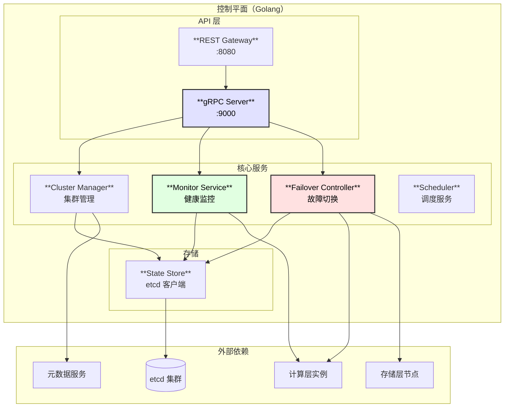
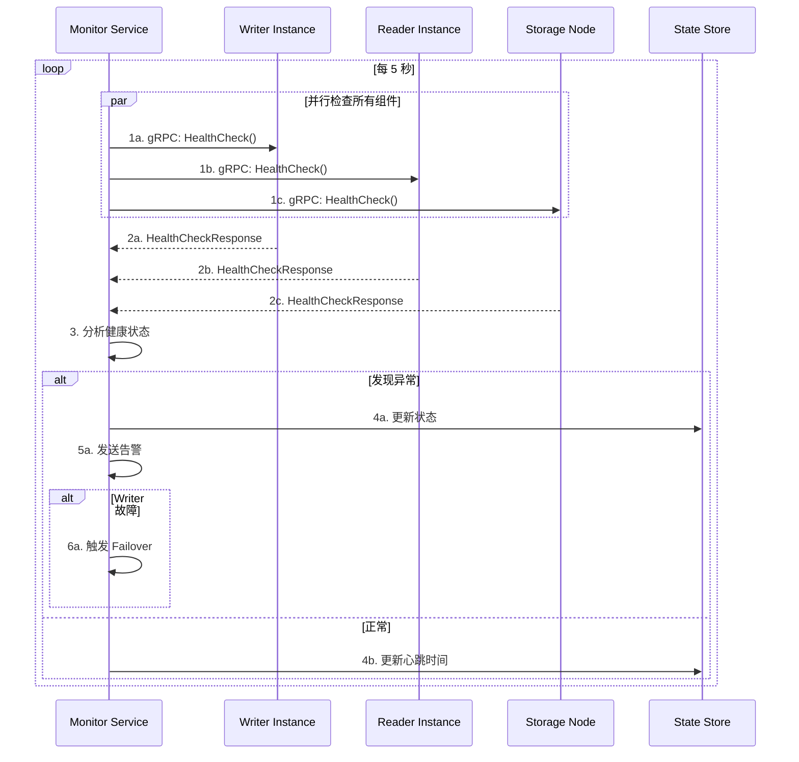
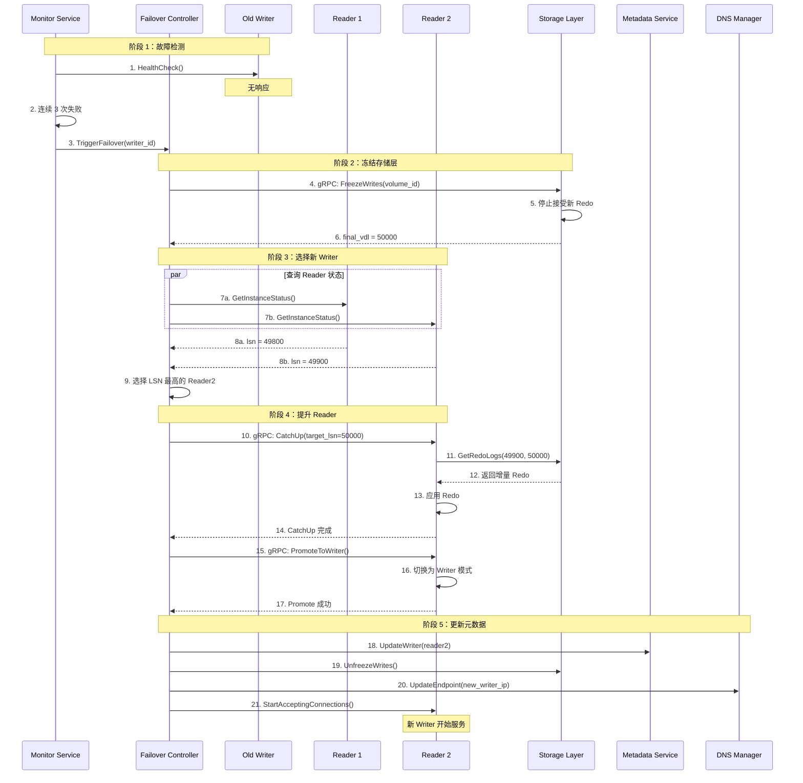
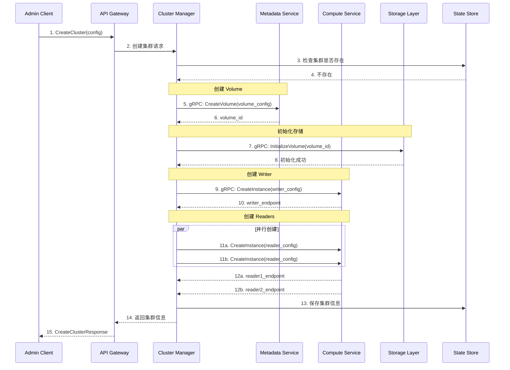
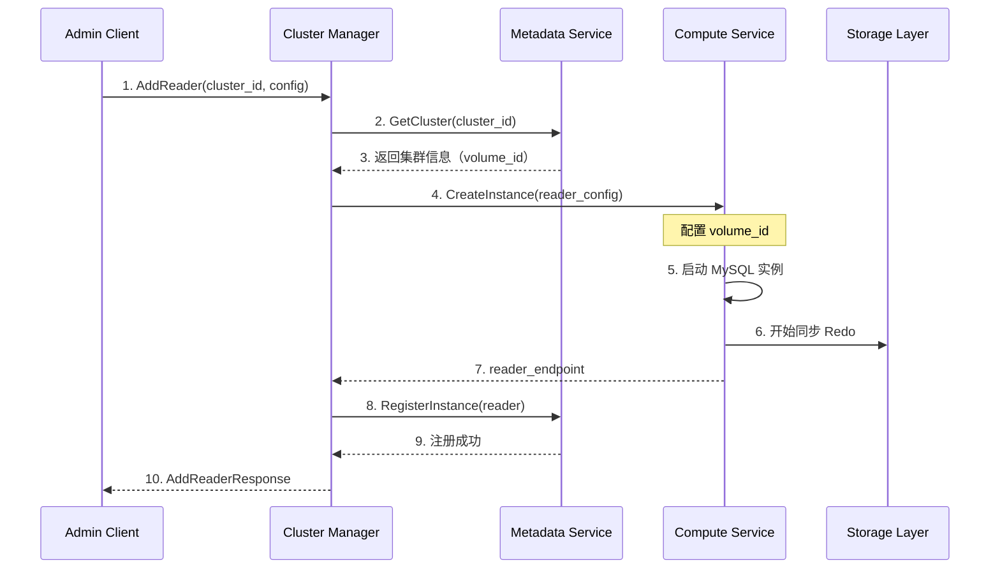

# 控制平面设计文档

## 1. 模块概述

控制平面使用 **Golang** 开发，负责集群管理、监控和故障切换。

### 1.1 核心职责

| 职责 | 说明 |
|------|------|
| 集群管理 | 实例创建、删除、配置变更 |
| 健康监控 | 实时监控所有组件状态 |
| 故障切换 | 检测故障并自动切换 Writer |
| 调度服务 | Reader 分配、负载均衡 |
| API 网关 | 提供管理 API |

### 1.2 模块架构图



---

## 2. 内部时序图

### 2.1 健康检查流程



### 2.2 故障切换完整流程



### 2.3 创建集群流程



### 2.4 添加 Reader 流程



---

## 3. 核心组件设计

### 3.1 Failover Controller

```go
// internal/failover/controller.go

type FailoverController struct {
    computeClient  ComputeServiceClient
    storageClient  StorageServiceClient
    metadataClient MetadataServiceClient
    stateStore     StateStore
}

type FailoverContext struct {
    FailoverID   string
    ClusterID    string
    OldWriterID  string
    NewWriterID  string
    FinalVDL     int64
    State        FailoverState
    StartTime    time.Time
}

// 执行 Failover
func (c *FailoverController) ExecuteFailover(ctx context.Context, clusterID, oldWriterID string) (*FailoverContext, error) {
    fo := &FailoverContext{
        FailoverID:  generateID(),
        ClusterID:   clusterID,
        OldWriterID: oldWriterID,
        State:       StateStarted,
        StartTime:   time.Now(),
    }
    
    // 1. 冻结存储层
    finalVDL, err := c.freezeStorage(ctx, clusterID)
    if err != nil {
        return nil, err
    }
    fo.FinalVDL = finalVDL
    fo.State = StateFrozen
    
    // 2. 选择新 Writer
    newWriter, err := c.selectNewWriter(ctx, clusterID, finalVDL)
    if err != nil {
        c.unfreezeStorage(ctx, clusterID)
        return nil, err
    }
    fo.NewWriterID = newWriter
    
    // 3. 提升 Reader
    if err := c.promoteReader(ctx, newWriter, finalVDL); err != nil {
        c.unfreezeStorage(ctx, clusterID)
        return nil, err
    }
    fo.State = StatePromoted
    
    // 4. 更新元数据
    if err := c.updateMetadata(ctx, fo); err != nil {
        return nil, err
    }
    
    // 5. 解冻存储层
    c.unfreezeStorage(ctx, clusterID)
    
    // 6. 更新 DNS
    c.updateDNS(ctx, fo)
    
    fo.State = StateCompleted
    return fo, nil
}

// 选择新 Writer
func (c *FailoverController) selectNewWriter(ctx context.Context, clusterID string, targetVDL int64) (string, error) {
    readers := c.getClusterReaders(ctx, clusterID)
    
    var bestReader string
    var bestLSN int64 = -1
    
    for _, reader := range readers {
        status, err := c.computeClient.GetInstanceStatus(ctx, reader)
        if err != nil {
            continue
        }
        if status.IsHealthy && status.CurrentLsn > bestLSN {
            bestLSN = status.CurrentLsn
            bestReader = reader
        }
    }
    
    if bestReader == "" {
        return "", ErrNoHealthyReader
    }
    return bestReader, nil
}
```

### 3.2 Monitor Service

```go
// internal/monitor/service.go

type MonitorService struct {
    computeClient ComputeServiceClient
    storageClient StorageServiceClient
    failover      *FailoverController
    
    instances     map[string]*InstanceHealth
    mu            sync.RWMutex
}

type InstanceHealth struct {
    InstanceID       string
    IsHealthy        bool
    ConsecutiveFails int
    LastCheck        time.Time
    CurrentLSN       int64
}

// 启动监控
func (s *MonitorService) Start(ctx context.Context) {
    ticker := time.NewTicker(5 * time.Second)
    defer ticker.Stop()
    
    for {
        select {
        case <-ctx.Done():
            return
        case <-ticker.C:
            s.checkAll(ctx)
        }
    }
}

// 检查所有实例
func (s *MonitorService) checkAll(ctx context.Context) {
    s.mu.RLock()
    instances := s.getInstances()
    s.mu.RUnlock()
    
    for _, inst := range instances {
        go s.checkInstance(ctx, inst)
    }
}

// 检查单个实例
func (s *MonitorService) checkInstance(ctx context.Context, inst *InstanceHealth) {
    resp, err := s.computeClient.HealthCheck(ctx, &pb.HealthCheckRequest{
        InstanceId: inst.InstanceID,
    })
    
    s.mu.Lock()
    defer s.mu.Unlock()
    
    if err != nil || !resp.IsHealthy {
        inst.ConsecutiveFails++
        if inst.ConsecutiveFails >= 3 && inst.IsHealthy {
            inst.IsHealthy = false
            // 触发告警或 Failover
            if inst.Role == RoleWriter {
                go s.failover.TriggerFailover(inst.InstanceID)
            }
        }
    } else {
        inst.ConsecutiveFails = 0
        inst.IsHealthy = true
        inst.CurrentLSN = resp.CurrentLsn
    }
    inst.LastCheck = time.Now()
}
```

### 3.3 Cluster Manager

```go
// internal/cluster/manager.go

type ClusterManager struct {
    metadataClient MetadataServiceClient
    computeClient  ComputeServiceClient
    storageClient  StorageServiceClient
    stateStore     StateStore
}

// 创建集群
func (m *ClusterManager) CreateCluster(ctx context.Context, req *CreateClusterRequest) (*ClusterInfo, error) {
    clusterID := generateClusterID()
    volumeID := generateVolumeID()
    
    // 1. 创建 Volume
    if err := m.createVolume(ctx, volumeID, req.AZs); err != nil {
        return nil, err
    }
    
    // 2. 初始化存储
    if err := m.initializeStorage(ctx, volumeID); err != nil {
        return nil, err
    }
    
    // 3. 创建 Writer
    writer, err := m.createInstance(ctx, clusterID, volumeID, RoleWriter, req.Config)
    if err != nil {
        return nil, err
    }
    
    // 4. 创建 Readers
    var readers []*InstanceInfo
    for i := 0; i < req.ReaderCount; i++ {
        reader, err := m.createInstance(ctx, clusterID, volumeID, RoleReader, req.Config)
        if err != nil {
            continue
        }
        readers = append(readers, reader)
    }
    
    // 5. 保存集群信息
    cluster := &ClusterInfo{
        ClusterID: clusterID,
        VolumeID:  volumeID,
        Writer:    writer,
        Readers:   readers,
        State:     ClusterStateAvailable,
    }
    m.stateStore.SaveCluster(ctx, cluster)
    
    return cluster, nil
}
```

---

## 4. gRPC 接口

### 4.1 Control Plane Service

```protobuf
service ClusterService {
    // 集群管理
    rpc CreateCluster(CreateClusterRequest) returns (CreateClusterResponse);
    rpc DeleteCluster(DeleteClusterRequest) returns (google.protobuf.Empty);
    rpc GetCluster(GetClusterRequest) returns (ClusterInfo);
    rpc ListClusters(ListClustersRequest) returns (ListClustersResponse);
    
    // 实例管理
    rpc AddReader(AddReaderRequest) returns (AddReaderResponse);
    rpc RemoveReader(RemoveReaderRequest) returns (google.protobuf.Empty);
}

service FailoverService {
    // 故障切换
    rpc TriggerFailover(TriggerFailoverRequest) returns (TriggerFailoverResponse);
    rpc GetFailoverStatus(GetFailoverStatusRequest) returns (FailoverStatus);
    rpc CancelFailover(CancelFailoverRequest) returns (google.protobuf.Empty);
}

service MonitorService {
    // 监控
    rpc GetClusterStatus(GetClusterStatusRequest) returns (ClusterStatus);
    rpc GetInstanceStatus(GetInstanceStatusRequest) returns (InstanceStatus);
    rpc SubscribeEvents(SubscribeEventsRequest) returns (stream ClusterEvent);
}

message CreateClusterRequest {
    string cluster_name = 1;
    string instance_class = 2;
    int32 reader_count = 3;
    repeated string availability_zones = 4;
}

message ClusterInfo {
    string cluster_id = 1;
    string cluster_name = 2;
    string volume_id = 3;
    InstanceInfo writer = 4;
    repeated InstanceInfo readers = 5;
    ClusterState state = 6;
}

message TriggerFailoverRequest {
    string cluster_id = 1;
    string target_instance_id = 2;  // 可选，指定提升的 Reader
}

message FailoverStatus {
    string failover_id = 1;
    FailoverState state = 2;
    string source_instance_id = 3;
    string target_instance_id = 4;
    int64 final_vdl = 5;
}
```

---

## 5. 配置参数

```yaml
server:
  grpc_port: 9000
  rest_port: 8080

etcd:
  endpoints:
    - etcd1:2379
    - etcd2:2379
    - etcd3:2379
  dial_timeout: 5s

monitor:
  check_interval: 5s
  timeout: 3s
  fail_threshold: 3

failover:
  freeze_timeout: 30s
  promote_timeout: 60s
  catchup_timeout: 30s

compute_client:
  timeout: 10s
  retry_count: 3

storage_client:
  timeout: 5s
  retry_count: 3
```

---

## 6. 监控指标

| 指标 | 类型 | 说明 |
|------|------|------|
| `control_plane_clusters_total` | Gauge | 集群总数 |
| `control_plane_instances_total` | Gauge | 实例总数 |
| `control_plane_failovers_total` | Counter | Failover 总数 |
| `control_plane_failover_duration_seconds` | Histogram | Failover 耗时 |
| `control_plane_health_check_failures_total` | Counter | 健康检查失败数 |
| `control_plane_api_requests_total` | Counter | API 请求总数 |
