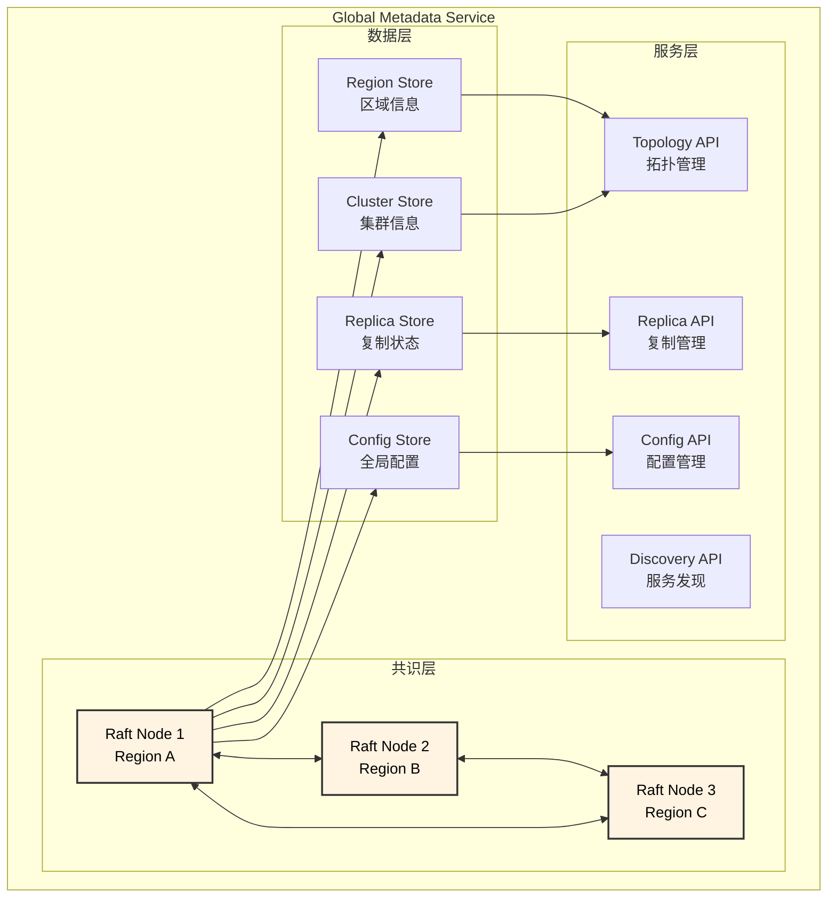
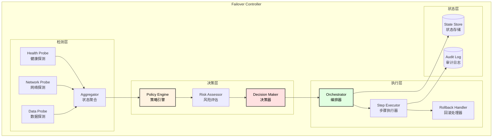
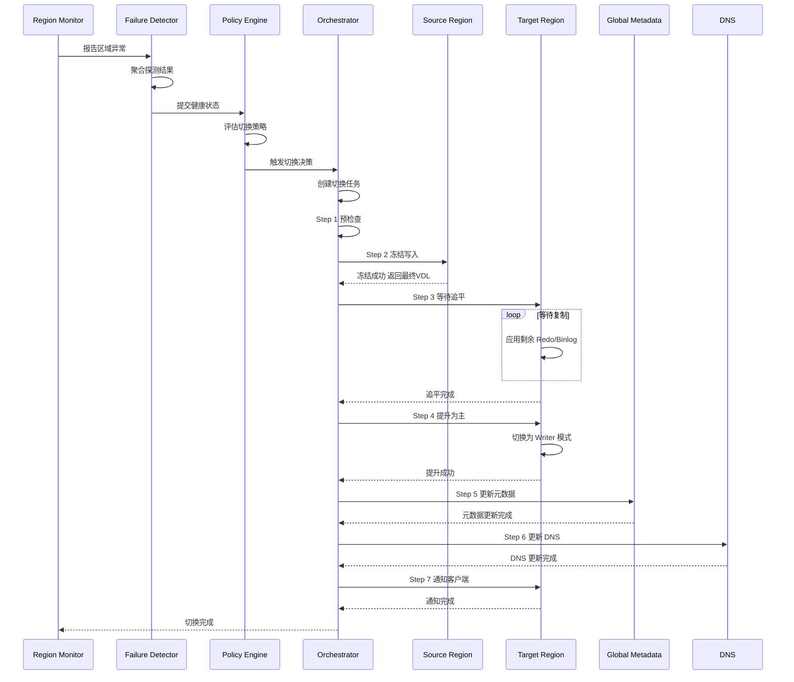
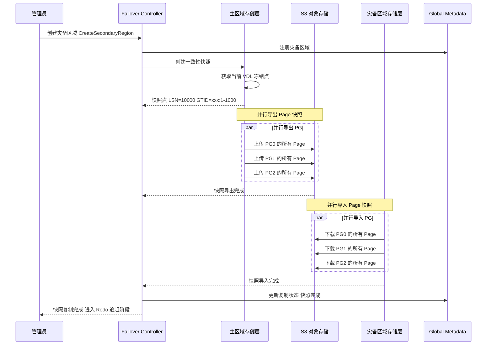
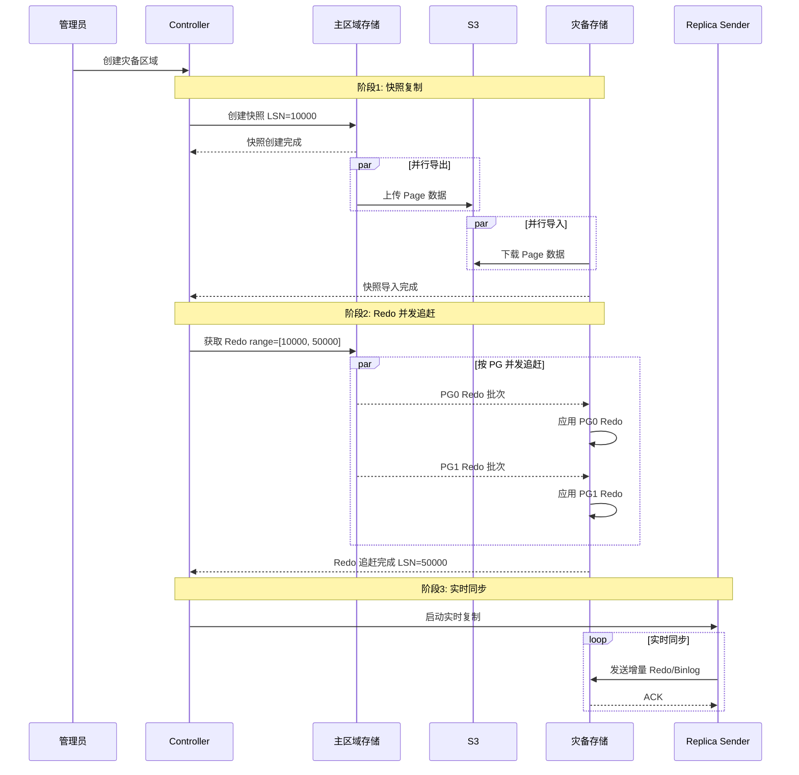
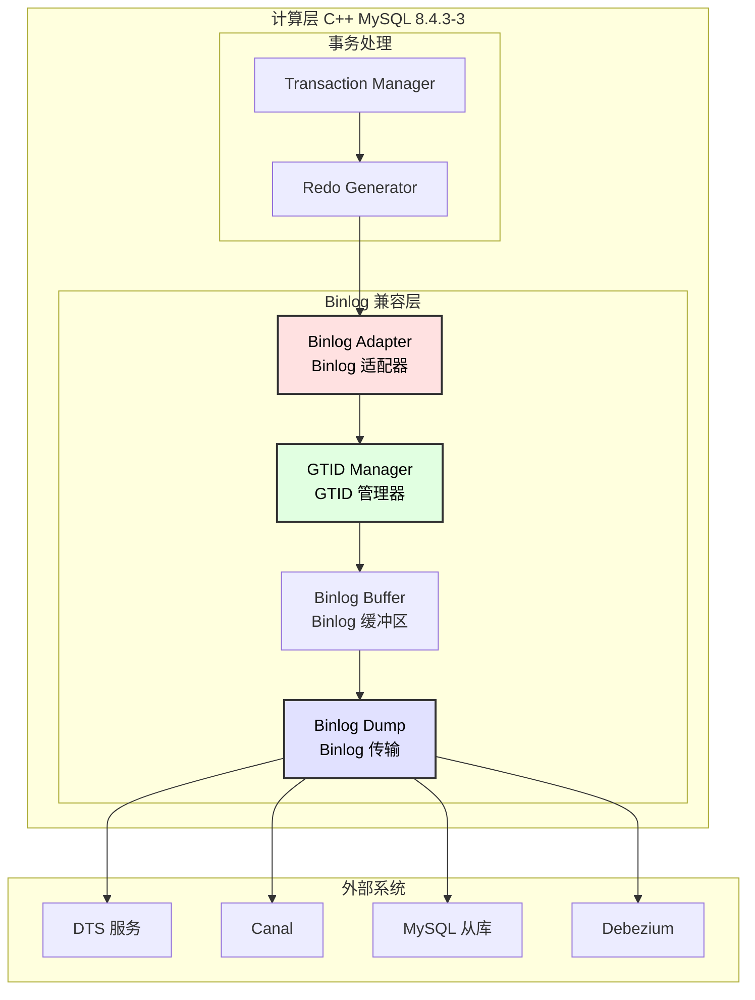

# 跨城容灾设计文档

## 1. 模块概述

跨城容灾（Cross-Region Disaster Recovery）模块负责实现跨地域的数据同步和容灾切换，保障业务在区域级故障时的高可用性。

### 1.1 设计目标

| 目标 | 指标 |
|------|------|
| RPO (Recovery Point Objective) | < 1 秒 |
| RTO (Recovery Time Objective) | < 30 秒 |
| 跨城带宽利用率 | > 90% |
| 同步延迟 | < 100ms（正常情况） |
| 新节点搭建时间 | < 30 分钟（物理复制） |

### 1.2 架构图

```mermaid
graph TB
    subgraph "主区域 Region A - 华东"
        subgraph "Primary Cluster"
            Writer_A[Writer Instance<br/>计算层]
            Reader_A1[Reader Instance 1]
            Reader_A2[Reader Instance 2]
        end
        
        subgraph "Storage Cluster A"
            SN_A1[Storage Node 1<br/>AZ-A]
            SN_A2[Storage Node 2<br/>AZ-A]
            SN_A3[Storage Node 3<br/>AZ-B]
            SN_A4[Storage Node 4<br/>AZ-B]
            SN_A5[Storage Node 5<br/>AZ-C]
            SN_A6[Storage Node 6<br/>AZ-C]
        end
        
        subgraph "Replication Components A"
            BinlogGen_A[Binlog Generator<br/>Binlog 生成器]
            ReplicaSender_A[Replica Sender<br/>跨域发送器]
            SnapshotExporter_A[Snapshot Exporter<br/>快照导出器]
        end
        
        Meta_A[Metadata Service<br/>元数据服务]
    end
    
    subgraph "灾备区域 Region B - 华南"
        subgraph "Secondary Cluster"
            Headless_B[Headless Writer<br/>无头写入节点]
            Reader_B1[Reader Instance 1<br/>只读]
            Reader_B2[Reader Instance 2<br/>只读]
        end
        
        subgraph "Storage Cluster B"
            SN_B1[Storage Node 1<br/>AZ-D]
            SN_B2[Storage Node 2<br/>AZ-D]
            SN_B3[Storage Node 3<br/>AZ-E]
            SN_B4[Storage Node 4<br/>AZ-E]
            SN_B5[Storage Node 5<br/>AZ-F]
            SN_B6[Storage Node 6<br/>AZ-F]
        end
        
        subgraph "Replication Components B"
            ReplicaReceiver_B[Replica Receiver<br/>跨域接收器]
            SnapshotImporter_B[Snapshot Importer<br/>快照导入器]
            RedoApplier_B[Redo Applier<br/>Redo 应用器]
        end
        
        Meta_B[Metadata Service<br/>元数据服务]
    end
    
    subgraph "全局控制平面"
        GlobalMeta[Global Metadata<br/>全局元数据服务]
        FailoverCtrl[Failover Controller<br/>容灾切换控制器]
        RegionMonitor[Region Monitor<br/>区域监控器]
        TopoManager[Topology Manager<br/>拓扑管理器]
    end
    
    Writer_A --> BinlogGen_A
    BinlogGen_A --> ReplicaSender_A
    SN_A1 --> SnapshotExporter_A
    
    ReplicaSender_A -->|Binlog 逻辑复制| ReplicaReceiver_B
    SnapshotExporter_A -->|快照 物理复制| SnapshotImporter_B
    ReplicaSender_A -->|Redo 物理复制| RedoApplier_B
    
    ReplicaReceiver_B --> Headless_B
    SnapshotImporter_B --> SN_B1
    RedoApplier_B --> SN_B1
    
    Meta_A --> GlobalMeta
    Meta_B --> GlobalMeta
    GlobalMeta --> FailoverCtrl
    GlobalMeta --> RegionMonitor
    GlobalMeta --> TopoManager
    
    FailoverCtrl --> Meta_A
    FailoverCtrl --> Meta_B
    
    style Writer_A fill:#ffe1e1,stroke:#333,stroke-width:2px,color:#000
    style Headless_B fill:#e1e1ff,stroke:#333,stroke-width:2px,color:#000
    style GlobalMeta fill:#fff3e1,stroke:#333,stroke-width:2px,color:#000
    style FailoverCtrl fill:#e1ffe1,stroke:#333,stroke-width:2px,color:#000
```



---

## 2. 全局控制平面设计

### 2.1 Global Metadata（全局元数据服务）

#### 2.1.1 模块职责

| 职责 | 说明 |
|------|------|
| 全局拓扑管理 | 维护所有区域、集群的拓扑信息 |
| 状态同步 | 跨区域元数据状态同步 |
| 一致性保证 | 分布式一致性协议（跨区域 Raft） |
| 服务发现 | 各区域服务端点注册与发现 |
| 配置分发 | 全局配置的统一管理和分发 |

#### 2.1.2 架构设计



#### 2.1.3 数据模型

```go
// global_metadata.go

// 区域信息
type Region struct {
    RegionID        string           `json:"region_id"`
    RegionName      string           `json:"region_name"`
    Role            RegionRole       `json:"role"`           // PRIMARY, SECONDARY, STANDBY
    Status          RegionStatus     `json:"status"`         // ACTIVE, DEGRADED, OFFLINE
    Endpoint        string           `json:"endpoint"`
    Clusters        []string         `json:"clusters"`
    NetworkConfig   *NetworkConfig   `json:"network_config"`
    LastHeartbeat   time.Time        `json:"last_heartbeat"`
    CreatedAt       time.Time        `json:"created_at"`
    UpdatedAt       time.Time        `json:"updated_at"`
}

type RegionRole string
const (
    REGION_PRIMARY   RegionRole = "PRIMARY"
    REGION_SECONDARY RegionRole = "SECONDARY"
    REGION_STANDBY   RegionRole = "STANDBY"
)

type RegionStatus string
const (
    REGION_ACTIVE   RegionStatus = "ACTIVE"
    REGION_DEGRADED RegionStatus = "DEGRADED"
    REGION_OFFLINE  RegionStatus = "OFFLINE"
)

// 集群信息
type GlobalCluster struct {
    ClusterID       string                    `json:"cluster_id"`
    ClusterName     string                    `json:"cluster_name"`
    PrimaryRegion   string                    `json:"primary_region"`
    Regions         map[string]*RegionCluster `json:"regions"`
    ReplicationType ReplicationType           `json:"replication_type"`
    GlobalVDL       uint64                    `json:"global_vdl"`
    LastFailover    *FailoverRecord           `json:"last_failover"`
    CreatedAt       time.Time                 `json:"created_at"`
}

type RegionCluster struct {
    RegionID        string                    `json:"region_id"`
    VolumeID        string                    `json:"volume_id"`
    Role            ClusterRole               `json:"role"`
    CurrentLSN      uint64                    `json:"current_lsn"`
    AppliedGTID     string                    `json:"applied_gtid"`
    LagSeconds      int64                     `json:"lag_seconds"`
    Status          ClusterStatus             `json:"status"`
}

type ReplicationType string
const (
    REPLICATION_LOGICAL  ReplicationType = "LOGICAL"   // Binlog
    REPLICATION_PHYSICAL ReplicationType = "PHYSICAL"  // Redo
    REPLICATION_HYBRID   ReplicationType = "HYBRID"    // 快照 + Redo
)

// 复制拓扑
type ReplicationTopology struct {
    TopologyID      string                    `json:"topology_id"`
    SourceRegion    string                    `json:"source_region"`
    TargetRegion    string                    `json:"target_region"`
    ReplicationType ReplicationType           `json:"replication_type"`
    Status          ReplicationStatus         `json:"status"`
    SourcePosition  *ReplicationPosition      `json:"source_position"`
    TargetPosition  *ReplicationPosition      `json:"target_position"`
    LagBytes        int64                     `json:"lag_bytes"`
    LagSeconds      int64                     `json:"lag_seconds"`
    Bandwidth       int64                     `json:"bandwidth_bytes_per_sec"`
}

type ReplicationPosition struct {
    LSN      uint64 `json:"lsn"`
    GTID     string `json:"gtid"`
    BinlogFile string `json:"binlog_file"`
    BinlogPos  uint64 `json:"binlog_pos"`
    Timestamp time.Time `json:"timestamp"`
}
```

#### 2.1.4 核心接口

```go
// global_metadata_service.go

type GlobalMetadataService interface {
    // 区域管理
    RegisterRegion(ctx context.Context, region *Region) error
    UpdateRegionStatus(ctx context.Context, regionID string, status RegionStatus) error
    GetRegion(ctx context.Context, regionID string) (*Region, error)
    ListRegions(ctx context.Context) ([]*Region, error)
    
    // 集群管理
    CreateGlobalCluster(ctx context.Context, cluster *GlobalCluster) error
    AddRegionToCluster(ctx context.Context, clusterID, regionID string) error
    RemoveRegionFromCluster(ctx context.Context, clusterID, regionID string) error
    GetGlobalCluster(ctx context.Context, clusterID string) (*GlobalCluster, error)
    
    // 复制拓扑管理
    CreateReplicationTopology(ctx context.Context, topo *ReplicationTopology) error
    UpdateReplicationPosition(ctx context.Context, topoID string, pos *ReplicationPosition) error
    GetReplicationTopology(ctx context.Context, topoID string) (*ReplicationTopology, error)
    
    // 主区域管理
    SetPrimaryRegion(ctx context.Context, clusterID, regionID string) error
    GetPrimaryRegion(ctx context.Context, clusterID string) (string, error)
    
    // 服务发现
    RegisterService(ctx context.Context, service *ServiceEndpoint) error
    DiscoverService(ctx context.Context, serviceType string, regionID string) ([]*ServiceEndpoint, error)
    
    // 配置管理
    SetGlobalConfig(ctx context.Context, key string, value []byte) error
    GetGlobalConfig(ctx context.Context, key string) ([]byte, error)
    WatchGlobalConfig(ctx context.Context, key string) (<-chan []byte, error)
}

type ServiceEndpoint struct {
    ServiceID   string
    ServiceType string  // "storage", "metadata", "compute", "replica"
    RegionID    string
    Endpoint    string
    Weight      int
    Healthy     bool
}
```

#### 2.1.5 跨区域 Raft 共识

```go
// cross_region_raft.go

type CrossRegionRaft struct {
    nodeID          string
    regionID        string
    peers           map[string]*RaftPeer  // regionID -> peer
    raft            *raft.Raft
    transport       *CrossRegionTransport
    fsm             *GlobalMetadataFSM
}

type RaftPeer struct {
    NodeID    string
    RegionID  string
    Address   string
    RTT       time.Duration  // 跨区域 RTT
}

// 跨区域传输层 - 处理高延迟
type CrossRegionTransport struct {
    localAddr       string
    peers           map[string]*grpc.ClientConn
    heartbeatChan   chan raft.RPC
    appendChan      chan raft.RPC
    timeout         time.Duration
    maxRetries      int
}

func (t *CrossRegionTransport) AppendEntries(
    id raft.ServerID,
    target raft.ServerAddress,
    args *raft.AppendEntriesRequest,
    resp *raft.AppendEntriesResponse,
) error {
    // 跨区域 append entries，使用更长的超时
    ctx, cancel := context.WithTimeout(context.Background(), t.timeout)
    defer cancel()
    
    conn := t.peers[string(target)]
    client := pb.NewRaftServiceClient(conn)
    
    result, err := client.AppendEntries(ctx, toPBAppendEntries(args))
    if err != nil {
        return err
    }
    
    fromPBAppendEntriesResponse(result, resp)
    return nil
}

// 配置优化 - 适应跨区域高延迟
func NewCrossRegionRaftConfig() *raft.Config {
    return &raft.Config{
        HeartbeatTimeout:   time.Second * 5,    // 跨区域心跳超时
        ElectionTimeout:    time.Second * 15,   // 跨区域选举超时
        CommitTimeout:      time.Second * 10,   // 跨区域提交超时
        MaxAppendEntries:   256,
        BatchApplyCh:       true,
        TrailingLogs:       10240,
    }
}
```

---

### 2.2 Failover Controller（容灾切换控制器）

#### 2.2.1 模块职责

| 职责 | 说明 |
|------|------|
| 故障检测 | 多维度检测区域/集群故障 |
| 切换决策 | 基于策略的自动/手动切换决策 |
| 切换编排 | 编排切换过程中的各步骤 |
| 数据保护 | 确保切换过程数据不丢失 |
| 回滚支持 | 支持切换失败后的回滚 |

#### 2.2.2 架构设计



#### 2.2.3 故障检测机制

```go
// failure_detector.go

type FailureDetector struct {
    globalMeta    GlobalMetadataService
    probes        map[string]Probe
    aggregator    *StatusAggregator
    thresholds    *FailureThresholds
}

type Probe interface {
    Name() string
    Check(ctx context.Context, regionID string) (*ProbeResult, error)
    Interval() time.Duration
}

type ProbeResult struct {
    Timestamp   time.Time
    Healthy     bool
    Latency     time.Duration
    ErrorCode   string
    ErrorMsg    string
    Metrics     map[string]float64
}

// 健康探测
type HealthProbe struct {
    client MetadataServiceClient
}

func (p *HealthProbe) Check(ctx context.Context, regionID string) (*ProbeResult, error) {
    start := time.Now()
    
    resp, err := p.client.HealthCheck(ctx, &HealthCheckRequest{
        RegionID: regionID,
    })
    
    return &ProbeResult{
        Timestamp: time.Now(),
        Healthy:   err == nil && resp.Status == "healthy",
        Latency:   time.Since(start),
        ErrorMsg:  getErrorMsg(err),
        Metrics: map[string]float64{
            "cpu_usage":    resp.CpuUsage,
            "memory_usage": resp.MemoryUsage,
            "disk_usage":   resp.DiskUsage,
        },
    }, nil
}

// 网络探测
type NetworkProbe struct {
    endpoints map[string]string
}

func (p *NetworkProbe) Check(ctx context.Context, regionID string) (*ProbeResult, error) {
    endpoint := p.endpoints[regionID]
    
    // 多路径探测
    results := make([]*ProbeResult, 0)
    for i := 0; i < 3; i++ {
        start := time.Now()
        conn, err := net.DialTimeout("tcp", endpoint, time.Second*5)
        if err == nil {
            conn.Close()
            results = append(results, &ProbeResult{
                Healthy: true,
                Latency: time.Since(start),
            })
        } else {
            results = append(results, &ProbeResult{
                Healthy: false,
                ErrorMsg: err.Error(),
            })
        }
    }
    
    // 聚合结果 - 2/3 成功即健康
    healthyCount := 0
    var totalLatency time.Duration
    for _, r := range results {
        if r.Healthy {
            healthyCount++
            totalLatency += r.Latency
        }
    }
    
    return &ProbeResult{
        Timestamp: time.Now(),
        Healthy:   healthyCount >= 2,
        Latency:   totalLatency / time.Duration(healthyCount),
    }, nil
}

// 数据探测 - 检查复制延迟
type DataProbe struct {
    globalMeta GlobalMetadataService
}

func (p *DataProbe) Check(ctx context.Context, regionID string) (*ProbeResult, error) {
    topo, err := p.globalMeta.GetReplicationTopology(ctx, regionID)
    if err != nil {
        return nil, err
    }
    
    lagSeconds := topo.LagSeconds
    lagBytes := topo.LagBytes
    
    return &ProbeResult{
        Timestamp: time.Now(),
        Healthy:   lagSeconds < 10, // 延迟小于 10 秒认为健康
        Metrics: map[string]float64{
            "lag_seconds": float64(lagSeconds),
            "lag_bytes":   float64(lagBytes),
        },
    }, nil
}

// 状态聚合
type StatusAggregator struct {
    history     map[string][]*ProbeResult
    historySize int
    thresholds  *FailureThresholds
}

type FailureThresholds struct {
    ConsecutiveFailures int           // 连续失败次数
    FailureWindow       time.Duration // 失败窗口
    FailureRatio        float64       // 失败比例
    LagThreshold        time.Duration // 延迟阈值
}

func (a *StatusAggregator) Aggregate(regionID string) *RegionHealth {
    results := a.history[regionID]
    
    // 计算最近窗口内的失败比例
    windowStart := time.Now().Add(-a.thresholds.FailureWindow)
    var failures, total int
    for _, r := range results {
        if r.Timestamp.After(windowStart) {
            total++
            if !r.Healthy {
                failures++
            }
        }
    }
    
    failureRatio := float64(failures) / float64(total)
    
    // 计算连续失败次数
    consecutiveFailures := 0
    for i := len(results) - 1; i >= 0; i-- {
        if !results[i].Healthy {
            consecutiveFailures++
        } else {
            break
        }
    }
    
    return &RegionHealth{
        RegionID:            regionID,
        Healthy:             failureRatio < a.thresholds.FailureRatio,
        FailureRatio:        failureRatio,
        ConsecutiveFailures: consecutiveFailures,
        LastCheck:           results[len(results)-1].Timestamp,
    }
}
```

#### 2.2.4 切换策略引擎

```go
// failover_policy.go

type FailoverPolicy struct {
    PolicyID     string
    PolicyName   string
    TriggerType  TriggerType
    Conditions   []FailoverCondition
    Actions      []FailoverAction
    Priority     int
    Enabled      bool
}

type TriggerType string
const (
    TRIGGER_AUTOMATIC TriggerType = "AUTOMATIC"
    TRIGGER_MANUAL    TriggerType = "MANUAL"
    TRIGGER_SCHEDULED TriggerType = "SCHEDULED"
)

type FailoverCondition struct {
    Type      ConditionType
    Operator  string
    Value     interface{}
    Duration  time.Duration
}

type ConditionType string
const (
    CONDITION_REGION_OFFLINE      ConditionType = "REGION_OFFLINE"
    CONDITION_REPLICATION_LAG     ConditionType = "REPLICATION_LAG"
    CONDITION_NETWORK_PARTITION   ConditionType = "NETWORK_PARTITION"
    CONDITION_STORAGE_FAILURE     ConditionType = "STORAGE_FAILURE"
    CONDITION_COMPUTE_FAILURE     ConditionType = "COMPUTE_FAILURE"
)

type FailoverAction struct {
    Type       ActionType
    Parameters map[string]interface{}
    Timeout    time.Duration
    Retries    int
}

type ActionType string
const (
    ACTION_PROMOTE_SECONDARY   ActionType = "PROMOTE_SECONDARY"
    ACTION_FREEZE_SOURCE       ActionType = "FREEZE_SOURCE"
    ACTION_UPDATE_DNS          ActionType = "UPDATE_DNS"
    ACTION_NOTIFY_CLIENTS      ActionType = "NOTIFY_CLIENTS"
    ACTION_SYNC_METADATA       ActionType = "SYNC_METADATA"
)

// 策略引擎
type PolicyEngine struct {
    policies   []*FailoverPolicy
    globalMeta GlobalMetadataService
}

func (e *PolicyEngine) Evaluate(health *RegionHealth) (*FailoverDecision, error) {
    for _, policy := range e.policies {
        if !policy.Enabled {
            continue
        }
        
        matched := true
        for _, condition := range policy.Conditions {
            if !e.evaluateCondition(condition, health) {
                matched = false
                break
            }
        }
        
        if matched {
            return &FailoverDecision{
                PolicyID:      policy.PolicyID,
                TriggerType:   policy.TriggerType,
                Actions:       policy.Actions,
                SourceRegion:  health.RegionID,
                TargetRegion:  e.selectTargetRegion(health.RegionID),
                DecisionTime:  time.Now(),
            }, nil
        }
    }
    
    return nil, nil // 没有匹配的策略
}

func (e *PolicyEngine) selectTargetRegion(sourceRegion string) string {
    // 选择最佳目标区域
    // 1. 优先选择 SECONDARY 角色
    // 2. 选择复制延迟最小的
    // 3. 选择健康状态最好的
    regions, _ := e.globalMeta.ListRegions(context.Background())
    
    var bestRegion *Region
    var minLag int64 = math.MaxInt64
    
    for _, region := range regions {
        if region.RegionID == sourceRegion {
            continue
        }
        if region.Status != REGION_ACTIVE {
            continue
        }
        if region.Role == REGION_SECONDARY {
            topo, _ := e.globalMeta.GetReplicationTopology(
                context.Background(), region.RegionID)
            if topo != nil && topo.LagSeconds < minLag {
                minLag = topo.LagSeconds
                bestRegion = region
            }
        }
    }
    
    if bestRegion != nil {
        return bestRegion.RegionID
    }
    return ""
}
```

#### 2.2.5 切换编排器

```go
// failover_orchestrator.go

type FailoverOrchestrator struct {
    globalMeta    GlobalMetadataService
    executor      *StepExecutor
    stateStore    StateStore
    auditLog      AuditLog
}

type FailoverTask struct {
    TaskID        string
    ClusterID     string
    SourceRegion  string
    TargetRegion  string
    Decision      *FailoverDecision
    State         FailoverState
    CurrentStep   int
    Steps         []*FailoverStep
    StartTime     time.Time
    EndTime       time.Time
    Error         string
}

type FailoverState string
const (
    FAILOVER_PENDING     FailoverState = "PENDING"
    FAILOVER_RUNNING     FailoverState = "RUNNING"
    FAILOVER_COMPLETED   FailoverState = "COMPLETED"
    FAILOVER_FAILED      FailoverState = "FAILED"
    FAILOVER_ROLLED_BACK FailoverState = "ROLLED_BACK"
)

type FailoverStep struct {
    StepID      string
    StepName    string
    Action      ActionType
    Parameters  map[string]interface{}
    State       StepState
    StartTime   time.Time
    EndTime     time.Time
    Error       string
    CanRollback bool
    RollbackFn  func(context.Context) error
}

func (o *FailoverOrchestrator) ExecuteFailover(
    ctx context.Context,
    decision *FailoverDecision,
) (*FailoverTask, error) {
    
    // 1. 创建切换任务
    task := &FailoverTask{
        TaskID:       generateTaskID(),
        SourceRegion: decision.SourceRegion,
        TargetRegion: decision.TargetRegion,
        Decision:     decision,
        State:        FAILOVER_PENDING,
        StartTime:    time.Now(),
    }
    
    // 2. 构建切换步骤
    task.Steps = o.buildFailoverSteps(decision)
    
    // 3. 保存任务状态
    o.stateStore.Save(task)
    
    // 4. 执行切换步骤
    task.State = FAILOVER_RUNNING
    for i, step := range task.Steps {
        task.CurrentStep = i
        o.stateStore.Save(task)
        
        if err := o.executor.Execute(ctx, step); err != nil {
            task.State = FAILOVER_FAILED
            task.Error = err.Error()
            
            // 5. 尝试回滚
            o.rollback(ctx, task, i)
            return task, err
        }
    }
    
    task.State = FAILOVER_COMPLETED
    task.EndTime = time.Now()
    o.stateStore.Save(task)
    
    return task, nil
}

func (o *FailoverOrchestrator) buildFailoverSteps(
    decision *FailoverDecision,
) []*FailoverStep {
    
    steps := []*FailoverStep{
        // Step 1: 预检查
        {
            StepID:   "pre-check",
            StepName: "Pre-Failover Check",
            Action:   "PRE_CHECK",
            Parameters: map[string]interface{}{
                "source_region": decision.SourceRegion,
                "target_region": decision.TargetRegion,
            },
        },
        // Step 2: 冻结源区域写入
        {
            StepID:   "freeze-source",
            StepName: "Freeze Source Region Writes",
            Action:   ACTION_FREEZE_SOURCE,
            Parameters: map[string]interface{}{
                "region_id": decision.SourceRegion,
            },
            CanRollback: true,
        },
        // Step 3: 等待复制追平
        {
            StepID:   "wait-sync",
            StepName: "Wait Replication Catch Up",
            Action:   "WAIT_SYNC",
            Parameters: map[string]interface{}{
                "source_region": decision.SourceRegion,
                "target_region": decision.TargetRegion,
                "timeout":       "60s",
            },
        },
        // Step 4: 提升目标区域
        {
            StepID:   "promote-target",
            StepName: "Promote Target Region to Primary",
            Action:   ACTION_PROMOTE_SECONDARY,
            Parameters: map[string]interface{}{
                "region_id": decision.TargetRegion,
            },
            CanRollback: true,
        },
        // Step 5: 更新元数据
        {
            StepID:   "update-metadata",
            StepName: "Update Global Metadata",
            Action:   ACTION_SYNC_METADATA,
            Parameters: map[string]interface{}{
                "new_primary": decision.TargetRegion,
            },
        },
        // Step 6: 更新 DNS
        {
            StepID:   "update-dns",
            StepName: "Update DNS Records",
            Action:   ACTION_UPDATE_DNS,
            Parameters: map[string]interface{}{
                "new_primary": decision.TargetRegion,
            },
            CanRollback: true,
        },
        // Step 7: 通知客户端
        {
            StepID:   "notify-clients",
            StepName: "Notify Clients",
            Action:   ACTION_NOTIFY_CLIENTS,
            Parameters: map[string]interface{}{
                "event": "FAILOVER_COMPLETED",
            },
        },
    }
    
    return steps
}

func (o *FailoverOrchestrator) rollback(
    ctx context.Context,
    task *FailoverTask,
    failedStep int,
) {
    // 从失败步骤往前回滚
    for i := failedStep - 1; i >= 0; i-- {
        step := task.Steps[i]
        if step.CanRollback && step.RollbackFn != nil {
            if err := step.RollbackFn(ctx); err != nil {
                o.auditLog.Log("rollback_failed", step.StepID, err)
            }
        }
    }
    task.State = FAILOVER_ROLLED_BACK
}
```

#### 2.2.6 切换时序图



---

## 3. 复制模式设计

### 3.1 复制模式对比

| 特性 | 逻辑复制 (Binlog) | 物理复制 (Redo) | 混合复制 (快照+Redo) |
|------|-------------------|-----------------|---------------------|
| **兼容性** | ✅ 高，支持异构 | ❌ 低，需要相同存储格式 | ✅ 高 |
| **搭建速度** | ❌ 慢，需要全量同步 | ✅ 快，直接复制物理文件 | ✅ 快，快照恢复 |
| **带宽效率** | ✅ 高，只传输变更 | ⚠️ 中等，包含物理元数据 | ⚠️ 中等 |
| **一致性** | ⚠️ 最终一致 | ✅ 强一致 | ✅ 强一致 |
| **运维复杂度** | ✅ 低 | ⚠️ 中等 | ⚠️ 中等 |

### 3.2 混合复制设计（快照 + Redo）

#### 3.2.1 设计原理

```
┌─────────────────────────────────────────────────────────────────────────────────┐
│                           混合复制架构                                           │
├─────────────────────────────────────────────────────────────────────────────────┤
│                                                                                  │
│  阶段 1: 快照复制（初始化）                                                      │
│  ┌────────────────────────────────────────────────────────────────────────┐     │
│  │  主区域                        灾备区域                                 │     │
│  │  ┌─────────┐                   ┌─────────┐                             │     │
│  │  │ Storage │  ──── 快照传输 ──→ │ Storage │                             │     │
│  │  │ (Page)  │       (S3/专线)    │ (Page)  │                             │     │
│  │  └─────────┘                   └─────────┘                             │     │
│  │                                                                         │     │
│  │  快照点: LSN = 10000, GTID = xxx:1-1000                                │     │
│  └────────────────────────────────────────────────────────────────────────┘     │
│                                                                                  │
│  阶段 2: Redo 追赶（快速同步）                                                   │
│  ┌────────────────────────────────────────────────────────────────────────┐     │
│  │  主区域                        灾备区域                                 │     │
│  │  ┌─────────┐                   ┌─────────┐                             │     │
│  │  │ Redo    │  ──── Redo 流 ──→ │ Redo    │                             │     │
│  │  │ Archive │      (高并发)      │ Applier │                             │     │
│  │  └─────────┘                   └─────────┘                             │     │
│  │                                                                         │     │
│  │  并发回放: 从 LSN=10000 追赶到 LSN=50000                                │     │
│  │  并发度: 按 PG 分区并行，16-64 个并发                                   │     │
│  └────────────────────────────────────────────────────────────────────────┘     │
│                                                                                  │
│  阶段 3: 实时同步（稳态）                                                        │
│  ┌────────────────────────────────────────────────────────────────────────┐     │
│  │  可选择 Binlog 逻辑复制 或 Redo 物理复制                                │     │
│  │                                                                         │     │
│  │  Binlog: 兼容 MySQL 生态，支持 DTS/Canal                                │     │
│  │  Redo:   延迟更低，一致性更强                                           │     │
│  └────────────────────────────────────────────────────────────────────────┘     │
│                                                                                  │
└─────────────────────────────────────────────────────────────────────────────────┘
```

#### 3.2.2 快照复制流程



#### 3.2.3 Redo 并发追赶

```go
// redo_catchup.go

type RedoCatchupManager struct {
    sourceClient   StorageServiceClient
    targetStorage  *StorageEngine
    parallelism    int
    batchSize      int
}

type CatchupTask struct {
    TaskID       string
    SourceRegion string
    TargetRegion string
    SnapshotLSN  uint64      // 快照点 LSN
    TargetLSN    uint64      // 目标 LSN
    CurrentLSN   uint64      // 当前进度
    PGProgress   map[uint32]*PGCatchupProgress
    State        CatchupState
}

type PGCatchupProgress struct {
    PGID       uint32
    StartLSN   uint64
    CurrentLSN uint64
    TargetLSN  uint64
    State      CatchupState
}

func (m *RedoCatchupManager) StartCatchup(
    ctx context.Context,
    snapshotLSN, targetLSN uint64,
) (*CatchupTask, error) {
    
    task := &CatchupTask{
        TaskID:      generateTaskID(),
        SnapshotLSN: snapshotLSN,
        TargetLSN:   targetLSN,
        CurrentLSN:  snapshotLSN,
        PGProgress:  make(map[uint32]*PGCatchupProgress),
        State:       CATCHUP_RUNNING,
    }
    
    // 获取所有 PG 列表
    pgList, err := m.sourceClient.ListProtectionGroups(ctx)
    if err != nil {
        return nil, err
    }
    
    // 初始化每个 PG 的进度
    for _, pg := range pgList {
        task.PGProgress[pg.PGID] = &PGCatchupProgress{
            PGID:       pg.PGID,
            StartLSN:   snapshotLSN,
            CurrentLSN: snapshotLSN,
            TargetLSN:  targetLSN,
            State:      CATCHUP_RUNNING,
        }
    }
    
    // 并发追赶
    var wg sync.WaitGroup
    sem := make(chan struct{}, m.parallelism)
    errChan := make(chan error, len(pgList))
    
    for _, pg := range pgList {
        wg.Add(1)
        sem <- struct{}{}
        
        go func(pgID uint32) {
            defer wg.Done()
            defer func() { <-sem }()
            
            if err := m.catchupPG(ctx, task, pgID); err != nil {
                errChan <- err
            }
        }(pg.PGID)
    }
    
    wg.Wait()
    close(errChan)
    
    // 检查错误
    for err := range errChan {
        if err != nil {
            task.State = CATCHUP_FAILED
            return task, err
        }
    }
    
    task.State = CATCHUP_COMPLETED
    task.CurrentLSN = targetLSN
    
    return task, nil
}

func (m *RedoCatchupManager) catchupPG(
    ctx context.Context,
    task *CatchupTask,
    pgID uint32,
) error {
    progress := task.PGProgress[pgID]
    
    for progress.CurrentLSN < progress.TargetLSN {
        // 批量获取 Redo
        resp, err := m.sourceClient.GetRedoLogs(ctx, &GetRedoLogsRequest{
            PGID:     pgID,
            FromLSN:  progress.CurrentLSN,
            ToLSN:    progress.TargetLSN,
            Limit:    int32(m.batchSize),
        })
        if err != nil {
            return err
        }
        
        if len(resp.RedoLogs) == 0 {
            break
        }
        
        // 批量应用 Redo
        for _, redo := range resp.RedoLogs {
            if err := m.targetStorage.ApplyRedo(ctx, redo); err != nil {
                return err
            }
        }
        
        // 更新进度
        progress.CurrentLSN = resp.RedoLogs[len(resp.RedoLogs)-1].LSN
    }
    
    progress.State = CATCHUP_COMPLETED
    return nil
}
```

#### 3.2.4 混合复制时序图



---

## 4. Binlog/GTID 兼容性设计

### 4.1 兼容性需求

| 需求 | 说明 |
|------|------|
| **MySQL 协议兼容** | 支持标准 MySQL Binlog 协议 |
| **GTID 支持** | 支持 MySQL GTID 模式 |
| **DTS 兼容** | 支持阿里云 DTS、AWS DMS 等工具 |
| **Canal 兼容** | 支持 Canal、Debezium 等 CDC 工具 |
| **MySQL 复制兼容** | 支持作为 MySQL 从库的主库 |

### 4.2 Binlog 兼容层设计



### 4.3 GTID 管理器设计

```cpp
// gtid_manager.h

class AuroraGTIDManager {
public:
    // GTID 格式: server_uuid:transaction_id
    // 例: 3E11FA47-71CA-11E1-9E33-C80AA9429562:1-1000
    
    struct GTID {
        uuid_t server_uuid;
        uint64_t gno;  // Global Transaction Number
    };
    
    struct GTIDSet {
        std::map<uuid_t, std::set<std::pair<uint64_t, uint64_t>>> intervals;
        
        void add(const GTID& gtid);
        bool contains(const GTID& gtid) const;
        std::string to_string() const;
        void parse(const std::string& str);
    };
    
    // 分配新的 GTID
    GTID allocate_gtid();
    
    // 获取当前 GTID 集合
    GTIDSet get_executed_gtid_set() const;
    
    // 持久化 GTID（与 LSN 一起）
    void persist_gtid(const GTID& gtid, uint64_t lsn);
    
    // LSN 到 GTID 的映射
    GTID lsn_to_gtid(uint64_t lsn) const;
    uint64_t gtid_to_lsn(const GTID& gtid) const;
    
private:
    uuid_t server_uuid_;
    std::atomic<uint64_t> next_gno_;
    std::map<uint64_t, GTID> lsn_gtid_map_;
    GTIDSet executed_gtid_set_;
    std::mutex mutex_;
};

// gtid_manager.cc

GTID AuroraGTIDManager::allocate_gtid() {
    GTID gtid;
    gtid.server_uuid = server_uuid_;
    gtid.gno = next_gno_.fetch_add(1);
    return gtid;
}

void AuroraGTIDManager::persist_gtid(const GTID& gtid, uint64_t lsn) {
    std::lock_guard<std::mutex> lock(mutex_);
    
    lsn_gtid_map_[lsn] = gtid;
    executed_gtid_set_.add(gtid);
    
    // 持久化到元数据存储
    // 这里可以异步批量持久化
}
```

### 4.4 Binlog 适配器设计

```cpp
// binlog_adapter.h

class BinlogAdapter {
public:
    // 从 Redo 记录生成 Binlog 事件
    std::vector<BinlogEvent*> convert_redo_to_binlog(
        const RedoRecord& redo,
        const GTID& gtid
    );
    
    // 生成 GTID 事件
    GTIDEvent* create_gtid_event(const GTID& gtid);
    
    // 生成表映射事件
    TableMapEvent* create_table_map_event(
        uint64_t table_id,
        const std::string& schema,
        const std::string& table,
        const ColumnDefinition* columns,
        size_t column_count
    );
    
    // 生成行事件
    RowsEvent* create_rows_event(
        EventType type,  // WRITE_ROWS, UPDATE_ROWS, DELETE_ROWS
        uint64_t table_id,
        const Row* before,
        const Row* after
    );

private:
    uint32_t server_id_;
    std::map<uint64_t, TableMapEvent*> table_cache_;
    AuroraGTIDManager* gtid_manager_;
};

// binlog_adapter.cc

std::vector<BinlogEvent*> BinlogAdapter::convert_redo_to_binlog(
    const RedoRecord& redo,
    const GTID& gtid
) {
    std::vector<BinlogEvent*> events;
    
    switch (redo.type) {
        case MLOG_REC_INSERT: {
            // 1. GTID 事件
            events.push_back(create_gtid_event(gtid));
            
            // 2. Query 事件 (BEGIN)
            events.push_back(create_query_event("BEGIN"));
            
            // 3. Table Map 事件
            auto table_info = get_table_info(redo.space_id, redo.page_id);
            events.push_back(create_table_map_event(
                table_info.table_id,
                table_info.schema,
                table_info.table,
                table_info.columns,
                table_info.column_count
            ));
            
            // 4. Write Rows 事件
            auto row = parse_insert_redo(redo);
            events.push_back(create_rows_event(
                WRITE_ROWS_EVENT,
                table_info.table_id,
                nullptr,
                &row
            ));
            
            break;
        }
        
        case MLOG_REC_UPDATE_IN_PLACE:
        case MLOG_REC_UPDATE: {
            events.push_back(create_gtid_event(gtid));
            events.push_back(create_query_event("BEGIN"));
            
            auto table_info = get_table_info(redo.space_id, redo.page_id);
            events.push_back(create_table_map_event(...));
            
            auto [before_row, after_row] = parse_update_redo(redo);
            events.push_back(create_rows_event(
                UPDATE_ROWS_EVENT,
                table_info.table_id,
                &before_row,
                &after_row
            ));
            
            break;
        }
        
        case MLOG_REC_DELETE:
        case MLOG_REC_CLUST_DELETE_MARK: {
            events.push_back(create_gtid_event(gtid));
            events.push_back(create_query_event("BEGIN"));
            
            auto table_info = get_table_info(redo.space_id, redo.page_id);
            events.push_back(create_table_map_event(...));
            
            auto row = parse_delete_redo(redo);
            events.push_back(create_rows_event(
                DELETE_ROWS_EVENT,
                table_info.table_id,
                &row,
                nullptr
            ));
            
            break;
        }
        
        case MLOG_TRX_COMMIT: {
            // XID 事件
            events.push_back(create_xid_event(redo.trx_id));
            break;
        }
        
        case MLOG_DDL_CREATE_TABLE:
        case MLOG_DDL_DROP_TABLE:
        case MLOG_DDL_ALTER_TABLE: {
            events.push_back(create_gtid_event(gtid));
            auto ddl_sql = parse_ddl_redo(redo);
            events.push_back(create_query_event(ddl_sql));
            break;
        }
    }
    
    return events;
}
```

### 4.5 Binlog Dump 协议实现

```cpp
// binlog_dump.h

class BinlogDumpHandler {
public:
    // 处理 COM_BINLOG_DUMP_GTID 命令
    void handle_dump_gtid(
        THD* thd,
        const GTIDSet& slave_gtid_set,
        uint32_t flags
    );
    
    // 处理 COM_BINLOG_DUMP 命令（传统模式）
    void handle_dump_pos(
        THD* thd,
        const std::string& binlog_file,
        uint64_t binlog_pos,
        uint32_t flags
    );

private:
    BinlogBuffer* binlog_buffer_;
    AuroraGTIDManager* gtid_manager_;
    
    // 发送 Binlog 事件
    void send_event(THD* thd, BinlogEvent* event);
    
    // 等待新事件
    bool wait_for_events(THD* thd, uint64_t timeout_ms);
};

// binlog_dump.cc

void BinlogDumpHandler::handle_dump_gtid(
    THD* thd,
    const GTIDSet& slave_gtid_set,
    uint32_t flags
) {
    // 计算需要发送的 GTID 差集
    GTIDSet executed = gtid_manager_->get_executed_gtid_set();
    GTIDSet to_send = executed.subtract(slave_gtid_set);
    
    // 找到对应的起始 LSN
    uint64_t start_lsn = 0;
    for (const auto& gtid : to_send) {
        uint64_t lsn = gtid_manager_->gtid_to_lsn(gtid);
        if (start_lsn == 0 || lsn < start_lsn) {
            start_lsn = lsn;
        }
    }
    
    // 发送 FDE（Format Description Event）
    send_event(thd, create_format_description_event());
    
    // 持续发送 Binlog 事件
    uint64_t current_lsn = start_lsn;
    while (!thd->killed) {
        // 从 Binlog Buffer 获取事件
        auto events = binlog_buffer_->get_events(current_lsn, 1000);
        
        if (events.empty()) {
            // 等待新事件
            if (!wait_for_events(thd, 1000)) {
                continue;
            }
            events = binlog_buffer_->get_events(current_lsn, 1000);
        }
        
        for (auto* event : events) {
            send_event(thd, event);
            current_lsn = event->lsn;
        }
        
        // 发送心跳
        if (flags & BINLOG_DUMP_NON_BLOCK) {
            send_event(thd, create_heartbeat_event());
        }
    }
}
```

### 4.6 配置更新

```ini
# aurora-mysql.cnf

[mysqld]
# ========== Aurora 核心配置 ==========
aurora_mode = ON
aurora_volume_id = vol-12345678
aurora_storage_nodes = storage1:9002,storage2:9002,...

# ========== Binlog 兼容配置 ==========
# 启用 Binlog 兼容层（不写本地文件，仅内存缓冲）
aurora_binlog_compat = ON
aurora_binlog_buffer_size = 256M

# 启用 GTID
gtid_mode = ON
enforce_gtid_consistency = ON

# Binlog 格式
binlog_format = ROW
binlog_row_image = FULL

# 虚拟 Binlog 文件（用于兼容性，不实际写入）
aurora_binlog_file_prefix = mysql-bin
aurora_binlog_file_size = 1073741824

# ========== 禁用本地存储 ==========
# 禁用本地 Redo（发送到远程存储）
innodb_log_file_size = 0

# 禁用 Doublewrite
innodb_doublewrite = OFF

# ========== 复制相关 ==========
# 作为主库时的 server_id
server_id = 1

# 复制过滤
# replicate_ignore_db = mysql,information_schema,performance_schema
```

### 4.7 兼容性验证命令

```sql
-- 验证 GTID 状态
SHOW MASTER STATUS;
+------------------+----------+--------------+------------------------------------------+
| File             | Position | Binlog_Do_DB | Executed_Gtid_Set                        |
+------------------+----------+--------------+------------------------------------------+
| mysql-bin.000001 | 12345678 |              | 3E11FA47-71CA-11E1-9E33-C80AA9429562:1-1000 |
+------------------+----------+--------------+------------------------------------------+

-- 查看 GTID 变量
SHOW VARIABLES LIKE '%gtid%';
+----------------------------------+------------------------------------------+
| Variable_name                    | Value                                    |
+----------------------------------+------------------------------------------+
| gtid_mode                        | ON                                       |
| enforce_gtid_consistency         | ON                                       |
| gtid_executed                    | 3E11FA47-71CA-11E1-9E33-C80AA9429562:1-1000 |
| gtid_purged                      |                                          |
+----------------------------------+------------------------------------------+

-- 验证 Binlog 事件
SHOW BINLOG EVENTS IN 'mysql-bin.000001' LIMIT 10;
+------------------+-----+----------------+-----------+-------------+---------------------------------------+
| Log_name         | Pos | Event_type     | Server_id | End_log_pos | Info                                  |
+------------------+-----+----------------+-----------+-------------+---------------------------------------+
| mysql-bin.000001 | 4   | Format_desc    | 1         | 123         | Server ver: 8.4.3-3-Aurora            |
| mysql-bin.000001 | 123 | Gtid           | 1         | 194         | SET @@SESSION.GTID_NEXT= '...:1'      |
| mysql-bin.000001 | 194 | Query          | 1         | 270         | BEGIN                                 |
| mysql-bin.000001 | 270 | Table_map      | 1         | 325         | table_id: 123 (test.users)            |
| mysql-bin.000001 | 325 | Write_rows     | 1         | 380         | table_id: 123 flags: STMT_END_F       |
| mysql-bin.000001 | 380 | Xid            | 1         | 411         | COMMIT /* xid=100 */                  |
+------------------+-----+----------------+-----------+-------------+---------------------------------------+

-- 作为 MySQL 从库的主库
CHANGE MASTER TO 
    MASTER_HOST='aurora-cluster.example.com',
    MASTER_PORT=3306,
    MASTER_USER='repl',
    MASTER_PASSWORD='password',
    MASTER_AUTO_POSITION=1;  -- 使用 GTID 自动定位

START SLAVE;

-- 验证复制状态
SHOW SLAVE STATUS\G
```

---

## 5. gRPC 接口定义

```protobuf
// cross_region.proto

syntax = "proto3";
package aurora.crossregion;

// 全局元数据服务
service GlobalMetadataService {
    // 区域管理
    rpc RegisterRegion(RegisterRegionRequest) returns (RegisterRegionResponse);
    rpc UpdateRegionStatus(UpdateRegionStatusRequest) returns (UpdateRegionStatusResponse);
    rpc GetRegion(GetRegionRequest) returns (GetRegionResponse);
    rpc ListRegions(ListRegionsRequest) returns (ListRegionsResponse);
    
    // 集群管理
    rpc CreateGlobalCluster(CreateGlobalClusterRequest) returns (CreateGlobalClusterResponse);
    rpc AddRegionToCluster(AddRegionToClusterRequest) returns (AddRegionToClusterResponse);
    rpc GetGlobalCluster(GetGlobalClusterRequest) returns (GetGlobalClusterResponse);
    
    // 复制拓扑
    rpc CreateReplicationTopology(CreateReplicationTopologyRequest) returns (CreateReplicationTopologyResponse);
    rpc UpdateReplicationPosition(UpdateReplicationPositionRequest) returns (UpdateReplicationPositionResponse);
    rpc GetReplicationTopology(GetReplicationTopologyRequest) returns (GetReplicationTopologyResponse);
    
    // 主区域管理
    rpc SetPrimaryRegion(SetPrimaryRegionRequest) returns (SetPrimaryRegionResponse);
    rpc GetPrimaryRegion(GetPrimaryRegionRequest) returns (GetPrimaryRegionResponse);
}

// 容灾切换服务
service FailoverService {
    // 切换操作
    rpc TriggerFailover(TriggerFailoverRequest) returns (TriggerFailoverResponse);
    rpc GetFailoverTask(GetFailoverTaskRequest) returns (GetFailoverTaskResponse);
    rpc CancelFailover(CancelFailoverRequest) returns (CancelFailoverResponse);
    
    // 切换策略
    rpc CreateFailoverPolicy(CreateFailoverPolicyRequest) returns (CreateFailoverPolicyResponse);
    rpc UpdateFailoverPolicy(UpdateFailoverPolicyRequest) returns (UpdateFailoverPolicyResponse);
    rpc ListFailoverPolicies(ListFailoverPoliciesRequest) returns (ListFailoverPoliciesResponse);
    
    // 预演
    rpc SimulateFailover(SimulateFailoverRequest) returns (SimulateFailoverResponse);
}

// 复制服务
service ReplicationService {
    // Binlog 复制
    rpc ReplicateBinlog(ReplicateBinlogRequest) returns (ReplicateBinlogResponse);
    
    // Redo 复制
    rpc ReplicateRedo(ReplicateRedoRequest) returns (ReplicateRedoResponse);
    
    // 快照复制
    rpc CreateSnapshot(CreateSnapshotRequest) returns (CreateSnapshotResponse);
    rpc TransferSnapshot(stream TransferSnapshotRequest) returns (stream TransferSnapshotResponse);
    
    // Redo 追赶
    rpc StartCatchup(StartCatchupRequest) returns (StartCatchupResponse);
    rpc GetCatchupProgress(GetCatchupProgressRequest) returns (GetCatchupProgressResponse);
    
    // 状态查询
    rpc GetReplicationStatus(GetReplicationStatusRequest) returns (GetReplicationStatusResponse);
}

message RegisterRegionRequest {
    string region_id = 1;
    string region_name = 2;
    string endpoint = 3;
    RegionRole role = 4;
    NetworkConfig network_config = 5;
}

message RegionRole {
    enum Role {
        PRIMARY = 0;
        SECONDARY = 1;
        STANDBY = 2;
    }
}

message TriggerFailoverRequest {
    string cluster_id = 1;
    string source_region = 2;
    string target_region = 3;
    bool force = 4;
    string reason = 5;
    FailoverType type = 6;
}

enum FailoverType {
    FAILOVER_PLANNED = 0;    // 计划内切换
    FAILOVER_UNPLANNED = 1;  // 计划外切换（故障）
    FAILOVER_TEST = 2;       // 测试切换
}

message StartCatchupRequest {
    string source_region = 1;
    string target_region = 2;
    uint64 snapshot_lsn = 3;
    uint64 target_lsn = 4;
    int32 parallelism = 5;
    int32 batch_size = 6;
}

message GetCatchupProgressResponse {
    string task_id = 1;
    CatchupState state = 2;
    uint64 snapshot_lsn = 3;
    uint64 current_lsn = 4;
    uint64 target_lsn = 5;
    double progress_percent = 6;
    int64 eta_seconds = 7;
    repeated PGCatchupProgress pg_progress = 8;
}

enum CatchupState {
    CATCHUP_PENDING = 0;
    CATCHUP_RUNNING = 1;
    CATCHUP_COMPLETED = 2;
    CATCHUP_FAILED = 3;
}

message PGCatchupProgress {
    uint32 pg_id = 1;
    uint64 current_lsn = 2;
    uint64 target_lsn = 3;
    CatchupState state = 4;
}
```

---

## 6. 监控指标

| 指标 | 类型 | 说明 |
|------|------|------|
| `crossregion_replication_lag_seconds` | Gauge | 跨域复制延迟（秒） |
| `crossregion_replication_lag_bytes` | Gauge | 跨域复制延迟（字节） |
| `crossregion_binlog_sent_total` | Counter | 发送的 Binlog 事件数 |
| `crossregion_redo_sent_total` | Counter | 发送的 Redo 记录数 |
| `crossregion_network_latency_ms` | Histogram | 跨域网络延迟 |
| `crossregion_throughput_bytes_per_sec` | Gauge | 跨域同步吞吐量 |
| `crossregion_failover_total` | Counter | 容灾切换次数 |
| `crossregion_failover_duration_seconds` | Histogram | 容灾切换耗时 |
| `crossregion_catchup_progress_percent` | Gauge | Redo 追赶进度 |
| `crossregion_snapshot_transfer_bytes` | Counter | 快照传输字节数 |
| `global_metadata_raft_leader` | Gauge | Raft Leader 状态 |
| `global_metadata_raft_commit_latency` | Histogram | Raft 提交延迟 |

---

## 7. 配置示例

```yaml
# cross_region_config.yaml

global_metadata:
  nodes:
    - node_id: gm-1
      region_id: region-east
      address: gm1.east.example.com:9100
    - node_id: gm-2
      region_id: region-south
      address: gm2.south.example.com:9100
    - node_id: gm-3
      region_id: region-north
      address: gm3.north.example.com:9100
  raft:
    heartbeat_timeout: 5s
    election_timeout: 15s
    commit_timeout: 10s

failover:
  detector:
    health_check_interval: 1s
    network_check_interval: 5s
    data_check_interval: 10s
  thresholds:
    consecutive_failures: 3
    failure_window: 30s
    failure_ratio: 0.5
    lag_threshold: 10s
  policies:
    - policy_id: auto-failover
      trigger_type: AUTOMATIC
      enabled: true
      conditions:
        - type: REGION_OFFLINE
          duration: 30s
      actions:
        - type: PROMOTE_SECONDARY
          timeout: 60s

replication:
  mode: HYBRID  # LOGICAL, PHYSICAL, HYBRID
  binlog:
    enabled: true
    compression: lz4
    batch_size: 1000
  redo:
    enabled: true
    parallelism: 16
    batch_size: 10000
  snapshot:
    parallelism: 32
    chunk_size: 16MB

network:
  dedicated_line: true
  bandwidth_limit_mbps: 1000
  encryption:
    enabled: true
    algorithm: AES-256-GCM
