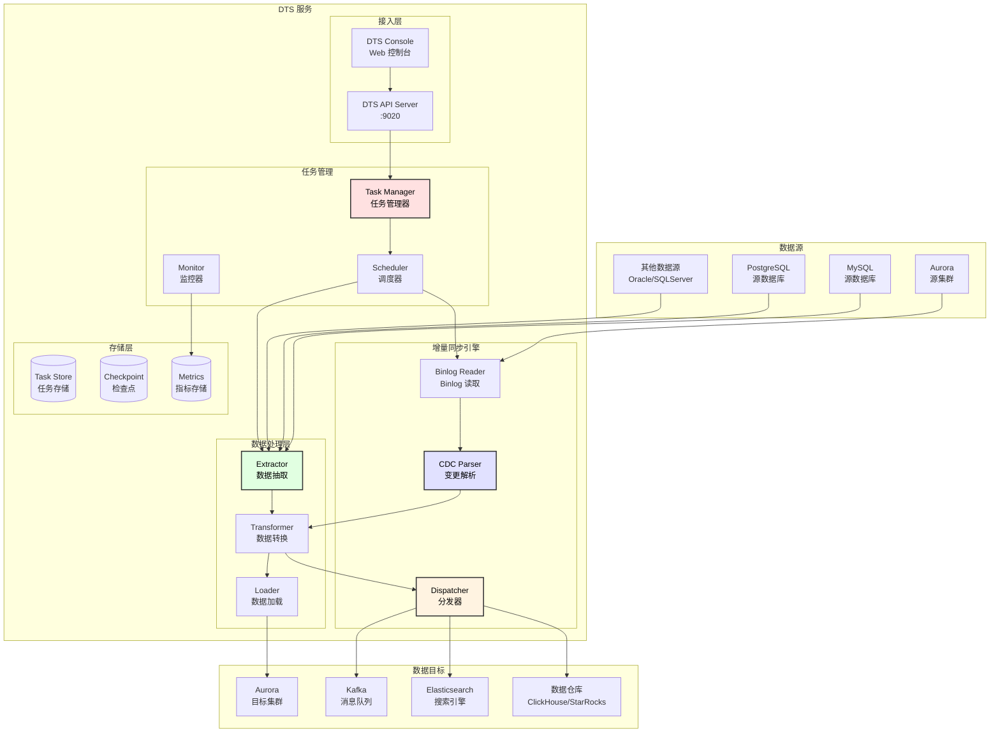
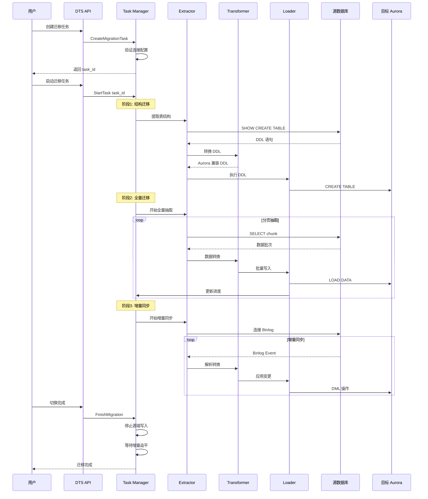
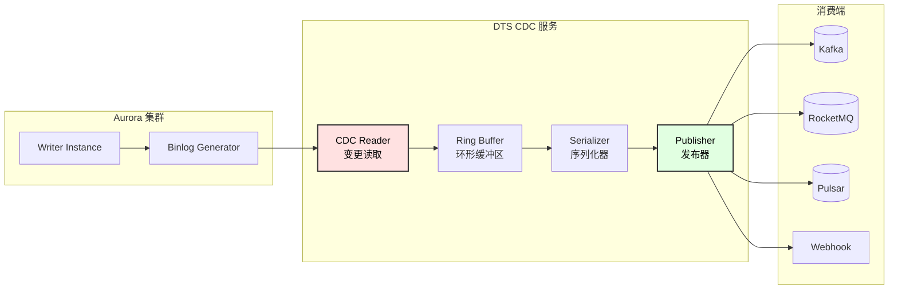
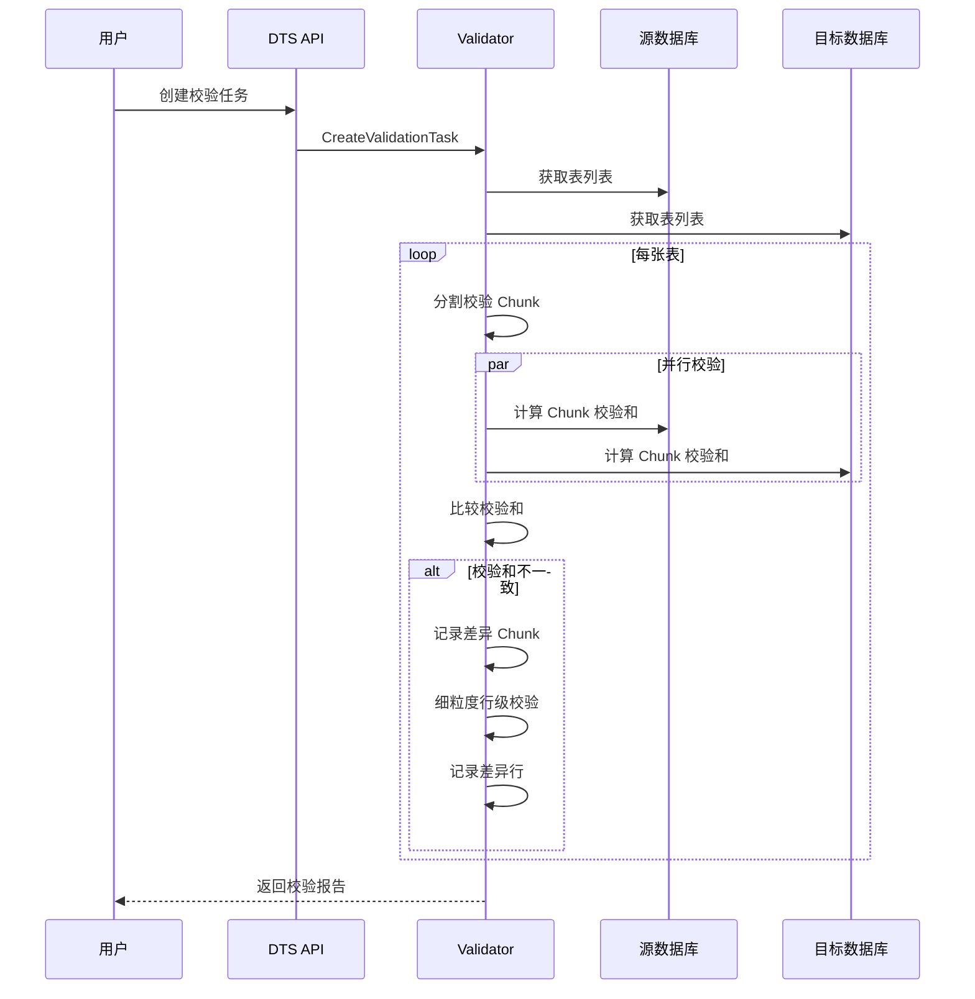

# 数据传输服务（DTS）设计文档

## 1. 模块概述

数据传输服务（Data Transmission Service, DTS）负责数据迁移、实时同步和数据订阅功能，支持 Aurora 与其他数据源之间的数据流转。

### 1.1 核心能力

| 能力 | 说明 |
|------|------|
| 数据迁移 | 全量 + 增量迁移，支持异构数据库 |
| 实时同步 | 低延迟双向同步 |
| 数据订阅 | CDC 变更数据捕获，推送到消息队列 |
| 数据校验 | 源端与目标端数据一致性校验 |

### 1.2 架构图



---

## 2. 数据迁移设计

### 2.1 迁移流程



### 2.2 全量迁移策略

```go
// full_migration.go

type FullMigrator struct {
    source      *sql.DB
    target      *sql.DB
    chunkSize   int
    parallelism int
    checkpoint  *CheckpointStore
}

type MigrationChunk struct {
    TableName    string
    StartPK      interface{}
    EndPK        interface{}
    RowCount     int64
    Status       ChunkStatus
}

func (m *FullMigrator) MigrateTable(table *TableSchema) error {
    // 1. 获取表的主键范围
    minPK, maxPK, totalRows := m.getTableRange(table)
    
    // 2. 分割成多个 Chunk
    chunks := m.splitIntoChunks(table, minPK, maxPK, totalRows)
    
    // 3. 保存 Checkpoint
    m.checkpoint.SaveChunks(table.Name, chunks)
    
    // 4. 并行迁移各个 Chunk
    var wg sync.WaitGroup
    sem := make(chan struct{}, m.parallelism)
    
    for _, chunk := range chunks {
        wg.Add(1)
        sem <- struct{}{}
        
        go func(c *MigrationChunk) {
            defer wg.Done()
            defer func() { <-sem }()
            
            m.migrateChunk(c)
            m.checkpoint.MarkChunkDone(c)
        }(chunk)
    }
    
    wg.Wait()
    return nil
}

func (m *FullMigrator) migrateChunk(chunk *MigrationChunk) error {
    // 构建查询
    query := fmt.Sprintf(
        "SELECT * FROM %s WHERE %s >= ? AND %s < ? ORDER BY %s",
        chunk.TableName, pkColumn, pkColumn, pkColumn,
    )
    
    rows, err := m.source.Query(query, chunk.StartPK, chunk.EndPK)
    if err != nil {
        return err
    }
    defer rows.Close()
    
    // 批量构建 INSERT 语句
    batch := NewBatch(m.chunkSize)
    for rows.Next() {
        row := scanRow(rows)
        batch.Add(row)
        
        if batch.IsFull() {
            m.loadBatch(chunk.TableName, batch)
            batch.Reset()
        }
    }
    
    // 处理剩余数据
    if !batch.IsEmpty() {
        m.loadBatch(chunk.TableName, batch)
    }
    
    return nil
}
```

---

## 3. 增量同步设计

### 3.1 Binlog 解析

```go
// binlog_parser.go

type BinlogParser struct {
    serverID   uint32
    host       string
    port       int
    username   string
    password   string
    gtidSet    GTIDSet
    eventChan  chan *BinlogEvent
}

func (p *BinlogParser) Start(ctx context.Context) error {
    // 连接 MySQL Binlog 流
    conn, err := replication.NewBinlogSyncer(replication.BinlogSyncerConfig{
        ServerID: p.serverID,
        Flavor:   "mysql",
        Host:     p.host,
        Port:     uint16(p.port),
        User:     p.username,
        Password: p.password,
    })
    if err != nil {
        return err
    }
    
    // 从 GTID 位置开始同步
    streamer, err := conn.StartSyncGTID(p.gtidSet)
    if err != nil {
        return err
    }
    
    for {
        select {
        case <-ctx.Done():
            return nil
        default:
            ev, err := streamer.GetEvent(ctx)
            if err != nil {
                return err
            }
            
            // 解析事件
            parsed := p.parseEvent(ev)
            if parsed != nil {
                p.eventChan <- parsed
            }
        }
    }
}

type ParsedEvent struct {
    GTID        GTID
    Timestamp   time.Time
    Schema      string
    Table       string
    EventType   EventType
    BeforeImage map[string]interface{}
    AfterImage  map[string]interface{}
    PrimaryKey  []interface{}
}

type EventType int

const (
    EVENT_INSERT EventType = iota
    EVENT_UPDATE
    EVENT_DELETE
    EVENT_DDL
)
```

### 3.2 数据转换

```go
// transformer.go

type Transformer struct {
    typeMapping  map[string]string
    columnMapping map[string]map[string]string
    filters      []FilterRule
    converters   []ConverterFunc
}

type FilterRule struct {
    Schema    string
    Table     string
    Condition string
    Action    FilterAction
}

type FilterAction int

const (
    FILTER_INCLUDE FilterAction = iota
    FILTER_EXCLUDE
)

func (t *Transformer) Transform(event *ParsedEvent) (*TransformedEvent, error) {
    // 1. 过滤检查
    if !t.shouldInclude(event) {
        return nil, nil
    }
    
    // 2. Schema/Table 映射
    targetSchema, targetTable := t.mapSchemaTable(event.Schema, event.Table)
    
    // 3. 列映射和类型转换
    beforeImage := t.transformColumns(event.Schema, event.Table, event.BeforeImage)
    afterImage := t.transformColumns(event.Schema, event.Table, event.AfterImage)
    
    // 4. 自定义转换
    for _, converter := range t.converters {
        afterImage = converter(afterImage)
    }
    
    return &TransformedEvent{
        GTID:        event.GTID,
        Timestamp:   event.Timestamp,
        Schema:      targetSchema,
        Table:       targetTable,
        EventType:   event.EventType,
        BeforeImage: beforeImage,
        AfterImage:  afterImage,
    }, nil
}

func (t *Transformer) transformColumns(
    schema, table string,
    image map[string]interface{},
) map[string]interface{} {
    result := make(map[string]interface{})
    
    for col, val := range image {
        // 列名映射
        targetCol := t.mapColumn(schema, table, col)
        
        // 类型转换
        targetVal := t.convertType(schema, table, col, val)
        
        result[targetCol] = targetVal
    }
    
    return result
}
```

---

## 4. 数据订阅（CDC）设计

### 4.1 订阅架构



### 4.2 CDC 消息格式

```go
// cdc_message.go

type CDCMessage struct {
    Version     string           `json:"version"`
    Connector   string           `json:"connector"`
    Timestamp   int64            `json:"timestamp"`
    GTID        string           `json:"gtid"`
    Database    string           `json:"database"`
    Table       string           `json:"table"`
    EventType   string           `json:"event_type"` // INSERT, UPDATE, DELETE
    Primary     map[string]any   `json:"primary"`
    Before      map[string]any   `json:"before,omitempty"`
    After       map[string]any   `json:"after,omitempty"`
    Position    *Position        `json:"position"`
}

type Position struct {
    File   string `json:"file"`
    Offset int64  `json:"offset"`
    GTID   string `json:"gtid"`
}

// 示例消息
/*
{
  "version": "1.0",
  "connector": "aurora-cdc",
  "timestamp": 1701234567890,
  "gtid": "3E11FA47-71CA-11E1-9E33-C80AA9429562:23",
  "database": "mydb",
  "table": "users",
  "event_type": "UPDATE",
  "primary": {"id": 12345},
  "before": {"id": 12345, "name": "old_name", "status": 0},
  "after": {"id": 12345, "name": "new_name", "status": 1},
  "position": {
    "file": "mysql-bin.000123",
    "offset": 4567890,
    "gtid": "3E11FA47-71CA-11E1-9E33-C80AA9429562:23"
  }
}
*/
```

### 4.3 发布器实现

```go
// publisher.go

type Publisher interface {
    Publish(ctx context.Context, msg *CDCMessage) error
    Close() error
}

// Kafka 发布器
type KafkaPublisher struct {
    producer sarama.SyncProducer
    topic    string
    keyFunc  func(*CDCMessage) string
}

func (p *KafkaPublisher) Publish(ctx context.Context, msg *CDCMessage) error {
    key := p.keyFunc(msg)
    value, err := json.Marshal(msg)
    if err != nil {
        return err
    }
    
    _, _, err = p.producer.SendMessage(&sarama.ProducerMessage{
        Topic: p.topic,
        Key:   sarama.StringEncoder(key),
        Value: sarama.ByteEncoder(value),
        Headers: []sarama.RecordHeader{
            {Key: []byte("gtid"), Value: []byte(msg.GTID)},
            {Key: []byte("event_type"), Value: []byte(msg.EventType)},
        },
    })
    
    return err
}

// Webhook 发布器
type WebhookPublisher struct {
    endpoint   string
    httpClient *http.Client
    headers    map[string]string
    retries    int
}

func (p *WebhookPublisher) Publish(ctx context.Context, msg *CDCMessage) error {
    payload, err := json.Marshal(msg)
    if err != nil {
        return err
    }
    
    req, err := http.NewRequestWithContext(ctx, "POST", p.endpoint, bytes.NewReader(payload))
    if err != nil {
        return err
    }
    
    for k, v := range p.headers {
        req.Header.Set(k, v)
    }
    req.Header.Set("Content-Type", "application/json")
    
    var lastErr error
    for i := 0; i <= p.retries; i++ {
        resp, err := p.httpClient.Do(req)
        if err != nil {
            lastErr = err
            time.Sleep(time.Second * time.Duration(i+1))
            continue
        }
        resp.Body.Close()
        
        if resp.StatusCode >= 200 && resp.StatusCode < 300 {
            return nil
        }
        
        lastErr = fmt.Errorf("webhook returned status %d", resp.StatusCode)
    }
    
    return lastErr
}
```

---

## 5. 数据校验设计

### 5.1 校验流程



### 5.2 校验实现

```go
// validator.go

type Validator struct {
    source      *sql.DB
    target      *sql.DB
    chunkSize   int
    parallelism int
    diffStore   *DiffStore
}

type ValidationResult struct {
    TableName       string
    TotalRows       int64
    ValidatedRows   int64
    DiffRows        int64
    MissingInTarget int64
    MissingInSource int64
    DataMismatch    int64
    Status          ValidationStatus
    StartTime       time.Time
    EndTime         time.Time
}

func (v *Validator) ValidateTable(table string) (*ValidationResult, error) {
    result := &ValidationResult{
        TableName: table,
        StartTime: time.Now(),
    }
    
    // 获取主键列
    pkColumns := v.getPrimaryKeyColumns(table)
    
    // 分割 Chunk
    chunks := v.splitIntoChunks(table)
    
    var mu sync.Mutex
    var wg sync.WaitGroup
    sem := make(chan struct{}, v.parallelism)
    
    for _, chunk := range chunks {
        wg.Add(1)
        sem <- struct{}{}
        
        go func(c *ValidationChunk) {
            defer wg.Done()
            defer func() { <-sem }()
            
            // 计算源端校验和
            sourceChecksum := v.calculateChecksum(v.source, table, c, pkColumns)
            
            // 计算目标端校验和
            targetChecksum := v.calculateChecksum(v.target, table, c, pkColumns)
            
            if sourceChecksum != targetChecksum {
                // 校验和不一致，进行行级校验
                diffs := v.compareRows(table, c, pkColumns)
                
                mu.Lock()
                result.DiffRows += int64(len(diffs))
                for _, diff := range diffs {
                    v.diffStore.Save(diff)
                    switch diff.Type {
                    case DIFF_MISSING_TARGET:
                        result.MissingInTarget++
                    case DIFF_MISSING_SOURCE:
                        result.MissingInSource++
                    case DIFF_DATA_MISMATCH:
                        result.DataMismatch++
                    }
                }
                mu.Unlock()
            }
            
            mu.Lock()
            result.ValidatedRows += c.RowCount
            mu.Unlock()
        }(chunk)
    }
    
    wg.Wait()
    result.EndTime = time.Now()
    result.Status = v.determineStatus(result)
    
    return result, nil
}

func (v *Validator) calculateChecksum(
    db *sql.DB,
    table string,
    chunk *ValidationChunk,
    pkColumns []string,
) string {
    // 使用 CRC32 或 MD5 计算校验和
    query := fmt.Sprintf(
        `SELECT CRC32(CONCAT_WS(',', %s)) 
         FROM %s 
         WHERE %s >= ? AND %s < ?
         ORDER BY %s`,
        strings.Join(getAllColumns(table), ","),
        table,
        pkColumns[0], pkColumns[0], pkColumns[0],
    )
    
    var checksum sql.NullInt64
    db.QueryRow(query, chunk.StartPK, chunk.EndPK).Scan(&checksum)
    
    return fmt.Sprintf("%d", checksum.Int64)
}
```

---

## 6. gRPC 接口定义

```protobuf
// dts.proto

syntax = "proto3";
package aurora.dts;

service DTSService {
    // 任务管理
    rpc CreateTask(CreateTaskRequest) returns (CreateTaskResponse);
    rpc StartTask(StartTaskRequest) returns (StartTaskResponse);
    rpc StopTask(StopTaskRequest) returns (StopTaskResponse);
    rpc DeleteTask(DeleteTaskRequest) returns (DeleteTaskResponse);
    rpc GetTask(GetTaskRequest) returns (GetTaskResponse);
    rpc ListTasks(ListTasksRequest) returns (ListTasksResponse);
    
    // 状态查询
    rpc GetTaskStatus(GetTaskStatusRequest) returns (GetTaskStatusResponse);
    rpc GetTaskProgress(GetTaskProgressRequest) returns (GetTaskProgressResponse);
    
    // 数据校验
    rpc CreateValidation(CreateValidationRequest) returns (CreateValidationResponse);
    rpc GetValidationResult(GetValidationResultRequest) returns (GetValidationResultResponse);
    
    // CDC 订阅
    rpc CreateSubscription(CreateSubscriptionRequest) returns (CreateSubscriptionResponse);
    rpc ModifySubscription(ModifySubscriptionRequest) returns (ModifySubscriptionResponse);
}

message CreateTaskRequest {
    string task_name = 1;
    TaskType task_type = 2;
    SourceConfig source = 3;
    TargetConfig target = 4;
    MigrationConfig migration = 5;
    repeated TableMapping table_mappings = 6;
}

enum TaskType {
    TASK_TYPE_MIGRATION = 0;     // 数据迁移
    TASK_TYPE_SYNC = 1;          // 实时同步
    TASK_TYPE_SUBSCRIPTION = 2;  // 数据订阅
}

message SourceConfig {
    string type = 1;             // mysql, postgresql, aurora
    string host = 2;
    int32 port = 3;
    string username = 4;
    string password = 5;
    string database = 6;
    map<string, string> options = 7;
}

message TargetConfig {
    string type = 1;             // aurora, kafka, elasticsearch
    string endpoint = 2;
    string username = 3;
    string password = 4;
    string database = 5;
    map<string, string> options = 6;
}

message MigrationConfig {
    bool structure_migration = 1;
    bool full_migration = 2;
    bool incremental_sync = 3;
    int32 chunk_size = 4;
    int32 parallelism = 5;
    string start_position = 6;   // GTID or binlog position
}

message TableMapping {
    string source_schema = 1;
    string source_table = 2;
    string target_schema = 3;
    string target_table = 4;
    repeated ColumnMapping column_mappings = 5;
    string filter_condition = 6;
}

message ColumnMapping {
    string source_column = 1;
    string target_column = 2;
    string expression = 3;       // 转换表达式
}

message GetTaskStatusResponse {
    string task_id = 1;
    TaskState state = 2;
    TaskProgress full_progress = 3;
    TaskProgress incr_progress = 4;
    int64 lag_seconds = 5;
    string current_gtid = 6;
    repeated string errors = 7;
}

enum TaskState {
    TASK_STATE_PENDING = 0;
    TASK_STATE_RUNNING = 1;
    TASK_STATE_PAUSED = 2;
    TASK_STATE_COMPLETED = 3;
    TASK_STATE_FAILED = 4;
}

message TaskProgress {
    int64 total_tables = 1;
    int64 completed_tables = 2;
    int64 total_rows = 3;
    int64 completed_rows = 4;
    int64 bytes_transferred = 5;
    double progress_percent = 6;
    int64 eta_seconds = 7;
}

message CreateSubscriptionRequest {
    string subscription_name = 1;
    SourceConfig source = 2;
    SubscriptionTarget target = 3;
    repeated string schemas = 4;
    repeated string tables = 5;
    repeated EventType event_types = 6;
    string message_format = 7;   // json, avro, protobuf
}

message SubscriptionTarget {
    oneof target {
        KafkaTarget kafka = 1;
        WebhookTarget webhook = 2;
        RocketMQTarget rocketmq = 3;
    }
}

message KafkaTarget {
    repeated string brokers = 1;
    string topic = 2;
    string key_strategy = 3;     // primary_key, table, schema
    map<string, string> producer_config = 4;
}

message WebhookTarget {
    string endpoint = 1;
    map<string, string> headers = 2;
    int32 retry_count = 3;
    int32 timeout_seconds = 4;
}

enum EventType {
    EVENT_TYPE_INSERT = 0;
    EVENT_TYPE_UPDATE = 1;
    EVENT_TYPE_DELETE = 2;
    EVENT_TYPE_DDL = 3;
}
```

---

## 7. 监控指标

| 指标 | 类型 | 说明 |
|------|------|------|
| `dts_task_count` | Gauge | 任务总数（按状态） |
| `dts_migration_rows_total` | Counter | 迁移行数 |
| `dts_migration_bytes_total` | Counter | 迁移字节数 |
| `dts_sync_lag_seconds` | Gauge | 增量同步延迟 |
| `dts_sync_events_total` | Counter | 同步事件数 |
| `dts_cdc_messages_total` | Counter | CDC 消息发送数 |
| `dts_cdc_lag_seconds` | Gauge | CDC 发布延迟 |
| `dts_validation_diff_rows` | Gauge | 校验差异行数 |
| `dts_error_total` | Counter | 错误数 |

---

## 8. 配置示例

```yaml
# dts_config.yaml

dts:
  api:
    host: 0.0.0.0
    port: 9020
    
  worker:
    count: 10
    max_parallelism_per_task: 4
    
  migration:
    default_chunk_size: 10000
    default_batch_size: 1000
    checkpoint_interval_seconds: 10
    
  sync:
    binlog_buffer_size: 16384
    apply_batch_size: 100
    apply_interval_ms: 10
    
  cdc:
    ring_buffer_size: 65536
    publish_batch_size: 100
    publish_interval_ms: 50
    
  validation:
    default_chunk_size: 100000
    parallelism: 8
    checksum_algorithm: crc32
    
  storage:
    type: mysql
    host: localhost
    port: 3306
    database: dts_meta
    
  kafka:
    default_brokers:
      - kafka1:9092
      - kafka2:9092
    producer:
      acks: all
      retries: 3
      batch_size: 16384
