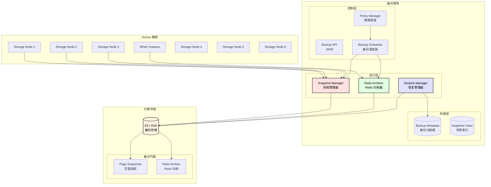
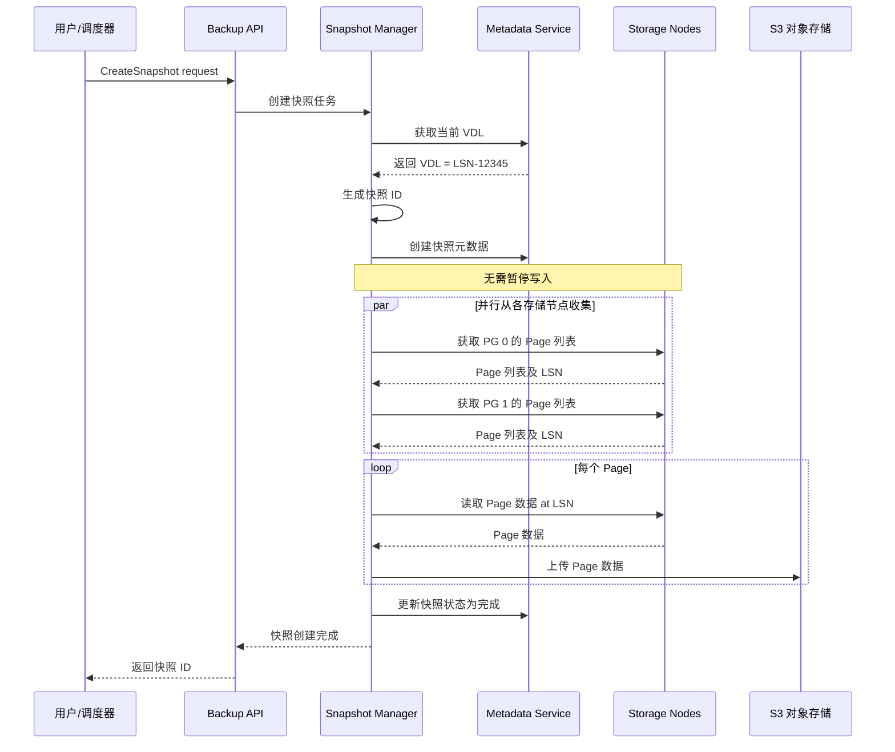
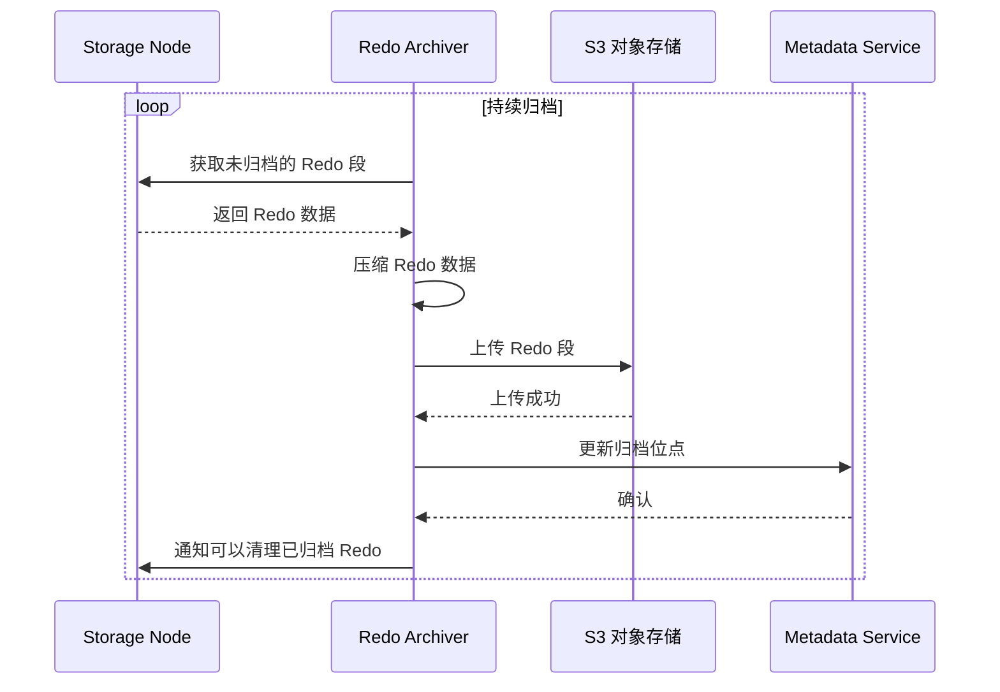
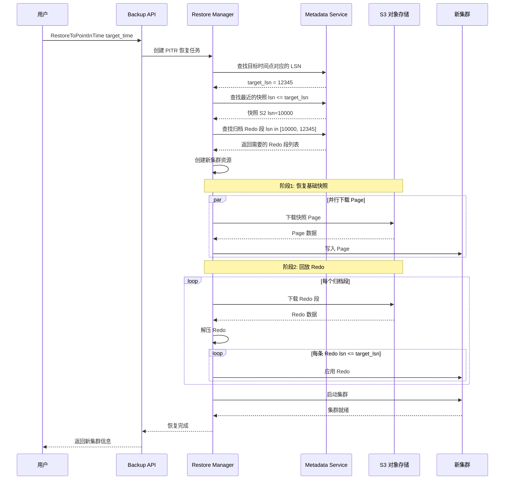
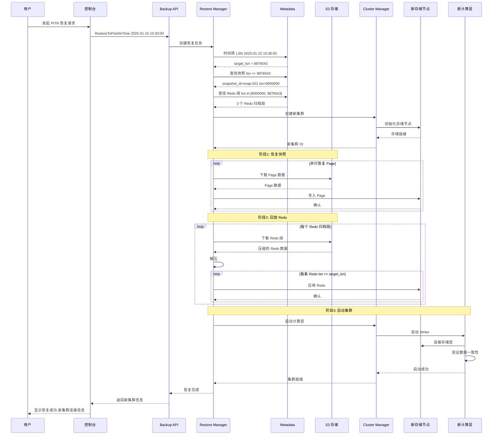

# 备份恢复与 PITR 设计文档

## 1. 模块概述

备份恢复模块负责数据的自动备份、手动备份、快照管理以及 PITR（Point-In-Time Recovery，时间点恢复）功能。

### 1.1 核心能力

| 能力 | 说明 |
|------|------|
| 自动备份 | 按配置周期自动创建备份 |
| 手动快照 | 用户触发的即时快照 |
| PITR | 恢复到任意时间点 |
| 跨区域备份 | 备份复制到其他区域 |
| 备份保留策略 | 自动清理过期备份 |

### 1.2 架构图



---

## 2. 备份机制设计

### 2.1 Aurora 备份原理

Aurora 的备份是**持续增量**的，基于以下关键特性：

```
┌─────────────────────────────────────────────────────────────────────────────────┐
│                           Aurora 持续备份架构                                    │
├─────────────────────────────────────────────────────────────────────────────────┤
│                                                                                  │
│   时间线:  T0 ───────────────────────────────────────────────────────► 现在     │
│                                                                                  │
│   Redo Log:                                                                      │
│   ┌────┬────┬────┬────┬────┬────┬────┬────┬────┬────┬────┬────┬────┐           │
│   │ R1 │ R2 │ R3 │ R4 │ R5 │ R6 │ R7 │ R8 │ R9 │R10 │R11 │R12 │... │           │
│   └────┴────┴────┴────┴────┴────┴────┴────┴────┴────┴────┴────┴────┘           │
│        ↓              ↓                   ↓                    ↓                │
│    归档到 S3      归档到 S3           归档到 S3            归档到 S3            │
│                                                                                  │
│   快照点:                                                                        │
│   ┌─────┐              ┌─────┐                    ┌─────┐                       │
│   │ S1  │              │ S2  │                    │ S3  │                       │
│   │LSN=5│              │LSN=50│                   │LSN=120│                      │
│   └─────┘              └─────┘                    └─────┘                       │
│                                                                                  │
│   PITR 恢复: 使用 最近快照 + 后续 Redo 回放到目标时间点                          │
│                                                                                  │
│   例: 恢复到 LSN=80                                                              │
│   1. 选择快照 S2 (LSN=50)                                                        │
│   2. 回放 Redo R51 到 R80                                                        │
│   3. 得到 LSN=80 时刻的数据状态                                                  │
│                                                                                  │
└─────────────────────────────────────────────────────────────────────────────────┘
```

### 2.2 快照类型

| 快照类型 | 说明 | 触发方式 |
|----------|------|----------|
| 系统快照 | 定期自动创建 | 调度器触发 |
| 手动快照 | 用户手动创建 | API 触发 |
| 最终快照 | 删除集群前创建 | 系统自动 |
| 跨区域副本 | 复制到其他区域 | 配置触发 |

---

## 3. 快照管理

### 3.1 快照创建流程



### 3.2 快照实现

```go
// snapshot_manager.go

type SnapshotManager struct {
    volumeID      string
    metaClient    *MetadataClient
    storageNodes  []StorageClient
    s3Client      *s3.Client
    parallelism   int
}

type Snapshot struct {
    ID           string
    VolumeID     string
    LSN          uint64
    CreateTime   time.Time
    Status       SnapshotStatus
    Type         SnapshotType
    SizeBytes    int64
    PageCount    int64
    S3Prefix     string
    Retention    time.Duration
}

type SnapshotStatus int

const (
    SNAPSHOT_CREATING SnapshotStatus = iota
    SNAPSHOT_AVAILABLE
    SNAPSHOT_DELETING
    SNAPSHOT_DELETED
    SNAPSHOT_FAILED
)

func (m *SnapshotManager) CreateSnapshot(
    ctx context.Context,
    snapshotType SnapshotType,
) (*Snapshot, error) {
    
    // 1. 获取当前 VDL
    vdl, err := m.metaClient.GetVDL(m.volumeID)
    if err != nil {
        return nil, err
    }
    
    // 2. 创建快照元数据
    snapshot := &Snapshot{
        ID:         generateSnapshotID(),
        VolumeID:   m.volumeID,
        LSN:        vdl,
        CreateTime: time.Now(),
        Status:     SNAPSHOT_CREATING,
        Type:       snapshotType,
        S3Prefix:   fmt.Sprintf("snapshots/%s/%s/", m.volumeID, snapshot.ID),
    }
    
    if err := m.metaClient.SaveSnapshot(snapshot); err != nil {
        return nil, err
    }
    
    // 3. 收集所有 Page 列表
    pageList, err := m.collectPageList(vdl)
    if err != nil {
        m.markSnapshotFailed(snapshot, err)
        return nil, err
    }
    
    // 4. 并行上传 Page 到 S3
    if err := m.uploadPages(ctx, snapshot, pageList); err != nil {
        m.markSnapshotFailed(snapshot, err)
        return nil, err
    }
    
    // 5. 更新快照状态
    snapshot.Status = SNAPSHOT_AVAILABLE
    snapshot.PageCount = int64(len(pageList))
    m.metaClient.UpdateSnapshot(snapshot)
    
    return snapshot, nil
}

func (m *SnapshotManager) uploadPages(
    ctx context.Context,
    snapshot *Snapshot,
    pages []*PageInfo,
) error {
    var wg sync.WaitGroup
    sem := make(chan struct{}, m.parallelism)
    errChan := make(chan error, len(pages))
    
    for _, page := range pages {
        wg.Add(1)
        sem <- struct{}{}
        
        go func(p *PageInfo) {
            defer wg.Done()
            defer func() { <-sem }()
            
            // 从存储节点读取 Page
            data, err := m.readPage(p.SpaceID, p.PageID, snapshot.LSN)
            if err != nil {
                errChan <- err
                return
            }
            
            // 压缩
            compressed := compress(data)
            
            // 上传到 S3
            key := fmt.Sprintf("%s%d/%d.page.zst", 
                snapshot.S3Prefix, p.SpaceID, p.PageID)
            
            _, err = m.s3Client.PutObject(ctx, &s3.PutObjectInput{
                Bucket: aws.String(m.backupBucket),
                Key:    aws.String(key),
                Body:   bytes.NewReader(compressed),
            })
            
            if err != nil {
                errChan <- err
            }
        }(page)
    }
    
    wg.Wait()
    close(errChan)
    
    // 检查错误
    for err := range errChan {
        if err != nil {
            return err
        }
    }
    
    return nil
}
```

---

## 4. Redo 归档设计

### 4.1 归档流程



### 4.2 Redo 归档实现

```go
// redo_archiver.go

type RedoArchiver struct {
    volumeID       string
    storageNodes   []StorageClient
    s3Client       *s3.Client
    metaClient     *MetadataClient
    archivePoint   uint64  // 已归档的 LSN
    segmentSize    int64   // 每个归档段大小，默认 16MB
}

type RedoArchiveSegment struct {
    VolumeID     string
    SegmentID    string
    StartLSN     uint64
    EndLSN       uint64
    CreateTime   time.Time
    SizeBytes    int64
    S3Key        string
    Checksum     string
}

func (a *RedoArchiver) Run(ctx context.Context) error {
    ticker := time.NewTicker(time.Second * 5)
    defer ticker.Stop()
    
    for {
        select {
        case <-ctx.Done():
            return nil
        case <-ticker.C:
            if err := a.archiveOnce(ctx); err != nil {
                log.Printf("archive error: %v", err)
            }
        }
    }
}

func (a *RedoArchiver) archiveOnce(ctx context.Context) error {
    // 1. 获取当前持久化的 LSN
    currentLSN, err := a.metaClient.GetVDL(a.volumeID)
    if err != nil {
        return err
    }
    
    // 2. 检查是否有足够的 Redo 待归档
    if currentLSN-a.archivePoint < uint64(a.segmentSize) {
        return nil // 不足一个段，跳过
    }
    
    // 3. 从存储节点读取 Redo
    redoData, endLSN, err := a.readRedoRange(a.archivePoint, currentLSN)
    if err != nil {
        return err
    }
    
    // 4. 压缩
    compressed := compressZstd(redoData)
    
    // 5. 生成归档段
    segment := &RedoArchiveSegment{
        VolumeID:   a.volumeID,
        SegmentID:  generateSegmentID(),
        StartLSN:   a.archivePoint,
        EndLSN:     endLSN,
        CreateTime: time.Now(),
        SizeBytes:  int64(len(compressed)),
        Checksum:   calculateChecksum(compressed),
    }
    segment.S3Key = fmt.Sprintf("redo-archive/%s/%016x-%016x.redo.zst",
        a.volumeID, segment.StartLSN, segment.EndLSN)
    
    // 6. 上传到 S3
    _, err = a.s3Client.PutObject(ctx, &s3.PutObjectInput{
        Bucket: aws.String(a.archiveBucket),
        Key:    aws.String(segment.S3Key),
        Body:   bytes.NewReader(compressed),
        Metadata: map[string]string{
            "start-lsn":  fmt.Sprintf("%d", segment.StartLSN),
            "end-lsn":    fmt.Sprintf("%d", segment.EndLSN),
            "checksum":   segment.Checksum,
        },
    })
    if err != nil {
        return err
    }
    
    // 7. 记录归档元数据
    if err := a.metaClient.SaveRedoArchiveSegment(segment); err != nil {
        return err
    }
    
    // 8. 更新归档位点
    a.archivePoint = endLSN
    
    return nil
}
```

### 4.3 归档文件格式

```
┌───────────────────────────────────────────────────────────────────────────────┐
│                    Redo Archive Segment (*.redo.zst)                           │
├───────────────────────────────────────────────────────────────────────────────┤
│                                                                                │
│  ┌─────────────────────────────────────────────────────────────────────────┐  │
│  │                     Archive Header (128 字节)                            │  │
│  │  ┌──────────────────────────────────────────────────────────────────┐   │  │
│  │  │ Offset 0-7:    magic         (8B)  = 0x524544415243485631       │   │  │
│  │  │ Offset 8-11:   version       (4B)  = 1                           │   │  │
│  │  │ Offset 12-19:  start_lsn     (8B)                                │   │  │
│  │  │ Offset 20-27:  end_lsn       (8B)                                │   │  │
│  │  │ Offset 28-35:  record_count  (8B)                                │   │  │
│  │  │ Offset 36-43:  uncompressed_size (8B)                            │   │  │
│  │  │ Offset 44-51:  compressed_size   (8B)                            │   │  │
│  │  │ Offset 52-83:  volume_id     (32B)                               │   │  │
│  │  │ Offset 84-91:  create_time   (8B)                                │   │  │
│  │  │ Offset 92-123: checksum      (32B) SHA-256                       │   │  │
│  │  │ Offset 124-127: header_crc   (4B)                                │   │  │
│  │  └──────────────────────────────────────────────────────────────────┘   │  │
│  └─────────────────────────────────────────────────────────────────────────┘  │
│                                                                                │
│  ┌─────────────────────────────────────────────────────────────────────────┐  │
│  │                     Compressed Redo Data                                 │  │
│  │             (Zstandard 压缩的 Redo Record 序列)                          │  │
│  │                                                                          │  │
│  │  解压后格式:                                                             │  │
│  │  ┌─────────────────────────────────────────────────────────────────┐    │  │
│  │  │ RedoRecord 1: header(48B) + data(N) + crc(4B)                   │    │  │
│  │  ├─────────────────────────────────────────────────────────────────┤    │  │
│  │  │ RedoRecord 2: header(48B) + data(N) + crc(4B)                   │    │  │
│  │  ├─────────────────────────────────────────────────────────────────┤    │  │
│  │  │ ...                                                             │    │  │
│  │  ├─────────────────────────────────────────────────────────────────┤    │  │
│  │  │ RedoRecord N                                                    │    │  │
│  │  └─────────────────────────────────────────────────────────────────┘    │  │
│  └─────────────────────────────────────────────────────────────────────────┘  │
│                                                                                │
└───────────────────────────────────────────────────────────────────────────────┘
```

---

## 5. PITR 恢复设计

### 5.1 PITR 恢复流程



### 5.2 PITR 恢复实现

```go
// restore_manager.go

type RestoreManager struct {
    metaClient    *MetadataClient
    s3Client      *s3.Client
    clusterMgr    *ClusterManager
    parallelism   int
}

type RestoreRequest struct {
    SourceVolumeID string
    TargetTime     time.Time
    TargetLSN      uint64        // 可选，直接指定 LSN
    NewClusterID   string
    InstanceType   string
    VPCConfig      *VPCConfig
}

type RestoreTask struct {
    TaskID         string
    Request        *RestoreRequest
    Status         RestoreStatus
    SnapshotID     string
    SnapshotLSN    uint64
    TargetLSN      uint64
    RedoSegments   []*RedoArchiveSegment
    Progress       *RestoreProgress
    StartTime      time.Time
    EndTime        time.Time
    ErrorMessage   string
}

type RestoreProgress struct {
    Phase           RestorePhase
    PagesTotal      int64
    PagesRestored   int64
    RedoTotal       int64
    RedoApplied     int64
    CurrentLSN      uint64
}

type RestorePhase int

const (
    PHASE_INIT RestorePhase = iota
    PHASE_SNAPSHOT_RESTORE
    PHASE_REDO_REPLAY
    PHASE_CLUSTER_START
    PHASE_COMPLETE
)

func (m *RestoreManager) RestoreToPointInTime(
    ctx context.Context,
    req *RestoreRequest,
) (*RestoreTask, error) {
    
    task := &RestoreTask{
        TaskID:    generateTaskID(),
        Request:   req,
        Status:    RESTORE_RUNNING,
        StartTime: time.Now(),
        Progress:  &RestoreProgress{Phase: PHASE_INIT},
    }
    
    // 1. 确定目标 LSN
    if req.TargetLSN == 0 {
        lsn, err := m.timeToLSN(req.SourceVolumeID, req.TargetTime)
        if err != nil {
            return nil, fmt.Errorf("convert time to LSN: %w", err)
        }
        task.TargetLSN = lsn
    } else {
        task.TargetLSN = req.TargetLSN
    }
    
    // 2. 查找最近的快照
    snapshot, err := m.findNearestSnapshot(req.SourceVolumeID, task.TargetLSN)
    if err != nil {
        return nil, fmt.Errorf("find snapshot: %w", err)
    }
    task.SnapshotID = snapshot.ID
    task.SnapshotLSN = snapshot.LSN
    
    // 3. 查找需要的 Redo 段
    redoSegments, err := m.findRedoSegments(
        req.SourceVolumeID, snapshot.LSN, task.TargetLSN)
    if err != nil {
        return nil, fmt.Errorf("find redo segments: %w", err)
    }
    task.RedoSegments = redoSegments
    
    // 4. 创建新集群
    newCluster, err := m.clusterMgr.CreateCluster(ctx, &ClusterConfig{
        ClusterID:    req.NewClusterID,
        InstanceType: req.InstanceType,
        VPCConfig:    req.VPCConfig,
    })
    if err != nil {
        return nil, fmt.Errorf("create cluster: %w", err)
    }
    
    // 5. 恢复快照
    task.Progress.Phase = PHASE_SNAPSHOT_RESTORE
    if err := m.restoreSnapshot(ctx, task, newCluster, snapshot); err != nil {
        return nil, fmt.Errorf("restore snapshot: %w", err)
    }
    
    // 6. 回放 Redo
    task.Progress.Phase = PHASE_REDO_REPLAY
    if err := m.replayRedo(ctx, task, newCluster, redoSegments); err != nil {
        return nil, fmt.Errorf("replay redo: %w", err)
    }
    
    // 7. 启动集群
    task.Progress.Phase = PHASE_CLUSTER_START
    if err := m.clusterMgr.StartCluster(ctx, newCluster.ID); err != nil {
        return nil, fmt.Errorf("start cluster: %w", err)
    }
    
    task.Progress.Phase = PHASE_COMPLETE
    task.Status = RESTORE_COMPLETE
    task.EndTime = time.Now()
    
    return task, nil
}

func (m *RestoreManager) replayRedo(
    ctx context.Context,
    task *RestoreTask,
    cluster *Cluster,
    segments []*RedoArchiveSegment,
) error {
    for _, seg := range segments {
        // 下载 Redo 段
        data, err := m.downloadRedoSegment(ctx, seg)
        if err != nil {
            return err
        }
        
        // 解压
        redoRecords, err := decompressRedoSegment(data)
        if err != nil {
            return err
        }
        
        // 应用每条 Redo（直到目标 LSN）
        for _, record := range redoRecords {
            if record.LSN > task.TargetLSN {
                break
            }
            
            if err := m.applyRedo(ctx, cluster, record); err != nil {
                return err
            }
            
            task.Progress.RedoApplied++
            task.Progress.CurrentLSN = record.LSN
        }
    }
    
    return nil
}
```

### 5.3 时间到 LSN 的映射

```go
// lsn_time_mapping.go

type LSNTimeMapper struct {
    metaClient *MetadataClient
}

type LSNTimePoint struct {
    LSN       uint64
    Timestamp time.Time
}

func (m *LSNTimeMapper) TimeToLSN(volumeID string, targetTime time.Time) (uint64, error) {
    // 查询 LSN-时间映射表（存储层定期记录）
    points, err := m.metaClient.GetLSNTimePoints(volumeID, 
        targetTime.Add(-time.Hour), targetTime.Add(time.Hour))
    if err != nil {
        return 0, err
    }
    
    // 二分查找最接近的 LSN
    idx := sort.Search(len(points), func(i int) bool {
        return points[i].Timestamp.After(targetTime)
    })
    
    if idx == 0 {
        return 0, fmt.Errorf("target time %v is before backup window", targetTime)
    }
    
    // 返回目标时间之前最近的 LSN
    return points[idx-1].LSN, nil
}
```

---

## 6. 备份保留策略

### 6.1 保留策略配置

```go
// retention_policy.go

type RetentionPolicy struct {
    AutomaticBackupRetentionDays int   // 自动备份保留天数，1-35
    ManualSnapshotRetentionDays  int   // 手动快照保留天数，0 表示永久
    PITRRetentionDays           int    // PITR 窗口天数
    CrossRegionCopyEnabled      bool
    CrossRegionRetentionDays    int
}

type BackupRetentionManager struct {
    metaClient *MetadataClient
    s3Client   *s3.Client
}

func (m *BackupRetentionManager) CleanupExpiredBackups(ctx context.Context) error {
    volumes, err := m.metaClient.ListVolumes()
    if err != nil {
        return err
    }
    
    for _, vol := range volumes {
        policy := vol.RetentionPolicy
        
        // 清理过期的自动快照
        cutoffTime := time.Now().AddDate(0, 0, -policy.AutomaticBackupRetentionDays)
        expiredSnapshots, err := m.metaClient.GetExpiredSnapshots(
            vol.ID, SNAPSHOT_TYPE_AUTO, cutoffTime)
        if err != nil {
            continue
        }
        
        for _, snap := range expiredSnapshots {
            m.deleteSnapshot(ctx, snap)
        }
        
        // 清理过期的 Redo 归档
        redoCutoffTime := time.Now().AddDate(0, 0, -policy.PITRRetentionDays)
        expiredRedoSegments, err := m.metaClient.GetExpiredRedoSegments(
            vol.ID, redoCutoffTime)
        if err != nil {
            continue
        }
        
        for _, seg := range expiredRedoSegments {
            m.deleteRedoSegment(ctx, seg)
        }
    }
    
    return nil
}
```

---

## 7. gRPC 接口定义

```protobuf
// backup.proto

syntax = "proto3";
package aurora.backup;

service BackupService {
    // 快照管理
    rpc CreateSnapshot(CreateSnapshotRequest) returns (CreateSnapshotResponse);
    rpc DeleteSnapshot(DeleteSnapshotRequest) returns (DeleteSnapshotResponse);
    rpc GetSnapshot(GetSnapshotRequest) returns (GetSnapshotResponse);
    rpc ListSnapshots(ListSnapshotsRequest) returns (ListSnapshotsResponse);
    rpc CopySnapshotToRegion(CopySnapshotRequest) returns (CopySnapshotResponse);
    
    // PITR 恢复
    rpc RestoreToPointInTime(RestoreToPointInTimeRequest) returns (RestoreToPointInTimeResponse);
    rpc GetRestoreTask(GetRestoreTaskRequest) returns (GetRestoreTaskResponse);
    rpc DescribeValidRestoreTime(DescribeValidRestoreTimeRequest) returns (DescribeValidRestoreTimeResponse);
    
    // 备份策略
    rpc ModifyBackupPolicy(ModifyBackupPolicyRequest) returns (ModifyBackupPolicyResponse);
    rpc GetBackupPolicy(GetBackupPolicyRequest) returns (GetBackupPolicyResponse);
}

message CreateSnapshotRequest {
    string volume_id = 1;
    string snapshot_name = 2;
    map<string, string> tags = 3;
}

message CreateSnapshotResponse {
    string snapshot_id = 1;
    uint64 lsn = 2;
    string status = 3;
}

message RestoreToPointInTimeRequest {
    string source_volume_id = 1;
    oneof restore_point {
        int64 restore_time_unix = 2;   // Unix 时间戳
        uint64 restore_lsn = 3;         // 直接指定 LSN
        string snapshot_id = 4;         // 从快照恢复
    }
    string new_cluster_id = 5;
    string instance_type = 6;
    VPCConfig vpc_config = 7;
}

message RestoreToPointInTimeResponse {
    string task_id = 1;
    string new_cluster_id = 2;
    string status = 3;
}

message GetRestoreTaskResponse {
    string task_id = 1;
    string status = 2;
    RestoreProgress progress = 3;
    string new_cluster_id = 4;
    string error_message = 5;
}

message RestoreProgress {
    string phase = 1;
    int64 pages_total = 2;
    int64 pages_restored = 3;
    int64 redo_total = 4;
    int64 redo_applied = 5;
    uint64 current_lsn = 6;
    int32 progress_percent = 7;
    int64 eta_seconds = 8;
}

message DescribeValidRestoreTimeRequest {
    string volume_id = 1;
}

message DescribeValidRestoreTimeResponse {
    int64 earliest_restore_time = 1;  // 最早可恢复时间
    int64 latest_restore_time = 2;    // 最晚可恢复时间（当前）
    repeated SnapshotInfo snapshots = 3;
}

message SnapshotInfo {
    string snapshot_id = 1;
    uint64 lsn = 2;
    int64 create_time = 3;
    string snapshot_type = 4;
    int64 size_bytes = 5;
    string status = 6;
}

message ModifyBackupPolicyRequest {
    string volume_id = 1;
    int32 automatic_backup_retention_days = 2;
    int32 pitr_retention_days = 3;
    string preferred_backup_window = 4;  // "HH:MM-HH:MM" 格式
    bool cross_region_copy_enabled = 5;
    string cross_region_copy_target = 6;
}
```

---

## 8. 时序图：完整 PITR 恢复



---

## 9. 监控指标

| 指标 | 类型 | 说明 |
|------|------|------|
| `backup_snapshot_count` | Gauge | 快照数量（按类型） |
| `backup_snapshot_size_bytes` | Gauge | 快照总大小 |
| `backup_redo_archive_lag_seconds` | Gauge | Redo 归档延迟 |
| `backup_redo_archive_size_bytes` | Counter | Redo 归档总大小 |
| `backup_restore_duration_seconds` | Histogram | 恢复耗时 |
| `backup_restore_total` | Counter | 恢复次数 |
| `backup_pitr_window_seconds` | Gauge | 可恢复时间窗口 |
| `backup_s3_upload_bytes_total` | Counter | S3 上传字节数 |
| `backup_s3_download_bytes_total` | Counter | S3 下载字节数 |

---

## 10. 配置示例

```yaml
# backup_config.yaml

backup:
  # 快照配置
  snapshot:
    parallelism: 16
    compression: zstd
    compression_level: 3
    
  # Redo 归档配置
  redo_archive:
    segment_size_mb: 16
    archive_interval_seconds: 5
    compression: zstd
    compression_level: 3
    
  # S3 存储配置
  storage:
    type: s3
    bucket: aurora-backups
    region: us-east-1
    storage_class: STANDARD_IA
    encryption: AES256
    
  # 保留策略默认值
  retention:
    automatic_backup_days: 7
    pitr_window_days: 7
    manual_snapshot_days: 0  # 永久保留
    
  # 跨区域备份
  cross_region:
    enabled: false
    target_regions:
      - us-west-2
    retention_days: 7
    
  # 恢复配置
  restore:
    parallelism: 32
    verify_checksum: true
    
  # 调度配置
  scheduler:
    enabled: true
    preferred_window: "03:00-05:00"  # UTC
    full_snapshot_interval_hours: 24
