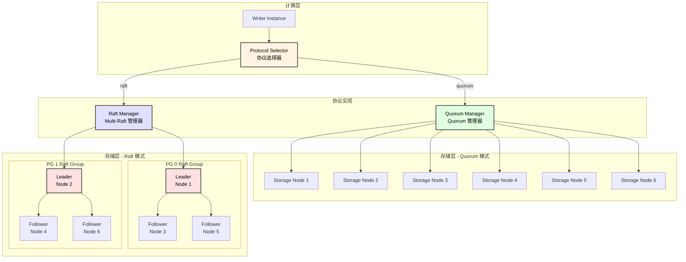
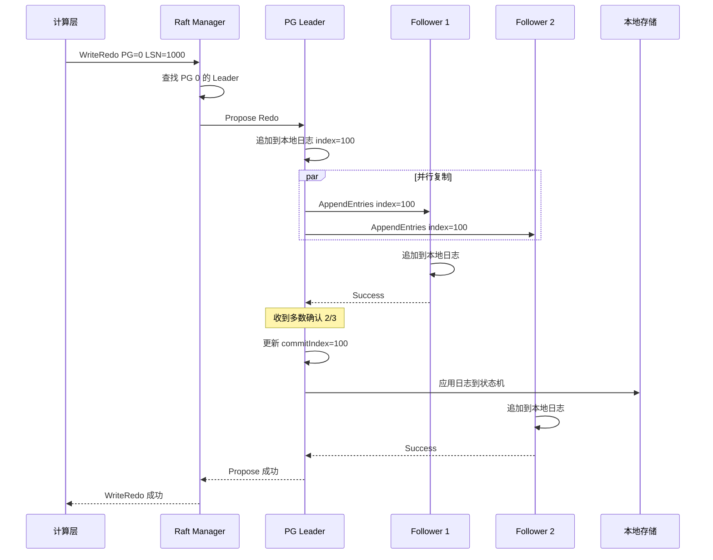
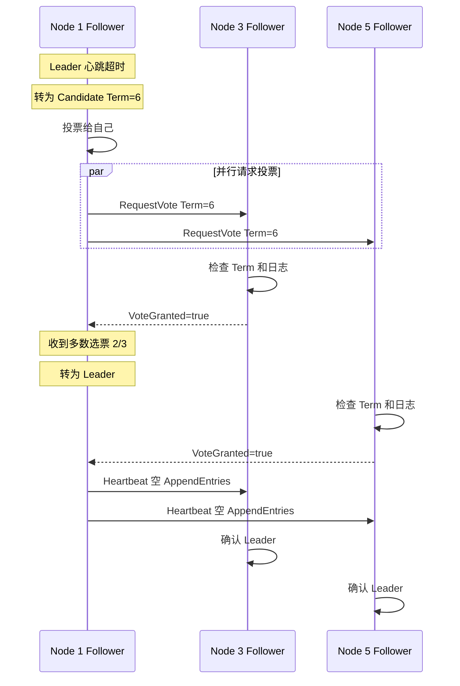
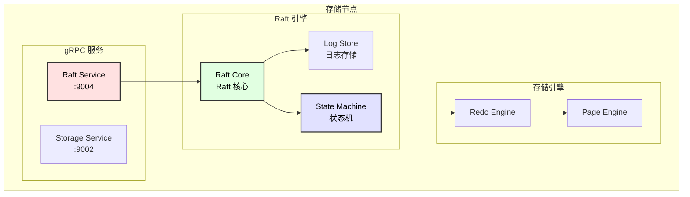
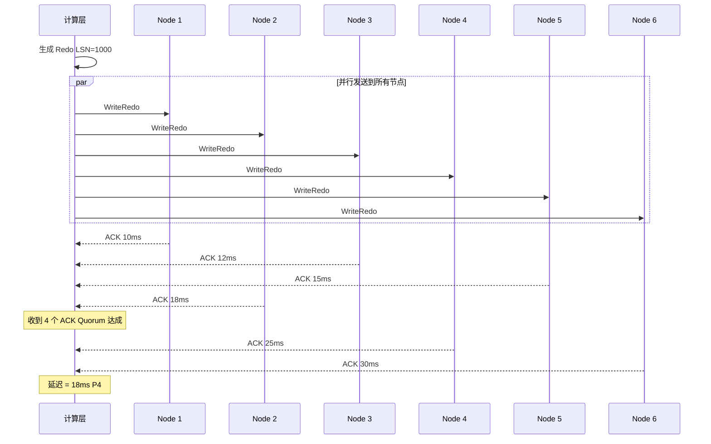
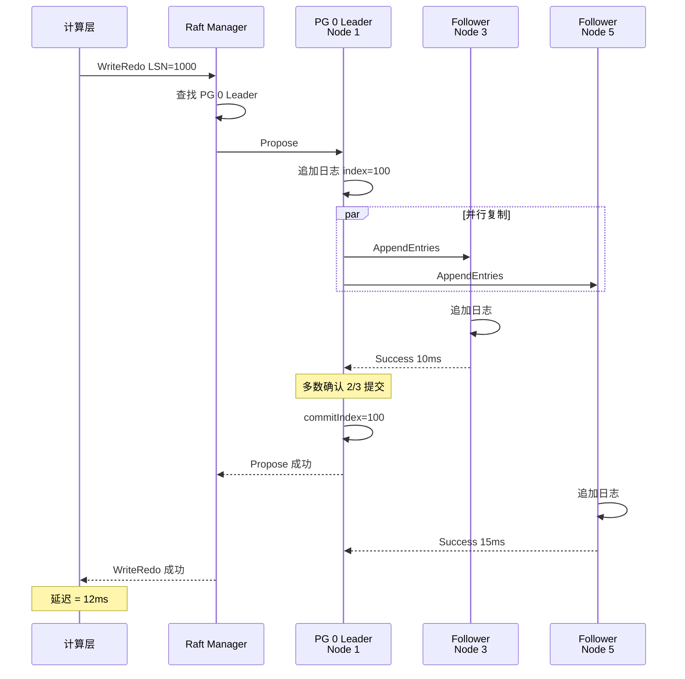
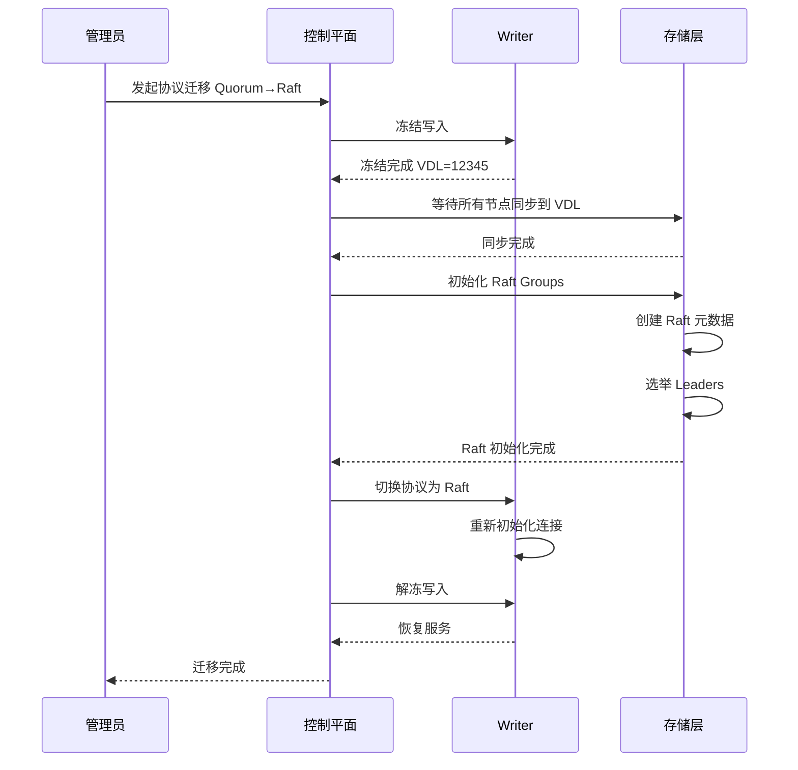

# 复制协议设计文档

## 1. 概述

本系统支持两种复制协议，可在集群启动时选择：

| 协议 | 说明 | 适用场景 |
|------|------|----------|
| **Quorum 协议** | 无 Leader，写入发送到所有节点，等待多数确认 | 追求低延迟、简单架构 |
| **Multi-Raft 协议** | 每个 PG 有独立 Raft Group，由 Leader 负责复制 | 追求强一致性、顺序保证 |

### 1.1 协议对比

| 特性 | Quorum (4/6) | Multi-Raft |
|------|--------------|------------|
| **一致性** | 最终一致 | 强一致（线性化） |
| **写入延迟** | 低（并行等待） | 中（串行复制） |
| **复杂度** | 低 | 高 |
| **Leader 故障** | 无影响 | 需要选举 |
| **顺序保证** | 弱（并发写入可能乱序） | 强（Leader 保证全局顺序） |
| **脑裂处理** | 依赖 Quorum | Raft 机制保证 |

### 1.2 架构图



---

## 2. Multi-Raft 协议设计

### 2.1 核心概念

```
┌─────────────────────────────────────────────────────────────────────────────────┐
│                          Multi-Raft 架构                                         │
├─────────────────────────────────────────────────────────────────────────────────┤
│                                                                                  │
│  Volume                                                                          │
│  ┌────────────────────────────────────────────────────────────────────────────┐ │
│  │ PG 0 (10GB)                    PG 1 (10GB)                    PG N         │ │
│  │ ┌──────────────────────┐      ┌──────────────────────┐                     │ │
│  │ │   Raft Group 0       │      │   Raft Group 1       │      ...            │ │
│  │ │                      │      │                      │                     │ │
│  │ │  Leader: Node-1      │      │  Leader: Node-2      │                     │ │
│  │ │  Follower: Node-3    │      │  Follower: Node-4    │                     │ │
│  │ │  Follower: Node-5    │      │  Follower: Node-6    │                     │ │
│  │ │                      │      │                      │                     │ │
│  │ │  Term: 5             │      │  Term: 3             │                     │ │
│  │ │  CommitIndex: 12345  │      │  CommitIndex: 54321  │                     │ │
│  │ └──────────────────────┘      └──────────────────────┘                     │ │
│  └────────────────────────────────────────────────────────────────────────────┘ │
│                                                                                  │
│  特点:                                                                           │
│  1. 每个 PG 有独立的 Raft Group                                                  │
│  2. 每个 Raft Group 有 1 个 Leader 和 2 个 Followers（3 副本）                   │
│  3. 为实现 6 副本，每个 PG 有 2 个 Raft Group（跨 AZ）                           │
│  4. Leader 负责日志复制，保证顺序一致性                                          │
│                                                                                  │
└─────────────────────────────────────────────────────────────────────────────────┘
```

### 2.2 Raft Group 分布策略

```
┌─────────────────────────────────────────────────────────────────────────────────┐
│                       6 副本 Multi-Raft 分布                                     │
├─────────────────────────────────────────────────────────────────────────────────┤
│                                                                                  │
│  策略一：双 Raft Group（推荐）                                                   │
│  ┌────────────────────────────────────────────────────────────────────────────┐ │
│  │  每个 PG 包含 2 个 Raft Group，每个 Group 3 副本                            │ │
│  │                                                                             │ │
│  │  PG X:                                                                      │ │
│  │    Raft Group A (3 副本):  Node-1(AZ-a), Node-3(AZ-b), Node-5(AZ-c)        │ │
│  │    Raft Group B (3 副本):  Node-2(AZ-a), Node-4(AZ-b), Node-6(AZ-c)        │ │
│  │                                                                             │ │
│  │  写入时：同时写入两个 Raft Group，都成功才算成功                            │ │
│  │  读取时：从任一 Group 读取                                                  │ │
│  └────────────────────────────────────────────────────────────────────────────┘ │
│                                                                                  │
│  策略二：单 Raft Group + 异步复制                                               │
│  ┌────────────────────────────────────────────────────────────────────────────┐ │
│  │  每个 PG 1 个 Raft Group (3 副本) + 3 个异步副本                            │ │
│  │                                                                             │ │
│  │  PG X:                                                                      │ │
│  │    Raft Group (同步): Node-1(Leader), Node-3, Node-5                       │ │
│  │    Async Replicas:    Node-2, Node-4, Node-6                               │ │
│  │                                                                             │ │
│  │  写入时：Raft Group 提交即成功，异步复制到其他副本                          │ │
│  │  优点：延迟更低；缺点：异步副本可能落后                                     │ │
│  └────────────────────────────────────────────────────────────────────────────┘ │
│                                                                                  │
└─────────────────────────────────────────────────────────────────────────────────┘
```

### 2.3 数据结构定义

```go
// raft_types.go

// Raft 节点状态
type RaftState int
const (
    RAFT_FOLLOWER RaftState = iota
    RAFT_CANDIDATE
    RAFT_LEADER
)

// Raft Group 信息
type RaftGroup struct {
    GroupID       uint64           `json:"group_id"`
    PGID          uint32           `json:"pg_id"`
    ReplicaID     uint32           `json:"replica_id"`    // 0 或 1（双 Raft Group 模式）
    Term          uint64           `json:"term"`
    VotedFor      string           `json:"voted_for"`
    CommitIndex   uint64           `json:"commit_index"`
    LastApplied   uint64           `json:"last_applied"`
    LeaderID      string           `json:"leader_id"`
    Members       []RaftMember     `json:"members"`
    State         RaftState        `json:"state"`
}

type RaftMember struct {
    NodeID        string           `json:"node_id"`
    Address       string           `json:"address"`
    AZ            string           `json:"az"`
    MatchIndex    uint64           `json:"match_index"`
    NextIndex     uint64           `json:"next_index"`
    IsVoter       bool             `json:"is_voter"`
}

// Raft 日志条目
type RaftLogEntry struct {
    Index         uint64           `json:"index"`
    Term          uint64           `json:"term"`
    LSN           uint64           `json:"lsn"`
    Type          RaftEntryType    `json:"type"`
    Data          []byte           `json:"data"`
    Timestamp     time.Time        `json:"timestamp"`
}

type RaftEntryType int
const (
    ENTRY_REDO RaftEntryType = iota
    ENTRY_CONFIG_CHANGE
    ENTRY_NOOP
)

// PG Raft 配置
type PGRaftConfig struct {
    PGID              uint32
    GroupCount        int              // 1 或 2
    Groups            []*RaftGroup
    ReplicationMode   ReplicationMode  // SYNC 或 ASYNC
}

type ReplicationMode int
const (
    REPLICATION_SYNC  ReplicationMode = iota  // 双 Raft Group 同步
    REPLICATION_ASYNC                          // 单 Raft Group + 异步
)
```

### 2.4 Raft Manager 设计

```go
// raft_manager.go

type RaftManager struct {
    nodeID        string
    groups        map[uint64]*RaftGroupHandler  // groupID -> handler
    transport     *RaftTransport
    storage       *RaftStorage
    metaClient    *MetadataClient
    
    // 配置
    config        *RaftConfig
    
    // Leader 路由缓存
    leaderCache   map[uint32]string  // pgID -> leaderNodeID
    cacheMutex    sync.RWMutex
}

type RaftConfig struct {
    HeartbeatInterval   time.Duration
    ElectionTimeout     time.Duration
    SnapshotInterval    time.Duration
    MaxLogEntries       int
    BatchSize           int
}

// 初始化
func NewRaftManager(nodeID string, config *RaftConfig) *RaftManager {
    rm := &RaftManager{
        nodeID:      nodeID,
        groups:      make(map[uint64]*RaftGroupHandler),
        leaderCache: make(map[uint32]string),
        config:      config,
    }
    
    rm.transport = NewRaftTransport(nodeID)
    rm.storage = NewRaftStorage()
    
    return rm
}

// 创建 Raft Group
func (rm *RaftManager) CreateGroup(pgID uint32, replicaID uint32, members []RaftMember) error {
    groupID := makeGroupID(pgID, replicaID)
    
    group := &RaftGroup{
        GroupID:   groupID,
        PGID:      pgID,
        ReplicaID: replicaID,
        Members:   members,
        State:     RAFT_FOLLOWER,
    }
    
    handler := NewRaftGroupHandler(rm, group)
    rm.groups[groupID] = handler
    
    go handler.Run()
    
    return nil
}

// 写入 Redo（供计算层调用）
func (rm *RaftManager) WriteRedo(pgID uint32, redo *RedoRecord) error {
    // 1. 找到对应的 Raft Group(s)
    groups := rm.getGroupsForPG(pgID)
    
    if len(groups) == 0 {
        return errors.New("no raft group found for pg")
    }
    
    // 2. 根据复制模式处理
    if rm.config.ReplicationMode == REPLICATION_SYNC {
        // 双 Raft Group 同步模式：两个都要成功
        var wg sync.WaitGroup
        errChan := make(chan error, len(groups))
        
        for _, group := range groups {
            wg.Add(1)
            go func(g *RaftGroupHandler) {
                defer wg.Done()
                if err := rm.writeToGroup(g, redo); err != nil {
                    errChan <- err
                }
            }(group)
        }
        
        wg.Wait()
        close(errChan)
        
        for err := range errChan {
            if err != nil {
                return err
            }
        }
    } else {
        // 单 Raft Group 模式：只写主 Group
        primaryGroup := groups[0]
        if err := rm.writeToGroup(primaryGroup, redo); err != nil {
            return err
        }
    }
    
    return nil
}

func (rm *RaftManager) writeToGroup(group *RaftGroupHandler, redo *RedoRecord) error {
    // 如果是 Leader，直接处理
    if group.IsLeader() {
        return group.Propose(redo)
    }
    
    // 如果是 Follower，转发给 Leader
    leaderID := group.GetLeaderID()
    if leaderID == "" {
        return errors.New("no leader available")
    }
    
    return rm.transport.ForwardToLeader(leaderID, group.GroupID, redo)
}
```

### 2.5 Raft Group Handler

```go
// raft_group_handler.go

type RaftGroupHandler struct {
    manager       *RaftManager
    group         *RaftGroup
    
    // Raft 状态
    currentTerm   uint64
    votedFor      string
    log           *RaftLog
    commitIndex   uint64
    lastApplied   uint64
    
    // Leader 状态
    nextIndex     map[string]uint64
    matchIndex    map[string]uint64
    
    // 通道
    proposeChan   chan *ProposeRequest
    appendChan    chan *AppendEntriesRequest
    voteChan      chan *RequestVoteRequest
    applyChan     chan *RaftLogEntry
    
    // 定时器
    electionTimer  *time.Timer
    heartbeatTimer *time.Timer
    
    // 状态
    state         RaftState
    leaderID      string
    
    mu            sync.RWMutex
}

// 主循环
func (h *RaftGroupHandler) Run() {
    for {
        switch h.state {
        case RAFT_FOLLOWER:
            h.runFollower()
        case RAFT_CANDIDATE:
            h.runCandidate()
        case RAFT_LEADER:
            h.runLeader()
        }
    }
}

// Follower 状态
func (h *RaftGroupHandler) runFollower() {
    h.electionTimer = time.NewTimer(h.randomElectionTimeout())
    
    for h.state == RAFT_FOLLOWER {
        select {
        case <-h.electionTimer.C:
            // 选举超时，转为 Candidate
            h.state = RAFT_CANDIDATE
            return
            
        case req := <-h.appendChan:
            // 处理 AppendEntries RPC
            h.handleAppendEntries(req)
            h.electionTimer.Reset(h.randomElectionTimeout())
            
        case req := <-h.voteChan:
            // 处理 RequestVote RPC
            h.handleRequestVote(req)
        }
    }
}

// Leader 状态
func (h *RaftGroupHandler) runLeader() {
    // 初始化 nextIndex 和 matchIndex
    for _, member := range h.group.Members {
        if member.NodeID != h.manager.nodeID {
            h.nextIndex[member.NodeID] = h.log.LastIndex() + 1
            h.matchIndex[member.NodeID] = 0
        }
    }
    
    // 发送初始心跳
    h.broadcastHeartbeat()
    
    h.heartbeatTimer = time.NewTimer(h.manager.config.HeartbeatInterval)
    
    for h.state == RAFT_LEADER {
        select {
        case <-h.heartbeatTimer.C:
            // 发送心跳
            h.broadcastHeartbeat()
            h.heartbeatTimer.Reset(h.manager.config.HeartbeatInterval)
            
        case req := <-h.proposeChan:
            // 处理客户端提案
            h.handlePropose(req)
            
        case req := <-h.appendChan:
            // 处理其他节点的 AppendEntries（可能有更高 term 的 Leader）
            h.handleAppendEntries(req)
            
        case req := <-h.voteChan:
            // 处理投票请求
            h.handleRequestVote(req)
        }
    }
}

// 处理客户端提案
func (h *RaftGroupHandler) handlePropose(req *ProposeRequest) {
    h.mu.Lock()
    defer h.mu.Unlock()
    
    // 1. 追加到本地日志
    entry := &RaftLogEntry{
        Index:     h.log.LastIndex() + 1,
        Term:      h.currentTerm,
        LSN:       req.Redo.LSN,
        Type:      ENTRY_REDO,
        Data:      req.Redo.Serialize(),
        Timestamp: time.Now(),
    }
    h.log.Append(entry)
    
    // 2. 并行发送 AppendEntries 给所有 Followers
    var wg sync.WaitGroup
    successCount := 1  // 自己算一个
    
    for _, member := range h.group.Members {
        if member.NodeID == h.manager.nodeID {
            continue
        }
        
        wg.Add(1)
        go func(nodeID string) {
            defer wg.Done()
            if h.sendAppendEntries(nodeID) {
                atomic.AddInt32(&successCount, 1)
            }
        }(member.NodeID)
    }
    
    wg.Wait()
    
    // 3. 检查是否达到多数
    if successCount > len(h.group.Members)/2 {
        // 更新 commitIndex
        h.commitIndex = entry.Index
        
        // 应用到状态机
        h.applyEntries()
        
        // 响应客户端
        req.Response <- &ProposeResponse{Success: true}
    } else {
        req.Response <- &ProposeResponse{
            Success: false,
            Error:   "failed to replicate to majority",
        }
    }
}

// 发送 AppendEntries
func (h *RaftGroupHandler) sendAppendEntries(nodeID string) bool {
    h.mu.RLock()
    prevLogIndex := h.nextIndex[nodeID] - 1
    prevLogTerm := h.log.Term(prevLogIndex)
    entries := h.log.Entries(h.nextIndex[nodeID], h.log.LastIndex())
    h.mu.RUnlock()
    
    req := &AppendEntriesRequest{
        Term:         h.currentTerm,
        LeaderID:     h.manager.nodeID,
        PrevLogIndex: prevLogIndex,
        PrevLogTerm:  prevLogTerm,
        Entries:      entries,
        LeaderCommit: h.commitIndex,
    }
    
    resp, err := h.manager.transport.SendAppendEntries(nodeID, h.group.GroupID, req)
    if err != nil {
        return false
    }
    
    if resp.Success {
        h.mu.Lock()
        h.nextIndex[nodeID] = entries[len(entries)-1].Index + 1
        h.matchIndex[nodeID] = entries[len(entries)-1].Index
        h.mu.Unlock()
        return true
    }
    
    // 回退 nextIndex
    h.mu.Lock()
    h.nextIndex[nodeID] = max(1, h.nextIndex[nodeID]-1)
    h.mu.Unlock()
    
    return false
}
```

### 2.6 写入时序图



### 2.7 Leader 选举时序图



---

## 3. 协议选择器设计

### 3.1 协议接口抽象

```go
// protocol.go

// 复制协议接口
type ReplicationProtocol interface {
    // 初始化
    Initialize(config *ProtocolConfig) error
    
    // 写入 Redo
    WriteRedo(ctx context.Context, redo *RedoRecord) error
    
    // 批量写入
    WriteBatch(ctx context.Context, batch []*RedoRecord) error
    
    // 等待持久化到指定 LSN
    WaitForDurable(ctx context.Context, lsn uint64) error
    
    // 获取持久化 LSN (VDL)
    GetDurableLSN() uint64
    
    // 健康检查
    HealthCheck(ctx context.Context) (*HealthStatus, error)
    
    // 关闭
    Shutdown() error
}

// 协议配置
type ProtocolConfig struct {
    Type          ProtocolType
    VolumeID      string
    StorageNodes  []string
    MetadataNodes []string
    
    // Quorum 配置
    QuorumWrite   int
    QuorumRead    int
    
    // Raft 配置
    RaftHeartbeat     time.Duration
    RaftElection      time.Duration
    RaftReplicationMode ReplicationMode
}

type ProtocolType string
const (
    PROTOCOL_QUORUM ProtocolType = "quorum"
    PROTOCOL_RAFT   ProtocolType = "raft"
)
```

### 3.2 协议选择器实现

```go
// protocol_selector.go

type ProtocolSelector struct {
    protocol      ReplicationProtocol
    protocolType  ProtocolType
    config        *ProtocolConfig
}

func NewProtocolSelector(config *ProtocolConfig) (*ProtocolSelector, error) {
    ps := &ProtocolSelector{
        protocolType: config.Type,
        config:       config,
    }
    
    switch config.Type {
    case PROTOCOL_QUORUM:
        ps.protocol = NewQuorumProtocol(config)
    case PROTOCOL_RAFT:
        ps.protocol = NewRaftProtocol(config)
    default:
        return nil, fmt.Errorf("unknown protocol type: %s", config.Type)
    }
    
    if err := ps.protocol.Initialize(config); err != nil {
        return nil, err
    }
    
    return ps, nil
}

// Quorum 协议实现
type QuorumProtocol struct {
    config        *ProtocolConfig
    storageNodes  []StorageClient
    quorumWrite   int
    currentLSN    uint64
    durableLSN    uint64
    mu            sync.RWMutex
}

func (q *QuorumProtocol) WriteRedo(ctx context.Context, redo *RedoRecord) error {
    // 并行发送到所有节点
    results := make(chan *WriteResult, len(q.storageNodes))
    
    for _, node := range q.storageNodes {
        go func(n StorageClient) {
            err := n.WriteRedo(ctx, redo)
            results <- &WriteResult{NodeID: n.NodeID(), Error: err}
        }(node)
    }
    
    // 等待 Quorum
    successCount := 0
    for i := 0; i < len(q.storageNodes); i++ {
        result := <-results
        if result.Error == nil {
            successCount++
            if successCount >= q.quorumWrite {
                // 达到 Quorum
                q.mu.Lock()
                q.durableLSN = redo.LSN
                q.mu.Unlock()
                return nil
            }
        }
    }
    
    return errors.New("failed to reach quorum")
}

// Raft 协议实现
type RaftProtocol struct {
    config      *ProtocolConfig
    raftManager *RaftManager
}

func (r *RaftProtocol) WriteRedo(ctx context.Context, redo *RedoRecord) error {
    // 确定 PG
    pgID := r.getPGForRedo(redo)
    
    // 写入 Raft
    return r.raftManager.WriteRedo(pgID, redo)
}
```

### 3.3 配置文件

```yaml
# aurora_config.yaml

aurora:
  volume_id: "vol-12345678"
  
  # 协议选择：quorum 或 raft
  replication_protocol: "raft"
  
  storage_nodes:
    - host: storage1.example.com
      port: 9002
      az: az-a
    - host: storage2.example.com
      port: 9002
      az: az-a
    - host: storage3.example.com
      port: 9002
      az: az-b
    - host: storage4.example.com
      port: 9002
      az: az-b
    - host: storage5.example.com
      port: 9002
      az: az-c
    - host: storage6.example.com
      port: 9002
      az: az-c

  # Quorum 协议配置
  quorum:
    write: 4
    read: 3
    timeout_ms: 5000

  # Raft 协议配置
  raft:
    heartbeat_interval_ms: 100
    election_timeout_min_ms: 300
    election_timeout_max_ms: 500
    snapshot_interval: 10000
    max_log_entries: 100000
    batch_size: 100
    replication_mode: "sync"  # sync: 双 Raft Group, async: 单 Raft Group
```

### 3.4 启动参数

```ini
# my.cnf

[mysqld]
# Aurora 基础配置
aurora_mode = ON
aurora_volume_id = vol-12345678

# 协议选择（新增）
aurora_replication_protocol = raft   # quorum 或 raft

# Quorum 协议参数
aurora_quorum_write = 4
aurora_quorum_read = 3

# Raft 协议参数
aurora_raft_heartbeat_ms = 100
aurora_raft_election_timeout_ms = 500
aurora_raft_replication_mode = sync   # sync 或 async
aurora_raft_snapshot_interval = 10000
```

---

## 4. 存储层 Raft 服务

### 4.1 Raft 服务架构



### 4.2 gRPC 接口定义

```protobuf
// raft.proto

syntax = "proto3";
package aurora.raft;

service RaftService {
    // Raft RPC
    rpc RequestVote(RequestVoteRequest) returns (RequestVoteResponse);
    rpc AppendEntries(AppendEntriesRequest) returns (AppendEntriesResponse);
    rpc InstallSnapshot(stream InstallSnapshotRequest) returns (InstallSnapshotResponse);
    
    // 客户端 RPC
    rpc Propose(ProposeRequest) returns (ProposeResponse);
    rpc ReadIndex(ReadIndexRequest) returns (ReadIndexResponse);
    
    // 管理 RPC
    rpc AddNode(AddNodeRequest) returns (AddNodeResponse);
    rpc RemoveNode(RemoveNodeRequest) returns (RemoveNodeResponse);
    rpc TransferLeader(TransferLeaderRequest) returns (TransferLeaderResponse);
    rpc GetStatus(GetStatusRequest) returns (GetStatusResponse);
}

message RequestVoteRequest {
    uint64 term = 1;
    string candidate_id = 2;
    uint64 group_id = 3;
    uint64 last_log_index = 4;
    uint64 last_log_term = 5;
}

message RequestVoteResponse {
    uint64 term = 1;
    bool vote_granted = 2;
}

message AppendEntriesRequest {
    uint64 term = 1;
    string leader_id = 2;
    uint64 group_id = 3;
    uint64 prev_log_index = 4;
    uint64 prev_log_term = 5;
    repeated RaftLogEntry entries = 6;
    uint64 leader_commit = 7;
}

message AppendEntriesResponse {
    uint64 term = 1;
    bool success = 2;
    uint64 match_index = 3;
    uint64 conflict_index = 4;
    uint64 conflict_term = 5;
}

message RaftLogEntry {
    uint64 index = 1;
    uint64 term = 2;
    uint64 lsn = 3;
    EntryType type = 4;
    bytes data = 5;
    int64 timestamp = 6;
}

enum EntryType {
    ENTRY_REDO = 0;
    ENTRY_CONFIG_CHANGE = 1;
    ENTRY_NOOP = 2;
}

message ProposeRequest {
    uint64 group_id = 1;
    bytes redo_data = 2;
    uint64 lsn = 3;
    int64 timeout_ms = 4;
}

message ProposeResponse {
    bool success = 1;
    uint64 index = 2;
    uint64 term = 3;
    string error = 4;
}

message GetStatusResponse {
    uint64 group_id = 1;
    string node_id = 2;
    RaftState state = 3;
    uint64 term = 4;
    string leader_id = 5;
    uint64 commit_index = 6;
    uint64 last_applied = 7;
    repeated MemberStatus members = 8;
}

enum RaftState {
    FOLLOWER = 0;
    CANDIDATE = 1;
    LEADER = 2;
}

message MemberStatus {
    string node_id = 1;
    uint64 match_index = 2;
    uint64 next_index = 3;
    bool is_voter = 4;
    int64 last_contact_ms = 5;
}
```

---

## 5. 时序对比

### 5.1 Quorum 写入时序



### 5.2 Multi-Raft 写入时序



---

## 6. 监控指标扩展

### 6.1 通用指标

| 指标 | 类型 | 说明 |
|------|------|------|
| `replication_protocol_type` | Gauge | 当前使用的协议类型（0=quorum, 1=raft） |
| `replication_write_latency_ms` | Histogram | 写入延迟 |
| `replication_write_total` | Counter | 写入总数 |
| `replication_write_errors_total` | Counter | 写入错误数 |

### 6.2 Quorum 特有指标

| 指标 | 类型 | 说明 |
|------|------|------|
| `quorum_ack_count` | Histogram | ACK 数量分布 |
| `quorum_ack_latency_p50` | Gauge | P50 ACK 延迟 |
| `quorum_ack_latency_p99` | Gauge | P99 ACK 延迟 |

### 6.3 Raft 特有指标

| 指标 | 类型 | 说明 |
|------|------|------|
| `raft_leader_count` | Gauge | 本节点作为 Leader 的 Group 数 |
| `raft_term` | Gauge | 当前 Term（按 Group） |
| `raft_commit_index` | Gauge | Commit Index（按 Group） |
| `raft_election_total` | Counter | 选举次数 |
| `raft_append_entries_latency_ms` | Histogram | AppendEntries 延迟 |
| `raft_log_entries_count` | Gauge | 日志条目数 |
| `raft_snapshot_count` | Counter | 快照次数 |

---

## 7. 管理命令扩展

```sql
-- 查看当前协议
SHOW AURORA PROTOCOL;
+------------------------+-------+
| Variable_name          | Value |
+------------------------+-------+
| aurora_protocol_type   | raft  |
| aurora_protocol_status | OK    |
+------------------------+-------+

-- 查看 Raft 状态（仅 Raft 模式）
SHOW AURORA RAFT STATUS;
+----------+--------+--------+--------+------+-------------+
| group_id | pg_id  | state  | leader | term | commit_idx  |
+----------+--------+--------+--------+------+-------------+
| 0        | 0      | LEADER | node-1 | 5    | 12345       |
| 1        | 0      | FOLLOW | node-1 | 5    | 12340       |
| 2        | 1      | LEADER | node-1 | 3    | 54321       |
+----------+--------+--------+--------+------+-------------+

-- 查看 Raft Group 成员
SHOW AURORA RAFT MEMBERS WHERE group_id = 0;
+---------+--------+-----------+-------------+------------+
| node_id | role   | match_idx | next_idx    | last_seen  |
+---------+--------+-----------+-------------+------------+
| node-1  | LEADER | 12345     | 12346       | -          |
| node-3  | FOLLOW | 12345     | 12346       | 50ms ago   |
| node-5  | FOLLOW | 12340     | 12346       | 100ms ago  |
+---------+--------+-----------+-------------+------------+

-- 手动转移 Leader（运维用）
AURORA RAFT TRANSFER LEADER group_id=0 TO 'node-3';

-- 查看 Quorum 状态（仅 Quorum 模式）
SHOW AURORA QUORUM STATUS;
+---------+--------+-------------+-----------+
| node_id | az     | current_lsn | lag_bytes |
+---------+--------+-------------+-----------+
| node-1  | az-a   | 1234567890  | 0         |
| node-2  | az-a   | 1234567880  | 100       |
| node-3  | az-b   | 1234567890  | 0         |
| node-4  | az-b   | 1234567850  | 400       |
| node-5  | az-c   | 1234567890  | 0         |
| node-6  | az-c   | 1234567000  | 8900      |
+---------+--------+-------------+-----------+
```

---

## 8. 协议切换

### 8.1 切换限制

| 切换类型 | 支持 | 说明 |
|----------|------|------|
| Quorum → Raft | ⚠️ 需要停机 | 需要迁移数据格式 |
| Raft → Quorum | ⚠️ 需要停机 | 需要迁移数据格式 |
| 同协议升级 | ✅ 在线 | 支持滚动升级 |

### 8.2 协议迁移流程



---

## 9. 推荐使用场景

| 场景 | 推荐协议 | 原因 |
|------|----------|------|
| 标准 OLTP | Quorum | 延迟低，架构简单 |
| 金融交易 | Raft | 强一致性，顺序保证 |
| 高并发写入 | Quorum | 无 Leader 瓶颈 |
| 需要严格顺序 | Raft | Leader 保证全局顺序 |
| 跨区域部署 | Quorum | 延迟敏感场景 |
| 容灾要求高 | Raft | 更强的故障恢复 |
