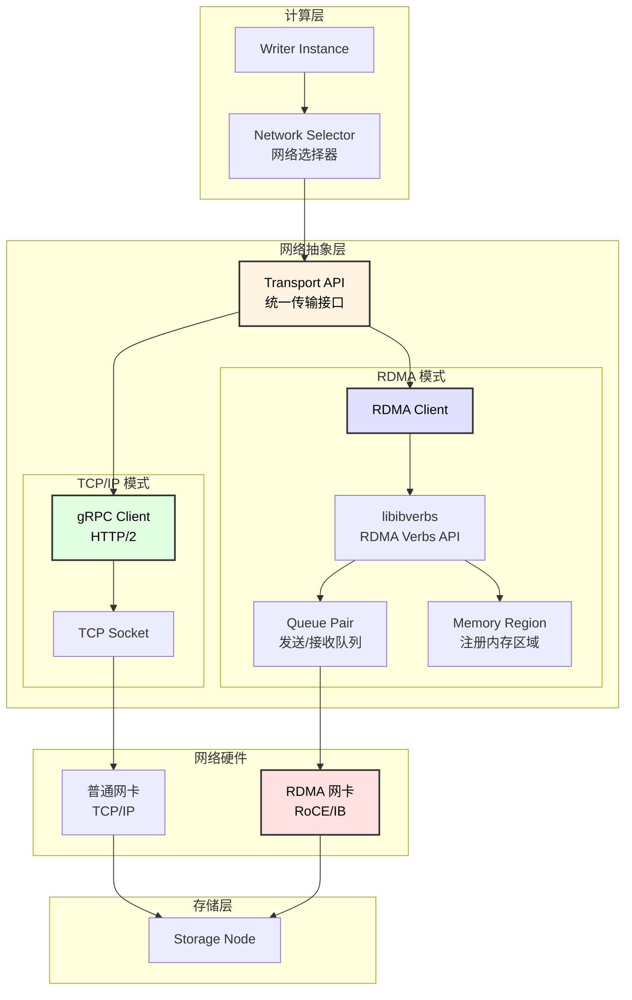
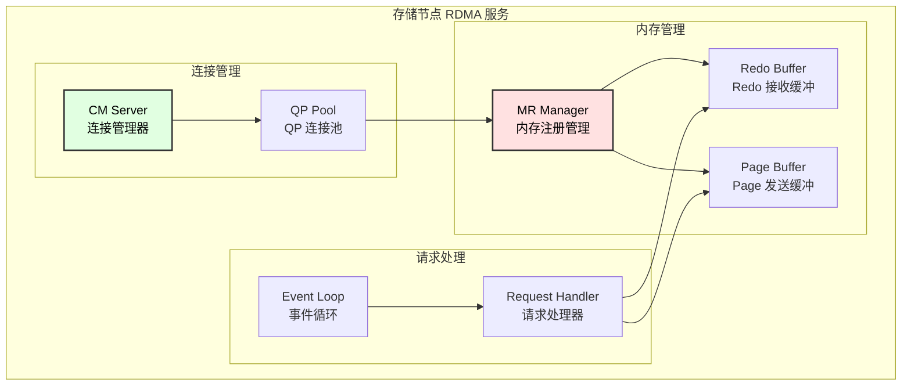
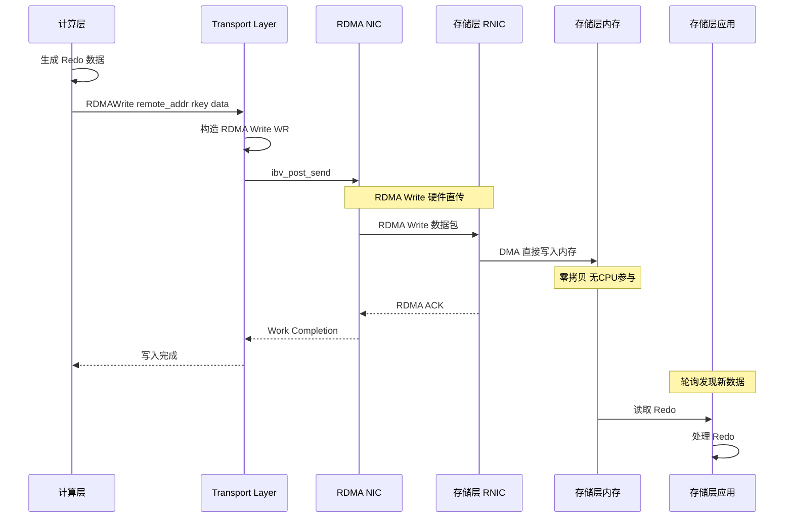
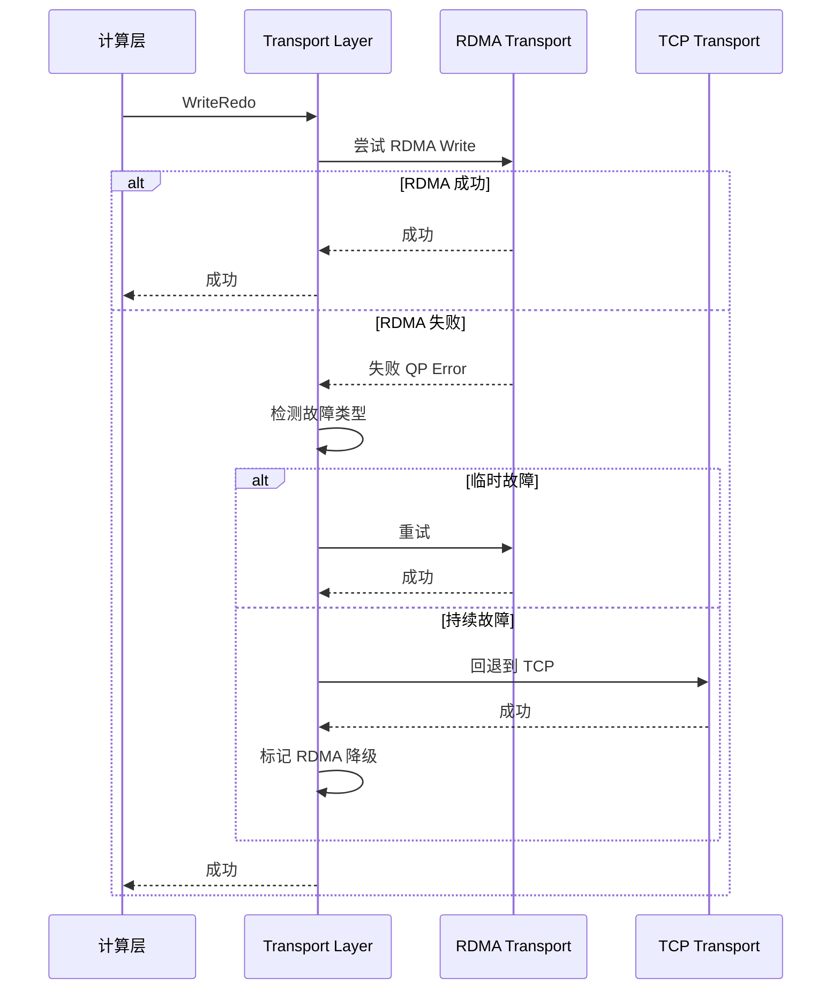

# 网络层设计文档

## 1. 概述

本系统网络层支持两种传输模式，可根据硬件环境选择：

| 模式 | 说明 | 适用场景 |
|------|------|----------|
| **TCP/IP + gRPC** | 标准网络，基于 gRPC/HTTP2 | 通用云环境、跨数据中心 |
| **RDMA** | 高性能网络，内核旁路、零拷贝 | 高性能本地集群、低延迟场景 |

### 1.1 性能对比

| 指标 | TCP/IP + gRPC | RDMA |
|------|---------------|------|
| **延迟** | 100-500 μs | 1-10 μs |
| **吞吐** | 1-10 Gbps | 25-200 Gbps |
| **CPU 开销** | 高（内核协议栈） | 极低（内核旁路） |
| **内存拷贝** | 多次拷贝 | 零拷贝 |
| **部署复杂度** | 低 | 高 |
| **成本** | 低 | 高 |

### 1.2 架构图



---

## 2. RDMA 基础概念

### 2.1 RDMA 技术栈

```
┌─────────────────────────────────────────────────────────────────────────────────┐
│                           RDMA 技术栈                                            │
├─────────────────────────────────────────────────────────────────────────────────┤
│                                                                                  │
│  应用层                                                                          │
│  ┌────────────────────────────────────────────────────────────────────────────┐ │
│  │                     Aurora Transport Layer                                  │ │
│  │                 (统一封装 RDMA 和 TCP/IP)                                   │ │
│  └────────────────────────────────────────────────────────────────────────────┘ │
│                                    │                                             │
│                                    ▼                                             │
│  RDMA 库层                                                                       │
│  ┌────────────────────────────────────────────────────────────────────────────┐ │
│  │  libibverbs  │  librdmacm  │  libibumad  │  libibmad                       │ │
│  │  (核心 API)  │  (连接管理)  │  (用户态管理) │  (管理)                        │ │
│  └────────────────────────────────────────────────────────────────────────────┘ │
│                                    │                                             │
│                                    ▼                                             │
│  驱动层                                                                          │
│  ┌────────────────────────────────────────────────────────────────────────────┐ │
│  │         mlx5_core (Mellanox)  │  hfi1 (Intel OPA)  │  rxe (软件模拟)       │ │
│  └────────────────────────────────────────────────────────────────────────────┘ │
│                                    │                                             │
│                                    ▼                                             │
│  硬件层                                                                          │
│  ┌────────────────────────────────────────────────────────────────────────────┐ │
│  │     InfiniBand HCA      │     RoCE NIC (以太网)      │     iWARP NIC       │ │
│  │   (专用 RDMA 网卡)       │   (RDMA over Ethernet)     │  (RDMA over TCP)    │ │
│  └────────────────────────────────────────────────────────────────────────────┘ │
│                                                                                  │
└─────────────────────────────────────────────────────────────────────────────────┘
```

### 2.2 核心概念

| 概念 | 说明 |
|------|------|
| **Queue Pair (QP)** | 发送队列 + 接收队列，RDMA 通信的基本单元 |
| **Completion Queue (CQ)** | 完成队列，存放操作完成通知 |
| **Memory Region (MR)** | 注册到 RDMA 设备的内存区域，支持远程访问 |
| **Protection Domain (PD)** | 保护域，隔离不同的 RDMA 资源 |
| **Work Request (WR)** | 工作请求，描述 RDMA 操作 |
| **Work Completion (WC)** | 工作完成，操作完成通知 |

### 2.3 RDMA 操作类型

| 操作 | 说明 | 用途 |
|------|------|------|
| **SEND/RECV** | 双边操作，需要双方参与 | 小消息、控制消息 |
| **RDMA Write** | 单边写，直接写入远端内存 | Redo 写入 |
| **RDMA Read** | 单边读，直接读取远端内存 | Page 读取 |
| **Atomic** | 原子操作（CAS, FAA） | 分布式锁、计数器 |

---

## 3. 传输抽象层设计

### 3.1 统一接口定义

```cpp
// transport.h

namespace aurora {
namespace transport {

// 传输类型
enum class TransportType {
    TCP_GRPC,    // TCP/IP + gRPC
    RDMA_RC,     // RDMA Reliable Connection
    RDMA_UD,     // RDMA Unreliable Datagram
};

// 传输配置
struct TransportConfig {
    TransportType type;
    std::string local_addr;
    int local_port;
    
    // TCP/gRPC 配置
    struct {
        int max_connections;
        int keepalive_time_ms;
        int max_message_size;
    } tcp;
    
    // RDMA 配置
    struct {
        std::string device_name;     // 如 "mlx5_0"
        int port_num;                // IB 端口号
        int gid_index;               // GID 索引
        int max_qp_wr;               // QP 最大 WR 数
        int max_cq_entries;          // CQ 最大条目数
        int max_send_sge;            // 最大发送 SGE
        int max_recv_sge;            // 最大接收 SGE
        size_t inline_size;          // 内联数据大小
        bool use_srq;                // 是否使用共享接收队列
    } rdma;
};

// 抽象传输接口
class Transport {
public:
    virtual ~Transport() = default;
    
    // 初始化
    virtual Status Initialize(const TransportConfig& config) = 0;
    
    // 连接管理
    virtual Status Connect(const std::string& remote_addr, int port) = 0;
    virtual Status Disconnect(const std::string& remote_addr) = 0;
    
    // 发送/接收（同步）
    virtual Status Send(const std::string& remote_addr, 
                       const void* data, size_t len) = 0;
    virtual Status Recv(std::string* remote_addr,
                       void* buf, size_t* len, int timeout_ms) = 0;
    
    // 发送/接收（异步）
    virtual Status SendAsync(const std::string& remote_addr,
                            const void* data, size_t len,
                            SendCallback callback) = 0;
    virtual Status RecvAsync(RecvCallback callback) = 0;
    
    // RDMA 单边操作（仅 RDMA 模式）
    virtual Status RDMAWrite(const std::string& remote_addr,
                            uint64_t remote_addr_ptr,
                            uint32_t remote_rkey,
                            const void* local_data, size_t len) = 0;
    virtual Status RDMARead(const std::string& remote_addr,
                           uint64_t remote_addr_ptr,
                           uint32_t remote_rkey,
                           void* local_buf, size_t len) = 0;
    
    // 获取本地内存注册信息（仅 RDMA 模式）
    virtual Status RegisterMemory(void* addr, size_t len,
                                 uint64_t* lkey, uint64_t* rkey) = 0;
    virtual Status DeregisterMemory(uint64_t lkey) = 0;
    
    // 状态查询
    virtual bool IsConnected(const std::string& remote_addr) = 0;
    virtual TransportType GetType() const = 0;
    virtual std::string GetStats() const = 0;
    
    // 关闭
    virtual void Shutdown() = 0;
};

// 工厂方法
std::unique_ptr<Transport> CreateTransport(TransportType type);

}  // namespace transport
}  // namespace aurora
```

### 3.2 TCP/gRPC 实现

```cpp
// tcp_transport.cc

class TCPTransport : public Transport {
public:
    Status Initialize(const TransportConfig& config) override {
        // 初始化 gRPC 通道选项
        grpc::ChannelArguments args;
        args.SetMaxReceiveMessageSize(config.tcp.max_message_size);
        args.SetInt(GRPC_ARG_KEEPALIVE_TIME_MS, config.tcp.keepalive_time_ms);
        
        config_ = config;
        return Status::OK();
    }
    
    Status Connect(const std::string& remote_addr, int port) override {
        std::string target = remote_addr + ":" + std::to_string(port);
        
        auto channel = grpc::CreateChannel(target, 
            grpc::InsecureChannelCredentials());
        
        auto stub = StorageService::NewStub(channel);
        
        std::lock_guard<std::mutex> lock(mutex_);
        stubs_[remote_addr] = std::move(stub);
        
        return Status::OK();
    }
    
    Status Send(const std::string& remote_addr,
               const void* data, size_t len) override {
        std::lock_guard<std::mutex> lock(mutex_);
        auto it = stubs_.find(remote_addr);
        if (it == stubs_.end()) {
            return Status::NotConnected();
        }
        
        // 通过 gRPC 发送
        WriteRedoRequest request;
        request.set_data(data, len);
        
        WriteRedoResponse response;
        grpc::ClientContext context;
        
        grpc::Status status = it->second->WriteRedo(&context, request, &response);
        
        if (status.ok()) {
            return Status::OK();
        }
        return Status::Error(status.error_message());
    }
    
    // RDMA 操作在 TCP 模式下不支持
    Status RDMAWrite(...) override {
        return Status::NotSupported("RDMA not supported in TCP mode");
    }
    
    Status RDMARead(...) override {
        return Status::NotSupported("RDMA not supported in TCP mode");
    }
    
private:
    TransportConfig config_;
    std::map<std::string, std::unique_ptr<StorageService::Stub>> stubs_;
    std::mutex mutex_;
};
```

### 3.3 RDMA 实现

```cpp
// rdma_transport.cc

class RDMATransport : public Transport {
public:
    Status Initialize(const TransportConfig& config) override {
        config_ = config;
        
        // 1. 获取 RDMA 设备列表
        int num_devices;
        struct ibv_device** dev_list = ibv_get_device_list(&num_devices);
        if (!dev_list || num_devices == 0) {
            return Status::Error("No RDMA devices found");
        }
        
        // 2. 打开指定设备
        struct ibv_device* device = nullptr;
        for (int i = 0; i < num_devices; i++) {
            if (config.rdma.device_name == ibv_get_device_name(dev_list[i])) {
                device = dev_list[i];
                break;
            }
        }
        
        if (!device) {
            ibv_free_device_list(dev_list);
            return Status::Error("Device not found: " + config.rdma.device_name);
        }
        
        ctx_ = ibv_open_device(device);
        ibv_free_device_list(dev_list);
        
        if (!ctx_) {
            return Status::Error("Failed to open device");
        }
        
        // 3. 分配 Protection Domain
        pd_ = ibv_alloc_pd(ctx_);
        if (!pd_) {
            return Status::Error("Failed to allocate PD");
        }
        
        // 4. 创建 Completion Queue
        cq_ = ibv_create_cq(ctx_, config.rdma.max_cq_entries, nullptr, nullptr, 0);
        if (!cq_) {
            return Status::Error("Failed to create CQ");
        }
        
        // 5. 查询端口属性
        if (ibv_query_port(ctx_, config.rdma.port_num, &port_attr_)) {
            return Status::Error("Failed to query port");
        }
        
        return Status::OK();
    }
    
    Status Connect(const std::string& remote_addr, int port) override {
        // 1. 创建 Queue Pair
        struct ibv_qp_init_attr qp_init_attr = {};
        qp_init_attr.send_cq = cq_;
        qp_init_attr.recv_cq = cq_;
        qp_init_attr.qp_type = IBV_QPT_RC;  // Reliable Connection
        qp_init_attr.cap.max_send_wr = config_.rdma.max_qp_wr;
        qp_init_attr.cap.max_recv_wr = config_.rdma.max_qp_wr;
        qp_init_attr.cap.max_send_sge = config_.rdma.max_send_sge;
        qp_init_attr.cap.max_recv_sge = config_.rdma.max_recv_sge;
        qp_init_attr.cap.max_inline_data = config_.rdma.inline_size;
        
        struct ibv_qp* qp = ibv_create_qp(pd_, &qp_init_attr);
        if (!qp) {
            return Status::Error("Failed to create QP");
        }
        
        // 2. 修改 QP 状态: RESET -> INIT
        struct ibv_qp_attr attr = {};
        attr.qp_state = IBV_QPS_INIT;
        attr.port_num = config_.rdma.port_num;
        attr.pkey_index = 0;
        attr.qp_access_flags = IBV_ACCESS_LOCAL_WRITE | 
                               IBV_ACCESS_REMOTE_READ |
                               IBV_ACCESS_REMOTE_WRITE;
        
        if (ibv_modify_qp(qp, &attr, 
                IBV_QP_STATE | IBV_QP_PKEY_INDEX | 
                IBV_QP_PORT | IBV_QP_ACCESS_FLAGS)) {
            return Status::Error("Failed to modify QP to INIT");
        }
        
        // 3. 交换 QP 信息（通过 TCP 辅助通道）
        QPInfo local_info = GetLocalQPInfo(qp);
        QPInfo remote_info;
        
        if (!ExchangeQPInfo(remote_addr, port, local_info, &remote_info)) {
            return Status::Error("Failed to exchange QP info");
        }
        
        // 4. 修改 QP 状态: INIT -> RTR
        memset(&attr, 0, sizeof(attr));
        attr.qp_state = IBV_QPS_RTR;
        attr.path_mtu = port_attr_.active_mtu;
        attr.dest_qp_num = remote_info.qp_num;
        attr.rq_psn = remote_info.psn;
        attr.max_dest_rd_atomic = 16;
        attr.min_rnr_timer = 12;
        attr.ah_attr.is_global = 1;
        attr.ah_attr.dlid = remote_info.lid;
        attr.ah_attr.sl = 0;
        attr.ah_attr.src_path_bits = 0;
        attr.ah_attr.port_num = config_.rdma.port_num;
        attr.ah_attr.grh.dgid = remote_info.gid;
        attr.ah_attr.grh.flow_label = 0;
        attr.ah_attr.grh.hop_limit = 64;
        attr.ah_attr.grh.sgid_index = config_.rdma.gid_index;
        
        if (ibv_modify_qp(qp, &attr,
                IBV_QP_STATE | IBV_QP_AV | IBV_QP_PATH_MTU |
                IBV_QP_DEST_QPN | IBV_QP_RQ_PSN |
                IBV_QP_MAX_DEST_RD_ATOMIC | IBV_QP_MIN_RNR_TIMER)) {
            return Status::Error("Failed to modify QP to RTR");
        }
        
        // 5. 修改 QP 状态: RTR -> RTS
        memset(&attr, 0, sizeof(attr));
        attr.qp_state = IBV_QPS_RTS;
        attr.timeout = 14;
        attr.retry_cnt = 7;
        attr.rnr_retry = 7;
        attr.sq_psn = local_info.psn;
        attr.max_rd_atomic = 16;
        
        if (ibv_modify_qp(qp, &attr,
                IBV_QP_STATE | IBV_QP_TIMEOUT | IBV_QP_RETRY_CNT |
                IBV_QP_RNR_RETRY | IBV_QP_SQ_PSN | IBV_QP_MAX_QP_RD_ATOMIC)) {
            return Status::Error("Failed to modify QP to RTS");
        }
        
        // 6. 保存连接信息
        std::lock_guard<std::mutex> lock(mutex_);
        connections_[remote_addr] = {qp, remote_info};
        
        return Status::OK();
    }
    
    Status RDMAWrite(const std::string& remote_addr,
                    uint64_t remote_addr_ptr,
                    uint32_t remote_rkey,
                    const void* local_data, size_t len) override {
        std::lock_guard<std::mutex> lock(mutex_);
        auto it = connections_.find(remote_addr);
        if (it == connections_.end()) {
            return Status::NotConnected();
        }
        
        struct ibv_qp* qp = it->second.qp;
        
        // 注册本地内存（如果未注册）
        struct ibv_mr* mr = GetOrRegisterMR(local_data, len);
        if (!mr) {
            return Status::Error("Failed to register memory");
        }
        
        // 构造 RDMA Write 请求
        struct ibv_sge sge = {};
        sge.addr = (uint64_t)local_data;
        sge.length = len;
        sge.lkey = mr->lkey;
        
        struct ibv_send_wr wr = {};
        wr.wr_id = GenerateWRID();
        wr.opcode = IBV_WR_RDMA_WRITE;
        wr.send_flags = IBV_SEND_SIGNALED;
        wr.sg_list = &sge;
        wr.num_sge = 1;
        wr.wr.rdma.remote_addr = remote_addr_ptr;
        wr.wr.rdma.rkey = remote_rkey;
        
        struct ibv_send_wr* bad_wr;
        if (ibv_post_send(qp, &wr, &bad_wr)) {
            return Status::Error("Failed to post RDMA write");
        }
        
        // 等待完成
        struct ibv_wc wc;
        int ret;
        do {
            ret = ibv_poll_cq(cq_, 1, &wc);
        } while (ret == 0);
        
        if (ret < 0 || wc.status != IBV_WC_SUCCESS) {
            return Status::Error("RDMA write failed: " + 
                                std::to_string(wc.status));
        }
        
        return Status::OK();
    }
    
    Status RDMARead(const std::string& remote_addr,
                   uint64_t remote_addr_ptr,
                   uint32_t remote_rkey,
                   void* local_buf, size_t len) override {
        // 类似 RDMAWrite，使用 IBV_WR_RDMA_READ
        // ...
    }
    
    Status RegisterMemory(void* addr, size_t len,
                         uint64_t* lkey, uint64_t* rkey) override {
        struct ibv_mr* mr = ibv_reg_mr(pd_, addr, len,
            IBV_ACCESS_LOCAL_WRITE | 
            IBV_ACCESS_REMOTE_READ |
            IBV_ACCESS_REMOTE_WRITE);
        
        if (!mr) {
            return Status::Error("Failed to register memory");
        }
        
        *lkey = mr->lkey;
        *rkey = mr->rkey;
        
        std::lock_guard<std::mutex> lock(mutex_);
        memory_regions_[mr->lkey] = mr;
        
        return Status::OK();
    }

private:
    struct ibv_context* ctx_ = nullptr;
    struct ibv_pd* pd_ = nullptr;
    struct ibv_cq* cq_ = nullptr;
    struct ibv_port_attr port_attr_;
    TransportConfig config_;
    
    struct Connection {
        struct ibv_qp* qp;
        QPInfo remote_info;
    };
    
    std::map<std::string, Connection> connections_;
    std::map<uint32_t, struct ibv_mr*> memory_regions_;
    std::mutex mutex_;
};
```

---

## 4. RDMA 优化设计

### 4.1 内存池设计

```cpp
// rdma_memory_pool.h

class RDMAMemoryPool {
public:
    struct MemoryBlock {
        void* addr;
        size_t size;
        uint32_t lkey;
        uint32_t rkey;
        bool in_use;
    };
    
    RDMAMemoryPool(struct ibv_pd* pd, size_t block_size, int num_blocks)
        : pd_(pd), block_size_(block_size) {
        
        // 分配大块连续内存
        size_t total_size = block_size * num_blocks;
        pool_base_ = aligned_alloc(4096, total_size);  // 页对齐
        
        // 注册整个内存池到 RDMA
        mr_ = ibv_reg_mr(pd_, pool_base_, total_size,
            IBV_ACCESS_LOCAL_WRITE |
            IBV_ACCESS_REMOTE_READ |
            IBV_ACCESS_REMOTE_WRITE);
        
        // 分割成块
        for (int i = 0; i < num_blocks; i++) {
            MemoryBlock block;
            block.addr = (char*)pool_base_ + i * block_size;
            block.size = block_size;
            block.lkey = mr_->lkey;
            block.rkey = mr_->rkey;
            block.in_use = false;
            free_blocks_.push_back(block);
        }
    }
    
    MemoryBlock* Allocate() {
        std::lock_guard<std::mutex> lock(mutex_);
        if (free_blocks_.empty()) {
            return nullptr;
        }
        
        MemoryBlock* block = &free_blocks_.back();
        block->in_use = true;
        used_blocks_.push_back(*block);
        free_blocks_.pop_back();
        
        return &used_blocks_.back();
    }
    
    void Free(MemoryBlock* block) {
        std::lock_guard<std::mutex> lock(mutex_);
        block->in_use = false;
        free_blocks_.push_back(*block);
    }
    
private:
    struct ibv_pd* pd_;
    struct ibv_mr* mr_;
    void* pool_base_;
    size_t block_size_;
    std::list<MemoryBlock> free_blocks_;
    std::list<MemoryBlock> used_blocks_;
    std::mutex mutex_;
};
```

### 4.2 批量操作优化

```cpp
// rdma_batch.h

class RDMABatchWriter {
public:
    RDMABatchWriter(RDMATransport* transport, int batch_size)
        : transport_(transport), batch_size_(batch_size) {}
    
    // 添加到批次
    void Add(const std::string& remote_addr,
            uint64_t remote_ptr, uint32_t rkey,
            const void* data, size_t len) {
        
        PendingWrite pw;
        pw.remote_addr = remote_addr;
        pw.remote_ptr = remote_ptr;
        pw.rkey = rkey;
        pw.data = data;
        pw.len = len;
        
        pending_.push_back(pw);
        
        if (pending_.size() >= batch_size_) {
            Flush();
        }
    }
    
    // 批量提交
    void Flush() {
        if (pending_.empty()) return;
        
        // 构造批量 WR
        std::vector<struct ibv_send_wr> wrs(pending_.size());
        std::vector<struct ibv_sge> sges(pending_.size());
        
        for (size_t i = 0; i < pending_.size(); i++) {
            auto& pw = pending_[i];
            
            sges[i].addr = (uint64_t)pw.data;
            sges[i].length = pw.len;
            sges[i].lkey = GetLKey(pw.data);
            
            wrs[i].wr_id = i;
            wrs[i].opcode = IBV_WR_RDMA_WRITE;
            wrs[i].send_flags = (i == pending_.size() - 1) ? 
                                IBV_SEND_SIGNALED : 0;  // 只有最后一个发信号
            wrs[i].sg_list = &sges[i];
            wrs[i].num_sge = 1;
            wrs[i].wr.rdma.remote_addr = pw.remote_ptr;
            wrs[i].wr.rdma.rkey = pw.rkey;
            
            if (i < pending_.size() - 1) {
                wrs[i].next = &wrs[i + 1];
            } else {
                wrs[i].next = nullptr;
            }
        }
        
        // 一次 post 提交所有
        struct ibv_send_wr* bad_wr;
        struct ibv_qp* qp = transport_->GetQP(pending_[0].remote_addr);
        
        if (ibv_post_send(qp, &wrs[0], &bad_wr) == 0) {
            // 只需等待一个完成（最后一个）
            transport_->WaitCompletion(1);
        }
        
        pending_.clear();
    }
    
private:
    struct PendingWrite {
        std::string remote_addr;
        uint64_t remote_ptr;
        uint32_t rkey;
        const void* data;
        size_t len;
    };
    
    RDMATransport* transport_;
    int batch_size_;
    std::vector<PendingWrite> pending_;
};
```

### 4.3 事件驱动模式

```cpp
// rdma_event_loop.h

class RDMAEventLoop {
public:
    RDMAEventLoop(struct ibv_cq* cq, int poll_batch = 16)
        : cq_(cq), poll_batch_(poll_batch), running_(false) {}
    
    void Start() {
        running_ = true;
        poll_thread_ = std::thread(&RDMAEventLoop::PollLoop, this);
    }
    
    void Stop() {
        running_ = false;
        if (poll_thread_.joinable()) {
            poll_thread_.join();
        }
    }
    
    // 注册完成回调
    void RegisterCallback(uint64_t wr_id, CompletionCallback cb) {
        std::lock_guard<std::mutex> lock(mutex_);
        callbacks_[wr_id] = std::move(cb);
    }
    
private:
    void PollLoop() {
        std::vector<struct ibv_wc> wcs(poll_batch_);
        
        while (running_) {
            int n = ibv_poll_cq(cq_, poll_batch_, wcs.data());
            
            if (n > 0) {
                for (int i = 0; i < n; i++) {
                    HandleCompletion(wcs[i]);
                }
            } else if (n < 0) {
                // 错误处理
                break;
            }
            
            // 短暂让出 CPU
            if (n == 0) {
                std::this_thread::yield();
            }
        }
    }
    
    void HandleCompletion(const struct ibv_wc& wc) {
        std::lock_guard<std::mutex> lock(mutex_);
        auto it = callbacks_.find(wc.wr_id);
        if (it != callbacks_.end()) {
            it->second(wc.status == IBV_WC_SUCCESS, wc);
            callbacks_.erase(it);
        }
    }
    
    struct ibv_cq* cq_;
    int poll_batch_;
    std::atomic<bool> running_;
    std::thread poll_thread_;
    std::map<uint64_t, CompletionCallback> callbacks_;
    std::mutex mutex_;
};
```

---

## 5. 存储层 RDMA 服务

### 5.1 RDMA 服务架构



### 5.2 存储层 RDMA 实现

```go
// storage_rdma_server.go

type RDMAStorageServer struct {
    config      *RDMAConfig
    device      *rdma.Device
    pd          *rdma.ProtectionDomain
    cq          *rdma.CompletionQueue
    
    // 内存区域
    redoMR      *rdma.MemoryRegion
    pageMR      *rdma.MemoryRegion
    
    // 连接管理
    connections map[string]*RDMAConnection
    
    // 处理器
    redoHandler *RedoHandler
    pageHandler *PageHandler
    
    mu          sync.RWMutex
}

type RDMAConnection struct {
    remoteAddr  string
    qp          *rdma.QueuePair
    state       ConnectionState
    createdAt   time.Time
}

func NewRDMAStorageServer(config *RDMAConfig) (*RDMAStorageServer, error) {
    server := &RDMAStorageServer{
        config:      config,
        connections: make(map[string]*RDMAConnection),
    }
    
    // 1. 打开 RDMA 设备
    devices, err := rdma.GetDeviceList()
    if err != nil {
        return nil, err
    }
    
    for _, dev := range devices {
        if dev.Name() == config.DeviceName {
            server.device = dev
            break
        }
    }
    
    // 2. 分配 Protection Domain
    server.pd, err = server.device.AllocPD()
    if err != nil {
        return nil, err
    }
    
    // 3. 创建 Completion Queue
    server.cq, err = server.device.CreateCQ(config.CQSize)
    if err != nil {
        return nil, err
    }
    
    // 4. 分配和注册 Redo 缓冲区
    redoBuffer := make([]byte, config.RedoBufferSize)
    server.redoMR, err = server.pd.RegisterMR(redoBuffer,
        rdma.AccessLocalWrite | rdma.AccessRemoteWrite)
    if err != nil {
        return nil, err
    }
    
    // 5. 分配和注册 Page 缓冲区
    pageBuffer := make([]byte, config.PageBufferSize)
    server.pageMR, err = server.pd.RegisterMR(pageBuffer,
        rdma.AccessLocalWrite | rdma.AccessRemoteRead)
    if err != nil {
        return nil, err
    }
    
    return server, nil
}

// 启动 RDMA 连接管理服务
func (s *RDMAStorageServer) Start() error {
    // 启动 CM（Connection Manager）监听
    listener, err := rdma.Listen(s.config.Address)
    if err != nil {
        return err
    }
    
    go s.acceptLoop(listener)
    go s.completionLoop()
    
    return nil
}

func (s *RDMAStorageServer) acceptLoop(listener *rdma.Listener) {
    for {
        // 接受新连接
        event, err := listener.GetEvent()
        if err != nil {
            continue
        }
        
        switch event.Type {
        case rdma.CMEventConnectRequest:
            // 处理连接请求
            s.handleConnectRequest(event)
        case rdma.CMEventEstablished:
            // 连接建立完成
            s.handleEstablished(event)
        case rdma.CMEventDisconnected:
            // 连接断开
            s.handleDisconnected(event)
        }
    }
}

func (s *RDMAStorageServer) completionLoop() {
    for {
        // 轮询 Completion Queue
        wcs, err := s.cq.Poll(16)
        if err != nil {
            continue
        }
        
        for _, wc := range wcs {
            s.handleCompletion(wc)
        }
    }
}

// 获取内存注册信息（供客户端 RDMA Write 使用）
func (s *RDMAStorageServer) GetMemoryInfo() *MemoryInfo {
    return &MemoryInfo{
        RedoAddr:  s.redoMR.Addr(),
        RedoRKey:  s.redoMR.RKey(),
        RedoSize:  s.config.RedoBufferSize,
        PageAddr:  s.pageMR.Addr(),
        PageRKey:  s.pageMR.RKey(),
        PageSize:  s.config.PageBufferSize,
    }
}
```

---

## 6. Redo 写入优化

### 6.1 RDMA Redo 写入流程



### 6.2 RDMA vs gRPC 延迟对比

```
┌─────────────────────────────────────────────────────────────────────────────────┐
│                         Redo 写入延迟对比                                        │
├─────────────────────────────────────────────────────────────────────────────────┤
│                                                                                  │
│  gRPC 模式 (TCP/IP):                                                            │
│  ┌──────────────────────────────────────────────────────────────────────────┐   │
│  │ App → 序列化 → 用户态 → 内核态 → TCP栈 → IP栈 → 驱动 → 网卡              │   │
│  │       5μs      10μs     20μs    30μs   10μs   10μs   5μs               │   │
│  │                              ↓ 网络传输 20μs ↓                            │   │
│  │ 网卡 → 驱动 → IP栈 → TCP栈 → 内核态 → 用户态 → 反序列化 → App            │   │
│  │ 5μs   10μs  10μs   30μs    20μs     10μs      5μs                      │   │
│  │                                                                          │   │
│  │ 总延迟: ~200 μs                                                          │   │
│  └──────────────────────────────────────────────────────────────────────────┘   │
│                                                                                  │
│  RDMA 模式:                                                                     │
│  ┌──────────────────────────────────────────────────────────────────────────┐   │
│  │ App → ibv_post_send → RNIC                                               │   │
│  │       1μs            0.5μs                                               │   │
│  │                   ↓ RDMA Write 2μs ↓                                     │   │
│  │                   RNIC → DMA → Memory                                    │   │
│  │                         0.5μs                                            │   │
│  │                   ↓ RDMA ACK 1μs ↓                                       │   │
│  │ RNIC → CQ → App                                                          │   │
│  │ 0.5μs 0.5μs                                                              │   │
│  │                                                                          │   │
│  │ 总延迟: ~5-10 μs                                                         │   │
│  └──────────────────────────────────────────────────────────────────────────┘   │
│                                                                                  │
│  延迟降低: 20-40 倍                                                             │
│                                                                                  │
└─────────────────────────────────────────────────────────────────────────────────┘
```

---

## 7. 配置与部署

### 7.1 配置文件

```yaml
# aurora_network_config.yaml

network:
  # 网络模式选择：tcp 或 rdma
  transport_type: "rdma"
  
  # TCP/gRPC 配置
  tcp:
    enabled: true
    port: 9002
    max_connections: 1000
    max_message_size: 16777216  # 16MB
    keepalive_time_ms: 30000
    compression: "gzip"
    
  # RDMA 配置
  rdma:
    enabled: true
    port: 9003
    device_name: "mlx5_0"      # RDMA 设备名
    ib_port: 1                  # IB 端口号
    gid_index: 0                # GID 索引（RoCEv2 通常为 0 或 3）
    
    # Queue Pair 配置
    max_qp_wr: 4096             # 每个 QP 最大 WR 数
    max_cq_entries: 16384       # CQ 最大条目数
    max_send_sge: 4             # 最大发送 SGE
    max_recv_sge: 4             # 最大接收 SGE
    inline_size: 256            # 内联数据大小
    
    # 内存配置
    redo_buffer_size: 268435456   # 256MB Redo 缓冲
    page_buffer_size: 1073741824  # 1GB Page 缓冲
    
    # 性能调优
    poll_batch_size: 32         # 轮询批次大小
    use_srq: true               # 使用共享接收队列
    srq_size: 8192              # SRQ 大小
    
    # 超时配置
    timeout: 14                 # 超时级别 (4.096 * 2^14 μs ≈ 67ms)
    retry_cnt: 7                # 重试次数
    rnr_retry: 7                # RNR 重试次数
```

### 7.2 启动参数

```ini
# my.cnf

[mysqld]
# 网络模式选择
aurora_transport_type = rdma    # tcp 或 rdma

# RDMA 配置
aurora_rdma_device = mlx5_0
aurora_rdma_port = 1
aurora_rdma_gid_index = 0
aurora_rdma_max_qp_wr = 4096
aurora_rdma_redo_buffer_mb = 256
aurora_rdma_page_buffer_mb = 1024

# TCP 备用配置（RDMA 故障时回退）
aurora_tcp_fallback = ON
aurora_tcp_port = 9002
```

### 7.3 部署要求

| 组件 | 要求 |
|------|------|
| **网卡** | Mellanox ConnectX-5/6 或 Intel E810（支持 RoCEv2） |
| **驱动** | MLNX_OFED 5.x+ 或 inbox RDMA 驱动 |
| **内核** | Linux 4.19+ |
| **库** | libibverbs, librdmacm |
| **网络** | 25Gbps+ 低延迟网络，启用 PFC/ECN |

### 7.4 环境检查脚本

```bash
#!/bin/bash
# check_rdma.sh

echo "=== RDMA 环境检查 ==="

# 检查 RDMA 设备
echo "1. 检查 RDMA 设备..."
ibv_devices
if [ $? -ne 0 ]; then
    echo "❌ 未找到 RDMA 设备"
    exit 1
fi
echo "✓ RDMA 设备正常"

# 检查设备详情
echo "2. 检查设备详情..."
ibv_devinfo

# 检查端口状态
echo "3. 检查端口状态..."
ibstat
if ! ibstat | grep -q "State: Active"; then
    echo "⚠️  端口未激活"
fi

# 检查 GID
echo "4. 检查 GID..."
show_gids

# 检查性能
echo "5. 运行性能测试..."
echo "服务端运行: ib_write_lat -d mlx5_0"
echo "客户端运行: ib_write_lat -d mlx5_0 <server_ip>"

echo "=== 检查完成 ==="
```

---

## 8. 监控指标

### 8.1 通用指标

| 指标 | 类型 | 说明 |
|------|------|------|
| `transport_type` | Gauge | 当前传输类型（0=tcp, 1=rdma） |
| `transport_send_total` | Counter | 发送总次数 |
| `transport_send_bytes_total` | Counter | 发送总字节数 |
| `transport_send_latency_us` | Histogram | 发送延迟（微秒） |
| `transport_recv_total` | Counter | 接收总次数 |
| `transport_errors_total` | Counter | 错误总数 |

### 8.2 RDMA 特有指标

| 指标 | 类型 | 说明 |
|------|------|------|
| `rdma_qp_count` | Gauge | 活跃 QP 数量 |
| `rdma_mr_count` | Gauge | 注册的 MR 数量 |
| `rdma_mr_bytes` | Gauge | 注册的内存大小 |
| `rdma_write_ops_total` | Counter | RDMA Write 操作数 |
| `rdma_read_ops_total` | Counter | RDMA Read 操作数 |
| `rdma_cq_poll_empty` | Counter | CQ 空轮询次数 |
| `rdma_inline_sends` | Counter | 内联发送次数 |
| `rdma_retransmits` | Counter | 重传次数 |

---

## 9. 故障处理

### 9.1 RDMA 故障回退



### 9.2 故障处理代码

```cpp
// transport_failover.cc

class TransportWithFailover {
public:
    Status Send(const std::string& remote, const void* data, size_t len) {
        if (use_rdma_ && rdma_healthy_) {
            auto status = rdma_transport_->Send(remote, data, len);
            if (status.ok()) {
                return status;
            }
            
            // RDMA 失败，检查是否需要降级
            consecutive_failures_++;
            if (consecutive_failures_ >= max_failures_) {
                LOG(WARNING) << "RDMA degraded, falling back to TCP";
                rdma_healthy_ = false;
                StartHealthCheck();
            }
        }
        
        // 使用 TCP
        return tcp_transport_->Send(remote, data, len);
    }
    
private:
    void StartHealthCheck() {
        // 后台定期检查 RDMA 健康状态
        health_check_thread_ = std::thread([this]() {
            while (!stopped_) {
                std::this_thread::sleep_for(std::chrono::seconds(10));
                
                if (CheckRDMAHealth()) {
                    LOG(INFO) << "RDMA recovered";
                    rdma_healthy_ = true;
                    consecutive_failures_ = 0;
                    break;
                }
            }
        });
    }
    
    bool CheckRDMAHealth() {
        // 发送测试消息
        char test_data[64] = "health_check";
        auto status = rdma_transport_->Send(
            health_check_target_, test_data, sizeof(test_data));
        return status.ok();
    }
    
    std::unique_ptr<Transport> rdma_transport_;
    std::unique_ptr<Transport> tcp_transport_;
    std::atomic<bool> use_rdma_{true};
    std::atomic<bool> rdma_healthy_{true};
    std::atomic<int> consecutive_failures_{0};
    int max_failures_ = 3;
    std::thread health_check_thread_;
    std::atomic<bool> stopped_{false};
};
```

---

## 10. 管理命令

```sql
-- 查看网络状态
SHOW AURORA NETWORK STATUS;
+------------------------+------------------+
| Variable_name          | Value            |
+------------------------+------------------+
| transport_type         | rdma             |
| rdma_device            | mlx5_0           |
| rdma_port              | 1                |
| rdma_state             | active           |
| rdma_qp_count          | 6                |
| rdma_mr_bytes          | 1342177280       |
| tcp_fallback_enabled   | ON               |
| tcp_fallback_active    | OFF              |
+------------------------+------------------+

-- 查看 RDMA 连接详情
SHOW AURORA RDMA CONNECTIONS;
+------------------+--------+-----------+-------------+------------+
| remote_addr      | qp_num | state     | send_bytes  | recv_bytes |
+------------------+--------+-----------+-------------+------------+
| 192.168.1.101    | 1234   | RTS       | 10737418240 | 5368709120 |
| 192.168.1.102    | 1235   | RTS       | 10737418240 | 5368709120 |
| 192.168.1.103    | 1236   | RTS       | 10737418240 | 5368709120 |
+------------------+--------+-----------+-------------+------------+

-- 查看 RDMA 性能统计
SHOW AURORA RDMA STATS;
+------------------------------+----------------+
| Stat_name                    | Value          |
+------------------------------+----------------+
| rdma_write_ops               | 1000000        |
| rdma_write_bytes             | 16000000000    |
| rdma_write_latency_avg_us    | 5.2            |
| rdma_write_latency_p99_us    | 12.0           |
| rdma_read_ops                | 500000         |
| rdma_inline_sends            | 800000         |
| rdma_retransmits             | 10             |
+------------------------------+----------------+

-- 手动切换网络模式
AURORA NETWORK SET MODE = tcp;
AURORA NETWORK SET MODE = rdma;

-- 重新初始化 RDMA
AURORA NETWORK RDMA REINIT;
```
